# Analisis exploratorio y visualizacion

> "Exploratory data analysis can never be the whole story, but nothing
else can serve as the foundation stone --as the first step."
> 
> --- John Tukey

> "The simple graph has brought more information to the data analyst’s mind 
than any other device." 
> 
> --- John Tukey

## El papel de la exploración en el análisis de datos {-}

El estándar científico para contestar preguntas o tomar decisiones es uno que se
basa en el análisis de datos. Es decir, en primer lugar se deben reunir todos
los datos disponibles que puedan contener o sugerir alguna guía para entender
mejor la pregunta o la decisión a la que nos enfrentamos. Esta recopilación de
datos ---que pueden ser cualitativos, cuantitativos, o una mezcla de los dos---
debe entonces ser analizada para extraer información relevante para nuestro
problema.


En análisis de datos existen dos distintos tipos de trabajo:

- El trabajo **exploratorio** o de **detective**: ¿cuáles son los aspectos importantes de estos datos?
¿qué indicaciones generales muestran los datos? ¿qué tareas de análisis debemos
empezar haciendo? ¿cuáles son los caminos generales para formular con precisión y 
contestar algunas preguntas que nos interesen? 

- El trabajo **inferencial**, **confirmatorio**, o de **juez**: ¿cómo evaluar el peso de 
la evidencia de los descubrimientos
del paso anterior? ¿qué tan bien soportadas están las respuestas y conclusiones 
por nuestro conjunto de datos? 


## Algunos conceptos básicos {-}

Empezamos explicando algunas ideas que no serán útiles más adelante.

Por ejemplo, los siguientes datos fueron registrados en un restaurante durante
cuatro días consecutivos:


```r
library(tidyverse)
library(patchwork)
source("R/funciones_auxiliares.R")
# usamos los datos tips del paquete reshape2
tips <- reshape2::tips
# renombramos variables y niveles
propinas <- tips %>% 
  rename(cuenta_total = total_bill, 
         propina = tip, sexo = sex, 
         fumador = smoker,
         dia = day, momento = time, 
         num_personas = size) %>% 
  mutate(sexo = recode(sexo, Female = "Mujer", Male = "Hombre"), 
         fumador = recode(fumador, No = "No", Si = "Si"),
         dia = recode(dia, Sun = "Dom", Sat = "Sab", Thur = "Jue", Fri = "Vie"),
         momento = recode(momento, Dinner = "Cena", Lunch = "Comida")) %>% 
  select(-sexo) %>% 
  mutate(dia  = fct_relevel(dia, c("Jue", "Vie", "Sab", "Dom")))
```

Y vemos una muestra


```r
sample_n(propinas, 10) 
```

```
##    cuenta_total propina fumador dia momento num_personas
## 1         17.26    2.74      No Dom    Cena            3
## 2         17.51    3.00     Yes Dom    Cena            2
## 3         28.17    6.50     Yes Sab    Cena            3
## 4         18.71    4.00     Yes Jue  Comida            3
## 5         11.61    3.39      No Sab    Cena            2
## 6         14.83    3.02      No Dom    Cena            2
## 7         25.21    4.29     Yes Sab    Cena            2
## 8         15.01    2.09     Yes Sab    Cena            2
## 9         25.29    4.71      No Dom    Cena            4
## 10        20.90    3.50     Yes Dom    Cena            3
```


Aquí la unidad de observación es una cuenta particular. Tenemos tres mediciones
numéricas de cada cuenta: cúanto fue la cuenta total, la propina, y el número de
personas asociadas a la cuenta. Los datos están separados según se fumó o no en
la mesa, y temporalmente en dos partes: el día (Jueves, Viernes, Sábado o
Domingo), cada uno separado por Cena y Comida.

<div class="mathblock">
<p>Denotamos por <span class="math inline">\(x\)</span> el valor de medición de una <em>unidad de observación.</em> Usualmente utilizamos sub-índices para identificar entre diferentes <em>puntos de datos</em> (observaciones), por ejemplo, <span class="math inline">\(x_n\)</span> para la <span class="math inline">\(n-\)</span>ésima observación. De tal forma que una colección de <span class="math inline">\(N\)</span> observaciones la escribimos como <span class="math display">\[\begin{align}
  \{x_1, \ldots, x_N\}.
\end{align}\]</span></p>
</div>

El primer tipo de comparaciones que nos interesa hacer es para una medición:
¿Varían mucho o poco los datos de un tipo  de medición? ¿Cuáles son valores
típicos o centrales? ¿Existen valores atípicos?

Supongamos entonces que consideramos simplemente la variable de `cuenta_total`.
Podemos comenzar por **ordenar los datos**, y ver cuáles datos están en los
extremos y cuáles están en los lugares centrales:

<div class="mathblock">
<p>En general la colección de datos no está ordenada por sus valores. Esto es debido a que las observaciones en general se recopilan de manera <em>aleatoria</em>. Utilizamos la notación de <span class="math inline">\(\sigma(n)\)</span> para denotar un <em>reordenamiento</em> de los datos de tal forma <span class="math display">\[
  \{x_{\sigma(1)}, \ldots, x_{\sigma(N)}\},
\]</span> y que satisface la siguiente serie de desigualdades <span class="math display">\[
  x_{\sigma(1)} \leq \ldots \leq x_{\sigma(N)}. 
\]</span></p>
</div>


```r
propinas <- propinas %>% 
  mutate(orden_cuenta = rank(cuenta_total, ties.method = "first"), 
         f = (orden_cuenta - 0.5) / n()) 
cuenta <- propinas %>% select(orden_cuenta, f, cuenta_total) %>% arrange(f)
bind_rows(head(cuenta), tail(cuenta)) %>% knitr::kable()
```


| orden_cuenta|         f| cuenta_total|
|------------:|---------:|------------:|
|            1| 0.0020492|         3.07|
|            2| 0.0061475|         5.75|
|            3| 0.0102459|         7.25|
|            4| 0.0143443|         7.25|
|            5| 0.0184426|         7.51|
|            6| 0.0225410|         7.56|
|          239| 0.9774590|        44.30|
|          240| 0.9815574|        45.35|
|          241| 0.9856557|        48.17|
|          242| 0.9897541|        48.27|
|          243| 0.9938525|        48.33|
|          244| 0.9979508|        50.81|


También podemos graficar los datos en orden, interpolando valores consecutivos.

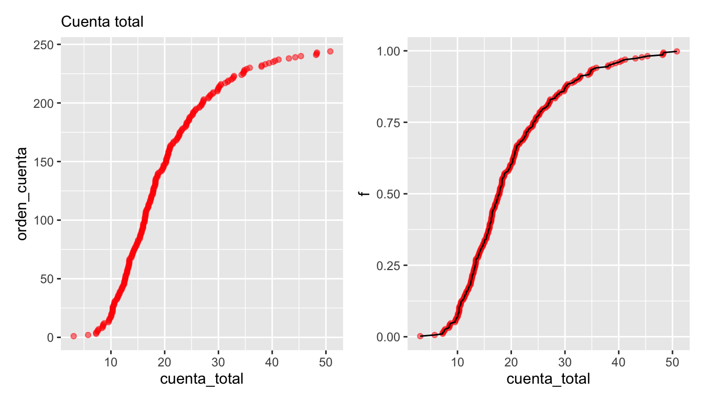

A esta función le llamamos la **función de cuantiles** para la variable
`cuenta_total`. Nos sirve para comparar directamente los distintos valores que
observamos los datos según el orden que ocupan.

<div class="mathblock">
<p>La función de cuantiles muestral esta definida por <span class="math display">\[
\hat{F}(x) = \frac1N \sum_{n = 1}^N \mathbb{1}\{x_n \leq x\},
\]</span> donde la funcion indicadora está definida por <span class="math display">\[
1\{ x \leq t\} = 
    \begin{cases}
      1,  \text{ si } x \leq t  \\
      0,  \text{ en otro caso}
    \end{cases}.
\]</span></p>
</div>

<div class="mathblock">
<p>El cuantil <span class="math inline">\(p\)</span> es el valor <span class="math inline">\(x = x(p)\)</span>, esta notación sirve para definir <span class="math inline">\(x\)</span> como una función de <span class="math inline">\(p,\)</span> tal que <span class="math display">\[ 
  \hat F(x) = p. 
\]</span> Es decir, <span class="math inline">\(x\)</span> acumula el <span class="math inline">\(p\)</span>-% de los casos.</p>
</div>

<div class="ejercicio">
<p>Para una medición de interés <span class="math inline">\(x\)</span> con posibles valores en el intervalo <span class="math inline">\([a, b]\)</span>.<br />
Comprueba que <span class="math inline">\(\hat F(a) = 0\)</span> y <span class="math inline">\(\hat F(b) = 1\)</span> para cualquier colección de datos de tamaño <span class="math inline">\(N.\)</span></p>
</div>


La gráfica anterior, también nos sirve para poder estudiar la **dispersión y
valores centrales** de los datos observados. Por ejemplo, podemos notar que:

- El **rango** de datos va de unos 3 dólares hasta 50 dólares
- Los **valores centrales** ---del cuantil 0.25 al 0.75, por decir un ejemplo--- están
entre unos 13 y 25 dólares
- El cuantil 0.5 (o también conocido como **mediana**) está alrededor de 18 dólares. 


<div class="ejercicio">
<p>¿Cómo definirías la mediana en términos de la función de cuantiles?<br />
<em>Pista:</em> Considera los casos por separado para <span class="math inline">\(N\)</span> impar o par.</p>
</div>


Éste último puede ser utilizado para dar un valor *central* de la distribución
de valores para `cuenta_total`. Asimismo podemos dar resúmenes más refinados si
es necesario. Por ejemplo, podemos reportar que:

- El cuantil 0.95 es de unos 35 dólares --- sólo 5\% de las cuentas son de más de 35 dólares
- El cuantil 0.05 es de unos 8 dólares --- sólo 5\% de las cuentas son de 8 dólares o menos.

Finalmente, la forma de la gráfica se interpreta usando su pendiente (tasa de
cambio) haciendo comparaciones en diferentes partes de la gráfica:

- La distribución de valores tiene asimetría: el 10\% de las cuentas más altas
tiene considerablemente más dispersión que el 10\% de las cuentas más bajas.

- Entre los cuantiles 0.2 y 0.5 es donde existe *mayor* densidad de datos: la
pendiente (tasa de cambio) es alta, lo que significa que al avanzar en los
valores observados, los cuantiles (el porcentaje de casos) aumenta rápidamente.

- Cuando la pendiente es casi plana, quiere decir que los datos tienen más
dispersión local o están más separados.

En algunos casos, es más natural hacer un **histograma**, donde dividimos el rango
de la variable en cubetas o intervalos (en este caso de igual longitud), y
graficamos por medio de barras cuántos datos caen en cada cubeta:

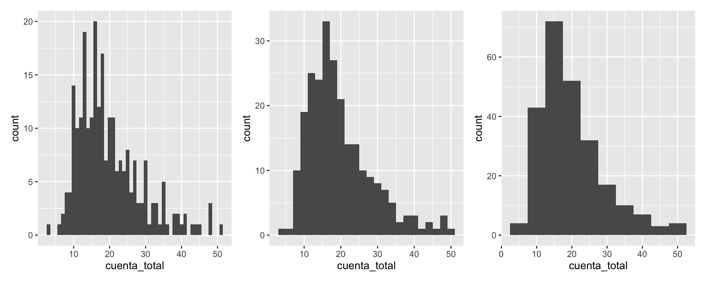

Es una gráfica más popular, pero perdemos cierto nivel de detalle, y distintas
particiones resaltan distintos aspectos de los datos.

Finalmente, una gráfica más compacta que resume la gráfica de cuantiles o el
histograma es el **diagrama de caja y brazos**. Mostramos dos versiones, la
clásica de Tukey (T) y otra versión menos común de Spear/Tufte (ST):


```r
library(ggthemes)
cuartiles <- quantile(cuenta$cuenta_total)
cuartiles
```

```
##      0%     25%     50%     75%    100% 
##  3.0700 13.3475 17.7950 24.1275 50.8100
```

```r
g_1 <- ggplot(cuenta, aes(x = f, y = cuenta_total)) + 
  labs(subtitle = "Gráfica de cuantiles: Cuenta total") +
  geom_hline(yintercept = cuartiles[2], colour = "gray") + 
  geom_hline(yintercept = cuartiles[3], colour = "gray") +
  geom_hline(yintercept = cuartiles[4], colour = "gray") +
  geom_point(alpha = 0.5) + geom_line() 
g_2 <- ggplot(cuenta, aes(x = factor("ST", levels =c("ST")), y = cuenta_total)) + 
  geom_tufteboxplot() +
  labs(subtitle = " ") +  xlab("") + ylab("")
g_3 <- ggplot(cuenta, aes(x = factor("T"), y = cuenta_total)) + geom_boxplot() +
  labs(subtitle = " ") +  xlab("") + ylab("")
g_4 <- ggplot(cuenta, aes(x = factor("P"), y = cuenta_total)) + geom_jitter(height = 0, width =0.2, alpha = 0.5) +
  labs(subtitle = " ") +  xlab("") + ylab("")
g_5 <- ggplot(cuenta, aes(x = factor("V"), y = cuenta_total)) + geom_violin() +
  labs(subtitle = " ") +  xlab("") + ylab("")
g_1 + g_2 + g_3 + g_4 + 
  plot_layout(widths = c(8, 2, 2, 2))
```

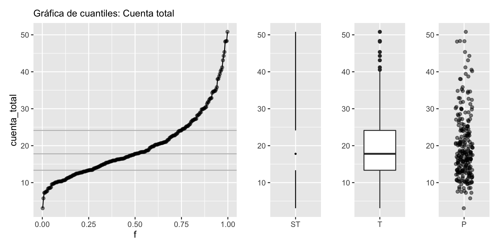

<div class="mathblock">
<p>Hasta ahora hemos utilizado la definición general de <em>cuantiles</em>. Donde consideramos el cuantil <span class="math inline">\(q\)</span>, para buscar <span class="math inline">\(x\)</span> tal que <span class="math inline">\(\hat F(x) = q.\)</span> Hay valores típicos de interés que corresponden a <span class="math inline">\(q\)</span> igual a 25%, 50% y 75%. Éstos valores se denominan <strong>cuartiles.</strong></p>
</div>

**Ventajas en el análisis inicial**

En un principio del análisis, estos resúmenes
(cuantiles) pueden ser más útiles que utilizar medias y varianzas, por ejemplo. La razón es
que los cuantiles:

- Son cantidades más fácilmente interpretables
- Los cuantiles centrales son más resistentes a valores atípicos que medias o varianzas
- Sin embargo, permite identificar valores extremos
- Es fácil comparar cuantiles de distintos bonches de datos


### Media y desviación estándar {-}

Las medidas más comunes de localización y dispersión para un conjunto
de datos son la media muestral y la [desviación estándar muestral](https://es.wikipedia.org/wiki/Desviación_t%C3%ADpica).

En general, no son muy apropiadas para iniciar el análisis exploratorio,
pues:

- Son medidas más difíciles de interpretar y explicar que los cuantiles. En este
sentido, son medidas especializadas. Por ejemplo, intenta explicar
intuitivamente qué es la media.
- No son resistentes a valores atípicos o erróneos. Su falta de resistencia los
vuelve poco útiles en las primeras etapas de limpieza y descripción.

<div class="mathblock">
<p>La media, o promedio, se denota por <span class="math inline">\(\bar x\)</span> y se define como <span class="math display">\[
\bar x = \frac1N \sum_{n = 1}^N x_n. 
\]</span> La desviación estándar muestral se define como <span class="math display">\[
\text{std}(x) = \sqrt{\frac1{N-1} \sum_{n = 1}^N (x_n - \bar x)^2}. 
\]</span></p>
</div>


Sin embargo,

- La media y desviación estándar son computacionalmente convenientes. 
- Para el trabajo de modelado estas medidas de resumen tienen ventajas claras
(bajo ciertos supuestos teóricos).
- En muchas ocasiones conviene usar estas medidas pues permite hacer
comparaciones históricas o tradicionales ---pues análisis anteriores pudieran
estar basados en éstas.

<div class="ejercicio">
<ol style="list-style-type: decimal">
<li><p>Considera el caso de tener <span class="math inline">\(N\)</span> observaciones y asume que ya tienes calculado el promedio para dichas observaciones. Este promedio lo denotaremos por <span class="math inline">\(\bar x_N\)</span>. Ahora, considera que has obtenido <span class="math inline">\(M\)</span> observaciones más. Escribe una fórmula recursiva para la media del conjunto total de datos <span class="math inline">\(\bar x_{N+M}\)</span> en función de lo que ya tenías precalculado <span class="math inline">\(\bar x_N.\)</span></p></li>
<li><p>¿En qué situaciones esta propiedad puede ser conveniente?</p></li>
</ol>
</div>

## Ejemplos {-}

### Precios de casas {-}

En este ejemplo consideremos los [datos de precios de ventas de la ciudad de Ames, Iowa](https://www.kaggle.com/prevek18/ames-housing-dataset).
En particular nos interesa entender la variación del precio de las casas.


Por este motivo calculamos los cuantiles que corresponden al 25\%, 50\% y 75\%
(**cuartiles**), así como el mínimo y máximo de los precios de
las casas:


```r
quantile(casas %>% pull(precio_miles)) 
```

```
##    0%   25%   50%   75%  100% 
##  37.9 132.0 165.0 215.0 755.0
```

<div class="ejercicio">
<p>Comprueba que el mínimo y máximo están asociados a los cuantiles 0% y 100%, respectivamente.</p>
</div>

Una posible comparación es considerar los precios y sus variación en función de
zona de la ciudad en que se encuentra una vivienda. Podemos usar diagramas de
caja y brazos para hacer una **comparación burda** de los precios en distintas
zonas de la ciudad:


```r
ggplot(casas, aes(x = nombre_zona, y = precio_miles)) + geom_boxplot() + coord_flip()
```

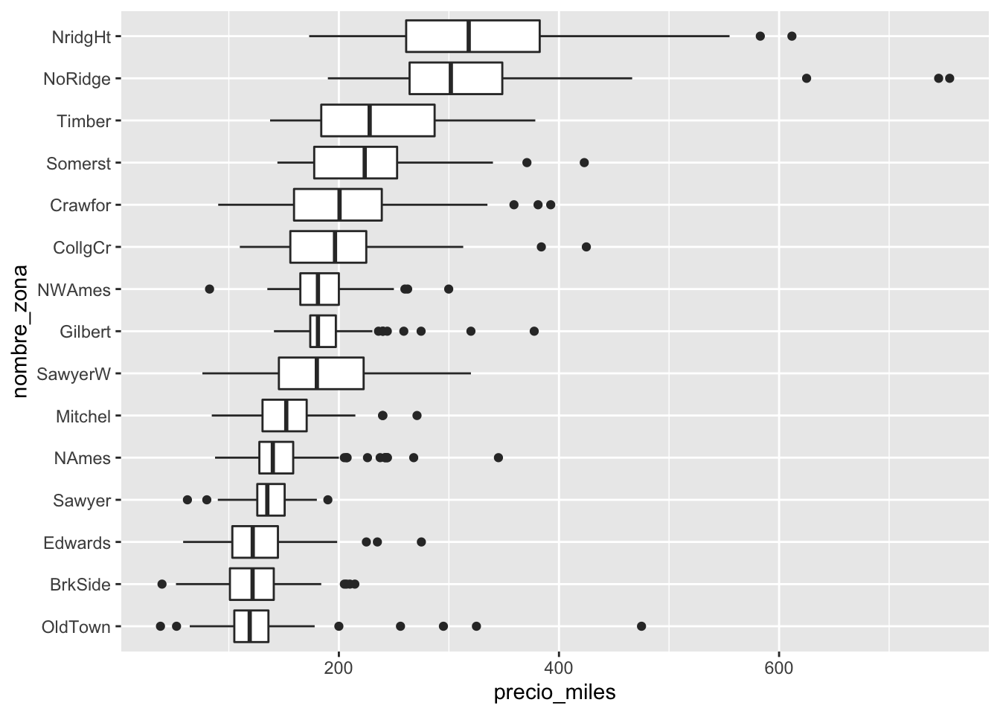

La primera pregunta que nos hacemos es cómo pueden variar las características de
las casas dentro de cada zona. Para esto, podemos considerar el área de las
casas. En lugar de graficar el precio, graficamos el precio por metro cuadrado,
por ejemplo:


```r
ggplot(casas, aes(x = nombre_zona, y = precio_m2)) + geom_boxplot() + coord_flip()
```

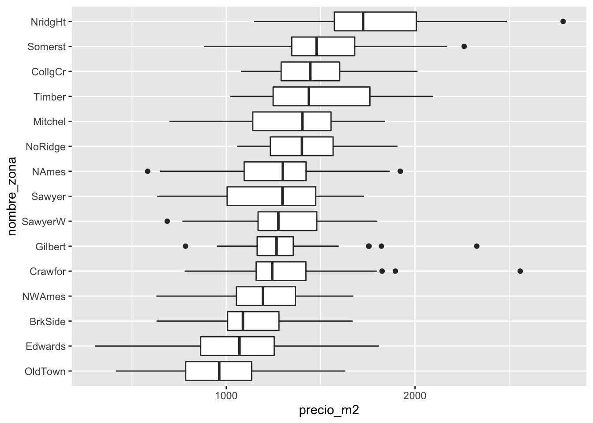


Podemos cuantificar la variación que observamos de zona a zona y la variación
que hay dentro de cada una de las zonas. Una primera aproximación es observar
las variación del precio al calcular la mediana dentro de cada zona, y después
cuantificar por medio de cuantiles cómo varía la mediana entre zonas:


```r
casas %>% group_by(nombre_zona) %>% 
  summarise(mediana_zona = median(precio_m2)) %>% 
  pull(mediana_zona) %>% quantile %>% round
```

```
## `summarise()` ungrouping output (override with `.groups` argument)
```

```
##   0%  25%  50%  75% 100% 
##  963 1219 1298 1420 1725
```

<div class="mathblock">
<p>Tratar con datos por segmento es una situación común en aplicaciones. Usualmente denotamos por <span class="math display">\[
  x_{k, n}
\]</span> a la <span class="math inline">\(n\)</span>-ésima observación del <span class="math inline">\(k\)</span>-ésimo grupo. Usualmente tenemos un universo de <span class="math inline">\(K\)</span> posibles grupos y para cada grupo tenemos un total diferente de observaciones. Esto lo denotamos por <span class="math inline">\(N_k\)</span>, el número total de observaciones del grupo <span class="math inline">\(k\)</span> para cualquier <span class="math inline">\(k = 1, \ldots, K.\)</span> El número total de muestras lo denotamos por <span class="math inline">\(N\)</span>, donde <span class="math display">\[
  N = \sum_{k=1}^K N_k. 
\]</span> Finalmente, nos puede interesar, como en el ejemplo, los promedios por grupo <span class="math display">\[ 
  \bar x_k = \frac{1}{N_k} \sum_{n = 1}^{N_k} x_{k, n}, 
\]</span> y contrastar contra el promedio total <span class="math display">\[
  \bar x = \frac1K \sum_{k = 1}^K \bar x_k = \frac1K \sum_{k = 1}^K \left( \frac{1}{N_k} \sum_{n = 1}^{N_k} x_{k, n} \right).
\]</span></p>
</div>

Por otro lado, las variaciones con respecto a las medianas **dentro** de cada
zona, por grupo, se resume como:


```r
quantile(casas %>% group_by(nombre_zona) %>% 
  mutate(residual = precio_m2 - median(precio_m2)) %>% 
  pull(residual)) %>% round
```

```
##   0%  25%  50%  75% 100% 
## -765 -166    0  172 1314
```

Nótese que este último paso tiene sentido pues la variación dentro de las zonas,
en términos de precio por metro cuadrado, es similar. Esto no lo podríamos haber
hecho de manera efectiva si se hubiera utilizado el precio de las casas sin
ajustar por su tamaño.

Vemos que la mayor parte de la variación del precio por metro cuadrado ocurre
dentro de cada zona, una vez que controlamos por el tamaño de las casas. La
variación dentro de cada zona es aproximadamente simétrica, aunque la cola
derecha es ligeramente más larga con algunos valores extremos.

Podemos seguir con otro indicador importante: la calificación de calidad de los terminados
de las casas. Como primer intento podríamos hacer:

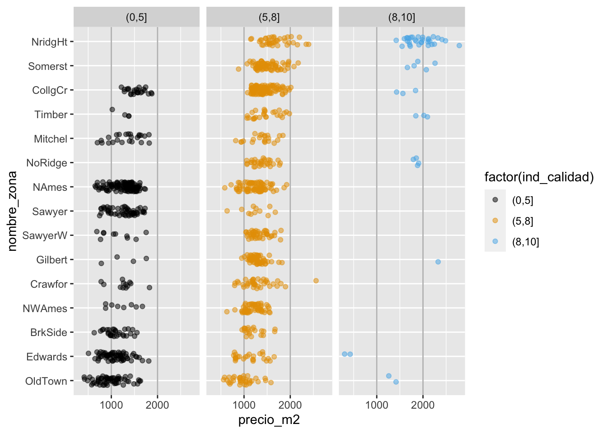

Lo que indica que las calificaciones de calidad están distribuidas de manera
muy distinta a lo largo de las zonas, y que probablemente no va ser simple
desentrañar qué variación del precio se debe a la zona y cuál se debe a la calidad.


### Prueba Enlace {-}

Consideremos la prueba Enlace (2011) de matemáticas para primarias. Una primera
pregunta que alguien podría hacerse es: ¿cuáles escuelas son mejores en este
rubro, las privadas o las públicas?


```r
enlace_tbl <- enlace %>% group_by(tipo) %>% 
    summarise(n_escuelas = n(),
              cuantiles = list(cuantil(mate_6, c(0.05, 0.25, 0.5, 0.75, 0.95)))) %>% 
    unnest(cols = cuantiles) %>% mutate(valor = round(valor)) 
enlace_tbl %>% 
  spread(cuantil, valor) %>% 
  formatear_tabla()
```


|tipo            | n_escuelas| 0.05| 0.25| 0.5| 0.75| 0.95|
|:---------------|----------:|----:|----:|---:|----:|----:|
|Indígena/Conafe |      13599|  304|  358| 412|  478|  588|
|General         |      60166|  380|  454| 502|  548|  631|
|Particular      |       6816|  479|  551| 593|  634|  703|


Para un análisis exploratorio podemos utilizar distintas gráficas. Por ejemplo,
podemos utilizar nuevamente las gráficas de caja y brazos, así como graficar los
percentiles. Nótese que en la gráfica 1 se utilizan los cuantiles 0.05, 0.25,
0.5, 0.75 y 0.95:


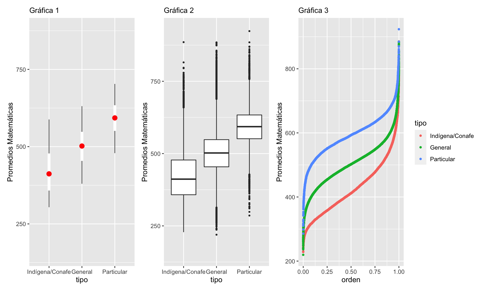

Se puede discutir qué tan apropiada es cada gráfica con el objetivo de realizar
comparaciones. Sin duda, graficar más cuantiles es más útil para hacer
comparaciones. Por ejemplo, en la Gráfica 1 podemos ver que la mediana de las
escuelas generales está cercana al cuantil 5\% de las escuelas particulares. Por
otro lado, el diagrama de caja y brazos muestra también valores "atípicos". Es
importante notar que una comparación más robusta se puede lograr por medio de
**pruebas de hipótesis**, las cuales veremos mas adelante en el curso.

Regresando a nuestro análisis exploratorio, notemos que la diferencia es
considerable entre tipos de escuela. Antes de contestar prematuramente la
pregunta: ¿cuáles son las mejores escuelas? busquemos mejorar la
interpretabilidad de nuestras comparaciones usando los principios 2 y 3.
Podemos comenzar por agregar, por ejemplo, el nivel del marginación del
municipio donde se encuentra la escuela.


Para este objetivo, podemos usar páneles (pequeños múltiplos útiles para hacer
comparaciones) y graficar:

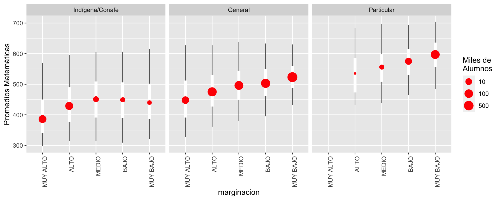


Esta gráfica pone en contexto la pregunta inicial, y permite evidenciar la dificultad 
de contestarla. En particular:

1. Señala que la pregunta no sólo debe concentarse en el tipo de "sistema":
pública, privada, etc. Por ejemplo, las escuelas públicas en zonas de marginación baja no
tienen una distribución de calificaciones muy distinta a las privadas en zonas
de marginación alta. 
2. El contexto de la escuela es importante.
3. Debemos de pensar qué factores --por ejemplo, el entorno familiar de los
estudiantes-- puede resultar en comparaciones que favorecen a las escuelas
privadas. Un ejemplo de esto es considerar si los estudiantes tienen que
trabajar o no. A su vez, esto puede o no ser reflejo de la calidad del sistema
educativo.
4. Si esto es cierto, entonces la pregunta inicial es demasiado vaga y mal
planteada. Quizá deberíamos intentar entender cuánto "aporta" cada escuela a
cada estudiante, como medida de qué tan buena es cada escuela.


### Estados y calificaciones en SAT {-}

¿Cómo se relaciona el gasto por alumno, a nivel estatal,
con sus resultados académicos? Hay trabajo
considerable en definir estos términos, pero supongamos que tenemos el
[siguiente conjunto de datos](http://jse.amstat.org/datasets/sat.txt) [@Guber], que son
datos oficiales agregados por `estado` de Estados Unidos. Consideremos el subconjunto de variables
`sat`, que es la calificación promedio de los alumnos en cada estado
(para 1997) y `expend`, que es el gasto en miles de dólares
por estudiante en (1994-1995). 


```r
sat <- read_csv("data/sat.csv")
sat_tbl <- sat %>% select(state, expend, sat) %>% 
    gather(variable, valor, expend:sat) %>% 
    group_by(variable) %>% 
    summarise(cuantiles = list(cuantil(valor))) %>% 
    unnest(cols = c(cuantiles)) %>% 
    mutate(valor = round(valor, 1)) %>% 
    spread(cuantil, valor)
sat_tbl %>% formatear_tabla
```

<table class="table table-striped table-hover table-condensed table-responsive" style="font-size: 15px; width: auto !important; margin-left: auto; margin-right: auto;">
 <thead>
  <tr>
   <th style="text-align:left;position: sticky; top:0; background-color: #FFFFFF;"> variable </th>
   <th style="text-align:right;position: sticky; top:0; background-color: #FFFFFF;"> 0 </th>
   <th style="text-align:right;position: sticky; top:0; background-color: #FFFFFF;"> 0.25 </th>
   <th style="text-align:right;position: sticky; top:0; background-color: #FFFFFF;"> 0.5 </th>
   <th style="text-align:right;position: sticky; top:0; background-color: #FFFFFF;"> 0.75 </th>
   <th style="text-align:right;position: sticky; top:0; background-color: #FFFFFF;"> 1 </th>
  </tr>
 </thead>
<tbody>
  <tr>
   <td style="text-align:left;"> expend </td>
   <td style="text-align:right;"> 3.7 </td>
   <td style="text-align:right;"> 4.9 </td>
   <td style="text-align:right;"> 5.8 </td>
   <td style="text-align:right;"> 6.4 </td>
   <td style="text-align:right;"> 9.8 </td>
  </tr>
  <tr>
   <td style="text-align:left;"> sat </td>
   <td style="text-align:right;"> 844.0 </td>
   <td style="text-align:right;"> 897.2 </td>
   <td style="text-align:right;"> 945.5 </td>
   <td style="text-align:right;"> 1032.0 </td>
   <td style="text-align:right;"> 1107.0 </td>
  </tr>
</tbody>
</table>


Esta variación es considerable para promedios del SAT: el percentil 75 es
alrededor de 1050 puntos, mientras que el percentil 25 corresponde a alrededor
de 800. Igualmente, hay diferencias considerables de gasto por alumno (miles de
dólares) a lo largo de los estados.

Ahora hacemos nuestro primer ejercico de comparación: ¿Cómo se ven las
calificaciones para estados en distintos niveles de gasto? Podemos usar una
gráfica de dispersión:


```r
library(ggrepel)
 ggplot(sat, aes(x = expend, y = sat, label = state)) + 
  geom_point(colour = "red", size = 2) + geom_text_repel(colour = "gray50") +
  xlab("Gasto por alumno (miles de dólares)") +
  ylab("Calificación promedio en SAT")
```

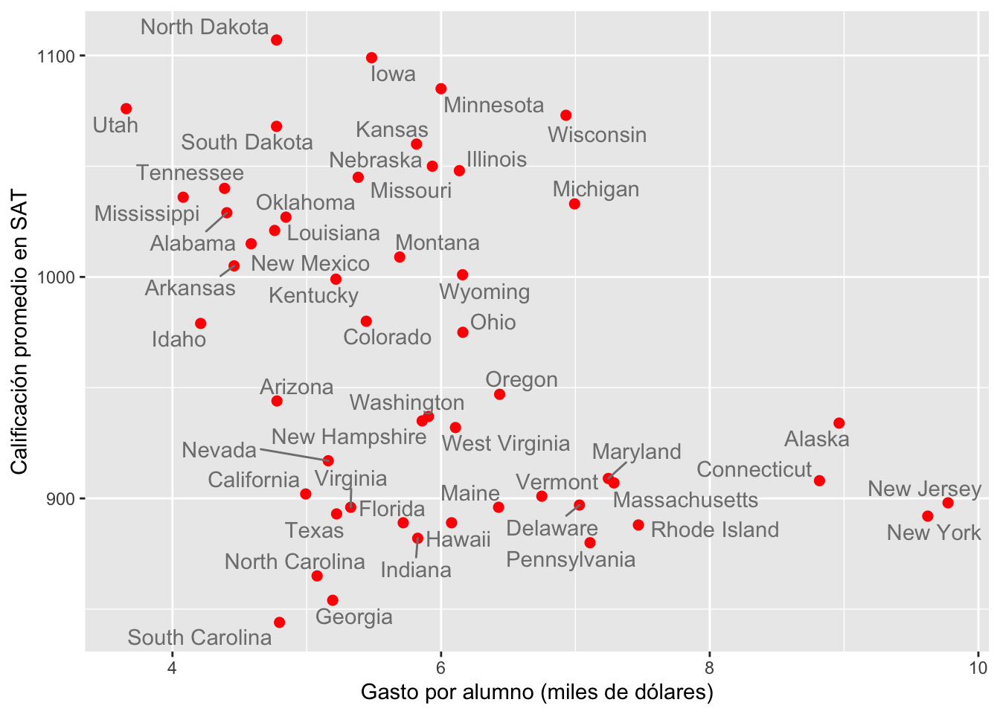

Estas comparaciones no son de alta calidad, solo estamos usando 2 variables
---que son muy pocas--- y no hay mucho que podamos decir en cuanto explicación.
Sin duda nos hace falta una imagen más completa.  Necesitaríamos entender la
correlación que existe entre las demás características de nuestras unidades de
estudio.

**Las unidades que estamos comparando pueden diferir fuertemente en otras
propiedades importantes (*aka*, dimensiones), lo cual no permite interpretar la
gráfica de manera sencilla.**

Sabemos que es posible que el IQ difiera en los estados. Pero no sabemos cómo
producir diferencias de este tipo. Sin embargo, ¡descubrimos que existe una
variable adicional! Ésta es el porcentaje de alumnos de cada estado que toma el
SAT. Podemos agregar como sigue:


```r
 ggplot(sat, aes(x = expend, y = math, label=state, colour = frac)) + 
  geom_point() + geom_text_repel() +
  xlab("Gasto por alumno (miles de dólares)") +
  ylab("Calificación en matemáticas") 
```

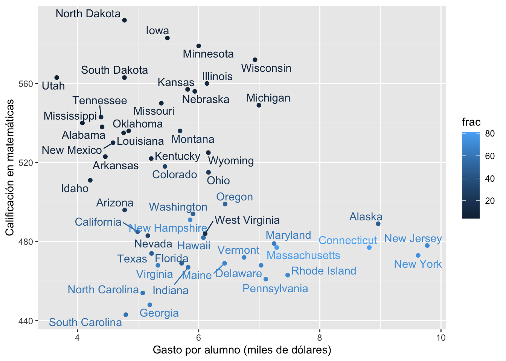


Esto nos permite entender por qué nuestra comparación inicial es relativamente
pobre. Los estados con mejores resultados promedio en el SAT son aquellos donde
una fracción relativamente baja de los estudiantes toma el examen. La diferencia
es considerable.

En este punto podemos hacer varias cosas. Una primera idea es intentar comparar
estados más similares en cuanto a la población de alumnos que asiste. Podríamos
hacer grupos como sigue:


```r
set.seed(991)
k_medias_sat <- kmeans(sat %>% select(frac), centers = 4,  nstart = 100, iter.max = 100) 
sat$clase <- k_medias_sat$cluster
sat <- sat %>% group_by(clase) %>% 
  mutate(clase_media = round(mean(frac))) %>% 
  ungroup %>% 
  mutate(clase_media = factor(clase_media))
sat <- sat %>% 
  mutate(rank_p = rank(frac, ties= "first") / length(frac))
ggplot(sat, aes(x = rank_p, y = frac, label = state, 
                colour = clase_media)) +
  geom_point(size = 2) 
```


Estos resultados indican que es más probable que buenos alumnos decidan hacer el
SAT. Lo interesante es que esto ocurre de manera diferente en cada estado. Por
ejemplo, en algunos estados era más común otro examen: el ACT.

Si hacemos *clusters* de estados según el % de alumnos, empezamos a ver otra
historia. Para esto, ajustemos rectas de mínimos cuadrados como referencia:

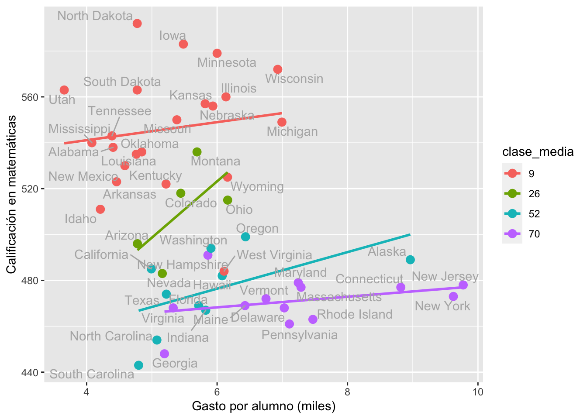


Sin embargo, el resultado puede variar considerablemente si categorizamos de distintas maneras.


### Tablas de conteos {-}

Consideremos los siguientes datos de tomadores de té (del paquete FactoMineR [@factominer]):


```r
tea <- read_csv("data/tea.csv")
# nombres y códigos
te <- tea %>% select(how, price, sugar) %>% 
  rename(presentacion = how, precio = price, azucar = sugar) %>% 
  mutate(
    presentacion = fct_recode(presentacion, 
        suelto = "unpackaged", bolsas = "tea bag", mixto = "tea bag+unpackaged"),
    precio = fct_recode(precio, 
        marca = "p_branded", variable = "p_variable", barato = "p_cheap", 
        marca_propia = "p_private label", desconocido = "p_unknown", fino = "p_upscale"), 
    azucar = fct_recode(azucar,
        sin_azúcar = "No.sugar", con_azúcar = "sugar"))
```


```r
sample_n(te, 10)
```

```
## # A tibble: 10 x 3
##    presentacion precio   azucar    
##    <fct>        <fct>    <fct>     
##  1 mixto        variable sin_azúcar
##  2 suelto       fino     con_azúcar
##  3 bolsas       fino     con_azúcar
##  4 mixto        variable sin_azúcar
##  5 bolsas       variable sin_azúcar
##  6 suelto       variable con_azúcar
##  7 bolsas       variable con_azúcar
##  8 mixto        fino     sin_azúcar
##  9 bolsas       marca    con_azúcar
## 10 mixto        marca    sin_azúcar
```

Nos interesa ver qué personas compran té suelto, y de qué tipo. Empezamos por
ver las proporciones que compran té según su empaque (en bolsita o suelto):


```r
precio <- te %>% group_by(precio) %>% 
  tally() %>% mutate(prop = round(100 * n / sum(n))) %>% 
  select(-n)
tipo <- te %>% group_by(presentacion) %>% tally() %>% 
  mutate(pct = round(100 * n / sum(n)))
tipo %>% formatear_tabla
```

<table class="table table-striped table-hover table-condensed table-responsive" style="font-size: 15px; width: auto !important; margin-left: auto; margin-right: auto;">
 <thead>
  <tr>
   <th style="text-align:left;position: sticky; top:0; background-color: #FFFFFF;"> presentacion </th>
   <th style="text-align:right;position: sticky; top:0; background-color: #FFFFFF;"> n </th>
   <th style="text-align:right;position: sticky; top:0; background-color: #FFFFFF;"> pct </th>
  </tr>
 </thead>
<tbody>
  <tr>
   <td style="text-align:left;"> bolsas </td>
   <td style="text-align:right;"> 170 </td>
   <td style="text-align:right;"> 57 </td>
  </tr>
  <tr>
   <td style="text-align:left;"> mixto </td>
   <td style="text-align:right;"> 94 </td>
   <td style="text-align:right;"> 31 </td>
  </tr>
  <tr>
   <td style="text-align:left;"> suelto </td>
   <td style="text-align:right;"> 36 </td>
   <td style="text-align:right;"> 12 </td>
  </tr>
</tbody>
</table>

La mayor parte de las personas toma té en bolsas. Sin embargo, el tipo de té
(en términos de precio o marca) que compran es muy distinto dependiendo de la
presentación:


```r
tipo <- tipo %>% select(presentacion, prop_presentacion = pct)
tabla_cruzada <- te %>% 
  group_by(presentacion, precio) %>% 
  tally() %>% 
  # porcentajes por presentación
  group_by(presentacion) %>% 
  mutate(prop = round(100 * n / sum(n))) %>% 
  select(-n) 
tabla_cruzada %>% 
  pivot_wider(names_from = presentacion, values_from = prop,
              values_fill = list(prop = 0)) %>% 
  formatear_tabla()
```

<table class="table table-striped table-hover table-condensed table-responsive" style="font-size: 15px; width: auto !important; margin-left: auto; margin-right: auto;">
 <thead>
  <tr>
   <th style="text-align:left;position: sticky; top:0; background-color: #FFFFFF;"> precio </th>
   <th style="text-align:right;position: sticky; top:0; background-color: #FFFFFF;"> bolsas </th>
   <th style="text-align:right;position: sticky; top:0; background-color: #FFFFFF;"> mixto </th>
   <th style="text-align:right;position: sticky; top:0; background-color: #FFFFFF;"> suelto </th>
  </tr>
 </thead>
<tbody>
  <tr>
   <td style="text-align:left;"> marca </td>
   <td style="text-align:right;"> 41 </td>
   <td style="text-align:right;"> 21 </td>
   <td style="text-align:right;"> 14 </td>
  </tr>
  <tr>
   <td style="text-align:left;"> barato </td>
   <td style="text-align:right;"> 3 </td>
   <td style="text-align:right;"> 1 </td>
   <td style="text-align:right;"> 3 </td>
  </tr>
  <tr>
   <td style="text-align:left;"> marca_propia </td>
   <td style="text-align:right;"> 9 </td>
   <td style="text-align:right;"> 4 </td>
   <td style="text-align:right;"> 3 </td>
  </tr>
  <tr>
   <td style="text-align:left;"> desconocido </td>
   <td style="text-align:right;"> 6 </td>
   <td style="text-align:right;"> 1 </td>
   <td style="text-align:right;"> 0 </td>
  </tr>
  <tr>
   <td style="text-align:left;"> fino </td>
   <td style="text-align:right;"> 8 </td>
   <td style="text-align:right;"> 20 </td>
   <td style="text-align:right;"> 56 </td>
  </tr>
  <tr>
   <td style="text-align:left;"> variable </td>
   <td style="text-align:right;"> 32 </td>
   <td style="text-align:right;"> 52 </td>
   <td style="text-align:right;"> 25 </td>
  </tr>
</tbody>
</table>

Estos datos podemos examinarlos un rato y llegar a conclusiones. Notemos que el
uso de tablas no permite mostrar claramente patrones. Tampoco por medio de
gráficas como siguiente:


```r
ggplot(tabla_cruzada %>% ungroup %>% 
  mutate(price = fct_reorder(precio, prop)),
  aes(x = precio, y = prop, group = presentacion, colour = presentacion)) + 
  geom_point() + coord_flip() + geom_line()
```

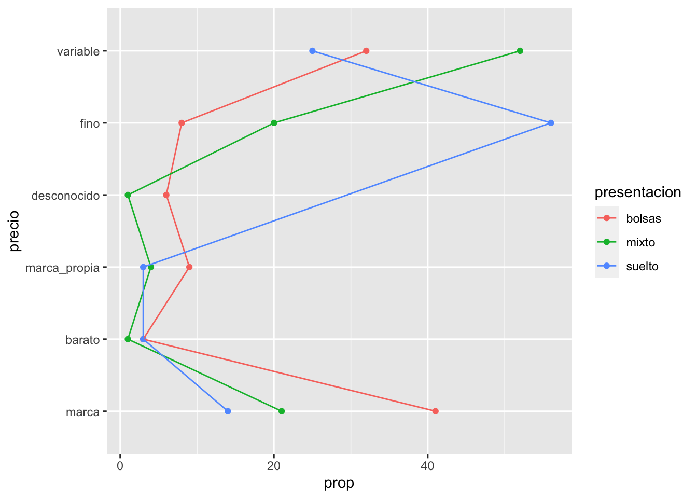

En lugar de eso, calcularemos *perfiles columna*. Esto es, comparamos cada una
de las columnas con la columna marginal (en la tabla de tipo de estilo de té):


```r
num_grupos <- n_distinct(te %>% select(presentacion))
tabla <- te %>% 
  group_by(presentacion, precio) %>% 
  tally() %>%
  group_by(presentacion) %>% 
  mutate(prop_precio = (100 * n / sum(n))) %>% 
  group_by(precio) %>% 
  mutate(prom_prop = sum(prop_precio)/num_grupos) %>% 
  mutate(perfil = 100 * (prop_precio / prom_prop - 1))  
tabla
```

```
## # A tibble: 17 x 6
## # Groups:   precio [6]
##    presentacion precio           n prop_precio prom_prop perfil
##    <fct>        <fct>        <int>       <dbl>     <dbl>  <dbl>
##  1 bolsas       marca           70       41.2      25.4    61.8
##  2 bolsas       barato           5        2.94      2.26   30.1
##  3 bolsas       marca_propia    16        9.41      5.48   71.7
##  4 bolsas       desconocido     11        6.47      2.51  158. 
##  5 bolsas       fino            14        8.24     28.0   -70.6
##  6 bolsas       variable        54       31.8      36.3   -12.5
##  7 mixto        marca           20       21.3      25.4   -16.4
##  8 mixto        barato           1        1.06      2.26  -52.9
##  9 mixto        marca_propia     4        4.26      5.48  -22.4
## 10 mixto        desconocido      1        1.06      2.51  -57.6
## 11 mixto        fino            19       20.2      28.0   -27.8
## 12 mixto        variable        49       52.1      36.3    43.6
## 13 suelto       marca            5       13.9      25.4   -45.4
## 14 suelto       barato           1        2.78      2.26   22.9
## 15 suelto       marca_propia     1        2.78      5.48  -49.3
## 16 suelto       fino            20       55.6      28.0    98.4
## 17 suelto       variable         9       25        36.3   -31.1
```


```r
tabla_perfil <- tabla %>%   
  select(presentacion, precio, perfil, pct = prom_prop) %>% 
  pivot_wider(names_from = presentacion, values_from = perfil,
              values_fill = list(perfil = -100.0))
if_profile <- function(x){
  any(x < 0) & any(x > 0)
}
marcar <- marcar_tabla_fun(25, "red", "black")
tab_out <- tabla_perfil %>% 
  arrange(desc(bolsas)) %>% 
  select(-pct, everything()) %>% 
  mutate_if(if_profile, marcar) %>%
  knitr::kable(format = "html", escape = F, digits = 0) %>% 
  kableExtra::kable_styling(bootstrap_options = c( "hover", "condensed"), full_width = FALSE)
tab_out
```

<table class="table table-hover table-condensed" style="width: auto !important; margin-left: auto; margin-right: auto;">
 <thead>
  <tr>
   <th style="text-align:left;"> precio </th>
   <th style="text-align:left;"> bolsas </th>
   <th style="text-align:left;"> mixto </th>
   <th style="text-align:left;"> suelto </th>
   <th style="text-align:right;"> pct </th>
  </tr>
 </thead>
<tbody>
  <tr>
   <td style="text-align:left;"> desconocido </td>
   <td style="text-align:left;"> <span style="     color: black !important;">157.641196013289</span> </td>
   <td style="text-align:left;"> <span style="     color: red !important;">-57.641196013289</span> </td>
   <td style="text-align:left;"> <span style="     color: red !important;">-100</span> </td>
   <td style="text-align:right;"> 3 </td>
  </tr>
  <tr>
   <td style="text-align:left;"> marca_propia </td>
   <td style="text-align:left;"> <span style="     color: black !important;">71.6967570081604</span> </td>
   <td style="text-align:left;"> <span style="     color: lightgray !important;">-22.3711470973743</span> </td>
   <td style="text-align:left;"> <span style="     color: red !important;">-49.325609910786</span> </td>
   <td style="text-align:right;"> 5 </td>
  </tr>
  <tr>
   <td style="text-align:left;"> marca </td>
   <td style="text-align:left;"> <span style="     color: black !important;">61.8106471150781</span> </td>
   <td style="text-align:left;"> <span style="     color: lightgray !important;">-16.389635229291</span> </td>
   <td style="text-align:left;"> <span style="     color: red !important;">-45.4210118857871</span> </td>
   <td style="text-align:right;"> 25 </td>
  </tr>
  <tr>
   <td style="text-align:left;"> barato </td>
   <td style="text-align:left;"> <span style="     color: black !important;">30.0871348026653</span> </td>
   <td style="text-align:left;"> <span style="     color: red !important;">-52.9472065607381</span> </td>
   <td style="text-align:left;"> <span style="     color: lightgray !important;">22.8600717580728</span> </td>
   <td style="text-align:right;"> 2 </td>
  </tr>
  <tr>
   <td style="text-align:left;"> variable </td>
   <td style="text-align:left;"> <span style="     color: lightgray !important;">-12.4877880581576</span> </td>
   <td style="text-align:left;"> <span style="     color: black !important;">43.6124360668927</span> </td>
   <td style="text-align:left;"> <span style="     color: red !important;">-31.1246480087351</span> </td>
   <td style="text-align:right;"> 36 </td>
  </tr>
  <tr>
   <td style="text-align:left;"> fino </td>
   <td style="text-align:left;"> <span style="     color: red !important;">-70.5895012167464</span> </td>
   <td style="text-align:left;"> <span style="     color: red !important;">-27.8146572417104</span> </td>
   <td style="text-align:left;"> <span style="     color: black !important;">98.4041584584568</span> </td>
   <td style="text-align:right;"> 28 </td>
  </tr>
</tbody>
</table>

Leemos esta tabla como sigue: por ejemplo, los compradores de té suelto compran té *fino*  a una
tasa casi el doble (98%) que el promedio. 

También podemos graficar como:


```r
tabla_graf <- tabla_perfil %>% 
  ungroup %>% 
  mutate(precio = fct_reorder(precio, bolsas)) %>% 
  select(-pct) %>% 
  pivot_longer(cols = -precio, names_to = "presentacion", values_to = "perfil")
g_perfil <- ggplot(tabla_graf,
  aes(x = precio, xend = precio, y = perfil, yend = 0, group = presentacion)) + 
  geom_point() + geom_segment() + facet_wrap(~presentacion) +
  geom_hline(yintercept = 0 , colour = "gray")+ coord_flip()
g_perfil
```

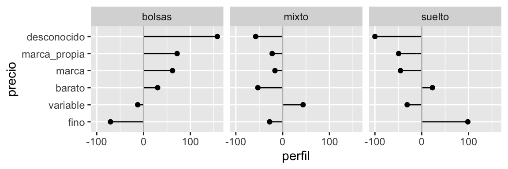

**Observación**: hay dos maneras de construir la columna promedio: tomando los
porcentajes sobre todos los datos, o promediando los porcentajes de las
columnas. Si los grupos de las columnas están desbalanceados, estos promedios
son diferentes.

- Cuando usamos porcentajes sobre la población, perfiles columna y renglón dan
el mismo resultado
- Sin embargo, cuando hay un grupo considerablemente más grande que otros, las
comparaciones se vuelven vs este grupo particular. No siempre queremos hacer
esto.


## Interpretación {-}

En el último ejemplo de tomadores de té utilizamos una muestra de personas, no
toda la población de tomadores de té. Eso quiere decir que tenemos cierta
incertidumbre de cómo se generalizan o no los resultados que obtuvimos en
nuestro análisis a la población general.

Nuestra respuesta depende de cómo se extrajo la muestra que estamos
considerando. Si el mecanismo de extracción incluye algún proceso
probabilístico, entonces es posible en principio entender qué tan bien
generalizan los resultados de nuestro análisis a la población general, y
entender esto depende de entender qué tanta variación hay de muestra a muestra,
de todas las posibles muestras que pudimos haber extraido.

En las siguiente secciones discutiremos estos aspectos, en los cuales pasamos
del trabajo de "detective" al trabajo de "juez" en nuestro trabajo analítico.

