# Principios de visualización

## El cuarteto de Ascombe {-}

En 1971 un estadístico llamado Frank Anscombe (fundador del departamento de
Estadística de la Universidad de Yale) publicó cuatro conjuntos de dato. Cada
uno consiste de 11 observaciones. La peculariedad de estos conjuntos es 
que tienen las mismas propiedades estadísticas.

Sin embargo, cuando analizamos los datos de manera gráfica en un histograma
encontramos rápidamente que los conjuntos de datos son muy distintos.

<div style= "float:left;top:-10px;width:500px;">

```{r, message=FALSE, echo=FALSE, warning=FALSE}
library(tidyverse)
theme_set(theme_minimal())

anscombe_long <- anscombe %>%
    mutate(n_obs = 1:n()) %>%
    gather(key, value, -n_obs) %>%
    separate(key, c("var", "dataset"), 1) %>%
    spread(var, value)

ggplot(anscombe_long, aes(x, y)) +
    geom_smooth(method = "lm", se = FALSE, size = 0.5) +
    geom_point() +
    facet_wrap(~dataset)

```

</div>

</br>
</br>


Media de $x$: 9  
Varianza muestral de $x$: 11  
Media de $y$: 7.50  
Varianza muestral de $y$: 4.12  
Correlación entre $x$ y $y$: 0.816  
Línea de regresión lineal: $y = 3.00 + 0.500x$

<div style="clear:both"></div>

En la gráfica del primer conjunto de datos, se ve clara una 
relación lineal simple con un modelo que cumple los supuestos de
normalidad. La segunda gráfica (arriba a la derecha) muestra unos datos que
tienen una asociación pero definitivamente no es lineal. En la tercera gráfica
(abajo a la izquierda) están puntos alineados perfectamente en una línea recta,
excepto por uno de ellos. En la última gráfica podemos ver un ejemplo en el cual
basta tener una observación atípica para que se produzca un coeficiente de
correlación alto aún cuando en realidad no existe una asociación lineal entre
las dos variables.  

<div style="clear:both"></div>


<div style= "float:right;padding=10px; top:-10px; width:350px">

```{r, echo=FALSE, eval=FALSE, fig.align="center", out.width="95%", fig,height=10, fig.with=10}
library(datasauRus)
library(gganimate)
library(animation)

datasets_plot <- unique(datasaurus_dozen$dataset)[1:9]

ggplot(datasaurus_dozen %>% filter(dataset %in% datasets_plot), 
       aes(x = x, y = y)) +
  geom_point() +
  theme(legend.position = "none") +
  transition_states(
    dataset,
    transition_length = 2,
    state_length = 1
  ) +
  enter_fade() +
  exit_shrink() +
  ease_aes('sine-in-out')
anim_save("imges/datasaurus.gif")
```

```{r, echo = FALSE}
if(knitr::opts_knit$get("rmarkdown.pandoc.to") == 'html') {
  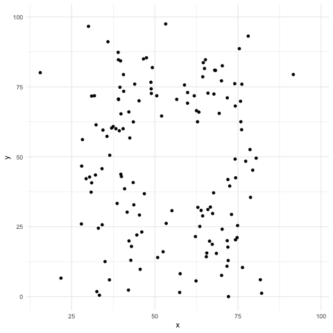
} else {
  knitr::include_graphics("images/datasaurus.png")
}
```


</div>

El cuarteto de Ascombe inspiró una técnica reciente para crear datos que comparten las
mismas propiedades estadísticas al igual que en el cuarteto, pero que producen gráficas
muy distintas ([Matejka,
Fitzmaurice](https://www.autodeskresearch.com/publications/samestats)).

<div style="clear:both"></div>


## Introducción {-}

La visualización de datos no trata de hacer gráficas “bonitas” o “divertidas”,
ni de simplificar lo complejo o ayudar a una persona “que no entiende mucho” a
entender ideas complejas. Más bien, trata de aprovechar nuestra gran capacidad
de procesamiento visual para exhibir de manera clara aspectos importantes de los
datos.

El siguiente ejemplo de [@tufte06], ilustra claramente la diferencia entre estos
dos enfoques. A la izquierda están gráficas (más o menos típicas de Powerpoint)
basadas en la filosofía de simplificar, de intentar no “ahogar” al lector con
datos. El resultado es una colección incoherente, de bajo contenido, que no
tiene mucho qué decir y que es, “indeferente al contenido y la evidencia”.
A la derecha está una variación del rediseño de Tufte en forma de tabla, que en
este caso particular es una manera eficiente de mostrar claramente los patrones
que hay en este conjunto simple de datos.

¿Qué principios son los que soportan la efectividad de esta tabla sobre la
gráfica de la derecha? Veremos que hay dos conjuntos de principios importantes:
unos relacionados con el diseño y otros con la naturaleza del análisis de datos,
independientemente del método de visualización.


```{r, out.width='88%', echo=FALSE, fig.align="center"}
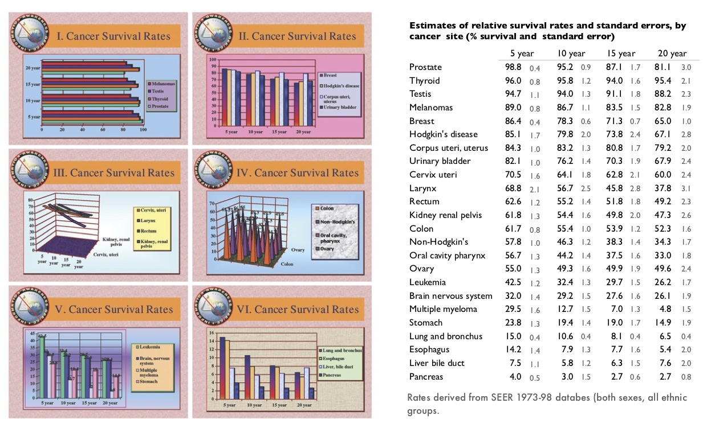
```


## Visualización popular de datos {-}

Publicaciones populares (periódicos, revistas, sitios internet) muchas veces
incluyen visualización de datos como parte de sus artículos o reportajes. En
general siguen el mismo patrón que en la visión tradicionalista de la
estadística: sirven más para divertir que para explicar, tienden a explicar
ideas simples y conjuntos chicos de datos, y se consideran como una “ayuda”
para los “lectores menos sofisticados”. Casi siempre se trata de gráficas
triviales (muchas veces con errores graves) que no aportan mucho a artículos que
tienen un nivel de complejidad mucho mayor (es la filosofía: lo escrito para el
adulto, lo graficado para el niño).

```{r, echo=FALSE, fig.align="center", out.width="88%"}
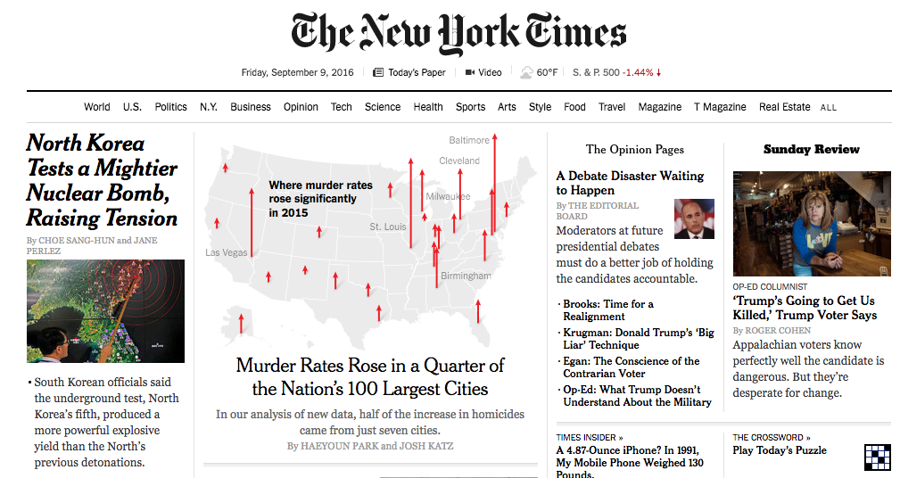
```

## Teoría de visualización de datos {-}

Existe teoría fundamentada acerca de la visualización. Después del trabajo
pionero de Tukey, los principios e indicadores de Tufte se basan en un estudio
de la historia de la graficación y ejercicios de muestreo de la práctica gráfica
a lo largo de varias disciplinas (¿cuáles son las mejores gráficas? ¿por qué?
El trabajo de Cleveland es orientado a la práctica del análisis de datos
(¿cuáles gráficas nos han ayudado a mostrar claramente los resultados del
análisis?), por una parte, y a algunos estudios de percepción visual.

En resumen, hablaremos de las siguientes guías:

### Principios generales del diseño analítico {-}

Aplicables a una presentación o análisis completos, y como guía para construir
nuevas visualizaciones [@tufte06].

```{block, type='caja'}
**Principio 1.** Muestra comparaciones, contrastes, diferencias.  
**Principio 2.** Muestra causalidad, mecanismo, explicación, estructura
sistemática.  
**Principio 3.** Muestra datos multivariados, es decir, más de una o dos
variables.  
**Principio 4.** Integra palabras, números, imágenes y diagramas.  
**Principio 5.** Describe la totalidad de la evidencia. Muestra fuentes usadas
y problemas relevantes.  
**Principio 6.** Las presentaciones analíticas, a fin de cuentas, se sostienen o
caen dependiendo de la calidad, relevancia e integridad de su contenido.
```

### Técnicas de visualización {-}
Esta categoría incluye técnicas específicas que dependen de la forma de nuestros
datos y el tipo de pregunta que queremos investigar (@tukey77, @cleveland93,
@cleveland94, @tufte06).

```{block, type='caja'}
**Tipos de gráficas:** cuantiles, histogramas, caja y brazos, gráficas de
dispersión, puntos/barras/ líneas, series de tiempo.  
**Técnicas para mejorar gráficas:** Transformación de datos, transparencia,
vibración, banking 45, suavizamiento y bandas de confianza.  
**Pequeños múltiplos**  
```

### Indicadores de calidad gráfica {-}
Aplicables a cualquier gráfica en particular. Estas son guías concretas y
relativamente objetivas para evaluar la calidad de una gráfica [@tufte86].

```{block, type='caja'}
**Integridad Gráfica.** El factor de engaño, es decir, la distorsión gráfica de
las cantidades representadas, debe ser mínimo.  
**Chartjunk.** Minimizar el uso de decoración gráfica que interfiera con la
interpretación de los datos: 3D, rejillas, rellenos con patrones.  
**Tinta de datos.** Maximizar la proporción de tinta de datos vs. tinta total de
la gráfica. *For non-data- ink, less is more. For data-ink, less is a bore.*  
**Densidad de datos.** Las mejores gráficas tienen mayor densidad de datos, que
es la razón entre el tamaño del conjunto de datos y el área de la gráfica. Las
gráficas se pueden encoger mucho. Percepción visual. Algunas tareas son más
fáciles para el ojo humano que otras [@cleveland94].
```

### Factor de engaño y Chartjunk {-}

<div style= "float:right;position: relative; top: -10px;width:140px">
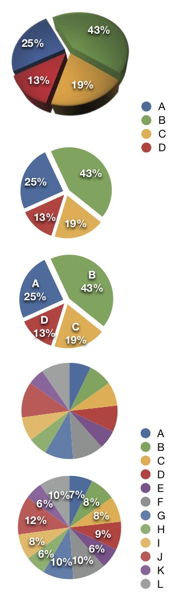
</div>

El **factor de engaño** es el cociente entre el efecto mostrado en una gráfica y
el efecto correspondiente en los datos. Idealmente, el factor de engaño debe ser
1 (ninguna distorsión).  
El **chartjunk** son aquellos elementos gráficos que no corresponden a variación
de datos, o que entorpecen la interpretación de una gráfica.  
Estos son los indicadores de calidad más fáciles de entender y aplicar, y
afortunadamente cada vez son menos comunes.

Un diseño popular que califica como chartjunk y además introduce factores de
engaño es el *pie* de 3D. En la gráfica de la derecha, podemos ver como la
rebanada C se ve más grande que la rebanada A, aunque claramente ese no es el
caso (factor de engaño). La razón es la variación en la perspectiva que no
corresponde a variación en los datos (chartjunk).  

#### Crítica gráfica: Gráfica de *pie* {-}

Todavía elementos que pueden mejorar la comprensión de nuestra
gráfica de *pie*: se trata de la
decodificiación que hay que hacer categoría - color - cuantificación. Podemos
agregar las etiquetas como se muestra en la serie de la derecha, pero entonces:
¿por qué no mostrar simplemente la tabla de datos? ¿qué agrega el *pie* a la
interpretación?

La deficiencias en el *pie* se pueden ver claramente al intentar graficar más
categorías (13) . En el primer *pie* no podemos distinguir realmente cuáles son
las categorías grandes y cuáles las chicas, y es muy difícil tener una imagen
mental clara de estos datos. Agregar los porcentajes ayuda, pero entonces, otra
vez, preguntamos cuál es el propósito del pie. La tabla de la izquierda hace
todo el trabajo (una vez que ordenamos las categrías de la más grande a la más
chica). Es posible hacer una gráfica de barras como la de abajo a la izquierda.


<div style="clear:both"></div>

<div style= "float:left;top: -0px;width:300px">
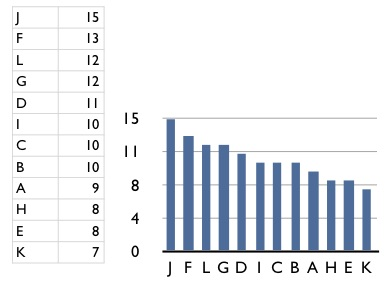
</div>


Hay otros tipos de **chartjunk** comunes: uno es la textura de barras, por ejemplo.
El efecto es la producción de un efecto moiré que es desagradable y quita la
atención de los datos, como en la gráfica de barras de abajo. Otro común son las
rejillas, como mostramos en las gráficas de la izquierda. Nótese como en estos
casos hay efectos ópticos no planeados que degradan la percepción de los
patrones en los datos.


```{r, out.width='100%', echo=FALSE }
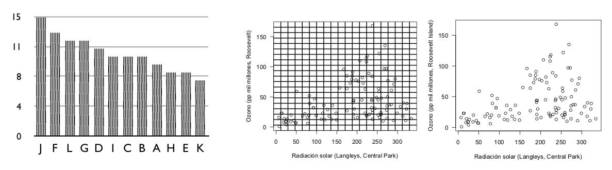
```


### Pequeños múltiplos y densidad gráfica {-}

La densidad de una gráfica es el tamaño del conjunto de datos que se grafica
comparado con el área total de la gráfica. En el siguiente ejemplo, graficamos
en logaritmo-10 de cabezas de ganado en Francia (cerdos, res, ovejas y
caballos). La gráfica de la izquierda es pobre en densidad pues sólo representa
4 datos. La manera más fácil de mejorar la densidad es hacer más chica la
gráfica:


```{r, out.width='98%', echo=FALSE }
knitr::include_graphics('images/france_plot.jpg')
```

La razón de este encogimiento es una que tiene qué ver con las oportunidades perdidas de una gráfica grande. Si repetimos este mismo patrón (misma escala, mismos tipos de ganado) para distintos países obtenemos la siguiente gráfica:

<div style= "float:left;top: -10px;width:500px">
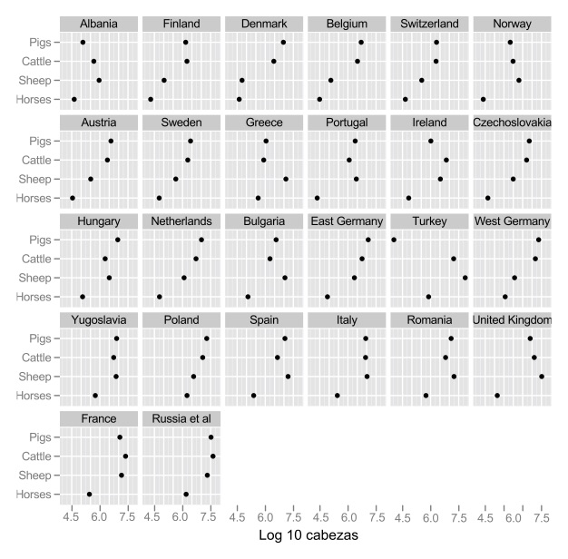

</div>

Esta es una gráfica de puntos. Es útil como sustituto de una gráfica de barras, 
y es superior en el sentido de que una mayor proporción de la tinta que se usa 
es tinta de datos. Otra vez, mayor proporción de tinta de datos representa más 
oportunidades que se pueden capitalizar, como muestra la gráfica de punto y 
líneas que mostramos al principio (rendimiento en campos de cebada).

<div style="clear:both"></div>


#### Más pequeños múltiplos {-}

Los pequeños múltiplos presentan oportunidades para mostrar más acerca
de nuestro problema de interés. Consideramos por ejemplo la relación
de radiación solar y niveles de ozono:

```{r, message=FALSE, warning = FALSE, fig.width = 5, fig.asp=0.7, out.width="45%", fig.align="center"}
ggplot(airquality, aes(x=Solar.R, y=Ozone)) + geom_point() +
    geom_smooth(method = "loess", span = 1)
```

En el ejemplo anterior incluyendo
una variable adicional (velocidad del viento) podemos entender más
acerca de la relación de radiación solar y niveles de ozono:

```{r, message=FALSE, warning = FALSE, fig.width = 7, fig.asp=0.4, out.width="95%", fig.align="center"}
airquality$Wind_cat <- cut(airquality$Wind,
            breaks = quantile(airquality$Wind, c(0, 1/3, 2/3, 1)),
            include.lowest = TRUE)
ggplot(airquality, aes(x=Solar.R, y=Ozone)) + geom_point() +
    facet_wrap(~Wind_cat) +
    geom_smooth(method = "loess", span = 0.8, se = FALSE,
                method.args = list(degree = 1, family="symmetric"))
```


### Tinta de datos {-}

Maximizar la proporción de tinta de datos en nuestras gráficas tiene beneficios
inmediatos. La regla es: si hay tinta que no representa variación en los datos,
o la eliminación de esa tinta no representa pérdidas de significado, esa tinta
debe ser eliminada. El ejemplo más claro es el de las rejillas en gráficas y
tablas:


```{r, out.width='95%', echo=FALSE, fig.align="center" }
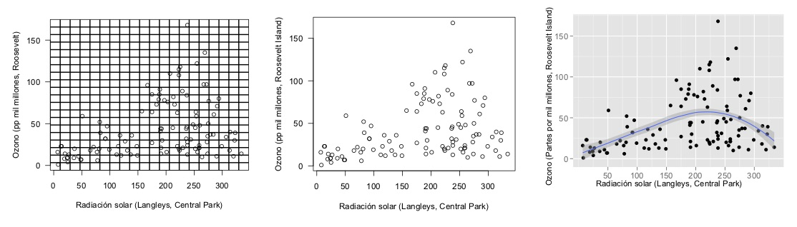
```

```{r, out.width='63%', echo=FALSE, fig.align="center" }
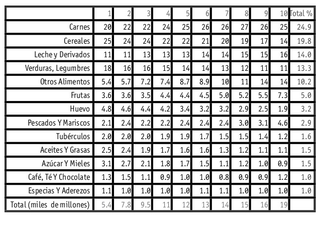
```


¿Por qué usar grises en lugar de negros? La respuesta tiene qué ver con el
principio de tinta de datos: si marcamos las diferencias sutil pero claramente,
tenemos más oportunidades abiertas para hacer énfasis en lo que nos interesa: a
una gráfica o tabla saturada no se le puede hacer más - es difícil agregar
elementos adicionales que ayuden a la comprensión. Si comenzamos marcando con
sutileza, entonces se puede hacer más. Los mapas geográficos son un buen ejemplo
de este principio.

El espacio en blanco es suficientemente bueno para indicar las fronteras en una
tabla, y facilita la lectura:

```{r, out.width='65%', echo=FALSE, fig.align="center" }
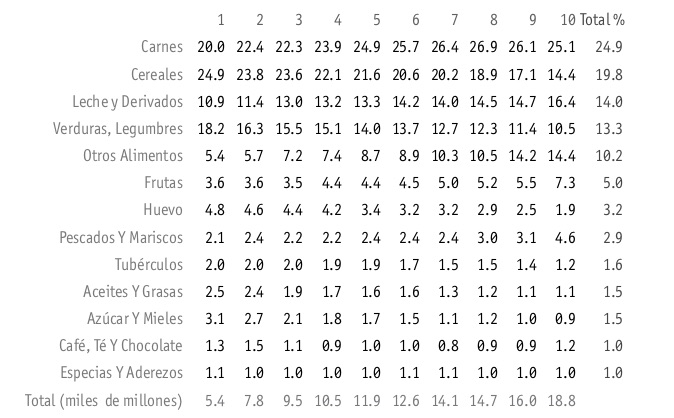
```

Para un ejemplo del proceso de rediseño de una tabla, ver [aquí](https://www.darkhorseanalytics.com/blog/clear-off-the-table). 
Finalmente, podemos ver un ejemplo que intenta incorporar
los elementos del diseño analítico, incluyendo pequeños múltiplos:

```{r, out.width='100%', echo=FALSE, fig.align="center" }
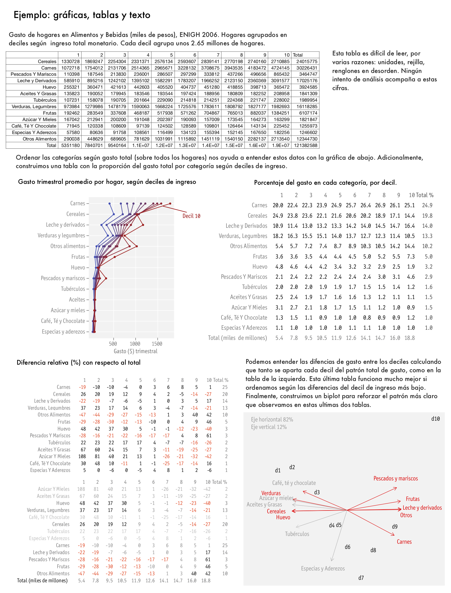
```


### Decoración {-}

```{r, out.width='100%', echo=FALSE, fig.align="center" }
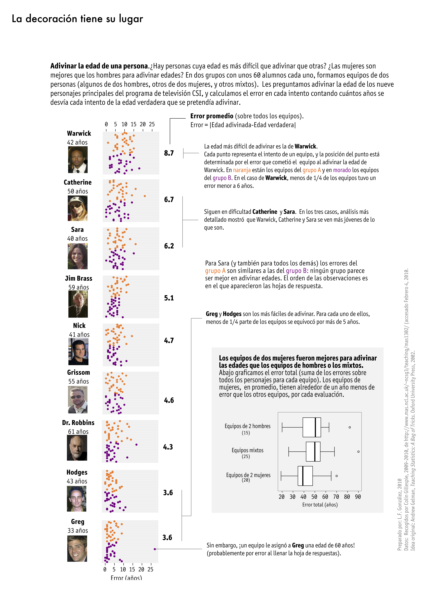
```


### Percepción de escala {-}

Entre la percepción visual y la interpretación de una gráfica están implícitas
tareas visuales específicas que las personas debemos realizar para ver
correctamente la gráfica. En la década de los ochenta, William S. Cleveland y
Robert McGill realizaron algunos experimentos identificando y clasificando estas
tareas para diferentes tipos de gráficos [@cleveland84].
En estos, se le pregunta a la persona que compare dos valores dentro de una
gráfica, por ejemplo, en dos barras en una gráfica de barras, o dos rebanadas de
una gráfica de pie.

```{r, out.width='95%', echo=FALSE, fig.align="center" }
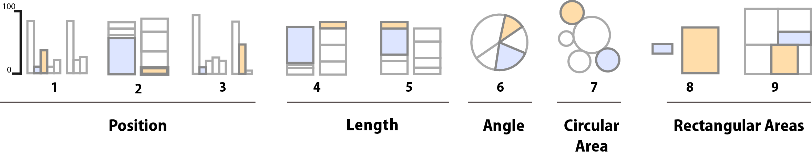
```

Los resultados de Cleveland y McGill fueron replicados por Heer y Bostock en
2010 y los resultados se muestran en las gráficas de la derecha:

```{r, out.width='50%', echo=FALSE, fig.align="center" }
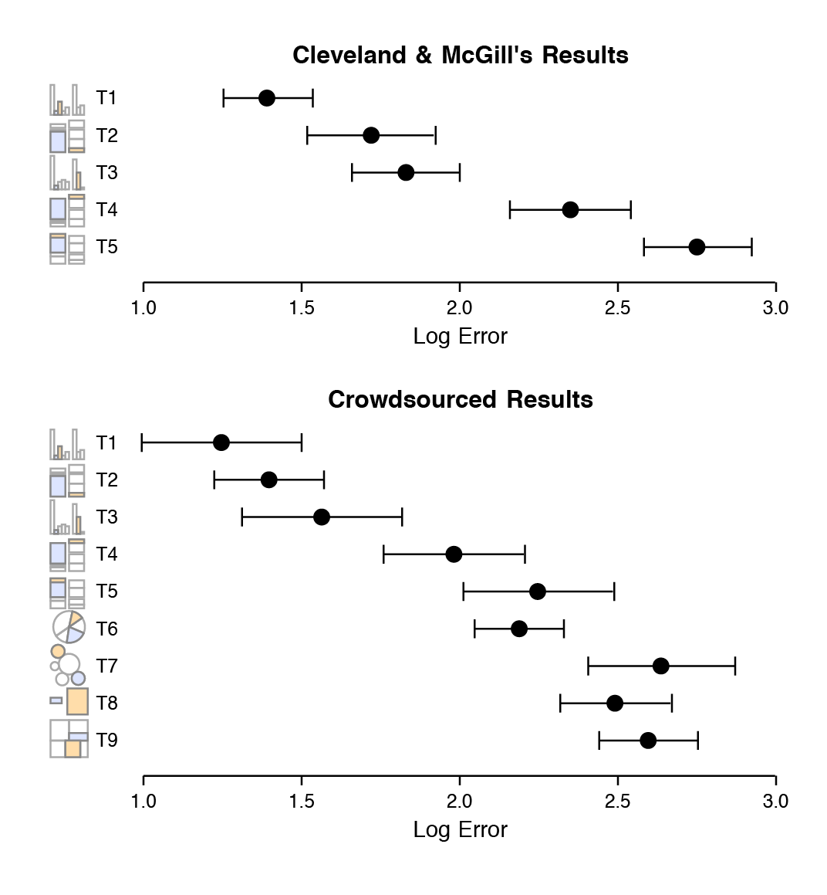
```

## Ejemplo: gráfica de Minard {-}

Concluimos esta sección con una gráfica que, aunque poco común, ejemplifica
los principios de una buena gráfica, y es reconocida como una de las mejores
visualizaciones de la historia.

> Una gráfica excelente, presenta datos interesantes de forma bien
diseñada: es una cuestión de fondo, de diseño, y estadística... [Se] compone de
ideas complejas comunicadas con claridad, precisión y eficiencia. ... [Es] lo
que da al espectador la mayor cantidad de ideas, en el menor tiempo, con
la menor cantidad de tinta, y en el espacio más pequeño. ... Es casi siempre
multivariado. ... Una excelente gráfica debe decir la verdad acerca de los
datos. (Tufte, 1983)

La famosa visualización de Charles Joseph Minard de la marcha de Napoleón sobre
Moscú, ilustra los principios de una buena gráfica. Tufte señala que esta imagen
"bien podría ser el mejor gráfico estadístico jamás dibujado", y sostiene que
"cuenta una historia rica y coherente con sus datos multivariados, mucho más
esclarecedora que un solo número que rebota en el tiempo". Se representan seis
variables: el tamaño del ejército, su ubicación en una superficie bidimensional,
la dirección del movimiento del ejército y la temperatura en varias fechas
durante la retirada de Moscú".


```{r minard-png, out.width='100%', echo=FALSE, fig.align="center" }
knitr::include_graphics('images/minard.png')
```

Hoy en día Minard es reconocido como uno de los principales contribuyentes a la
teoría de análisis de datos y creación de **infografías** con un fundamento
estadístico.

Se grafican 6 variables: el número de tropas de Napoleón, la distancia, la
temperatura, la latitud y la longitud, la dirección en que viajaban las tropas
y la localización relativa a fechas específicas.

La gráfica de Minard, como la describe E.J. Marey, parece "desafiar la pluma del
historiador con su brutal elocuencia", la combinación de datos del mapa, y la
serie de tiempo, dibujados en 1869, "retratan una secuencia de pérdidas
devastadoras que sufrieron las tropas de Napoleón en 1812". Comienza en la
izquierda, en la frontera de Polonia y Rusia, cerca del río Niemen. La línea
gruesa dorada muestra el tamaño de la Gran Armada (422,000) en el momento en que
invadía Rusia en junio de 1812.

El ancho de esta banda indica el tamaño de la armada en cada punto del mapa. En
septiembre, la armada llegó a Moscú, que ya había sido saqueada y dejada
desértica, con sólo 100,000 hombres.

El camino del retiro de Napoleón desde Moscú está representado por la línea
oscura (gris) que está en la parte inferior, que está relacionada a su vez con
la temperatura y las fechas en el diagrama de abajo. Fue un invierno muy frío,
y muchos se congelaron en su salida de Rusia. Como se muestra en el mapa, cruzar
el río Berezina fue un desastre, y el ejército de Napoleón logró regresar a
Polonia con tan sólo 10,000 hombres.

También se muestran los movimientos de las tropas auxiliaries, que buscaban
proteger por atrás y por la delantera mientras la armada avanzaba hacia Moscú.
La gráfica de Minard cuenta una historia rica y cohesiva, coherente con datos
multivariados y con los hechos históricos, y que puede ser más ilustrativa que
tan sólo representar un número rebotando a lo largo del tiempo.
