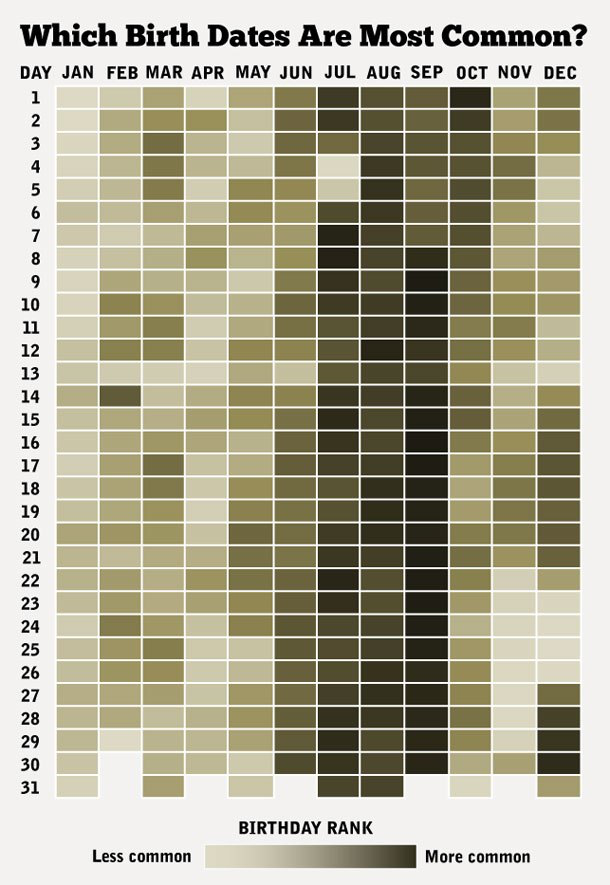

# Analisis exploratorio


> "Exploratory data analysis can never be the whole story, but nothing
else can serve as the foundation stone --as the first step."
>
> --- John Tukey

> "The simple graph has brought more information to the data analyst’s mind
than any other device."
>
> --- John Tukey

```{r setup, include=FALSE, message=FALSE}
library(tidyverse)
knitr::opts_chunk$set(echo = TRUE)
comma <- function(x) format(x, digits = 2, big.mark = ",")
theme_set(theme_minimal())
```

## El papel de la exploración en el análisis de datos {-}

El estándar científico para contestar preguntas o tomar decisiones es uno que se
basa en el análisis de datos. Es decir, en primer lugar se deben reunir todos
los datos disponibles que puedan contener o sugerir alguna guía para entender
mejor la pregunta o la decisión a la que nos enfrentamos. Esta recopilación de
datos ---que pueden ser cualitativos, cuantitativos, o una mezcla de los dos---
debe entonces ser analizada para extraer información relevante para nuestro
problema.


En análisis de datos existen dos distintos tipos de trabajo:

- El trabajo **exploratorio** o de **detective**: ¿cuáles son los aspectos importantes de estos datos?
¿qué indicaciones generales muestran los datos? ¿qué tareas de análisis debemos
empezar haciendo? ¿cuáles son los caminos generales para formular con precisión y
contestar algunas preguntas que nos interesen?

- El trabajo **inferencial**, **confirmatorio**, o de **juez**: ¿cómo evaluar el peso de
la evidencia de los descubrimientos
del paso anterior? ¿qué tan bien soportadas están las respuestas y conclusiones
por nuestro conjunto de datos?

## Algunos conceptos básicos {-}

Empezamos explicando algunas ideas que no serán útiles más adelante. Por
ejemplo, los siguientes datos fueron registrados en un restaurante durante
cuatro días consecutivos:

```{r, message = FALSE, warning=FALSE}
library(tidyverse)
library(patchwork)
source("R/funciones_auxiliares.R")
# usamos los datos tips del paquete reshape2
tips <- reshape2::tips
# renombramos variables y niveles
propinas <- tips %>%
  rename(cuenta_total = total_bill,
         propina = tip, sexo = sex,
         fumador = smoker,
         dia = day, momento = time,
         num_personas = size) %>%
  mutate(sexo = recode(sexo, Female = "Mujer", Male = "Hombre"),
         fumador = recode(fumador, No = "No", Si = "Si"),
         dia = recode(dia, Sun = "Dom", Sat = "Sab", Thur = "Jue", Fri = "Vie"),
         momento = recode(momento, Dinner = "Cena", Lunch = "Comida")) %>%
  select(-sexo) %>%
  mutate(dia  = fct_relevel(dia, c("Jue", "Vie", "Sab", "Dom")))
```

Y vemos una muestra

```{r }
sample_n(propinas, 10) %>% formatear_tabla()
```


Aquí la unidad de observación es una cuenta particular. Tenemos tres mediciones
numéricas de cada cuenta: cúanto fue la cuenta total, la propina, y el número de
personas asociadas a la cuenta. Los datos están separados según se fumó o no en
la mesa, y temporalmente en dos partes: el día (Jueves, Viernes, Sábado o
Domingo), cada uno separado por Cena y Comida.

```{block, type='mathblock'}
Denotamos por $x$ el valor de medición de una *unidad de observación.*
Usualmente utilizamos sub-índices para identificar entre diferentes *puntos de
datos* (observaciones), por ejemplo, $x_n$ para la $n-$ésima observación. De tal
forma que una colección de $N$ observaciones la escribimos como
\begin{align}
  \{x_1, \ldots, x_N\}.
\end{align}
```

El primer tipo de comparaciones que nos interesa hacer es para una medición:
¿Varían mucho o poco los datos de un tipo  de medición? ¿Cuáles son valores
típicos o centrales? ¿Existen valores atípicos?

Supongamos entonces que consideramos simplemente la variable de `cuenta_total`.
Podemos comenzar por **ordenar los datos**, y ver cuáles datos están en los
extremos y cuáles están en los lugares centrales:

```{block, type='mathblock'}
En general la colección de datos no está ordenada por sus valores. Esto es
debido a que las observaciones en general se recopilan de manera *aleatoria*.
Utilizamos la notación de $\sigma(n)$ para denotar un *reordenamiento* de los
datos de tal forma
\begin{align}
  \{x_{\sigma(1)}, \ldots, x_{\sigma(N)}\},
\end{align}
y que satisface la siguiente serie de desigualdades
\begin{align}
  x_{\sigma(1)} \leq \ldots \leq x_{\sigma(N)}.
\end{align}
```


```{r}
propinas <- propinas %>%
  mutate(orden_cuenta = rank(cuenta_total, ties.method = "first"),
         f = (orden_cuenta - 0.5) / n())
cuenta <- propinas %>% select(orden_cuenta, f, cuenta_total) %>% arrange(f)
bind_rows(head(cuenta), tail(cuenta)) %>% formatear_tabla()
```


También podemos graficar los datos en orden, interpolando valores consecutivos.

```{r, fig.width = 7, fig.height = 4, echo = FALSE}
g_orden <- ggplot(cuenta, aes(y = orden_cuenta, x = cuenta_total)) +
  geom_point(colour = "red", alpha = 0.5) +
  labs(subtitle = "Cuenta total")
g_cuantiles <- ggplot(cuenta, aes(y = f, x = cuenta_total)) +
  geom_point(colour = "red", alpha = 0.5) +
  geom_line(alpha = 0.5) +
  labs(subtitle = "")
g_orden + g_cuantiles
```

A esta función le llamamos la **función de cuantiles** para la variable
`cuenta_total`. Nos sirve para comparar directamente los distintos valores que
observamos los datos según el orden que ocupan.

```{block, type='mathblock'}
La función de cuantiles muestral esta definida por
\begin{align}
\hat{F}(x) = \frac1N \sum_{n = 1}^N \mathbb{1}\{x_n \leq x\},
\end{align}
donde la funcion indicadora está definida por
\begin{align}
1\{ x \leq t\} =
    \begin{cases}
      1,  \text{ si } x \leq t  \\
      0,  \text{ en otro caso}
    \end{cases}.
\end{align}
```

```{block, type='mathblock'}
El cuantil $p$ es el valor $x = x(p)$, esta notación sirve para definir $x$ como una función de $p,$ tal que
\begin{align}
  \hat F(x) = p.
\end{align}
Es decir, $x$ acumula el $p$-\% de los casos.
```

```{block, type='ejercicio'}
  Para una medición de interés $x$ con posibles valores en el intervalo $[a, b]$.
  Comprueba que $\hat F(a) = 0$ y $\hat F(b) = 1$ para cualquier colección de datos de tamaño $N.$
```


La gráfica anterior, también nos sirve para poder estudiar la **dispersión y
valores centrales** de los datos observados. Por ejemplo, podemos notar que:

- El **rango** de datos va de unos 3 dólares hasta 50 dólares
- Los **valores centrales** ---del cuantil 0.25 al 0.75, por decir un ejemplo--- están
entre unos 13 y 25 dólares
- El cuantil 0.5 (o también conocido como **mediana**) está alrededor de 18 dólares.


```{block, type='ejercicio'}
  ¿Cómo definirías la mediana en términos de la función de cuantiles?
  *Pista:* Considera los casos por separado para $N$ impar o par.
```


Éste último puede ser utilizado para dar un valor *central* de la distribución
de valores para `cuenta_total`. Asimismo podemos dar resúmenes más refinados si
es necesario. Por ejemplo, podemos reportar que:

- El cuantil 0.95 es de unos 35 dólares --- sólo 5\% de las cuentas son de más de 35 dólares
- El cuantil 0.05 es de unos 8 dólares --- sólo 5\% de las cuentas son de 8 dólares o menos.

Finalmente, la forma de la gráfica se interpreta usando su pendiente (tasa de
cambio) haciendo comparaciones en diferentes partes de la gráfica:

- La distribución de valores tiene asimetría: el 10\% de las cuentas más altas
tiene considerablemente más dispersión que el 10\% de las cuentas más bajas.

- Entre los cuantiles 0.2 y 0.5 es donde existe *mayor* densidad de datos: la
pendiente (tasa de cambio) es alta, lo que significa que al avanzar en los
valores observados, los cuantiles (el porcentaje de casos) aumenta rápidamente.

- Cuando la pendiente es casi plana, quiere decir que los datos tienen más
dispersión local o están más separados.

En algunos casos, es más natural hacer un **histograma**, donde dividimos el rango
de la variable en cubetas o intervalos (en este caso de igual longitud), y
graficamos por medio de barras cuántos datos caen en cada cubeta:

```{r, fig.width = 10, fig.height = 4, echo = FALSE}
binwidth_min <- 1
g_1 <- ggplot(propinas, aes(x = cuenta_total)) + geom_histogram(binwidth = binwidth_min)
g_2 <- ggplot(propinas, aes(x = cuenta_total)) + geom_histogram(binwidth = binwidth_min * 2)
g_3 <- ggplot(propinas, aes(x = cuenta_total)) + geom_histogram(binwidth = binwidth_min * 5)
g_1 + g_2 + g_3
```

Es una gráfica más popular, pero perdemos cierto nivel de detalle, y distintas
particiones resaltan distintos aspectos de los datos.

Finalmente, una gráfica más compacta que resume la gráfica de cuantiles o el
histograma es el **diagrama de caja y brazos**. Mostramos dos versiones, la
clásica de Tukey (T) y otra versión menos común de Spear/Tufte (ST):

```{r, fig.width = 8, fig.height = 4, warning=FALSE}
library(ggthemes)
cuartiles <- quantile(cuenta$cuenta_total)
t(cuartiles) %>%  formatear_tabla()
g_1 <- ggplot(cuenta, aes(x = f, y = cuenta_total)) +
  labs(subtitle = "Gráfica de cuantiles: Cuenta total") +
  geom_hline(yintercept = cuartiles[2], colour = "gray") +
  geom_hline(yintercept = cuartiles[3], colour = "gray") +
  geom_hline(yintercept = cuartiles[4], colour = "gray") +
  geom_point(alpha = 0.5) + geom_line()
g_2 <- ggplot(cuenta, aes(x = factor("ST", levels =c("ST")), y = cuenta_total)) +
  geom_tufteboxplot() +
  labs(subtitle = " ") +  xlab("") + ylab("")
g_3 <- ggplot(cuenta, aes(x = factor("T"), y = cuenta_total)) +
  geom_boxplot() +
  labs(subtitle = " ") +  xlab("") + ylab("")
g_4 <- ggplot(cuenta, aes(x = factor("P"), y = cuenta_total)) +
  geom_jitter(height = 0, width =0.2, alpha = 0.5) +
  labs(subtitle = " ") +  xlab("") + ylab("")
g_5 <- ggplot(cuenta, aes(x = factor("V"), y = cuenta_total)) +
  geom_violin() +
  labs(subtitle = " ") +  xlab("") + ylab("")
g_1 + g_2 + g_3 + g_4 +
  plot_layout(widths = c(8, 2, 2, 2))
```

:::::: {.cols data-latex=""}

::: {.col data-latex="{0.50\textwidth}"}

El diagrama de la derecha explica los elementos de la versión típica del
diagrama de caja y brazos (*boxplot*). *RIC* se refiere al *Rango
Intercuantílico**, definido por la diferencia entre los cuantiles 25% y 75%.

:::

::: {.col data-latex="{0.10\textwidth}"}
\ 
<!-- an empty Div (with a white space), serving as
a column separator -->
:::


::: {.col data-latex="{0.4\textwidth}"}

```{r, out.width='95%', echo=FALSE}

```
Figura: [Jumanbar / CC BY-SA](https://creativecommons.org/licenses/by-sa/3.0)
:::

::::::

```{block, type='mathblock'}
Hasta ahora hemos utilizado la definición general de *cuantiles*. Donde
consideramos el cuantil $q$, para buscar $x$ tal que $\hat F(x) = q.$ Hay
valores típicos de interés que corresponden a $q$ igual a 25\%, 50\% y 75\%.
Éstos valores se denominan **cuartiles.**
```

**Ventajas en el análisis inicial**

En un principio del análisis, estos resúmenes
(cuantiles) pueden ser más útiles que utilizar medias y varianzas, por ejemplo.
La razón es que los cuantiles:

- Son cantidades más fácilmente interpretables
- Los cuantiles centrales son más resistentes a valores atípicos que medias o varianzas
- Sin embargo, permite identificar valores extremos
- Es fácil comparar cuantiles de distintos bonches de datos


### Media y desviación estándar {-}

Las medidas más comunes de localización y dispersión para un conjunto
de datos son la media muestral y la [desviación estándar muestral](https://es.wikipedia.org/wiki/Desviación_t%C3%ADpica).

En general, no son muy apropiadas para iniciar el análisis exploratorio,
pues:

- Son medidas más difíciles de interpretar y explicar que los cuantiles. En este
sentido, son medidas especializadas. Por ejemplo, intenta explicar
intuitivamente qué es la media.
- No son resistentes a valores atípicos o erróneos. Su falta de resistencia los
vuelve poco útiles en las primeras etapas de limpieza y descripción.

```{block, type='mathblock'}
La media, o promedio, se denota por $\bar x$ y se define como
\begin{align}
\bar x = \frac1N \sum_{n = 1}^N x_n.
\end{align}
La desviación estándar muestral se define como
\begin{align}
\text{std}(x) = \sqrt{\frac1{N-1} \sum_{n = 1}^N (x_n - \bar x)^2}.
\end{align}
```


Sin embargo,

- La media y desviación estándar son computacionalmente convenientes.
- Para el trabajo de modelado estas medidas de resumen tienen ventajas claras
(bajo ciertos supuestos teóricos).
- En muchas ocasiones conviene usar estas medidas pues permite hacer
comparaciones históricas o tradicionales ---pues análisis anteriores pudieran
estar basados en éstas.

```{block , type='ejercicio'}
1. Considera el caso de tener $N$ observaciones y asume que ya tienes calculado el
promedio para dichas observaciones. Este promedio lo denotaremos por $\bar x_N$.
Ahora, considera que has obtenido $M$ observaciones más. Escribe una fórmula
recursiva para la media del conjunto total de datos $\bar x_{N+M}$ en función
de lo que ya tenías precalculado $\bar x_N.$

2. ¿En qué situaciones esta propiedad puede ser conveniente?
```

## Ejemplos {-}

### Precios de casas {-}

En este ejemplo consideremos los [datos de precios de ventas de la ciudad de Ames, Iowa](https://www.kaggle.com/prevek18/ames-housing-dataset).
En particular nos interesa entender la variación del precio de las casas.

```{r, echo = FALSE, message = FALSE, warning = FALSE}
source("R/casas_preprocesamiento.R")
set.seed(21)
casas_completo <- casas
casas <- casas_completo %>%
  sample_frac(0.9)
casas_holdout <- casas_completo %>%
  anti_join(casas)
casas <- casas %>%
  add_count(nombre_zona, name = "n_zona") %>%
  filter(n_zona > 30) %>%
  mutate(nombre_zona = fct_reorder(nombre_zona, precio_miles),
         precio_m2 = precio_m2_miles * 1000)
```

Por este motivo calculamos los cuantiles que corresponden al 25\%, 50\% y 75\%
(**cuartiles**), así como el mínimo y máximo de los precios de
las casas:

```{r}
quantile(casas %>% pull(precio_miles))
```

```{block, type='ejercicio'}
Comprueba que el mínimo y máximo están asociados a los cuantiles 0\% y 100\%,
respectivamente.
```

Una posible comparación es considerar los precios y sus variación en función de
zona de la ciudad en que se encuentra una vivienda. Podemos usar diagramas de
caja y brazos para hacer una **comparación burda** de los precios en distintas
zonas de la ciudad:

```{r, fig.asp = 0.7, fig.align = 'center', out.width = '80%'}
ggplot(casas, aes(x = nombre_zona, y = precio_miles)) +
  geom_boxplot() +
  coord_flip()
```

La primera pregunta que nos hacemos es cómo pueden variar las características de
las casas dentro de cada zona. Para esto, podemos considerar el área de las
casas. En lugar de graficar el precio, graficamos el precio por metro cuadrado,
por ejemplo:

```{r, echo = FALSE}
casas <- casas %>%
  mutate(nombre_zona = fct_reorder(nombre_zona, precio_m2_miles))
```

```{r, fig.asp = 0.7, fig.align = 'center', out.width = '80%'}
ggplot(casas, aes(x = nombre_zona, y = precio_m2)) +
  geom_boxplot() +
  coord_flip()
```

Podemos cuantificar la variación que observamos de zona a zona y la variación
que hay dentro de cada una de las zonas. Una primera aproximación es observar
las variación del precio al calcular la mediana dentro de cada zona, y después
cuantificar por medio de cuantiles cómo varía la mediana entre zonas:

```{r}
casas %>%
  group_by(nombre_zona) %>%
  summarise(mediana_zona = median(precio_m2), .groups = "drop") %>%
  pull(mediana_zona) %>%
  quantile() %>%
  round()
```

```{block, type='mathblock'}
Tratar con datos por segmento es una situación común en aplicaciones. Usualmente
denotamos por
\begin{align}
  x_{k, n}
\end{align}
a la $n$-ésima observación del $k$-ésimo grupo. Usualmente tenemos un universo
de $K$ posibles grupos y para cada grupo tenemos un total diferente de
observaciones. Esto lo denotamos por $N_k$, el número total de observaciones del
grupo $k$ para cualquier $k = 1, \ldots, K.$ El número total de muestras lo
denotamos por $N$, donde
\begin{align}
  N = \sum_{k=1}^K N_k.
\end{align}
Finalmente, nos puede interesar, como en el ejemplo, los promedios por grupo
\begin{align}
  \bar x_k = \frac{1}{N_k} \sum_{n = 1}^{N_k} x_{k, n},
\end{align}
y contrastar contra el promedio total
\begin{align}
  \bar x = \frac1K \sum_{k = 1}^K \bar x_k = \frac1K \sum_{k = 1}^K \left( \frac{1}{N_k} \sum_{n = 1}^{N_k} x_{k, n} \right).
\end{align}
```

Por otro lado, las variaciones con respecto a las medianas **dentro** de cada
zona, por grupo, se resume como:

```{r}
quantile(casas %>% group_by(nombre_zona) %>%
  mutate(residual = precio_m2 - median(precio_m2)) %>%
  pull(residual)) %>%
  round()
```

Nótese que este último paso tiene sentido pues la variación dentro de las zonas,
en términos de precio por metro cuadrado, es similar. Esto no lo podríamos haber
hecho de manera efectiva si se hubiera utilizado el precio de las casas sin
ajustar por su tamaño.

Podemos resumir este primer análisis con un par de gráficas de cuantiles
(@cleveland93):

```{r, out.width = '90%', fig.align= 'center', cache=TRUE, fig,height = 5, fig.asp = 0.55}
mediana <- median(casas$precio_m2)
resumen <- casas %>%
  group_by(nombre_zona) %>%
  mutate(mediana_zona = median(precio_m2)) %>%
  mutate(residual = precio_m2 - mediana_zona) %>%
  ungroup() %>%
  mutate(mediana_zona = mediana_zona - mediana) %>%
  select(nombre_zona, mediana_zona, residual) %>%
  pivot_longer(mediana_zona:residual, names_to = "tipo", values_to = "valor")
ggplot(resumen, aes(sample = valor)) + 
  geom_qq(distribution = stats::qunif) +
  facet_wrap(~ tipo) + 
  ylab("Precio por m2") + xlab("f") +
  labs(subtitle = "Precio por m2 por zona",
       caption = paste0("Mediana total de ", round(mediana)))
```


Vemos que la mayor parte de la variación del precio por metro cuadrado ocurre
dentro de cada zona, una vez que controlamos por el tamaño de las casas. La
variación dentro de cada zona es aproximadamente simétrica, aunque la cola
derecha es ligeramente más larga con algunos valores extremos.

Podemos seguir con otro indicador importante: la calificación de calidad de los terminados
de las casas. Como primer intento podríamos hacer:

```{r, echo = FALSE, fig.asp = 0.7, fig.align = 'center', out.width = '80%', echo = FALSE}
casas %>%
  mutate(ind_calidad = cut(calidad_gral, c(0, 5, 8,10))) %>%
  ggplot(aes(y = precio_m2, x = nombre_zona, colour = factor(ind_calidad))) +
  geom_hline(yintercept = c(1000, 2000), colour = "gray") +
  geom_jitter(width = 0.2, height = 0, alpha = 0.5) +
  coord_flip() +
  scale_colour_colorblind("Índice calidad") +
  facet_wrap(~ind_calidad)
```

Lo que indica que las calificaciones de calidad están distribuidas de manera
muy distinta a lo largo de las zonas, y que probablemente no va ser simple
desentrañar qué variación del precio se debe a la zona y cuál se debe a la calidad.


### Prueba Enlace {-}

Consideremos la prueba Enlace (2011) de matemáticas para primarias. Una primera
pregunta que alguien podría hacerse es: ¿cuáles escuelas son mejores en este
rubro, las privadas o las públicas?


```{r, message = FALSE, echo = FALSE, warning=FALSE}
enlace <- read_csv("data/enlace.csv")
enlace <- enlace %>%  filter(num_evaluados_total > 0, mate_6 > 0) %>%
    mutate(marginacion = fct_reorder(marginacion, mate_6, median)) %>%
    mutate(tipo = recode(tipo, `INDÍGENA`="Indígena/Conafe", CONAFE="Indígena/Conafe", GENERAL="General", PARTICULAR="Particular")) %>%
    mutate(tipo = fct_reorder(tipo, mate_6, mean))
```

```{r, message = FALSE, warning=FALSE}
enlace_tbl <- enlace %>% group_by(tipo) %>%
    summarise(n_escuelas = n(),
              cuantiles = list(cuantil(mate_6, c(0.05, 0.25, 0.5, 0.75, 0.95)))) %>%
    unnest(cols = cuantiles) %>% mutate(valor = round(valor))
enlace_tbl %>%
  spread(cuantil, valor) %>%
  formatear_tabla()
```


Para un análisis exploratorio podemos utilizar distintas gráficas. Por ejemplo,
podemos utilizar nuevamente las gráficas de caja y brazos, así como graficar los
percentiles. Nótese que en la gráfica 1 se utilizan los cuantiles 0.05, 0.25,
0.5, 0.75 y 0.95:

```{r, fig.width = 10, fig.height = 6, echo = FALSE, message = FALSE, cache = TRUE, out.width = '95%', fig.align= 'center'}
g_medianas <- ggplot(enlace_tbl %>% filter(cuantil == 0.50), aes(x = tipo, y = valor)) +
    geom_point(colour = "red") + ylim(c(150,880)) + labs(subtitle = "Gráfica 1")
g_80 <- ggplot(enlace_tbl  %>% spread(cuantil,valor),
                                     aes(x = tipo, y = `0.5`)) +
    geom_linerange(aes(ymin= `0.05`, ymax = `0.95`), colour = "gray40") +
    geom_point(colour = "red", size = 3) + ylim(c(150,880)) +
    labs(subtitle = "Gráfica 1") +
    ylab("Promedios Matemáticas")

g_80_p <- ggplot(enlace_tbl  %>% spread(cuantil,valor), aes(x = tipo, y = `0.5`)) +
    geom_linerange(aes(ymin= `0.05`, ymax = `0.95`), colour = "gray40") +
    geom_linerange(aes(ymin= `0.25`, ymax = `0.75`), size = 2, colour = "white") +
    geom_point(colour = "red", size = 3) +
     ylim(c(150,880)) + labs(subtitle = "Gráfica 1")+
    ylab("Promedios Matemáticas")

g_boxplot <- ggplot(enlace  , aes(x = tipo, y = mate_6)) +
    geom_boxplot(outlier.size = 0.7) +
    labs(subtitle = "Gráfica 2")+ ylim(c(150,930))+
    ylab("Promedios Matemáticas")

g_cuantil <- ggplot(enlace, aes(sample = mate_6, colour = tipo)) +
  geom_qq(distribution = stats::qunif, size = 1) + ylab("Promedios Matemáticas") +
  xlab("orden") + labs(subtitle = "Gráfica 3")

g_80_p + g_boxplot + g_cuantil
```

Se puede discutir qué tan apropiada es cada gráfica con el objetivo de realizar
comparaciones. Sin duda, graficar más cuantiles es más útil para hacer
comparaciones. Por ejemplo, en la Gráfica 1 podemos ver que la mediana de las
escuelas generales está cercana al cuantil 5\% de las escuelas particulares. Por
otro lado, el diagrama de caja y brazos muestra también valores "atípicos". Es
importante notar que una comparación más robusta se puede lograr por medio de
**pruebas de hipótesis**, las cuales veremos mas adelante en el curso.

Regresando a nuestro análisis exploratorio, notemos que la diferencia es
considerable entre tipos de escuela. Antes de contestar prematuramente la
pregunta: ¿cuáles son las mejores escuelas? busquemos mejorar la
interpretabilidad de nuestras comparaciones usando los principios 2 y 3.
Podemos comenzar por agregar, por ejemplo, el nivel del marginación del
municipio donde se encuentra la escuela.

```{r, echo = FALSE}
enlace_tbl_marg <- enlace %>%
    group_by(tipo, marginacion) %>%
    summarise(n_alumnos = sum(num_evaluados_total),
              cuantiles = list(cuantil(mate_6, c(0.05, 0.25, 0.5, 0.75, 0.95))),
              .groups = "drop") %>%
    unnest(cols = cuantiles) %>% mutate(valor = round(valor)) %>%
    filter( n_alumnos > 20)
```


Para este objetivo, podemos usar páneles (pequeños múltiplos útiles para hacer
comparaciones) y graficar:

```{r, fig.width = 10, fig.height = 4, echo = FALSE, cache=TRUE, out.width = '95%', fig.align= 'center'}
g_80_p <- ggplot(enlace_tbl_marg  %>% spread(cuantil, valor),
                                     aes(x = marginacion, y = `0.5`)) +
    geom_linerange(aes(ymin= `0.05`, ymax = `0.95`), colour = "gray40") +
    geom_linerange(aes(ymin= `0.25`, ymax = `0.75`), size = 2, colour = "white") +
    geom_point(colour = "red", aes(size = log10(n_alumnos/1000))) +
    ylab("Promedios Matemáticas") + facet_wrap(~tipo, nrow = 1) +
    theme(axis.text.x = element_text(angle = 90, hjust = 1)) +
    scale_size_continuous(name = "Miles de \nAlumnos",
                          breaks = c(-0.3, 0, 1, 2, 2.7),
                          labels = c(0.5, 1, 10, 100, 500))
g_80_p
```


Esta gráfica pone en contexto la pregunta inicial, y permite evidenciar la dificultad
de contestarla. En particular:

1. Señala que la pregunta no sólo debe concentarse en el tipo de "sistema":
pública, privada, etc. Por ejemplo, las escuelas públicas en zonas de marginación baja no
tienen una distribución de calificaciones muy distinta a las privadas en zonas
de marginación alta.
2. El contexto de la escuela es importante.
3. Debemos de pensar qué factores --por ejemplo, el entorno familiar de los
estudiantes-- puede resultar en comparaciones que favorecen a las escuelas
privadas. Un ejemplo de esto es considerar si los estudiantes tienen que
trabajar o no. A su vez, esto puede o no ser reflejo de la calidad del sistema
educativo.
4. Si esto es cierto, entonces la pregunta inicial es demasiado vaga y mal
planteada. Quizá deberíamos intentar entender cuánto "aporta" cada escuela a
cada estudiante, como medida de qué tan buena es cada escuela.


### Estados y calificaciones en SAT {-}

¿Cómo se relaciona el gasto por alumno, a nivel estatal,
con sus resultados académicos? Hay trabajo
considerable en definir estos términos, pero supongamos que tenemos el
[siguiente conjunto de datos](http://jse.amstat.org/datasets/sat.txt) [@Guber], que son
datos oficiales agregados por `estado` de Estados Unidos. Consideremos el subconjunto de variables
`sat`, que es la calificación promedio de los alumnos en cada estado
(para 1997) y `expend`, que es el gasto en miles de dólares
por estudiante en (1994-1995).


```{r, message = FALSE}
sat <- read_csv("data/sat.csv")
sat_tbl <- sat %>% select(state, expend, sat) %>%
    gather(variable, valor, expend:sat) %>%
    group_by(variable) %>%
    summarise(cuantiles = list(cuantil(valor))) %>%
    unnest(cols = c(cuantiles)) %>%
    mutate(valor = round(valor, 1)) %>%
    spread(cuantil, valor)
sat_tbl %>% formatear_tabla
```


Esta variación es considerable para promedios del SAT: el percentil 75 es
alrededor de 1050 puntos, mientras que el percentil 25 corresponde a alrededor
de 800. Igualmente, hay diferencias considerables de gasto por alumno (miles de
dólares) a lo largo de los estados.

Ahora hacemos nuestro primer ejercico de comparación: ¿Cómo se ven las
calificaciones para estados en distintos niveles de gasto? Podemos usar una
gráfica de dispersión:


```{r, warning=FALSE,  cache=TRUE, out.width = '95%', fig.align= 'center', fig.asp=0.65, }
library(ggrepel)
 ggplot(sat, aes(x = expend, y = sat, label = state)) +
  geom_point(colour = "red", size = 2) + geom_text_repel(colour = "gray50") +
  xlab("Gasto por alumno (miles de dólares)") +
  ylab("Calificación promedio en SAT")
```

Estas comparaciones no son de alta calidad, solo estamos usando 2 variables
---que son muy pocas--- y no hay mucho que podamos decir en cuanto explicación.
Sin duda nos hace falta una imagen más completa.  Necesitaríamos entender la
correlación que existe entre las demás características de nuestras unidades de
estudio.

**Las unidades que estamos comparando pueden diferir fuertemente en otras
propiedades importantes (*aka*, dimensiones), lo cual no permite interpretar la
gráfica de manera sencilla.**

Sabemos que es posible que el IQ difiera en los estados. Pero no sabemos cómo
producir diferencias de este tipo. Sin embargo, ¡descubrimos que existe una
variable adicional! Ésta es el porcentaje de alumnos de cada estado que toma el
SAT. Podemos agregar como sigue:

```{r,  cache=TRUE, out.width = '95%', fig.align= 'center', fig.asp=0.65, }
 ggplot(sat, aes(x = expend, y = math, label=state, colour = frac)) +
  geom_point() + geom_text_repel() +
  xlab("Gasto por alumno (miles de dólares)") +
  ylab("Calificación en matemáticas")
```


Esto nos permite entender por qué nuestra comparación inicial es relativamente
pobre. Los estados con mejores resultados promedio en el SAT son aquellos donde
una fracción relativamente baja de los estudiantes toma el examen. La diferencia
es considerable.

En este punto podemos hacer varias cosas. Una primera idea es intentar comparar
estados más similares en cuanto a la población de alumnos que asiste. Podríamos
hacer grupos como sigue:

```{r, fig.width = 6, fig.height = 3,  cache=TRUE, out.width = '95%', fig.align= 'center'}
set.seed(991)
k_medias_sat <- kmeans(sat %>% select(frac), centers = 4,  nstart = 100, iter.max = 100)
sat$clase <- k_medias_sat$cluster
sat <- sat %>% group_by(clase) %>%
  mutate(clase_media = round(mean(frac))) %>%
  ungroup %>%
  mutate(clase_media = factor(clase_media))
sat <- sat %>%
  mutate(rank_p = rank(frac, ties= "first") / length(frac))
ggplot(sat, aes(x = rank_p, y = frac, label = state,
                colour = clase_media)) +
  geom_point(size = 2)
```

Estos resultados indican que es más probable que buenos alumnos decidan hacer el
SAT. Lo interesante es que esto ocurre de manera diferente en cada estado. Por
ejemplo, en algunos estados era más común otro examen: el ACT.

Si hacemos *clusters* de estados según el % de alumnos, empezamos a ver otra
historia. Para esto, ajustemos rectas de mínimos cuadrados como referencia:

```{r, echo = FALSE, cache = TRUE, warning=FALSE, message=FALSE, out.width = '90%', fig.asp=0.65, fig.align= 'center'}
ggplot(sat, aes(x = expend, y = math, label=state, colour = clase_media)) +
  geom_point(size = 3) +
  geom_smooth(method = "lm", se = FALSE) +
  xlab("Gasto por alumno (miles)") +
  ylab("Calificación en matemáticas") +
  geom_text_repel(colour = "gray70")
```


Sin embargo, el resultado puede variar considerablemente si categorizamos de distintas maneras.


### Tablas de conteos {-}

Consideremos los siguientes datos de tomadores de té (del paquete FactoMineR [@factominer]):

```{r, message=FALSE, warning=FALSE}
tea <- read_csv("data/tea.csv")
# nombres y códigos
te <- tea %>% select(how, price, sugar) %>%
  rename(presentacion = how, precio = price, azucar = sugar) %>%
  mutate(
    presentacion = fct_recode(presentacion,
        suelto = "unpackaged", bolsas = "tea bag", mixto = "tea bag+unpackaged"),
    precio = fct_recode(precio,
        marca = "p_branded", variable = "p_variable", barato = "p_cheap",
        marca_propia = "p_private label", desconocido = "p_unknown", fino = "p_upscale"),
    azucar = fct_recode(azucar,
        sin_azúcar = "No.sugar", con_azúcar = "sugar"))
```

```{r}
sample_n(te, 10)
```

Nos interesa ver qué personas compran té suelto, y de qué tipo. Empezamos por
ver las proporciones que compran té según su empaque (en bolsita o suelto):

```{r}
precio <- te %>% group_by(precio) %>%
  tally() %>% mutate(prop = round(100 * n / sum(n))) %>%
  select(-n)
tipo <- te %>% group_by(presentacion) %>% tally() %>%
  mutate(pct = round(100 * n / sum(n)))
tipo %>% formatear_tabla
```

La mayor parte de las personas toma té en bolsas. Sin embargo, el tipo de té
(en términos de precio o marca) que compran es muy distinto dependiendo de la
presentación:


```{r}
tipo <- tipo %>% select(presentacion, prop_presentacion = pct)
tabla_cruzada <- te %>%
  group_by(presentacion, precio) %>%
  tally() %>%
  # porcentajes por presentación
  group_by(presentacion) %>%
  mutate(prop = round(100 * n / sum(n))) %>%
  select(-n)
tabla_cruzada %>%
  pivot_wider(names_from = presentacion, values_from = prop,
              values_fill = list(prop = 0)) %>%
  formatear_tabla()
```

Estos datos podemos examinarlos un rato y llegar a conclusiones. Notemos que el
uso de tablas no permite mostrar claramente patrones. Tampoco por medio de
gráficas como la siguiente:

```{r,  cache=TRUE, out.width = '90%', fig.asp = 0.55, fig.align= 'center', fig.width = 5}
ggplot(tabla_cruzada %>% ungroup %>%
  mutate(price = fct_reorder(precio, prop)),
  aes(x = precio, y = prop, group = presentacion, colour = presentacion)) +
  geom_point() + coord_flip() + geom_line()
```

En lugar de eso, calcularemos *perfiles columna*. Esto es, comparamos cada una
de las columnas con la columna marginal (en la tabla de tipo de estilo de té):

```{r, message = FALSE}
num_grupos <- n_distinct(te %>% select(presentacion))
tabla <- te %>%
  group_by(presentacion, precio) %>%
  tally() %>%
  group_by(presentacion) %>%
  mutate(prop_precio = (100 * n / sum(n))) %>%
  group_by(precio) %>%
  mutate(prom_prop = sum(prop_precio)/num_grupos) %>%
  mutate(perfil = 100 * (prop_precio / prom_prop - 1))
tabla
```


```{r, message=FALSE}
tabla_perfil <- tabla %>%
  select(presentacion, precio, perfil, pct = prom_prop) %>%
  pivot_wider(names_from = presentacion, values_from = perfil,
              values_fill = list(perfil = -100.0))
if_profile <- function(x){
  any(x < 0) & any(x > 0)
}
marcar <- marcar_tabla_fun(25, "red", "black")
tab_out <- tabla_perfil %>%
  arrange(desc(bolsas)) %>%
  select(-pct, everything()) %>%
  mutate_if(if_profile, marcar) %>%
  knitr::kable(format_table_salida(), escape = FALSE, digits = 0, booktabs = T) %>%
  kableExtra::kable_styling(latex_options = c("striped", "scale_down"),
                            bootstrap_options = c( "hover", "condensed"),
                            full_width = FALSE)

if (knitr::is_latex_output()) {
  gsub("marca_propia", "marca-propia", tab_out)
} else {
  tab_out
}
```

Leemos esta tabla como sigue: por ejemplo, los compradores de té suelto compran té *fino*  a una
tasa casi el doble (98%) que el promedio.

También podemos graficar como:

```{r, fig.width = 6, fig.height = 2,  cache=TRUE, out.width = '95%', fig.align= 'center'}
tabla_graf <- tabla_perfil %>%
  ungroup %>%
  mutate(precio = fct_reorder(precio, bolsas)) %>%
  select(-pct) %>%
  pivot_longer(cols = -precio, names_to = "presentacion", values_to = "perfil")
g_perfil <- ggplot(tabla_graf,
  aes(x = precio, xend = precio, y = perfil, yend = 0, group = presentacion)) +
  geom_point() + geom_segment() + facet_wrap(~presentacion) +
  geom_hline(yintercept = 0 , colour = "gray")+ coord_flip()
g_perfil
```

**Observación**: hay dos maneras de construir la columna promedio: tomando los
porcentajes sobre todos los datos, o promediando los porcentajes de las
columnas. Si los grupos de las columnas están desbalanceados, estos promedios
son diferentes.

- Cuando usamos porcentajes sobre la población, perfiles columna y renglón dan
el mismo resultado
- Sin embargo, cuando hay un grupo considerablemente más grande que otros, las
comparaciones se vuelven vs este grupo particular. No siempre queremos hacer
esto.


## Interpretación {-}

En el último ejemplo de tomadores de té utilizamos una muestra de personas, no
toda la población de tomadores de té. Eso quiere decir que tenemos cierta
incertidumbre de cómo se generalizan o no los resultados que obtuvimos en
nuestro análisis a la población general.

Nuestra respuesta depende de cómo se extrajo la muestra que estamos
considerando. Si el mecanismo de extracción incluye algún proceso
probabilístico, entonces es posible en principio entender qué tan bien
generalizan los resultados de nuestro análisis a la población general, y
entender esto depende de entender qué tanta variación hay de muestra a muestra,
de todas las posibles muestras que pudimos haber extraido.

En las siguiente secciones discutiremos estos aspectos, en los cuales pasamos
del trabajo de "detective" al trabajo de "juez" en nuestro trabajo analítico.

## Caso de estudio: nacimientos en México {-}

Este caso de estudio esta basado en un análisis propuesto por [A. Vehtari y A. Gelman](https://statmodeling.stat.columbia.edu/2016/05/18/birthday-analysis-friday-the-13th-update/),
junto con un análisis de serie de tiempo de @cleveland93.

En nuestro caso, usaremos los datos de nacimientos registrados por día en México
desde 1999. Los usaremos para contestar las preguntas: ¿cuáles son los cumpleaños más
frecuentes? y ¿en qué mes del año hay más nacimientos?

Podríamos utilizaar una gráfica popular (ver por ejemplo [esta visualización](http://thedailyviz.com/2016/09/17/how-common-is-your-birthday-dailyviz/)) como:

```{r, echo = FALSE, fig.align='center'}

```

Sin embargo, ¿cómo criticarías este análisis desde el punto de vista de los tres
primeros principios del diseño analítico? ¿Las comparaciones son útiles? ¿Hay
aspectos multivariados? ¿Qué tan bien explica o sugiere estructura, mecanismos o
causalidad?

### Datos de natalidad para México {-}

```{r, echo = TRUE, message = FALSE, warning = FALSE, out.width = '90%', fig.align= 'center'}
library(lubridate)
library(ggthemes)
theme_set(theme_minimal(base_size = 14))
natalidad <- readRDS("./data/nacimientos/natalidad.rds") %>%
    mutate(dia_semana = weekdays(fecha)) %>%
    mutate(dia_año = yday(fecha)) %>%
    mutate(año = year(fecha)) %>%
    mutate(mes = month(fecha)) %>% ungroup %>%
    mutate(dia_semana = recode(dia_semana, Monday = "Lunes", Tuesday = "Martes", Wednesday = "Miércoles",
                               Thursday = "Jueves", Friday = "Viernes", Saturday = "Sábado", Sunday = "Domingo")) %>%
    mutate(dia_semana = fct_relevel(dia_semana, c("Lunes", "Martes", "Miércoles",
                                                  "Jueves", "Viernes", "Sábado", "Domingo")))
```

Consideremos los *datos agregados* del número de nacimientos (registrados) por
día desde 1999 hasta 2016. Un primer intento podría ser hacer una gráfica de la
serie de tiempo. Sin embargo, vemos que no es muy útil:

```{r, fig.height=3, echo = FALSE,  out.width = '90%', fig.align= 'center', cache=TRUE, fig.asp = 0.45}
ggplot(natalidad, aes(x = fecha, y = n)) +
    geom_line(alpha = 0.2) +
    geom_point(alpha = 0.5) +
    ylab("Nacimientos")
```

Hay varias características que notamos. Primero, parece haber una tendencia
ligeramente decreciente del número de nacimientos a lo largo de los años.
Segundo, la gráfica sugiere un patrón anual. Y por último, encontramos que hay
dispersión producida por los días de la semana.

Sólo estas características hacen que la comparación entre días sea difícil
de realizar. Supongamos que comparamos el número de nacimientos de dos
miércoles dados. Esa comparación será diferente dependiendo: del año donde
ocurrieron, el mes donde ocurrieron, si semana santa ocurrió en algunos de los
miércoles, y así sucesivamente.

Como en nuestros ejemplos anteriores, la idea  del siguiente análisis es aislar
las componentes que observamos en la serie de tiempo: extraemos componentes
ajustadas, y luego examinamos los residuales.

En este caso particular, asumiremos una **descomposición aditiva** de la
serie de tiempo [@cleveland93].

### Tendencia {-}

Comenzamos por extraer la tendencia, haciendo promedios `loess` con vecindades
relativamente grandes. Quizá preferiríamos suavizar menos para capturar más
variación lenta, pero si hacemos esto en este punto empezamos a absorber parte
de la componente anual:


```{r}
mod_1 <- loess(n ~ as.numeric(fecha), data = natalidad, span = 0.2, degree = 1)
datos_dia <- natalidad %>% mutate(ajuste_1 = fitted(mod_1)) %>%
    mutate(res_1 = n - ajuste_1)
```

```{r, message = FALSE, echo = FALSE, fig.height=3, echo = FALSE,  out.width = '95%', fig.align= 'center', cache=TRUE, fig.asp = 0.45}
g_1 <- ggplot(datos_dia, aes(x = fecha)) +
    geom_point(aes(y = n), alpha = 0.2, size = 1) +
    geom_line(aes(y = ajuste_1), colour = "red", size = 1.2) + xlab("") +
    labs(caption = "Suavizamiento apropiado")
g_2 <- ggplot(datos_dia, aes(x = fecha, y = n)) +
    geom_point(alpha = 0.2, size = 1) +
    geom_smooth(method = "loess", span = 0.075, method.args = list(degree = 1), se = FALSE) + xlab("") +
    labs(caption = "Requiere mayor suavizamiento")
gridExtra::grid.arrange(g_1, g_2, ncol = 2)
```

Notemos que a principios de 2000 el suavizador está en niveles de alrededor de
7000 nacimientos diarios, hacia 2015 ese número es más cercano a unos 6000.

### Componente anual {-}

Al obtener la tendencia podemos aislar el efecto a largo plazo y proceder a
realizar mejores comparaciones (por ejemplo, comparar un día de 2000 y de 2015
tendria más sentido). Ahora, ajustamos **los residuales del suavizado anterior**,
pero con menos suavizamiento. Así evitamos capturar tendencia:

```{r}
mod_anual <- loess(res_1 ~ as.numeric(fecha), data = datos_dia, degree = 2, span = 0.005)
datos_dia <- datos_dia %>% mutate(ajuste_2 = fitted(mod_anual)) %>%
    mutate(res_2 = res_1 - ajuste_2)
```

```{r, echo = FALSE, fig.height=3, echo = FALSE,  out.width = '90%', fig.align= 'center', cache=TRUE, fig.asp = 0.45}
ggplot(datos_dia, aes(x = fecha)) +
    geom_point(aes(y = res_1), alpha = 0.2, size = 1) +
    geom_line(aes(y = ajuste_2), colour = "red", size = 1.2)
```


### Día de la semana {-}

Hasta ahora, hemos aislado los efectos por plazos largos de tiempo (tendencia) y
hemos incorporado las variaciones estacionales (componente anual) de nuestra
serie de tiempo. Ahora, veremos cómo capturar el efecto por día de la semana. En
este caso, podemos hacer suavizamiento `loess` para cada serie de manera
independiente

```{r}
datos_dia <- datos_dia %>%
    group_by(dia_semana) %>%
    nest() %>%
    mutate(ajuste_mod =
      map(data, ~ loess(res_2 ~ as.numeric(fecha), data = .x, span = 0.1, degree = 1))) %>%
    mutate(ajuste_3 =  map(ajuste_mod, fitted)) %>%
    select(-ajuste_mod) %>% unnest(cols = c(data, ajuste_3)) %>%
    mutate(res_3 = res_2 - ajuste_3) %>% ungroup
```

```{r, echo = FALSE, fig.height=3, echo = FALSE,  out.width = '90%', fig.align= 'center', cache=TRUE, fig.asp = 0.45}
ggplot(datos_dia, aes(x = fecha)) +
    geom_point(aes(y = res_2), alpha = 0.5, colour = "gray") +
    geom_line(aes(y = ajuste_3, colour = dia_semana), size = 1) +
    xlab("")
```

### Residuales {-}

Por último, examinamos los residuales finales quitando los efectos ajustados:

```{r, fig.height=3, echo = FALSE,  out.width = '90%', fig.align= 'center', cache=TRUE, fig.asp = 0.45}
ggplot(datos_dia, aes(x = fecha, y = res_3)) +
    geom_line() +
    geom_smooth(method = "loess", span = 0.02,
                method.args = list(degree=1, family = "symmetric"))
```

**Observación**: nótese que la distribución de estos residuales presenta
irregularidades interesantes. La distribución es de *colas largas*, y no se debe
a unos cuantos datos atípicos. Esto generalmente es indicación que hay factores
importantes que hay que examinar mas a detalle en los residuales:

```{r, echo = FALSE, fig.height=3, echo = FALSE,  out.width = '90%', fig.align= 'center', cache=TRUE, fig.asp = 0.45}
ggplot(datos_dia, aes(sample = res_3)) +
  geom_qq(distribution = stats::qunif) +
  ylab("Nacimientos (residual)") + xlab("")
```

### Reestimación {-}

Cuando hacemos este proceso secuencial de llevar el ajuste a los residual, a
veces conviene iterarlo. La razón es que un una segunda o tercera pasada podemos
hacer mejores estimaciones de cada componente, y es posible suavizar menos sin
capturar *componentes de más alta frecuencia.*

Así que podemos regresar a la serie original para hacer mejores estimaciones,
más suavizadas:

```{r}
# Quitamos componente anual y efecto de día de la semana
datos_dia <- datos_dia %>% mutate(n_1 = n - ajuste_2 - ajuste_3)
# Reajustamos
mod_1 <- loess(n_1 ~ as.numeric(fecha), data = datos_dia, span = 0.02, degree = 2,
               family = "symmetric")
```

```{r, echo = FALSE,fig.height=3, echo = FALSE,  out.width = '90%', fig.align= 'center', cache=TRUE, fig.asp = 0.45}
datos_dia <- datos_dia %>% ungroup %>%
    mutate(ajuste_4 = fitted(mod_1)) %>%
    mutate(res_4 = n - ajuste_4) %>%
    mutate(n_2 = n - ajuste_4 - ajuste_3)
ggplot(datos_dia, aes(x = fecha)) +
    geom_point(aes(y = n_1), alpha = 0.3, size = 1) +
    geom_line(aes(y = ajuste_4), colour = "red", size = 1)
```


```{r, fig.height=3, echo = FALSE,  out.width = '90%', fig.align= 'center', cache=TRUE, fig.asp = 0.45}
mod_anual <- loess(n_2 ~ as.numeric(fecha), data = datos_dia,
               degree = 2,  span = 0.01, family = "symmetric")
datos_dia <- datos_dia %>%
    mutate(ajuste_5 = fitted(mod_anual)) %>%
    mutate(res_5 = n_2 - ajuste_5) %>%
    mutate(n_3 = n - ajuste_4 - ajuste_5)
```

```{r, echo = FALSE, fig.height=3, echo = FALSE,  out.width = '90%', fig.align= 'center', cache=TRUE, fig.asp = 0.45}
ggplot(datos_dia, aes(x = fecha)) +
    geom_point(aes(y = n_2), alpha = 0.2, size = 1) +
    geom_line(aes(y = ajuste_5), colour = "red", size = 1)
```

Y ahora repetimos con la componente de día de la semana:

```{r, echo = FALSE, fig.height=3, echo = FALSE,  out.width = '90%', fig.align= 'center', cache=TRUE, fig.asp = 0.45}
datos_dia <- datos_dia %>% group_by(dia_semana) %>% nest() %>%
    mutate(ajuste_mod = map(data, ~ loess(n_3 ~ as.numeric(fecha), data = .x, span = 0.1,
                                          degree=1, family = "symmetric"))) %>%
    mutate(ajuste_6 =  map(ajuste_mod, fitted)) %>%
    select(-ajuste_mod) %>%
    unnest(cols = c(data, ajuste_6)) %>%
    mutate(res_6 = n_3 - ajuste_6)
ggplot(datos_dia, aes(x = fecha, y = n_3, group = dia_semana)) +
  geom_point(aes(y = n_3), alpha = 0.2, size = 1)  +
    geom_line(aes(y = ajuste_6, colour = dia_semana), size =1)
```

### Análisis de componentes {-}

Ahora comparamos las componentes estimadas y los residuales en una misma
gráfica. Por definición, la suma de todas estas componentes da los datos
originales.

```{r, fig.width =7, fig.height = 7, cache = TRUE, echo = FALSE,  out.width = '90%', fig.align= 'center'}
media <- mean(datos_dia$n) %>% round
datos_l <- datos_dia %>%
    select(fecha, dia_semana, n, ajuste_4, ajuste_5, ajuste_6, res_6) %>%
    mutate(ajuste_4_centrado = ajuste_4 - mean(ajuste_4)) %>%
    gather(componente, valor, ajuste_5:ajuste_4_centrado) %>%
    mutate(componente = recode(componente, ajuste_4_centrado="Tendencia", ajuste_5 = "Anual", ajuste_6 = "Día de la semana",
                               res_6 = "Residual")) %>%
    mutate(componente = fct_relevel(componente, "Tendencia", "Anual", "Día de la semana", "Residual"))
ggplot(datos_l, aes(x = fecha, y = valor, colour = dia_semana)) +
    facet_wrap(~ componente,  ncol = 1) +
    geom_point(size=0.5) + scale_colour_colorblind()  +
    labs(caption = "Media total: 6435")

```

Este último paso nos permite diversas comparaciones que explican la variación que vimos en
los datos. Una gran parte de los residuales está entre $\pm 250$ nacimientos por
día. Sin embargo, vemos que las colas tienen una dispersión mucho mayor:

```{r}
quantile(datos_dia$res_6, c(00, .01,0.05, 0.10, 0.90, 0.95, 0.99, 1)) %>% round
```

¿A qué se deben estas colas tan largas?


```{r, echo = FALSE}
pascua <- ymd(as.character(timeDate::Easter(2000:2017)))
pascua_m1 <- ymd(as.character(timeDate::Easter(2000:2017))) - days(1)
pascua_m2 <- ymd(as.character(timeDate::Easter(2000:2017))) - days(2)
pascua_m3 <- ymd(as.character(timeDate::Easter(2000:2017))) - days(3)
pascua_m4 <- ymd(as.character(timeDate::Easter(2000:2017))) - days(4)
pascua_m5 <- ymd(as.character(timeDate::Easter(2000:2017))) - days(5)
pascua_m6 <- ymd(as.character(timeDate::Easter(2000:2017))) - days(6)

datos_dia$pascua <- as.numeric(datos_dia$fecha %in% pascua)
datos_dia$pascua_m1 <- as.numeric(datos_dia$fecha %in% pascua_m1)
datos_dia$pascua_m2 <- as.numeric(datos_dia$fecha %in% pascua_m2)
datos_dia$pascua_m3 <- as.numeric(datos_dia$fecha %in% pascua_m3)
datos_dia$pascua_m4 <- as.numeric(datos_dia$fecha %in% pascua_m4)
datos_dia$pascua_m5 <- as.numeric(datos_dia$fecha %in% pascua_m5)
datos_dia$pascua_m6 <- as.numeric(datos_dia$fecha %in% pascua_m6)
datos_dia <- datos_dia %>% mutate(semana_santa = pascua + pascua_m1 +
                                      pascua_m2 + pascua_m3 + pascua_m4 + pascua_m5 + pascua_m6)
```

#### Viernes 13? {-}

Podemos empezar con una curosidad. Los días Viernes o Martes 13, ¿nacen menos niños?

```{r, echo = FALSE, fig.width = 12, fig.height = 4}
datos_dia <- datos_dia %>%
  ungroup %>%
  mutate(dia_mes = day(datos_dia$fecha)) %>%
  mutate(viernes_13 = ifelse(dia_mes == 13 & dia_semana == "Viernes", "Viernes 13", "Otro Día")) %>%
  mutate(martes_13 = ifelse(dia_mes == 13 & dia_semana == "Martes", "Martes 13", "Otro Día")) %>%
  mutate(en_semana_santa = ifelse(semana_santa, "Sí", "No"))
datos_13 <- datos_dia %>% filter(dia_semana == "Martes" | dia_semana == "Viernes") %>%
  mutate(tipo_dia_13 = ifelse(martes_13 == "Martes 13", "Martes 13",
      ifelse(viernes_13 == "Viernes 13", "Viernes 13", "Otro Martes o Viernes")))
ggplot(datos_13,
    aes(x = fecha, y = res_6, colour = en_semana_santa)) +
    geom_hline(yintercept = 0, colour = "gray") +
    geom_point(alpha = 0.8) +
    facet_wrap(~tipo_dia_13) + scale_color_colorblind() + ylab("Residual: exceso de nacimientos")
```

Nótese que fue útil agregar el indicador de Semana santa por el Viernes 13 de Semana Santa
que se ve como un atípico en el panel de los viernes 13.

### Residuales: antes y después de 2006 {-}

Veamos primero una agregación sobre los años de los residuales. Lo primero es
observar un cambio que sucedió repentinamente en 2006:

```{r, fig.height=7, echo = FALSE,  out.width = '90%', fig.align= 'center', cache=TRUE, fig.asp = 0.55}
sept_1 <- ymd(paste0(2000:2016, "-09-01")) %>% yday
datos_dia <- datos_dia %>% mutate(antes_2006 = ifelse(año < 2006, "Antes de 2006", "2006 en adelante"))
ggplot(datos_dia , aes(x = dia_año, y = res_6, group = factor(año))) +
    geom_point(size = 0.5) +
    geom_vline(xintercept = sept_1, alpha = 0.3, colour = "red") +
    facet_wrap( ~ antes_2006, ncol = 1) + ylab("Residual: exceso de nacimientos") +
    annotate("text", x = 260, y = -1500, label = "Sept 1", colour = "red")

```

La razón es un cambio en la ley acerca de cuándo pueden entrar los niños a la primaria. Antes era
por edad y había poco margen. Ese exceso de nacimientos son reportes falsos para que los niños
no tuvieran que esperar un año completo por haber nacido unos cuantos días antes de la fecha límite.

Otras características que debemos investigar:

- Efectos de Año Nuevo, Navidad, Septiembre 16 y otros días feriados como Febrero 14.
- Semana santa: como la fecha cambia, vemos que los residuales negativos tienden a ocurrir dispersos
alrededor del día 100 del año.

###  Otros días especiales: más de residuales {-}

Ahora promediamos residuales (es posible agregar barras para indicar dispersión
a lo largo de los años) para cada día del año. Podemos identificar ahora los
residuales más grandes: se deben, por ejemplo, a días feriados, con
consecuencias adicionales que tienen en días ajuntos (excesos de nacimientos):

```{r, fig.width=10, echo = FALSE,  out.width = '90%', fig.align= 'center', cache=TRUE, fig.asp = 0.55}
datos_da <- datos_dia %>%
    mutate(bisiesto = (año %in% c(2000, 2004, 2008, 2012, 2016))) %>%
    mutate(dia_año_366 = ifelse(!bisiesto & dia_año >= 60, dia_año + 1, dia_año)) %>%
    group_by(dia_año_366, antes_2006, bisiesto) %>%
    summarise(residual_prom = mean(res_6)) %>%
    mutate(grupo = cut(residual_prom, c(-2000,-200, 200,2000)))
label_y <- -1000
ggplot(datos_da, aes(x = dia_año_366, y = residual_prom, colour = grupo, group=1)) +
    theme(legend.position = "none") +
    facet_wrap(~ antes_2006,  ncol = 1) +
    annotate("text", x = yday("2014-02-14"), y = label_y, label = "San Valentín",
             colour="black", alpha = 0.5, angle = 90, vjust = -0.5) +
    geom_vline(xintercept = yday("2014-02-14"), colour = "gray") +
    annotate("text", x = yday("2004-02-29"), y = label_y, label = "Febrero 29",
             colour="black", alpha = 0.5, angle = 90, vjust = -0.5) +
    geom_vline(xintercept = yday("2004-02-29"), colour = "gray") +
    annotate("text", x = (yday("2013-09-16") + 1 ) %% 365, y = label_y, label = "Independencia",
             colour="black", alpha = 0.5, angle = 90, vjust = -0.5) +
        geom_vline(xintercept = yday("2004-09-16"), colour = "gray") +
    annotate("text", x = (yday("2013-11-02") + 1) %% 365, y = label_y, label = "Muertos",
             colour="black", alpha = 0.5, angle = 90, vjust = -0.5) +
      geom_vline(xintercept = yday("2004-11-02"), colour = "gray") +
        annotate("text", x = (yday("2013-12-25") + 1) %% 365, y = label_y, label = "Navidad",
             colour="black", alpha = 0.5, angle = 90, vjust = -0.5) +
      geom_vline(xintercept = yday("2004-12-25"), colour = "gray") +
    annotate("text", x = (yday("2013-01-01")) %% 365, y = label_y, label = "Año Nuevo",
             colour="black", alpha = 0.5, angle = 90, vjust = -0.5) +
      geom_vline(xintercept = yday("2004-01-01"), colour = "gray") +
    annotate("text", x = (yday("2013-05-01") + 1) %% 365, y = label_y, label = "Mayo 1",
             colour="black", alpha = 0.5, angle = 90, vjust = -0.5) +
      geom_vline(xintercept = yday("2004-05-01"), colour = "gray") +
    annotate("text", x = (yday("2013-09-01") + 1) %% 365, y = label_y, label = "Septiembre 1",
             colour="black", alpha = 0.5, angle = 90, vjust = -0.5) +
      geom_vline(xintercept = yday("2004-09-01"), colour = "gray") +
    geom_line(colour = "gray80") +
    geom_point(size = 1.2) + scale_color_colorblind()+ ylab("Residual: exceso de nacimientos")
```


### Semana santa {-}

Para Semana Santa tenemos que hacer unos cálculos. Si alineamos los datos por días antes de Domingo de Pascua,
obtenemos un patrón de caída fuerte de nacimientos el Viernes de Semana Santa, y la característica forma
de "valle con hombros" en días anteriores y posteriores estos Viernes. ¿Por qué ocurre este patrón?

```{r, echo = FALSE, fig.height=3, echo = FALSE,  out.width = '90%', fig.align= 'center', cache=TRUE, fig.asp = 0.55}
pascuas <- tibble(pascua_dia = ymd(as.character(timeDate::Easter(1999:2017)))) %>%
    mutate(año = year(pascua_dia))
datos_dia <- left_join(datos_dia, pascuas, by = "año") %>%
    mutate(dias_para_pascua = fecha - pascua_dia) %>%
    mutate(dias_para_pascua = as.numeric(dias_para_pascua))
datos_pascua <- datos_dia %>% filter(abs(dias_para_pascua) < 20)
ggplot(datos_pascua, aes(x = dias_para_pascua, y = res_6)) +
    geom_line(aes(group=año), colour ="gray") + geom_point(colour = "gray") +
    geom_smooth(data = datos_pascua, aes(x=dias_para_pascua, y = res_6),
                se = FALSE, span = 0.12, method = "loess", col = "red") +
    geom_hline(yintercept = 0)+ ylab("Residual: exceso de nacimientos")
```


Nótese un defecto de nuestro modelo: el patrón de "hombros" alrededor del Viernes Santo no es suficientemente
fuerte para equilibrar los nacimientos faltantes. ¿Cómo podríamos mejorar nuestra descomposición?
