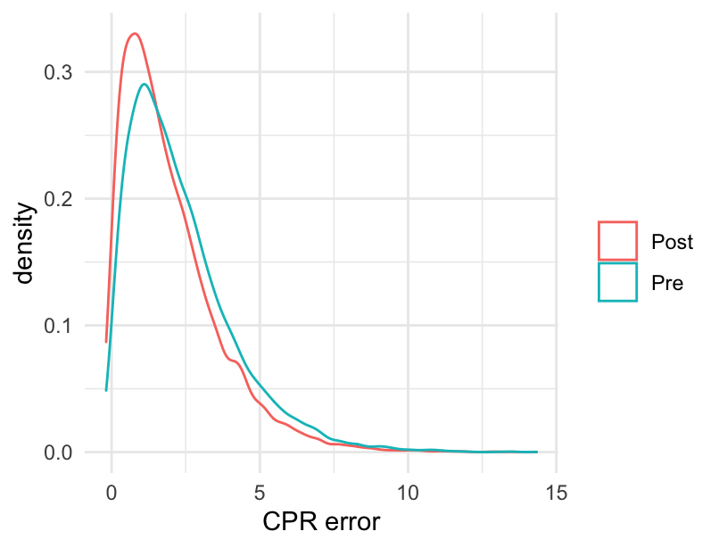
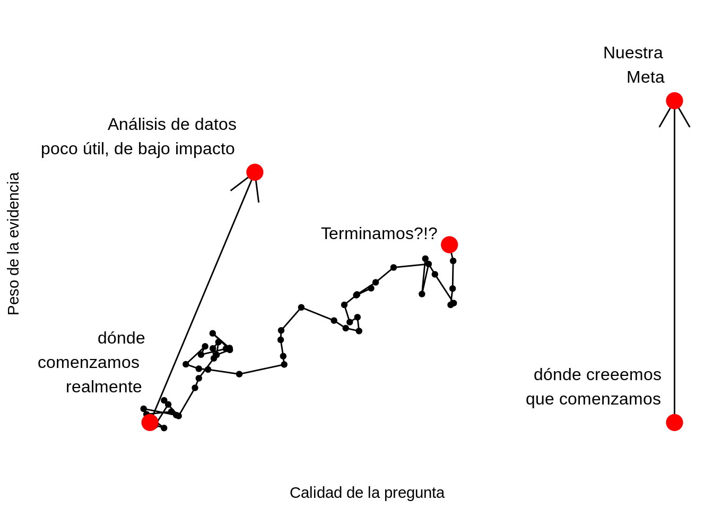
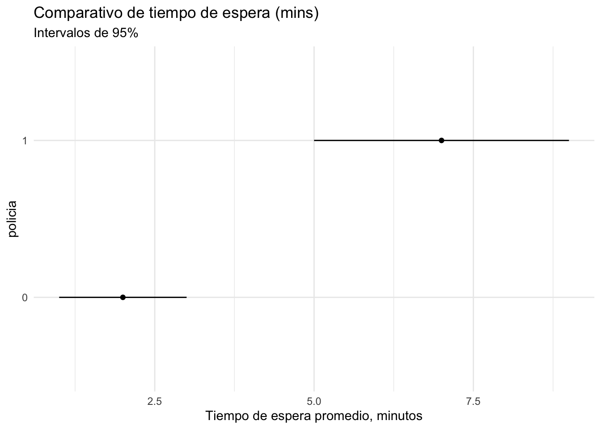

# Tipos de estudio y experimentos

### Motivación {-}

<div class="ejercicio">
<p><strong>Pregunta de entrevista de Google <span class="citation">[@Chihara]</span></strong><br />
Imagina que eres consultor y te preguntan lo siguiente (ver siguiente figura):<br />
Estoy haciendo una comparación de antes y después donde la hipótesis alternativa es pre.media.error &gt; post.media.error. La distribución de ambas muestras es sesgada a la derecha. ¿Qué prueba me recomiendas para ésta situación?</p>
</div>

<div class="figure">

<p class="caption">(\#fig:grafica-pcr)Error CPR, gráfica de densidad.</p>
</div>


La siguiente imagen [Roger Peng](https://simplystatistics.org/2019/04/17/tukey-design-thinking-and-better-questions/) 
representa una situación común a la que se enfrenta el analista de datos, y se
desarrolló en el contexto de preguntas vagas. En el esquema hay tres caminos: 
uno es uno ideal que pocas veces sucede,
otro produce respuestas poco útiles pero es fácil, y otro es tortuoso pero que 
caracteriza el mejor trabajo de análisis de datos:


<div class="figure">

<p class="caption">(\#fig:unnamed-chunk-2)Adaptado de R. Peng: [Tukey, design thinking and better questions.](https://simplystatistics.org/2019/04/17/tukey-design-thinking-and-better-questions/)</p>
</div>


Ejemplos: Alguien nos pregunta cuáles son las tiendas que mas venden de una 
cadena. Podríamos consultar bases de datos, hacer extracciones, definir 
periodos, etc. y dar una respuesta que probablemente es poco útil. Nos damos 
cuenta, por ejemplo, porque la
peor tienda es una que abrió hace relativamente poco, y la mejor es una de las tiendas
más grandes que está en una zona de tráfico de alto costo. Una pregunta más interesante
es, ¿qué equipos de ventas tienen mejor desempeño? ¿Cuánto aporta tener una cafetería dentro
de la tienda en términos de ventas?, etc.  

### Proceso Generador de Datos {-}

Entre las preguntas que se debe hacer el analista de datos una fundamental es
en entender el **proceso que generador de datos**, pues esto determinará que 
otras preguntas son relevantes, tanto en términos prácticos como estadísticos.

* La **inferencia estadística** busca hacer afirmaciones, cuantificadas de 
manera probabilista, acerca de datos que no tenemos, usando regularidades y 
conocimiento de datos que sí tenemos disponibles y métodos cuantitativos.

* Para hacer afirmaciones inferenciales **eficientes y bien calibradas** (con 
garantías estadísticas de calibración) a preguntas donde queremos generalizar de 
muestra a población, se requiere conocer con precisión el proceso que genera los 
datos muestrales. 

* Esto incluye saber con detalle cómo se seleccionaron los datos a partir de 
los que se quiere hacer inferencia.

En este caso, eficiente quiere decir que aprovechamos toda la información que 
está en los datos observados de manera que nuestros rangos de incertidumbre son 
lo más chico posibles (además de estar correctamente calibrados).

Por su parte, probabilísticamente bien calibrados se refiere a que, lo que 
decimos que puede ocurrir con 10% de probabilidad ocurre efectivamente 1 de cada 
10 veces, si decimos 20% entonces ocurre 2 de 20, etc.

Veremos que para muestras dadas naturalmente, a veces es muy difiícil entender a 
fondo el proceso generación de la muestra.

### Ejemplo: Prevalencia de anemia {-}


Supongamos que nos interesa conocer el porcentaje de menores en edad escolar, 
(entre 6 y 15 años), con 
anemia en México. La fuente de datos disponible corresponde a registros de 
del IMSS de hospitalizaciones de menores, ya sea por anemia o 
que por otra causa (infecciones gastrointestinales, apendicitis, tratamiento de 
leucemia, ...), se registró 
si el menor tenía anemia. En nuestra muestra el 47% de los niños tiene anemia.


```r
head(paciente)
```

```
## # A tibble: 6 x 4
##    edad padecimiento         sexo   anemia
##   <int> <chr>                <chr>   <int>
## 1     8 picadura alacrán     mujer       0
## 2    10 infección intestinal hombre      1
## 3     7 mordedura de perro   hombre      1
## 4     8 asma                 hombre      1
## 5    13 infección intestinal mujer       0
## 6     7 picadura alacrán     hombre      0
```


- ¿Qué nos dice esta cantidad acerca de la anemia en la población?  
- ¿Podemos hacer inferencia estadística?  
- ¿Cómo calculamos intervalos de confianza?


```r
# Si calculo el error estándar de la p estimada como sigue, es correcto?
p <- mean(paciente$anemia)
sqrt(p * (1 - p) / 5000)
```

```
## [1] 0.007060751
```


## Muestreo aleatorio {-}

En la situación ideal diseñaríamos una muestra aleatoria de menores de edad, 
por ejemplo, utilizando el registro en educación primaria de la SEP, y 
mediríamos la prevalencia de anemia en la muestra, usaríamos esta muestra para
estimar la prevalencia en la población y tendríamos además las herramientas 
para medir la incertidumbre de nuestra estimación (reportar intervalos, 
o errores estándar).

## Pero si no podemos hacer muestreo aleatorio? {-}

En el caso de prevalencia de anemia, discutiendo con médicos e investigadores
nos informan que la anemia se presenta en tasas más altas en niños más chicos.


```r
paciente %>% 
  count(edad) %>% 
  mutate(prop = round(100 * n / sum(n)))
```

```
## # A tibble: 10 x 3
##     edad     n  prop
##    <int> <int> <dbl>
##  1     6  1001    20
##  2     7   931    19
##  3     8   980    20
##  4     9   445     9
##  5    10   484    10
##  6    11   489    10
##  7    12   246     5
##  8    13   239     5
##  9    14    90     2
## 10    15    95     2
```

Y consultando con las proyecciones de población notamos que los niños chicos 
están sobrerepresentados en la muestra. Lo que nos hace considerar que debemos
buscar una manera de ponderar nuestras observaciones para que reflejen a la
población.

Más aún, investigamos que algunas enfermedades están asociadas a mayor 
prevalencia de anemia:


```r
paciente %>% 
  count(padecimiento) %>% 
  arrange(-n)
```

```
## # A tibble: 7 x 2
##   padecimiento               n
##   <chr>                  <int>
## 1 infección respiratoria   745
## 2 mordedura de perro       723
## 3 úlcera                   723
## 4 asma                     713
## 5 apendcitis               704
## 6 picadura alacrán         701
## 7 infección intestinal     691
```

Utilizamos esta información para modelar y *corregir* nuestra estimación 
original. Por ejemplo con modelos de regresión. Sin embargo, 
debemos preguntarnos:

- ¿Hay más variables qué nos falta considerar?  
- Nuestras estimaciones están bien calibradas?


### Ejemplo: Policías y tráfico {-}

Supongamos que nos preguntan en cuánto reduce un policía el tráfico en
un crucero grande de la ciudad. La cultura popular 
ha establecido que los policías en cruceros hacen más tráfico porque
no saben mover los semáforos. 

Nosotros decidimos buscar unos datos para entender esto. Escogemos
entonces un grupo de cruceros problemáticos, registramos el tráfico
cuando visitamos, y si había un policía o no.


Después de este esfuerzo, obtenemos los siguientes datos:


```
## # A tibble: 10 x 2
## # Groups:   policia [2]
##    policia tiempo_espera_min
##      <int>             <dbl>
##  1       0              2.27
##  2       0              2.65
##  3       0              3.4 
##  4       0              0.39
##  5       0              1.1 
##  6       1             10.8 
##  7       1              4.67
##  8       1              7.77
##  9       1              6.3 
## 10       1              6.99
```

Lo que sabemos ahora es que la presencia de un policía es indicador
de tráfico alto. El análisis prosiguiría calculando medias y medidas de error
(escogimos una muestra aleatoria):


```
## `summarise()` ungrouping output (override with `.groups` argument)
```



Si somos ingenuos, entonces podríamos concluir que los policías efectivamente
empeoran la situación cuando manipulan los semáforos, y confirmaríamos la
sabiduría popular. 

Para juzgar este argumento desde el punto de vista causal, nos preguntamos primero:

- ¿Cuáles son los contrafactuales (los contrafactuales explican que pasaría si hubiéramos 
hecho otra cosa que la que efectivamente hicimos) de las observaciones? 

## El estimador estándar {-}

A la comparación anterior - la diferencia de medias de tratados y no tratados - le llamamos usualmente el _estimador estándar_ del efecto causal. Muchas veces este es un estimador malo del efecto causal.

En nuestro ejemplo, para llegar a la conclusión errónea que confirma la sabiduría popular, hicimos un supuesto importante:

- En nuestra muestra, los casos con policía actúan como contrafactuales de los casos sin policía.
- Asi que asumimos que los casos con policía y sin policía son similares, excepto por la existencia o no de policía.

En nuestro ejemplo, quizá un analista más astuto nota que tienen
categorías históricas de qué tan complicado es cada crucero. Junta a sus datos, y obtiene:


```
## # A tibble: 10 x 3
## # Groups:   policia [2]
##    policia tiempo_espera_min categoria 
##      <int>             <dbl> <fct>     
##  1       0              2.27 Fluido    
##  2       0              2.65 Fluido    
##  3       0              3.4  Típico    
##  4       0              0.39 Fluido    
##  5       0              1.1  Fluido    
##  6       1             10.8  Complicado
##  7       1              4.67 Típico    
##  8       1              7.77 Complicado
##  9       1              6.3  Complicado
## 10       1              6.99 Típico
```

El analista argumenta entonces qu los policías se enviaron principalmente a cruceros que 
se consideran _Complicados_ según datos históricos. Esto resta credibilidad a la 
comparación que hicimos inicialmente:

- La comparación del estimador estándar no es de peras con peras: estamos comparando qué efecto tienen los
policías en cruceros difíciles con cruceros no difíciles donde no hay policía.
- La razón de esto es que el proceso generador de los datos incluye el hecho de que no
se envían policías a lugares donde no hay tráfico.
- ¿Cómo producir contrafactuales hacer la comparación correcta?

## Experimentos tradicionales {-}

Idealmente, quisiéramos observar un mismo crucero en las dos condiciones: con y sin policías. Esto no es posible.

En un experimento "tradicional", como nos lo explicaron en la escuela, nos 
aproximamos a esto preparando dos condiciones idénticas, y luego alteramos cada una de ellas 
con nuestra intervención. Si el experimento está bien hecho, esto nos da observaciones
en pares, y cada quien tiene su contrafactual.

La idea del experimiento tradicional es _controlar_ todos los factores
que intervienen en los resultados, y sólo mover el tratamiento para producir
los contrafactuales. Más en general, esta estrategia consiste en hacer
_bloques_ de condiciones, donde las condiciones son prácticamente idénticas dentro e cada bloque. Comparamos entonces unidades tratadas y no tratadas
dentro de cada bloque.

Por ejemplo, si queremos saber si el tiempo de caída libre es diferente para un objeto
más pesado que otro, prepararíamos dos pesos con el mismo tamaño pero de peso distinto. Soltaríamos los dos al mismo tiempo y compararíamos el tiempo de caída de cada uno.

En nuestro caso, como es usual en problemas de negocio o sociales, hacer esto es considerablemente más difícil. No podemos "preparar" cruceros con condiciones idénticas. Sin embargo, podríamos intentar bloquear los cruceros
según información que tenemos acerca de ellos, para hacer más comparaciones e peras con peras.

## Bloqueo {-}

Podemos acercanos en lo posible a este ideal de experimentación usando
información existente.

En lugar de hacer comparaciones directas entre unidades que recibieron
el tratamiento y las que no (que pueden ser diferentes en otros
aspectos, como vimos arriba),
podemos refinar nuestras comparaciones _bloquéandolas_ con variables
conocidas.

En el ejemplo de los policías, podemos hacer lo siguiente: dentro de
_cada categoría de cruceros_ (fluido, típico o complicado), tomaremos una muestra de cruceros, algunos con
policía y otros sin. Haremos comparaciones dentro de cada categoría.

Obtenemos un muestra con estas características (6 casos en cada categoría
de crucero, 3 con policía y 3 sin policía):


|categoria  | policia|  n|
|:----------|-------:|--:|
|Fluido     |       0|  3|
|Fluido     |       1|  3|
|Típico     |       0|  3|
|Típico     |       1|  3|
|Complicado |       0|  3|
|Complicado |       1|  3|


Y ahora hacemos comparaciones dentro de cada bloque creado por categoría:


```
## # A tibble: 3 x 3
## # Groups:   categoria [3]
##   categoria  `policia =0` `policia =1`
##   <fct>             <dbl>        <dbl>
## 1 Fluido              2.1          0.8
## 2 Típico              5.6          4.2
## 3 Complicado         10.4          8.6
```

Y empezamos a ver otra imagen en estos datos: comparando tipos
e cruceros similares, los que tienen policía tienen tiempos de
espera ligeramente más cortos.

¿Hemos termniado? ¿Podemos concluir que el efecto de un policía 
es beneficiosos pero considerablemente chico? ¿Qué problemas
puede haber con este análisis?

## Variables desconocidas {-}

El problema con el análisis anterior es que controlamos por una
variable que conocemos, pero muchas otras variables pueden estar
ligadas con el proceso de selección de cruceros para enviar policías.

- Por ejemplo, envían o policías a cruceros _Típicos_ solo cuando
reportan mucho tráfico.
- No envían a un polícia a un crucero _Complicado_ si no presenta demasiado 
tráfico.
- Existen otras variables desconocidas que los tomadores de decisiones
usan para enviar a los policías.

En este caso, por ejemplo, los expertos hipotéticos 
nos señalan que hay algunos
cruceros que aunque problemáticos a veces, su tráfico se resuelve 
rápidamente, mientras que otros tienen tráfico más persistente, y 
prefieren enviar policías a los de tráfico persistente. La lista
de cruceros persistentes están en una hoja de excel que se comparte
de manera informal.

En resumen, no tenemos conocimiento detallado del **proceso generador
de datos** en cuanto a cómo se asignan los policías a los cruceros. 

Igual que en la sección anterior, podemos cortar esta complejidad
usando **aleatorización**.

Nótese que los expertos no están haciendo nada malo: en su trabajo
están haciendo el mejor uso de los recursos que tienen. El problema
es que por esa misma razón no podemos saber el resultado de sus esfuerzos,
y si hay maneras de optimizar la asignación que hacen actualmente.

## Aleatorizando el tratamiento {-}

Tomamos la decisión entonces de hacer un experimento que incluya 
aletorización.

En un dia
particular, escogeremos algunos cruceros.
Dicidimos usar solamente cruceros de la categoría _Complicada_ y
_Típica_, pues
esos son los más interesantes para hacer intervenciones. 

Usaremos un poco de código para entener el detalle: en estos datos,
tenemos para cada caso los dos posibles resultados ipotéticos 
$y_0$ y $y_1$ (con
policia y sin policia). En el experimento asignamos el 
tratamiento al azar:


```r
muestra_exp <- trafico_tbl %>% filter(categoria != "Fluido") %>% 
  sample_n(200) %>% 
  # asignar tratamiento al azar, esta es nuestra intervención:
  mutate(tratamiento_policia = rbernoulli(length(y_0), 0.5)) %>%
  # observar resultado
  mutate(tiempo_espera_exp = ifelse(tratamiento_policia ==1, y_1, y_0))
```

Nótese la diferencia si tomamos la asignación natural del tratamiento (policía o no):


```r
set.seed(134)
muestra_natural <- trafico_tbl %>% filter(categoria != "Fluido") %>%  
  sample_n(200) %>% 
  # usamos el tratamiento que se asignó
  # policia indica si hubo o no policía en ese crucero
  # observar resultado
  mutate(tiempo_espera_obs = ifelse(policia ==1, y_1, y_0))
```


Resumimos nuestros resultados del experimento son:


```
## `summarise()` regrouping output by 'categoria' (override with `.groups` argument)
```

```
## # A tibble: 2 x 3
## # Groups:   categoria [2]
##   categoria  `policia=0` `policia=1`
##   <fct>            <dbl>       <dbl>
## 1 Típico            6.24        4.97
## 2 Complicado       15.8         8.47
```

Sin embargo, la muestra natural da:


```
## `summarise()` regrouping output by 'categoria' (override with `.groups` argument)
```

```
## # A tibble: 2 x 3
## # Groups:   categoria [2]
##   categoria  `policia=0` `policia=1`
##   <fct>            <dbl>       <dbl>
## 1 Típico            5.49        4.35
## 2 Complicado       10.8         8.93
```

**¿Cuál de los dos análisis da la respuesta correcta a la pregunta:
ayudan o no los policías a reducir el tráfico en los cruceros
problemáticos?** El experimento establece que un policía en promedio
reduce a la mitad el tiempo de espera en un crucero complicado

## Resumen: selección de unidades y tratamiento {-}

Vimos dos tipos de inferencia que requieren distintos diseños de estudio, 
en particual debemos considerar el mecanismo de aleatorización para 
entender las inferencias que podemos hacer: casual o a poblaciones.

El punto crucial para entender las medidas de incertidumbre estadística es
visualizar de manera hipotética, replicaciones del estudio y las condiciones
que llevaron a la selección de la muestra. Esto es, entender el proceso 
generador de datos e imaginar replicarlo.

![Inferencia estadística de acuerdo al tipo del diseño [@ramsey]](images/03_inferencia-muestra.png)


* El cuadro arriba a la izquierda es donde el análisis es más simple y los 
resultados son más fáciles de interpretar.

* Es posible hacer análisis fuera de este cuadro,  pero el proceso es más 
complicado, requieren más supuestos, conocimiento del dominio y habilidades 
de análisis. En general resultan conclusiones menos sólidas. Muchas veces no 
nos queda otra más que trabajar fuera del cuadro ideal.

<div class="ejercicio">
<p>Ubica los siguientes tipos de análisis:</p>
<ul>
<li>Pruebas clínicas para medicinas</li>
<li>Analizar cómo afecta tener seguro médico a los ingresos, usando datos del ENIGH.</li>
<li>Estimación de retorno sobre inversión en modelos de marketing mix.</li>
</ul>
</div>

## Asignación natural del tratamiento {-}

- Cuando consideramos un sistema donde se "asignan" tratamientos,
generalmente los tratamientos se asignan bajo un criterio de 
optimización o conveniencia. 

- La cara buena de este hecho es que de alguna forma los resultados
están intentando optimizarse, y la gente está haciendo su trabajo.

- La cara mala de este hecho es que no podemos evaluar de manera simple la 
efectividad de los tratamientos. Y esto hace difícil **optimizar** de forma 
cuantificable los procesos, o **entender** qué funciona y qué no.


