# Pruebas de hipótesis


Las primeras técnicas inferenciales que veremos intentan contestar la siguiente pregunta: 

- Si observamos cierto patrón en los datos, ¿cómo podemos cuantificar  la 
evidencia de que es un patrón notable y no sólo debido a fluctuaciones en los 
datos particulares que tenemos?

- ¿Cómo sabemos que no estamos **sobreinterpretando** esas fluctuaciones?


Por ejemplo:

- Un sistema tiene cierto comportamiento "usual" para el cual tenemos datos históricos. 
El sistema presenta fluctuaciones en el tiempo.
- Observamos la última salida de nuestro sistema. Naturalmente, tiene fluctuaciones. 
¿Esas fluctuaciones son consistentes con la operación usual del sistema? ¿Existe
evidencia para pensar que algo en el sistema cambió?

## Comparación con poblaciones de referencia {-}

En las prueba de hipótesis, tratamos de construir distribuciones de referencia 
para comparar resultados que obtengamos con un "estándar" de variación, y juzgar 
si nuestros resultados son consistentes con la referencia o no (@box78). 

En algunos casos, ese estándar de variación puede construirse con datos históricos.

### Ejemplo {-}

Supongamos que estamos considerando cambios rápidos en una serie de tiempo de 
alta frecuencia. Hemos observado la serie en su estado "normal" durante un 
tiempo considerable, y cuando observamos nuevos datos **quisiéramos juzgar si 
hay indicaciones o evidencia en contra de que el sistema sigue funcionando
de manera similar**. 

Digamos que monitoreamos ventanas de tiempo de tamaño 20 y necesitamos tomar una decisión. Abajo
mostramos cinco ejemplos donde el sistema opera normalmente, que muestra la variabilidad
en el tiempo en ventanas cortas del sistema.

Ahora suponemos que obtenemos una nueva ventana de datos. ¿Hay evidencia en contra
de que el sistema sigue funcionando de manera similar?

Nuestra primera inclinación debe ser comparar: en este caso, compararamos ventanas históricas con nuestra nueva serie:


```r
# usamos datos simulados para este ejemplo
set.seed(8812)
historicos <- simular_serie(2000)
```


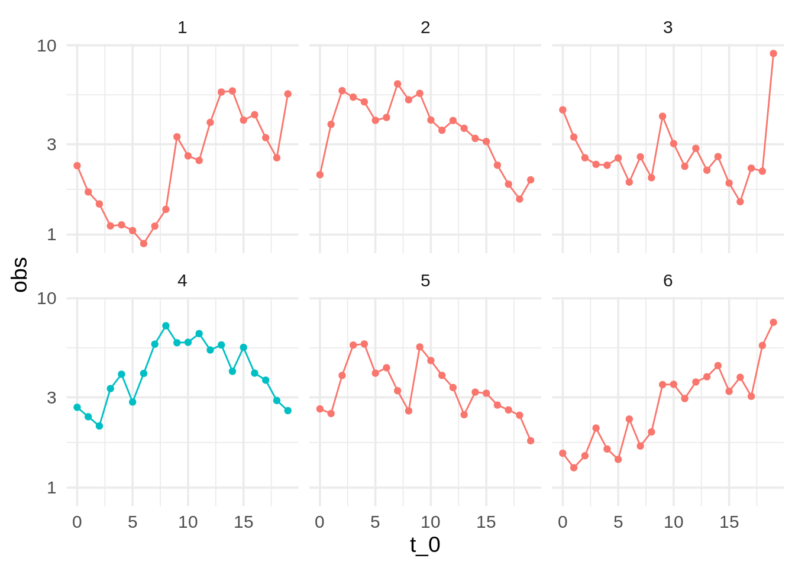

¿Vemos algo diferente en los datos nuevos (el panel de color diferente)? 

Indpendientemente de la respuesta, vemos que hacer **este análisis de manera tan simple no es siempre útil**: 
seguramente podemos encontrar maneras en que la nueva muestra (4) es diferente
a muestras históricas. Por ejemplo, ninguna de muestras tiene un "forma de montaña" tan clara. 

Nos preguntamos si no estamos **sobreinterpretando** variaciones que son parte normal del proceso. 

Podemos hacer un mejor análisis si extraemos varias muestras del comportamiento
usual del sistema, graficamos junto a la nueva muestra, y **revolvemos** las gráficas
para que no sepamos cuál es cuál.  Entonces la pregunta es:

- ¿Podemos detectar donde están los datos nuevos?

Esta se llama una **prueba de lineup**, o una *prueba de ronda de sospechosos* (@lineup).
En la siguiente gráfica, en uno de los páneles
están los datos recientemente observados.  ¿Hay algo en los datos que distinga al patrón nuevo?


```r
# nuevos datos
obs <- simular_serie(500, x_inicial = last(obs$obs))
# muestrear datos históricos
prueba_tbl <- muestrear_ventanas(historicos, obs[1:20, ], n_ventana = 20)
# gráfica de pequeños múltiplos
ggplot(prueba_tbl$lineup, aes(x = t_0, y = obs)) + geom_line() + 
     facet_wrap(~rep, nrow = 4) + scale_y_log10()
```

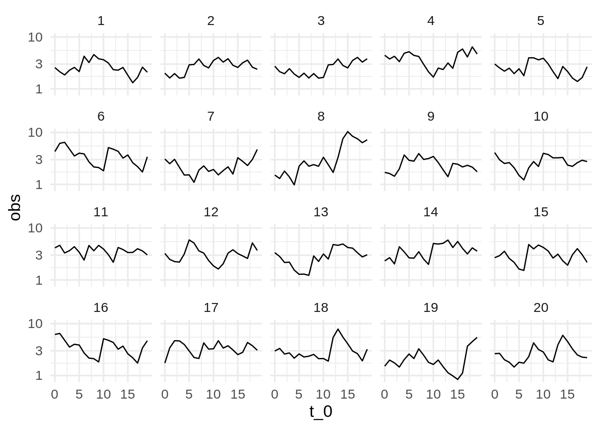

<div class="ejercicio">
<p>¿Cuáles son los datos nuevos (solo hay un panel con los nuevos datos)? ¿Qué implica que la gráfica que escogamos como “más diferente” no sean los datos nuevos? ¿Qué implica que le “atinemos” a la gráfica de los datos nuevos?</p>
</div>

Ahora observamos al sistema en otro momento y repetimos la comparación. En el siguiente caso obtenemos:

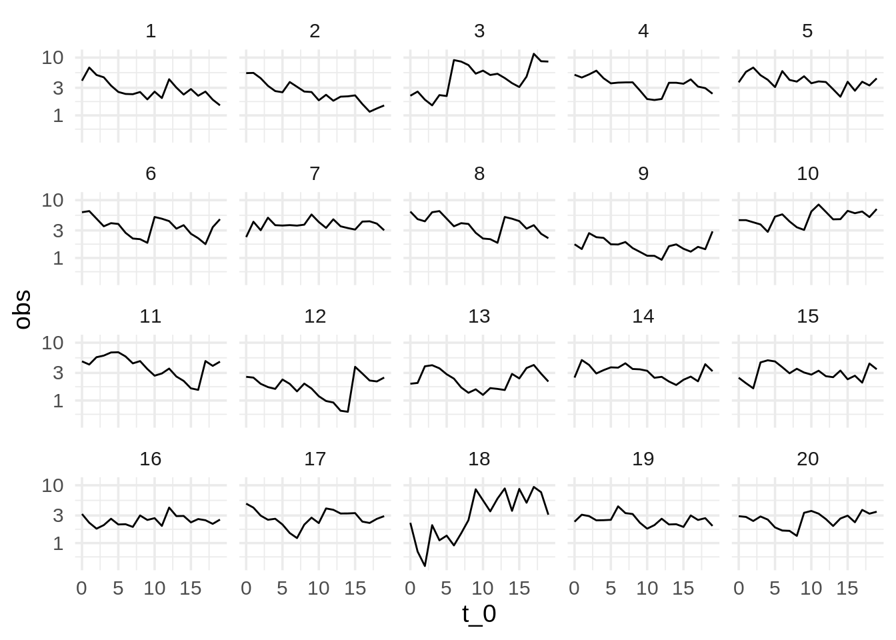

Aunque es imposible estar seguros de que ha ocurrido un cambio, la diferencia de una de las
series es muy considerable. Si identificamos los datos correctos,
la probabilidad de que hayamos señalado la nueva serie "sobreinterpretando" 
fluctuaciones en un proceso que sigue comportándose normalente es 0.05 - relativamente baja.
**Detectar los datos diferentes es evidencia en contra de que el sistema sigue funcionando de la misma
manera que antes.**


**Observaciones y terminología**:

1. Llamamos *hipótesis nula* a la hipótesis de que los nuevos 
datos son producidos bajo las mismas condiciones que los datos de control o de referencia.

3. **Si no escogemos la gráfica de los nuevos datos, nuestra conclusión es que 
la prueba no aporta evidencia en contra de la hipótesis nula.** 

4. **Si escogemos la gráfica correcta, nuestra conclusión es que la prueba aporta evidencia
en contra de la hipótesis nula.**

¿Qué tan fuerte es la evidencia, en caso de que descubrimos los datos no nulos? 

5. Cuando el número de paneles es más grande y detectamos los datos, la evidencia es más alta en contra de la nula. 
Decimos que el *nivel de significancia de la prueba* es la probabilidad de seleccionar a los
datos correctos cuando la hipótesis nula es cierta (el sistema no ha cambiado). 
En el caso de 20 paneles, la significancia es de 1/20 = 0.05. Cuando detectamos los datos nuevos,
niveles de significancia más bajos implican más evidencia en contra de la nula.

5. Si acertamos, y la diferencia es más notoria y fue muy fácil detectar la gráfica diferente (pues
sus diferencias son más extremas),
esto también sugiere más evidencia en contra de la hipótesis nula.

6. Finalmente, esta prueba rara vez (o nunca) **nos da seguridad completa acerca de ninguna conclusión**, aún cuando
hiciéramos muchos páneles.

## Comparando distribuciones {-}

Ahora intentamos un ejemplo más típico.

Supongamos tenemos *muestras* para tres grupos  a, b y c, que quiere decir
que dentro de cada grupo, el proceso e selección de los elementos se hace
de manera al azar y de manera simétrica (por ejemplo cada elemento tiene a misma probabiidad de ser seleccionado,
y las extracciones se hacen de manera independiente.)

Queremos comparar las distribuciones de los datos obtenidos para cada grupo. 
Quizá la pregunta detrás de esta 
comparación es: el grupo de clientes b recibió una promoción especial. ¿Están gastando
más? La medición que comparamos es el gasto de los clientes.


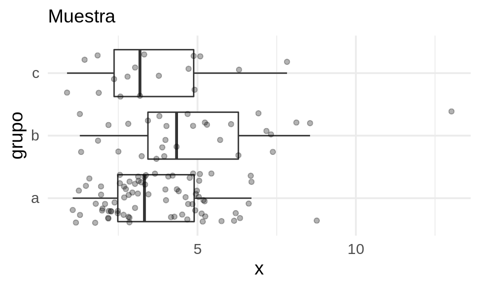

En la muestra observamos diferencias entre los grupos. Pero notamos adicionalmente que
hay mucha variación dentro de cada grupo. **Nos podríamos preguntar entonces si las diferencias
que observamos se deben variación muestral, por ejemplo.** 

Podemos construir ahora una *hipótesis nula*, que establece que las observaciones
provienen de una población similar:

- Las tres poblaciones (a, b, c) 
son prácticamente indistiguibles. En este
caso, la variación que observamos se debería a que tenemos información incompleta.

Como en el ejemplo anterior **necesitamos construir o obtener una distribución de referencia** para comparar
qué tan extremos o diferentes son los datos que observamos. Esa distribución de referencia debería
estar basada en el supuesto de que los grupos producen datos de distribuciones similares.

Si tuvieramos mediciones similares históricas de estos tres grupos, quizá podríamos extraer
datos de referencia y comparar, como hicimos en el ejempo anterior. Pero esto es menos común en
este tipo de ejemplos.


## Permutaciones y el lineup {-}

Para abordar este problema podemos pensar en usar permutaciones de los grupos de
la siguiente forma (@box78, @timboot14):

- Si los grupos producen
datos bajo procesos idénticos, entonces los grupos a, b, c solo son etiquetas que no contienen información.
- Podríamos **permutar al azar** las etiquetas y observar nuevamente la gráfica
de caja y brazos por grupos.
- Si la hipótesis nula es cierta (grupos idénticos), esta es una muestra tan verosímil como la que obtuvimos.
- Así que podemos construir datos de referencia permutando las etiquetas de los grupos al azar, y observando la variación que ocurre.
- Si la hipótesis nula es cercana a ser cierta, no deberíamos de poder distinguir fácilmente los 
datos observados de los producidos con las permutaciones al azar.

Vamos a intentar esto, por ejemplo usando una gráfica de cuantiles simplificada. Hacemos un *lineup*, o una
*rueda de sospechosos* (usamos el paquete @nullabor, ver @lineup), 
donde 19 de los acusados **son generados mediante permutaciones al azar** de la variable del grupo,
y el culpable (los verdaderos datos) están en una posición escogida al azar. ¿Podemos identificar
los datos verdaderos? Para evitar sesgarnos, también ocultamos la etiqueta verdadera

Usamos una gráfica que muestra los cuantes 0.10, 0.50, 0.90:


```r
set.seed(88)
reps <- lineup(null_permute("grupo"), muestra_tab, n = 20)
reps_mezcla <- reps %>%  mutate(grupo_1 = factor(digest::digest2int(grupo) %% 177))
grafica_cuantiles(reps_mezcla, grupo_1, x) + 
    facet_wrap(~.sample, ncol = 5) + ylab("x") + 
    labs(caption = "Mediana y percentiles 10% y 90%")+ geom_point(aes(colour = grupo_1))
```

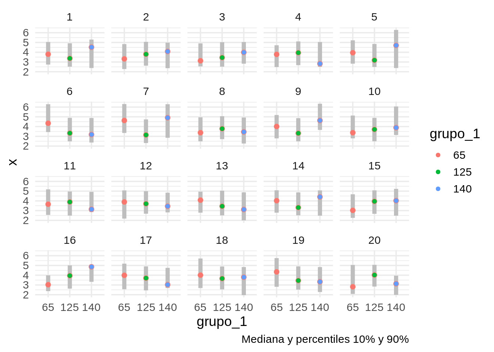

Y la pregunta que hacemos es **podemos distinguir nuestra muestra entre todas las 
replicaciones producidas con permutaciones**? 

<div class="ejercicio">
<p>¿Dónde están los datos observados? Según tu elección, ¿qué tan diferentes son los datos observados de los datos nulos?</p>
</div>

En este ejemplo, es difícil indicar cuáles son los datos. Los grupos tienen distribuciones
similares y es factible que las diferencias que observamos se deban a variación muestral.  

- Si la persona escoge los verdaderos datos, encontramos evidencia en contra de la hipótesis nula
(los tres grupos son equivalentes).
En algunos contextos, se dice que los datos son *significativamente diferentes* al nivel 0.05. Esto es 
evidencia en contra de que los datos se producen de manera homogénea, independientemente del grupo.

- Si la persona escoge uno de los datos permutados, 
no encontramos evidencia en contra de que los tres grupos producen datos con
 distribuciones similares.

## Comparaciones con lineup 2 {-}

Repitimos el ejemplo para otra muestra (en este ejemplo el proceso generador
de datos es diferente para el grupo b):

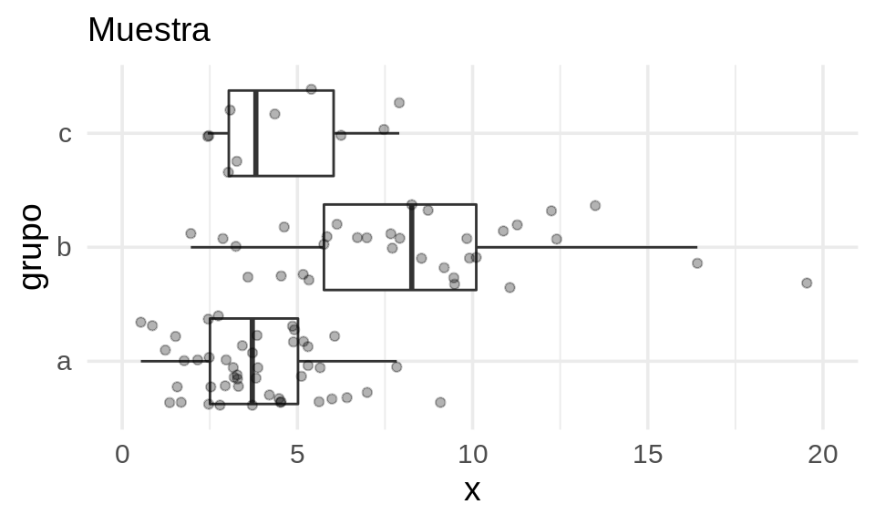

Hacemos primero la prueba del *lineup*:


```r
set.seed(121)
reps <- lineup(null_permute("grupo"), muestra_tab, n = 20)
grafica_cuantiles(reps %>%  mutate(grupo_escondido = factor(digest::digest2int(grupo) %% 177)), 
                             grupo_escondido, x) + facet_wrap(~.sample) + ylab("x") +
    coord_flip() + geom_point(aes(colour = grupo_escondido))
```

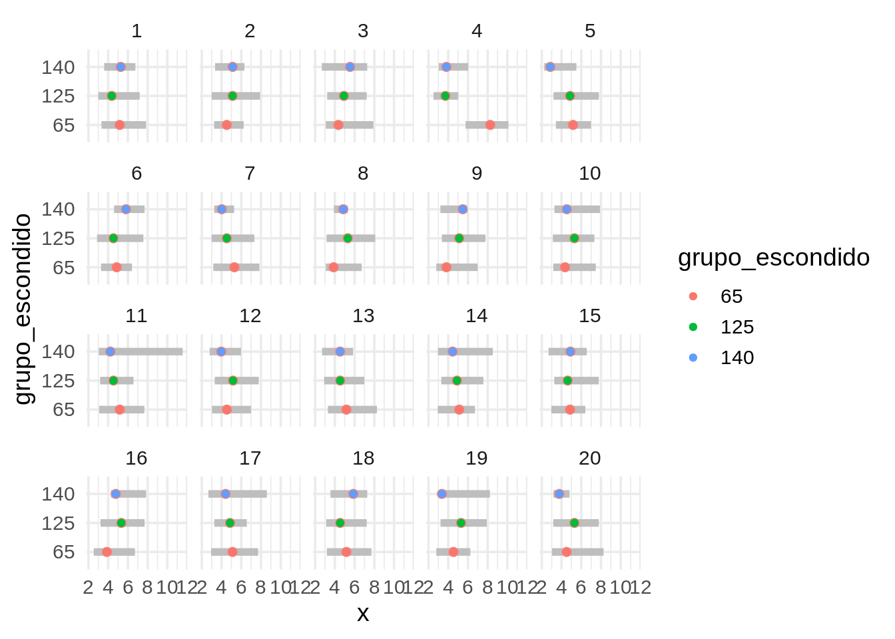
Podemos distinguir más o menos claramente que está localizada en valores
más altos y tiene mayor dispersión. En este caso, como en general podemos identificar los
datos, obtenemos evidencia en contra de que los tres grupos tienen distribuciones iguales.

Estos ejemplos siguen la idea de inferencia visual propuestas en 
@lineup, @graphical-tests e implementadas en R en el paquete `lineup`. Son 
pruebas muy flexibles y estadísticamente rigurosas.

## Prueba de permutaciones para proporciones {-}

Veremos otro ejemplo donde podemos hacer más concreta la idea de 
**distribución nula o de referencia** usando pruebas de permutaciones. Supongamos 
que con nuestra muestra
de tomadores de té, queremos probar la siguiente hipótesis nula:

- Los tomadores de té en bolsas exclusivamente usan azúcar más a tasas simillares que
los tomadores de té suelto (que pueden o no también tomar té en bolsita).

Los datos que obtuvimos en nuestra encuesta, en conteos, son:


```r
te_azucar <- tea %>% select(how, sugar) %>% 
  mutate(how = ifelse(how == "tea bag", "bolsa_exclusivo", "suelto o bolsa"))
te_azucar %>% count(how, sugar) %>% 
  pivot_wider(names_from = how, values_from = n) %>% 
  formatear_tabla()
```


|sugar    | bolsa_exclusivo| suelto o bolsa|
|:--------|---------------:|--------------:|
|No.sugar |              81|             74|
|sugar    |              89|             56|

Y en proporciones tenemos que:

<table class="table table-striped table-hover table-condensed table-responsive" style="width: auto !important; margin-left: auto; margin-right: auto;">
 <thead>
  <tr>
   <th style="text-align:left;position: sticky; top:0; background-color: #FFFFFF;"> how </th>
   <th style="text-align:right;position: sticky; top:0; background-color: #FFFFFF;"> prop_azucar </th>
   <th style="text-align:right;position: sticky; top:0; background-color: #FFFFFF;"> n </th>
  </tr>
 </thead>
<tbody>
  <tr>
   <td style="text-align:left;"> bolsa_exclusivo </td>
   <td style="text-align:right;"> 0.52 </td>
   <td style="text-align:right;"> 170 </td>
  </tr>
  <tr>
   <td style="text-align:left;"> suelto o bolsa </td>
   <td style="text-align:right;"> 0.43 </td>
   <td style="text-align:right;"> 130 </td>
  </tr>
</tbody>
</table>

Pero distintas muestras podrían haber dado distintos resultados. Nos preguntamos 
qué tan fuerte es la evidencia en contra de que en realidad los dos grupos de personas usan azúcar en proporciones similares,
y la diferencia que vemos se puede atribuir a variación muestral.

En este ejemplo, podemos usar una **estadística de prueba numérica**, por ejemplo, 
la diferencia entre las dos proporciones: 

$$p_1 - p_2$$. 

(tomadores de en bolsa solamente vs. suelto y bolsa). El proceso sería entonces:

- La hipótesis nula es que los dos grupos tienen distribuciones iguales, que 
este caso quiere decir que en la población, tomadores de té solo en bolsa usan 
azúcar a las mismas tasas que tomadores de suelto o bolsas.
- Bajo nuestra hipótesis nula (proporciones iguales), producimos una cantidad 
grande (por ejemplo 10 mil o más) de muestras permutando las etiquetas de los 
grupos.
- Evaluamos nuestra estadística de prueba en cada una de las muestras 
permutadas.
- El conjunto de valores obtenidos nos da nuestra *distribución de referencia* 
(ya no estamos limitados a 20 replicaciones como en las pruebas gráficas).
- Y la pregunta clave es: ¿el valor de la estadística en nuestra muestra es 
*extrema* en comparación a la distribución de referencia?


```r
# ESta función calcula la diferencia entre grupos de interés
calc_diferencia <- function(datos){
  datos %>%
    mutate(usa_azucar = as.numeric(sugar == "sugar")) %>% 
    group_by(how) %>% 
    summarise(prop_azucar = mean(usa_azucar)) %>% 
    pivot_wider(names_from = how, values_from = prop_azucar) %>% 
    mutate(diferencia_prop = bolsa_exclusivo - `suelto o bolsa`) %>% pull(diferencia_prop)
}
# esta función hace permutaciones y calcula la diferencia para cada una
permutaciones_est <- function(datos, variable, calc_diferencia, n = 1000){
  # calcular estadística para cada grupo
  permutar <- function(variable){
    sample(variable, length(variable))
  }
  tbl_perms <- tibble(.sample = seq(1, n-1, 1)) %>%
    mutate(diferencia = map_dbl(.sample, 
              ~ datos %>% mutate({{variable}}:= permutar({{variable}})) %>% calc_diferencia))
  bind_rows(tbl_perms, tibble(.sample = n, diferencia = calc_diferencia(datos)))
}
```

La diferencia observada es:


```r
dif_obs <- calc_diferencia(te_azucar)
dif_obs %>% round(3)
```

```
## [1] 0.093
```

Ahora construimos nuestra distribución nula o de referencia:


```r
valores_ref <- permutaciones_est(te_azucar, how, calc_diferencia, n = 10000)
```


```r
reps <- lineup(null_permute("how"), te_azucar, n = 10000)
valores_ref <- reps %>% 
  group_by(.sample) %>% 
  nest() %>% 
  mutate(diferencia = lapply(data, calc_diferencia)) %>% 
  unnest(diferencia)
```

Y graficamos nuestros resultados (con un histograma y una gráfica de cuantiles, por ejemplo). la
estadística evaluada un cada una de nuestras muestras permutadas:


```r
g_1 <- ggplot(valores_ref, aes(sample = diferencia)) + geom_qq(distribution = stats::qunif)  +
    xlab("f") + ylab("diferencia") + labs(subtitle = "Distribución nula o de referencia")
g_2 <- ggplot(valores_ref, aes(x = diferencia)) + geom_histogram(binwidth = 0.04) + 
    coord_flip() + xlab("") + labs(subtitle = " ")
g_1 + g_2
```

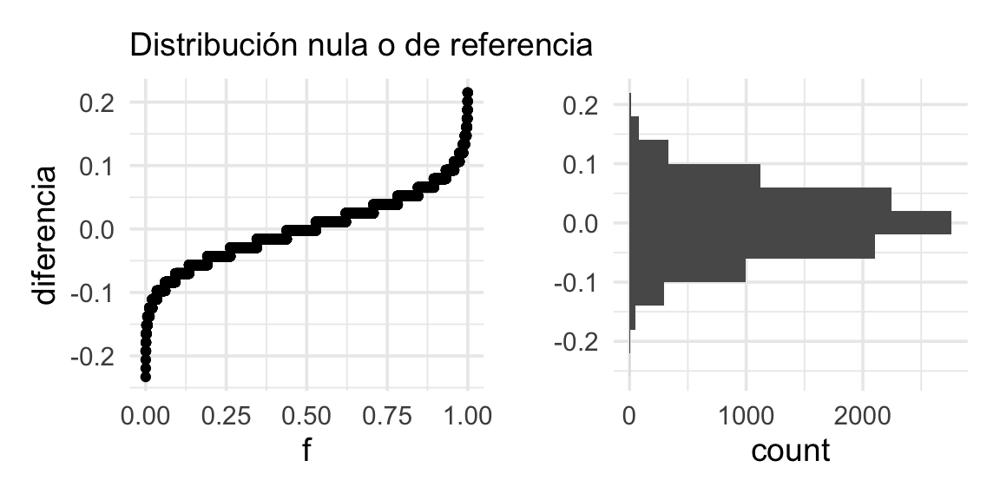

Este es el rango de fluctuación usual para nuestra estadística *bajo la 
hipótesis de que los dos grupos de tomadores de té consumen té a la misma tasa.
El valor que obtuvimos en nuestros datos es 0.09,
que no es un valor extremo en la distribución de referencia que vimos arriba: esta
muestra no aporta mucha evidencia en contra de que los grupos tienen distribuciones similares.
Podemos graficar otra vez marcando el valor de referencia:


```r
# Función de distribución acumulada (inverso de función de cuantiles)
dist_perm <- ecdf(valores_ref$diferencia)
# Calculamos el percentil del valor observado
percentil_obs <- dist_perm(dif_obs)
```


```r
g_1 <- ggplot(valores_ref, aes(sample = diferencia)) + geom_qq(distribution = stats::qunif)  +
    xlab("f") + ylab("diferencia") + labs(subtitle = "Distribución nula o de referencia") +
    geom_hline(yintercept = dif_obs, colour = "red") +
    annotate("text", x = 0.3, y = dif_obs - 0.05, label = "diferencia observada", colour = "red")
g_2 <- ggplot(valores_ref, aes(x = diferencia)) + geom_histogram(binwidth = 0.04) + 
    coord_flip() + xlab("") + labs(subtitle = " ") +
    geom_vline(xintercept = dif_obs, colour = "red") +
    annotate("text", x = dif_obs, y = 2000, label = percentil_obs,vjust = -0.2, colour = "red")
g_1 + g_2 
```

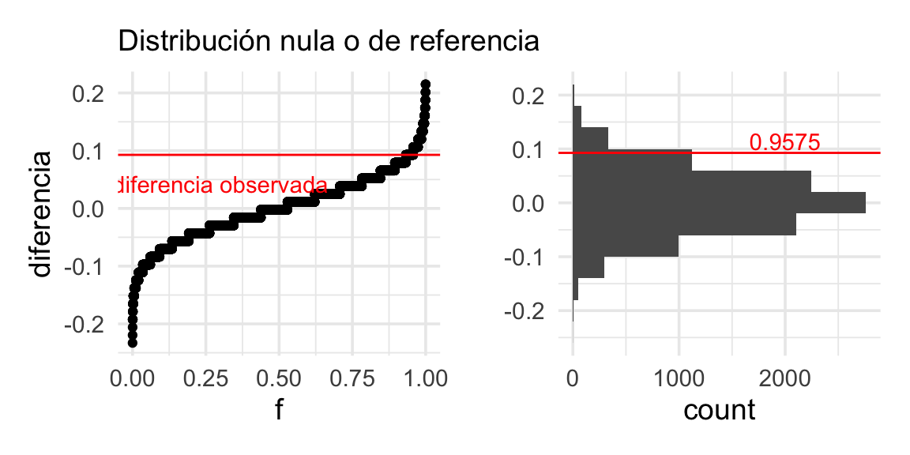

Y vemos que es un valor algo (pero no muy) extremo en la distribución de referencia que vimos arriba: esta
muestra no aporta una gran cantidad de 
evidencia en contra de que los grupos tienen distribuciones similares, que
en este caso significa que los dos grupos usan azúcar a tasas similares.


## Pruebas de hipótesis tradicionales {-}

Comencemos recordando la definición de parámetro y estadística. 

<div class="mathblock">
<p><strong>Definición.</strong> Un <strong>parámetro</strong> es una característica (numérica) de una población o de una distribución de probabilidad.<br />
Una <strong>estadística</strong> es una característica (numérica) de los datos.</p>
</div>

Cualquier función de un parámetro es también un parámetro, y cualquier función 
de una estadística es también una estadística. Cuando la estadística se calcula
de una muestra aleatoria, es por consiguiente aleatoria y es por tanto una 
variable aleatoria.

* Por ejemplo $\mu$ y $\sigma$ son parámetros de la distribución normal con 
función de densidad $f(x) = (1/\sqrt{2\pi}\sigma)e^{(x-\mu)^2/(2\sigma^2)}$.  
La varianza $\sigma^2$, y el cociente (*señal a ruido*) $\mu/\sigma$ también
son parámetros.

* Si $X_1,X_2,...,X_n$ son una muestra aleatoria, entinces la media 
$\bar{X}=1/n\sum X_i$ es una estadística.

Ahora podemos pasar a las definiciones correspondientes a pruebas de hipótesis
(o pruebas de significancia).

<div class="mathblock">
<p><strong>Definición.</strong> Denotamos por <span class="math inline">\(H_0\)</span> a la <em>hipótesis nula</em> la cual usualmente tratamos como la afirmación del <em>status quo.</em> La hipótesis alternativa la denotamos por <span class="math inline">\(H_1\)</span> y representa el supuesto que está a prueba y para el cual buscamos evidencia en los datos.</p>
</div>

<div class="mathblock">
<p><strong>Definición.</strong> La hipótesis normalmente se plantea en términos de un parámetro (<span class="math inline">\(\theta\in\mathbb{R}\)</span>) o conjunto de parámetros (<span class="math inline">\(\theta\in\mathbb{R}^p\)</span>) de la distribución de interés (por ejemplo media, moda, varianza). Para una hipótesis nula del estilo <span class="math inline">\(H_0: \theta = \theta_0,\)</span> la hipótesis a contrastar se puede denominar como:</p>
<ul>
<li><em>Hipótesis alternativa de una cola</em> <span class="math inline">\(H_1: \theta &gt; \theta_0\)</span><br />
</li>
<li><em>Hipótesis alternativa de dos colas</em> <span class="math inline">\(H_1: \theta \neq \theta_0\)</span></li>
</ul>
</div>

En el ejemplo anterior planteamos hipótesis nula (proporciones iguales) e 
hipótesis alternativa que la proporción de tomadores de te suelto que usan 
azúcar en menor, esto corresponde a una hipótesis alternativa a dos colas: 
$H_0: p_1 = p_2$, y $H_1:p_1 > p_2$.


<div class="mathblock">
<p><strong>Definición.</strong> Una <em>estadística de prueba</em> es una función numérica de los datos cuyo valor determina el resultado de la prueba. La función usualmente es denotada por <span class="math inline">\(T(\bf X)\)</span> donde <span class="math inline">\(\bf X\)</span> representa los datos como variable aleatoria. Por ejemplo, <span class="math inline">\(T = T(X_1, \ldots, X_N)\)</span> si sólo tenemos una muestra, o por <span class="math inline">\(T = T(X_1, \ldots, X_N, Y_1, \ldots, Y_M)\)</span> en el caso de tener dos muestras. Al evaluar la prueba para un conjunto de datos dado, <span class="math inline">\(x\)</span>, ésta se denomina <em>estadística de prueba observada,</em> <span class="math inline">\(t = T(x).\)</span></p>
</div>

La estadística de prueba correspondiente al ejemplo es $T = p_1 - p_2$

<div class="mathblock">
<p><strong>Definición.</strong> El <em>valor p</em> es la probabilidad de que bajo la hipótesis nula los datos generen un valor tan extremo como la estadística de prueba observada. Por ejemplo, si consideramos la hipótesis nula admite valores grandes, el valor p se calcula como <span class="math inline">\(P(T \geq t).\)</span></p>
</div>

En el ejemplo de tomadores de té lo calculamos usando el percentil donde 
nuestra observación cae en la distribución generada por las permutación  (valor
*p* de una cola).
.
Podemos calcular, por ejemplo:

- **Valor p de dos colas**: Si la hipótesis nula es cierta, ¿cuál es la
**probabilidad** de observar una diferencia **tan extrema o más extrema de lo 
que observamos**? 

Considerando en este caso interpretamos *extrema* como que cae lejos de donde a 
mayoría de la distribución se concentra, podemos calcular el valor p como sigue. 
A partir de el valor observado, consideramos cuál dato es menor: la probabilidad 
bajo lo hipótesis nula de observar una diferencia mayor de a que observamos, o 
la probabilidad de observar una diferencia menor a la que observamos. Tomamos 
el mínimo y multiplicamos por dos (@timboot14):


```r
2 * min(dist_perm(dif_obs), (1 - dist_perm(dif_obs)))
```

```
## [1] 0.085
```

Este valor *p* se considera como evidencia "moderada" en contra de la hipótesis 
nula. Valores p más chicos (observaciones más extremas en comparación con la 
referencia) aportan más evidencia en contra de la hipótesis de que los grupos de 
tomadores de té , y valores más grandes aportan menos evidencia.


<div class="mathblock">
<p><strong>Definición.</strong> Un resultado es <strong>estadisticamente significativo</strong> si tiene muy baja probabilidad de suceder al azar.</p>
</div>

Entre más pequeño requiramos un valor *p* oara declarar un resultado 
estadísticamente significativo, somos más conservadores.

Las pruebas de hipótesis con frecuencia inician contestando una pregunta más
general que los valores *p*: ¿Cuál es la distribución de la estadística de
prueba cuando no hay efecto real?

<div class="mathblock">
<p><strong>Definición.</strong> La <strong>distribución nula</strong> es la disttibución de la estadística de prueba si la hipótesis nula es cierta.</p>
</div>

En ocasiones también nos referimos a ella como la distribución de referencia
pues estamos comparando la estadística de prueba observada a su referencia 
para determinar que tan inusual es.

En el ejemplo de tomadores de te aproximamos la distribución nula (y los valores
*p*) con simulación; sin embargo, para algunas estadisticas hay métodos exactos.

En particular, usamos el método de pruebas de permutación, el algoritmo para
dos grupos sería como sigue.

<div class="mathblock">
<p><strong>Prueba de permutación para dos muestras</strong></p>
<p>Supongamos que tenemos <em>m</em> observaciones de una población y <em>n</em> de otra.</p>
<ul>
<li>Combina los <code>m+n</code> valores.<br />
</li>
<li>Repite:
<ul>
<li>Saca una remuestra de tamaño <code>m</code> sin reemplazo.</li>
<li>Usa las <code>n</code> observaciones restantes para obtener la otra muestra.</li>
<li>Calcula la estadística de prueba (que compara las muestras).</li>
</ul></li>
<li>Calcula el valor <em>p</em> como la fracción de las veces que la estadística sobrepasó la estadística observada, multiplica por 2 para una prueba de dos lados.</li>
</ul>
</div>

La distribución de la estadística a lo largo de las remuestras de permutación 
es la **distribución de permutación**. Ésta puede ser exacta, si se calcula
exhaustivamente (cuando tenemos pocas observaciones es posible) o aproximada.

## Tomadores de té 2 {-}

Ahora hacemos una prueba de permutaciones otro par de proporciones con el mismo 
método. La hipótesis nula ahora es: 

- Los tomadores de té Earl Gray usan azúcar a una tasa similar a los tomadores de té negro

Los datos que obtuvimos en nuestra encuesta, en conteos, son:

<table class="table table-striped table-hover table-condensed table-responsive" style="width: auto !important; margin-left: auto; margin-right: auto;">
 <thead>
  <tr>
   <th style="text-align:left;position: sticky; top:0; background-color: #FFFFFF;"> sugar </th>
   <th style="text-align:right;position: sticky; top:0; background-color: #FFFFFF;"> black </th>
   <th style="text-align:right;position: sticky; top:0; background-color: #FFFFFF;"> Earl Grey </th>
  </tr>
 </thead>
<tbody>
  <tr>
   <td style="text-align:left;"> No.sugar </td>
   <td style="text-align:right;"> 51 </td>
   <td style="text-align:right;"> 84 </td>
  </tr>
  <tr>
   <td style="text-align:left;"> sugar </td>
   <td style="text-align:right;"> 23 </td>
   <td style="text-align:right;"> 109 </td>
  </tr>
</tbody>
</table>

Y en porcentajes tenemos que:


```r
prop_azucar <- te_azucar %>% 
  count(Tea, sugar) %>% 
  group_by(Tea) %>% 
  mutate(prop = 100 * n / sum(n), 
         n = sum(n)) %>% 
  filter(sugar == "sugar") %>% 
  select(Tea, prop_azucar = prop, n) %>% 
  mutate('% usa azúcar' = round(prop_azucar)) %>% 
  select(-prop_azucar)
prop_azucar %>% formatear_tabla
```

<table class="table table-striped table-hover table-condensed table-responsive" style="width: auto !important; margin-left: auto; margin-right: auto;">
 <thead>
  <tr>
   <th style="text-align:left;position: sticky; top:0; background-color: #FFFFFF;"> Tea </th>
   <th style="text-align:right;position: sticky; top:0; background-color: #FFFFFF;"> n </th>
   <th style="text-align:right;position: sticky; top:0; background-color: #FFFFFF;"> % usa azúcar </th>
  </tr>
 </thead>
<tbody>
  <tr>
   <td style="text-align:left;"> black </td>
   <td style="text-align:right;"> 74 </td>
   <td style="text-align:right;"> 31 </td>
  </tr>
  <tr>
   <td style="text-align:left;"> Earl Grey </td>
   <td style="text-align:right;"> 193 </td>
   <td style="text-align:right;"> 56 </td>
  </tr>
</tbody>
</table>

Pero distintas muestras podrían haber dado distintos resultados. Nos preguntamos 
que tan fuerte es la evidencia en contra de que en realidad los dos grupos de 
personas usan azúcar en proporciones similares, y la diferencia que vemos se 
puede atribuir a variación muestral.

Escribimos la función que calcula diferencias para cada muestra:


```r
calc_diferencia_2 <- function(datos){
  datos %>%
    mutate(usa_azucar = as.numeric(sugar == "sugar")) %>% 
    group_by(Tea) %>% 
    summarise(prop_azucar = mean(usa_azucar)) %>% 
    pivot_wider(names_from = Tea, values_from = prop_azucar) %>% 
    mutate(diferencia_prop = `Earl Grey` - black) %>% 
    pull(diferencia_prop)
}
```

La diferencia observada es:


```
## [1] 0.254
```

Ahora construimos nuestra distribución nula o de referencia:


```r
set.seed(2)
reps <- lineup(null_permute("Tea"), te_azucar, n = 10000)
valores_ref <- reps %>% 
  group_by(.sample) %>% 
  nest() %>% 
  mutate(diferencia = lapply(data, calc_diferencia_2)) %>% 
  unnest(diferencia)
```

Y podemos graficar la distribución de referencia otra vez marcando el valor observado


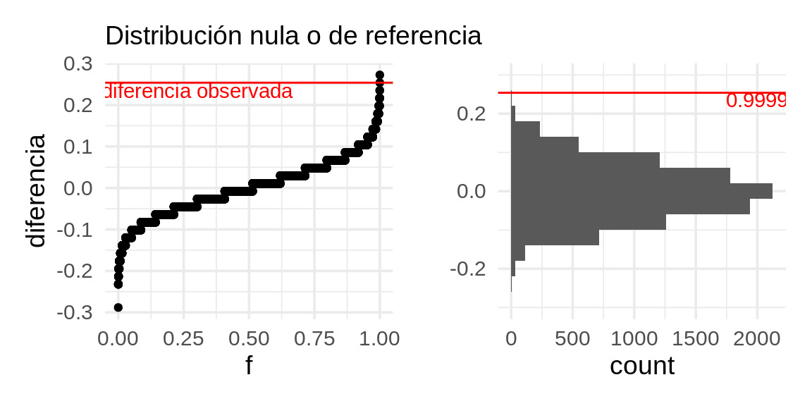

En este caso, la evidencia es muy fuerte en contra de la hipótesis nula, pues el
resultado que obtuvimos es muy extremo en relación a la distribución de referencia.
El valor p es cercano a 0.

<div class="ejercicio">
<p>Haz una prueba de permutaciones para diferencia de medias para comparar la propina en cena vs en comidas. * Grafica la distribución de referencia.<br />
* Calcula el valor <em>p</em> (dos colas).</p>
</div>


## Pruebas de permutación: Implementación {-}

Hasta ahora nos hemos centrado en ejemplos de diferencias en medias. Podemos
extender las pruebas de permutación a $\bar{X}$ (la media de la primera muestra), 
$m\bar{X}$ (la suma de las observaciones en la primera muestra), y más.

<div class="mathblock">
<p><strong>Teorema.</strong> En pruebas de permutación, si dos estadísticas de prueba <span class="math inline">\(T_1\)</span> y <span class="math inline">\(T_2\)</span> están relacionadas por una función estríctamente creciente, <span class="math inline">\(T_1(X^*)=f(T_2(X^*))\)</span> donde <span class="math inline">\(X^*\)</span> es una remuestra de permutación de los datos originales, entonces los valores <em>p</em> serán los mismos en las pruebas de permutación.</p>
</div>

**Agregar uno al numerador y denominador.** Cuando se calcula el valor *p* en la
implementación de muestreo, agregar uno al numerador y denominador. Esto 
corresponde a incluir los datos como una remuestra adicional y sirve para evitar 
reportar el valor *p* $0$ que es imposible pues siempre hay una remuestra con un
valor al menos tan extremo como los datos observados (los datos mismos).

**Muestras con reemplazo de la Distribución Nula.** En la implementación de 
muestreo, no nos aseguramos que las remuestras sean únicas. Sería más acertado
tomar muestras sin reemplazo, sin embargo, el costo computacional es demasiado
alto.

**Entre más muestras más exactitud.** Hemos usado 10,000 muestras, en general 
entre más remuestras tendremos una mejor estimación del valor *p*. Si el 
verdadero valor es $p$ el estimado tendrá una varianza aproximadamente de 
$p(1-p)/N$ donde $N$ es el número de remuestras.  
**Observación.** Así como los $n$ datos originales son una muestra de la 
población, también las $N$ remuestras de la estadística son una muestra de una
población, en este caso de la distribución nula.

La pruebas de permutaciones son más útiles cuando nuestra hipótesis nula se refiere
que la distribución de los grupos son muy similares, o la independencia entre
observaciones y grupo. Esto también aplica cuando queremos probar por ejemplo, que
una variable numérica Y es independiente de X.

- Hay algunas hipótesis que no se pueden probar con este método, como por ejemplo, 
las que se refieren a una sola muestra: ¿los datos son consistentes con que su 
media es igual a 5?

- Adicionalmente, en algunas ocasiones queremos probar aspectos más específicos
de las diferencias: como ¿son iguales las medias o medianas de dos grupos de 
datos? ¿Tienen dispersión similar? 

Las pruebas de permutaciones no están tan perfectamente adaptadas a este 
problema, pues prueban *todos* los aspectos de las distribuciones que se 
comparan, aún cuando escogamos una estadística particular que pretende medir, 
por ejemplo, diferencia de medias. Eso quiere decir que podemos rechazar 
igualdad de medias, por ejemplo, cuando en realidad otra característica de las 
distribuciones es la que difiere mucho en las poblaciones

En algunas referencias (ver @chitim, @bootefron) se argumenta que de todas formas
las pruebas de permutaciones son relativamente robustas a esta desadaptación. Un caso
excepcional, por ejemplo, es cuando las poblaciones que comparamos resultan tener dispersión extremadamente distinta, y adicionalmente los tamaños de muestra de los grupos son muy desiguales (otra vez, ver ejemplos en @chitim).


## Ejemplo: tiempos de fusión {-}

Veamos el siguiente ejemplo, que es un experimento donde se midió el tiempo
que tardan distintas personas en fusionar un [estereograma](https://en.wikipedia.org/wiki/Autostereogram#/media/File:Stereogram_Tut_Random_Dot_Shark.png) para ver una imagen 3D. (@cleveland93).

Existen dos condiciones: en una se dio indicaciones de qué figura tenían que
buscar (VV) y en otra no se dio esa indicación. ¿Las instrucciones verbales
ayudan a fusionar más rápido el estereograma? 

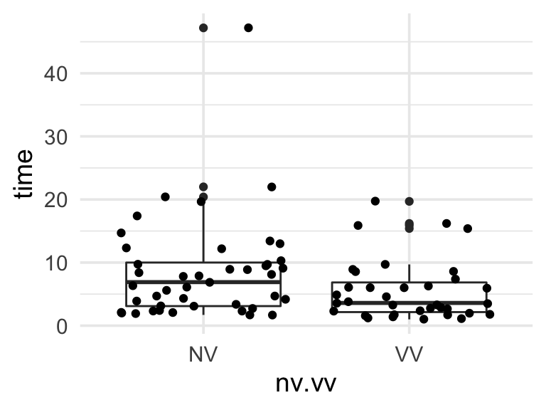

Una pregunta que podríamos hacer es: considerando que hay mucha variación en el 
tiempo de fusión dentro de cada tratamiento, necesitamos calificar la evidencia 
de nuestra conclusión (el tiempo de fusión se reduce con información verbal). 

Podemos usar una prueba de permutaciones, esta vez justificándola por el hecho
de que los tratamientos se asignan al azar: si los tratamientos son 
indistinguibles, entonces las etiquetas de los grupos son solo etiquetas, y 
permutarlas daría muestras igualmente verosímiles.

En este caso, compararemos gráficas de cuantiles de los datos con los
producidos por permutaciones (transformamos los datos pues en este caso es 
más apropiado una comparación multiplicativa):

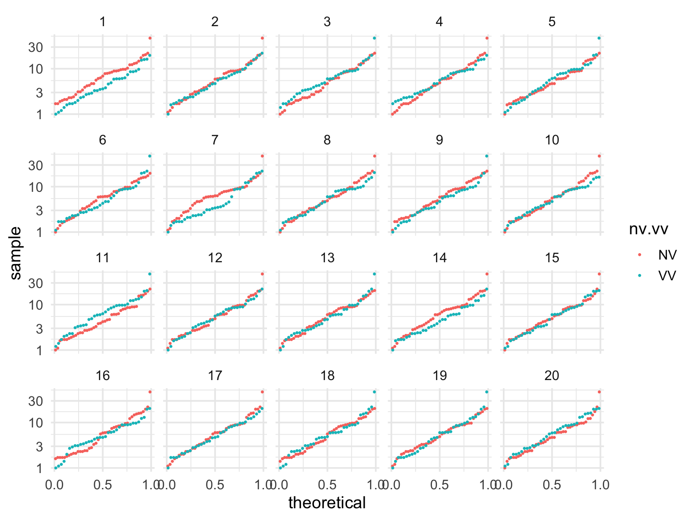

<div class="ejercicio">
<p>¿Podemos identificar los datos? En general, muy frecuentemente las personas identifican los datos correctamente, lo que muestra evidencia considerable de que la instrucción verbal altera los tiempos de respuesta de los partipantes, y en este caso ayuda a reducir el tiempo de fusión de los estereogramas.</p>
</div>


## Ejemplo: tiempos de fusión 2 {-}

Podemos usar las pruebas de permutaciones para distintos de tipos de 
estadísticas: medianas, medias, comparar dispersión usando rangos 
intercuartiles o varianzas, etc.

Regresamos a los tiempos de fusión. Podemos hacer una prueba de permutaciones para
la diferencia de las medias o medianas, por ejemplo. En este ejemplo usaremos
una medida de centralidad un poco diferente, como ilustración: el promedio de los cuartiles
superior e inferior de las dos distribuciones. Usaremos el cociente de estas dos cantidades
para medir su diferencia


```r
stat_fusion <- function(x){
    (quantile(x, 0.75) + quantile(x, 0.25))/2
}
calc_fusion <- function(stat_fusion){
  fun <- function(datos){
    datos %>% 
      group_by(nv.vv) %>% 
      summarise(est = stat_fusion(time)) %>% 
      pivot_wider(names_from = nv.vv, values_from = est) %>% 
      mutate(dif = VV / NV ) %>% pull(dif)
  }
  fun
}
```


```r
calc_cociente <- calc_fusion(stat_fusion)
dif_obs <- calc_cociente(fusion)
# permutar
valores_ref <- permutaciones_est(fusion, nv.vv, calc_cociente, n = 10000)
dist_perm_nv <- ecdf(valores_ref$diferencia) 
cuantil_obs <- dist_perm_nv(dif_obs)
```


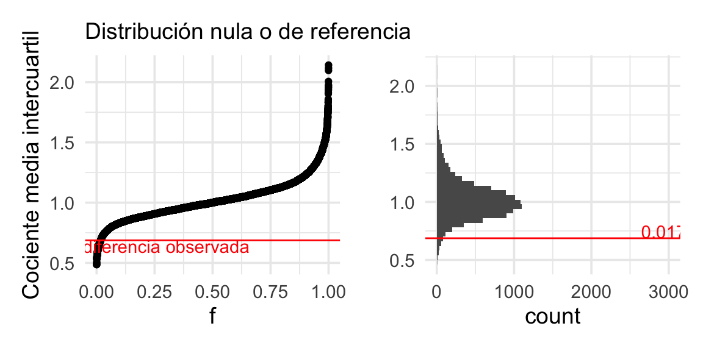

Y el valor p de dos colas es


```r
dist_perm_nv <- ecdf(valores_ref$diferencia)
2 * min(dist_perm_nv(dif_obs), 1 - dist_perm_nv(dif_obs))
```

```
## [1] 0.0354
```

Lo que muestra evidencia considerable, aunque no muy fuerte, de que la 
instrucción verbal ayuda a reducir el tiempo de fusión de los estereogramas: la 
*caja* del diagrama de caja y brazos para el grupo VV está *encogida* por un 
factor menor a 1.


##  Separación de grupos {-}

Este ejemplo tomado de @cookwasps (tanto la idea como el código). La pregunta que se aborda en
ese estudio es:

- Existen métodos de clasificación (supervisados o no supervisados) para formar grupos en términos
de variables que describen a los individuos
- Estos métodos (análisis discriminante, o k-means, por ejemplo), pretenden formar grupos compactos,
bien separados entre ellos. Cuando aplicamos el método, obtenemos clasificadores basados en las variables
de entrada.
- La pregunta es: ¿los grupos resultantes son producto de patrones que se generalizan a la población, o
capitalizaron en variación aleatoria para formarse?
- Especialmente cuando tenemos muchas mediciones de los individuos, y una muestra relativamente chica,
Es relativamente fácil encontrar combinaciones de variables que separan los grupos, aunque estas combinaciones
y diferencias están basadas en ruido y no generalizan a la población.

Como muestran en @cookwasps, el *lineup* es útil para juzgar si tenemos evidencia en contra de que los
grupos en realidad son iguales, y usamos variación muestral para separarlos.


### Avispas (opcional) {-}

En el siguiente ejemplo, tenemos 4 grupos de avispas (50 individuos en total),
y para cada individuo se miden expresiones
de 42 genes distintos. La pregunta es: ¿Podemos separar a los grupos de avispas 
dependiendo de sus mediciones?

En este se usó análisis discriminante para buscar proyecciones de los
datos en dimensión baja de forma que los grupos sean lo más compactos y separados posibles.

Para probar qué tan bien funciona este método, podemos hacer una prueba de permutación, aplicamos
LDA y observamos los resultados. 

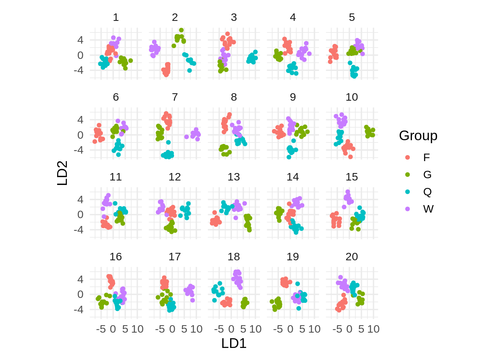

Y vemos que incluso permutando los grupos, es generalmente posible separarlos en grupos
bien definidos: la búsqueda es suficientemente agresiva para encontrar 
 combinaciones lineales que los separan. Que no podamos distinguir
los datos verdaderos de las replicaciones nulas indica que este método difícilmente puede
servir para separar los grupos claramente.

Otro enfoque sería separar los datos en una muestra de entrenamiento y una de prueba (que discutiremos
en la última sesión). Aplicamos el procedimiento a la muestra de entrenamiento y luego vemos qué pasa
con los datos de prueba:


```r
set.seed(8)
wasps_1 <- wasps %>% mutate(u = runif(nrow(wasps), 0, 1))
wasps_entrena <- wasps_1 %>% filter(u <= 0.8)
wasps_prueba <- wasps_1 %>% filter(u > 0.8)                            
                            
wasp.lda <- MASS::lda(Group ~ ., data=wasps_entrena[,-1])
wasp_ld_entrena <- predict(wasp.lda,  dimen=2)$x %>% 
    as_tibble(.name_repair = "universal") %>%
     mutate(tipo = "entrenamiento") %>% 
    mutate(grupo = wasps_entrena$Group)
wasp_ld_prueba <- predict(wasp.lda, newdata = wasps_prueba, dimen=2)$x  %>% 
    as_tibble(.name_repair = "universal") %>%
    mutate(tipo = "prueba")%>% 
    mutate(grupo = wasps_prueba$Group)
wasp_lda <- bind_rows(wasp_ld_entrena, wasp_ld_prueba)
ggplot(wasp_lda, aes(x = LD1, y = LD2, colour = grupo)) + geom_point(size = 3) +
    facet_wrap(~tipo)
```

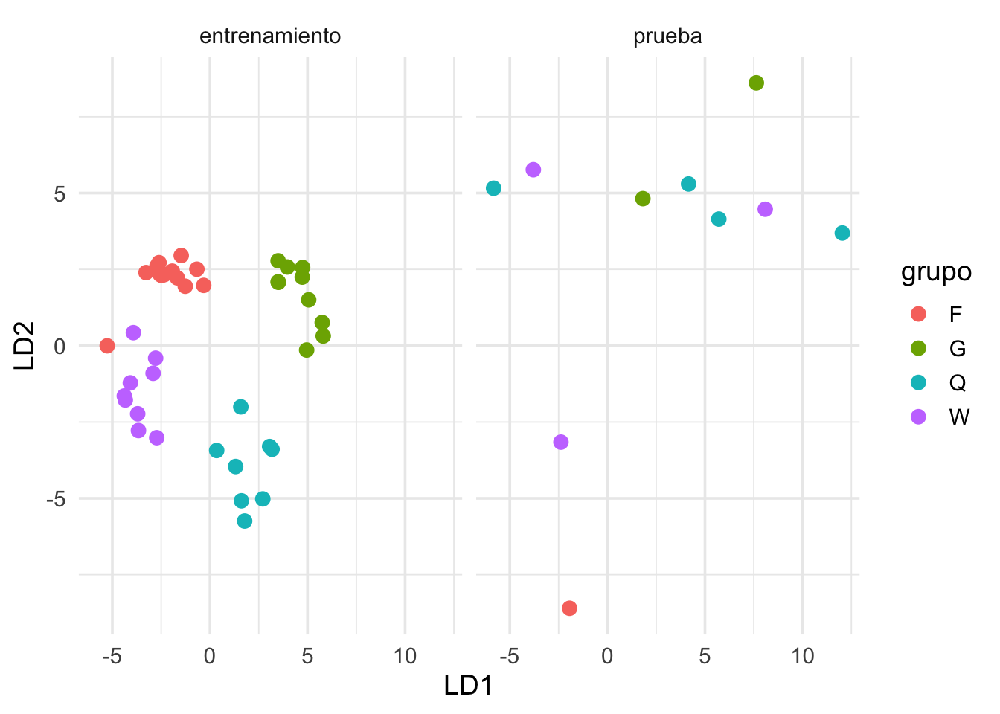

Aunque esta separación de datos es menos efectiva en este ejemplo por la muestra chica, podemos ver
que la separación lograda en los datos de entrenamiento probablemente se debe a variación muestral.


## La "crisis de replicabilidad" {-}

Recientemente (@falsefindings) se ha reconocido
en campos como la sicología la *crisis de replicabilidad*. Varios estudios que recibieron
mucha publicidad inicialmente no han podido ser replicados
posteriormente por otros investigadores. Por ejemplo:

- Hacer [poses poderosas](https://www.sciencedaily.com/releases/2017/09/170911095932.htm) produce cambios fisiológicos que mejoran nuestro desempeño en ciertas tareas
- Mostrar palabras relacionadas con "viejo" hacen que las personas caminen más lento (efectos de [priming](https://www.nature.com/news/nobel-laureate-challenges-psychologists-to-clean-up-their-act-1.11535)) 

En todos estos casos, el argumento de la evidencia de estos efectos fue respaldada 
por una prueba de hipótesis nula con un valor p menor a 0.05. La razón es que ese es el estándar de publicación
 seguido por varias áreas y revistas. La tasa de no replicabilidad parece ser mucho más alta (al menos la mitad o más
 según algunas fuentes, como la señalada arriba) 
 que lo sugeriría la tasa de falsos positivos (menos de 5\%) 

Este problema de replicabilidad parece ser más frecuente cuando:

1. Se trata de estudios de potencia baja: mediciones ruidosas y  tamaños de muestra chicos.
2. El plan de análisis no está claramente definido desde un principio (lo cual es difícil cuando
se están investigando "fenómenos no estudiados antes")

¿A qué se atribuye esta crisis de replicabilidad?


## El jardín de los senderos que se bifurcan {-}

Aunque haya algunos ejemplos de manipulaciones conscientes --e incluso, en menos casos,
malintencionadas-- para obtener resultados publicables o significativos
([p-hacking](https://en.wikipedia.org/wiki/Data_dredging)), 
 como vimos en ejemplos anteriores, hay varias decisiones, todas razonables, que podemos tomar cuando 
estamos buscando las comparaciones correctas. Algunas pueden ser:

- Transformar los datos (tomar o no logaritmos, u otra transformación)
- Editar datos atípicos (razonable si los equipos pueden fallar, o hay errores de captura, por ejemplo)
- Distintas maneras de interpretar los criterios de inclusión de un estudio (por ejemplo, algunos participantes
mostraron tener gripa, o revelaron que durmieron muy poco la noche anterior, etc. ¿los dejamos o los quitamos?)

Dado un conjunto de datos, las justificaciones de las decisiones que se toman 
en cada paso son razonables, pero con datos distintos las decisiones podrían ser diferentes. 
Este es el **jardín de los senderos que se bifurcan**  [Gelman](http://www.stat.columbia.edu/~gelman/research/published/incrementalism_3.pdf), 
que **invalida en parte el uso valores p como criterio de evidencia contra la hipótesis nula**.

Esto es exacerbado por:

- Tamaños de muestra chicos y efectos "inestables" que se quieren medir (por ejemplo en sicología)
- El hecho de que el criterio de publicación es obtener un
valor p < 0.05, y la presión fuerte sobre los investigadores
para producir resultados publicables (p < 0.05)
- El que estudios o resultados similares que no obtuvieron valores $p$ por debajo del umbral no son 
publicados o reportados.

Ver por ejemplo el [comunicado de la ASA](https://www.amstat.org/asa/files/pdfs/P-ValueStatement.pdf).

**Ojo**: esas presiones de publicación no sólo ocurre para investigadores en sicología. Cuando
trabajamos en problemas de análisis de datos en problemas que son de importancia, es común que
existan intereses de algunas partes o personas involucradas por algunos resultados u otros (por
ejemplo, nuestros clientes de consultoría o clientes internos). Eso puede dañar nuestro trabajo
como analistas, y el avance de nuestro equipo. Aunque esas presiones son inevitables, se vuelven
manejables cuando hay una relación de confianza entre las partes involucradas.


## Ejemplo: decisiones de análisis y valores p {-}

En el ejemplo de datos de fusión, decidimos probar, por ejemplo, el promedio de
los cuartiles inferior y superior, lo cual no es una decisión típica pero usamos como
ilustración. Ahora intentamos usar distintas mediciones de la diferencia entre los grupos,
usando distintas medidas resumen y transformaciones (por ejemplo, con o sin logaritmo). Aquí hay
unas 12 combinaciones distintas para hacer el análisis (multiplicadas por criterios
de "aceptación de datos en la muestra", que simulamos tomando una submuestra al azar):


```r
calc_fusion <- function(stat_fusion, trans, comparacion){
  fun <- function(datos){
    datos %>% 
      group_by(nv.vv) %>% 
      summarise(est = stat_fusion({{ trans }}(time))) %>% 
      pivot_wider(names_from = nv.vv, values_from = est) %>% 
      mutate(dif = {{ comparacion }}) %>% pull(dif)
  }
  fun
}
valor_p <- function(datos, variable, calc_diferencia, n = 1000){
  # calcular estadística para cada grupo
  permutar <- function(variable){
    sample(variable, length(variable))
  }
  tbl_perms <- tibble(.sample = seq(1, n-1, 1)) %>%
    mutate(diferencia = map_dbl(.sample, 
              ~ datos %>% mutate({{variable}} := permutar({{variable}})) %>% calc_diferencia))
  perms <- bind_rows(tbl_perms, tibble(.sample = n, diferencia = calc_diferencia(datos)))
  perms_ecdf <- ecdf(perms$diferencia)
  dif <- calc_diferencia(datos)
  2 * min(perms_ecdf(dif), 1- perms_ecdf(dif))
}
```


```r
set.seed(7272)
media_cuartiles <- function(x){
    (quantile(x, 0.75) + quantile(x, 0.25))/2
}
# nota: usar n=10000 o más, esto solo es para demostración:
ejemplo <- list()
calc_dif <- calc_fusion(mean, identity, VV - NV)
ejemplo$media_dif <- valor_p(fusion %>% sample_frac(0.95), nv.vv, calc_dif, n = 10000)
calc_dif <- calc_fusion(mean, log, VV - NV)
ejemplo$media_dif_log <- valor_p(fusion %>% sample_frac(0.95), nv.vv, calc_dif, n = 10000)
calc_dif <- calc_fusion(median, identity, VV / NV)
ejemplo$mediana_razon <- valor_p(fusion %>% sample_frac(0.95), nv.vv, calc_dif, n = 10000)
calc_dif <- calc_fusion(media_cuartiles, identity, VV / NV)
ejemplo$cuartiles_razon <- valor_p(fusion %>% sample_frac(0.95), nv.vv, calc_dif, n = 10000)
```


```r
ejemplo <- read_rds("cache/ejemplo_p_val.rds")
ejemplo$media_dif
```

```
## [1] 0.0658
```

```r
ejemplo$media_dif_log
```

```
## [1] 0.018
```

```r
ejemplo$mediana_razon
```

```
## [1] 0.049
```

```r
ejemplo$cuartiles_razon
```

```
## [1] 0.0464
```


Si existen grados de libertad - muchas veces necesarios para hacer un análisis exitoso-, entonces
los valores p pueden tener poco significado.

## Alternativas o soluciones {-}

El primer punto importante es reconocer que la mayor parte de nuestro trabajo
es **exploratorio** (recordemos el proceso complicado del análisis de datos de refinamiento de preguntas). 
En este tipo de trabajo, reportar valores p puede tener poco sentido,
y mucho menos tiene sentido aceptar algo "verdadero" cuando pasa un umbral de significancia dado.

Nuestro interés principal al hacer análisis es expresar correctamente y de manera útil la incertidumbre 
asociada a las conclusiones o patrones que mostramos
(asociada a variación muestral, por ejemplo) para que el proceso de toma de decisiones sea informado. **Un** resumen de **un número** (valor p, o el que sea) no puede ser tomado como criterio para tomar una decisión que generalmente es compleja.
En la siguiente sección veremos cómo podemos mostrar parte de esa incertidumbre de manera más útil.

Por otra parte, los estudios confirmatorios (donde se reportan valores p) 
también tienen un lugar. En áreas como la sicología, existen ahora movimientos fuertes en 
favor de la repetición de estudios prometedores pero donde hay sospecha
de grados de libertad del investigador. Este movimiento
sugiere dar valor a los **estudios exploratorios** que no reportan valor p, 
y posteriormente, si el estudio
es de interés, puede intentarse una **replicación confirmatoria, con potencia más alta y con planes de análisis predefinidos**.
