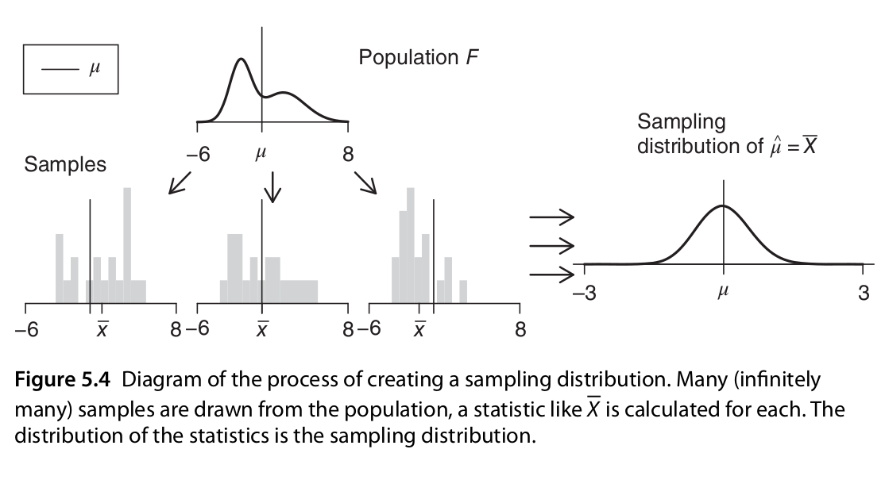
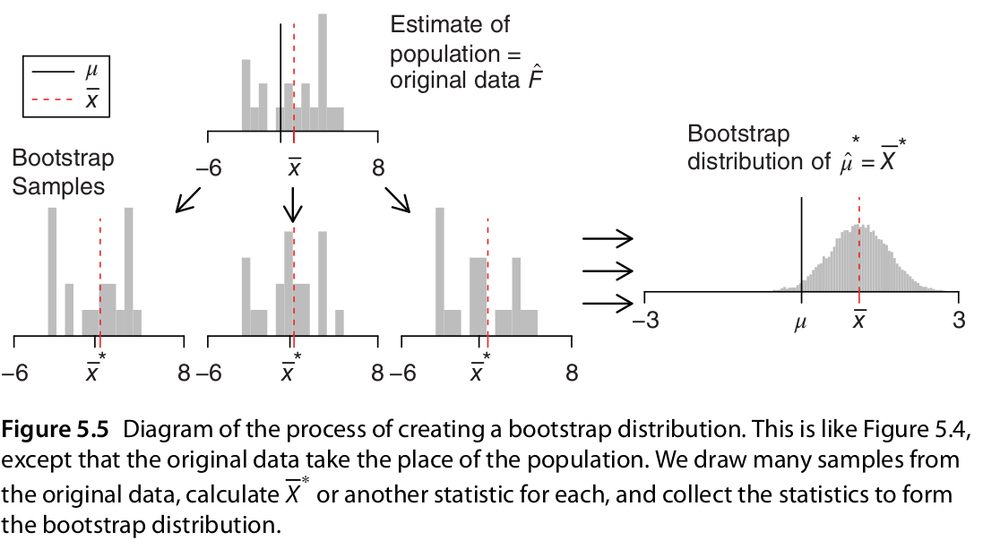

# Intervalos de confianza y remuestreo

```{r setup, include=FALSE, message=FALSE}
library(tidyverse)
source("R/funciones_auxiliares.R")
knitr::opts_chunk$set(echo = TRUE, message = FALSE, warning=FALSE, fig.align = 'center')
comma <- function(x) format(x, digits = 2, big.mark = ",")
theme_set(theme_minimal())
```

En la sección anterior, vimos el concepto de distribución de muestreo
de una estadística que queremos utilizar para estimar un valor poblacional, y
vimos que con esta distribución podíamos evaluar **qué tan preciso es nuestro
estimador** evaluando qué tan concentrada está esta distribución alrededor
del valor poblacion que queremos estimar.

Sin embargo, en los ejemplos que vimos la población era conocida: ya sea
que tuviéramos toda la población finita disponible (como el ejemplo de las casas),
o donde la población estaba definida por un modelo teórico de probabilidad
(como los ejemplos de las distribuciones uniforme o exponencial).

Ahora vemos qué hacer en el caso que realmente nos interesa: solo tenemos
una muestra disponible, y la población es desconocida. Todo lo que tenemos
es una muestra y una estimación basada en la muestra, y requerimos estimar
la distribución de muestreo de la estadística de interés. El enfoque
que presentaremos aquí es uno de los más flexibles y poderosos que están
disponible para este problema: el método **bootstrap** o de **remuestreo**.

En primer lugar explicamos el concepto de intervalo de confianza, que es una
manera resumida de evaluar la precisión de nuestras estimaciones.


## Ejemplo introductorio {-}

Regresamos a nuestro ejemplo anterior donde muestreamos 3 grupos, y nos preguntábamos
acerca de la diferencia de sus medianas. En lugar de hacer pruebas de permutaciones 
(ya sea pruebas gráficas o alguna prueba de permutaciones para media o mediana, por ejemplo),
podríamos considerar qué tan precisa es cada una de nuestras estimaciones
para las medianas de los grupos.

Nuestros resultados podríamos presentarlos como sigue. Este código lo explicaremos
más adelante, por el momento consideramos la gŕafica resultante:

```{r, message = FALSE}
library(tidyverse)
library(patchwork)
set.seed(8)
pob_tab <- tibble(id = 1:2000, x = rgamma(2000, 4, 1), 
    grupo = sample(c("a","b", "c"), 2000, prob = c(4,2,1), replace = T))
muestra_tab <- pob_tab %>% sample_n(125)
g_1 <- ggplot(muestra_tab, aes(x = grupo, y = x)) + geom_boxplot(outlier.alpha = 0) +
    geom_jitter(alpha = 0.3) + 
      labs(subtitle = "Muestra \n") + ylim(c(0,14))
## Hacemos bootstrap
fun_boot <- function(datos){
    datos %>% group_by(grupo) %>% sample_n(n(), replace = TRUE)
}
reps_boot <- map(1:2000, function(i){
    medianas <- muestra_tab %>% 
        fun_boot %>% 
        group_by(grupo) %>% 
        summarise(mediana = median(x))
    medianas %>% mutate(rep = i)
}) %>% bind_rows
resumen_boot <- reps_boot %>% group_by(grupo) %>% 
    summarise(ymin = quantile(mediana, 0.025), ymax = quantile(mediana, 0.975)) %>% 
    left_join(muestra_tab %>% group_by(grupo) %>% summarise(mediana = median(x)))
g_2 <- ggplot(resumen_boot, aes(x = grupo, y = mediana, ymin = ymin, ymax = ymax)) +
    geom_linerange() +
    geom_point(colour = "red", size = 2) +  ylim(c(0,14)) +
    labs(subtitle = "Intervalos de 95% \n para la mediana")
g_1 + g_2
```

Donde: 

- En rojo está nuestro estimador puntual de la mediana de cada
grupo (la mediana muestral), y
- Las segmentos muestran un intervalo de confianza del 95\% 
para nuestra estimación de la mediana: esto quiere decir que 
los valores poblacionales tienen probabilidad aproximada de 95\% de estar
dentro del intervalo.

Este análisis comunica correctamente que tenemos **incertidumbre** alta acerca de nuestras
estimaciones (especialmente grupos b y c), y que no tenemos mucha evidencia de que el 
grupo b tenga una mediana poblacional considerablemente más alta que a o c. **En muchos casos
es más útil presentar la información de esta manera que usando alguna prueba
de hipótesis.**


## La idea del bootstrap {-}


Como explicamos, el problema que tenemos ahora es que normalmente sólo tenemos una muestra, 
así que
no es posible calcular las distribuciones de muestreo como hicimos arriba y evaluar
qué tan preciso es nuestro estimador. Sin embargo,
podemos hacer lo siguiente:

Supongamos que tenemos una muestra $X_1,X_2,\dots, X_n$ independientes de alguna
población desconocida y un estimador $T=t(X_1,\dots, X_n)$

**Mundo poblacional**

1. Si tuviéramos la distribución poblacional, simulamos muestras iid para aproximar
la distribución de muestreo de nuestro estimador, y así entender su variabilidad.
2. Pero **no** tenemos la distribución poblacional
3. **Sin embargo, podemos estimar la distribución poblacional con nuestros valores muestrales**

**Mundo bootstrap**

4. Si usamos la estimación del inciso 3, entonces usando el inciso 1 podríamos tomar muestras
de nuestros datos muestrales, como si fueran de la población, y usando el mismo tamaño de muestra. El muestreo lo hacemos con reemplazo de manera que produzcamos muestras independientes de la misma "población estimada", que es la muestra.
5. Evaluamos nuestra estadística en cada una de estas remuestras.
6. A la distribución resultante le llamamos **distribución bootstrap** o **distribución de remuestreo** del estimador
7. Usamos la distribución bootstrap de la muestra para estimar la variabilidad en nuestra
estimación con **la muestra original**.


Veamos que sucede para un ejemplo concreto, donde  nos interesa estimar
la media de los precios de venta de una población de casas. Tenemos nuestra muestra:

```{r, cache=TRUE}
set.seed(2112)
poblacion_casas <- read_csv("data/casas.csv")
muestra <- sample_n(poblacion_casas, 200, replace = TRUE)
mean(muestra$precio_miles)
```

Esta muestra nos da nuestro estimador de la distribución poblacional:

```{r,  fig.width =5, fig.height = 3}
bind_rows(muestra %>% mutate(tipo = "muestra"),
    poblacion_casas %>% mutate(tipo = "población")) %>% 
ggplot(aes(sample = precio_miles, colour = tipo, group = tipo)) + 
    geom_qq(distribution = stats::qunif, alpha = 0.4, size = 1) +
  facet_wrap(~ tipo)
```

O con histogramas:

```{r,  fig.width =5, fig.height = 3}
bind_rows(muestra %>% mutate(tipo = "muestra"),
    poblacion_casas %>% mutate(tipo = "población")) %>% 
ggplot(aes(x = precio_miles, group = tipo)) + 
    geom_histogram(aes(y=..density..), binwidth = 50) + 
    facet_wrap(~ tipo)
```

Y vemos que la aproximación es razonable en las partes centrales de la 
distribución. 

Ahora supongamos que nos interesa cuantificar la precisión de nuestra
estimación de la media poblacional de precios de casas, y usaremos la media
muestral para hacer esto. Para nuestra muestra, nuestra estimación puntual es:

```{r}
media <- mean(muestra$precio_miles)
media
```


Y recordamos que para aproximar la distribución de muestreo
podíamos muestrear repetidamente la población y calcular el valor del
estimador en cada una de estas muestras. Aquí no tenemos la población,
**pero tenemos una estimación de la población**: la muestra obtenida.

Así que para 
evaluar la variabilidad de nuestro estimador, entramos en el
mundo boostrap, y consideramos que la población es nuestra muestra.

Podemos entonces extraer un número
grande de muestras con reemplazo de tamaño 200 **de la muestra**: el muestreo
debe ser análogo al que se tomó para nuestra muestra original. Evaluamos nuestra
estadística (en este caso la media) en cada una de estas remuestras:

```{r, cache = TRUE}
media_muestras <- map_dbl(1:5000, ~ muestra %>%  
    sample_n(200, replace = T) %>%
    summarise(media_precio = mean(precio_miles)) %>% pull(media_precio)) 
```

Y nuestra estimación de la distribución de muestreo para la media es entonces:

```{r, fig.width =6, fig.height = 4}
bootstrap <- tibble(media = media_muestras)
g_cuantiles <- ggplot(bootstrap, aes(sample = media)) + geom_qq(distribution = stats::qunif)
g_histograma <- ggplot(bootstrap, aes(x = media)) + geom_histogram(binwidth = 2)
g_cuantiles + g_histograma
```
A esta le llamamos la distribución de remuestreo de la media, que definimos más abajo.
Ahora podemos calcular un intervalo de confianza del 90\% simplemente calculando los cuantiles de
esta distribución (no son los cuantiles de la muestra original!):

```{r}
limites_ic <- quantile(media_muestras, c(0.05,  0.95)) %>% round
limites_ic
```

Presentaríamos nuestro resultado como sigue: nuestra estimación puntual de la mediana es
`r mean(muestra$precio_miles)`, con un intervalo de confianza del 90\% de (`r limites_ic[1]`, `r limites_ic[2]`)

Otra cosa que podríamos hacer para describir la dispersión de nuestro estimador
es calcular el error estándar de remuestreo, que estima el error estándar de
la distribución de muestreo:

```{r}
ee_boot <- sd(media_muestras)
round(ee_boot, 2)
```


```{block2, type='mathblock'}
**Definición**. Sea $X_1,X_2,\ldots,X_n$ una muestra independiente y idénticamente
distribuida, y $T=t(X_1, X_2, \ldots, X_n)$ una estadística. Supongamos que sus valores
que obervamos son $x_1, x_2,\ldots, x_n$.

La **distribución de remuestreo** de $T$ es la
distribución de $T^*=t(X_1^*, X_2^*, \dots X_n^*)$, donde cada $X_i^*$ se obtiene
tomando al azar uno de los valores de $x_1,x_2,\ldots, x_n$.

```

- Otra manera de decir esto es que la remuestra $X_1^*, X_2^*, \ldots, X_n^*$ es una muestra
con reemplazo de los valores observados $x_1, x_2, \ldots, x_n$

**Ejemplo.** Si observamos la muestra 

```{r}
muestra <- sample(1:20, 5)
muestra
```

Una remuestra se obtiene:

```{r}
sample(muestra, size = 5, replace = TRUE)
```
Nótese que algunos valores de la muestra original pueden aparecer varias veces, y otros no aparecen del todo.


```{block2, type='comentario'}
**La idea del bootstrap**. La muestra original es una aproximación de la población
de donde fue extraída. Así que remuestrear la muestra aproxima lo que pasaría si
tomáramos muestras de la población. La **distribución de remuestreo** de una estadística,
que se construye tomando muchas remuestras, aproxima la distribución de muestreo
de la estadística.
```

Y el proceso que hacemos es:

```{block2, type='comentario'}
**Remuestreo para una población.** Dada una muestra de tamaño $n$ de una población, 

1. Obtenemos una remuestra de tamaño $n$ sin reemplazo de la muestra original
2. Repetimos este remuestreo muchas veces (por ejemplo, 10,000).
3. Construímos la distribución bootstrap, y examinamos sus características 
(dónde está centrada, dispersión y forma).
```


## El principio de plug-in

La idea básica detraś del bootstrap es el principio de plug-in para estimar
parámetros poblacionales: si queremos
estimar una cantidad poblacional, calculamos esa cantidad poblacional con la muestra
obtenida. Es un principio común en estadística. 

Por ejemplo, si queremos estimar
la media o desviación estándar poblacional, usamos la media muestral o la desviación
estándar muestral. Si queremos estimar un cuantil de la población usamos el cuantil
correspondiente de la muestra, y así sucesivamente.

En todos estos casos, lo que estamos haciendo es:

- Tenemos una fórmula para la cantidad poblacional de interés en términos de la distribución
poblacional.  
- Tenemos una muestra, que usamos para estimar la cantidad poblacional. La distribución
que da una muestra se llama distribución *empírica**
- Contruimos nuestro estimador "enchufando" la distribución empírica de la muestra 
en la fórmula del estimador.

En el bootstrap aplicamos este principio simple a la **distribución de 
muestreo**:

- *Si tenemos la población*, podemos *calcular* la distribución de muestreo de nuestro estimador
tomando muchas muestras de la *población*.
- Estimamos la *poblacion* con la *muestra* y enchufamos en la frase anterior:
- Podemos *estimar* la distribucion de muestreo de nuestro estimador
tomando muchas muestras de la *muestra* (bootstrap).

Nótese que el proceso de muestreo en el último paso **debe ser el mismo** que
se usó para tomar la muestra original. Estas dos imágenes de @Chihara muestran lo
que acabamos de describir:






**Observación 1**. Veremos ejemplos más complejos, pero nótese que si la muestra
original son observaciones independientes obtenidas de la distribución poblacional,
entonces logramos esto en las remuestras tomando observaciones con reemplazo
de la muestra. Igalmente, las remuestras deben ser del mismo tamaño que la muestra
original.

```{block2,type='ejercicio}
- ¿Qué no funcionaría tomar muestras sin reemplazo? Piensa si hay independencia
entre las observaciones de la remuestra, y cómo serían las remuestras sin reemplazo.
- ¿Por qué no se puede hacer bootstrap si no conocemos cómo se obtuvo la muestra original?
```


**Observación 2**. Estos argumentos se pueden escribir con fórmulas usando por
ejemplo la función de distribución acumulada $F$ de la población y su estimador,
que es la función empírica $\hat{F}$, como en @Efron. 
Si $\theta = t(F)$ es una
cantidad poblacional que queremos estimar, su estimador plug-in es
$\hat{\theta} = t(\hat{F})$. 

**Observación 3**: La distribución empírica $\hat{F}$ es un estimador "razonable" de
la distribución poblacional $F$, pues por el teorema de Glivenko-Cantelli (ver @Wasserman,
o [aquí](https://en.wikipedia.org/wiki/Glivenko-Cantelli_theorem)), 
$\hat{F}$ converge a $F$ cuando el tamaño de muestra $n\to\infty$, lo cual es
intuitivamente claro.


### Ejemplo
En el ejemplo de tomadores de té, podemos estimar la proporción de tomadores
de té que prefiere el té negro usando nuestra muestra:

```{r}
te <- read_csv("data/tea.csv") %>%
  rowid_to_column() %>% 
  select(rowid, Tea, sugar)
te %>% mutate(negro = ifelse(Tea == "black", 1, 0)) %>% 
  summarise(prop_negro = mean(negro), n = length(negro))
```

¿Cómo evaluamos la precisión de este estimador? Supondremos que el estudio se
hizo tomando una muestra aleatoria simple de tamaño 300 de la población de tomadores de té que
nos interesa. Podemos entonces usar el boostrap:

```{r}
# paso 1: define el estimador
calc_estimador <- function(datos){
  prop_negro <- datos %>% 
    mutate(negro = ifelse(Tea == "black", 1, 0)) %>% 
    summarise(prop_negro = mean(negro), n = length(negro)) %>% 
    pull(prop_negro)
  prop_negro
}
# paso 2: define el proceso de remuestreo
muestra_boot <- function(datos){
  #tomar muestra con reemplazo del mismo tamaño
  sample_n(datos, size = nrow(datos), replace = TRUE)
}
# paso 3: remuestrea y calcula el estimador
prop_negro_tbl <- map_dbl(1:2000,  ~ calc_estimador(muestra_boot(datos = te))) %>% 
  tibble(prop_negro = .)
# paso 4: examina la distribución bootstrap
prop_negro_tbl %>% 
  ggplot(aes(x = prop_negro)) +
  geom_histogram(bins = 15)
```

Y podemos evaluar varios aspectos, centro y dispersión 

```{r}
prop_negro_tbl %>% 
  summarise(media = mean(prop_negro),
            sesgo = mean(prop_negro) - 0.2499,
            ee = sd(prop_negro),
            cuantil_75 = quantile(prop_negro, 0.75), 
            cuantil_25 = quantile(prop_negro, 0.25)) %>% 
  mutate(across(where(is.numeric), round, 3)) %>% 
  pivot_longer(cols = everything())
```


