# Intervalos de confianza y remuestreo


En la sección anterior, vimos el concepto de distribución de muestreo
de una estadística que queremos utilizar para estimar un valor poblacional, y
vimos que con esta distribución podíamos evaluar **qué tan preciso es nuestro
estimador** evaluando qué tan concentrada está esta distribución alrededor
del valor poblacion que queremos estimar.

Sin embargo, en los ejemplos que vimos la población era conocida: ya sea que
tuviéramos toda la población finita disponible (como el ejemplo de las casas), o
donde la población estaba definida por un modelo teórico de probabilidad (como
los ejemplos de las distribuciones uniforme o exponencial).

Ahora vemos qué hacer en el caso que realmente nos interesa: solo tenemos una
muestra disponible, y la población es desconocida. Todo lo que tenemos es una
muestra y una estimación basada en la muestra, y requerimos estimar la
distribución de muestreo de la estadística de interés. El enfoque que
presentaremos aquí es uno de los más flexibles y poderosos que están disponibles
para este problema: el método **bootstrap** o de **remuestreo**.

En primer lugar explicamos el concepto de intervalo de confianza, que es una
manera resumida de evaluar la precisión de nuestras estimaciones.


## Ejemplo introductorio {-}

Regresamos a nuestro ejemplo anterior donde muestreamos 3 grupos, y nos preguntábamos
acerca de la diferencia de sus medianas. En lugar de hacer pruebas de permutaciones 
(ya sea pruebas gráficas o alguna prueba de permutaciones para media o mediana, por ejemplo),
podríamos considerar qué tan precisa es cada una de nuestras estimaciones
para las medianas de los grupos.

Nuestros resultados podríamos presentarlos como sigue. Este código lo explicaremos
más adelante, por el momento consideramos la gŕafica resultante:


```r
set.seed(8)
pob_tab <- tibble(id = 1:2000, x = rgamma(2000, 4, 1), 
    grupo = sample(c("a","b", "c"), 2000, prob = c(4,2,1), replace = T))
muestra_tab <- pob_tab %>% 
  sample_n(125)
g_1 <- ggplot(muestra_tab, aes(x = grupo, y = x)) + 
  geom_boxplot(outlier.alpha = 0) +
  geom_jitter(alpha = 0.3) + 
  labs(subtitle = "Muestra \n") + ylim(c(0,14))
## Hacemos bootstrap
fun_boot <- function(datos){
    datos %>% group_by(grupo) %>% sample_n(n(), replace = TRUE)
}
reps_boot <- map_df(1:2000, function(i){
  muestra_tab %>% 
    fun_boot %>% 
    group_by(grupo) %>% 
    summarise(mediana = median(x), .groups = "drop")}, 
  .id = 'rep') 
resumen_boot <- reps_boot %>% group_by(grupo) %>% 
    summarise(ymin = quantile(mediana, 0.025), 
              ymax = quantile(mediana, 0.975), .groups = "drop") %>% 
    left_join(muestra_tab %>% 
                group_by(grupo) %>% 
                summarise(mediana = median(x)), .groups = "drop")
g_2 <- ggplot(resumen_boot, aes(x = grupo, y = mediana, ymin = ymin, 
                                ymax = ymax)) +
    geom_linerange() +
    geom_point(colour = "red", size = 2) +  ylim(c(0,14)) +
    labs(subtitle = "Intervalos de 95% \n para la mediana")
g_1 + g_2
```

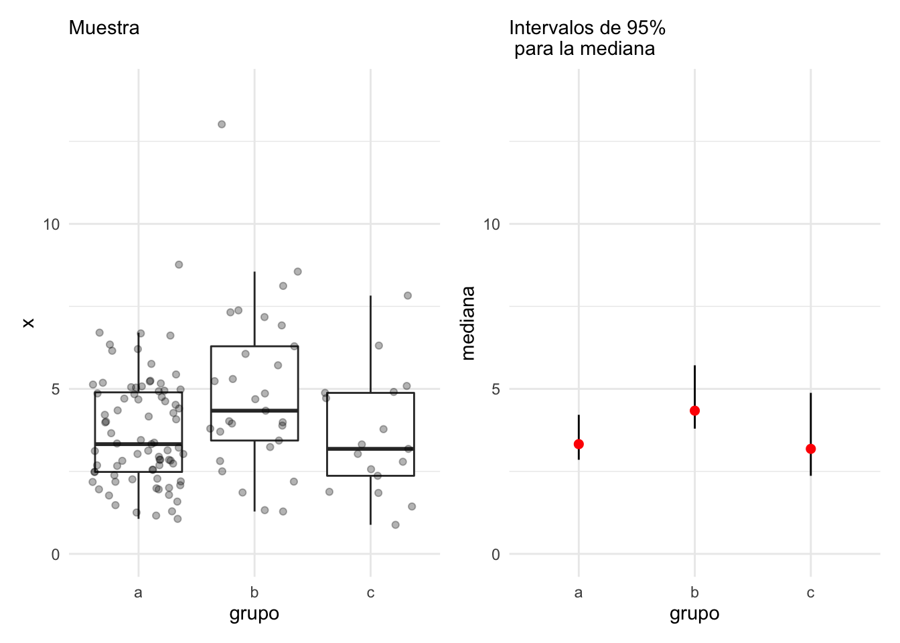

Donde: 

- En rojo está nuestro estimador puntual de la mediana de cada
grupo (la mediana muestral), y
- Las segmentos muestran un intervalo de confianza del 95\% 
para nuestra estimación de la mediana: esto quiere decir que 
los valores poblacionales tienen probabilidad aproximada de 95\% de estar
dentro del intervalo.

Este análisis comunica correctamente que tenemos **incertidumbre** alta acerca
de nuestras estimaciones (especialmente grupos b y c), y que no tenemos mucha
evidencia de que el grupo b tenga una mediana poblacional considerablemente más
alta que a o c. **En muchos casos es más útil presentar la información de esta
manera que usando alguna prueba de hipótesis.**


## La idea del bootstrap {-}


Como explicamos, el problema que tenemos ahora es que normalmente sólo tenemos
una muestra, así que no es posible calcular las distribuciones de muestreo como
hicimos arriba y evaluar qué tan preciso es nuestro estimador. Sin embargo,
podemos hacer lo siguiente:

Supongamos que tenemos una muestra $X_1,X_2,\dots, X_n$ independientes de alguna
población desconocida y un estimador $T=t(X_1,\dots, X_n)$

**Mundo poblacional**

1. Si tuviéramos la distribución poblacional, simulamos muestras iid para
aproximar la distribución de muestreo de nuestro estimador, y así entender su
variabilidad.
2. Pero **no** tenemos la distribución poblacional.
3. **Sin embargo, podemos estimar la distribución poblacional con nuestros valores muestrales**.

**Mundo bootstrap**

4. Si usamos la estimación del inciso 3, entonces usando el inciso 1 podríamos
tomar muestras de nuestros datos muestrales, como si fueran de la población, y
usando el mismo tamaño de muestra. El muestreo lo hacemos con reemplazo de 
manera que produzcamos muestras independientes de la misma "población estimada",
que es la muestra.
5. Evaluamos nuestra estadística en cada una de estas remuestras.
6. A la distribución resultante le llamamos **distribución bootstrap** o
**distribución de remuestreo** del estimador.
7. Usamos la distribución bootstrap de la muestra para estimar la variabilidad
en nuestra estimación con **la muestra original**.


Veamos que sucede para un ejemplo concreto, donde  nos interesa estimar
la media de los precios de venta de una población de casas. Tenemos nuestra muestra:


```r
set.seed(2112)
poblacion_casas <- read_csv("data/casas.csv")
casas_muestra <- sample_n(poblacion_casas, 200, replace = TRUE)
mean(casas_muestra$precio_miles)
```

```
## [1] 182.5114
```

Esta muestra nos da nuestro estimador de la distribución poblacional:


```r
bind_rows(casas_muestra %>% mutate(tipo = "muestra"),
    poblacion_casas %>% mutate(tipo = "población")) %>% 
ggplot(aes(sample = precio_miles, colour = tipo, group = tipo)) + 
    geom_qq(distribution = stats::qunif, alpha = 0.4, size = 1) +
  facet_wrap(~ tipo)
```

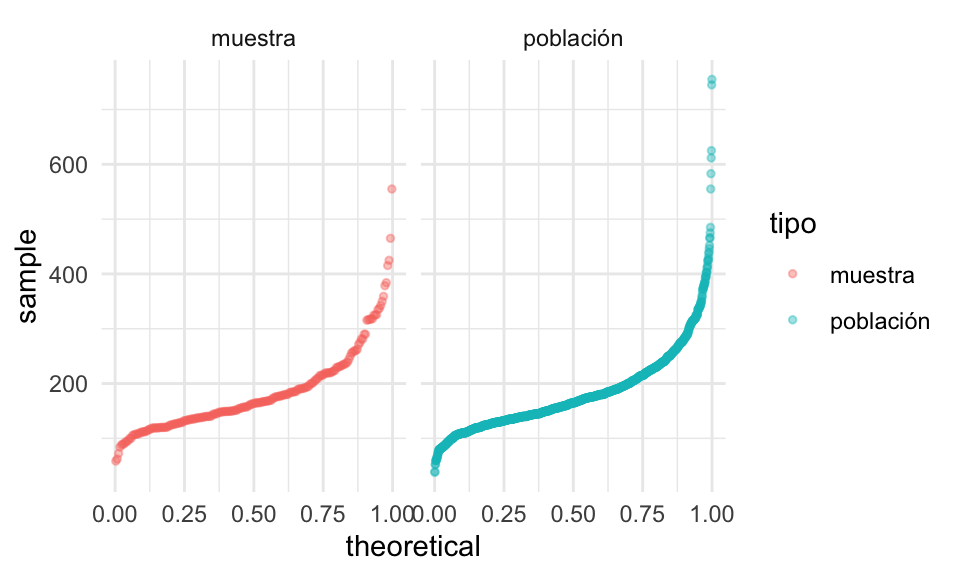

O con histogramas:


```r
bind_rows(casas_muestra %>% mutate(tipo = "muestra"),
    poblacion_casas %>% mutate(tipo = "población")) %>% 
ggplot(aes(x = precio_miles, group = tipo)) + 
    geom_histogram(aes(y=..density..), binwidth = 50) + 
    facet_wrap(~ tipo)
```

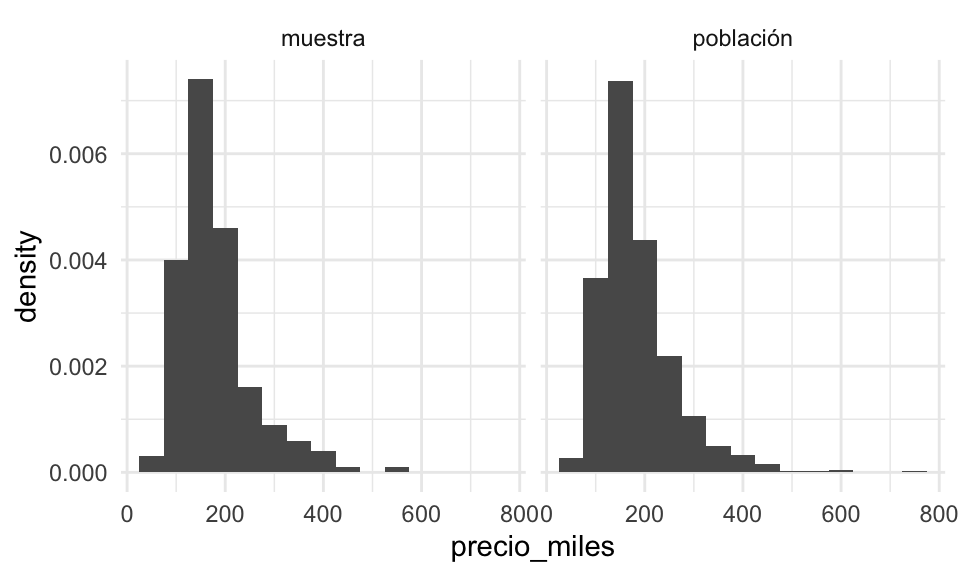

Y vemos que la aproximación es razonable en las partes centrales de la 
distribución. 

Ahora supongamos que nos interesa cuantificar la precisión de nuestra
estimación de la media poblacional de precios de casas, y usaremos la media
muestral para hacer esto. Para nuestra muestra, nuestra estimación puntual es:


```r
media <- mean(casas_muestra$precio_miles)
media
```

```
## [1] 182.5114
```


Y recordamos que para aproximar la distribución de muestreo
podíamos muestrear repetidamente la población y calcular el valor del
estimador en cada una de estas muestras. Aquí no tenemos la población,
**pero tenemos una estimación de la población**: la muestra obtenida.

Así que para evaluar la variabilidad de nuestro estimador, entramos en el mundo
boostrap, y consideramos que la población es nuestra muestra.

Podemos entonces extraer un número grande de muestras con reemplazo de tamaño
200 **de la muestra**: el muestreo debe ser análogo al que se tomó para nuestra
muestra original. Evaluamos nuestra estadística (en este caso la media) en cada
una de estas remuestras:


```r
media_muestras <- map_dbl(1:5000, ~ casas_muestra %>%  
    sample_n(200, replace = T) %>%
    summarise(media_precio = mean(precio_miles), .groups = "drop") %>% pull(media_precio)) 
```

Y nuestra estimación de la distribución de muestreo para la media es entonces:


```r
bootstrap <- tibble(media = media_muestras)
g_cuantiles <- ggplot(bootstrap, aes(sample = media)) + geom_qq(distribution = stats::qunif)
g_histograma <- ggplot(bootstrap, aes(x = media)) + geom_histogram(binwidth = 2)
g_cuantiles + g_histograma
```

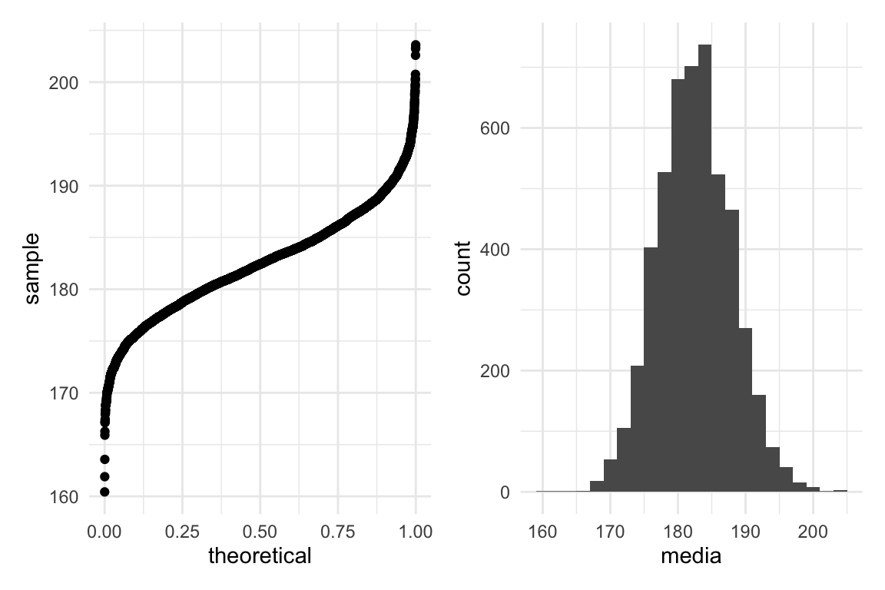
A esta le llamamos la distribución de remuestreo de la media, que definimos más
abajo. Ahora podemos calcular un intervalo de confianza del 90\% simplemente
calculando los cuantiles de esta distribución (no son los cuantiles de la
muestra original!):


```r
limites_ic <- quantile(media_muestras, c(0.05,  0.95)) %>% round
limites_ic
```

```
##  5% 95% 
## 174 192
```

Presentaríamos nuestro resultado como sigue: nuestra estimación puntual de la
mediana es 182.5, con un intervalo de
confianza del 90\% de (174, 192)

Otra cosa que podríamos hacer para describir la dispersión de nuestro estimador
es calcular el error estándar de remuestreo, que estima el error estándar de la
distribución de muestreo:


```r
ee_boot <- sd(media_muestras)
round(ee_boot, 2)
```

```
## [1] 5.45
```


\BeginKnitrBlock{mathblock}<div class="mathblock">
**Definición.** Sea $X_1,X_2,\ldots,X_n$ una muestra independiente y idénticamente
distribuida, y $T=t(X_1, X_2, \ldots, X_n)$ una estadística. Supongamos que sus valores
que obervamos son $x_1, x_2,\ldots, x_n$.

La **distribución de remuestreo** de $T$ es la
distribución de $T^*=t(X_1^*, X_2^*, \dots X_n^*)$, donde cada $X_i^*$ se obtiene
tomando al azar uno de los valores de $x_1,x_2,\ldots, x_n$.
</div>\EndKnitrBlock{mathblock}

- Otra manera de decir esto es que la remuestra $X_1^*, X_2^*, \ldots, X_n^*$ es una muestra
con reemplazo de los valores observados $x_1, x_2, \ldots, x_n$

**Ejemplo.** Si observamos la muestra 


```r
muestra <- sample(1:20, 5)
muestra
```

```
## [1] 16  7 19  9  6
```

Una remuestra se obtiene:


```r
sample(muestra, size = 5, replace = TRUE)
```

```
## [1] 19  6 16 16  6
```
Nótese que algunos valores de la muestra original pueden aparecer varias veces, y otros no aparecen del todo.


\BeginKnitrBlock{comentario}<div class="comentario">**La idea del bootstrap**. La muestra original es una aproximación de la población
de donde fue extraída. Así que remuestrear la muestra aproxima lo que pasaría si
tomáramos muestras de la población. La **distribución de remuestreo** de una estadística,
que se construye tomando muchas remuestras, aproxima la distribución de muestreo
de la estadística.</div>\EndKnitrBlock{comentario}

Y el proceso que hacemos es:

\BeginKnitrBlock{comentario}<div class="comentario">**Remuestreo para una población.** Dada una muestra de tamaño $n$ de una población, 

1. Obtenemos una remuestra de tamaño $n$ con reemplazo de la muestra original
2. Repetimos este remuestreo muchas veces (por ejemplo, 10,000).
3. Construímos la distribución bootstrap, y examinamos sus características 
(dónde está centrada, dispersión y forma).
</div>\EndKnitrBlock{comentario}


## El principio de plug-in {-}

La idea básica detrás del bootstrap es el principio de plug-in para estimar
parámetros poblacionales: si queremos estimar una cantidad poblacional,
calculamos esa cantidad poblacional con la muestra obtenida. Es un principio
común en estadística.

Por ejemplo, si queremos estimar la media o desviación estándar poblacional,
usamos la media muestral o la desviación estándar muestral. Si queremos estimar
un cuantil de la población usamos el cuantil correspondiente de la muestra, y
así sucesivamente.

En todos estos casos, lo que estamos haciendo es:

- Tenemos una fórmula para la cantidad poblacional de interés en términos de la
distribución poblacional.  
- Tenemos una muestra, que usamos para estimar la cantidad poblacional. La
distribución que da una muestra se llama distribución *empírica*.
- Contruimos nuestro estimador "enchufando" la distribución empírica de la
muestra en la fórmula del estimador.

En el bootstrap aplicamos este principio simple a la **distribución de 
muestreo**:

- *Si tenemos la población*, podemos *calcular* la distribución de muestreo de
nuestro estimador tomando muchas muestras de la *población*.
- Estimamos la *poblacion* con la *muestra* y enchufamos en la frase anterior:
- Podemos *estimar* la distribucion de muestreo de nuestro estimador
tomando muchas muestras de la *muestra* (bootstrap).

Nótese que el proceso de muestreo en el último paso **debe ser el mismo** que
se usó para tomar la muestra original. Estas dos imágenes simuladas con base en 
un ejemplo de @Chihara muestran lo que acabamos de describir:


<div class="figure" style="text-align: center">
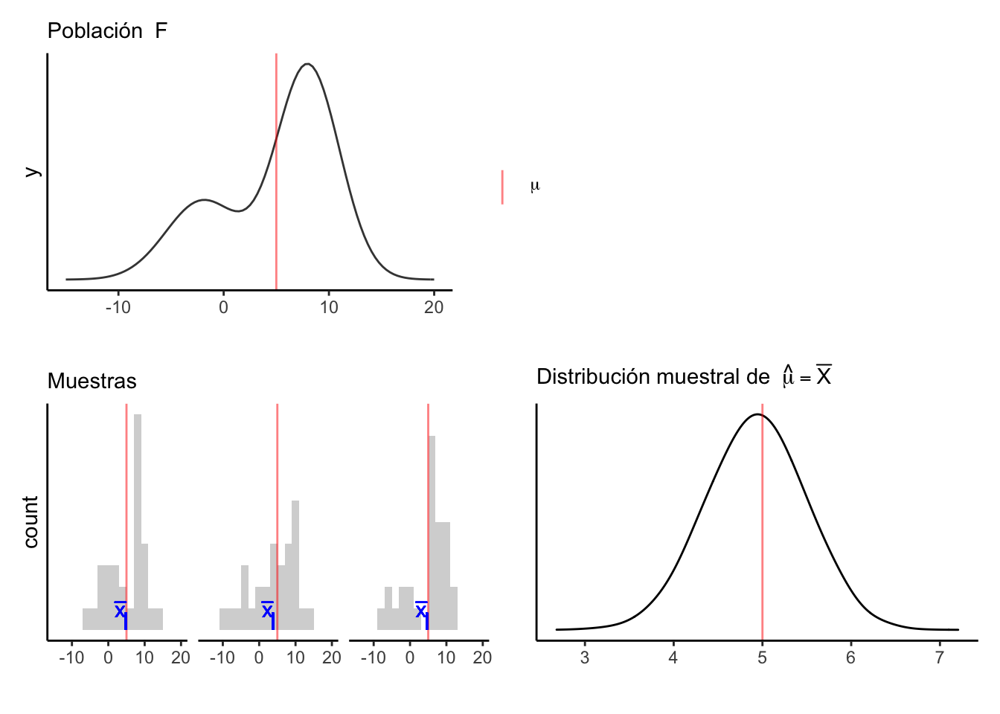
<p class="caption">(\#fig:mundo-real)Mundo Real</p>
</div>


<div class="figure" style="text-align: center">
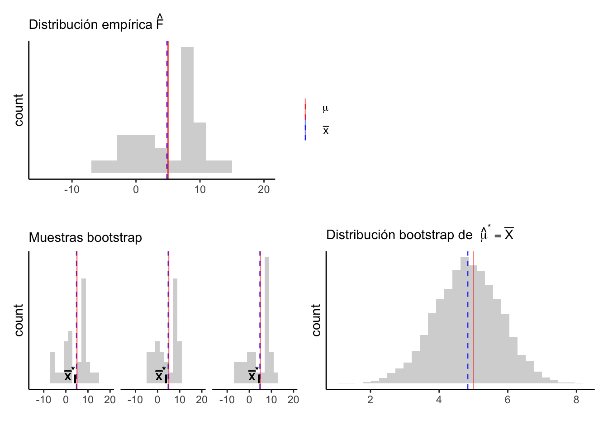
<p class="caption">(\#fig:mundo-bootstrap)Mundo Bootstrap</p>
</div>


**Observación 1**. Veremos ejemplos más complejos, pero nótese que si la muestra
original son observaciones independientes obtenidas de la distribución poblacional,
entonces logramos esto en las remuestras tomando observaciones con reemplazo
de la muestra. Igualmente, las remuestras deben ser del mismo tamaño que la muestra
original.

\BeginKnitrBlock{ejercicio}<div class="ejercicio">- ¿Porqué no funcionaría tomar muestras sin reemplazo? Piensa si hay independencia
entre las observaciones de la remuestra, y cómo serían las remuestras sin reemplazo.
- ¿Por qué no se puede hacer bootstrap si no conocemos cómo se obtuvo la muestra original?</div>\EndKnitrBlock{ejercicio}


**Observación 2**. Estos argumentos se pueden escribir con fórmulas usando por
ejemplo la función de distribución acumulada $F$ de la población y su estimador,
que es la función empírica $\hat{F}$, como en @Efron. 
Si $\theta = t(F)$ es una
cantidad poblacional que queremos estimar, su estimador plug-in es
$\hat{\theta} = t(\hat{F})$. 

**Observación 3**: La distribución empírica $\hat{F}$ es un estimador "razonable" de
la distribución poblacional $F,$ pues por el teorema de Glivenko-Cantelli (ver @Wasserman,
o [aquí](https://en.wikipedia.org/wiki/Glivenko-Cantelli_theorem)), 
$\hat{F}$ converge a $F$ cuando el tamaño de muestra $n\to\infty$, lo cual es
intuitivamente claro.


### Ejemplo {-}

En el ejemplo de tomadores de té, podemos estimar la proporción de tomadores
de té que prefiere el té negro usando nuestra muestra:


```r
te <- read_csv("data/tea.csv") %>%
  rowid_to_column() %>% 
  select(rowid, Tea, sugar)
te %>% mutate(negro = ifelse(Tea == "black", 1, 0)) %>% 
  summarise(prop_negro = mean(negro), n = length(negro), .groups = "drop")
```

```
## # A tibble: 1 x 2
##   prop_negro     n
##        <dbl> <int>
## 1      0.247   300
```

¿Cómo evaluamos la precisión de este estimador? Supondremos que el estudio se
hizo tomando una muestra aleatoria simple de tamaño 300 de la población de tomadores de té que
nos interesa. Podemos entonces usar el boostrap:


```r
# paso 1: define el estimador
calc_estimador <- function(datos){
  prop_negro <- datos %>% 
    mutate(negro = ifelse(Tea == "black", 1, 0)) %>% 
    summarise(prop_negro = mean(negro), n = length(negro), .groups = "drop") %>% 
    pull(prop_negro)
  prop_negro
}
# paso 2: define el proceso de remuestreo
muestra_boot <- function(datos){
  #tomar muestra con reemplazo del mismo tamaño
  sample_n(datos, size = nrow(datos), replace = TRUE)
}
# paso 3: remuestrea y calcula el estimador
prop_negro_tbl <- map_dbl(1:2000,  ~ calc_estimador(muestra_boot(datos = te))) %>% 
  tibble(prop_negro = .)
# paso 4: examina la distribución bootstrap
prop_negro_tbl %>% 
  ggplot(aes(x = prop_negro)) +
  geom_histogram(bins = 15)
```

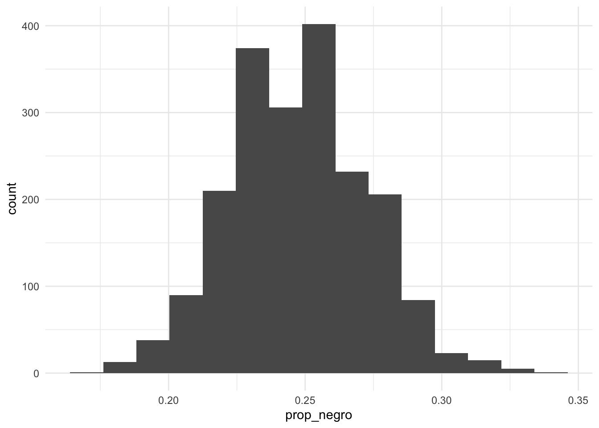

Y podemos evaluar varios aspectos, por ejemplo dónde está centrada y 
qué tan dispersa es la distribución bootstrap:


```r
prop_negro_tbl %>% 
  summarise(media = mean(prop_negro),
            sesgo = mean(prop_negro) - 0.2499,
            ee = sd(prop_negro),
            cuantil_75 = quantile(prop_negro, 0.75), 
            cuantil_25 = quantile(prop_negro, 0.25),
            .groups = "drop") %>% 
  mutate(across(where(is.numeric), round, 3)) %>% 
  pivot_longer(cols = everything())
```

```
## # A tibble: 5 x 2
##   name        value
##   <chr>       <dbl>
## 1 media       0.248
## 2 sesgo      -0.002
## 3 ee          0.025
## 4 cuantil_75  0.263
## 5 cuantil_25  0.23
```


## Discusión: propiedades de la distribución bootstrap {-}

Uasremos la distribución bootstrap principalmente para evaluar la variabilidad
de nuestros estimadores (y también otros aspectos como sesgo) estimando
la dispersión de la distribución de muestreo. Sin embargo, es importante notar
que no la usamos, por ejemplo, para saber dónde está centrada la distribución 
de muestreo, o para "mejorar" la estimación remuestreando.

### Ejemplo {-}

En nuestro ejemplo, podemos ver varias muestras (por ejemplo 20) de tamaño 200, y
vemos cómo se ve la aproximación a la distribución de la población:

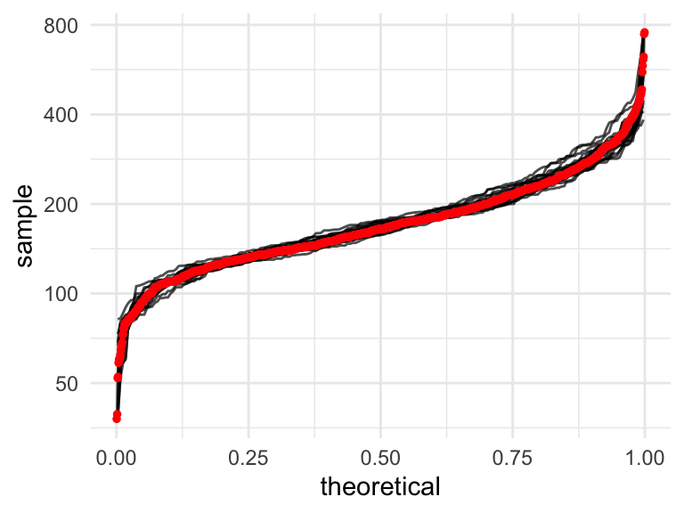

Podemos calcular las distribuciones de remuestreo para cada muestra bootstrap,
y compararlas con la distribución de muestreo real.


```r
# paso 1: define el estimador
calc_estimador <- function(datos){
  media_precio <- datos %>% 
    summarise(media = mean(precio_miles), .groups = "drop") %>% 
    pull(media)
  media_precio
}
# paso 2: define el proceso de remuestreo
muestra_boot <- function(datos, n = NULL){
  #tomar muestra con reemplazo del mismo tamaño
  if(is.null(n)){
    m <- sample_n(datos, size = nrow(datos), replace = TRUE)}
  else {
    m <- sample_n(datos, size = n, replace = TRUE)
  }
  m
}
dist_boot <- datos_sim %>%
  filter(tipo == "muestras") %>% 
  select(precio_miles, rep) %>% 
  group_by(rep) %>% nest() %>% 
  mutate(precio_miles =  map(data, function(data){
    tibble(precio_miles = map_dbl(1:1000, ~ calc_estimador(muestra_boot(data))))
  })) %>% 
  select(rep, precio_miles) %>% 
  unnest()
  
dist_muestreo <- datos_sim %>% 
  filter(tipo == "población") %>% 
  group_by(rep) %>% nest() %>% 
  mutate(precio_miles =  map(data, function(data){
    tibble(precio_miles = map_dbl(1:1000, ~ calc_estimador(muestra_boot(data, n = 200))))
  })) %>% 
  select(rep, precio_miles) %>% 
  unnest()
```


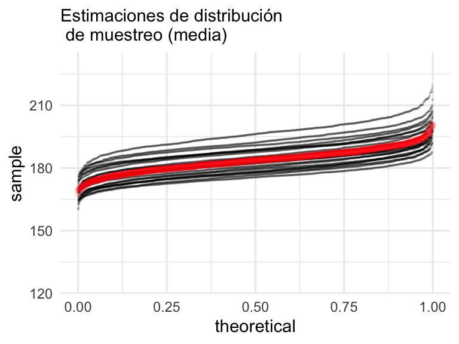

Obsérvese que:

- En algunos casos la aproximación  es mejor que en otros (a veces
la muestra tiene valores ligeramente más altos o más bajos). 
- La dispersión de cada una de estas distribuciones bootstrap es similar a la de la verdadera
distribución de muestreo (en rojo), pero puede está desplazada dependiendo
de la muestra original que utilizamos.
- Adicionalmente, los valores centrales de la distribución de bootstrap
tiende cubrir el verdadero valor que buscamos estimar, que es:


```r
poblacion_casas %>% summarise(media = mean(precio_miles), .groups = "drop")
```

```
## # A tibble: 1 x 1
##   media
##   <dbl>
## 1  183.
```

### Variación en distribuciones bootstrap {-}

En el proceso de estimación bootstrap hay dos fuentes de variación pues:

* La muestra original se selecciona con aleatoriedad de una población.

* Las muestras bootstrap se seleccionan con aleatoriedad de la muestra 
original. Esto es: *La estimación bootstrap ideal es un resultado asintótico 
$B=\infty$, en esta caso $\hat{\textsf{ee}}_{boot}$ iguala la estimación _plug-in_ 
$ee_{\hat{F}}$.* 

En el proceso de *bootstrap* podemos controlar la variación del segundo aspecto,
conocida como **implementación de muestreo Monte Carlo**, y la variación 
Monte Carlo decrece conforme incrementamos el número de muestras. 

Podemos eliminar la variación Monte Carlo si seleccionamos todas las posibles
muestras con reemplazo de tamaño $n$, hay ${2n-1}\choose{n}$ posibles muestras 
y si seleccionamos todas obtenemos $\hat{\textsf{se}}_\infty$ (bootstrap ideal), 
sin embargo, en la mayor parte de los problemas no es factible proceder así.


En la siguiente gráfica mostramos 6 posibles muestras de tamaño 50 simuladas de
la población, para cada una de ellas se graficó la distribución empírica y se
se realizan histogramas de la distribución bootstrap con $B=30$ y $B=1000$, en 
cada caso hacemos dos repeticiones, notemos que cuando el número de muestras 
bootstrap es grande las distribuciones bootstrap son muy similares (para una 
muestra de la población dada), esto es porque disminuimos el erro Monte Carlo. 
También vale la pena recalcar que la distribución bootstrap está centrada en el 
valor observado en la muestra (línea azúl punteada) y no en el valor poblacional
sin embargo la forma de la distribución es similar a lo largo de las filas.


Entonces, ¿cuántas muestras bootstrap? 

1. Incluso un número chico de replicaciones bootstrap, digamos $B=25$ es 
informativo, y $B=50$ con frecuencia es suficiente para dar una buena 
estimación de $se_P(\hat{\theta})$ (@Efron).

2. Cuando se busca estimar error estándar @Chihara recomienda $B=1000$ muestras, o 
$B=10,000$ muestras dependiendo la presición que se busque.


```r
se_media_boot <- function(x, B){
    thetas_boot <- rerun(B, mean(sample(x, replace = TRUE))) %>% flatten_dbl()
    sd(thetas_boot)
}
B_muestras <- data_frame(n_sims = c(5, 25, 50, 100, 200, 400, 1000, 1500, 3000, 
    5000, 10000, 20000)) %>% 
    mutate(est = map_dbl(n_sims, ~se_media_boot(x = casas_muestra$precio_m2, B = .)))
B_muestras
```

```
## # A tibble: 12 x 2
##    n_sims   est
##     <dbl> <dbl>
##  1      5  25.8
##  2     25  24.2
##  3     50  25.6
##  4    100  24.8
##  5    200  22.7
##  6    400  23.2
##  7   1000  23.2
##  8   1500  23.1
##  9   3000  23.5
## 10   5000  23.5
## 11  10000  23.8
## 12  20000  23.3
```


## Error estándar bootstrap e intervalos normales {-}

Ahora podemos construir nuestra primera versión de intervalos de confianza
basados en la distribución bootstrap. 

- Supongamos que queremos estimar una cantidad poblacional $\theta$ con una
estadística $\hat{\theta} = t(X_1,\ldots, X_n)$, donde $X_1,\ldots, X_n$ es una muestra
independiente e idénticamente distribuida de la población.

- Suponemos además que la distribución muestral de $\hat{\theta}$ es aproximadamente normal (el teorema
central del límite aplica), y está centrada en el verdadero valor poblacional $\theta$.

Ahora queremos construir un intervalo que tenga probabilidad 95\% de cubrir al
valor poblacional $\theta$. Tenemos que

$$P(-2\mathsf{ee}(\hat{\theta}) <  \hat{\theta} - \theta < 2\mathsf{ee}(\hat{\theta})) \approx 0.95$$
por las propiedades de la distribución normal ($P(-2\sigma < X -\mu < 2\sigma)\approx 0.95$ si $X$ es
normal con media $\mu$ y desviación estándar $\sigma$). Entonces

$$P(\hat{\theta} - 2\mathsf{ee}(\hat{\theta}) < \theta < \hat{\theta} + 2\mathsf{ee}(\hat{\theta})) \approx 0.95$$
Es decir, la probabilidad de que el verdadero valor poblacional $\theta$ esté en el intervalo
$$[\hat{\theta} - 2\mathsf{ee}(\hat{\theta}), \hat{\theta} + 2\mathsf{ee}(\hat{\theta})]$$
es cercano a 0.95. En este intervalo no conocemos el error estándar (es la desviación estándar
de la distribución de muestreo de $\hat{\theta}$), y aquí es donde
entre la distribución bootstrap, que aproxima la distribución de muestreo. Lo estimamos con

$$\hat{\mathsf{ee}}_{\textrm{boot}}(\hat{\theta})$$
que es la desviación estándar de la **distribución bootsrap**.

\BeginKnitrBlock{mathblock}<div class="mathblock">
**Definición.** El **error estándar bootstrap**  $\hat{\mathsf{ee}}_{\textrm{boot}}(\hat{\theta})$ se
define como la desviación estándar de la distribución bootstrap de $\theta$. 

El **intervalo de confianza normal bootstrap** al 95\% está dado por
$$[\hat{\theta} - 2\mathsf{ee}(\hat{\theta}), \hat{\theta} + 2\mathsf{ee}(\hat{\theta})].$$
  </div>\EndKnitrBlock{mathblock}

Nótese que hay varias cosas qué checar aquí: que el teorema central del límite aplica y
que la distribución de muestreo de nuestro estimador está centrado en el valor verdadero.
Esto en algunos casos se puede demostrar usando la teoría, pero más abajo veremos
comprobaciones empíricas.


### Ejemplo: tomadores de té negro{-}

Consideremos la estimación que hicimos de el procentaje de tomadores de té que toma
té negro:


```r
# paso 1: define el estimador
calc_estimador <- function(datos){
  prop_negro <- datos %>% 
    mutate(negro = ifelse(Tea == "black", 1, 0)) %>% 
    summarise(prop_negro = mean(negro), n = length(negro)) %>% 
    pull(prop_negro)
  prop_negro
}
prop_hat <- calc_estimador(te)
prop_hat %>% round(2)
```

```
## [1] 0.25
```

Podemos graficar su distribución bootstrap ---la cual simulamos arriba---.


```r
g_hist <- ggplot(prop_negro_tbl, aes(x = prop_negro)) + geom_histogram(bins = 15)
g_qq_normal <- ggplot(prop_negro_tbl, aes(sample = prop_negro)) +
  geom_qq() + geom_qq_line(colour = "red")
g_hist + g_qq_normal
```

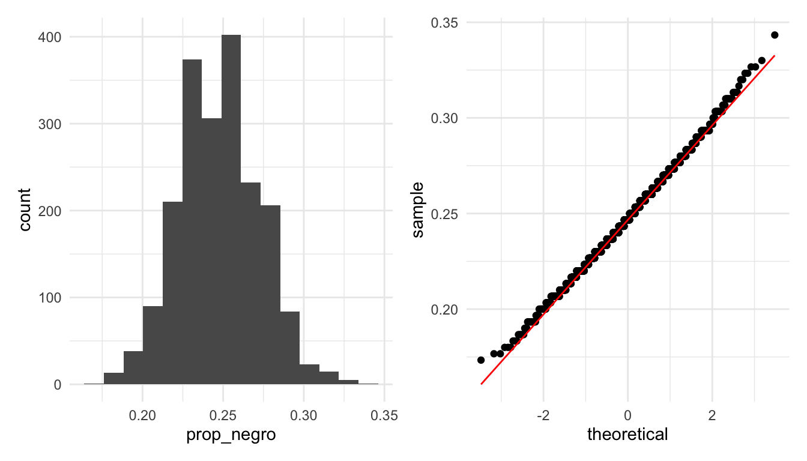

Y notamos que la distribución bootstrap es aproximadamente normal. 
Adicionalmente, vemos que el sesgo tiene un valor estimado de:


```r
media_boot <- prop_negro_tbl %>% pull(prop_negro) %>% mean
media_boot - prop_hat
```

```
## [1] 0.001126667
```

De esta forma, hemos verificado que:

- La distribución bootstrap es aproximadamente normal (ver gráfica de cuantiles normales); 
- La distribución bootstrap es aproximadamente insesgada.

Lo cual nos lleva a construir intervalos de confianza basados en la distribución
normal. Estimamos el error estándar con la desviación estándar de la
distribución bootstrap


```r
ee_boot <- prop_negro_tbl %>% pull(prop_negro) %>% sd
ee_boot
```

```
## [1] 0.02478898
```

y construimos un intervalo de confianza del 95%:


```r
intervalo_95 <- c(prop_hat - 2 * ee_boot, prop_hat + 2 * ee_boot)
intervalo_95 %>% round(2)
```

```
## [1] 0.2 0.3
```

Este intervalo tiene probabilidad del 95% de capturar al verdadero poblacional. Con
*alta* probabilidad, entonces, el porcentaje de tomadores de té en la población
está entre 0.2 y 0.3.

## Ejemplo: inventario de casas vendidas {-}

Ahora consideremos el problema de estimar el total del valor de las casas
vendidas en un periodo. Tenemos una muestra de tamaño $n=150$:


```r
# muestra original
set.seed(121)
muestra_casas <- sample_n(poblacion_casas, size = 150)
# paso 1: define el estimador
calc_estimador_casas <- function(datos){
  N <- nrow(poblacion_casas)
  n <- nrow(datos)
  total_muestra <- sum(datos$precio_miles)
  estimador_total <- (N / n) * total_muestra
  estimador_total
}
# paso 2: define el proceso de remuestreo
muestra_boot <- function(datos){
  #tomar muestra con reemplazo del mismo tamaño
  sample_n(datos, size = nrow(datos), replace = TRUE)
}
# paso 3: remuestrea y calcula el estimador
totales_boot <- map_dbl(1:5000,  ~ calc_estimador_casas(muestra_boot(muestra_casas))) %>% 
  tibble(total_boot = .)
# paso 4: examina la distribución bootstrap
g_hist <- totales_boot %>% 
  ggplot(aes(x = total_boot)) +
  geom_histogram()
g_qq <- totales_boot %>%
  ggplot(aes(sample = total_boot)) +
  geom_qq() + geom_qq_line(colour = "red") +
  geom_hline(yintercept = quantile(totales_boot$total_boot, 0.975), colour = "gray") +
  geom_hline(yintercept = quantile(totales_boot$total_boot, 0.025), colour = "gray") 
g_hist + g_qq
```

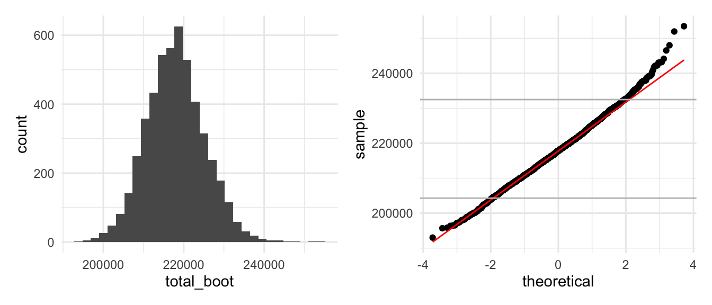

En este caso, distribución de muestreo presenta cierta asimetría, pero la
desviación no es grande. En la parte central la aproximación normal es
razonable. Procedemos a checar sesgo


```r
total_est <- calc_estimador_casas(muestra_casas)
sesgo <- mean(totales_boot$total_boot) - total_est
sesgo
```

```
## [1] 110.0851
```

Este número puede parecer grande, pero sí calculamos la desviación relativa
con respecto al estimador vemos que es chico en la escala de la distribución 
bootstrap:


```r
sesgo_relativo <- sesgo / total_est
sesgo_relativo
```

```
## [1] 0.0005053678
```

De forma que procedemos a construir intervalos de confianza como sigue :


```r
ee_boot <- sd(totales_boot$total_boot)
c(total_est - 2*ee_boot, total_est + 2*ee_boot)
```

```
## [1] 203366.6 232296.6
```

Que está en miles de dólares. En millones de dólares, este intervalo es:


```r
intervalo_total <- c(total_est - 2*ee_boot, total_est + 2*ee_boot) / 1000
intervalo_total %>% round(1)
```

```
## [1] 203.4 232.3
```

Así que con 95% de confianza el verdadero total del valor de las casas vendidas
está entre 203 y 232 millones
de dólares.

**Nota:** en este ejemplo mostraremos una alternativa de intervalos de confianza
que es más apropiado cuando observamos asimetría. Sin embargo, primero tendremos
que hablar de dos conceptos clave con respecto a intervalos de confianza:
calibración e interpretación.


## Calibración de intervalos de confianza {-}

¿Cómo sabemos que nuestros intervalos de confianza del 95% nominal 
tienen cobertura real de 95\%? Es decir, tenemos que checar:

- El procedimiento para construir intervalos debe dar intervalos tales
que el valor poblacional está en el intervalo de confianza para 95% de las muestras.

Como solo tenemos una muestra, la calibración depende de argumentos teóricos o
estudios de simulación previos. Para nuestro ejemplo de casas tenemos la
población, así que podemos checar qué cobertura real tienen los intervalos normales:


```r
simular_intervalos <- function(rep, size = 150){
  muestra_casas <- sample_n(poblacion_casas, size = size)
  N <- nrow(poblacion_casas)
  n <- nrow(muestra_casas)
  total_est <- (N / n) * sum(muestra_casas$precio_miles)
  # paso 1: define el estimador
  calc_estimador_casas <- function(datos){
    total_muestra <- sum(datos$precio_miles)
    estimador_total <- (N / n) * total_muestra
    estimador_total
  }
  # paso 2: define el proceso de remuestreo
  muestra_boot <- function(datos){
    #tomar muestra con reemplazo del mismo tamaño
    sample_n(datos, size = nrow(datos), replace = TRUE)
  }
  # paso 3: remuestrea y calcula el estimador
  totales_boot <- map_df(1:2000, ~calc_estimador_casas(muestra_boot(muestra_casas))) %>% 
    tibble(total_boot = .) %>%
    summarise(ee_boot = sd(total_boot)) %>% 
    mutate(inf = total_est - 2*ee_boot, sup = total_est + 2*ee_boot, 
           rep = rep)
  totales_boot
}
# Para recrear, correr:
# sims_intervalos <- map(1:100, ~ simular_intervalos(rep = .x))
# write_rds(sims_intervalos, "cache/sims_intervalos.rds")
# Para usar resultados en cache:
sims_intervalos <- read_rds("cache/sims_intervalos.rds")
```


```r
total <- sum(poblacion_casas$precio_miles)
sims_tbl <- sims_intervalos %>% 
  bind_rows %>%
  mutate(cubre = inf < total & total < sup) 
ggplot(sims_tbl, aes(x = rep)) +
  geom_hline(yintercept = total, colour = "red") +
  geom_linerange(aes(ymin = inf, ymax = sup, colour = cubre)) 
```

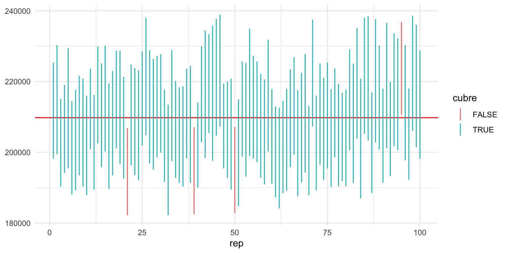
La cobertura para estos 100 intervalos simulados da


```r
total <- sum(poblacion_casas$precio_miles)
sims_tbl %>% 
  summarise(cobertura = mean(cubre))
```

```
## # A tibble: 1 x 1
##   cobertura
##       <dbl>
## 1      0.96
```
que es *consistente* con una cobertura real del 95% (¿qué significa
"consistente"? ¿Cómo puedes checarlo con el bootstrap?)

**Observación.** En este caso teníamos la población real, y pudimos verificar
la cobertura de nuestros intervalos. En general no la tenemos. Estos ejercicios
de simulación se pueden hacer con poblaciones sintéticas que se generen con 
las características que creemos va a tener nuestra población (por ejemplo, sesgo,
colas largas, etc.).

\BeginKnitrBlock{comentario}<div class="comentario">
En general, no importa qué tipo de estimadores o intervalos de confianza usemos,
requerimos checar la calibración. Esto puede hacerse con ejercicios de
simulación con poblaciones sintéticas y tanto los procedimientos de muestreo
como los tamaños de muestra que nos interesa usar.
</div>\EndKnitrBlock{comentario}

Verificar la cobertura de nuestros intervalos de confianza por medio simulación está
bien estudiado para algunos casos. Por ejemplo, cuando trabajamos con estimaciones para 
poblaciones teóricas. En general sabemos que los procedimientos funcionan bien en casos: 

- con distribuciones simétricas que tengan colas no muy largas; 
- estimación de proporciones donde no tratamos con casos raros o casos seguros
(probabilidades cercanas a 0 o 1).

## Interpretación de intervalos de confianza {-}

Como hemos visto, "intervalo de confianza" (de 90\% de confianza, por ejemplo) es un
término *frecuentista*, que significa:

- **Cada muestra produce un intervalo distinto**. Para el 90\% de las muestras posibles, el intervalo
cubre al valor poblacional.
- La afirmación es *sobre el intervalo y el mecanismo para construirlo.*
- Así que con *alta probabilidad*, el intervalo contiene el valor poblacional.
- Intervalos más anchos nos dan más incertidumbre acerca de dónde está el verdadero valor poblacional
(y al revés para intervalos más angostos).

Existen también "intervalos de credibilidad" (de 90\% de probabilidad, por ejemplo), que se interpetan de
forma *bayesiana*:

- Con 90\% de probabilidad (relativamente alta), creemos que el valor poblacional está dentro del intervalo de credibilidad.

Esta última interpretación es más natural. Obsérvese que para hablar de intervalos de
confianza frecuentista tenemos que decir:

- Este intervalo particular cubre o no al verdadero valor, pero nuestro procedimiento produce intervalos
que contiene el verdadero valor para el 90\% de las muestras. 
- Esta es una interpretación relativamente débil, y muchos intervalos poco útiles pueden satisfacerla.
- La interpretación bayesiana es más natural porque expresa más claramente incertidumbre acerca
del valor poblacional.

Por otro lado,

- La interpretación frecuentista nos da maneras empíricas de probar si los intervalos de
confianza están bien calibrados o no: es un mínimo que "intervalos del 90\%" deberían satisfacer.

Así que tomamos el punto de vista bayesiano en la intepretación, pero 
buscamos que nuestros intervalos cumplan o 
aproximen bien garantías frecuentistas (discutimos esto más adelante). Los intervalos
que producimos en esta sección pueden interpretarse de las dos maneras.


## Intervalos bootstrap de percentiles {-}

Retomemos nuestro ejemplo del valor total del precio de las casas. A través de
remuestras bootstrap hemos verificado gráficamente que la distribución de
remuestreo es *ligeramente* asimétrica (ver la figura de abajo). 

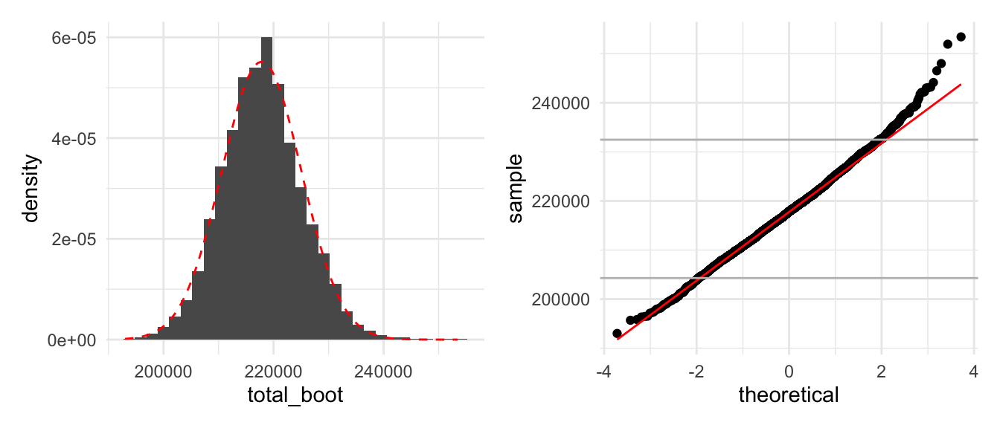

Anteriormente hemos calculado intervalos de confianza basados en supuestos
normales por medio del error éstandar. Este intervalo está dado por


```
## [1] 203.4 232.3
```
y por construcción sabemos que es simétrico con respecto al valor estimado, pero 
como podemos ver la distribución de muestreo no es simétrica, lo cual podemos
confirmar por ejemplo calculando el porcentaje de muestras bootstrap que caen
por arriba y por debajo del intervalo construido:


```
## # A tibble: 1 x 2
##   prop_inf prop_sup
##      <dbl>    <dbl>
## 1   0.0192    0.026
```

los cuales se han calculado como el porcentaje de medias bootstrap por debajo
(arriba) de la cota inferior (superior), y vemos que no coinciden con el nivel de 
confianza prestablecido (2.5\% para cada extremo).

Otra opción común que se usa específicamente cuando la distribución bootstrap 
no es muy cercana a la normal son los intervalos de percentiles bootstrap:

\BeginKnitrBlock{mathblock}<div class="mathblock">
**Definición.** El **intervalo de percentiles bootstrap** al 95\% de confianza
está dado por
$$[q_{0.025}, q_{0.975}]$$
donde $q_f$ es el percentil $f$ de la distribución bootstrap. 
</div>\EndKnitrBlock{mathblock}

Otros intervalos comunes son el de 80% o 90% de confianza, por ejemplo,
que corresponden a $[q_{0.10}, q_{0.90}]$ y $[q_{0.05}, q_{0.95}]$. *Ojo*: 
intervalos de confianza muy alta (por ejemplo 99.5%) pueden tener mala calibración
o ser muy variables en su longitud pues dependen del comportamiento en las colas de la
distribución.

Para el ejemplo de las casas, calcularíamos simplemente


```r
intervalo_95 <- totales_boot %>% pull(total_boot) %>% quantile(., probs = c(0.025, 0.975)) / 1000
(intervalo_95) %>% round(1)
```

```
##  2.5% 97.5% 
## 204.3 232.5
```
que está en millones de dólares. Nótese que es similar al intervalo de error estándar.


Otro punto interesante sobre los intervalos bootstrap de percentiles es que
lidian naturalmente con la asímetría de la distribución bootstrap. Ilustramos
esto con la distancia de las extremos del intervalo con respecto a la media:


```r
abs(intervalo_95 - total_est/1000)
```

```
##     2.5%    97.5% 
## 13.53912 14.64674
```

Los intervalos de confianza nos permiten presentar un rango de valores posibles
para el parámetro de interés. Esto es una notable diferencia con respecto a
presentar sólo un candidato como estimador. Nuestra fuente de información son
los datos. Es por esto que si vemos valores muy chicos (grandes) en nuestra
muestra, el intervalo se tiene que extender a la izquierda (derecha) para
compensar dichas observaciones.

\BeginKnitrBlock{ejercicio}<div class="ejercicio">Explica por qué cuando la aproximación normal es apropiada, el intervalo de percentiles
al 95% es muy similar al intervalo normal de 2 errores estándar.</div>\EndKnitrBlock{ejercicio}

### Ejemplo {-}


```r
# Ventajas de rsample
library(rsample)

# Generamos 100 muestras bootstrap, y la función nos regresa un arreglo con 100 
# renglones, cada uno corresponde a una muestra bootstrap.
set.seed(3897)
computos_boot <- bootstraps(propinas, strata = momento, 100)
computos_boot
# La columna splits tiene información de las muestras seleccionadas, para la 
# primera vemos que de 234 observaciones en la muestra original la primera 
# muestra bootstrap contiene 234-89=145.

first_computos_boot <- computos_boot$splits[[1]]
first_computos_boot
# Los podemos extraer
as_tibble(first_computos_boot)

# Una de las principales ventajas de usar este paquete es que es eficiente en el 
# uso de memoria.

library(pryr)
object_size(propinas)
object_size(computos_boot)
# tamaño por muestra
object_size(computos_boot)/nrow(computos_boot)
# el incremento en tamaño es << 100
as.numeric(object_size(computos_boot)/object_size(propinas))
```


Consideramos los datos de propinas. Queremos estimar la media de cuentas
totales para la comida y la cena. Podemos hacer bootstrap de cada grupo
por separado:


```r
# en este ejemplo usamos rsample, pero puedes
# escribir tu propio código
library(rsample)
propinas <- read_csv("data/propinas.csv")
estimador <- function(split, ...){
  muestra <- analysis(split) %>% group_by(momento)
  muestra %>% 
    summarise(estimate = mean(cuenta_total), .groups = 'drop') %>% 
    mutate(term = momento)
}
intervalo_propinas_90 <- bootstraps(propinas, strata = momento, 1000) %>% 
  mutate(res_boot = map(splits, estimador)) %>% 
  int_pctl(res_boot, alpha = 0.10) %>% 
  mutate(across(where(is.numeric), round, 2))
intervalo_propinas_90
```

```
## # A tibble: 2 x 6
##   term   .lower .estimate .upper .alpha .method   
##   <chr>   <dbl>     <dbl>  <dbl>  <dbl> <chr>     
## 1 Cena     19.8      20.8   22.0    0.1 percentile
## 2 Comida   15.6      17.1   18.8    0.1 percentile
```

Nota: *.estimate* es la media de los valores de la estadística sobre las 
remuestras, **no** es el estimador original.

De la tabla anterior inferimos que la media en la cuenta en la cena es más 
grande que la de la comida.
Podemos graficar agregando los estimadores plugin:


```r
estimadores <- propinas %>% 
  group_by(momento) %>% 
  rename(term = momento) %>% 
  summarise(media = mean(cuenta_total))

ggplot(intervalo_propinas_90, aes(x = term)) +
  geom_linerange(aes(ymin = .lower, ymax = .upper)) +
  geom_point(data = estimadores, aes(y = media), colour = "red", size = 3) +
  xlab("Momento") + ylab("Media de cuenta total (dólares)") +
  labs(subtitle = "Intervalos de 90% para la media")
```

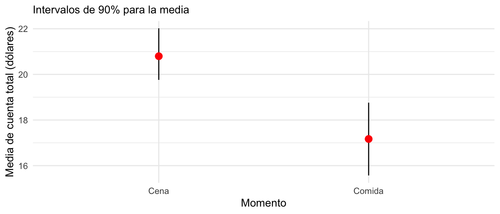

Nótese que el bootstrap lo hicimos por separado en cada momento del día (por eso
el argumento *strata* en la llamada a **bootstraps**):

\BeginKnitrBlock{ejercicio}<div class="ejercicio">
Justifica el procedimiento de hacer el bootstrap separado para cada grupo. ¿Qué supuestos
acerca del muestreo se deben satisfacer? ¿Deben ser muestras aleatorias simples 
de cada momento del día, por ejemplo? ¿Qué harías si no fuera así, por ejemplo, si 
se escogieron al azar tickets de todos los disponibles en un periodo?
  </div>\EndKnitrBlock{ejercicio}


## Bootstrap para dos muestras {-}

En el ejemplo anterior consideramos cómo hacer bootstrap cuando tenemos muestras
independientes. También podemos aplicarlo a estimadores que comparen directamente las
dos muestras:

<div class="mathblock">
<p><strong>Bootstrap para comparar poblaciones</strong>. Dadas muestras independientes de tamaños <span class="math inline">\(m\)</span> y <span class="math inline">\(n\)</span> de dos poblaciones:</p>
<ol style="list-style-type: decimal">
<li>Extraer una remuestra de tamaño <span class="math inline">\(m\)</span> con reemplazo de la primera muestra y una remuestra separada de tamaño <span class="math inline">\(n\)</span> de la segunda muestra. Calcula la estadística que compara los dos grupos (por ejemplo, diferencia de medias)</li>
<li>Repetir este proceso muchas veces (por ejemplo, 1000 - 10000).</li>
<li>Construir la distribución bootstrap de la estadística. Examinar dispersión, sesgo y forma.</li>
</ol>
</div>

### Ejemplo {-}

Supongamos que queremos comparar directamente la media de la cuenta total
en comida y cena. Podemos hacer:


```r
estimador_dif <- function(split, ...){
  muestra <- analysis(split) %>% group_by(momento)
  muestra %>% 
    summarise(estimate = mean(cuenta_total), .groups = "drop") %>% 
    pivot_wider(names_from = momento, values_from = estimate) %>% 
    mutate(estimate = Cena - Comida, term = "diferencia")
}
dist_boot <- bootstraps(propinas, strata = momento, 2000) %>% 
  mutate(res_boot = map(splits, estimador_dif)) 
g_1 <- ggplot(dist_boot %>% unnest(res_boot), aes(x = estimate)) + geom_histogram(bins = 20) +
  xlab("Diferencia Comida vs Cena")
g_2 <- ggplot(dist_boot %>% unnest(res_boot), aes(sample = estimate)) + geom_qq() + geom_qq_line(colour = 'red')
g_1 + g_2
```

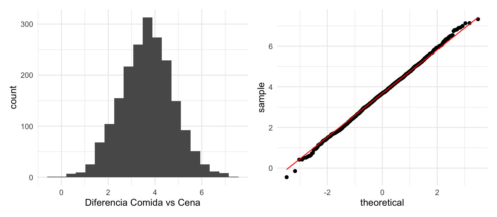

Y podemos calcular un intervalo de confianza para la diferencia de medias:


```r
dist_boot %>% int_pctl(res_boot, alpha = 0.01) %>% 
  mutate(across(where(is.numeric), round, 2)) %>% 
  select(term, .lower, .upper)
```

```
## # A tibble: 1 x 3
##   term       .lower .upper
##   <chr>       <dbl>  <dbl>
## 1 diferencia    0.9   6.46
```

Que nos indica que con alta probabilidad las cuentas son más altas que en la cena
que en la comida. La diferencia puede ir de un poco menos de un dólar hasta seis dólares
con 99\% de confianza.

### Datos pareados {-}

En otros casos, las muestras no son independientes y están pareadas. Por ejemplo, este es un estudio
dende a 10 personas una noche se les dio una medicina para dormir y otra noche otra medicina.
Se registraron cuántas horas de sueño extra comparados con un día donde no tomaron medicina.


```r
dormir <- sleep %>% 
  pivot_wider(names_from = group, 
              names_prefix = "medicina_",
              values_from = extra)
dormir
```

```
## # A tibble: 10 x 3
##    ID    medicina_1 medicina_2
##    <fct>      <dbl>      <dbl>
##  1 1            0.7        1.9
##  2 2           -1.6        0.8
##  3 3           -0.2        1.1
##  4 4           -1.2        0.1
##  5 5           -0.1       -0.1
##  6 6            3.4        4.4
##  7 7            3.7        5.5
##  8 8            0.8        1.6
##  9 9            0          4.6
## 10 10           2          3.4
```

En este caso, el bootstrap se hace sobre individuos, y quisiéramos comparar
la medición de la medicina_1 con la medicina_2. Usaremos la media de al diferencia
entre horas de sueño entre las dos medicinas. Nuestro estimador puntual es:


```r
estimador_dif <- dormir %>% 
  mutate(dif_2_menos_1 = medicina_2 - medicina_1) %>% 
  summarise(dif_media = mean(dif_2_menos_1))
estimador_dif
```

```
## # A tibble: 1 x 1
##   dif_media
##       <dbl>
## 1      1.58
```
Esto indica que en promedio duermen hora y media más con la medicina 2 que con 
la medicina 1. Como hay variabilildad considerable en el número de horas extra de
cada medicina dependiendo del individuo, es necesario hacer una intervalo de confianza
para descartar que esta diferencia haya aparecido por azar debido a la variación muestral.

Nótese que aquí no tenemos estratos, pues solo hay una muestra de individuo con
dos mediciones.


```r
estimador_dif <- function(split, ...){
  muestra <- analysis(split)
  muestra %>% 
    mutate(dif_2_menos_1 = medicina_2 - medicina_1) %>% 
    summarise(estimate = mean(dif_2_menos_1), .groups = "drop") %>% 
    mutate(term = "diferencia 2 vs 1")
}
dist_boot <- bootstraps(dormir,  2000) %>% 
  mutate(res_boot = map(splits, estimador_dif)) 
g_1 <- ggplot(dist_boot %>% unnest(res_boot), aes(x = estimate)) + geom_histogram(bins = 20)
g_2 <- ggplot(dist_boot %>% unnest(res_boot), aes(sample = estimate)) + geom_qq() + geom_qq_line(colour = 'red')
g_1 + g_2
```

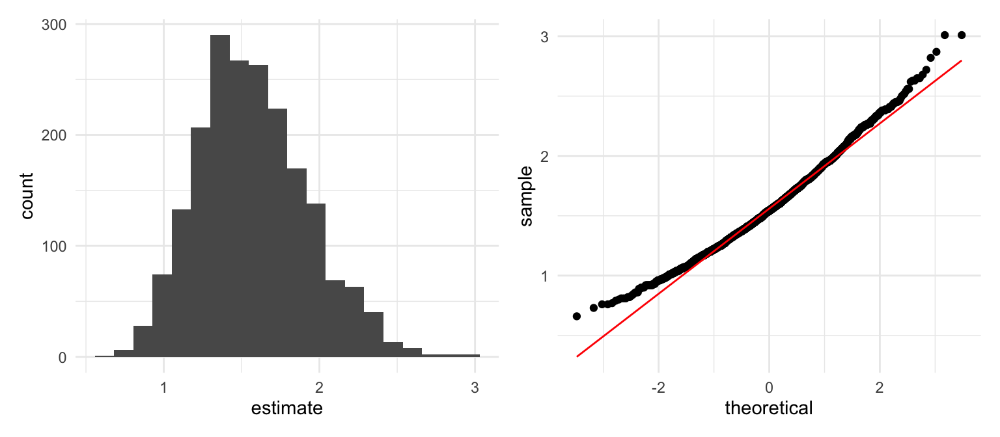

Nuestro intervalo de percentiles al 90% es de


```r
dist_boot %>% int_pctl(res_boot, 0.10)
```

```
## # A tibble: 1 x 6
##   term              .lower .estimate .upper .alpha .method   
##   <chr>              <dbl>     <dbl>  <dbl>  <dbl> <chr>     
## 1 diferencia 2 vs 1   1.04      1.57    2.2    0.1 percentile
```
Lo que indica con alta probabilidad que la medicina 2 da entre 1 y 2 horas extras de sueño. Nota
que en este ejemplo también podríamos hacer una prueba de hipótesis por permutaciones,
suponiendo como hipótesis nula que las dos medicinas son equivalentes. Sin embargo, usualmente
es más informativo presentar este tipo de intervalos para estimar la diferencia.

## Bootstrap y otras estadísticas {-}

El bootstrap es una técnica versátil. Un ejemplo son **estimadores de razón**, que tienen
la forma

$$ \hat{r} = \frac{\overline y}{\overline x}$$
Por ejemplo, ¿cómo haríamos estimación para el procentaje de área area habitable
de las casas en relación al tamaño del lote? Una manera de estimar esta cantidad
es dividiendo la suma del área habitable de nuestra muestra y dividirlo entre
la suma del área de los lotes de nuestra muestra, como en la fórmula anterior. Esta
fórmula es más difícil pues tanto numerador como denominador tienen variabilidad,
y estas dos cantidades no varían independientemente.

Con el bootstrap podemos atacar estos problemas

### Ejemplo: estimadores de razón {-}

Nuestra muestra original es:


```r
set.seed(250)
casas_muestra <- sample_n(poblacion_casas, 200)
```

El estimador de interés es:


```r
estimador_razon <- function(split, ...){
  muestra <- analysis(split)
  muestra %>% 
    summarise(estimate = sum(area_habitable_sup_m2) / sum(area_lote_m2), .groups = "drop") %>% 
    mutate(term = "% area del lote construida")
}
```

Y nuestra estimación puntual es


```r
estimador <- muestra_casas %>% summarise(estimate = sum(area_habitable_sup_m2) / sum(area_lote_m2))
estimador
```

```
## # A tibble: 1 x 1
##   estimate
##      <dbl>
## 1    0.148
```
Es decir que en promedio, un poco más de 15% del lote total es ocupado por área habitable. 
Ahora hacemos bootstrap para construir un intervalo:


```r
dist_boot <- bootstraps(casas_muestra,  2000) %>% 
  mutate(res_boot = map(splits, estimador_razon)) 
g_1 <- ggplot(dist_boot %>% unnest(res_boot), aes(x = estimate)) + geom_histogram(bins = 20)
g_2 <- ggplot(dist_boot %>% unnest(res_boot), aes(sample = estimate)) + geom_qq() + geom_qq_line(colour = 'red')
g_1 + g_2
```

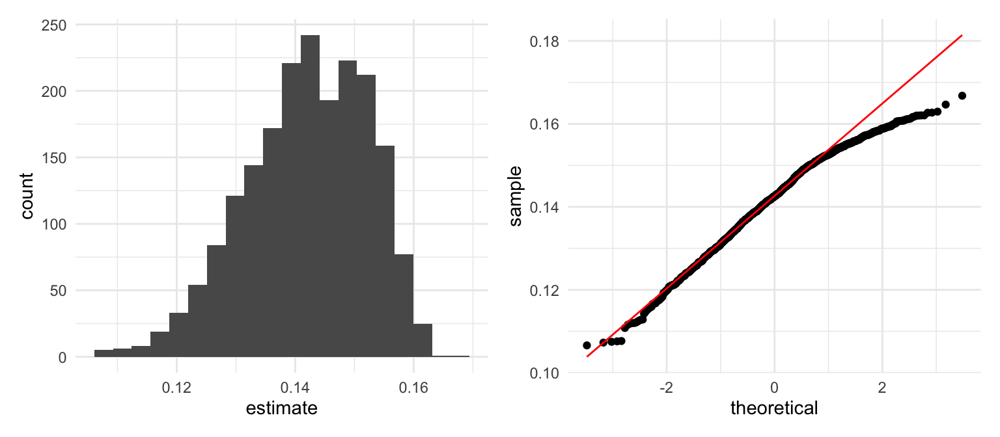

En este caso la cola derecha parece tener menos dispersión que una distribución normal.
Usamos un intervalo de percentiles para obtener:


```r
dist_boot %>% int_pctl(res_boot) %>% 
  mutate(estimador = estimador$estimate) %>% 
  rename(media_boot = .estimate) %>% 
  mutate(bias = media_boot - estimador) %>% 
  pivot_longer(is_numeric) %>% 
  mutate(value = round(value, 3))
```

```
## # A tibble: 6 x 4
##   term                       .method    name        value
##   <chr>                      <chr>      <chr>       <dbl>
## 1 % area del lote construida percentile .lower      0.121
## 2 % area del lote construida percentile media_boot  0.142
## 3 % area del lote construida percentile .upper      0.159
## 4 % area del lote construida percentile .alpha      0.05 
## 5 % area del lote construida percentile estimador   0.148
## 6 % area del lote construida percentile bias       -0.006
```
Nótese que el sesgo es bajo.
De modo que en esta zona, entre 12% y 16% de toda el área disponible es ocupada por
área habitable: estas son casas que tienen jardines o terrenos, garage relativamente grandes.


### Ejemplo: suavizadores {-}


Podemos usar el bootstrap para juzgar
la variabilidad de un suavizador, que consideramos como nuestra
estadística:


```r
graf_casas <- function(data){
    ggplot(data %>% filter(calidad_gral < 7), 
        aes(x = area_habitable_sup_m2)) + 
        geom_point(aes(y = precio_m2_miles), alpha = 0.75) +
        geom_smooth(aes(y = precio_m2_miles), method = "loess", span = 0.7, 
                se = FALSE, method.args = list(degree = 1, family = "symmetric"))     
}
graf_casas(muestra_casas)
```

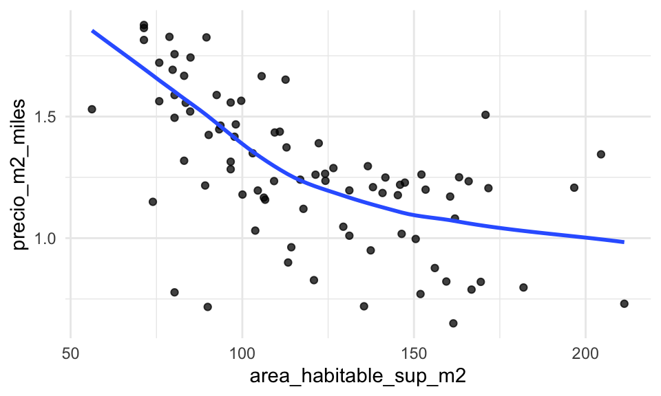

Podemos hacer bootstrap para juzgar la estabilidad del suavizador:


```r
suaviza_boot <- function(x, data){
    # remuestreo
    muestra_boot <- sample_n(data, nrow(data), replace = T)
    ajuste <- loess(precio_m2_miles ~ area_habitable_sup_m2, data = muestra_boot, 
                    degree = 1, span = 0.7, family = "symmetric")
    datos_grafica <- tibble(area_habitable_sup_m2 = seq(25, 250, 5))
    ajustados <- predict(ajuste, newdata = datos_grafica)
    datos_grafica %>% mutate(ajustados = ajustados) %>% 
        mutate(rep = x)
}
reps <- map(1:10, ~ suaviza_boot(.x, casas_muestra %>% filter(calidad_gral < 7))) %>% 
    bind_rows()
```


```r
# ojo: la rutina loess no tienen soporte para extrapolación
graf_casas(casas_muestra) + 
    geom_line(data = reps, aes(y = ajustados, group = rep), alpha = 1, colour = "red") 
```

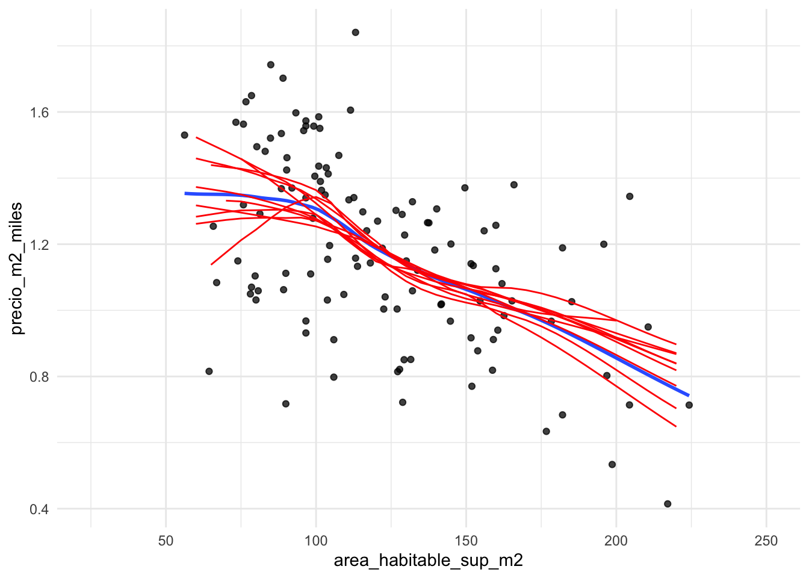

Donde vemos que algunas cambios de pendiente del suavizador original no son muy interpretables (por ejemplo,
para áreas chicas) y alta variabilidad en general en los extremos. Podemos hacer más iteraciones para calcular bandas de confianza:


```r
reps <- map(1:200, ~ suaviza_boot(.x, casas_muestra %>% filter(calidad_gral < 7))) %>% 
    bind_rows()
# ojo: la rutina loess no tienen soporte para extrapolación
graf_casas(casas_muestra) + 
    geom_line(data = reps, aes(y = ajustados, group = rep), alpha = 0.2, colour = "red") 
```

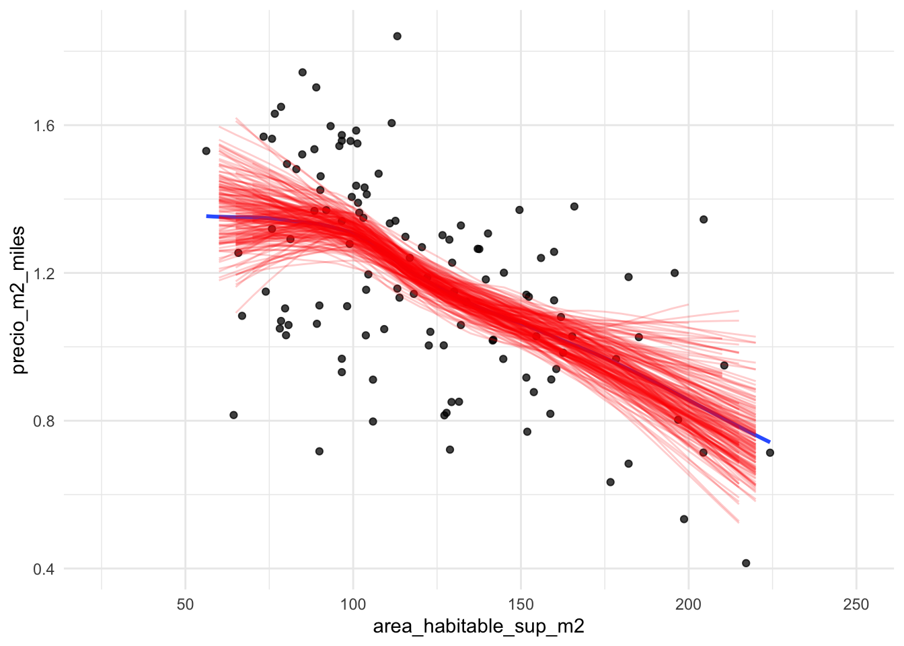
Donde observamos cómo tenemos incertidumbre en cuanto al nivel y forma de las curvas
en los extremos de los datos (casas grandes y chicas), lo cual es natural. Aunque podemos
resumir para hacer bandas de confianza, mostrar remuestras de esta manera es informativo: por ejempo:
vemos cómo es probable también que para casas de emnos de 70 metros cuadrados el precio por
metro cuadrado no cambia tanto (líneas constantes)


## Bootstrap y estimadores complejos: tablas de perfiles {-}

Podemos regresar al ejemplo de la primera sesión donde calculamos perfiles de los tomadores
de distintos tés: en bolsa, suelto, o combinados. Caundo hacemos estos tipos de análisis
no es raro que los prefiles tengan variabilidad considerable que es necesario cuantificar.


<table class="table table-hover table-condensed" style="width: auto !important; margin-left: auto; margin-right: auto;">
 <thead>
  <tr>
   <th style="text-align:left;"> price </th>
   <th style="text-align:left;"> tea bag </th>
   <th style="text-align:left;"> tea bag+unpackaged </th>
   <th style="text-align:left;"> unpackaged </th>
   <th style="text-align:right;"> promedio </th>
  </tr>
 </thead>
<tbody>
  <tr>
   <td style="text-align:left;"> p_upscale </td>
   <td style="text-align:left;"> <span style="     color: red !important;">-0.71</span> </td>
   <td style="text-align:left;"> <span style="     color: red !important;">-0.28</span> </td>
   <td style="text-align:left;"> <span style="     color: black !important;">0.98</span> </td>
   <td style="text-align:right;"> 28 </td>
  </tr>
  <tr>
   <td style="text-align:left;"> p_variable </td>
   <td style="text-align:left;"> <span style="     color: lightgray !important;">-0.12</span> </td>
   <td style="text-align:left;"> <span style="     color: black !important;">0.44</span> </td>
   <td style="text-align:left;"> <span style="     color: red !important;">-0.31</span> </td>
   <td style="text-align:right;"> 36 </td>
  </tr>
  <tr>
   <td style="text-align:left;"> p_cheap </td>
   <td style="text-align:left;"> <span style="     color: black !important;">0.3</span> </td>
   <td style="text-align:left;"> <span style="     color: red !important;">-0.53</span> </td>
   <td style="text-align:left;"> <span style="     color: lightgray !important;">0.23</span> </td>
   <td style="text-align:right;"> 2 </td>
  </tr>
  <tr>
   <td style="text-align:left;"> p_branded </td>
   <td style="text-align:left;"> <span style="     color: black !important;">0.62</span> </td>
   <td style="text-align:left;"> <span style="     color: lightgray !important;">-0.16</span> </td>
   <td style="text-align:left;"> <span style="     color: red !important;">-0.45</span> </td>
   <td style="text-align:right;"> 25 </td>
  </tr>
  <tr>
   <td style="text-align:left;"> p_private label </td>
   <td style="text-align:left;"> <span style="     color: black !important;">0.72</span> </td>
   <td style="text-align:left;"> <span style="     color: lightgray !important;">-0.22</span> </td>
   <td style="text-align:left;"> <span style="     color: red !important;">-0.49</span> </td>
   <td style="text-align:right;"> 5 </td>
  </tr>
  <tr>
   <td style="text-align:left;"> p_unknown </td>
   <td style="text-align:left;"> <span style="     color: black !important;">1.58</span> </td>
   <td style="text-align:left;"> <span style="     color: red !important;">-0.58</span> </td>
   <td style="text-align:left;"> <span style="     color: red !important;">-1</span> </td>
   <td style="text-align:right;"> 3 </td>
  </tr>
</tbody>
</table>


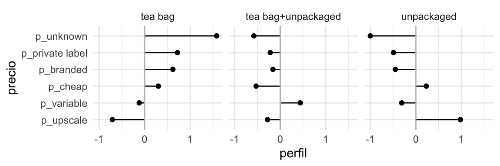

Hacemos bootstrap sobre toda la muestra, y repetimos exactamente el mismo proceso
de construción de perfiles:


```r
boot_perfiles <- map(1:1000, function(x){
    te_boot <- te %>% sample_n(nrow(te), replace = TRUE)
    calcular_perfiles(te_boot) %>% mutate(rep = x)
}) %>% bind_rows()
```

Ahora resumimos y graficamos, esta vez de manera distinta:


```r
resumen_perfiles <- boot_perfiles %>% group_by(how, price) %>% 
    summarise(perfil_media = mean(perfil), ymax = quantile(perfil, 0.9), ymin = quantile(perfil, 0.10)) 
resumen_bolsa <- resumen_perfiles %>% ungroup %>% 
    filter(how == "tea bag") %>% select(price, perfil_bolsa = perfil_media)
resumen_perfiles <- resumen_perfiles %>% left_join(resumen_bolsa) %>% 
    ungroup %>% 
    mutate(price = fct_reorder(price, perfil_bolsa))
ggplot(resumen_perfiles, aes(x = price, y = perfil_media, ymax = ymax, ymin = ymin)) + 
    geom_point(colour = "red") + geom_linerange() +
    facet_wrap(~how) + coord_flip() +
    geom_hline(yintercept = 0, colour = "gray") + ylab("Perfil") + xlab("Precio")
```

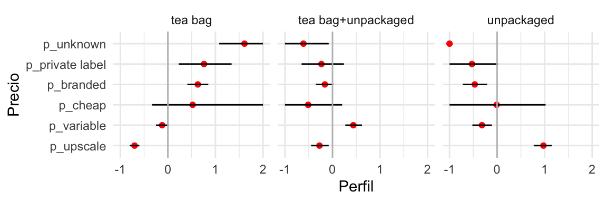

Nótese una deficiencia clara del bootstrap: para los que compran té suelto, 
en la muestra no existen personas
que desconocen de dónde provienen su té (No sabe/No contestó). 
Esto produce un intervalo colapsado en 0 que no es razonable. 

Podemos remediar esto de varias maneras: quitando del análisis los que no sabe o no contestaron, agrupando en otra categoría, usando un modelo, o regularizar usando proporciones calculadas con conteos modificados: por ejemplo, agregando un caso de cada combinación (agregaría 18 personas "falsas" a una muestra de 290 personas).


## Bootstrap y muestras complejas {-}

La necesidad de estimaciones confiables junto con el uso eficiente de recursos
conllevan a diseños de muestras complejas. Estos diseños típicamente usan las
siguientes técnicas: muestreo sin reemplazo de una población finita, muestreo
sistemático, estratificación, conglomerados, ajustes a no-respuesta, 
postestratificación. Como consecuencia, los valores de la muestra suelen no ser
independientes y los análisis de los mismos dependerá del diseño de la muestra.
Comenzaremos con definiciones para entender el problema.


```r
set.seed(3872999)
n_escuelas <- 5000

tipo <- sample(c("rural", "urbano", "indigena"), n_escuelas, replace = TRUE, 
    prob = c(0.3, 0.5, 0.2))

escuela <- tibble(ind_escuela = 1:n_escuelas, tipo, 
    media_tipo = case_when(tipo == "urbano" ~ 550, tipo == "rural" ~ 400, TRUE ~ 350), 
    media_escuela = rnorm(n_escuelas, media_tipo, 30), 
    n_estudiantes = round(rnorm(n_escuelas, 30, 4)))

estudiantes <- uncount(escuela, n_estudiantes) %>% 
    rowwise() %>% 
    mutate(calif = rnorm(1, media_escuela, 70)) %>% 
    ungroup()
```

Imaginemos que tenemos una población de 5000,
y queremos estimar la media de las calificaciones de los estudiantes en una prueba.


```r
head(estudiantes)
```

```
## # A tibble: 6 x 5
##   ind_escuela tipo   media_tipo media_escuela calif
##         <int> <chr>       <dbl>         <dbl> <dbl>
## 1           1 urbano        550          561.  488.
## 2           1 urbano        550          561.  574.
## 3           1 urbano        550          561.  456.
## 4           1 urbano        550          561.  507.
## 5           1 urbano        550          561.  598.
## 6           1 urbano        550          561.  527.
```
La primera idea sería tomar una muestra aleatoria (MAS, muestreo aleatorio simple), 
donde todos los estudiantes tienen igual probabilidad de ser seleccionados. Con
estas condiciones el presupuesto alcanza para seleccionar a 60 estudiantes, hacemos 
esto y calculamos la media.


```r
muestra <- sample_n(estudiantes, 60)
round(mean(muestra$calif), 2)
```

```
## [1] 466.73
```


Este número es muy cercano a la media verdadera de la población: 
466.51, pero esta es una de muchas posibles muestras.


```r
medias_mas <- rerun(1000, mean(sample_n(estudiantes, 60)$calif)) %>% 
    flatten_dbl()
sd(medias_mas)
```

```
## [1] 14.75242
```

```r
hist_mas <- ggplot(tibble(medias_mas), aes(x = medias_mas)) +
    geom_histogram(binwidth = 10) +
    geom_vline(xintercept = mean(estudiantes$calif), color = "red") +
    xlim(410, 520)
qq_mas <- ggplot(tibble(medias_mas), aes(sample = medias_mas)) +
    geom_qq(distribution = stats::qunif) +
    ylim(410, 520)

hist_mas + qq_mas
```


Algunas de las muestras generan valores alejados de la verdadera media, para minimizar
la probabilidad de seleccionar muestras que lleven a estimaciones alejadas del 
verdadero valor poblacional podríamos tomar muestras más grandes.

Pero usualmente los costos limitan el tamaño de muestra. Una alternativa es
estratificar, supongamos que sabemos el tipo de cada escuela (urbana, rural o 
indígena) y sabemos también que sabemos que la calificación de los estudiantes de escuelas urbanas tiende a ser distinta a las calificaciones que los estudiantes de
escuelas rurales o indígenas.


```r
muestra_estrat <- estudiantes %>% 
    group_by(tipo) %>% 
    sample_frac(0.0004)
dim(muestra_estrat)
```

```
## [1] 60  5
```

```r
muestrea_estrat <- function(){
    muestra <- estudiantes %>% 
        group_by(tipo) %>% 
        sample_frac(0.0004)
    mean(muestra$calif)
}

medias_estrat <- rerun(1000, muestrea_estrat()) %>% flatten_dbl()
sd(medias_estrat)
```

```
## [1] 10.20239
```

```r
hist_estrat <- ggplot(tibble(medias_estrat), aes(x = medias_estrat)) +
    geom_histogram(binwidth = 6) +
    geom_vline(xintercept = mean(estudiantes$calif), color = "red") +
    xlim(410, 520)
qq_estrat <- ggplot(tibble(medias_estrat), aes(sample = medias_estrat)) +
    geom_qq(distribution = stats::qunif) +
    ylim(410, 520)

hist_estrat + qq_estrat
```

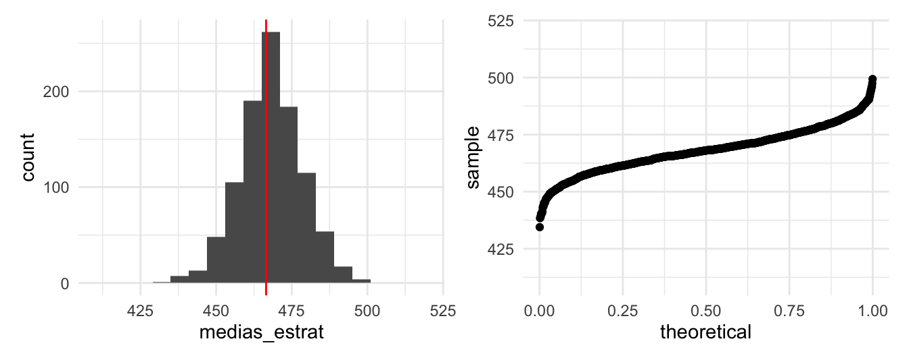

La estratificación nos sirve para reducir el error estándar de las estimaciones, 
por su parte los conglomerados reducen costos. Veamos cuantas escuelas tendría 
que visitar en una muestra dada (con diseño estratificado).


```r
n_distinct(muestra_estrat$ind_escuela)
```

```
## [1] 60
```

Es fácil ver que visitar una escuela para aplicar solo uno o dos exámenes no es
muy eficiente en cuestión de costos. Es por ello que se suelen tomar muestras 
considerando los conglomerados naturales, en este caso la escuela. No es difícil 
imaginar que una parte grande del costo del muestreo sea mandar al examinador a
la escuela y que una vez ahí examine a todos los alumnos de sexto grado. Podemos 
imaginar que considerando estos costos por visita de escuela nos alcance para
visitar 40 escuelas y en cada una examinar a todos los estudiantes.


```r
muestra_escuelas <- escuela %>% 
    group_by(tipo) %>% 
    sample_frac(size = 0.008)
muestra_cgl <- muestra_escuelas %>% 
    left_join(estudiantes) 
mean(muestra_cgl$calif)
```

```
## [1] 462.5677
```

```r
muestrea_cgl <- function(){
    muestra_escuelas <- escuela %>% 
        group_by(tipo) %>% 
        sample_frac(size = 0.008)
  muestra_cgl <- muestra_escuelas %>% 
      left_join(estudiantes, by = c("ind_escuela", "tipo"))
  mean(muestra_cgl$calif)
        
}

medias_cgl <- rerun(1000, muestrea_cgl()) %>% flatten_dbl()
sd(medias_cgl)
```

```
## [1] 5.337327
```

```r
hist_cgl <- ggplot(tibble(medias_cgl), aes(x = medias_cgl)) +
    geom_histogram(binwidth = 6) +
    geom_vline(xintercept = mean(estudiantes$calif), color = "red") +
    xlim(410, 520)
qq_cgl <- ggplot(tibble(medias_cgl), aes(sample = medias_cgl)) +
    geom_qq(distribution = stats::qunif) +
    ylim(410, 520)

hist_cgl + qq_cgl
```

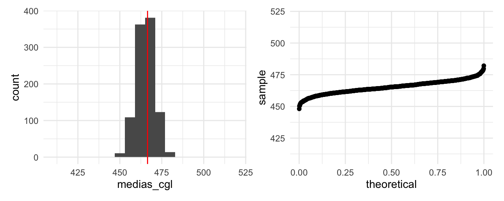


#### Ejemplo: ENIGH {-}

La complejidad de los diseños de encuestas conlleva a que el cálculo de errores
estándar sea muy complicado, para atacar este problema hay dos técnicas básicas:
1) un enfoque analítico usando linearización, 2) métodos de remuestreo como 
bootstrap. El incremento en el poder de cómputo ha favorecido los métodos de
remuestreo pues la linearización requiere del desarrollo de una fórmula para 
cada estimación y supuestos adicionales para simplificar.

En 1988 @RaoWu propusieron un método de bootstrap para diseños 
estratificados multietápicos con reemplazo de UPMs que describimos a 
continuación.

**ENIGH**. Usaremos como ejemplo la Encuesta Nacional de Ingresos y 
Gastos de los Hogares, ENIGH 2018 [@enigh], esta encuesta usa un diseño de 
conglomerados estratificado.

Antes de proceder a bootstrap debemos entender como se seleccionaron los datos,
esto es, el [diseño de la muestra](https://www.inegi.org.mx/contenidos/programas/enigh/nc/2018/doc/enigh18_diseno_muestral_ns.pdf):

1. Unidad primaria de muestreo (UPM). Las UPMs están constituidas por 
agrupaciones de viviendas. Se les denomina unidades primarias pues corresponden
a la primera etapa de selección, las unidades secundarias (USMs) serían los 
hogares.

2. Estratificación. Los estratos se construyen en base a estado, ámbito (urbano, 
complemento urbano, rural), características sociodemográficas de los habitantes
de las viviendas, características físicas y equipamiento. El proceso de 
estratificación resulta en 888 subestratos en todo el ámbito nacional.

3. La selección de la muestra es independiente para cada estrato, y una 
vez que se obtiene la muestra se calculan los factores de expansión que 
reflejan las distintas probabilidades de selección. Después se llevan a cabo
ajustes por no respuesta y por proyección (calibración), esta última 
busca que distintos dominios de la muestra coincidan con la proyección de 
población de INEGI.


```r
concentrado_hogar <- read_csv(here::here("data", 
    "conjunto_de_datos_enigh_2018_ns_csv", 
    "conjunto_de_datos_concentradohogar_enigh_2018_ns", "conjunto_de_datos",
    "conjunto_de_datos_concentradohogar_enigh_2018_ns.csv"))

# seleccionar variable de ingreso corriente
hogar <- concentrado_hogar %>% 
    mutate(
        upm = as.integer(upm),
        jefe_hombre = sexo_jefe == 1, 
        edo = str_sub(ubica_geo, 1, 2), 
        jefa_50 = (sexo_jefe == 2) & (edad_jefe > 50)
        ) %>% 
    select(folioviv, foliohog, est_dis, upm, factor, ing_cor, sexo_jefe, 
       edad_jefe, edo, jefa_50) %>% 
    group_by(est_dis) %>% 
    mutate(n = n_distinct(upm)) %>% # número de upms por estrato
    ungroup()
hogar
```

```
## # A tibble: 74,647 x 11
##    folioviv foliohog est_dis   upm factor ing_cor sexo_jefe edad_jefe edo  
##       <dbl>    <dbl>   <dbl> <int>  <dbl>   <dbl>     <dbl>     <dbl> <chr>
##  1   1.00e8        1       2     1    175  76404.         1        74 10   
##  2   1.00e8        1       2     1    175  42988.         1        48 10   
##  3   1.00e8        1       2     1    175 580698.         1        39 10   
##  4   1.00e8        1       2     1    175  46253.         2        70 10   
##  5   1.00e8        1       2     1    175  53837.         2        51 10   
##  6   1.00e8        1       2     2    189 237743.         2        41 10   
##  7   1.00e8        1       2     2    189  32607.         2        57 10   
##  8   1.00e8        1       2     2    189 169918.         1        53 10   
##  9   1.00e8        1       2     2    189  17311.         1        30 10   
## 10   1.00e8        1       2     3    186 120488.         1        69 10   
## # … with 74,637 more rows, and 2 more variables: jefa_50 <lgl>, n <int>
```

Para el cálculo de estadísticos debemos usar los factores de expansión, por 
ejemplo el ingreso trimestral total sería:


```r
sum(hogar$factor * hogar$ing_cor / 1000)
```

```
## [1] 1723700566
```

y ingreso trimestral medio (miles pesos)


```r
sum(hogar$factor * hogar$ing_cor / 1000) / sum(hogar$factor)
```

```
## [1] 49.61029
```

La estimación del error estándar, por otro lado, no es sencilla y requiere
usar aproximaciones, en la metodología de INEGI proponen una aproximación con 
series de Taylor.


<div class="figure" style="text-align: center">

<p class="caption">(\#fig:unnamed-chunk-84)Extracto de estimación de errores de muestreo, ENIGH 2018.</p>
</div>

Veamos ahora como calcular el error estándar siguiendo el bootstrap de Rao y Wu:

1. En cada estrato se seleccionan con reemplazo $m_h$ UPMs de las $n_h$ de la
muestra original. Denotamos por $m_{hi}^*$ el número de veces que se seleccionó
la UPM $i$ en el estrato $h$ (de tal manera que $\sum m_{hi}^*=m_h$). Creamos
una replicación del ponderador correspondiente a la $k$-ésima unidad (USM) como:

$$d_k^*=d_k \bigg[\bigg(1-\sqrt{\frac{m_h}{n_h - 1}}\bigg) + 
\bigg(\sqrt{\frac{m_h}{n_h - 1}}\frac{n_h}{m_h}m_{h}^*\bigg)\bigg]$$

donde $d_k$ es el inverso de la probabilidad de selección. Si $m_h<(n_h -1)$ 
todos los pesos definidos de esta manera serán no negativos. Calculamos el 
peso final $w_k^*$ aplicando a $d_k^*$ los mismos ajustes que se hicieron a los 
ponderadores originales.

2. Calculamos el estadístico de interés $\hat{\theta}$ usando los ponderadores
$w_k^*$ en lugar de los originales $w_k$.

3. Repetimos los pasos 1 y 2 $B$ veces para obtener $\hat{\theta}^{*1},\hat{\theta}^{*2},...,\hat{\theta}^{*B}$.

4. Calculamos el error estándar como:

$$\hat{\textsf{se}}_B = \bigg\{\frac{\sum_{b=1}^B[\hat{\theta}^*(b)-\hat{\theta}^*(\cdot)]^2 }{B}\bigg\}^{1/2}$$

Podemos elegir cualquier valor de $m_h \geq 1$, el más sencillo es elegir
$m_h=n_h-1$, en este caso:
$$d_k^*=d_k \frac{n_h}{n_h-1}m_{hi}^*$$
en este escenario las unidades que no se incluyen en la muestra tienen 
un valor de cero como ponderador. Si elegimos $n_h \ne n_h-1$ las unidades que 
no están en la muestra tienen ponderador distinto a cero, si $m_h=n_h$ el
ponderador podría tomar valores negativos.

Implementemos el bootstrap de Rao y Wu a la ENIGH, usaremos $m_h=n_h-1$


```r
# creamos una tabla con los estratos y upms
est_upm <- hogar %>% 
    distinct(est_dis, upm, n)

hogar_factor <- est_upm %>% 
    group_by(est_dis) %>% # dentro de cada estrato tomamos muestra (n_h-1)
    sample_n(size = first(n) - 1, replace = TRUE) %>% 
    add_count(est_dis, upm, name = "m_hi", wt = 1) %>% # calculamos m_hi*
    left_join(hogar, by = c("est_dis", "upm", "n")) %>% 
    mutate(factor_b = factor * m_hi * n / (n - 1))

# unimos los pasos anteriores en una función para replicar en cada muestra bootstrap
svy_boot <- function(est_upm, hogar){
    m_hi <- est_upm %>% 
        split(.$est_dis) %>% 
        map(~sample(.$upm, size = first(.$n) - 1, replace = TRUE)) %>% 
        flatten_int() %>% 
        plyr::count() %>% 
        select(upm = x, m_h = freq)
    m_hi %>% 
        left_join(hogar, by = c("upm")) %>% 
        mutate(factor_b = factor * m_h * n / (n - 1))
}
set.seed(1038984)
boot_rep <- rerun(500, svy_boot(est_upm, hogar))

# Aplicación a ingreso medio
wtd_mean <- function(w, x, na.rm = FALSE) {
    sum(w * x, na.rm = na.rm) / sum(w, na.rm = na.rm)
} 

# La media es:
hogar %>% 
    summarise(media = wtd_mean(factor, ing_cor))
```

```
## # A tibble: 1 x 1
##    media
##    <dbl>
## 1 49610.
```

Y el error estándar:


```r
map_dbl(boot_rep, ~wtd_mean(w = .$factor_b, x = .$ing_cor)) %>% 
  sd()
```

```
## [1] 441.0439
```


El método bootstrap está implementado en el paquete `survey` y más recientemente 
en `srvyr` que es una versión *tidy* que utiliza las funciones en `survey`. 

Podemos comparar nuestros resultados con la implementación en `survey`.


```r
# 1. Definimos el diseño de la encuesta
library(survey)
library(srvyr)

enigh_design <- hogar %>% 
    as_survey_design(ids = upm, weights = factor, strata = est_dis)

# 2. Elegimos bootstrap como el método para el cálculo de errores estándar
set.seed(7398731)
enigh_boot <- enigh_design %>% 
    as_survey_rep(type = "subbootstrap", replicates = 500)

# 3. Así calculamos la media
enigh_boot %>% 
    srvyr::summarise(mean_ingcor = survey_mean(ing_cor))
```

```
## # A tibble: 1 x 2
##   mean_ingcor mean_ingcor_se
##         <dbl>          <dbl>
## 1      49610.           459.
```

```r
enigh_boot %>% 
    group_by(edo) %>% 
    srvyr::summarise(mean_ingcor = survey_mean(ing_cor)) 
```

```
## # A tibble: 30 x 3
##    edo   mean_ingcor mean_ingcor_se
##    <chr>       <dbl>          <dbl>
##  1 10         50161.           942.
##  2 11         46142.          1252.
##  3 12         29334.          1067.
##  4 13         38783.           933.
##  5 14         60541.          1873.
##  6 15         48013.          1245.
##  7 16         42653.          1239.
##  8 17         42973.          1675.
##  9 18         48148.          1822.
## 10 19         68959.          3625.
## # … with 20 more rows
```

Resumiendo:

* El bootstrap de Rao y Wu genera un estimador consistente y aproximadamente 
insesgado de la varianza de estadísticos no lineales y para la varianza de un 
cuantil. 

* Este método supone que la seleccion de UPMs es con reemplazo; hay variaciones 
del estimador bootstrap de Rao y Wu que extienden el método que acabamos de 
estudiar; sin embargo, es común ignorar este aspecto, 
por ejemplo [Mach et al](https://fcsm.sites.usa.gov/files/2014/05/2005FCSM_Mach_Dumais_Robidou_VA.pdf) estudian las propiedades del estimador de varianza bootstrap de Rao y Wu cuando 
la muestra se seleccionó sin reemplazo.

## Conclusiones y observaciones {-}

* El principio fundamental del Bootstrap no paramétrico es que podemos estimar
la distribución poblacional con la distribución empírica. Por tanto para 
hacer inferencia tomamos muestras con reemplazo de la muestra y 
analizamos la variación de la estadística de interés a lo largo de las 
remuestras.

* El bootstrap nos da la posibilidad de crear intervalos de confianza
cuando no contamos con fórmulas para hacerlo de manera analítica y sin 
supuestos distribucionales de la población.

* Hay muchas opciones para construir intervalos bootstrap, los que tienen 
mejores propiedades son los intervalos $BC_a$, sin embargo los más comunes son 
los intervalos normales con error estándar bootstrap y los intervalos de 
percentiles de la distribución bootstrap.

* Antes de hacer intervalos normales vale la pena 
graficar la distribución bootstrap y evaluar si el supuesto de normalidad es 
razonable. Así como evaluar el sesgo relativo.

* En cuanto al número de muestras bootstrap se recomienda al menos $1,000$ 
al hacer pruebas, y $10,000$ o $15,000$ para los resultados finales, sobre
todo cuando se hacen intervalos de confianza de percentiles.

* La función de distribución empírica es una mala estimación en las colas de 
las distribuciones, por lo que es difícil construir intervalos de confianza 
(usando bootstrap no paramétrico) para estadísticas que dependen mucho de las 
colas. O en general para estadísticas que dependen de un número chico de 
observaciones de una muestra grande.
