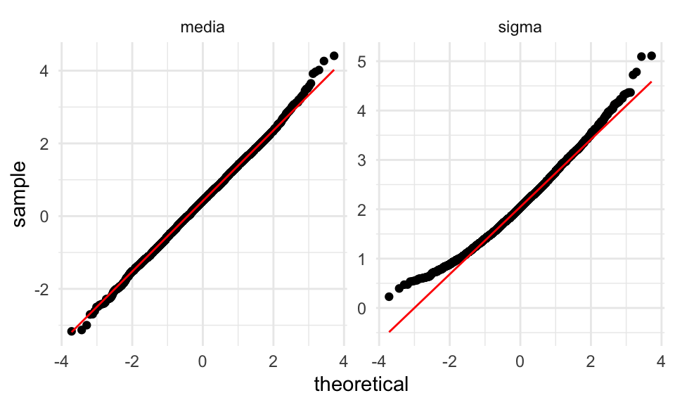
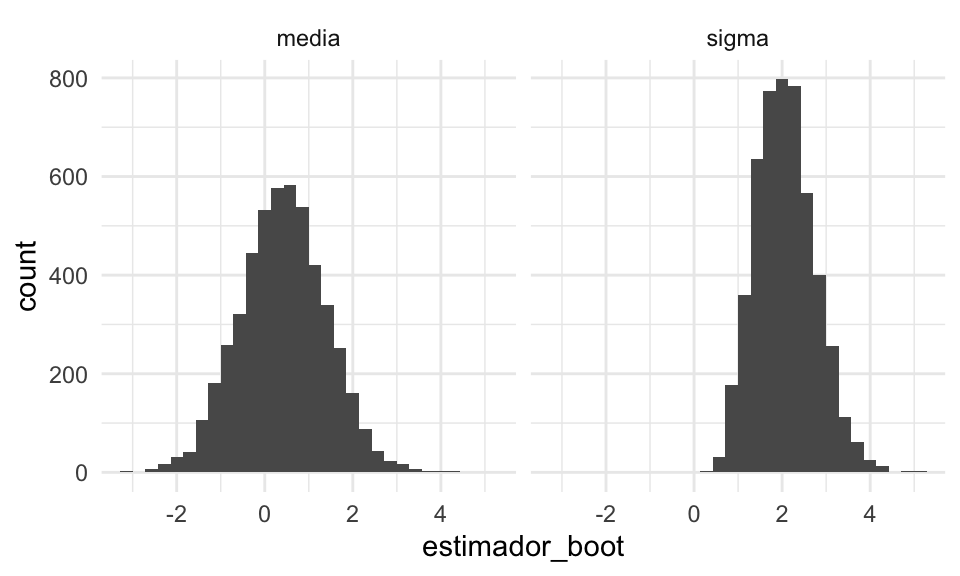
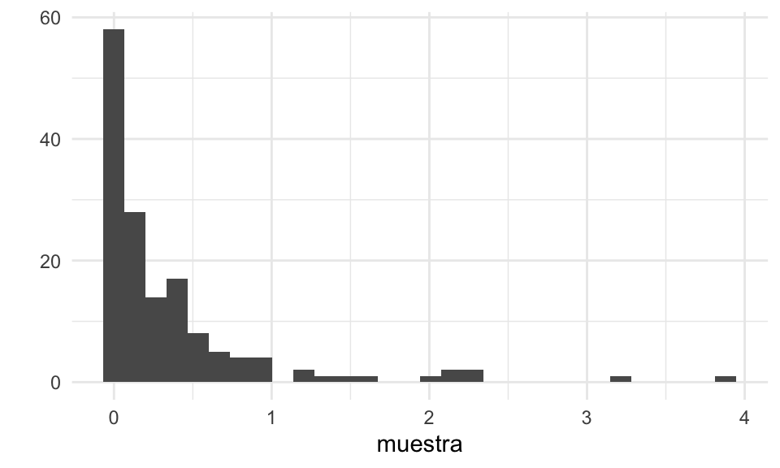
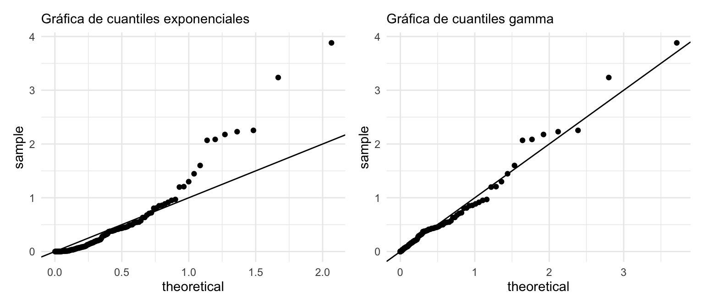

# Estimación por máxima verosimilitud


Los ejemplos que hemos visto han sido todos de estimadores *plug-in* (o por sustitución): 
si queremos saber una cantidad poblacional, y tenemos una muestra dada, entonces
calculamos la estadística de interés *como si la muestra fuera la población*. Por ejemplo,
para estimar la mediana poblacional usamos la mediana muestral, si queremos estimar
la media poblacional usamos la media muestral, y así sucesivamente. Estos estimadores
usualmente dan resultados razonables (pero hay que checar usando muestra bootstraps, por ejemplo,
y pensar lo que estamos haciendo).

Cuando sabemos más acerca de la población y usamos un modelo teórico es posible
hacer más: dependiendo de qué cantidades se quieren estimar, podemos construir estimadores
que sean *óptimos* en algún sentido siempre y cuando se cumplan los supuestos teóricos, como veremos ahora. 

Por ejemplo: ¿deberíamos estimar el centro de una distribución simétrica con la
media o con la mediana, o quizá con una media recortada?

En esta parte construiremos la teoría básica de estimación cuando trabajamos con 
modelos teóricos conocidos. El objetivo es entender **las ideas básicas** de 
estos procedimientos, y cómo evaluar sus resultados.

**Recordatorio**: las ventajas de usar modelos teóricos para describir 
distribuciones de datos está en que es posible comprimir más eficientemente la 
información, es posible construir modelos más complejos juntando varios de estos 
modelos y sus dependencias, y de que es posible hacer más teoría útil que nos 
guíe. La desventaja es que es necesario que esos supuestos teóricos sean 
razonables.


## Introducción a estimación por máxima verosimilitud {-}

Uno de los procedimientos más estándar en esta situación es el **método 
de máxima verosimilitud**. Los estimadores de máxima verosimilitud tienen 
propiedades convenientes, y dan en general resultados razonables siempre y 
cuando los supuestos sean razonables. 

**Máxima verosimilitud es un proceso intuitivo, y consiste en aprender o estimar valores de parámetros desconocidos a partir de la explicación más probable para los datos**. Para
esto, requeriremos calcular la probabilidad de un conjunto de observaciones, usando supuestos y modelos.

**Ejemplo.** Adaptado de [@Chihara]. Supongamos que una máquina produce dos tipos de bolsas de 25 galletas: la mitad de las veces produce una bolsa con 5 galletas de avena y 20 de chispas de chocolate, y
la otra mitad produce galletas con 23 galletas de avena y 2 de chispas de chocolate. 

Tomamos una bolsa, y no sabemos qué tipo de bolsa es (parámetro desconocido). Extraemos al azar una de las galletas, y es de chispas de chocolate (observación).

Por máxima verosimilitud, inferimos que la bolsa que estamos considerando tiene 5 galletas de avena. Esto es porque es más probable observar una galleta de chispas en las bolsas que contienen 5 galletas de avena que en las bolsas que contienen 23 galletas de avena. Podemos cuantificar la probabilidad que "acertemos" en nuestra inferencia.

Cómo se aprecia en el ejemplo anterior, el esquema general es:

1. Existe un proceso del que podemos obtener observaciones de algún sistema
o población real.
2. Tenemos un modelo probabilístico que dice cómo se producen esas observaciones a partir del sistema o población real.
3. Usualmente este modelo tiene algunas cantidades que no conocemos, que rigen el proceso y cómo se relaciona el proceso con las observaciones.

Nuestro propósito es:

4. Extraemos observaciones del proceso  
$$x_1, x_2, \ldots, x_n.$$
5. Queremos aprender de los parámetros desconocidos del proceso para calcular cantidades de interés acerca del sistema o población real


En principio, los modelos que consideramos pueden ser complicados y tener varias partes o parámetros. Veamos primero un ejemplo clásico con un solo parámetro, y cómo lo resolveríamos
usando máxima verosimilitud.

**Nota**: Cuando decimos *muestra* en general nos referimos a observaciones
independientes obtenidas del mismo proceso (ver la sección \@ref(S:distribucion-muestreo) para ver qué 
significa que sea independientes). Este esquema es un supuesto
que simplifica mucho los cálculos, como discutimos antes. Muchas veces este supuesto
sale del diseño de la muestra o del estudio, pero en todo caso es importante considerar
si es razonable o no para nuestro problema particular.

<div class="mathblock">
<p>Denotemos por <span class="math inline">\(f(x; \theta)\)</span> la función de densidad para una variable aleatoria continua con párametro asociado <span class="math inline">\(\theta.\)</span> Denotamos por <span class="math inline">\(X_1, \ldots, X_n,\)</span> una muestra aleatoria de <span class="math inline">\(n\)</span> observaciones de esta distribución y por <span class="math inline">\(x_1, \ldots, x_n\)</span> los valores observados de esta muestra aleatoria.</p>
</div>


**Ejemplo.** Supongamos que queremos saber qué proporción de registros de una base de datos tiene algún error menor de captura. No podemos revisar todos los registros, así que tomamos una muestra
de 8 registros, escogiendo uno por uno al azar de manera independiente. Revisamos los
8 registros, y obtenemos los siguientes datos:

$$x_1 = 0, x_2 = 1, x_3 = 0, x_4 = 0, x_5 =1, x_6 =0, x_7 =0, x_8 =0$$

donde 1 indica un error menor. Encontramos dos errores menores. ¿Cómo estimamos el número de
registros con errores leves en la base de datos?

Ya sabemos una respuesta razonable para nuestro estimador puntual, que sería $\hat{p}=2/8=0.25$. 
Veamos cómo se obtendría por máxima verosimilitud.

Según el proceso con el que se construyó la muestra, debemos dar una probabilidad de observar
los 2 errores en 8 registros. Supongamos que en realidad existe una proporción $p$
de que un registro tenga un error. Entonces calculamos

Probabilidad de observar la muestra:

$$P(X_1 = 0, X_2 = 1, X_3 = 0, X_4 = 0, X_5 =1, X_6 =0, X_7 =0, X_8 =0)$$

es igual a

$$P(X_1 = 0)P(X_2 = 1)P(X_3 = 0)P( X_4 = 0)P(X_5 =1)P(X_6 =0)P(X_7 =0)P(X_8 =0)$$
pues la probabilidad de que cada observación sea 0 o 1 no depende de las observaciones restantes (la muestra se extrajo de manera independiente).

Esta última cantidad tiene un parámetro que no conocemos: la proporcion $p$ de registros
con errores. Así que lo denotamos como una cantidad desconocida $p$. Nótese
entonces que $P(X_2=1) = p$, $P(X_3=0) = 1-p$ y así sucesivamente, así que la cantidad
de arriba es igual a

$$p(1-p)p(1-p)(1-p)p(1-p)(1-p)(1-p) $$

que se simplifica a 

$$ \mathcal{L}(p) = p^2(1-p)^6$$

Ahora la idea es **encontrar la p que maximiza la probabilidad de lo que observamos**. En
este caso se puede hacer con cálculo, pero vamos a ver una gráfica de esta función y
cómo resolverla de manera numérica.


```r
verosimilitud <- function(p){
  p^2 * (1-p)^6
}
dat_verosim <- tibble(x = seq(0,1, 0.001)) %>% mutate(prob = map_dbl(x, verosimilitud))
ggplot(dat_verosim, aes(x = x, y = prob)) + geom_line() +
  geom_vline(xintercept = 0.25, color = "red") +
  xlab("p")
```


Nótese que esta gráfica:

- Depende de los datos, que pensamos fijos.
- Cuando cambiamos la $p$, la probabilidad de observar la muestra cambia. Nos interesa
ver las regiones donde la probabilidad es relativamente alta.
- El máximo está en 0.25.
- Así que el estimador de máxima verosimilitud es $\hat{p} = 0.25$, **que es también
el estimador usual de plugin** en este caso.


Para uniformizar la notación con el caso continuo que veremos más adelante, usaremos
la notación 

$$P(X=x) = f(x)$$
donde $f$ es la función de densidad (en este caso, función de masa de probabilidad) de $X$. Si esta función depende
de un parámetro, escribimos $$f(x ;\theta)$$


<div class="mathblock">
<p><strong>Definición.</strong> Sean <span class="math inline">\(X_1, \ldots, X_n\)</span> una muestra de una densidad <span class="math inline">\(f(x; \theta)\)</span> y sean <span class="math inline">\(x_1,x_2,\ldots, x_n\)</span> los valores observados.</p>
<p>La <em>función de verosimilitud</em> del párametro de interés <span class="math inline">\(\theta\)</span> está definida por <span class="math display">\[\begin{align}
\mathcal{L}(\theta; x_1, \ldots, x_n) = \prod_{i = 1}^n f(x_i; \theta). 
\end{align}\]</span></p>
<p>Esta función nos dice qué tan creible es el valor del parámetro <span class="math inline">\(\theta\)</span> dada la muestra observada. A veces también la denotamos por <span class="math inline">\(\mathcal{L}_n(\theta)\)</span>.</p>
</div>


Ahora definimos qué es un estimador de máxima verosimilitud.


<div class="mathblock">
<p><strong>Definición.</strong> Un estimador de máxima verosimilitud lo denotamos por <span class="math inline">\(\hat \theta_{\textsf{MLE}}\)</span> y es un valor que satisface <span class="math display">\[\begin{align}
\hat \theta_{\textsf{MLE}} =  \underset{\theta \, \in \, \Theta}{\arg\max}\,  \mathcal{L}(\theta; x_1, \ldots, x_n),
\end{align}\]</span> donde <span class="math inline">\(\theta\)</span> denota el espacio parametral. Es decir, el espacio válido de búsqueda congruente con la definición del modelo.</p>
</div>

<div class="ejercicio">
<ul>
<li>Considera el caso de una normal con media y varianza desconocidas. ¿Cuáles son los espacios parametrales para efectuar <span class="math inline">\(\mathsf{MLE}\)</span>?</li>
<li>Considera el caso de una Binomial con parámetros <span class="math inline">\(N\)</span> y <span class="math inline">\(p\)</span> desconocidos. ¿Cuáles son los espacios parametrales para la búsqueda del <span class="math inline">\(\mathsf{MLE}\)</span>?</li>
</ul>
</div>


Obsérvese que para construir la verosimilitud y en consecuencia buscar por
estimadores de máxima verosimlitud necesitamos:

- Un modelo teórico de cómo es la población con parámetros e  
- Información de cómo se extrajo la muestra,  

y entonces podemos resolver nuestro problema de estimación 
convirtiéndolo en uno de optimización.

Probamos esta idea con un proceso más complejo.


**Ejemplo.** Supongamos que una máquina puede estar funcionando correctamente o no en cada
corrida. Cada corrida se producen 500 productos, y se muestrean 10 para
detectar defectos. Cuando la máquina funciona correctamente, la tasa de defectos
es de 3%. Cuando la máquina no está funcionando correctamente la tasa de defectos
es de 10%

Supongamos que escogemos al azar 11 corridas, y obervamos los siguientes
número de defectuosos:

$$1, 0, 0, 3 ,0, 0, 0, 2, 1, 0, 0$$

La pregunta es: ¿qué porcentaje del tiempo la máquina está funcionando correctamente?

Primero pensemos en una corrida. La probabilidad de observar una sucesión particular de 
$r$ defectos es

$$0.03^r(0.97)^{(10-r)}$$
cuando la máquina está funcionando correctamente.

Si la máquina está fallando, la misma probabilidad es 

$$0.2^r(0.8)^{(10-r)}.$$

Ahora supongamos que la máquina trabaja
correctamente en una proporción $p$ de las corridas. Entonces la probabilidad
de observar $r$ fallas se calcula promediando (probabilidad
total) sobre las probabilidades de que la máquina esté funcionando
bien o no:

$$0.03^r(0.97)^{(10-r)}p + 0.2^r(0.8)^{(10-r)}(1-p)$$
Y esta es nuestra función de verosimilitud para una observación.

Suponemos que las $r_1,r_2, \ldots, r_{11}$ observaciones son independientes
(por ejemplo, después de cada corrida la máquina se prepara de una manera estándar,
y es como si el proceso comenzara otra vez). Entonces tenemos que multiplicar
estas probabilidades para cada observación $r_1$:


```r
calc_verosim <- function(r){
  q_func <- 0.03^r*(0.97)^(10-r)
  q_falla <- 0.2^r*(0.8)^(10-r)
  function(p){
    #nota: esta no es la mejor manera de calcularlo, hay 
    # que usar logaritmos.
    prod(p*q_func + (1-p)*q_falla)
  }
}
verosim <- calc_verosim(c(1, 0, 0, 3, 0, 0, 0, 2, 1, 0, 0))
verosim(0.1)
```

```
## [1] 2.692087e-14
```


```r
dat_verosim <- tibble(x = seq(0,1, 0.001)) %>% mutate(prob = map_dbl(x, verosim))
ggplot(dat_verosim, aes(x = x, y = prob)) + geom_line() +
  geom_vline(xintercept = 0.8, color = "red") +
  xlab("prop funcionado")
```


Y nuestra estimación puntual sería de alrededor de 80%.


## Máxima verosimilitud para observaciones continuas {-}

Cuando las observaciones $x_1,\ldots, x_n$ provienen de una distribución
continua, no tiene sentido considerar $P(X = x_i)$, pues siempre es igual
a cero. 

Sin embargo, podemos
escribir para pequeños valores $\epsilon \ll 1$
\begin{align}
  P(x - \epsilon < X < x + \epsilon | \theta) = \int_{x - \epsilon}^{x + \epsilon} f(t; \theta) \, \text{d} t \approx 2 \epsilon f(x; \theta),
\end{align}
donde $f(x; \theta)$ es la función de densidad de $X.$ Por lo tanto, 
\begin{align}
\begin{split}
  P&(x_1 - \epsilon < X_1 < x_1 + \epsilon, \ldots, x_n - \epsilon < X_n < x_n + \epsilon | \theta) \\
  &= \prod_{i = 1}^n P(x_i - \epsilon < X_i < x_i + \epsilon | \theta) \\
  &= \prod_{i = 1}^n 2 \epsilon f(x_i; \theta) = (2\epsilon)^n \prod_{i = 1}^n f(x_i; \theta).
\end{split}
\end{align}

Notemos que si $\epsilon \rightarrow 0$ la ecuación rápidamente converge a cero. Pero para pequeños 
valores de $\epsilon$ la ecuación que nos interesa es proporcional a $\prod_{i = 1}^n f(x_i; \theta).$

De esta forma, nuestra definición de máxima verosimilitud y estimadores
de máxima verosimilitud es la misma para el caso continuo (verifica las definiciones
de la sección anterior).

**Ejemplo.** Supongamos que tenemos una muestra $x_1\ldots, x_n$ extraidas de una distribución
exponencial con tasa $\lambda>0$ donde no conocemos $\lambda$. ¿Cuál es 
el estimador de máxima verosimilitud de $\lambda$?

Para $\lambda>0$, tenemos que

$${\mathcal L}(\lambda) = \prod_{i=1}^n \lambda e^{\lambda x_i}$$
de modo que

$${\mathcal L}(\lambda) = \lambda^n e^{\lambda \sum_{i=1}^nx_i} = \lambda^n e^{n\lambda\bar{x}} = e^{n(\log\lambda + \lambda\bar{x})}$$
Que podemos maximizar usando cálculo para obtener 
$\hat{\lambda}_{\mathsf{ML}} = \frac{1}{\bar{x}}$ (demuéstralo). Discute
por qué esto es intuitivamente razonable: ¿cuál es
el valor esperado de una exponencial con parámetro $\lambda$?


## Aspectos numéricos {-}

Encontrar el estimador de máxima verosimilitud ($\textsf{MLE}$) es automático en la mayoría de los casos.
En teoría, podemos reutilizar la misma rutina numérica para encontrar el estimador sin ninguna ayuda de la analista. 
Esto contrasta con otras técnicas de estimación en donde se requieren cálculos y manipulación de ecuaciones. 

Sin embargo, hay situaciones que se pueden evitar de manera general. Por ejemplo, cuando calculamos la verosimilitud arriba, nótese que estamos multiplicando
números que pueden ser muy chicos (por ejemplo $p^6$, etc). Esto puede producir
desbordes numéricos fácilmente. Por ejemplo para un tamaño de muestra de 1000, podríamos
tener que calcular


```r
p <- 0.1
proba <- (p ^ 800)*(1-p)^200
proba
```

```
## [1] 0
```

En estos casos, es mejor hacer los cálculos en escala logarítmica. El logaritmo
convierte productos en sumas, y baja exponentes multiplicando. Si calculamos en escala
logaritmica la cantidad de arriba, no tenemos problema:


```r
log_proba <- 800 * log(p) + 200 * log(1-p)
log_proba
```

```
## [1] -1863.14
```

Ahora notemos que 

- Maximizar la verosimilitud **es lo mismo** que maximizar la log-verosimilitud,  pues el logaritmo es una función creciente. Si $x_{\max}$ es el máximo de $f$, tenemos que $f(x_{\max})>f(x)$ para cualquier $x$, entonces tomando logaritmo,
$$\log(f(x_{max}))>\log(f(x)),$$ para cualquier $x.$ Pues el logaritmo respeta la desigualdad por ser creciente.
- Usualmente usamos la log-verosimilitud para encontrar el estimador de máxima verosimilitud.
- Hay razónes teóricas y de interpretación por las que también es conveniente hacer esto.

<div class="mathblock">
<p><strong>Definición.</strong> La log-verosimilitud la denotamos usualmente por <span class="math display">\[\ell_n(\theta) = \log \left(\mathcal{L}_n(\theta)\right),\]</span> donde hemos suprimido la dependencia en la muestra por conveniencia.</p>
</div>

<div class="ejercicio">
<p>Considera una muestra de variables aleatorias Gaussianas con media <span class="math inline">\(\mu\)</span> y varianza <span class="math inline">\(\sigma^2.\)</span> Escribe la verosimilitud para una muestra de tamaño <span class="math inline">\(n,\)</span> y después escribe la función de log-verosimilitud. ¿Que interpetación le das a la ecuación resultante? ¿La has visto en algunos otros ejemplos en secciones anteriores?<br />
<em>Pista.</em> Recuerda la sección de regresión local.</p>
</div>


**Ejemplo.** En nuestro primer ejemplo,


```r
log_verosimilitud <- function(p){
  2*log(p) + 6*log(1-p)
}
dat_verosim <- tibble(x = seq(0,1, 0.01)) %>% mutate(log_prob = map_dbl(x, log_verosimilitud))
ggplot(dat_verosim, aes(x = x, y = log_prob)) + geom_line() +
  geom_vline(xintercept = 0.25, color = "red") +
  xlab("p")
```


Obtenemos el mismo máximo. Podemos incluso resolver numéricamente:


```r
solucion <- optim(p = 0.5, log_verosimilitud, control = list(fnscale = -1))
solucion$par
```

```
## [1] 0.25
```

Y en nuestro segundo ejemplo:


```r
calc_log_verosim <- function(r){
  q_func <- 0.03^r*(0.97)^(10-r)
  q_falla <- 0.2^r*(0.8)^(10-r)
  function(p){
    #nota: esta no es la mejor manera de calcularlo, hay 
    # que usar logaritmos.
    sum(log(p*q_func + (1-p)*q_falla))
  }
}
log_verosim <- calc_log_verosim(c(1, 0, 0, 3, 0, 0, 0, 2, 1, 0, 0))
log_verosim(0.1)
```

```
## [1] -31.24587
```


```r
dat_verosim <- tibble(x = seq(0,1, 0.001)) %>% mutate(log_verosimilitud = map_dbl(x, log_verosim))
ggplot(dat_verosim, aes(x = x, y = log_verosimilitud)) + geom_line() +
  geom_vline(xintercept = 0.775, color = "red") +
  xlab("prop funcionado")
```


En la función de verosimilitud los datos están fijos y optimizamos con respecto a
las variables que no conocemos. ¿Cómo construimos esta función en general, para cualquier
tamaño de muestra y cualquier número de registros detectados como erróneos?

Nótese que la verosimilitud la consideramos **función de los parámetros**,
donde **los datos están fijos**.

Podemos construir una función que genera la función de verosimilitud dependiendo de los datos. En nuestro primer ejemplo de muestras de registros erróneos,
podríamos construir una función que genera la log verosimilitud dependiendo
del tamaño de muestra y del número de errores encontrado:


```r
construir_log_verosim <- function(n, n_err){
  # n es tamaño de muestra 
  # n_err el número de errores detectados (datos)
  n_corr <- n - n_err
  log_verosim <- function(p){
    n_err * log(p) + n_corr * log(1-p)
  }
}
```

Cuando fijamos $n$ y $n_{\textsf{err}}$, esta función genera otra función, la log verosimilitud, que es la que queremos optimizar.

Supongamos entonces que sacamos 20 registros al azar y observamos 10 incorrectos. La función
de verosimilitud es


```r
log_vero <- construir_log_verosim(20, 10)
```


```r
tibble(x = seq(0,1,0.001)) %>% 
  mutate(log_ver = log_vero(x)) %>% 
  ggplot(aes(x = x, y = log_ver)) + 
    geom_line() +
    geom_vline(xintercept = 0.5, color = 'red')
```


**Ejemplo.** Supongamos que en una población de transacciones hay un porcentaje $p$ (desconocido) 
que son fraudulentas. Tenemos un sistema de clasificación humana que que marca transacciones como sospechosas. 
Con este sistema hemos medido que la proporción de transacciones normales que son marcadas como sospechosas es de 0.1%, y que la proporción de transacciones fraudulentas que son marcadas
como sospechosas es de 98%. Supongamos que extraemos una muestra de 2000 transacciones, de manera que todas ellas tiene la misma probabilidad de ser fraudulentas. El sistema de clasificación marca 6 transacciones como fraudulentas. ¿Cómo estimamos la proporción de transacciones fraudulentas en la población?

Solución: sea $p$ la proporción de transacciones fraudulentas. Entonces la probabilidad
de que una transacción sea marcada como sospechosa es (proba total):

$$0.98p + 0.001(1-p)$$

Pues tenemos que contar 98% de la proporción $p$ de fraudulentas 
(correctamente detectadas) más 0.1% de la proporción $(1-p)$ de fraudulentas.
Escribimos entonces nuestra función de verosimilitud


```r
crear_log_verosim <- function(n, n_sosp){
  # devolver la función log verosimilitud 
  log_verosimilitud_pct <- function(pct){
    # sup que pct es la proporcentaje de fraudes,
    # que es el parámetro que queremos estimar
    prob_sosp <- 0.98 * pct / 100 + 0.001 * (1 - pct / 100)
    log_prob <- n_sosp * log(prob_sosp) + (n - n_sosp) * log(1- prob_sosp)
    log_prob
  }
  log_verosimilitud_pct
}
```

La verosimilitud es una función de $p$.


```r
log_verosim <- crear_log_verosim(n = 2000, n_sosp = 4)
```

A continuación la mostramos de manera gráfica.


No se ve muy claro dónde ocurre el máximo, pero podemos ampliar cerca de cero la 
misma gráfica:


- Vemos que alrededor de 0.1% maximiza la probabilidad de haber observado 4 
transacciones sospechosas. 
- Notamos sin embargo que varios valores alrededor de este valor tienen probabilidad similar,
así que también son consistentes con los datos (por ejemplo, valores como 0.05 o 0.15 tienen probabilidad similar). Tendremos que considerar esto para evaluar la incertidumbre en nuestra estimación.
- Obsérvese adicionalmente que si no tomáramos en cuenta las probabilidades de falsos
negativos y falsos positivos la estimación simple daría $6/2000 = 0.003$ (0.3%), que es
tres veces más grande que nuestra estimación puntual por máxima verosimilitud.


**Ejemplo.** Este es un ejemplo donde mostramos que cuando el soporte
de las densidades teóricas es acotado hay que tener cuidado en la definición de la 
verosimilitud. En particular, el soporte de la variable aleatoria es el párametro de interés. Supongamos
que nuestros datos son generados por medio de una distribución uniforme en el intervalo $[0,b].$
Contamos con una muestra de $n$ observaciones generadas 
de manera independiente $X_i \sim U[0,b]$ para $i= 1, \ldots, n.$
Sin embargo, no conocemos el valor de $b$. 

¿Cómo es la función de log verosimilitud ${\mathcal L}_n(b)$ para este caso? Nótese
que cuando el parámetro $b$ es menor que alguna $x_i$, tenemos que
${\mathcal L}_n(b) = 0$: la verosimilitud es cero si tomamos una $b$ más chica
que algún dato, pues este valor es incosistente del todo con los datos observados.
En otro caso,

$${\mathcal L}_n(b) = \frac{1}{b^n},$$
pues la función de densidad de una uniforme en $[0,b]$ es igual a $1/b$ en 
el intervalo $[0,b]$, y 0 en otro caso. Podemos escribir entonces:


```r
crear_verosim <- function(x){
  n <- length(x)
  verosim <- function(b){
    indicadora <- ifelse(all(x <= b), 1, 0)
    indicadora / b^n
  }
}
```


Ahora podemos hacer máxima verosimilitud para un ejemplo:


```r
set.seed(234)
x <- runif(10, 0, 3)
verosim <- crear_verosim(x)
res_opt <- optimize(verosim, c(-1000, 1000), maximum = TRUE)
res_opt$maximum
```

```
## [1] 2.788167
```
Y nótese que, como esperaríamos, este valor es el máximo de la muestra:

```r
max(x)
```

```
## [1] 2.788158
```

La gráfica de la función de verosimilitud es:


```r
tibble(b = seq(-1, 5, 0.001)) %>% 
  mutate(verosim_1 = map_dbl(b, ~ verosim(.x))) %>% 
ggplot() + 
  geom_line(aes(x = b, y = verosim_1)) +
  geom_rug(data = tibble(x = x), aes(x = x), colour = "red")
```


Podemos escribir en una fórmula como:

\begin{align}
\mathcal{L}(b; x_1, \ldots, x_n) = \prod_{i = 1}^n 1_{[0,b]}(x_i) \frac1b. 
\end{align}

Y podríamos resolver analíticamente como sigue:

Si consideramos 
$$ \hat b_{\textsf{MLE}} = x_{\max} = \max\{x_i\},$$
notemos que cualquier valor observado necesariamente satisface 
$$x_i \leq \hat b_{\textsf{MLE}},$$ 
y por lo tanto todas las funciones indicadoras están *encendidas*. El valor de la verosimilitud es igual a 
$$\mathcal{L}(\hat b_{\textsf{MLE}}; x_1, \ldots, x_n) = \left(\frac{1}{x_{\max}}\right)^n \geq \left (\frac1b\right )^n$$ 
para cualquier $b\geq x_{\max}$. Como la verosimilitud para $b<x_{\max}$ es igual
a cero, esto demuestra que el máximo de la muestra es el estimador de máxima
verosimilitud de $b$.

**Observación.** Este ejemplo también tiene dificultades numéricas, pues
la verosimilitud presenta discontinuidades y regiones con derivada igual a cero, y
la mayoria de los algoritmos numéricos no tienen garantías buenas de 
covergencia al máximo en estos casos.
Si aplicamos sin cuidado descenso en gradiente, por ejemplo, podríamos comenzar
incorrectamente en un valor $b_0 < x_{\max}$ y el algoritmo no avanzaría
al máximo. 


### El método de momentos {-}

Un método alternativo para estimación de parámetros es el método de momentos ($\textsf{MOM}$). Para esto 
creamos un sistema de ecuaciones de cardinalidad igual al número de parámetros a estimar. 
Es decir, consideramos $\theta \in \mathbb{R}^p;$ los momentos teoricos
\begin{align}
  m_k(\theta) = \mathbb{E}_f[X^k] = \int_{\mathcal{X}} x^k \, f(x; \theta) \, \text{d} x;
\end{align}
los momentos empíricos 
\begin{align}
  \hat m_k(\theta) = \frac1n \sum_{i = 1}^n X_i^k;
\end{align}
y creamos el siguiente sistema de ecuaciones: 
\begin{align}
  m_k(\theta) = \hat m_k(\theta), \qquad k = 1, \ldots, p.
\end{align}
Este sistema explota la aproximación $m_k(\theta) \approx \hat m_k(\theta),$ cuya justificación está determinada
por la *Ley de los grandes números.*

**Ejemplo.** *(continuación).* Para el caso de  $n$ observaciones $X_i \sim U[0,b],$ el método de momentos 
arroja un estimador de la forma
$$\hat b_{\textsf{MOM}} = 2 \bar X_n.$$
<div class="ejercicio">
<p>Considera el caso de una muestra de tamaño <span class="math inline">\(n = 3,\)</span> con observaciones <span class="math inline">\(X_1 = X_2 = 1\)</span> y <span class="math inline">\(X_3= 7\)</span>. ¿Cuál es el estimador <span class="math inline">\(\textsf{MOM}\)</span>? ¿Qué implicaciones tiene sobre la observación <span class="math inline">\(X_3\)</span>?</p>
</div>


## Máxima verosimilitud para más de un parámetro {-}

Si nuestro modelo contiene más de un parámetro desconocido podemos también usar
máxima verosimilitud. En este caso, optimizamos sobre todos los parámetros usando
cálculo o alguna rutina numérica

**Ejemplo.** Supongamos que en una población de estudiantes tenemos dos tipos: unos llenaron un
examen de opción múltiple al azar (1 de 5), y otros contestaron las preguntas intentando
sacar una buena calificación. Suponemos que una vez que conocemos el tipo de 
estudiante, todas las preguntas tienen la misma probabilidad de ser contestadas
correctamente, de manera independiente. El modelo
teórico está representado por la siguiente simulación:


```r
sim_formas <- function(p_azar, p_corr){
  tipo <- rbinom(1, 1, 1 - p_azar)
  if(tipo==0){
    # al azar
    x <- rbinom(1, 10, 1/5)
  } else {
    # no al azar
    x <- rbinom(1, 10, p_corr)
  }
  x
}
```

Y una muestra se ve como sigue:


```r
set.seed(12)
muestra <- map_dbl(1:200, ~ sim_formas(0.3, 0.75))
qplot(muestra)
```


Supongamos que no conocemos la probabildad de contestar correctamente  ni la
proporción de estudiantes que contestó al azar. ¿Como estimamos estas dos cantidades?

Escribimos la verosimilitud:


```r
crear_log_p <- function(x){

  log_p <- function(pars){
    p_azar = pars[1]
    p_corr = pars[2]
    sum(log(p_azar * dbinom(x, 10, 1/5) + (1 - p_azar) * dbinom(x, 10, p_corr)))
  }  
  log_p
}
```

Creamos la función de verosimilitud con los datos


```r
log_p <- crear_log_p(muestra)
```

y optimizamos


```r
res <- optim(c(0.5, 0.5), log_p, control = list(fnscale = -1))
res$par
```

```
## [1] 0.2827061 0.7413276
```

En este caso, obtenemos estimaciones razonables de ambos parámetros. 
Nota: dependiendo de los datos, este problema
puede estar mal condicionado. Por ejemplo, ¿qué pasa si la probabilidad de acertar
cuando se contesta bien está cercano al azar?

**Ejemplo.** (Tomado de [@zuev]). Considera el caso de $n$ muestras iid de un modelo Gaussiano. Es decir, 
$X_1, \ldots, X_n \sim \mathsf{N}(\mu, \sigma^2).$ Consideremos que ambos parámetros son desconocidos y nos gustaria 
encontrar el $\textsf{MLE}$. Para este problema denotamos $\theta \in \mathbb{R}^2$, donde $\theta_1 = \mu$ y $\theta_2 = \sigma^2.$ 

La función de verosimiltud se puede calcular (ignorando algunas constantes multiplicativas) como 
\begin{align}
\mathcal{L}_n(\theta) &= \prod_{i = 1}^n \frac{1}{\sigma} \, \exp\left( - \frac{(x_i - \mu)^2}{2\sigma^2}\right) \\
  &= \theta_2^{-\frac{n}{2}}\exp\left( - \frac{1}{2 \theta_2} \sum_{i = 1}^n (x_i - \theta_1)^2 \right).
\end{align}

A continuación mostramos la representación gráfica de la función de verosimilitud de este ejemplo. 
Notamos lo mismo que para los ejemplos anteriores. Conforme más datos tenemos, más nos acercamos a los valores 
reales que no conocemos. 


En las siguientes secciones veremos los métodos clásicos para encontrar el $\textsf{MLE}$. Y mas adelante, estudiaremos los propiedades teóricas que hacen a estos estimadores tan útiles y prácticos en aplicaciones. 

**Ejemplo**. Como ejercicio, podemos encontrar los estimadores de máxima
verosimilitud cuando tenemos una muestra $X_1, \ldots, X_n \sim \mathsf{N}(\mu, \sigma^2).$
(puedes derivar e igualar el cero para encontrar el mínimo). También podemos resolver numéricamente,
por ejemplo:

Supongamos que tenemos la siguiente muestra:


```r
set.seed(41852)
muestra <- rnorm(150, mean = 1, sd = 2)
```


La función generadora de la log verosimilitud para una muestra es (ve la expresión
del ejercicio anterior y calcula su logaritmo), y generamos la función de verosimilitud
para nuestra muestra:


```r
crear_log_p <- function(x){
  log_p <- function(pars){
    media = pars[1]
    desv_est = pars[2]
    n <- length(x)
    # ve la ecuación del ejercicio anterior
    z <- (x - media) / desv_est
    log_verosim <- -(log(desv_est) +  0.5 * mean(z^2))
    log_verosim
  }  
  log_p
}
log_p <- crear_log_p(muestra)
```


Ahora optimizamos (checa que el método converge):


```r
res <- optim(c(0, 0.5), log_p, control = list(fnscale = -1, maxit = 1000), method = "Nelder-Mead")
res$convergence
```

```
## [1] 0
```

```r
est_mv <- tibble(parametro = c("media", "sigma"), estimador = res$par) %>% 
  column_to_rownames(var = "parametro")
est_mv
```

```
##       estimador
## media  1.136001
## sigma  1.838421
```

Verifica que el estimador de la media y de la desviación estándar
es el que esperábamos (y que puedes derivar analíticamente):


```r
n <- length(muestra)
sd_n <- function(x) sqrt( mean((x - mean(x))^2))
c(media = mean(muestra), sigma = sd_n(muestra)) %>% round(4)
```

```
##  media  sigma 
## 1.1364 1.8392
```

La siguiente pregunta qué nos interesa hacer es: ¿cómo estimamos la variabilidad
de estos estimadores? Más adelante veremos una respuesta basada en teoría, pero
también podemos resolver este problema usando el bootstrap.

## Bootstrap paramétrico {-}

Cuando nuestras observaciones provienen de un modelo teórico parametrizado
con algunos parámetros que queremos estimar, y utilizamos máxima verosimilitud 
para hacer nuestra estimación, no podemos aplicar directamente el bootstrap no
paramétrico que vimos en las secciones anteriores. La razón es que nuestro
estimador, en general, no es un estimador de plug-in necesariamente.

Sin embargo, suponiendo que el modelo paramétrico que estamos usando es apropiado,
podemos remuestrear de tal modelo para estimar la varianza de nuestros estimadores.
Este proceso se llama el **bootstrap paramétrico**. Antes de hacer una definición
precisa, veamos cómo calcularíamos error estándar para los estimadores de máxima
verosimilitud de la normal que vimos arriba

**Ejemplo**. Una vez que tenemos nuestros estimadores puntuales,


```r
est_mv
```

```
##       estimador
## media  1.136001
## sigma  1.838421
```
Sustitumos estos parámetros en la distribución normal y simulamos una muestra del
mismo tamaño que la original:


```r
simular_modelo <- function(n, media, sigma){
  rnorm(n, media, sigma)
}
muestra_bootstrap <- simular_modelo(length(muestra), 
                             est_mv["media", "estimador"], 
                             est_mv["sigma", "estimador"])
head(muestra_bootstrap)
```

```
## [1]  1.8583885  2.2084326  2.5852895  2.5174462 -0.7428032  0.5995989
```

Una vez que tenemos esta muestra bootstrap recalculamos los estimadores de máxima
verosimlitud. Esto se hace optimizando:


```r
# creamos nueva verosimilitud para muestra bootstrap
log_p_boot <- crear_log_p(muestra_bootstrap)
# optimizamos
res_boot <- optim(c(0, 0.5), log_p_boot, 
  control = list(fnscale = -1, maxit = 1000), method = "Nelder-Mead")
res_boot$convergence
```

```
## [1] 0
```

```r
est_mv_boot <- tibble(parametro = c("media", "sigma"), estimador = res_boot$par) %>% 
  column_to_rownames(var = "parametro")
est_mv_boot
```

```
##       estimador
## media  1.235914
## sigma  1.710042
```
Y esta es nuestra replicación bootstrap de los estimadores de máxima verosimilitud.

La idea es la misma que el bootstrap, con la ventaja de que estamos simulando
del modelo que suponemos es el correcto, es decir, estamos usando información adicional
que no teníamos en el bootstrap paramétrico. Ahora es necesario repetir un 
número grande de veces.

Nótese que esta función solo envuelve el proceso de remuestreo,
cálculo de la función de verosimilitud y optimización:


```r
rep_boot <- function(rep, crear_log_p, est_mv, n){
  muestra_bootstrap <- simular_modelo(length(muestra), 
                               est_mv["media", "estimador"], 
                               est_mv["sigma", "estimador"])
  log_p_boot <- crear_log_p(muestra_bootstrap)
  # optimizamos
  res_boot <- optim(c(0, 0.5), log_p_boot, 
    control = list(fnscale = -1, maxit = 1000), method = "Nelder-Mead")
  try(if(res_boot$convergence != 0) stop("No se alcanzó convergencia."))
  est_mv_boot <- tibble(parametro = c("media", "sigma"), estimador_boot = res_boot$par) 
  est_mv_boot$rep <- rep
  est_mv_boot
}
reps_boot <- map_dfr(1:5000, ~ rep_boot(.x, crear_log_p, est_mv, n = length(muestra))) 
reps_boot
```

```
## # A tibble: 10,000 x 3
##    parametro estimador_boot   rep
##    <chr>              <dbl> <int>
##  1 media              0.797     1
##  2 sigma              1.90      1
##  3 media              1.23      2
##  4 sigma              1.96      2
##  5 media              1.14      3
##  6 sigma              1.89      3
##  7 media              1.33      4
##  8 sigma              1.73      4
##  9 media              1.19      5
## 10 sigma              1.73      5
## # … with 9,990 more rows
```

Ya ahora podemos estimar error estándar:


```r
error_est <- reps_boot %>% group_by(parametro) %>% 
  summarise(ee_boot = sd(estimador_boot)) 
error_est
```

```
## # A tibble: 2 x 2
##   parametro ee_boot
##   <chr>       <dbl>
## 1 media       0.150
## 2 sigma       0.106
```
Así que nuestra estimación final sería:


```r
bind_cols(est_mv, error_est) %>% 
  mutate(across(where(is.numeric), round, 3)) %>% 
  select(parametro, estimador, ee_boot)
```

```
##   parametro estimador ee_boot
## 1     media     1.136   0.150
## 2     sigma     1.838   0.106
```
Si usamos la rutina estándar de R (dejaremos para despúés explicar cómo
calcula los errores estándar esta rutina ---no es con bootstrap):


```r
tidy(MASS::fitdistr(muestra, "normal"))
```

```
## # A tibble: 2 x 3
##   term  estimate std.error
##   <chr>    <dbl>     <dbl>
## 1 mean      1.14     0.150
## 2 sd        1.84     0.106
```

Podemos checar también la normalidad aproximada de las distribuciones
bootstrap para construir nuestros intervalos:


```r
ggplot(reps_boot, aes(sample = estimador_boot)) + 
  geom_qq() + geom_qq_line(colour = "red") +
  facet_wrap(~parametro, scales = "free_y")
```


La distribuciones son aproximadamente normales. Nótese que esto no siempre
sucede, especialmente con parámetros de dispersión como $\sigma$. (Examina
las curvas de nivel del ejemplo de arriba).


**Ejemplo**. Supongamos que tenemos una muestra más chica. Repasa los pasos
para asegurarte que entiendes el procedimiento:


```r
set.seed(4182)
muestra <- rnorm(6, mean = 1, sd = 2)
# función de verosimilitud
log_p <- crear_log_p(muestra)
# máxima verosimilitud
res <- optim(c(0, 0.5), log_p, control = list(fnscale = -1, maxit = 1000), method = "Nelder-Mead")
res$convergence
```

```
## [1] 0
```

```r
est_mv <- tibble(parametro = c("media", "sigma"), estimador = res$par) %>% 
  column_to_rownames(var = "parametro")
est_mv
```

```
##       estimador
## media 0.3982829
## sigma 2.3988969
```
Hacemos bootstrap paramétrico


```r
reps_boot <- map_dfr(1:5000, ~ rep_boot(.x, crear_log_p, est_mv, n = length(muestra))) 
reps_boot
```

```
## # A tibble: 10,000 x 3
##    parametro estimador_boot   rep
##    <chr>              <dbl> <int>
##  1 media              0.789     1
##  2 sigma              0.945     1
##  3 media             -0.103     2
##  4 sigma              1.37      2
##  5 media              1.96      3
##  6 sigma              1.70      3
##  7 media              1.55      4
##  8 sigma              2.28      4
##  9 media             -0.228     5
## 10 sigma              1.73      5
## # … with 9,990 more rows
```


```r
ggplot(reps_boot, aes(sample = estimador_boot)) + 
  geom_qq() + geom_qq_line(colour = "red") +
  facet_wrap(~parametro, scales = "free_y")
```



```r
ggplot(reps_boot, aes(x = estimador_boot)) +
  geom_histogram() +facet_wrap(~parametro)
```


Donde vemos que la distribución de $\sigma$ tienen sesgo a la derecha, pues en algunos
casos obtenemos estimaciones muy cercanas a cero. Podemos
usar intervalos de percentiles.

**Ejercicio (extra)**. Con más de un parámetro, podemos preguntarnos cómo dependen
las estimaciones individuales - en algunos casos pueden estar correlacionadas. Podemos
examinar este comportamiendo visualizando las replicaciones bootstrap


```r
ggplot(reps_boot %>% pivot_wider(names_from = parametro, values_from = estimador_boot),
       aes(x = media, y = sigma)) + geom_point(alpha = 0.5) + coord_equal()
```


Esta es nuestra aproximación a la distribución de remuestreo de nuestro
par de estadísticas $(\mu_{\mathsf{mv}}, \sigma_{\mathsf{mv}})$. En este caso, parecen ser
independientes (lo cual es posible demostrar).


<div class="mathblock">
<p><strong>Bootstrap paramétrico</strong>. Supongamos que tenemos una muestra iid <span class="math inline">\(X_1,X_2,\ldots, X_n \sim f(x;\theta)\)</span> de un modelo paramétrico, y un estimador de máxima verosimilitud <span class="math inline">\(\hat{\theta}_{\mathsf{mv}}\)</span> para <span class="math inline">\(\theta\)</span>. El error estándar estimado para <span class="math inline">\(\hat{\theta}_{\mathsf{mv}}\)</span> por medio del bootstrap paramétrico se calcula como sigue:</p>
<ol style="list-style-type: decimal">
<li>Se calcula <span class="math inline">\(\hat{\theta}_{\mathsf{mv}}\)</span> para la muestra observada</li>
<li>Se simula una muestra iid de tamaño <span class="math inline">\(n\)</span> de <span class="math inline">\(f(x; \hat{\theta}_{\mathsf{mv}})\)</span> (muestra bootstrap)</li>
<li>Se recalcula el estimador de máxima verosimilitud para la muestra bootstrap <span class="math inline">\(\hat{\theta^*}_{\mathsf{mv}}\)</span></li>
<li>Se repiten 2-3 una cantidad grande de veces (1000 - 10000)</li>
<li>Se calcula la desviación estándar de los valores <span class="math inline">\(\hat{\theta^*}_{\mathsf{mv}}\)</span> obtenidos. Este es el error estándar estimado para el estimador <span class="math inline">\(\hat{\theta}_{\mathsf{mv}}\)</span></li>
</ol>
</div>

## Ventajas y desventajas de bootstrap paramétrico

- Ventaja: el bootstrap paramétrico puede dar estimadores más precisos e intervalos
más angostos y bien calibrados que el no paramétrico, **siempre y cuando el modelo
teórico sea razonable.** 

- Desventaja: Es necesario decidir el modelo teórico, que tendrá cierto grado de
desajuste vs. el proceso generador real de los datos. Si el ajuste es muy malo, los resultados
tienen poca utilidad. Para el no paramétrico no es necesario hacer supuestos teóricos.

- Ventaja: el bootstrap paramétrico puede ser más escalable que el no paramétrico, pues no es necesario cargar y remuestrear los datos originales, y tenemos mejoras adicionales cuando tenemos expresiones explícitas
para los estimadores de máxima verosimilitud (como en el caso normal, donde es innecesario
hacer optimización numérica).

- Desventaja: el bootstrap paramétrico es conceptualmente más complicado que el 
no paramétrico, y como vimos arriba, sus supuestos pueden ser más frágiles que los del
no-paramétrico.

## Verificando los supuestos distribucionales

Como hemos discutido antes, podemos hacer pruebas de hipótesis para checar si una muestra
dada proviene de una distribución conocida. Sin embargo, la herramienta más común es
la de los qq-plots, donde podemos juzgar fácilmente el tamaño de las desviaciones
y si estas tienen implicaciones prácticas importantes.

El proceso es como sigue: si $X_1,X_,\ldots, X_n$ es una muestra de $f(x;\theta)$, 
calculamos el estimador de máxima verosimilitud $\theta_{\mathsf{mv}}$ con los datos
observados. Enchufamos $\hat{f} = f(x;\theta_{\mathsf{mv}})$, y hacemos una gráfica
de los cuantiles teóricos de $\hat{f}$ contra los cuantiles muestrales.

**Ejemplo**. Consideramos la siguiente muestra:


```r
set.seed(32)
muestra <- rgamma(150, 0.4, 1)
qplot(muestra) 
```



Y queremos usar un modelo exponencial. Encontramos los estimadores de maxima
verosimilitud


```r
est_mv <- MASS::fitdistr(muestra, "exponential")
rate_mv <- est_mv$estimate
rate_mv
```

```
##    rate 
## 2.76054
```

```r
g_exp <- ggplot(tibble(muestra = muestra), aes(sample = muestra)) +
  geom_qq(distribution = stats::qexp, dparams = list(rate = rate_mv)) +
  geom_abline() + labs(subtitle = "Gráfica de cuantiles exponenciales")
g_exp
```


Donde vemos que el desajuste es considerable, y los datos tienen
una cola derecha considerablemente más larga que la de exponencial (datos son
casi dos veces más grande de lo que esperaríamos), y la cola
izquierda está más comprimida en los datos que en una exponencial.

Sin embargo, si ajustamos una gamma:


```r
est_mv <- MASS::fitdistr(muestra, "gamma")$estimate
g_gamma <- ggplot(tibble(muestra = muestra), aes(sample = muestra)) +
  geom_qq(distribution = stats::qgamma, 
          dparams = list(shape = est_mv[1], rate = est_mv[2])) +
  geom_abline() + labs(subtitle = "Gráfica de cuantiles gamma")
g_exp + g_gamma
```



El ajuste es considerablemente mejor para la distribución gamma
(puedes hacer el protocolo *rorschach* para
afinar tu diagnóstico de este tipo de gráficas).

**Ejempĺo**. Examinamos un modelo teórico para las cuentas totales del 
conjunto de datos de propinas. En primer lugar:

1. Separamos comida y cena, pues sabemos que las cuentas tienden a ser
más grandes en las cenas.
2. En lugar de modelar la cuenta total, modelamos el gasto por persona, es decir,
la cuenta total dividida por el numero de personas. Grupos grandes pueden
producir colas largas que no tenemos necesidad de modelar de manera
probabilística, pues conocemos
el número de personas.

En este caso intentaremos un modelo lognormal, es decir, el logaritmo de los
valores observados se comporta aproximadamente normal. Puedes también intentar con
una distribución gamma.

Separamos por Cena y Comida, dividimos entre número de personas y probamos
ajustando un modelo para cada horario:


```r
propinas <- read_csv("data/propinas.csv") %>% 
    mutate(cuenta_persona = cuenta_total / num_personas)
propinas_mv <- propinas %>% 
  group_by(momento) %>% 
  summarise(est_mv = list(tidy(MASS::fitdistr(cuenta_persona, "lognormal"))))  %>% 
  unnest(est_mv)
propinas_mv 
```

```
## # A tibble: 4 x 4
##   momento term    estimate std.error
##   <chr>   <chr>      <dbl>     <dbl>
## 1 Cena    meanlog    2.03     0.0273
## 2 Cena    sdlog      0.362    0.0193
## 3 Comida  meanlog    1.94     0.0366
## 4 Comida  sdlog      0.302    0.0259
```

Ojo: estos parámetros están en escala logarítmica. Puedes checar aqui
para ver cómo calcular media y desviación estándar de las distribuciones originales.
Ahora verificamos el ajuste:


```r
g_1 <- ggplot(propinas %>% filter(momento == "Cena"), aes(sample = cuenta_persona)) +
  geom_qq(dparams = list(mean = propinas_mv$estimate[1], sd = propinas_mv$estimate[2]),
          distribution = stats::qlnorm) + ylim(c(0, 20)) +
  geom_abline() + labs(subtitle = "Cena")
g_2 <- ggplot(propinas %>% filter(momento == "Comida"), aes(sample = cuenta_persona)) +
  geom_qq(dparams = list(mean = propinas_mv$estimate[3], sd = propinas_mv$estimate[4]),
          distribution = stats::qlnorm) + ylim(c(0, 20)) +
  geom_abline() + labs(subtitle = "Comida")
g_1 + g_2
```


El ajuste es bueno, aunque podríamos checar la cola de la derecha en la Comida:
¿por qué existen esos valores relativamente grandes (alrededor de 25% más altos
de lo que esperaríamos). 

<div class="ejercicio">
<ul>
<li>¿Tiene sentido ajustar dos distribuciones con parámetros separados? ¿Crees que estas dos distribuciones podrían compartir algún parámetro? Para esto puedes revisar el error estándar de los estimadores de máxima verosimilitud que mostramos arriba. ¿Qué ventajas verías en usar menos parámetros? ¿Cómo implementarías la estimación?</li>
<li>¿Qué pasa si intentas ajustar un modelo normal a estos datos?</li>
</ul>
</div>


## Modelos mal indentificados

Para algunos modelos y algunos parámetros, puede suceder que existan varias
configuraciones muy diferentes de los parámetros que sean consistentes con
los datos (en términos de verosimilitud, tienen verosimilitud alta similar), y 
en estos casos decimos que el modelo (con los datos observados) está 
**mal identificado**. 

Esto presenta problemas múltiples: optimizar es más difícil,
hay incertidumbre grande en la estimación, y los parámetros se acoplan, haciendo 
difícil su interpretación. 


**Ejemplo.** Consideremos el ejemplo anterior donde queríamos estimar dos proporciones:
la proporción de examenes contestados al azar y la tasa de correctos. Vamos a suponer
que la probabilidad de tener respuesta correcta dado que el examen no fue contestado
al azar no es muy lejano a 1/5, que es la probabilidad de acertar a al azar.

Aquí está la función para simular y la log verosimilitud correspondiente. Aquí vamos
a ver un problema más difícil, así que usaremos la transformación logit para las
proporciones, y no obtener resultados fuera del rango 0-1 al optimizar:


```r
inv_logit <- function(theta){
  exp(theta) / (1 + exp(theta))
}
logit <- function(p){
  log(p / (1-p))
}
# Simular datos
sim_formas <- function(probs){
  p_azar <- probs[1]
  p_corr <- probs[2]
  tipo <- rbinom(1, 1, 1 - p_azar)
  if(tipo==0){
    # al azar
    x <- rbinom(1, 10, 1/5)
  } else {
    # no al azar
    x <- rbinom(1, 10, p_corr)
  }
  x
}
simular_modelo <- function(n, params){
  muestra <- map_dbl(1:n, ~ sim_formas(probs = inv_logit(params)))
  muestra
}
# log verosimilitud
crear_log_p <- function(x){
  log_p <- function(pars){
    p_azar = inv_logit(pars[1])
    p_corr = inv_logit(pars[2])
    sum(log(p_azar * dbinom(x, 10, 1/5) + (1 - p_azar) * dbinom(x, 10, p_corr)))
  }  
  log_p
}
# simular datos
set.seed(12)
muestra <- simular_modelo(200, params = logit(c(0.3, 0.29)))
qplot(muestra)
```


```r
log_p <- crear_log_p(muestra)
res <- optim(c(0.0, 0.0), log_p, control = list(fnscale = -1))
res$convergence
```

```
## [1] 0
```

```r
est_mv <- res$par
names(est_mv) <- c("p_azar_logit", "p_corr_logit")
est_mv
```

```
## p_azar_logit p_corr_logit 
##   -0.0343061   -0.7474912
```

```r
probs_mv <- inv_logit(est_mv)
names(probs_mv) <- c("p_azar", "p_corr")
probs_mv
```

```
##    p_azar    p_corr 
## 0.4914243 0.3213682
```

En primer lugar, parece ser que nuestras estimaciones son menos precias. Vamos 
a hacer bootstrap paramétrico:


```r
rep_boot <- function(rep, simular, crear_log_p, pars, n){
  muestra_bootstrap <- simular_modelo(n, pars)
  log_p_boot <- crear_log_p(muestra_bootstrap)
  # optimizamos
  res_boot <- optim(c(0.0, 0.0), log_p_boot, 
    control = list(fnscale = -1))
  try(if(res_boot$convergence != 0) stop("No se alcanzó convergencia."))
  est_mv_boot <- res_boot$par 
  names(est_mv_boot) <- names(pars)
  est_mv_boot["rep"] <- rep
  est_mv_boot["convergence"] <- res_boot$convergence
  est_mv_boot
}
set.seed(8934)
reps_boot <- map(1:500, ~ rep_boot(.x, simular_modelo, crear_log_p, est_mv, 
                                   n = length(muestra))) %>% 
  bind_rows
reps_boot %>% mutate(across(everything(), round, 2)) %>% head
```

```
## # A tibble: 6 x 4
##   p_azar_logit p_corr_logit   rep convergence
##          <dbl>        <dbl> <dbl>       <dbl>
## 1         0.32        -0.7      1           0
## 2         0.13        -0.71     2           0
## 3         0.11        -0.78     3           0
## 4        -0.19        -0.71     4           0
## 5         0.36        -0.55     5           0
## 6         0.74        -0.61     6           0
```
En primer lugar, notamos varíación muy alta en los estimadores. El optimizador
encontró resultados que no tienen sentido:


```r
ggplot(reps_boot, 
       aes(x = inv_logit(p_azar_logit), y = inv_logit(p_corr_logit), 
           colour = factor(convergence))) +
  geom_point() +
  xlab("p_azar") + ylab("p_corr")
```


Y notamos un problema grave: Tenemos mucha variación en nuestros estimadores,
y la correlación entre las estimaciones es alta. Esto deberíamos haberlo esperado,
pues como las probabilidades de contestar correctamente son muy similares a las
de contestar al azar: 

- **Existen muchas combinaciones de parámetros que son consistentes 
con los datos**. Decimos entonces que este modelo está mal identificado
con estos datos.
- La mala identificación, como vemos, es una propiedad tanto de modelo como 
datos.

<div class="ejercicio">
<ul>
<li>¿Qué conclusiones acerca del examen obtienes al ver estas simulaciones bootstrap? ¿Cómo se deberían reportar estos resultados?</li>
<li>Qué pasa en este ejemplo si la <span class="math inline">\(p_corr\)</span> es más grande, o el tamaño de muestra es más grande?</li>
<li>Repite el ejercicio con los parámetros del primer ejemplo (<span class="math inline">\(p_azar = 0.3, p_corr=0.75\)</span>) y el mismo tamaño de muestra. ¿Qué sucede en este caso?</li>
<li>En el caso extremo, decimos que el modelo no está indentificado, y eso generalmente sucede por un problema en el planteamiento del modelo, independientemente de los datos. ¿Puedes imaginar un modelo así?</li>
</ul>
</div>

