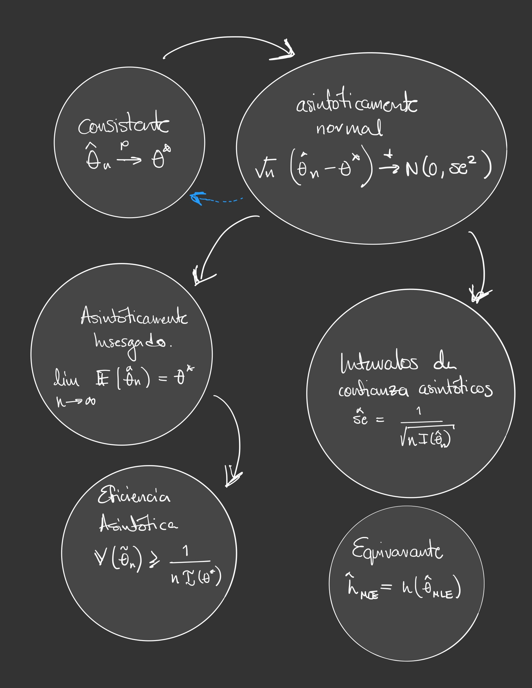

# Propiedades teóricas de MLE

```{r setup, include=FALSE, message=FALSE}
library(tidyverse)
library(patchwork)
source("R/funciones_auxiliares.R")
knitr::opts_chunk$set(cache = TRUE, echo = TRUE, message = FALSE, warning=FALSE, fig.align = 'center', fig.width = 5, fig.height=4)
comma <- function(x) format(x, digits = 2, big.mark = ",")
theme_set(theme_minimal())
```

El método de máxima verosimiltud es uno de los métodos más utilizados en la
inferencia estadística paramétrica. En esta sección estudiaremos las propiedades
teóricas que cumplen los estimadores de máxima verosimilitud ($\textsf{MLE}$) y que 
han ayudado en su *casi* adopción universal.

Estas propiedades de los $\textsf{MLE}$ son válidas siempre y cuando el modelo
$f(x; \theta)$ satisfaga ciertas condiciones de regularidad. En particular
veremos las condiciones para que los estimadores de máxima verosimilitud sean:
consistentes, asintóticamente normales, asintóticamente insesgados,
asintóticamente eficientes, y equivariantes.

```{block, type = 'comentario'}

Los estimadores $\textsf{MLE}$ en ocasiones son malinterpretados como una estimación 
puntual en la inferencia, y por ende, incapaces de cuantificar incertidumbre. A lo
largo de estas notas hemos visto cómo extraer intervalos de confianza por medio de 
simulación y por lo tanto incorporar incertidumbre en la estimación. 
Sin embargo, hay otros maneras de reportar incertidumbre para $\textsf{MLE}$.
Y hablaremos de ello en esta sección.
```


A lo largo de esta sección asumiremos muestras de la forma 
\begin{align}
  X_1, \ldots, X_n \overset{\text{iid}}{\sim} f(x; \theta^*),
\end{align}
donde $\theta^*$ es el valor verdadero ---que suponemos desconocido pero fijo---
del parámetro $\theta \in \Theta$, y sea $\hat \theta_n$ el estimador de máxima
verosimilitud de $\theta.$


### Ejemplo {-}

Usaremos este ejemplo para ilustrar los diferentes puntos teóricos a lo largo de
esta sección. Consideremos el caso de una muestra de variables binarias que
registran el éxito o fracaso de un experimento. Es decir, $X_1, \ldots, X_n \sim
\textsf{Bernoulli}(p),$ donde el párametro desconocido es el procentaje de
éxitos. Éste último denotado por $p.$ Este ejemplo lo hemos estudiado en
secciones pasadas (ver Sección \@ref(S:max-verosimilitud)), y sabemos que el $\textsf{MLE}$ es
\begin{align}
  \hat p_n = \frac{S_n}{n} = \bar X_n,
\end{align}
donde $S_n= \sum_i X_i$ es el número total de éxitos en la muestra. 

La figura siguiente ilustra el estimador $\hat p_n$ como función del número de
observaciones en nuestra muestra. Podemos apreciar cómo el promedio parece
estabilizarse alrededor del verdadero valor de $p^* = 0.25$ cuando tenemos una
cantidad suficientemente grande de observaciones.

```{r, echo = FALSE, fig.height = 2}
set.seed(1087)
p_true <- .25

extrae_muestras <- function(index, n = 10){
  tibble(x = rbernoulli(n, p = p_true), muestra = index)
}

extrae_muestras(1, n = 2500) %>% 
  mutate(media = cummean(x)) %>% 
  ggplot(aes(x = 1:2500, y = media)) + 
    geom_line() + 
    geom_hline(yintercept = p_true, color = 'red', lty = 2) + 
    scale_x_log10() +
    xlab('n: número de muestras') + 
    ylab(expression(bar(x)[n]))   + 
    ylim(0, .50)

```

Como es de esperarse, diferentes muestras tendrán diferentes valores de $n$ dónde las
trayectorias parezca que se haya estabilizado (Ver figura siguiente). Sin embargo, 
se puede notar que este comportamiento parece estar controlado y son *raras* las 
trayectorias que se encuentran más lejos.

```{r, echo = FALSE, fig.height = 2}
n_muestra <- 2500
g_0 <- 1:10 %>% 
  map_dfr(extrae_muestras, n = n_muestra) %>% 
  group_by(muestra) %>% 
  mutate(media = cummean(x), n = 1:n_muestra) %>% 
  ggplot(aes(x = n, y = media)) + 
    geom_line(aes(group = muestra, color = factor(muestra))) + 
    geom_hline(yintercept = p_true, color = 'red', lty = 2) + 
    scale_x_log10() +
    xlab('n: número de muestras') + 
    ylab(expression(bar(x)[n])) + 
    theme(legend.position = "none") + 
    ylim(0, 1)

g_0 

```
Los conceptos siguientes nos permitirán cuantificar el porcentaje de
trayectorias que se mantienen cercanas a $p^*,$ en el caso límite de un número
grande de observaciones, cuando trabajemos con estimadores de máxima
verosimilitud. Más aún, nos permitirán cracterizar la distribución para dicho
límite y aprenderemos de otras propiedades bajo este supuesto asintótico. 


## Consistencia {-}

Es prudente pensar que para un estimador, lo que nos interesa es que conforme
más información tengamos, más cerca esté del valor desconocido. Esta propiedad
la representamos por medio del concepto de *consistencia*. Para hablar de 
esta propiedad necesitamos definir un tipo de convergencia para una 
secuencia de variables aleatorias, **convergencia en probabilidad.**

```{block2, type = 'mathblock'}
**Definición.** Una sucesión de variables aleatorias $X_n$ converge en
probabilidad a la variable aleatoria $X,$ lo cual denotamos por 
$X_n \overset{P}{\rightarrow} X$, si para toda $\epsilon \gt 0$,
```

$$\lim_{n \rightarrow \infty}  \mathbb{P}(|X_n - X| > \epsilon) = 0.$$

Ahora, definimos un estimador consistente como:
```{block, type = 'mathblock'}
**Definición.** Un estimador $\tilde \theta_n$ es **consistente** si converge en 
probabilidad a $\theta^*.$ Donde $\theta^*$ denota el verdadero valor del parámetro, 
que asumimos fijo. 
```

En particular, los estimadores $\textsf{MLE}$ son consistentes.
```{block, type = 'mathblock'}
**Teorema.** Sea $X_n \sim f(X; \theta^*),$ una muestra iid, tal que $f(X;
\theta)$ cumple con ciertas condiciones de regularidad. Entonces, $\hat
\theta_n,$ el estimador de máxima verosimilitud, converge en
probabilidad a $\theta^*.$ Es decir, $\hat \theta_n$ es
consistente.
```
La demostración de este teorema la pueden encontrar en @Wasserman y escapa 
a los objetivos del curso. Sin embargo, el boceto es importante pues
nos permite hablar de un concepto muy útil en probabilidad, aprendizaje de máquina
y teoría de la información: *divergencia de Kullback-Leibler,* la cual mide la diferencia 
entre dos distribuciones, y está definida como 
$$ D(f\, \|\, g) = \int f(x) \log \frac{f(x)}{g(x)} \, \text{d}x.$$
Nota que $D(f\, \|\, g) \geq 0,$ no es simétrica, y $D(f\, \|\, g) =0$ si y sólo si 
$f = g.$

*Idea de la demostración.* Este boceto nos permite ilustrar la importancia 
teórica de la log-verosimilitud. Pues para buscar el $\textsf{MLE}$ necesitamos maximizar 
$$\ell_n(\theta) = \sum_{i = 1}^n \log f(X_i; \theta).$$

Esta expresión como suma nos permite ligar la *Ley de los Grandes Números* mediante:
$$\frac{\ell_n(\theta)}{n}= \frac1n\sum_{i = 1}^n \log f(X_i; \theta) \approx \mathbb{E}[\log f(X; \theta)],$$
donde el valor esperado se toma con respecto a la distribución de la muestra. 
Es decir, 
$$\mathbb{E}[\log f(X; \theta)] = \int f(x; \theta^*)  \log f(x; \theta)\,  \text{d}x,$$
misma que podemos rescribir como 
$$\mathbb{E}[\log f(X; \theta)] = -D( \theta^* \| \theta) + \Psi (\theta^*).$$
Ahora, dado que sabemos que $D( \theta^* \| \theta) \geq 0$ y $D( \theta^* \| \theta) =
0,$ si y sólo si $\theta^* = \theta,$ la log-verosimilitud es máxima
en $\hat \theta_n \approx \theta^*,$ y la approximación se vuelve una identidad
en el límite $n\rightarrow \infty.$ 

```{block, type = 'ejercicio'}

En los pasos anteriores: 

- deriva el término faltante $\Psi (\theta^*);$
- describe en tus propias palabras lo que significa $D( \theta^* \| \theta).$ Recuerda, que arriba la definimos para 
distribuciones $f$ y $g$. Es decir, $D( f \| g).$

```


### Ejemplo {-}

El estimador $\hat p_n$ es **consistente.** Esto quiere decir que el
estimador se vuelve más preciso conforme obtengamos más información. En general
esta es una propiedad que usualmente los estimadores deben satisfacer para ser
útiles en la práctica. La figura siguiente muestra el estimador $\hat p_n$ como
función del número de observaciones utilizado. Distintas curvas corresponden a
distintas realizaciones de muestras obtenidas del modelo ($B = 500$).

```{r, echo = FALSE}

set.seed(108727)
n_muestra <- 4**5

```

```{r consistency, cache = TRUE, echo = FALSE, fig.height = 2, fig.width = 7}
TOL <- p_true/4

# extraigo 500 muestras diferentes de tamaño n_muestra
dt <- 1:500 %>% 
  map_dfr(extrae_muestras, n = n_muestra) 

# calculo el valor esperado a lo largo de las distintas 
# 500 muestras
esperado <- dt %>% 
  group_by(muestra) %>% 
  mutate(media = cummean(x), n = 1:n_muestra) %>% 
  group_by(n) %>% 
  summarise(media = mean(media), .groups = 'drop')

g1 <- dt %>% 
  group_by(muestra) %>% 
  mutate(media = cummean(x), n = 1:n_muestra) %>% 
  ggplot(aes(x = n, y = media)) + 
  geom_ribbon(aes(ymin = p_true-TOL, ymax = p_true + TOL ), alpha = .3) + 
  geom_line(aes(group = muestra), alpha = .05) + 
  geom_hline(yintercept = p_true, lty = 2, color = 'red') +
  ylab(TeX('$\\bar{x}_n$')) + 
  # geom_line(data = esperado, aes(x = 1:n_muestra, y = media), lty = 1, color = 'lightblue') +
  scale_x_log10()


g2 <- dt %>% 
  group_by(muestra) %>% 
  mutate(media = cummean(x), n = 1:n_muestra) %>% 
  ggplot(aes(x = n, y = media)) + 
  geom_ribbon(aes(ymin = p_true-TOL, ymax = p_true+ TOL ), alpha = .3) + 
  geom_line(aes(group = muestra), alpha = .05) + 
  geom_hline(yintercept = p_true, lty = 2, color = 'red') +
  ylab('') + 
  # geom_line(data = esperado, aes(x = 1:n_muestra, y = media), lty = 1, color = 'lightblue') +
  xlim(100, n_muestra) + 
  ylim(p_true - 2 * TOL, p_true + 2 * TOL)

g1 + g2

```

Nota que la banda definida por $\epsilon$ se puede hacer tan pequeña como se requiera, 
lo único que sucederá es que necesitaremos un mayor número de observaciones para garantizar 
que las trayectorias de los estimadores $\hat p_n$ se mantengan dentro de las bandas con 
alta probabilidad conforme $n$ aumenta. 

## Equivarianza del $\textsf{MLE}$  {-}

Muchas veces nos interesa reparametrizar la función de verosimilitud con el motivo 
de simplificar el problema de optimización asociado, o simplemente por conveniencia 
interpretativa. Por ejemplo, si el parámetro de interés es tal que $\theta \in [a, b],$ entonces
encontrar el $\textsf{MLE}$ se traduce en optimizar la log-verosimilitud en el espacio restringido al 
intervalo $[a,b].$ En este caso, los métodos tradicionales de búsqueda local por descenso en gradiente 
podrían tener problemas de estabilidad cuando la búsqueda se realice cerca de las cotas. 

El concepto de equivarianza nos dice que si el cambio de coordenadas
parametrales está definida, y si este cambio de variable se realiza por medio de
una función bien comportada (derivable y cuya derivada no es cero$), entonces la solución de encontrar el $\textsf{MLE}$ en las
coordenadas originales y transformar, es igual a realizar la inferencia en las
coordenadas *fáciles.*

```{block, type = 'mathblock'}

**Teorema.** Sea $\tau = g(\theta)$ una función de $\theta$ bien comportada. Entonces si $\hat \theta_n$ 
es el $\textsf{MLE}$ de $\theta,$ entonces $\hat \tau_n = g(\hat \theta_n)$ es el $\textsf{MLE}$ de $\tau.$

```


### Ejemplo {-}

El concepto de equivarianza lo ilustraremos para nuestro ejemplo de esta sección. En 
particular la parametrización la realizamos por cuestiones de interpretación como un 
factor de riesgo. 

Como hemos visto estimador $\hat p_n$ es **equivariante.** Es importante
mencionar que esta propiedad es general para cualquier tamaño de muestra. Es
decir, no descansa en supuestos de muestras grandes. Supongamos que nos interesa estimar
el momio de éxitos (bastante común en casas de apuestas). El momio está definido
como
$$ \theta = \frac{p}{1-p},$$
y podemos rescribir la función de verosimilitud en términos de este parámetro.
Sustituyendo $p = \frac{\theta}{1+\theta}$ en $\mathcal{L}_n(p)$
obtenemos 
\begin{align}
  \mathcal{L}_n(\theta) = \left( \frac{\theta}{1 + \theta} \right)^{S_n} \left(\frac{1}{1 + \theta} \right)^{n - S_n}, 
\end{align}
cuya función encuentra su máximo en 
\begin{align}
 \hat \theta_n = \frac{\bar X_n}{ 1 - \bar X_n}.
\end{align}

```{block, type = 'ejercicio'}

Comprueba que el estimador de arriba para $\theta$ es el MLE.

```

## Normalidad asintótica {-}

Está propiedad nos permite caracterizar la distribución asintótica del MLE. Es 
decir, nos permite caracterizar la incertidumbre asociada una  muestra 
suficientemente grande por medio de una distribución Gaussiana. Esto es, bajo
ciertas condiciones de regularidad, 
$$\hat \theta_n \overset{.}{\sim} \mathsf{N}( \theta^*, \mathsf{ee}^2),$$

donde $\mathsf{ee}$ denota el error estándar del $\textsf{MLE},$ $\mathsf{ee} =
\mathsf{ee}(\hat \theta_n) = \sqrt{\mathbb{V}(\hat \theta_n)}$.

Esta distribución se puede caracterizar de manera aproximada por métodos analíticos. 
Para esto necesitamos las siguientes definiciones. 

```{block2, type = 'mathblock'}

**Definición. ** La función de *score* está definida como
\begin{align}
  s(X; \theta) = \frac{\partial \log f(X; \theta)}{\partial \theta}.
\end{align}

La **información de Fisher** está definida como 
\begin{align}
  I_n(\theta) &= \mathbb{V}\left( \sum_{i = 1}^ns(X_i; \theta) \right) \\ 
              &= \sum_{i = 1}^n  \mathbb{V} \left(s(X_i; \theta) \right)
\end{align}

```

Estas cantidades nos permiten evaluar qué tan fácil será identificar el mejor
modelo dentro de la familia parámetrica $f(X; \theta)$. La función de score nos
dice qué tanto cambia locamente la distribución cuando cambiamos el valor del
parámetro. Calcular la varianza, nos habla de la dispersión de dicho cambio a lo
largo del soporte de la variable aleatoria $X.$ Si $I_n(\theta)$ es grande
entonces el cambio de la distribución es muy importante. Esto quiere decir que
la distribución es muy diferente de las *distribuciones cercanas* que se generen
al evaluar en $\theta$s diferentes. Por lo tanto, si $I_n(\theta)$ es grande, la
distribución será fácil de identificar cuando hagamos observaciones.

La información de Fisher también nos permite caracterizar de forma 
analítica la varianza asíntotica del $\textsf{MLE}$ pues la aproximación 
$\mathsf{ee}^2 \approx \frac{1}{I_n(\theta^*)}$ es válida.

El siguiente resultado utiliza la propiedad de la función de score: 
$\mathbb{E}[s(X; \theta)] = 0,$ que implica que 
$\mathbb{V} \left(s(X_i; \theta) \right) = \mathbb{E}[s^2(X; \theta)],$ y 
permite a su vez un cómputo más sencillo de la información de Fisher.

```{block, type = 'mathblock'}

**Teorema.** El cálculo de la información de Fisher para una muestra 
de tamaño $n$ se puede calcular de manera simplificada como 
$I_n(\theta) = n \, I(\theta).$ Por otro lado, tenemos la siguiente igualdad
$$ I(\theta) = - \mathbb{E}\left( \frac{\partial^2 \log f(X; \theta)}{\partial \theta^2}  \right).$$

```

Con estas herramientas podemos formular el teorema siguiente. 

```{block, type = 'mathblock'}

**Teorema.** Bajo ciertas condiciones de regularidad se satisface que 
$\mathsf{ee} \approx \sqrt{1/I_n(\theta^*)}$ y 
$$ \hat \theta_n \overset{d}{\rightarrow} \mathsf{N}( \theta^*, \mathsf{ee}^2).$$

```

El resultado anterior es teóricamente interesante y nos asegura un
comportamiento controlado conforme tengamos más observaciones disponibles. Sin
embargo, no es práctico pues no conocemos $\theta^*$ en la práctica y por
consiguiente no conoceríamos la varianza. Sin embargo, también podemos aplicar
el principio de *plug-in* y caracterizar la varianza de la distribución
asintótica por medio de
$$\hat{\mathsf{ee}} = \sqrt{1/I_n(\hat \theta_n)}.$$

Esto último nos permite constuir intervalos de confianza, por ejemplo al 95\%, a través de 
$$ \hat \theta_n \pm 2 \, \hat{\mathsf{ee}}.$$
Asimismo, el teorema de Normalidad asintótica nos permite establecer que el $\textsf{MLE}$ es **asíntoticamente insesgado**. Es decir, 
$$\lim_{n \rightarrow n}\mathbb{E}[\hat \theta_n] =  \theta^*.$$

```{block, type = 'mathblock'}

**Definición.** Sea una muestra $X_1, \ldots, X_n \overset{iid}{\sim} f(X;
\theta^*)$. Un estimador $\tilde \theta_n$ es insesgado si satisface que
$$\mathbb{E}[\tilde \theta_n] =\theta^*.$$ 

```
El sesgo del estimador es precisamente la diferencia: $\textsf{Sesgo} = \mathbb{E}[\tilde \theta_n] - \theta^*.$

### Ejemplo {-}

Regresando a nuestro ejemplo. Veremos empiricamente que el 
estimador $\hat \theta_n$ es **asintóticamente normal.** Esta propiedad la
hemos visto anteriormente para un caso muy particular. Lo vimos en el TLC para
el caso de promedios, $\bar X_n,$ que en nuestro ejemplo corresponde a $\hat p_n$.
Como hemos visto, esta propiedad la satisface cualquier otro estimador que sea máximo
verosímil. Por ejemplo, podemos utilizar el $\mathsf{MLE}$ de los momios. La
figura que sigue muestra la distribución de $\hat \theta_n$ para distintas
remuestras $(B = 500)$ con distintos valores de $n.$

```{r, echo = FALSE, fig.height = 5, out.width = '95%', fig.asp = .6}

theta_true      <- p_true/(1 - p_true)
fisher_true_inv <- ((1+theta_true)**2) * theta_true
ee_true         <- sqrt(fisher_true_inv)

dt %>% 
  group_by(muestra) %>% 
  mutate(n = 1:n_muestra) %>% 
  mutate(momios = sqrt(n) * (cummean(x)/(1-cummean(x)) - theta_true )/ee_true) %>% 
  filter(floor(logb(n, 4)) - logb(n, 4) == 0) %>% 
  filter(n > 1) %>% 
  ggplot(aes(x = momios)) + 
    geom_histogram(aes(y = ..density.. ), binwidth = .45) +
    stat_function(fun = dnorm, args = list(mean = 0, sd = 1)) + 
    facet_wrap(~n, scale = 'free', ncol = 3)

```

El gráfico anterior valida empíricamente la distribución asintótica para 
casos de muchas observaciones. A continuación ilustraremos cómo explotar 
este resultado para obtener intervalos de confianza. 

Para el caso de $\hat p_n$ hemos visto que el error estándar se calcula 
analíticamente como
$$\textsf{ee}_p^2 = \mathbb{V}(\hat p_n) = \mathbb{V}\left(\frac1n \sum_{i = 1}^n x_i\right)  = \frac{p^* (1 - p^*)}{n}.$$

Éste empata con el valor del error estándar asintótico
$$\textsf{ee}_p^2 \approx \sqrt{\frac{1}{I_n(p^*)}},$$
pues la información de Fisher es igual a 
$$I_n(p) = n \, I(p)  = \frac{n}{p (  1- p)}.$$
En este caso podemos utilizar el estimador *plug-in,* 
$\hat{\textsf{ee}}_p = \textsf{ee}_p(\hat p_n).$
Para estimar el momio, $\theta,$ el cálculo no es tan fácil pues tendríamos que calcular 
de manera analítica la varianza de un cociente 
$$\textsf{ee}_\theta^2 = \mathbb{V}\left( \frac{\hat p_n}{1-\hat p_n}\right).$$
Utilizando la distirbución asintótica, el error estándar se puede calcular mediante
$$\textsf{ee}_\theta^2 \approx \sqrt{\frac{1}{I_n(\theta^*)}} = \sqrt{\frac{\theta (1 + \theta)^2 }{n}}.$$
A continuación mostramos los errores estándar para nuestro ejemplo utilizando 
la distribución asintótica y por medio de la distribución de *bootstrap.*
Como es de esperarse, ambos coinciden para muestras relativamente grandes. 
```{r, echo = FALSE, cache = TRUE}
# Genero muestra 
muestras <- tibble(tamanos = 2**seq(4,7)) %>% 
  mutate(obs = map(tamanos, ~rbernoulli(., p = p_true)))

calcula_momio <- function(x){
  x / (1 - x)
}

calcula_ee_momio <- function(x){
  sqrt(((1+x)**2) * x)
}

# Calculo MLE
muestras_est <- muestras %>% 
  group_by(tamanos) %>% 
  mutate(media_hat = map_dbl(obs, mean), 
         media_ee  = sqrt(media_hat * (1 - media_hat)/tamanos),
         momio_hat = calcula_momio(media_hat), 
         momio_ee  = calcula_ee_momio(momio_hat)/sqrt(tamanos))


# Calculo por bootstrap
muestras_boot <- muestras_est %>%
  group_by(tamanos) %>% 
  mutate(sims_muestras  = map(tamanos, ~rerun(1000, sample(muestras %>% filter(tamanos == ..1) %>% unnest(obs) %>% pull(obs), 
                                                  size = ., replace = TRUE))), 
         sims_medias = map(sims_muestras, ~map_dbl(., mean)), 
         sims_momios = map(sims_medias, ~map_dbl(., calcula_momio)),
         media_boot    = map_dbl(sims_medias, mean),
         momio_boot    = map_dbl(sims_momios, mean), 
         media_ee_boot = map_dbl(sims_medias, sd), 
         momio_ee_boot = map_dbl(sims_momios, sd)
         )

```

```{r, cache = TRUE, echo = FALSE}

muestras_boot %>% 
  select(tamanos, momio_hat, momio_boot, momio_ee, momio_ee_boot)

```


```{block, type = 'ejercicio'}

Comprueba las fórmulas para los errores estándar tanto para la probabilidad de
éxito como para los momios.

```


### El método delta {-}

El ejercicio anterior nos sugiere una pregunta natural: Cómo establecer la
distribución asintótica de un estimador cuando ya se conoce la de una pre-imagen
de él? Es decir, si ya conocemos la distribución de $\theta,$ podemos establecer
la distribución de $\tau = g(\theta)?$

La respuesta es afirmativa y la enunciamos por medio de un teorema. El resultado se conoce como 
el **método delta**. 

```{block, type = 'mathblock'}
**Teorema.** Si $\tau = g(\theta)$ es una función diferenciable y $g\'(\theta) \neq 0$, entonces
```

$$\hat \tau_n \overset{d}{\rightarrow} \mathsf{N}( \tau^*, \hat{\mathsf{ee}}^2_\tau),$$
```{block, type = 'mathblock'}

donde $\hat \tau_n = g(\hat \theta_n)$ y 
```

$$\hat{\mathsf{ee}}_\tau = \bigg| g'(\hat \theta_n) \bigg| \times \hat{\mathsf{ee}}_\theta(\hat \theta_n).$$

Por ejemplo, este resultado lo podemos utilizar para nuestro experimento de Bernoullis. 
Pues $g(p) = \frac{p}{1-p}$ es una función diferenciable y por lo tanto 
$$\hat{\mathsf{ee}}_\theta = \sqrt{\frac1n} \times \left[ \hat p_n^{1/2} (1-\hat p_n)^{3/2}\right].$$

```{block, type = 'ejercicio'}

Comprueba la fórmula del método delta para el momio en función de la fracción de éxitos, y también comprueba que de el mismo resultado analítico que habías calculado en el ejercicio anterior.

```


## Optimalidad del $\textsf{MLE}$ {-}

Consideremos el caso de una muestra iid $X_1, \ldots, X_n \sim
\mathsf{N}(\theta, \sigma^2).$ Y consideremos dos estimadores para $\theta.$ El
primero será la media muestral $\bar X_n$ y el segundo la mediana muestral, la
cual denotaremos por $\tilde \theta_n.$ Sabemos que ambos son insesgados. Por lo
tanto, en promedio emiten estimaciones correctas. Pero ¿cómo escogemos cual
utilizar?

Un criterio para comparar estimadores es el **error cuadrático medio**
($\textsf{ECM}$, por sus siglas en inglés).

```{block, type = 'mathblock'}

**Definición.** El error cuadrático medio de un estimador $\tilde \theta_n$ se
calcula como
$$\textsf{ECM}[\tilde \theta_n] = \mathbb{E}[(\tilde \theta_n - \theta^*)^2].$$

```

Por lo tanto, el $\textsf{ECM}$ mide la distancia promedio entre el estimador y 
el valor verdadero valor del parámetro. La siguiente igualdad es bastante útil 
para comparar dos estimadores. 

```{block, type = 'mathblock'}

$$\textsf{ECM}[\tilde \theta_n] = \mathbb{V}\left(\tilde \theta_n\right) + \textsf{Sesgo}\left[\tilde \theta_n\right]^2.$$

```

Por lo tanto si dos estimadores son insesgados, uno es más eficiente que el otro si 
su varianza es menor.

La media sabemos que es el $\textsf{MLE}$ y por el TCL tenemos que 
$$\sqrt{n} \left( \bar X_n - \theta \right) \overset{d}{\rightarrow} \mathsf{N}( 0, \sigma^2).$$

La mediana, en contraste, tiene una distribución asintótica 
$$\sqrt{n} \left( \tilde X_n - \theta \right) \overset{d}{\rightarrow} \mathsf{N}\left( 0, \sigma^2 \frac{\pi}{2}\right),$$

es decir tiene una varianza ligeramente mayor. Por lo tanto, decimos que la
mediana tiene una *eficiencia relativa* con respecto a la media del $.63 \%
(\approx \pi/2)$. Es decir, la mediana sólo utliza una fracción de los datos
comparado con la media.

El siguiente teorema, **la desigualdad de Cramer-Rao**, nos permite establecer
esta resultado de manera mas general para cualquier estimador insesgado.

```{block, type ='mathblock'}

**Teorema.**  Sea $\tilde \theta_n$ *cualquier*
estimador insesgado de $\theta$ cuyo valor verdadero es $\theta^*,$ entonces
\begin{align}
  \mathbb{V}(\tilde \theta_n) \geq \frac{1}{n I(\theta^*)}.
\end{align}
 
```

Un estimador insesgado que satisfaga esta desigualdad se dice que es
*eficiente.* Nota que el lado derecho de la desigualdad es precisamente la
varianza asintótica del $\textsf{MLE}.$ Por lo tanto, éste es *asintóticamente
eficiente.*

```{block, type = 'comentario'}

Es importante hacer enfásis en que la optimalidad del $\textsf{MLE}$ es un
resultado asintótico. Es decir, sólo se satisface cuando tenemos un número
*suficiente* de observaciones. Qué tan grande debe ser el tamaño de muestra
varia de problema a problema. Es por esto que para muestras de tamaño finito se
prefieren estimadores que minimicen el $\textsf{ECM},$ como cuando hacemos
regresión ridge o utilizamos el estimador James--Stein para un vector de medias. 

```


El siguiente diagrama muestra de manera gráfica la relación entre las distintas 
propiedades que hemos visto en esta sección. 

```{r, out.width = '95%', echo = FALSE}

```

