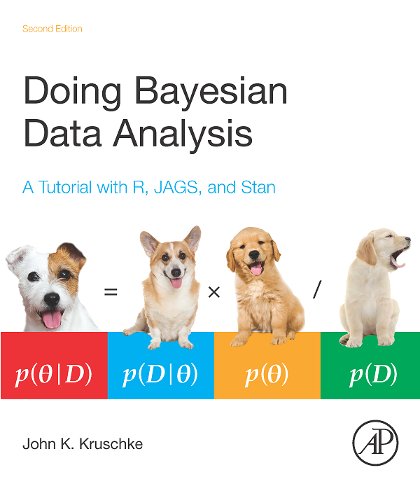

# Introducción a inferencia bayesiana

```{r setup, include=FALSE, message=FALSE}
library(tidyverse)
library(patchwork)
knitr::opts_chunk$set(echo = TRUE, message = FALSE, warning=FALSE, fig.align = 'center', fig.width = 5, fig.height=3)
comma <- function(x) format(x, digits = 2, big.mark = ",")
theme_set(theme_minimal())
```

Para esta sección seguiremos principalmente @Kruschke. Adicionalmente
puedes ver la sección correspondiente de @Chihara

En las secciones anteriores estudiamos el método de máxima 
verosimilitud y métodos de remuestreo para estimar parámetros y cuantificar 
la incertidumbre qué tenemos acerca de valores poblacionales. 
La inferencia bayesiana tiene objetivos similares.

- Igual que en máxima verosimilitud, al inferencia bayesiana comienza con
modelos probabilísticos y observaciones. 
- En contraste con máxima verosimilitud, la inferencia bayesiana está diseñada para incorporar información previa o de expertos que tengamos acerca de los parámetros de interés. 
- La inferencia bayesiana cubre como caso particular métodos basados en máxima verosimilitud.

El concepto probabilístico básico que utilizamos para construir estos
modelos y la inferencia es el de probabilidad condicional: la probabilidad de que ocurran
ciertos eventos, o de que cantidades tomen ciertos valores, dada información
acerca del fenómeno que nos interesa. 

## Un primer ejemplo completo de inferencia bayesiana {-}

Consideremos el siguiente problema: Nos dan una moneda, y solo sabemos
que la moneda puede tener probabilidad $3/5$ de tirar sol (está cargada a sol)
o puede ser una moneda cargada a águila, con probabilidad $2/5$ de tirar sol.

Vamos al lanzar la moneda dos veces y observamos
su resultado (águila o sol). Queremos decir algo acerca de qué tan probable
es que hayamos tirado la moneda cargada a sol o la moneda cargada a águila.

En este caso, tenemos dos variables: $X$, que cuenta el número
de soles obtenido en el experimento aleatorio, y $\theta$, que da la probabilidad
de que un volado resulte en sol (por ejemplo, si la moneda es justa
entonces $\theta = 0.5$.) 

¿Qué cantidades podríamos usar para evaluar 
qué moneda es la que estamos usando? Si hacemos el experimento,
y tiramos la moneda 2 veces, podríamos considerar la probabilidad
$$P(\theta = 0.4 | X = x)$$
donde $x$ es el número de soles que obtuvimos en el experimento. Esta es la probabilidad 
condicional de que estemos tirando la moneda con probabilidad de sol 2/5 dado
que observamos $x$ soles. Por ejemplo, si tiramos 2 soles, deberíamos calcular
$$P(\theta=0.4|X=2).$$

¿Cómo hacemos para calcular esta probabilidad? ¿Qué sentido tiene?

Usando reglas de 
probabildad (regla de Bayes en particular), podríamos calcular
$$P(\theta=0.4|X=2) = \frac{P(X=2 | \theta = 0.4) P(\theta =0.4)}{P(X=2)}$$

Así que primero necesitamos la verosimlitud:

$$P(X=2|\theta = 0.4) = (0.4)^2 = 0.16.$$

La novedad es que ahora tenemos que considerar
la probabilidad $P(\theta = 0.4)$. Esta cantidad
no la habíamos encontrado antes. Tenemos qué pensar entonces
que este parámetro es una *cantidad aleatoria*, y puede tomar dos valores $\theta=0.4$ o
$\theta = 0.6$.

Considerar esta cantidad como aleatoria requiere pensar en este caso
en cómo se escogió la moneda, o qué sabemos acerca de las monedas que se
usan para este experimento. Supongamos que en este caso, nos dicen adicionalmente
que la moneda se escoge al azar de una bolsa donde hay una proporción similar
de los dos tipos de moneda (0.4 o 0.6).

En este caso podemos poner
$$P(\theta = 0.4)=0.5$$ 

Ahora queremos calcular $P(X=2)$, pero con el trabajo que hicimos
esto es fácil usar reglas de probabilidad usuales para hacerlo. Si usamos  probabilidad
total
$$ P(X=2) = P(X=2|\theta = 0.4)P(\theta = 0.4) +
P(X=2|\theta=0.6)P(\theta =0.6),$$
así que
$$P(X=2) = 0.16(0.5) + 0.36(0.5) = 0.26.$$

y finalmente obtenemos:

$$P(\theta=0.4|X=2) = \frac{0.16(0.5)}{0.26} \approx  0.31$$

Es decir, la **probabilidad posterior** de que estemos tirando la moneda 2/5
baja de 0.5 (nuestra información inicial) a 0.31. 

Este es un ejemplo completo, aunque muy simple, de inferencia bayesiana.
Hacemos **inferencia bayesiana cuando tomamos decisiones basadas
en las probabilidades posteriores**.

```{block2, type='ejercicio'}
¿Cuál sería la estimación de máxima verosimilitud para este problema? ¿
¿Cómo cuantificaríamos la incertidumbre en la estimación de máxima verosimilitud?
```


#### Observación 0 {-}

Nótese que en contraste con máxima verosimilitud, en este ejemplo
*cuantificamos con probabilidad los parámetros que no conocemos*. En máxima
verosimilitud esta probabilidad no tiene mucho sentido, pues nunca consideramos
el parámetro desconocido como una cantidad aleatoria.

#### Observación 1 {-}

Nótese $P(X=2)$ puede entenderse como un factor de normalización. La razón es
que 
$$P(X=2 | \theta = 0.4) P(\theta =0.4) = 0.16(0.5) = 0.08$$
y
$$P(X=2 | \theta = 0.6) P(\theta =0.6) = 0.36(0.5) = 0.18$$
Las probabilidades posteriores son proporcionales a estas dos cantidades,
y como deben sumar uno, entonces normalizando estos dos números (dividiendo
entre su suma) obtenemos las probabilidades.

#### Observación 2 {-}

La nomenclatura que usamos es la siguiente:

- Como $X$ son los datos observados, llamamos a $P(X|\theta)$ la *verosimitud*,
o modelo de los datos.
- A los datos $P(\theta)$ le llamamos la distribución *inicial* o *previa*.
- La distribución que usamos para hacer inferencia $P(\theta|X)$ es la 
distribución *final* o *posterior* 

Para utilizar inferencia bayesiana, hay que hacer supuestos para definir 
las primeras dos partes del modelo. La parte de iniciales o previas está ausente
de enfoques como máxima verosimlitud usual.

#### Observación 3 {-}

¿Cómo decidimos las probabilidades iniciales $P(\theta=0.4)$ ? 

Quizá es un supuesto y no tenemos razón para
pensar que se hace de otra manera. O quizá conocemos el
mecanismo concreto con el que se selecciona la moneda. Discutiremos esto más adelante.

#### Observación 4 {-}

¿Cómo decidimos el modelo de los datos? Aquí típicamente también tenemos que
hacer algunos supuestos, aunque algunos de estos pueden estar basados en
el diseño del estudio, por ejemplo. Igual que cuando usamos máxima verosimilitud, 
es necesario checar que nuestro modelo ajusta razonablemente 
a los datos.

#### Ejercicio {-}
Cambia distintos parámetros de el número de soles observados, las probabilidades
de sol de las monedas, y las probabilidades iniciales de selección de las
monedas. 

```{r}
n_volados <- 2
# posible valores del parámetro desconocido
theta = c(0.4, 0.6)
# probabilidades iniciales
probs_inicial <- tibble(moneda = c(1, 2),
                theta = theta, 
                prob_inicial = c(0.5, 0.5))
probs_inicial
# verosimilitud
crear_verosim <- function(no_soles){
    verosim <- function(theta){
      # prob de observar no_soles en 2 volados con probabilidad de sol theta
      dbinom(no_soles, 2, theta)
    }
    verosim
}
# evaluar verosimilitud
verosim <- crear_verosim(2)
# ahora usamos regla de bayes para hacer tabla de probabilidades
tabla_inferencia <- probs_inicial %>% 
  mutate(verosimilitud = map_dbl(theta, verosim)) %>% 
  mutate(inicial_x_verosim = prob_inicial * verosimilitud) %>% 
  # normalizar
  mutate(prob_posterior = inicial_x_verosim / sum(inicial_x_verosim))
tabla_inferencia %>% 
  select(moneda, theta, prob_inicial, verosimilitud, prob_posterior) 
```

```{block2, type='ejercicio'}
1. ¿Qué pasa cuando el número de soles es 0? ¿Cómo cambian las probabilidades
posteriores de cada moneda?
2. Incrementa el número de volados, por ejemplo a 10. ¿Qué pasa si observaste
8 soles, por ejemplo? ¿Y si observaste 0?
3. ¿Qué pasa si cambias las probabilidades iniciales (por ejemplo incrementas
la probabilidad inicial de la moneda 1 a 0.9)?

Justifica las siguientes aseveraciones (para este ejemplo):

1. Las probabilidades posteriores o finales
son una especie de punto intermedio entre verosimilitud e probablidades iniciales. 
2. Si tenemos pocas observaciones, las probabilidades posteriores son similares a las iniciales.
3. Cuando tenemos muchos datos, las probabilidades posteriores están más concentradas, y no es tan importante la inicial.
4. Si la inicial está muy concentrada en algún valor, la posterior requiere de
muchas observaciones para que se pueda concentrar en otros valores diferentes a los de la inicial.
```

Ahora resumimos los elementos básicos de la inferencia bayesiana, que son 
relativamente simples:

```{block2, type='mathblock'}
**Inferencia bayesiana.** Con la notación de arriba:

- Como $X$ son los datos observados, llamamos a $P(X|\theta)$ la *verosimitud*,
o modelo de los datos.
- A los datos $P(\theta)$ le llamamos la distribución *inicial* o *previa*.
- La distribución que usamos para hacer inferencia $P(\theta|X)$ es la 
distribución *final* o *posterior* 

Hacemos inferencia usando la ecuación

$$P(\theta | X) = \frac{P(X | \theta) P(\theta)}{P(X)}$$

que también escribimos:

$$P(\theta | X) \propto P(X | \theta) P(\theta)$$
donde $\propto$ significa "proporcional a". No ponemos $P(X)$ pues como
vimos arriba, es una constante de normalización.
```


En estadística Bayesiana, las probablidades posteriores $P(\theta|X)$ dan
toda la información que necesitamos para hacer inferencia. ¿Cuándo damos probablidad alta a un parámetro particular $\theta$? Cuando
su verosimilitud es alta y/o cuando su probabilidad inicial es alta. 
De este modo, la posterior combina la información inicial que tenemos acerca
de los parámetros con la información en la muestra acerca de los parámetros 
(verosimilitud). Podemos ilustrar como sigue:




## Ejemplo: estimando una proporción {-}

Regresamos ahora a nuestro problema de estimar una proporción $\theta$ de una
población dada usando una muestra iid $X_1,X_2,\ldots, X_n$ de variables 
Bernoulli. Ya sabemos calcular la verosimilitud (el modelo de los datos)
según el modelo bernoulli. Si 
$X$ es el número de éxitos que observamos en las $n$ pruebas, tenemos que

$$P(X=k|\theta) = \theta^k(1-\theta)^{n-k}$$

Ahora necesitamos una distribución inicial o previa $P(\theta)$. Aunque esta
distribución puede tener cualquier forma, supongamos que nuestro conocimiento
actual podemos resumirlo con una distribución $Beta(3, 3)$:

$$P(\theta) = \theta^2(1-\theta)^2$$
Su histograma es:

```{r}
sim_inicial <- tibble(theta = rbeta(10000, 3, 3))  
ggplot(sim_inicial) + geom_histogram(aes(x = theta), bins = 15)
```
De modo que nuestra información inicial es que la proporción puede tomar
cualquier valor entre 0 y 1, pero es probable que tome un
valor no tan lejano de 0.5. Por ejemplo, con probabilidad 0.95 creemos
que $\theta$ está en el intervalo
```{r}
quantile(sim_inicial$theta, c(0.025, 0.975)) %>% round(2)
```
Es difícil justificar en abstracto por qué escogeriamos una inicial con esta forma. 
*Aunque esto los detallaremos más adelante*, puedes pensar por el momento,
por ejemplo que alguien observó
algunos casos de esta población, y quizá vio dos éxitos y dos fracasos. Esto sugeriría
que es poco probable que la probablidad $\theta$ sea muy cercana a 0 o muy cercana a 1.

Ahora podemos construir nuestra posterior. Tenemos que

$$P(\theta|X=k) \propto P(X = k | \theta)P(\theta) = \theta^{k+1}(1-\theta)^{n-k + 1}$$
donde la constante de normalización no depende de $\theta$. Como $\theta$ es un
parámetro continuo, la expresión de la derecha nos debe dar una densidad posterior.

Supongamos entonces que hicimos la prueba con $n = 30$ (número de prueba) y observamos
19 éxitos. Tendríamos entonces

$$P(\theta | X = 19) \propto \theta^{19 + 2} (1-\theta)^{30 - 19 +2} = \theta^{21}(1-\theta)^{13}$$
 
La cantidad de la derecha, una vez que normalizemos por el número $P(X=19)$, nos
dará una densidad posterior (tal cual, esta expresion no integra a 1). Podemos obtenerla
usando cálculo, pero recordamos que una distribución $Beta(a,b)$ tiene como fórmula
$$\frac{1}{B(a,b)} \theta^{a-1}(1-\theta)^{b-1}$$
Concluimos entonces que la posterior tiene una distribución $B(22, 14)$. Podemos
simular de usando estándar para ver cómo luce:

```{r}
sim_inicial <- sim_inicial %>% mutate(dist = "inicial")
sim_posterior <- tibble(theta = rbeta(10000, 22, 14)) %>% mutate(dist = "posterior")
sims <- bind_rows(sim_inicial, sim_posterior)
ggplot(sims, aes(x = theta, fill = dist)) + 
  geom_histogram(aes(x = theta), bins = 30, alpha = 0.5, position = "identity")
```
La posterior nos dice cuáles son las *posibilidades* de dónde puede estar
el parámetro $\theta$. Nótese que ahora excluye prácticamente valores más chicos
que 0.25 o mayores que 0.9. Esta distribución posterior es el objeto con el
que hacemos inferencia: nos dice dónde es creíble que esté el parámetro $\theta$.

Podemos resumir de varias maneras. Por ejemplo, si queremos un estimador puntual
usamos la media posterior:

```{r}
sims %>% group_by(dist) %>% 
  summarise(theta_hat = mean(theta) %>% round(3))
```
Nota que el estimador de máxima verosimilitud es $\hat{p} = 19/30 = 0.63$, que
es ligeramente diferente de la media posterior. ¿Por qué?

Y podemos construir intervalos de percentiles, que en esta situación
suelen llamarse *intervalos de credibilidad*, por ejemplo:

```{r}
f <- c(0.025, 0.975)
sims %>% group_by(dist) %>% 
  summarise(cuantiles = quantile(theta, f) %>% round(2), f = f) %>% 
  pivot_wider(names_from = f, values_from = cuantiles)
```
El segundo renglón nos da un intervalo posterior para $\theta$ de *credibilidad*
95\%. En inferencia bayesiana esto sustituye a los intervalos de confianza.

- El intervalo de la inicial expresa nuestras creencias a priori acerca de $\theta$. Este
intervalo es muy amplio (va de 0.15 a 0.85)
- El **intervalo de la posterior** actualiza nuestras creencias acerca de $\theta$
una vez que observamos los datos, y es considerablemente más angosto y por lo tanto
informativo.


**Observaciones**:

- Nótese que escogimos una forma analítica fácil para la inicial, pues resultó
así que la posterior es una distribución beta. No siempre es así, y veremos qué
hacer cuando nuestra inicial no es de un tipo "conveniente".
- Como tenemos la forma analítica de la posterior, es posible hacer los cálculos
de la media posterior, por ejemplo, **integrando** la densidad posterior a mano. Esto
generalmente no es factible, y en este ejemplo preferimos hacer una aproximación numérica. En este caso
particular es posible usando cálculo, y sabemos que la media de una $Beta(a,b)$ es
$a/(a+b)$, de modo que nuestra media posterior es

$$\hat{\mu} = (19 + 2)/(30 + 4) = 21/34 = 0.617 $$
que podemos interpretar como sigue: para calcular la media posterior, a nuestras
$n$ pruebas iniciales agregamos
4 pruebas adicionales fijas, con 2 éxitos y 2 fracasos, y calculamos la proporción 
usual de éxitos.

```{block2, type='ejercicio'}
Repite el análisis considerando en general $n$ pruebas, con $k$ éxitos. Utiliza la
misma distribución inicial.
```
- Lo mismo aplica para el intervalo de 95% (¿cómo se calcularía integrando?). También
puedes usar la aproximación de R, por ejemplo:

```{r}
qbeta(0.025, shape1 = 22, shape2 = 14) %>% round(2)
qbeta(0.975, shape1 = 22, shape2 = 14) %>% round(2)
```


## Ejemplo: observaciones uniformes {-}

Ahora regresamos al problema de estimación del máximo de una distribución uniforme.
En este caso, consideraremos un problema más concreto. Supongamos que hay una lotería
(tipo tradicional)
en México y no sabemos cuántos números hay. Obtendremos una muestra iid de $n$ números,
ya haremos una aproximación continua, suponiendo que

$$X_i \sim U[0,\theta]$$

La verosimilitud es entonces
$$P(X_1,\ldots, X_n|\theta) = \theta^{-n},$$
cuando $\theta$ es mayor que todas las $X_i$, y cero en otro caso. Necesitaremos
una inicial $P(\theta)$.

Por la forma que tiene la verosimilitud, podemos intentar una distribución Pareto,
que tiene la forma

$$P(\theta) = \frac{\alpha \theta_0^\alpha}{\theta^{\alpha + 1}}$$
con soporte en $[\theta_0,\infty]$. Tenemos que escoger entonces el mínimo $\theta_0$ y 
el parámetro $\alpha$. En primer lugar, como sabemos que es una lotería nacional,
creemos que no puede haber menos de unos 300 mil números, así que $\theta_0 = 300$.
La función acumulada de la pareto es $1- (300/\theta)^\alpha$, así que el cuantil 99% es

```{r}
alpha <- 1.1
(300/(0.01)^(1/alpha))
```
es decir, alrededor de 20 millones de números.  Creemos que es una poco probable
que el número de boletos sea mayor a esta cota.
Nótese ahora que la posterior cumple (multiplicando verosimilitud por inicial):


$$P(\theta|X_1,\ldots, X_n |\theta) \propto \theta^{-(n + 2.1)}$$

para $\theta mayor que el máximo de las X_n's y 300, y cero en otro caso. Esta distribución
es pareto con $\theta_0' = \max\{300, X_1,\ldots, X_n\}$ y $\alpha = n + 1.1$

Una vez planteado nuestro modelo, veamos los datos. Obtuvimos la siguiente
muestra de números:


```{r}
loteria_tbl <- read_csv("data/nums_loteria.csv", col_names = c("id", "numero")) %>% 
  mutate(numero = as.integer(numero))
set.seed(334)
muestra <- sample_n(loteria_tbl, 25) %>% 
  mutate(numero = numero/1000)
muestra %>% as.data.frame %>% head
```

Podemos simular de una Pareto como sigue:

```{r}
rpareto <- function(n, theta_0, alpha){
  # usar el método de inverso de distribución acumulada
  u <- runif(n, 0, 1)
  theta_0 / (1 - u)^(1/alpha)
}
```

Simulamos de la inicial:

```{r}
sims_pareto_inicial <- tibble(
  theta = rpareto(20000, 300, 1.1 ),
  dist = "inicial")
```

Y con los datos de la muestra, simulamos de la posterior:

```{r}
sims_pareto_posterior <- tibble(
  theta = rpareto(20000, max(c(300, muestra$numero)), nrow(muestra) + 1.1),
  dist = "posterior")
sims_theta <- bind_rows(sims_pareto_inicial, sims_pareto_posterior)
ggplot(sims_theta) + 
  geom_histogram(aes(x = theta, fill = dist), 
                 bins = 70, alpha = 0.5, position = "identity", boundary = max(muestra$numero))  +
  xlim(0, 15000) + scale_y_sqrt() +
  geom_rug(data = muestra, aes(x = numero))
```
Nótese que cortamos algunos valores de la inicial en la cola derecha: un defecto
de esta distribución inicial, con una cola tan larga a la derecha, es que 
pone cierto peso en valores que son poco creíbles y la vuelve poco apropiada para
este problema. Regresamos más adelante a este problema.

Si obtenemos percentiles,
obtenemos el intervalo

```{r}
f <- c(0.025, 0.5, 0.975)
sims_theta %>% group_by(dist) %>% 
  summarise(cuantiles = quantile(theta, f) %>% round(2), f = f) %>% 
  pivot_wider(names_from = f, values_from = cuantiles)
```
Estimamos entre 5.8 millones y 6.7 millones de boletos. El máximo en la muestra
es de
```{r}
max(muestra$numero)
```

Escoger la distribución pareto como inicial es conveniente y nos permitió
resolver el problema sin dificultad, pero por su forma vemos que no
necesariamente es apropiada para el problema por lo que señalamos arriba. 
Nos gustaría, por ejemplo, poner una inicial como
la siguiente

```{r}
qplot(rgamma(2000, 5, 0.001), geom="histogram", bins = 20) +
  scale_x_continuous(breaks = seq(1000, 15000, by = 2000))
```

Sin embargo, los cálculos no son tan simples en este caso, pues la posterior
no tiene un forma reconocible. Tendremos que usar otras estrategias de simulación
para ejemplos como este (Markov Chain Montecarlo, que veremos más adelante).

## Probabilidad a priori {-}

La inferencia bayesiana es conceptualmente simple: siempre hay que calcular
la posterior a partir de verosimilitud (modelo de datos) y distribución inicial
o a priori. Sin embargo, una crítica usual que se hace de la inferencia bayesiana
es precisamente que hay que tener esa información inicial, y que distintos analistas
llegan a distintos resultados si tienen información inicial distinta.

Eso realmente no es un defecto, es una ventaja de la inferencia bayesiana. Los datos
y los problemas que queremos resolver no viven en un vacío donde podemos creer
que la estatura de las personas, por ejemplo, puede variar de 0 a mil kilómetros,
el número de boletos de una lotería puede ir de 2 o 3 boletos o también quizá 500 millones
de boletos, o la proporción de personas infectadas de una enfermedad puede ser de unos cuantos
hasta miles de millones. 

- En todos estos casos tenemos cierta información
inicial que podemos usar para informar nuestras estimaciones. Esta información debe
usarse.
- Antes de tener datos, las probabilidades iniciales deben ser examinadas
en términos del conocimiento de expertos.
- Las probabilidades iniciales son supuestos que hacemos acerca del problema de 
interés, y también están sujetas a críticas y confrontación con datos. 
 
## Análisis conjugado

Los dos ejemplos que hemos visto arriba son ejemplos de análisis conjugado:

- (Beta-binomial) Si las observaciones $X_i$ son $Bernoulli(n, p)$ ($n$ fija)
 queremos estimar $p$, y tomamos como distribución inicial para $p$ una $Beta(a,b)$,
entonces la posterior para $p$ cuando $X=k$ es $Beta(k + a, n - k + b)$. 

- (Uniforme-Pareto) Si el modelo de datos $X_i$ es uniforme $U[0,\theta]$ ($n$ fija),
queremos estimar $\theta$, y tomamos como distribución inicial para $\theta$ una
Pareto $(\theta_0, \alpha)$, entonces la posterior para $p$ si el máximo de las $X_i's$
es igual a $M$ es Pareto con parámetros $(\max\{\theta_0, M\}, \alpha + n)$.

Nótese que en estos casos, dada una forma de la verosimilitud, tenemos una familia
conocida 
de iniciales tales que las posteriores están en la misma familia. Estos modelos
son convenientes porque podemos hacer simulaciones de la posterior
de manera fácil, o usar sus propiedades teóricas.

Otro ejemplo típico
es el modelo normal-normal:

- (Normal-normal) Si $X_i\sim N(\mu,\sigma)$, con $\sigma$ conocida, y tomamos
como distribución inicial para $\mu \sim N(\mu_0,\sigma_0)$, y definimos
la *precisión* $\tau$ como el inverso de la varianza $\sigma^2$, entonces la posterior
de $mu$ es Normal con media $(1-\lambda) \mu_0 + \lambda\overline{x}$, 
y precisión $\tau_0 + n\tau$, donde $\lambda = \frac{n\tau}{\tau_0 + n\tau}$

```{block2, type='ejercicio'}
Completa cuadrados para mostrar las fórmulas del modelo normal-normal con
varianza conocida.
```

Más util es el siguiente modelo:

- (Normal-Gamma inverso) Sean $X_i\sim N(\mu, \sigma)$. Queremos estimar $\mu$ y $\sigma$. Tomamos
como distribuciones iniciales:

  - $\mu\sim N(\mu_0, \sigma_0)$ , y
  - $\tau = \frac{1}{\sigma^2} \sim Gamma(\alpha,\beta )$
  - $p(\mu, \tau) = p(\mu)p(\tau)$

- Entonces la posterior es:

  - $\mu \sim N\left (\frac{\tau_0\mu_{0}+n{\bar{x}}}{\tau_0 +n}, \tau_0 +n \right )$
  - $\tau = \frac{1}{\sigma^2} \sim Gamma \left (\alpha + n/2, \beta + \frac{1}{2}\sum_{i=1}^{n}(x_{i} - \bar{x})^2 + \frac{n\tau_0}{\tau_0 + n}\frac{({\bar {x}}-\mu_{0})^2}{2}\right )$
  - $p(\mu,\tau|x) = p(\mu|x)p(\sigma^2|x)$


### Ejemplo {-}
Supongamos que queremos estimar la estatura de los cantantes de tesitura tenor con 
una muestra iid de tenores de Estados Unidos. Usaremos el modelo normal de forma que $X_i\sim N(\mu, \sigma^2)$.

Una vez decidido el modelo, tenemos que poner distribución inicial para los parámetros
$(\mu, \sigma^2)$. Comenzamos con $\mu$. Sabemos, por ejemplo, que 
con alta probabilidad la media debe ser algún número entre 1.60 y 1.80. Esto es
Podemos investigar: la media
nacional en estados unidos está alrededor de 1.75, y el percentil 90% es 1.82. 
Esto es *variabilidad en la población*: debe ser muy poco probable, por ejemplo, que la 
media de tenores sea 1.82
Quizá los
cantantes tienden a ser un poco más altos o bajos que la población general, así que 
podríamos agregar algo de dispersión. Podemos escoger por ejemplo:

```{r}
mu_0 <- 175
sigma_0 <- 3
qnorm(c(0.05, 0.95), mu_0, sigma_0) %>% round(2)
```

Ahora tenemos que poner una inicial para la desviacion estándar. Como está el modelo,
esta inicial debe estar dada para la precisión, pero podemos simular para ver cómo
se ve nuestra inicial para la desviación estándar. En la población general la desviación
estándar es alrededor de 8 centímetros

```{r}
# la media es a/b y la varianza a/b^2
# si ponemos la media en
a <- 2
b <- 60
tau <- rgamma(1000, a, b)
sigma <- 1 / sqrt(tau)
mean(sigma)
quantile(sigma, c(0.05, 0.95))
```
Que es dispersión considerable: con poca probabilidad la desviación estándar
es menor a 3 centímetros, y también creemos que es poco creíble la desviación
estándar sea de más de 13 centímetros.

Podemos checar nuestros supuestos simulando posibles muestras usando
sólo nuestra información previa:

```{r, fig.width = 7, fig.height = 6}
simular_muestra <- function(n, mu_0, sigma_0, a, b){
  # simular media
  mu <- rnorm(1, mu_0, sigma_0)
  # simular sigma
  tau <- rgamma(1, a, b)
  sigma <- 1/sqrt(tau)
  rnorm(n, mu, sigma)
}
set.seed(3461)
sims_tbl <- tibble(rep = 1:20) %>% 
  mutate(estatura = map(rep, ~ simular_muestra(500, mu_0, sigma_0, a, b))) %>% 
  unnest(cols = c(estatura))
ggplot(sims_tbl, aes(x = estatura)) + geom_histogram() +
  facet_wrap(~ rep) +
  geom_vline(xintercept = c(150, 180), colour = "red")
```

Pusimos líneas de referencia en 150 y 180. Vemos que nuestras iniciales no producen
simulaciones totalmente fuera del contexto, y parecen cubrir apropiadamente el 
espacio de posiblidades para estaturas de los tenores. Quizá hay algunas realizaciones
poco creíbles, pero no extremadamente. En este punto, podemos regresar y ajustar
la inicial para $\sigma$, que parece tomar valores demasiado grandes (produciendo
por ejemplo una simulación con estatura de 220 y 140, que deberían ser menos probables).


Ahora podemos usar los datos para calcular nuestras posteriores.

```{r}
set.seed(3413)
cantantes <- lattice::singer %>% 
  mutate(estatura_cm = 2.54 * height) %>% 
  filter(str_detect(voice.part, "Tenor")) %>% 
  sample_n(20)
cantantes 
```

Los cálculos son un poco tediosos, pero podemos construir una función apropiada:

```{r}
calcular_pars_posterior <- function(x, mu_0, sigma_0, a_0, b_0){
  tau_0 <- 1/sigma_0^2
  n <- length(x)
  media <- mean(x)
  # precisión mu
  tau <- tau_0 + n
  sigma <- sqrt(1 / tau)
  # media mu
  mu <- (tau_0*mu_0 + n*media) / tau
  # posterior sigma
  a <- a_0 + 0.5 * n
  b <- b_0 + 0.5 * sum( (x - media)^2) + 0.5*(n*tau_0 / tau)*(media - mu_0)^2
  c(mu, sigma, a, b)
}
pars_posterior <- calcular_pars_posterior(cantantes$estatura_cm, mu_0, sigma_0, a, b)
pars_posterior
```

¿Cómo se ve nuestra posterior comparada con la inicial? Podemos hacer simulaciones:

```{r}
simular_normal_gamma <- function(n, pars){
  mu_0 <- pars[1]
  sigma_0 <- pars[2]
  a <- pars[3]
  b <- pars[4]
  # simular media
  mu <- rnorm(n, mu_0, sigma_0)
  # simular sigma
  tau <- rgamma(n, a, b)
  sigma <- 1/sqrt(tau)
  tibble(mu = mu, sigma = sigma)
}
sims_inicial <- simular_normal_gamma(2000, c(mu_0, sigma_0, a, b)) %>% 
  mutate(dist = "inicial")
sims_posterior <- simular_normal_gamma(2000, pars_posterior) %>% 
  mutate(dist = "posterior")
sims <- bind_rows(sims_inicial, sims_posterior)
ggplot(sims, aes(x = mu, y = sigma, colour = dist)) +
  geom_point() + coord_equal()
```

Y vemos que nuestra posterior es consistente con la información inicial
que usamos, hemos aprendido considerablemente de la muestra. La posterior se
ve como sigue. Hemos marcado también las medias posteriores de cada parámetro: 
media y desviación estándar.

```{r}
medias_post <- sims %>% filter(dist == "posterior") %>%
  select(-dist) %>% 
  summarise(across(everything(), mean))
ggplot(sims %>% filter(dist == "posterior"), 
    aes(x = mu, y = sigma)) + 
  geom_point(colour = "#00BFC4") +
  scale_x_continuous(breaks = c(175, 176, 177), limits = c(175, 177)) +
  geom_point(data = medias_post, size = 5, colour = "black") +
  coord_equal()
```
Los estimadores de máxima verosimlitud son

```{r}
media_mv <- mean(cantantes$estatura_cm)
sigma_mv <- mean((cantantes$estatura_cm - media_mv)^2) %>% sqrt
c(media_mv, sigma_mv)
```

Ahora solo resta checar que el modelo es razonable. En este caso podemos
hacerlo con una gráfica de cuantiles normales:

```{r}
ggplot(cantantes, aes(sample = estatura_cm)) +
  geom_qq_line() +
  geom_qq(colour = "red") 
```


## Pasos de un análisis de datos bayesiano {-}

```{block, type='comentario'}
Como vimos en los ejemplos, en general un análisis de datos bayesiano sigue los
siguientes pasos:

1. Identificar los datos releventes a nuestra pregunta de investigación, el tipo 
de datos que vamos a describir, que variables queremos estimar.

2. Definir el modelo descriptivo para los datos. La forma matemática y los 
parámetros deben ser apropiados para los objetivos del análisis.

3. Especificar la distribución inicial de los parámetros.

4. Utilizar inferencia bayesiana para reubicar la credibilidad a lo largo de 
los posibles valores de los parámetros.

5. Verificar que la distribución posterior replique los datos de manera 
razonable, de no ser el caso considerar otros modelos descriptivos para los datos.
```


#### Elicitando probablidades subjetivas (opcional) {-}

No siempre es fácil elicitar probabilidades subjetivas de manera que capturemos
el verdadero conocimiento de dominio que tenemos. Una manera clásica de hacerlo
es con apuestas

Considera una pregunta sencilla que puede afectar a un viajero: ¿Qué tanto 
crees que habrá una tormenta que ocasionará el cierre de la autopista
México-Acapulco en el puente del $20$ de noviembre? Como respuesta debes dar
un número entre $0$ y $1$ que refleje tus creencias. Una manera de seleccionar 
dicho número es calibrar las creencias en relación a otros eventos cuyas 
probabilidades son claras.

Como evento de comparación considera una experimento donde hay canicas en una
urna: $5$ rojas y $5$ blancas. Seleccionamos una canica al azar. Usaremos esta urna
como comparación para considerar la tormenta en la autopista. Ahora, considera
el siguiente par de apuestas de las cuales puedes elegir una:

* A. Obtienes $\$1000$ si hay una tormenta que ocasiona el cierre de la autopista
el próximo $20$ de noviembre.

* B. Obtienes $\$1000$ si seleccionas una canica roja de la urna que contiene 
$5$ canicas rojas y $5$ blancas.

Si prefieres la apuesta B, quiere decir que consideras que la probabilidad de 
tormenta es menor a $0.5$, por lo que al menos sabes que tu creencia subjetiva de 
una la probabilidad de tormenta es menor a $0.5$. Podemos continuar con el proceso
para tener una mejor estimación de la creencia subjetiva.

* A. Obtienes $\$1000$ si hay una tormenta que ocasiona el cierre de la autopista
el próximo $20$ de noviembre.

* C. Obtienes $\$1000$ si seleccionas una canica roja de la urna que contiene 
$1$ canica roja y $9$ blancas.

Si ahora seleccionas la apuesta $A$, esto querría decir que consideras que la 
probabilidad de que ocurra una tormenta es mayor a $0.10$. Si consideramos ambas 
comparaciones tenemos que tu probabilidad subjetiva se ubica entre $0.1$ y $0.5$.
