# Tareas {-}


* Las tareas se envían por correo a <teresa.ortiz.mancera@gmail.com> con título: 
fundamentos-tareaXX (donde XX corresponde al número de tarea, 01..). 

* Las tareas deben incluir código y resultados (si conocen [Rmarkdown](https://rmarkdown.rstudio.com) es muy conveniente para este propósito).

## 1. Anáslisis Exploratorio {-}

Realicen los ejercicios del script 01_exploratorio.R que vimos la clase pasada (RStudio.cloud proyecto 01-exploratorio). Escriban las respuestas en un reporte 
que incluya código y resultados (puede ser word, html, pdf,...).


## 2. Loess {-}

La tarea 2 es el proyecto de RStudio.Cloud con este nombre, el ejercicio está
en un archvio de R Markdown, para los que son nuevos con R Markdown deben 
escribir su código en los bloques de código (secciones grises entre 
\```{r}  codigo \```) una vez que escriban sus respuestas pueden generar el reporte tejiendo el documento, para esto deben presionar el botón *Knit*. Envíen el 
reporte por correo electrónico (con título fundamentos-tarea02).

### Solución: Series de tiempo {-}

Podemos usar el suavizamiento loess para entender y describir el comportamiento
de series de tiempo, en las cuales intentamos entender la dependencia de una
serie de mediciones indexadas por el tiempo. Típicamente es necesario utilizar 
distintas *componentes* para describir exitosamente una serie de tiempo, y para
esto usamos distintos tipos de suavizamientos. Veremos que distintas
*componentes* varían en distintas escalas de tiempo (unas muy lentas, cono la
tendencia, otras más rapidamente, como variación quincenal, etc.).

En el siguiente ejemplo consideramos la ventas semanales de un producto a lo 
largo de 5 años. Veamos que existe una tendencia a largo plazo (crecimientos
anuales) y también que existen patrones de variación estacionales.


```r
library(tidyverse)
ventas <- read.csv("./data/ventas_semanal.csv")
head(ventas)
```

```
##   period sales.kg
## 1      1  685.537
## 2      2  768.234
## 3      3  894.643
## 4      4  773.501
## 5      5  954.600
## 6      6  852.853
```

```r
ggplot(ventas, aes(x = period, y = sales.kg)) + geom_line(size = 0.3)
```

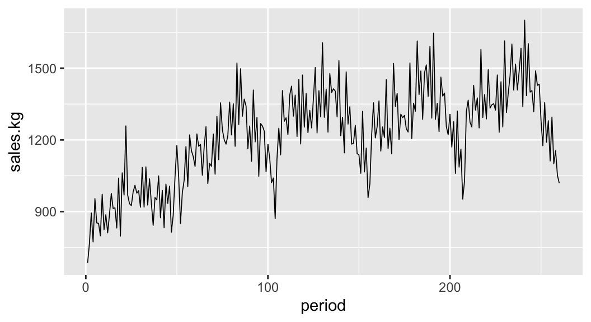

Intentaremos usar suavizamiento para capturar los distintos tipos de variación
que observamos en la serie. En primer lugar, si suavizamos poco (por ejemplo
$\aplha = 0.1$), vemos que capturamos en parte la tendencia y en parte la 
variación estacional.


```r
ggplot(ventas, aes(x = period, y = log(sales.kg))) +
  geom_line(size = 0.3) +
  geom_smooth(method = "loess", span = 0.1, method.args = list(degree = 1), 
              se = FALSE, size = 1, 
    color = "red")
```

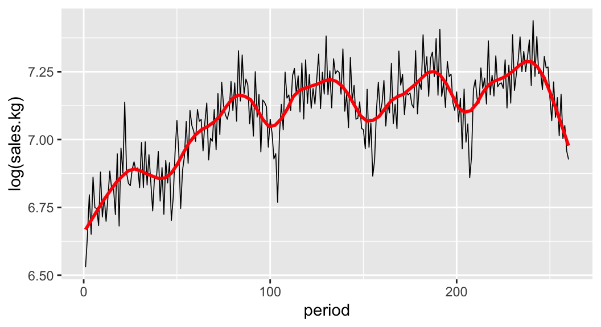

Es mejor comenzar capturando la tendencia, y poco de la componente estacional:


```r
ggplot(ventas, aes(x = period, y = log(sales.kg))) +
  geom_line(size = 0.3) +
  geom_smooth(method = "loess", span = 0.3, method.args = list(degree = 1), 
              se = FALSE, size = 1, 
    color = "red")
```

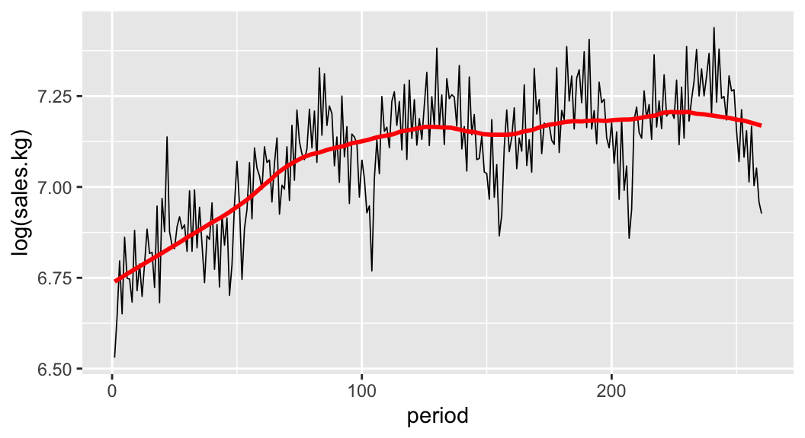

```r
ajuste.trend.1 <- loess(log(sales.kg) ~ period, ventas, span = 0.3, degree = 1)
ventas$trend.1 <- ajuste.trend.1$fitted
ventas$res.trend.1 <- ajuste.trend.1$residuals
```

Ahora calculamos los residuales de este ajuste e intentamos describirlos 
mediante un suavizamiento más fino. Verificamos que hemos estimado la mayor
parte de la tendencia, e intentamos capturar la variación estacional de los 
residuales.


```r
ggplot(ventas, aes(x = period, y = res.trend.1)) +
  geom_line(size = 0.3) +
  geom_smooth(method = "loess", span = 0.15, method.args = list(degree = 1), 
              se = FALSE, size = 1, 
    color = "red")
```

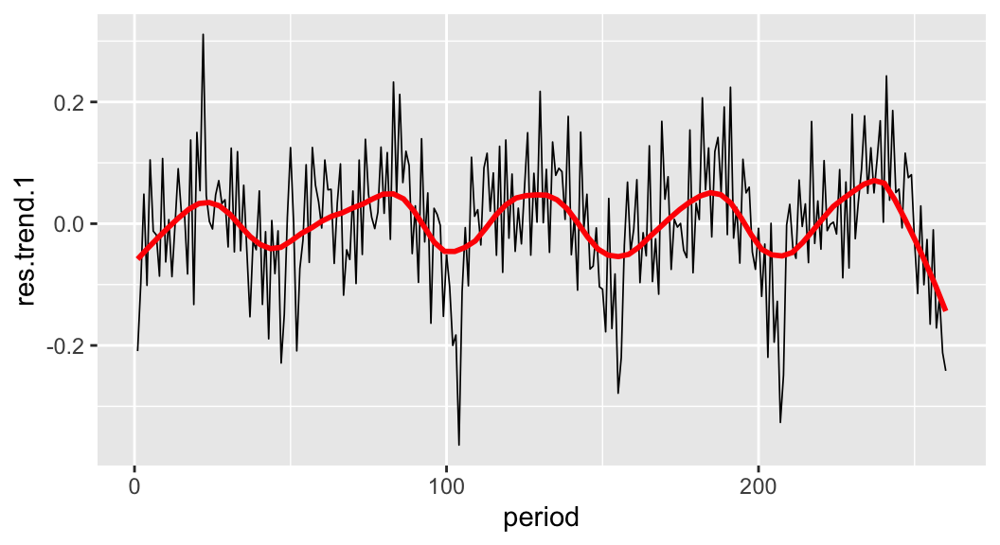

```r
ajuste.est1.1 <- loess(res.trend.1 ~ period, ventas, span = 0.15, degree = 1)
ventas$est1.1 <- ajuste.est1.1$fitted
ventas$res.est1.1 <- ajuste.est1.1$residuals
```

Y graficamos los residuales obtenidos después de ajustar el componente 
estacional para estudiar la componente de mayor frecuencia.


```r
ggplot(ventas, aes(x = period, y = res.est1.1)) +
  geom_line(size = 0.3) +
  geom_smooth(method = "loess", span = 0.06, method.args = list(degree = 1), 
              se = FALSE, size = 1, 
    color = "red")
```

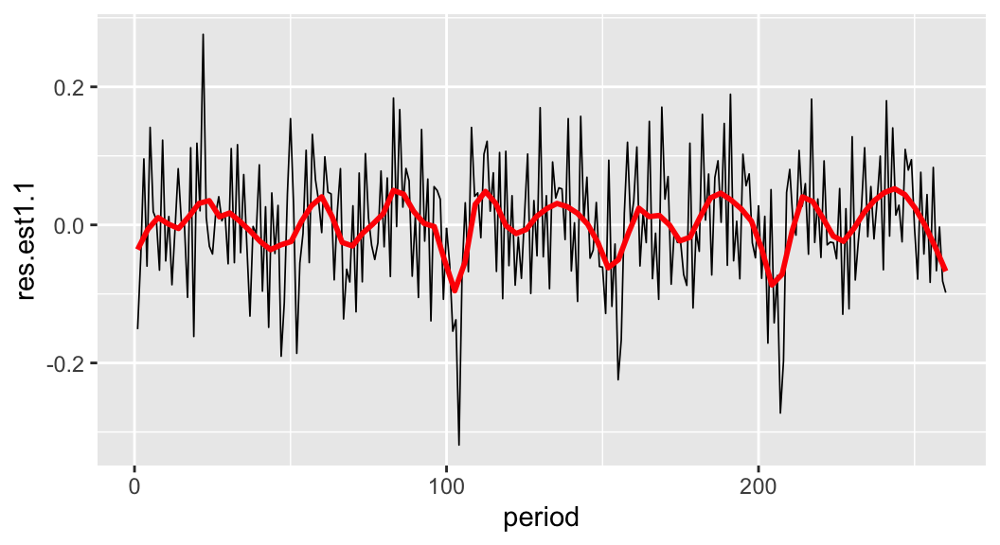

```r
ajuste.est2.1 <- loess(res.est1.1 ~ period, ventas, span = 0.06, degree = 1)
ventas$est2.1 <- ajuste.est2.1$fitted
ventas$res.est2.1 <- ajuste.est2.1$residuals
```

Ahora que tenemos nuestra primera estimación de cada una de las componentes, 
podemos regresar a hacer una mejor estimación de la tendencia. La ventaja de 
volver es que ahora podemos suavizar más sin que en nuestra muestra compita
tanto la variación estacional. Por tanto podemos suavizar menos:


```r
ventas$sales.sin.est.1 <- log(ventas$sales.kg) - ajuste.est1.1$fitted - 
  ajuste.est2.1$fitted

ggplot(ventas, aes(x = period, y = sales.sin.est.1)) +
  geom_line(size = 0.3) +
  geom_smooth(method = "loess", span = 0.09, method.args = list(degree = 1), 
              se = FALSE, size = 1, 
    color = "red")
```

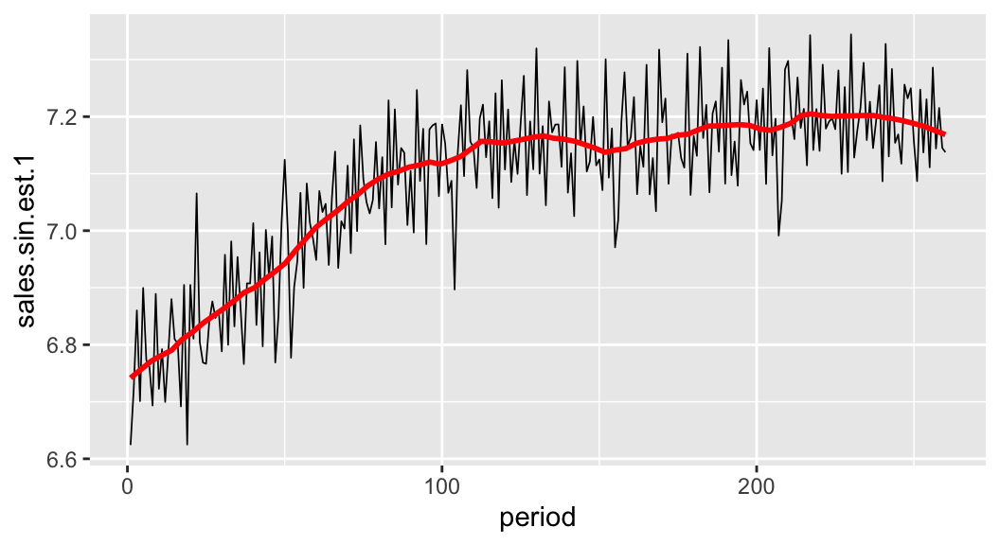

```r
ajuste.trend.2 <- loess(sales.sin.est.1 ~ period, ventas, span = 0.08, degree = 1)
ventas$trend.2 <- ajuste.trend.2$fitted
ventas$res.trend.2 <- log(ventas$sales.kg) - ventas$trend.2
```

Y ahora nos concentramos en la componente anual.


```r
ventas$sales.sin.est.2 <- log(ventas$sales.kg) - ajuste.trend.2$fitted -
  ajuste.est2.1$fitted
ggplot(ventas, aes(x = period, y = sales.sin.est.2)) +
  geom_line(size = 0.3) +
  geom_smooth(method = "loess", span = 0.15, method.args = list(degree = 2), 
              se = FALSE, size = 1, 
    color = "red")
```

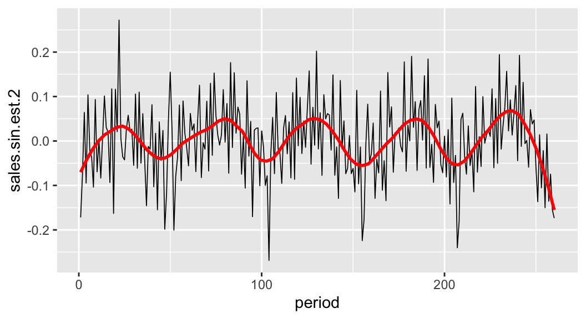

```r
ajuste.est1.2 <- loess(sales.sin.est.2 ~ period, ventas, span = 0.15, degree = 1)
ventas$est1.2 <- ajuste.est1.2$fitted
ventas$res.est1.2 <- ajuste.est1.2$residuals
```

Finalmente volvemos a ajustar la componente de frecuencia más alta:


```r
ventas$sales.sin.est.3 <- log(ventas$sales.kg) - ajuste.trend.2$fitted -
  ajuste.est1.2$fitted

ggplot(ventas, aes(x = period, y = sales.sin.est.3)) +
  geom_line(size = 0.3) +
  geom_smooth(method = "loess", span = 0.06, method.args = list(degree = 1), 
              se = FALSE, size = 1, 
    color = "red")
```

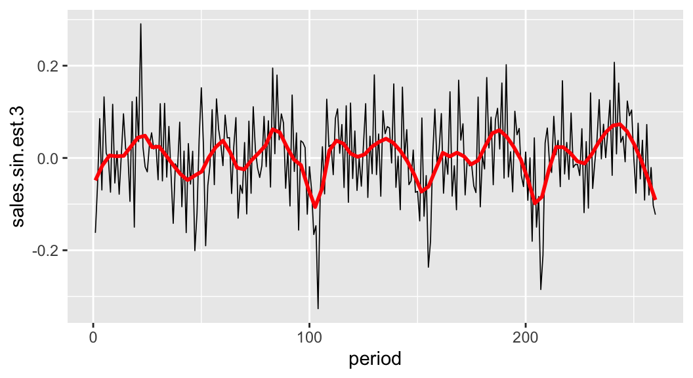

```r
ajuste.est2.2 <- loess(sales.sin.est.3 ~ period, ventas, span = 0.06, degree = 1)
ventas$est2.2 <- ajuste.est2.2$fitted
ventas$res.est2.2 <- ajuste.est2.2$residuals
```

Verificamos nuestra descomposición y visualizamos el ajuste:


```r
ventas$log.sales <- log(ventas$sales.kg)
ventas.2 <- dplyr::select(ventas, period, trend.2, est1.2, est2.2, res.est2.2, 
  log.sales)
max(abs(apply(ventas.2[, 2:4], 1, sum) - ventas.2$log.sales))
```

```
## [1] 0.240316
```

```r
ventas.2.m <- gather(ventas.2, componente, valor, -period)

ventas.2.m.c <- ventas.2.m %>%
  group_by(componente) %>%
  mutate(
    valor.c = valor - mean(valor), 
    componente = factor(componente, c("trend.2", "est1.2", "est2.2", 
                                           "res.est2.2", "log.sales"))
  )

ggplot(ventas.2.m.c, aes(x = period, y = valor.c)) +
  geom_vline(xintercept = c(0, 52 - 1, 52 * 2 - 1, 52 * 3 - 1, 52 * 4 - 1), color = "gray") +
  geom_line(size = 0.3) +
  facet_wrap(~ componente, ncol = 1)
```

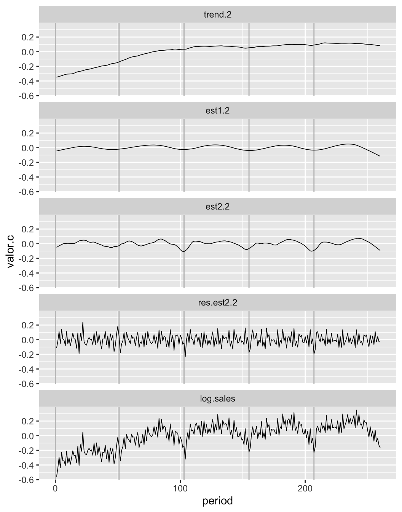

Y vemos que es razonable describir los residuales con una distribución normal 
(con desviación estándar alrededor de 8% sobre el valor ajustado):


```r
sd(ventas$res.est2.2)
```

```
## [1] 0.08093687
```

```r
ventas.ord <- arrange(ventas, res.est2.2)
ventas.ord$q.normal <- qnorm((1:nrow(ventas) - 0.5) / nrow(ventas))
ggplot(ventas.ord, aes(x = q.normal, y = res.est2.2)) +
  geom_point(size = 1.2) +
  geom_smooth(method = "lm")
```

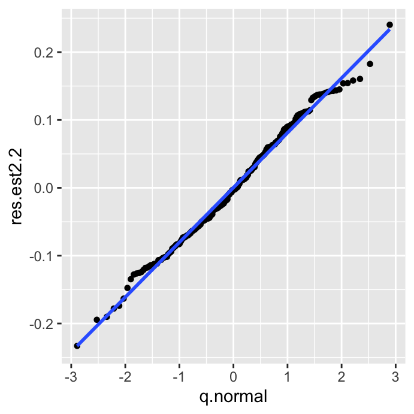

Aún no estamos convencidos de que podemos hacer *pooling* de los residuales. 
Para checar esto, vemos la gráfica de dependencia de residuales.


```r
ggplot(ventas, aes(x = period, y = res.est2.2)) + geom_line(size = 0.3) + 
  geom_point(size = 1.2)
```

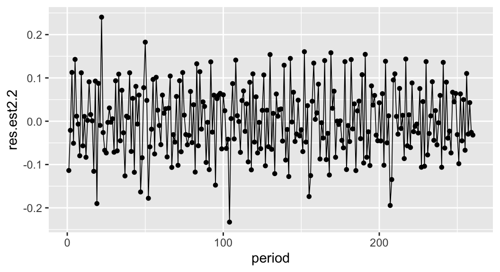

¿Puedes notar alguna dependencia en los residuales?


```r
library(nullabor)
ventas.res <- dplyr::select(ventas, period, res.est2.2)
ventas.null <- lineup(null_dist(var = 'res.est2.2', dist = 'normal', 
  params = list(mean = 0, sd = 0.08)), n = 10, ventas.res)

ggplot(ventas.null, aes(x = period, y = res.est2.2)) +
  facet_wrap(~ .sample, ncol = 2) + 
  geom_line(size = 0.3) +
  geom_vline(xintercept = c(0, 52 - 1, 52 * 2 - 1, 52 * 3 - 1, 52 * 4 - 1), color = "gray") + 
  geom_point(size = 1.2) 
```

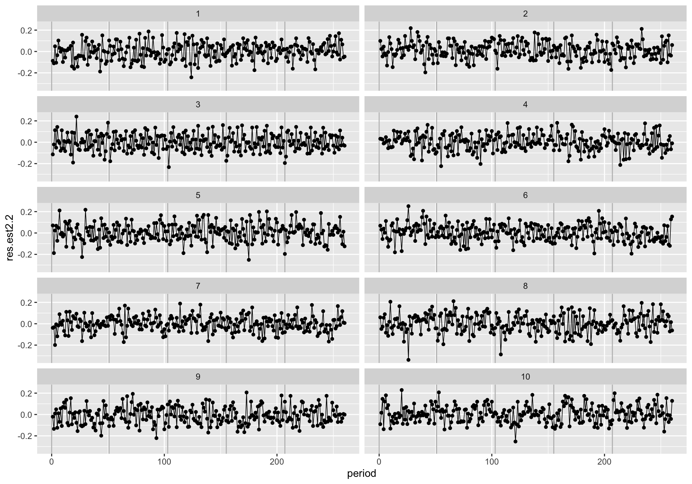

Hay dos cosas que nos falta explicar, en primer lugar, las caídas alrededor de
principios/finales de cada año (que son de hasta -0.2), y segundo que esta 
gráfica parece oscilar demasiado. La estructura que aún no hemos explicado se
debe a que las semanas que caen en quincena tienden a tener compras más 
grandes que las que están justo antes de quincena o fin de mes.

Por el momento detendremos el análisis aquí y explicamos un proceso iterativo
para proceder en nuestro análisis exploratorio:

<div class="caja">
**Iterando ajuste de loess.** Cuando queremos ajustar con tres componentes: 
  tendencia, estacionalidad y residuales, podemos seguir el siguiente proceso,

1. Ajustar la primera componente a los datos (tendencia).

2. Ajustar la segunda componente a los residuales del paso anterior 
(estacionalidad).

3. Restar de los datos originales la segunda componente ajustada 
(estacionalidad).

4. Ajustar a los residuales del paso anterior una nueva componente (tendencia).

5. Restar a los datos originales la componente ajustada en el paso anterior.

6. Ajustar a los residuales del paso anterior una nueva componente 
(estacionalidad).

7. Checar ajuste y si es necesario iterar de 3 a 6 con las nuevas componentes.
</div>

La idea es que cada componente compite para explicar los datos (cada una gana
más al bajar el parámetro $\alpha$). El conflicto es que si suavizamos mucho
cada componente (por ejemplo la tendencia), entonces parte de la variación 
que debería ir en ella queda en los residuales, y se intenta ajustar 
posteriormente por una componente distinta (estacionalidad). Sin embargo, si 
suavizamos poco, entonces parte de la variación de la segunda componente es
explicada por el ajuste de la primera. Entonces, la solución es ir poco a poco
adjudicando variación a cada componente. En nuestro ejemplo de arriba, podemos
comenzar suavizando de menos el primer ajsute de la tendencia, luego ajustar
estacionalidad, restar a los datos originales esta estacionalidad, y ajustar a
estos datos una componente más suave de tandencia. Es posible suavizar más la
tendencia justamente porque ya hemos eliminado una buena parte de la
estacionalidad.


## 3. Tipos de estudio y PGD {-}

Para cada uno de los siguientes estudios, ubícalos en el recuadro y contesta lo 
que se pide. Envíen las respuestas por correo electrónico (con título 
fundamentos-tarea03).

![Inferencia estadística de acuerdo al tipo del diseño [@ramsey].](images/03_inferencia-muestra.png)

1. En 1930 se realizó un experimento en 20,000 niños de edad escolar de Inglaterra.
Los maestros fueron los responsables de asignar a los niños de manera aleatoria al
grupo de tratamiento -que consistía en recibir 350 ml de leche diaria - o al 
grupo de control, que no recibía suplementos alimenticios. Se registraron peso y 
talla antes y después del experimento. El estudio descubrió que los niños que
recibieron la leche ganaron más en peso en el lapso del estudio. Una 
investigación posterior descubrió que los niños del grupo control eran de mayor 
peso y talla que los del grupo de intervención, antes de iniciar el tratamiento. 
¿Qué pudo haber ocurrido? ¿Podemos 
utilizar los resultados del estudio para inferir causalidad?

1. Supongamos que de los registros de un conjunto de doctores se slecciona una 
muestra aleatoria de individuos americanos caucásicos y de americanos de 
ascendencia china, con el objetivo de comparar la presión arterial de las dos
poblaciones. Supongamos que a los seleccionados se les pregunta si quieren
participar y algunos rechazan. Se compara la distribución de presión arterial
entre los que accedieron a participar. ¿En que cuadro cae este estudio? ¿Qué 
supuesto es necesario para permitir inferencias a las poblaciones muestreadas?

1. Un grupo de investigadores reportó que el consumo moderado de alcohol estaba
asociado con un menor riesgo de demencia (Mukamal et al. (2003)). Su muestra 
consistía en 373 personas con demencia y 373 sin demencia. A los participantes 
se les pregintó cuánta cerveza, vino, o licor consumían. Se observó que aquellos
que consumían de 1-6 bebidas por semana tenían una incidencia menor de demencia
comparado a aquellos que se abstenían del alcohol. ¿se puede inferir causalidad?

2. Un estudio descubrió que los niños que ven más de dos horas diarias de 
televisión tienden a tener mayores niveles de colesterol que los que ven menos 
de dos horas diarias. ¿Cómo se pueden utilizar estos resultados?

1. Más gente se enferma de gripa en temporada de invierno, ¿esto prueba que las
temperaturas bajas ocasionan las gripas? ¿Qué otras variables podrían estar 
involucradas?

2. ¿Cuál es la diferencia entre un experimento aleatorizado y una muestra 
aleatoria?


## 4. Pruebas de hipótesis visuales y permutación {-}

La tarea 4 es el proyecto de RStudio.Cloud con este nombre, el ejercicio está
en un archvio de R Markdown. Envíen el reporte por correo electrónico (con 
título fundamentos-tarea04).

### Solución: Pruebas pareadas {-}

En este ejemplo buscamos comparar la diferencia entre dos medicinas 
para dormir. 
  - ID es el identificador de paciente, y medicina_1 y medicina_2 son las
  horas extras de sueño vs. no usar medicina.  
  - Examina los datos.  


```r
library(tidyverse)

dormir <- sleep %>% 
  pivot_wider(names_from = group, 
              names_prefix = "medicina_",
              values_from = extra)

dormir
```

```
## # A tibble: 10 x 3
##    ID    medicina_1 medicina_2
##    <fct>      <dbl>      <dbl>
##  1 1            0.7        1.9
##  2 2           -1.6        0.8
##  3 3           -0.2        1.1
##  4 4           -1.2        0.1
##  5 5           -0.1       -0.1
##  6 6            3.4        4.4
##  7 7            3.7        5.5
##  8 8            0.8        1.6
##  9 9            0          4.6
## 10 10           2          3.4
```

La pregunta de interés es si una medicina es mejor que otra para prolongar el 
sueño. Nótese que en este caso, no tenemos grupos, sino mediciones repetidas.

- Escribe la hipótesis nula.

**No hay diferencia entre las medicinas.**

- Nuestra estadśtica de interés es media de las diferencias entre las medicinas. Calcula la diferencia observada.


```r
dif_obs <- dormir %>% 
  mutate(dif = medicina_1 - medicina_2) %>% 
  summarise(dif_obs = mean(dif)) %>% 
  pull(dif_obs)
dif_obs
```

```
## [1] -1.58
```

- Hay variación entre los pacientes. ¿Tenemos evidencia para rechazar que son 
iguales? ¿Cómo hacemos nuestra distribución de referencia?

**Bajo la hipótesis nula las medicinas son intercambiables, debemos
la columna de medicina _por individuo_ pues cada uno debe
tener un valor de medicina 1 y uno de medicina 2**.


```r
dormir_larga <- dormir %>% 
  pivot_longer(cols = contains("medicina"))
# Hacemos una permutación 
dormir_perm <- dormir_larga %>% 
  group_by(ID) %>% 
  mutate(name = sample(c("medicina_1", "medicina_2"))) %>% 
  ungroup()
# Calculamos la estadística en esta permutación
dormir_perm %>%
  pivot_wider(names_from = "name", values_from = "value") %>% 
  mutate(dif = medicina_1 - medicina_2) %>% 
  summarise(media_dif = mean(dif)) %>% 
  pull(media_dif)
```

```
## [1] 0.06
```

```r
# Lo hacemos una función 
calcula_est <- function(){
  dormir_perm <- dormir_larga %>% 
    group_by(ID) %>% 
    mutate(name = sample(c("medicina_1", "medicina_2"))) %>% 
    ungroup()
  dormir_perm %>%
    pivot_wider(names_from = "name", values_from = "value") %>% 
    mutate(dif = medicina_1 - medicina_2) %>% 
    summarise(media_dif = mean(dif)) %>% 
    pull(media_dif)
}
# La llamamos 1000 veces
calcula_est()
```

```
## [1] 0.12
```

```r
difs <- rerun(1000, calcula_est()) %>% flatten_dbl()
```


- Haz una gráfica de la distribución de referencia y grafica encima el valor 
observado en los datos originales.


```r
perms <- tibble(sims = 1:1000, difs = difs)
ggplot(perms, aes(x = difs)) +
  geom_histogram(binwidth = 0.20) +
  geom_vline(xintercept = dif_obs, color = "red")
```

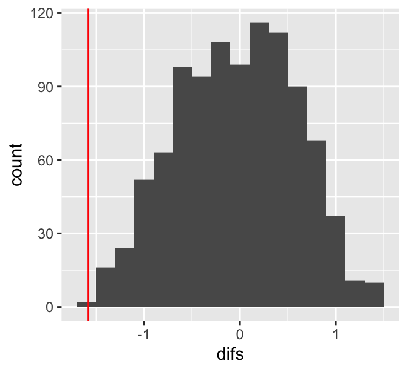


## 5. Distribución muestral y remuestreo {-}

La tarea 5 es el proyecto de RStudio.Cloud con este nombre, el ejercicio está
en un archvio de R Markdown. Envíen el reporte por correo electrónico (con 
título fundamentos-tarea05).

## 6. TCL e introducción a bootstrap {-}

La tarea 6 es el proyecto de RStudio.Cloud con este nombre, los ejercicios
están descritos en un archivo de R. Envíen un reporte por correo electrónico con 
las respuestas (con título fundamentos-tarea06).

### Solución y discusión de media {-}


#### Ejemplo: el error estándar de una media {-}

Supongamos que $x$ es una variable aleatoria que toma valores en los reales con 
distribución de probabilidad $P$. Denotamos por $\mu_F$ y $\sigma_F^2$ la 
media y varianza de $P$,

$$\mu_F = E_F(x),$$ 
$$\sigma_F^2=var_F(x)=E_F[(x-\mu)^2]$$

en la notación enfatizamos la dependencia de la media y varianza en la 
distribución $P$. 

Ahora, sea $(x_1,...,x_n)$ una muestra aleatoria de $P$, de tamaño $n$, 
la media de la muestra $\bar{x}=\sum_{i=1}^nx_i/n$ tiene:

* esperanza $\mu_F$,

* varianza $\sigma_F^2/n$.

En palabras: la esperanza de $\bar{x}$ es la misma que la esperanza de $x$, pero
la varianza de $\bar{x}$ es $1/n$ veces la varianza de $x$, así que entre
mayor es la $n$ tenemos una mejor estimación de $\mu_P$.

En el caso de la media $\bar{x}$, el error estándar, que denotamos 
$se_P(\bar{x})$, es la raíz de la varianza de $\bar{x}$,

$$se_F(\bar{x}) = [var_F(\bar{x})]^{1/2}= \sigma_F/ \sqrt{n}.$$

En este punto podemos usar el principio del _plug-in_, simplemente sustituimos
$P_n$ por $P$ y obtenemos, primero, una estimación de $\sigma_P$:
$$\hat{\sigma}=\hat{\sigma}_{\hat{F}} = \bigg\{\frac{1}{n}\sum_{i=1}^n(x_i-\bar{x})^2\bigg\}^{1/2}$$

de donde se sigue la estimación del error estándar:

$$\hat{ee}(\bar{x})=\hat{\sigma}_{\hat{F}}/\sqrt{n}=\bigg\{\frac{1}{n^2}\sum_{i=1}^n(x_i-\bar{x})^2\bigg\}^{1/2}$$

Notemos que usamos el principio del _plug-in_ en dos ocasiones, primero para 
estimar la esperanza $\mu_F$ mediante $\mu_{\hat{F}}$ y luego para estimar el 
error estándar $ee_F(\bar{x})$. 


Consideramos los datos de ENLACE edo. de México 
(`enlace`), y la columna de calificaciones de español 3^o^ de primaria (`esp_3`). 


```r
enlace <- read_csv("data/enlace_15.csv")
```
Suponemos que me interesa hacer inferencia del promedio de las 
calificaciones de los estudiantes de tercero de primaria en el Estado de México.

En este ejercicio planteamos $3$ escenarios (que simulamos): 1) que tengo una 
muestra de tamaño $10$, 2) que tengo una muestra de tamaño $100$, y 3) que tengo una 
muestra de tamaño $1000$. 

- Selección de muestras:


```r
set.seed(373783326)
muestras <- tibble(tamanos = c(10, 100, 1000)) %>% 
    mutate(muestras = map(tamanos, ~sample(enlace$esp_3, size = .)))
```

Ahora procedemos de manera *usual* en estadística (usando fórmulas y no 
simulación), estimo la media de la muestra con el estimador *plug-in* 

$$\bar{x}={1/n\sum x_i}$$ 

y el error estándar de $\bar{x}$ con el estimador *plug-in*, en el caso de la 
media hay una fórmula, pero cómo calculamos el error estándar de una mediana?, 
o de una correlación?

$$\hat{ee}(\bar{x}) =\bigg\{\frac{1}{n^2}\sum_{i=1}^n(x_i-\bar{x})^2\bigg\}^{1/2}$$

- Estimadores *plug-in*:


```r
se_plug_in <- function(x){
    x_bar <- mean(x)
    n_x <- length(x)
    var_x <- 1 / n_x ^ 2 * sum((x - x_bar) ^ 2)
    sqrt(var_x)
}
muestras_est <- muestras %>% 
    mutate(
        medias = map_dbl(muestras, mean), 
        e_estandar_plug_in = map_dbl(muestras, se_plug_in)
    )
muestras_est
```

```
## # A tibble: 3 x 4
##   tamanos muestras      medias e_estandar_plug_in
##     <dbl> <list>         <dbl>              <dbl>
## 1      10 <dbl [10]>      602.              19.3 
## 2     100 <dbl [100]>     553.               6.54
## 3    1000 <dbl [1,000]>   552.               1.90
```

Ahora, recordemos que la distribución muestral es la distribución de una
estadística, considerada como una variable aleatoria. Usando esta definción 
podemos aproximarla, para cada tamaño de muestra, simulando:  

1) simulamos muestras de tamaño $n$ de la población,   
2) calculamos la estadística de interés (en este caso $\bar{x}$),  
3) vemos la distribución de la estadística a lo largo de simulaciones.

- Histogramas de distribución muestral y aproximación de errores estándar con 
simulación 


```r
muestras_sims <- muestras_est %>%
    mutate(
        sims_muestras = map(tamanos, ~rerun(10000, sample(enlace$esp_3, 
            size = ., replace = TRUE))), 
        sims_medias = map(sims_muestras, ~map_dbl(., mean)), 
        e_estandar_aprox = map_dbl(sims_medias, sd)
        )
sims_medias <- muestras_sims %>% 
    select(tamanos, sims_medias) %>% 
    unnest(sims_medias) 

ggplot(sims_medias, aes(x = sims_medias)) +
    geom_histogram(binwidth = 2) +
    facet_wrap(~tamanos, nrow = 1) +
    theme_minimal()
```

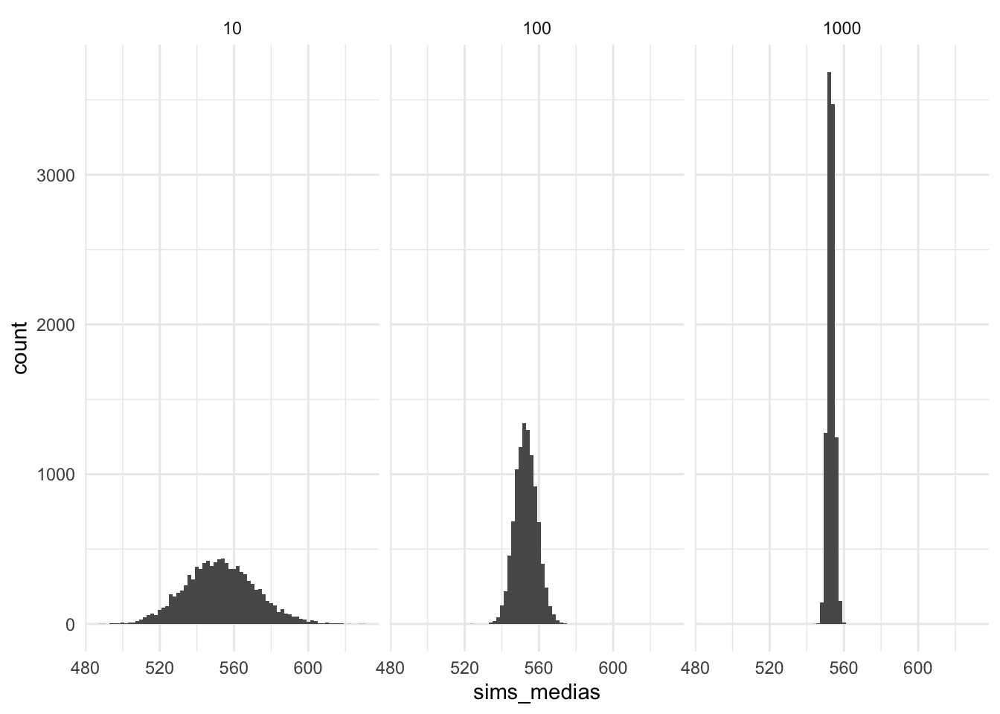

Notamos que la variación en la distribución muestral decrece conforme aumenta
el tamaño de muestra, esto es esperado pues el error estándar de una media 
es $\sigma_P / \sqrt{n}$, y dado que en este ejemplo estamos calculando la media 
para la misma población el valor poblacional $\sigma_P$ es constante y solo 
cambia el denominador.

Nuestros valores de error estándar con simulación están en la columna 
`e_estandar_aprox`:


```r
muestras_sims %>% 
    select(tamanos, medias, e_estandar_plug_in, e_estandar_aprox)
```

```
## # A tibble: 3 x 4
##   tamanos medias e_estandar_plug_in e_estandar_aprox
##     <dbl>  <dbl>              <dbl>            <dbl>
## 1      10   602.              19.3             18.9 
## 2     100   553.               6.54             5.92
## 3    1000   552.               1.90             1.87
```

En este ejercicio estamos simulando para examinar las distribuciones muestrales
y para ver que podemos aproximar el error estándar de la media usando 
simulación; sin embargo, dado que en este caso hipotético conocemos la varianza 
poblacional y la fórmula del error estándar de una media, por lo que podemos 
calcular el verdadero error estándar para una muestra de cada tamaño.

- Calcula el error estándar de la media para cada tamaño de muestra usando la
información poblacional:


```r
muestras_sims_est <- muestras_sims %>% 
    mutate(e_estandar_pob = sd(enlace$esp_3) / sqrt(tamanos))
muestras_sims_est %>% 
    select(tamanos, e_estandar_plug_in, e_estandar_aprox, e_estandar_pob)
```

```
## # A tibble: 3 x 4
##   tamanos e_estandar_plug_in e_estandar_aprox e_estandar_pob
##     <dbl>              <dbl>            <dbl>          <dbl>
## 1      10              19.3             18.9           18.7 
## 2     100               6.54             5.92           5.93
## 3    1000               1.90             1.87           1.87
```

En la tabla de arriba podemos comparar los $3$ errores estándar que calculamos, 
recordemos que de estos $3$ el *plug-in* es el único que podríamos obtener en 
un escenario real pues los otros dos los calculamos usando la población. 

Una alternativa al estimador *plug-in* del error estándar es usar *bootstrap* 
(en muchos casos no podemos calcular el error estándar *plug-in* por falta de 
fórmulas) pero podemos usar *bootstrap*: utilizamos una 
estimación de la distribución poblacional y calculamos el error estándar 
bootstrap usando simulación. Hacemos el mismo procedimiento que usamos para 
calcular *e_estandar_apox* pero sustituimos la distribución poblacional por la 
distriución empírica. Hagámoslo usando las muestras que sacamos en el primer 
paso:


```r
muestras_sims_est_boot <- muestras_sims_est %>% 
    mutate(
        sims_muestras_boot = map2(muestras, tamanos,
            ~rerun(10000, sample(.x, size = .y, replace = TRUE))), 
        sims_medias_boot = map(sims_muestras_boot, ~map_dbl(., mean)), 
        e_estandar_boot = map_dbl(sims_medias_boot, sd)
        )
muestras_sims_est_boot
```

```
## # A tibble: 3 x 11
##   tamanos muestras medias e_estandar_plug… sims_muestras sims_medias
##     <dbl> <list>    <dbl>            <dbl> <list>        <list>     
## 1      10 <dbl [1…   602.            19.3  <list [10,00… <dbl [10,0…
## 2     100 <dbl [1…   553.             6.54 <list [10,00… <dbl [10,0…
## 3    1000 <dbl [1…   552.             1.90 <list [10,00… <dbl [10,0…
## # … with 5 more variables: e_estandar_aprox <dbl>, e_estandar_pob <dbl>,
## #   sims_muestras_boot <list>, sims_medias_boot <list>, e_estandar_boot <dbl>
```

Graficamos los histogramas de la distribución bootstrap para cada muestra.


```r
sims_medias_boot <- muestras_sims_est_boot %>% 
    select(tamanos, sims_medias_boot) %>% 
    unnest(sims_medias_boot) 

ggplot(sims_medias_boot, aes(x = sims_medias_boot)) +
    geom_histogram(binwidth = 4) +
    facet_wrap(~tamanos, nrow = 1) +
    theme_minimal()
```

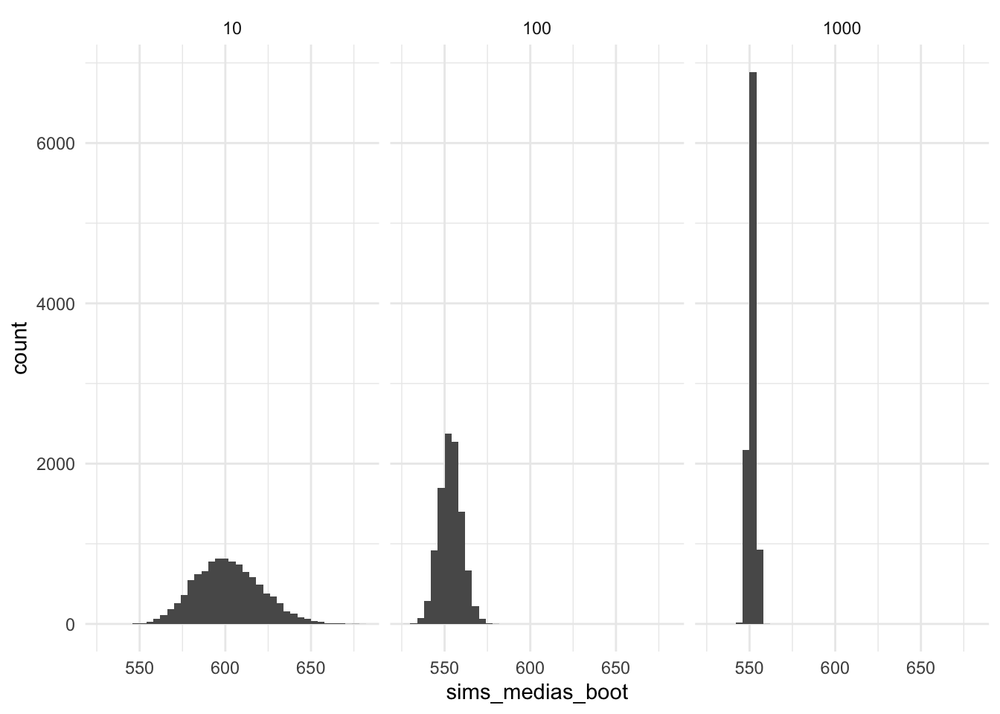

Y la tabla con todos los errores estándar quedaría:


```r
muestras_sims_est_boot %>% 
    select(tamanos, e_estandar_boot, e_estandar_plug_in, e_estandar_aprox, 
        e_estandar_pob)
```

```
## # A tibble: 3 x 5
##   tamanos e_estandar_boot e_estandar_plug_in e_estandar_aprox e_estandar_pob
##     <dbl>           <dbl>              <dbl>            <dbl>          <dbl>
## 1      10           19.3               19.3             18.9           18.7 
## 2     100            6.53               6.54             5.92           5.93
## 3    1000            1.89               1.90             1.87           1.87
```

Observamos que el estimador bootstrap del error estándar es muy similar al 
estimador plug-in del error estándar, esto es esperado pues se calcularon con la 
misma muestra y el error estándar *bootstrap* converge al *plug-in* conforme 
incrementamos el número de muestras *bootstrap*.


#### ¿Por qué bootstrap? {-}

* En el caso de la media $\hat{\theta}=\bar{x}$ la aplicación del principio del 
_plug-in_ para el cálculo de errores estándar es inmediata; sin embargo, hay 
estadísticas para las cuáles no es fácil aplicar este método.

* El método de aproximarlo con simulación, como lo hicimos en el ejercicio de 
arriba no es factible pues en la práctica no podemos seleccionar un número 
arbitrario de muestras de la población, sino que tenemos únicamente una muestra. 

* La idea del *bootstrap* es replicar el método de simulación para aproximar
el error estándar, esto es seleccionar muchas muestras y calcular la estadística 
de interés en cada una, con la diferencia que las muestras se seleccionan de la
distribución empírica a falta de la distribución poblacional.

## 7. Bootstrap en el conteo rápido


**Conteo rápido**

En México, las elecciones tienen lugar un domingo, los resultados oficiales 
del proceso se presentan a la población una semana después. A fin de evitar 
proclamaciones de victoria injustificadas durante ese periodo el INE organiza un 
conteo rápido.
El conteo rápido es un procedimiento para estimar, a partir de una muestra 
aleatoria de casillas, el porcentaje de votos a favor de los candidatos 
en la elección. 

En este ejercicio deberás crear intervalos de confianza para la proporción de
votos que recibió cada candidato en las elecciones de 2006. La inferencia se 
hará a partir de una muestra de las casillas similar a la que se utilizó para el 
conteo rápido de 2006.

El diseño utilizado es *muestreo estratificado simple*, lo que quiere decir que:

i) se particionan las casillas de la pablación en estratos (cada casilla
pertenece a exactamente un estrato), y 

ii) dentro de cada estrato se usa *muestreo aleatorio* para seleccionar las 
casillas que estarán en la muestra. 

En este ejercicio (similar al conteo rápido de 2006):

* Se seleccionó una muestra de $7,200$ casillas

* La muestra se repartió a lo largo de 300 estratos. 

* La tabla `strata_sample_2006` contiene en la columna $N$ el número total de 
casillas en el estrato y en $n$ el número de casillas que se seleccionaron en la 
muestra, para cada estrato:


```r
library(estcomp)
strata_sample_2006
```


* La tabla `sample_2006` en el paquete `estcomp` contiene para cada casilla:
    + el estrato al que pertenece: `stratum`
    + el número de votos que recibió cada partido/coalición: `pan`, `pri_pvem`, 
    `panal`, `prd_pt_convergencia`, `psd` y la columna `otros` indica el 
    número de votos nulos o por candidatos no registrados.
    + el total de votos registrado en la casilla: `total`.


```r
sample_2006
```

```
## # A tibble: 7,200 x 11
##    polling_id stratum edo_id rural pri_pvem   pan panal prd_pt_conv   psd otros
##         <dbl>   <dbl>  <dbl> <dbl>    <dbl> <dbl> <dbl>       <dbl> <dbl> <dbl>
##  1      74593     106     16     1       47    40     0          40     0     9
##  2     109927     194     27     0      131    10     0         147     1     8
##  3     112039     199     28     0       51    74     2          57     2     2
##  4      86392     141     20     1      145    64     2         139     1    14
##  5     101306     176     24     0       51   160     0          64    14     1
##  6      86044     140     20     1      150    20     0         166     1    11
##  7      56057      57     15     1      117   119     2          82     0    24
##  8      84186     128     19     0      118   205     8          73     9    13
##  9      27778     283      9     0       26    65     5         249     7     2
## 10      29892     289      9     0       27    32     0         338    14     7
## # … with 7,190 more rows, and 1 more variable: total <dbl>
```

Una de las metodolgías de estimación, que se usa en el conteo rápido, es 
*estimador de razón* y se contruyen intervalos de 95% de confianza usando el método normal con error estándar bootstrap. En este ejercicio debes construir 
intervalos usando este procedimiento.

Para cada candidato:

1. Calcula el estimador de razón combinado, para muestreo estratificado la 
fórmula es:

$$\hat{p}=\frac{\sum_h \frac{N_h}{n_h} \sum_i Y_{hi}}{\sum_h \frac{N_h}{n_h} \sum_i X_{hi}}$$
donde:

* $\hat{p}$ es la estimación de la proporción de votos que recibió el candidato
en la elección.

* $Y_{hi}$ es el número total de votos que recibió el candidato
en la $i$-ésima casillas, que pertence al $h$-ésimo estrato.

* $X_{hi}$ es el número total de votos en la $i$-ésima casilla, que pertence al 
$h$-ésimo estrato. 

* $N_h$ es el número total de casillas en el $h$-ésimo estrato.

* $n_h$ es el número de casillas del $h$-ésimo estrato que se seleccionaron en 
la muestra.


```r
# El siguiente código estima las proporciones para todos los partidos 
# puedes utilizarlo o escribir tu propio código
estimaciones <- sample_2006 %>% 
  select(polling_id, stratum, pri_pvem:total) %>% # columnas relevantes
  pivot_longer(names_to = "party", values_to = "votes", 
               cols = pri_pvem:otros) %>% # alargamos
  group_by(stratum, party) %>% 
  summarise(Y = sum(votes), 
            X = sum(total)
            ) %>% 
  left_join(strata_sample_2006, by = "stratum") %>% # unimos tabla de pesos
  group_by(party) %>% 
  summarise(p_hat = 100 * sum(N / n * Y) / sum(N / n * X))
estimaciones 
```

```
## # A tibble: 6 x 2
##   party        p_hat
##   <chr>        <dbl>
## 1 otros        2.90 
## 2 pan         35.9  
## 3 panal        0.952
## 4 prd_pt_conv 35.2  
## 5 pri_pvem    22.3  
## 6 psd          2.71
```
2. Utiliza **bootstrap** para calcular el error estándar, y reporta tu 
estimación del error.
    + Genera 1000 muestras bootstrap.
    + Recuerda que las muestras bootstrap tienen que tomar en cuenta la 
    metodología que se utilizó en la selección de la muestra original, en este
    caso, lo que implica es que debes tomar una muestra aleatoria independient
    dentro de cada estrato.


```r
boot_conteo <- function(){
  sample_2006 %>% 
    group_by(stratum) %>% 
    sample_frac(replace = TRUE) %>% 
    select(polling_id, stratum, pri_pvem:total) %>% # columnas relevantes
    pivot_longer(names_to = "party", values_to = "votes", 
                 cols = pri_pvem:otros) %>% # alargamos
    group_by(stratum, party) %>% 
    summarise(Y = sum(votes), X = sum(total), .groups = "drop") %>% 
    left_join(strata_sample_2006, by = "stratum") %>% # unimos tabla de pesos
    group_by(party) %>% 
    summarise(p_hat = 100 * sum(N / n * Y) / sum(N / n * X), .groups = "drop")
}
# Replicaciones bootstrap
boot_reps <- map_df(1:1000, ~boot_conteo(), .id = "sim") 
```

3. Construye un intervalo del 95% de confianza utilizando el método normal. Revisa si el supuesto de normalidad es razonable.

Reporta tus intervalos en una tabla. 


```r
ggplot(boot_reps, aes(sample = p_hat)) +
  geom_qq_line(color = "red") +
  geom_qq(alpha = 0.5) +
  facet_wrap(~ party, scales = "free_y")
```

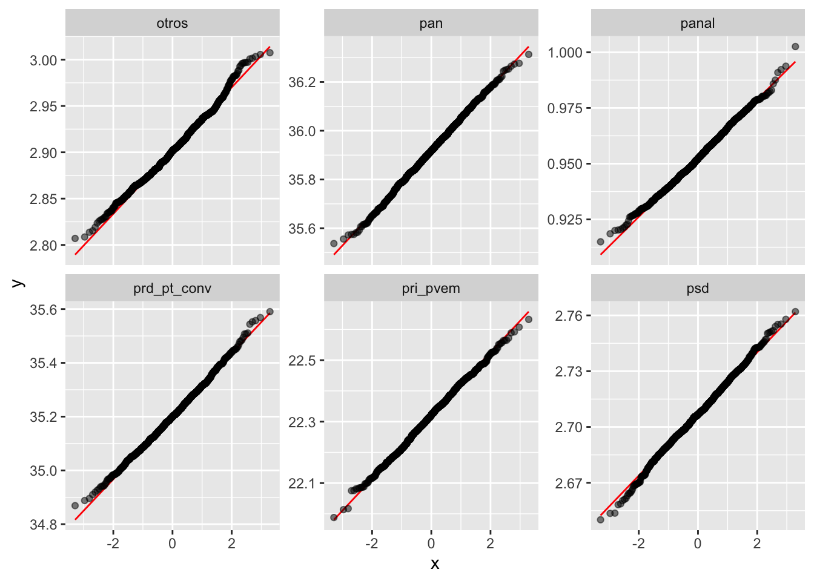

```r
boot_reps %>% 
  group_by(party) %>% 
  summarise(sd = sd(p_hat)) %>% 
  left_join(estimaciones) %>% 
  mutate(izq = p_hat - 2 * sd, der = p_hat + 2 * sd) %>% 
  mutate_if(is_numeric, round, digits = 2) %>% 
  arrange(-p_hat)
```

```
## # A tibble: 6 x 5
##   party          sd p_hat   izq   der
##   <chr>       <dbl> <dbl> <dbl> <dbl>
## 1 pan          0.13 35.9  35.7  36.2 
## 2 prd_pt_conv  0.11 35.2  35.0  35.4 
## 3 pri_pvem     0.1  22.3  22.1  22.5 
## 4 otros        0.03  2.9   2.83  2.97
## 5 psd          0.02  2.71  2.67  2.74
## 6 panal        0.01  0.95  0.93  0.98
```


## 8. Bootstrap en muestras complejas {-}

Tarea en RStudio.Cloud

### Solución {-}

Para este ejercicio usaremos los datos de la [ENIGH 2014](https://www.inegi.org.mx/programas/enigh/tradicional/2014/). En particular
las variables alimentos, vestido, vivienda, salud, comunica, educacion y esparci 
(esparcimiento) que indican el gasto trimestral en cada una de las categorías. 

1. Calcula los deciles de ingreso usando la variable de ingreso corriente (ing_cor).

Debes tomar en cuenta el diseño de la muestra, puedes usar la función
`survey_quantile()` del paquete `srvyr` o `svyquantile()` del paquete `survey`.
Reporta las estimaciones y sus errores estándar usando el bootstrap de Rao y Wu.


```r
library(tidyverse)
library(readr)
library(dplyr)
library(srvyr)
concentrado_hogar <- read_csv("data/concentradohogar-2014.csv")
# para facilitar los cálculos ponemos las variables en un vector
vars_cats <- c("alimentos", "vestido", "vivienda", "salud", "transporte",
               "comunica", "educacion", "esparci")

hogar <- concentrado_hogar %>% 
  select(folioviv, foliohog, ubica_geo, est_dis, upm, factor_hog, ing_cor,
         all_of(vars_cats))

# creamos una variable con el gasto total y el porcentaje de gasto en cada categoría
hogar_gastos <- hogar %>%
  mutate(gasto = alimentos + vestido + vivienda + salud + transporte + 
           comunica + educacion + esparci) %>% 
  dplyr::mutate_at(vars_cats, list(~. / gasto))

glimpse(hogar_gastos)
```

```
## Rows: 19,479
## Columns: 16
## $ folioviv   <chr> "0100008302", "0100008303", "0100008304", "0100008305", "0…
## $ foliohog   <dbl> 1, 1, 1, 1, 1, 1, 1, 1, 1, 1, 1, 1, 1, 1, 1, 1, 2, 3, 1, 1…
## $ ubica_geo  <chr> "010010001", "010010001", "010010001", "010010001", "01001…
## $ est_dis    <chr> "005", "005", "005", "005", "005", "005", "005", "005", "0…
## $ upm        <chr> "00670", "00670", "00670", "00670", "00600", "00600", "006…
## $ factor_hog <dbl> 694, 694, 694, 694, 660, 660, 660, 660, 660, 583, 583, 583…
## $ ing_cor    <dbl> 39786.79, 19523.90, 99257.66, 87883.68, 84427.04, 232013.8…
## $ alimentos  <dbl> 0.5015886, 0.9429851, 0.5614513, 0.5294347, 0.5109985, 0.1…
## $ vestido    <dbl> 0.000000000, 0.000000000, 0.016386166, 0.017903377, 0.0000…
## $ vivienda   <dbl> 0.09873717, 0.00000000, 0.10014985, 0.06710640, 0.12156623…
## $ salud      <dbl> 0.0629343253, 0.0570149022, 0.0416210351, 0.0256608760, 0.…
## $ transporte <dbl> 0.24650216, 0.00000000, 0.19528757, 0.08784837, 0.27812129…
## $ comunica   <dbl> 0.049832791, 0.000000000, 0.085104074, 0.087848374, 0.0476…
## $ educacion  <dbl> 0.000000000, 0.000000000, 0.000000000, 0.184197908, 0.0000…
## $ esparci    <dbl> 0.04040497, 0.00000000, 0.00000000, 0.00000000, 0.04167985…
## $ gasto      <dbl> 22274.49, 2058.76, 29849.57, 16391.88, 25192.03, 108888.73…
```


Para usar las funciones de `srvyr` lo primero es especificar el diseño de la 
muestra.


```r
enigh_design <- hogar_gastos %>% 
  as_survey_design(ids = upm, weights = factor_hog, strata = est_dis)
enigh_design
```

```
## Stratified 1 - level Cluster Sampling design (with replacement)
## With (2626) clusters.
## Called via srvyr
## Sampling variables:
##  - ids: upm
##  - strata: est_dis
##  - weights: factor_hog
## Data variables: folioviv (chr), foliohog (dbl), ubica_geo (chr), est_dis (chr),
##   upm (chr), factor_hog (dbl), ing_cor (dbl), alimentos (dbl), vestido (dbl),
##   vivienda (dbl), salud (dbl), transporte (dbl), comunica (dbl), educacion
##   (dbl), esparci (dbl), gasto (dbl)
```

Elegimos *bootstrap* de Rao y Wu.


```r
enigh_boot <- enigh_design %>% 
  as_survey_rep(type = "subbootstrap", replicates = 600)

deciles_ingcor <- enigh_boot %>%
  srvyr::summarise(q_ing_cor = survey_quantile(ing_cor, seq(0.1, 1, 0.1), 
                                               vartype = NULL)) %>% 
  tidyr::pivot_longer(cols = everything())
deciles_ingcor
```

```
## # A tibble: 10 x 2
##    name              value
##    <chr>             <dbl>
##  1 q_ing_cor_q10    10622.
##  2 q_ing_cor_q20    14775.
##  3 q_ing_cor_q30    18597.
##  4 q_ing_cor_q40    22682.
##  5 q_ing_cor_q50    27186.
##  6 q_ing_cor_q60    32726.
##  7 q_ing_cor_q70    40057.
##  8 q_ing_cor_q80    51990.
##  9 q_ing_cor_q90    76285.
## 10 q_ing_cor_q100 4150377.
```

Creamos una nueva variable con los deciles.


```r
library(Hmisc)
enigh_boot_q <- enigh_boot %>%
  mutate(decil = cut2(ing_cor, cuts = deciles_ingcor$value, 
                      levels.mean = TRUE))
```

Y realizamos las estimaciones por decil.


```r
# estimaciones
estimaciones <- enigh_boot_q %>% 
  group_by(decil) %>% 
  srvyr::summarise_at(vars_cats, survey_mean, na.rm = TRUE) 

# errores estándar
estimaciones_se <- estimaciones %>% 
  select(decil, contains("se")) %>% 
  pivot_longer(-decil, names_to = "campo", values_to = "se") %>% 
  mutate(campo = stringr::str_extract(campo, ".*(?=_)"))

# unimos las dos para hacer la gráfica
estimaciones_tidy <- estimaciones %>% 
  select(decil, all_of(vars_cats)) %>% 
  pivot_longer(-decil, names_to = "campo", values_to = "est") %>% 
  left_join(estimaciones_se)
```

Y graficamos.


```r
ggplot(estimaciones_tidy) +
  geom_line(aes(x = as.integer(decil), y = est, group = campo, color = campo)) +
  scale_x_continuous("decil", breaks = 1:10)
```

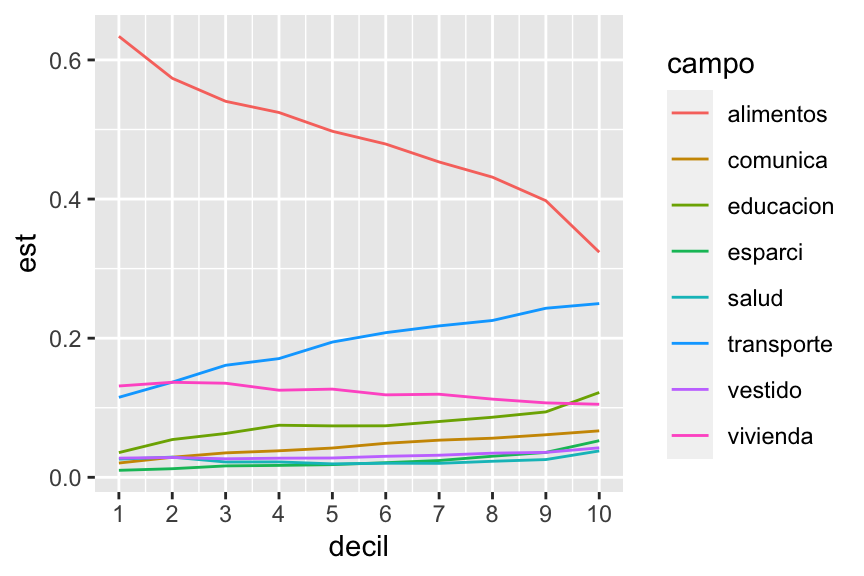

Podemos hacer páneles para ver la variación en cada categoría.


```r
ggplot(estimaciones_tidy) +
  geom_line(aes(x = as.integer(decil), y = est, group = campo, color = campo), 
            show.legend = FALSE) +
  facet_wrap(~ campo, scales = "free_y", nrow = 2) +
  scale_x_continuous("decil", breaks = 1:10)
```


Y finalmente agregamos errores estándar.


```r
ggplot(estimaciones_tidy) +
  geom_line(aes(x = as.integer(decil), y = est, group = campo, color = campo), 
            show.legend = FALSE, alpha = 0.8) +
  geom_linerange(aes(x = as.integer(decil), ymin = est - 2 * se, ymax = est + 2 * se, 
                     group = campo, color = campo), show.legend = FALSE, alpha = 0.8) +
  facet_wrap(~ campo, scales = "free_y", nrow = 2) +
  scale_x_continuous("decil", breaks = 1:10)
```

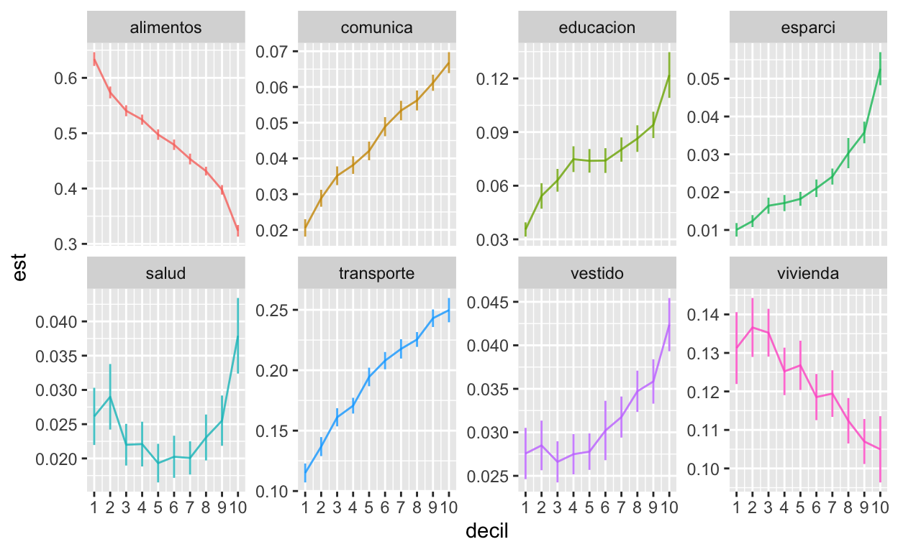

### Mapas {-}

Si quisieran hacer un mapa con la mediana de ingreso corriente trimestral por
estado.

1. Lo primero que debemos hacer es agregar la variable entidad a tus datos. 
De acuerdo al diccionario de datos de la ENIGH la variable *ubicacion_geo*
contiene la clave de entidad.

    *ubica_geo: Ubicación geográfica, contiene la ubicación geográfica de la vivienda. 
    Los dos primeros dígitos representan la clave de la entidad, los siguientes tres 
    la clave del municipio y los últimos cuatro la clave de la localidad. Éstas 
    corresponden al Catálogo de claves de entidades federativas, municipios y 
    localidades, que está disponible en el sitio del INEGI.*

Por lo tanto debemos comenzar creando una variable de entidad, para ello usamos
la función `str_sub()` del paquete `stringr`.


```r
library(stringr)
enigh_boot_edo <- enigh_boot %>% 
  mutate(edo = str_sub(ubica_geo, 1, 2))
```

2. Una vez que tenemos la variable en el diseño usamos `group_by()` y `svy_median()`
para calcular la mediana en cada estado y el error estándar de las estimaciones.


```r
edo_ing_cor <- enigh_boot_edo %>% 
  group_by(edo) %>% 
  summarise(mediana = survey_median(ing_cor, vartype = "se")) 
```

Ahora vemos como hacer un mapa con los resultados de nuestro análisis, para ello
usaremos el paquete [mxmaps](https://www.diegovalle.net/mxmaps/index.html). En este 
caso el `data.frame` con la información de ingreso corriente por estado se 
llama `edo_ing_cor`.


```r
library(mxmaps)
data(mxstate.map) # datos para hacer el mapa
```


```r
mxstate_ing_cor <- mxstate.map %>% 
  left_join(edo_ing_cor, by = c("region" = "edo"))

# este es el mapa básico
mapa_ingcor <- ggplot(mxstate_ing_cor, aes(long, lat, group = group)) + 
  geom_polygon(aes(fill = mediana), color = "darkgray") +
  coord_map()

mapa_ingcor 
```

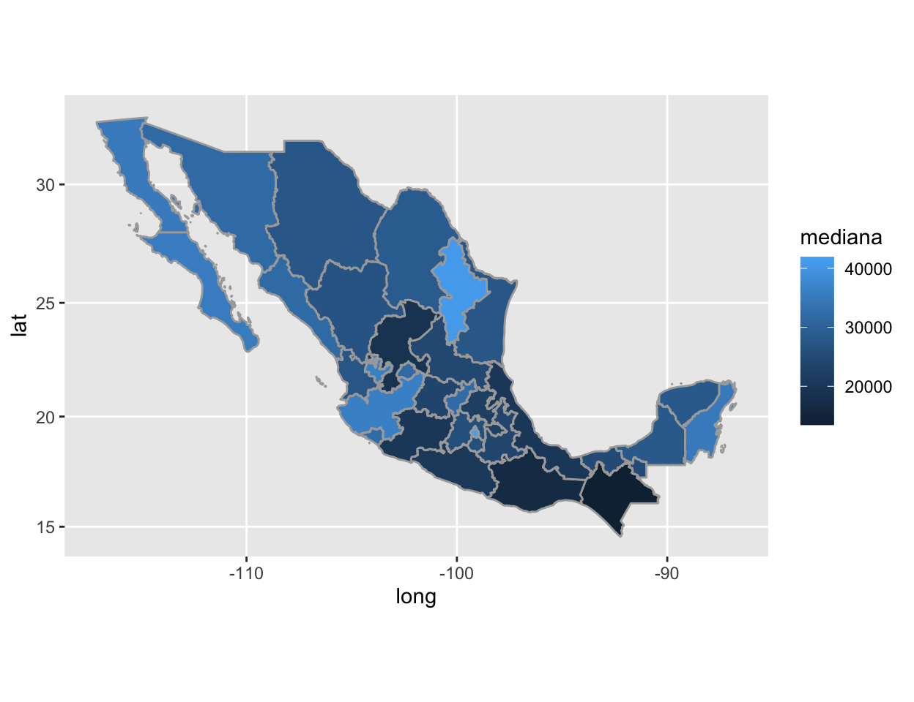

Podemos agregar interactividad con el paquete `plotly`.


```r
library(plotly)

# función para formatear con comas los datos de ingreso
comma <- function(x) format(x, digits = 2, big.mark = ",")

mapa_ingcor <- ggplot(mxstate_ing_cor %>% mutate(ee = round(mediana_se)), 
                      aes(long, lat, group = group, 
                          text = str_c("ingreso corriente: ",  
                                       comma(mediana)), label = ee)) + 
  geom_polygon(aes(fill = mediana), color = "darkgray", size = 0.1) +
  scale_fill_distiller(palette = "YlGnBu", type = "div") + #paleta 
  labs(title = "Mediana de ingreso corriente", fill = "") + 
  theme_void() +
  coord_map()

ggplotly(mapa_ingcor, tooltip = c("text", "label"))
```

<!--html_preserve--><div id="htmlwidget-b8c2b452e5f69ffc77fa" style="width:624px;height:432px;" class="plotly html-widget"></div>
<script type="application/json" data-for="htmlwidget-b8c2b452e5f69ffc77fa">{"x":{"data":[{"x":[-91.43969686,-91.42742435,-91.41843432,-91.40211749,-91.38568948,-91.37206337,-91.36563757,-91.35474766,-91.34773094,-91.34704625,-91.350307,-91.34916165,-91.33971121,-91.33532409,-91.33123815,-91.32535151,-91.31949081,-91.3117964,-91.30369941,-91.28415325,-91.27785058,-91.26399152,-91.26377228,-91.27238897,-91.27183834,-91.26845931,-91.26494638,-91.25629637,-91.23271652,-91.22491492,-91.21708831,-91.21723254,-91.20929228,-91.20335966,-91.18984931,-91.17573506,-91.154403,-91.14904497,-91.13671703,-91.12701734,-91.11995868,-91.12201752,-91.11625115,-91.10541438,-91.09876508,-91.09538506,-91.08230906,-91.06448006,-91.07386632,-91.06562732,-91.05997751,-91.04516226,-91.0184956,-91.00906751,-90.99721335,-90.99230068,-90.98995598,-90.98173131,-90.98061031,-90.98437488,-90.98647288,-90.97904532,-90.96637115,-90.9574384,-90.95432034,-90.95769677,-90.97213077,-90.97467454,-90.96704472,-90.95553892,-90.94926392,-90.936951,-90.93236418,-90.93388875,-90.92677403,-90.92413771,-90.9201486,-90.90272343,-90.89590872,-90.885037,-90.87208475,-90.86028612,-90.85656998,-90.84209355,-90.82451523,-90.81027545,-90.80287966,-90.80209757,-90.80489952,-90.80320174,-90.78244857,-90.76602052,-90.75856048,-90.75684512,-90.74397246,-90.73146508,-90.72119514,-90.71525803,-90.70944503,-90.707447,-90.70951229,-90.69867877,-90.68944909,-90.6831836,-90.6792328,-90.67937894,-90.67390318,-90.65898301,-90.65721591,-90.66206168,-90.66018371,-90.65609945,-90.65624251,-90.65335789,-90.65888954,-90.66639177,-90.66684143,-90.65755952,-90.64463491,-90.64034086,-90.64245625,-90.63517978,-90.62557531,-90.63688121,-90.64635101,-90.64648771,-90.64826385,-90.64260925,-90.64553245,-90.64208621,-90.63559481,-90.61947655,-90.61036957,-90.60572614,-90.60921868,-90.61859161,-90.63344191,-90.6349326,-90.62555986,-90.61659775,-90.61432614,-90.60420788,-90.59832177,-90.59245581,-90.5936696,-90.58528612,-90.54606483,-90.54317029,-90.54786985,-90.54569194,-90.52506392,-90.52381018,-90.51421577,-90.50363283,-90.49901561,-90.49776566,-90.49085168,-90.48655069,-90.47761295,-90.47950681,-90.47830491,-90.48586168,-90.48723537,-90.48254677,-90.4718156,-90.46102186,-90.44385985,-90.43166298,-90.4236032,-90.41610763,-90.41174215,-90.40339212,-90.39792329,-90.38729226,-90.39129814,-90.40191068,-90.401126,-90.39681657,-90.38645206,-90.37527921,-90.37021372,-90.37355878,-90.37972198,-90.38892618,-90.39462726,-90.40110465,-90.41121626,-90.40070031,-90.40085992,-90.39693089,-90.3833286,-90.38131438,-90.38919025,-90.39753526,-90.40322189,-90.41001091,-90.4121228,-90.40868415,-90.41060718,-90.41561795,-90.43272854,-90.43764766,-90.43885989,-90.43289951,-90.43304883,-90.44043975,-90.43877955,-90.43136085,-90.42231817,-90.42353075,-90.43015552,-90.43878958,-90.44547478,-90.45390203,-90.45353003,-90.43874601,-90.42808468,-90.42877226,-90.43814403,-90.45119085,-90.45539855,-90.45667331,-90.45325254,-90.45328885,-90.44747651,-90.44085675,-90.43146226,-90.42662831,-90.42455578,-90.43795018,-90.44731783,-90.45042737,-90.44851486,-90.43827512,-90.42946135,-90.42862063,-90.4359634,-90.44472061,-90.45144591,-90.45661157,-90.45668054,-90.45400252,-90.45563958,-90.44866508,-90.44286032,-90.43377254,-90.42589145,-90.42684057,-90.43338238,-90.4451538,-90.44084089,-90.55196797,-90.70673806,-90.81365217,-90.95357772,-91.10783237,-91.23134652,-91.38178286,-91.49479948,-91.64162774,-91.73138415,-91.77564301,-91.84544026,-91.93865321,-92.00006505,-92.08509408,-92.15795188,-92.21007594,-92.1972744,-92.16139175,-92.13122035,-92.10417843,-92.06192512,-92.06305737,-92.07295588,-92.06835448,-92.07234911,-92.0780972,-92.07865895,-92.08566581,-92.09096885,-92.09775617,-92.09935523,-92.10974978,-92.11835772,-92.12698292,-92.13144609,-92.13437926,-92.13878489,-92.13943825,-92.14744965,-92.15078058,-92.14477405,-92.14710634,-92.14601723,-92.1483366,-92.14303452,-92.14350271,-92.14166994,-92.14476441,-92.13621021,-92.14656278,-92.16588141,-92.17038589,-92.17609735,-92.18141917,-92.18149674,-92.18483409,-92.17738331,-92.17871201,-92.1769698,-92.17050205,-92.16454305,-92.16072585,-92.16185541,-92.17050746,-92.17180671,-92.1699306,-92.15783725,-92.15392614,-92.14784909,-92.14896778,-92.14741615,-92.14313448,-92.14662786,-92.14675886,-92.15013369,-92.15837309,-92.15886903,-92.16757674,-92.17305648,-92.17705438,-92.17692278,-92.18063143,-92.17781829,-92.18184112,-92.18247635,-92.19870461,-92.20561638,-92.20809465,-92.21611568,-92.21642226,-92.22110117,-92.22675194,-92.2438182,-92.27589463,-92.32612141,-92.36762403,-92.39266005,-92.40942029,-92.40898291,-92.42951072,-92.435256,-92.46007834,-92.47273917,-92.51234998,-92.54836825,-92.59415006,-92.63097398,-92.65839006,-92.70168009,-92.7270346,-92.77883417,-92.81234798,-92.85375669,-92.85397771,-92.85968249,-92.86299978,-92.88000335,-92.96565594,-93.02066826,-93.04331845,-93.08766941,-93.12377698,-93.17766011,-93.20276866,-93.23040557,-93.23751581,-93.27012248,-93.33234555,-93.4615584,-93.53881552,-93.58484497,-93.63042415,-93.65626092,-93.69001406,-93.6976638,-93.72583828,-93.78691834,-93.84076694,-93.86840211,-93.90678063,-93.92527121,-93.94272315,-93.95284692,-93.95715015,-94.00021883,-94.00543165,-94.00725815,-94.01114315,-94.0213172,-94.02694132,-94.03600811,-94.03854943,-94.03963248,-94.10276369,-94.10653011,-94.10759625,-94.10860418,-94.1095676,-94.09540951,-94.09059529,-94.05790146,-94.048627,-94.04695174,-94.03850038,-94.03519555,-94.03513898,-94.04353437,-94.03606226,-94.03575551,-94.032961,-94.0372086,-94.0458222,-94.05163651,-94.05066485,-94.10248006,-94.1383196,-94.139156,-94.0455866,-93.99417295,-93.93012229,-93.86742677,-93.87012328,-93.86747878,-93.86542237,-93.86227045,-93.86145031,-93.86091577,-93.85197981,-93.84689748,-93.84400329,-93.83904521,-93.82713769,-93.82699255,-93.82682409,-93.82663017,-93.82011997,-93.81718874,-93.80854823,-93.80716069,-93.8066612,-93.80427377,-93.805412,-93.8059992,-93.80565263,-93.80469378,-93.80370709,-93.80175194,-93.79951283,-93.79878623,-93.79485426,-93.79192475,-93.79122715,-93.79029085,-93.78985955,-93.78656029,-93.78130458,-93.7724502,-93.77009194,-93.76362045,-93.75499094,-93.74618261,-93.73679311,-93.72436911,-93.71752158,-93.69566895,-93.69277748,-93.69135168,-93.68987226,-93.66685746,-93.66682441,-93.66269437,-93.66330038,-93.66354228,-93.66389526,-93.66389811,-93.66433129,-93.66433138,-93.66434403,-93.66187606,-93.63813234,-93.63513532,-93.61393358,-93.60793981,-93.59771197,-93.52410443,-93.52435268,-93.51544149,-93.51101155,-93.5122248,-93.50715963,-93.50913478,-93.50623291,-93.51402235,-93.50906348,-93.50249291,-93.49970338,-93.49561683,-93.49452238,-93.48933618,-93.48771163,-93.48156123,-93.46881098,-93.4603856,-93.45116397,-93.45062537,-93.44796988,-93.44399152,-93.42735925,-93.41882726,-93.41370571,-93.40959929,-93.3965862,-93.38496829,-93.38478872,-93.3619622,-93.35627777,-93.360417,-93.35383658,-93.35672217,-93.35357737,-93.35427609,-93.36413348,-93.36809792,-93.36993989,-93.38231758,-93.39054783,-93.38061768,-93.37541995,-93.35281968,-93.34913509,-93.34311188,-93.35850308,-93.36441871,-93.377479,-93.37760683,-93.37048597,-93.36464358,-93.35209248,-93.3418882,-93.34105538,-93.3492856,-93.34695855,-93.33949369,-93.34095291,-93.33615808,-93.33429511,-93.33656315,-93.34971272,-93.34997486,-93.34449392,-93.34459848,-93.34126192,-93.33602245,-93.34076674,-93.33993965,-93.3366702,-93.32526703,-93.30170171,-93.29552749,-93.2983806,-93.29354983,-93.28770746,-93.28300761,-93.28141851,-93.27271578,-93.2681596,-93.26124249,-93.25671491,-93.24640125,-93.2413414,-93.23096121,-93.21571709,-93.20735877,-93.2007434,-93.19200158,-93.18845911,-93.18314389,-93.17266371,-93.16512975,-93.15787126,-93.14889741,-93.14434872,-93.14598208,-93.13613578,-93.13228358,-93.12240706,-93.11499746,-93.10497503,-93.09598714,-93.09137594,-93.09142246,-93.11425425,-93.12362598,-93.12468931,-93.13180032,-93.12902789,-93.12040466,-93.11564075,-93.10164546,-93.09408988,-93.05870783,-93.04312631,-93.04027649,-93.02543628,-93.02703708,-93.0214842,-93.01285748,-93.01200817,-93.01733265,-93.02001237,-93.02601766,-93.02801223,-93.04263828,-93.04678641,-93.05433971,-93.05469257,-93.05717605,-93.05370015,-93.04436798,-93.04303189,-93.03788383,-93.04072178,-93.04193106,-93.04076408,-93.04428641,-93.04545765,-93.04519151,-93.04264528,-93.04397035,-93.04052534,-93.02881635,-93.01496666,-93.01367918,-93.00434278,-93.00732449,-93.00593135,-92.99713292,-92.98883554,-92.98734986,-92.98048968,-92.98219068,-92.99264832,-92.97882466,-92.97506458,-92.96737292,-92.96607883,-92.95568051,-92.94691771,-92.9436636,-92.94149558,-92.93787246,-92.92046114,-92.91293754,-92.90710121,-92.89682645,-92.88735617,-92.86618975,-92.85980875,-92.85568949,-92.85075651,-92.84702565,-92.83568141,-92.83062628,-92.82801492,-92.82753489,-92.82225572,-92.81963085,-92.82582475,-92.85619101,-92.85426446,-92.83115868,-92.8293996,-92.80627731,-92.80016374,-92.79105429,-92.79079423,-92.77436801,-92.76729038,-92.77066331,-92.75873741,-92.75610165,-92.75175521,-92.72950834,-92.70851934,-92.7016012,-92.69427034,-92.67770274,-92.67851538,-92.67623875,-92.66790537,-92.66769928,-92.66579586,-92.65927188,-92.65453249,-92.64219101,-92.62433803,-92.60582514,-92.59418191,-92.59990143,-92.59308983,-92.59230737,-92.59698969,-92.57141092,-92.55392352,-92.53007341,-92.52010471,-92.5085926,-92.49719637,-92.48468837,-92.47381148,-92.46842845,-92.4573622,-92.44416871,-92.43576977,-92.42123688,-92.41781178,-92.40821958,-92.4020786,-92.40085814,-92.37285872,-92.35067371,-92.35813168,-92.35477201,-92.34915949,-92.35000583,-92.34989703,-92.34401805,-92.33823066,-92.33734726,-92.31527812,-92.29835469,-92.29480095,-92.28868154,-92.27462289,-92.23069698,-92.1944994,-92.18848715,-92.17195018,-92.15245401,-92.15170817,-92.13082541,-92.13255448,-92.13597189,-92.12713808,-92.14662263,-92.13951778,-92.12048163,-92.10553518,-92.10460131,-92.09939826,-92.10646289,-92.10203335,-92.09049763,-92.09046881,-92.0682952,-92.05806498,-92.04844938,-92.05164678,-92.05908277,-92.06664872,-92.07206829,-92.02969894,-92.01970791,-92.01924966,-92.01554663,-92.00335506,-91.99840255,-91.99128974,-91.99988789,-91.99567109,-91.99048981,-91.98659845,-91.98139025,-91.96993097,-91.94498618,-91.93959785,-91.93943418,-91.95683277,-91.95746258,-91.95260865,-91.94141117,-91.93398669,-91.92806134,-91.92390557,-91.92549683,-91.92085765,-91.91247057,-91.90296681,-91.89583886,-91.89115089,-91.87068931,-91.85793715,-91.84968629,-91.84125251,-91.83163995,-91.81618438,-91.80927198,-91.80780532,-91.80436874,-91.7979668,-91.78187294,-91.78068343,-91.790387,-91.79237158,-91.79174068,-91.78361303,-91.78203006,-91.78296586,-91.79190038,-91.79016174,-91.79836866,-91.81032503,-91.83066169,-91.82131814,-91.81843395,-91.79542961,-91.78401454,-91.78226751,-91.77862432,-91.7714926,-91.76785261,-91.75391478,-91.74905278,-91.73915341,-91.73683525,-91.733294,-91.72476354,-91.71724049,-91.71272437,-91.70497877,-91.69049254,-91.67843,-91.67299249,-91.66616845,-91.65854412,-91.65829646,-91.66193554,-91.65681741,-91.65888678,-91.65281126,-91.65624194,-91.64683551,-91.65224252,-91.66229458,-91.66219178,-91.65295651,-91.64433654,-91.63856472,-91.64161303,-91.6404582,-91.63476969,-91.63738925,-91.63471515,-91.6427542,-91.64319898,-91.64848585,-91.64832674,-91.65207577,-91.65768803,-91.66739071,-91.67709901,-91.68190566,-91.68934128,-91.69237372,-91.68229521,-91.66463521,-91.67204314,-91.63733735,-91.63488734,-91.62020768,-91.61748594,-91.60894817,-91.60689818,-91.55879354,-91.55785669,-91.55209323,-91.53724421,-91.53684714,-91.51724425,-91.50993554,-91.50500477,-91.48427308,-91.45649563,-91.45271589,-91.44717645,-91.43929846,-91.43032071,-91.41983261,-91.41437589,-91.41749543,-91.41360178,-91.40510406,-91.39699741,-91.38836006,-91.38504461,-91.38389958,-91.39253083,-91.41358721,-91.41868175,-91.42518088,-91.42749803,-91.42716249,-91.43122288,-91.43969686,-91.43969686],"y":[17.25096688,17.21659483,17.20905092,17.2045648,17.20629783,17.20270683,17.19632639,17.19077114,17.17885826,17.17444023,17.1637032,17.1600248,17.15854215,17.16155442,17.17679266,17.18249795,17.18305625,17.17996043,17.18063959,17.17811146,17.1791784,17.16708552,17.15686629,17.14284163,17.12302302,17.11020012,17.1058298,17.10103951,17.09989526,17.09282317,17.07597709,17.0655998,17.05167803,17.0449486,17.03484515,17.01608182,17.00487005,17.00423772,17.00690095,17.00597149,16.99758169,16.98091911,16.97442823,16.97094875,16.96445026,16.95457883,16.94545646,16.92512975,16.91184075,16.90285825,16.89977645,16.89670675,16.88865939,16.88682542,16.88035602,16.87482271,16.86438932,16.86670569,16.87711277,16.88505745,16.89453265,16.90224888,16.90214219,16.89676989,16.88743566,16.87862269,16.87095909,16.86621849,16.86052872,16.86547746,16.86524491,16.86130497,16.85717975,16.84232109,16.83409355,16.82558334,16.8208998,16.82219469,16.82483572,16.82521709,16.82079651,16.81030383,16.7996772,16.79581897,16.79868492,16.79924635,16.79796492,16.79118999,16.78209148,16.776676,16.76818926,16.76419859,16.75941559,16.75106094,16.74251165,16.73610022,16.72912875,16.72789066,16.72194772,16.71515248,16.70475475,16.69971149,16.69155702,16.68969583,16.68195297,16.67351083,16.65759602,16.64186143,16.63791815,16.62890494,16.61950186,16.61251565,16.60437208,16.59450305,16.59089791,16.58973345,16.58180645,16.57718179,16.57907722,16.58644874,16.59447191,16.59234234,16.57616886,16.57079637,16.5620448,16.55078808,16.54386123,16.53434785,16.51949775,16.51448979,16.51352085,16.52199454,16.51626012,16.50508597,16.49419371,16.4886382,16.48911154,16.48349077,16.47708409,16.47980099,16.48785051,16.48733634,16.49046849,16.48876311,16.47534534,16.46961129,16.4822638,16.47871469,16.46943777,16.46670785,16.45867422,16.46719145,16.46989634,16.46832245,16.46487742,16.4545404,16.45464814,16.46042414,16.45932554,16.44983505,16.44197435,16.43225072,16.4267824,16.42284115,16.42503552,16.42127534,16.42426657,16.42377483,16.42519852,16.42160235,16.40743449,16.40580794,16.41617597,16.41200208,16.40180666,16.39776399,16.39143189,16.38534177,16.37793871,16.37563651,16.36768946,16.36036963,16.36002749,16.3727504,16.37453497,16.37137772,16.36068342,16.35843786,16.35234595,16.34795555,16.3452118,16.33935959,16.33484882,16.33959857,16.33214642,16.32918294,16.32467649,16.31618855,16.30802342,16.30515209,16.3051476,16.30322679,16.29802345,16.29505643,16.29030589,16.28643439,16.27714349,16.27408269,16.26169134,16.25684468,16.25414477,16.26080052,16.26152474,16.25061872,16.24209988,16.24115994,16.23460791,16.23027423,16.23168266,16.22489522,16.21675669,16.20950568,16.19332086,16.18741757,16.18235826,16.18182162,16.17764811,16.17324765,16.16230903,16.15570688,16.15410542,16.14842939,16.14379775,16.14272268,16.13995897,16.12095448,16.11723402,16.12004337,16.12450402,16.11214872,16.10457503,16.09814419,16.09344068,16.09204708,16.0989098,16.10514335,16.10478186,16.09538552,16.09650439,16.08302215,16.07419489,16.07424751,16.07424237,16.07418359,16.07403615,16.07424419,16.07433706,16.07434934,16.07430331,16.07415431,16.07402037,15.99920982,15.88108623,15.723067,15.61879192,15.47419923,15.35010572,15.26121539,15.24405008,15.19940251,15.16121255,15.12761157,15.07395163,15.07013614,15.061707,15.05535715,15.04432512,15.04495103,15.03230069,15.02072886,15.01981897,15.01447819,15.00955489,15.01111657,15.01525812,15.01523662,15.01284363,15.00506699,15.00289272,14.99456952,14.99065006,14.98363128,14.97494709,14.96953315,14.95923085,14.94845688,14.93870972,14.92683115,14.91670188,14.9108876,14.89317883,14.87020542,14.86025295,14.86089634,14.8509462,14.84757415,14.84079231,14.82826425,14.816698,14.80755849,14.80036525,14.78871575,14.78216519,14.77349654,14.76202479,14.75800697,14.75274517,14.74374966,14.73636706,14.72531917,14.72018303,14.70577211,14.6977586,14.69235651,14.68231252,14.66083062,14.65590819,14.65223112,14.64222131,14.64106449,14.62982166,14.62622563,14.62064139,14.61377385,14.60137797,14.59106748,14.57832948,14.56405334,14.56311997,14.55918769,14.55561622,14.54360477,14.53498791,14.53209837,14.54760369,14.57815809,14.62485974,14.6621316,14.68314254,14.69611972,14.70301692,14.72192723,14.73087729,14.75175668,14.76341752,14.80154166,14.83969268,14.88659,14.92478074,14.95497437,14.99974385,15.02505737,15.07887805,15.11239517,15.15279442,15.1587866,15.16062715,15.1655134,15.18300128,15.2642846,15.31600214,15.33542222,15.37659168,15.40919523,15.45840057,15.48061,15.50365005,15.51073879,15.53870642,15.59112459,15.69425503,15.75290931,15.78640589,15.8184022,15.83611668,15.85830848,15.86402992,15.88231285,15.91916691,15.94867843,15.96251057,15.97940792,15.98463054,15.98347737,15.98988855,15.98460197,16.00308872,16.00855822,16.00888032,16.01029499,16.01560331,16.01758423,16.02209472,16.0262688,16.03053535,16.14251592,16.16277042,16.16850279,16.17392188,16.17910125,16.18553417,16.18875242,16.20922343,16.21603963,16.22070159,16.23020175,16.23955368,16.24827892,16.25568692,16.26989032,16.27048923,16.27594497,16.28965391,16.31230369,16.32749228,16.32971392,16.40752754,16.46129511,16.46178643,16.69498569,16.82280757,16.98173509,17.13696491,17.14664742,17.14830625,17.14959614,17.15194792,17.15908789,17.16374114,17.16624863,17.16796439,17.16860025,17.17294688,17.17250348,17.17852668,17.18551697,17.19049403,17.19532337,17.20518389,17.21742672,17.21960552,17.22029831,17.22574132,17.22669,17.22953899,17.23045622,17.23127709,17.23327537,17.23611732,17.24032552,17.2410478,17.24089766,17.23796694,17.23212991,17.23322006,17.23336722,17.23491082,17.23897591,17.24582355,17.2441244,17.23943945,17.24320346,17.243689,17.24751112,17.24708591,17.24934329,17.24723017,17.25125875,17.25324519,17.25530626,17.25613626,17.25613739,17.25627689,17.2668366,17.2710512,17.27720103,17.27725063,17.28479699,17.28479859,17.28501889,17.28665231,17.29094835,17.29332934,17.31017006,17.31493002,17.32826982,17.42964614,17.43288423,17.44033319,17.44836937,17.45226606,17.46635251,17.47584463,17.47862057,17.4863444,17.49057171,17.50042192,17.51934648,17.52272897,17.53065929,17.53768059,17.54410545,17.5519922,17.55216955,17.54652819,17.54762994,17.56235452,17.58076043,17.58705063,17.58736434,17.59248728,17.60495795,17.61929786,17.62959442,17.63417611,17.64437794,17.64628792,17.64803745,17.666026,17.68135705,17.68715074,17.70195494,17.71271748,17.72704729,17.72759939,17.73742246,17.74987574,17.77339971,17.77435439,17.76679802,17.7637362,17.76708528,17.78751668,17.78839632,17.77908432,17.78140206,17.79319663,17.79403743,17.80301971,17.79542346,17.79696492,17.80016972,17.81490934,17.82369905,17.83567412,17.84323503,17.84519497,17.85169889,17.85640848,17.8679628,17.88259235,17.8880634,17.893788,17.90314397,17.90498655,17.92364023,17.93285234,17.93660125,17.92794274,17.93625966,17.94124532,17.94786174,17.95712942,17.96101489,17.96749939,17.98235929,17.98133702,17.97428915,17.96978529,17.96304319,17.96090431,17.95051194,17.94875271,17.95749285,17.96063794,17.95637143,17.95613572,17.95363499,17.94030905,17.93973708,17.93513279,17.93636279,17.93450562,17.93071188,17.91992666,17.91772189,17.91046157,17.90682272,17.90898648,17.90741932,17.89848655,17.89756125,17.88705188,17.87537954,17.87445039,17.86599935,17.85231642,17.84474185,17.83388406,17.82221263,17.84582834,17.84117175,17.84419069,17.84257731,17.84093448,17.82541845,17.81997088,17.81531909,17.79893191,17.79457092,17.78937277,17.78065063,17.77678197,17.77147799,17.76841151,17.74865557,17.74217111,17.72705443,17.72365579,17.71133677,17.71338795,17.70421891,17.69860728,17.69297852,17.68049486,17.67032614,17.66786679,17.65910545,17.64161995,17.62574629,17.62186588,17.60982815,17.59736251,17.59146959,17.58670065,17.57605626,17.55953299,17.55598219,17.55164035,17.55033119,17.54013619,17.53756283,17.5334434,17.53001572,17.51248045,17.51863874,17.51743694,17.51127188,17.48865534,17.48213379,17.48613703,17.4970222,17.50264683,17.5026778,17.49821306,17.5052638,17.50340328,17.51046354,17.50432731,17.50028155,17.47896594,17.46957122,17.46957709,17.47515288,17.47960422,17.46736588,17.45593875,17.45220163,17.43274595,17.42378422,17.41887622,17.41119763,17.39912439,17.40859934,17.41056214,17.41384452,17.41501014,17.40498514,17.39225254,17.38340442,17.36039632,17.35819779,17.34473457,17.34365811,17.34812851,17.36340754,17.36499908,17.37124866,17.37998862,17.39774935,17.41161942,17.42595483,17.45021268,17.45684675,17.44461883,17.4556626,17.4632972,17.4658634,17.47737574,17.49243359,17.50080002,17.50642069,17.5128916,17.52035965,17.54960862,17.54268328,17.54999842,17.57187934,17.57395483,17.57224915,17.57492074,17.5745698,17.57703328,17.57319105,17.57400245,17.57023292,17.57724371,17.5763648,17.58062006,17.57804011,17.58603255,17.60428142,17.61793406,17.64195914,17.65428911,17.65472752,17.67404479,17.70278472,17.70188762,17.70623365,17.71208963,17.70967106,17.70323694,17.69992942,17.70266734,17.69225805,17.74412499,17.77664119,17.76813463,17.78656785,17.77906557,17.76456888,17.76608035,17.77506394,17.77901231,17.78589839,17.81241957,17.80952771,17.79597269,17.81293872,17.82762602,17.83463357,17.83812705,17.85088017,17.85072779,17.85659949,17.84868985,17.84668999,17.85803806,17.86609123,17.87132746,17.87018503,17.87451823,17.88914394,17.88782392,17.89547208,17.89750112,17.89051819,17.89896579,17.91961231,17.94334465,17.94258997,17.93602179,17.92306272,17.91568814,17.91039526,17.91025951,17.90629306,17.90111495,17.87992991,17.87197537,17.86540805,17.86330149,17.8660188,17.87082251,17.8823852,17.89193417,17.89820177,17.89980766,17.89603423,17.88871882,17.88704914,17.89078072,17.88464917,17.8828646,17.88433365,17.88894503,17.90014634,17.89684915,17.87857462,17.86886645,17.86213105,17.85428822,17.84713017,17.83541672,17.82451694,17.81757212,17.79721711,17.78673029,17.77760594,17.75079389,17.74601811,17.74418348,17.75132334,17.73767723,17.73196079,17.72743223,17.72274285,17.7167412,17.70950052,17.70733666,17.7099866,17.70311545,17.70534732,17.70028631,17.71091425,17.70079323,17.69658034,17.69206389,17.69277625,17.68933648,17.68958159,17.68330965,17.67125563,17.68347243,17.68364815,17.67480963,17.667518,17.65772754,17.64547255,17.64004037,17.63857074,17.62606329,17.62130148,17.61592875,17.6123034,17.60856286,17.60188035,17.59338502,17.58002066,17.56634243,17.55645977,17.55050143,17.54177355,17.53317454,17.52633714,17.51757094,17.51813372,17.50337349,17.4938122,17.48665506,17.47892759,17.47502192,17.46944797,17.47499194,17.46683599,17.46296568,17.46123315,17.44405882,17.42995719,17.43649492,17.43170045,17.42624249,17.42549983,17.41689139,17.40052959,17.42224415,17.42256694,17.41973617,17.40736268,17.39823272,17.39220271,17.39948245,17.3880616,17.37572154,17.37582317,17.38289937,17.38428737,17.37771295,17.37407068,17.35918551,17.34719645,17.34387271,17.34269632,17.33794506,17.32348943,17.32025223,17.31010039,17.29954037,17.30747012,17.30347551,17.30230531,17.28598285,17.27920037,17.26649446,17.25096688,17.25096688],"text":"ingreso corriente: 13,456<br />ee:  730","type":"scatter","mode":"lines","line":{"width":0.377952755905512,"color":"rgba(169,169,169,1)","dash":"solid"},"fill":"toself","fillcolor":"rgba(12,44,132,1)","hoveron":"fills","showlegend":false,"xaxis":"x","yaxis":"y","hoverinfo":"text","frame":null},{"x":[-93.86742677,-93.93012229,-93.99417295,-94.0455866,-94.139156,-94.1383196,-94.10248006,-94.05066485,-94.05163651,-94.0458222,-94.0372086,-94.032961,-94.03575551,-94.03606226,-94.04353437,-94.03513898,-94.03519555,-94.03850038,-94.04695174,-94.048627,-94.05790146,-94.09059529,-94.09540951,-94.1095676,-94.10860418,-94.10759625,-94.10653011,-94.10276369,-94.03963248,-94.03854943,-94.03600811,-94.02694132,-94.0213172,-94.01114315,-94.00725815,-94.00543165,-94.00021883,-94.03337877,-94.09115045,-94.16650538,-94.20236608,-94.22652475,-94.27327703,-94.29478109,-94.34004425,-94.38404561,-94.42736023,-94.48006112,-94.54004514,-94.56473946,-94.6067092,-94.62133109,-94.67136988,-94.6997616,-94.71808537,-94.72513614,-94.74368805,-94.77356749,-94.83184505,-94.86443745,-94.88831757,-94.92830465,-95.04344251,-95.07013078,-95.08358369,-95.11370832,-95.14234201,-95.15225668,-95.15715708,-95.15232518,-95.15401237,-95.16194169,-95.17004511,-95.1843,-95.1923,-95.19828691,-95.23321148,-95.24800838,-95.24953457,-95.24749232,-95.26691746,-95.28104494,-95.27651251,-95.28633012,-95.29824528,-95.30553609,-95.32550412,-95.33998643,-95.35465309,-95.3643342,-95.37834665,-95.37005958,-95.39604941,-95.39952157,-95.41844975,-95.42512357,-95.43108594,-95.43561703,-95.46162232,-95.48221069,-95.49473545,-95.49601348,-95.51638629,-95.52070317,-95.54063318,-95.56140961,-95.57272863,-95.57941611,-95.58012469,-95.58781871,-95.60358255,-95.61332569,-95.61238114,-95.62033937,-95.63195671,-95.64532411,-95.64950811,-95.65975906,-95.66108426,-95.68221886,-95.70620628,-95.73151305,-95.76037592,-95.77002366,-95.77625752,-95.78036525,-95.77627752,-95.80283641,-95.81053011,-95.83362141,-95.83880643,-95.84864508,-95.85333146,-95.87947306,-95.88468538,-95.89455277,-95.93692603,-95.96039446,-95.96734189,-95.98017717,-96.00505285,-96.01151245,-96.02761955,-96.02916731,-96.05344221,-96.06394425,-96.07343089,-96.07976603,-96.08390554,-96.09457137,-96.09918631,-96.10026648,-96.10627806,-96.11172691,-96.11842883,-96.12414271,-96.13035418,-96.12435503,-96.13660928,-96.14705932,-96.15359309,-96.16294372,-96.17502483,-96.19098749,-96.2021064,-96.20973252,-96.22637546,-96.22471101,-96.23498946,-96.24257083,-96.25212458,-96.26031883,-96.28270461,-96.28567557,-96.29887452,-96.30885603,-96.32251872,-96.33335538,-96.33906531,-96.35129521,-96.36137168,-96.37594574,-96.38734475,-96.40874357,-96.41687138,-96.42616735,-96.44039714,-96.45490921,-96.46205635,-96.4673926,-96.46702175,-96.47761461,-96.4827812,-96.49130195,-96.4996596,-96.51138971,-96.52079506,-96.52730729,-96.54272623,-96.55299566,-96.55500291,-96.57629606,-96.61595955,-96.64920594,-96.67333505,-96.68692923,-96.70238735,-96.74600685,-96.77890143,-96.80965397,-96.81140752,-96.83013472,-96.83503414,-96.84633286,-96.86076026,-96.88952186,-96.90403943,-96.93386635,-96.95028734,-96.97555423,-97.01688168,-97.02671023,-97.04861425,-97.04628788,-97.05392957,-97.06019074,-97.07524143,-97.08367335,-97.08731728,-97.10306923,-97.10732003,-97.13088188,-97.14615321,-97.16545738,-97.20783157,-97.22234985,-97.23752441,-97.26696378,-97.28045946,-97.28996817,-97.32249481,-97.34533606,-97.35806358,-97.36171106,-97.36983548,-97.41156455,-97.42020797,-97.43364455,-97.47933212,-97.51961191,-97.53590114,-97.55605275,-97.56532946,-97.61118123,-97.63837988,-97.66107198,-97.67403066,-97.67983509,-97.70035237,-97.74470705,-97.76699274,-97.78850538,-97.7925466,-97.81055172,-97.82748794,-97.85719094,-97.88222323,-97.89006791,-97.91766192,-97.94793474,-97.96996925,-97.99551006,-98.03459751,-98.08466492,-98.10538397,-98.13215821,-98.18531666,-98.19165891,-98.20427285,-98.22560851,-98.24603872,-98.27109837,-98.28313995,-98.31135628,-98.33623305,-98.38077841,-98.40553581,-98.42641369,-98.43275543,-98.45796918,-98.48331418,-98.51419106,-98.53496443,-98.5496832,-98.54602371,-98.54220901,-98.53906923,-98.53339845,-98.52938655,-98.52073321,-98.50910881,-98.50159778,-98.4949276,-98.49499111,-98.48548312,-98.48393994,-98.47887729,-98.46988035,-98.45418094,-98.43556678,-98.41914901,-98.39915783,-98.35005814,-98.34998789,-98.35870574,-98.35987792,-98.35707192,-98.35231678,-98.35379966,-98.36883835,-98.36833166,-98.38733294,-98.38348561,-98.39250594,-98.3951394,-98.38365237,-98.38341818,-98.34027983,-98.32997,-98.31663701,-98.29170326,-98.29282949,-98.26942657,-98.26029088,-98.24987252,-98.24150383,-98.24097949,-98.22926877,-98.20466912,-98.19971032,-98.19377578,-98.19666577,-98.21420638,-98.22003674,-98.22845878,-98.23254449,-98.23306668,-98.24588351,-98.24352501,-98.24344229,-98.23353455,-98.22134678,-98.21774729,-98.20050154,-98.20551695,-98.19521126,-98.19212914,-98.18439311,-98.18170386,-98.17521077,-98.16593343,-98.15982195,-98.15437077,-98.14928945,-98.138994,-98.13653189,-98.12569961,-98.12763731,-98.13393988,-98.13537652,-98.12872701,-98.12050374,-98.10815703,-98.10681261,-98.10444063,-98.10461588,-98.09787629,-98.10006466,-98.09330808,-98.09381955,-98.08637605,-98.08769668,-98.081094,-98.0839934,-98.07647061,-98.073876,-98.07596014,-98.07257211,-98.07955383,-98.08287488,-98.08968738,-98.09527017,-98.10178128,-98.10745637,-98.1064784,-98.11126131,-98.09711368,-98.07523137,-98.0574944,-98.03515868,-98.03015774,-98.02518566,-98.0072764,-98.04571472,-98.08091397,-98.09878155,-98.1085112,-98.11801074,-98.1300092,-98.15000878,-98.15342389,-98.16263683,-98.16551874,-98.17826415,-98.18999094,-98.19707212,-98.21250723,-98.22040406,-98.22213992,-98.22117951,-98.22354623,-98.21670849,-98.21469266,-98.21640592,-98.20791792,-98.20518741,-98.20040005,-98.20313623,-98.21442331,-98.22255303,-98.23477045,-98.24235114,-98.25585552,-98.26480908,-98.27719212,-98.2883956,-98.30214285,-98.32349521,-98.31783738,-98.30481052,-98.28737318,-98.30491478,-98.33585075,-98.33238077,-98.32901351,-98.31188428,-98.32029761,-98.33074111,-98.33285888,-98.33021226,-98.34115968,-98.34498115,-98.34530492,-98.35192092,-98.35128906,-98.3550164,-98.36140431,-98.36473111,-98.37697158,-98.39799274,-98.41015194,-98.41239705,-98.43310792,-98.45050465,-98.46104474,-98.46647488,-98.46667288,-98.47070455,-98.48617251,-98.48649648,-98.48965563,-98.48636054,-98.48910957,-98.486699,-98.49661637,-98.49393978,-98.47067309,-98.46405432,-98.42495698,-98.42489178,-98.42076697,-98.39875538,-98.38891803,-98.38988703,-98.38260395,-98.37315029,-98.36980145,-98.36197449,-98.35427574,-98.34359009,-98.33859583,-98.3343168,-98.32882491,-98.32597766,-98.3167722,-98.30240321,-98.30352715,-98.30083092,-98.29015889,-98.29195405,-98.28670745,-98.28226191,-98.27332301,-98.26369892,-98.26091585,-98.27007058,-98.26108506,-98.25752694,-98.25832349,-98.24754672,-98.2465376,-98.2097464,-98.20711701,-98.2020158,-98.19749669,-98.19196448,-98.17689463,-98.17010668,-98.16508825,-98.17202823,-98.17290072,-98.16910815,-98.17070974,-98.16969798,-98.16607878,-98.16242998,-98.15650037,-98.14957988,-98.14406472,-98.13199118,-98.12936085,-98.11689325,-98.09725809,-98.09473174,-98.08186969,-98.07494109,-98.06545681,-98.05917941,-98.05422997,-98.04447681,-98.03769646,-98.03819725,-98.02978685,-98.02450405,-98.01931025,-98.01515165,-97.99958532,-97.98998612,-97.98646906,-97.97937669,-97.96756288,-97.95171632,-97.93738032,-97.93971321,-97.94869615,-97.93783943,-97.93976698,-97.93597075,-97.93630192,-97.92075666,-97.91399201,-97.90310486,-97.8977724,-97.88467028,-97.87911163,-97.87005621,-97.85401066,-97.83235577,-97.83083989,-97.81928674,-97.81121365,-97.81312423,-97.81073295,-97.8034638,-97.80428095,-97.79587128,-97.78955721,-97.77454768,-97.77244698,-97.76766081,-97.76632925,-97.76959317,-97.766381,-97.75353063,-97.72853815,-97.71874846,-97.69974223,-97.70012243,-97.69883006,-97.72992615,-97.74229138,-97.74246426,-97.75859766,-97.76435341,-97.77167109,-97.79854394,-97.79675278,-97.78905995,-97.79092097,-97.80276134,-97.80987997,-97.82140415,-97.8260114,-97.83563138,-97.84260445,-97.84273349,-97.8369014,-97.83478215,-97.82918015,-97.81371798,-97.81067032,-97.81836026,-97.84945998,-97.86050797,-97.86282897,-97.86722086,-97.86666014,-97.86748294,-97.85734381,-97.85362668,-97.84448191,-97.85052101,-97.84991145,-97.85922661,-97.84932349,-97.84410308,-97.8229606,-97.82761714,-97.81545511,-97.79729701,-97.78319461,-97.7618622,-97.74974723,-97.72127383,-97.71413454,-97.71085631,-97.69970631,-97.66947346,-97.65471371,-97.64398205,-97.63955163,-97.63747521,-97.63827311,-97.63594431,-97.65317592,-97.63770323,-97.62057654,-97.60860401,-97.604394,-97.60815351,-97.597455,-97.56961978,-97.56681641,-97.561743,-97.56379169,-97.556323,-97.55763074,-97.54390546,-97.53883057,-97.53404566,-97.52237451,-97.51389712,-97.50591511,-97.49918815,-97.48924458,-97.48255481,-97.4669182,-97.46399531,-97.45322497,-97.45470421,-97.44748097,-97.4493342,-97.44445761,-97.441363,-97.42555918,-97.42309161,-97.41543605,-97.4143704,-97.40233908,-97.39486997,-97.38908394,-97.38265457,-97.37633454,-97.37197983,-97.36403109,-97.35510401,-97.3549084,-97.34310081,-97.33237346,-97.31844177,-97.30853581,-97.29759535,-97.28676255,-97.28138985,-97.27460705,-97.25833408,-97.24389529,-97.24268672,-97.23258397,-97.22504186,-97.21732217,-97.21434846,-97.20522349,-97.18722194,-97.19235318,-97.18339377,-97.16736801,-97.16717828,-97.1619714,-97.154125,-97.14368437,-97.13864043,-97.13388521,-97.12390311,-97.11290089,-97.10574035,-97.09020457,-97.08872171,-97.06179341,-97.04209414,-97.03770955,-97.04020449,-97.00904483,-97.00294975,-96.99928309,-96.99147943,-96.97861563,-96.96349745,-96.95163909,-96.94091128,-96.93238286,-96.93032292,-96.92673466,-96.92010061,-96.91857897,-96.91241078,-96.90696272,-96.89636634,-96.87526535,-96.86284957,-96.84621955,-96.84171221,-96.84265669,-96.82926343,-96.82567238,-96.81814917,-96.82228195,-96.82137801,-96.81310989,-96.81058328,-96.80112557,-96.79535674,-96.78421326,-96.78281114,-96.78600168,-96.76868214,-96.76349574,-96.76315801,-96.75191321,-96.74962288,-96.75330858,-96.73266671,-96.72865,-96.73713454,-96.74149721,-96.72919725,-96.71727435,-96.71089771,-96.70017775,-96.69716715,-96.69314632,-96.68957983,-96.68161515,-96.67456332,-96.68143971,-96.68103725,-96.68436471,-96.70591295,-96.70907788,-96.70894914,-96.70503369,-96.7044384,-96.69507758,-96.69079418,-96.68407071,-96.68367614,-96.68622541,-96.6859588,-96.68251066,-96.68227521,-96.6880226,-96.70286772,-96.70616883,-96.71112712,-96.7190278,-96.72689948,-96.72588741,-96.71905045,-96.71182669,-96.72422172,-96.71560478,-96.69963072,-96.69094058,-96.70214898,-96.69207372,-96.68776257,-96.69382831,-96.68776348,-96.68420011,-96.67901263,-96.67246352,-96.67215466,-96.68311397,-96.68869697,-96.68102698,-96.68310469,-96.68329928,-96.67450554,-96.66801075,-96.65915194,-96.65567675,-96.64023265,-96.62249818,-96.616914,-96.60657798,-96.60108375,-96.59564643,-96.58113154,-96.56951597,-96.56120186,-96.5413238,-96.537027,-96.52697183,-96.5152876,-96.50883601,-96.50071249,-96.49205703,-96.47766457,-96.47268101,-96.46472275,-96.45717226,-96.45182525,-96.45512535,-96.4479074,-96.44710054,-96.44128048,-96.43804389,-96.43256106,-96.42032861,-96.42345321,-96.41648697,-96.41123549,-96.41837969,-96.41756661,-96.41287151,-96.40490258,-96.40017771,-96.39053314,-96.38884349,-96.38384063,-96.37811774,-96.3741616,-96.36779248,-96.36476891,-96.35218723,-96.34605546,-96.34732469,-96.33636554,-96.3322784,-96.32135758,-96.31897386,-96.31926275,-96.31546186,-96.31618003,-96.31353706,-96.29439605,-96.28607569,-96.2854916,-96.27293572,-96.27754674,-96.27318998,-96.27367372,-96.28155734,-96.28668866,-96.26681806,-96.26610821,-96.26828992,-96.2468492,-96.24358869,-96.23100305,-96.21747809,-96.20313298,-96.18984131,-96.169739,-96.16913338,-96.17285165,-96.18637609,-96.1830154,-96.18828205,-96.17966605,-96.16472268,-96.14971855,-96.14362552,-96.1375628,-96.12412821,-96.12202698,-96.12392901,-96.11715181,-96.11431648,-96.09741621,-96.0842264,-96.07948491,-96.06885846,-96.06638309,-96.05575317,-96.051389,-96.04105397,-96.02771598,-96.01355452,-96.01031875,-96.00175492,-95.99337826,-95.98589518,-95.98130921,-95.97752886,-95.96256417,-95.95907992,-95.9525342,-95.93741132,-95.93376921,-95.93399977,-95.92268005,-95.92213201,-95.91245649,-95.91348811,-95.90281523,-95.83316694,-95.79992472,-95.85020465,-95.85561594,-95.85941092,-95.84920575,-95.85332531,-95.85486308,-95.86125337,-95.86682071,-95.86913977,-95.86577231,-95.86716469,-95.87885977,-95.8847792,-95.89217069,-95.89263369,-95.89902423,-95.89767749,-95.90264748,-95.90105805,-95.88992049,-95.87987641,-95.87280972,-95.87297608,-95.88284745,-95.89112481,-95.89529329,-95.87101835,-95.8707588,-95.86751163,-95.86246535,-95.85344715,-95.84383828,-95.83805551,-95.83116134,-95.82003191,-95.80800632,-95.80736675,-95.8033056,-95.78563721,-95.78249981,-95.77337034,-95.77423025,-95.78905201,-95.79617797,-95.80348578,-95.80757152,-95.80876298,-95.79522109,-95.79046195,-95.79298385,-95.78175125,-95.77224677,-95.7735066,-95.76968483,-95.75012366,-95.73755338,-95.72955614,-95.72403717,-95.72809345,-95.72198672,-95.72123531,-95.71330303,-95.70878957,-95.70252169,-95.69971115,-95.69104078,-95.68930026,-95.68451071,-95.68033266,-95.66494263,-95.65967092,-95.64883514,-95.64997258,-95.63765454,-95.62951345,-95.61811038,-95.60807835,-95.60783052,-95.59903372,-95.59956125,-95.59001072,-95.58533385,-95.57774858,-95.57843329,-95.56776872,-95.56181371,-95.55850811,-95.55612898,-95.54611797,-95.54290129,-95.53269252,-95.52541286,-95.53024705,-95.52672281,-95.51715328,-95.52114505,-95.51506897,-95.51402123,-95.50457132,-95.50631723,-95.49765041,-95.48316452,-95.47809511,-95.47693903,-95.46471514,-95.47354809,-95.47128625,-95.46503995,-95.45445892,-95.45438495,-95.44610738,-95.43801074,-95.42730388,-95.42704126,-95.42000926,-95.41072438,-95.39532325,-95.38764854,-95.3696554,-95.36789074,-95.35729125,-95.34955715,-95.35061812,-95.34375875,-95.33943801,-95.33359945,-95.32874732,-95.32305872,-95.31717772,-95.31703326,-95.306559,-95.31018829,-95.30140951,-95.29909529,-95.29117871,-95.27999391,-95.26499528,-95.26317572,-95.26740991,-95.26966418,-95.26243754,-95.26029645,-95.25274325,-95.23931861,-95.238913,-95.19028961,-95.18288654,-95.18146974,-95.18757086,-95.18501346,-95.18792309,-95.18695145,-95.1881316,-95.19239278,-95.19877877,-95.20909323,-95.21151661,-95.21844761,-95.24251338,-95.24229771,-95.24822563,-95.25323137,-95.25300955,-95.26149863,-95.27125805,-95.27021961,-95.27799674,-95.27465025,-95.26764748,-95.2674568,-95.25609906,-95.25362191,-95.20395697,-95.0765674,-94.97119215,-94.96632012,-94.9622564,-94.9520634,-94.94577738,-94.93307737,-94.92891805,-94.90831009,-94.90313885,-94.89078155,-94.88797603,-94.88957777,-94.901761,-94.90912532,-94.91476581,-94.91309106,-94.90451831,-94.90134869,-94.90703041,-94.90965472,-94.89542903,-94.89803195,-94.90644372,-94.90940143,-94.90529517,-94.91079194,-94.91121411,-94.91496211,-94.92356118,-94.92281478,-94.80235428,-94.6087384,-94.4834478,-94.36629648,-94.22826365,-94.07504926,-93.86742677,-93.86742677],"y":[17.13696491,16.98173509,16.82280757,16.69498569,16.46178643,16.46129511,16.40752754,16.32971392,16.32749228,16.31230369,16.28965391,16.27594497,16.27048923,16.26989032,16.25568692,16.24827892,16.23955368,16.23020175,16.22070159,16.21603963,16.20922343,16.18875242,16.18553417,16.17910125,16.17392188,16.16850279,16.16277042,16.14251592,16.03053535,16.0262688,16.02209472,16.01758423,16.01560331,16.01029499,16.00888032,16.00855822,16.00308872,16.01709172,16.043636,16.08092865,16.09678302,16.10607615,16.12326762,16.13060751,16.14515682,16.15826503,16.16984495,16.18168786,16.19186537,16.19512745,16.19892077,16.20134323,16.20713751,16.20991034,16.21024852,16.20802892,16.20814257,16.21200445,16.21453679,16.21409328,16.212051,16.20692835,16.18597785,16.18336486,16.18421608,16.18762197,16.18865075,16.18544277,16.17934914,16.17155025,16.16781799,16.165172,16.1655378,16.1689,16.1674,16.15990942,16.15828348,16.14715291,16.14262922,16.13334214,16.13033068,16.12046786,16.10801483,16.10173646,16.10043303,16.09435468,16.09132382,16.08726608,16.07852266,16.06749108,16.04485974,16.0193492,16.01282349,16.00643572,16.00229786,15.99884946,15.98063671,15.9760964,15.97697666,15.97624188,15.97231331,15.96646811,15.96336063,15.96129292,15.96065965,15.95906512,15.95630266,15.95183632,15.94780746,15.94472905,15.94302075,15.93573379,15.93200065,15.92796519,15.92661203,15.92338132,15.91963731,15.91685375,15.91297657,15.91161666,15.90883289,15.90414809,15.89774486,15.89460209,15.88988352,15.88102857,15.87191491,15.8698598,15.86707954,15.86371874,15.86069443,15.85931978,15.85665465,15.85113437,15.84453648,15.84229205,15.83460517,15.82721402,15.81851557,15.81375788,15.80773625,15.80200011,15.79509492,15.79278182,15.78725588,15.77954765,15.77712235,15.769274,15.76752765,15.77360006,15.77036155,15.76052691,15.75764291,15.76320051,15.76220686,15.75753417,15.74837622,15.74064742,15.7362004,15.73400766,15.72684166,15.7226022,15.71417849,15.71023315,15.71260159,15.70346002,15.69688729,15.69128225,15.69179754,15.68476555,15.68546434,15.68354252,15.68678305,15.68386001,15.68599709,15.68404669,15.68777022,15.68790269,15.68492294,15.69025622,15.68229451,15.68870408,15.68793712,15.69370332,15.69325745,15.69643915,15.69180382,15.68095002,15.68428588,15.68036546,15.67530791,15.67348785,15.66324669,15.66359862,15.65764977,15.66180039,15.66327635,15.66166545,15.66527591,15.66478277,15.65923309,15.66854805,15.68014828,15.69785785,15.70738208,15.71111514,15.71718322,15.72601119,15.72914223,15.73411895,15.73297014,15.73407437,15.73308623,15.73494779,15.74034663,15.75918335,15.76785341,15.78264623,15.78898531,15.79658248,15.80622025,15.81148508,15.82833851,15.83579575,15.84611009,15.85813497,15.85617628,15.85923234,15.86349506,15.86876002,15.87310522,15.89099477,15.89908602,15.90740415,15.92209894,15.92570755,15.92781006,15.93701152,15.93902455,15.93804931,15.94458608,15.94625412,15.9446758,15.94035983,15.93756419,15.94432045,15.94207652,15.94385837,15.95382899,15.96728263,15.96937083,15.96282677,15.96330334,15.97397117,15.97755614,15.97737845,15.97181842,15.96288594,15.96528068,15.97385354,15.9763412,15.98244506,15.98885583,16.001142,16.00883585,16.02728312,16.04462749,16.05112466,16.07107465,16.09201603,16.1055632,16.11851942,16.14113285,16.16790439,16.17843871,16.19101077,16.2124586,16.22116503,16.2285446,16.23670454,16.24211146,16.2469992,16.25026122,16.25549769,16.25936094,16.26483675,16.26696397,16.2716152,16.27432508,16.28137065,16.29090615,16.30342495,16.31063551,16.31365641,16.32832299,16.332704,16.34408623,16.35158263,16.35273968,16.36005405,16.36306234,16.36179062,16.36504288,16.36864437,16.36880442,16.37415242,16.37519519,16.38108246,16.38579345,16.38448622,16.38058634,16.38051262,16.44430206,16.44918051,16.46620982,16.47170514,16.48242739,16.48502628,16.49131106,16.49117846,16.50085177,16.49778632,16.51309622,16.52737775,16.54683643,16.54520415,16.54964074,16.5581692,16.57274826,16.56986682,16.57006552,16.55778059,16.55845548,16.5629556,16.56351497,16.56777388,16.5727634,16.58089103,16.59110399,16.60220079,16.62146269,16.62335683,16.6187954,16.63198755,16.63950371,16.65650949,16.6706334,16.67074037,16.68004842,16.69670008,16.71736632,16.70854794,16.71100152,16.71187009,16.69801623,16.69876585,16.70640995,16.70514639,16.71239517,16.71800357,16.72171359,16.71949715,16.72485668,16.72294752,16.7237838,16.73189369,16.73908232,16.74648886,16.75093779,16.75739085,16.76116323,16.75472966,16.76095138,16.77139694,16.77522666,16.78468919,16.79292629,16.79860691,16.80556863,16.81199605,16.81630815,16.82167762,16.83340129,16.84075039,16.84914574,16.86261322,16.86750492,16.87539229,16.88042135,16.89972983,16.91828597,16.92329986,16.94190971,16.9420336,16.95672026,16.9588684,16.9688848,17.00722017,17.02377646,17.02112026,17.01575706,17.01921631,17.04013734,17.05726215,17.0665812,17.08385017,17.08838031,17.09551529,17.0954778,17.10243135,17.11040294,17.11050934,17.11492119,17.1145898,17.11956688,17.11618735,17.12170452,17.12656194,17.13671077,17.14585945,17.14829411,17.16980803,17.18532608,17.18893768,17.19191519,17.19910026,17.20381197,17.21628742,17.22584252,17.23862969,17.24723951,17.25056152,17.25050029,17.24636089,17.25007643,17.23860863,17.2462858,17.27594415,17.30238717,17.32751983,17.32901115,17.39430377,17.45630463,17.471982,17.47872789,17.47749222,17.50688208,17.51149863,17.52771529,17.53444483,17.54191779,17.55102665,17.56258755,17.56601986,17.57247792,17.57968539,17.57927651,17.58262046,17.60534906,17.60356328,17.59976874,17.60100605,17.62299535,17.63334519,17.63035886,17.64945725,17.662901,17.67809599,17.68099222,17.69362759,17.70343889,17.70510505,17.72171246,17.73373155,17.76156211,17.77296671,17.78909343,17.79764265,17.83959451,17.86598977,17.86369422,17.86091192,17.87193825,17.87642899,17.88366974,17.88322214,17.87996266,17.88203232,17.8903126,17.89019771,17.88335831,17.88403351,17.87892646,17.88373966,17.88639729,17.89271399,17.9003484,17.90786148,17.91605308,17.91971748,17.930736,17.93465277,17.92236537,17.92810757,17.92313677,17.91532023,17.90860449,17.8992316,17.89546394,17.88322821,17.87844263,17.87975814,17.88699622,17.89175532,17.89121797,17.89579643,17.89741692,17.90588162,17.91847843,17.9225534,17.93234499,17.93581671,17.94261585,17.95261568,17.95357891,17.96252705,17.96282165,17.97122915,17.97063583,17.97755723,17.98722192,17.98247674,17.98278859,17.98529957,17.9813428,17.98070629,17.9855714,17.98193532,17.98292791,17.97939043,17.98270517,17.98719872,17.99183645,17.98526731,17.98541779,17.98055215,17.97552583,17.97535763,17.97859989,17.96444165,17.97070165,17.96656792,17.96790085,17.96033986,17.94843602,17.94017632,17.93465746,17.92484499,17.91717912,17.91734183,17.91204583,17.90915697,17.91251221,17.913743,17.91790922,17.91717445,17.91157303,17.90853234,17.91370082,17.91473822,17.93812697,17.9429128,17.94990259,17.95377539,17.95778048,17.96205565,17.9617966,17.97095031,17.97727722,17.97850554,17.99501703,17.99773492,18.00591488,18.00470779,18.0122256,18.00382382,18.00163652,18.01600792,18.02169389,18.03732292,18.04872006,18.05550906,18.06377772,18.06863514,18.06836755,18.03580211,18.01621485,18.01116954,18.00415809,17.99844828,17.99830348,17.98816162,17.9728408,17.98345018,17.99608174,18.01893062,18.03264342,18.04979852,18.0511404,18.06286566,18.06771717,18.07301525,18.08374068,18.10182908,18.11032452,18.11489532,18.12834079,18.14457129,18.15558091,18.167925,18.17421809,18.18305708,18.18950614,18.19228915,18.20499289,18.21615115,18.223404,18.23657957,18.26204668,18.28317486,18.28628188,18.28095669,18.27576395,18.27604819,18.27965239,18.28534215,18.28822906,18.28994575,18.29309255,18.27941762,18.25248292,18.23203869,18.21261705,18.1935952,18.17528872,18.16555137,18.15605351,18.15144646,18.13738806,18.13101066,18.12645769,18.10338737,18.08164508,18.07296048,18.06258059,18.0516814,18.04688137,18.03344457,18.04213259,18.04633835,18.04464771,18.03769503,18.0278216,18.02978845,18.02559157,18.02721335,18.02695131,18.03504912,18.04374939,18.0486452,18.05551619,18.06164259,18.06395206,18.07194319,18.06927597,18.07773275,18.09158349,18.09672298,18.10720645,18.10028109,18.10205969,18.09717152,18.09697331,18.10247726,18.10679243,18.11675563,18.12140432,18.12640514,18.14521837,18.14578069,18.15608831,18.159645,18.15876294,18.16052655,18.1571254,18.16410446,18.16710251,18.17130855,18.17045745,18.17423969,18.16443168,18.16366763,18.17148014,18.1751572,18.19237499,18.19900915,18.20090328,18.19417311,18.18648959,18.17977349,18.16802586,18.16710065,18.15772032,18.16246415,18.15143949,18.14809437,18.15303119,18.14917492,18.15388792,18.15656942,18.17250332,18.17481925,18.20586725,18.21272809,18.2222352,18.23073943,18.232584,18.22910568,18.2197888,18.21956783,18.22156329,18.23227674,18.2374994,18.24005369,18.23177112,18.23877735,18.23650795,18.24053455,18.24371345,18.241121,18.24685065,18.25645262,18.26503115,18.28396802,18.29640489,18.30619148,18.31015852,18.32125159,18.32475652,18.3286624,18.32914969,18.33489542,18.33832817,18.34792075,18.35345209,18.37312442,18.37500683,18.38274788,18.38015397,18.3821558,18.39294289,18.39815191,18.39573688,18.39003612,18.38385654,18.37490052,18.38041159,18.38012829,18.38292905,18.38165466,18.37049423,18.38102882,18.37558408,18.38139542,18.38565703,18.41220443,18.41568846,18.42289437,18.42569554,18.43528542,18.44419265,18.45241619,18.45854549,18.46740609,18.47424026,18.48476234,18.48987269,18.49755057,18.49900115,18.50711815,18.51264169,18.51026902,18.52633669,18.52819195,18.52212768,18.529829,18.5351556,18.53691415,18.54805548,18.55898754,18.57324149,18.55334289,18.56797439,18.58122671,18.579071,18.58362906,18.59120885,18.595058,18.60379294,18.60778057,18.60757412,18.61858419,18.63486594,18.63879283,18.64842851,18.65805255,18.66931682,18.66600655,18.65585382,18.65048909,18.65159863,18.63779917,18.62863648,18.61926865,18.61743328,18.61219772,18.61153017,18.60000609,18.59413748,18.58784631,18.58825314,18.58399243,18.5871928,18.58273268,18.58941909,18.58916131,18.58269883,18.58003455,18.57316768,18.57393288,18.57027491,18.55874628,18.54947894,18.54145132,18.53667503,18.53544909,18.52874702,18.52521971,18.50792543,18.50348143,18.4991094,18.476765,18.47558155,18.4698782,18.46495852,18.4652858,18.44446694,18.43479683,18.42829957,18.42411049,18.42613397,18.41739926,18.41736682,18.41097443,18.40656614,18.39637352,18.38228426,18.37618549,18.37091025,18.36789968,18.36505935,18.35358508,18.34992551,18.33782243,18.32809369,18.31238888,18.30939792,18.3016874,18.30032335,18.29372672,18.28087817,18.27572748,18.2667384,18.26407392,18.24566206,18.23852019,18.22550017,18.2030736,18.19710377,18.18972679,18.1619674,18.17487523,18.18107275,18.18569717,18.17209777,18.16780579,18.16724145,18.15694691,18.15130294,18.14056605,18.1346434,18.13164095,18.14014897,18.13420492,18.14037752,18.14305503,18.15158091,18.15516872,18.16407132,18.16675999,18.16253432,18.14979223,18.14076525,18.13158858,18.13346462,18.12673825,18.13849703,18.13342594,18.13758011,18.1420218,18.14400074,18.15157766,18.15003462,18.14421383,18.14905652,18.15206795,18.15705892,18.15982782,18.15676283,18.15092794,18.14517243,18.14188299,18.15080397,18.15058223,18.13858352,18.13570372,18.12902683,17.95001257,17.84453432,17.84664074,17.84192449,17.82757571,17.81883995,17.80714346,17.80144543,17.7996022,17.79390054,17.78238488,17.77322903,17.77347691,17.77182449,17.76595223,17.76032269,17.75434509,17.74936989,17.73646408,17.72873963,17.72491486,17.72810655,17.72740905,17.71776735,17.71701865,17.71235488,17.70449395,17.70216892,17.69268688,17.68483934,17.6829894,17.67563654,17.67269677,17.66034997,17.652967,17.64825959,17.64680048,17.63770529,17.62936575,17.63344343,17.62577322,17.6238252,17.60973065,17.61086234,17.60603091,17.60710029,17.60180369,17.5931874,17.58615595,17.59128663,17.60143439,17.60302826,17.59984846,17.59145823,17.58806037,17.58627697,17.58045148,17.57148268,17.55728671,17.55198112,17.54923768,17.5368708,17.53617046,17.53189703,17.51870009,17.52243029,17.52494779,17.53490668,17.53759229,17.53409832,17.53537431,17.5388254,17.53964725,17.54612779,17.54878626,17.54654891,17.54086888,17.53986374,17.54553542,17.54289829,17.53620562,17.53829783,17.5350266,17.53870474,17.54464852,17.55119512,17.54625985,17.54792017,17.55574669,17.55416099,17.55869443,17.55571929,17.56126231,17.56736251,17.57161642,17.5710298,17.57739185,17.57946477,17.58545383,17.58353208,17.59077055,17.59188588,17.60121349,17.59488322,17.58838508,17.60012257,17.60567529,17.60986145,17.60855668,17.61110272,17.62354209,17.6217598,17.63165374,17.6363266,17.64444569,17.64400735,17.64965225,17.6517812,17.66329814,17.66906439,17.67365625,17.67133957,17.6745004,17.68066537,17.68365983,17.673873,17.67556026,17.68578279,17.68479397,17.69149162,17.69631531,17.69794477,17.70739695,17.71289945,17.72061782,17.71633438,17.71573971,17.71798048,17.72548165,17.73114368,17.73955026,17.73832148,17.73013589,17.73349119,17.7366986,17.73926412,17.69203675,17.69147477,17.68581719,17.68105279,17.67739398,17.66924712,17.66393009,17.65070146,17.65491068,17.64790485,17.65251325,17.64451282,17.63932825,17.63498422,17.64128049,17.64597806,17.64206248,17.63337475,17.62455612,17.6247346,17.61573808,17.61544579,17.60945899,17.60827517,17.60349668,17.60880665,17.60201394,17.53785217,17.37293371,17.33096958,17.33427631,17.32563702,17.31611909,17.31414014,17.31898354,17.32474349,17.31379574,17.31718328,17.311056,17.30271874,17.29981235,17.29635737,17.29718952,17.29257706,17.28623479,17.28955535,17.28745275,17.27859419,17.26797692,17.2563784,17.25177349,17.24669137,17.24060643,17.23690811,17.22591166,17.21370559,17.20662874,17.20315851,17.19378843,17.18768212,17.17766266,17.17104437,17.16476034,17.15723751,17.14873685,17.13696491,17.13696491],"text":"ingreso corriente: 16,622<br />ee:  900","type":"scatter","mode":"lines","line":{"width":0.377952755905512,"color":"rgba(169,169,169,1)","dash":"solid"},"fill":"toself","fillcolor":"rgba(29,77,156,1)","hoveron":"fills","showlegend":false,"xaxis":"x","yaxis":"y","hoverinfo":"text","frame":null},{"x":[-100.79993412,-100.75632852,-100.74232429,-100.74320083,-100.77274677,-100.80994755,-100.80927377,-100.81850801,-100.85067517,-100.85116274,-100.87778789,-100.89353492,-100.93418988,-100.94528598,-101.00667463,-101.00679005,-101.00985541,-101.01012923,-101.0106686,-101.01055221,-101.01129743,-101.00984235,-101.00943903,-101.00834981,-101.006909,-101.00619431,-101.00588585,-101.00549177,-101.00424678,-101.00419408,-101.00388908,-101.00346386,-101.00328205,-101.00405955,-101.00475945,-101.00610801,-101.00671761,-101.004757,-101.00758448,-101.00638851,-101.00868703,-101.00852968,-101.0074044,-101.00849586,-101.00617826,-101.00560731,-101.0054922,-101.00530438,-101.0000218,-100.99945385,-100.99929537,-100.99951923,-100.99768618,-100.99766543,-100.99325503,-100.98760951,-100.98662397,-100.9854524,-100.98542798,-100.98626028,-100.99871781,-101.01268868,-101.02408109,-101.06540152,-101.07043535,-101.17323215,-101.21674638,-101.21321198,-101.20694923,-101.19250495,-101.19829349,-101.19899369,-101.21190611,-101.22004121,-101.25646917,-101.27626248,-101.29595814,-101.32699343,-101.3450722,-101.36123226,-101.37299641,-101.38956481,-101.39365505,-101.4063326,-101.43711472,-101.54052894,-101.58235078,-101.63929803,-101.70645415,-101.72235149,-101.77512245,-101.83966323,-102.01194383,-102.04333315,-102.10555186,-102.12253246,-102.1303778,-102.13255965,-102.16879912,-102.16874643,-102.16861497,-102.1745418,-102.19134226,-102.19304958,-102.19402554,-102.19491485,-102.19616031,-102.194045,-102.19403611,-102.19361521,-102.20696445,-102.23815031,-102.24477998,-102.24600368,-102.25048381,-102.25067846,-102.25361148,-102.25627494,-102.25834303,-102.26826194,-102.27392711,-102.28786623,-102.28832983,-102.29435568,-102.27004521,-102.26457905,-102.26953366,-102.26374266,-102.25957194,-102.25341181,-102.25138663,-102.24985346,-102.24648132,-102.24616977,-102.24497649,-102.24481103,-102.24319398,-102.243072,-102.24176511,-102.24118937,-102.24106912,-102.24026715,-102.23954568,-102.23927757,-102.23810374,-102.23324368,-102.23599255,-102.24467212,-102.25279625,-102.26310058,-102.28582548,-102.28673785,-102.28936898,-102.24422686,-102.23945771,-102.24059668,-102.24097403,-102.22992523,-102.21965041,-102.21777909,-102.21560428,-102.22149634,-102.22257997,-102.22473314,-102.22650265,-102.23075968,-102.237472,-102.24153883,-102.24782143,-102.25279978,-102.25439446,-102.25731508,-102.25916855,-102.25921135,-102.26005097,-102.23808165,-102.23555115,-102.23352386,-102.22815163,-102.19213177,-102.17613126,-102.16765705,-102.16404237,-102.14448635,-102.13803481,-102.12489688,-102.08859648,-102.06315155,-102.05414146,-101.93975603,-101.86754952,-101.86249445,-101.85328423,-101.86219168,-101.87295771,-101.81989152,-101.82565549,-101.8300432,-101.83714105,-101.79927571,-101.79770823,-101.78336074,-101.77947085,-101.77849501,-101.77153529,-101.76088289,-101.74067052,-101.73536075,-101.74617508,-101.69601849,-101.69533748,-101.69525065,-101.69384057,-101.6900466,-101.68772595,-101.68710545,-101.68743608,-101.68609385,-101.68396537,-101.68075726,-101.68031943,-101.68017811,-101.67834435,-101.67825834,-101.67786412,-101.67718045,-101.66953581,-101.66580938,-101.65990646,-101.65961298,-101.65898757,-101.65774254,-101.65650774,-101.65662575,-101.65621478,-101.65615025,-101.65613377,-101.65647741,-101.59008315,-101.59531301,-101.59465425,-101.59454225,-101.59294268,-101.59228552,-101.59096574,-101.58994428,-101.58893355,-101.58842685,-101.58773232,-101.587325,-101.57382101,-101.57363635,-101.57348605,-101.57366588,-101.57371463,-101.57292769,-101.57179226,-101.57040095,-101.57030728,-101.56986386,-101.56946688,-101.56889323,-101.56835252,-101.56772997,-101.567398,-101.50306915,-101.4970036,-101.49096454,-101.41107708,-101.39279817,-101.36005761,-101.34923392,-101.36189694,-101.36572021,-101.37527718,-101.38001825,-101.37454763,-101.3712514,-101.37005285,-101.36627021,-101.36410721,-101.35653323,-101.35147248,-101.34275871,-101.34087655,-101.33612434,-101.33456851,-101.33472988,-101.33458038,-101.33455914,-101.3344022,-101.33412229,-101.33249375,-101.33203335,-101.33041158,-101.32573466,-101.32613401,-101.32036161,-101.3176636,-101.31674608,-101.31444566,-101.31398354,-101.31206717,-101.31121818,-101.3099842,-101.30598752,-101.30570908,-101.29949901,-101.2979528,-101.29805829,-101.29358957,-101.28769703,-101.28907669,-101.28930469,-101.29425125,-101.29632363,-101.29571321,-101.29441528,-101.29459841,-101.29406105,-101.28690861,-101.28627643,-101.28572638,-101.31538349,-101.31372634,-101.37478575,-101.37358845,-101.37479552,-101.37558934,-101.37765031,-101.38191055,-101.43297235,-101.43512541,-101.43441032,-101.42893371,-101.4209074,-101.42034418,-101.41685352,-101.411734,-101.40982215,-101.40752868,-101.40551611,-101.40194377,-101.40002528,-101.39732105,-101.39442201,-101.39202937,-101.39355035,-101.39403437,-101.39706901,-101.39787429,-101.39917821,-101.39908337,-101.39815041,-101.40761377,-101.4100178,-101.41022549,-101.41129069,-101.41207911,-101.41306131,-101.41625892,-101.3966604,-101.39090617,-101.38498872,-101.38205688,-101.38168732,-101.37724163,-101.37680381,-101.37618148,-101.37405023,-101.37285494,-101.36798421,-101.367501,-101.365628,-101.36167068,-101.34869526,-101.33872403,-101.33350803,-101.32425315,-101.35130594,-101.33769286,-101.32774498,-101.32938231,-101.33830837,-101.34527872,-101.35085898,-101.35423974,-101.35167837,-101.35335911,-101.34588528,-101.34658728,-101.34745554,-101.35167041,-101.35679095,-101.36101177,-101.37707837,-101.37502798,-101.36857337,-101.36973832,-101.37716861,-101.38275537,-101.36569229,-101.36389937,-101.36239301,-101.35462069,-101.351675,-101.33090075,-101.33203646,-101.33245249,-101.32720848,-101.32794249,-101.33923531,-101.33778272,-101.34601898,-101.35179965,-101.34581735,-101.34529848,-101.33320983,-101.32679625,-101.32651029,-101.32948006,-101.33815788,-101.34922648,-101.35379392,-101.36054023,-101.36218988,-101.36392726,-101.36945441,-101.3708466,-101.37224818,-101.37400614,-101.37441851,-101.37501738,-101.37659029,-101.38443575,-101.3840094,-101.390489,-101.39154725,-101.39966914,-101.40049752,-101.40060094,-101.4030284,-101.40397478,-101.40420534,-101.40462325,-101.40636677,-101.41409741,-101.4224122,-101.42290263,-101.42582158,-101.42708392,-101.41199138,-101.41267928,-101.41080557,-101.41531461,-101.4305362,-101.43459592,-101.43890221,-101.44490621,-101.44639446,-101.44067483,-101.44371314,-101.44533497,-101.45335235,-101.46645765,-101.46683763,-101.46789675,-101.4682564,-101.46881569,-101.47083491,-101.48319143,-101.48109014,-101.48417337,-101.48750972,-101.48795726,-101.49505285,-101.50351528,-101.49633125,-101.51054175,-101.51782008,-101.52204409,-101.53710991,-101.5482304,-101.56142129,-101.5655476,-101.56275475,-101.56469309,-101.56913852,-101.56980628,-101.57273141,-101.59179595,-101.59227963,-101.61145152,-101.61671189,-101.62039531,-101.62894523,-101.63677628,-101.64471021,-101.65069569,-101.64957661,-101.65398823,-101.65456249,-101.65897348,-101.65914109,-101.6691136,-101.68291418,-101.70013329,-101.71065838,-101.70911521,-101.71442355,-101.73232109,-101.72997492,-101.751004,-101.75965483,-101.77763308,-101.77722901,-101.78475895,-101.80426345,-101.81567305,-101.83049663,-101.84059014,-101.86166981,-101.86149129,-101.85543338,-101.86229337,-101.86427511,-101.88116457,-101.95100008,-101.96757394,-101.98602795,-102.00816515,-102.02591518,-102.01707549,-102.04432169,-102.04239357,-102.03773734,-102.02946714,-102.00099308,-101.99971608,-102.00247463,-102.02249458,-102.02196105,-102.02921026,-102.02999,-102.03726965,-102.05121358,-102.05840777,-102.05670449,-102.07562705,-102.0895714,-102.09106488,-102.10524986,-102.1065838,-102.15323048,-102.14984748,-102.18072211,-102.17737534,-102.2119792,-102.21198681,-102.22333066,-102.22813254,-102.25205271,-102.25029937,-102.26399701,-102.27091789,-102.27932714,-102.28993074,-102.29830685,-102.3118048,-102.31204005,-102.32103051,-102.32136472,-102.36287708,-102.35925028,-102.37844281,-102.387879,-102.43233385,-102.4508688,-102.46564585,-102.46864195,-102.47047511,-102.46919369,-102.46102086,-102.46093768,-102.46698114,-102.47020163,-102.48853118,-102.50126511,-102.50663072,-102.52703934,-102.66874285,-102.67001705,-102.64138712,-102.64580235,-102.64582155,-102.65023745,-102.65533672,-102.66107763,-102.66931008,-102.66626571,-102.66798129,-102.67589451,-102.67499898,-102.66941569,-102.67434471,-102.68108097,-102.6863198,-102.68341414,-102.69014195,-102.69187361,-102.69108286,-102.69776648,-102.70964149,-102.71849358,-102.72490997,-102.74189738,-102.75580571,-102.75318026,-102.76098974,-102.76898126,-102.77426557,-102.78156685,-102.78404326,-102.79149861,-102.80546157,-102.82073083,-102.82161245,-102.83275361,-102.83728975,-102.84353192,-102.84609465,-102.84964529,-102.85560205,-102.86054614,-102.86338012,-102.8728254,-102.87092331,-102.8645696,-102.85805097,-102.84731475,-102.84725585,-102.85334506,-102.84320111,-102.83930908,-102.83241037,-102.8271954,-102.82009512,-102.82133992,-102.81691626,-102.80599112,-102.79230965,-102.77569697,-102.77218091,-102.74529994,-102.76147231,-102.77916998,-102.78938092,-102.79554751,-102.80213151,-102.79519715,-102.78746115,-102.78355098,-102.77340511,-102.77345915,-102.78125551,-102.77436972,-102.77535277,-102.76750752,-102.76835191,-102.76379351,-102.737405,-102.73182632,-102.72540677,-102.72213798,-102.71428952,-102.69510074,-102.69232832,-102.69747265,-102.69641017,-102.68933461,-102.66518957,-102.65956855,-102.65435437,-102.64199388,-102.63073432,-102.63121843,-102.64216685,-102.62989608,-102.62484151,-102.63217837,-102.63258549,-102.6381024,-102.63666772,-102.64876337,-102.64788298,-102.636869,-102.64737021,-102.65073075,-102.65499405,-102.65475569,-102.65178208,-102.65676188,-102.65289385,-102.65811768,-102.65257241,-102.64683968,-102.63927429,-102.64150906,-102.64259489,-102.65006457,-102.666164,-102.67777703,-102.68437089,-102.69505532,-102.70008645,-102.70062785,-102.71326386,-102.72121986,-102.72431974,-102.72912806,-102.72930977,-102.73265986,-102.72795977,-102.73489505,-102.73977717,-102.75010661,-102.75776543,-102.75522835,-102.75528088,-102.76202811,-102.7739348,-102.78371298,-102.79137074,-102.79849937,-102.80573721,-102.81196378,-102.81760069,-102.81805789,-102.81554706,-102.83215549,-102.83710214,-102.84877754,-102.85199621,-102.85794666,-102.86355417,-102.86111157,-102.87240268,-102.87135057,-102.87737106,-102.88376926,-102.88702288,-102.90302866,-102.90262265,-102.90907674,-102.90903771,-102.91065217,-102.92146369,-102.9478112,-102.9499348,-102.96360294,-102.96574991,-102.97814566,-102.97933829,-102.98677589,-102.98950403,-103.00084621,-103.01101772,-103.01122409,-103.01701354,-103.02650489,-103.03084557,-103.04506914,-103.04774231,-103.04340517,-103.04956946,-103.05888561,-103.06256754,-103.05716226,-103.06993361,-103.07575105,-103.07236926,-103.07879975,-103.08430635,-103.08359337,-103.07865145,-103.07737971,-103.07133397,-103.07577341,-103.0806742,-103.09116646,-103.09861506,-103.09527828,-103.08370765,-103.07492292,-103.07701885,-103.07282251,-103.06628818,-103.05752478,-103.06455277,-103.07463865,-103.08336729,-103.08842457,-103.10571741,-103.11442381,-103.12284951,-103.12148774,-103.12623477,-103.15148277,-103.15333105,-103.17021743,-103.18344337,-103.1890512,-103.19006997,-103.20207497,-103.20910721,-103.21946835,-103.22741498,-103.23258606,-103.24239361,-103.25823461,-103.26169035,-103.25892477,-103.26149878,-103.26947345,-103.27661361,-103.27981255,-103.29655831,-103.30138108,-103.30525408,-103.31669457,-103.32851109,-103.33335052,-103.33250429,-103.34058809,-103.35480868,-103.3607804,-103.36781891,-103.36843188,-103.38994489,-103.39596291,-103.39760258,-103.39566446,-103.41779631,-103.42321606,-103.4164146,-103.42567401,-103.42763306,-103.43511566,-103.45328369,-103.45830908,-103.46925638,-103.47538466,-103.48441894,-103.49302143,-103.50405154,-103.51455203,-103.51865494,-103.5314648,-103.53400398,-103.5469536,-103.55452171,-103.57012431,-103.58019135,-103.59168221,-103.59749895,-103.59858457,-103.60419063,-103.61273755,-103.61491691,-103.61135923,-103.61637181,-103.62516811,-103.63280189,-103.63692138,-103.65352788,-103.66402612,-103.66335211,-103.65674263,-103.64019588,-103.63663892,-103.63969731,-103.64130717,-103.63784434,-103.63513698,-103.64108586,-103.65707668,-103.66582003,-103.67811741,-103.68992666,-103.70271145,-103.71621138,-103.72219008,-103.72020769,-103.72083909,-103.71206846,-103.71112063,-103.70315312,-103.69226983,-103.68219692,-103.6717114,-103.66335398,-103.64888323,-103.64944375,-103.63628788,-103.63154618,-103.61871934,-103.61482943,-103.60295328,-103.59005528,-103.58444214,-103.57407838,-103.56858688,-103.5679362,-103.56219234,-103.55806955,-103.55064151,-103.53540725,-103.52325711,-103.51988972,-103.51420761,-103.50986206,-103.51308305,-103.50392025,-103.50817432,-103.50811774,-103.51244578,-103.51837572,-103.52759377,-103.53358949,-103.53678932,-103.53712337,-103.54313138,-103.54826385,-103.56184215,-103.56545749,-103.57202905,-103.58165249,-103.58214858,-103.58708957,-103.58564495,-103.59566849,-103.60981412,-103.61584065,-103.62290521,-103.62255425,-103.62652537,-103.63419572,-103.63892381,-103.64924651,-103.65350269,-103.66334831,-103.66469635,-103.65874325,-103.66930585,-103.68323951,-103.69206023,-103.70036895,-103.69383852,-103.69136441,-103.68489915,-103.67257825,-103.67980558,-103.68291468,-103.694487,-103.69349701,-103.68628545,-103.68901463,-103.68978888,-103.68705368,-103.67359181,-103.66380018,-103.66003689,-103.64487828,-103.6297938,-103.62116097,-103.621586,-103.60811448,-103.59378546,-103.59674714,-103.59329025,-103.591479,-103.58101221,-103.57974971,-103.56623338,-103.55642986,-103.55243003,-103.54550138,-103.55039834,-103.55061949,-103.55549174,-103.55159678,-103.55224485,-103.54741581,-103.54079634,-103.52671001,-103.52692741,-103.52392386,-103.51914711,-103.51785265,-103.50984392,-103.50804746,-103.51080077,-103.50913854,-103.51214069,-103.52342631,-103.52358686,-103.52879651,-103.54035509,-103.54669329,-103.55379478,-103.56166986,-103.5691214,-103.56789146,-103.57262726,-103.56738958,-103.56055851,-103.54382043,-103.53569635,-103.52605765,-103.5314832,-103.52568106,-103.50969601,-103.50281745,-103.49470054,-103.48272706,-103.48250755,-103.47249498,-103.47509698,-103.46984028,-103.46488375,-103.45851709,-103.44970194,-103.45172603,-103.44602528,-103.43931349,-103.43535386,-103.42751201,-103.42581137,-103.41624091,-103.41387009,-103.4083754,-103.40033226,-103.3915506,-103.39067977,-103.38236761,-103.37479763,-103.36897801,-103.3590124,-103.34529055,-103.34156328,-103.34128885,-103.33874091,-103.33046438,-103.32034997,-103.31013614,-103.30719649,-103.30242771,-103.27856101,-103.27335043,-103.26471535,-103.24475012,-103.24144586,-103.24514078,-103.22494226,-103.22150725,-103.20967209,-103.19311958,-103.19162143,-103.19819046,-103.19403245,-103.20081109,-103.20304975,-103.19747118,-103.18173025,-103.16204795,-103.16007578,-103.14371763,-103.13796774,-103.13284432,-103.12028629,-103.11294981,-103.10999097,-103.10980272,-103.10621278,-103.10790861,-103.14437401,-103.15428532,-103.15278375,-103.1439744,-103.13502934,-103.12558532,-103.11672165,-103.10418612,-103.10114426,-103.08452545,-103.07704311,-103.07757061,-103.09011185,-103.09069311,-103.10060717,-103.10869415,-103.10469431,-103.10576643,-103.10144537,-103.10605877,-103.09563678,-103.08841166,-103.07104343,-103.07284745,-103.05981132,-103.05477017,-103.05232631,-103.05831034,-103.06103266,-103.05568108,-103.05545518,-103.06202698,-103.06828854,-103.07827383,-103.0838254,-103.08295988,-103.09169309,-103.09768363,-103.09899855,-103.11024991,-103.13149406,-103.14012478,-103.15254066,-103.15465294,-103.16505705,-103.19057381,-103.19872183,-103.2144248,-103.22113468,-103.21835085,-103.22036908,-103.21493531,-103.20963929,-103.210123,-103.20495669,-103.19408541,-103.18431037,-103.16869695,-103.17044709,-103.16763689,-103.17086361,-103.18936258,-103.19877088,-103.20428925,-103.21341274,-103.21959705,-103.22509786,-103.23216101,-103.23467798,-103.24717581,-103.25218625,-103.25958148,-103.27150086,-103.28581734,-103.28543114,-103.28870121,-103.30526298,-103.30917589,-103.31067258,-103.31519729,-103.32357226,-103.32928683,-103.33774252,-103.34615115,-103.34744958,-103.35564331,-103.36471668,-103.36663254,-103.3625532,-103.34688063,-103.35100555,-103.35955891,-103.36375648,-103.35009274,-103.35101612,-103.35355271,-103.35247161,-103.33837632,-103.32770581,-103.30688274,-103.29779034,-103.30803578,-103.30478574,-103.31210965,-103.29676263,-103.29704248,-103.31193417,-103.32651618,-103.33769678,-103.34973586,-103.35531461,-103.36183035,-103.37116014,-103.38302631,-103.38017105,-103.38565692,-103.40895963,-103.41312771,-103.41723121,-103.42893966,-103.43050877,-103.42119545,-103.42603517,-103.42835825,-103.42795758,-103.42999957,-103.43828926,-103.43871075,-103.4455878,-103.45493577,-103.47014729,-103.47689708,-103.4810046,-103.48969783,-103.49289883,-103.5015642,-103.51589708,-103.5178512,-103.51580948,-103.53062435,-103.53533383,-103.54273657,-103.54557491,-103.55845857,-103.56686623,-103.56972306,-103.5761258,-103.58030951,-103.5773654,-103.58037375,-103.59334345,-103.60470457,-103.62039771,-103.628527,-103.63613474,-103.64795374,-103.65391514,-103.65987514,-103.67168845,-103.68384732,-103.68410543,-103.67760155,-103.68022235,-103.69079811,-103.68813458,-103.68269735,-103.67753737,-103.67728108,-103.66100057,-103.65447365,-103.65892286,-103.65570918,-103.65002295,-103.64911926,-103.64125483,-103.63600341,-103.6308964,-103.62081841,-103.60280081,-103.59490325,-103.59965225,-103.61922561,-103.6291268,-103.63778809,-103.64230828,-103.64496406,-103.6415762,-103.63826681,-103.63495295,-103.62741532,-103.60671058,-103.60263975,-103.60948178,-103.60980891,-103.60284429,-103.59275585,-103.59441345,-103.59401974,-103.57842455,-103.57101854,-103.56061775,-103.55945571,-103.57218635,-103.56891237,-103.56990374,-103.57385286,-103.57153903,-103.58060057,-103.58177697,-103.57881294,-103.58124106,-103.5919126,-103.58850414,-103.58422246,-103.58609903,-103.59933478,-103.60476392,-103.60600095,-103.60275868,-103.61748506,-103.61852715,-103.6353074,-103.655018,-103.66282265,-103.66505332,-103.67370401,-103.68136915,-103.68692723,-103.69400274,-103.70084611,-103.71151597,-103.72655501,-103.73845166,-103.74450269,-103.75168481,-103.75528898,-103.76910209,-103.77385488,-103.77698948,-103.78434089,-103.783845,-103.78890635,-103.79561025,-103.79965385,-103.80625788,-103.81031028,-103.8131766,-103.80870381,-103.81300798,-103.81115172,-103.81745911,-103.81994114,-103.83062268,-103.8374556,-103.84543423,-103.84610738,-103.84115949,-103.83665765,-103.82915306,-103.83203269,-103.83983823,-103.84519312,-103.84227866,-103.84407555,-103.85779329,-103.86216323,-103.86627541,-103.873117,-103.87689426,-103.88393466,-103.88113043,-103.88217452,-103.88697038,-103.89242215,-103.9016564,-103.90767897,-103.91302023,-103.91752025,-103.91383257,-103.91429398,-103.91123531,-103.91554195,-103.91547575,-103.91887677,-103.91585608,-103.922512,-103.92091443,-103.92593134,-103.91932877,-103.9212998,-103.91069631,-103.90786301,-103.90434297,-103.89580132,-103.89882452,-103.89245501,-103.88345066,-103.88627985,-103.8825716,-103.86931232,-103.86597618,-103.87859189,-103.8731808,-103.88727469,-103.8947,-103.89024931,-103.87609835,-103.87917394,-103.88242098,-103.8811862,-103.87332552,-103.86969994,-103.86501877,-103.86231609,-103.86634154,-103.87518638,-103.87150968,-103.86688268,-103.85379738,-103.85223069,-103.86022451,-103.85533354,-103.8483596,-103.84355195,-103.83310594,-103.825206,-103.81960014,-103.77345075,-103.761744,-103.76519645,-103.76845997,-103.76208098,-103.75866851,-103.76348032,-103.76161246,-103.76319765,-103.75602998,-103.75131115,-103.75241595,-103.75480617,-103.76907414,-103.76922715,-103.77467361,-103.78138526,-103.80388197,-103.81978651,-103.82163346,-103.83247454,-103.8541038,-103.86516946,-103.86775306,-103.87511418,-103.88139795,-103.89022103,-103.89832763,-103.9041352,-103.91001821,-103.92800541,-103.93291109,-103.94072531,-103.94538232,-103.95930434,-103.97711652,-103.98526914,-103.99192675,-104.00951705,-104.02569052,-104.027667,-104.03597925,-104.0408092,-104.04614521,-104.05591151,-104.05546552,-104.04774766,-104.04970529,-104.06415097,-104.05749005,-104.06101577,-104.06990445,-104.07362274,-104.06919228,-104.06190306,-104.05099895,-104.04660551,-104.04693721,-104.04326677,-104.03423954,-104.02966866,-104.01550888,-104.01946106,-104.02746749,-104.02769591,-104.03320463,-104.02594763,-104.0262662,-104.02340391,-104.0180656,-104.00686718,-103.99728677,-103.98888408,-103.98389377,-103.98998581,-103.99017417,-104.00075023,-103.9999324,-103.98387001,-103.97302441,-103.98009457,-103.98706915,-103.99888117,-104.00557083,-103.99976292,-103.99377434,-103.98483268,-103.97726265,-103.96754471,-103.96430312,-103.94994135,-103.94172841,-103.93308155,-103.93614814,-103.93120583,-103.93344308,-103.93850655,-103.93862014,-103.94932772,-103.95865975,-103.96057011,-103.97462151,-103.97646911,-103.9844632,-103.98639206,-103.99182186,-104.00590629,-104.00631972,-104.00325094,-104.01268311,-104.01206349,-104.02317905,-104.02871455,-104.03501371,-104.04194965,-104.04875281,-104.0605512,-104.06747548,-104.07530998,-104.08368629,-104.09464252,-104.09734546,-104.09489489,-104.08752691,-104.07877852,-104.07539095,-104.08071597,-104.076194,-104.07674203,-104.07284697,-104.06343637,-104.06327675,-104.05860146,-104.06224103,-104.05686117,-104.05157471,-104.0519062,-104.05567517,-104.05479063,-104.07115326,-104.06938109,-104.0741552,-104.06879525,-104.07987246,-104.10270718,-104.10658061,-104.12076678,-104.11319605,-104.11297692,-104.12073426,-104.12350043,-104.14309114,-104.15566631,-104.16376634,-104.17056206,-104.17805471,-104.18951877,-104.19518412,-104.20232717,-104.19729708,-104.19324495,-104.18679669,-104.195743,-104.19987398,-104.19665908,-104.19077995,-104.17847158,-104.17164069,-104.17174486,-104.17605208,-104.17747157,-104.17442246,-104.17227055,-104.16805349,-104.16463637,-104.16738578,-104.17770138,-104.19059943,-104.19918771,-104.20160258,-104.20878371,-104.2257236,-104.23093877,-104.24097865,-104.25444241,-104.25913138,-104.25508909,-104.25666771,-104.25469178,-104.25791306,-104.26659488,-104.27477251,-104.28560271,-104.2925636,-104.28574028,-104.29180734,-104.29312755,-104.32531585,-104.35004092,-104.35353305,-104.34884292,-104.34445865,-104.33697821,-104.33416037,-104.32749152,-104.32018806,-104.31476971,-104.29902541,-104.29612581,-104.30283132,-104.31436285,-104.31949917,-104.32270477,-104.31551155,-104.31118349,-104.30568929,-104.28884961,-104.28885518,-104.28377769,-104.2788668,-104.27817274,-104.27058766,-104.26140748,-104.26025763,-104.26745854,-104.27369141,-104.27606537,-104.28328789,-104.27403085,-104.26927494,-104.27280612,-104.28912771,-104.28064711,-104.28832674,-104.28661497,-104.27877385,-104.27438178,-104.27966323,-104.27762983,-104.27121212,-104.26369666,-104.26915235,-104.2663444,-104.25836751,-104.25077898,-104.23734985,-104.22640234,-104.22103871,-104.21273774,-104.20970432,-104.19961435,-104.19139132,-104.18218085,-104.17478478,-104.1573794,-104.13771626,-104.13032977,-104.11938149,-104.10754148,-104.09528525,-104.08209329,-104.08007163,-104.08549245,-104.0906656,-104.09252588,-104.09697429,-104.10022418,-104.09468489,-104.10022986,-104.111325,-104.10620146,-104.11014366,-104.10443008,-104.10778357,-104.1157274,-104.11592968,-104.10630403,-104.1081898,-104.10713018,-104.10952086,-104.10779014,-104.11192411,-104.11773092,-104.12292174,-104.13344697,-104.13479523,-104.14195135,-104.15112208,-104.15528897,-104.15375978,-104.15838872,-104.16529674,-104.16428538,-104.16822274,-104.16453615,-104.17361446,-104.17220275,-104.1721324,-104.12902261,-104.12602135,-104.12231963,-104.12016045,-104.11639223,-104.11372346,-104.11517345,-104.1128602,-104.11519234,-104.1112146,-104.10677338,-104.101168,-104.09943606,-104.0862676,-104.08095931,-104.06493051,-104.06512614,-104.02423451,-104.00387098,-103.97252271,-103.96276538,-103.95672152,-103.95030114,-103.94260775,-103.93088578,-103.91627066,-103.91994545,-103.92196728,-103.91227715,-103.91404888,-103.91193357,-103.89054608,-103.89746946,-103.9048512,-103.90686731,-103.89900683,-103.88252238,-103.87780457,-103.87344901,-103.87742901,-103.84917851,-103.81916217,-103.81130194,-103.79354178,-103.78510351,-103.85108054,-103.84441395,-103.84101461,-103.85448992,-103.86236234,-103.85122069,-103.83320106,-103.82027329,-103.82224815,-103.81606698,-103.83118637,-103.83262152,-103.84975431,-103.85311235,-103.83079595,-103.82327361,-103.81835983,-103.83394657,-103.83754903,-103.85027578,-103.87238658,-103.84782598,-103.84312885,-103.83222451,-103.81327412,-103.81028152,-103.79977034,-103.79761149,-103.76003,-103.69522974,-103.66036155,-103.63596954,-103.62200668,-103.60576554,-103.57955823,-103.56606431,-103.55954017,-103.56552309,-103.56175598,-103.56315809,-103.55649278,-103.56879595,-103.56834994,-103.55885881,-103.54769678,-103.53781552,-103.53086366,-103.52501388,-103.50806512,-103.50407892,-103.48606532,-103.48420825,-103.47168718,-103.46240075,-103.45432331,-103.44903091,-103.44747369,-103.43672098,-103.43573597,-103.43118209,-103.42537692,-103.42802729,-103.42893323,-103.42268961,-103.41957906,-103.4119894,-103.40145666,-103.39405638,-103.38760505,-103.3862048,-103.33004214,-103.32392878,-103.3058858,-103.29769908,-103.28215458,-103.27327489,-103.26492869,-103.26176501,-103.25353178,-103.24435055,-103.2410034,-103.23397955,-103.23663565,-103.23377655,-103.22283354,-103.21733186,-103.20241078,-103.20209151,-103.18735091,-103.18185469,-103.17705852,-103.16598228,-103.15772581,-103.13950926,-103.12743797,-103.09852728,-103.08751465,-103.07508097,-103.05236408,-103.04315021,-103.01700308,-102.9835728,-102.96744017,-102.90135818,-102.9017922,-102.89489429,-102.89429151,-102.89189095,-102.87638235,-102.87491326,-102.86062092,-102.86181751,-102.8585826,-102.85389205,-102.84590277,-102.83404483,-102.8307624,-102.81241555,-102.80109723,-102.79757655,-102.7888524,-102.78107751,-102.77902097,-102.76444546,-102.76269346,-102.75160009,-102.73801277,-102.72202721,-102.71437301,-102.70398678,-102.69904311,-102.68663814,-102.67920366,-102.6623586,-102.65966945,-102.64469477,-102.62888268,-102.61474006,-102.60729903,-102.60659277,-102.57781866,-102.56581348,-102.53393141,-102.52670189,-102.52279226,-102.52014631,-102.50086106,-102.48003495,-102.47312688,-102.48699621,-102.47980697,-102.49464143,-102.51218231,-102.51543988,-102.54918188,-102.56537289,-102.56623578,-102.67306157,-102.67298445,-102.64295555,-102.63382806,-102.63554292,-102.62888483,-102.64300189,-102.64914394,-102.65344386,-102.65219825,-102.66969398,-102.55863477,-102.44676345,-102.4633252,-102.29551303,-102.2376222,-102.08180563,-101.92313357,-101.84881,-101.83189846,-101.79325286,-101.77346295,-101.68514949,-101.65633177,-101.60126063,-101.60901163,-101.64076723,-101.62226971,-101.60040668,-101.54057875,-101.51941565,-101.49170532,-101.46163935,-101.41265495,-101.40215706,-101.34214157,-101.31312314,-101.23608891,-101.21503914,-101.2017256,-101.18843788,-101.17903509,-101.16464594,-101.14774498,-101.1276196,-101.08049514,-100.9587926,-100.93466477,-100.90223378,-100.88281445,-100.84780565,-100.82275605,-100.81041635,-100.79993412,-100.79993412],"y":[24.55618608,24.48196851,24.46043546,24.45955926,24.42686259,24.38696342,24.38592931,24.37787042,24.34339695,24.34289046,24.32557688,24.31530183,24.28878185,24.28119589,24.33583479,24.34024325,24.34842714,24.35182222,24.35250059,24.35556555,24.35795949,24.35778369,24.35787331,24.35815215,24.35833659,24.35859705,24.35917572,24.35973749,24.3649932,24.36580166,24.36671715,24.36745382,24.36801008,24.36920929,24.36884692,24.37256963,24.37358757,24.3775022,24.38058452,24.38051029,24.38253531,24.38524234,24.38636163,24.3875742,24.38894872,24.38945339,24.3901344,24.39036802,24.39844154,24.40041491,24.4012276,24.40266215,24.40416817,24.40730386,24.40917594,24.41254162,24.422534,24.42536682,24.42569972,24.43120969,24.41379405,24.39081914,24.35131454,24.20702111,24.20502143,24.16413662,24.15973191,24.12445192,24.06231452,23.91855914,23.91427349,23.91383937,23.90419132,23.89792399,23.86970389,23.85391412,23.83795379,23.81266857,23.79300617,23.7796844,23.77005366,23.75637486,23.75302811,23.74249012,23.71703108,23.63532746,23.60165835,23.55630879,23.50249877,23.4897212,23.44762935,23.42726635,23.37274855,23.36757726,23.35721151,23.35386009,23.3550692,23.35540254,23.36102565,23.37186303,23.39890752,23.39955419,23.40138792,23.40954842,23.41446354,23.41878243,23.42489402,23.44360442,23.44368305,23.44759911,23.44739132,23.44690143,23.41262374,23.40405639,23.37898566,23.37847495,23.36495589,23.36084729,23.35765748,23.34227789,23.33783,23.32740645,23.32727462,23.31871928,23.29535012,23.29009292,23.27991288,23.28008931,23.28013346,23.28355479,23.28789726,23.29101768,23.29439663,23.29596789,23.2997418,23.30041042,23.30583157,23.3062038,23.31141322,23.3131956,23.31498162,23.31484403,23.31484515,23.31477894,23.31468225,23.31413235,23.30260862,23.27676875,23.2712352,23.27181865,23.27332014,23.26299797,23.23169094,23.21158111,23.20949329,23.17917083,23.16938043,23.15188431,23.13862914,23.1360612,23.12898086,23.12274959,23.12033325,23.1172912,23.11430666,23.10629777,23.09527435,23.08633546,23.07838105,23.06523837,23.06076832,23.054584,23.04873806,23.0483628,23.04591551,23.04764388,23.03284255,23.02493708,22.9965234,22.86490206,22.84302349,22.83317902,22.82905288,22.80513828,22.79759632,22.7829522,22.75608588,22.73724229,22.73056748,22.64572549,22.65465226,22.65500339,22.65602511,22.61394954,22.56307335,22.55129471,22.53400406,22.51351182,22.49969214,22.47055946,22.47006385,22.46503383,22.48085097,22.48486809,22.48816332,22.48559342,22.48127779,22.48021495,22.50869326,22.52042211,22.51972806,22.51838763,22.51722639,22.51653551,22.51545732,22.51490288,22.51443068,22.51221032,22.51118899,22.51038742,22.50996919,22.50937482,22.5088024,22.50898562,22.50867303,22.50829259,22.50623055,22.50572719,22.5053204,22.50700237,22.50752662,22.50863217,22.51043886,22.51141295,22.51233532,22.51273334,22.51296555,22.51326214,22.58903575,22.62393483,22.62456712,22.62456971,22.62488902,22.62510622,22.62511468,22.62547288,22.62598619,22.62627139,22.62661186,22.62113172,22.61281611,22.61353583,22.61553917,22.62104559,22.63439434,22.63570206,22.64005263,22.64712903,22.64760102,22.64993708,22.6520136,22.65413971,22.6551828,22.65587405,22.65677632,22.69766789,22.70154102,22.74287735,22.74768069,22.73813108,22.7143372,22.71177929,22.69636471,22.69201954,22.68119935,22.67583492,22.66967229,22.66631337,22.66517523,22.66146363,22.65889035,22.654176,22.65537774,22.65777411,22.65793617,22.6564362,22.65018122,22.6485894,22.64802871,22.64677346,22.64606731,22.64350639,22.64239012,22.64225299,22.64152922,22.63769405,22.63066299,22.62409892,22.61954605,22.61894448,22.61574283,22.61549554,22.61367266,22.61366883,22.61305492,22.6101616,22.60993031,22.59526812,22.59320594,22.58686717,22.58451399,22.56032805,22.55803648,22.55401426,22.538378,22.5354782,22.53407259,22.52975675,22.52935914,22.52699043,22.51557122,22.50903246,22.50785565,22.46964897,22.45349017,22.45645837,22.4395534,22.42578968,22.41673665,22.40106362,22.35748508,22.36327674,22.34153399,22.33774048,22.33255654,22.31833369,22.31770846,22.31322154,22.31171434,22.31028706,22.30539737,22.30345775,22.30333091,22.30381502,22.30227543,22.30079945,22.29837423,22.29756194,22.29722065,22.29517086,22.29452102,22.29083126,22.28384919,22.28142682,22.28087186,22.27808899,22.27720474,22.27433808,22.27157922,22.27037243,22.26734554,22.26592135,22.26543355,22.26421968,22.26113994,22.26095643,22.26142545,22.26165583,22.26047045,22.25722672,22.25557506,22.25303769,22.25314972,22.25182583,22.23848382,22.22604649,22.22016417,22.21379469,22.20989346,22.17675966,22.14352251,22.14411206,22.13560519,22.11561886,22.09996311,22.08731989,22.07173529,22.06500897,22.05592454,22.0536064,22.04969008,22.0500326,22.05161302,22.04348788,22.04100106,22.04496214,22.03763225,22.03303102,22.02751725,22.02857322,22.02073791,22.01854843,22.02684835,22.03350866,22.03041306,22.04378915,22.03531519,22.02777248,22.02474211,22.02149805,22.01646846,22.01498571,22.02499105,22.02706622,22.01566857,22.01400043,22.00587992,22.00701509,22.00507906,21.99972805,21.99696483,21.99636275,21.99578874,21.99557391,21.99524112,21.99028979,21.99124043,21.99129462,21.99147794,21.99085008,21.98957175,21.98889746,21.98572942,21.98118422,21.9822964,21.97604099,21.97114911,21.96991911,21.9637084,21.95858725,21.95803659,21.95597328,21.95353257,21.95186199,21.95047782,21.94789097,21.94262857,21.93946066,21.93915932,21.9359652,21.92984925,21.91865594,21.91503085,21.91013712,21.90638095,21.89966371,21.89706506,21.90711237,21.90727362,21.90625568,21.89271623,21.89234871,21.88997819,21.88482508,21.88022491,21.87814183,21.87713082,21.87281917,21.87024112,21.87058723,21.86758277,21.8613562,21.85814522,21.8507852,21.84062679,21.83570399,21.83012399,21.80993966,21.79905849,21.81475559,21.81802305,21.81062402,21.83408555,21.83605126,21.8429662,21.85538737,21.86416103,21.89473054,21.91708074,21.91588032,21.9150936,21.90964388,21.91923128,21.92944797,21.91863939,21.91090274,21.90774337,21.90979888,21.9076754,21.92029199,21.92415992,21.9306048,21.9360046,21.94159489,21.94576543,21.96288531,21.97052574,21.97393525,21.97992599,21.98427012,21.9950692,22.00213837,22.01464543,22.009043,22.00730175,22.01534505,22.0227484,22.02525274,22.01998309,22.0215346,22.02663505,22.02888383,22.03590254,22.04138899,22.04673655,22.04150948,22.05411285,22.09981779,22.11120248,22.12082745,22.12375217,22.129771,22.15396128,22.15344471,22.15931043,22.15977609,22.16866562,22.16811055,22.23365603,22.24144406,22.24158549,22.24427692,22.26900468,22.28549066,22.29897568,22.29121303,22.29365486,22.299921,22.30607279,22.28899886,22.29089119,22.28079283,22.28536546,22.29041022,22.34717506,22.35039794,22.36242974,22.36246519,22.37269732,22.3713364,22.37468091,22.37435349,22.38722171,22.3989032,22.41175179,22.4143158,22.41998362,22.45958968,22.45691582,22.4408182,22.41829135,22.38853265,22.38874728,22.38495169,22.36087859,22.3641412,22.35745808,22.35217275,22.3501948,22.35188148,22.3369774,22.33322557,22.33175888,22.32316183,22.31906645,22.3092102,22.30540832,22.30426977,22.29381254,22.29089903,22.29187105,22.24570243,22.22844754,22.21321183,22.20430605,22.20122622,22.19125246,22.19090483,22.19402359,22.18303286,22.17842628,22.17557252,22.16976242,22.15958959,22.14778143,22.14521992,22.13697311,22.12991359,22.12339499,22.11406774,22.10616423,22.10151572,22.09661837,22.09083905,22.09015731,22.08217262,22.07366208,22.06325782,22.04628674,22.03782289,22.03604814,22.02861951,22.01685457,22.01598835,21.9963004,21.96424474,21.95879972,21.9425806,21.94061771,21.92640855,21.9137392,21.90556582,21.88450917,21.88025969,21.86376579,21.85642862,21.84615057,21.84352691,21.83322635,21.83340922,21.82239262,21.79905315,21.80103697,21.79686549,21.79789999,21.78707302,21.77845682,21.77590785,21.76647537,21.76396569,21.75499012,21.7345894,21.73782377,21.72005231,21.69291059,21.67924251,21.67486392,21.67593929,21.66698608,21.66346649,21.66324972,21.65978763,21.65830608,21.65478512,21.65028422,21.62689474,21.62156599,21.60838157,21.60369732,21.59575371,21.5867602,21.59299954,21.58984177,21.57661357,21.57120974,21.57291283,21.56311005,21.54909492,21.54303034,21.54491894,21.53988709,21.53364771,21.53549112,21.53594883,21.53398334,21.52793875,21.51872135,21.50832791,21.50141149,21.49690074,21.49121015,21.48267709,21.47711645,21.47476045,21.46253749,21.45894529,21.44771614,21.44866632,21.44012735,21.43219865,21.42631497,21.42348137,21.4162104,21.40885899,21.40589189,21.39422459,21.38995012,21.38651388,21.3672006,21.36438949,21.35145206,21.34089003,21.34308163,21.34074446,21.34568957,21.36130005,21.37976806,21.38146549,21.38674497,21.38735554,21.37435691,21.3691632,21.3570878,21.35297659,21.34704119,21.34600599,21.33918619,21.33100515,21.3231586,21.31918657,21.31676212,21.3295234,21.32795432,21.30691379,21.32023539,21.32371682,21.31854111,21.30716866,21.29449343,21.30038088,21.3034108,21.29317629,21.27546351,21.27087711,21.25970932,21.25543371,21.25535431,21.24728179,21.23676555,21.24054894,21.23535149,21.235186,21.22886299,21.22245551,21.20831582,21.20523466,21.20999089,21.21460112,21.23450189,21.23520948,21.24085675,21.24051348,21.24647429,21.24941339,21.25667574,21.25931745,21.25452794,21.24662128,21.24104854,21.24212411,21.25114195,21.24918515,21.25559466,21.26035252,21.2633548,21.25949209,21.25134868,21.24837891,21.23186575,21.21163646,21.2049032,21.20229491,21.19405949,21.18211809,21.17004572,21.16284371,21.1533832,21.14282046,21.13834955,21.13551765,21.13117152,21.12303892,21.11108737,21.10970799,21.10196414,21.09831297,21.09968803,21.09789054,21.09079485,21.07430825,21.07152842,21.06574182,21.06241023,21.06790982,21.06690705,21.06240962,21.05443559,21.06624772,21.0696738,21.07243782,21.07193931,21.07783068,21.08600179,21.08624909,21.09414092,21.08772239,21.08492395,21.07909443,21.08216726,21.08306643,21.07459534,21.07153654,21.06343408,21.05996419,21.05128445,21.05684345,21.06483842,21.05495763,21.05718831,21.05407768,21.05530489,21.05067335,21.04515146,21.04242769,21.04611151,21.05134811,21.05121546,21.05667097,21.07831208,21.08028845,21.08499568,21.09762068,21.11543148,21.12408377,21.13622028,21.13899685,21.14604945,21.14196932,21.1440728,21.14190437,21.14336208,21.13727434,21.13340759,21.13231905,21.12773868,21.14473649,21.14173942,21.14197751,21.13065374,21.12678377,21.12090665,21.11775432,21.12699591,21.12861615,21.1374944,21.14508602,21.15369568,21.15558943,21.15894402,21.17873674,21.1860966,21.19306208,21.19338623,21.19938417,21.20865757,21.21817523,21.22416265,21.22201979,21.22207242,21.24009805,21.2433838,21.25949348,21.26690342,21.28317985,21.28445106,21.28211348,21.29056975,21.28297497,21.28541123,21.27944268,21.26786848,21.284587,21.29060962,21.30796108,21.31242414,21.31774729,21.32588848,21.32063254,21.31878812,21.32247211,21.33826405,21.33743215,21.34225774,21.34376065,21.34156497,21.34448071,21.35051619,21.34912668,21.34082509,21.33537474,21.33266831,21.33762368,21.35065194,21.35238411,21.34817277,21.350937,21.35387235,21.35200834,21.35600437,21.35450792,21.35756831,21.36406697,21.37683702,21.38032149,21.38941719,21.395497,21.39870362,21.41441026,21.42061328,21.42928725,21.44059462,21.43787185,21.44048185,21.43296443,21.43823697,21.43903643,21.42676837,21.41817812,21.40789079,21.39515586,21.39261049,21.40724362,21.41169128,21.41311146,21.42391037,21.43448206,21.4392594,21.43732305,21.43859355,21.43589579,21.44646208,21.45487326,21.46369766,21.46570246,21.46348091,21.46474823,21.46816311,21.47789943,21.49614452,21.50149974,21.50545474,21.51119669,21.52150694,21.52888688,21.53253005,21.53505463,21.54186883,21.55235315,21.55603551,21.55485251,21.55806735,21.56478939,21.57645419,21.57335065,21.56381302,21.55835149,21.55653515,21.55976695,21.56546806,21.57594589,21.5890512,21.58808286,21.58412577,21.58164945,21.57728226,21.58391157,21.58821652,21.59699585,21.61343885,21.63408351,21.64144849,21.64584223,21.65008132,21.66529314,21.67556332,21.68314005,21.69553491,21.70210109,21.71146919,21.71300588,21.72038654,21.72571705,21.74179686,21.74826891,21.76097935,21.7657206,21.77319759,21.770608,21.77266554,21.7797782,21.78218088,21.78861523,21.79649994,21.80348983,21.80468709,21.80111314,21.80248774,21.80517975,21.80506525,21.81742589,21.81893688,21.8274902,21.83307471,21.82288592,21.8174172,21.81326445,21.81383585,21.82900912,21.83926668,21.83944292,21.83521009,21.8480526,21.85269095,21.85990205,21.86456003,21.87605237,21.88566082,21.89104619,21.89750443,21.9054554,21.907624,21.8990056,21.89775555,21.90404126,21.91056979,21.91368352,21.91230943,21.91455872,21.91435743,21.92102572,21.93178928,21.94230219,21.94589152,21.95427726,21.9590976,21.96817008,21.97045091,21.98965015,21.97908231,21.97184499,21.96660323,21.97075562,21.97720883,21.97199725,21.96798695,21.96728625,21.96957328,21.97815395,21.98463682,21.99007295,21.99196185,21.99596385,22.00050799,21.99708319,21.99963848,22.00317135,22.00796977,22.00304795,22.00303732,22.01535665,22.01346552,22.01740565,22.03167229,22.0470646,22.06339579,22.06792043,22.07223682,22.08762205,22.08714222,22.09762968,22.10479148,22.1023642,22.10123048,22.10743689,22.11399674,22.12753094,22.13573465,22.14004045,22.14350594,22.14605951,22.15342328,22.16003466,22.16851123,22.17862095,22.19135603,22.19592322,22.2026504,22.20354314,22.21036752,22.21722223,22.21382686,22.22065226,22.22281575,22.23094929,22.24124237,22.24725632,22.24889848,22.2551098,22.25709766,22.26343363,22.27708274,22.28625551,22.28603229,22.29230868,22.29508223,22.29519022,22.2936558,22.29599457,22.29841346,22.2947988,22.29852702,22.28379126,22.27751083,22.28125535,22.28997788,22.29640114,22.30211432,22.31457226,22.32826483,22.33426343,22.33198106,22.33918548,22.35569245,22.36183252,22.36972752,22.38467868,22.39024554,22.38060123,22.40444071,22.41007325,22.41048202,22.40578568,22.39386199,22.39682868,22.39957152,22.39894535,22.41131366,22.41071315,22.41283126,22.40593414,22.40190559,22.39040905,22.3920082,22.40075902,22.40465969,22.39045991,22.38453686,22.38598546,22.38148197,22.37550059,22.37107832,22.36953563,22.35007623,22.336354,22.33628135,22.32469988,22.32064923,22.31448317,22.30745655,22.29622215,22.28786506,22.28129548,22.28751283,22.30736037,22.30628306,22.29833726,22.28041174,22.26925122,22.25891879,22.25712868,22.25180375,22.23325699,22.2417268,22.24516368,22.23921497,22.24093568,22.23916459,22.23068037,22.22701342,22.21900137,22.2125286,22.21536491,22.19995443,22.19047609,22.19056105,22.1824972,22.17894148,22.17463709,22.16558857,22.14373837,22.13562363,22.12885103,22.11830623,22.11349832,22.11530862,22.1055312,22.11413355,22.11440635,22.10706554,22.11018639,22.10556402,22.1099162,22.12088132,22.12899088,22.12684348,22.12061079,22.12061212,22.12720154,22.13646291,22.13608252,22.13192288,22.13093785,22.12572499,22.119977,22.10619654,22.11177108,22.09794159,22.09848614,22.10632546,22.10642269,22.10049615,22.10400126,22.10266175,22.10877222,22.10920523,22.11538551,22.11611199,22.12370448,22.12827663,22.1331654,22.1347074,22.14126643,22.14646648,22.16695643,22.17193622,22.17521552,22.18629657,22.19234746,22.20205642,22.20959919,22.22828475,22.23891797,22.24748057,22.26996148,22.27307835,22.27769274,22.28179332,22.29418555,22.29523311,22.30596126,22.31783769,22.32417619,22.33717112,22.34348328,22.34040094,22.3383058,22.34631648,22.35269559,22.36154402,22.36090375,22.38927662,22.39457599,22.40721494,22.41049842,22.41821562,22.42310662,22.42895239,22.44106865,22.44627326,22.45556534,22.46062379,22.46916352,22.47739811,22.48791199,22.49271317,22.49856608,22.50282152,22.51443229,22.51881603,22.52549677,22.5263746,22.53840966,22.54567726,22.55679154,22.560368,22.56367094,22.56014306,22.55253725,22.54800465,22.55286695,22.56143215,22.55479649,22.55835389,22.55860691,22.56303128,22.56454763,22.57414663,22.571964,22.55849857,22.55852166,22.55422014,22.55578915,22.54640574,22.5262082,22.50627306,22.48785211,22.47391348,22.46502442,22.45124077,22.44183148,22.41156334,22.40339717,22.39874503,22.38391989,22.37674523,22.37145885,22.36413834,22.35518835,22.35200029,22.34275749,22.33097968,22.32262052,22.30429431,22.28993119,22.27939749,22.26628752,22.26135008,22.25031722,22.22206592,22.18815812,22.17178595,22.16982642,22.17839745,22.19214072,22.19758448,22.20532368,22.21451837,22.22706072,22.22884679,22.23708095,22.25460819,22.25682128,22.26454232,22.26944528,22.27760948,22.28438205,22.29408097,22.30150095,22.30405103,22.31050603,22.31869848,22.32281023,22.33255914,22.33832331,22.34788032,22.35392065,22.36205048,22.36456255,22.36465055,22.37611543,22.38802814,22.39002406,22.39890063,22.401615,22.40126242,22.41522723,22.41818092,22.42476079,22.4321002,22.43816386,22.44180468,22.44118391,22.45245217,22.45333591,22.47472023,22.47176932,22.47373815,22.48776228,22.50189168,22.51528057,22.52157588,22.53817131,22.54469605,22.54978469,22.55626783,22.56429855,22.57495197,22.57929195,22.57897697,22.58590272,22.58797089,22.59557937,22.61149548,22.62707429,22.62951065,22.64332865,22.64994825,22.65842088,22.66239329,22.66840362,22.67701815,22.69029203,22.69504711,22.71254565,22.71954779,22.72039206,22.72725886,22.73386891,22.72981708,22.73017131,22.72847842,22.7340404,22.73364403,22.72976305,22.73543394,22.73240046,22.73715769,22.73454385,22.73532489,22.72827731,22.7421708,22.75014374,22.74725008,22.74533842,22.75015969,22.74620205,22.74544657,22.74715469,22.74290086,22.74800157,22.74741649,22.74327815,22.73904475,22.73403615,22.72806346,22.72867754,22.7239782,22.72013528,22.7121514,22.70835834,22.70696306,22.69485432,22.69144337,22.70143108,22.69695311,22.69006206,22.68821282,22.68842055,22.68424862,22.67713809,22.67189349,22.67051791,22.67679431,22.66891066,22.65535148,22.6484156,22.63952497,22.63223368,22.62422559,22.61153523,22.60353786,22.59698874,22.59565686,22.59144075,22.59247439,22.58603592,22.58248559,22.57304152,22.56755622,22.56452974,22.55405434,22.54312165,22.54061715,22.54283188,22.54360368,22.53660028,22.53075683,22.52990548,22.51913786,22.51648805,22.51745685,22.50963706,22.50287085,22.50218722,22.4890928,22.48505862,22.47674919,22.47120042,22.46914957,22.46269051,22.46179169,22.45108519,22.43317915,22.43319872,22.42725699,22.42367083,22.41483294,22.41107771,22.40868369,22.40279671,22.38992982,22.37854989,22.37080359,22.36449348,22.37060259,22.37135395,22.37583699,22.37644462,22.36857925,22.36140685,22.36439032,22.35782931,22.35507751,22.3578244,22.37630642,22.3742782,22.37690649,22.38313074,22.39086063,22.39878409,22.40685065,22.42026499,22.4325854,22.44170849,22.44348692,22.45127731,22.45666591,22.46674777,22.47317166,22.48347912,22.48944509,22.50243329,22.50901712,22.51566226,22.52199968,22.53322017,22.53144692,22.52325294,22.5156272,22.5105694,22.50329691,22.49698037,22.50215759,22.50465148,22.51544871,22.51438169,22.50723242,22.50529605,22.50778569,22.49739914,22.48871849,22.47712228,22.47543552,22.46626235,22.46220402,22.45630689,22.44905542,22.44600726,22.44869528,22.4430852,22.43808954,22.43160803,22.42326962,22.42083645,22.41008026,22.40290588,22.39239929,22.38735623,22.38963474,22.39926197,22.40730255,22.41627711,22.42248386,22.41933779,22.41428689,22.41277295,22.39247629,22.37756577,22.37328415,22.35933169,22.35305825,22.34774985,22.34324772,22.34279522,22.34565912,22.3443158,22.35636614,22.360468,22.36513115,22.3807494,22.38640542,22.40131525,22.40971665,22.41757148,22.42403715,22.42166343,22.42913066,22.43009425,22.44876025,22.46170188,22.47298908,22.49201671,22.50709543,22.51766332,22.53302691,22.54116609,22.55401046,22.55788865,22.55296523,22.56094323,22.57099462,22.57660432,22.58307097,22.58895525,22.58620285,22.59521403,22.60312955,22.60638889,22.61570317,22.62170325,22.626827,22.63582111,22.63955431,22.64926969,22.6543238,22.66352589,22.66810708,22.67169925,22.68492057,22.69586346,22.70240683,22.71056089,22.71679588,22.72086489,22.73653937,22.7389258,22.74799877,22.74978343,22.76241263,22.77942015,22.77732697,22.77974326,22.77647785,22.77072411,22.75826811,22.75948159,22.75967965,22.76812682,22.76375465,22.76225572,22.76850674,22.75924351,22.76450209,22.76990908,22.77558137,22.77530432,22.78901935,22.78852189,22.79482522,22.80021523,22.805554,22.81097165,22.81349991,22.82295511,22.83246045,22.84031174,22.84841562,22.85534474,22.85688772,22.86537294,22.87192391,22.87835305,22.88548215,22.8883616,22.89822952,22.90343331,22.90571499,22.91567275,22.9219602,22.92213712,22.92843443,22.93651794,22.94119015,22.94175202,22.94856445,22.96356762,22.97534862,22.98244495,23.10307922,23.12840768,23.18221422,23.225306,23.25516277,23.28678445,23.29539797,23.30777517,23.31417717,23.32556508,23.32850511,23.35120549,23.35513851,23.36673715,23.37858515,23.39862763,23.42134566,23.46075692,23.46353614,23.49451166,23.50783926,23.52717137,23.52989409,23.53845634,23.5385184,23.54718834,23.55264106,23.56572525,23.57577866,23.58837709,23.58812205,23.58326757,23.57608288,23.57973323,23.59089405,23.59710611,23.60187095,23.60397171,23.59227059,23.61870486,23.62046751,23.62896994,23.64008171,23.61666794,23.6136488,23.63085506,23.67656489,23.67959923,23.68527728,23.70124289,23.72792234,23.75263839,23.76670188,23.78476914,23.79187951,23.8007626,23.80765032,23.82466185,23.84893037,23.86256599,23.87461555,23.90779875,23.95134148,23.9649086,23.96964229,23.964081,23.98883743,24.00702172,24.00323615,24.02696712,24.02398042,24.02197359,24.04009194,24.05056446,24.04946097,24.07724575,24.13029175,24.14932629,24.11029339,24.11746469,24.15115448,24.17845802,24.18522432,24.19411082,24.21140692,24.22472137,24.2279696,24.24200399,24.27076383,24.28637126,24.28750786,24.29145635,24.29035931,24.29374526,24.28962911,24.28772214,24.2960464,24.30005903,24.31811562,24.32157443,24.32064417,24.33026522,24.33210977,24.33710429,24.34744282,24.35503475,24.36158002,24.37939335,24.38655851,24.41167828,24.41579082,24.43034594,24.427138,24.42812031,24.43209929,24.4274616,24.42296472,24.42816006,24.42650563,24.43393386,24.43006779,24.4293068,24.43069695,24.43437357,24.44054645,24.4472538,24.44347299,24.43777411,24.43583823,24.4270566,24.42350091,24.41710277,24.42081083,24.42137486,24.42446914,24.42313457,24.42416559,24.43159725,24.43527819,24.42784063,24.42847092,24.42247128,24.4016266,24.43602705,24.42262459,24.45318308,24.46650086,24.45103823,24.43325715,24.45770363,24.42859714,24.43571379,24.44203715,24.45868699,24.46111812,24.44900071,24.45096209,24.43449235,24.43011546,24.42292683,24.42435915,24.39808259,24.39010855,24.38524499,24.38949443,24.39846097,24.39872335,24.40624848,24.40273163,24.39552788,24.38702157,24.38152069,24.37582685,24.37745332,24.37536279,24.37821685,24.37413254,24.37624825,24.37709835,24.37995643,24.38157663,24.38590491,24.39140203,24.39317617,24.39797903,24.40539922,24.41116882,24.41015779,24.40880885,24.40772211,24.41622706,24.41524712,24.42393214,24.4247888,24.42824075,24.44521479,24.44422839,24.49044805,24.61255522,24.70972111,24.71947986,24.82993559,24.86635542,24.90222075,24.94275208,24.97881825,24.97864817,24.99955395,25.00416909,25.00832166,25.02781283,25.02776712,25.04068271,25.04478811,25.06663649,25.03321612,24.99951542,25.11591615,25.12523551,25.11846239,25.0707006,25.03459703,25.01762362,24.97217322,24.90765571,24.87553512,24.84001266,24.86079317,24.8355632,24.78966414,24.80070354,24.75898308,24.75439672,24.74558125,24.74646986,24.74377586,24.73675682,24.77205502,24.78822243,24.81335251,24.80141086,24.77787897,24.77516785,24.76548832,24.74935319,24.73295668,24.68155897,24.65398552,24.62336177,24.59118531,24.54268406,24.55957882,24.58391774,24.57161489,24.5556186,24.55200451,24.55159379,24.55618608,24.55618608],"text":"ingreso corriente: 19,094<br />ee:  852","type":"scatter","mode":"lines","line":{"width":0.377952755905512,"color":"rgba(169,169,169,1)","dash":"solid"},"fill":"toself","fillcolor":"rgba(35,103,173,1)","hoveron":"fills","showlegend":false,"xaxis":"x","yaxis":"y","hoverinfo":"text","frame":null},{"x":[-98.20538241,-98.2033556,-98.19677092,-98.19261543,-98.1993548,-98.19988468,-98.1891366,-98.19041977,-98.18898752,-98.17654506,-98.16604623,-98.15420828,-98.1515602,-98.13837946,-98.13365397,-98.12588032,-98.11353597,-98.1120186,-98.11226346,-98.10727158,-98.10058774,-98.09655195,-98.09253388,-98.08601531,-98.07914041,-98.07709821,-98.07426331,-98.06639371,-98.06139211,-98.05672745,-98.05396049,-98.04424701,-98.02461492,-98.02336195,-98.02107446,-98.0180904,-98.01131775,-97.9991214,-97.99625126,-97.99379081,-97.98942095,-97.98303061,-97.9775942,-97.97081928,-97.97045803,-97.97835829,-97.97941372,-97.97985758,-97.98220552,-97.98397991,-97.992272,-97.99854925,-98.00032405,-97.99066549,-97.99013321,-97.98542226,-97.98273118,-97.9788026,-97.97614386,-97.97420575,-97.97324497,-97.96507554,-97.96050909,-97.95802857,-97.95617901,-97.94936803,-97.94635808,-97.94520955,-97.93220565,-97.93167814,-97.93147329,-97.93159052,-97.93429443,-97.93464325,-97.92810046,-97.91917295,-97.91728257,-97.91691429,-97.91948298,-97.91793966,-97.90426389,-97.89696958,-97.89696754,-97.89496246,-97.87639889,-97.86581185,-97.86026832,-97.85140038,-97.84033874,-97.83769338,-97.8364944,-97.83341094,-97.83121641,-97.82481537,-97.81164377,-97.79241483,-97.79370937,-97.79275534,-97.78872841,-97.78525241,-97.77638158,-97.7657474,-97.75462131,-97.74515354,-97.73089014,-97.70729345,-97.69470948,-97.65536757,-97.63917178,-97.62279448,-97.61612992,-97.59607821,-97.57594274,-97.56433443,-97.54422254,-97.52192391,-97.50503878,-97.48010098,-97.46664645,-97.45215843,-97.4286268,-97.40001415,-97.3541024,-97.3435882,-97.34023768,-97.32918898,-97.32817606,-97.33227569,-97.33280551,-97.32944131,-97.33182915,-97.34157814,-97.34558185,-97.35415671,-97.3784898,-97.39871891,-97.41119235,-97.41809868,-97.42039328,-97.42092009,-97.41926411,-97.42235529,-97.42024158,-97.41224646,-97.40424894,-97.39176623,-97.38057517,-97.36456034,-97.35255549,-97.34295298,-97.32834129,-97.3275632,-97.31438911,-97.30589234,-97.30441385,-97.29712689,-97.2765398,-97.25591058,-97.2418012,-97.2280206,-97.22464117,-97.21611781,-97.20517305,-97.20450074,-97.19384023,-97.19809485,-97.20117845,-97.19588251,-97.19492258,-97.18997417,-97.18349698,-97.17914449,-97.16507749,-97.14461,-97.11238634,-97.05748388,-97.02467349,-96.99885734,-96.98573185,-96.97736861,-96.95873874,-96.9503694,-96.92411038,-96.90907475,-96.85960426,-96.8494226,-96.81389311,-96.79129415,-96.78527752,-96.77126361,-96.71739726,-96.71018866,-96.7008866,-96.64544512,-96.60810869,-96.60227172,-96.57874889,-96.5738782,-96.57411466,-96.56100335,-96.53027192,-96.51910578,-96.50134203,-96.49081125,-96.47661385,-96.46299386,-96.46037921,-96.44884611,-96.44720411,-96.44704034,-96.43910417,-96.4383578,-96.43475761,-96.42180715,-96.42458186,-96.41473591,-96.40695535,-96.40831314,-96.40556806,-96.40099646,-96.40681883,-96.40635132,-96.39486215,-96.39789148,-96.39858046,-96.39540631,-96.39004335,-96.37432309,-96.372006,-96.37709021,-96.37914498,-96.37739783,-96.37430969,-96.36096001,-96.34599808,-96.32636443,-96.31424485,-96.31256529,-96.30888921,-96.31669252,-96.31974965,-96.32145637,-96.32173623,-96.3163106,-96.30664817,-96.31119389,-96.30710191,-96.3022648,-96.29176632,-96.26816638,-96.25702901,-96.22757388,-96.20765646,-96.19644394,-96.18914643,-96.1817736,-96.17738209,-96.17419565,-96.17473718,-96.1693114,-96.15909103,-96.14065543,-96.13267817,-96.12296546,-96.12465009,-96.13025846,-96.13537977,-96.14027597,-96.1354562,-96.1279138,-96.12344635,-96.12183966,-96.1234054,-96.11612358,-96.10512765,-96.09487971,-96.09353268,-96.09943043,-96.10065095,-96.10534214,-96.10231563,-96.0984972,-96.10015397,-96.09714208,-96.09037866,-96.07348668,-96.05811325,-96.03936386,-96.01610678,-96.00535034,-95.99206801,-95.98268475,-95.97389403,-95.96985378,-95.96713581,-95.96430592,-95.9607976,-95.95658594,-95.95114261,-95.9417222,-95.94336501,-95.94093769,-95.92690894,-95.90082494,-95.88488423,-95.86226857,-95.84469606,-95.81153798,-95.78075786,-95.75220288,-95.73674197,-95.73387085,-95.72073514,-95.71135874,-95.68342701,-95.66437934,-95.64609197,-95.61304305,-95.57310485,-95.52496646,-95.49188815,-95.4480276,-95.42086663,-95.39137965,-95.3620018,-95.34057188,-95.29089438,-95.28461681,-95.27079452,-95.26141285,-95.24551783,-95.24424637,-95.23125751,-95.20952517,-95.20470318,-95.19835968,-95.18915583,-95.18186478,-95.18310225,-95.17569214,-95.16584392,-95.15418075,-95.14475765,-95.1399816,-95.13332195,-95.12628478,-95.12163598,-95.09798805,-95.09152343,-95.07947806,-95.08112112,-95.07615965,-95.06197003,-95.06040475,-95.05431548,-95.04938872,-95.03381278,-95.01122101,-94.98905128,-94.97858349,-94.97300841,-94.96796429,-94.94354329,-94.91018475,-94.90005643,-94.89100134,-94.87421968,-94.86680151,-94.84736926,-94.83501928,-94.81657372,-94.8103026,-94.80926403,-94.80000708,-94.79503225,-94.78792901,-94.78296525,-94.7818862,-94.77782194,-94.77408617,-94.77555475,-94.77369969,-94.7601104,-94.74379303,-94.74461123,-94.74189792,-94.73750998,-94.72902846,-94.71010711,-94.69148638,-94.68405445,-94.68186954,-94.66622232,-94.66224021,-94.65564523,-94.6402742,-94.62336092,-94.62685495,-94.62706229,-94.62435931,-94.61803895,-94.61119986,-94.60761632,-94.5969424,-94.58778011,-94.56337086,-94.55062265,-94.53103663,-94.50743638,-94.49255021,-94.47551757,-94.45704705,-94.41997152,-94.40740437,-94.3909002,-94.35420534,-94.29321825,-94.27545921,-94.20296558,-94.19753738,-94.16959368,-94.13198328,-94.13002517,-94.12915443,-94.12849617,-94.12563852,-94.11734768,-94.11055743,-94.10785861,-94.098701,-94.09404943,-94.09556798,-94.09844029,-94.09980806,-94.10040932,-94.10082009,-94.10044357,-94.10015238,-94.09757446,-94.09656428,-94.08340668,-94.08150286,-94.08198118,-94.0830516,-94.08377091,-94.09013883,-94.09634405,-94.09715949,-94.09508071,-94.09296586,-94.09041623,-94.08978951,-94.08632248,-94.08095175,-94.07813708,-94.07455668,-94.07451869,-94.07497172,-94.07649675,-94.07687712,-94.08279932,-94.08329288,-94.08236054,-94.08003506,-94.0804804,-94.08332615,-94.08351057,-94.08377466,-94.08349261,-94.07954565,-94.07595185,-94.06616597,-94.06443946,-94.06442857,-94.06425321,-94.06452917,-94.06627792,-94.06670663,-94.06709261,-94.06713215,-94.06628118,-94.06594963,-94.06155185,-94.06151198,-94.0647064,-94.0673184,-94.06770965,-94.07164269,-94.07169005,-94.07116448,-94.07218183,-94.07422434,-94.07461201,-94.07482809,-94.07678252,-94.08250048,-94.08220589,-94.08165243,-94.08041192,-94.08014432,-94.08008135,-94.08016389,-94.08050783,-94.08135678,-94.08177278,-94.08255083,-94.084408,-94.08520054,-94.08591849,-94.08777378,-94.08969429,-94.08995438,-94.09015449,-94.09162049,-94.09199012,-94.09059828,-94.087658,-94.08722189,-94.08893129,-94.08956105,-94.09132711,-94.09121063,-94.09091001,-94.08942871,-94.08586635,-94.08503014,-94.08706806,-94.08744666,-94.08744557,-94.08257775,-94.08453377,-94.08513514,-94.08265554,-94.07952628,-94.08205071,-94.08309069,-94.083293,-94.0814216,-94.08343075,-94.07556077,-94.07230094,-94.06844935,-94.06768061,-94.06260455,-94.05723231,-94.05608825,-94.0531704,-94.05245926,-94.04330075,-94.04246149,-94.0417386,-94.04163965,-94.04215158,-94.0434142,-94.04320172,-94.04012618,-94.0391172,-94.03672172,-94.03526678,-94.03469711,-94.03261426,-94.0331586,-94.0335558,-94.03653005,-94.03774431,-94.03718941,-94.03316918,-94.03184251,-94.03009697,-94.02964548,-94.02953641,-94.02905229,-94.02966617,-94.02944751,-94.02340398,-94.02383005,-94.02609989,-94.02436923,-94.02226291,-94.02019358,-94.01943675,-94.01702711,-94.01634295,-94.01106478,-94.00977994,-94.00869478,-94.00323374,-93.99910105,-93.99838305,-93.99683309,-93.99757038,-93.99742306,-93.99643138,-93.99443752,-93.99384757,-93.99207898,-93.9910514,-93.99074498,-93.99059371,-93.99046508,-93.98984146,-93.98910717,-93.98742509,-93.98650132,-93.98678686,-93.9862936,-93.98367694,-93.98201654,-93.98169651,-93.98128165,-93.98164461,-93.98228512,-93.9839206,-93.98508648,-93.98572692,-93.98596745,-93.98624361,-93.98586888,-93.98559854,-93.98500026,-93.98035905,-93.97889555,-93.97852301,-93.97522623,-93.97398132,-93.97417809,-93.97365565,-93.97165452,-93.97060745,-93.96852631,-93.96826445,-93.96795503,-93.9669584,-93.96633815,-93.96582891,-93.96564706,-93.96606732,-93.96638646,-93.96755555,-93.96547541,-93.96404441,-93.96218345,-93.96173558,-93.96067511,-93.95923906,-93.95916401,-93.95784941,-93.95620901,-93.95688721,-93.95830123,-93.95909109,-93.95883812,-93.95825591,-93.96346683,-93.96474292,-93.96311777,-93.96228428,-93.96118697,-93.96020775,-93.95973005,-93.95832815,-93.95832778,-93.95853555,-93.96504152,-93.967694,-93.96788126,-93.96540111,-93.95902205,-93.95740506,-93.95682958,-93.95755723,-93.95886866,-93.96011203,-93.96262874,-93.96184237,-93.9605334,-93.96055881,-93.96058266,-93.96014221,-93.95949005,-93.95842046,-93.95770689,-93.95738361,-93.95669355,-93.95636589,-93.95596789,-93.95126998,-93.95058915,-93.95149603,-93.952437,-93.95327245,-93.9537604,-93.95450711,-93.95527098,-93.95520354,-93.95511183,-93.955002,-93.95500114,-93.95483988,-93.95456498,-93.95379114,-93.95321209,-93.95296688,-93.95300325,-93.95305461,-93.95332815,-93.95306928,-93.95294709,-93.95300528,-93.95334188,-93.95402921,-93.95475452,-93.95582595,-93.95613872,-93.95523903,-93.95382812,-93.95256086,-93.95238681,-93.9510282,-93.94916183,-93.94886171,-93.94665994,-93.94621351,-93.94364448,-93.94111732,-93.94002632,-93.93994406,-93.93996585,-93.9414836,-93.94058654,-93.94019741,-93.93847911,-93.93711383,-93.93635681,-93.93609015,-93.93524866,-93.93688561,-93.937722,-93.93797552,-93.94150598,-93.93859528,-93.93782957,-93.93634874,-93.93458989,-93.93330426,-93.9328446,-93.93260112,-93.93227634,-93.93193986,-93.9306988,-93.93006949,-93.92950077,-93.92932665,-93.92611934,-93.924861,-93.92557948,-93.92607871,-93.92703621,-93.92638405,-93.92369557,-93.92333941,-93.92231463,-93.92162829,-93.92139601,-93.92074634,-93.92026391,-93.91804614,-93.91617417,-93.91428735,-93.91370845,-93.91329631,-93.91280141,-93.91255417,-93.9079502,-93.90748709,-93.90718601,-93.90655877,-93.90645872,-93.90616054,-93.90590728,-93.90536461,-93.90500098,-93.9007536,-93.89977712,-93.89907137,-93.89220574,-93.89128895,-93.89083472,-93.89060728,-93.89043658,-93.89068558,-93.89332206,-93.89373674,-93.89386325,-93.89384657,-93.89386312,-93.89247854,-93.89193638,-93.88973278,-93.88895934,-93.8879034,-93.88756117,-93.88719168,-93.88619574,-93.88579278,-93.88546326,-93.88448032,-93.88332438,-93.88404968,-93.88196369,-93.8805558,-93.87788145,-93.87775477,-93.87692295,-93.87659661,-93.87729821,-93.87753886,-93.87767783,-93.87765069,-93.87701172,-93.87333898,-93.87064132,-93.87464005,-93.87466809,-93.87084158,-93.87033323,-93.87034211,-93.86975937,-93.86980588,-93.87091761,-93.87444008,-93.87478575,-93.87481831,-93.87452905,-93.87362298,-93.87346612,-93.87441983,-93.87580969,-93.87592695,-93.87794401,-93.87839031,-93.87999291,-93.88046641,-93.88358585,-93.88333798,-93.877595,-93.87728461,-93.87652866,-93.87993395,-93.88043305,-93.88072221,-93.88061466,-93.87974491,-93.87860906,-93.87827392,-93.87732018,-93.87680394,-93.87669312,-93.876776,-93.87566461,-93.87573445,-93.87593211,-93.87567651,-93.87541592,-93.87500035,-93.87448278,-93.87425037,-93.87394638,-93.87297994,-93.87278105,-93.87120665,-93.87066228,-93.87053849,-93.86973105,-93.86863366,-93.86657692,-93.86727408,-93.86713846,-93.86699278,-93.86498169,-93.86527803,-93.86551108,-93.86705806,-93.86696366,-93.86665255,-93.86630686,-93.8660348,-93.86360281,-93.86030023,-93.85882783,-93.86040494,-93.85928592,-93.85871825,-93.85686541,-93.85600051,-93.85480335,-93.85370625,-93.84937488,-93.84927369,-93.84803381,-93.84879105,-93.85018151,-93.84947434,-93.84888089,-93.84817735,-93.84666006,-93.84657395,-93.84625466,-93.84547697,-93.84492961,-93.84440071,-93.84337491,-93.84066258,-93.84045806,-93.83957397,-93.83851634,-93.8368976,-93.82981051,-93.82949914,-93.82866694,-93.82881075,-93.82744557,-93.82663703,-93.82671592,-93.8282144,-93.82782548,-93.82451478,-93.82480092,-93.82400458,-93.82284003,-93.82319137,-93.82321245,-93.82267255,-93.82254521,-93.82171005,-93.8205438,-93.81985486,-93.81896343,-93.8184334,-93.81804217,-93.81622415,-93.81596594,-93.81522317,-93.81348812,-93.81274646,-93.8125406,-93.81290005,-93.81204041,-93.8105482,-93.80867692,-93.80516485,-93.80611809,-93.80724051,-93.80718452,-93.80697712,-93.8047088,-93.80459518,-93.80205717,-93.79981563,-93.79797243,-93.79784968,-93.79681315,-93.79496508,-93.79423312,-93.79135977,-93.79046557,-93.78754823,-93.78616778,-93.78577891,-93.7833426,-93.78123223,-93.78222414,-93.77896941,-93.77824974,-93.77689978,-93.77461254,-93.7734974,-93.77262972,-93.77264021,-93.77276488,-93.77293286,-93.77281417,-93.77154009,-93.76796223,-93.76765555,-93.76816412,-93.76786338,-93.76542751,-93.76540989,-93.76560841,-93.76353763,-93.76331272,-93.76464871,-93.76531272,-93.76368521,-93.76265165,-93.76218397,-93.76024638,-93.75937763,-93.75773754,-93.75701351,-93.75672838,-93.755393,-93.75264411,-93.75178889,-93.75239169,-93.75405751,-93.75458585,-93.75623323,-93.75666789,-93.75690506,-93.7553202,-93.75440106,-93.75387626,-93.75341066,-93.75204363,-93.75207411,-93.75131737,-93.75126763,-93.74949671,-93.74816041,-93.74712837,-93.74408141,-93.74082111,-93.73994034,-93.73870058,-93.73851086,-93.73813301,-93.73808968,-93.73951834,-93.74004274,-93.74076266,-93.74175929,-93.74315458,-93.74326138,-93.74396377,-93.74481869,-93.74128417,-93.74116046,-93.74135558,-93.7433416,-93.743935,-93.74658266,-93.74552608,-93.74488226,-93.7444804,-93.74406172,-93.74240435,-93.74225114,-93.74215757,-93.74067952,-93.74039608,-93.73983618,-93.73778632,-93.73743397,-93.73454829,-93.73043277,-93.72996494,-93.73077795,-93.73411543,-93.73444248,-93.73776285,-93.73437497,-93.73250695,-93.73230621,-93.73240671,-93.73244088,-93.73209205,-93.73329132,-93.73100577,-93.72948875,-93.72911917,-93.72758929,-93.72724645,-93.72493618,-93.72375728,-93.72176005,-93.71633472,-93.71570471,-93.71188692,-93.71228669,-93.71279806,-93.71382286,-93.71376052,-93.71298648,-93.71305918,-93.71885814,-93.71903894,-93.71666921,-93.7151314,-93.71286226,-93.71318614,-93.71285343,-93.7099024,-93.70971468,-93.70849269,-93.70915712,-93.70975269,-93.71016863,-93.71008957,-93.70653477,-93.70626043,-93.70608951,-93.70533235,-93.70372371,-93.70211023,-93.69967346,-93.70132415,-93.69946417,-93.69371983,-93.69352566,-93.69311852,-93.69331028,-93.68616363,-93.68549428,-93.68627778,-93.68557475,-93.68541885,-93.68390278,-93.68162211,-93.67743245,-93.68051134,-93.67990263,-93.67890966,-93.67727778,-93.67761938,-93.67650074,-93.67571348,-93.67249269,-93.67052768,-93.67029911,-93.67070754,-93.6717036,-93.67191712,-93.67191912,-93.67092609,-93.67015517,-93.66785634,-93.66728925,-93.66696935,-93.66222571,-93.66104392,-93.65880714,-93.65894654,-93.65955726,-93.65904478,-93.65723083,-93.65667934,-93.65654206,-93.65477869,-93.65369006,-93.64884412,-93.64372523,-93.64336945,-93.64175332,-93.64086321,-93.63932309,-93.63552523,-93.62887495,-93.62954029,-93.62999468,-93.6272802,-93.62501374,-93.62342626,-93.62197341,-93.61575229,-93.61360112,-93.61762954,-93.62002663,-93.6210076,-93.62015263,-93.61818475,-93.61911065,-93.61945583,-93.62516923,-93.62588869,-93.62701777,-93.62779045,-93.62580474,-93.62608411,-93.62648174,-93.62595611,-93.62991232,-93.6305362,-93.63695894,-93.63570781,-93.62903701,-93.62946189,-93.62661003,-93.62479729,-93.62459178,-93.62540397,-93.63124777,-93.63179555,-93.63323955,-93.63681752,-93.63717652,-93.63788751,-93.63909712,-93.63959314,-93.63919035,-93.64011723,-93.64610375,-93.64828398,-93.6498064,-93.65039232,-93.64985648,-93.64865766,-93.64840708,-93.6478998,-93.64693198,-93.64462145,-93.64396251,-93.64603172,-93.64647874,-93.64006498,-93.63948837,-93.63766106,-93.63728569,-93.63639148,-93.63598621,-93.64095441,-93.64166077,-93.64194134,-93.64383228,-93.64494108,-93.64024605,-93.63806988,-93.64451449,-93.64579391,-93.64556921,-93.64675252,-93.64700441,-93.64876712,-93.64930975,-93.64985426,-93.65096301,-93.6511042,-93.65200215,-93.65311492,-93.65351283,-93.65356074,-93.65542437,-93.65757929,-93.65854055,-93.66063065,-93.66394569,-93.66508131,-93.66507529,-93.66629572,-93.66706454,-93.66951386,-93.67073975,-93.67187501,-93.67296761,-93.67203903,-93.67305517,-93.67258863,-93.67290361,-93.67570666,-93.67713085,-93.67816118,-93.67888954,-93.6795106,-93.68057775,-93.68095191,-93.68373937,-93.68358858,-93.68200385,-93.68221409,-93.68239441,-93.68237685,-93.68319809,-93.68339657,-93.68504048,-93.68610941,-93.68856855,-93.68877251,-93.68826941,-93.6879696,-93.69016001,-93.69059192,-93.69148208,-93.69163755,-93.69312285,-93.69312261,-93.691574,-93.69170303,-93.69006701,-93.68936312,-93.68970697,-93.69011243,-93.69009332,-93.6880284,-93.68425849,-93.68413323,-93.6849732,-93.68576051,-93.6858688,-93.68586615,-93.68580657,-93.67583361,-93.67463938,-93.66818085,-93.66421228,-93.63495855,-93.63503694,-93.63807705,-93.63852951,-93.63862854,-93.63892563,-93.63939903,-93.63973981,-93.63953641,-93.63951385,-93.64117714,-93.6416172,-93.64169297,-93.6415146,-93.64323051,-93.64448049,-93.64513015,-93.64524391,-93.6453686,-93.64533455,-93.64386777,-93.64346315,-93.64324081,-93.64320143,-93.64309268,-93.64223348,-93.64213378,-93.64280675,-93.64268572,-93.64213854,-93.64132263,-93.64123685,-93.64083141,-93.63642278,-93.63637068,-93.62739386,-93.62739525,-93.6268706,-93.6251956,-93.62622849,-93.62653311,-93.62649657,-93.61970131,-93.60793981,-93.61393358,-93.63513532,-93.63813234,-93.66187606,-93.66434403,-93.66433138,-93.66433129,-93.66389811,-93.66389526,-93.66354228,-93.66330038,-93.66269437,-93.66682441,-93.66685746,-93.68987226,-93.69135168,-93.69277748,-93.69566895,-93.71752158,-93.72436911,-93.73679311,-93.74618261,-93.75499094,-93.76362045,-93.77009194,-93.7724502,-93.78130458,-93.78656029,-93.78985955,-93.79029085,-93.79122715,-93.79192475,-93.79485426,-93.79878623,-93.79951283,-93.80175194,-93.80370709,-93.80469378,-93.80565263,-93.8059992,-93.805412,-93.80427377,-93.8066612,-93.80716069,-93.80854823,-93.81718874,-93.82011997,-93.82663017,-93.82682409,-93.82699255,-93.82713769,-93.83904521,-93.84400329,-93.84689748,-93.85197981,-93.86091577,-93.86145031,-93.86227045,-93.86542237,-93.86747878,-93.87012328,-93.86742677,-94.07504926,-94.22826365,-94.36629648,-94.4834478,-94.6087384,-94.80235428,-94.92281478,-94.92356118,-94.91496211,-94.91121411,-94.91079194,-94.90529517,-94.90940143,-94.90644372,-94.89803195,-94.89542903,-94.90965472,-94.90703041,-94.90134869,-94.90451831,-94.91309106,-94.91476581,-94.90912532,-94.901761,-94.88957777,-94.88797603,-94.89078155,-94.90313885,-94.90831009,-94.92891805,-94.93307737,-94.94577738,-94.9520634,-94.9622564,-94.96632012,-94.97119215,-95.0765674,-95.20395697,-95.25362191,-95.25609906,-95.2674568,-95.26764748,-95.27465025,-95.27799674,-95.27021961,-95.27125805,-95.26149863,-95.25300955,-95.25323137,-95.24822563,-95.24229771,-95.24251338,-95.21844761,-95.21151661,-95.20909323,-95.19877877,-95.19239278,-95.1881316,-95.18695145,-95.18792309,-95.18501346,-95.18757086,-95.18146974,-95.18288654,-95.19028961,-95.238913,-95.23931861,-95.25274325,-95.26029645,-95.26243754,-95.26966418,-95.26740991,-95.26317572,-95.26499528,-95.27999391,-95.29117871,-95.29909529,-95.30140951,-95.31018829,-95.306559,-95.31703326,-95.31717772,-95.32305872,-95.32874732,-95.33359945,-95.33943801,-95.34375875,-95.35061812,-95.34955715,-95.35729125,-95.36789074,-95.3696554,-95.38764854,-95.39532325,-95.41072438,-95.42000926,-95.42704126,-95.42730388,-95.43801074,-95.44610738,-95.45438495,-95.45445892,-95.46503995,-95.47128625,-95.47354809,-95.46471514,-95.47693903,-95.47809511,-95.48316452,-95.49765041,-95.50631723,-95.50457132,-95.51402123,-95.51506897,-95.52114505,-95.51715328,-95.52672281,-95.53024705,-95.52541286,-95.53269252,-95.54290129,-95.54611797,-95.55612898,-95.55850811,-95.56181371,-95.56776872,-95.57843329,-95.57774858,-95.58533385,-95.59001072,-95.59956125,-95.59903372,-95.60783052,-95.60807835,-95.61811038,-95.62951345,-95.63765454,-95.64997258,-95.64883514,-95.65967092,-95.66494263,-95.68033266,-95.68451071,-95.68930026,-95.69104078,-95.69971115,-95.70252169,-95.70878957,-95.71330303,-95.72123531,-95.72198672,-95.72809345,-95.72403717,-95.72955614,-95.73755338,-95.75012366,-95.76968483,-95.7735066,-95.77224677,-95.78175125,-95.79298385,-95.79046195,-95.79522109,-95.80876298,-95.80757152,-95.80348578,-95.79617797,-95.78905201,-95.77423025,-95.77337034,-95.78249981,-95.78563721,-95.8033056,-95.80736675,-95.80800632,-95.82003191,-95.83116134,-95.83805551,-95.84383828,-95.85344715,-95.86246535,-95.86751163,-95.8707588,-95.87101835,-95.89529329,-95.89112481,-95.88284745,-95.87297608,-95.87280972,-95.87987641,-95.88992049,-95.90105805,-95.90264748,-95.89767749,-95.89902423,-95.89263369,-95.89217069,-95.8847792,-95.87885977,-95.86716469,-95.86577231,-95.86913977,-95.86682071,-95.86125337,-95.85486308,-95.85332531,-95.84920575,-95.85941092,-95.85561594,-95.85020465,-95.79992472,-95.83316694,-95.90281523,-95.91348811,-95.91245649,-95.92213201,-95.92268005,-95.93399977,-95.93376921,-95.93741132,-95.9525342,-95.95907992,-95.96256417,-95.97752886,-95.98130921,-95.98589518,-95.99337826,-96.00175492,-96.01031875,-96.01355452,-96.02771598,-96.04105397,-96.051389,-96.05575317,-96.06638309,-96.06885846,-96.07948491,-96.0842264,-96.09741621,-96.11431648,-96.11715181,-96.12392901,-96.12202698,-96.12412821,-96.1375628,-96.14362552,-96.14971855,-96.16472268,-96.17966605,-96.18828205,-96.1830154,-96.18637609,-96.17285165,-96.16913338,-96.169739,-96.18984131,-96.20313298,-96.21747809,-96.23100305,-96.24358869,-96.2468492,-96.26828992,-96.26610821,-96.26681806,-96.28668866,-96.28155734,-96.27367372,-96.27318998,-96.27754674,-96.27293572,-96.2854916,-96.28607569,-96.29439605,-96.31353706,-96.31618003,-96.31546186,-96.31926275,-96.31897386,-96.32135758,-96.3322784,-96.33636554,-96.34732469,-96.34605546,-96.35218723,-96.36476891,-96.36779248,-96.3741616,-96.37811774,-96.38384063,-96.38884349,-96.39053314,-96.40017771,-96.40490258,-96.41287151,-96.41756661,-96.41837969,-96.41123549,-96.41648697,-96.42345321,-96.42032861,-96.43256106,-96.43804389,-96.44128048,-96.44710054,-96.4479074,-96.45512535,-96.45182525,-96.45717226,-96.46472275,-96.47268101,-96.47766457,-96.49205703,-96.50071249,-96.50883601,-96.5152876,-96.52697183,-96.537027,-96.5413238,-96.56120186,-96.56951597,-96.58113154,-96.59564643,-96.60108375,-96.60657798,-96.616914,-96.62249818,-96.64023265,-96.65567675,-96.65915194,-96.66801075,-96.67450554,-96.68329928,-96.68310469,-96.68102698,-96.68869697,-96.68311397,-96.67215466,-96.67246352,-96.67901263,-96.68420011,-96.68776348,-96.69382831,-96.68776257,-96.69207372,-96.70214898,-96.69094058,-96.69963072,-96.71560478,-96.72422172,-96.71182669,-96.71905045,-96.72588741,-96.72689948,-96.7190278,-96.71112712,-96.70616883,-96.70286772,-96.6880226,-96.68227521,-96.68251066,-96.6859588,-96.68622541,-96.68367614,-96.68407071,-96.69079418,-96.69507758,-96.7044384,-96.70503369,-96.70894914,-96.70907788,-96.70591295,-96.68436471,-96.68103725,-96.68143971,-96.67456332,-96.68161515,-96.68957983,-96.69314632,-96.69716715,-96.70017775,-96.71089771,-96.71727435,-96.72919725,-96.74149721,-96.73713454,-96.72865,-96.73126112,-96.72852255,-96.74349809,-96.75139228,-96.75908505,-96.76605541,-96.76569346,-96.77042809,-96.76275103,-96.77044177,-96.77546877,-96.78101195,-96.77780723,-96.78400423,-96.78481806,-96.77645525,-96.776528,-96.78485475,-96.78582891,-96.78224665,-96.78920675,-96.79143694,-96.79545585,-96.79655251,-96.79335955,-96.79764057,-96.79425409,-96.79701183,-96.80437817,-96.80890003,-96.81344615,-96.81847669,-96.82403863,-96.82454177,-96.84240768,-96.84276741,-96.85595246,-96.86208257,-96.86533263,-96.86422245,-96.87351326,-96.87879957,-96.88589806,-96.89925098,-96.90672383,-96.90961755,-96.9210898,-96.92594478,-96.93155535,-96.94214332,-96.95295763,-96.96445972,-96.96520631,-96.97460326,-96.97378755,-96.98481858,-96.99624049,-96.99891734,-97.00682531,-97.01525986,-97.02104418,-97.027002,-97.03658414,-97.04260268,-97.04637815,-97.05196598,-97.0613348,-97.07607377,-97.07996752,-97.08347138,-97.08942626,-97.11269823,-97.11369725,-97.1237874,-97.14456308,-97.14585783,-97.14144277,-97.14898932,-97.16226132,-97.17440565,-97.17676706,-97.18406823,-97.19835421,-97.21364461,-97.22027737,-97.22423685,-97.23522617,-97.24524326,-97.25227174,-97.25943077,-97.27185192,-97.28208352,-97.29121237,-97.2939068,-97.30320266,-97.309472,-97.32270815,-97.33581914,-97.34397458,-97.34038346,-97.34501351,-97.34219526,-97.35000586,-97.34214949,-97.34719437,-97.34152695,-97.34411846,-97.3396934,-97.33032051,-97.33701275,-97.34018568,-97.35231325,-97.35482437,-97.35203697,-97.34445192,-97.33775446,-97.33253574,-97.3263456,-97.32626358,-97.320659,-97.3245342,-97.32053194,-97.31485406,-97.30882811,-97.29731158,-97.27441894,-97.26335183,-97.24580249,-97.24241814,-97.24760052,-97.25090323,-97.25526555,-97.25514117,-97.25855692,-97.25916217,-97.25660317,-97.26129278,-97.27892245,-97.28512577,-97.27952997,-97.27685531,-97.26662571,-97.26951952,-97.26235209,-97.26018978,-97.25566583,-97.23870106,-97.22198823,-97.21543454,-97.20271606,-97.19719794,-97.208122,-97.18991038,-97.18800303,-97.18149901,-97.17043135,-97.15971065,-97.15250421,-97.14850861,-97.13539323,-97.12790018,-97.11932474,-97.10895795,-97.08916955,-97.07510158,-97.06452837,-97.0679802,-97.05750431,-97.05589288,-97.04583988,-97.04200825,-97.02943295,-97.04213609,-97.03830629,-97.04303608,-97.04130855,-97.04522043,-97.04951541,-97.0559896,-97.05279738,-97.04496054,-97.03555828,-97.0347162,-97.02469921,-97.01335569,-97.00772285,-97.00123451,-97.00097081,-97.00530401,-96.99628369,-96.99469054,-96.98594249,-96.99375975,-97.00045911,-97.00345997,-97.01081506,-97.01295528,-97.01935566,-97.0242388,-97.03099058,-97.03450838,-97.04182505,-97.04658818,-97.05507883,-97.06249768,-97.06788941,-97.08377237,-97.08832694,-97.09801465,-97.10594754,-97.11518695,-97.12961178,-97.13615628,-97.15019003,-97.15382865,-97.16672757,-97.17571025,-97.18834457,-97.1903354,-97.19899769,-97.20084034,-97.21060717,-97.21560526,-97.21353045,-97.20623115,-97.20478569,-97.21008826,-97.20670132,-97.21086297,-97.22339109,-97.23108877,-97.23146557,-97.2480218,-97.25675545,-97.26444034,-97.28715201,-97.31435509,-97.33775011,-97.34862009,-97.36045311,-97.37169988,-97.39410235,-97.39009761,-97.38154326,-97.36746326,-97.36435151,-97.35729565,-97.35214654,-97.35327163,-97.346893,-97.34825852,-97.35572985,-97.36074611,-97.37067061,-97.39492363,-97.40455588,-97.40585506,-97.40088235,-97.40212134,-97.40750203,-97.40547089,-97.41212983,-97.42493357,-97.42780225,-97.42688129,-97.43058838,-97.43032345,-97.43412125,-97.42802335,-97.42804665,-97.42376225,-97.41642608,-97.40810891,-97.40274729,-97.39043674,-97.38497063,-97.38280135,-97.37669254,-97.36467088,-97.36089865,-97.34286346,-97.34116157,-97.33160898,-97.32640261,-97.30431261,-97.30742386,-97.31560535,-97.32469035,-97.3331404,-97.32275766,-97.31515811,-97.31872401,-97.32108378,-97.31883634,-97.31959795,-97.31791114,-97.3196708,-97.31311221,-97.31419037,-97.31659931,-97.31557063,-97.30824625,-97.31042345,-97.30808534,-97.30862855,-97.3044972,-97.30009217,-97.29058032,-97.29352052,-97.28694989,-97.28096895,-97.2748112,-97.26949298,-97.2627542,-97.25595274,-97.26223895,-97.26356974,-97.26878457,-97.26873414,-97.26163012,-97.26104863,-97.25352761,-97.2450314,-97.23996941,-97.23209181,-97.22529215,-97.22463668,-97.20716352,-97.20453666,-97.21110129,-97.20709388,-97.20615191,-97.18549821,-97.18090637,-97.18220429,-97.17708006,-97.18364001,-97.17402521,-97.16833886,-97.15387551,-97.13357723,-97.13321026,-97.12340548,-97.13118229,-97.13938005,-97.14718485,-97.15271315,-97.15200843,-97.15669768,-97.1513978,-97.16082205,-97.16441343,-97.22850905,-97.24239263,-97.24433786,-97.25483232,-97.26362043,-97.27054392,-97.27575738,-97.28319126,-97.28528174,-97.36387338,-97.37813812,-97.37416675,-97.37719154,-97.38190877,-97.39180738,-97.40636694,-97.42506248,-97.43593617,-97.44527609,-97.45188491,-97.45956275,-97.46498541,-97.46341343,-97.46468501,-97.46233894,-97.46248463,-97.46893069,-97.47687991,-97.48646991,-97.48735069,-97.50227803,-97.50456285,-97.496675,-97.49969855,-97.49472121,-97.50086266,-97.50829338,-97.51156838,-97.51815086,-97.52469075,-97.52739417,-97.53919454,-97.54445905,-97.55127825,-97.55689423,-97.56344654,-97.56084625,-97.56988526,-97.57604132,-97.58140431,-97.59123592,-97.59609066,-97.594369,-97.58014845,-97.57888023,-97.58750408,-97.59807126,-97.60273531,-97.60506125,-97.60101821,-97.60623669,-97.60767329,-97.60448911,-97.61639134,-97.62758801,-97.6291494,-97.6387134,-97.63837501,-97.64507385,-97.64558978,-97.65354646,-97.65670886,-97.67035032,-97.68057569,-97.68956095,-97.69871838,-97.70694885,-97.72022974,-97.72504185,-97.7314612,-97.7362172,-97.74136969,-97.73859666,-97.73077906,-97.73373431,-97.73285766,-97.73666792,-97.73507648,-97.73899985,-97.74539617,-97.75124118,-97.75729751,-97.74875278,-97.74089498,-97.73078491,-97.72234135,-97.70840565,-97.70703537,-97.7030044,-97.69504445,-97.68811785,-97.68139761,-97.6762264,-97.67835738,-97.68349932,-97.68419706,-97.67988137,-97.67312512,-97.67689866,-97.67440129,-97.67934494,-97.68365317,-97.69008892,-97.69462477,-97.69655315,-97.70250901,-97.71274711,-97.72777717,-97.73474471,-97.74290318,-97.7442036,-97.74824366,-97.76489354,-97.76242594,-97.76259108,-97.75800261,-97.75584491,-97.74690692,-97.73759391,-97.73459932,-97.72874318,-97.72105474,-97.70882368,-97.70767648,-97.70030974,-97.69912083,-97.68806823,-97.68003221,-97.67263765,-97.67392895,-97.66575492,-97.66099561,-97.64636037,-97.63755411,-97.63735531,-97.63546817,-97.64072374,-97.63412298,-97.62678592,-97.60722135,-97.60098366,-97.58608938,-97.58197386,-97.57604555,-97.56005594,-97.55605712,-97.55035015,-97.54331152,-97.54104334,-97.55357083,-97.57259668,-97.57887538,-97.5770114,-97.58995277,-97.60264528,-97.61007578,-97.62564451,-97.62695571,-97.63666451,-97.63753591,-97.65060875,-97.65774777,-97.65620746,-97.67548161,-97.68336458,-97.68060578,-97.68555401,-97.69423717,-97.70120514,-97.69702221,-97.69341908,-97.7048374,-97.71053649,-97.71265303,-97.70446817,-97.71511965,-97.72596151,-97.73542131,-97.7373262,-97.74831609,-97.75036037,-97.74060623,-97.73854157,-97.74055768,-97.73706737,-97.73947263,-97.74603798,-97.75675738,-97.75647751,-97.75152603,-97.74902474,-97.72702803,-97.72497529,-97.72587898,-97.72015543,-97.71988758,-97.72414631,-97.72806452,-97.72583526,-97.71396806,-97.7049426,-97.70331108,-97.69465281,-97.69517932,-97.73891494,-97.74820992,-97.75034854,-97.76267586,-97.77094961,-97.77704001,-97.79039528,-97.80741143,-97.81657515,-97.8240486,-97.83025394,-97.83668765,-97.84987552,-97.84307997,-97.843553,-97.83903529,-97.8453486,-97.8557636,-97.86173846,-97.87077189,-97.87911978,-97.88863769,-97.90081,-97.90366517,-97.9224466,-97.89742569,-97.90646718,-97.91437029,-97.91783471,-97.91333494,-97.90779109,-97.90935389,-97.90677445,-97.90163606,-97.90006446,-97.8952132,-97.90517218,-97.90604026,-97.91074926,-97.90946175,-97.92149315,-97.92729005,-97.94310583,-97.95631191,-97.98081611,-97.98152648,-97.97263034,-97.97933374,-97.98684538,-97.98746609,-97.9901246,-97.9908472,-97.99313208,-97.99342108,-97.99431565,-97.99538995,-97.9968254,-97.99765609,-97.99909149,-97.99928451,-97.99982511,-98.00060761,-98.00242977,-98.00347728,-98.00366741,-98.00282791,-98.00283945,-98.00516929,-98.00614283,-98.00773275,-98.00861477,-98.01216735,-98.01379492,-98.01649161,-98.01612174,-98.01464901,-98.01407478,-98.01290991,-98.01252014,-98.00830565,-98.01203835,-98.01288817,-98.01593712,-98.01758771,-98.02491471,-98.02503035,-98.02624545,-98.02872817,-98.02032749,-98.01948351,-98.0177098,-98.0181586,-98.01838775,-98.01883789,-98.02097152,-98.02113145,-98.02141378,-98.02263429,-98.02327463,-98.02359955,-98.02378497,-98.02458257,-98.0249268,-98.02567517,-98.02572057,-98.025773,-98.02618646,-98.02632277,-98.02723952,-98.02728705,-98.0279,-98.0288036,-98.02905666,-98.02929395,-98.0299748,-98.0301238,-98.0304192,-98.0316278,-98.03196118,-98.03285363,-98.03324132,-98.03375232,-98.03423829,-98.03467091,-98.03568088,-98.03587718,-98.03587741,-98.03601715,-98.0364056,-98.03655891,-98.03662354,-98.03680268,-98.03700463,-98.03721617,-98.03775821,-98.03871592,-98.03911532,-98.03923148,-98.03974497,-98.04086683,-98.04107181,-98.04130503,-98.04842637,-98.05218272,-98.06309674,-98.06403977,-98.06458592,-98.06535268,-98.06535295,-98.06808437,-98.06871681,-98.07026574,-98.07092921,-98.07668992,-98.07191134,-98.07045025,-98.07027383,-98.07097446,-98.07101138,-98.07115781,-98.07258474,-98.07201932,-98.0724318,-98.07257571,-98.07560703,-98.07997671,-98.08049215,-98.08046571,-98.08119718,-98.08244195,-98.08275631,-98.08272955,-98.0826148,-98.08198751,-98.08190289,-98.08150457,-98.08052278,-98.08055632,-98.08071395,-98.08112129,-98.08188818,-98.08268123,-98.08369658,-98.08396077,-98.08457801,-98.08545605,-98.08656032,-98.08709135,-98.08724351,-98.08722421,-98.08744611,-98.08718085,-98.08772269,-98.08806878,-98.08921726,-98.09119892,-98.0922846,-98.09499465,-98.09759252,-98.09908645,-98.0994616,-98.10000768,-98.09985555,-98.09959295,-98.09913941,-98.10023614,-98.10193158,-98.10264055,-98.10362581,-98.10658455,-98.10807275,-98.10871106,-98.10997974,-98.11199195,-98.11142826,-98.11098809,-98.10960455,-98.10877901,-98.10836885,-98.10802825,-98.10890934,-98.10938415,-98.10928869,-98.10991254,-98.11233435,-98.11263305,-98.11346192,-98.11572835,-98.11670872,-98.12570298,-98.12666389,-98.12690597,-98.12058554,-98.11918588,-98.12043965,-98.12315228,-98.12365898,-98.12347985,-98.12295092,-98.12129917,-98.12279768,-98.12381523,-98.13018798,-98.13020081,-98.13546375,-98.13552618,-98.13604331,-98.13644374,-98.13752263,-98.13787992,-98.14071674,-98.14264848,-98.14323901,-98.14715898,-98.14762929,-98.14773643,-98.14955708,-98.15054777,-98.15409778,-98.15286794,-98.15241177,-98.15783357,-98.15660572,-98.15690494,-98.15890554,-98.15804301,-98.16209408,-98.17081046,-98.17508221,-98.17807663,-98.17939377,-98.18810951,-98.1879682,-98.19163069,-98.19190932,-98.19398137,-98.1958706,-98.19850523,-98.19907635,-98.20592971,-98.20829829,-98.20929268,-98.21037234,-98.21135088,-98.21160089,-98.21293711,-98.21771468,-98.22047838,-98.22154889,-98.22230509,-98.2235306,-98.22403741,-98.22457083,-98.22485063,-98.22644974,-98.22761408,-98.22886358,-98.22936161,-98.23020868,-98.23059728,-98.23247974,-98.23032235,-98.23051478,-98.231423,-98.23601975,-98.23805161,-98.23844231,-98.23943545,-98.24040469,-98.24293275,-98.24819808,-98.24974068,-98.25043166,-98.25231858,-98.25319345,-98.25365918,-98.25558226,-98.25607543,-98.25673343,-98.25849758,-98.25902357,-98.25978837,-98.26024091,-98.26187937,-98.2622764,-98.26259323,-98.26295768,-98.26342072,-98.26446466,-98.26458403,-98.26504911,-98.26565105,-98.26679983,-98.26723045,-98.26923745,-98.26962605,-98.26967788,-98.27062289,-98.27087291,-98.27236591,-98.27308938,-98.27362177,-98.27445317,-98.27481469,-98.27573192,-98.27591738,-98.27589401,-98.27562025,-98.27703826,-98.2771706,-98.27653251,-98.27653175,-98.27730334,-98.27721834,-98.27872566,-98.28019778,-98.28005469,-98.28020237,-98.28032749,-98.28079445,-98.2818056,-98.28365591,-98.28611798,-98.28692581,-98.28765588,-98.2877972,-98.28837934,-98.28915331,-98.28931425,-98.29077478,-98.29190751,-98.29215012,-98.29272443,-98.292775,-98.29353911,-98.29363932,-98.29413343,-98.29420411,-98.29448748,-98.29429532,-98.2944196,-98.29568317,-98.29727326,-98.29741923,-98.2975234,-98.29798568,-98.29830592,-98.29987383,-98.30000478,-98.29908172,-98.29969648,-98.30096141,-98.30141558,-98.30262794,-98.3031424,-98.30527252,-98.30667109,-98.30700629,-98.30800403,-98.30837123,-98.30847849,-98.30858143,-98.30857808,-98.30864975,-98.30869981,-98.30900957,-98.31012569,-98.31062225,-98.31083472,-98.31200789,-98.31218326,-98.31223018,-98.31227114,-98.31248158,-98.31319323,-98.313264,-98.31369711,-98.31389452,-98.31452986,-98.31469606,-98.31498278,-98.31572265,-98.31567943,-98.31538154,-98.31522954,-98.31525655,-98.31526054,-98.31525408,-98.31508905,-98.31453806,-98.3141552,-98.31404629,-98.31447031,-98.31519335,-98.31554741,-98.31648288,-98.31686811,-98.31708885,-98.31708905,-98.31821232,-98.31819648,-98.31807197,-98.31771014,-98.3173228,-98.31727768,-98.31760212,-98.31785911,-98.31870908,-98.31894661,-98.31900583,-98.31891241,-98.31909492,-98.31933766,-98.31942997,-98.31930137,-98.31726329,-98.31646514,-98.31671814,-98.31755105,-98.31807518,-98.31865511,-98.319556,-98.31960097,-98.31993226,-98.32018781,-98.32087568,-98.32101361,-98.32272123,-98.32394138,-98.32605351,-98.32743048,-98.32798983,-98.32878569,-98.32981645,-98.33011721,-98.33261498,-98.33294772,-98.33422945,-98.33542937,-98.33717955,-98.33732255,-98.33734018,-98.33751857,-98.33801397,-98.33829291,-98.33849817,-98.33885858,-98.33931775,-98.34027023,-98.34079105,-98.34330763,-98.34353543,-98.34385238,-98.34579001,-98.34619146,-98.34795045,-98.34846612,-98.34992043,-98.35320214,-98.35919343,-98.35999838,-98.36022835,-98.36149226,-98.36165961,-98.36215457,-98.36229538,-98.36274491,-98.36471398,-98.36477678,-98.36522546,-98.36574589,-98.36631048,-98.36797423,-98.36821021,-98.36867697,-98.36905535,-98.37190129,-98.37267209,-98.37468912,-98.37515651,-98.3753524,-98.37560808,-98.37611118,-98.3769418,-98.37745877,-98.37810614,-98.37947577,-98.37991635,-98.38155697,-98.38220626,-98.38249871,-98.38282461,-98.38614878,-98.38621272,-98.39170745,-98.40835863,-98.41829414,-98.42810968,-98.43147597,-98.44321528,-98.45239995,-98.45854814,-98.46046398,-98.46226694,-98.46417883,-98.46466598,-98.46591748,-98.46781757,-98.46850298,-98.47133585,-98.47473652,-98.475697,-98.47590629,-98.47629794,-98.47758672,-98.47759069,-98.47836531,-98.47884641,-98.47952038,-98.48037161,-98.48148677,-98.48160929,-98.48285017,-98.48412363,-98.48931455,-98.48972618,-98.49009929,-98.49028634,-98.49163877,-98.49170726,-98.49263354,-98.49430528,-98.49462814,-98.49550941,-98.49563217,-98.49683965,-98.49820823,-98.49875918,-98.49915523,-98.49926975,-98.4996478,-98.49969086,-98.49981485,-98.50043889,-98.5011722,-98.50268425,-98.50385212,-98.50400783,-98.50490412,-98.50734889,-98.50736998,-98.507615,-98.50799892,-98.50914688,-98.50981998,-98.51005063,-98.51082149,-98.51124494,-98.51154258,-98.51273995,-98.51577214,-98.51646891,-98.51746688,-98.51835335,-98.51962371,-98.51959431,-98.51943638,-98.51996555,-98.52214054,-98.52277723,-98.52269574,-98.52316095,-98.52381295,-98.52414737,-98.52480512,-98.52498245,-98.5250746,-98.52549454,-98.52572512,-98.52596338,-98.52635278,-98.52658414,-98.5265164,-98.52695955,-98.52725515,-98.52755712,-98.5282078,-98.52834318,-98.52863612,-98.52867383,-98.52886038,-98.53214295,-98.53299868,-98.53347585,-98.53361917,-98.53431368,-98.53470228,-98.53490092,-98.53573472,-98.53662455,-98.53694895,-98.5384368,-98.5386796,-98.54007406,-98.54014805,-98.54007172,-98.54013412,-98.54018575,-98.54026295,-98.54167414,-98.54248031,-98.54273263,-98.54370441,-98.54501191,-98.54535698,-98.54533292,-98.54575038,-98.54895349,-98.54819194,-98.54769889,-98.54798078,-98.54868346,-98.54858165,-98.54766606,-98.54751061,-98.54705723,-98.5468396,-98.54581543,-98.54546125,-98.5454372,-98.5456528,-98.54641392,-98.544957,-98.54468992,-98.54363454,-98.54326771,-98.54324683,-98.54424215,-98.54541366,-98.54541492,-98.54460897,-98.54521015,-98.54544268,-98.54534285,-98.54512266,-98.54495697,-98.54467012,-98.54513588,-98.54550205,-98.54560231,-98.54693861,-98.54651263,-98.54455769,-98.54443508,-98.54449678,-98.54602685,-98.54750225,-98.54784561,-98.54818594,-98.54876545,-98.55004888,-98.55033566,-98.54998386,-98.54887806,-98.54874938,-98.54867165,-98.54850923,-98.54830997,-98.54870688,-98.54923797,-98.54934686,-98.55067378,-98.55062415,-98.54980561,-98.55000923,-98.55022821,-98.54946446,-98.549603,-98.55099452,-98.55125363,-98.55124629,-98.55107228,-98.55086765,-98.55068843,-98.55000511,-98.55051951,-98.55186977,-98.55191606,-98.55189757,-98.55239034,-98.5504472,-98.55044121,-98.54975849,-98.55000652,-98.55152894,-98.5523238,-98.55209835,-98.55241717,-98.55254315,-98.55288837,-98.55325369,-98.55380945,-98.55454311,-98.55500777,-98.55510132,-98.55516565,-98.55451038,-98.55452429,-98.55453965,-98.55447983,-98.55423135,-98.55370337,-98.55386775,-98.55506589,-98.55530935,-98.5558944,-98.55624178,-98.55596121,-98.5564718,-98.5570588,-98.55751285,-98.55757152,-98.55836889,-98.55860234,-98.55953675,-98.56133666,-98.56215905,-98.56298869,-98.56338123,-98.56375234,-98.56487689,-98.56525634,-98.56715811,-98.56743086,-98.56796769,-98.56959381,-98.57095728,-98.57237997,-98.57385171,-98.57427192,-98.57445698,-98.57445812,-98.57457877,-98.57508323,-98.57638681,-98.57560186,-98.57642394,-98.57749148,-98.57885605,-98.57883474,-98.57855595,-98.57923312,-98.57929197,-98.57945521,-98.57949986,-98.58085638,-98.58227112,-98.58273288,-98.58299711,-98.58531978,-98.58577405,-98.58587869,-98.58685992,-98.58782737,-98.59361109,-98.59458149,-98.59492768,-98.5951924,-98.59572691,-98.59663512,-98.59703561,-98.59603957,-98.59368118,-98.59194911,-98.59141463,-98.59088855,-98.59095758,-98.59037771,-98.59003774,-98.58953201,-98.58845908,-98.58698677,-98.58653288,-98.58623068,-98.58481337,-98.58421966,-98.58408235,-98.58279109,-98.58274909,-98.58239558,-98.58017408,-98.57984768,-98.57762086,-98.57624126,-98.57592718,-98.57488483,-98.57333309,-98.57308138,-98.57291612,-98.57284717,-98.57249537,-98.57237609,-98.57153261,-98.57125985,-98.57095888,-98.57077168,-98.56959397,-98.56925334,-98.56892669,-98.56822792,-98.56794941,-98.56619777,-98.56602866,-98.56584089,-98.56569878,-98.56496298,-98.56485952,-98.56399377,-98.56391812,-98.56242125,-98.56199391,-98.56085492,-98.56069306,-98.55969563,-98.55823994,-98.5582164,-98.55784632,-98.55787505,-98.55605534,-98.555955,-98.55588594,-98.55572943,-98.55464371,-98.55308377,-98.5527388,-98.54944945,-98.54708178,-98.54563971,-98.54531015,-98.54407955,-98.5408374,-98.54042237,-98.54026012,-98.539931,-98.53944072,-98.53780143,-98.53816654,-98.5382554,-98.53609678,-98.53607715,-98.53562705,-98.53522834,-98.53084355,-98.52723423,-98.52613729,-98.52574677,-98.52540609,-98.52495731,-98.52484489,-98.52449234,-98.52448535,-98.52482783,-98.52555621,-98.52571589,-98.52564063,-98.52421035,-98.52391728,-98.52343491,-98.52334849,-98.52366712,-98.52363538,-98.52360998,-98.52385758,-98.52446415,-98.52392155,-98.52370394,-98.52371011,-98.52433794,-98.52226274,-98.52362292,-98.5229316,-98.52270134,-98.52160929,-98.52155329,-98.52153648,-98.52140623,-98.52109838,-98.51768026,-98.51224801,-98.50542068,-98.50230445,-98.50228509,-98.5019698,-98.50182332,-98.50042229,-98.49826566,-98.49796972,-98.49755268,-98.49542897,-98.49445085,-98.49320252,-98.49110923,-98.48918361,-98.48838954,-98.48671081,-98.48621309,-98.48255681,-98.48243092,-98.48239378,-98.48013125,-98.48019161,-98.479776,-98.47953061,-98.47847269,-98.47851888,-98.47881229,-98.47870425,-98.47887003,-98.47908323,-98.48032031,-98.48098045,-98.48089169,-98.48140505,-98.48192494,-98.48329132,-98.48406875,-98.4860364,-98.48728188,-98.48960337,-98.49006075,-98.49029141,-98.49039754,-98.49159245,-98.49258849,-98.49296428,-98.49516869,-98.49528194,-98.49482869,-98.49493889,-98.49448417,-98.49215898,-98.49053711,-98.4903052,-98.48999921,-98.48860477,-98.48733505,-98.48695337,-98.48646371,-98.48660818,-98.48402501,-98.48318086,-98.48280011,-98.47894231,-98.478454,-98.47847828,-98.47743457,-98.47432118,-98.47097361,-98.47026555,-98.46844652,-98.46796034,-98.46644441,-98.46399921,-98.46384138,-98.46428665,-98.46263383,-98.46025252,-98.46016812,-98.46015352,-98.4593294,-98.45849191,-98.45890578,-98.4593108,-98.45892101,-98.45847908,-98.45548331,-98.45347397,-98.45227408,-98.45153677,-98.45085148,-98.45010432,-98.44946988,-98.44901745,-98.44870418,-98.44803288,-98.44786408,-98.44758252,-98.44659435,-98.44583143,-98.44559523,-98.44585983,-98.44495949,-98.44440654,-98.44419705,-98.44230166,-98.44226601,-98.44262465,-98.4414528,-98.4366566,-98.43615108,-98.43562517,-98.43255874,-98.4320014,-98.42974012,-98.42928055,-98.42973732,-98.43245809,-98.43317489,-98.43189215,-98.43184252,-98.43141154,-98.43090348,-98.43011657,-98.42458128,-98.42448063,-98.42266105,-98.42171378,-98.42171778,-98.42193337,-98.42167225,-98.42094074,-98.42144781,-98.42173623,-98.4221282,-98.42354314,-98.42551051,-98.4262032,-98.42802688,-98.42964997,-98.43400166,-98.43773295,-98.43796488,-98.44049055,-98.44125306,-98.4437904,-98.44394386,-98.44408006,-98.44397223,-98.4443112,-98.4477292,-98.44869948,-98.45329101,-98.45602929,-98.45924877,-98.4601928,-98.46286231,-98.46531392,-98.46750721,-98.47100577,-98.4714068,-98.47151243,-98.47253555,-98.47680258,-98.48083885,-98.48132589,-98.4877576,-98.48901949,-98.49027665,-98.49199605,-98.49251465,-98.49447248,-98.50038926,-98.50089938,-98.50077351,-98.50057061,-98.50115038,-98.50598763,-98.50611426,-98.50679631,-98.50779489,-98.50910201,-98.51012383,-98.51139418,-98.51320481,-98.51581603,-98.51609889,-98.51634975,-98.51738751,-98.51744151,-98.51914089,-98.51973175,-98.525157,-98.52536257,-98.52628568,-98.52902012,-98.5291614,-98.52932845,-98.52993634,-98.53082405,-98.53101169,-98.53105797,-98.53160637,-98.5338354,-98.53422445,-98.53561472,-98.53698145,-98.53699857,-98.53777218,-98.53779478,-98.53828665,-98.53884708,-98.54065529,-98.54095801,-98.54180574,-98.54195777,-98.54324458,-98.5448766,-98.54921846,-98.54953477,-98.54977883,-98.54877592,-98.54638895,-98.54601077,-98.54550541,-98.54364431,-98.54147511,-98.54044234,-98.53892421,-98.53876846,-98.53886949,-98.53970083,-98.5378926,-98.53521191,-98.53334235,-98.53303311,-98.53095529,-98.53111446,-98.53076863,-98.53073883,-98.5304822,-98.53065595,-98.53154977,-98.53192329,-98.53225031,-98.53221701,-98.53195114,-98.5301598,-98.52661868,-98.52478768,-98.52360715,-98.51942471,-98.51911349,-98.51850943,-98.5181186,-98.51630775,-98.51367477,-98.51379881,-98.51310452,-98.51214486,-98.51160991,-98.51054185,-98.51026741,-98.50948988,-98.50887909,-98.50691026,-98.50680294,-98.50739778,-98.50853043,-98.50877061,-98.50980414,-98.51053263,-98.51172405,-98.51252145,-98.51298498,-98.5131226,-98.51451501,-98.51469508,-98.51567855,-98.51659532,-98.51426478,-98.51424609,-98.50782725,-98.5080066,-98.50807091,-98.50785803,-98.50764611,-98.50435585,-98.49681114,-98.49581229,-98.48503054,-98.48215018,-98.47936412,-98.47601269,-98.47560763,-98.47233409,-98.47151929,-98.46688052,-98.46541526,-98.4647734,-98.46295511,-98.46274983,-98.46236349,-98.46194868,-98.46147468,-98.45888935,-98.45725178,-98.45586018,-98.45483852,-98.45370901,-98.45171052,-98.4512766,-98.45067315,-98.45603718,-98.45636345,-98.45746826,-98.45827109,-98.46164621,-98.46438254,-98.46407954,-98.46124825,-98.46323055,-98.46124652,-98.45858991,-98.45799008,-98.45412343,-98.45345905,-98.45019158,-98.44981646,-98.44934175,-98.44976961,-98.44921877,-98.44957689,-98.44964488,-98.45182714,-98.45220523,-98.45129298,-98.45120341,-98.45081269,-98.45003778,-98.44979209,-98.44454374,-98.44402746,-98.44281094,-98.44002183,-98.43937543,-98.43713105,-98.43487332,-98.43045369,-98.43063858,-98.42596717,-98.42581551,-98.42430812,-98.42332206,-98.42180631,-98.42102589,-98.41815634,-98.41780338,-98.41656425,-98.41560709,-98.414651,-98.41201541,-98.41062283,-98.40970972,-98.40674085,-98.40486197,-98.40149331,-98.39957821,-98.39795751,-98.39628783,-98.39489506,-98.38956815,-98.38175158,-98.38050569,-98.37660228,-98.37659449,-98.37610728,-98.37469092,-98.37261731,-98.370418,-98.36725665,-98.36720115,-98.36493254,-98.359605,-98.35620318,-98.35062326,-98.34791511,-98.34778628,-98.34855061,-98.34966217,-98.35094348,-98.34993531,-98.35287046,-98.34650125,-98.34101395,-98.33659325,-98.33358994,-98.32901201,-98.32877625,-98.32715586,-98.32739272,-98.32565398,-98.32054305,-98.32019311,-98.31653605,-98.3163134,-98.3156248,-98.31526909,-98.31633032,-98.31703171,-98.33118769,-98.33358955,-98.33614585,-98.33742374,-98.33982928,-98.34115732,-98.34317811,-98.33752318,-98.33694683,-98.33556854,-98.33291268,-98.33095517,-98.32954341,-98.32878508,-98.32768838,-98.32144066,-98.31947651,-98.31531598,-98.3127142,-98.31209258,-98.31113155,-98.30988389,-98.30884492,-98.30781748,-98.30453125,-98.30415788,-98.30344837,-98.30163201,-98.30147992,-98.30059866,-98.29996492,-98.29832814,-98.29800175,-98.29831188,-98.29888834,-98.30005746,-98.30168603,-98.30194006,-98.30212717,-98.30371265,-98.30309086,-98.3023082,-98.30205708,-98.30143265,-98.2982634,-98.2972536,-98.29702549,-98.29602975,-98.29580931,-98.28865985,-98.28798203,-98.28753109,-98.28547417,-98.28479635,-98.28365201,-98.28235589,-98.28138334,-98.28074003,-98.27954146,-98.27682585,-98.27619681,-98.2748906,-98.27091014,-98.26159517,-98.25859134,-98.25783788,-98.25770752,-98.25663672,-98.25482706,-98.25346874,-98.25325,-98.25325997,-98.25235061,-98.25088565,-98.25035709,-98.24801321,-98.24774965,-98.24730523,-98.24701374,-98.24627697,-98.24603671,-98.24559291,-98.24828677,-98.24868612,-98.2472822,-98.24685251,-98.24668532,-98.24587229,-98.2449142,-98.24355911,-98.24120906,-98.24047652,-98.23748234,-98.23552026,-98.23393626,-98.23365261,-98.23333405,-98.23223545,-98.22976966,-98.22970931,-98.22924146,-98.22910911,-98.22891208,-98.22888489,-98.22862025,-98.22762481,-98.2271176,-98.22692492,-98.22485448,-98.22662769,-98.22809826,-98.22897869,-98.23032478,-98.2323722,-98.23320061,-98.23561063,-98.2368288,-98.23697048,-98.23935285,-98.24072637,-98.24180534,-98.24238508,-98.24584352,-98.25380892,-98.253814,-98.25367663,-98.25211237,-98.25891394,-98.25878505,-98.25820577,-98.26086358,-98.26183125,-98.26120314,-98.26075066,-98.25770565,-98.25534763,-98.25657832,-98.25781469,-98.2586654,-98.25856171,-98.25759014,-98.2573602,-98.25709123,-98.25856446,-98.25858155,-98.26006805,-98.26168986,-98.26245866,-98.26284985,-98.26387678,-98.26504154,-98.26401872,-98.26366511,-98.26342238,-98.26154911,-98.26006855,-98.26003868,-98.25868238,-98.25762877,-98.25595786,-98.25524608,-98.25096631,-98.24592838,-98.2454734,-98.24464498,-98.24397051,-98.24026634,-98.23168186,-98.22897206,-98.22667425,-98.2259248,-98.22682966,-98.2274452,-98.2274452,-98.22276251,-98.22879537,-98.23685651,-98.23935465,-98.23934101,-98.23775114,-98.23685537,-98.23667971,-98.23729683,-98.2368076,-98.23743401,-98.23738625,-98.23688054,-98.23676981,-98.23599231,-98.23568549,-98.23524294,-98.23493551,-98.23020383,-98.22983592,-98.2284006,-98.22825968,-98.22842314,-98.22857918,-98.22511972,-98.22445229,-98.22235161,-98.22128395,-98.22098585,-98.21884969,-98.21713643,-98.21591909,-98.2158538,-98.21571492,-98.21461634,-98.21388737,-98.21316681,-98.21232709,-98.21168665,-98.21022826,-98.21139025,-98.20976452,-98.21024423,-98.21341923,-98.21578126,-98.2169194,-98.21632957,-98.215908,-98.21329258,-98.21350469,-98.21445386,-98.21326701,-98.21103148,-98.20022105,-98.20001257,-98.19953091,-98.20007434,-98.20240115,-98.20225646,-98.19682015,-98.19658754,-98.19586423,-98.19497892,-98.19395308,-98.18960471,-98.18924137,-98.18901657,-98.18918378,-98.18925248,-98.18954145,-98.1902132,-98.19031325,-98.18874263,-98.18119438,-98.18114858,-98.18107897,-98.179956,-98.17940368,-98.17631741,-98.17119628,-98.17025461,-98.16885768,-98.16621712,-98.16115768,-98.16076432,-98.16145529,-98.16270054,-98.15826071,-98.15567795,-98.15077631,-98.15130789,-98.15443529,-98.15043955,-98.14865791,-98.14856429,-98.14735823,-98.15163968,-98.16307565,-98.16679031,-98.17095651,-98.1737596,-98.17548303,-98.17643094,-98.18184397,-98.18288718,-98.189429,-98.19867838,-98.20262648,-98.20167523,-98.1970286,-98.19516705,-98.19799161,-98.20096486,-98.20461148,-98.20799983,-98.20505372,-98.2081142,-98.20862629,-98.21538005,-98.21784765,-98.21637537,-98.22384898,-98.22888626,-98.23028023,-98.23153243,-98.23221401,-98.23421218,-98.23482909,-98.23664072,-98.23945054,-98.24635011,-98.24911037,-98.25786445,-98.26250277,-98.26466821,-98.26603646,-98.28072223,-98.28175434,-98.28256758,-98.28374225,-98.29179335,-98.293041,-98.29535381,-98.29020561,-98.28780606,-98.28639568,-98.28314715,-98.28045266,-98.2780576,-98.27837345,-98.27562795,-98.27913114,-98.28619637,-98.28850894,-98.28873488,-98.28892829,-98.28895691,-98.28958283,-98.29047458,-98.29320234,-98.29362546,-98.29526855,-98.29555961,-98.29575292,-98.29809168,-98.29798152,-98.29821554,-98.29918389,-98.29956814,-98.29809668,-98.29792843,-98.3014894,-98.30461098,-98.30538371,-98.30593214,-98.3067694,-98.30678748,-98.30910237,-98.30989977,-98.31095386,-98.31331437,-98.31394377,-98.31547301,-98.31666629,-98.32114637,-98.32181614,-98.32276005,-98.32776149,-98.32820555,-98.32960151,-98.33000826,-98.33064674,-98.3344452,-98.33814957,-98.34078494,-98.3407122,-98.34222565,-98.34119835,-98.34211255,-98.3425884,-98.34388306,-98.34583228,-98.34698354,-98.34893174,-98.34956958,-98.34992265,-98.35004703,-98.35049763,-98.35109995,-98.35192748,-98.35496288,-98.35558803,-98.35685417,-98.35739497,-98.35940068,-98.36528015,-98.36533515,-98.36561743,-98.36687863,-98.3666696,-98.37087401,-98.37625025,-98.37674998,-98.37703229,-98.37974506,-98.38148931,-98.38287938,-98.3835972,-98.38730268,-98.38809952,-98.38896157,-98.38972395,-98.39113209,-98.39278415,-98.39398138,-98.39689314,-98.39715429,-98.39755169,-98.39780194,-98.39836955,-98.3991798,-98.40067403,-98.40223651,-98.40478874,-98.40613931,-98.40989725,-98.41022763,-98.41226105,-98.41265829,-98.41386083,-98.41598186,-98.41664689,-98.41689198,-98.41685758,-98.4174846,-98.4171982,-98.41745058,-98.4177852,-98.41878229,-98.41871305,-98.4190862,-98.41917905,-98.4193448,-98.41969494,-98.4201456,-98.42022926,-98.42032592,-98.42055514,-98.42084238,-98.4214864,-98.42164335,-98.42345443,-98.42353608,-98.42342818,-98.42305568,-98.4234592,-98.42464003,-98.42513381,-98.42544125,-98.42764023,-98.42895771,-98.4305108,-98.42988711,-98.42989995,-98.43032232,-98.43062118,-98.43092428,-98.43280761,-98.43299815,-98.43388948,-98.43410297,-98.43419783,-98.4347806,-98.43475452,-98.43482205,-98.43575118,-98.43649691,-98.43631111,-98.43659951,-98.43685057,-98.43704151,-98.43838977,-98.43847497,-98.43926489,-98.43956672,-98.43966749,-98.4398222,-98.44174891,-98.44301323,-98.44354892,-98.44513343,-98.44533814,-98.44638723,-98.446635,-98.44701743,-98.44737963,-98.44738872,-98.44749923,-98.44753018,-98.44783628,-98.44888201,-98.44881537,-98.44894546,-98.44930375,-98.44902011,-98.44851474,-98.44842795,-98.44842591,-98.44862026,-98.44854885,-98.44870165,-98.44856472,-98.44809734,-98.4474562,-98.44660838,-98.446673,-98.44697743,-98.44734334,-98.44757974,-98.44811309,-98.44872812,-98.44984861,-98.45078541,-98.45189748,-98.45245912,-98.45298008,-98.45316852,-98.45395717,-98.45581968,-98.45808669,-98.45937072,-98.45590746,-98.45383152,-98.45531455,-98.45573572,-98.45584649,-98.45631508,-98.45662923,-98.45694788,-98.45750391,-98.45896066,-98.46021412,-98.47132666,-98.47236178,-98.47466723,-98.47965663,-98.47970951,-98.47922354,-98.47940548,-98.47984668,-98.48005509,-98.48020921,-98.48107908,-98.48174121,-98.47882975,-98.47170437,-98.46857541,-98.46862995,-98.47001769,-98.470493,-98.47019268,-98.47013161,-98.47425446,-98.47699551,-98.48700538,-98.48788352,-98.49190129,-98.49359771,-98.49465874,-98.49566037,-98.49803003,-98.49840858,-98.50010526,-98.49983218,-98.50149935,-98.50206041,-98.50226141,-98.50298697,-98.50414678,-98.50534266,-98.50748438,-98.5083266,-98.50876665,-98.50905803,-98.50942571,-98.50993006,-98.51052923,-98.51050045,-98.51103072,-98.51102288,-98.51103583,-98.51117008,-98.51291666,-98.51332655,-98.51363675,-98.51644597,-98.52063986,-98.52540335,-98.53190305,-98.53356794,-98.53711441,-98.53786081,-98.54208448,-98.54398172,-98.53996888,-98.53263168,-98.53094628,-98.53055151,-98.52965151,-98.52943257,-98.52643581,-98.52435532,-98.52430697,-98.52215354,-98.5213014,-98.52005337,-98.51862683,-98.51295597,-98.50434706,-98.50402334,-98.50193741,-98.50101749,-98.50056443,-98.49785912,-98.49759468,-98.49528194,-98.4952496,-98.49650652,-98.4973276,-98.49658197,-98.49341411,-98.48815078,-98.4859586,-98.4842056,-98.48173566,-98.47852738,-98.47820338,-98.47704385,-98.47441494,-98.46609063,-98.46526706,-98.46360568,-98.46541649,-98.46624515,-98.46938925,-98.46988998,-98.46937512,-98.46943245,-98.46917226,-98.46892597,-98.46952569,-98.46933435,-98.46912809,-98.46890761,-98.46875635,-98.46851557,-98.4676084,-98.46734729,-98.46632714,-98.46613955,-98.46664321,-98.46654935,-98.4684064,-98.46841912,-98.46727878,-98.46712823,-98.46702114,-98.46618354,-98.46602597,-98.46599975,-98.46590763,-98.46640131,-98.46618946,-98.46713432,-98.46736091,-98.46738049,-98.46739581,-98.46807651,-98.46817709,-98.46661005,-98.46725886,-98.46995948,-98.46863645,-98.46965417,-98.47259869,-98.47294001,-98.47376971,-98.47875557,-98.48005811,-98.4812404,-98.48082895,-98.48053615,-98.47972283,-98.47982854,-98.48023303,-98.48130129,-98.48193429,-98.48230255,-98.48348368,-98.48703974,-98.48644901,-98.48803934,-98.48996757,-98.49437881,-98.4952958,-98.49717981,-98.49835935,-98.50068574,-98.50120771,-98.5040434,-98.50434874,-98.51101294,-98.52094674,-98.51929778,-98.52238803,-98.52464145,-98.51989878,-98.5205402,-98.51691306,-98.52664326,-98.53340505,-98.53589348,-98.53225586,-98.54250497,-98.54302806,-98.55380368,-98.557452,-98.56776129,-98.59487341,-98.60071854,-98.60011752,-98.60778088,-98.60583212,-98.60952611,-98.61816137,-98.62198754,-98.61935409,-98.61922617,-98.621127,-98.62618788,-98.63587045,-98.64370021,-98.63725863,-98.63374355,-98.63322175,-98.62269188,-98.61744252,-98.61140271,-98.62309068,-98.62590326,-98.62199697,-98.61668698,-98.61064231,-98.5970142,-98.58952258,-98.57546089,-98.56952498,-98.56019723,-98.55775,-98.55793698,-98.56307265,-98.5719908,-98.56711637,-98.55948525,-98.54291708,-98.54202788,-98.53764752,-98.53290543,-98.5283258,-98.52050628,-98.52711235,-98.53363185,-98.53830357,-98.53022768,-98.51842957,-98.51297074,-98.51266492,-98.50470183,-98.50517795,-98.50005015,-98.49148523,-98.48168109,-98.47599869,-98.48372551,-98.48068992,-98.47022578,-98.46476694,-98.46070706,-98.45471657,-98.46262126,-98.46172325,-98.47389532,-98.47633668,-98.47475731,-98.4774592,-98.4913932,-98.49347281,-98.49092775,-98.48558957,-98.4943236,-98.50078486,-98.50934214,-98.51448114,-98.51847941,-98.52175488,-98.52749885,-98.53097595,-98.54457503,-98.54793337,-98.54044111,-98.54484675,-98.53775835,-98.53467838,-98.52239885,-98.51820674,-98.51091048,-98.51302158,-98.52492297,-98.53493743,-98.54658378,-98.54337797,-98.53107685,-98.50859806,-98.50257146,-98.49881958,-98.50314566,-98.5123416,-98.51699288,-98.5291292,-98.53325791,-98.53911188,-98.55328929,-98.56601985,-98.57355929,-98.57711192,-98.57932026,-98.57485118,-98.56255918,-98.55204214,-98.54618231,-98.52664375,-98.52038374,-98.51254175,-98.49514395,-98.48727089,-98.47407489,-98.46861458,-98.48199397,-98.47351748,-98.46357609,-98.4589176,-98.44819294,-98.44825554,-98.44354898,-98.44641431,-98.44313449,-98.43513954,-98.43437525,-98.44127766,-98.43968388,-98.43151368,-98.43323406,-98.42555425,-98.41952594,-98.43824846,-98.43225791,-98.43123289,-98.4167458,-98.41108445,-98.35528008,-98.34440132,-98.33654501,-98.33432712,-98.33522001,-98.34306157,-98.34461514,-98.32596705,-98.35194674,-98.36962758,-98.36722605,-98.36813668,-98.38183292,-98.38254701,-98.40509331,-98.40559621,-98.40112686,-98.40266989,-98.40803621,-98.4247556,-98.433451,-98.4279472,-98.43972158,-98.44665903,-98.45755871,-98.46451663,-98.46696378,-98.47590838,-98.47783054,-98.48795246,-98.49599135,-98.50604281,-98.50612008,-98.51578411,-98.52555101,-98.52555069,-98.53529605,-98.53521452,-98.55482537,-98.55478618,-98.56451914,-98.56446465,-98.57929065,-98.58226635,-98.57883391,-98.58285566,-98.67614941,-98.6815466,-98.67088815,-98.66903518,-98.66778026,-98.66789905,-98.66798526,-98.66784397,-98.66635248,-98.66280055,-98.66116588,-98.65511365,-98.65525634,-98.65398869,-98.65043761,-98.64254986,-98.64024889,-98.63891866,-98.63725626,-98.63600791,-98.63493126,-98.63461277,-98.6336672,-98.63197137,-98.63250952,-98.63185817,-98.63038655,-98.63040517,-98.62940581,-98.6295706,-98.62890966,-98.62630909,-98.62625837,-98.62708994,-98.62590755,-98.62476688,-98.62371605,-98.62281223,-98.62063531,-98.61911843,-98.61656157,-98.60803951,-98.60844574,-98.60943749,-98.60913869,-98.60736318,-98.60619781,-98.6059776,-98.60540741,-98.60457995,-98.60335878,-98.603314,-98.60249288,-98.6010078,-98.59912769,-98.59842701,-98.59441303,-98.59473297,-98.59298765,-98.59068061,-98.58609058,-98.58433211,-98.58264481,-98.58191348,-98.58145458,-98.57950094,-98.57907837,-98.57769865,-98.57701434,-98.5762748,-98.57556951,-98.57493552,-98.57228078,-98.57008837,-98.56968701,-98.56626581,-98.56252008,-98.55086441,-98.55013072,-98.54873126,-98.54570005,-98.54495737,-98.54390295,-98.54267574,-98.54252972,-98.54186095,-98.54016265,-98.53940269,-98.53871077,-98.52944023,-98.52903466,-98.52723643,-98.52536172,-98.52314612,-98.5224932,-98.52077238,-98.52020215,-98.51212092,-98.5114298,-98.51039649,-98.51203372,-98.50910469,-98.50376106,-98.50144374,-98.49800669,-98.49516489,-98.49372155,-98.49393014,-98.49276795,-98.49311988,-98.49134118,-98.49058806,-98.48989801,-98.49083051,-98.48799855,-98.46878849,-98.46402941,-98.46530497,-98.46509681,-98.45680295,-98.44863318,-98.44372348,-98.43376609,-98.4315868,-98.43245189,-98.4231228,-98.41688651,-98.40954341,-98.40281291,-98.39502103,-98.39348066,-98.38864389,-98.38331988,-98.38445988,-98.38715005,-98.39104285,-98.3878092,-98.37457788,-98.35984905,-98.35522535,-98.35174789,-98.35080217,-98.35624617,-98.35542375,-98.35227252,-98.3429106,-98.33329768,-98.32915418,-98.32769398,-98.32151823,-98.31680091,-98.31683135,-98.31551403,-98.31271855,-98.31534831,-98.31694052,-98.32573569,-98.32692131,-98.32481423,-98.32091249,-98.3136778,-98.31186389,-98.31361065,-98.31508954,-98.31895145,-98.31111921,-98.29966609,-98.29166451,-98.28736932,-98.28224698,-98.27929014,-98.27554263,-98.2584236,-98.25547503,-98.2520076,-98.24285428,-98.24030823,-98.23117295,-98.22723641,-98.21984365,-98.21597368,-98.21408578,-98.20538241,-98.20538241],"y":[22.46434992,22.46522982,22.46954783,22.46521626,22.45237531,22.44903588,22.43998791,22.43165977,22.42533945,22.41986932,22.41108674,22.41254457,22.41294463,22.40755962,22.40505071,22.40017217,22.39530328,22.38572788,22.38073839,22.36833315,22.36796477,22.37244537,22.37226606,22.37015366,22.35832283,22.35164074,22.3477812,22.34830669,22.34678691,22.35204834,22.35554017,22.35593942,22.356836,22.35543332,22.35278359,22.35234148,22.35282114,22.34792352,22.34848271,22.35062628,22.35027172,22.34034389,22.33902595,22.32942568,22.32845303,22.31758963,22.31297359,22.31247339,22.31130666,22.30467126,22.30996242,22.30811099,22.29743249,22.29586374,22.29687008,22.30044192,22.29938579,22.3016156,22.29974311,22.29791583,22.29727926,22.29491926,22.29396785,22.2941058,22.290866,22.28393882,22.28120388,22.28006926,22.27181869,22.26874112,22.26669032,22.2657688,22.25792237,22.25551657,22.25105314,22.25155772,22.25032043,22.24990505,22.24331039,22.23998583,22.23465817,22.2261474,22.22613891,22.22237843,22.21621375,22.21196129,22.2100842,22.20752179,22.20864443,22.21243375,22.22992725,22.23568028,22.23884475,22.24414502,22.25177368,22.2603506,22.24970151,22.2120022,22.18203802,22.16632526,22.13281717,22.09933605,22.06853535,22.04611651,22.01532946,21.97134475,21.95127769,21.89383432,21.86854263,21.84567589,21.83488086,21.808477,21.78388608,21.77079382,21.750106,21.72936345,21.71543066,21.69603499,21.68384788,21.6676154,21.64807757,21.62632926,21.59335328,21.58769057,21.57934355,21.56868985,21.56067845,21.55435886,21.53895991,21.52104959,21.51011446,21.4868314,21.47186485,21.44768126,21.39338311,21.362987,21.33631366,21.30960888,21.29394254,21.27069828,21.26044794,21.24913877,21.23089714,21.20070822,21.17772174,21.14825739,21.12596785,21.0959502,21.06849912,21.04398785,21.01601139,21.00881583,20.98334492,20.97198392,20.9628946,20.94640168,20.90572526,20.86905303,20.84769314,20.82951209,20.81111075,20.79216954,20.77613155,20.76045226,20.73795995,20.73324792,20.72455789,20.72028709,20.70372179,20.68964525,20.67925668,20.66574511,20.64145169,20.61428514,20.57893883,20.52374,20.49398555,20.47258872,20.46382208,20.45232539,20.42263657,20.41124797,20.38198639,20.36617298,20.31723846,20.30625725,20.27290205,20.25000035,20.24476962,20.22468146,20.17320022,20.16522075,20.14955352,20.08645519,20.0425422,20.03479425,20.00791517,20.00383846,19.99190285,19.96654555,19.92902254,19.91654994,19.89971483,19.88517135,19.87159466,19.86094532,19.86119988,19.84802174,19.84441649,19.83021703,19.81568177,19.80885348,19.80224014,19.7850954,19.77996995,19.75604625,19.74712249,19.73862165,19.730213,19.72349614,19.70912674,19.69974272,19.67908008,19.67113952,19.66195732,19.64352077,19.63363728,19.60844119,19.60187852,19.59625879,19.58973715,19.57364437,19.56168297,19.53703929,19.51684703,19.49253082,19.48188092,19.47192174,19.46199015,19.45760094,19.45074917,19.43169592,19.41434412,19.39411126,19.37161828,19.35969695,19.34462851,19.33363783,19.3183012,19.29430029,19.28581443,19.26801562,19.25925131,19.25697152,19.25065508,19.25043965,19.24551249,19.23711729,19.22912337,19.22191911,19.21687566,19.21654322,19.21797257,19.21306206,19.20731072,19.20783171,19.21412008,19.21005766,19.20157068,19.19532431,19.19458179,19.18637995,19.17925068,19.16938819,19.16547199,19.15475914,19.14818083,19.14459548,19.13421034,19.12591725,19.11242092,19.10481846,19.10064622,19.09336354,19.0848004,19.07122632,19.06348577,19.05760863,19.056023,19.05747705,19.0630122,19.06354508,19.05792552,19.04867099,19.02326709,18.98968728,18.96664881,18.95185246,18.94040337,18.92685919,18.91389685,18.90539555,18.88521757,18.85943786,18.84723886,18.83250351,18.82394351,18.81022503,18.79893555,18.79188085,18.78340854,18.77962368,18.76910728,18.76351912,18.74990179,18.74205448,18.73587794,18.72708434,18.71955769,18.71475654,18.71250517,18.71089055,18.71118472,18.71041145,18.71061929,18.71222757,18.71412691,18.71306651,18.7072518,18.70522125,18.70390957,18.70608531,18.70358934,18.70319145,18.70606666,18.70423982,18.70968535,18.70671392,18.69998578,18.69260154,18.68659248,18.68431746,18.6792282,18.67258686,18.67139819,18.65632597,18.65249189,18.64223345,18.64538145,18.64169543,18.63171025,18.62529083,18.61795734,18.60725932,18.59961309,18.58213037,18.57234191,18.56358188,18.55692795,18.55620603,18.55793931,18.55390125,18.54935455,18.54702735,18.54919906,18.5476838,18.54879772,18.54547988,18.54484043,18.54334205,18.53857588,18.53395922,18.52952963,18.52530635,18.51448085,18.50643608,18.49197368,18.48293237,18.46972671,18.46274299,18.45479075,18.44920543,18.43535989,18.42174714,18.41446852,18.40392139,18.39516803,18.38555314,18.36999649,18.35934951,18.35352277,18.34906869,18.3370834,18.320202,18.31001063,18.29797203,18.28744837,18.28162151,18.27411151,18.25349497,18.23284609,18.21939637,18.20494391,18.19320286,18.18561939,18.17111177,18.16540982,18.1584882,18.15328808,18.1513868,18.15057592,18.15151129,18.15681386,18.15973082,18.15971466,18.16410474,18.17539049,18.18023314,18.19625594,18.19856869,18.20409094,18.2134572,18.2128512,18.17514042,18.17291815,18.166691,18.16608889,18.17259312,18.1739618,18.16947049,18.15845212,18.1507818,18.1471386,18.13816015,18.13498686,18.13303146,18.12591594,18.12487489,18.11473945,18.11252374,18.10244291,18.09940039,18.09235114,18.09077923,18.09028214,18.08653986,18.08270534,18.07862759,18.07443546,18.0725998,18.07128763,18.07110432,18.07002149,18.06452111,18.06138312,18.05934799,18.05928352,18.05339546,18.04822112,18.04697762,18.03636348,18.03510297,18.02947832,18.02484191,18.01908977,18.00909357,18.00851359,18.00730243,18.00556714,18.00550931,18.00860377,18.00897874,18.00498863,18.00491385,18.00353669,18.00079799,17.9970522,17.99622017,17.99465352,17.99394068,17.99088523,17.99040497,17.98851194,17.98848005,17.98367334,17.98078749,17.98026134,17.98210094,17.98268755,17.98637937,17.98794574,17.98619477,17.98508175,17.98457752,17.98167425,17.97795351,17.97634771,17.9754076,17.97317182,17.9723978,17.9706904,17.96985155,17.96875972,17.96785372,17.96780949,17.96795749,17.96882182,17.96944619,17.97016675,17.97106665,17.9698402,17.96937763,17.96825697,17.96266789,17.96193194,17.96003242,17.9592734,17.95601671,17.94894368,17.93965443,17.93657234,17.93487989,17.93291519,17.92574046,17.92002497,17.91424469,17.91100255,17.9100532,17.90497591,17.89859619,17.89547552,17.89287409,17.89238505,17.89030006,17.88786715,17.88461665,17.88348715,17.87806983,17.86986849,17.86829762,17.86555886,17.86731372,17.86792983,17.8630878,17.86668645,17.8668966,17.86816192,17.87030719,17.86740105,17.86763337,17.86807417,17.86883114,17.86998503,17.8726914,17.87334008,17.87282429,17.87239885,17.87267769,17.8730022,17.87296722,17.87133137,17.87033809,17.8701618,17.87098425,17.86848168,17.86691442,17.86230539,17.85436602,17.85350434,17.85309508,17.852963,17.84831345,17.84729934,17.84566954,17.84340442,17.8431302,17.842138,17.84085229,17.84112228,17.84038348,17.84003308,17.83955497,17.84449239,17.84172574,17.8411872,17.84070214,17.84234552,17.83873879,17.83786703,17.83888939,17.83979442,17.84005134,17.84246092,17.84577572,17.84461809,17.84136971,17.83848103,17.83686208,17.83640297,17.83589994,17.83485195,17.83448339,17.83444809,17.83498929,17.84487052,17.84464308,17.84001886,17.84265371,17.84372286,17.84569334,17.84720255,17.84715554,17.84701591,17.84679105,17.84673306,17.84677565,17.84705894,17.84897782,17.84975659,17.85124428,17.85125957,17.85157282,17.85165115,17.84961805,17.84746046,17.84334563,17.84272783,17.84239369,17.84296763,17.84503891,17.84528109,17.84528672,17.84418675,17.84315272,17.84216195,17.84164959,17.84086203,17.84058629,17.83987391,17.83576982,17.83472223,17.8346992,17.83522848,17.83700628,17.83609588,17.83581037,17.8345164,17.83415611,17.82681917,17.82517965,17.827104,17.82804542,17.82996857,17.83061022,17.83035097,17.82404245,17.82314348,17.82235343,17.82203931,17.82178126,17.82056888,17.819729,17.81961402,17.81901919,17.81887982,17.81831339,17.81503549,17.81228755,17.811534,17.80811206,17.80606452,17.80412529,17.80252699,17.79886863,17.79838817,17.79850855,17.79955308,17.8003032,17.80143066,17.80192768,17.8022938,17.80243974,17.80246032,17.80230123,17.80225535,17.80203886,17.80109308,17.79992829,17.79881277,17.79851766,17.79890297,17.79924248,17.79973266,17.79971945,17.79822879,17.79795949,17.79764062,17.79747919,17.79700512,17.7950974,17.79369349,17.79247029,17.79121722,17.79051605,17.789964,17.78853328,17.78760362,17.78668795,17.78642411,17.78571039,17.78491988,17.78430559,17.78313843,17.7819348,17.78096362,17.77996374,17.77736962,17.77701811,17.77499479,17.77300351,17.76891088,17.76822435,17.76795539,17.76648345,17.76545514,17.76318722,17.76292939,17.76193517,17.76087888,17.7594418,17.75924332,17.75914526,17.75970565,17.75976297,17.75972397,17.75893388,17.75657643,17.75578228,17.75571579,17.75547772,17.75251994,17.75251863,17.75284426,17.75276726,17.75176108,17.75227311,17.75265975,17.75311054,17.75325229,17.75331225,17.75336283,17.75331522,17.75328046,17.75168735,17.75063751,17.75031657,17.74993735,17.74889908,17.74793649,17.74828055,17.74796577,17.74632834,17.74739259,17.74811732,17.74915882,17.74963148,17.75045779,17.74978602,17.74982785,17.7504094,17.7536686,17.75385351,17.75385355,17.75463525,17.75266874,17.75253852,17.75213986,17.75203275,17.75175019,17.7514514,17.75053968,17.7502554,17.75572346,17.75397412,17.75351226,17.75367735,17.7531878,17.75290411,17.75272125,17.75236534,17.75112691,17.75149606,17.75148314,17.75143845,17.75008702,17.74988315,17.74836595,17.74813737,17.74838617,17.74873286,17.75377308,17.75428808,17.75444868,17.75548491,17.75663591,17.75713862,17.75719195,17.75581571,17.75529899,17.75173255,17.7519296,17.75600035,17.75620875,17.75650339,17.75603266,17.75490019,17.75449568,17.75418943,17.75385946,17.75375229,17.75460959,17.74962892,17.7477518,17.74720631,17.74429477,17.74373782,17.74207294,17.74013666,17.7389756,17.73938579,17.73978715,17.73934152,17.73879106,17.73795677,17.73733592,17.73721291,17.73492303,17.73553223,17.73548559,17.7373248,17.73750777,17.73608545,17.73602969,17.73517949,17.73485385,17.73340059,17.73339657,17.73337477,17.7291808,17.72870445,17.72627762,17.72595582,17.72499231,17.72460937,17.72453726,17.72442728,17.72486769,17.72521908,17.72605643,17.7256364,17.72535163,17.72387846,17.72157588,17.7205184,17.7200718,17.71807309,17.71759743,17.71721302,17.71618723,17.71610532,17.71539174,17.71467759,17.71444311,17.71341757,17.71412122,17.71398163,17.71602709,17.71623012,17.71634177,17.71647315,17.71734905,17.71744482,17.71783854,17.71894132,17.71915734,17.71967471,17.72002415,17.72177502,17.72085374,17.72040962,17.71783148,17.71685272,17.71713905,17.71905845,17.71955645,17.71982788,17.72019165,17.72089322,17.72089,17.71965794,17.71773151,17.71651675,17.716398,17.71609937,17.71518535,17.71654029,17.71681437,17.71714514,17.71631735,17.71440189,17.71299554,17.7114202,17.71190197,17.71186277,17.71382634,17.71389822,17.7140152,17.714067,17.71440083,17.71606974,17.71776017,17.71898263,17.71534405,17.71473874,17.71199706,17.71140085,17.70975365,17.70522682,17.70498305,17.70376831,17.70252474,17.70124623,17.70006788,17.69987932,17.70055299,17.70035255,17.69934683,17.69992692,17.7007694,17.70108886,17.70272619,17.70341395,17.70358151,17.70523075,17.70676219,17.70692317,17.70270162,17.70286079,17.70459159,17.70565934,17.70337345,17.70019325,17.69725982,17.69652117,17.69457608,17.68928675,17.68935019,17.68807123,17.68748043,17.69163523,17.69224459,17.69247437,17.69246894,17.69248317,17.69372494,17.69470425,17.69438146,17.69312794,17.69211777,17.69229311,17.69323751,17.69006006,17.68890452,17.69093077,17.69069354,17.69202762,17.69257939,17.6927246,17.6916084,17.69086745,17.68765354,17.68744775,17.68691745,17.68732579,17.68521097,17.68375225,17.68270599,17.67723143,17.67585429,17.675629,17.67460685,17.67482986,17.67820706,17.68018631,17.68210329,17.68221295,17.68247285,17.68431749,17.68497103,17.68372828,17.68478765,17.68516074,17.68590257,17.68499272,17.68398655,17.68236375,17.68213237,17.68220812,17.68274442,17.68198189,17.68002642,17.67773505,17.67832091,17.67863157,17.67968557,17.67865252,17.67814505,17.67717962,17.67832412,17.67942102,17.67540228,17.67581131,17.67706255,17.67829095,17.67880175,17.67941203,17.67937015,17.67865908,17.67834045,17.67596534,17.6748386,17.67487709,17.67558688,17.67357052,17.67307406,17.6707278,17.66263535,17.66547268,17.66428629,17.66372112,17.66067637,17.66069069,17.66011471,17.65861265,17.65737755,17.65694723,17.6569914,17.65675309,17.65628294,17.653213,17.64930314,17.64935599,17.64965111,17.65144971,17.65169735,17.65025128,17.64310549,17.64189174,17.64069537,17.63870968,17.63852683,17.63167526,17.63101171,17.63350625,17.63388779,17.63528979,17.63551523,17.63607194,17.62662252,17.62657683,17.62954423,17.62986525,17.62827339,17.62775608,17.62604854,17.626218,17.62288442,17.62150526,17.62110189,17.62322974,17.62400054,17.62291986,17.62348309,17.6243844,17.62498786,17.62519912,17.63189697,17.63365069,17.63325803,17.6324238,17.62958345,17.62863089,17.62847088,17.62655466,17.62498852,17.62341585,17.62035552,17.61664851,17.61500519,17.6123468,17.61208886,17.61150905,17.61127735,17.61071694,17.61039715,17.61128394,17.61342057,17.60776154,17.59602389,17.58990454,17.58968072,17.58949552,17.59326417,17.59322595,17.59154769,17.59030866,17.5876898,17.58708635,17.58696942,17.58717899,17.58472757,17.58553189,17.58222529,17.58082263,17.57916462,17.57625746,17.57596909,17.57607726,17.57678065,17.57587603,17.57520417,17.57440979,17.57333711,17.57323319,17.57121048,17.56939395,17.56953891,17.56975688,17.56936969,17.56896391,17.56629534,17.56589923,17.56438348,17.56368823,17.56049143,17.55837439,17.55599137,17.55532234,17.55523808,17.55849432,17.55997269,17.5569564,17.55583354,17.5569866,17.5578324,17.55701234,17.55562637,17.55643746,17.55417389,17.55311682,17.55217514,17.54928971,17.54873591,17.55042789,17.55244311,17.55530075,17.55251128,17.54838057,17.54650242,17.54546523,17.54314545,17.54210497,17.53934417,17.53814295,17.53766634,17.53586326,17.53239786,17.52858294,17.52507197,17.52476642,17.51951332,17.51831982,17.51239252,17.51100457,17.51033972,17.50790885,17.50647752,17.50200508,17.49711437,17.4950868,17.49302615,17.49244789,17.4869322,17.48168457,17.48048391,17.47443857,17.46693294,17.46668135,17.46556759,17.4640834,17.46358002,17.45896377,17.46182543,17.46112711,17.45982346,17.45844745,17.45718089,17.45730463,17.45770115,17.458916,17.45908017,17.45806877,17.45682182,17.45543751,17.45318957,17.45489197,17.45473299,17.45574726,17.45572623,17.45275411,17.45066228,17.44938063,17.44847683,17.44790455,17.44284988,17.44263609,17.43938529,17.43677911,17.43343488,17.43144559,17.43127992,17.43108443,17.43109854,17.43246366,17.43247139,17.43139415,17.42687448,17.42590137,17.42343814,17.4221506,17.42144611,17.42129888,17.41989482,17.41690674,17.41674649,17.41846371,17.41939882,17.41783085,17.41623534,17.41701799,17.42000705,17.41956028,17.41882649,17.4193312,17.41781439,17.41763442,17.41612897,17.41442766,17.413185,17.41125506,17.41025322,17.41093725,17.41100242,17.40945388,17.40760031,17.40706834,17.40445662,17.40361826,17.40069405,17.39968817,17.39924485,17.39900132,17.39687085,17.39648259,17.39401617,17.39506992,17.39355648,17.39321246,17.39236354,17.39144045,17.39056542,17.39034345,17.39071949,17.39062491,17.38803165,17.38580157,17.38289257,17.38229269,17.38294888,17.38194808,17.38118402,17.38022751,17.37954782,17.3788516,17.37498143,17.37527372,17.37445885,17.37390579,17.37338459,17.37267803,17.37249454,17.36543482,17.36507143,17.36108028,17.35845154,17.33770186,17.3369438,17.33589072,17.33553325,17.33545882,17.33528849,17.33508582,17.33479891,17.33337043,17.33321168,17.33276175,17.33247452,17.3320614,17.33150094,17.33150903,17.33090474,17.33003983,17.32978942,17.32823003,17.32777323,17.32582582,17.32524946,17.32503745,17.32456525,17.32387331,17.3235924,17.32325495,17.3225638,17.32128743,17.32059159,17.31965055,17.31943305,17.31755714,17.31471245,17.31467882,17.3135428,17.31395085,17.31445771,17.31603686,17.31615022,17.31642131,17.31758731,17.32187485,17.31493002,17.31017006,17.29332934,17.29094835,17.28665231,17.28501889,17.28479859,17.28479699,17.27725063,17.27720103,17.2710512,17.2668366,17.25627689,17.25613739,17.25613626,17.25530626,17.25324519,17.25125875,17.24723017,17.24934329,17.24708591,17.24751112,17.243689,17.24320346,17.23943945,17.2441244,17.24582355,17.23897591,17.23491082,17.23336722,17.23322006,17.23212991,17.23796694,17.24089766,17.2410478,17.24032552,17.23611732,17.23327537,17.23127709,17.23045622,17.22953899,17.22669,17.22574132,17.22029831,17.21960552,17.21742672,17.20518389,17.19532337,17.19049403,17.18551697,17.17852668,17.17250348,17.17294688,17.16860025,17.16796439,17.16624863,17.16374114,17.15908789,17.15194792,17.14959614,17.14830625,17.14664742,17.13696491,17.14873685,17.15723751,17.16476034,17.17104437,17.17766266,17.18768212,17.19378843,17.20315851,17.20662874,17.21370559,17.22591166,17.23690811,17.24060643,17.24669137,17.25177349,17.2563784,17.26797692,17.27859419,17.28745275,17.28955535,17.28623479,17.29257706,17.29718952,17.29635737,17.29981235,17.30271874,17.311056,17.31718328,17.31379574,17.32474349,17.31898354,17.31414014,17.31611909,17.32563702,17.33427631,17.33096958,17.37293371,17.53785217,17.60201394,17.60880665,17.60349668,17.60827517,17.60945899,17.61544579,17.61573808,17.6247346,17.62455612,17.63337475,17.64206248,17.64597806,17.64128049,17.63498422,17.63932825,17.64451282,17.65251325,17.64790485,17.65491068,17.65070146,17.66393009,17.66924712,17.67739398,17.68105279,17.68581719,17.69147477,17.69203675,17.73926412,17.7366986,17.73349119,17.73013589,17.73832148,17.73955026,17.73114368,17.72548165,17.71798048,17.71573971,17.71633438,17.72061782,17.71289945,17.70739695,17.69794477,17.69631531,17.69149162,17.68479397,17.68578279,17.67556026,17.673873,17.68365983,17.68066537,17.6745004,17.67133957,17.67365625,17.66906439,17.66329814,17.6517812,17.64965225,17.64400735,17.64444569,17.6363266,17.63165374,17.6217598,17.62354209,17.61110272,17.60855668,17.60986145,17.60567529,17.60012257,17.58838508,17.59488322,17.60121349,17.59188588,17.59077055,17.58353208,17.58545383,17.57946477,17.57739185,17.5710298,17.57161642,17.56736251,17.56126231,17.55571929,17.55869443,17.55416099,17.55574669,17.54792017,17.54625985,17.55119512,17.54464852,17.53870474,17.5350266,17.53829783,17.53620562,17.54289829,17.54553542,17.53986374,17.54086888,17.54654891,17.54878626,17.54612779,17.53964725,17.5388254,17.53537431,17.53409832,17.53759229,17.53490668,17.52494779,17.52243029,17.51870009,17.53189703,17.53617046,17.5368708,17.54923768,17.55198112,17.55728671,17.57148268,17.58045148,17.58627697,17.58806037,17.59145823,17.59984846,17.60302826,17.60143439,17.59128663,17.58615595,17.5931874,17.60180369,17.60710029,17.60603091,17.61086234,17.60973065,17.6238252,17.62577322,17.63344343,17.62936575,17.63770529,17.64680048,17.64825959,17.652967,17.66034997,17.67269677,17.67563654,17.6829894,17.68483934,17.69268688,17.70216892,17.70449395,17.71235488,17.71701865,17.71776735,17.72740905,17.72810655,17.72491486,17.72873963,17.73646408,17.74936989,17.75434509,17.76032269,17.76595223,17.77182449,17.77347691,17.77322903,17.78238488,17.79390054,17.7996022,17.80144543,17.80714346,17.81883995,17.82757571,17.84192449,17.84664074,17.84453432,17.95001257,18.12902683,18.13570372,18.13858352,18.15058223,18.15080397,18.14188299,18.14517243,18.15092794,18.15676283,18.15982782,18.15705892,18.15206795,18.14905652,18.14421383,18.15003462,18.15157766,18.14400074,18.1420218,18.13758011,18.13342594,18.13849703,18.12673825,18.13346462,18.13158858,18.14076525,18.14979223,18.16253432,18.16675999,18.16407132,18.15516872,18.15158091,18.14305503,18.14037752,18.13420492,18.14014897,18.13164095,18.1346434,18.14056605,18.15130294,18.15694691,18.16724145,18.16780579,18.17209777,18.18569717,18.18107275,18.17487523,18.1619674,18.18972679,18.19710377,18.2030736,18.22550017,18.23852019,18.24566206,18.26407392,18.2667384,18.27572748,18.28087817,18.29372672,18.30032335,18.3016874,18.30939792,18.31238888,18.32809369,18.33782243,18.34992551,18.35358508,18.36505935,18.36789968,18.37091025,18.37618549,18.38228426,18.39637352,18.40656614,18.41097443,18.41736682,18.41739926,18.42613397,18.42411049,18.42829957,18.43479683,18.44446694,18.4652858,18.46495852,18.4698782,18.47558155,18.476765,18.4991094,18.50348143,18.50792543,18.52521971,18.52874702,18.53544909,18.53667503,18.54145132,18.54947894,18.55874628,18.57027491,18.57393288,18.57316768,18.58003455,18.58269883,18.58916131,18.58941909,18.58273268,18.5871928,18.58399243,18.58825314,18.58784631,18.59413748,18.60000609,18.61153017,18.61219772,18.61743328,18.61926865,18.62863648,18.63779917,18.65159863,18.65048909,18.65585382,18.66600655,18.66931682,18.65805255,18.64842851,18.63879283,18.63486594,18.61858419,18.60757412,18.60778057,18.60379294,18.595058,18.59120885,18.58362906,18.579071,18.58122671,18.56797439,18.55334289,18.57324149,18.55898754,18.54805548,18.53691415,18.5351556,18.529829,18.52212768,18.52819195,18.52633669,18.51026902,18.51264169,18.50711815,18.49900115,18.49755057,18.48987269,18.48476234,18.47424026,18.46740609,18.45854549,18.45241619,18.44419265,18.43528542,18.42569554,18.42289437,18.41568846,18.41220443,18.38565703,18.38139542,18.37558408,18.38102882,18.37049423,18.38165466,18.38292905,18.38012829,18.38041159,18.37490052,18.38385654,18.39003612,18.39573688,18.40135691,18.40914714,18.40732535,18.41125237,18.40826366,18.41249602,18.41735142,18.42155708,18.42542746,18.42930117,18.42621235,18.42906951,18.43496769,18.43958625,18.44419626,18.44619785,18.44981099,18.45428328,18.45965802,18.46670991,18.46713982,18.47740257,18.4794516,18.48699368,18.49058431,18.4992962,18.50170277,18.51193519,18.51219534,18.51731111,18.51761791,18.51147168,18.51111059,18.4987928,18.49342,18.50166523,18.51086615,18.51088951,18.51583149,18.52352349,18.52323168,18.53745014,18.53345426,18.54864795,18.54684608,18.53980983,18.53499722,18.53492554,18.54050285,18.54413623,18.553899,18.54703223,18.54166183,18.54373923,18.53676352,18.53120194,18.52851197,18.53191646,18.52330279,18.52088274,18.51242662,18.51410434,18.50807183,18.50063359,18.49956022,18.48573808,18.47592834,18.46600125,18.45450779,18.48394275,18.48842685,18.52131452,18.53137939,18.54285219,18.57092786,18.58215943,18.59641791,18.59679354,18.6059318,18.60666221,18.61718966,18.61668703,18.62970063,18.62515572,18.6289386,18.6367596,18.6430164,18.64021865,18.6267264,18.62426703,18.62777915,18.65224326,18.65545748,18.66492799,18.67428562,18.67378286,18.66422251,18.67853451,18.685759,18.69345492,18.69840199,18.70589657,18.71700897,18.72581592,18.72743694,18.74161791,18.74938405,18.75897837,18.76707586,18.76837729,18.77839937,18.77524785,18.77936419,18.79289395,18.80032108,18.79909112,18.80790026,18.81024648,18.81967666,18.82063525,18.83042199,18.83737859,18.83820975,18.84291034,18.86731029,18.88805166,18.89293043,18.89330063,18.90864577,18.91933351,18.92220855,18.93845774,18.95057434,18.95593708,18.96610882,18.97037249,18.981282,18.99674697,18.99943085,19.00648408,19.01526645,19.0303132,19.06391786,19.08493899,19.09858108,19.10170989,19.10876757,19.12842599,19.13846149,19.14125986,19.14655911,19.15995562,19.16982131,19.1638862,19.16904108,19.1638644,19.16527886,19.1626658,19.16504811,19.16117751,19.16833869,19.166304,19.16771926,19.16297095,19.15788254,19.15805631,19.148459,19.14016266,19.13423275,19.12802894,19.12859791,19.14293823,19.151387,19.15767405,19.16500494,19.17394685,19.17867489,19.18884451,19.19796711,19.20523619,19.21063719,19.21273411,19.21625682,19.21948652,19.2320818,19.23098532,19.23654602,19.24059312,19.24953115,19.26350883,19.27023914,19.2813068,19.2877646,19.29079832,19.29638003,19.29630702,19.29107329,19.29686799,19.29444692,19.29732677,19.30677331,19.31233665,19.31977892,19.31219614,19.31562803,19.32136086,19.31028302,19.31193051,19.30413634,19.30638071,19.30482185,19.30917863,19.32241408,19.32090737,19.32420969,19.32911931,19.32785931,19.32162566,19.31571379,19.30912185,19.31628845,19.31704283,19.32331972,19.32707559,19.32702126,19.33136468,19.3378778,19.34898649,19.35800365,19.35693877,19.3627078,19.36952459,19.37868074,19.38189969,19.38062157,19.38929574,19.39191471,19.39253072,19.37849371,19.37602932,19.40305914,19.40729557,19.42856074,19.43236683,19.43202552,19.43484939,19.43237588,19.44195275,19.4483124,19.45099863,19.48462697,19.49291025,19.48849345,19.49499492,19.49242103,19.49586629,19.50081029,19.50691397,19.51541712,19.52188034,19.52545343,19.53591937,19.54358091,19.55555631,19.56915968,19.57617042,19.58613439,19.58835605,19.60170011,19.61589719,19.61751359,19.627967,19.62197155,19.61534302,19.62717925,19.6279438,19.63533322,19.63479959,19.64923342,19.65130366,19.66855234,19.67575175,19.67639945,19.67891826,19.67173719,19.68453738,19.69203568,19.70709678,19.71677982,19.72197725,19.73000165,19.73562254,19.74783155,19.7507076,19.76134789,19.76716406,19.77385223,19.79148895,19.80273102,19.80687651,19.82490682,19.83444471,19.84086759,19.84430043,19.85845255,19.86574211,19.88129991,19.88657279,19.89652549,19.90145691,19.91234997,19.91471978,19.92096063,19.92285954,19.93244015,19.93864285,19.94440863,19.94629788,19.95920492,19.97141906,19.97635843,19.98332262,19.98742579,19.98732026,19.99924592,20.00205269,20.00942254,20.01445448,20.02991112,20.04255189,20.04693431,20.05635492,20.06234028,20.06848612,20.07223606,20.07719977,20.08003855,20.09217414,20.09526022,20.11293537,20.12385275,20.12706588,20.13521432,20.13990908,20.1399176,20.13611742,20.13901551,20.14614855,20.1468934,20.15798842,20.16080782,20.15183155,20.17261706,20.17447751,20.18120699,20.17729845,20.17812449,20.18751899,20.1830098,20.18111206,20.19073071,20.21608892,20.22615022,20.23551497,20.24887482,20.24965643,20.24545417,20.23263205,20.24400369,20.24045785,20.24616066,20.23828232,20.23310345,20.22115888,20.21292255,20.20618931,20.19324183,20.18517571,20.17811022,20.17767046,20.17215963,20.16544449,20.15797235,20.14917606,20.14749762,20.142049,20.13784674,20.13244386,20.13094762,20.12490692,20.12410434,20.11987474,20.11487894,20.11623082,20.10389012,20.10043785,20.10736191,20.08997778,20.08712023,20.08212808,20.08464306,20.07894671,20.08171317,20.0929842,20.097464,20.09694371,20.10320052,20.11234529,20.11527459,20.11931382,20.13172197,20.14051277,20.14387132,20.1518986,20.16687361,20.16899719,20.17682208,20.18180989,20.18263735,20.17670735,20.17694263,20.1686958,20.16343694,20.1683378,20.16907575,20.16514791,20.16681295,20.18237842,20.18211359,20.18916792,20.18316131,20.18134845,20.18991445,20.19306022,20.20209891,20.20477731,20.21538109,20.21937359,20.22718392,20.24215406,20.25320646,20.25889872,20.26012085,20.279079,20.27879874,20.27457272,20.28112237,20.28414289,20.28529323,20.29918691,20.30294015,20.30043683,20.303513,20.30243242,20.30805209,20.31387497,20.31402926,20.32565912,20.32811362,20.33660729,20.33919123,20.34723649,20.34991788,20.34520439,20.33360931,20.33516242,20.31988809,20.32554012,20.32895503,20.34072659,20.34787488,20.35179468,20.36918383,20.37845791,20.38069534,20.38922405,20.39786557,20.39922006,20.41295512,20.42218748,20.44031162,20.45130634,20.45731691,20.45364831,20.45484815,20.44812532,20.44458595,20.43461208,20.42743292,20.42533857,20.41805985,20.41120939,20.4082154,20.41295394,20.40847614,20.41790555,20.42980643,20.43235409,20.44227166,20.45284471,20.45106529,20.46198443,20.46102199,20.47285057,20.48261146,20.49090017,20.48941299,20.48469003,20.48653266,20.48474271,20.48971162,20.50453985,20.53218142,20.5387002,20.545048,20.55614968,20.55928439,20.56390703,20.56347537,20.55836332,20.55371172,20.55872543,20.56495088,20.55547199,20.54551909,20.55499148,20.55465117,20.56752965,20.57289623,20.57067863,20.57421995,20.59675983,20.60268068,20.60166471,20.60867125,20.62035017,20.62922425,20.63694835,20.63673129,20.64112842,20.64643128,20.64542054,20.65282849,20.66009137,20.66667466,20.67347755,20.67965531,20.68719605,20.68663646,20.68920486,20.69734702,20.70155768,20.73298274,20.74317169,20.75142577,20.75863137,20.76504185,20.7767988,20.77829139,20.78495595,20.79062995,20.7995632,20.79743979,20.79376761,20.79653157,20.80003885,20.80153463,20.80901471,20.81478845,20.81868382,20.82608471,20.82432865,20.81683288,20.82152649,20.81801783,20.80980991,20.80795717,20.8127022,20.8190678,20.82444634,20.83137606,20.83624911,20.83976614,20.83318769,20.83536852,20.83133663,20.83427588,20.81462452,20.77964,20.77500357,20.71651879,20.70321383,20.69060328,20.68721183,20.67124455,20.67197079,20.66429405,20.65647183,20.64364659,20.64080252,20.63313406,20.62253331,20.60944694,20.59866802,20.59377671,20.58779545,20.57912834,20.57188866,20.56260692,20.55686154,20.54070886,20.52567945,20.52320243,20.51493337,20.51804119,20.51789979,20.51948837,20.52019966,20.52037609,20.52077589,20.52168785,20.52291723,20.52299509,20.52307415,20.52501789,20.52431203,20.52430671,20.52368234,20.52383086,20.52283895,20.52322619,20.52376448,20.52394128,20.52461426,20.52455629,20.52433486,20.52461629,20.52509982,20.52396622,20.52844939,20.52857577,20.52955483,20.52943389,20.52946586,20.52949786,20.53268982,20.54276405,20.5450574,20.55328483,20.5577384,20.57750442,20.57787465,20.58176449,20.5897116,20.59885586,20.59977445,20.60170491,20.60511543,20.60685677,20.6102772,20.62648763,20.62689674,20.62731628,20.62769637,20.62776283,20.62802005,20.62813859,20.62855722,20.62890979,20.62940426,20.6300522,20.63013523,20.63027452,20.63062023,20.63103723,20.63108974,20.63157328,20.63192162,20.63198817,20.63204931,20.63184222,20.63168983,20.63164292,20.6321458,20.63234595,20.6326978,20.63274709,20.63270446,20.63270562,20.63296629,20.63322171,20.6333006,20.63330069,20.63333022,20.6331744,20.63312485,20.63309162,20.63295162,20.63275735,20.6326184,20.63237774,20.63196746,20.63197057,20.6319768,20.63195469,20.633301,20.63361711,20.63397677,20.64495808,20.65042045,20.66778777,20.66934379,20.67024494,20.67151003,20.67151048,20.67395779,20.67442269,20.67611186,20.67675337,20.67253554,20.67015548,20.66874034,20.66797702,20.66566043,20.66545443,20.66443114,20.66020546,20.65810162,20.65726157,20.65703729,20.65283086,20.64775994,20.64627603,20.64594189,20.64340757,20.64228439,20.64208151,20.64192372,20.64131114,20.63735132,20.63711209,20.63663852,20.63451609,20.63385911,20.63332669,20.63299123,20.6326378,20.63237975,20.63185068,20.63129943,20.63078486,20.62975962,20.62757515,20.62646309,20.6262016,20.62611888,20.62469831,20.62287677,20.62247103,20.62250148,20.62277992,20.62349262,20.62444314,20.62554874,20.62445165,20.62370051,20.62339197,20.62283886,20.61993142,20.61969762,20.61553054,20.61468075,20.61420528,20.61435045,20.61485655,20.61585715,20.61588442,20.61580659,20.61634485,20.61474202,20.61415315,20.61387652,20.61314479,20.61269725,20.61246672,20.61207977,20.61009819,20.60841923,20.60805386,20.60722255,20.60695209,20.60402502,20.60343485,20.60010545,20.60052855,20.59788535,20.59764383,20.5972672,20.59514194,20.59464012,20.59284152,20.59250003,20.59096083,20.59065628,20.58994871,20.58698786,20.58580623,20.58635783,20.59093125,20.58493639,20.58180529,20.58154751,20.57908791,20.5787306,20.57772703,20.5754288,20.57182029,20.57030015,20.56809219,20.56589235,20.56506688,20.5626618,20.56283432,20.56381886,20.56407189,20.55905403,20.55376368,20.55077043,20.54779752,20.54608348,20.54517054,20.54256128,20.5422036,20.53237089,20.52904199,20.52771092,20.52804792,20.52550095,20.52385354,20.52512015,20.52522919,20.52517895,20.52566043,20.52601062,20.52587759,20.52778911,20.52704009,20.52635379,20.52606085,20.52782774,20.52869985,20.52793017,20.52412557,20.52327562,20.52365206,20.52373151,20.52321472,20.52299934,20.52295189,20.52276094,20.52205608,20.52140108,20.52062628,20.52012148,20.51858309,20.51647709,20.51424137,20.51054134,20.51031239,20.51009342,20.50547866,20.50530323,20.50519154,20.50263609,20.50093795,20.50109509,20.50115808,20.50134749,20.50125679,20.49996848,20.50033837,20.50041088,20.50006395,20.49965155,20.49875255,20.49546125,20.49567774,20.49578954,20.49552848,20.49364368,20.49269175,20.49220226,20.49181883,20.49152571,20.49007254,20.48975963,20.48895737,20.48851512,20.48779542,20.48736823,20.48494354,20.48464291,20.48433459,20.48297251,20.48246039,20.48182391,20.48177246,20.48184334,20.48171911,20.48143934,20.48064586,20.48029203,20.47982991,20.47945805,20.47865868,20.47865965,20.47561275,20.47511603,20.47445335,20.47343292,20.47227112,20.47133866,20.47050392,20.46968535,20.46951151,20.46924735,20.4688848,20.46749943,20.46662059,20.46673726,20.46486637,20.46479691,20.46463737,20.46449634,20.46450765,20.46513068,20.46498365,20.46491245,20.46441783,20.46371485,20.46279279,20.46264839,20.46147991,20.46109663,20.46103039,20.46057834,20.46043451,20.46016532,20.46053857,20.4602178,20.46001677,20.45930566,20.45903562,20.45793351,20.45701814,20.45627786,20.45544628,20.45547705,20.45558845,20.45411082,20.45412955,20.45402425,20.4524224,20.45239651,20.45207712,20.45202423,20.45188565,20.45155305,20.45132334,20.45072519,20.44994962,20.44953357,20.44954817,20.44978135,20.4498432,20.44984806,20.44962982,20.44932137,20.4483494,20.44795646,20.44753769,20.44750199,20.44741439,20.44696954,20.44643665,20.44634259,20.44615222,20.445647,20.44522389,20.44458845,20.44433869,20.44255331,20.44240711,20.44202651,20.44181328,20.44101805,20.44067594,20.439287,20.43882609,20.43825225,20.43762125,20.43763992,20.43745365,20.43694689,20.43693963,20.43085805,20.43064503,20.43009317,20.42959737,20.42915539,20.42878065,20.42826346,20.42827989,20.42772497,20.42730717,20.42707614,20.42661972,20.42619039,20.42549263,20.42519549,20.42408675,20.42445189,20.42274672,20.42256197,20.42245512,20.42246782,20.42228625,20.42083162,20.420594,20.41991312,20.41945097,20.41813237,20.4180138,20.41820762,20.41872245,20.41828474,20.41754349,20.41732112,20.41689469,20.41667634,20.41605423,20.41567565,20.41538146,20.41504552,20.41470986,20.41413062,20.41338111,20.41308557,20.41262777,20.412456,20.411661,20.41136602,20.41111502,20.41139254,20.41130945,20.41131468,20.41045265,20.41039122,20.41014597,20.40850237,20.40745843,20.40689075,20.4051512,20.40451825,20.40311009,20.400834,20.39979417,20.39982915,20.40014686,20.40018488,20.40038439,20.40042574,20.40052608,20.40056125,20.40055197,20.40086206,20.40091986,20.40103483,20.40133312,20.40141303,20.40149902,20.40165092,20.40163946,20.40115154,20.39966825,20.3991918,20.3991528,20.39930574,20.39857331,20.39872463,20.39882142,20.39898879,20.39922211,20.39929666,20.40046002,20.40055597,20.40068369,20.40090915,20.40271291,20.40266785,20.39879475,20.38705526,20.38004869,20.36943765,20.36579803,20.35197705,20.34099985,20.33365052,20.33143832,20.33126032,20.33235532,20.33266412,20.33398032,20.33450242,20.33477005,20.33594079,20.33552929,20.33576019,20.33593965,20.33594874,20.33643614,20.33643791,20.33642071,20.33631789,20.33619574,20.33646717,20.33592832,20.33583988,20.33536572,20.33539519,20.33658948,20.33684786,20.3368304,20.33666408,20.33689315,20.33689726,20.33691611,20.3362358,20.33753875,20.33821842,20.33828635,20.3385438,20.33768582,20.33785725,20.33843952,20.33856632,20.33863683,20.33780954,20.33757088,20.33723999,20.33714631,20.33752635,20.33782762,20.33760642,20.33600759,20.33744979,20.33771686,20.33781829,20.33794051,20.33789657,20.33780657,20.33799952,20.33922968,20.33932746,20.3393462,20.33822508,20.33727526,20.33719939,20.33691102,20.33796483,20.33933072,20.33944514,20.33978962,20.34034089,20.34093662,20.34132762,20.34159845,20.34258137,20.34228389,20.34236922,20.34259628,20.34233842,20.34193346,20.34196517,20.34309694,20.34327529,20.34346674,20.34363246,20.34411734,20.34483669,20.3450294,20.34506748,20.34425972,20.34432462,20.34490163,20.34500995,20.34534443,20.34635194,20.3461736,20.34603651,20.34597968,20.34805743,20.34921943,20.34963045,20.3503088,20.351616,20.35218749,20.35249009,20.35258577,20.35597489,20.3564664,20.35663022,20.35682269,20.35743615,20.35799011,20.35734415,20.35619063,20.35619637,20.35787619,20.35780555,20.35841662,20.35907599,20.35920735,20.36042529,20.36086837,20.36106014,20.36405315,20.36469274,20.36481912,20.36526606,20.3653266,20.36631922,20.36646054,20.36767491,20.36798434,20.36864315,20.36905228,20.37032251,20.37237802,20.37266619,20.37406409,20.37514939,20.37596588,20.37607185,20.37615346,20.37723351,20.37781049,20.38129442,20.38151288,20.38231397,20.382648,20.38386148,20.38473372,20.38514286,20.38530766,20.38590183,20.39096045,20.39103355,20.39186225,20.39195471,20.39245729,20.39263152,20.39278069,20.39289734,20.39341588,20.39398692,20.39713485,20.39871577,20.39968239,20.39965729,20.39970428,20.40029951,20.4011026,20.40287775,20.40315946,20.4034618,20.40371883,20.40874892,20.40899726,20.41288788,20.419048,20.41925675,20.42135282,20.4216746,20.42304872,20.42364197,20.42392983,20.42405572,20.42424952,20.42467351,20.42599662,20.42639042,20.42719165,20.42728728,20.42744617,20.43217711,20.43252337,20.43252254,20.4332074,20.43470699,20.43531305,20.43620246,20.43683463,20.43716389,20.43745985,20.43755557,20.43757123,20.43794951,20.43918342,20.44181449,20.44210917,20.44232266,20.44395886,20.44454599,20.44498177,20.44515788,20.4454658,20.44626177,20.44670377,20.44727463,20.44744628,20.44790515,20.44871983,20.44924871,20.44979719,20.45017957,20.45049148,20.45064363,20.45145826,20.45174023,20.45246555,20.45450108,20.45541869,20.45590957,20.45608982,20.45635222,20.45774119,20.45805479,20.45906725,20.45931834,20.45987871,20.46217765,20.46317814,20.46608628,20.46755105,20.46806229,20.46864139,20.46897592,20.46943846,20.47013928,20.47111945,20.47265532,20.47297886,20.47273299,20.4740632,20.47452425,20.47612482,20.47685048,20.47861343,20.47901003,20.47914823,20.47975308,20.48034051,20.48044897,20.48046965,20.48236734,20.48486831,20.4851088,20.48618654,20.48704852,20.48933834,20.49027631,20.49086579,20.49449706,20.49477722,20.49541554,20.49566491,20.49707995,20.49839648,20.49950191,20.49921948,20.49936815,20.49958969,20.50024803,20.50027046,20.50008903,20.50044543,20.50117503,20.502372,20.50267583,20.50316577,20.50408439,20.50437351,20.50469891,20.50512265,20.50548949,20.50500072,20.50496222,20.50477891,20.50460046,20.50512014,20.50550152,20.50698502,20.50722826,20.507385,20.50744582,20.50743137,20.50741706,20.50868743,20.50900165,20.50900394,20.50898157,20.5090038,20.50905111,20.50883226,20.50847971,20.50835606,20.50794403,20.50796799,20.50825235,20.50835008,20.50831817,20.50831583,20.50847149,20.50851174,20.50887314,20.50892246,20.50912523,20.50914765,20.5094636,20.5094358,20.51177755,20.51279094,20.51308075,20.51429948,20.51587462,20.51660052,20.51735677,20.5182054,20.51876883,20.51889031,20.52042257,20.52104917,20.52103822,20.52159208,20.52348914,20.52515055,20.52575122,20.5260696,20.52597842,20.52656745,20.52712448,20.52753365,20.52791785,20.52928683,20.52939526,20.52957837,20.53019811,20.5401526,20.54361702,20.54423103,20.54555915,20.54654026,20.54685606,20.54710752,20.54836223,20.54854012,20.54889326,20.55015848,20.55106539,20.55127631,20.55398635,20.55770108,20.56409126,20.56539006,20.566858,20.56799759,20.5685164,20.56956371,20.56995123,20.57138251,20.57197689,20.57229854,20.57504202,20.57753269,20.57970829,20.58120763,20.58219923,20.58247275,20.582634,20.58281905,20.58366777,20.58439788,20.58819322,20.59422435,20.59595417,20.59536734,20.59501423,20.59442172,20.59420795,20.59277682,20.59173485,20.59149543,20.59101908,20.58948357,20.58972843,20.5896872,20.5893752,20.58951249,20.58900503,20.58950083,20.58963711,20.58840669,20.58798866,20.58794135,20.58943639,20.58977655,20.59125611,20.59236591,20.59398139,20.59443037,20.59582269,20.59611319,20.59660319,20.59821411,20.60063722,20.60422483,20.60447269,20.60539468,20.60569963,20.60611251,20.60788477,20.61201532,20.61563282,20.62112059,20.62408983,20.62559072,20.62697369,20.6297992,20.63142495,20.63204159,20.63662871,20.64077963,20.64243606,20.64391105,20.6445356,20.64610423,20.64736163,20.64799762,20.64915512,20.64976468,20.64976391,20.65062763,20.65224448,20.65298708,20.65552389,20.65590185,20.65583822,20.65732177,20.65786411,20.65924235,20.65936211,20.66062455,20.6626836,20.66249757,20.66494631,20.66561169,20.66636535,20.66706857,20.66895486,20.67273223,20.67509177,20.67719865,20.680636,20.68246639,20.68463237,20.68580634,20.69288028,20.69510557,20.69685519,20.69697834,20.69901311,20.69956046,20.70001497,20.69999162,20.70038203,20.70051395,20.70068125,20.70056366,20.70020619,20.69911152,20.69887575,20.69802543,20.69485832,20.69652892,20.69681246,20.69856382,20.70365642,20.70397754,20.70422908,20.70743374,20.70810219,20.70903925,20.70947683,20.71114928,20.71147123,20.71160168,20.71441203,20.71493275,20.71583079,20.7162746,20.71662112,20.71720006,20.71820866,20.71921386,20.71936605,20.72061155,20.7216996,20.72239383,20.73110652,20.73485155,20.73745985,20.73900186,20.74001055,20.74057848,20.74123342,20.74159902,20.74427612,20.74475331,20.74509152,20.74655874,20.74892929,20.74799022,20.74448848,20.74412583,20.74303699,20.73884192,20.738731,20.73733012,20.73419231,20.73205634,20.73170186,20.73092511,20.73032097,20.72885892,20.72612597,20.72420775,20.72181842,20.71921186,20.71613622,20.71509645,20.71354748,20.71206845,20.70982566,20.70872317,20.70886428,20.70890143,20.70902343,20.70608066,20.70535155,20.70528762,20.70309485,20.70227435,20.7021264,20.70157992,20.70138186,20.700914,20.69679948,20.69613409,20.69603879,20.69506966,20.69458332,20.69281683,20.69267477,20.69246309,20.69111085,20.69011343,20.69113599,20.69105334,20.68945902,20.68515506,20.68508337,20.68535674,20.68436271,20.68377142,20.68365046,20.68322883,20.68163339,20.68079074,20.67969131,20.6740212,20.67347462,20.67314546,20.67112791,20.66994885,20.66942751,20.66931448,20.66692962,20.66308929,20.66457162,20.66332248,20.66463254,20.66515085,20.66466034,20.66461995,20.66528683,20.66584879,20.66736111,20.66773911,20.66803082,20.66811109,20.67074095,20.67360074,20.68695651,20.68750189,20.68945749,20.68965515,20.69044495,20.69065134,20.69099706,20.69172363,20.69296331,20.69346625,20.69462985,20.69543368,20.6965018,20.69692757,20.69849831,20.69834002,20.69963814,20.70075625,20.70200722,20.70414665,20.70899445,20.70923726,20.70983165,20.71012795,20.71055934,20.71067555,20.71260354,20.7129642,20.71333462,20.71809832,20.72014228,20.72156829,20.72366279,20.7273098,20.72734371,20.72696083,20.72674054,20.72521045,20.72650337,20.72768965,20.72872394,20.72860303,20.72856428,20.72974185,20.73033874,20.73079712,20.73128523,20.73293229,20.73320563,20.73350566,20.73321769,20.73322319,20.7334632,20.73386277,20.73344489,20.73335754,20.73248989,20.73231851,20.73410992,20.73493774,20.73846163,20.73912185,20.74382549,20.74383226,20.74361771,20.74311828,20.74098135,20.74029908,20.73975306,20.73305009,20.73683012,20.73692217,20.73851743,20.73880919,20.73896432,20.73892532,20.73917545,20.74297862,20.74417082,20.74601591,20.74576537,20.7457688,20.74631962,20.74612694,20.74591869,20.74576629,20.74602799,20.74706791,20.74724325,20.74790025,20.74825914,20.7487358,20.74948274,20.74986657,20.75210348,20.75561035,20.75626988,20.75909666,20.76039203,20.77017031,20.77361303,20.77469655,20.77765997,20.78517711,20.78704577,20.78888505,20.7892848,20.79477523,20.79555545,20.80469792,20.80561719,20.80731411,20.80950522,20.81009471,20.81017805,20.81018865,20.81211742,20.81396623,20.81797985,20.81910419,20.82074971,20.82218351,20.82239512,20.82811028,20.82899223,20.83449011,20.83697208,20.83833559,20.83892819,20.84044286,20.84574995,20.84767243,20.84756302,20.84824894,20.84998479,20.84979454,20.84916463,20.84957575,20.85081669,20.8492618,20.84847925,20.84904555,20.8487212,20.85207894,20.85401614,20.85361011,20.85509165,20.85596974,20.85811583,20.85860062,20.85856885,20.85693105,20.85508619,20.85579032,20.85333045,20.85272859,20.85441331,20.85441583,20.85449757,20.85508803,20.85829465,20.86248908,20.8623652,20.86286311,20.86344495,20.85717062,20.85769022,20.86180246,20.86359182,20.85886785,20.85338889,20.85213388,20.85031029,20.84463528,20.83600714,20.83385282,20.8328578,20.83162554,20.83049563,20.82971531,20.82970957,20.82796735,20.82724391,20.81952479,20.81777005,20.81771888,20.81777048,20.81581242,20.8109078,20.80939666,20.80867909,20.80866372,20.80237634,20.802252,20.80109225,20.80010249,20.79948963,20.79906535,20.79808074,20.79244445,20.79202037,20.7902768,20.78879612,20.78760989,20.78728071,20.78667611,20.78609063,20.78568645,20.78653483,20.78874683,20.79587734,20.79772757,20.79844628,20.80000932,20.80093903,20.80099765,20.79766262,20.79749342,20.79623712,20.79725186,20.79739135,20.79964146,20.80022269,20.80090985,20.79532546,20.79459917,20.79267512,20.78948654,20.78866989,20.78724817,20.7863556,20.78197099,20.78165759,20.78025915,20.78022992,20.78020179,20.77941105,20.78003492,20.78024415,20.78169232,20.78209429,20.7861028,20.78623606,20.78625428,20.78653606,20.78666931,20.78611419,20.785675,20.78538091,20.78480815,20.78269829,20.78542099,20.78564897,20.78596309,20.78591569,20.78596923,20.78960649,20.79162245,20.79178706,20.79312914,20.79383425,20.79410635,20.793956,20.79384108,20.79248679,20.79137731,20.79104911,20.78940732,20.789437,20.78999525,20.79088614,20.79213203,20.79289022,20.79321012,20.79606866,20.79663746,20.79783715,20.79808542,20.79842166,20.80102283,20.80192472,20.80062615,20.79930169,20.79895406,20.79843343,20.7969528,20.79731232,20.79755557,20.79833923,20.80513069,20.80805055,20.80812354,20.80906585,20.80948469,20.81067374,20.81109694,20.811913,20.81323715,20.81582122,20.81623532,20.81806151,20.81779771,20.81779399,20.81801169,20.81855705,20.81842395,20.8185724,20.81798874,20.81811368,20.81836363,20.81793768,20.81837695,20.818038,20.81865354,20.81968108,20.82230262,20.8223964,20.82328951,20.82781514,20.83397102,20.83893371,20.83971746,20.84179283,20.84565028,20.84707948,20.84711028,20.84767329,20.84992585,20.85120326,20.85353208,20.85614951,20.85640726,20.85785548,20.85812915,20.85954482,20.86046842,20.86048102,20.86169971,20.86402669,20.86460102,20.86472665,20.86532439,20.8665494,20.86752894,20.86788639,20.86813174,20.87071215,20.87281786,20.87287591,20.87609006,20.87815305,20.88578531,20.88759085,20.89730469,20.89883029,20.89855545,20.89882375,20.89914917,20.89978785,20.90093446,20.90247888,20.905273,20.90615628,20.90715952,20.90723863,20.91056428,20.91435103,20.91503914,20.91888225,20.92302642,20.92311903,20.92759742,20.92960609,20.93002291,20.93096531,20.93240462,20.93369355,20.93477625,20.93568129,20.93586759,20.93737126,20.93787395,20.94044263,20.94106292,20.94476554,20.94671289,20.95227509,20.95492128,20.95579429,20.95720871,20.95909723,20.95861306,20.95679015,20.95554294,20.95535099,20.95395959,20.95337011,20.95369846,20.95383942,20.95410977,20.9556266,20.96105539,20.96318774,20.96390494,20.96469583,20.96639263,20.9687888,20.97070083,20.97126748,20.97324692,20.97354728,20.97374302,20.97614446,20.97638162,20.98324602,20.98429389,20.98977905,20.99019743,20.99098546,20.99539771,20.99750651,20.9990588,21.00142488,21.01039937,21.01105019,21.01659271,21.01666985,21.01698777,21.01692885,21.01717923,21.01828283,21.01831317,21.01831989,21.02031915,21.02250619,21.02367474,21.0252202,21.02726577,21.03064892,21.02707571,21.0263048,21.02578265,21.02356243,21.02321242,21.02116788,21.02199189,21.02280197,21.02296471,21.02051532,21.01913063,21.01995748,21.02309792,21.02833189,21.03249968,21.03338619,21.04721848,21.05498248,21.06321323,21.06950891,21.07294548,21.07322514,21.07844968,21.0859238,21.09336365,21.09483537,21.09681165,21.10469542,21.10628994,21.10623762,21.10738372,21.10934094,21.11081132,21.10648715,21.10996114,21.11209348,21.11686219,21.11859059,21.12312057,21.12425094,21.12610512,21.13080803,21.13808791,21.14297629,21.14331602,21.1438148,21.14767366,21.14910586,21.15007059,21.14640269,21.14423112,21.14373488,21.14286832,21.14281731,21.1410038,21.14323512,21.13798848,21.13142131,21.12940332,21.13469488,21.14065659,21.14115325,21.14061288,21.13662385,21.13647705,21.13769563,21.14308566,21.14597065,21.14642665,21.15597185,21.16090122,21.16109165,21.16139665,21.16397111,21.17061945,21.17454537,21.18440742,21.188843,21.19275255,21.19372471,21.19292077,21.19283923,21.19275665,21.19274428,21.19230535,21.19134057,21.18908188,21.18876642,21.18833062,21.18623072,21.18375117,21.18301663,21.18380209,21.18457871,21.18453215,21.18412835,21.17918682,21.17846568,21.17869743,21.18112025,21.18129477,21.181764,21.18039451,21.18037055,21.18157408,21.18399357,21.18338883,21.18550959,21.18626932,21.18630812,21.18584135,21.18126299,21.18093057,21.18098529,21.17901092,21.17878225,21.17700235,21.17655434,21.17586768,21.17391309,21.17277091,21.17025206,21.1701258,21.16699708,21.16618669,21.16077371,21.16054739,21.16074589,21.16014608,21.160437,21.15967577,21.15995394,21.15996255,21.15994725,21.15857606,21.15727992,21.15754443,21.15826337,21.15789439,21.1581528,21.15788875,21.15737105,21.15850392,21.15980908,21.16010348,21.16122328,21.15988662,21.15771491,21.15605491,21.15595011,21.15586994,21.15522759,21.15930314,21.15862812,21.15846083,21.16215671,21.15927546,21.15882051,21.15861342,21.16053632,21.15899169,21.15871455,21.15802662,21.15772374,21.15654602,21.15647826,21.15728397,21.15844026,21.15610777,21.15687749,21.15271177,21.15468785,21.15409663,21.15424212,21.15473685,21.15484886,21.15522562,21.15496005,21.15610088,21.15669245,21.15765426,21.15795792,21.15825365,21.16064172,21.16031634,21.16174988,21.16238528,21.16220892,21.16213491,21.16200542,21.16206235,21.16205549,21.16150391,21.16147268,21.1615986,21.16198111,21.16230582,21.16251577,21.16352211,21.16373099,21.16390831,21.16428559,21.16481532,21.16735215,21.16708892,21.16759117,21.16721491,21.167977,21.16841915,21.17208811,21.17221563,21.17293322,21.17294372,21.17233089,21.1740114,21.17477883,21.17430825,21.17439445,21.1745744,21.17469817,21.17454831,21.17431137,21.17521317,21.17530303,21.1761052,21.176627,21.17683031,21.17717049,21.17699442,21.17647185,21.17644299,21.17661717,21.17663325,21.17686065,21.17804037,21.17810082,21.17848308,21.1786724,21.18022617,21.17970354,21.17973531,21.18112328,21.18167251,21.18217912,21.18256008,21.18273808,21.18353529,21.18429355,21.18440709,21.18584228,21.18644988,21.18747511,21.18821994,21.1884838,21.18903503,21.191363,21.19163482,21.19420403,21.19492691,21.196909,21.19803131,21.19937765,21.19962,21.20012779,21.20075569,21.20088343,21.20136419,21.20157282,21.20199866,21.20241585,21.20277457,21.20294928,21.20327005,21.20317274,21.20301792,21.20274739,21.20360557,21.20579972,21.20724537,21.21111999,21.21209223,21.21209283,21.21275112,21.21348383,21.21394615,21.214833,21.21476142,21.21546159,21.2161508,21.22055342,21.2202798,21.22006551,21.22388846,21.22399394,21.22557263,21.22661951,21.22659719,21.22693252,21.22808037,21.22863729,21.22869989,21.23219117,21.23240626,21.2373776,21.23865125,21.24336275,21.24449757,21.24550165,21.24974483,21.25091135,21.25236022,21.25066759,21.25074894,21.25129742,21.25100415,21.2513026,21.25127029,21.25179595,21.25198843,21.25057208,21.24775668,21.2472578,21.24614472,21.24600048,21.24592869,21.24695172,21.24711237,21.24711411,21.24707257,21.24660514,21.24618674,21.24609719,21.24650332,21.24675089,21.2464982,21.24658022,21.24650732,21.24640526,21.24639674,21.24622388,21.24610188,21.24594365,21.244278,21.24911322,21.25322375,21.25883345,21.26026748,21.26326926,21.26386609,21.26399495,21.26390123,21.27098437,21.28028531,21.28201059,21.28241228,21.28316906,21.28336434,21.28672694,21.29011502,21.29020992,21.29585109,21.29814057,21.30030472,21.30244539,21.30975948,21.32045374,21.32068932,21.32335602,21.32448415,21.32503975,21.32786969,21.32814631,21.33085809,21.33161126,21.33418825,21.33703163,21.33853692,21.3423676,21.34643277,21.34912092,21.35022091,21.34900989,21.34760512,21.34691511,21.34415499,21.34476105,21.34710826,21.34731968,21.35015434,21.35275332,21.35326877,21.35753477,21.35751912,21.35787782,21.35889066,21.35908077,21.35970682,21.36126797,21.36154355,21.36220905,21.36270729,21.36352785,21.36352637,21.36426943,21.36455972,21.36528308,21.36571555,21.36584191,21.36594217,21.37027995,21.37032983,21.37242029,21.37232282,21.37265522,21.37241483,21.37261354,21.3729248,21.37382577,21.37484846,21.3750888,21.37557942,21.37645625,21.37656659,21.37665292,21.37684451,21.37701449,21.37779079,21.37845265,21.38407279,21.38605095,21.38861802,21.39087066,21.39115215,21.39125885,21.38899137,21.38843317,21.38853812,21.39163706,21.39209234,21.39623457,21.39659543,21.39717757,21.39762152,21.39736491,21.39730714,21.39743942,21.3981484,21.395628,21.39143094,21.39197209,21.38734086,21.38709303,21.3860596,21.38572999,21.38534709,21.38545651,21.38949779,21.38936257,21.40072082,21.40406968,21.41550208,21.43697172,21.44016394,21.44650692,21.45752243,21.46070171,21.47818097,21.48675977,21.49385277,21.50113952,21.50997074,21.513831,21.51613579,21.52197828,21.52232169,21.53787997,21.53882731,21.55440309,21.55578785,21.56541437,21.57478999,21.57883089,21.59116463,21.6024614,21.61514595,21.62782215,21.6304088,21.62643186,21.63126865,21.63537886,21.6425894,21.65388817,21.65257737,21.65564717,21.67186748,21.67179411,21.67564874,21.68238257,21.68393985,21.67753475,21.66869626,21.6691276,21.6745156,21.68232359,21.68417312,21.68975351,21.70091349,21.70676206,21.70861139,21.71757168,21.71735206,21.72275471,21.71693681,21.71323512,21.6975874,21.69847929,21.70923986,21.71527548,21.71327168,21.71780192,21.7222656,21.71606302,21.72040028,21.72660174,21.72852434,21.73708042,21.73929006,21.73506106,21.74035197,21.74660812,21.75217068,21.75924965,21.76357154,21.77024103,21.76373531,21.76673832,21.77976979,21.79007072,21.79945265,21.80440112,21.81240019,21.81534469,21.81174063,21.81615106,21.82774186,21.83425931,21.83835019,21.83370137,21.82444806,21.82389343,21.83144668,21.84549525,21.86136126,21.86395206,21.85887937,21.86079428,21.87348443,21.88991155,21.89876823,21.90643514,21.89760575,21.89776866,21.90718909,21.9164848,21.91455051,21.91908768,21.91929822,21.93265245,21.93442782,21.92739626,21.92365771,21.92743382,21.93662642,21.94949114,21.95124337,21.95057911,21.94820143,21.93910114,21.93342409,21.93764442,21.94304134,21.94963345,21.96143452,21.96914125,21.96773095,21.96086885,21.96341083,21.97817046,21.9789232,21.97219149,21.96110535,21.95953179,21.96169742,21.96620482,21.98299882,21.98894645,21.99098714,22.00634717,22.0211702,22.02732425,22.03298175,22.04221534,22.04911549,22.05117772,22.05693912,22.06392572,22.07487677,22.07863329,22.08869277,22.09309805,22.10086165,22.11475486,22.11781463,22.12544968,22.14120326,22.14338197,22.18028845,22.18647417,22.18769325,22.19710872,22.21001175,22.21589325,22.22208874,22.2430528,22.23858285,22.23809748,22.25132375,22.25537311,22.25333479,22.25588214,22.25607629,22.26281209,22.27216041,22.27871639,22.28411545,22.27426775,22.27656985,22.28384759,22.29411954,22.30562128,22.30132442,22.30346574,22.29575852,22.2886398,22.29621391,22.30350552,22.30368168,22.31037614,22.3159744,22.3188098,22.31883485,22.32798509,22.32799752,22.33787831,22.33801057,22.34255626,22.34257243,22.34750717,22.34862811,22.36057028,22.36593689,22.37305254,22.37319663,22.37157486,22.40567348,22.40546785,22.4048796,22.4047374,22.40448885,22.40422475,22.40399819,22.40547542,22.40576665,22.40743675,22.40891032,22.40869229,22.40896628,22.41062729,22.41141817,22.41402546,22.41387368,22.41338975,22.41123646,22.41014908,22.40993955,22.40992742,22.40867695,22.40842032,22.40689403,22.40634391,22.4046712,22.4040018,22.40412786,22.40454446,22.40425731,22.40249272,22.40222919,22.40274708,22.40270122,22.40256071,22.40318166,22.40453594,22.40758902,22.40721534,22.40656163,22.40643068,22.40599351,22.40507408,22.4034602,22.40193815,22.40178028,22.40109142,22.40068557,22.39998122,22.39925759,22.40020734,22.40015922,22.39984446,22.39807749,22.39742623,22.39607423,22.39489468,22.39559814,22.39672134,22.39604632,22.39638385,22.39616862,22.39558326,22.39508949,22.39560046,22.39595999,22.395115,22.39463691,22.39394549,22.39538369,22.39968609,22.40053052,22.40097519,22.39992988,22.4001904,22.40025148,22.40037383,22.40103445,22.40191449,22.40255988,22.40372759,22.4044648,22.40528509,22.40599769,22.40576829,22.40551382,22.40590585,22.40649288,22.40685889,22.40678072,22.40850457,22.40876774,22.41145169,22.41136163,22.41458643,22.41572329,22.41957731,22.4210418,22.42366911,22.42913126,22.42857086,22.42671994,22.42743422,22.42682808,22.42546119,22.42190552,22.42120132,22.42002023,22.42171954,22.425938,22.42659862,22.42616497,22.42894909,22.42548771,22.42131499,22.41281159,22.41371005,22.41995969,22.43132792,22.43286446,22.4300346,22.41286402,22.41365329,22.41067166,22.39992669,22.40567443,22.41615946,22.42140009,22.42429303,22.42025454,22.40941299,22.39981988,22.39583043,22.38928439,22.38961808,22.40501009,22.40744563,22.40518988,22.40018337,22.3970762,22.39102442,22.38870332,22.38974217,22.39683469,22.39849249,22.39868017,22.39278585,22.39194812,22.39751859,22.40730305,22.41273685,22.41926017,22.42043052,22.42387217,22.42508345,22.43354343,22.44003797,22.44325689,22.44741282,22.45618959,22.45852059,22.466167,22.46914094,22.46141877,22.46779855,22.46702817,22.46001532,22.45134929,22.447674,22.45205623,22.45527949,22.46920348,22.47117717,22.46972159,22.46140442,22.46514295,22.47175091,22.47106979,22.46995317,22.46434992,22.46434992],"text":"ingreso corriente: 20,161<br />ee:  953","type":"scatter","mode":"lines","line":{"width":0.377952755905512,"color":"rgba(169,169,169,1)","dash":"solid"},"fill":"toself","fillcolor":"rgba(35,115,178,1)","hoveron":"fills","showlegend":false,"xaxis":"x","yaxis":"y","hoverinfo":"text","frame":null},{"x":[-100.35065648,-100.34583311,-100.30750578,-100.30957628,-100.27971701,-100.26020203,-100.24512634,-100.21821594,-100.19645485,-100.18453665,-100.18155817,-100.18534341,-100.19050574,-100.19186385,-100.20333109,-100.20357654,-100.20943583,-100.22354734,-100.23560355,-100.19758688,-100.1981254,-100.20154811,-100.1932158,-100.18328954,-100.1788992,-100.18311858,-100.17621705,-100.163924,-100.15795694,-100.15749015,-100.16127963,-100.15111014,-100.14710051,-100.13793737,-100.14636338,-100.15245337,-100.15507208,-100.15865698,-100.15587666,-100.15769503,-100.15507772,-100.14448741,-100.13773151,-100.11602355,-100.12444046,-100.13139412,-100.13050588,-100.13078174,-100.13012249,-100.11916875,-100.11747478,-100.1142306,-100.10241977,-100.09288869,-100.07104498,-100.06335892,-100.06706025,-100.08748121,-100.09485363,-100.10321414,-100.11767311,-100.12541049,-100.13212075,-100.13608917,-100.14433949,-100.146314,-100.14288529,-100.1464812,-100.14199757,-100.14519012,-100.14532281,-100.14345474,-100.14712655,-100.14818575,-100.15596938,-100.16933972,-100.17048935,-100.18600621,-100.19223506,-100.20415,-100.22948998,-100.23176949,-100.22599298,-100.2322428,-100.23710418,-100.24217012,-100.25257641,-100.26386948,-100.26751689,-100.27398972,-100.26174746,-100.25600918,-100.24751921,-100.25166286,-100.25213925,-100.24413288,-100.24286477,-100.23795365,-100.23747632,-100.22514969,-100.21469631,-100.2104894,-100.19642668,-100.20185052,-100.20193952,-100.18488365,-100.17769418,-100.17982091,-100.20097975,-100.20221717,-100.20643778,-100.20745738,-100.18972043,-100.20261866,-100.21594203,-100.23742517,-100.23973928,-100.26375538,-100.27303925,-100.29309412,-100.29437443,-100.29957371,-100.30288385,-100.31237446,-100.31147708,-100.30170834,-100.30740006,-100.30640481,-100.31995929,-100.32066168,-100.31309786,-100.32014569,-100.31530954,-100.32048585,-100.31973157,-100.32249743,-100.33125508,-100.33364591,-100.37254377,-100.37110594,-100.37819148,-100.36159114,-100.36665258,-100.37311788,-100.37673251,-100.38948229,-100.38800654,-100.39393108,-100.39558355,-100.39908905,-100.40665778,-100.40379797,-100.40487683,-100.40923029,-100.40738557,-100.41148438,-100.41412115,-100.41976855,-100.42177538,-100.43202834,-100.43955914,-100.44712635,-100.45363906,-100.45790571,-100.45903572,-100.4686742,-100.47554868,-100.47866537,-100.4894192,-100.50170608,-100.50352311,-100.51600501,-100.51937215,-100.53047117,-100.52387291,-100.53564883,-100.53409135,-100.53731351,-100.53299118,-100.54010888,-100.54476766,-100.5495006,-100.54378586,-100.55817188,-100.56497511,-100.56401088,-100.56890058,-100.57594761,-100.57423546,-100.58987437,-100.59297289,-100.5994248,-100.60048297,-100.61193534,-100.61080355,-100.61566626,-100.62332618,-100.62224717,-100.63752385,-100.64504501,-100.64278301,-100.64548932,-100.65224095,-100.65079363,-100.65904717,-100.6656514,-100.67293297,-100.67169597,-100.6794368,-100.69286046,-100.6953938,-100.70583817,-100.70552614,-100.70324863,-100.71145485,-100.70964431,-100.72400525,-100.73685481,-100.73683074,-100.74767068,-100.74994575,-100.76667368,-100.76873237,-100.77458901,-100.78211741,-100.77949041,-100.78403352,-100.79177089,-100.79159252,-100.78251752,-100.78505094,-100.79779112,-100.79244835,-100.79691198,-100.78845966,-100.78178035,-100.78016318,-100.77293518,-100.7812478,-100.78082754,-100.78524,-100.78406692,-100.77262512,-100.76365375,-100.76123541,-100.76551615,-100.75944718,-100.75881765,-100.75121281,-100.75157671,-100.75640005,-100.75844201,-100.76419794,-100.76352721,-100.76489572,-100.74422518,-100.73198985,-100.72499466,-100.70954277,-100.70692117,-100.70115552,-100.69779029,-100.68782297,-100.67596334,-100.65924826,-100.64951698,-100.6479778,-100.63724448,-100.63528595,-100.62348298,-100.60742848,-100.58822978,-100.58916851,-100.59957675,-100.59615728,-100.60177843,-100.60942255,-100.60874138,-100.626939,-100.63150305,-100.63967518,-100.6408336,-100.64299965,-100.6575356,-100.66359786,-100.67701395,-100.67495485,-100.68366235,-100.68932348,-100.68809805,-100.69829263,-100.70775132,-100.71145631,-100.71480928,-100.71929048,-100.72773788,-100.73736932,-100.74981298,-100.75562548,-100.76012765,-100.77590871,-100.77983081,-100.79034828,-100.7989972,-100.80910643,-100.83661948,-100.85295025,-100.86252858,-100.86927031,-100.87397543,-100.87980341,-100.88366937,-100.88760041,-100.89526026,-100.90153675,-100.910604,-100.91733538,-100.91492194,-100.91793898,-100.92299408,-100.92926086,-100.93296117,-100.94191585,-100.94606718,-100.9514144,-100.9631142,-100.96679701,-100.96083254,-100.96389508,-100.97516832,-100.98977675,-101.00208686,-101.00599212,-101.00937335,-101.01502995,-101.02092314,-101.03328211,-101.04236949,-101.05449631,-101.07156555,-101.07689,-101.08365318,-101.08866086,-101.10201526,-101.12026861,-101.13311997,-101.14196903,-101.14726651,-101.15733203,-101.16870238,-101.18697068,-101.19366085,-101.19538343,-101.20169814,-101.21278898,-101.22521426,-101.2392354,-101.24903595,-101.26121034,-101.26732575,-101.27340706,-101.27443983,-101.28207717,-101.29605177,-101.30254005,-101.31267197,-101.31899209,-101.33523231,-101.350048,-101.35758565,-101.36395861,-101.36242223,-101.36831485,-101.37617501,-101.38626878,-101.39162852,-101.39823708,-101.40414334,-101.41074706,-101.41400935,-101.42299445,-101.43215494,-101.43804146,-101.44639537,-101.45465101,-101.45865674,-101.46433114,-101.46995829,-101.4789714,-101.48897274,-101.50744406,-101.51805532,-101.5353474,-101.54400098,-101.54697135,-101.55355857,-101.5642424,-101.57352298,-101.58356334,-101.5883178,-101.58947943,-101.59623845,-101.60296661,-101.60330949,-101.60746689,-101.61964749,-101.62449978,-101.63899314,-101.65524686,-101.67111068,-101.69014472,-101.69832678,-101.70568386,-101.70782118,-101.71345251,-101.72484037,-101.77179418,-101.78270011,-101.7936106,-101.82219635,-101.83119777,-101.84384443,-101.8549446,-101.85928261,-101.87950909,-101.88285325,-101.88620835,-101.88895388,-101.88827558,-101.88653954,-101.87009906,-101.86145503,-101.86173243,-101.87375883,-101.87819128,-101.88697928,-101.88893555,-101.88490352,-101.87386966,-101.87134088,-101.87470588,-101.86189445,-101.86126415,-101.86325601,-101.87061629,-101.86609526,-101.85649001,-101.85725658,-101.86724451,-101.87019781,-101.86710126,-101.86254906,-101.86478621,-101.88132545,-101.8827984,-101.87606294,-101.86422766,-101.86460937,-101.8693798,-101.88303877,-101.89681948,-101.90715409,-101.904564,-101.91089208,-101.91907892,-101.92739228,-101.93687557,-101.95200823,-101.97156932,-101.97778489,-101.97380291,-101.97814883,-101.99985034,-102.00898774,-102.01905528,-102.03080077,-102.03867717,-102.04771615,-102.05615388,-102.07237514,-102.08842503,-102.11042746,-102.11769228,-102.13081054,-102.14031434,-102.14446158,-102.15064103,-102.1608798,-102.16259975,-102.16624917,-102.17626497,-102.17799935,-102.17445089,-102.17519874,-102.17977758,-102.17844466,-102.18411751,-102.17841098,-102.18322452,-102.18426635,-102.18015955,-102.17327503,-102.15513681,-102.14592754,-102.13755174,-102.13606808,-102.13707221,-102.16262446,-102.16524665,-102.18258005,-102.19174734,-102.20658514,-102.21559658,-102.26093792,-102.28117937,-102.31014885,-102.33522475,-102.38499875,-102.42389601,-102.44844581,-102.48788798,-102.49776506,-102.50866212,-102.52615617,-102.55140769,-102.5583762,-102.60729189,-102.61652514,-102.62175368,-102.63331529,-102.64185418,-102.65227854,-102.65720201,-102.6734982,-102.68894106,-102.69107261,-102.69750746,-102.70222889,-102.70840245,-102.71872035,-102.72119381,-102.73730488,-102.74294588,-102.74584641,-102.75985911,-102.76325331,-102.77433677,-102.78590761,-102.79383521,-102.80613461,-102.82557789,-102.86362669,-102.94517483,-102.96432126,-102.97058021,-102.98013029,-102.99274534,-103.00749054,-103.01197185,-103.01742557,-103.03475101,-103.04359808,-103.05010641,-103.06291694,-103.071651,-103.09221643,-103.09934245,-103.11150345,-103.11514098,-103.12874828,-103.13471328,-103.14535406,-103.1560636,-103.16359761,-103.17128472,-103.17846929,-103.18540769,-103.19656614,-103.20234751,-103.20450918,-103.21051805,-103.22464332,-103.23008205,-103.25417321,-103.2780168,-103.29593386,-103.29751551,-103.30799115,-103.32440548,-103.34078991,-103.36069786,-103.36791168,-103.37396917,-103.38829851,-103.39926197,-103.40936695,-103.41285965,-103.45410555,-103.47861546,-103.48535535,-103.49224017,-103.49359497,-103.50448118,-103.51087325,-103.51351681,-103.520746,-103.52524451,-103.52943446,-103.5275712,-103.5293028,-103.5400512,-103.54078926,-103.55589106,-103.56114391,-103.56117166,-103.56623681,-103.5737152,-103.57733181,-103.58309081,-103.59410535,-103.62078251,-103.63620149,-103.65338648,-103.6649116,-103.68847071,-103.69898131,-103.70467037,-103.71002317,-103.70497854,-103.69854103,-103.69647692,-103.6903896,-103.68920729,-103.68557414,-103.69108403,-103.70305966,-103.72271874,-103.73776549,-103.73798223,-103.73014743,-103.72568891,-103.71893031,-103.71271738,-103.7036458,-103.70316758,-103.6975708,-103.68954334,-103.68543838,-103.68067046,-103.66935672,-103.65850746,-103.65371134,-103.64639835,-103.63746835,-103.63324005,-103.62678646,-103.62003101,-103.62159792,-103.62069141,-103.62619965,-103.61771061,-103.61833532,-103.62443926,-103.63428925,-103.64057237,-103.63196098,-103.63113923,-103.62028189,-103.61468263,-103.60160992,-103.59733658,-103.58798986,-103.57812406,-103.56896289,-103.56885329,-103.55927723,-103.55738688,-103.53952026,-103.53323972,-103.52841403,-103.53306797,-103.53362032,-103.52249354,-103.51495829,-103.52010658,-103.51946785,-103.50535445,-103.50413814,-103.4977182,-103.49048091,-103.48859434,-103.48630411,-103.48139238,-103.47779983,-103.46839225,-103.4605128,-103.44999328,-103.44125798,-103.42652641,-103.41945272,-103.411193,-103.4068752,-103.39853728,-103.38610518,-103.38419257,-103.37724888,-103.37308615,-103.36317014,-103.35829035,-103.34605283,-103.33248517,-103.31280374,-103.3048222,-103.30236628,-103.29557892,-103.28735083,-103.28453192,-103.27824274,-103.26655398,-103.2597518,-103.25791849,-103.24642374,-103.232019,-103.2247452,-103.22290891,-103.21739648,-103.20951885,-103.20993392,-103.20690912,-103.20321452,-103.20493177,-103.20044801,-103.18859765,-103.17336423,-103.15101191,-103.13445392,-103.12501946,-103.1225178,-103.10823521,-103.10518888,-103.10021525,-103.0881088,-103.07546466,-103.06622618,-103.06207478,-103.06488683,-103.06669895,-103.05485189,-103.04999663,-103.03634432,-103.03043975,-103.02521426,-103.01378894,-102.99190308,-102.99108495,-102.99877763,-103.01600568,-103.01759688,-103.01945538,-103.01194818,-103.02054021,-103.01972701,-103.01445469,-103.00445981,-102.99966145,-102.98337803,-102.97762271,-102.97669314,-102.97935777,-102.9743112,-102.96602503,-102.96009609,-102.94201808,-102.93588235,-102.93513341,-102.92743763,-102.91469197,-102.90102452,-102.8992144,-102.88420063,-102.86537706,-102.86538371,-102.84889041,-102.8438242,-102.83142106,-102.83008731,-102.8244334,-102.81672817,-102.81398295,-102.80836146,-102.79995283,-102.79237269,-102.79349188,-102.7902432,-102.77692669,-102.76512028,-102.75381592,-102.74061921,-102.73772086,-102.72791046,-102.71944368,-102.71068618,-102.7052622,-102.69882601,-102.69488994,-102.69482285,-102.7015176,-102.69389894,-102.67661523,-102.66992269,-102.666861,-102.65184212,-102.65146774,-102.64559408,-102.63820989,-102.64084043,-102.63822383,-102.63124274,-102.62554883,-102.62000154,-102.61117763,-102.60788226,-102.60505589,-102.60513434,-102.60146106,-102.60105601,-102.59473714,-102.59457506,-102.58795585,-102.58255161,-102.56880075,-102.57391735,-102.56508085,-102.54912329,-102.55798597,-102.5587022,-102.56817612,-102.56469691,-102.55576768,-102.55475674,-102.54831337,-102.54270538,-102.54908115,-102.57594345,-102.57186141,-102.57634755,-102.57518758,-102.58104237,-102.58399523,-102.592901,-102.60951569,-102.62052958,-102.62891774,-102.63459541,-102.65752781,-102.67079629,-102.6703702,-102.67302472,-102.67742129,-102.68948709,-102.69261761,-102.70437935,-102.71224832,-102.72414366,-102.73888294,-102.72239423,-102.71743325,-102.71670746,-102.71063381,-102.71130443,-102.71783989,-102.71835208,-102.71351671,-102.71973445,-102.72164337,-102.72525221,-102.71835968,-102.71807486,-102.72068891,-102.73723529,-102.74756635,-102.75321434,-102.75559555,-102.76032588,-102.77720712,-102.77916215,-102.78721194,-102.79260148,-102.79115915,-102.79575625,-102.79671563,-102.7852818,-102.78051005,-102.78562368,-102.79162114,-102.79421411,-102.81080472,-102.80332271,-102.80524721,-102.8123804,-102.81660181,-102.80906134,-102.81330841,-102.81184906,-102.81834125,-102.79429725,-102.77466121,-102.7672724,-102.75908268,-102.75589434,-102.74804252,-102.73917657,-102.74849594,-102.74922292,-102.74314246,-102.73505318,-102.73032317,-102.73487678,-102.73368466,-102.74249005,-102.73979186,-102.73251994,-102.73121511,-102.74479532,-102.75606246,-102.77063355,-102.77693725,-102.78403605,-102.80303741,-102.80812432,-102.82196938,-102.82485112,-102.84671286,-102.85646691,-102.87455009,-102.88204963,-102.88558486,-102.90262189,-102.92626761,-102.93292508,-102.93733632,-102.94362421,-102.94588911,-102.95275654,-102.95846474,-102.96331218,-102.96849795,-102.97792972,-102.99380968,-102.99990614,-103.01095548,-103.01547192,-103.02620872,-103.02937675,-103.03622561,-103.04722728,-103.05044591,-103.04440938,-103.04722715,-103.04563821,-103.03750423,-103.03694285,-103.02478978,-103.02759228,-103.02162812,-103.02908231,-103.03240681,-103.03070978,-103.04123095,-103.03638152,-103.03290055,-103.03537314,-103.04127808,-103.04415234,-103.03133348,-103.0352314,-103.03141289,-103.00481854,-102.99597545,-102.98477328,-102.97626832,-102.96446232,-102.96159843,-102.95117472,-102.947299,-102.94050149,-102.92644828,-102.92450008,-102.94323261,-102.95400314,-102.95201154,-102.94189197,-102.93026555,-102.90783211,-102.90184548,-102.8939148,-102.88619891,-102.87549555,-102.86595326,-102.86245286,-102.85637271,-102.85707412,-102.85276285,-102.84605991,-102.84542081,-102.83748871,-102.83477426,-102.82430357,-102.81628738,-102.804979,-102.8018734,-102.8045538,-102.81117858,-102.80814254,-102.79202318,-102.78937651,-102.77614711,-102.77617838,-102.76705429,-102.75749849,-102.75308432,-102.74325894,-102.73064966,-102.72531281,-102.7088754,-102.68967555,-102.67972186,-102.67891454,-102.68206186,-102.68294317,-102.68537031,-102.67902537,-102.67346617,-102.66825458,-102.6608762,-102.65050009,-102.64774925,-102.63867903,-102.62733125,-102.62005841,-102.62100363,-102.61325394,-102.61452758,-102.61069152,-102.5989408,-102.59681774,-102.59019112,-102.58076192,-102.567849,-102.56458298,-102.55600174,-102.55783715,-102.5518558,-102.54669338,-102.53586417,-102.5354368,-102.52858425,-102.52019561,-102.5210592,-102.52978501,-102.53084012,-102.52040214,-102.51188445,-102.50746746,-102.50740805,-102.50306655,-102.49668558,-102.49062868,-102.48612183,-102.48049557,-102.46717592,-102.45900405,-102.44778772,-102.43237305,-102.42122891,-102.40946986,-102.40033841,-102.39067403,-102.38256678,-102.36595641,-102.35891126,-102.34765478,-102.3417254,-102.33673932,-102.32694452,-102.31947246,-102.31522198,-102.30880291,-102.30046845,-102.29200643,-102.29352245,-102.27932085,-102.26775221,-102.25366292,-102.23802735,-102.2318364,-102.22148706,-102.21794852,-102.21156617,-102.20838723,-102.19475474,-102.18966769,-102.17536614,-102.1732616,-102.15912983,-102.16248798,-102.15053283,-102.14100671,-102.13431117,-102.13091589,-102.12111729,-102.11514534,-102.10885975,-102.09625446,-102.08676941,-102.08052609,-102.07347331,-102.06503263,-102.05288766,-102.03758686,-102.02200808,-102.01865486,-102.01016278,-102.01145163,-102.01790601,-102.02291566,-102.02507738,-102.02363574,-102.01764949,-102.01379881,-102.00771521,-102.00490254,-102.00953283,-102.01383521,-102.01248009,-101.99940128,-101.99639003,-101.98994409,-101.98087943,-101.96779955,-101.96274874,-101.94587051,-101.94404589,-101.94808677,-101.95568268,-101.96299057,-101.94895771,-101.95001641,-101.95991889,-101.95050165,-101.94290792,-101.93493168,-101.94704635,-101.94147538,-101.950319,-101.94394132,-101.94638397,-101.94494489,-101.93437866,-101.93619872,-101.93987263,-101.93254501,-101.92642557,-101.91891254,-101.90961335,-101.90704595,-101.909338,-101.91806829,-101.91789728,-101.91058248,-101.90796755,-101.897785,-101.89072755,-101.8841914,-101.87833606,-101.88134297,-101.87202985,-101.87206341,-101.85838974,-101.84954129,-101.83479843,-101.83048828,-101.82768155,-101.81925686,-101.8210808,-101.80911681,-101.8038346,-101.79933426,-101.79406883,-101.78661568,-101.78304697,-101.77836883,-101.76791271,-101.76040581,-101.75775731,-101.74877441,-101.73271578,-101.72637706,-101.71062161,-101.70602825,-101.70387078,-101.69380001,-101.689818,-101.69240392,-101.68547886,-101.66925957,-101.66330801,-101.65405192,-101.64598781,-101.64401681,-101.65084749,-101.64380043,-101.625534,-101.62396914,-101.63230614,-101.63435208,-101.62842845,-101.62579231,-101.62685997,-101.61992745,-101.60451075,-101.60588985,-101.60027997,-101.59928641,-101.59141,-101.58444241,-101.58421278,-101.57783315,-101.57079825,-101.56151083,-101.56329098,-101.55063068,-101.54100503,-101.53781034,-101.52939168,-101.52208025,-101.52423531,-101.51713186,-101.51047551,-101.50697643,-101.50186521,-101.49324158,-101.48111188,-101.47212255,-101.46305438,-101.45459018,-101.45669661,-101.44019705,-101.44972297,-101.44455369,-101.44498465,-101.45717072,-101.45896854,-101.44610618,-101.43685731,-101.43487792,-101.41969606,-101.41559131,-101.40647732,-101.39532438,-101.36051948,-101.36105128,-101.35323031,-101.35285525,-101.36319817,-101.40560172,-101.41989112,-101.42253832,-101.42249825,-101.41809381,-101.4144326,-101.40906148,-101.40592005,-101.40195612,-101.39237495,-101.389376,-101.39100772,-101.40282698,-101.40868905,-101.40524229,-101.40469589,-101.39231461,-101.38894585,-101.39389845,-101.39610797,-101.39427778,-101.40260805,-101.40168028,-101.39199423,-101.38813621,-101.38171241,-101.37494654,-101.36593046,-101.35407203,-101.34820738,-101.33403925,-101.32137183,-101.31647508,-101.29645952,-101.28316978,-101.28097218,-101.27085577,-101.26106721,-101.25303054,-101.24723381,-101.23834597,-101.23035703,-101.22998834,-101.22072632,-101.21347623,-101.20305551,-101.20153181,-101.18316835,-101.16035151,-101.16390083,-101.16933986,-101.18269368,-101.19631846,-101.18157434,-101.17668295,-101.17362837,-101.16966008,-101.175633,-101.16640591,-101.16519111,-101.15372957,-101.13314708,-101.12605372,-101.11968905,-101.09427718,-101.07996786,-101.07485961,-101.04301455,-101.03525957,-101.02813671,-101.01727794,-100.99283392,-101.00016698,-101.01398657,-101.01270154,-101.00513615,-101.00279138,-100.99758728,-100.98974778,-100.98081905,-100.97920041,-100.96806465,-100.97201311,-100.98270078,-100.98339968,-100.97670925,-100.98737452,-100.99719861,-101.0024902,-101.00344269,-100.99970018,-100.9837858,-100.97936817,-100.97780592,-100.97184011,-100.96441001,-100.94787935,-100.94753938,-100.93073601,-100.92365158,-100.91592281,-100.90891088,-100.90158591,-100.89244418,-100.8826128,-100.87270386,-100.86028595,-100.85721298,-100.85366611,-100.83576183,-100.83397495,-100.83022681,-100.83286912,-100.82430145,-100.81238511,-100.80220934,-100.79206394,-100.79066794,-100.78368455,-100.77881361,-100.77199731,-100.76516891,-100.75350435,-100.74714925,-100.73280714,-100.71881735,-100.70429358,-100.69496006,-100.68064849,-100.67181849,-100.66038134,-100.65380128,-100.64420343,-100.63909637,-100.62063483,-100.61603394,-100.61168792,-100.6055104,-100.59560331,-100.57671014,-100.55789489,-100.55678186,-100.56669554,-100.58062043,-100.59267438,-100.59307574,-100.58116054,-100.56944555,-100.56369428,-100.56080505,-100.55238051,-100.54286206,-100.52820131,-100.5267794,-100.52927857,-100.53002141,-100.53472997,-100.53600851,-100.51994645,-100.52171348,-100.51570409,-100.5118376,-100.51040725,-100.49818423,-100.48899578,-100.48011112,-100.47033417,-100.46941869,-100.46158403,-100.46271151,-100.44967157,-100.42478011,-100.4106152,-100.40501888,-100.39116703,-100.36293112,-100.36996037,-100.37040326,-100.36074429,-100.35927414,-100.35496966,-100.3543844,-100.35870611,-100.36204081,-100.35826368,-100.36852651,-100.38975111,-100.39712029,-100.38529154,-100.39151168,-100.38360805,-100.37088694,-100.36987895,-100.3598904,-100.36099472,-100.35480751,-100.35583669,-100.34030845,-100.34210663,-100.35277518,-100.35523671,-100.34746769,-100.34184854,-100.34149857,-100.33281063,-100.32355837,-100.32576306,-100.33423186,-100.34107805,-100.34408772,-100.35065648,-100.35065648],"y":[20.28841309,20.29800022,20.28557508,20.28247802,20.27260848,20.26733219,20.25036443,20.23380726,20.22227694,20.21164934,20.20314528,20.19427337,20.18804362,20.17600008,20.17178491,20.16755455,20.16131082,20.1499986,20.14345859,20.12990597,20.11425565,20.07766351,20.07483045,20.08281092,20.08126792,20.07412803,20.07198942,20.07776002,20.07443322,20.06974165,20.06196799,20.05703383,20.05766971,20.04431154,20.0522424,20.05275942,20.03781817,20.03576988,20.02450985,20.01791486,20.00744063,20.00520489,20.010754,20.00612971,19.99684591,19.98200186,19.97200385,19.95204992,19.91619305,19.91210022,19.90401482,19.90143152,19.87971019,19.87377206,19.86307052,19.86189865,19.85508285,19.860417,19.86042699,19.85381299,19.85713394,19.85667859,19.8514308,19.84015645,19.82377165,19.81467985,19.80352385,19.79623112,19.788286,19.78209871,19.75717797,19.75041005,19.74184394,19.7282152,19.72160399,19.70773911,19.71276746,19.71297225,19.70163774,19.70462335,19.70220575,19.71055017,19.71710168,19.72050426,19.71863334,19.70717752,19.703941,19.69579045,19.67723342,19.67225128,19.65802719,19.64678728,19.63451277,19.62727975,19.61749795,19.58852049,19.57054446,19.56668199,19.5572188,19.55793088,19.5527654,19.54205288,19.53173311,19.52293185,19.49952826,19.49883515,19.49262475,19.48831477,19.49279171,19.47446986,19.47037023,19.46112928,19.44049997,19.43102823,19.4134212,19.40351226,19.40427954,19.40315628,19.398945,19.39512886,19.38092857,19.37658112,19.3692264,19.36236112,19.35425275,19.34290075,19.33351089,19.32376783,19.31623022,19.30682914,19.29725854,19.28889925,19.28741665,19.28029312,19.26179217,19.25069234,19.23046494,19.23091883,19.19370245,19.17749669,19.17110005,19.15470683,19.14970809,19.14856343,19.15178365,19.14291286,19.13750299,19.12756148,19.11711486,19.11050052,19.10589395,19.10201712,19.0938,19.08539969,19.07576809,19.07329495,19.06475475,19.06594362,19.0606662,19.06026,19.05429214,19.05202317,19.04244405,19.04098009,19.03302679,19.02908531,19.03417719,19.02677219,19.02300631,19.01664003,19.01276111,19.00913906,19.01208445,19.00866503,18.99845762,18.98752851,18.97928815,18.97234415,18.96589974,18.962688,18.96594448,18.94693505,18.93470371,18.93509795,18.92856886,18.9235196,18.92109483,18.92287354,18.91453302,18.91532165,18.90660195,18.90030632,18.89285149,18.89414859,18.8891682,18.88002672,18.87174437,18.86683525,18.86763234,18.86053748,18.85214848,18.84785768,18.84735282,18.8405624,18.83421585,18.83449883,18.82480497,18.82089968,18.811705,18.80073571,18.79464852,18.79640652,18.81371262,18.82458065,18.82540211,18.83451388,18.84923539,18.85197203,18.86050985,18.85969151,18.86810849,18.86541515,18.86069383,18.85999274,18.85425772,18.85047888,18.84265606,18.83416848,18.82926991,18.80165351,18.79650123,18.78676372,18.76222471,18.74627017,18.74120568,18.74510508,18.73984719,18.73256771,18.70821037,18.70421263,18.69463862,18.68768891,18.69075399,18.68294205,18.67167117,18.664164,18.65567177,18.64287769,18.64166672,18.63349448,18.61395851,18.60964082,18.58174331,18.56331435,18.56121134,18.51807297,18.52098483,18.51593625,18.49597757,18.48936409,18.485068,18.49064115,18.48322989,18.4783834,18.46912046,18.46214735,18.4574116,18.45774917,18.44298415,18.43322246,18.42480219,18.41214515,18.40829417,18.40579462,18.40072063,18.39102569,18.38744105,18.37918952,18.37565151,18.36824286,18.3639184,18.35154805,18.34615769,18.36074468,18.36138246,18.37318471,18.38362494,18.38686017,18.39393935,18.40977715,18.41892449,18.41866772,18.41517534,18.40273263,18.39917728,18.40615037,18.42730146,18.42562043,18.42860366,18.43520365,18.43815566,18.45088395,18.47260586,18.48057066,18.47651528,18.47290334,18.47584349,18.48059931,18.49032234,18.49200879,18.4884096,18.48119717,18.46813208,18.46276032,18.46482691,18.47226629,18.46573046,18.4593072,18.44896937,18.44416271,18.44570934,18.45071215,18.45503222,18.45346809,18.44648399,18.44572972,18.45282134,18.46502555,18.47182623,18.48340782,18.49127583,18.49113168,18.49365103,18.52478479,18.52691002,18.52294692,18.52680345,18.52455639,18.51844697,18.5160646,18.51406043,18.50717143,18.50590786,18.50930246,18.5092568,18.51744845,18.51061091,18.511087,18.5181388,18.52109011,18.51772932,18.51886595,18.52511826,18.53052452,18.53654942,18.53420851,18.53428989,18.53807137,18.53921409,18.5353478,18.53603245,18.54045977,18.54473403,18.53427592,18.53261108,18.532978,18.52829105,18.52816031,18.52226588,18.52235539,18.51864605,18.50322065,18.49954155,18.50896546,18.51014179,18.5061442,18.50669746,18.51182568,18.51104535,18.50051011,18.49683799,18.50167643,18.49160951,18.48931829,18.49683068,18.49710074,18.48890417,18.48696046,18.49060068,18.48853285,18.48679729,18.49597949,18.49701602,18.50057688,18.50744268,18.51019645,18.50987097,18.51754657,18.52099477,18.52813154,18.54163346,18.54613677,18.56212139,18.56908265,18.5779366,18.5857646,18.59915399,18.6025344,18.59667795,18.59700694,18.58935877,18.58803602,18.59077482,18.60137746,18.61022065,18.61247775,18.6037214,18.60024262,18.59336523,18.58259652,18.58052142,18.57439574,18.56168728,18.55289535,18.53925155,18.53103925,18.50928314,18.49901657,18.48344248,18.47722337,18.45702999,18.44883165,18.44491948,18.43748559,18.42462654,18.41209894,18.39906362,18.39389939,18.38541006,18.37627226,18.37005663,18.35718177,18.3512054,18.33894257,18.33282011,18.32531111,18.31616729,18.3123322,18.31139588,18.30832286,18.29564914,18.29090245,18.28574768,18.28023402,18.27698675,18.27078725,18.26657669,18.26072331,18.25969332,18.26242388,18.27711522,18.2607284,18.24790494,18.24212348,18.24128582,18.23183199,18.23263172,18.22794919,18.23307203,18.22536989,18.21342405,18.20730957,18.20249754,18.20470503,18.20211572,18.20845882,18.20819631,18.20013829,18.19546395,18.19345183,18.19536809,18.19058142,18.18688434,18.18884519,18.18826488,18.18486057,18.16988129,18.16541671,18.14703108,18.13728452,18.12736405,18.11742022,18.11436826,18.10669249,18.08878895,18.07372846,18.06163791,18.03785168,18.03298363,18.02761092,17.99890091,17.98963682,17.97824868,17.97570206,17.96968411,17.95577391,17.9387434,17.92830382,17.92282868,17.91498925,17.91553592,17.92309923,17.92626088,17.9508622,17.95906597,17.96983963,17.97596905,17.98901914,18.00060819,18.00854939,18.01982157,18.021578,18.02124994,18.02645543,18.03262648,18.03305134,18.04835234,18.04761859,18.05044291,18.05027072,18.05268125,18.05030472,18.05479545,18.05952083,18.05959603,18.05574197,18.05517055,18.05866832,18.05843128,18.06155652,18.06905894,18.07291465,18.06980971,18.07434043,18.07336303,18.07784963,18.08103329,18.08237612,18.08831359,18.09167177,18.10131143,18.11683182,18.15338195,18.16164983,18.16297117,18.16867083,18.17412403,18.17738014,18.17691325,18.18166855,18.18895465,18.18732346,18.18862402,18.19446235,18.19171405,18.19286526,18.18985472,18.19158442,18.2016508,18.20496054,18.20154931,18.2037616,18.20970632,18.21077551,18.21556546,18.21722463,18.22192146,18.22438049,18.223545,18.22845108,18.23192346,18.23390363,18.23125554,18.23589766,18.2444972,18.24966049,18.2553434,18.26069055,18.26427345,18.27132379,18.26491468,18.26900503,18.27984606,18.28081786,18.28954685,18.29263503,18.29581372,18.31413229,18.32373126,18.32833142,18.32955411,18.33542297,18.33977572,18.34695788,18.36254086,18.37312922,18.37645722,18.38614926,18.39311154,18.4049148,18.42496379,18.43080429,18.45134237,18.4553952,18.46663983,18.47554615,18.48474594,18.49792463,18.50590615,18.51768346,18.54255925,18.5545836,18.56419152,18.575364,18.59003612,18.5931136,18.59010445,18.59565769,18.60236662,18.6027064,18.60986457,18.61232079,18.62194545,18.62480809,18.63889254,18.65532717,18.67574623,18.68415582,18.69407443,18.69879192,18.70767668,18.71043149,18.72635394,18.73895874,18.74849442,18.75592255,18.75453195,18.75729277,18.77213097,18.774467,18.77919834,18.77654242,18.78164949,18.78352728,18.78962015,18.79351897,18.8013832,18.81009595,18.82035182,18.83097437,18.83932643,18.84544039,18.85265805,18.8592198,18.86724449,18.88006319,18.8839724,18.89303902,18.89216422,18.88130052,18.88435095,18.87528145,18.87527242,18.88365646,18.8925188,18.89652063,18.90684299,18.90940308,18.90521808,18.91231672,18.919246,18.9270362,18.92792811,18.93911734,18.94306731,18.95022615,18.94992232,18.95938246,18.96065359,18.95899119,18.96488915,18.97155269,18.97541977,18.98410292,18.9869326,18.97702448,18.98177766,18.9835294,18.98104529,18.98125069,18.96764949,18.97147562,18.96631568,18.97256859,18.97778752,18.98017046,18.97685105,18.97662183,18.98001257,18.97846968,18.97325131,18.98306066,18.98579375,18.99022608,18.99421795,18.99240999,18.99837629,18.99688585,19.00337079,19.00369665,19.01174512,19.01209794,19.01800622,19.01927462,19.01167402,19.00353223,19.00298665,18.99264825,18.98166046,18.97849674,18.96848015,18.96266099,18.95490394,18.93626392,18.92613172,18.93106319,18.93014466,18.93869474,18.9516808,18.96129197,18.96298286,18.98410871,18.99220114,18.99626308,19.00215769,19.00932191,19.02226808,19.03394486,19.03533888,19.02885634,19.03605617,19.05310385,19.05034249,19.05288629,19.05629005,19.06150611,19.07918531,19.09774929,19.10383651,19.10748263,19.12504848,19.13237117,19.13557162,19.13757134,19.13530172,19.12139791,19.12006091,19.12636892,19.15241326,19.1537406,19.16395405,19.17405589,19.17713277,19.17407274,19.18203225,19.17726849,19.17958717,19.19089208,19.19396666,19.20568789,19.21128543,19.20587619,19.19965705,19.2026322,19.21463983,19.20994942,19.20569323,19.21031165,19.2182786,19.22326412,19.22345157,19.22778503,19.23515223,19.242458,19.24355568,19.24863215,19.25580506,19.24833446,19.2422024,19.24239523,19.23810919,19.23600595,19.24705311,19.24993137,19.24777386,19.23959172,19.22624931,19.22629735,19.21802746,19.21241206,19.22139457,19.23551851,19.24310748,19.25949279,19.26265954,19.28094883,19.29509128,19.30450528,19.3150492,19.31515125,19.32279625,19.33561548,19.33845526,19.35116566,19.3568736,19.36448677,19.37118529,19.3756042,19.38867883,19.38966688,19.41262597,19.42096962,19.43515734,19.42831775,19.43958045,19.44700389,19.4433546,19.46227502,19.46514794,19.47093679,19.47142755,19.47803311,19.49242286,19.49806179,19.51119183,19.51588872,19.52188686,19.52709802,19.52269371,19.52183974,19.51007862,19.49877166,19.50045145,19.49596779,19.48723728,19.49060171,19.49883249,19.51199531,19.51025582,19.51341568,19.51022659,19.50717295,19.499717,19.49302151,19.49866732,19.51799234,19.51980565,19.53352575,19.54132229,19.54522665,19.548647,19.55467134,19.56326134,19.56928735,19.57948617,19.58392019,19.59310735,19.59982866,19.61066966,19.61507605,19.61277703,19.61743968,19.62457394,19.62715942,19.62897728,19.64334448,19.65172802,19.65455057,19.66805949,19.67332342,19.68242406,19.69479952,19.70179534,19.71254742,19.71697346,19.725384,19.74101609,19.74686689,19.75294655,19.74998263,19.75187348,19.76086803,19.76779406,19.77398892,19.77987945,19.81268508,19.81271748,19.80921605,19.80798445,19.8127428,19.81210386,19.81768437,19.82904702,19.83476186,19.84460395,19.84731382,19.85445934,19.86039031,19.8698234,19.87875948,19.88576572,19.89038317,19.89950785,19.90786683,19.91844008,19.92986845,19.94148189,19.95123569,19.95260079,19.95808914,19.96457703,19.96309866,19.96833006,19.96804414,19.97449708,19.97576926,19.97023334,19.96686348,19.98418755,19.98561742,19.98274232,19.98413363,19.9912694,19.99525888,19.99538091,19.98983652,19.99112428,19.98719354,19.98389475,19.97513317,19.97106717,19.95983789,19.96201655,19.96743514,19.96944337,19.98609479,19.99634819,19.99997846,20.00478446,20.01113611,20.01690743,20.02182409,20.03480065,20.04417555,20.05330348,20.05852295,20.06872543,20.07774808,20.08994103,20.09887925,20.11077039,20.1167162,20.11494082,20.12411939,20.12675139,20.13348575,20.13655115,20.13819571,20.12561211,20.12735117,20.12536835,20.12713583,20.14019714,20.13818477,20.13239894,20.12839852,20.12957519,20.13625845,20.14977748,20.16656854,20.17038115,20.17168023,20.16699412,20.16209728,20.16443348,20.16394026,20.15876234,20.15757603,20.16236362,20.15439325,20.1509608,20.14270214,20.13374915,20.13077025,20.12328877,20.11348214,20.11513339,20.1080376,20.10604788,20.11544786,20.12303429,20.12907817,20.13497611,20.14097311,20.14155328,20.13838431,20.13844637,20.14194066,20.14866225,20.15336835,20.14854272,20.15485403,20.16642562,20.16534622,20.16832179,20.1660328,20.17150155,20.18514648,20.19092743,20.20666863,20.21800531,20.22691311,20.22634166,20.23111511,20.2315458,20.22831728,20.22482628,20.22408249,20.22938555,20.24516374,20.25248242,20.25508602,20.26390972,20.26884888,20.26710779,20.26144663,20.25850745,20.26417342,20.26502295,20.27815503,20.27166286,20.26359852,20.26238742,20.27857283,20.27898468,20.27251285,20.27095337,20.27806862,20.28578568,20.29042406,20.295059,20.30087119,20.30008223,20.30294877,20.31162459,20.31572766,20.30827611,20.30860134,20.32011308,20.32524291,20.33067139,20.32881417,20.33827822,20.34104472,20.33270603,20.33335266,20.32791354,20.33391575,20.33006528,20.32798929,20.33675,20.33467322,20.34049379,20.34116914,20.34948389,20.34475808,20.34515888,20.35745705,20.35652297,20.35215755,20.34555499,20.34419346,20.33572857,20.33540852,20.34180825,20.34148611,20.34456712,20.35182632,20.35227619,20.35658405,20.35070772,20.35359237,20.35596606,20.36922906,20.36646039,20.37962217,20.37850994,20.37533442,20.37591275,20.38121837,20.37832319,20.38112969,20.37804872,20.38413126,20.38476048,20.38000334,20.37917308,20.37492157,20.37854482,20.37853508,20.38120563,20.39258125,20.38533291,20.37855759,20.37089897,20.36004646,20.34934262,20.34431657,20.34233226,20.32793032,20.32658609,20.33306577,20.33822872,20.34791023,20.35214368,20.35471748,20.35964322,20.36078943,20.35856472,20.35928846,20.34527169,20.34312677,20.33795723,20.33025075,20.32662591,20.32009886,20.3151074,20.31148055,20.30513594,20.29887631,20.30068723,20.29805434,20.28663359,20.27946803,20.27276109,20.26829089,20.26051846,20.25507742,20.24927003,20.23734571,20.22708175,20.22628637,20.2122596,20.21885972,20.21647919,20.21330486,20.20340459,20.20295046,20.19507732,20.19377115,20.20004606,20.20412792,20.20267317,20.19014679,20.19143595,20.19905308,20.20442983,20.21030092,20.21144475,20.21765237,20.22469694,20.22217835,20.21413742,20.20761974,20.20180611,20.2043802,20.21434249,20.21091466,20.21593775,20.21931845,20.21136155,20.21156666,20.20461363,20.20186254,20.20440685,20.20491592,20.21067629,20.20590332,20.20530599,20.20059432,20.1904396,20.19195739,20.20087366,20.20775562,20.21846102,20.2194156,20.23757999,20.24329986,20.23910909,20.24716571,20.25289725,20.26565846,20.26699769,20.27610835,20.28397479,20.29025362,20.29592368,20.30560522,20.31149654,20.31550331,20.30894085,20.30269668,20.29841771,20.30706689,20.30948211,20.31672174,20.32574843,20.32638442,20.3159378,20.31737006,20.32135011,20.33245135,20.32872466,20.32437525,20.33258737,20.33141502,20.32200309,20.31792142,20.31891431,20.32445711,20.31202585,20.31400555,20.32967055,20.33116348,20.32792812,20.31816491,20.30437048,20.30519282,20.29822892,20.29510175,20.28972543,20.28514209,20.27019791,20.26391239,20.26378532,20.27708443,20.27444409,20.26475874,20.26363075,20.24854934,20.24905574,20.24630823,20.23732497,20.23398991,20.19579442,20.20332299,20.20159059,20.17144235,20.16322632,20.16277743,20.15613269,20.15228772,20.14391134,20.14146642,20.14402892,20.13486377,20.12712072,20.12729506,20.12313383,20.10583683,20.08019519,20.08330759,20.07849222,20.07501317,20.06539769,20.05291182,20.04703046,20.03500905,20.03384091,20.03040988,20.03351834,20.04042886,20.03601774,20.03839846,20.03211119,20.03152275,20.03316648,20.03742439,20.03864479,20.03071305,20.02754406,20.03110595,20.03241112,20.03549608,20.02773825,20.03211855,20.02726603,20.02293643,20.01143628,20.01080851,20.00722415,20.02573855,20.02674566,20.04020015,20.045918,20.04576492,20.05327449,20.05718855,20.06118711,20.06450831,20.07624363,20.08230814,20.09591526,20.09123588,20.08716297,20.083835,20.05998466,20.06435045,20.07352859,20.08203883,20.08281605,20.08838819,20.091391,20.08733599,20.08791386,20.08569523,20.06490586,20.06015623,20.04571129,20.03775812,20.03492702,20.02838046,20.02558779,20.02733323,20.02344997,20.01794032,20.01196523,20.0039766,20.00263065,19.99654205,19.98273845,19.97924439,19.97233895,19.96501102,19.95355626,19.95294357,19.95671635,19.95291163,19.93864819,19.92997672,19.92827471,19.93356306,19.96254523,19.95596789,19.95824531,19.95792455,19.96223697,19.95950583,19.95095946,19.94392626,19.94404651,19.94894297,19.94661577,19.93445751,19.93459643,19.94716357,19.95413429,19.97239532,19.97832909,19.97138803,19.95834005,19.9555748,19.94543183,19.93607895,19.91514969,19.91792457,19.91583803,19.91712449,19.91306954,19.93061931,19.94051937,19.94276732,19.94767083,19.95046315,19.95852402,19.96454834,19.9596978,19.9573208,19.95819106,19.95692665,19.95963439,19.9719422,19.98301472,19.99166202,19.99306079,19.99171555,19.98529837,19.97412986,19.97504099,19.96646735,19.95828037,19.95740009,19.96553662,19.96503725,19.95980509,19.95758689,19.96168579,19.97425731,19.96576045,19.95172086,19.93925954,19.93628592,19.9230066,19.91882005,19.92772768,19.94045425,19.94222108,19.9555394,19.9580432,19.96620823,19.96901625,19.97498392,19.98024734,19.98019519,19.98849748,19.9826776,19.98408249,19.98744549,19.98383185,19.98824852,19.98986108,20.01566297,20.02126559,20.02042234,20.00974231,20.01011959,20.02779062,20.04773975,20.05343663,20.06491646,20.06855912,20.08082294,20.09712359,20.10450559,20.12103319,20.12914635,20.13618542,20.14666697,20.16433257,20.17282595,20.17768688,20.18238594,20.18973692,20.19494445,20.20135931,20.21901835,20.2246944,20.23214925,20.23911319,20.242649,20.25193402,20.26102039,20.26537419,20.27334245,20.27294426,20.28841309,20.28841309],"text":"ingreso corriente: 20,243<br />ee:  823","type":"scatter","mode":"lines","line":{"width":0.377952755905512,"color":"rgba(169,169,169,1)","dash":"solid"},"fill":"toself","fillcolor":"rgba(35,116,178,1)","hoveron":"fills","showlegend":false,"xaxis":"x","yaxis":"y","hoverinfo":"text","frame":null},{"x":[-99.06596399,-99.06996817,-99.06744128,-99.06205454,-99.06364362,-99.05969818,-99.06009311,-99.05177255,-99.05770869,-99.06582077,-99.06245332,-99.05483272,-99.05395454,-99.0616164,-99.06389882,-99.057282,-99.04909369,-99.03170551,-99.01690332,-99.0147074,-99.02177111,-99.01932995,-99.0109334,-99.00663909,-98.99950992,-98.98904085,-98.99500391,-98.99535212,-98.99406226,-99.00006632,-98.95721909,-98.94161782,-98.88187689,-98.85236977,-98.87071088,-98.86981181,-98.83405686,-98.81228329,-98.8141024,-98.80033665,-98.79819745,-98.78506994,-98.77742517,-98.77262926,-98.76610914,-98.75862475,-98.75610617,-98.74652348,-98.73790297,-98.74583885,-98.75573961,-98.7648014,-98.76862229,-98.77784351,-98.79407063,-98.80125961,-98.81324029,-98.81648869,-98.81100512,-98.80169471,-98.7669468,-98.75428055,-98.74991912,-98.74512608,-98.73406471,-98.71665703,-98.70710639,-98.70954648,-98.70166834,-98.69755646,-98.68810201,-98.68251889,-98.67310283,-98.67270208,-98.66559703,-98.65667066,-98.65221286,-98.64033317,-98.63393186,-98.62351029,-98.61355475,-98.60966557,-98.59580089,-98.58595526,-98.57539729,-98.56979949,-98.56480339,-98.55708706,-98.55394742,-98.54377691,-98.54040286,-98.53606168,-98.52962826,-98.52365315,-98.51518361,-98.50049177,-98.49449486,-98.48679694,-98.48371872,-98.47638666,-98.47189426,-98.4607614,-98.44814048,-98.44018759,-98.43422082,-98.42509434,-98.43273263,-98.43168198,-98.42563426,-98.4229764,-98.42512809,-98.43127643,-98.44286843,-98.43922955,-98.43236435,-98.43551792,-98.42936811,-98.42356009,-98.42489179,-98.42495698,-98.46405432,-98.47067309,-98.49393979,-98.49661637,-98.486699,-98.48910957,-98.48636054,-98.48965563,-98.48649648,-98.48617251,-98.47070455,-98.46667288,-98.46647488,-98.46104474,-98.45050465,-98.43310792,-98.41239705,-98.41015194,-98.39799274,-98.37697159,-98.36473111,-98.36140431,-98.3550164,-98.35128906,-98.35192092,-98.34530492,-98.34498115,-98.34115968,-98.33021226,-98.33285888,-98.33074111,-98.32029761,-98.31188428,-98.32901351,-98.33238077,-98.33585075,-98.30491479,-98.28737318,-98.30481052,-98.31783738,-98.32349522,-98.30214285,-98.2883956,-98.27719212,-98.26480908,-98.25585552,-98.24235114,-98.23477045,-98.22255303,-98.21442331,-98.20313623,-98.20040005,-98.20518741,-98.20791792,-98.21640592,-98.21469266,-98.21670849,-98.22354623,-98.22117951,-98.22213992,-98.22040406,-98.21250723,-98.19707212,-98.18999094,-98.17826415,-98.16551874,-98.16263683,-98.15342389,-98.15000879,-98.1300092,-98.11801074,-98.1085112,-98.09878155,-98.08091397,-98.04571472,-98.0072764,-98.02518566,-98.03015774,-98.03515868,-98.0574944,-98.07523137,-98.09711368,-98.11126131,-98.1064784,-98.10745637,-98.10178128,-98.09527017,-98.08968738,-98.08287488,-98.07955383,-98.07257211,-98.07596014,-98.073876,-98.07647061,-98.0839934,-98.081094,-98.08769668,-98.08637605,-98.09381955,-98.09330808,-98.10006466,-98.09787629,-98.10461588,-98.10444063,-98.10681262,-98.10815703,-98.12050374,-98.12872701,-98.13537652,-98.13393988,-98.12763731,-98.12569961,-98.13653189,-98.138994,-98.14928945,-98.15437077,-98.15982195,-98.16593343,-98.17521077,-98.18170386,-98.18439311,-98.19212914,-98.19521126,-98.20551695,-98.20050154,-98.21774729,-98.22134679,-98.23353455,-98.24344229,-98.24352502,-98.24588351,-98.23306668,-98.23254449,-98.22845878,-98.22003674,-98.21420639,-98.19666577,-98.19377578,-98.19971032,-98.20466912,-98.22926877,-98.24097949,-98.24150383,-98.24987252,-98.26029088,-98.26942657,-98.29282949,-98.29170326,-98.31663702,-98.32997,-98.34027983,-98.38341818,-98.38365237,-98.3951394,-98.39250594,-98.38348562,-98.38733294,-98.36833166,-98.36883835,-98.35379966,-98.35231679,-98.35707192,-98.35987792,-98.35870574,-98.34998789,-98.35005814,-98.39915783,-98.41914901,-98.43556678,-98.45418094,-98.46988035,-98.47887729,-98.48393994,-98.48548312,-98.49499111,-98.4949276,-98.50159778,-98.50910881,-98.52073321,-98.52938655,-98.53339845,-98.53906923,-98.54220902,-98.54602371,-98.54735255,-98.55533497,-98.56911852,-98.56492202,-98.56879717,-98.59292475,-98.60766748,-98.63778769,-98.65494523,-98.66803897,-98.68802951,-98.70031435,-98.71441522,-98.72823415,-98.73888074,-98.76530194,-98.77202452,-98.79023277,-98.80675525,-98.81365325,-98.82181205,-98.84169689,-98.85276759,-98.85695492,-98.88868832,-98.90585763,-98.92087081,-98.95743911,-98.98617171,-99.05314274,-99.09333917,-99.1180248,-99.15350155,-99.22205158,-99.2418304,-99.27552463,-99.33288588,-99.39114095,-99.43896089,-99.46401728,-99.49373375,-99.54260174,-99.56696946,-99.58595682,-99.6027054,-99.62269537,-99.65484595,-99.6828884,-99.7130872,-99.75419412,-99.76738112,-99.79242403,-99.81188908,-99.82205683,-99.82854348,-99.83513155,-99.84365368,-99.84907197,-99.83979663,-99.8372384,-99.83683285,-99.84656726,-99.85091992,-99.86946645,-99.87630581,-99.86975838,-99.86814681,-99.86304952,-99.85798263,-99.851302,-99.851757,-99.85790406,-99.86293028,-99.88249752,-99.89996917,-99.90050017,-99.90734297,-99.91103277,-99.90393311,-99.89706851,-99.89197675,-99.89740674,-99.90565335,-99.91114994,-99.91689572,-99.91999474,-99.91460709,-99.91521374,-99.9236152,-99.92519958,-99.929789,-99.94017348,-99.94814982,-99.95591843,-99.95673721,-99.96273981,-99.98987645,-100.03234891,-100.06490548,-100.09430037,-100.12002477,-100.16951046,-100.21058911,-100.23507078,-100.24634761,-100.27631105,-100.3185128,-100.37854271,-100.4185548,-100.46827315,-100.48628462,-100.54856166,-100.59844249,-100.63747005,-100.66306314,-100.68559141,-100.72362752,-100.76970365,-100.78208374,-100.814315,-100.83813814,-100.87186283,-100.89218981,-100.91583045,-100.9642606,-100.98803152,-101.00017768,-101.00708663,-101.027938,-101.03966725,-101.048699,-101.06511258,-101.06362214,-101.05797055,-101.05026389,-101.05164563,-101.05670723,-101.06648378,-101.07028594,-101.10536854,-101.13487872,-101.16214972,-101.17287181,-101.1739314,-101.17840815,-101.1794804,-101.20586635,-101.22065742,-101.26447032,-101.28707582,-101.31302571,-101.34232165,-101.35794837,-101.4265488,-101.459799,-101.45573571,-101.44442826,-101.44040434,-101.44360315,-101.45562378,-101.47449931,-101.49072592,-101.50977332,-101.52208748,-101.52719932,-101.54312121,-101.55101072,-101.55569634,-101.55206283,-101.54586234,-101.5475662,-101.55232219,-101.55967986,-101.55888208,-101.57112712,-101.57708085,-101.58549965,-101.59518039,-101.59772523,-101.59769063,-101.60146546,-101.61292017,-101.62767112,-101.63131185,-101.64465535,-101.64297451,-101.64670769,-101.64546758,-101.64748928,-101.66719852,-101.68633586,-101.69885935,-101.71208712,-101.7164496,-101.73242379,-101.74579665,-101.74579885,-101.74983422,-101.747618,-101.7551622,-101.77108591,-101.76953535,-101.77869992,-101.78401243,-101.80470512,-101.82920288,-101.85482441,-101.86557551,-101.87011166,-101.88863479,-101.89933789,-101.92996077,-101.93741649,-101.96802251,-101.9855248,-101.99173211,-102.0005256,-102.01819069,-102.03941074,-102.06509246,-102.08284061,-102.09670266,-102.1013082,-102.11250851,-102.13293601,-102.13606808,-102.13755174,-102.14592754,-102.15513682,-102.17327503,-102.18015955,-102.18426635,-102.18322452,-102.17841098,-102.18411751,-102.17844466,-102.17977758,-102.17519874,-102.17445089,-102.17799935,-102.17626497,-102.16624917,-102.16259975,-102.1608798,-102.15064103,-102.14446158,-102.14031434,-102.13081054,-102.11769228,-102.11042746,-102.08842503,-102.07237514,-102.05615388,-102.04771615,-102.03867717,-102.03080077,-102.01905528,-102.00898774,-101.99985034,-101.97814883,-101.97380291,-101.97778489,-101.97156932,-101.95200823,-101.93687557,-101.92739228,-101.91907892,-101.91089208,-101.904564,-101.90715409,-101.89681948,-101.88303877,-101.8693798,-101.86460937,-101.86422766,-101.87606294,-101.8827984,-101.88132545,-101.86478622,-101.86254906,-101.86710126,-101.87019782,-101.86724451,-101.85725659,-101.85649002,-101.86609526,-101.87061629,-101.86325601,-101.86126415,-101.86189445,-101.87470588,-101.87134088,-101.87386966,-101.88490352,-101.88893555,-101.88697928,-101.87819128,-101.87375883,-101.86173243,-101.86145503,-101.87009906,-101.88653954,-101.88827559,-101.88895388,-101.88620835,-101.88285325,-101.87950909,-101.85928261,-101.8549446,-101.84384443,-101.83119777,-101.82219635,-101.7936106,-101.78270011,-101.77179419,-101.72484037,-101.71345251,-101.70782119,-101.70568386,-101.69832679,-101.69014472,-101.67111068,-101.65524686,-101.63899314,-101.62449978,-101.61964749,-101.60746689,-101.60330949,-101.60296661,-101.59623845,-101.58947943,-101.5883178,-101.58356334,-101.57352299,-101.5642424,-101.55355857,-101.54697135,-101.54400099,-101.5353474,-101.51805532,-101.50744406,-101.48897274,-101.4789714,-101.46995829,-101.46433114,-101.45865674,-101.45465102,-101.44639537,-101.43804146,-101.43215494,-101.42299445,-101.41400935,-101.41074706,-101.40414334,-101.39823708,-101.39162852,-101.38626879,-101.37617502,-101.36831485,-101.36242223,-101.36395862,-101.35758565,-101.350048,-101.33523231,-101.31899209,-101.31267197,-101.30254005,-101.29605177,-101.28207717,-101.27443983,-101.27340706,-101.26732575,-101.26121034,-101.24903595,-101.2392354,-101.22521426,-101.21278898,-101.20169814,-101.19538343,-101.19366085,-101.18697068,-101.16870238,-101.15733203,-101.14726651,-101.14196903,-101.13311997,-101.12026861,-101.10201526,-101.08866086,-101.08365318,-101.07689,-101.07156555,-101.05449631,-101.04236949,-101.03328211,-101.02092314,-101.01502995,-101.00937335,-101.00599212,-101.00208686,-100.98977675,-100.97516832,-100.96389508,-100.96083254,-100.96679701,-100.9631142,-100.9514144,-100.94606718,-100.94191585,-100.93296117,-100.92926086,-100.92299408,-100.91793899,-100.91492194,-100.91733538,-100.910604,-100.90153675,-100.89526026,-100.88760042,-100.88366937,-100.87980341,-100.87397543,-100.86927031,-100.86252859,-100.85295025,-100.83661948,-100.80910643,-100.7989972,-100.79034828,-100.77983082,-100.77590871,-100.76012765,-100.75562548,-100.74981298,-100.73736932,-100.72773788,-100.71929048,-100.71480928,-100.71145631,-100.70775132,-100.69829263,-100.68809805,-100.68932348,-100.68366235,-100.67495485,-100.67701395,-100.66359786,-100.6575356,-100.64299965,-100.6408336,-100.63967518,-100.63150305,-100.626939,-100.60874139,-100.60942255,-100.60177843,-100.59615728,-100.59957675,-100.58916851,-100.58822978,-100.60742848,-100.62348299,-100.63528595,-100.63724448,-100.6479778,-100.64951698,-100.65924826,-100.67596334,-100.68782297,-100.69779029,-100.70115552,-100.70692117,-100.70954277,-100.72499466,-100.73198985,-100.74422519,-100.76489572,-100.76352722,-100.76419794,-100.75844202,-100.75640005,-100.75157671,-100.75121282,-100.75881765,-100.75944719,-100.76551615,-100.76123542,-100.76365375,-100.77262512,-100.78406692,-100.78524,-100.78082754,-100.7812478,-100.77293519,-100.78016318,-100.78178035,-100.78845966,-100.79691198,-100.79244835,-100.79779112,-100.78505094,-100.78251752,-100.79159252,-100.79177089,-100.78403352,-100.77949041,-100.78211742,-100.77458901,-100.76873237,-100.76667368,-100.74994575,-100.74767068,-100.73683074,-100.73685482,-100.72400525,-100.70964431,-100.71145485,-100.70324863,-100.70552614,-100.70583817,-100.6953938,-100.69286046,-100.6794368,-100.67169597,-100.67293297,-100.6656514,-100.65904717,-100.65079363,-100.65224095,-100.64548932,-100.64278302,-100.64504502,-100.63752385,-100.62224717,-100.61961079,-100.61012661,-100.60462963,-100.59726294,-100.58981905,-100.58431149,-100.57677922,-100.56817314,-100.56234651,-100.5526328,-100.54456678,-100.53795385,-100.53861989,-100.52641388,-100.51396315,-100.50216999,-100.49348271,-100.48988195,-100.49761486,-100.49028505,-100.48177021,-100.47762777,-100.4650812,-100.45924692,-100.45322514,-100.44521938,-100.43981469,-100.4313516,-100.43113226,-100.42614315,-100.42775822,-100.41808522,-100.43713043,-100.44428971,-100.45037355,-100.44973263,-100.45447494,-100.47338494,-100.47920105,-100.47777168,-100.48550395,-100.48841632,-100.48702769,-100.47639272,-100.47428932,-100.46193146,-100.45140798,-100.44303311,-100.43683306,-100.42973331,-100.43693697,-100.43685111,-100.44105889,-100.44313717,-100.44788954,-100.44895297,-100.4466388,-100.43488792,-100.42985663,-100.41136792,-100.40644641,-100.39595369,-100.38237852,-100.37370129,-100.37319441,-100.36200319,-100.36749149,-100.37739658,-100.38029988,-100.38535698,-100.37411454,-100.35944132,-100.35203465,-100.34614129,-100.31396651,-100.3056934,-100.29332635,-100.29142086,-100.28337957,-100.27697305,-100.27128265,-100.26787443,-100.26980183,-100.26902629,-100.26035266,-100.25759515,-100.25129103,-100.24558665,-100.23509606,-100.23621714,-100.22410472,-100.21820446,-100.21707609,-100.20798109,-100.2050614,-100.19901651,-100.19896005,-100.18573625,-100.18063066,-100.18236814,-100.17198383,-100.17437,-100.16656702,-100.15814103,-100.14489331,-100.14589091,-100.14216152,-100.12725737,-100.11956897,-100.12003049,-100.10450952,-100.08995114,-100.08533517,-100.08180474,-100.07523571,-100.07294305,-100.06888634,-100.07073151,-100.08241383,-100.07175498,-100.06592783,-100.06435128,-100.03757928,-100.03356965,-100.02496363,-100.01513266,-100.01061415,-99.99930085,-100.00364932,-99.99916571,-99.98969491,-99.98077689,-99.97608802,-99.96314539,-99.96055555,-99.96035658,-99.94889583,-99.9466846,-99.93905723,-99.92714548,-99.92308291,-99.91666422,-99.90700145,-99.90637235,-99.89621077,-99.88902055,-99.88344161,-99.85814941,-99.85140417,-99.84835952,-99.8319252,-99.81629045,-99.80993977,-99.804698,-99.7942318,-99.78328085,-99.78430558,-99.77434734,-99.77082531,-99.76282314,-99.75490034,-99.75847649,-99.75722765,-99.74787497,-99.74219605,-99.7410696,-99.7370314,-99.70653286,-99.70044368,-99.69317806,-99.68663603,-99.68013411,-99.67197238,-99.67768106,-99.68077545,-99.68813629,-99.69206531,-99.70447441,-99.70571661,-99.69703454,-99.69721551,-99.6669824,-99.66145586,-99.65610077,-99.64862323,-99.64874045,-99.63832103,-99.63570648,-99.62858235,-99.62063995,-99.61877988,-99.61263094,-99.60501685,-99.58990892,-99.58006605,-99.58174105,-99.56854386,-99.55660508,-99.54619211,-99.54449768,-99.53301955,-99.52234291,-99.51403046,-99.50452977,-99.49441415,-99.4860346,-99.47757605,-99.46441589,-99.46021212,-99.45258774,-99.44609749,-99.4399534,-99.44272505,-99.440495,-99.42938102,-99.42339555,-99.42050583,-99.42529445,-99.42288218,-99.40780443,-99.40690068,-99.39027119,-99.37921612,-99.3723854,-99.36295192,-99.36423969,-99.35505337,-99.35740426,-99.34344566,-99.35070675,-99.34555554,-99.33664005,-99.32826428,-99.32940879,-99.32836781,-99.31215226,-99.30423665,-99.29131632,-99.28014515,-99.24760734,-99.24600706,-99.20542163,-99.20667403,-99.18881626,-99.17790537,-99.1822422,-99.18131508,-99.16031537,-99.14912031,-99.14225545,-99.13554288,-99.13637537,-99.1249588,-99.13019566,-99.12789929,-99.10849228,-99.10805688,-99.10051832,-99.08954689,-99.08415254,-99.07853645,-99.07939134,-99.07416092,-99.06999782,-99.06605051,-99.0663968,-99.07116331,-99.06985461,-99.07556488,-99.07167877,-99.06596399,-99.06596399],"y":[18.33256651,18.32837108,18.31920961,18.31367997,18.30680963,18.3048732,18.29666528,18.28981525,18.28424345,18.28043746,18.27226922,18.27135431,18.26252965,18.25885205,18.25186952,18.24992409,18.25958837,18.27231452,18.26639142,18.26326586,18.24992671,18.24541105,18.24745372,18.24408292,18.25038057,18.24931774,18.237392,18.22571097,18.21285895,18.19020491,18.18869751,18.184307,18.16616209,18.11760094,18.05819999,18.05721666,18.06349245,18.06363101,18.05637411,18.05307782,18.06101234,18.05930566,18.056037,18.04892285,18.05076091,18.04475163,18.04702409,18.04657752,18.03999749,18.03282006,18.02658046,18.02472752,18.01951695,18.01955319,18.02397549,18.02205243,18.01124041,18.00439452,18.00083421,18.00300192,17.98926566,17.98980095,17.98356008,17.98530432,17.9818526,17.97325118,17.96559754,17.9595304,17.95413859,17.9580642,17.96193817,17.95628312,17.95030275,17.94308883,17.94481646,17.94029263,17.93411626,17.93547603,17.94305169,17.94466123,17.94963789,17.9574462,17.96277152,17.97474343,17.97635325,17.97241271,17.97423472,17.97286032,17.97877314,17.97335338,17.98187615,17.97568499,17.97582252,17.99424229,17.99259514,17.99557894,17.98908134,17.99079875,17.98603674,17.98104361,17.99131417,17.98933448,17.99071109,17.98198154,17.98390752,17.97693354,17.97199889,17.96277958,17.95663385,17.94932771,17.93569705,17.92742791,17.92196828,17.9189958,17.90133128,17.89141137,17.89259606,17.87963055,17.86598977,17.83959451,17.79764265,17.78909343,17.77296671,17.76156211,17.73373155,17.72171246,17.70510505,17.70343889,17.69362759,17.68099222,17.67809598,17.662901,17.64945725,17.63035886,17.63334519,17.62299535,17.60100605,17.59976874,17.60356328,17.60534906,17.58262046,17.57927651,17.57968538,17.57247792,17.56601986,17.56258755,17.55102665,17.54191779,17.53444483,17.52771529,17.51149863,17.50688208,17.47749222,17.47872789,17.471982,17.45630463,17.39430377,17.32901115,17.32751983,17.30238717,17.27594415,17.2462858,17.23860863,17.25007643,17.24636089,17.25050029,17.25056152,17.24723951,17.23862969,17.22584252,17.21628741,17.20381197,17.19910026,17.19191518,17.18893768,17.18532608,17.16980803,17.14829411,17.14585945,17.13671077,17.12656194,17.12170452,17.11618735,17.11956688,17.1145898,17.11492118,17.11050934,17.11040294,17.10243135,17.0954778,17.09551529,17.08838031,17.08385017,17.0665812,17.05726215,17.04013734,17.01921631,17.01575706,17.02112026,17.02377646,17.00722017,16.9688848,16.9588684,16.95672026,16.9420336,16.94190971,16.92329986,16.91828597,16.89972983,16.88042135,16.87539229,16.86750492,16.86261321,16.84914574,16.84075038,16.83340129,16.82167761,16.81630815,16.81199605,16.80556863,16.79860691,16.79292629,16.78468918,16.77522666,16.77139694,16.76095139,16.75472966,16.76116323,16.75739085,16.75093778,16.74648886,16.73908232,16.73189369,16.7237838,16.72294752,16.72485668,16.71949715,16.72171358,16.71800357,16.71239517,16.70514638,16.70640995,16.69876585,16.69801623,16.71187009,16.71100152,16.70854794,16.71736632,16.69670008,16.68004841,16.67074037,16.6706334,16.65650949,16.63950371,16.63198755,16.6187954,16.62335683,16.62146269,16.60220079,16.59110399,16.58089103,16.5727634,16.56777388,16.56351497,16.5629556,16.55845548,16.55778059,16.57006552,16.56986682,16.57274826,16.5581692,16.54964074,16.54520415,16.54683643,16.52737775,16.51309621,16.49778632,16.50085177,16.49117846,16.49131106,16.48502628,16.48242739,16.47170514,16.46620981,16.44918051,16.44430206,16.38051262,16.38058634,16.38448622,16.38579345,16.38108246,16.37519519,16.37415241,16.36880442,16.36864437,16.36504288,16.36179061,16.36306234,16.36005405,16.35273968,16.35158263,16.34408623,16.332704,16.32832298,16.32119968,16.31928514,16.32525714,16.33196058,16.34235514,16.36641165,16.37966286,16.41023974,16.42669968,16.43773879,16.45280905,16.46372892,16.48482435,16.50042061,16.51619006,16.54385932,16.55442623,16.55511672,16.55829162,16.5541196,16.5542832,16.54849657,16.5373994,16.52824937,16.53563086,16.53442675,16.54145869,16.55351682,16.56445257,16.58573732,16.59724361,16.6020508,16.61382085,16.63217517,16.6363598,16.64504719,16.65844911,16.67042974,16.67926763,16.68269908,16.68548737,16.68869612,16.68902757,16.68711814,16.68390448,16.68626045,16.69540446,16.70544882,16.71904166,16.7410852,16.75044269,16.77096475,16.78580295,16.790368,16.79124283,16.78295469,16.78550934,16.79919655,16.79398688,16.79647081,16.80528081,16.81103562,16.80591988,16.81010897,16.81414929,16.81840494,16.82815728,16.83479049,16.83364315,16.83669469,16.8444562,16.85241072,16.85540109,16.85966643,16.85279309,16.84853169,16.84823032,16.84302774,16.83641299,16.84081789,16.8375496,16.83037866,16.83041189,16.82763418,16.83016568,16.83515914,16.84175362,16.84549089,16.84911282,16.85565409,16.85955749,16.8732794,16.88021745,16.88240258,16.88890272,16.89531726,16.90926492,16.92485132,16.93556988,16.9441064,16.94851492,16.96896372,16.98455674,16.99228337,16.99758163,17.00891622,17.02349389,17.0448908,17.05859901,17.0746852,17.07951312,17.10168849,17.11823708,17.12938421,17.13375928,17.1412252,17.15630265,17.17530375,17.17921575,17.19167277,17.19986657,17.21056801,17.21629761,17.22186981,17.24138759,17.25048257,17.25353718,17.25261666,17.26473117,17.26925883,17.27093395,17.27016548,17.27644731,17.27465295,17.29151214,17.29843655,17.30758377,17.31487568,17.32076175,17.34904365,17.36975052,17.38547985,17.39082437,17.39773152,17.40069249,17.40884071,17.42858798,17.43654485,17.45664622,17.46602942,17.47575377,17.48457881,17.49197625,17.51959766,17.53156065,17.53895969,17.53658946,17.5474202,17.56389888,17.57989892,17.59800891,17.61098048,17.62263654,17.62334478,17.61919323,17.61824571,17.61166152,17.61470606,17.62051557,17.6244222,17.63243149,17.63917317,17.6361344,17.63220405,17.62844308,17.63736117,17.63946231,17.6346432,17.63827843,17.64763603,17.6563818,17.66275651,17.6638514,17.66726068,17.66645985,17.67800231,17.68142928,17.6891558,17.70115597,17.73401472,17.75319592,17.76278875,17.76881679,17.77442923,17.78526768,17.79166595,17.79830598,17.80368365,17.80706458,17.81697274,17.83060434,17.84402652,17.85485718,17.86472295,17.88374406,17.89924559,17.90984875,17.91091141,17.91883254,17.92809375,17.93453039,17.94956672,17.95578566,17.96825679,17.97320841,17.97308669,17.97603699,17.98425869,17.98870909,17.98848835,17.98465991,17.98355018,17.98178288,17.9650806,17.94851621,17.95577391,17.96968411,17.97570206,17.97824868,17.98963682,17.99890091,18.02761092,18.03298363,18.03785168,18.06163791,18.07372846,18.08878895,18.10669249,18.11436826,18.11742022,18.12736405,18.13728452,18.14703108,18.16541671,18.16988129,18.18486057,18.18826488,18.18884518,18.18688434,18.19058142,18.19536809,18.19345183,18.19546395,18.20013829,18.20819631,18.20845882,18.20211572,18.20470503,18.20249754,18.20730957,18.21342405,18.22536989,18.23307203,18.22794919,18.23263172,18.23183198,18.24128582,18.24212348,18.24790494,18.2607284,18.27711522,18.26242388,18.25969332,18.26072331,18.26657669,18.27078725,18.27698675,18.28023401,18.28574768,18.29090245,18.29564914,18.30832286,18.31139588,18.3123322,18.31616729,18.32531111,18.33282011,18.33894257,18.3512054,18.35718177,18.37005663,18.37627226,18.38541006,18.39389939,18.39906362,18.41209894,18.42462654,18.43748558,18.44491948,18.44883165,18.45702999,18.47722337,18.48344248,18.49901657,18.50928314,18.53103925,18.53925155,18.55289535,18.56168728,18.57439574,18.58052142,18.58259652,18.59336523,18.60024262,18.6037214,18.61247775,18.61022065,18.60137746,18.59077481,18.58803601,18.58935877,18.59700694,18.59667795,18.6025344,18.59915398,18.5857646,18.5779366,18.56908265,18.56212138,18.54613677,18.54163346,18.52813154,18.52099477,18.51754657,18.50987097,18.51019645,18.50744268,18.50057688,18.49701601,18.49597949,18.48679729,18.48853285,18.49060068,18.48696046,18.48890417,18.49710074,18.49683068,18.48931829,18.49160951,18.50167643,18.49683799,18.50051011,18.51104535,18.51182568,18.50669746,18.5061442,18.51014179,18.50896546,18.49954155,18.50322065,18.51864605,18.52235539,18.52226588,18.52816031,18.52829105,18.532978,18.53261108,18.53427592,18.54473403,18.54045977,18.53603245,18.5353478,18.53921409,18.53807137,18.53428989,18.53420851,18.53654942,18.53052452,18.52511826,18.51886595,18.51772932,18.52109011,18.5181388,18.511087,18.51061091,18.51744845,18.5092568,18.50930246,18.50590786,18.50717143,18.51406043,18.5160646,18.51844697,18.52455638,18.52680345,18.52294692,18.52691001,18.52478478,18.49365103,18.49113168,18.49127583,18.48340782,18.47182623,18.46502555,18.45282134,18.44572972,18.44648398,18.45346809,18.45503222,18.45071215,18.44570934,18.44416271,18.44896937,18.4593072,18.46573046,18.47226629,18.46482691,18.46276032,18.46813208,18.48119717,18.4884096,18.49200879,18.49032234,18.48059931,18.47584349,18.47290334,18.47651528,18.48057066,18.47260586,18.45088395,18.43815566,18.43520365,18.42860366,18.42562043,18.42730146,18.40615037,18.39917728,18.40273263,18.41517534,18.41866772,18.41892449,18.40977715,18.39393935,18.38686017,18.38362494,18.37318471,18.36138246,18.36074468,18.34615769,18.35154805,18.3639184,18.36824286,18.37565151,18.37918952,18.38744105,18.39102569,18.40072063,18.40579461,18.40829417,18.41214515,18.42480218,18.43322246,18.44298415,18.45774917,18.4574116,18.46214735,18.46912046,18.4783834,18.48322989,18.49064115,18.485068,18.48936409,18.49597757,18.51593625,18.52098483,18.51807297,18.56121134,18.56331435,18.58174331,18.60964081,18.61395851,18.63349448,18.64166672,18.64287769,18.65567177,18.664164,18.67167117,18.68294205,18.69075399,18.68768891,18.69463861,18.70421263,18.70821037,18.73256771,18.73984718,18.74510508,18.74120568,18.74627017,18.76222471,18.78676372,18.79650123,18.80165351,18.82926991,18.83416848,18.84265606,18.85047888,18.85425772,18.85999274,18.86069383,18.86541515,18.86810849,18.85969151,18.86050985,18.85197203,18.84923539,18.83451388,18.82540211,18.82458065,18.81371262,18.79640652,18.79464852,18.80073571,18.811705,18.82089968,18.82480497,18.83449883,18.83421585,18.8405624,18.84735282,18.84785768,18.85214848,18.86053748,18.86763234,18.86683525,18.87453134,18.88682272,18.87558443,18.87583469,18.86344069,18.85824208,18.85778095,18.84974398,18.84706188,18.84595123,18.83804291,18.8361834,18.84411065,18.83794554,18.82931226,18.8308654,18.82391672,18.81037854,18.80596069,18.78930305,18.79865165,18.79596066,18.794441,18.79074432,18.78085706,18.7786898,18.78250749,18.78066803,18.77449025,18.77373725,18.76661852,18.75951408,18.75055525,18.72311105,18.71604808,18.7029632,18.69441772,18.69092872,18.68373369,18.67298354,18.66047783,18.65319111,18.64035165,18.63008969,18.61921612,18.61855992,18.62392635,18.62003774,18.61371659,18.59927322,18.59647486,18.58524292,18.57939971,18.56620355,18.56069678,18.55370685,18.54566209,18.52880889,18.51097619,18.52073969,18.53109649,18.54052009,18.53734329,18.52911385,18.52413431,18.49684723,18.47538312,18.46347906,18.45566177,18.42652414,18.42298569,18.42346186,18.41433277,18.40031449,18.37739234,18.36809408,18.37529649,18.38160971,18.37783999,18.37856538,18.37329063,18.37945126,18.39069612,18.39987768,18.41767174,18.42836311,18.42639929,18.42128371,18.41860659,18.42475611,18.43818685,18.44062732,18.44592369,18.4485296,18.44612578,18.45232737,18.45697183,18.45510723,18.4640918,18.46812154,18.47151415,18.48138474,18.4798852,18.49195412,18.49114903,18.49563412,18.50253906,18.5022712,18.50817812,18.51620371,18.52401222,18.52216079,18.53861552,18.54040952,18.55144635,18.56029794,18.56444065,18.58281634,18.58794983,18.59369149,18.59051857,18.58587795,18.59658994,18.60617348,18.60686675,18.5996772,18.59035209,18.58357837,18.56749875,18.56317445,18.56970215,18.56600043,18.56145091,18.55458257,18.55768689,18.56661597,18.57875063,18.58669481,18.59200914,18.59477266,18.59816265,18.59788177,18.60182097,18.60513042,18.61009551,18.61835674,18.61914958,18.61227208,18.60625679,18.62025883,18.62689963,18.62516485,18.63814415,18.63705115,18.62987982,18.64288271,18.6623356,18.67458637,18.68747623,18.69381445,18.69738709,18.70830429,18.71368883,18.72323808,18.72588529,18.7336952,18.73983251,18.73546472,18.73269157,18.72123272,18.71995708,18.71349329,18.71350394,18.72652769,18.72742963,18.74320548,18.74535671,18.761631,18.77015005,18.77500592,18.78633611,18.77417069,18.77130546,18.75757568,18.74802705,18.74318619,18.73732814,18.72426895,18.72033372,18.72731412,18.74125631,18.73896195,18.74062997,18.73930721,18.73574491,18.7221778,18.70465017,18.69849066,18.69773972,18.69535757,18.69449557,18.7074306,18.70803852,18.71170342,18.7205448,18.70322677,18.67356526,18.64367,18.6381836,18.61180425,18.61449269,18.61098048,18.60316077,18.5974644,18.58892091,18.59127715,18.58622237,18.57912755,18.56206788,18.55606637,18.55313115,18.52568283,18.52053069,18.50789054,18.49902672,18.48514418,18.47673782,18.46766917,18.46712786,18.47897051,18.48229654,18.48393858,18.48883154,18.4624372,18.45954025,18.45478732,18.45947339,18.45825528,18.45457649,18.45099925,18.45643337,18.4565888,18.44743443,18.43520635,18.42474525,18.44042879,18.44841775,18.46433449,18.46743695,18.46561274,18.46080194,18.45014259,18.43627589,18.43093775,18.42671471,18.41633385,18.41085634,18.401189,18.39998572,18.391368,18.38706597,18.37785309,18.37748877,18.36889535,18.36710521,18.35890586,18.35638331,18.35042345,18.3446188,18.33520851,18.33256651,18.33256651],"text":"ingreso corriente: 20,578<br />ee:  819","type":"scatter","mode":"lines","line":{"width":0.377952755905512,"color":"rgba(169,169,169,1)","dash":"solid"},"fill":"toself","fillcolor":"rgba(35,119,180,1)","hoveron":"fills","showlegend":false,"xaxis":"x","yaxis":"y","hoverinfo":"text","frame":null},{"x":[-98.48230255,-98.48193429,-98.48130129,-98.48023303,-98.47982854,-98.47972283,-98.48053615,-98.48082895,-98.4812404,-98.48005811,-98.47875557,-98.47376971,-98.47294001,-98.47259869,-98.46965417,-98.46863645,-98.46995948,-98.46725886,-98.46661005,-98.46817709,-98.46807651,-98.46739581,-98.46738049,-98.46736091,-98.46713432,-98.46618946,-98.46640131,-98.46590763,-98.46599975,-98.46602597,-98.46618354,-98.46702114,-98.46712823,-98.46727878,-98.46841912,-98.4684064,-98.46654935,-98.46664321,-98.46613955,-98.46632714,-98.46734729,-98.4676084,-98.46851557,-98.46875635,-98.46890761,-98.46912809,-98.46933435,-98.46952569,-98.46892597,-98.46917226,-98.46943245,-98.46937512,-98.46988998,-98.46938925,-98.46624515,-98.46541649,-98.46360568,-98.46526706,-98.46609063,-98.47441494,-98.47704385,-98.47820338,-98.47852738,-98.48173566,-98.4842056,-98.4859586,-98.48815078,-98.49341411,-98.49658197,-98.4973276,-98.49650652,-98.4952496,-98.49528194,-98.49759468,-98.49785912,-98.50056443,-98.50101749,-98.50193741,-98.50402334,-98.50434706,-98.51295597,-98.51862683,-98.52005337,-98.5213014,-98.52215354,-98.52430697,-98.52435532,-98.52643581,-98.52943257,-98.52965151,-98.53055151,-98.53094628,-98.53263168,-98.53996888,-98.54398172,-98.54208448,-98.53786081,-98.53711441,-98.53356794,-98.53190305,-98.52540335,-98.52063986,-98.51644597,-98.51363675,-98.51332655,-98.51291666,-98.51117008,-98.51103583,-98.51102288,-98.51103072,-98.51050045,-98.51052923,-98.50993006,-98.50942571,-98.50905803,-98.50876665,-98.5083266,-98.50748438,-98.50534266,-98.50414678,-98.50298697,-98.50226141,-98.50206041,-98.50149935,-98.49983218,-98.50010526,-98.49840858,-98.49803003,-98.49566037,-98.49465874,-98.49359771,-98.49190129,-98.48788352,-98.48700538,-98.47699551,-98.47425446,-98.47013161,-98.47019268,-98.470493,-98.47001769,-98.46862995,-98.46857541,-98.47170437,-98.47882975,-98.48174121,-98.48107908,-98.48020921,-98.48005509,-98.47984668,-98.47940548,-98.47922354,-98.47970951,-98.47965663,-98.47466723,-98.47236178,-98.47132666,-98.46021412,-98.45896066,-98.45750391,-98.45694788,-98.45662923,-98.45631508,-98.45584649,-98.45573572,-98.45531455,-98.45383152,-98.45590746,-98.45937072,-98.45808669,-98.45581968,-98.45395717,-98.45316852,-98.45298008,-98.45245912,-98.45189748,-98.45078541,-98.44984861,-98.44872812,-98.44811309,-98.44757974,-98.44734334,-98.44697743,-98.446673,-98.44660838,-98.4474562,-98.44809734,-98.44856472,-98.44870165,-98.44854885,-98.44862026,-98.44842591,-98.44842795,-98.44851474,-98.44902011,-98.44930375,-98.44894546,-98.44881537,-98.44888201,-98.44783628,-98.44753018,-98.44749923,-98.44738872,-98.44737963,-98.44701743,-98.446635,-98.44638723,-98.44533814,-98.44513343,-98.44354892,-98.44301323,-98.44174891,-98.4398222,-98.43966749,-98.43956672,-98.43926489,-98.43847497,-98.43838977,-98.43704151,-98.43685057,-98.43659951,-98.43631111,-98.43649691,-98.43575118,-98.43482205,-98.43475452,-98.4347806,-98.43419783,-98.43410297,-98.43388948,-98.43299815,-98.43280761,-98.43092428,-98.43062118,-98.43032232,-98.42989995,-98.42988711,-98.4305108,-98.42895771,-98.42764023,-98.42544125,-98.42513381,-98.42464003,-98.4234592,-98.42305568,-98.42342818,-98.42353608,-98.42345443,-98.42164335,-98.4214864,-98.42084238,-98.42055514,-98.42032592,-98.42022926,-98.4201456,-98.41969494,-98.4193448,-98.41917905,-98.4190862,-98.41871305,-98.41878229,-98.4177852,-98.41745058,-98.4171982,-98.4174846,-98.41685758,-98.41689198,-98.41664689,-98.41598186,-98.41386083,-98.41265829,-98.41226105,-98.41022763,-98.40989725,-98.40613931,-98.40478874,-98.40223651,-98.40067403,-98.3991798,-98.39836955,-98.39780194,-98.39755169,-98.39715429,-98.39689314,-98.39398138,-98.39278415,-98.39113209,-98.38972395,-98.38896157,-98.38809952,-98.38730268,-98.3835972,-98.38287938,-98.38148931,-98.37974506,-98.37703229,-98.37674998,-98.37625025,-98.37087401,-98.3666696,-98.36687863,-98.36561743,-98.36533515,-98.36528015,-98.35940068,-98.35739497,-98.35685417,-98.35558803,-98.35496288,-98.35192748,-98.35109995,-98.35049763,-98.35004703,-98.34992265,-98.34956958,-98.34893174,-98.34698354,-98.34583228,-98.34388306,-98.3425884,-98.34211255,-98.34119835,-98.34222565,-98.3407122,-98.34078494,-98.33814957,-98.3344452,-98.33064674,-98.33000826,-98.32960151,-98.32820555,-98.32776149,-98.32276005,-98.32181614,-98.32114637,-98.31666629,-98.31547301,-98.31394377,-98.31331437,-98.31095386,-98.30989977,-98.30910237,-98.30678748,-98.3067694,-98.30593214,-98.30538371,-98.30461098,-98.3014894,-98.29792843,-98.29809668,-98.29956814,-98.29918389,-98.29821554,-98.29798152,-98.29809168,-98.29575292,-98.29555961,-98.29526855,-98.29362546,-98.29320234,-98.29047458,-98.28958283,-98.28895691,-98.28892829,-98.28873488,-98.28850894,-98.28619637,-98.27913114,-98.27562795,-98.27837345,-98.2780576,-98.28045266,-98.28314715,-98.28639568,-98.28780606,-98.29020561,-98.29535381,-98.293041,-98.29179335,-98.28374225,-98.28256758,-98.28175434,-98.28072223,-98.26603646,-98.26466821,-98.26250277,-98.25786445,-98.24911037,-98.24635011,-98.23945054,-98.23664072,-98.23482909,-98.23421218,-98.23221401,-98.23153243,-98.23028023,-98.22888626,-98.22384898,-98.21637537,-98.21784765,-98.21538005,-98.20862629,-98.2081142,-98.20505372,-98.20799983,-98.20461148,-98.20096486,-98.19799161,-98.19516705,-98.1970286,-98.20167523,-98.20262648,-98.19867838,-98.189429,-98.18288718,-98.18184397,-98.17643094,-98.17548303,-98.1737596,-98.17095651,-98.16679031,-98.16307565,-98.15163968,-98.14735823,-98.14856429,-98.14865791,-98.15043955,-98.15443529,-98.15130789,-98.15077631,-98.15567795,-98.15826071,-98.16270054,-98.16145529,-98.16076432,-98.16115768,-98.16621712,-98.16885768,-98.17025461,-98.17119628,-98.17631741,-98.17940368,-98.179956,-98.18107897,-98.18114858,-98.18119438,-98.18874263,-98.19031325,-98.1902132,-98.18954145,-98.18925248,-98.18918378,-98.18901657,-98.18924137,-98.18960471,-98.19395308,-98.19497892,-98.19586423,-98.19658754,-98.19682015,-98.20225646,-98.20240115,-98.20007434,-98.19953091,-98.20001257,-98.20022105,-98.21103148,-98.21326701,-98.21445386,-98.21350469,-98.21329258,-98.215908,-98.21632957,-98.2169194,-98.21578126,-98.21341923,-98.21024423,-98.20976452,-98.21139025,-98.21022826,-98.21168665,-98.21232709,-98.21316681,-98.21388737,-98.21461634,-98.21571492,-98.2158538,-98.21591909,-98.21713643,-98.21884969,-98.22098585,-98.22128395,-98.22235161,-98.22445229,-98.22511972,-98.22857918,-98.22842314,-98.22825968,-98.2284006,-98.22983592,-98.23020383,-98.23493551,-98.23524294,-98.23568549,-98.23599231,-98.23676981,-98.23688054,-98.23738625,-98.23743401,-98.2368076,-98.23729683,-98.23667971,-98.23685537,-98.23775114,-98.23934101,-98.23935465,-98.23685651,-98.22879537,-98.22276251,-98.2274452,-98.2274452,-98.22682966,-98.2259248,-98.22667425,-98.22897206,-98.23168186,-98.24026634,-98.24397051,-98.24464498,-98.2454734,-98.24592838,-98.25096631,-98.25524608,-98.25595786,-98.25762877,-98.25868238,-98.26003868,-98.26006855,-98.26154911,-98.26342238,-98.26366511,-98.26401872,-98.26504154,-98.26387678,-98.26284985,-98.26245866,-98.26168986,-98.26006805,-98.25858155,-98.25856446,-98.25709123,-98.2573602,-98.25759014,-98.25856171,-98.2586654,-98.25781469,-98.25657832,-98.25534763,-98.25770565,-98.26075066,-98.26120314,-98.26183125,-98.26086358,-98.25820577,-98.25878505,-98.25891394,-98.25211237,-98.25367663,-98.253814,-98.25380892,-98.24584352,-98.24238508,-98.24180534,-98.24072637,-98.23935285,-98.23697048,-98.2368288,-98.23561063,-98.23320061,-98.2323722,-98.23032478,-98.22897869,-98.22809826,-98.22662769,-98.22485448,-98.22692492,-98.2271176,-98.22762481,-98.22862025,-98.22888489,-98.22891208,-98.22910911,-98.22924146,-98.22970931,-98.22976966,-98.23223545,-98.23333405,-98.23365261,-98.23393626,-98.23552026,-98.23748234,-98.24047652,-98.24120906,-98.24355911,-98.2449142,-98.24587229,-98.24668532,-98.24685251,-98.2472822,-98.24868612,-98.24828677,-98.24559291,-98.24603671,-98.24627697,-98.24701374,-98.24730523,-98.24774965,-98.24801321,-98.25035709,-98.25088565,-98.25235061,-98.25325997,-98.25325,-98.25346874,-98.25482706,-98.25663672,-98.25770752,-98.25783788,-98.25859134,-98.26159517,-98.27091014,-98.2748906,-98.27619681,-98.27682585,-98.27954146,-98.28074003,-98.28138334,-98.28235589,-98.28365201,-98.28479635,-98.28547417,-98.28753109,-98.28798203,-98.28865985,-98.29580931,-98.29602975,-98.29702549,-98.2972536,-98.2982634,-98.30143265,-98.30205708,-98.3023082,-98.30309086,-98.30371265,-98.30212717,-98.30194006,-98.30168603,-98.30005746,-98.29888834,-98.29831188,-98.29800175,-98.29832814,-98.29996492,-98.30059866,-98.30147992,-98.30163201,-98.30344837,-98.30415788,-98.30453125,-98.30781748,-98.30884492,-98.30988389,-98.31113155,-98.31209258,-98.3127142,-98.31531598,-98.31947651,-98.32144066,-98.32768838,-98.32878508,-98.32954341,-98.33095517,-98.33291268,-98.33556854,-98.33694683,-98.33752318,-98.34317811,-98.34115732,-98.33982928,-98.33742374,-98.33614585,-98.33358955,-98.33118769,-98.31703171,-98.31633032,-98.31526909,-98.3156248,-98.3163134,-98.31653605,-98.32019311,-98.32054305,-98.32565398,-98.32739272,-98.32715586,-98.32877625,-98.32901201,-98.33358994,-98.33659325,-98.34101395,-98.34650125,-98.35287046,-98.34993531,-98.35094348,-98.34966217,-98.34855061,-98.34778628,-98.34791511,-98.35062326,-98.35620318,-98.359605,-98.36493254,-98.36720115,-98.36725665,-98.370418,-98.37261731,-98.37469092,-98.37610728,-98.37659449,-98.37660228,-98.38050569,-98.38175158,-98.38956815,-98.39489506,-98.39628783,-98.39795751,-98.39957821,-98.40149331,-98.40486197,-98.40674085,-98.40970972,-98.41062283,-98.41201541,-98.414651,-98.41560709,-98.41656425,-98.41780338,-98.41815634,-98.42102589,-98.42180631,-98.42332206,-98.42430812,-98.42581551,-98.42596717,-98.43063858,-98.43045369,-98.43487332,-98.43713105,-98.43937543,-98.44002183,-98.44281094,-98.44402746,-98.44454374,-98.44979209,-98.45003778,-98.45081269,-98.45120341,-98.45129298,-98.45220523,-98.45182714,-98.44964488,-98.44957689,-98.44921877,-98.44976961,-98.44934175,-98.44981646,-98.45019158,-98.45345905,-98.45412343,-98.45799008,-98.45858991,-98.46124652,-98.46323055,-98.46124825,-98.46407954,-98.46438254,-98.46164621,-98.45827109,-98.45746826,-98.45636345,-98.45603718,-98.45067315,-98.4512766,-98.45171052,-98.45370901,-98.45483852,-98.45586018,-98.45725178,-98.45888935,-98.46147468,-98.46194868,-98.46236349,-98.46274983,-98.46295511,-98.4647734,-98.46541526,-98.46688052,-98.47151929,-98.47233409,-98.47560763,-98.47601269,-98.47936412,-98.48215018,-98.48503054,-98.49581229,-98.49681114,-98.50435585,-98.50764611,-98.50785803,-98.50807091,-98.5080066,-98.50782725,-98.51424609,-98.51426478,-98.51659532,-98.51567855,-98.51469508,-98.51451501,-98.5131226,-98.51298498,-98.51252145,-98.51172405,-98.51053263,-98.50980414,-98.50877061,-98.50853043,-98.50739778,-98.50680294,-98.50691026,-98.50887909,-98.50948988,-98.51026741,-98.51054185,-98.51160991,-98.51214486,-98.51310452,-98.51379881,-98.51367477,-98.51630775,-98.5181186,-98.51850943,-98.51911349,-98.51942471,-98.52360715,-98.52478768,-98.52661868,-98.5301598,-98.53195114,-98.53221701,-98.53225031,-98.53192329,-98.53154977,-98.53065595,-98.5304822,-98.53073883,-98.53076863,-98.53111446,-98.53095529,-98.53303311,-98.53334235,-98.53521191,-98.5378926,-98.53970083,-98.53886949,-98.53876846,-98.53892421,-98.54044234,-98.54147511,-98.54364431,-98.54550541,-98.54601077,-98.54638895,-98.54877592,-98.54977883,-98.54953477,-98.54921846,-98.5448766,-98.54324458,-98.54195777,-98.54180574,-98.54095801,-98.54065529,-98.53884708,-98.53828665,-98.53779478,-98.53777218,-98.53699857,-98.53698145,-98.53561472,-98.53422445,-98.5338354,-98.53160637,-98.53105797,-98.53101169,-98.53082405,-98.52993634,-98.52932845,-98.5291614,-98.52902012,-98.52628568,-98.52536257,-98.525157,-98.51973175,-98.51914089,-98.51744151,-98.51738751,-98.51634975,-98.51609889,-98.51581603,-98.51320481,-98.51139418,-98.51012383,-98.50910201,-98.50779489,-98.50679631,-98.50611426,-98.50598763,-98.50115038,-98.50057061,-98.50077351,-98.50089938,-98.50038926,-98.49447248,-98.49251465,-98.49199605,-98.49027665,-98.48901949,-98.4877576,-98.48132589,-98.48083885,-98.47680258,-98.47253555,-98.47151243,-98.4714068,-98.47100577,-98.46750721,-98.46531392,-98.46286231,-98.4601928,-98.45924877,-98.45602929,-98.45329101,-98.44869948,-98.4477292,-98.4443112,-98.44397223,-98.44408006,-98.44394386,-98.4437904,-98.44125306,-98.44049055,-98.43796488,-98.43773295,-98.43400166,-98.42964997,-98.42802688,-98.4262032,-98.42551051,-98.42354314,-98.4221282,-98.42173623,-98.42144781,-98.42094074,-98.42167225,-98.42193337,-98.42171778,-98.42171378,-98.42266105,-98.42448063,-98.42458128,-98.43011657,-98.43090348,-98.43141154,-98.43184252,-98.43189215,-98.43317489,-98.43245809,-98.42973732,-98.42928055,-98.42974012,-98.4320014,-98.43255874,-98.43562517,-98.43615108,-98.4366566,-98.4414528,-98.44262465,-98.44226601,-98.44230166,-98.44419705,-98.44440654,-98.44495949,-98.44585983,-98.44559523,-98.44583143,-98.44659435,-98.44758252,-98.44786408,-98.44803288,-98.44870418,-98.44901745,-98.44946988,-98.45010432,-98.45085148,-98.45153677,-98.45227408,-98.45347397,-98.45548331,-98.45847908,-98.45892101,-98.4593108,-98.45890578,-98.45849191,-98.4593294,-98.46015352,-98.46016812,-98.46025252,-98.46263383,-98.46428665,-98.46384138,-98.46399921,-98.46644441,-98.46796034,-98.46844652,-98.47026555,-98.47097361,-98.47432118,-98.47743457,-98.47847828,-98.478454,-98.47894231,-98.48280011,-98.48318086,-98.48402501,-98.48660818,-98.48646371,-98.48695337,-98.48733505,-98.48860477,-98.48999921,-98.4903052,-98.49053711,-98.49215898,-98.49448417,-98.49493889,-98.49482869,-98.49528194,-98.49516869,-98.49296428,-98.49258849,-98.49159245,-98.49039754,-98.49029141,-98.49006075,-98.48960337,-98.48728188,-98.4860364,-98.48406875,-98.48329132,-98.48192494,-98.48140505,-98.48089169,-98.48098045,-98.48032031,-98.47908323,-98.47887003,-98.47870425,-98.47881229,-98.47851888,-98.47847269,-98.47953061,-98.479776,-98.48019161,-98.48013125,-98.48239378,-98.48243092,-98.48255681,-98.48621309,-98.48671081,-98.48838954,-98.48918361,-98.49110923,-98.49320252,-98.49445085,-98.49542897,-98.49755268,-98.49796972,-98.49826566,-98.50042229,-98.50182332,-98.5019698,-98.50228509,-98.50230445,-98.50542068,-98.51224801,-98.51768026,-98.52109838,-98.52140623,-98.52153648,-98.52155329,-98.52160929,-98.52270134,-98.5229316,-98.52362292,-98.52226274,-98.52433794,-98.52371011,-98.52370394,-98.52392155,-98.52446415,-98.52385758,-98.52360998,-98.52363538,-98.52366712,-98.52334849,-98.52343491,-98.52391728,-98.52421035,-98.52564063,-98.52571589,-98.52555621,-98.52482783,-98.52448535,-98.52449234,-98.52484489,-98.52495731,-98.52540609,-98.52574677,-98.52613729,-98.52723423,-98.53084355,-98.53522834,-98.53562705,-98.53607715,-98.53609678,-98.5382554,-98.53816654,-98.53780143,-98.53944072,-98.539931,-98.54026012,-98.54042237,-98.5408374,-98.54407955,-98.54531015,-98.54563971,-98.54708178,-98.54944945,-98.5527388,-98.55308377,-98.55464371,-98.55572943,-98.55588594,-98.555955,-98.55605534,-98.55787505,-98.55784632,-98.5582164,-98.55823994,-98.55969563,-98.56069306,-98.56085492,-98.56199391,-98.56242125,-98.56391812,-98.56399377,-98.56485952,-98.56496298,-98.56569878,-98.56584089,-98.56602866,-98.56619777,-98.56794941,-98.56822792,-98.56892669,-98.56925334,-98.56959397,-98.57077168,-98.57095888,-98.57125985,-98.57153261,-98.57237609,-98.57249537,-98.57284717,-98.57291612,-98.57308138,-98.57333309,-98.57488483,-98.57592718,-98.57624126,-98.57762086,-98.57984768,-98.58017408,-98.58239558,-98.58274909,-98.58279109,-98.58408235,-98.58421966,-98.58481337,-98.58623068,-98.58653288,-98.58698677,-98.58845908,-98.58953201,-98.59003774,-98.59037771,-98.59095758,-98.59088855,-98.59141463,-98.59194911,-98.59368118,-98.59603957,-98.59703561,-98.59663512,-98.59572691,-98.5951924,-98.59492768,-98.59458149,-98.59361109,-98.58782737,-98.58685992,-98.58587869,-98.58577405,-98.58531978,-98.58299711,-98.58273288,-98.58227112,-98.58085638,-98.57949986,-98.57945521,-98.57929197,-98.57923312,-98.57855595,-98.57883474,-98.57885605,-98.57749148,-98.57642394,-98.57560186,-98.57638681,-98.57508323,-98.57457877,-98.57445812,-98.57445698,-98.57427192,-98.57385171,-98.57237997,-98.57095728,-98.56959381,-98.56796769,-98.56743086,-98.56715811,-98.56525634,-98.56487689,-98.56375234,-98.56338123,-98.56298869,-98.56215905,-98.56133666,-98.55953675,-98.55860234,-98.55836889,-98.55757152,-98.55751285,-98.5570588,-98.5564718,-98.55596121,-98.55624178,-98.5558944,-98.55530935,-98.55506589,-98.55386775,-98.55370337,-98.55423135,-98.55447983,-98.55453965,-98.55452429,-98.55451038,-98.55516565,-98.55510132,-98.55500777,-98.55454311,-98.55380945,-98.55325369,-98.55288837,-98.55254315,-98.55241717,-98.55209835,-98.5523238,-98.55152894,-98.55000652,-98.54975849,-98.55044121,-98.5504472,-98.55239034,-98.55189757,-98.55191606,-98.55186977,-98.55051951,-98.55000511,-98.55068843,-98.55086765,-98.55107228,-98.55124629,-98.55125363,-98.55099452,-98.549603,-98.54946446,-98.55022821,-98.55000923,-98.54980561,-98.55062415,-98.55067378,-98.54934686,-98.54923797,-98.54870688,-98.54830997,-98.54850923,-98.54867165,-98.54874938,-98.54887806,-98.54998386,-98.55033566,-98.55004888,-98.54876545,-98.54818594,-98.54784561,-98.54750225,-98.54602685,-98.54449678,-98.54443508,-98.54455769,-98.54651263,-98.54693861,-98.54560231,-98.54550205,-98.54513588,-98.54467012,-98.54495697,-98.54512266,-98.54534285,-98.54544268,-98.54521015,-98.54460897,-98.54541492,-98.54541366,-98.54424215,-98.54324683,-98.54326771,-98.54363454,-98.54468992,-98.544957,-98.54641392,-98.5456528,-98.5454372,-98.54546125,-98.54581543,-98.5468396,-98.54705723,-98.54751061,-98.54766606,-98.54858165,-98.54868346,-98.54798078,-98.54769889,-98.54819194,-98.54895349,-98.54575038,-98.54533292,-98.54535698,-98.54501191,-98.54370441,-98.54273263,-98.54248031,-98.54167414,-98.54026295,-98.54018575,-98.54013412,-98.54007172,-98.54014805,-98.54007406,-98.5386796,-98.5384368,-98.53694895,-98.53662455,-98.53573472,-98.53490092,-98.53470228,-98.53431368,-98.53361917,-98.53347585,-98.53299868,-98.53214295,-98.52886038,-98.52867383,-98.52863612,-98.52834318,-98.5282078,-98.52755712,-98.52725515,-98.52695955,-98.5265164,-98.52658414,-98.52635278,-98.52596338,-98.52572512,-98.52549454,-98.5250746,-98.52498245,-98.52480512,-98.52414737,-98.52381295,-98.52316095,-98.52269574,-98.52277723,-98.52214054,-98.51996555,-98.51943638,-98.51959431,-98.51962371,-98.51835335,-98.51746688,-98.51646891,-98.51577214,-98.51273995,-98.51154258,-98.51124494,-98.51082149,-98.51005063,-98.50981998,-98.50914688,-98.50799892,-98.507615,-98.50736998,-98.50734889,-98.50490412,-98.50400783,-98.50385212,-98.50268425,-98.5011722,-98.50043889,-98.49981485,-98.49969086,-98.4996478,-98.49926975,-98.49915523,-98.49875918,-98.49820823,-98.49683965,-98.49563217,-98.49550941,-98.49462814,-98.49430528,-98.49263354,-98.49170726,-98.49163877,-98.49028634,-98.49009929,-98.48972618,-98.48931455,-98.48412363,-98.48285017,-98.48160929,-98.48148677,-98.48037161,-98.47952038,-98.47884641,-98.47836531,-98.47759069,-98.47758672,-98.47629794,-98.47590629,-98.475697,-98.47473652,-98.47133585,-98.46850298,-98.46781757,-98.46591748,-98.46466598,-98.46417883,-98.46226694,-98.46046398,-98.45854814,-98.45239995,-98.44321528,-98.43147597,-98.42810968,-98.41829414,-98.40835863,-98.39170745,-98.38621272,-98.38614878,-98.38282461,-98.38249871,-98.38220626,-98.38155697,-98.37991635,-98.37947577,-98.37810614,-98.37745877,-98.3769418,-98.37611118,-98.37560808,-98.3753524,-98.37515651,-98.37468912,-98.37267209,-98.37190129,-98.36905535,-98.36867697,-98.36821021,-98.36797423,-98.36631048,-98.36574589,-98.36522546,-98.36477678,-98.36471398,-98.36274491,-98.36229538,-98.36215457,-98.36165961,-98.36149226,-98.36022835,-98.35999838,-98.35919343,-98.35320214,-98.34992043,-98.34846612,-98.34795045,-98.34619146,-98.34579001,-98.34385238,-98.34353543,-98.34330763,-98.34079105,-98.34027023,-98.33931775,-98.33885858,-98.33849817,-98.33829291,-98.33801397,-98.33751857,-98.33734018,-98.33732255,-98.33717955,-98.33542937,-98.33422945,-98.33294772,-98.33261498,-98.33011721,-98.32981645,-98.32878569,-98.32798983,-98.32743048,-98.32605351,-98.32394138,-98.32272123,-98.32101361,-98.32087568,-98.32018781,-98.31993226,-98.31960097,-98.319556,-98.31865511,-98.31807518,-98.31755105,-98.31671814,-98.31646514,-98.31726329,-98.31930137,-98.31942997,-98.31933766,-98.31909492,-98.31891241,-98.31900583,-98.31894661,-98.31870908,-98.31785911,-98.31760212,-98.31727768,-98.3173228,-98.31771014,-98.31807197,-98.31819648,-98.31821232,-98.31708905,-98.31708885,-98.31686811,-98.31648288,-98.31554741,-98.31519335,-98.31447031,-98.31404629,-98.3141552,-98.31453806,-98.31508905,-98.31525408,-98.31526054,-98.31525655,-98.31522954,-98.31538154,-98.31567943,-98.31572265,-98.31498278,-98.31469606,-98.31452986,-98.31389452,-98.31369711,-98.313264,-98.31319323,-98.31248158,-98.31227114,-98.31223018,-98.31218326,-98.31200789,-98.31083472,-98.31062225,-98.31012569,-98.30900957,-98.30869981,-98.30864975,-98.30857808,-98.30858143,-98.30847849,-98.30837123,-98.30800403,-98.30700629,-98.30667109,-98.30527252,-98.3031424,-98.30262794,-98.30141558,-98.30096141,-98.29969648,-98.29908172,-98.30000478,-98.29987383,-98.29830592,-98.29798568,-98.2975234,-98.29741923,-98.29727326,-98.29568317,-98.2944196,-98.29429532,-98.29448748,-98.29420411,-98.29413343,-98.29363932,-98.29353911,-98.292775,-98.29272443,-98.29215012,-98.29190751,-98.29077478,-98.28931425,-98.28915331,-98.28837934,-98.2877972,-98.28765588,-98.28692581,-98.28611798,-98.28365591,-98.2818056,-98.28079445,-98.28032749,-98.28020237,-98.28005469,-98.28019778,-98.27872566,-98.27721834,-98.27730334,-98.27653175,-98.27653251,-98.2771706,-98.27703826,-98.27562025,-98.27589401,-98.27591738,-98.27573192,-98.27481469,-98.27445317,-98.27362177,-98.27308938,-98.27236591,-98.27087291,-98.27062289,-98.26967788,-98.26962605,-98.26923745,-98.26723045,-98.26679983,-98.26565105,-98.26504911,-98.26458403,-98.26446466,-98.26342072,-98.26295768,-98.26259323,-98.2622764,-98.26187937,-98.26024091,-98.25978837,-98.25902357,-98.25849758,-98.25673343,-98.25607543,-98.25558226,-98.25365918,-98.25319345,-98.25231858,-98.25043166,-98.24974068,-98.24819808,-98.24293275,-98.24040469,-98.23943545,-98.23844231,-98.23805161,-98.23601975,-98.231423,-98.23051478,-98.23032235,-98.23247974,-98.23059728,-98.23020868,-98.22936161,-98.22886358,-98.22761408,-98.22644974,-98.22485063,-98.22457083,-98.22403741,-98.2235306,-98.22230509,-98.22154889,-98.22047838,-98.21771468,-98.21293711,-98.21160089,-98.21135088,-98.21037234,-98.20929268,-98.20829829,-98.20592971,-98.19907635,-98.19850523,-98.1958706,-98.19398137,-98.19190932,-98.19163069,-98.1879682,-98.18810951,-98.17939377,-98.17807663,-98.17508221,-98.17081046,-98.16209408,-98.15804301,-98.15890554,-98.15690494,-98.15660572,-98.15783357,-98.15241177,-98.15286794,-98.15409778,-98.15054777,-98.14955708,-98.14773643,-98.14762929,-98.14715898,-98.14323901,-98.14264848,-98.14071674,-98.13787992,-98.13752263,-98.13644374,-98.13604331,-98.13552618,-98.13546375,-98.13020081,-98.13018798,-98.12381523,-98.12279768,-98.12129917,-98.12295092,-98.12347985,-98.12365898,-98.12315228,-98.12043965,-98.11918588,-98.12058554,-98.12690597,-98.12666389,-98.12570298,-98.11670872,-98.11572835,-98.11346192,-98.11263305,-98.11233435,-98.10991254,-98.10928869,-98.10938415,-98.10890934,-98.10802825,-98.10836885,-98.10877901,-98.10960455,-98.11098809,-98.11142826,-98.11199195,-98.10997974,-98.10871106,-98.10807275,-98.10658455,-98.10362581,-98.10264055,-98.10193158,-98.10023614,-98.09913941,-98.09959295,-98.09985555,-98.10000768,-98.0994616,-98.09908645,-98.09759252,-98.09499465,-98.0922846,-98.09119892,-98.08921726,-98.08806878,-98.08772269,-98.08718085,-98.08744611,-98.08722421,-98.08724351,-98.08709135,-98.08656032,-98.08545605,-98.08457801,-98.08396077,-98.08369658,-98.08268123,-98.08188818,-98.08112129,-98.08071395,-98.08055632,-98.08052278,-98.08150457,-98.08190289,-98.08198751,-98.0826148,-98.08272955,-98.08275631,-98.08244195,-98.08119718,-98.08046571,-98.08049215,-98.07997671,-98.07560703,-98.07257571,-98.0724318,-98.07201932,-98.07258474,-98.07115781,-98.07101138,-98.07097446,-98.07027383,-98.07045025,-98.07191134,-98.07668992,-98.07092921,-98.07026574,-98.06871681,-98.06808437,-98.06535295,-98.06535268,-98.06458592,-98.06403977,-98.06309674,-98.05218272,-98.04842637,-98.04130503,-98.04107181,-98.04086683,-98.03974497,-98.03923148,-98.03911532,-98.03871592,-98.03775821,-98.03721617,-98.03700463,-98.03680268,-98.03662354,-98.03655891,-98.0364056,-98.03601715,-98.03587741,-98.03587718,-98.03568088,-98.03467091,-98.03423829,-98.03375232,-98.03324132,-98.03285363,-98.03196118,-98.0316278,-98.0304192,-98.0301238,-98.0299748,-98.02929395,-98.02905666,-98.0288036,-98.0279,-98.02728705,-98.02723952,-98.02632277,-98.02618646,-98.025773,-98.02572057,-98.02567517,-98.0249268,-98.02458257,-98.02378497,-98.02359955,-98.02327463,-98.02263429,-98.02141378,-98.02113145,-98.02097152,-98.01883789,-98.01838775,-98.0181586,-98.0177098,-98.01948351,-98.02032749,-98.02872817,-98.02624545,-98.02503035,-98.02491471,-98.01758771,-98.01593712,-98.01288817,-98.01203835,-98.00830565,-98.01252014,-98.01290991,-98.01407478,-98.01464901,-98.01612174,-98.01649161,-98.01379492,-98.01216735,-98.00861477,-98.00773275,-98.00614283,-98.00516929,-98.00283945,-98.00282791,-98.00366741,-98.00347728,-98.00242977,-98.00060761,-97.99982511,-97.99928451,-97.99909149,-97.99765609,-97.9968254,-97.99538995,-97.99431565,-97.99342108,-97.99313208,-97.9908472,-97.9901246,-97.98746609,-97.98684538,-97.99159141,-97.99332841,-97.988791,-97.99337038,-97.9998508,-98.0086114,-98.00834252,-98.01192263,-98.0145,-98.02194825,-98.03348217,-98.04481321,-98.050466,-98.06316157,-98.07060263,-98.07610838,-98.07269501,-98.07904468,-98.07731791,-98.08837503,-98.08864823,-98.10193745,-98.10231428,-98.10802158,-98.10674031,-98.11560991,-98.11250378,-98.12399989,-98.12683551,-98.13152863,-98.14491145,-98.15761343,-98.16325355,-98.16949475,-98.17998514,-98.17793665,-98.18042005,-98.17806783,-98.19028697,-98.19448334,-98.20603461,-98.21550572,-98.23188774,-98.23647648,-98.25199748,-98.25741755,-98.25608249,-98.26043189,-98.26722614,-98.28056651,-98.28444354,-98.28421948,-98.28138318,-98.27654165,-98.27054617,-98.25974057,-98.25325654,-98.24451191,-98.23609108,-98.23476783,-98.22997372,-98.20829265,-98.19754041,-98.19239568,-98.18459355,-98.17592494,-98.16253881,-98.15706192,-98.14772631,-98.15524474,-98.15003849,-98.14195343,-98.12764955,-98.13270934,-98.12973623,-98.13969437,-98.12181281,-98.10507943,-98.1018144,-98.10846246,-98.11658723,-98.12191332,-98.12769526,-98.12827266,-98.14775795,-98.15923703,-98.1571908,-98.16267737,-98.16813351,-98.1764488,-98.18090285,-98.1735292,-98.17468841,-98.16396114,-98.16975861,-98.17034197,-98.17420123,-98.16468832,-98.16042798,-98.18069765,-98.19782505,-98.20114052,-98.21906174,-98.22587137,-98.23017228,-98.24956668,-98.25384649,-98.24271717,-98.25104128,-98.25009869,-98.24524023,-98.25633931,-98.2678202,-98.26664117,-98.26935185,-98.28664369,-98.29107488,-98.30447291,-98.31443146,-98.30655703,-98.30056392,-98.28674989,-98.27747165,-98.26714911,-98.26502861,-98.26322251,-98.2566524,-98.25085805,-98.24972125,-98.23522261,-98.22983835,-98.21615555,-98.20264141,-98.1944842,-98.19828705,-98.19577449,-98.19671374,-98.20437723,-98.21510934,-98.21896015,-98.23136938,-98.23823715,-98.25531892,-98.26601155,-98.27247969,-98.28229975,-98.28546769,-98.29269258,-98.30155851,-98.31108689,-98.32261651,-98.3316672,-98.33326278,-98.32302841,-98.32176965,-98.32380314,-98.34564515,-98.38169685,-98.41266654,-98.43009194,-98.43878355,-98.45409831,-98.46650441,-98.48377163,-98.49270408,-98.49570103,-98.50231581,-98.51982895,-98.52826301,-98.52568631,-98.53557578,-98.54688008,-98.55561046,-98.56371951,-98.56136995,-98.56638428,-98.57953738,-98.59034871,-98.60031778,-98.60083946,-98.60902072,-98.63801481,-98.64198714,-98.64733181,-98.65772398,-98.66557709,-98.6617466,-98.66792212,-98.67261592,-98.66772706,-98.6707558,-98.66670803,-98.66121574,-98.65310666,-98.64418658,-98.6389776,-98.62949489,-98.62511351,-98.62054568,-98.63014505,-98.63758835,-98.63034909,-98.62861569,-98.62402012,-98.63079325,-98.62947201,-98.63225095,-98.61622635,-98.6076796,-98.60387458,-98.60170634,-98.59686666,-98.61166368,-98.6134122,-98.61747561,-98.62526105,-98.62356192,-98.63255817,-98.63878785,-98.63797545,-98.64369885,-98.66081486,-98.67479218,-98.67247718,-98.67720861,-98.69764125,-98.67183974,-98.67302929,-98.68084465,-98.68720966,-98.69912665,-98.71282066,-98.71854337,-98.73884432,-98.73917285,-98.75357938,-98.76145097,-98.78057412,-98.79392681,-98.78949671,-98.78972154,-98.79517248,-98.80169825,-98.81713525,-98.84403368,-98.84119148,-98.85583001,-98.86589594,-98.88316208,-98.89206057,-98.89719515,-98.89826971,-98.90411752,-98.9118248,-98.91748098,-98.90520321,-98.90785452,-98.90567045,-98.91816303,-98.92763152,-98.93236677,-98.9454894,-98.9500424,-98.95714548,-98.96091705,-98.97036371,-98.97923317,-99.00820072,-99.00005469,-99.02058115,-98.96600597,-98.95597506,-98.95354694,-98.9614464,-98.95505875,-98.95668431,-98.9527226,-98.95611243,-98.96610563,-98.9725056,-98.98316475,-98.98536378,-98.99977851,-98.99562281,-98.98117572,-98.96524037,-98.95568218,-98.94474248,-98.94213155,-98.94748726,-98.94427981,-98.94665465,-98.96065289,-98.95868769,-98.97027475,-98.98247923,-98.99256271,-98.99919805,-99.00564429,-99.01042261,-99.0059606,-99.01328075,-99.01350155,-99.01897638,-99.02155471,-99.01125637,-99.00412011,-99.02765581,-99.03451297,-99.03289171,-99.0302108,-99.03134289,-99.039879,-99.04943031,-99.05039897,-99.04764815,-99.05850078,-99.05610071,-99.06071051,-99.06756048,-99.06384086,-99.06832041,-99.07832395,-99.07967268,-99.08935132,-99.09580483,-99.10164185,-99.11251929,-99.12590925,-99.13087683,-99.14499154,-99.15860312,-99.16136617,-99.16737418,-99.16787278,-99.18000149,-99.17721734,-99.19691906,-99.19775037,-99.20340946,-99.21002741,-99.21539443,-99.22604848,-99.21857254,-99.21151906,-99.21072903,-99.21915789,-99.21949194,-99.22392521,-99.21746709,-99.22066886,-99.22932245,-99.23216532,-99.24143034,-99.24566931,-99.24796081,-99.27097086,-99.27538341,-99.27871892,-99.28632141,-99.29694378,-99.31044243,-99.31267425,-99.30660052,-99.32164838,-99.32388131,-99.33551025,-99.34428526,-99.34348031,-99.35027706,-99.35705932,-99.36744165,-99.38303191,-99.38587523,-99.39033101,-99.38811992,-99.37754043,-99.38644243,-99.38676457,-99.38152775,-99.3822706,-99.37871271,-99.37474503,-99.37689154,-99.37324991,-99.38024795,-99.39175175,-99.41499177,-99.42098757,-99.42172388,-99.4267814,-99.43060485,-99.44520829,-99.43603431,-99.43773245,-99.45023921,-99.46388057,-99.47155672,-99.47774375,-99.48398148,-99.47505086,-99.47362257,-99.4775628,-99.46374998,-99.45947977,-99.45017638,-99.45172954,-99.45457734,-99.44466466,-99.44450854,-99.43677672,-99.4421524,-99.44844877,-99.45821437,-99.45975871,-99.48100857,-99.48349686,-99.48775306,-99.49491785,-99.49687817,-99.51222535,-99.51869826,-99.50183085,-99.51224025,-99.5253988,-99.52868077,-99.54828755,-99.55120745,-99.56903501,-99.57256141,-99.58130717,-99.58675485,-99.59956088,-99.62937881,-99.63533948,-99.63612191,-99.64099046,-99.65507723,-99.65972661,-99.66939737,-99.67410525,-99.68208235,-99.70095108,-99.71068354,-99.72090761,-99.72918512,-99.75132049,-99.76702389,-99.78842668,-99.79041831,-99.80497063,-99.8418896,-99.848555,-99.85910641,-99.84710012,-99.82807118,-99.82232457,-99.8029556,-99.79493105,-99.78819615,-99.77932881,-99.75626538,-99.74590334,-99.73840906,-99.7313784,-99.72786114,-99.70616114,-99.69718365,-99.69604694,-99.69050311,-99.68537858,-99.67413597,-99.66103789,-99.65801408,-99.64713677,-99.6341316,-99.62491025,-99.62030551,-99.61291448,-99.60760483,-99.59479141,-99.59396886,-99.58970811,-99.58241051,-99.57813965,-99.57864855,-99.57367538,-99.55688217,-99.5412052,-99.53100823,-99.51876955,-99.50192266,-99.50384434,-99.51101729,-99.50572278,-99.51682397,-99.52837786,-99.5341522,-99.53550992,-99.54699908,-99.54847129,-99.54277528,-99.53807111,-99.52303755,-99.51007857,-99.49645255,-99.50278837,-99.49016283,-99.48939694,-99.49790717,-99.49319298,-99.48517886,-99.48469131,-99.4891238,-99.482572,-99.46668371,-99.46548163,-99.45592465,-99.45658783,-99.44864671,-99.4433604,-99.44068257,-99.44204166,-99.4369116,-99.43235457,-99.42635671,-99.41299152,-99.41267765,-99.41500831,-99.41245712,-99.40239294,-99.40747355,-99.39808834,-99.39043951,-99.39274781,-99.38846985,-99.39262995,-99.39632892,-99.38958135,-99.38479972,-99.38503678,-99.37689363,-99.36813431,-99.36680981,-99.36380469,-99.3639012,-99.37191229,-99.36627231,-99.37269049,-99.38418855,-99.38959452,-99.38803923,-99.39339032,-99.39432778,-99.39945126,-99.39676451,-99.38903857,-99.37691657,-99.37184421,-99.36007241,-99.34594774,-99.34114508,-99.34380534,-99.34144014,-99.33656038,-99.32941871,-99.32329366,-99.30858711,-99.30266437,-99.29452258,-99.28261654,-99.28228577,-99.27189608,-99.27210731,-99.25722651,-99.24929955,-99.24400808,-99.23530761,-99.23055532,-99.21541895,-99.21055477,-99.20978146,-99.20546148,-99.19584137,-99.18428723,-99.1804474,-99.17493488,-99.16346465,-99.15052198,-99.14490106,-99.13913214,-99.13256489,-99.12636812,-99.11199791,-99.11172783,-99.10251594,-99.09131738,-99.08368592,-99.07094355,-99.07728609,-99.06473651,-99.06385803,-99.07270743,-99.06190689,-99.05413032,-99.04859043,-99.04307985,-99.05237049,-99.05607054,-99.0653662,-99.07353211,-99.07344783,-99.06994049,-99.05949429,-99.05117674,-99.05234398,-99.05062986,-99.05513849,-99.05371525,-99.051842,-99.04963749,-99.04936132,-99.04922631,-99.04652514,-99.04696537,-99.04695763,-99.04609294,-99.04378201,-99.03853761,-99.03765971,-99.03713266,-99.03339921,-99.03058051,-99.03061108,-99.02457034,-99.02272112,-99.01189623,-99.01073949,-99.00928683,-99.00882845,-99.00784017,-99.00744051,-99.00168752,-98.99923474,-98.99505601,-98.99412632,-98.99382323,-98.99296246,-98.99226252,-98.99119688,-98.98820783,-98.98169138,-98.98130068,-98.98086265,-98.97968775,-98.97809392,-98.97599732,-98.97504331,-98.97455369,-98.97560677,-98.97297131,-98.97003534,-98.96961148,-98.96984183,-98.96973268,-98.96884148,-98.9681226,-98.96602395,-98.96485205,-98.9646984,-98.96473675,-98.96346025,-98.96331643,-98.96172601,-98.9573184,-98.95715528,-98.95651355,-98.95490401,-98.95354932,-98.95265874,-98.95300374,-98.95342188,-98.95140529,-98.95086388,-98.95047611,-98.95032005,-98.94985311,-98.94878915,-98.94851037,-98.94726234,-98.94388572,-98.93969235,-98.93830772,-98.93567721,-98.93318471,-98.92886483,-98.92648391,-98.927937,-98.92799508,-98.92823455,-98.92806338,-98.92779265,-98.92727145,-98.92636951,-98.92514946,-98.92367325,-98.92184086,-98.92215654,-98.92163105,-98.91767803,-98.91764521,-98.91798686,-98.91868665,-98.91989123,-98.92073057,-98.92098698,-98.92300968,-98.92254918,-98.9215996,-98.92136058,-98.92087168,-98.920272,-98.91837034,-98.91781811,-98.91636769,-98.91289878,-98.91260361,-98.91219098,-98.91174932,-98.90803697,-98.90741831,-98.90569474,-98.90489928,-98.90413308,-98.90380912,-98.90280778,-98.90224772,-98.90127441,-98.90021443,-98.89942057,-98.89921446,-98.90057343,-98.90122788,-98.89928394,-98.90290881,-98.90681151,-98.90781188,-98.91476449,-98.90705605,-98.90637411,-98.90549965,-98.90286868,-98.90119163,-98.89521417,-98.89542351,-98.88527145,-98.88289677,-98.88265881,-98.87266257,-98.86375309,-98.86172411,-98.85863051,-98.8573998,-98.85580612,-98.855541,-98.85563435,-98.85629215,-98.85600145,-98.85559888,-98.85462648,-98.85362249,-98.84802492,-98.84749772,-98.84750309,-98.84707574,-98.84382101,-98.83490946,-98.82992211,-98.82928118,-98.82636845,-98.82417625,-98.82388092,-98.82300705,-98.82273092,-98.82031051,-98.82016355,-98.81594794,-98.81269429,-98.81062845,-98.80605065,-98.80374805,-98.80167592,-98.79932511,-98.79794181,-98.79651678,-98.79341594,-98.79235323,-98.79130583,-98.79009471,-98.78960352,-98.79068834,-98.78987808,-98.79010761,-98.79323117,-98.79671994,-98.80808438,-98.801188,-98.79771855,-98.79666794,-98.79908994,-98.79880477,-98.79402003,-98.79007168,-98.78237785,-98.780195,-98.78008609,-98.77725798,-98.77657711,-98.77636088,-98.77630828,-98.7759908,-98.77532423,-98.77511165,-98.77475669,-98.77416648,-98.77387798,-98.77315775,-98.77264143,-98.77185695,-98.77039828,-98.76999971,-98.76817169,-98.76586625,-98.76619011,-98.76659883,-98.76582675,-98.76581649,-98.76520014,-98.76498785,-98.76458735,-98.7644718,-98.76472294,-98.76469663,-98.76408123,-98.76470752,-98.76409898,-98.76426866,-98.76526109,-98.76550237,-98.76696395,-98.76328663,-98.76032375,-98.75997109,-98.75117923,-98.7494104,-98.74507845,-98.74077758,-98.74152326,-98.74176385,-98.74117837,-98.74111945,-98.73628246,-98.73464394,-98.73258766,-98.72879875,-98.72833765,-98.72460758,-98.72087425,-98.72033851,-98.71892706,-98.71940351,-98.71947252,-98.71935798,-98.71780128,-98.71699555,-98.71602872,-98.71605452,-98.71602228,-98.71490069,-98.71470771,-98.71462041,-98.71353608,-98.71325195,-98.71265734,-98.71243812,-98.71110566,-98.71055401,-98.71051563,-98.709891,-98.70917911,-98.70866335,-98.70860586,-98.70856785,-98.70678623,-98.70641348,-98.70617352,-98.70523314,-98.70487646,-98.70487743,-98.70472765,-98.70338177,-98.70196766,-98.70116461,-98.70117094,-98.70274298,-98.7015006,-98.70060778,-98.69937297,-98.70153035,-98.70151343,-98.70365512,-98.70316685,-98.70271541,-98.70264649,-98.69788345,-98.69746566,-98.69676449,-98.69648303,-98.69293106,-98.69247929,-98.69167029,-98.69151878,-98.69123774,-98.69109629,-98.69211749,-98.69221312,-98.69284108,-98.69276618,-98.69271655,-98.69316958,-98.69389788,-98.69454045,-98.69463689,-98.6946898,-98.6946484,-98.69429297,-98.69377985,-98.69399186,-98.69300195,-98.69173315,-98.69166886,-98.6911246,-98.69062086,-98.6896428,-98.68940085,-98.68761534,-98.68515277,-98.68532901,-98.68542941,-98.68533001,-98.68568141,-98.6852364,-98.68396518,-98.68345165,-98.68375345,-98.68315728,-98.68177215,-98.67971098,-98.67937674,-98.67715449,-98.67679548,-98.67591695,-98.66831258,-98.66667685,-98.66378251,-98.65816972,-98.65834595,-98.65704337,-98.65523555,-98.65451355,-98.65422009,-98.65438671,-98.65249755,-98.65152181,-98.6513028,-98.65039677,-98.65086143,-98.65062534,-98.64933957,-98.64793158,-98.64535831,-98.64472658,-98.64130997,-98.63948946,-98.63894429,-98.63722111,-98.61670694,-98.61599046,-98.61501612,-98.61314152,-98.61242615,-98.60756975,-98.60822721,-98.60522611,-98.60477525,-98.60441931,-98.60416394,-98.60399683,-98.60231734,-98.60142681,-98.60162372,-98.60208545,-98.60163517,-98.60044486,-98.60012511,-98.60082817,-98.60126294,-98.60244248,-98.60716892,-98.607945,-98.60847943,-98.6076748,-98.60712069,-98.60682858,-98.60595894,-98.60549886,-98.60491868,-98.60170609,-98.60002154,-98.59997129,-98.60179857,-98.60239843,-98.60252074,-98.60235715,-98.60227398,-98.60363608,-98.60317575,-98.60331823,-98.60407394,-98.60418238,-98.60376268,-98.60316309,-98.60296041,-98.60135815,-98.60222218,-98.60301552,-98.60344426,-98.6031294,-98.60242331,-98.60134057,-98.60055848,-98.59872637,-98.59832795,-98.59875957,-98.59710017,-98.59747868,-98.59541769,-98.59596569,-98.59927565,-98.60178769,-98.59979794,-98.59990957,-98.60420412,-98.60400745,-98.60385138,-98.60610326,-98.60949274,-98.60999423,-98.61145183,-98.61355312,-98.615094,-98.61561149,-98.61558574,-98.61903011,-98.61910125,-98.62242103,-98.62292938,-98.62497277,-98.62495269,-98.62677774,-98.62747238,-98.62952561,-98.63015361,-98.6319592,-98.63359852,-98.63464688,-98.63737801,-98.63996403,-98.64567626,-98.64645955,-98.64759532,-98.64800748,-98.64950938,-98.65303191,-98.65352681,-98.65650254,-98.65827289,-98.6587126,-98.66095561,-98.6629882,-98.66399138,-98.66454601,-98.66616035,-98.66673057,-98.66908951,-98.67042072,-98.67090828,-98.67100508,-98.67109381,-98.67347923,-98.67722118,-98.67796323,-98.67851292,-98.68177177,-98.68254435,-98.68358274,-98.68267197,-98.68108337,-98.68026869,-98.67750695,-98.6741938,-98.66558735,-98.65949561,-98.6576934,-98.65574428,-98.65371661,-98.64960081,-98.64962288,-98.64515977,-98.64617012,-98.64432183,-98.64356609,-98.64324863,-98.64251963,-98.64073392,-98.63931198,-98.63883571,-98.63761555,-98.63761605,-98.63740277,-98.63764189,-98.63572695,-98.63513231,-98.63347935,-98.63243925,-98.63096691,-98.63038352,-98.62888701,-98.6282548,-98.62823761,-98.62800348,-98.62753971,-98.62732321,-98.62506452,-98.6250442,-98.62483371,-98.6239416,-98.62322598,-98.62245841,-98.62182832,-98.619556,-98.62018923,-98.62026363,-98.62006025,-98.61977198,-98.61901315,-98.61859255,-98.61382318,-98.6129082,-98.61200591,-98.61141225,-98.61045785,-98.61010895,-98.6083008,-98.60761246,-98.6071672,-98.60642041,-98.6051636,-98.60511861,-98.60330392,-98.59969998,-98.59914354,-98.59916629,-98.59732985,-98.59650832,-98.59595674,-98.59504221,-98.59346805,-98.59200109,-98.59174437,-98.59151245,-98.59115075,-98.5909688,-98.59105638,-98.59086208,-98.59118392,-98.59078174,-98.59029088,-98.58966312,-98.58985678,-98.58941425,-98.58711438,-98.58672369,-98.58643638,-98.58586538,-98.58496994,-98.58426443,-98.58267495,-98.58209323,-98.58045508,-98.58079837,-98.58084197,-98.58014021,-98.5777546,-98.57729594,-98.57601145,-98.57509306,-98.57464558,-98.57437097,-98.57330671,-98.57243194,-98.57205731,-98.56832115,-98.5674726,-98.56706135,-98.56708598,-98.56677929,-98.56592063,-98.56615738,-98.56587646,-98.56500003,-98.56469015,-98.56407,-98.56393432,-98.56326125,-98.56278261,-98.56219651,-98.56184594,-98.56204649,-98.56045997,-98.56009434,-98.55768855,-98.5564052,-98.55625337,-98.55582628,-98.55524526,-98.55511291,-98.55368345,-98.55231294,-98.55176495,-98.55143646,-98.55137314,-98.55087326,-98.55012135,-98.54956648,-98.54927985,-98.54748808,-98.54703629,-98.54504737,-98.54508615,-98.54079988,-98.53963686,-98.53936989,-98.53939837,-98.53929345,-98.53897737,-98.53858051,-98.53651823,-98.53568994,-98.53482918,-98.53459225,-98.53461141,-98.53540606,-98.53506581,-98.53281931,-98.53239528,-98.53172672,-98.53105017,-98.533398,-98.53383091,-98.53260572,-98.532561,-98.53285335,-98.53259761,-98.53117848,-98.53138538,-98.53018101,-98.52969248,-98.52930505,-98.52876052,-98.52877321,-98.52919723,-98.52758818,-98.52765145,-98.5255292,-98.52245143,-98.51973086,-98.52064645,-98.52063683,-98.51962906,-98.5170148,-98.51649217,-98.51538478,-98.5152686,-98.51332995,-98.51048152,-98.50964926,-98.50834149,-98.50965088,-98.51159158,-98.5122638,-98.51362606,-98.51523094,-98.5130038,-98.51061723,-98.50952598,-98.50677228,-98.50517301,-98.50658454,-98.50610241,-98.50536061,-98.50518448,-98.5040434,-98.50120771,-98.50068574,-98.49835935,-98.49717981,-98.4952958,-98.49437881,-98.48996757,-98.48803934,-98.48644901,-98.48703974,-98.48348368,-98.48230255,-98.48230255],"y":[21.39730714,21.39736491,21.39762152,21.39717757,21.39659543,21.39623457,21.39209234,21.39163706,21.38853812,21.38843317,21.38899137,21.39125885,21.39115215,21.39087066,21.38861802,21.38605095,21.38407279,21.37845265,21.37779079,21.37701449,21.37684451,21.37665292,21.37656659,21.37645625,21.37557942,21.3750888,21.37484846,21.37382577,21.3729248,21.37261354,21.37241483,21.37265522,21.37232282,21.37242029,21.37032983,21.37027995,21.36594217,21.36584191,21.36571555,21.36528308,21.36455972,21.36426943,21.36352637,21.36352785,21.36270729,21.36220905,21.36154355,21.36126797,21.35970682,21.35908077,21.35889066,21.35787782,21.35751912,21.35753477,21.35326877,21.35275332,21.35015434,21.34731968,21.34710826,21.34476105,21.34415499,21.34691511,21.34760512,21.34900989,21.35022091,21.34912092,21.34643277,21.3423676,21.33853692,21.33703163,21.33418825,21.33161126,21.33085809,21.32814631,21.32786969,21.32503975,21.32448415,21.32335602,21.32068932,21.32045374,21.30975948,21.30244539,21.30030472,21.29814057,21.29585109,21.29020992,21.29011502,21.28672694,21.28336434,21.28316906,21.28241228,21.28201059,21.28028531,21.27098437,21.26390123,21.26399495,21.26386609,21.26326926,21.26026748,21.25883345,21.25322375,21.24911322,21.244278,21.24594365,21.24610188,21.24622388,21.24639674,21.24640526,21.24650732,21.24658022,21.2464982,21.24675089,21.24650332,21.24609719,21.24618674,21.24660514,21.24707257,21.24711411,21.24711237,21.24695172,21.24592869,21.24600048,21.24614472,21.2472578,21.24775668,21.25057208,21.25198843,21.25179595,21.25127029,21.2513026,21.25100415,21.25129742,21.25074894,21.25066759,21.25236022,21.25091135,21.24974483,21.24550165,21.24449757,21.24336275,21.23865125,21.2373776,21.23240626,21.23219117,21.22869989,21.22863729,21.22808037,21.22693252,21.22659719,21.22661951,21.22557263,21.22399394,21.22388846,21.22006551,21.2202798,21.22055342,21.2161508,21.21546159,21.21476142,21.214833,21.21394615,21.21348383,21.21275112,21.21209283,21.21209223,21.21111999,21.20724537,21.20579972,21.20360557,21.20274739,21.20301792,21.20317274,21.20327005,21.20294928,21.20277457,21.20241585,21.20199866,21.20157282,21.20136419,21.20088343,21.20075569,21.20012779,21.19962,21.19937765,21.19803131,21.196909,21.19492691,21.19420403,21.19163482,21.191363,21.18903503,21.1884838,21.18821994,21.18747511,21.18644988,21.18584228,21.18440709,21.18429355,21.18353529,21.18273808,21.18256008,21.18217912,21.18167251,21.18112328,21.17973531,21.17970354,21.18022617,21.1786724,21.17848308,21.17810082,21.17804037,21.17686065,21.17663325,21.17661717,21.17644299,21.17647185,21.17699442,21.17717049,21.17683031,21.176627,21.1761052,21.17530303,21.17521317,21.17431137,21.17454831,21.17469817,21.1745744,21.17439445,21.17430825,21.17477883,21.1740114,21.17233089,21.17294372,21.17293322,21.17221563,21.17208811,21.16841915,21.167977,21.16721491,21.16759117,21.16708892,21.16735215,21.16481532,21.16428559,21.16390831,21.16373099,21.16352211,21.16251577,21.16230582,21.16198111,21.1615986,21.16147268,21.16150391,21.16205549,21.16206235,21.16200542,21.16213491,21.16220892,21.16238528,21.16174988,21.16031634,21.16064172,21.15825365,21.15795792,21.15765426,21.15669245,21.15610088,21.15496005,21.15522562,21.15484886,21.15473685,21.15424212,21.15409663,21.15468785,21.15271177,21.15687749,21.15610777,21.15844026,21.15728397,21.15647826,21.15654602,21.15772374,21.15802662,21.15871455,21.15899169,21.16053632,21.15861342,21.15882051,21.15927546,21.16215671,21.15846083,21.15862812,21.15930314,21.15522759,21.15586994,21.15595011,21.15605491,21.15771491,21.15988662,21.16122328,21.16010348,21.15980908,21.15850392,21.15737105,21.15788875,21.1581528,21.15789439,21.15826337,21.15754443,21.15727992,21.15857606,21.15994725,21.15996255,21.15995394,21.15967577,21.160437,21.16014608,21.16074589,21.16054739,21.16077371,21.16618669,21.16699708,21.1701258,21.17025206,21.17277091,21.17391309,21.17586768,21.17655434,21.17700235,21.17878225,21.17901092,21.18098529,21.18093057,21.18126299,21.18584135,21.18630812,21.18626932,21.18550959,21.18338883,21.18399357,21.18157408,21.18037055,21.18039451,21.181764,21.18129477,21.18112025,21.17869743,21.17846568,21.17918682,21.18412835,21.18453215,21.18457871,21.18380209,21.18301663,21.18375117,21.18623072,21.18833062,21.18876642,21.18908188,21.19134057,21.19230535,21.19274428,21.19275665,21.19283923,21.19292077,21.19372471,21.19275255,21.188843,21.18440742,21.17454537,21.17061945,21.16397111,21.16139665,21.16109165,21.16090122,21.15597185,21.14642665,21.14597065,21.14308566,21.13769563,21.13647705,21.13662385,21.14061288,21.14115325,21.14065659,21.13469488,21.12940332,21.13142131,21.13798848,21.14323512,21.1410038,21.14281731,21.14286832,21.14373488,21.14423112,21.14640269,21.15007059,21.14910586,21.14767366,21.1438148,21.14331602,21.14297629,21.13808791,21.13080803,21.12610512,21.12425094,21.12312057,21.11859059,21.11686219,21.11209348,21.10996114,21.10648715,21.11081132,21.10934094,21.10738372,21.10623762,21.10628994,21.10469542,21.09681165,21.09483537,21.09336365,21.0859238,21.07844968,21.07322514,21.07294548,21.06950891,21.06321323,21.05498248,21.04721848,21.03338619,21.03249968,21.02833189,21.02309792,21.01995748,21.01913063,21.02051532,21.02296471,21.02280197,21.02199189,21.02116788,21.02321242,21.02356243,21.02578265,21.0263048,21.02707571,21.03064892,21.02726577,21.0252202,21.02367474,21.02250619,21.02031915,21.01831989,21.01831317,21.01828283,21.01717923,21.01692885,21.01698777,21.01666985,21.01659271,21.01105019,21.01039937,21.00142488,20.9990588,20.99750651,20.99539771,20.99098546,20.99019743,20.98977905,20.98429389,20.98324602,20.97638162,20.97614446,20.97374302,20.97354728,20.97324692,20.97126748,20.97070083,20.9687888,20.96639263,20.96469583,20.96390494,20.96318774,20.96105539,20.9556266,20.95410977,20.95383942,20.95369846,20.95337011,20.95395959,20.95535099,20.95554294,20.95679015,20.95861306,20.95909723,20.95720871,20.95579429,20.95492128,20.95227509,20.94671289,20.94476554,20.94106292,20.94044263,20.93787395,20.93737126,20.93586759,20.93568129,20.93477625,20.93369355,20.93240462,20.93096531,20.93002291,20.92960609,20.92759742,20.92311903,20.92302642,20.91888225,20.91503914,20.91435103,20.91056428,20.90723863,20.90715952,20.90615628,20.905273,20.90247888,20.90093446,20.89978785,20.89914917,20.89882375,20.89855545,20.89883029,20.89730469,20.88759085,20.88578531,20.87815305,20.87609006,20.87287591,20.87281786,20.87071215,20.86813174,20.86788639,20.86752894,20.8665494,20.86532439,20.86472665,20.86460102,20.86402669,20.86169971,20.86048102,20.86046842,20.85954482,20.85812915,20.85785548,20.85640726,20.85614951,20.85353208,20.85120326,20.84992585,20.84767329,20.84711028,20.84707948,20.84565028,20.84179283,20.83971746,20.83893371,20.83397102,20.82781514,20.82328951,20.8223964,20.82230262,20.81968108,20.81865354,20.818038,20.81837695,20.81793768,20.81836363,20.81811368,20.81798874,20.8185724,20.81842395,20.81855705,20.81801169,20.81779399,20.81779771,20.81806151,20.81623532,20.81582122,20.81323715,20.811913,20.81109694,20.81067374,20.80948469,20.80906585,20.80812354,20.80805055,20.80513069,20.79833923,20.79755557,20.79731232,20.7969528,20.79843343,20.79895406,20.79930169,20.80062615,20.80192472,20.80102283,20.79842166,20.79808542,20.79783715,20.79663746,20.79606866,20.79321012,20.79289022,20.79213203,20.79088614,20.78999525,20.789437,20.78940732,20.79104911,20.79137731,20.79248679,20.79384108,20.793956,20.79410635,20.79383425,20.79312914,20.79178706,20.79162245,20.78960649,20.78596923,20.78591569,20.78596309,20.78564897,20.78542099,20.78269829,20.78480815,20.78538091,20.785675,20.78611419,20.78666931,20.78653606,20.78625428,20.78623606,20.7861028,20.78209429,20.78169232,20.78024415,20.78003492,20.77941105,20.78020179,20.78022992,20.78025915,20.78165759,20.78197099,20.7863556,20.78724817,20.78866989,20.78948654,20.79267512,20.79459917,20.79532546,20.80090985,20.80022269,20.79964146,20.79739135,20.79725186,20.79623712,20.79749342,20.79766262,20.80099765,20.80093903,20.80000932,20.79844628,20.79772757,20.79587734,20.78874683,20.78653483,20.78568645,20.78609063,20.78667611,20.78728071,20.78760989,20.78879612,20.7902768,20.79202037,20.79244445,20.79808074,20.79906535,20.79948963,20.80010249,20.80109225,20.802252,20.80237634,20.80866372,20.80867909,20.80939666,20.8109078,20.81581242,20.81777048,20.81771888,20.81777005,20.81952479,20.82724391,20.82796735,20.82970957,20.82971531,20.83049563,20.83162554,20.8328578,20.83385282,20.83600714,20.84463528,20.85031029,20.85213388,20.85338889,20.85886785,20.86359182,20.86180246,20.85769022,20.85717062,20.86344495,20.86286311,20.8623652,20.86248908,20.85829465,20.85508803,20.85449757,20.85441583,20.85441331,20.85272859,20.85333045,20.85579032,20.85508619,20.85693105,20.85856885,20.85860062,20.85811583,20.85596974,20.85509165,20.85361011,20.85401614,20.85207894,20.8487212,20.84904555,20.84847925,20.8492618,20.85081669,20.84957575,20.84916463,20.84979454,20.84998479,20.84824894,20.84756302,20.84767243,20.84574995,20.84044286,20.83892819,20.83833559,20.83697208,20.83449011,20.82899223,20.82811028,20.82239512,20.82218351,20.82074971,20.81910419,20.81797985,20.81396623,20.81211742,20.81018865,20.81017805,20.81009471,20.80950522,20.80731411,20.80561719,20.80469792,20.79555545,20.79477523,20.7892848,20.78888505,20.78704577,20.78517711,20.77765997,20.77469655,20.77361303,20.77017031,20.76039203,20.75909666,20.75626988,20.75561035,20.75210348,20.74986657,20.74948274,20.7487358,20.74825914,20.74790025,20.74724325,20.74706791,20.74602799,20.74576629,20.74591869,20.74612694,20.74631962,20.7457688,20.74576537,20.74601591,20.74417082,20.74297862,20.73917545,20.73892532,20.73896432,20.73880919,20.73851743,20.73692217,20.73683012,20.73305009,20.73975306,20.74029908,20.74098135,20.74311828,20.74361771,20.74383226,20.74382549,20.73912185,20.73846163,20.73493774,20.73410992,20.73231851,20.73248989,20.73335754,20.73344489,20.73386277,20.7334632,20.73322319,20.73321769,20.73350566,20.73320563,20.73293229,20.73128523,20.73079712,20.73033874,20.72974185,20.72856428,20.72860303,20.72872394,20.72768965,20.72650337,20.72521045,20.72674054,20.72696083,20.72734371,20.7273098,20.72366279,20.72156829,20.72014228,20.71809832,20.71333462,20.7129642,20.71260354,20.71067555,20.71055934,20.71012795,20.70983165,20.70923726,20.70899445,20.70414665,20.70200722,20.70075625,20.69963814,20.69834002,20.69849831,20.69692757,20.6965018,20.69543368,20.69462985,20.69346625,20.69296331,20.69172363,20.69099706,20.69065134,20.69044495,20.68965515,20.68945749,20.68750189,20.68695651,20.67360074,20.67074095,20.66811109,20.66803082,20.66773911,20.66736111,20.66584879,20.66528683,20.66461995,20.66466034,20.66515085,20.66463254,20.66332248,20.66457162,20.66308929,20.66692962,20.66931448,20.66942751,20.66994885,20.67112791,20.67314546,20.67347462,20.6740212,20.67969131,20.68079074,20.68163339,20.68322883,20.68365046,20.68377142,20.68436271,20.68535674,20.68508337,20.68515506,20.68945902,20.69105334,20.69113599,20.69011343,20.69111085,20.69246309,20.69267477,20.69281683,20.69458332,20.69506966,20.69603879,20.69613409,20.69679948,20.700914,20.70138186,20.70157992,20.7021264,20.70227435,20.70309485,20.70528762,20.70535155,20.70608066,20.70902343,20.70890143,20.70886428,20.70872317,20.70982566,20.71206845,20.71354748,20.71509645,20.71613622,20.71921186,20.72181842,20.72420775,20.72612597,20.72885892,20.73032097,20.73092511,20.73170186,20.73205634,20.73419231,20.73733012,20.738731,20.73884192,20.74303699,20.74412583,20.74448848,20.74799022,20.74892929,20.74655874,20.74509152,20.74475331,20.74427612,20.74159902,20.74123342,20.74057848,20.74001055,20.73900186,20.73745985,20.73485155,20.73110652,20.72239383,20.7216996,20.72061155,20.71936605,20.71921386,20.71820866,20.71720006,20.71662112,20.7162746,20.71583079,20.71493275,20.71441203,20.71160168,20.71147123,20.71114928,20.70947683,20.70903925,20.70810219,20.70743374,20.70422908,20.70397754,20.70365642,20.69856382,20.69681246,20.69652892,20.69485832,20.69802543,20.69887575,20.69911152,20.70020619,20.70056366,20.70068125,20.70051395,20.70038203,20.69999162,20.70001497,20.69956046,20.69901311,20.69697834,20.69685519,20.69510557,20.69288028,20.68580634,20.68463237,20.68246639,20.680636,20.67719865,20.67509177,20.67273223,20.66895486,20.66706857,20.66636535,20.66561169,20.66494631,20.66249757,20.6626836,20.66062455,20.65936211,20.65924235,20.65786411,20.65732177,20.65583822,20.65590185,20.65552389,20.65298708,20.65224448,20.65062763,20.64976391,20.64976468,20.64915512,20.64799762,20.64736163,20.64610423,20.6445356,20.64391105,20.64243606,20.64077963,20.63662871,20.63204159,20.63142495,20.6297992,20.62697369,20.62559072,20.62408983,20.62112059,20.61563282,20.61201532,20.60788477,20.60611251,20.60569963,20.60539468,20.60447269,20.60422483,20.60063722,20.59821411,20.59660319,20.59611319,20.59582269,20.59443037,20.59398139,20.59236591,20.59125611,20.58977655,20.58943639,20.58794135,20.58798866,20.58840669,20.58963711,20.58950083,20.58900503,20.58951249,20.5893752,20.5896872,20.58972843,20.58948357,20.59101908,20.59149543,20.59173485,20.59277682,20.59420795,20.59442172,20.59501423,20.59536734,20.59595417,20.59422435,20.58819322,20.58439788,20.58366777,20.58281905,20.582634,20.58247275,20.58219923,20.58120763,20.57970829,20.57753269,20.57504202,20.57229854,20.57197689,20.57138251,20.56995123,20.56956371,20.5685164,20.56799759,20.566858,20.56539006,20.56409126,20.55770108,20.55398635,20.55127631,20.55106539,20.55015848,20.54889326,20.54854012,20.54836223,20.54710752,20.54685606,20.54654026,20.54555915,20.54423103,20.54361702,20.5401526,20.53019811,20.52957837,20.52939526,20.52928683,20.52791785,20.52753365,20.52712448,20.52656745,20.52597842,20.5260696,20.52575122,20.52515055,20.52348914,20.52159208,20.52103822,20.52104917,20.52042257,20.51889031,20.51876883,20.5182054,20.51735677,20.51660052,20.51587462,20.51429948,20.51308075,20.51279094,20.51177755,20.5094358,20.5094636,20.50914765,20.50912523,20.50892246,20.50887314,20.50851174,20.50847149,20.50831583,20.50831817,20.50835008,20.50825235,20.50796799,20.50794403,20.50835606,20.50847971,20.50883226,20.50905111,20.5090038,20.50898157,20.50900394,20.50900165,20.50868743,20.50741706,20.50743137,20.50744582,20.507385,20.50722826,20.50698502,20.50550152,20.50512014,20.50460046,20.50477891,20.50496222,20.50500072,20.50548949,20.50512265,20.50469891,20.50437351,20.50408439,20.50316577,20.50267583,20.502372,20.50117503,20.50044543,20.50008903,20.50027046,20.50024803,20.49958969,20.49936815,20.49921948,20.49950191,20.49839648,20.49707995,20.49566491,20.49541554,20.49477722,20.49449706,20.49086579,20.49027631,20.48933834,20.48704852,20.48618654,20.4851088,20.48486831,20.48236734,20.48046965,20.48044897,20.48034051,20.47975308,20.47914823,20.47901003,20.47861343,20.47685048,20.47612482,20.47452425,20.4740632,20.47273299,20.47297886,20.47265532,20.47111945,20.47013928,20.46943846,20.46897592,20.46864139,20.46806229,20.46755105,20.46608628,20.46317814,20.46217765,20.45987871,20.45931834,20.45906725,20.45805479,20.45774119,20.45635222,20.45608982,20.45590957,20.45541869,20.45450108,20.45246555,20.45174023,20.45145826,20.45064363,20.45049148,20.45017957,20.44979719,20.44924871,20.44871983,20.44790515,20.44744628,20.44727463,20.44670377,20.44626177,20.4454658,20.44515788,20.44498177,20.44454599,20.44395886,20.44232266,20.44210917,20.44181449,20.43918342,20.43794951,20.43757123,20.43755557,20.43745985,20.43716389,20.43683463,20.43620246,20.43531305,20.43470699,20.4332074,20.43252254,20.43252337,20.43217711,20.42744617,20.42728728,20.42719165,20.42639042,20.42599662,20.42467351,20.42424952,20.42405572,20.42392983,20.42364197,20.42304872,20.4216746,20.42135282,20.41925675,20.419048,20.41288788,20.40899726,20.40874892,20.40371883,20.4034618,20.40315946,20.40287775,20.4011026,20.40029951,20.39970428,20.39965729,20.39968239,20.39871577,20.39713485,20.39398692,20.39341588,20.39289734,20.39278069,20.39263152,20.39245729,20.39195471,20.39186225,20.39103355,20.39096045,20.38590183,20.38530766,20.38514286,20.38473372,20.38386148,20.382648,20.38231397,20.38151288,20.38129442,20.37781049,20.37723351,20.37615346,20.37607185,20.37596588,20.37514939,20.37406409,20.37266619,20.37237802,20.37032251,20.36905228,20.36864315,20.36798434,20.36767491,20.36646054,20.36631922,20.3653266,20.36526606,20.36481912,20.36469274,20.36405315,20.36106014,20.36086837,20.36042529,20.35920735,20.35907599,20.35841662,20.35780555,20.35787619,20.35619637,20.35619063,20.35734415,20.35799011,20.35743615,20.35682269,20.35663022,20.3564664,20.35597489,20.35258577,20.35249009,20.35218749,20.351616,20.3503088,20.34963045,20.34921943,20.34805743,20.34597968,20.34603651,20.3461736,20.34635194,20.34534443,20.34500995,20.34490163,20.34432462,20.34425972,20.34506748,20.3450294,20.34483669,20.34411734,20.34363246,20.34346674,20.34327529,20.34309694,20.34196517,20.34193346,20.34233842,20.34259628,20.34236922,20.34228389,20.34258137,20.34159845,20.34132762,20.34093662,20.34034089,20.33978962,20.33944514,20.33933072,20.33796483,20.33691102,20.33719939,20.33727526,20.33822508,20.3393462,20.33932746,20.33922968,20.33799952,20.33780657,20.33789657,20.33794051,20.33781829,20.33771686,20.33744979,20.33600759,20.33760642,20.33782762,20.33752635,20.33714631,20.33723999,20.33757088,20.33780954,20.33863683,20.33856632,20.33843952,20.33785725,20.33768582,20.3385438,20.33828635,20.33821842,20.33753875,20.3362358,20.33691611,20.33689726,20.33689315,20.33666408,20.3368304,20.33684786,20.33658948,20.33539519,20.33536572,20.33583988,20.33592832,20.33646717,20.33619574,20.33631789,20.33642071,20.33643791,20.33643614,20.33594874,20.33593965,20.33576019,20.33552929,20.33594079,20.33477005,20.33450242,20.33398032,20.33266412,20.33235532,20.33126032,20.33143832,20.33365052,20.34099985,20.35197705,20.36579803,20.36943765,20.38004869,20.38705526,20.39879475,20.40266785,20.40271291,20.40090915,20.40068369,20.40055597,20.40046002,20.39929666,20.39922211,20.39898879,20.39882142,20.39872463,20.39857331,20.39930574,20.3991528,20.3991918,20.39966825,20.40115154,20.40163946,20.40165092,20.40149902,20.40141303,20.40133312,20.40103483,20.40091986,20.40086206,20.40055197,20.40056125,20.40052608,20.40042574,20.40038439,20.40018488,20.40014686,20.39982915,20.39979417,20.400834,20.40311009,20.40451825,20.4051512,20.40689075,20.40745843,20.40850237,20.41014597,20.41039122,20.41045265,20.41131468,20.41130945,20.41139254,20.41111502,20.41136602,20.411661,20.412456,20.41262777,20.41308557,20.41338111,20.41413062,20.41470986,20.41504552,20.41538146,20.41567565,20.41605423,20.41667634,20.41689469,20.41732112,20.41754349,20.41828474,20.41872245,20.41820762,20.4180138,20.41813237,20.41945097,20.41991312,20.420594,20.42083162,20.42228625,20.42246782,20.42245512,20.42256197,20.42274672,20.42445189,20.42408675,20.42519549,20.42549263,20.42619039,20.42661972,20.42707614,20.42730717,20.42772497,20.42827989,20.42826346,20.42878065,20.42915539,20.42959737,20.43009317,20.43064503,20.43085805,20.43693963,20.43694689,20.43745365,20.43763992,20.43762125,20.43825225,20.43882609,20.439287,20.44067594,20.44101805,20.44181328,20.44202651,20.44240711,20.44255331,20.44433869,20.44458845,20.44522389,20.445647,20.44615222,20.44634259,20.44643665,20.44696954,20.44741439,20.44750199,20.44753769,20.44795646,20.4483494,20.44932137,20.44962982,20.44984806,20.4498432,20.44978135,20.44954817,20.44953357,20.44994962,20.45072519,20.45132334,20.45155305,20.45188565,20.45202423,20.45207712,20.45239651,20.4524224,20.45402425,20.45412955,20.45411082,20.45558845,20.45547705,20.45544628,20.45627786,20.45701814,20.45793351,20.45903562,20.45930566,20.46001677,20.4602178,20.46053857,20.46016532,20.46043451,20.46057834,20.46103039,20.46109663,20.46147991,20.46264839,20.46279279,20.46371485,20.46441783,20.46491245,20.46498365,20.46513068,20.46450765,20.46449634,20.46463737,20.46479691,20.46486637,20.46673726,20.46662059,20.46749943,20.4688848,20.46924735,20.46951151,20.46968535,20.47050392,20.47133866,20.47227112,20.47343292,20.47445335,20.47511603,20.47561275,20.47865965,20.47865868,20.47945805,20.47982991,20.48029203,20.48064586,20.48143934,20.48171911,20.48184334,20.48177246,20.48182391,20.48246039,20.48297251,20.48433459,20.48464291,20.48494354,20.48736823,20.48779542,20.48851512,20.48895737,20.48975963,20.49007254,20.49152571,20.49181883,20.49220226,20.49269175,20.49364368,20.49552848,20.49578954,20.49567774,20.49546125,20.49875255,20.49965155,20.50006395,20.50041088,20.50033837,20.49996848,20.50125679,20.50134749,20.50115808,20.50109509,20.50093795,20.50263609,20.50519154,20.50530323,20.50547866,20.51009342,20.51031239,20.51054134,20.51424137,20.51647709,20.51858309,20.52012148,20.52062628,20.52140108,20.52205608,20.52276094,20.52295189,20.52299934,20.52321472,20.52373151,20.52365206,20.52327562,20.52412557,20.52793017,20.52869985,20.52782774,20.52606085,20.52635379,20.52704009,20.52778911,20.52587759,20.52601062,20.52566043,20.52517895,20.52522919,20.52512015,20.52385354,20.52550095,20.52804792,20.52771092,20.52904199,20.53237089,20.5422036,20.54256128,20.54517054,20.54608348,20.54779752,20.55077043,20.55376368,20.55905403,20.56407189,20.56381886,20.56283432,20.5626618,20.56506688,20.56589235,20.56809219,20.57030015,20.57182029,20.5754288,20.57772703,20.5787306,20.57908791,20.58154751,20.58180529,20.58493639,20.59093125,20.58635783,20.58580623,20.58698786,20.58994871,20.59065628,20.59096083,20.59250003,20.59284152,20.59464012,20.59514194,20.5972672,20.59764383,20.59788535,20.60052855,20.60010545,20.60343485,20.60402502,20.60695209,20.60722255,20.60805386,20.60841923,20.61009819,20.61207977,20.61246672,20.61269725,20.61314479,20.61387652,20.61415315,20.61474202,20.61634485,20.61580659,20.61588442,20.61585715,20.61485655,20.61435045,20.61420528,20.61468075,20.61553054,20.61969762,20.61993142,20.62283886,20.62339197,20.62370051,20.62445165,20.62554874,20.62444314,20.62349262,20.62277992,20.62250148,20.62247103,20.62287677,20.62469831,20.62611888,20.6262016,20.62646309,20.62757515,20.62975962,20.63078486,20.63129943,20.63185068,20.63237975,20.6326378,20.63299123,20.63332669,20.63385911,20.63451609,20.63663852,20.63711209,20.63735132,20.64131114,20.64192372,20.64208151,20.64228439,20.64340757,20.64594189,20.64627603,20.64775994,20.65283086,20.65703729,20.65726157,20.65810162,20.66020546,20.66443114,20.66545443,20.66566043,20.66797702,20.66874034,20.67015548,20.67253554,20.67675337,20.67611186,20.67442269,20.67395779,20.67151048,20.67151003,20.67024494,20.66934379,20.66778777,20.65042045,20.64495808,20.63397677,20.63361711,20.633301,20.63195469,20.6319768,20.63197057,20.63196746,20.63237774,20.6326184,20.63275735,20.63295162,20.63309162,20.63312485,20.6331744,20.63333022,20.63330069,20.6333006,20.63322171,20.63296629,20.63270562,20.63270446,20.63274709,20.6326978,20.63234595,20.6321458,20.63164292,20.63168983,20.63184222,20.63204931,20.63198817,20.63192162,20.63157328,20.63108974,20.63103723,20.63062023,20.63027452,20.63013523,20.6300522,20.62940426,20.62890979,20.62855722,20.62813859,20.62802005,20.62776283,20.62769637,20.62731628,20.62689674,20.62648763,20.6102772,20.60685677,20.60511543,20.60170491,20.59977445,20.59885586,20.5897116,20.58176449,20.57787465,20.57750442,20.5577384,20.55328483,20.5450574,20.54276405,20.53268982,20.52949786,20.52946586,20.52943389,20.52955483,20.52857577,20.52844939,20.52396622,20.52509982,20.52461629,20.52433486,20.52455629,20.52461426,20.52394128,20.52376448,20.52322619,20.52283895,20.52383086,20.52368234,20.52430671,20.52431203,20.52501789,20.52307415,20.52299509,20.52291723,20.52168785,20.52077589,20.52037609,20.52019966,20.51948837,20.51789979,20.51804119,20.51304672,20.50252534,20.4953852,20.48522135,20.48254472,20.48292177,20.47474603,20.47100012,20.45993468,20.44889331,20.44778459,20.43656972,20.43994449,20.43598474,20.43014142,20.41768505,20.4144328,20.40892808,20.40311975,20.39640263,20.39041908,20.38028357,20.37495425,20.37356502,20.36812337,20.3632034,20.35429572,20.34850283,20.33623102,20.33652835,20.33054889,20.33245177,20.3278486,20.33232022,20.33591177,20.32094243,20.30344929,20.29482585,20.29401642,20.29083737,20.29604222,20.29150377,20.29622783,20.30434748,20.30187551,20.29855643,20.28660242,20.28552494,20.27231062,20.26616663,20.26278885,20.24997929,20.23364917,20.22050517,20.21580628,20.21526382,20.21815932,20.21783785,20.2234828,20.23175995,20.23612408,20.23936466,20.25412209,20.25821775,20.25910683,20.25422954,20.24052943,20.23819655,20.2263854,20.21584032,20.20584455,20.1991016,20.18237997,20.1701784,20.16174509,20.15034743,20.14779852,20.14227951,20.13089551,20.1208034,20.12008608,20.12463457,20.1161998,20.10720265,20.09737692,20.09305263,20.08486745,20.07617788,20.05726872,20.05212928,20.04698554,20.03447634,20.02925791,20.02245782,20.01303125,20.00657462,19.99744906,19.98585137,19.97812957,19.95975157,19.959793,19.96446955,19.96719629,19.95826895,19.94940635,19.949189,19.94607022,19.94172412,19.93485129,19.92623157,19.9238444,19.91502417,19.91611392,19.90169372,19.89570914,19.88725397,19.8758124,19.87011588,19.85437772,19.85126285,19.84526572,19.84909762,19.84816205,19.843336,19.82512177,19.82128299,19.82026342,19.81275799,19.79876191,19.77750708,19.77448305,19.77841697,19.76795491,19.76558965,19.76127872,19.75430451,19.74270255,19.73859369,19.74131445,19.73698697,19.72923488,19.72231237,19.71882902,19.71870795,19.72469066,19.72403579,19.72080075,19.72392469,19.72307875,19.72772645,19.72325715,19.72231997,19.70877405,19.69950375,19.69326366,19.68529765,19.65551755,19.60936186,19.61749909,19.61414509,19.61432592,19.61830599,19.61374708,19.61877622,19.61383726,19.60744302,19.60320215,19.60306549,19.61431557,19.6186368,19.63441888,19.62151295,19.62810237,19.62714882,19.6375954,19.64025102,19.63766054,19.61936365,19.6114092,19.60828495,19.60235877,19.5987884,19.60536725,19.60782645,19.60555559,19.60615374,19.610113,19.61816286,19.63143949,19.64463585,19.65328334,19.66090306,19.65478112,19.654315,19.64883089,19.65352511,19.65673603,19.65556003,19.66102462,19.66669771,19.66902872,19.67834295,19.6887952,19.6968934,19.70470442,19.70961475,19.72133277,19.72854122,19.7256654,19.73596722,19.75730915,19.76583975,19.77412895,19.78167272,19.78805122,19.78518252,19.79388869,19.79643317,19.80076963,19.80757625,19.81752251,19.83503142,19.8323962,19.81672339,19.81319806,19.83211482,19.85365914,19.86301622,19.86065148,19.85052285,19.85841986,19.85380192,19.86233731,19.86723499,19.87255951,19.87702659,19.87490239,19.88354055,19.87208409,19.86854269,19.86188685,19.85641469,19.86124542,19.86728415,19.88198826,19.89237179,19.90428015,19.89258689,19.90152875,19.89437611,19.89413272,19.88360534,19.88757995,19.88101726,19.86923319,19.8635438,19.8498716,19.84598199,19.84031449,19.84339268,19.83096857,19.80380179,19.79964129,19.80131245,19.80509437,19.8087614,19.81512605,19.82840206,19.83333242,19.86768266,19.8916568,19.88516648,19.88853989,19.89364071,19.89639648,19.90529069,19.90671457,19.92818355,19.92984071,19.93590722,19.93861283,19.94551905,19.94182502,19.95689172,19.9547214,19.97393782,19.9757222,19.97505165,20.0006232,20.00899179,20.0172922,20.02747509,20.02907963,20.0395654,20.04574657,20.05870283,20.06574726,20.0541662,20.05320451,20.03523185,20.0263536,20.01092523,19.99762079,19.99375549,19.98700523,19.98212239,19.96495211,19.96455862,19.97177179,19.99008751,19.99322526,20.01485363,20.0127982,20.00769711,20.00303131,19.99516028,19.98840477,19.98466837,19.97415119,19.9849894,20.01419435,20.01802532,20.0182996,20.02621249,20.0343488,20.03063968,20.03203159,20.02920422,20.03171394,20.02824199,20.02624803,20.02718771,20.01242612,20.01287349,20.00351277,19.99808879,19.99313889,19.9848266,19.9782684,19.97096555,19.96769623,19.95461442,19.95004208,19.92724191,19.92428843,19.91447472,19.91139025,19.90505028,19.9019984,19.89142363,19.88423605,19.87403303,19.87673888,19.87526211,19.86952909,19.85978545,19.85856495,19.8529012,19.8404094,19.83715829,19.83522225,19.8147022,19.80522817,19.79769371,19.79574939,19.79288825,19.79767374,19.79144423,19.78050214,19.777365,19.78121725,19.78009292,19.77141551,19.78300652,19.78573355,19.7917226,19.7964534,19.80444263,19.81206691,19.82028769,19.82795585,19.83524932,19.83730854,19.84524939,19.85154185,19.85589295,19.85991754,19.85052663,19.85512237,19.86106745,19.87499703,19.87315142,19.88432106,19.89614623,19.90171926,19.89483542,19.89259622,19.89888691,19.89863531,19.90517652,19.94410552,19.95444394,19.96086537,19.96379277,19.96640257,19.96479366,19.97450206,19.97709859,19.98475374,19.99082082,19.99982428,20.02102783,20.04218711,20.05502954,20.06545734,20.08219789,20.10096977,20.10690829,20.11087899,20.12008703,20.14133565,20.14829883,20.15328659,20.17510017,20.17326972,20.16358354,20.16313174,20.1705198,20.16976472,20.16425688,20.16416639,20.16728522,20.16967337,20.14591123,20.1518032,20.15815715,20.16422919,20.16308991,20.18082054,20.17929875,20.16754832,20.17058872,20.17266426,20.16622708,20.16777855,20.17204765,20.1889108,20.20248006,20.22311202,20.2379942,20.24983669,20.28188142,20.27209588,20.26847055,20.37465134,20.54300765,20.54080914,20.54547782,20.55110306,20.55218288,20.55930491,20.561362,20.55927459,20.56064768,20.56794035,20.57535349,20.57739742,20.57438877,20.57952442,20.581384,20.57898106,20.58857432,20.5959706,20.60175542,20.60171506,20.60547819,20.60116297,20.59157415,20.59496511,20.6062022,20.60913805,20.61529482,20.62040014,20.61798437,20.62088237,20.62849543,20.63476649,20.64358682,20.64340429,20.65488806,20.65845692,20.65896222,20.67184099,20.67831505,20.68489106,20.69714622,20.70511043,20.70582654,20.71139182,20.72774535,20.73719775,20.74621452,20.74920405,20.75458794,20.76554079,20.78131639,20.78858532,20.79646211,20.80226705,20.80242608,20.81110299,20.81814257,20.82637248,20.8319612,20.83924875,20.84643669,20.84920186,20.8494938,20.85635085,20.85766834,20.8698982,20.87178819,20.88092728,20.88621609,20.90104972,20.90114089,20.90499774,20.91371054,20.91909166,20.92638099,20.93112995,20.93660754,20.94284609,20.95363865,20.95827335,20.96656514,20.97013794,20.98101343,21.00454517,21.00647046,21.01745714,21.02318351,21.02560815,21.0385762,21.0406218,21.04850931,21.05584426,21.06664706,21.07344969,21.06785534,21.07183459,21.07694179,21.07913312,21.08480859,21.09410962,21.10213765,21.10400295,21.09822089,21.10175988,21.10401226,21.10123132,21.11072675,21.11534735,21.12406955,21.12957768,21.13104899,21.13957928,21.14731311,21.13942072,21.14096226,21.13057592,21.12206491,21.12129391,21.11527252,21.10493988,21.1017574,21.10352026,21.11236582,21.10755442,21.10621054,21.10915403,21.11536594,21.11903195,21.12189022,21.12254691,21.12697654,21.13849951,21.13986357,21.14775068,21.1452554,21.15076625,21.15303179,21.14663772,21.14834566,21.15573925,21.15342143,21.15300505,21.15963191,21.16758692,21.17031517,21.17509463,21.16738128,21.15796583,21.15413717,21.16485809,21.16981155,21.17867725,21.21951559,21.22235917,21.22254205,21.23042529,21.23881168,21.24305815,21.24596263,21.25342968,21.26999086,21.27470091,21.28253848,21.28313112,21.28294457,21.28313086,21.28212575,21.28178342,21.28212923,21.2799032,21.27984232,21.27987555,21.27943935,21.28393766,21.28325085,21.28257082,21.28463643,21.28461752,21.28423952,21.286965,21.28869766,21.29535357,21.29521863,21.29529851,21.29533115,21.29615043,21.29613846,21.29799603,21.297607,21.29803477,21.29867052,21.29888045,21.29947906,21.29931414,21.29859332,21.29741365,21.29840468,21.29824612,21.29755531,21.29716734,21.29647082,21.29692655,21.2970036,21.29788759,21.30075246,21.303777,21.30438686,21.30499539,21.30559223,21.3059752,21.30600848,21.30543906,21.30655202,21.30691585,21.30627103,21.30527022,21.30429894,21.30410859,21.30238175,21.30187639,21.30182862,21.30180405,21.30519302,21.30671923,21.30741079,21.30765449,21.30842823,21.30864259,21.30868731,21.30893279,21.3091356,21.30971223,21.3101194,21.31024175,21.31070726,21.30747854,21.29466679,21.29503474,21.2962956,21.29808683,21.28722034,21.27866732,21.27221248,21.27129215,21.26975931,21.26914422,21.26838672,21.26746214,21.26688889,21.26520366,21.26403594,21.26029219,21.25868908,21.25828385,21.25478163,21.25241557,21.25155243,21.25080139,21.24950662,21.24858977,21.24839334,21.24709886,21.24642855,21.24591719,21.24526374,21.24449914,21.24384552,21.23999911,21.23975455,21.24037323,21.24044609,21.24132969,21.24155042,21.24102546,21.24066446,21.24052603,21.23925523,21.23914431,21.2393372,21.23908846,21.23839746,21.23875615,21.24024692,21.23914162,21.23665559,21.23643452,21.23608417,21.2345112,21.23354345,21.23216471,21.23302463,21.23279317,21.22726209,21.22355206,21.22313603,21.2193244,21.21224154,21.21127506,21.20957751,21.20389594,21.19644455,21.1926126,21.17961088,21.18327199,21.18836939,21.18886779,21.18926525,21.18926422,21.18858486,21.18554029,21.18542799,21.18324883,21.18167225,21.18009615,21.17931157,21.17843234,21.17473486,21.17536445,21.17545603,21.17640708,21.1714248,21.16935326,21.16653005,21.16667919,21.16227695,21.16126315,21.161309,21.16119054,21.16114309,21.16057777,21.16069339,21.16222472,21.16306706,21.16319508,21.16355939,21.16401932,21.16426363,21.16480375,21.16465032,21.16135862,21.16056109,21.1620108,21.16360166,21.16499955,21.165667,21.1712808,21.17850094,21.17899466,21.17964612,21.17779999,21.189563,21.1929342,21.19162914,21.19020928,21.18626626,21.18437325,21.18595652,21.18801188,21.18617983,21.18397525,21.18362825,21.18250086,21.18200949,21.17836448,21.177717,21.17323694,21.17319288,21.17322462,21.17321017,21.17287962,21.17251048,21.17201422,21.17212065,21.1726058,21.17411906,21.17391877,21.17522711,21.17581197,21.17610934,21.17652535,21.17694469,21.17776143,21.17805323,21.17817348,21.17856309,21.17894383,21.17932085,21.17930717,21.17972494,21.17995777,21.18106225,21.18176123,21.18325983,21.18335422,21.18304575,21.18595715,21.18621597,21.18625569,21.18517566,21.18502169,21.18500092,21.18932955,21.19075609,21.19200491,21.19257354,21.19258054,21.18672482,21.18154443,21.18138108,21.18038922,21.18371862,21.18321459,21.18648946,21.187131,21.18639034,21.18528294,21.18452222,21.18405294,21.18493729,21.18541405,21.18573519,21.18515849,21.18513802,21.18488463,21.18438699,21.18392083,21.18442051,21.18458774,21.18516106,21.18591449,21.18574405,21.18563525,21.1856522,21.18605209,21.18710432,21.18726074,21.18700622,21.18663971,21.18678809,21.18738197,21.18700588,21.18719683,21.18653363,21.18652079,21.18642105,21.18572685,21.18448195,21.18310205,21.1830162,21.18152994,21.18074031,21.17874791,21.17622852,21.17412019,21.17133686,21.16848145,21.16679205,21.16390854,21.16307852,21.16179365,21.1617872,21.16212254,21.16160362,21.16522451,21.16570437,21.16598251,21.16622577,21.16672852,21.16747163,21.16850862,21.16976935,21.17092191,21.17141606,21.17216903,21.17423934,21.1768996,21.181517,21.18149528,21.18194046,21.18219677,21.18250311,21.18324668,21.18389785,21.18413435,21.18422819,21.18520242,21.18639049,21.18847622,21.18901799,21.18939669,21.18988775,21.19019714,21.1911382,21.1911852,21.19262052,21.19652102,21.19679179,21.19705069,21.19765692,21.19876262,21.19999479,21.20003434,21.19895015,21.19930583,21.19947122,21.19857655,21.19775988,21.19224019,21.18939846,21.18405059,21.18306442,21.18447262,21.18560432,21.18372649,21.18387602,21.18368459,21.1832116,21.18226286,21.18153469,21.18144214,21.18109302,21.18243899,21.18351795,21.18350129,21.18332046,21.18289259,21.18290445,21.18275611,21.18319323,21.1833684,21.18567391,21.19525551,21.19580199,21.19646948,21.19757543,21.1981598,21.20373415,21.20711866,21.21521335,21.21781637,21.21988869,21.22269599,21.22303723,21.2299542,21.23203557,21.23568962,21.24311072,21.24343337,21.24577669,21.24641829,21.24812954,21.24833985,21.24848346,21.24917729,21.24973662,21.25258962,21.25654774,21.25675468,21.25697597,21.25764342,21.25812114,21.25862857,21.25953942,21.26105366,21.26120191,21.26210222,21.26254262,21.26500214,21.26581534,21.26588649,21.26942788,21.27018608,21.27089399,21.27207937,21.27234235,21.27237557,21.27189668,21.27389732,21.27555302,21.27551623,21.27556982,21.27697735,21.27753702,21.27947425,21.27955174,21.27978574,21.27957628,21.28041715,21.28086554,21.28182002,21.28271112,21.28270765,21.28535,21.28545966,21.28717986,21.28945514,21.2936226,21.29913003,21.29953525,21.30042472,21.30182043,21.29927055,21.29921226,21.29946406,21.30118969,21.30315671,21.30382537,21.30445769,21.30502675,21.30581471,21.30766769,21.30824734,21.30832206,21.30984323,21.31059371,21.31096657,21.31200079,21.3123434,21.31310432,21.31335465,21.31327617,21.3129764,21.31290826,21.31272872,21.31280199,21.31231566,21.31260305,21.31401282,21.31608639,21.31646329,21.31798131,21.31861988,21.31920182,21.32108597,21.32198514,21.32247005,21.32252391,21.32261391,21.32288977,21.32424699,21.3247202,21.32485879,21.32524283,21.32580057,21.3290934,21.33675042,21.33754155,21.33805392,21.33990726,21.34088292,21.34196394,21.34281503,21.34617849,21.34683965,21.34840066,21.34890597,21.34812555,21.34767819,21.3474942,21.34729066,21.34696851,21.35263962,21.35359206,21.35806169,21.35888688,21.36350566,21.36632837,21.36607697,21.36608788,21.36596743,21.3671264,21.36758008,21.36707983,21.36687866,21.36623235,21.36540483,21.36382708,21.36353057,21.36471848,21.36528385,21.36553069,21.36495862,21.36480003,21.36386671,21.36364174,21.36130591,21.36040795,21.36000949,21.36105209,21.36126494,21.36190532,21.364674,21.36466882,21.36450368,21.36431243,21.36283649,21.36170926,21.36093014,21.35970846,21.35929923,21.35885703,21.35877362,21.36177594,21.36016615,21.35923795,21.35919608,21.35934448,21.35899355,21.35952883,21.35878531,21.35815482,21.35847849,21.35883082,21.35829842,21.35852172,21.35881755,21.35864242,21.35880542,21.35904188,21.36139795,21.36430839,21.36404066,21.36457995,21.36667086,21.36627197,21.3662352,21.36649983,21.36703042,21.3680362,21.36837365,21.36853132,21.36944757,21.37015905,21.37134812,21.37277322,21.37216046,21.37222822,21.37176237,21.37171272,21.37184157,21.37278568,21.37275946,21.3698932,21.36973846,21.37220042,21.37310622,21.37377055,21.37377046,21.37425902,21.374436,21.37463369,21.37372197,21.37325566,21.37300435,21.37302868,21.37290129,21.37283092,21.37135275,21.37093695,21.3716624,21.37178729,21.3727488,21.37268748,21.37333752,21.37344497,21.37302335,21.37193709,21.37258902,21.37380274,21.37484595,21.37482152,21.3754726,21.37575814,21.37671523,21.37757949,21.37738395,21.37896297,21.37960171,21.37944372,21.37938274,21.37937077,21.37935832,21.37948219,21.37938848,21.37972854,21.38119929,21.38154885,21.38370015,21.38434983,21.38459843,21.38449577,21.38400026,21.38220257,21.38351003,21.38375688,21.38382092,21.38356705,21.37992262,21.37924419,21.37908352,21.37902097,21.379501,21.38030672,21.38033499,21.38007082,21.3799838,21.37978088,21.37916965,21.37868225,21.37879959,21.37872146,21.37828125,21.37763914,21.37682052,21.37617637,21.37592283,21.37550617,21.37524843,21.37363899,21.3717868,21.37164495,21.37107189,21.37092809,21.36935671,21.36973159,21.36916192,21.36909191,21.36782657,21.36694569,21.36621672,21.36827445,21.36824651,21.36546026,21.36514097,21.36372134,21.36171652,21.36159248,21.36168565,21.365095,21.36352095,21.36298999,21.36394959,21.36407731,21.37007217,21.36897426,21.3693546,21.370726,21.37295177,21.37469151,21.37774475,21.37797122,21.38007355,21.38166188,21.384466,21.38659625,21.38807775,21.38866042,21.38949779,21.38545651,21.38534709,21.38572999,21.3860596,21.38709303,21.38734086,21.39197209,21.39143094,21.395628,21.3981484,21.39743942,21.39730714,21.39730714],"text":"ingreso corriente: 22,144<br />ee: 1241","type":"scatter","mode":"lines","line":{"width":0.377952755905512,"color":"rgba(169,169,169,1)","dash":"solid"},"fill":"toself","fillcolor":"rgba(32,136,188,1)","hoveron":"fills","showlegend":false,"xaxis":"x","yaxis":"y","hoverinfo":"text","frame":null},{"x":[-98.66557709,-98.65772398,-98.64733181,-98.64198714,-98.63801481,-98.60902072,-98.60083946,-98.60031778,-98.59034871,-98.57953738,-98.56638428,-98.56136995,-98.56371951,-98.55561046,-98.54688008,-98.53557578,-98.52568631,-98.52826301,-98.51982895,-98.50231581,-98.49570103,-98.49270408,-98.48377163,-98.46650441,-98.45409831,-98.43878355,-98.43009194,-98.41266654,-98.38169685,-98.34564515,-98.32380314,-98.32176965,-98.32302841,-98.33326278,-98.3316672,-98.32261651,-98.31108689,-98.30155851,-98.29269258,-98.28546769,-98.28229975,-98.27247969,-98.26601155,-98.25531892,-98.25503449,-98.25257597,-98.25241131,-98.24451231,-98.24078629,-98.23275414,-98.22066472,-98.20958143,-98.20686363,-98.19054586,-98.18736852,-98.18130285,-98.16960745,-98.15972158,-98.14373049,-98.12470375,-98.11862128,-98.11039692,-98.09882486,-98.09050532,-98.09270175,-98.09044841,-98.08427303,-98.0828074,-98.07428795,-98.06880908,-98.06452605,-98.06811278,-98.06597157,-98.05599465,-98.05238052,-98.04987809,-98.04006688,-98.03984458,-98.03735026,-98.03600388,-98.03788388,-98.04221201,-97.99109485,-97.98240094,-97.97409577,-97.96463469,-97.95775041,-97.95063008,-97.9507638,-97.9465886,-97.93976674,-97.93108592,-97.91891695,-97.91499034,-97.90821743,-97.89822546,-97.89391223,-97.88437648,-97.87855421,-97.86920751,-97.86832641,-97.87168098,-97.87793691,-97.88751521,-97.88974826,-97.88126455,-97.8723676,-97.86997952,-97.8581708,-97.84873909,-97.84735321,-97.85747692,-97.85393049,-97.84594648,-97.81474803,-97.81257297,-97.79533405,-97.79685926,-97.78658012,-97.77804575,-97.77396355,-97.77363908,-97.75480145,-97.75398212,-97.74698649,-97.74464688,-97.74727874,-97.7421378,-97.73449198,-97.72452512,-97.72113943,-97.71194061,-97.70659249,-97.70545485,-97.69817306,-97.6938104,-97.67909348,-97.67385881,-97.65797941,-97.65365095,-97.65363115,-97.64029032,-97.63144615,-97.63871172,-97.6256742,-97.62635557,-97.63894874,-97.64608888,-97.65804469,-97.66652238,-97.6695202,-97.678348,-97.69093325,-97.70473688,-97.71574955,-97.71964295,-97.72932343,-97.73833274,-97.7370268,-97.74509181,-97.75705409,-97.76508548,-97.77138552,-97.78727901,-97.80047143,-97.82085689,-97.83865075,-97.83727911,-97.84160398,-97.85971698,-97.87028705,-97.85405181,-97.86513558,-97.87047257,-97.86038337,-97.85390543,-97.85098829,-97.86212321,-97.89058809,-97.89501935,-97.88983906,-97.90250634,-97.90801774,-97.91499001,-97.92820265,-97.96671861,-97.97895015,-97.99862341,-98.00136555,-98.03168626,-98.03523386,-98.03461789,-98.0415306,-98.04988037,-98.05932663,-98.06277261,-98.06889808,-98.06961272,-98.07984768,-98.09357058,-98.10011663,-98.10322288,-98.112271,-98.11942123,-98.13216521,-98.14744381,-98.15487249,-98.16175425,-98.16617577,-98.18436089,-98.19501858,-98.19170769,-98.19714263,-98.18818397,-98.19070669,-98.20048035,-98.20804021,-98.22303889,-98.22989608,-98.23024123,-98.2420754,-98.25457795,-98.26048151,-98.27150829,-98.29334801,-98.30241435,-98.31217269,-98.32392929,-98.34271029,-98.33789275,-98.33068097,-98.3441568,-98.35186206,-98.36891505,-98.36454634,-98.37039648,-98.37590289,-98.38040346,-98.40132863,-98.40176317,-98.41025103,-98.40772137,-98.41378857,-98.42070418,-98.42692512,-98.441273,-98.45305795,-98.47027771,-98.48679814,-98.48734215,-98.49848069,-98.51034418,-98.51627989,-98.52319214,-98.53521381,-98.5438522,-98.55791986,-98.57027614,-98.59127565,-98.60915811,-98.62940658,-98.63411472,-98.64053589,-98.65322655,-98.65434737,-98.66102186,-98.66039771,-98.67567263,-98.67817089,-98.6819124,-98.70002111,-98.70144754,-98.70839858,-98.70546289,-98.70604429,-98.70009108,-98.70126828,-98.69563721,-98.69115392,-98.692432,-98.68151246,-98.68137995,-98.66979375,-98.66557709,-98.66557709],"y":[19.60615374,19.60555559,19.60782645,19.60536725,19.5987884,19.60235877,19.60828495,19.6114092,19.61936365,19.63766054,19.64025102,19.6375954,19.62714882,19.62810237,19.62151295,19.63441888,19.6186368,19.61431557,19.60306549,19.60320215,19.60744302,19.61383726,19.61877622,19.61374708,19.61830599,19.61432592,19.61414509,19.61749909,19.60936186,19.65551755,19.68529765,19.69326366,19.69950375,19.70877405,19.72231997,19.72325715,19.72772645,19.72307875,19.72392469,19.72080075,19.72403579,19.72469066,19.71870795,19.71882902,19.70819897,19.70273068,19.6931258,19.68549197,19.67585665,19.67682929,19.67367208,19.67717419,19.67468348,19.67627877,19.6797324,19.6736988,19.67276289,19.669391,19.68364883,19.68520991,19.68824231,19.68578143,19.66967322,19.6786006,19.68329795,19.68945589,19.69339899,19.7007558,19.70069243,19.70336605,19.70973445,19.71601022,19.72807695,19.72586159,19.71280151,19.71230849,19.69959262,19.68951066,19.68817209,19.66508209,19.64847472,19.64022471,19.62897794,19.62906266,19.62505595,19.61412822,19.61022983,19.60286274,19.59317043,19.58552372,19.58829765,19.58755423,19.59234009,19.59219099,19.57950123,19.57706434,19.573465,19.57236254,19.56905692,19.55757354,19.55349482,19.53215217,19.5241016,19.51763543,19.50457909,19.49983072,19.50201825,19.49761459,19.49312794,19.48278191,19.47400309,19.46478595,19.45830306,19.46892732,19.48252126,19.48685514,19.49569159,19.47244285,19.47045229,19.4728774,19.46917455,19.45877522,19.45754288,19.45036854,19.45043702,19.44354792,19.43633397,19.4323222,19.43360554,19.43163695,19.41857502,19.406321,19.40304222,19.39364137,19.39561499,19.38916339,19.38477465,19.36747146,19.36367406,19.35936211,19.35379997,19.36075146,19.35539543,19.33826312,19.33139365,19.32393397,19.31905,19.30640932,19.31066452,19.29472306,19.29213422,19.29242882,19.28588812,19.29705771,19.29784911,19.30475323,19.29310991,19.28709963,19.29669031,19.30525994,19.29976799,19.28685914,19.28375265,19.29012385,19.30158339,19.304731,19.30156223,19.29582271,19.28781409,19.28719952,19.27058599,19.25732829,19.25394939,19.24027685,19.24407737,19.22609075,19.22293423,19.21384063,19.20196354,19.19831152,19.18695674,19.17960786,19.18083348,19.17614754,19.16421342,19.18746883,19.19257014,19.19832474,19.20366783,19.23093839,19.22412643,19.21877197,19.21023172,19.20747442,19.20122642,19.19492419,19.18955766,19.18516703,19.17595722,19.1661812,19.16291626,19.1525736,19.14148751,19.13528119,19.12870391,19.11441417,19.11648002,19.10727219,19.10507186,19.11536451,19.11663952,19.12278643,19.12749708,19.13551655,19.13998574,19.13754471,19.13269948,19.1366376,19.14903977,19.15672862,19.15757649,19.16066579,19.1603968,19.16330823,19.17743395,19.1868336,19.19039882,19.16866188,19.17793974,19.19205009,19.20015005,19.20530112,19.21900362,19.226122,19.23312525,19.23602014,19.24548149,19.26171562,19.28239819,19.28788017,19.29171142,19.31593171,19.31937492,19.3199468,19.3270486,19.32525114,19.34480057,19.36083091,19.38904232,19.39765552,19.41645074,19.42800003,19.43917594,19.46086868,19.46232237,19.46041039,19.46264329,19.46676935,19.4492142,19.45061331,19.45701795,19.46784817,19.46330406,19.46598623,19.47106208,19.47843312,19.48550246,19.49946126,19.51209839,19.51801071,19.53131177,19.54525859,19.54759969,19.55247703,19.55933626,19.56544143,19.57094425,19.5724502,19.57943386,19.58587949,19.58792022,19.59828494,19.59872512,19.60615374,19.60615374],"text":"ingreso corriente: 22,577<br />ee: 1183","type":"scatter","mode":"lines","line":{"width":0.377952755905512,"color":"rgba(169,169,169,1)","dash":"solid"},"fill":"toself","fillcolor":"rgba(31,141,190,1)","hoveron":"fills","showlegend":false,"xaxis":"x","yaxis":"y","hoverinfo":"text","frame":null},{"x":[-101.35002741,-101.31948394,-101.30587558,-101.29520691,-101.29438425,-101.29044765,-101.28968546,-101.28925486,-101.28766855,-101.28345523,-101.2804504,-101.27958675,-101.27501346,-101.26322449,-101.25614978,-101.25336611,-101.24818166,-101.24385225,-101.23942432,-101.21715234,-101.21979463,-101.19206194,-101.16126698,-101.14321997,-101.13613889,-101.08454001,-101.05967077,-101.04892314,-101.03199497,-101.00736777,-101.00543157,-101.00163658,-101.00002932,-100.99162841,-100.9856642,-100.98197437,-100.9711378,-100.96722135,-100.96540241,-100.94350281,-100.93805454,-100.93396797,-100.93169714,-100.93160006,-100.92937792,-100.92816085,-100.9271534,-100.92098165,-100.91800061,-100.9134176,-100.91534929,-100.91741091,-100.91955068,-100.92027165,-100.91887426,-100.91782857,-100.91774028,-100.91578025,-100.91119343,-100.90850411,-100.90718337,-100.90237511,-100.87011218,-100.86514988,-100.86152581,-100.85303969,-100.8526916,-100.83432149,-100.85006052,-100.85761209,-100.81656097,-100.80949611,-100.79481285,-100.79015395,-100.7838626,-100.77918585,-100.77811434,-100.77617572,-100.773295,-100.76872328,-100.76838052,-100.76798028,-100.76646817,-100.76658561,-100.76539798,-100.76500017,-100.76467103,-100.76417231,-100.76332632,-100.76234828,-100.75451715,-100.74604748,-100.74541083,-100.73903669,-100.73728474,-100.73407263,-100.73088254,-100.72895686,-100.72901011,-100.72900286,-100.72864989,-100.72774351,-100.7276088,-100.72661061,-100.72435418,-100.72418317,-100.72270937,-100.72220391,-100.72035718,-100.71628315,-100.70598346,-100.70071748,-100.69209792,-100.68158972,-100.67718414,-100.67513168,-100.66797298,-100.66597315,-100.66554154,-100.66540011,-100.66559957,-100.65745608,-100.64059429,-100.63854157,-100.63466351,-100.63544732,-100.61429931,-100.62191021,-100.62042985,-100.61457512,-100.61419525,-100.60850785,-100.60695468,-100.60395341,-100.60203186,-100.59723466,-100.59573671,-100.59240632,-100.58390397,-100.58115398,-100.57734601,-100.57687194,-100.57663538,-100.57484541,-100.57452588,-100.5730838,-100.57187555,-100.57082021,-100.56812558,-100.56726961,-100.56705105,-100.56559441,-100.5632714,-100.55897703,-100.55857669,-100.55770141,-100.55669698,-100.55644948,-100.55634252,-100.55610561,-100.55420746,-100.55146269,-100.55105094,-100.55038701,-100.54963257,-100.54799149,-100.54725032,-100.54576068,-100.54543677,-100.54458421,-100.54349986,-100.54238568,-100.54108749,-100.54074597,-100.53947537,-100.53916488,-100.53416409,-100.53429657,-100.53395001,-100.51080448,-100.46427392,-100.46090881,-100.46047149,-100.45998648,-100.46149511,-100.46205492,-100.46262145,-100.46174369,-100.45663614,-100.45580186,-100.4592614,-100.46070198,-100.46904708,-100.47660835,-100.47721378,-100.4827828,-100.48430737,-100.48580215,-100.48497125,-100.47947466,-100.47914278,-100.47838181,-100.47731608,-100.47500274,-100.47125754,-100.47082657,-100.46952465,-100.46806303,-100.46493312,-100.46229243,-100.46176474,-100.45972017,-100.45922314,-100.46026306,-100.46087857,-100.46072615,-100.46066349,-100.46017405,-100.46003694,-100.45842206,-100.45815809,-100.45637401,-100.4564778,-100.45704818,-100.45831634,-100.45649106,-100.45568877,-100.45561263,-100.45529805,-100.45516637,-100.45487346,-100.45420051,-100.45324288,-100.45366688,-100.45263109,-100.45238341,-100.452447,-100.45230143,-100.45100157,-100.44873974,-100.45029546,-100.45136963,-100.45107697,-100.44962506,-100.44539301,-100.44514025,-100.44685249,-100.44723763,-100.44677106,-100.44587269,-100.44548077,-100.44478451,-100.44050783,-100.43969188,-100.43916575,-100.43905074,-100.43928678,-100.43852897,-100.43745129,-100.4368842,-100.43504425,-100.43452935,-100.43405232,-100.42168931,-100.41120318,-100.40755321,-100.40611791,-100.39860932,-100.39775498,-100.38965232,-100.38628209,-100.38460025,-100.38357695,-100.37518143,-100.36859203,-100.36603434,-100.352263,-100.34285115,-100.34268755,-100.33981368,-100.33174292,-100.32779885,-100.32651865,-100.32280729,-100.30803908,-100.29620308,-100.2719036,-100.27174438,-100.2713262,-100.27003585,-100.2693706,-100.26901475,-100.26836438,-100.25776677,-100.25736674,-100.25252678,-100.25143018,-100.24631149,-100.23970412,-100.22227543,-100.21800883,-100.21255351,-100.20977194,-100.20331841,-100.20108043,-100.19018574,-100.18137318,-100.17757212,-100.17236886,-100.17023597,-100.16714921,-100.17109518,-100.17171729,-100.17136898,-100.17370046,-100.17409008,-100.17442545,-100.17434618,-100.17215061,-100.17219911,-100.17144305,-100.16330391,-100.16197305,-100.16064008,-100.15787954,-100.15773331,-100.15720037,-100.15528158,-100.15360774,-100.15093317,-100.14938586,-100.14515812,-100.13479981,-100.12497785,-100.11245406,-100.09187669,-100.08724794,-100.076345,-100.06227605,-100.04364554,-100.04144392,-100.0137778,-99.99687838,-99.99415741,-99.98915534,-99.98290969,-99.97059443,-99.96921023,-99.96798452,-99.95996006,-99.959608,-99.95910028,-99.95701931,-99.95703137,-99.9564886,-99.95621169,-99.95631595,-99.95736598,-99.95764066,-99.95781685,-99.95867192,-99.95919785,-99.96088017,-99.96118617,-99.96363491,-99.9651106,-99.96316485,-99.96215212,-99.96130454,-99.96023909,-99.95295598,-99.94592095,-99.95174252,-99.95767543,-99.95934601,-99.95869249,-99.95632248,-99.95572954,-99.95403381,-99.95218646,-99.95147681,-99.95297961,-99.95319855,-99.95290228,-99.95189705,-99.95030008,-99.9494652,-99.94778388,-99.94816957,-99.94730154,-99.94270237,-99.94233312,-99.940271,-99.94213868,-99.94266875,-99.93799214,-99.91147243,-99.90340869,-99.88982528,-99.87474223,-99.87202201,-99.86830817,-99.86377538,-99.83492889,-99.83853737,-99.82529198,-99.81707412,-99.807929,-99.80063938,-99.79967601,-99.79668578,-99.79156466,-99.79084332,-99.79003723,-99.78767052,-99.78845568,-99.78991108,-99.79113506,-99.79220421,-99.78523161,-99.77815397,-99.77734978,-99.77287678,-99.77310586,-99.77653952,-99.77219991,-99.77688423,-99.77446668,-99.77965854,-99.77937212,-99.77592889,-99.78043163,-99.77302974,-99.77863543,-99.77983832,-99.77615963,-99.77549554,-99.78096701,-99.79452201,-99.79213268,-99.77756528,-99.78430809,-99.78400309,-99.7799348,-99.77218628,-99.75789357,-99.75242474,-99.73416115,-99.73725312,-99.70756531,-99.70140009,-99.68558561,-99.67130261,-99.67801274,-99.69824378,-99.69870635,-99.69187601,-99.69554888,-99.73848346,-99.74649637,-99.75810563,-99.76212861,-99.77539483,-99.77696963,-99.80005189,-99.80492998,-99.81506357,-99.82914529,-99.84170705,-99.84926845,-99.85903548,-99.87164677,-99.87932768,-99.88819368,-99.88860518,-99.89521443,-99.89934718,-99.92199297,-99.92951628,-99.94091535,-99.9445536,-99.94472906,-99.94786483,-99.9785826,-99.98636805,-100.01108574,-100.00122185,-99.99641766,-100.00410745,-100.00238743,-100.00590869,-100.00837234,-100.01342066,-100.01705983,-100.02450315,-100.02754308,-100.02187763,-100.02191678,-100.0262988,-100.02031346,-100.01976521,-100.00824645,-100.01219974,-100.01106957,-100.02256317,-100.02906238,-100.04063252,-100.06122841,-100.06823929,-100.06074631,-100.07393292,-100.06984425,-100.07643029,-100.07804317,-100.06981365,-100.06880277,-100.08073849,-100.0745604,-100.06689969,-100.06417194,-100.09273789,-100.11782778,-100.1269598,-100.12879455,-100.13531185,-100.17837008,-100.1815276,-100.20088778,-100.21359237,-100.23932628,-100.25930255,-100.26362329,-100.27206109,-100.26179669,-100.26337058,-100.26265398,-100.26554323,-100.29920917,-100.30419501,-100.30369088,-100.29839429,-100.3335908,-100.36274114,-100.38132375,-100.39441531,-100.41279145,-100.43266395,-100.45395601,-100.45317648,-100.46098532,-100.47223355,-100.46995829,-100.48536677,-100.48499611,-100.49158726,-100.49573569,-100.50728661,-100.50204861,-100.52495754,-100.53184905,-100.55933221,-100.56628311,-100.57545605,-100.57781485,-100.57070538,-100.55832829,-100.56407731,-100.55946797,-100.54812108,-100.54891461,-100.58292417,-100.58828481,-100.59583317,-100.59018563,-100.58128446,-100.58415186,-100.5823066,-100.57395929,-100.56193063,-100.55112518,-100.53702957,-100.52953528,-100.52148632,-100.51836175,-100.49614312,-100.49350628,-100.48968808,-100.48464037,-100.48389871,-100.48500338,-100.50476545,-100.50774854,-100.50315965,-100.50111137,-100.50975558,-100.49735717,-100.50031214,-100.49766366,-100.49238212,-100.49250286,-100.48838368,-100.48987438,-100.489498,-100.4884768,-100.47826992,-100.4759316,-100.47618106,-100.46971469,-100.45675157,-100.44436237,-100.42120386,-100.40999518,-100.40954335,-100.39401649,-100.39078749,-100.39202297,-100.38604966,-100.37918595,-100.36982941,-100.35743923,-100.35065648,-100.34408772,-100.34107805,-100.33423186,-100.32576306,-100.32355837,-100.33281063,-100.34149857,-100.34184854,-100.34746769,-100.35523671,-100.35277518,-100.34210663,-100.34030845,-100.35583669,-100.35480751,-100.36099472,-100.3598904,-100.36987895,-100.37088694,-100.38360805,-100.39151168,-100.38529154,-100.39712029,-100.38975111,-100.36852651,-100.35826368,-100.36204081,-100.35870611,-100.3543844,-100.35496966,-100.35927414,-100.36074429,-100.37040326,-100.36996037,-100.36293112,-100.39116703,-100.40501888,-100.4106152,-100.42478011,-100.44967157,-100.46271151,-100.46158403,-100.46941869,-100.47033417,-100.48011112,-100.48899578,-100.49818423,-100.51040725,-100.5118376,-100.51570409,-100.52171348,-100.51994645,-100.53600851,-100.53472997,-100.53002141,-100.52927857,-100.5267794,-100.52820131,-100.54286206,-100.55238051,-100.56080505,-100.56369428,-100.56944555,-100.58116054,-100.59307574,-100.59267438,-100.58062043,-100.56669554,-100.55678186,-100.55789489,-100.57671014,-100.59560331,-100.6055104,-100.61168792,-100.61603394,-100.62063483,-100.63909637,-100.64420343,-100.65380128,-100.66038134,-100.67181849,-100.68064849,-100.69496006,-100.70429358,-100.71881735,-100.73280714,-100.74714925,-100.75350435,-100.76516891,-100.77199731,-100.77881361,-100.78368455,-100.79066794,-100.79206394,-100.80220934,-100.81238511,-100.82430145,-100.83286912,-100.83022681,-100.83397495,-100.83576183,-100.85366611,-100.85721298,-100.86028595,-100.87270386,-100.8826128,-100.89244418,-100.90158591,-100.90891088,-100.91592281,-100.92365158,-100.93073601,-100.94753938,-100.94787935,-100.96441001,-100.97184011,-100.97780592,-100.97936817,-100.9837858,-100.99970018,-101.00344269,-101.0024902,-100.99719861,-100.98737452,-100.97670925,-100.98339968,-100.98270078,-100.97201311,-100.96806465,-100.97920041,-100.98081905,-100.98974778,-100.99758728,-101.00279138,-101.00513615,-101.01270154,-101.01398657,-101.00016698,-100.99283392,-101.01727794,-101.02813671,-101.03525957,-101.04301455,-101.07485961,-101.07996786,-101.09427718,-101.11968905,-101.12605372,-101.13314708,-101.15372957,-101.16519111,-101.16640591,-101.175633,-101.16966008,-101.17362837,-101.17668295,-101.18157434,-101.19631846,-101.18269368,-101.16933986,-101.16390083,-101.16035151,-101.18316835,-101.20153181,-101.20305551,-101.21347623,-101.22072632,-101.22998834,-101.23035703,-101.23834597,-101.24723381,-101.25303054,-101.26106721,-101.27085577,-101.28097218,-101.28316978,-101.29645952,-101.31647508,-101.32137183,-101.33403925,-101.34820738,-101.35407203,-101.36593046,-101.37494654,-101.38171241,-101.38813621,-101.39199423,-101.40168028,-101.40260805,-101.39427778,-101.39610797,-101.39389845,-101.38894585,-101.39231461,-101.40469589,-101.40524229,-101.40868905,-101.40282698,-101.39100772,-101.389376,-101.39237495,-101.40195612,-101.40592005,-101.40906148,-101.4144326,-101.41809381,-101.42249825,-101.42253832,-101.41989112,-101.40560172,-101.36319817,-101.35285525,-101.35323031,-101.36105128,-101.36051948,-101.39532438,-101.40647732,-101.41559131,-101.41969606,-101.43487792,-101.43685731,-101.44610618,-101.45896854,-101.45717072,-101.44498465,-101.44455369,-101.44972297,-101.44019705,-101.45669661,-101.45459018,-101.46305438,-101.47212255,-101.48111188,-101.49324158,-101.50186521,-101.50697643,-101.51047551,-101.51713186,-101.52423531,-101.52208025,-101.52939168,-101.53781034,-101.54100503,-101.55063068,-101.56329098,-101.56151083,-101.57079825,-101.57783315,-101.58421278,-101.58444241,-101.59141,-101.59928641,-101.60027997,-101.60588985,-101.60451075,-101.61992745,-101.62685997,-101.62579231,-101.62842845,-101.63435208,-101.63230614,-101.62396914,-101.625534,-101.64380043,-101.65084749,-101.64401681,-101.64598781,-101.65405192,-101.66330801,-101.66925957,-101.68547886,-101.69240392,-101.689818,-101.69380001,-101.70387078,-101.70602825,-101.71062161,-101.72637706,-101.73271578,-101.74877441,-101.75775731,-101.76040581,-101.76791271,-101.77836883,-101.78304697,-101.78661568,-101.79406883,-101.79933426,-101.8038346,-101.80911681,-101.8210808,-101.81925686,-101.82768155,-101.83048828,-101.83479843,-101.84954129,-101.85838974,-101.87206341,-101.87202985,-101.88134297,-101.87833606,-101.8841914,-101.89072755,-101.897785,-101.90796755,-101.91058248,-101.91789728,-101.91806829,-101.909338,-101.90704595,-101.90961335,-101.91891254,-101.92642557,-101.93254501,-101.93987263,-101.93619872,-101.93437866,-101.94494489,-101.94638397,-101.94394132,-101.950319,-101.94147538,-101.94704635,-101.93493168,-101.94290792,-101.95050165,-101.95991889,-101.95001641,-101.94895771,-101.96299057,-101.95568268,-101.94808677,-101.94404589,-101.94587051,-101.96274874,-101.96779955,-101.98087943,-101.98994409,-101.99639003,-101.99940128,-102.01248009,-102.01383521,-102.00953283,-102.00490254,-102.00771521,-102.01379881,-102.01764949,-102.02363574,-102.02507738,-102.02291566,-102.01790601,-102.01145163,-102.01016278,-102.01865486,-102.02200808,-102.03758686,-102.05288766,-102.06503263,-102.07347331,-102.08052609,-102.08676941,-102.09625446,-102.08731628,-102.08453323,-102.07138865,-102.07574146,-102.07934263,-102.06233197,-102.05580088,-102.05630135,-102.0465528,-102.0426592,-102.04289852,-102.04609032,-102.03874746,-102.03022326,-102.02552354,-102.02065017,-102.02043517,-102.01009241,-102.00866569,-102.01353285,-102.01119546,-101.99848792,-101.99184095,-101.9847936,-101.97835465,-101.96933375,-101.9698976,-101.96280165,-101.96703097,-101.96027141,-101.95671217,-101.95129009,-101.95873957,-101.95800248,-101.95589395,-101.96791386,-101.97012801,-101.96807966,-101.98137692,-101.98194455,-101.99038601,-101.99712325,-102.00226665,-102.01383749,-102.014078,-102.01909038,-102.01874771,-102.01232752,-102.01438937,-102.03113854,-102.03748475,-102.04037115,-102.03424621,-102.03446088,-102.04354458,-102.06137677,-102.06119811,-102.07335481,-102.07239971,-102.06667235,-102.07246774,-102.07606791,-102.0825266,-102.09582672,-102.08709189,-102.07685974,-102.07619372,-102.08002003,-102.07367789,-102.06421378,-102.06288717,-102.05293275,-102.04198386,-102.02146981,-102.01498568,-102.01515248,-102.00768775,-102.00330826,-101.98800545,-101.97993645,-101.97971695,-101.96383746,-101.95787657,-101.94487365,-101.93894975,-101.93947163,-101.93714437,-101.9313886,-101.92378849,-101.92470598,-101.92070851,-101.90874634,-101.90552825,-101.90662741,-101.9023388,-101.89912609,-101.89290752,-101.87494275,-101.87779781,-101.87125568,-101.85816088,-101.83748689,-101.82797358,-101.8176588,-101.82026785,-101.82677548,-101.83084592,-101.83344801,-101.82404277,-101.81792357,-101.81056685,-101.81058332,-101.80568957,-101.80400915,-101.7872714,-101.78110878,-101.78368208,-101.7797738,-101.78066474,-101.77443477,-101.77364668,-101.77120045,-101.76594945,-101.75458641,-101.76819723,-101.75940272,-101.75971651,-101.74957072,-101.73687057,-101.73578789,-101.70937674,-101.70717198,-101.69893417,-101.69772971,-101.68603021,-101.67179385,-101.66285288,-101.65579891,-101.64317711,-101.64121969,-101.64168657,-101.64615063,-101.64284492,-101.64965829,-101.65561723,-101.66874348,-101.67894183,-101.66516198,-101.63840628,-101.63094423,-101.61881689,-101.60663414,-101.59756474,-101.58913934,-101.57874928,-101.57153814,-101.58042392,-101.58187252,-101.58789174,-101.59010917,-101.58904198,-101.62690935,-101.63243146,-101.63936375,-101.64126883,-101.63634483,-101.62605141,-101.62000801,-101.62318558,-101.61636588,-101.61043821,-101.60642348,-101.60663275,-101.61215618,-101.6031736,-101.59524458,-101.59352123,-101.58602363,-101.58352278,-101.5839768,-101.58018874,-101.5843606,-101.59432305,-101.59050749,-101.58298054,-101.58459877,-101.56957051,-101.56928812,-101.58290855,-101.57754281,-101.57119641,-101.55765329,-101.56627963,-101.5796828,-101.5822578,-101.58569408,-101.56020555,-101.53883217,-101.51054175,-101.49633125,-101.49267643,-101.4738734,-101.46596325,-101.4640614,-101.45589883,-101.45425631,-101.44393425,-101.43277125,-101.42338712,-101.42282565,-101.42212485,-101.40700351,-101.40034785,-101.38470411,-101.38274054,-101.37102555,-101.36527366,-101.35139161,-101.35002741,-101.35002741],"y":[21.83796019,21.83533445,21.82701451,21.81703019,21.8161104,21.81258295,21.81213979,21.81219543,21.81184654,21.82063549,21.82163431,21.82159659,21.82236414,21.82328051,21.82300611,21.82273448,21.82193515,21.82143302,21.8200196,21.81607703,21.80220039,21.77929746,21.75750592,21.75555662,21.75322591,21.76050154,21.76506055,21.76388895,21.76146251,21.75754271,21.75558051,21.75281148,21.75640723,21.75507057,21.75409711,21.75352735,21.7448954,21.73807562,21.73485811,21.73262163,21.72053455,21.71927763,21.71867217,21.71864691,21.71796082,21.71759511,21.71723103,21.71535814,21.71445497,21.71231169,21.70933282,21.70615517,21.70289839,21.70172129,21.69775169,21.69696199,21.69626677,21.69456868,21.6919716,21.69180669,21.6816368,21.68201834,21.67249352,21.6870796,21.68383379,21.67428994,21.67386091,21.66455879,21.63507205,21.61895985,21.6026534,21.59204983,21.59458211,21.59381551,21.59202817,21.58994234,21.58957888,21.58862999,21.5881218,21.59405125,21.59312488,21.59265499,21.59101672,21.5908766,21.59054151,21.58902442,21.58845563,21.58829017,21.58826329,21.58529352,21.58290314,21.58174515,21.58119005,21.57825162,21.57899331,21.57854372,21.57591343,21.57426922,21.57344219,21.57283257,21.57144071,21.57069659,21.57016306,21.56720543,21.56435259,21.56409,21.56308139,21.56276112,21.55805909,21.54972206,21.54835311,21.55254866,21.54636914,21.54761594,21.54142254,21.54002982,21.53607568,21.53549886,21.53471971,21.53345159,21.52782122,21.52471797,21.52795817,21.52829302,21.53713128,21.54319163,21.53313455,21.51898592,21.5102322,21.50603168,21.50627419,21.50873749,21.50880957,21.50895539,21.50991834,21.5120182,21.51309166,21.51505429,21.52453359,21.5261666,21.52548932,21.52672362,21.52692411,21.52767771,21.52701717,21.527905,21.52921331,21.53010425,21.52980828,21.52907257,21.52921766,21.53055034,21.52950694,21.52873103,21.52873092,21.52892183,21.52955979,21.53028097,21.53056439,21.53069645,21.53038879,21.5317976,21.53212606,21.53222931,21.53239894,21.53273437,21.5323538,21.5334574,21.53396665,21.53478108,21.53465571,21.53539175,21.53642846,21.53666275,21.53832631,21.53852283,21.54076786,21.54157445,21.54232683,21.54244849,21.54316817,21.54580835,21.54762066,21.54878883,21.55132262,21.55130415,21.55198346,21.55438954,21.55561991,21.55616695,21.56741714,21.57121002,21.58303189,21.59000352,21.59006654,21.59196469,21.59349848,21.59440428,21.59712394,21.59987389,21.60054079,21.60218959,21.60289782,21.60418294,21.60572128,21.60619229,21.61104435,21.61277065,21.6178882,21.62332772,21.62357591,21.62772129,21.62861948,21.62982422,21.63353612,21.63396229,21.63789248,21.63812705,21.63897754,21.63909126,21.63992308,21.64251835,21.64306412,21.64333952,21.64400555,21.64627657,21.6480096,21.64860982,21.65210932,21.65234522,21.65296695,21.65360162,21.65438775,21.65626162,21.65758652,21.65822911,21.66090257,21.66122626,21.66160672,21.66267526,21.66564123,21.66646799,21.66674048,21.66841963,21.67180448,21.67226746,21.673298,21.67355109,21.67545512,21.67581582,21.67623568,21.67721948,21.67746239,21.67666426,21.67672572,21.67696466,21.67788371,21.6785752,21.67982006,21.68016262,21.68271846,21.68219343,21.68072322,21.6749038,21.67687909,21.67721499,21.67663322,21.67465514,21.67487463,21.68133683,21.68061159,21.67927506,21.67916326,21.68001369,21.68395263,21.68514357,21.69132702,21.68869571,21.68867445,21.68726135,21.68572723,21.68445131,21.68396472,21.68226903,21.68326917,21.68441674,21.68717366,21.68631455,21.68613537,21.68415183,21.68333749,21.68311019,21.68252991,21.6758206,21.67550617,21.67167197,21.67086115,21.6649326,21.66532583,21.66565152,21.66299612,21.65992839,21.65861843,21.65483266,21.65263328,21.64720548,21.64953595,21.64882892,21.64181012,21.63900652,21.63411822,21.63139377,21.62768368,21.62341269,21.61566471,21.61517368,21.61307872,21.6112098,21.60619474,21.6056426,21.60126634,21.60387525,21.6046336,21.60599552,21.6119884,21.61301879,21.61385977,21.61634397,21.61757951,21.61845095,21.6183478,21.61566455,21.60437795,21.59346554,21.58729331,21.5705,21.56676426,21.55826397,21.52330548,21.52554282,21.52541509,21.52449559,21.52463765,21.52510786,21.52475814,21.52543548,21.52702188,21.52707962,21.52701332,21.52643291,21.52617489,21.52634054,21.52621942,21.52560699,21.52479906,21.51867334,21.51823908,21.51687562,21.51569728,21.51560366,21.51510862,21.51374137,21.51008169,21.50968466,21.50670148,21.50512139,21.5036478,21.5035186,21.50319726,21.50126025,21.49617983,21.49397469,21.48771222,21.48489339,21.48351374,21.48309946,21.47918663,21.47842366,21.47597957,21.47316688,21.4722684,21.47061971,21.47029095,21.4694706,21.4669246,21.46229017,21.45925815,21.45847826,21.45578357,21.45410991,21.44987468,21.44961982,21.45009691,21.45645231,21.46178432,21.46005562,21.45018265,21.44902474,21.45934302,21.46810969,21.47022665,21.47274863,21.47431029,21.47811595,21.46602049,21.46652163,21.46169082,21.46841777,21.47243209,21.47268026,21.47301239,21.474961,21.47551895,21.47610286,21.47966137,21.4811628,21.48256757,21.48365842,21.48674271,21.49334229,21.49437003,21.49502266,21.48710317,21.47634446,21.47096959,21.46731223,21.46017972,21.45657966,21.43928774,21.42946249,21.42703379,21.41477243,21.40132505,21.39565371,21.38700082,21.38334932,21.3749686,21.36851849,21.35739942,21.3439066,21.34323543,21.33251771,21.32014957,21.31302817,21.30926137,21.29214037,21.2917834,21.30144392,21.31288497,21.31454583,21.31054169,21.30830405,21.30119375,21.28881326,21.26816971,21.24075209,21.23414202,21.22822795,21.23581777,21.22529475,21.21640297,21.21546366,21.20490463,21.19593851,21.17987789,21.17803137,21.16700894,21.15793488,21.1588918,21.16420585,21.16457086,21.16971262,21.16803791,21.16960683,21.17378717,21.17757925,21.18389729,21.1905182,21.19074582,21.19376509,21.19987014,21.20882725,21.21237494,21.21597291,21.21831003,21.18946434,21.18852408,21.18259491,21.17366269,21.16869659,21.16110825,21.14837494,21.13698234,21.12243489,21.10946302,21.10025302,21.10008445,21.09300317,21.07404508,21.06400197,21.05512952,21.04764365,21.03596031,21.02850463,21.0146212,21.01506368,21.02221235,21.02852149,21.02365842,21.00581579,20.98973939,20.98380217,20.97806335,20.97265748,20.96478557,20.95791202,20.94985751,20.94812299,20.94220094,20.9362886,20.93168123,20.92215512,20.92806751,20.93441609,20.93726383,20.93866508,20.93040166,20.9370124,20.94407392,20.96079771,20.96817309,20.97099885,20.96302946,20.95337308,20.94928031,20.93348755,20.92924739,20.93132775,20.92831994,20.91954792,20.91529172,20.89072848,20.89140125,20.89048368,20.89216695,20.887807,20.89327999,20.90017939,20.92319905,20.92331749,20.92841522,20.90703935,20.90879972,20.90078472,20.89618988,20.88627031,20.86953823,20.85292046,20.8449848,20.84022459,20.82991468,20.8208104,20.81842012,20.80844452,20.80586334,20.80457115,20.77469688,20.76259131,20.74956088,20.73638342,20.72952245,20.72241046,20.71815974,20.71069372,20.69293263,20.68292362,20.67682115,20.67206605,20.67142779,20.63376605,20.63852591,20.63866726,20.62486429,20.62580923,20.61570697,20.60396985,20.59817169,20.5801118,20.5714404,20.55380422,20.5550334,20.51852399,20.5196654,20.51259574,20.50652685,20.50483042,20.50022012,20.49137309,20.49041554,20.48141142,20.47331268,20.46154631,20.43139411,20.42583331,20.41628637,20.40331414,20.3896108,20.38700635,20.38630519,20.38717245,20.37868134,20.37600642,20.37069189,20.35023192,20.33641317,20.31432746,20.30649326,20.30193188,20.30263425,20.29219971,20.28841309,20.27294426,20.27334245,20.26537419,20.26102039,20.25193402,20.242649,20.23911319,20.23214925,20.2246944,20.21901835,20.20135931,20.19494445,20.18973692,20.18238594,20.17768688,20.17282595,20.16433257,20.14666697,20.13618542,20.12914635,20.12103319,20.10450559,20.09712359,20.08082294,20.06855912,20.06491646,20.05343663,20.04773975,20.02779062,20.01011959,20.00974231,20.02042234,20.02126559,20.01566297,19.98986108,19.98824852,19.98383185,19.98744549,19.98408249,19.9826776,19.98849748,19.98019519,19.98024734,19.97498392,19.96901625,19.96620823,19.9580432,19.9555394,19.94222108,19.94045425,19.92772768,19.91882005,19.9230066,19.93628592,19.93925954,19.95172086,19.96576045,19.97425731,19.96168579,19.95758689,19.95980509,19.96503725,19.96553662,19.95740009,19.95828037,19.96646735,19.97504099,19.97412986,19.98529837,19.99171555,19.99306079,19.99166202,19.98301472,19.9719422,19.95963439,19.95692665,19.95819106,19.9573208,19.9596978,19.96454834,19.95852402,19.95046315,19.94767083,19.94276732,19.94051937,19.93061931,19.91306954,19.91712449,19.91583803,19.91792457,19.91514969,19.93607895,19.94543183,19.9555748,19.95834005,19.97138803,19.97832909,19.97239532,19.95413429,19.94716357,19.93459643,19.93445751,19.94661577,19.94894297,19.94404651,19.94392626,19.95095946,19.95950583,19.96223697,19.95792455,19.95824531,19.95596789,19.96254523,19.93356306,19.92827471,19.92997672,19.93864819,19.95291163,19.95671635,19.95294357,19.95355626,19.96501102,19.97233895,19.97924439,19.98273845,19.99654205,20.00263065,20.0039766,20.01196523,20.01794032,20.02344997,20.02733323,20.02558779,20.02838046,20.03492702,20.03775812,20.04571129,20.06015623,20.06490586,20.08569523,20.08791386,20.08733599,20.091391,20.08838819,20.08281605,20.08203883,20.07352859,20.06435045,20.05998466,20.083835,20.08716297,20.09123588,20.09591526,20.08230814,20.07624363,20.06450831,20.06118711,20.05718855,20.05327449,20.04576492,20.045918,20.04020015,20.02674566,20.02573855,20.00722415,20.01080851,20.01143628,20.02293643,20.02726603,20.03211855,20.02773825,20.03549608,20.03241112,20.03110595,20.02754406,20.03071305,20.03864479,20.03742439,20.03316648,20.03152275,20.03211119,20.03839846,20.03601774,20.04042886,20.03351834,20.03040988,20.03384091,20.03500905,20.04703046,20.05291182,20.06539769,20.07501317,20.07849222,20.08330759,20.08019519,20.10583683,20.12313383,20.12729506,20.12712072,20.13486377,20.14402892,20.14146642,20.14391134,20.15228772,20.15613269,20.16277743,20.16322632,20.17144235,20.20159059,20.20332299,20.19579442,20.23398991,20.23732497,20.24630823,20.24905574,20.24854934,20.26363075,20.26475874,20.27444409,20.27708443,20.26378532,20.26391239,20.27019791,20.28514209,20.28972543,20.29510175,20.29822892,20.30519282,20.30437048,20.31816491,20.32792812,20.33116348,20.32967055,20.31400555,20.31202585,20.32445711,20.31891431,20.31792142,20.32200309,20.33141502,20.33258737,20.32437525,20.32872466,20.33245135,20.32135011,20.31737006,20.3159378,20.32638442,20.32574843,20.31672174,20.30948211,20.30706689,20.29841771,20.30269668,20.30894085,20.31550331,20.31149654,20.30560522,20.29592368,20.29025362,20.28397479,20.27610835,20.26699769,20.26565846,20.25289725,20.24716571,20.23910909,20.24329986,20.23757999,20.2194156,20.21846102,20.20775562,20.20087366,20.19195739,20.1904396,20.20059432,20.20530599,20.20590332,20.21067629,20.20491592,20.20440685,20.20186254,20.20461363,20.21156666,20.21136155,20.21931845,20.21593775,20.21091466,20.21434249,20.2043802,20.20180611,20.20761974,20.21413742,20.22217835,20.22469694,20.21765237,20.21144475,20.21030092,20.20442983,20.19905308,20.19143595,20.19014679,20.20267317,20.20412792,20.20004606,20.19377115,20.19507732,20.20295046,20.20340459,20.21330486,20.21647919,20.21885972,20.2122596,20.22628637,20.22708175,20.23734571,20.24927003,20.25507742,20.26051846,20.26829089,20.27276109,20.27946803,20.28663359,20.29805434,20.30068723,20.29887631,20.30513594,20.31148055,20.3151074,20.32009886,20.32662591,20.33025075,20.33795723,20.34312677,20.34527169,20.35928846,20.35856472,20.36078943,20.35964322,20.35471748,20.35214368,20.34791023,20.33822872,20.33306577,20.32658609,20.32793032,20.34233226,20.34431657,20.34934262,20.36004646,20.37089897,20.37855759,20.38533291,20.39258125,20.38120563,20.37853508,20.37854482,20.37492157,20.37917308,20.38000334,20.38476048,20.38413126,20.3939976,20.40500925,20.40965212,20.41924386,20.42138909,20.44186708,20.4482458,20.45203115,20.45401025,20.46830903,20.47558909,20.48168943,20.49138142,20.49597149,20.50610834,20.50817463,20.51487254,20.52605885,20.53262899,20.54008837,20.54498846,20.54512748,20.54197246,20.53523935,20.5431694,20.55908363,20.56881088,20.57024262,20.57934409,20.58531682,20.60035109,20.60677594,20.60879137,20.62669063,20.62809537,20.64462291,20.65580203,20.6636412,20.65752945,20.66332679,20.6608906,20.66470654,20.66047743,20.66444117,20.67119137,20.67618419,20.68631895,20.71070743,20.71706366,20.71968383,20.71730355,20.72324762,20.73547635,20.7421394,20.73741605,20.73705462,20.74707022,20.7494658,20.75918363,20.7677154,20.77506769,20.77217174,20.77717622,20.78285689,20.80146052,20.81177248,20.81938628,20.82839231,20.83792426,20.83831151,20.84186391,20.84756474,20.84611722,20.862466,20.86945879,20.88253502,20.88616479,20.89767365,20.91274675,20.91644746,20.9248462,20.92367892,20.93520083,20.93031517,20.93061425,20.94247942,20.95580086,20.96711491,20.97371892,20.98323669,20.98452014,20.99858506,21.01190502,21.02881754,21.03213049,21.04286682,21.05582897,21.07008537,21.08543394,21.09532408,21.09647357,21.09676543,21.10006754,21.10704569,21.1186664,21.12207875,21.11937254,21.13727297,21.13604248,21.13733888,21.14255629,21.15627546,21.15787988,21.16634819,21.156382,21.16052789,21.17117852,21.18423812,21.19142306,21.19658437,21.22348863,21.23473128,21.24223128,21.24388854,21.25773228,21.26061334,21.26762174,21.27199377,21.27004809,21.27729223,21.28072565,21.27647532,21.27777169,21.28384542,21.29379265,21.28711679,21.28657991,21.29475575,21.29933569,21.30459694,21.31834845,21.32631842,21.35510609,21.3623116,21.37328283,21.38091355,21.39343628,21.40436277,21.41000229,21.40731308,21.41538752,21.41496592,21.42097694,21.41513148,21.41843968,21.41835566,21.42827969,21.44780942,21.44240522,21.45015966,21.46489997,21.50984479,21.51905417,21.51714117,21.52664832,21.53124639,21.53457122,21.54106897,21.54669271,21.55807917,21.55873734,21.56459037,21.57489834,21.57533559,21.59360511,21.60349215,21.61148319,21.60780963,21.61362728,21.62120499,21.62553134,21.63107315,21.63377822,21.64857368,21.65788657,21.66896011,21.69038157,21.69421831,21.7062372,21.71053849,21.70641669,21.73509866,21.73341257,21.7364046,21.77265257,21.77877712,21.77990175,21.77733488,21.79905849,21.80993966,21.81273509,21.82739102,21.8270588,21.82022503,21.82891272,21.82804305,21.82652163,21.82565309,21.8250242,21.82497168,21.82520446,21.83145519,21.83286651,21.83613972,21.836484,21.83790974,21.83941672,21.83808928,21.83796019,21.83796019],"text":"ingreso corriente: 23,691<br />ee: 1023","type":"scatter","mode":"lines","line":{"width":0.377952755905512,"color":"rgba(169,169,169,1)","dash":"solid"},"fill":"toself","fillcolor":"rgba(37,151,193,1)","hoveron":"fills","showlegend":false,"xaxis":"x","yaxis":"y","hoverinfo":"text","frame":null},{"x":[-98.42489179,-98.42356009,-98.42936811,-98.43551792,-98.43236435,-98.43922955,-98.44286843,-98.43127643,-98.42512809,-98.4229764,-98.42563426,-98.43168198,-98.43273263,-98.42509434,-98.43422082,-98.44018759,-98.44814048,-98.4607614,-98.47189426,-98.47638666,-98.48371872,-98.48679694,-98.49449486,-98.50049177,-98.51518361,-98.52365315,-98.52962826,-98.53606168,-98.54040286,-98.54377691,-98.55394742,-98.55708706,-98.56480339,-98.56979949,-98.57539729,-98.58595526,-98.59580089,-98.60966557,-98.61355475,-98.62351029,-98.63393186,-98.64033317,-98.65221286,-98.65667066,-98.66559703,-98.67270208,-98.67310283,-98.68251889,-98.68810201,-98.69755646,-98.70166834,-98.70954648,-98.70710639,-98.71665703,-98.73406471,-98.74512608,-98.74991912,-98.75428055,-98.7669468,-98.80169471,-98.81100512,-98.81648869,-98.81324029,-98.80125961,-98.79407063,-98.77784351,-98.76862229,-98.7648014,-98.75573961,-98.74583885,-98.73790297,-98.74652348,-98.75610617,-98.75862475,-98.76610914,-98.77262926,-98.77742517,-98.78506994,-98.79819745,-98.80033665,-98.8141024,-98.81228329,-98.83405686,-98.86981181,-98.87071088,-98.85236977,-98.88187689,-98.94161782,-98.95721909,-99.00006632,-98.99406226,-98.99535212,-98.99500391,-98.98904085,-98.99950992,-99.00663909,-99.0109334,-99.01932995,-99.02177111,-99.0147074,-99.01690332,-99.03170551,-99.04909369,-99.057282,-99.06389882,-99.0616164,-99.05395454,-99.05483272,-99.06245332,-99.06582077,-99.05770869,-99.05177255,-99.06009311,-99.05969818,-99.06364362,-99.06205454,-99.06744128,-99.06996817,-99.06596399,-99.05768919,-99.05877252,-99.04852625,-99.03144069,-99.02052774,-99.01591206,-99.0080606,-98.98746221,-98.98342217,-98.97719963,-98.97397037,-98.95720481,-98.95143382,-98.93515195,-98.91931732,-98.92039519,-98.91495375,-98.91575603,-98.91086128,-98.90204575,-98.89350522,-98.8747238,-98.86510872,-98.85921143,-98.84939349,-98.84449657,-98.84458077,-98.83789509,-98.84034406,-98.83454598,-98.82609379,-98.81640862,-98.8124336,-98.80727055,-98.799826,-98.79847394,-98.78336131,-98.7796356,-98.76296721,-98.75843475,-98.75778551,-98.75219135,-98.73785206,-98.73462481,-98.73004679,-98.71211989,-98.71149465,-98.70680109,-98.71041557,-98.70386115,-98.69897388,-98.7083518,-98.70439801,-98.70667228,-98.71269188,-98.70314997,-98.70750229,-98.70602639,-98.71466266,-98.71667357,-98.71256629,-98.71751508,-98.71798594,-98.71338658,-98.71142631,-98.71666243,-98.717797,-98.72102714,-98.72735159,-98.72749474,-98.73271734,-98.74183083,-98.73851401,-98.72841211,-98.72398546,-98.71855811,-98.71590709,-98.72893937,-98.73866954,-98.75349392,-98.74677634,-98.73971715,-98.73366305,-98.73024265,-98.73203846,-98.72779825,-98.72794571,-98.71983031,-98.71618388,-98.70820429,-98.70089314,-98.69734039,-98.68407899,-98.67921197,-98.67210229,-98.66327795,-98.66592891,-98.67291475,-98.68141455,-98.68462915,-98.70294051,-98.70218554,-98.69750646,-98.70837743,-98.71107545,-98.70568062,-98.70734323,-98.70115746,-98.69373645,-98.68756531,-98.67809191,-98.67362939,-98.66332079,-98.65524517,-98.65125308,-98.65033754,-98.64763919,-98.63855368,-98.62803557,-98.61987463,-98.62978822,-98.62696912,-98.63122532,-98.62347052,-98.63023185,-98.63929817,-98.63520702,-98.62613242,-98.63246052,-98.626968,-98.63964043,-98.64065706,-98.63891619,-98.63629355,-98.64293042,-98.64702239,-98.6428838,-98.6435712,-98.64080612,-98.63236237,-98.62805492,-98.64577588,-98.66347589,-98.66106614,-98.66049539,-98.65494903,-98.64447926,-98.64451883,-98.63807979,-98.64039592,-98.65043952,-98.65405925,-98.65812963,-98.65642154,-98.65713703,-98.66284795,-98.65857735,-98.66085889,-98.65634849,-98.66017837,-98.64875749,-98.63771903,-98.63482205,-98.6614352,-98.65322655,-98.64053589,-98.63411472,-98.62940658,-98.60915811,-98.59127565,-98.57027614,-98.55791986,-98.5438522,-98.53521382,-98.52319214,-98.51627989,-98.51034419,-98.49848069,-98.48734215,-98.48679814,-98.47027771,-98.45305795,-98.441273,-98.42692512,-98.42070419,-98.41378857,-98.40772137,-98.41025103,-98.40176317,-98.40132863,-98.38040346,-98.37590289,-98.37039648,-98.36454634,-98.36891505,-98.35186206,-98.3441568,-98.33068097,-98.33789275,-98.34271029,-98.32392929,-98.31217269,-98.30241435,-98.29334802,-98.27150829,-98.26048151,-98.25457795,-98.2420754,-98.23024123,-98.22989608,-98.22303889,-98.20804022,-98.20048035,-98.19070669,-98.18818397,-98.19714263,-98.19170769,-98.19501859,-98.18436089,-98.16617577,-98.16175425,-98.15487249,-98.14744382,-98.13216521,-98.11942123,-98.112271,-98.10322288,-98.10011663,-98.09357059,-98.07984768,-98.06961272,-98.06889808,-98.06277262,-98.05932663,-98.04988037,-98.0415306,-98.03461789,-98.03523386,-98.03168626,-98.00136555,-97.99862341,-97.97895015,-97.96671861,-97.92820265,-97.91499001,-97.90801774,-97.90250634,-97.88983906,-97.89501935,-97.89058809,-97.86212321,-97.85098829,-97.85390543,-97.86038337,-97.87047257,-97.86513558,-97.85405182,-97.87028705,-97.85971698,-97.84160399,-97.83727911,-97.83865075,-97.82085689,-97.80047143,-97.78727901,-97.77138552,-97.76508548,-97.75705409,-97.74509182,-97.7370268,-97.73833274,-97.72932343,-97.71964295,-97.71574955,-97.70473688,-97.69093325,-97.678348,-97.6695202,-97.66652238,-97.65804469,-97.64608888,-97.63894874,-97.62635557,-97.6256742,-97.63871172,-97.63144615,-97.64029032,-97.65363115,-97.65365095,-97.65797941,-97.67385881,-97.67909348,-97.6938104,-97.69817306,-97.70545485,-97.70659249,-97.71194062,-97.72113943,-97.72452512,-97.73449198,-97.7421378,-97.74727874,-97.74464688,-97.74698649,-97.75398212,-97.75480145,-97.77363908,-97.77396355,-97.77804575,-97.78658012,-97.79685926,-97.79533405,-97.81257297,-97.81474803,-97.84594648,-97.85393049,-97.85747692,-97.84735322,-97.84873909,-97.8581708,-97.86997952,-97.8723676,-97.88126455,-97.88974826,-97.88751522,-97.87793691,-97.87168099,-97.86832642,-97.86920751,-97.87855421,-97.88437648,-97.89391223,-97.89822546,-97.90821743,-97.91499034,-97.91891695,-97.93108592,-97.93976674,-97.9465886,-97.9507638,-97.95063008,-97.95775041,-97.96463469,-97.97409577,-97.98240094,-97.99109485,-98.04221202,-98.03788388,-98.03600388,-98.03735026,-98.03984458,-98.04006688,-98.04987809,-98.05238052,-98.05599465,-98.06597157,-98.06811278,-98.06452605,-98.06880908,-98.07428795,-98.0828074,-98.08427303,-98.09044841,-98.09270175,-98.09050532,-98.09882486,-98.11039692,-98.11862128,-98.12470375,-98.14373049,-98.15972158,-98.16960745,-98.18130285,-98.18736852,-98.19054586,-98.20686363,-98.20958143,-98.22066472,-98.23275414,-98.24078629,-98.24451231,-98.25241131,-98.25257597,-98.25503449,-98.25397805,-98.24862112,-98.23823715,-98.23136938,-98.21896015,-98.21510934,-98.20437723,-98.19671374,-98.19577449,-98.19828705,-98.1944842,-98.20264142,-98.21615555,-98.22983835,-98.23522262,-98.24972125,-98.25085805,-98.2566524,-98.26322251,-98.26502861,-98.26714911,-98.27747165,-98.28674989,-98.30056392,-98.30655703,-98.31443146,-98.30447291,-98.29107488,-98.28664369,-98.26935185,-98.26664117,-98.2678202,-98.25633931,-98.24524023,-98.25009869,-98.25104128,-98.24271717,-98.25384649,-98.24956668,-98.23017228,-98.22587137,-98.21906174,-98.20114052,-98.19782505,-98.18069765,-98.16042799,-98.16468832,-98.17420123,-98.17034197,-98.16975862,-98.16396114,-98.17468841,-98.1735292,-98.18090285,-98.1764488,-98.16813351,-98.16267737,-98.1571908,-98.15923703,-98.14775795,-98.12827266,-98.12769526,-98.12191332,-98.11658723,-98.10846246,-98.1018144,-98.10507943,-98.12181281,-98.13969437,-98.12973623,-98.13270934,-98.12764955,-98.14195343,-98.15003849,-98.15524474,-98.14772631,-98.15706192,-98.16253882,-98.17592494,-98.18459355,-98.19239568,-98.19754041,-98.20829265,-98.22997372,-98.23476783,-98.23609108,-98.24451191,-98.25325654,-98.25974057,-98.27054617,-98.27654165,-98.28138319,-98.28421948,-98.28444354,-98.28056651,-98.26722614,-98.26043189,-98.25608249,-98.25741755,-98.25199748,-98.23647648,-98.23188774,-98.21550572,-98.20603462,-98.19448334,-98.19028697,-98.17806783,-98.18042005,-98.17793665,-98.17998514,-98.16949475,-98.16325355,-98.15761343,-98.14491145,-98.13152863,-98.12683551,-98.12399989,-98.11250378,-98.11560991,-98.10674031,-98.10802159,-98.10231428,-98.10193745,-98.08864823,-98.08837503,-98.07731791,-98.07904468,-98.07269502,-98.07610838,-98.07060263,-98.06316157,-98.050466,-98.04481321,-98.03348217,-98.02194825,-98.0145,-98.01192263,-98.00834252,-98.0086114,-97.9998508,-97.99337038,-97.988791,-97.99332841,-97.99159142,-97.9850434,-97.97933374,-97.97263034,-97.98152648,-97.98081611,-97.95631191,-97.94310583,-97.92729005,-97.92149315,-97.90946175,-97.91074926,-97.90604026,-97.90517218,-97.8952132,-97.90006446,-97.90163606,-97.90677445,-97.90935389,-97.90779109,-97.91333494,-97.91783471,-97.91437029,-97.90646718,-97.89742569,-97.9224466,-97.90366517,-97.90081,-97.88863769,-97.87911978,-97.87077189,-97.86173846,-97.8557636,-97.8453486,-97.83903529,-97.843553,-97.84307997,-97.84987552,-97.83668765,-97.83025394,-97.8240486,-97.81657515,-97.80741143,-97.79039528,-97.77704001,-97.77094962,-97.76267586,-97.75034854,-97.74820992,-97.73891494,-97.69517932,-97.69465281,-97.70331108,-97.7049426,-97.71396806,-97.72583526,-97.72806452,-97.72414631,-97.71988758,-97.72015543,-97.72587899,-97.72497529,-97.72702803,-97.74902474,-97.75152603,-97.75647751,-97.75675739,-97.74603799,-97.73947263,-97.73706737,-97.74055768,-97.73854157,-97.74060623,-97.75036037,-97.74831609,-97.7373262,-97.73542131,-97.72596151,-97.71511965,-97.70446817,-97.71265303,-97.71053649,-97.7048374,-97.69341908,-97.69702222,-97.70120514,-97.69423717,-97.68555402,-97.68060579,-97.68336459,-97.67548162,-97.65620746,-97.65774777,-97.65060875,-97.63753591,-97.63666451,-97.62695571,-97.62564451,-97.61007579,-97.60264528,-97.58995277,-97.5770114,-97.57887539,-97.57259668,-97.55357083,-97.54104334,-97.54331152,-97.55035015,-97.55605712,-97.56005594,-97.57604555,-97.58197386,-97.58608938,-97.60098366,-97.60722135,-97.62678592,-97.63412299,-97.64072374,-97.63546817,-97.63735531,-97.63755411,-97.64636037,-97.66099561,-97.66575492,-97.67392895,-97.67263765,-97.68003222,-97.68806823,-97.69912083,-97.70030974,-97.70767648,-97.70882368,-97.72105474,-97.72874319,-97.73459932,-97.73759391,-97.74690692,-97.75584491,-97.75800261,-97.76259108,-97.76242594,-97.76489354,-97.74824366,-97.7442036,-97.74290319,-97.73474471,-97.72777717,-97.71274711,-97.70250902,-97.69655315,-97.69462477,-97.69008892,-97.68365317,-97.67934494,-97.67440129,-97.67689866,-97.67312512,-97.67988137,-97.68419706,-97.68349932,-97.67835738,-97.6762264,-97.68139761,-97.68811785,-97.69504445,-97.7030044,-97.70703537,-97.70840565,-97.72234135,-97.73078491,-97.74089498,-97.74875279,-97.75729751,-97.75124118,-97.74539617,-97.73899985,-97.73507648,-97.73666792,-97.73285766,-97.73373431,-97.73077906,-97.73859666,-97.74136969,-97.7362172,-97.7314612,-97.72504185,-97.72022974,-97.70694885,-97.69871838,-97.68956095,-97.68057569,-97.67035032,-97.65670886,-97.65354646,-97.64558979,-97.64507385,-97.63837502,-97.6387134,-97.6291494,-97.62758802,-97.61639134,-97.60448911,-97.60767329,-97.60623669,-97.60101822,-97.60506125,-97.60273531,-97.59807126,-97.58750408,-97.57888023,-97.58014845,-97.594369,-97.59609066,-97.59123592,-97.58140431,-97.57604132,-97.56988526,-97.56084625,-97.56344654,-97.55689423,-97.55127825,-97.54445905,-97.53919454,-97.52739417,-97.52469075,-97.51815086,-97.51156838,-97.50829339,-97.50086266,-97.49472122,-97.49969855,-97.496675,-97.50456285,-97.50227803,-97.48735069,-97.48646991,-97.47687991,-97.46893069,-97.46248463,-97.46233894,-97.46468501,-97.46341343,-97.46498541,-97.45956275,-97.45188491,-97.44527609,-97.43593617,-97.42506248,-97.40636694,-97.39180738,-97.38190877,-97.37719154,-97.37416675,-97.37813812,-97.36387338,-97.28528174,-97.28319126,-97.27575739,-97.27054392,-97.26362043,-97.25483232,-97.24433786,-97.24239263,-97.22850905,-97.16441343,-97.16082205,-97.1513978,-97.15669768,-97.15200843,-97.15271315,-97.14718485,-97.13938005,-97.13118229,-97.12340548,-97.13321026,-97.13357723,-97.15387551,-97.16833886,-97.17402522,-97.18364001,-97.17708006,-97.18220429,-97.18090637,-97.18549821,-97.20615191,-97.20709388,-97.21110129,-97.20453666,-97.20716352,-97.22463668,-97.22529215,-97.23209182,-97.23996942,-97.2450314,-97.25352761,-97.26104863,-97.26163012,-97.26873414,-97.26878457,-97.26356974,-97.26223895,-97.25595274,-97.2627542,-97.26949298,-97.2748112,-97.28096895,-97.28694989,-97.29352052,-97.29058032,-97.30009217,-97.3044972,-97.30862855,-97.30808534,-97.31042345,-97.30824625,-97.31557063,-97.31659931,-97.31419037,-97.31311221,-97.3196708,-97.31791114,-97.31959795,-97.31883634,-97.32108379,-97.31872401,-97.31515811,-97.32275766,-97.3331404,-97.32469035,-97.31560535,-97.30742386,-97.30431262,-97.32640261,-97.33160898,-97.34116157,-97.34286346,-97.36089865,-97.36467088,-97.37669254,-97.38280135,-97.38497063,-97.39043674,-97.40274729,-97.40810891,-97.41642608,-97.42376225,-97.42804665,-97.42802335,-97.43412125,-97.43032345,-97.43058839,-97.42688129,-97.42780225,-97.42493357,-97.41212983,-97.40547089,-97.40750203,-97.40212134,-97.40088235,-97.40585506,-97.40455588,-97.39492363,-97.37067062,-97.36074611,-97.35572985,-97.34825852,-97.346893,-97.35327163,-97.35214654,-97.35729565,-97.36435151,-97.36746326,-97.38154326,-97.39009762,-97.39410235,-97.37169988,-97.36045311,-97.34862009,-97.33775011,-97.31435509,-97.28715202,-97.26444034,-97.25675545,-97.2480218,-97.23146557,-97.23108877,-97.22339109,-97.21086297,-97.20670132,-97.21008826,-97.20478569,-97.20623115,-97.21353045,-97.21560526,-97.21060717,-97.20084034,-97.19899769,-97.1903354,-97.18834457,-97.17571025,-97.16672757,-97.15382865,-97.15019003,-97.13615628,-97.12961178,-97.11518695,-97.10594754,-97.09801465,-97.08832694,-97.08377237,-97.06788941,-97.06249768,-97.05507883,-97.04658818,-97.04182505,-97.03450839,-97.03099059,-97.0242388,-97.01935566,-97.01295528,-97.01081506,-97.00345997,-97.00045911,-96.99375975,-96.98594249,-96.99469054,-96.99628369,-97.00530402,-97.00097081,-97.00123451,-97.00772285,-97.01335569,-97.02469921,-97.0347162,-97.03555828,-97.04496054,-97.05279739,-97.0559896,-97.04951542,-97.04522043,-97.04130855,-97.04303608,-97.03830629,-97.04213609,-97.02943295,-97.04200825,-97.04583988,-97.05589288,-97.05750431,-97.0679802,-97.06452837,-97.07510158,-97.08916955,-97.10895795,-97.11932474,-97.12790018,-97.13539323,-97.14850862,-97.15250422,-97.15971065,-97.17043135,-97.18149901,-97.18800303,-97.18991038,-97.208122,-97.19719794,-97.20271606,-97.21543454,-97.22198823,-97.23870106,-97.25566583,-97.26018979,-97.26235209,-97.26951952,-97.26662571,-97.27685531,-97.27952997,-97.28512577,-97.27892245,-97.26129279,-97.25660317,-97.25916217,-97.25855692,-97.25514117,-97.25526555,-97.25090323,-97.24760052,-97.24241814,-97.24580249,-97.26335183,-97.27441894,-97.29731159,-97.30882811,-97.31485406,-97.32053194,-97.3245342,-97.320659,-97.32626359,-97.3263456,-97.33253574,-97.33775446,-97.34445192,-97.35203697,-97.35482437,-97.35231325,-97.34018568,-97.33701275,-97.33032051,-97.3396934,-97.34411846,-97.34152695,-97.34719437,-97.34214949,-97.35000586,-97.34219526,-97.34501351,-97.34038346,-97.34397458,-97.33581914,-97.32270815,-97.309472,-97.30320266,-97.2939068,-97.29121237,-97.28208352,-97.27185192,-97.25943077,-97.25227174,-97.24524326,-97.23522617,-97.22423685,-97.22027737,-97.21364462,-97.19835421,-97.18406823,-97.17676706,-97.17440565,-97.16226132,-97.14898932,-97.14144277,-97.14585783,-97.14456308,-97.1237874,-97.11369725,-97.11269823,-97.08942626,-97.08347139,-97.07996752,-97.07607377,-97.0613348,-97.05196598,-97.04637815,-97.04260268,-97.03658414,-97.027002,-97.02104419,-97.01525986,-97.00682531,-96.99891734,-96.99624049,-96.98481859,-96.97378755,-96.97460326,-96.96520631,-96.96445972,-96.95295763,-96.94214332,-96.93155535,-96.92594478,-96.9210898,-96.90961755,-96.90672383,-96.89925099,-96.88589806,-96.87879957,-96.87351326,-96.86422245,-96.86533263,-96.86208257,-96.85595246,-96.84276742,-96.84240768,-96.82454177,-96.82403863,-96.81847669,-96.81344615,-96.80890003,-96.80437817,-96.79701183,-96.79425409,-96.79764057,-96.79335955,-96.79655251,-96.79545585,-96.79143694,-96.78920675,-96.78224665,-96.78582891,-96.78485475,-96.776528,-96.77645525,-96.78481806,-96.78400423,-96.77780723,-96.78101195,-96.77546877,-96.77044177,-96.76275103,-96.77042809,-96.76569346,-96.76605541,-96.75908505,-96.75139228,-96.74349809,-96.72852255,-96.72468303,-96.73266671,-96.75330859,-96.74962288,-96.75191322,-96.76315802,-96.76349574,-96.76868214,-96.78600168,-96.78281114,-96.78421326,-96.79535674,-96.80112557,-96.81058328,-96.81310989,-96.82137802,-96.82228195,-96.81814917,-96.82567238,-96.82926343,-96.84265669,-96.84171222,-96.84621955,-96.86284957,-96.87526535,-96.89636634,-96.90696272,-96.91241079,-96.91857897,-96.92010062,-96.92673466,-96.93032292,-96.93238286,-96.94091128,-96.95163909,-96.96349745,-96.97861563,-96.99147943,-96.99928309,-97.00294975,-97.00904483,-97.04020449,-97.03770955,-97.04209414,-97.06179341,-97.08872171,-97.09020457,-97.10574035,-97.11290089,-97.12390311,-97.13388522,-97.13864043,-97.14368437,-97.154125,-97.1619714,-97.16717828,-97.16736801,-97.18339377,-97.19235318,-97.18722194,-97.20522349,-97.21434846,-97.21732217,-97.22504186,-97.23258397,-97.24268672,-97.24389529,-97.25833408,-97.27460705,-97.28138985,-97.28676255,-97.29759535,-97.30853582,-97.31844177,-97.33237346,-97.34310082,-97.3549084,-97.35510402,-97.36403109,-97.37197983,-97.37633454,-97.38265457,-97.38908394,-97.39486997,-97.40233908,-97.4143704,-97.41543605,-97.42309161,-97.42555919,-97.441363,-97.44445761,-97.4493342,-97.44748097,-97.45470422,-97.45322497,-97.46399531,-97.4669182,-97.48255482,-97.48924458,-97.49918815,-97.50591511,-97.51389712,-97.52237451,-97.53404566,-97.53883057,-97.54390546,-97.55763074,-97.556323,-97.56379169,-97.561743,-97.56681641,-97.56961979,-97.597455,-97.60815351,-97.604394,-97.60860402,-97.62057654,-97.63770323,-97.65317592,-97.63594431,-97.63827311,-97.63747522,-97.63955163,-97.64398205,-97.65471371,-97.66947346,-97.69970631,-97.71085631,-97.71413454,-97.72127383,-97.74974723,-97.7618622,-97.78319461,-97.79729702,-97.81545511,-97.82761714,-97.8229606,-97.84410308,-97.84932349,-97.85922661,-97.84991145,-97.85052101,-97.84448191,-97.85362668,-97.85734381,-97.86748294,-97.86666014,-97.86722086,-97.86282897,-97.86050797,-97.84945998,-97.81836026,-97.81067032,-97.81371798,-97.82918015,-97.83478215,-97.8369014,-97.84273349,-97.84260445,-97.83563138,-97.8260114,-97.82140415,-97.80987997,-97.80276134,-97.79092097,-97.78905995,-97.79675278,-97.79854394,-97.77167109,-97.76435342,-97.75859766,-97.74246426,-97.74229138,-97.72992615,-97.69883006,-97.70012243,-97.69974223,-97.71874846,-97.72853815,-97.75353063,-97.766381,-97.76959317,-97.76632925,-97.76766082,-97.77244699,-97.77454768,-97.78955722,-97.79587128,-97.80428095,-97.8034638,-97.81073295,-97.81312423,-97.81121365,-97.81928674,-97.83083989,-97.83235577,-97.85401066,-97.87005621,-97.87911163,-97.88467028,-97.8977724,-97.90310486,-97.91399202,-97.92075666,-97.93630192,-97.93597075,-97.93976698,-97.93783943,-97.94869615,-97.93971321,-97.93738032,-97.95171632,-97.96756288,-97.97937669,-97.98646906,-97.98998612,-97.99958532,-98.01515165,-98.01931025,-98.02450405,-98.02978685,-98.03819725,-98.03769646,-98.04447681,-98.05422997,-98.05917941,-98.06545681,-98.07494109,-98.08186969,-98.09473174,-98.09725809,-98.11689325,-98.12936085,-98.13199119,-98.14406472,-98.14957988,-98.15650037,-98.16242998,-98.16607879,-98.16969798,-98.17070974,-98.16910815,-98.17290072,-98.17202823,-98.16508825,-98.17010668,-98.17689463,-98.19196448,-98.19749669,-98.2020158,-98.20711701,-98.2097464,-98.2465376,-98.24754672,-98.25832349,-98.25752694,-98.26108506,-98.27007058,-98.26091585,-98.26369892,-98.27332301,-98.28226191,-98.28670745,-98.29195405,-98.29015889,-98.30083092,-98.30352715,-98.30240322,-98.3167722,-98.32597766,-98.32882491,-98.3343168,-98.33859583,-98.34359009,-98.35427574,-98.36197449,-98.36980145,-98.37315029,-98.38260395,-98.38988703,-98.38891803,-98.39875538,-98.42076697,-98.42489179,-98.42489179],"y":[17.86598977,17.87963055,17.89259606,17.89141137,17.90133128,17.9189958,17.92196828,17.92742791,17.93569705,17.94932771,17.95663385,17.96277958,17.97199889,17.97693354,17.98390752,17.98198154,17.99071109,17.98933448,17.99131417,17.98104361,17.98603674,17.99079875,17.98908134,17.99557894,17.99259514,17.99424229,17.97582252,17.97568499,17.98187615,17.97335338,17.97877314,17.97286032,17.97423472,17.97241271,17.97635325,17.97474343,17.96277152,17.9574462,17.94963789,17.94466123,17.94305169,17.93547603,17.93411626,17.94029263,17.94481646,17.94308883,17.95030275,17.95628312,17.96193817,17.9580642,17.95413859,17.9595304,17.96559754,17.97325118,17.9818526,17.98530432,17.98356008,17.98980095,17.98926566,18.00300192,18.00083421,18.00439452,18.01124041,18.02205243,18.02397549,18.01955319,18.01951695,18.02472752,18.02658046,18.03282006,18.03999749,18.04657752,18.04702409,18.04475163,18.05076091,18.04892285,18.056037,18.05930566,18.06101234,18.05307782,18.05637411,18.06363101,18.06349245,18.05721666,18.05819999,18.11760094,18.16616209,18.184307,18.18869751,18.19020491,18.21285895,18.22571097,18.237392,18.24931774,18.25038057,18.24408292,18.24745372,18.24541105,18.24992671,18.26326586,18.26639142,18.27231452,18.25958837,18.24992409,18.25186952,18.25885205,18.26252965,18.27135431,18.27226922,18.28043746,18.28424345,18.28981525,18.29666528,18.3048732,18.30680963,18.31367997,18.31920961,18.32837108,18.33256651,18.33845769,18.34885552,18.35124177,18.36494169,18.37701982,18.38631689,18.38619302,18.39962462,18.42137534,18.42363412,18.41713905,18.42021823,18.41763342,18.42290385,18.43196485,18.44070428,18.44142457,18.45397603,18.46206149,18.46412042,18.46905811,18.47680932,18.47975146,18.47709266,18.47979919,18.48559554,18.48996685,18.49370903,18.51277162,18.52116951,18.52285421,18.51817808,18.52033702,18.50795078,18.50276202,18.49770306,18.48780249,18.48038662,18.47634408,18.47193528,18.46308677,18.4539242,18.4534214,18.44397495,18.44045609,18.44569098,18.45180101,18.45478426,18.46806681,18.4785228,18.49498049,18.4979178,18.50524326,18.51136788,18.51795315,18.53978998,18.5473854,18.55272869,18.56003465,18.56591998,18.5879576,18.59553512,18.60358735,18.60831866,18.61645475,18.62529534,18.63833172,18.65766082,18.66442282,18.66961425,18.67377221,18.7029436,18.70953549,18.71428206,18.71906742,18.73656346,18.73918951,18.74523646,18.73716537,18.74296939,18.75908601,18.76688246,18.77894725,18.79072071,18.79574652,18.80016412,18.805509,18.81400952,18.81124817,18.82127949,18.84162052,18.84367777,18.8629626,18.87607422,18.8794484,18.89834689,18.90603972,18.90944086,18.90716732,18.90160508,18.88974494,18.88191279,18.87780778,18.87202009,18.87876388,18.89078961,18.90285551,18.90512931,18.91463229,18.91517325,18.92371748,18.95166517,18.96251248,18.98308823,18.988417,18.99805225,19.00209245,19.00768492,19.02145557,19.03505957,19.04360299,19.04982878,19.05903194,19.06638177,19.06779412,19.07744049,19.08426592,19.09218954,19.09871382,19.12476348,19.12321449,19.12545574,19.15059915,19.15405835,19.17568618,19.18482789,19.22066871,19.23872986,19.24341374,19.25044978,19.25724046,19.2901386,19.32479238,19.33924749,19.35126246,19.34929969,19.35199999,19.35746958,19.358911,19.36471623,19.36455486,19.36940269,19.38270854,19.38602997,19.3970782,19.40299825,19.40937158,19.41422443,19.42209257,19.43209357,19.43159315,19.42644326,19.43124188,19.45809035,19.46598623,19.46330406,19.46784817,19.45701795,19.45061331,19.4492142,19.46676935,19.46264329,19.46041038,19.46232237,19.46086868,19.43917594,19.42800003,19.41645074,19.39765552,19.38904232,19.36083091,19.34480057,19.32525114,19.3270486,19.3199468,19.31937492,19.31593171,19.29171141,19.28788017,19.28239818,19.26171562,19.24548149,19.23602014,19.23312525,19.226122,19.21900362,19.20530112,19.20015005,19.19205009,19.17793974,19.16866188,19.19039882,19.1868336,19.17743395,19.16330823,19.1603968,19.16066578,19.15757649,19.15672862,19.14903977,19.1366376,19.13269948,19.13754471,19.13998574,19.13551655,19.12749708,19.12278643,19.11663952,19.11536451,19.10507186,19.10727219,19.11648002,19.11441417,19.12870391,19.13528118,19.14148751,19.1525736,19.16291626,19.1661812,19.17595721,19.18516703,19.18955766,19.19492419,19.20122642,19.20747441,19.21023172,19.21877197,19.22412643,19.23093838,19.20366783,19.19832474,19.19257014,19.18746883,19.16421341,19.17614754,19.18083348,19.17960786,19.18695674,19.19831152,19.20196354,19.21384063,19.22293423,19.22609075,19.24407737,19.24027685,19.25394939,19.25732829,19.27058598,19.28719952,19.28781409,19.29582271,19.30156223,19.304731,19.30158339,19.29012385,19.28375265,19.28685914,19.29976798,19.30525994,19.29669031,19.28709963,19.29310991,19.30475323,19.29784911,19.29705771,19.28588812,19.29242881,19.29213421,19.29472306,19.31066452,19.30640932,19.31905,19.32393397,19.33139365,19.33826312,19.35539543,19.36075146,19.35379997,19.35936211,19.36367406,19.36747146,19.38477465,19.38916339,19.39561499,19.39364137,19.40304221,19.406321,19.41857501,19.43163695,19.43360554,19.4323222,19.43633397,19.44354792,19.45043701,19.45036854,19.45754288,19.45877521,19.46917455,19.4728774,19.47045229,19.47244285,19.49569159,19.48685514,19.48252126,19.46892732,19.45830306,19.46478595,19.47400309,19.48278191,19.49312794,19.49761459,19.50201825,19.49983072,19.50457909,19.51763543,19.5241016,19.53215217,19.55349481,19.55757354,19.56905692,19.57236254,19.573465,19.57706434,19.57950123,19.59219099,19.59234009,19.58755423,19.58829765,19.58552372,19.59317043,19.60286274,19.61022983,19.61412821,19.62505595,19.62906266,19.62897794,19.64022471,19.64847472,19.66508209,19.68817209,19.68951066,19.69959261,19.71230849,19.71280151,19.72586159,19.72807695,19.71601021,19.70973445,19.70336605,19.70069243,19.7007558,19.69339898,19.68945589,19.68329795,19.6786006,19.66967322,19.68578143,19.68824231,19.68520991,19.68364883,19.669391,19.67276289,19.6736988,19.6797324,19.67627877,19.67468348,19.67717418,19.67367208,19.67682929,19.67585665,19.68549197,19.6931258,19.70273068,19.70819897,19.71546934,19.71918388,19.72231237,19.72923488,19.73698697,19.74131445,19.73859369,19.74270255,19.75430451,19.76127872,19.76558965,19.76795491,19.77841697,19.77448305,19.77750708,19.79876191,19.81275799,19.82026341,19.82128298,19.82512177,19.843336,19.84816205,19.84909761,19.84526572,19.85126285,19.85437772,19.87011588,19.8758124,19.88725397,19.89570914,19.90169372,19.91611392,19.91502417,19.9238444,19.92623157,19.93485129,19.94172412,19.94607022,19.949189,19.94940635,19.95826895,19.96719629,19.96446955,19.959793,19.95975157,19.97812957,19.98585137,19.99744906,20.00657461,20.01303125,20.02245782,20.02925791,20.03447634,20.04698554,20.05212928,20.05726872,20.07617788,20.08486745,20.09305263,20.09737692,20.10720265,20.1161998,20.12463457,20.12008608,20.1208034,20.13089551,20.14227951,20.14779852,20.15034743,20.16174509,20.1701784,20.18237997,20.1991016,20.20584455,20.21584032,20.2263854,20.23819655,20.24052943,20.25422954,20.25910683,20.25821775,20.25412209,20.23936466,20.23612408,20.23175995,20.2234828,20.21783785,20.21815932,20.21526381,20.21580628,20.22050517,20.23364917,20.24997929,20.26278885,20.26616663,20.27231061,20.28552494,20.28660242,20.29855643,20.30187551,20.30434748,20.29622783,20.29150377,20.29604221,20.29083737,20.29401642,20.29482585,20.30344929,20.32094243,20.33591177,20.33232022,20.3278486,20.33245177,20.33054889,20.33652835,20.33623101,20.34850283,20.35429572,20.3632034,20.36812337,20.37356502,20.37495425,20.38028357,20.39041908,20.39640263,20.40311975,20.40892808,20.4144328,20.41768505,20.43014141,20.43598474,20.43994449,20.43656972,20.44778459,20.44889331,20.45993468,20.47100012,20.47474603,20.48292177,20.48254472,20.48522135,20.4953852,20.50252534,20.51304672,20.51703649,20.51493337,20.52320243,20.52567945,20.54070886,20.55686154,20.56260692,20.57188866,20.57912834,20.58779545,20.59377671,20.59866801,20.60944694,20.62253331,20.63313406,20.64080252,20.64364658,20.65647183,20.66429405,20.67197079,20.67124455,20.68721183,20.69060328,20.70321383,20.71651879,20.77500357,20.77964,20.81462452,20.83427588,20.83133663,20.83536852,20.83318769,20.83976614,20.83624911,20.83137606,20.82444634,20.8190678,20.8127022,20.80795717,20.80980991,20.81801783,20.82152649,20.81683288,20.82432865,20.82608471,20.81868382,20.81478845,20.80901471,20.80153463,20.80003885,20.79653157,20.79376762,20.79743978,20.7995632,20.79062995,20.78495595,20.77829139,20.7767988,20.76504185,20.75863137,20.75142577,20.74317169,20.73298274,20.70155768,20.69734702,20.68920486,20.68663646,20.68719605,20.67965531,20.67347755,20.66667466,20.66009137,20.65282849,20.64542054,20.64643128,20.64112842,20.63673129,20.63694835,20.62922425,20.62035017,20.60867125,20.60166471,20.60268068,20.59675983,20.57421995,20.57067863,20.57289623,20.56752965,20.55465117,20.55499148,20.54551909,20.55547198,20.56495088,20.55872543,20.55371172,20.55836332,20.56347537,20.56390703,20.55928439,20.55614968,20.545048,20.5387002,20.53218142,20.50453985,20.48971162,20.48474271,20.48653266,20.48469003,20.48941299,20.49090017,20.48261146,20.47285057,20.46102199,20.46198443,20.45106529,20.45284471,20.44227166,20.43235409,20.42980643,20.41790555,20.40847614,20.41295394,20.4082154,20.41120938,20.41805985,20.42533857,20.42743292,20.43461208,20.44458595,20.44812532,20.45484815,20.45364831,20.45731691,20.45130634,20.44031161,20.42218748,20.41295512,20.39922006,20.39786557,20.38922405,20.38069534,20.37845791,20.36918383,20.35179468,20.34787488,20.34072659,20.32895503,20.32554012,20.31988809,20.33516242,20.33360931,20.34520439,20.34991788,20.34723649,20.33919123,20.33660729,20.32811362,20.32565912,20.31402926,20.31387497,20.30805209,20.30243241,20.303513,20.30043683,20.30294015,20.29918691,20.28529323,20.28414289,20.28112237,20.27457272,20.27879874,20.279079,20.26012085,20.25889872,20.25320646,20.24215406,20.22718392,20.21937359,20.21538109,20.20477731,20.20209891,20.19306021,20.18991445,20.18134845,20.18316131,20.18916792,20.18211358,20.18237842,20.16681295,20.16514791,20.16907575,20.1683378,20.16343694,20.1686958,20.17694263,20.17670735,20.18263735,20.18180989,20.17682208,20.16899718,20.16687362,20.1518986,20.14387132,20.14051277,20.13172197,20.11931381,20.11527458,20.11234529,20.10320052,20.09694371,20.097464,20.0929842,20.08171317,20.07894671,20.08464306,20.08212808,20.08712023,20.08997779,20.10736191,20.10043785,20.10389012,20.11623081,20.11487894,20.11987474,20.12410434,20.12490692,20.13094761,20.13244386,20.13784674,20.142049,20.14749761,20.14917606,20.15797235,20.16544449,20.17215963,20.17767046,20.17811022,20.18517571,20.19324183,20.20618931,20.21292255,20.22115888,20.23310345,20.23828232,20.24616066,20.24045785,20.24400369,20.23263205,20.24545417,20.24965643,20.24887482,20.23551497,20.22615022,20.21608892,20.19073071,20.18111206,20.1830098,20.18751899,20.17812449,20.17729845,20.18120698,20.17447751,20.17261706,20.15183155,20.16080781,20.15798842,20.1468934,20.14614855,20.13901551,20.13611741,20.1399176,20.13990908,20.13521432,20.12706588,20.12385275,20.11293537,20.09526021,20.09217414,20.08003855,20.07719977,20.07223606,20.06848612,20.06234028,20.05635492,20.04693431,20.04255189,20.02991112,20.01445448,20.00942254,20.00205269,19.99924592,19.98732026,19.98742578,19.98332261,19.97635843,19.97141906,19.95920492,19.94629788,19.94440863,19.93864285,19.93244015,19.92285954,19.92096063,19.91471978,19.91234997,19.90145691,19.89652549,19.88657279,19.88129991,19.86574211,19.85845255,19.84430043,19.84086759,19.83444471,19.82490682,19.80687651,19.80273102,19.79148895,19.77385223,19.76716406,19.76134789,19.7507076,19.74783155,19.73562254,19.73000165,19.72197725,19.71677982,19.70709678,19.69203568,19.68453738,19.67173719,19.67891826,19.67639945,19.67575175,19.66855234,19.65130366,19.64923342,19.63479958,19.63533321,19.6279438,19.62717925,19.61534302,19.62197155,19.627967,19.61751359,19.61589718,19.60170011,19.58835605,19.58613439,19.57617041,19.56915968,19.55555631,19.54358091,19.53591937,19.52545343,19.52188034,19.51541712,19.50691397,19.50081029,19.49586629,19.49242103,19.49499492,19.48849345,19.49291025,19.48462697,19.45099863,19.4483124,19.44195275,19.43237588,19.43484939,19.43202552,19.43236683,19.42856074,19.40729557,19.40305914,19.37602932,19.37849371,19.39253072,19.39191471,19.38929574,19.38062157,19.38189969,19.37868074,19.36952459,19.3627078,19.35693877,19.35800365,19.34898649,19.3378778,19.33136468,19.32702126,19.32707559,19.32331972,19.31704283,19.31628845,19.30912185,19.31571378,19.32162566,19.32785931,19.32911931,19.32420969,19.32090737,19.32241408,19.30917863,19.30482185,19.30638071,19.30413634,19.31193051,19.31028302,19.32136086,19.31562803,19.31219614,19.31977892,19.31233665,19.30677331,19.29732677,19.29444692,19.29686799,19.29107329,19.29630702,19.29638003,19.29079832,19.2877646,19.2813068,19.27023914,19.26350883,19.24953115,19.24059312,19.23654602,19.23098532,19.2320818,19.21948652,19.21625682,19.21273411,19.21063719,19.20523618,19.19796711,19.18884451,19.17867489,19.17394685,19.16500494,19.15767405,19.151387,19.14293823,19.12859791,19.12802894,19.13423275,19.14016266,19.148459,19.15805631,19.15788254,19.16297095,19.16771926,19.166304,19.16833869,19.16117751,19.16504811,19.1626658,19.16527886,19.1638644,19.16904108,19.1638862,19.16982131,19.15995561,19.14655911,19.14125986,19.13846149,19.12842599,19.10876757,19.10170989,19.09858108,19.08493898,19.06391786,19.0303132,19.01526645,19.00648408,18.99943085,18.99674697,18.981282,18.97037249,18.96610881,18.95593708,18.95057434,18.93845774,18.92220855,18.91933351,18.90864577,18.89330063,18.89293043,18.88805166,18.86731029,18.84291034,18.83820975,18.83737859,18.83042198,18.82063525,18.81967666,18.81024648,18.80790026,18.79909112,18.80032108,18.79289395,18.77936419,18.77524785,18.77839937,18.76837729,18.76707586,18.75897837,18.74938405,18.74161791,18.72743694,18.72581592,18.71700897,18.70589657,18.69840199,18.69345492,18.685759,18.67853451,18.66422251,18.67378286,18.67428561,18.66492798,18.65545748,18.65224326,18.62777915,18.62426703,18.6267264,18.64021865,18.6430164,18.6367596,18.6289386,18.62515572,18.62970063,18.61668703,18.61718966,18.60666222,18.6059318,18.59679354,18.59641791,18.58215943,18.57092786,18.54285219,18.53137938,18.52131452,18.48842685,18.48394275,18.45450778,18.46600125,18.47592834,18.48573808,18.49956022,18.50063358,18.50807183,18.51410434,18.51242662,18.52088274,18.52330278,18.53191646,18.52851197,18.53120194,18.53676352,18.54373923,18.54166183,18.54703223,18.553899,18.54413623,18.54050285,18.53492554,18.53499722,18.53980983,18.54684608,18.54864795,18.53345426,18.53745014,18.52323168,18.52352349,18.51583149,18.51088951,18.51086615,18.50166523,18.49342,18.4987928,18.51111059,18.51147168,18.51761791,18.51731111,18.51219534,18.51193518,18.50170277,18.4992962,18.49058431,18.48699368,18.4794516,18.47740257,18.46713982,18.46670991,18.45965801,18.45428328,18.44981099,18.44619785,18.44419626,18.43958625,18.43496769,18.42906951,18.42621235,18.42930117,18.42542746,18.42155708,18.41735141,18.41249602,18.40826366,18.41125237,18.40732535,18.40914714,18.40738774,18.39815191,18.39294289,18.3821558,18.38015397,18.38274788,18.37500683,18.37312442,18.35345209,18.34792075,18.33832817,18.33489542,18.32914969,18.3286624,18.32475652,18.32125158,18.31015852,18.30619148,18.29640489,18.28396801,18.26503115,18.25645261,18.24685065,18.241121,18.24371345,18.24053455,18.23650795,18.23877735,18.23177112,18.24005369,18.2374994,18.23227674,18.22156329,18.21956783,18.2197888,18.22910568,18.232584,18.23073943,18.2222352,18.21272809,18.20586725,18.17481925,18.17250332,18.15656941,18.15388792,18.14917492,18.15303118,18.14809437,18.15143949,18.16246415,18.15772032,18.16710065,18.16802586,18.17977349,18.18648959,18.19417311,18.20090328,18.19900915,18.19237498,18.1751572,18.17148014,18.16366763,18.16443168,18.17423969,18.17045745,18.17130855,18.16710251,18.16410446,18.1571254,18.16052655,18.15876294,18.159645,18.15608831,18.14578069,18.14521837,18.12640514,18.12140432,18.11675563,18.10679243,18.10247726,18.09697331,18.09717152,18.10205969,18.10028109,18.10720645,18.09672299,18.09158349,18.07773275,18.06927597,18.07194318,18.06395206,18.06164258,18.05551618,18.0486452,18.04374939,18.03504912,18.02695131,18.02721335,18.02559157,18.02978845,18.0278216,18.03769503,18.04464771,18.04633835,18.04213259,18.03344457,18.04688137,18.0516814,18.06258058,18.07296048,18.08164508,18.10338737,18.12645769,18.13101066,18.13738806,18.15144646,18.15605351,18.16555137,18.17528872,18.1935952,18.21261705,18.23203869,18.25248292,18.27941762,18.29309255,18.28994575,18.28822906,18.28534215,18.27965239,18.27604819,18.27576395,18.28095669,18.28628188,18.28317486,18.26204668,18.23657957,18.223404,18.21615115,18.20499289,18.19228915,18.18950614,18.18305708,18.17421809,18.167925,18.15558091,18.14457129,18.12834078,18.11489532,18.11032452,18.10182908,18.08374068,18.07301525,18.06771717,18.06286566,18.0511404,18.04979852,18.03264341,18.01893062,17.99608174,17.98345018,17.9728408,17.98816162,17.99830348,17.99844828,18.00415809,18.01116954,18.01621485,18.03580211,18.06836755,18.06863514,18.06377772,18.05550906,18.04872006,18.03732292,18.02169389,18.01600792,18.00163652,18.00382382,18.0122256,18.00470778,18.00591488,17.99773492,17.99501703,17.97850554,17.97727721,17.97095031,17.9617966,17.96205565,17.95778048,17.95377538,17.94990258,17.9429128,17.93812697,17.91473822,17.91370082,17.90853234,17.91157303,17.91717445,17.91790922,17.913743,17.91251221,17.90915697,17.91204583,17.91734183,17.91717912,17.92484498,17.93465746,17.94017632,17.94843602,17.96033986,17.96790085,17.96656792,17.97070165,17.96444165,17.97859989,17.97535763,17.97552583,17.98055215,17.98541779,17.98526731,17.99183645,17.98719872,17.98270517,17.97939043,17.98292791,17.98193532,17.9855714,17.98070629,17.9813428,17.98529957,17.98278859,17.98247674,17.98722192,17.97755723,17.97063583,17.97122915,17.96282165,17.96252705,17.95357891,17.95261568,17.94261585,17.93581671,17.93234499,17.9225534,17.91847843,17.90588161,17.89741692,17.89579643,17.89121797,17.89175532,17.88699622,17.87975814,17.87844263,17.88322822,17.89546394,17.8992316,17.90860449,17.91532023,17.92313677,17.92810757,17.92236537,17.93465277,17.930736,17.91971748,17.91605308,17.90786148,17.9003484,17.89271399,17.88639729,17.88373966,17.87892646,17.88403351,17.88335831,17.89019771,17.8903126,17.88203232,17.87996266,17.88322214,17.88366974,17.87642898,17.87193825,17.86091192,17.86369422,17.86598977,17.86598977],"text":"ingreso corriente: 23,806<br />ee: 1064","type":"scatter","mode":"lines","line":{"width":0.377952755905512,"color":"rgba(169,169,169,1)","dash":"solid"},"fill":"toself","fillcolor":"rgba(38,152,193,1)","hoveron":"fills","showlegend":false,"xaxis":"x","yaxis":"y","hoverinfo":"text","frame":null},{"x":[-100.58948509,-100.59351254,-100.60422072,-100.61339989,-100.5496242,-100.54877112,-100.51682749,-100.51958001,-100.53868326,-100.53645134,-100.53242021,-100.52999886,-100.523759,-100.53925021,-100.54128266,-100.56240161,-100.5467678,-100.54943431,-100.53984561,-100.54810478,-100.55029869,-100.52552995,-100.52879143,-100.49760172,-100.49805525,-100.49770628,-100.49030234,-100.47414737,-100.46784817,-100.46670374,-100.46475795,-100.46386998,-100.46310697,-100.46203818,-100.45748949,-100.44710043,-100.44572012,-100.45459646,-100.45832845,-100.4498446,-100.45232925,-100.45276318,-100.46335054,-100.46607211,-100.46913623,-100.47737863,-100.48664931,-100.48865346,-100.49163689,-100.46946365,-100.46939326,-100.46934363,-100.46751625,-100.45914749,-100.45917611,-100.464416,-100.49416868,-100.49761692,-100.51721132,-100.51401745,-100.45708325,-100.48360785,-100.48386909,-100.47984968,-100.45781226,-100.45110748,-100.36091881,-100.3488206,-100.3447988,-100.33175794,-100.3235152,-100.36376431,-100.37431657,-100.33169254,-100.32581223,-100.30625694,-100.27843498,-100.27652921,-100.22070406,-100.21851935,-100.20636423,-100.22823651,-100.16328812,-100.15297446,-100.13589252,-100.12985097,-100.10381335,-100.1097402,-100.11828617,-100.11898963,-100.110155,-100.11312115,-100.11559726,-100.10313085,-100.09787614,-100.06874297,-100.06902911,-100.01157769,-100.01125221,-100.01146534,-100.01140895,-100.01398646,-100.01431254,-100.01558514,-100.01697408,-100.01896785,-100.01895057,-100.0190896,-100.02064989,-100.02084581,-100.02124091,-100.02133074,-100.02195012,-100.02329915,-100.02378166,-100.0238744,-100.02408114,-100.02427846,-100.02536989,-100.02573117,-100.02602554,-100.02593458,-100.02595923,-100.02725289,-100.02660017,-100.02685968,-100.02767589,-100.02691609,-100.02729015,-100.02787445,-100.02804301,-100.02911761,-100.02927594,-100.03054306,-100.03078925,-100.03109997,-100.03147281,-100.03194368,-100.03234531,-100.03320165,-100.0341082,-100.03448617,-100.0379342,-100.03802526,-100.03916301,-100.03918198,-100.0395268,-100.04018443,-100.04045286,-100.04170886,-100.04207729,-100.04341458,-100.04394217,-100.04669968,-100.04695686,-100.04796521,-100.04831514,-100.04847058,-100.04959071,-100.0512766,-100.05130989,-100.05273638,-100.05317352,-100.05360117,-100.05410521,-100.05769698,-100.05968305,-100.06006094,-100.06035898,-100.06053868,-100.06067258,-100.06076277,-100.06100006,-100.06209741,-100.06267518,-100.06313131,-100.06473686,-100.06610777,-100.06609517,-100.0667386,-100.06184234,-100.06634492,-100.06621646,-100.07418369,-100.07828109,-100.08089428,-100.08423074,-100.08466861,-100.08564225,-100.08585423,-100.0866632,-100.08729917,-100.08759288,-100.08941983,-100.09079901,-100.09222249,-100.09242423,-100.0928126,-100.09313185,-100.09352271,-100.09386306,-100.09387065,-100.09491514,-100.09953208,-100.08942101,-100.11084695,-100.11038363,-100.04423908,-100.04029641,-100.0293842,-100.06049345,-100.07081275,-100.09751606,-100.1019204,-100.09405994,-100.02234326,-100.00901806,-100.00866726,-99.95914478,-99.95624098,-99.92625489,-99.89205911,-99.88239698,-99.842819,-99.84482385,-99.84617018,-99.84628825,-99.84638095,-99.84651241,-99.84684271,-99.84712654,-99.84792357,-99.81402898,-99.80548585,-99.79801685,-99.78503694,-99.78043078,-99.77888005,-99.77830389,-99.77739012,-99.77550143,-99.77417892,-99.77300038,-99.77272588,-99.77237411,-99.77019118,-99.76245394,-99.76122205,-99.75477858,-99.72408517,-99.71836926,-99.70176451,-99.69198063,-99.68253546,-99.66712469,-99.60278695,-99.56063829,-99.53469191,-99.51365163,-99.49583132,-99.49453637,-99.51528705,-99.51675746,-99.5253764,-99.52789255,-99.54432738,-99.49678851,-99.49244869,-99.47922031,-99.47712683,-99.44832783,-99.44205288,-99.41991272,-99.41279318,-99.39654012,-99.38538952,-99.38552714,-99.38490571,-99.3847,-99.38475117,-99.38462934,-99.38510943,-99.38467871,-99.3843696,-99.38325306,-99.38056134,-99.37909392,-99.37766397,-99.37628666,-99.37320048,-99.32961768,-99.32138786,-99.33010752,-99.32859005,-99.3140344,-99.29969105,-99.2877408,-99.28544035,-99.27797761,-99.27400423,-99.27242581,-99.27053732,-99.26314854,-99.2599786,-99.25135968,-99.2434254,-99.23683875,-99.12056705,-99.11256728,-99.06070731,-99.05906628,-99.05852863,-99.05598889,-99.0453214,-99.03374158,-99.01704368,-99.01314445,-98.93197272,-98.9300716,-98.92554486,-98.91938077,-98.91788675,-98.91597861,-98.91228263,-98.90322663,-98.89964509,-98.89696041,-98.89266668,-98.88932235,-98.88766525,-98.88626701,-98.8845542,-98.87451538,-98.87228949,-98.86746505,-98.86132835,-98.85601335,-98.85160585,-98.84785189,-98.83466229,-98.82798631,-98.82726971,-98.82146732,-98.81449978,-98.8123332,-98.80644783,-98.79331511,-98.79316469,-98.79076991,-98.78085457,-98.77251217,-98.76685463,-98.75852614,-98.75549634,-98.75167608,-98.74740348,-98.74354809,-98.73310626,-98.73117177,-98.72667098,-98.72638277,-98.72333894,-98.71900768,-98.71717654,-98.71575525,-98.7144238,-98.71367269,-98.70815381,-98.70751428,-98.70556683,-98.70410777,-98.70372188,-98.7015848,-98.69999334,-98.69685712,-98.69569372,-98.69386872,-98.68774751,-98.68720185,-98.68571865,-98.68047581,-98.67794705,-98.67864145,-98.67735328,-98.67587898,-98.67549737,-98.67481974,-98.67394718,-98.67146512,-98.67088815,-98.6815466,-98.67614941,-98.58285566,-98.57883391,-98.58226635,-98.57929065,-98.56446465,-98.56451914,-98.55478618,-98.55482537,-98.53521452,-98.53529605,-98.52555069,-98.52555101,-98.51578411,-98.50612008,-98.50604281,-98.49599135,-98.48795246,-98.47783054,-98.47590838,-98.46696378,-98.46451663,-98.45755871,-98.44665903,-98.43972158,-98.4279472,-98.433451,-98.4247556,-98.40803621,-98.40266989,-98.40112686,-98.40559621,-98.40509331,-98.38254701,-98.38183292,-98.36813668,-98.36722605,-98.36962758,-98.35194674,-98.32596705,-98.34461514,-98.34306157,-98.33522001,-98.33432712,-98.33654501,-98.34440132,-98.35528008,-98.41108445,-98.4167458,-98.43123289,-98.43225791,-98.43824846,-98.41952594,-98.42555425,-98.43323406,-98.43151368,-98.43968388,-98.44127766,-98.43437525,-98.43513954,-98.44313449,-98.44641431,-98.44354898,-98.44825554,-98.44819294,-98.4589176,-98.46357609,-98.47351748,-98.48199397,-98.46861458,-98.47407489,-98.48727089,-98.49514395,-98.51254175,-98.52038374,-98.52664375,-98.54618231,-98.55204214,-98.56255918,-98.57485118,-98.57932026,-98.57711192,-98.57355929,-98.56601985,-98.55328929,-98.53911188,-98.53325791,-98.5291292,-98.51699288,-98.5123416,-98.50314566,-98.49881958,-98.50257146,-98.50859806,-98.53107685,-98.54337797,-98.54658378,-98.53493743,-98.52492297,-98.51302158,-98.51091048,-98.51820674,-98.52239885,-98.53467838,-98.53775835,-98.54484675,-98.54044111,-98.54793337,-98.54457503,-98.53097595,-98.52749885,-98.52175488,-98.51847941,-98.51448114,-98.50934214,-98.50078486,-98.4943236,-98.48558957,-98.49092775,-98.49347281,-98.4913932,-98.4774592,-98.47475731,-98.47633668,-98.47389532,-98.46172325,-98.46262126,-98.45471657,-98.46070706,-98.46476694,-98.47022578,-98.48068992,-98.48372551,-98.47599869,-98.48168109,-98.49148523,-98.50005015,-98.50517795,-98.50470183,-98.51266492,-98.51297074,-98.51842957,-98.53022768,-98.53830357,-98.53363185,-98.52711235,-98.52050628,-98.5283258,-98.53290543,-98.53764752,-98.54202788,-98.54291708,-98.55948525,-98.56711637,-98.5719908,-98.56307265,-98.55793698,-98.55775,-98.56019723,-98.56952498,-98.57546089,-98.58952258,-98.5970142,-98.61064231,-98.61668698,-98.62199697,-98.62590326,-98.62309068,-98.61140271,-98.61744252,-98.62269188,-98.63322175,-98.63374355,-98.63725863,-98.64370021,-98.63587045,-98.62618788,-98.621127,-98.61922617,-98.61935409,-98.62198754,-98.61816137,-98.60952611,-98.60583212,-98.60778088,-98.60011752,-98.60071854,-98.59487341,-98.56776129,-98.557452,-98.55380368,-98.54302806,-98.54250497,-98.53225586,-98.53589348,-98.53340505,-98.52664326,-98.51691306,-98.5205402,-98.51989878,-98.52464145,-98.52238803,-98.51929778,-98.52094674,-98.51101294,-98.50434874,-98.50518448,-98.50536061,-98.50610241,-98.50658454,-98.50517301,-98.50677228,-98.50952598,-98.51061723,-98.5130038,-98.51523094,-98.51362606,-98.5122638,-98.51159158,-98.50965088,-98.50834149,-98.50964926,-98.51048152,-98.51332995,-98.5152686,-98.51538478,-98.51649217,-98.5170148,-98.51962906,-98.52063683,-98.52064645,-98.51973086,-98.52245143,-98.5255292,-98.52765145,-98.52758818,-98.52919723,-98.52877321,-98.52876052,-98.52930505,-98.52969248,-98.53018101,-98.53138538,-98.53117848,-98.53259761,-98.53285335,-98.532561,-98.53260572,-98.53383091,-98.533398,-98.53105017,-98.53172672,-98.53239528,-98.53281931,-98.53506581,-98.53540606,-98.53461141,-98.53459225,-98.53482918,-98.53568994,-98.53651823,-98.53858051,-98.53897737,-98.53929345,-98.53939837,-98.53936989,-98.53963686,-98.54079988,-98.54508615,-98.54504737,-98.54703629,-98.54748808,-98.54927985,-98.54956648,-98.55012135,-98.55087326,-98.55137314,-98.55143646,-98.55176495,-98.55231294,-98.55368345,-98.55511291,-98.55524526,-98.55582628,-98.55625337,-98.5564052,-98.55768855,-98.56009434,-98.56045997,-98.56204649,-98.56184594,-98.56219651,-98.56278261,-98.56326125,-98.56393432,-98.56407,-98.56469015,-98.56500003,-98.56587646,-98.56615738,-98.56592063,-98.56677929,-98.56708598,-98.56706135,-98.5674726,-98.56832115,-98.57205731,-98.57243194,-98.57330671,-98.57437097,-98.57464558,-98.57509306,-98.57601145,-98.57729594,-98.5777546,-98.58014021,-98.58084197,-98.58079837,-98.58045508,-98.58209323,-98.58267495,-98.58426443,-98.58496994,-98.58586538,-98.58643638,-98.58672369,-98.58711438,-98.58941425,-98.58985678,-98.58966312,-98.59029088,-98.59078174,-98.59118392,-98.59086208,-98.59105638,-98.5909688,-98.59115075,-98.59151245,-98.59174437,-98.59200109,-98.59346805,-98.59504221,-98.59595674,-98.59650832,-98.59732985,-98.59916629,-98.59914354,-98.59969998,-98.60330392,-98.60511861,-98.6051636,-98.60642041,-98.6071672,-98.60761246,-98.6083008,-98.61010895,-98.61045785,-98.61141225,-98.61200591,-98.6129082,-98.61382318,-98.61859255,-98.61901315,-98.61977198,-98.62006025,-98.62026363,-98.62018923,-98.619556,-98.62182832,-98.62245841,-98.62322598,-98.6239416,-98.62483371,-98.6250442,-98.62506452,-98.62732321,-98.62753971,-98.62800348,-98.62823761,-98.6282548,-98.62888701,-98.63038352,-98.63096691,-98.63243925,-98.63347935,-98.63513231,-98.63572695,-98.63764189,-98.63740277,-98.63761605,-98.63761555,-98.63883571,-98.63931198,-98.64073392,-98.64251963,-98.64324863,-98.64356609,-98.64432183,-98.64617012,-98.64515977,-98.64962288,-98.64960081,-98.65371661,-98.65574428,-98.6576934,-98.65949561,-98.66558735,-98.6741938,-98.67750695,-98.68026869,-98.68108337,-98.68267197,-98.68358274,-98.68254435,-98.68177177,-98.67851292,-98.67796323,-98.67722118,-98.67347923,-98.67109381,-98.67100508,-98.67090828,-98.67042072,-98.66908951,-98.66673057,-98.66616035,-98.66454601,-98.66399138,-98.6629882,-98.66095561,-98.6587126,-98.65827289,-98.65650254,-98.65352681,-98.65303191,-98.64950938,-98.64800748,-98.64759532,-98.64645955,-98.64567626,-98.63996403,-98.63737801,-98.63464688,-98.63359852,-98.6319592,-98.63015361,-98.62952561,-98.62747238,-98.62677774,-98.62495269,-98.62497277,-98.62292938,-98.62242103,-98.61910125,-98.61903011,-98.61558574,-98.61561149,-98.615094,-98.61355312,-98.61145183,-98.60999423,-98.60949274,-98.60610326,-98.60385138,-98.60400745,-98.60420412,-98.59990957,-98.59979794,-98.60178769,-98.59927565,-98.59596569,-98.59541769,-98.59747868,-98.59710017,-98.59875957,-98.59832795,-98.59872637,-98.60055848,-98.60134057,-98.60242331,-98.6031294,-98.60344426,-98.60301552,-98.60222218,-98.60135815,-98.60296041,-98.60316309,-98.60376268,-98.60418238,-98.60407394,-98.60331823,-98.60317575,-98.60363608,-98.60227398,-98.60235715,-98.60252074,-98.60239843,-98.60179857,-98.59997129,-98.60002154,-98.60170609,-98.60491868,-98.60549886,-98.60595894,-98.60682858,-98.60712069,-98.6076748,-98.60847943,-98.607945,-98.60716892,-98.60244248,-98.60126294,-98.60082817,-98.60012511,-98.60044486,-98.60163517,-98.60208545,-98.60162372,-98.60142681,-98.60231734,-98.60399683,-98.60416394,-98.60441931,-98.60477525,-98.60522611,-98.60822721,-98.60756975,-98.61242615,-98.61314152,-98.61501612,-98.61599046,-98.61670694,-98.63722111,-98.63894429,-98.63948946,-98.64130997,-98.64472658,-98.64535831,-98.64793158,-98.64933957,-98.65062534,-98.65086143,-98.65039677,-98.6513028,-98.65152181,-98.65249755,-98.65438671,-98.65422009,-98.65451355,-98.65523555,-98.65704337,-98.65834595,-98.65816972,-98.66378251,-98.66667685,-98.66831258,-98.67591695,-98.67679548,-98.67715449,-98.67937674,-98.67971098,-98.68177215,-98.68315728,-98.68375345,-98.68345165,-98.68396518,-98.6852364,-98.68568141,-98.68533001,-98.68542941,-98.68532901,-98.68515277,-98.68761534,-98.68940085,-98.6896428,-98.69062086,-98.6911246,-98.69166886,-98.69173315,-98.69300195,-98.69399186,-98.69377985,-98.69429297,-98.6946484,-98.6946898,-98.69463689,-98.69454045,-98.69389788,-98.69316958,-98.69271655,-98.69276618,-98.69284108,-98.69221312,-98.69211749,-98.69109629,-98.69123774,-98.69151878,-98.69167029,-98.69247929,-98.69293106,-98.69648303,-98.69676449,-98.69746566,-98.69788345,-98.70264649,-98.70271541,-98.70316685,-98.70365512,-98.70151343,-98.70153035,-98.69937297,-98.70060778,-98.7015006,-98.70274298,-98.70117094,-98.70116461,-98.70196766,-98.70338177,-98.70472765,-98.70487743,-98.70487646,-98.70523314,-98.70617352,-98.70641348,-98.70678623,-98.70856785,-98.70860586,-98.70866335,-98.70917911,-98.709891,-98.71051563,-98.71055401,-98.71110566,-98.71243812,-98.71265734,-98.71325195,-98.71353608,-98.71462041,-98.71470771,-98.71490069,-98.71602228,-98.71605452,-98.71602872,-98.71699555,-98.71780128,-98.71935798,-98.71947252,-98.71940351,-98.71892706,-98.72033851,-98.72087425,-98.72460758,-98.72833765,-98.72879875,-98.73258766,-98.73464394,-98.73628246,-98.74111945,-98.74117837,-98.74176385,-98.74152326,-98.74077758,-98.74507845,-98.7494104,-98.75117923,-98.75997109,-98.76032375,-98.76328663,-98.76696395,-98.76550237,-98.76526109,-98.76426866,-98.76409898,-98.76470752,-98.76408123,-98.76469663,-98.76472294,-98.7644718,-98.76458735,-98.76498785,-98.76520014,-98.76581649,-98.76582675,-98.76659883,-98.76619011,-98.76586625,-98.76817169,-98.76999971,-98.77039828,-98.77185695,-98.77264143,-98.77315775,-98.77387798,-98.77416648,-98.77475669,-98.77511165,-98.77532423,-98.7759908,-98.77630828,-98.77636088,-98.77657711,-98.77725798,-98.78008609,-98.780195,-98.78237785,-98.79007168,-98.79402003,-98.79880477,-98.79908994,-98.79666794,-98.79771855,-98.801188,-98.80808438,-98.79671994,-98.79323117,-98.79010761,-98.78987808,-98.79068834,-98.78960352,-98.79009471,-98.79130583,-98.79235323,-98.79341594,-98.79651678,-98.79794181,-98.79932511,-98.80167592,-98.80374805,-98.80605065,-98.81062845,-98.81269429,-98.81594794,-98.82016355,-98.82031051,-98.82273092,-98.82300705,-98.82388092,-98.82417625,-98.82636845,-98.82928118,-98.82992211,-98.83490946,-98.84382101,-98.84707574,-98.84750309,-98.84749772,-98.84802492,-98.85362249,-98.85462648,-98.85559888,-98.85600145,-98.85629215,-98.85563435,-98.855541,-98.85580612,-98.8573998,-98.85863051,-98.86172411,-98.86375309,-98.87266257,-98.88265881,-98.88289677,-98.88527145,-98.89542351,-98.89521417,-98.90119163,-98.90286868,-98.90549965,-98.90637411,-98.90705605,-98.91476449,-98.90781188,-98.90681151,-98.90290881,-98.89928394,-98.90122788,-98.90057343,-98.89921446,-98.89942057,-98.90021443,-98.90127441,-98.90224772,-98.90280778,-98.90380912,-98.90413308,-98.90489928,-98.90569474,-98.90741831,-98.90803697,-98.91174932,-98.91219098,-98.91260361,-98.91289878,-98.91636769,-98.91781811,-98.91837034,-98.920272,-98.92087168,-98.92136058,-98.9215996,-98.92254918,-98.92300968,-98.92098698,-98.92073057,-98.91989123,-98.91868665,-98.91798686,-98.91764521,-98.91767803,-98.92163105,-98.92215654,-98.92184086,-98.92367325,-98.92514946,-98.92636951,-98.92727145,-98.92779265,-98.92806338,-98.92823455,-98.92799508,-98.927937,-98.92648391,-98.92886483,-98.93318471,-98.93567721,-98.93830772,-98.93969235,-98.94388572,-98.94726234,-98.94851037,-98.94878915,-98.94985311,-98.95032005,-98.95047611,-98.95086388,-98.95140529,-98.95342188,-98.95300374,-98.95265874,-98.95354932,-98.95490401,-98.95651355,-98.95715528,-98.9573184,-98.96172601,-98.96331643,-98.96346025,-98.96473675,-98.9646984,-98.96485205,-98.96602395,-98.9681226,-98.96884148,-98.96973268,-98.96984183,-98.96961148,-98.97003534,-98.97297131,-98.97560677,-98.97455369,-98.97504331,-98.97599732,-98.97809392,-98.97968775,-98.98086265,-98.98130068,-98.98169138,-98.98820783,-98.99119688,-98.99226252,-98.99296246,-98.99382323,-98.99412632,-98.99505601,-98.99923474,-99.00168752,-99.00744051,-99.00784017,-99.00882845,-99.00928683,-99.01073949,-99.01189623,-99.02272112,-99.02457034,-99.03061108,-99.03058051,-99.03339921,-99.03713266,-99.03765971,-99.03853761,-99.04378201,-99.04609294,-99.04695763,-99.04696537,-99.04652514,-99.04922631,-99.04936132,-99.04963749,-99.051842,-99.05371525,-99.05519674,-99.05581978,-99.05819963,-99.05949652,-99.06001581,-99.06046595,-99.06142717,-99.06210761,-99.07643003,-99.07782348,-99.07873965,-99.08299075,-99.09317717,-99.10434535,-99.10542441,-99.10658601,-99.1110454,-99.11236658,-99.11547886,-99.11699132,-99.12246914,-99.12287866,-99.12460746,-99.11753541,-99.1028396,-99.10294885,-99.13782958,-99.12945552,-99.09262075,-99.09788305,-99.0928392,-99.09813023,-99.10039758,-99.10591543,-99.10516231,-99.10858915,-99.11122981,-99.12603005,-99.12906517,-99.12949621,-99.13319818,-99.13743523,-99.14017172,-99.14226241,-99.14116775,-99.14036506,-99.1357252,-99.13371052,-99.12822595,-99.12852106,-99.12869614,-99.13019666,-99.1305618,-99.13217238,-99.13398458,-99.1374786,-99.140454,-99.17189551,-99.17056988,-99.17323461,-99.17358537,-99.18035728,-99.18166791,-99.18817506,-99.19391168,-99.19941483,-99.20323203,-99.21232081,-99.21715238,-99.2176506,-99.21668045,-99.21931941,-99.21941889,-99.22265377,-99.22542378,-99.22469921,-99.2248138,-99.22499878,-99.23188088,-99.23740205,-99.24224691,-99.24349645,-99.25533006,-99.25981363,-99.26790275,-99.27632723,-99.28170521,-99.28207003,-99.28239618,-99.28145003,-99.27811025,-99.27787609,-99.27756921,-99.27701266,-99.27667472,-99.27504208,-99.27534871,-99.2775782,-99.27909731,-99.27951017,-99.2806464,-99.2812826,-99.28318508,-99.28480541,-99.28732175,-99.28749495,-99.29148097,-99.29051868,-99.28987254,-99.2894648,-99.29059092,-99.29089201,-99.29571531,-99.29687706,-99.29843163,-99.30227098,-99.30364089,-99.31111729,-99.3144354,-99.32551323,-99.32832341,-99.33049865,-99.33351941,-99.3346722,-99.33881009,-99.33960905,-99.34042126,-99.34372891,-99.34451732,-99.34535271,-99.34654961,-99.34871261,-99.34986091,-99.35448801,-99.35543369,-99.36244925,-99.36369166,-99.36518863,-99.36627772,-99.37147418,-99.37347208,-99.37639074,-99.37644337,-99.37663645,-99.37667392,-99.37645941,-99.37633646,-99.37636283,-99.37694761,-99.37865521,-99.37656565,-99.37065834,-99.37007378,-99.37162381,-99.37288498,-99.37218901,-99.37437723,-99.378857,-99.38127,-99.38311385,-99.38480238,-99.38727274,-99.38402449,-99.38230346,-99.38238245,-99.38720286,-99.38838289,-99.38867505,-99.38877106,-99.38911883,-99.38948166,-99.38998885,-99.39025452,-99.39089414,-99.39258441,-99.39354671,-99.39855963,-99.39816055,-99.39709725,-99.39726197,-99.3973698,-99.40245891,-99.40220006,-99.4030522,-99.40420877,-99.40592115,-99.40828143,-99.41412603,-99.41485871,-99.41878471,-99.42004665,-99.42086408,-99.43505732,-99.43570815,-99.43697412,-99.4386972,-99.44118566,-99.44475258,-99.44598368,-99.44799008,-99.45411451,-99.46451406,-99.47106081,-99.4716626,-99.47282658,-99.47327701,-99.47235292,-99.47072815,-99.47128001,-99.47412455,-99.48392126,-99.490018,-99.49111125,-99.49386203,-99.4992054,-99.50011246,-99.50561068,-99.51711097,-99.52093326,-99.52519469,-99.52610643,-99.52634681,-99.52665169,-99.52794457,-99.52843523,-99.52943857,-99.53150137,-99.53226245,-99.53319792,-99.53459648,-99.53612375,-99.53712235,-99.53833172,-99.5385744,-99.53863975,-99.53915825,-99.54154346,-99.54222258,-99.54308972,-99.54662221,-99.55102563,-99.55482106,-99.55659643,-99.5493452,-99.55569774,-99.56548315,-99.56800057,-99.57060817,-99.57318472,-99.59028445,-99.59198308,-99.60988958,-99.62580078,-99.62561031,-99.63039283,-99.63476058,-99.64337932,-99.64408495,-99.64972094,-99.66022854,-99.65967269,-99.66180901,-99.66559355,-99.66722968,-99.6758682,-99.69975045,-99.70553366,-99.71244366,-99.71331848,-99.72136946,-99.72437075,-99.7270856,-99.7467432,-99.74731005,-99.7488594,-99.74890051,-99.75006903,-99.74997123,-99.75035218,-99.75058232,-99.75084497,-99.75148637,-99.75171798,-99.75244697,-99.75270823,-99.75253363,-99.75198251,-99.75170474,-99.75144785,-99.75093952,-99.75025121,-99.74992211,-99.74979023,-99.74619938,-99.7466202,-99.74894291,-99.75032412,-99.75121025,-99.75031961,-99.74973251,-99.74995386,-99.75500371,-99.75634578,-99.76691335,-99.77582852,-99.77815397,-99.78523161,-99.79220421,-99.79113506,-99.78991108,-99.78845568,-99.78767052,-99.79003723,-99.79084332,-99.79156466,-99.79668578,-99.79967601,-99.80063938,-99.807929,-99.81707412,-99.82529198,-99.83853737,-99.83492889,-99.86377538,-99.86830817,-99.87202201,-99.87474223,-99.88982528,-99.90340869,-99.91147243,-99.93799214,-99.94266875,-99.94213868,-99.940271,-99.94233312,-99.94270237,-99.94730154,-99.94816957,-99.94778388,-99.9494652,-99.95030008,-99.95189705,-99.95290228,-99.95319855,-99.95297961,-99.95147681,-99.95218646,-99.95403381,-99.95572954,-99.95632248,-99.95869249,-99.95934601,-99.95767543,-99.95174252,-99.94592095,-99.95295598,-99.96023909,-99.96130454,-99.96215212,-99.96316485,-99.9651106,-99.96363491,-99.96118617,-99.96088017,-99.95919785,-99.95867192,-99.95781685,-99.95764066,-99.95736598,-99.95631595,-99.95621169,-99.9564886,-99.95703137,-99.95701931,-99.95910028,-99.959608,-99.95996006,-99.96798452,-99.96921023,-99.97059443,-99.98290969,-99.98915534,-99.99415741,-99.99687838,-100.0137778,-100.04144392,-100.04364554,-100.06227605,-100.076345,-100.08724794,-100.09187669,-100.11245406,-100.12497785,-100.13479981,-100.14515812,-100.14938586,-100.15093317,-100.15360774,-100.15528158,-100.15720037,-100.15773331,-100.15787954,-100.16064008,-100.16197305,-100.16330391,-100.17144305,-100.17219911,-100.17215061,-100.17434618,-100.17442545,-100.17409008,-100.17370046,-100.17136898,-100.17171729,-100.17109518,-100.16714921,-100.17023597,-100.17236886,-100.17757212,-100.18137318,-100.19018574,-100.20108043,-100.20331841,-100.20977194,-100.21255351,-100.21800883,-100.22227543,-100.23970412,-100.24631149,-100.25143018,-100.25252678,-100.25736674,-100.25776677,-100.26836438,-100.26901475,-100.2693706,-100.27003585,-100.2713262,-100.27174438,-100.2719036,-100.29620308,-100.30803908,-100.32280729,-100.32651865,-100.32779885,-100.33174292,-100.33981368,-100.34268755,-100.34285115,-100.352263,-100.36603434,-100.36859203,-100.37518143,-100.38357695,-100.38460025,-100.38628209,-100.38965232,-100.39775498,-100.39860932,-100.40611791,-100.40755321,-100.41120318,-100.42168931,-100.43405232,-100.43452935,-100.43504425,-100.4368842,-100.43745129,-100.43852897,-100.43928678,-100.43905074,-100.43916575,-100.43969188,-100.44050783,-100.44478451,-100.44548077,-100.44587269,-100.44677106,-100.44723763,-100.44685249,-100.44514025,-100.44539301,-100.44962506,-100.45107697,-100.45136963,-100.45029546,-100.44873974,-100.45100157,-100.45230143,-100.452447,-100.45238341,-100.45263109,-100.45366688,-100.45324288,-100.45420051,-100.45487346,-100.45516637,-100.45529805,-100.45561263,-100.45568877,-100.45649106,-100.45831634,-100.45704818,-100.4564778,-100.45637401,-100.45815809,-100.45842206,-100.46003694,-100.46017405,-100.46066349,-100.46072615,-100.46087857,-100.46026306,-100.45922314,-100.45972017,-100.46176474,-100.46229243,-100.46493312,-100.46806303,-100.46952465,-100.47082657,-100.47125754,-100.47500274,-100.47731608,-100.47838181,-100.47914278,-100.47947466,-100.48497125,-100.48580215,-100.48430737,-100.4827828,-100.47721378,-100.47660835,-100.46904708,-100.46070198,-100.4592614,-100.45580186,-100.45663614,-100.46174369,-100.46262145,-100.46205492,-100.46149511,-100.45998648,-100.46047149,-100.46090881,-100.46427392,-100.51080448,-100.53395001,-100.53429657,-100.53416409,-100.53916488,-100.53947537,-100.54074597,-100.54108749,-100.54238568,-100.54349986,-100.54458421,-100.54543677,-100.54576068,-100.54725032,-100.54799149,-100.54963257,-100.55038701,-100.55105094,-100.55146269,-100.55420746,-100.55610561,-100.55634252,-100.55644948,-100.55669698,-100.55770141,-100.55857669,-100.55897703,-100.5632714,-100.56559441,-100.56705105,-100.56726961,-100.56812558,-100.57082021,-100.57187555,-100.5730838,-100.57452588,-100.57484541,-100.57663538,-100.57687194,-100.57734601,-100.58115398,-100.58390397,-100.59240632,-100.59573671,-100.59723466,-100.60203186,-100.60395341,-100.60695468,-100.60850785,-100.61419525,-100.61457512,-100.62042985,-100.62191021,-100.61429931,-100.63544732,-100.63466351,-100.63854157,-100.64059429,-100.65745608,-100.66559957,-100.66540011,-100.66554154,-100.66597315,-100.66797298,-100.67513168,-100.67718414,-100.68158972,-100.69209792,-100.70071748,-100.70598346,-100.71628315,-100.72035718,-100.72220391,-100.72270937,-100.72418317,-100.72435418,-100.72661061,-100.7276088,-100.72774351,-100.72864989,-100.72900286,-100.72901011,-100.72895686,-100.73088254,-100.73407263,-100.73728474,-100.73903669,-100.74541083,-100.74604748,-100.75451715,-100.76234828,-100.76332632,-100.76417231,-100.76467103,-100.76500017,-100.76539798,-100.76658561,-100.76646817,-100.76798028,-100.76838052,-100.76872328,-100.773295,-100.77617572,-100.77811434,-100.77918585,-100.7838626,-100.79015395,-100.79481285,-100.80949611,-100.81656097,-100.85761209,-100.85006052,-100.83432149,-100.8526916,-100.85303969,-100.86152581,-100.86514988,-100.87011218,-100.90237511,-100.90718337,-100.90850411,-100.91119343,-100.91578025,-100.91774028,-100.91782857,-100.91887426,-100.92027165,-100.91955068,-100.91741091,-100.91534929,-100.9134176,-100.91800061,-100.92098165,-100.9271534,-100.92816085,-100.92937792,-100.93160006,-100.93169714,-100.93396797,-100.93805454,-100.94350281,-100.96540241,-100.96722135,-100.9711378,-100.98197437,-100.9856642,-100.99162841,-101.00002932,-101.00163658,-101.00543157,-101.00736777,-101.03199497,-101.04892314,-101.05967077,-101.08454001,-101.13613889,-101.14321997,-101.16126698,-101.19206194,-101.21979463,-101.21715234,-101.23942432,-101.24385225,-101.24818166,-101.25336611,-101.25614978,-101.26322449,-101.27501346,-101.27958675,-101.2804504,-101.28345523,-101.28766855,-101.28925486,-101.28968546,-101.29044765,-101.29438425,-101.29520691,-101.30587558,-101.31948394,-101.35002741,-101.35139161,-101.36527366,-101.37102555,-101.38274054,-101.38470411,-101.40034785,-101.40700351,-101.42212485,-101.42282565,-101.42338712,-101.43277125,-101.44393425,-101.45425631,-101.45589883,-101.4640614,-101.46596325,-101.4738734,-101.49267643,-101.49633125,-101.50351528,-101.49505285,-101.48795726,-101.48750972,-101.48417337,-101.48109014,-101.48319143,-101.47083491,-101.46881569,-101.4682564,-101.46789675,-101.46683763,-101.46645765,-101.45335235,-101.44533497,-101.44371314,-101.44067483,-101.44639446,-101.44490621,-101.43890221,-101.43459592,-101.4305362,-101.41531461,-101.41080557,-101.41267928,-101.41199138,-101.42708392,-101.42582158,-101.42290263,-101.4224122,-101.41409741,-101.40636677,-101.40462325,-101.40420534,-101.40397478,-101.4030284,-101.40060094,-101.40049752,-101.39966914,-101.39154725,-101.390489,-101.3840094,-101.38443575,-101.37659029,-101.37501738,-101.37441851,-101.37400614,-101.37224818,-101.3708466,-101.36945441,-101.36392726,-101.36218988,-101.36054023,-101.35379392,-101.34922648,-101.33815788,-101.32948006,-101.32651029,-101.32679625,-101.33320983,-101.34529848,-101.34581735,-101.35179965,-101.34601898,-101.33778272,-101.33923531,-101.32794249,-101.32720848,-101.33245249,-101.33203646,-101.33090075,-101.351675,-101.35462069,-101.36239301,-101.36389937,-101.36569229,-101.38275537,-101.37716861,-101.36973832,-101.36857337,-101.37502798,-101.37707837,-101.36101177,-101.35679095,-101.35167041,-101.34745554,-101.34658728,-101.34588528,-101.35335911,-101.35167837,-101.35423974,-101.35085898,-101.34527872,-101.33830837,-101.32938231,-101.32774498,-101.33769286,-101.35130594,-101.32425315,-101.33350803,-101.33872403,-101.34869526,-101.36167068,-101.365628,-101.367501,-101.36798421,-101.37285494,-101.37405023,-101.37618148,-101.37680381,-101.37724163,-101.38168732,-101.38205688,-101.38498872,-101.39090617,-101.3966604,-101.41625892,-101.41306131,-101.41207911,-101.41129069,-101.41022549,-101.4100178,-101.40761377,-101.39815041,-101.39908337,-101.39917821,-101.39787429,-101.39706901,-101.39403437,-101.39355035,-101.39202937,-101.39442201,-101.39732105,-101.40002528,-101.40194377,-101.40551611,-101.40752868,-101.40982215,-101.411734,-101.41685352,-101.42034418,-101.4209074,-101.42893371,-101.43441032,-101.43512541,-101.43297235,-101.38191055,-101.37765031,-101.37558934,-101.37479552,-101.37358845,-101.37478575,-101.31372634,-101.31538349,-101.28572638,-101.28627643,-101.28690861,-101.29406105,-101.29459841,-101.29441528,-101.29571321,-101.29632363,-101.29425125,-101.28930469,-101.28907669,-101.28769703,-101.29358957,-101.29805829,-101.2979528,-101.29949901,-101.30570908,-101.30598752,-101.3099842,-101.31121818,-101.31206717,-101.31398354,-101.31444566,-101.31674608,-101.3176636,-101.32036161,-101.32613401,-101.32573466,-101.33041158,-101.33203335,-101.33249375,-101.33412229,-101.3344022,-101.33455914,-101.33458038,-101.33472988,-101.33456851,-101.33612434,-101.34087655,-101.34275871,-101.35147248,-101.35653323,-101.36410721,-101.36627021,-101.37005285,-101.3712514,-101.37454763,-101.38001825,-101.37527718,-101.36572021,-101.36189694,-101.34923392,-101.36005761,-101.39279817,-101.41107708,-101.49096454,-101.4970036,-101.50306915,-101.567398,-101.56772997,-101.56835252,-101.56889323,-101.56946688,-101.56986386,-101.57030728,-101.57040095,-101.57179226,-101.57292769,-101.57371463,-101.57366588,-101.57348605,-101.57363635,-101.57382101,-101.587325,-101.58773232,-101.58842685,-101.58893355,-101.58994428,-101.59096574,-101.59228552,-101.59294268,-101.59454225,-101.59465425,-101.59531301,-101.59008315,-101.65647741,-101.65613377,-101.65615025,-101.65621478,-101.65662575,-101.65650774,-101.65774254,-101.65898757,-101.65961298,-101.65990646,-101.66580938,-101.66953581,-101.67718045,-101.67786412,-101.67825834,-101.67834435,-101.68017811,-101.68031943,-101.68075726,-101.68396537,-101.68609385,-101.68743608,-101.68710545,-101.68772595,-101.6900466,-101.69384057,-101.69525065,-101.69533748,-101.69601849,-101.74617508,-101.73536075,-101.74067052,-101.76088289,-101.77153529,-101.77849501,-101.77947085,-101.78336074,-101.79770823,-101.79927571,-101.83714105,-101.8300432,-101.82565549,-101.81989152,-101.87295771,-101.86219168,-101.85328423,-101.86249445,-101.86754952,-101.93975603,-102.05414146,-102.06315155,-102.08859648,-102.12489688,-102.13803481,-102.14448635,-102.16404237,-102.16765705,-102.17613126,-102.19213177,-102.22815163,-102.23352386,-102.23555115,-102.23808165,-102.26005097,-102.25921135,-102.25916855,-102.25731508,-102.25439446,-102.25279978,-102.24782143,-102.24153883,-102.237472,-102.23075968,-102.22650265,-102.22473314,-102.22257997,-102.22149634,-102.21560428,-102.21777909,-102.21965041,-102.22992523,-102.24097403,-102.24059668,-102.23945771,-102.24422686,-102.28936898,-102.28673785,-102.28582548,-102.26310058,-102.25279625,-102.24467212,-102.23599255,-102.23324368,-102.23810374,-102.23927757,-102.23954568,-102.24026715,-102.24106912,-102.24118937,-102.24176511,-102.243072,-102.24319398,-102.24481103,-102.24497649,-102.24616977,-102.24648132,-102.24985346,-102.25138663,-102.25341181,-102.25957194,-102.26374266,-102.26953366,-102.26457905,-102.27004521,-102.29435568,-102.28832983,-102.28786623,-102.27392711,-102.26826194,-102.25834303,-102.25627494,-102.25361148,-102.25067846,-102.25048381,-102.24600368,-102.24477998,-102.23815031,-102.20696445,-102.19361521,-102.19403611,-102.194045,-102.19616031,-102.19491485,-102.19402554,-102.19304958,-102.19134226,-102.1745418,-102.16861497,-102.16874643,-102.16879912,-102.13255965,-102.1303778,-102.12253246,-102.10555186,-102.04333315,-102.01194383,-101.83966323,-101.77512245,-101.72235149,-101.70645415,-101.63929803,-101.58235078,-101.54052894,-101.43711472,-101.4063326,-101.39365505,-101.38956481,-101.37299641,-101.36123226,-101.3450722,-101.32699343,-101.29595814,-101.27626248,-101.25646917,-101.22004121,-101.21190611,-101.19899369,-101.19829349,-101.19250495,-101.20694923,-101.21321198,-101.21674638,-101.17323215,-101.07043535,-101.06540152,-101.02408109,-101.01268868,-100.99871781,-100.98626028,-100.98542798,-100.9854524,-100.98662397,-100.98760951,-100.99325503,-100.99766543,-100.99768618,-100.99951923,-100.99929537,-100.99945385,-101.0000218,-101.00530438,-101.0054922,-101.00560731,-101.00617826,-101.00849586,-101.0074044,-101.00852968,-101.00868703,-101.00638851,-101.00758448,-101.004757,-101.00671761,-101.00610801,-101.00475945,-101.00405955,-101.00328205,-101.00346386,-101.00388908,-101.00419408,-101.00424678,-101.00549177,-101.00588585,-101.00619431,-101.006909,-101.00834981,-101.00943903,-101.00984235,-101.01129743,-101.01055221,-101.0106686,-101.01012923,-101.00985541,-101.00679005,-101.00667463,-100.94528598,-100.93418988,-100.89353492,-100.87778789,-100.85116274,-100.85067517,-100.81850801,-100.80927377,-100.80994755,-100.77274677,-100.74320083,-100.71121009,-100.60353334,-100.60061309,-100.59993552,-100.61453598,-100.63306648,-100.58509291,-100.58948509,-100.58948509],"y":[24.20007655,24.17820025,24.17590895,24.17394419,24.1483024,24.14603057,24.13989668,24.11838234,24.11851603,24.1114024,24.0986396,24.09097342,24.07145495,24.03319245,24.02574762,23.91964108,23.91743661,23.8893146,23.88839306,23.85189949,23.84220259,23.83952591,23.81635263,23.79871269,23.75455795,23.73630971,23.73960088,23.70684312,23.69973692,23.68933292,23.69088279,23.68864377,23.6885498,23.69462735,23.69551686,23.69653452,23.67733152,23.66521222,23.66011255,23.65600894,23.65264637,23.65205909,23.6531402,23.64939219,23.64517211,23.63381869,23.60413891,23.60504705,23.56861251,23.56585274,23.56504745,23.56447968,23.5435664,23.53316377,23.51156611,23.51208203,23.5284064,23.49402702,23.42104285,23.415631,23.3664096,23.21404566,23.20883202,23.19436535,23.18950359,23.18804071,23.16814966,23.16546345,23.16480831,23.16268319,23.19562745,23.18900539,23.26532382,23.25909237,23.26309266,23.26094212,23.3103684,23.30996203,23.29804659,23.30835271,23.30710886,23.25047615,23.24150599,23.24007429,23.23764583,23.23670337,23.23153539,23.19971786,23.20054531,23.15242789,23.15106989,23.1374018,23.12598989,23.12483071,23.12430689,23.12115626,23.09594179,23.06560289,23.06392059,23.06358519,23.06321111,23.05862572,23.05883212,23.05866063,23.05972194,23.06046295,23.06007748,23.06004394,23.05972723,23.05996285,23.06012174,23.0596232,23.05970339,23.05962788,23.06040205,23.06010908,23.05920249,23.05912275,23.05936468,23.05926446,23.05931369,23.05909086,23.05893472,23.05785611,23.05754857,23.05756189,23.05696731,23.0561712,23.05562351,23.05601431,23.05584162,23.05491889,23.05516679,23.05444403,23.05446174,23.05432886,23.05360657,23.05357252,23.05377294,23.05371999,23.05326037,23.05338669,23.05225412,23.05253712,23.05231177,23.05276394,23.05286552,23.05195748,23.05182545,23.05249039,23.05258612,23.05234412,23.0521196,23.05058537,23.05063446,23.05036682,23.04950579,23.04913697,23.04840702,23.04710631,23.04690217,23.04604611,23.04496651,23.04381765,23.04237315,23.04035359,23.04009265,23.04026608,23.04036355,23.04038982,23.04054002,23.04050735,23.04041202,23.03984366,23.03867748,23.0377546,23.03611889,23.03486065,23.03408345,23.03183488,23.01197963,23.01038371,23.00181,22.99667035,23.00113291,23.00281165,23.006908,23.00746626,23.00904552,23.01006663,23.01118915,23.0109654,23.01086935,23.01105775,23.01135759,23.01257351,23.01267226,23.01288792,23.0130844,23.01312589,23.01323857,23.01333389,23.01384103,23.00793111,22.96875748,22.97571897,22.91671442,22.9178924,22.89554502,22.82439355,22.79763579,22.78875634,22.76580437,22.76279275,22.75126517,22.72592455,22.73101279,22.73114671,22.75004389,22.75164734,22.74950339,22.74844646,22.74986231,22.7305572,22.71008991,22.69634242,22.69513674,22.69419006,22.69284754,22.68947432,22.68657572,22.67843511,22.66076579,22.65777314,22.66665003,22.66850899,22.66731592,22.66714315,22.66652489,22.66567397,22.66482132,22.66462274,22.66371568,22.66350374,22.66325485,22.66230697,22.66064148,22.65949937,22.65661065,22.6596084,22.66455532,22.67322809,22.67684657,22.68112471,22.67566031,22.65486305,22.64122049,22.61276465,22.61506137,22.61992414,22.62086863,22.66466749,22.66443689,22.69361675,22.69557962,22.74414015,22.74849795,22.74194799,22.74205295,22.74063722,22.67343732,22.66361571,22.66203754,22.66469703,22.6707668,22.66948857,22.668298,22.66773292,22.66754808,22.66639591,22.66575757,22.66408972,22.66397186,22.66317957,22.65804435,22.65294517,22.65009025,22.64606914,22.64194617,22.62907768,22.63488779,22.61673045,22.61484469,22.6087024,22.60989817,22.57430545,22.55309049,22.54619894,22.5238374,22.51625246,22.51326263,22.50049457,22.46979123,22.46781094,22.44397923,22.43337066,22.412862,22.40663648,22.40676165,22.41528625,22.41503426,22.41494189,22.41448031,22.41251317,22.41032605,22.40733857,22.40663483,22.39277514,22.38255868,22.37174679,22.37122299,22.37142063,22.37231219,22.37379792,22.36784442,22.36599528,22.35914651,22.35664734,22.35510945,22.35583019,22.35590359,22.35704654,22.36322934,22.36741299,22.36640506,22.36486094,22.36718006,22.36831268,22.36700699,22.36081714,22.35942326,22.35879922,22.3562558,22.35829786,22.35971202,22.3617828,22.36186988,22.36183972,22.36253415,22.3661216,22.36521326,22.36714683,22.36641089,22.36828903,22.36902386,22.37930154,22.38116234,22.38158334,22.38348126,22.38910517,22.38977923,22.38935315,22.391028,22.39185763,22.39356463,22.39465389,22.39498317,22.39725283,22.39805742,22.39888432,22.39999868,22.3995018,22.40053983,22.40223625,22.40248134,22.40364514,22.4042376,22.4045382,22.40509405,22.40531463,22.40572617,22.40662992,22.40799397,22.40836937,22.40832531,22.40774022,22.40732266,22.40626097,22.40577528,22.40567348,22.37157486,22.37319663,22.37305254,22.36593689,22.36057028,22.34862811,22.34750717,22.34257243,22.34255626,22.33801057,22.33787831,22.32799752,22.32798509,22.31883485,22.3188098,22.3159744,22.31037614,22.30368168,22.30350552,22.29621391,22.2886398,22.29575852,22.30346574,22.30132442,22.30562128,22.29411954,22.28384759,22.27656985,22.27426775,22.28411545,22.27871639,22.27216041,22.26281209,22.25607629,22.25588214,22.25333479,22.25537311,22.25132375,22.23809748,22.23858285,22.2430528,22.22208874,22.21589325,22.21001175,22.19710872,22.18769325,22.18647417,22.18028845,22.14338197,22.14120326,22.12544968,22.11781463,22.11475486,22.10086165,22.09309805,22.08869277,22.07863329,22.07487677,22.06392572,22.05693912,22.05117772,22.04911549,22.04221534,22.03298175,22.02732425,22.0211702,22.00634717,21.99098714,21.98894645,21.98299882,21.96620482,21.96169742,21.95953179,21.96110535,21.97219149,21.9789232,21.97817046,21.96341083,21.96086885,21.96773095,21.96914125,21.96143452,21.94963345,21.94304134,21.93764442,21.93342409,21.93910114,21.94820143,21.95057911,21.95124337,21.94949114,21.93662642,21.92743382,21.92365771,21.92739626,21.93442782,21.93265245,21.91929822,21.91908768,21.91455051,21.9164848,21.90718909,21.89776866,21.89760575,21.90643514,21.89876823,21.88991155,21.87348443,21.86079428,21.85887937,21.86395206,21.86136126,21.84549525,21.83144668,21.82389343,21.82444806,21.83370137,21.83835019,21.83425931,21.82774186,21.81615106,21.81174063,21.81534469,21.81240019,21.80440112,21.79945265,21.79007072,21.77976979,21.76673832,21.76373531,21.77024103,21.76357154,21.75924965,21.75217068,21.74660812,21.74035197,21.73506106,21.73929006,21.73708042,21.72852434,21.72660174,21.72040028,21.71606302,21.7222656,21.71780192,21.71327168,21.71527548,21.70923986,21.69847929,21.6975874,21.71323512,21.71693681,21.72275471,21.71735206,21.71757168,21.70861139,21.70676206,21.70091349,21.68975351,21.68417312,21.68232359,21.6745156,21.6691276,21.66869626,21.67753475,21.68393985,21.68238257,21.67564874,21.67179411,21.67186748,21.65564717,21.65257737,21.65388817,21.6425894,21.63537886,21.63126865,21.62643186,21.6304088,21.62782215,21.61514595,21.6024614,21.59116463,21.57883089,21.57478999,21.56541437,21.55578785,21.55440309,21.53882731,21.53787997,21.52232169,21.52197828,21.51613579,21.513831,21.50997074,21.50113952,21.49385277,21.48675977,21.47818097,21.46070171,21.45752243,21.44650692,21.44016394,21.43697172,21.41550208,21.40406968,21.40072082,21.38936257,21.38866042,21.38807775,21.38659625,21.384466,21.38166188,21.38007355,21.37797122,21.37774475,21.37469151,21.37295177,21.370726,21.3693546,21.36897426,21.37007217,21.36407731,21.36394959,21.36298999,21.36352095,21.365095,21.36168565,21.36159248,21.36171652,21.36372134,21.36514097,21.36546026,21.36824651,21.36827445,21.36621672,21.36694569,21.36782657,21.36909191,21.36916192,21.36973159,21.36935671,21.37092809,21.37107189,21.37164495,21.3717868,21.37363899,21.37524843,21.37550617,21.37592283,21.37617637,21.37682052,21.37763914,21.37828125,21.37872146,21.37879959,21.37868225,21.37916965,21.37978088,21.3799838,21.38007082,21.38033499,21.38030672,21.379501,21.37902097,21.37908352,21.37924419,21.37992262,21.38356705,21.38382092,21.38375688,21.38351003,21.38220257,21.38400026,21.38449577,21.38459843,21.38434983,21.38370015,21.38154885,21.38119929,21.37972854,21.37938848,21.37948219,21.37935832,21.37937077,21.37938274,21.37944372,21.37960171,21.37896297,21.37738395,21.37757949,21.37671523,21.37575814,21.3754726,21.37482152,21.37484595,21.37380274,21.37258902,21.37193709,21.37302335,21.37344497,21.37333752,21.37268748,21.3727488,21.37178729,21.3716624,21.37093695,21.37135275,21.37283092,21.37290129,21.37302868,21.37300435,21.37325566,21.37372197,21.37463369,21.374436,21.37425902,21.37377046,21.37377055,21.37310622,21.37220042,21.36973846,21.3698932,21.37275946,21.37278568,21.37184157,21.37171272,21.37176237,21.37222822,21.37216046,21.37277322,21.37134812,21.37015905,21.36944757,21.36853132,21.36837365,21.3680362,21.36703042,21.36649983,21.3662352,21.36627197,21.36667086,21.36457995,21.36404066,21.36430839,21.36139795,21.35904188,21.35880542,21.35864242,21.35881755,21.35852172,21.35829842,21.35883082,21.35847849,21.35815482,21.35878531,21.35952883,21.35899355,21.35934448,21.35919608,21.35923795,21.36016615,21.36177594,21.35877362,21.35885703,21.35929923,21.35970846,21.36093014,21.36170926,21.36283649,21.36431243,21.36450368,21.36466882,21.364674,21.36190532,21.36126494,21.36105209,21.36000949,21.36040795,21.36130591,21.36364174,21.36386671,21.36480003,21.36495862,21.36553069,21.36528385,21.36471848,21.36353057,21.36382708,21.36540483,21.36623235,21.36687866,21.36707983,21.36758008,21.3671264,21.36596743,21.36608788,21.36607697,21.36632837,21.36350566,21.35888688,21.35806169,21.35359206,21.35263962,21.34696851,21.34729066,21.3474942,21.34767819,21.34812555,21.34890597,21.34840066,21.34683965,21.34617849,21.34281503,21.34196394,21.34088292,21.33990726,21.33805392,21.33754155,21.33675042,21.3290934,21.32580057,21.32524283,21.32485879,21.3247202,21.32424699,21.32288977,21.32261391,21.32252391,21.32247005,21.32198514,21.32108597,21.31920182,21.31861988,21.31798131,21.31646329,21.31608639,21.31401282,21.31260305,21.31231566,21.31280199,21.31272872,21.31290826,21.3129764,21.31327617,21.31335465,21.31310432,21.3123434,21.31200079,21.31096657,21.31059371,21.30984323,21.30832206,21.30824734,21.30766769,21.30581471,21.30502675,21.30445769,21.30382537,21.30315671,21.30118969,21.29946406,21.29921226,21.29927055,21.30182043,21.30042472,21.29953525,21.29913003,21.2936226,21.28945514,21.28717986,21.28545966,21.28535,21.28270765,21.28271112,21.28182002,21.28086554,21.28041715,21.27957628,21.27978574,21.27955174,21.27947425,21.27753702,21.27697735,21.27556982,21.27551623,21.27555302,21.27389732,21.27189668,21.27237557,21.27234235,21.27207937,21.27089399,21.27018608,21.26942788,21.26588649,21.26581534,21.26500214,21.26254262,21.26210222,21.26120191,21.26105366,21.25953942,21.25862857,21.25812114,21.25764342,21.25697597,21.25675468,21.25654774,21.25258962,21.24973662,21.24917729,21.24848346,21.24833985,21.24812954,21.24641829,21.24577669,21.24343337,21.24311072,21.23568962,21.23203557,21.2299542,21.22303723,21.22269599,21.21988869,21.21781637,21.21521335,21.20711866,21.20373415,21.1981598,21.19757543,21.19646948,21.19580199,21.19525551,21.18567391,21.1833684,21.18319323,21.18275611,21.18290445,21.18289259,21.18332046,21.18350129,21.18351795,21.18243899,21.18109302,21.18144214,21.18153469,21.18226286,21.1832116,21.18368459,21.18387602,21.18372649,21.18560432,21.18447262,21.18306442,21.18405059,21.18939846,21.19224019,21.19775988,21.19857655,21.19947122,21.19930583,21.19895015,21.20003434,21.19999479,21.19876262,21.19765692,21.19705069,21.19679179,21.19652102,21.19262052,21.1911852,21.1911382,21.19019714,21.18988775,21.18939669,21.18901799,21.18847622,21.18639049,21.18520242,21.18422819,21.18413435,21.18389785,21.18324668,21.18250311,21.18219677,21.18194046,21.18149528,21.181517,21.1768996,21.17423934,21.17216903,21.17141606,21.17092191,21.16976935,21.16850862,21.16747163,21.16672852,21.16622577,21.16598251,21.16570437,21.16522451,21.16160362,21.16212254,21.1617872,21.16179365,21.16307852,21.16390854,21.16679205,21.16848145,21.17133686,21.17412019,21.17622852,21.17874791,21.18074031,21.18152994,21.1830162,21.18310205,21.18448195,21.18572685,21.18642105,21.18652079,21.18653363,21.18719683,21.18700588,21.18738197,21.18678809,21.18663971,21.18700622,21.18726074,21.18710432,21.18605209,21.1856522,21.18563525,21.18574405,21.18591449,21.18516106,21.18458774,21.18442051,21.18392083,21.18438699,21.18488463,21.18513802,21.18515849,21.18573519,21.18541405,21.18493729,21.18405294,21.18452222,21.18528294,21.18639034,21.187131,21.18648946,21.18321459,21.18371862,21.18038922,21.18138108,21.18154443,21.18672482,21.19258054,21.19257354,21.19200491,21.19075609,21.18932955,21.18500092,21.18502169,21.18517566,21.18625569,21.18621597,21.18595715,21.18304575,21.18335422,21.18325983,21.18176123,21.18106225,21.17995777,21.17972494,21.17930717,21.17932085,21.17894383,21.17856309,21.17817348,21.17805323,21.17776143,21.17694469,21.17652535,21.17610934,21.17581197,21.17522711,21.17391877,21.17411906,21.1726058,21.17212065,21.17201422,21.17251048,21.17287962,21.17321017,21.17322462,21.17319288,21.17323694,21.177717,21.17836448,21.18200949,21.18250086,21.18362825,21.18397525,21.18617983,21.18801188,21.18595652,21.18437325,21.18626626,21.19020928,21.19162914,21.1929342,21.189563,21.17779999,21.17964612,21.17899466,21.17850094,21.1712808,21.165667,21.16499955,21.16360166,21.1620108,21.16056109,21.16135862,21.16465032,21.16480375,21.16426363,21.16401932,21.16355939,21.16319508,21.16306706,21.16222472,21.16069339,21.16057777,21.16114309,21.16119054,21.161309,21.16126315,21.16227695,21.16667919,21.16653005,21.16935326,21.1714248,21.17640708,21.17545603,21.17536445,21.17473486,21.17843234,21.17931157,21.18009615,21.18167225,21.18324883,21.18542799,21.18554029,21.18858486,21.18926422,21.18926525,21.18886779,21.18836939,21.18327199,21.17961088,21.1926126,21.19644455,21.20389594,21.20957751,21.21127506,21.21224154,21.2193244,21.22313603,21.22355206,21.22726209,21.23279317,21.23302463,21.23216471,21.23354345,21.2345112,21.23608417,21.23643452,21.23665559,21.23914162,21.24024692,21.23875615,21.23839746,21.23908846,21.2393372,21.23914431,21.23925523,21.24052603,21.24066446,21.24102546,21.24155042,21.24132969,21.24044609,21.24037323,21.23975455,21.23999911,21.24384552,21.24449914,21.24526374,21.24591719,21.24642855,21.24709886,21.24839334,21.24858977,21.24950662,21.25080139,21.25155243,21.25241557,21.25478163,21.25828385,21.25868908,21.26029219,21.26403594,21.26520366,21.26688889,21.26746214,21.26838672,21.26914422,21.26975931,21.27129215,21.27221248,21.27866732,21.28722034,21.29808683,21.2962956,21.29503474,21.29466679,21.30747854,21.31070726,21.31024175,21.3101194,21.30971223,21.3091356,21.30893279,21.30868731,21.30864259,21.30842823,21.30765449,21.30741079,21.30671923,21.30519302,21.30180405,21.30182862,21.30187639,21.30238175,21.30410859,21.30429894,21.30527022,21.30627103,21.30691585,21.30655202,21.30543906,21.30600848,21.3059752,21.30559223,21.30499539,21.30438686,21.303777,21.30075246,21.29788759,21.2970036,21.29692655,21.29647082,21.29716734,21.29755531,21.29824612,21.29840468,21.29741365,21.29859332,21.29931414,21.29947906,21.29888045,21.29867052,21.29803477,21.297607,21.29799603,21.29613846,21.29615043,21.29533115,21.29529851,21.29521863,21.29535357,21.28869766,21.286965,21.28423952,21.28461752,21.28463643,21.28257082,21.28325085,21.28393766,21.27943935,21.27987555,21.27984232,21.2799032,21.28212923,21.28178342,21.28212575,21.28313086,21.28294457,21.28313112,21.28253897,21.28267223,21.28459997,21.28240686,21.28078629,21.27987239,21.279474,21.28014742,21.29058035,21.29175528,21.29219352,21.29634689,21.2917416,21.28959786,21.30147039,21.30245602,21.30441709,21.304958,21.30642471,21.3074634,21.31132565,21.31222755,21.318484,21.31843369,21.31788194,21.32119443,21.32979189,21.36204625,21.36336048,21.37764191,21.38170045,21.40841268,21.40913343,21.41156008,21.42048039,21.42652099,21.43162954,21.46054285,21.47126232,21.50039349,21.5076514,21.51601682,21.52687999,21.53642846,21.53829359,21.54491731,21.55996726,21.56654334,21.58932129,21.59019605,21.59036242,21.59181214,21.59334771,21.59668482,21.59707562,21.60134635,21.60498549,21.62703148,21.63360072,21.63807519,21.63898899,21.6551672,21.66139699,21.67000543,21.66655363,21.66497849,21.66565934,21.66754266,21.66694043,21.65968625,21.65469969,21.65031575,21.64978832,21.64688757,21.63634032,21.63545142,21.63445854,21.6339368,21.63134632,21.62527026,21.62066435,21.61505717,21.60991354,21.61173926,21.6090072,21.60677029,21.59735731,21.59555743,21.59322392,21.58382349,21.5781022,21.57639372,21.57525423,21.57344632,21.57263194,21.56414622,21.56346602,21.56184052,21.56033603,21.56007069,21.55990531,21.55981999,21.55891525,21.55883615,21.55831846,21.55825128,21.55618777,21.55291802,21.55245954,21.55169911,21.54907742,21.54870957,21.54579408,21.54461895,21.54038754,21.53618712,21.53485192,21.53361737,21.53476639,21.53493577,21.53572319,21.53678726,21.53830509,21.53945946,21.54521442,21.54596632,21.54676679,21.54927859,21.54977389,21.55027283,21.55083359,21.55177988,21.55235739,21.55224397,21.55237017,21.55330114,21.55328866,21.55275355,21.55225477,21.54965462,21.54898145,21.54693765,21.54658531,21.54520432,21.54469206,21.53765234,21.53639737,21.53446615,21.53263989,21.53029792,21.52681685,21.52315962,21.52023739,21.51723529,21.51343832,21.50955282,21.50329882,21.5004594,21.49980694,21.49877814,21.49976892,21.49405691,21.4876962,21.48151274,21.48088688,21.47182668,21.46956232,21.46594806,21.4651298,21.46468837,21.46444599,21.46401174,21.46378008,21.46371966,21.46417612,21.46475634,21.46342574,21.45981854,21.45808457,21.45018002,21.44752946,21.44159529,21.44026368,21.43350614,21.4301484,21.42827139,21.42921595,21.42880209,21.42890749,21.43253228,21.43369812,21.43474617,21.44957774,21.44983325,21.44971505,21.44870829,21.44716431,21.44477428,21.44422412,21.44347565,21.44488363,21.44641946,21.44565111,21.44482495,21.44247303,21.44034366,21.43922617,21.43794769,21.43623511,21.43489351,21.43279205,21.42100465,21.42071139,21.42006226,21.41905714,21.41877674,21.41894019,21.42569985,21.42730879,21.42860597,21.42839748,21.42807449,21.42822214,21.42855989,21.42864325,21.42848226,21.42864868,21.42885966,21.42928531,21.42963046,21.43069751,21.43145374,21.43136668,21.4310816,21.43062388,21.43045668,21.42956352,21.42939091,21.42951588,21.42970488,21.42815912,21.43235725,21.43660865,21.44706772,21.44978092,21.45536149,21.45893052,21.46253297,21.46627959,21.47769715,21.48626094,21.49386446,21.50730191,21.5112288,21.51977709,21.5250132,21.53453529,21.54265112,21.55146663,21.56719195,21.56767803,21.56762306,21.56810185,21.56818637,21.57027251,21.57280108,21.57073006,21.57227643,21.57246797,21.57394406,21.57446974,21.57494519,21.57836329,21.57477392,21.56498095,21.56348845,21.55924815,21.55916282,21.5582282,21.55792351,21.55778063,21.55458115,21.55239388,21.54634311,21.54491529,21.54201911,21.538516,21.53716505,21.53690726,21.53562677,21.53556179,21.53584665,21.53589539,21.53356623,21.53215708,21.53165082,21.53283846,21.53269837,21.52990235,21.52654395,21.52660625,21.52078839,21.51473217,21.50858899,21.50011252,21.49437003,21.49334229,21.48674271,21.48365842,21.48256757,21.4811628,21.47966137,21.47610286,21.47551895,21.474961,21.47301239,21.47268026,21.47243209,21.46841777,21.46169082,21.46652163,21.46602049,21.47811595,21.47431029,21.47274863,21.47022665,21.46810969,21.45934302,21.44902474,21.45018265,21.46005562,21.46178432,21.45645231,21.45009691,21.44961982,21.44987468,21.45410991,21.45578357,21.45847826,21.45925815,21.46229017,21.4669246,21.4694706,21.47029095,21.47061971,21.4722684,21.47316688,21.47597957,21.47842366,21.47918663,21.48309946,21.48351374,21.48489339,21.48771222,21.49397469,21.49617983,21.50126025,21.50319726,21.5035186,21.5036478,21.50512139,21.50670148,21.50968466,21.51008169,21.51374137,21.51510862,21.51560366,21.51569728,21.51687562,21.51823908,21.51867334,21.52479906,21.52560699,21.52621942,21.52634054,21.52617489,21.52643291,21.52701332,21.52707962,21.52702188,21.52543548,21.52475814,21.52510786,21.52463765,21.52449559,21.52541509,21.52554282,21.52330548,21.55826397,21.56676426,21.5705,21.58729331,21.59346554,21.60437795,21.61566455,21.6183478,21.61845095,21.61757951,21.61634397,21.61385977,21.61301879,21.6119884,21.60599552,21.6046336,21.60387525,21.60126634,21.6056426,21.60619474,21.6112098,21.61307872,21.61517368,21.61566471,21.62341269,21.62768368,21.63139377,21.63411822,21.63900652,21.64181012,21.64882892,21.64953595,21.64720548,21.65263328,21.65483266,21.65861843,21.65992839,21.66299612,21.66565152,21.66532583,21.6649326,21.67086115,21.67167197,21.67550617,21.6758206,21.68252991,21.68311019,21.68333749,21.68415183,21.68613537,21.68631455,21.68717366,21.68441674,21.68326917,21.68226903,21.68396472,21.68445131,21.68572723,21.68726135,21.68867445,21.68869571,21.69132702,21.68514357,21.68395263,21.68001369,21.67916326,21.67927506,21.68061159,21.68133683,21.67487463,21.67465514,21.67663322,21.67721499,21.67687909,21.6749038,21.68072322,21.68219343,21.68271846,21.68016262,21.67982006,21.6785752,21.67788371,21.67696466,21.67672572,21.67666426,21.67746239,21.67721948,21.67623568,21.67581582,21.67545512,21.67355109,21.673298,21.67226746,21.67180448,21.66841963,21.66674048,21.66646799,21.66564123,21.66267526,21.66160672,21.66122626,21.66090257,21.65822911,21.65758652,21.65626162,21.65438775,21.65360162,21.65296695,21.65234522,21.65210932,21.64860982,21.6480096,21.64627657,21.64400555,21.64333952,21.64306412,21.64251835,21.63992308,21.63909126,21.63897754,21.63812705,21.63789248,21.63396229,21.63353612,21.62982422,21.62861948,21.62772129,21.62357591,21.62332772,21.6178882,21.61277065,21.61104435,21.60619229,21.60572128,21.60418294,21.60289782,21.60218959,21.60054079,21.59987389,21.59712394,21.59440428,21.59349848,21.59196469,21.59006654,21.59000352,21.58303189,21.57121002,21.56741714,21.55616695,21.55561991,21.55438954,21.55198346,21.55130415,21.55132262,21.54878883,21.54762066,21.54580835,21.54316817,21.54244849,21.54232683,21.54157445,21.54076786,21.53852283,21.53832631,21.53666275,21.53642846,21.53539175,21.53465571,21.53478108,21.53396665,21.5334574,21.5323538,21.53273437,21.53239894,21.53222931,21.53212606,21.5317976,21.53038879,21.53069645,21.53056439,21.53028097,21.52955979,21.52892183,21.52873092,21.52873103,21.52950694,21.53055034,21.52921766,21.52907257,21.52980828,21.53010425,21.52921331,21.527905,21.52701717,21.52767771,21.52692411,21.52672362,21.52548932,21.5261666,21.52453359,21.51505429,21.51309166,21.5120182,21.50991834,21.50895539,21.50880957,21.50873749,21.50627419,21.50603168,21.5102322,21.51898592,21.53313455,21.54319163,21.53713128,21.52829302,21.52795817,21.52471797,21.52782122,21.53345159,21.53471971,21.53549886,21.53607568,21.54002982,21.54142254,21.54761594,21.54636914,21.55254866,21.54835311,21.54972206,21.55805909,21.56276112,21.56308139,21.56409,21.56435259,21.56720543,21.57016306,21.57069659,21.57144071,21.57283257,21.57344219,21.57426922,21.57591343,21.57854372,21.57899331,21.57825162,21.58119005,21.58174515,21.58290314,21.58529352,21.58826329,21.58829017,21.58845563,21.58902442,21.59054151,21.5908766,21.59101672,21.59265499,21.59312488,21.59405125,21.5881218,21.58862999,21.58957888,21.58994234,21.59202817,21.59381551,21.59458211,21.59204983,21.6026534,21.61895985,21.63507205,21.66455878,21.67386091,21.67428994,21.68383379,21.6870796,21.67249352,21.68201834,21.6816368,21.69180669,21.6919716,21.69456868,21.69626677,21.69696199,21.69775169,21.70172129,21.70289839,21.70615517,21.70933282,21.71231169,21.71445497,21.71535814,21.71723103,21.71759511,21.71796082,21.71864691,21.71867217,21.71927763,21.72053455,21.73262163,21.73485811,21.73807562,21.7448954,21.75352735,21.75409711,21.75507057,21.75640723,21.75281148,21.75558051,21.75754271,21.76146251,21.76388895,21.76506055,21.76050154,21.75322591,21.75555662,21.75750592,21.77929746,21.80220039,21.81607703,21.8200196,21.82143302,21.82193515,21.82273448,21.82300611,21.82328051,21.82236414,21.82159659,21.82163431,21.82063549,21.81184654,21.81219543,21.81213979,21.81258295,21.8161104,21.81703019,21.82701451,21.83533445,21.83796019,21.83808928,21.83941672,21.83790974,21.836484,21.83613972,21.83286651,21.83145519,21.82520446,21.82497168,21.8250242,21.82565309,21.82652163,21.82804305,21.82891272,21.82022503,21.8270588,21.82739102,21.81273509,21.80993966,21.83012399,21.83570399,21.84062679,21.8507852,21.85814522,21.8613562,21.86758277,21.87058723,21.87024112,21.87281917,21.87713082,21.87814183,21.88022491,21.88482508,21.88997819,21.89234871,21.89271623,21.90625568,21.90727362,21.90711237,21.89706506,21.89966371,21.90638095,21.91013712,21.91503085,21.91865594,21.92984925,21.9359652,21.93915932,21.93946066,21.94262857,21.94789097,21.95047782,21.95186199,21.95353257,21.95597328,21.95803659,21.95858725,21.9637084,21.96991911,21.97114911,21.97604099,21.9822964,21.98118422,21.98572942,21.98889746,21.98957175,21.99085008,21.99147794,21.99129462,21.99124043,21.99028979,21.99524112,21.99557391,21.99578874,21.99636275,21.99696483,21.99972805,22.00507906,22.00701509,22.00587992,22.01400043,22.01566857,22.02706622,22.02499105,22.01498571,22.01646846,22.02149805,22.02474211,22.02777248,22.03531519,22.04378915,22.03041306,22.03350866,22.02684835,22.01854843,22.02073791,22.02857322,22.02751725,22.03303102,22.03763225,22.04496214,22.04100106,22.04348788,22.05161302,22.0500326,22.04969008,22.0536064,22.05592454,22.06500897,22.07173529,22.08731989,22.09996311,22.11561886,22.13560519,22.14411206,22.14352251,22.17675966,22.20989346,22.21379469,22.22016417,22.22604649,22.23848382,22.25182583,22.25314972,22.25303769,22.25557506,22.25722672,22.26047045,22.26165583,22.26142545,22.26095643,22.26113994,22.26421968,22.26543355,22.26592135,22.26734554,22.27037243,22.27157922,22.27433808,22.27720474,22.27808899,22.28087186,22.28142682,22.28384919,22.29083126,22.29452102,22.29517086,22.29722065,22.29756194,22.29837423,22.30079945,22.30227543,22.30381502,22.30333091,22.30345775,22.30539737,22.31028706,22.31171434,22.31322154,22.31770846,22.31833369,22.33255654,22.33774048,22.34153399,22.36327674,22.35748508,22.40106362,22.41673665,22.42578968,22.4395534,22.45645837,22.45349017,22.46964897,22.50785565,22.50903246,22.51557122,22.52699043,22.52935914,22.52975675,22.53407259,22.5354782,22.538378,22.55401426,22.55803648,22.56032805,22.58451399,22.58686717,22.59320594,22.59526812,22.60993031,22.6101616,22.61305492,22.61366883,22.61367266,22.61549554,22.61574283,22.61894448,22.61954605,22.62409892,22.63066299,22.63769405,22.64152922,22.64225299,22.64239012,22.64350639,22.64606731,22.64677346,22.64802871,22.6485894,22.65018122,22.6564362,22.65793617,22.65777411,22.65537774,22.654176,22.65889035,22.66146363,22.66517523,22.66631337,22.66967229,22.67583492,22.68119935,22.69201954,22.69636471,22.71177929,22.7143372,22.73813108,22.74768069,22.74287735,22.70154102,22.69766789,22.65677632,22.65587405,22.6551828,22.65413971,22.6520136,22.64993708,22.64760102,22.64712903,22.64005263,22.63570206,22.63439434,22.62104559,22.61553917,22.61353583,22.61281611,22.62113172,22.62661186,22.62627139,22.62598619,22.62547288,22.62511468,22.62510622,22.62488902,22.62456971,22.62456712,22.62393483,22.58903575,22.51326214,22.51296555,22.51273334,22.51233532,22.51141295,22.51043886,22.50863217,22.50752662,22.50700237,22.5053204,22.50572719,22.50623055,22.50829259,22.50867303,22.50898562,22.5088024,22.50937482,22.50996919,22.51038742,22.51118899,22.51221032,22.51443068,22.51490288,22.51545732,22.51653551,22.51722639,22.51838763,22.51972806,22.52042211,22.50869326,22.48021495,22.48127779,22.48559342,22.48816332,22.48486809,22.48085097,22.46503383,22.47006385,22.47055946,22.49969214,22.51351182,22.53400406,22.55129471,22.56307335,22.61394954,22.65602511,22.65500339,22.65465226,22.64572549,22.73056748,22.73724229,22.75608588,22.7829522,22.79759632,22.80513828,22.82905288,22.83317902,22.84302349,22.86490206,22.9965234,23.02493708,23.03284255,23.04764388,23.04591551,23.0483628,23.04873806,23.054584,23.06076832,23.06523837,23.07838105,23.08633546,23.09527435,23.10629777,23.11430666,23.1172912,23.12033325,23.12274959,23.12898086,23.1360612,23.13862914,23.15188431,23.16938043,23.17917083,23.20949329,23.21158111,23.23169094,23.26299797,23.27332014,23.27181865,23.2712352,23.27676875,23.30260862,23.31413235,23.31468225,23.31477894,23.31484515,23.31484403,23.31498162,23.3131956,23.31141322,23.3062038,23.30583157,23.30041042,23.2997418,23.29596789,23.29439663,23.29101768,23.28789726,23.28355479,23.28013346,23.28008931,23.27991288,23.29009292,23.29535012,23.31871928,23.32727462,23.32740645,23.33783,23.34227789,23.35765748,23.36084729,23.36495589,23.37847495,23.37898566,23.40405639,23.41262374,23.44690143,23.44739132,23.44759911,23.44368305,23.44360442,23.42489402,23.41878243,23.41446354,23.40954842,23.40138792,23.39955419,23.39890752,23.37186303,23.36102565,23.35540254,23.3550692,23.35386009,23.35721151,23.36757726,23.37274855,23.42726635,23.44762935,23.4897212,23.50249877,23.55630879,23.60165835,23.63532746,23.71703108,23.74249012,23.75302811,23.75637486,23.77005366,23.7796844,23.79300617,23.81266857,23.83795379,23.85391412,23.86970389,23.89792399,23.90419132,23.91383937,23.91427349,23.91855914,24.06231452,24.12445192,24.15973191,24.16413662,24.20502143,24.20702111,24.35131454,24.39081914,24.41379405,24.43120969,24.42569972,24.42536682,24.422534,24.41254162,24.40917594,24.40730386,24.40416817,24.40266215,24.4012276,24.40041491,24.39844154,24.39036802,24.3901344,24.38945339,24.38894872,24.3875742,24.38636163,24.38524234,24.38253531,24.38051029,24.38058452,24.3775022,24.37358757,24.37256963,24.36884692,24.36920929,24.36801008,24.36745382,24.36671715,24.36580166,24.3649932,24.35973749,24.35917572,24.35859705,24.35833659,24.35815215,24.35787331,24.35778369,24.35795949,24.35556555,24.35250059,24.35182222,24.34842714,24.34024325,24.33583479,24.28119589,24.28878185,24.31530183,24.32557688,24.34289046,24.34339695,24.37787042,24.38592931,24.38696342,24.42686258,24.45955926,24.49152183,24.40130006,24.37290499,24.34879105,24.29633402,24.22598025,24.22392543,24.20007655,24.20007655],"text":"ingreso corriente: 24,532<br />ee: 1142","type":"scatter","mode":"lines","line":{"width":0.377952755905512,"color":"rgba(169,169,169,1)","dash":"solid"},"fill":"toself","fillcolor":"rgba(45,157,193,1)","hoveron":"fills","showlegend":false,"xaxis":"x","yaxis":"y","hoverinfo":"text","frame":null},{"x":[-90.98763951,-90.98802809,-90.98839258,-90.98785646,-90.9874592,-91.05324958,-91.20870345,-91.27852437,-91.34490928,-91.43969686,-91.43122288,-91.42716249,-91.42749803,-91.42518088,-91.41868175,-91.41358721,-91.39253083,-91.38389958,-91.38504461,-91.38836006,-91.39699741,-91.40510406,-91.41360178,-91.41749543,-91.41437589,-91.41983261,-91.43032071,-91.43929846,-91.44717645,-91.45271589,-91.45649563,-91.48427308,-91.50500477,-91.50993554,-91.51724425,-91.53684714,-91.53724421,-91.55209323,-91.55785669,-91.55879354,-91.60689818,-91.60894817,-91.61748594,-91.62020768,-91.63488734,-91.63733735,-91.67204314,-91.66463521,-91.68229521,-91.69237372,-91.68934128,-91.68190566,-91.67709901,-91.66739071,-91.65768803,-91.65207577,-91.64832674,-91.64848585,-91.64319898,-91.6427542,-91.63471515,-91.63738925,-91.63476969,-91.6404582,-91.64161303,-91.63856472,-91.64433654,-91.65295651,-91.66219178,-91.66229458,-91.65224252,-91.64683551,-91.65624194,-91.65281126,-91.65888678,-91.65681741,-91.66193554,-91.65829646,-91.65854412,-91.66616845,-91.67299249,-91.67843,-91.69049254,-91.70497877,-91.71272437,-91.71724049,-91.72476354,-91.733294,-91.73683525,-91.73915341,-91.74905278,-91.75391478,-91.76785261,-91.7714926,-91.77862432,-91.78226751,-91.78401454,-91.79542961,-91.81843395,-91.82131814,-91.83066169,-91.81032503,-91.79836866,-91.79016174,-91.79190038,-91.78296586,-91.78203006,-91.78361303,-91.79174068,-91.79237158,-91.790387,-91.78068343,-91.78187294,-91.7979668,-91.80436874,-91.80780532,-91.80927198,-91.81618438,-91.83163995,-91.84125251,-91.84968629,-91.85793715,-91.87068931,-91.89115089,-91.89583886,-91.90296681,-91.91247057,-91.92085765,-91.92549683,-91.92390557,-91.92806134,-91.93398669,-91.94141117,-91.95260865,-91.95746258,-91.95683277,-91.93943418,-91.93959785,-91.94498618,-91.96993097,-91.98139025,-91.98659845,-91.99048981,-91.99567109,-91.99988789,-91.99128974,-91.99840255,-92.00335506,-92.01554663,-92.01924966,-92.01970791,-92.02969894,-92.07206829,-92.06664872,-92.05908277,-92.05164678,-92.04844938,-92.05806498,-92.0682952,-92.09046881,-92.09049763,-92.10203335,-92.10646289,-92.09939826,-92.10460131,-92.10553518,-92.12048163,-92.13951778,-92.14662263,-92.12713808,-92.13597189,-92.13255448,-92.13082541,-92.15170817,-92.15245401,-92.17195018,-92.18848715,-92.1944994,-92.23069698,-92.27462289,-92.28868154,-92.29480095,-92.29835469,-92.31527812,-92.33734726,-92.33823066,-92.34401805,-92.34989703,-92.35000583,-92.34915949,-92.35477201,-92.35813168,-92.35067371,-92.37285872,-92.40085814,-92.4020786,-92.40821958,-92.41781178,-92.42123688,-92.43576977,-92.44416871,-92.4573622,-92.46842845,-92.47381148,-92.48468837,-92.49719637,-92.5085926,-92.52010471,-92.53007341,-92.55392352,-92.57141092,-92.59698969,-92.59230737,-92.59308983,-92.59990143,-92.59418191,-92.60582514,-92.62433803,-92.64219101,-92.65453249,-92.65927188,-92.66579586,-92.66769928,-92.66790537,-92.67623875,-92.67851538,-92.67770274,-92.69427034,-92.7016012,-92.70851934,-92.72950834,-92.75175521,-92.75610165,-92.75873741,-92.77066331,-92.76729038,-92.77436801,-92.79079423,-92.79105429,-92.80016374,-92.80627731,-92.8293996,-92.83115868,-92.85426446,-92.85619101,-92.82582475,-92.81963085,-92.82225572,-92.82753489,-92.82801492,-92.83062628,-92.83568141,-92.84702565,-92.85075651,-92.85568949,-92.85980875,-92.86618975,-92.88735617,-92.89682645,-92.90710121,-92.91293754,-92.92046114,-92.93787246,-92.94149558,-92.9436636,-92.94691771,-92.95568051,-92.96607883,-92.96737292,-92.97506458,-92.97882466,-92.99264832,-92.98219068,-92.98048968,-92.98734986,-92.98883554,-92.99713292,-93.00593135,-93.00732449,-93.00434278,-93.01367918,-93.01496666,-93.02881635,-93.04052534,-93.04397035,-93.04264528,-93.04519151,-93.04545765,-93.04428641,-93.04076408,-93.04193106,-93.04072178,-93.03788383,-93.04303189,-93.04436798,-93.05370015,-93.05717605,-93.05469257,-93.05433971,-93.04678641,-93.04263828,-93.02801223,-93.02601766,-93.02001237,-93.01733265,-93.01200817,-93.01285748,-93.0214842,-93.02703708,-93.02543628,-93.04027649,-93.04312631,-93.05870783,-93.09408988,-93.10164546,-93.11564075,-93.12040466,-93.12902789,-93.13180032,-93.12468931,-93.12362598,-93.11425425,-93.09142246,-93.09137594,-93.09598714,-93.10497503,-93.11499746,-93.12240706,-93.13228358,-93.13613578,-93.14598208,-93.14434872,-93.14889741,-93.15787126,-93.16512975,-93.17266371,-93.18314389,-93.18845911,-93.19200158,-93.2007434,-93.20735877,-93.21571709,-93.23096121,-93.2413414,-93.24640125,-93.25671491,-93.26124249,-93.2681596,-93.27271578,-93.28141851,-93.28300761,-93.28770746,-93.29354983,-93.2983806,-93.29552749,-93.30170171,-93.32526703,-93.3366702,-93.33993965,-93.34076674,-93.33602245,-93.34126192,-93.34459848,-93.34449392,-93.34997486,-93.34971272,-93.33656315,-93.33429511,-93.33615808,-93.34095291,-93.33949369,-93.34695855,-93.3492856,-93.34105538,-93.3418882,-93.35209248,-93.36464358,-93.37048597,-93.37760683,-93.377479,-93.36441871,-93.35850308,-93.34311188,-93.34913509,-93.35281968,-93.37541995,-93.38061768,-93.39054783,-93.38231758,-93.36993989,-93.36809792,-93.36413348,-93.35427609,-93.35357737,-93.35672217,-93.35383658,-93.360417,-93.35627777,-93.3619622,-93.38478872,-93.38496829,-93.3965862,-93.40959929,-93.41370571,-93.41882726,-93.42735925,-93.44399152,-93.44796988,-93.45062537,-93.45116397,-93.4603856,-93.46881098,-93.48156123,-93.48771163,-93.48933618,-93.49452238,-93.49561683,-93.49970338,-93.50249291,-93.50906348,-93.51402235,-93.50623291,-93.50913478,-93.50715963,-93.5122248,-93.51101155,-93.51544149,-93.52435268,-93.52410443,-93.59771197,-93.60793981,-93.61970131,-93.62649657,-93.62653311,-93.62622849,-93.6251956,-93.6268706,-93.62739525,-93.62739386,-93.63637068,-93.63642278,-93.64083141,-93.64123685,-93.64132263,-93.64213854,-93.64268572,-93.64280675,-93.64213378,-93.64223348,-93.64309268,-93.64320143,-93.64324081,-93.64346315,-93.64386777,-93.64533455,-93.6453686,-93.64524391,-93.64513015,-93.64448049,-93.64323051,-93.6415146,-93.64169297,-93.6416172,-93.64117714,-93.63951385,-93.63953641,-93.63973981,-93.63939903,-93.63892563,-93.63862854,-93.63852951,-93.63807705,-93.63503694,-93.63495855,-93.66421228,-93.66818085,-93.67463938,-93.67583361,-93.68580657,-93.68586615,-93.6858688,-93.68576051,-93.6849732,-93.68413323,-93.68425849,-93.6880284,-93.69009332,-93.69011243,-93.68970697,-93.68936312,-93.69006701,-93.69170303,-93.691574,-93.69312261,-93.69312285,-93.69163755,-93.69148208,-93.69059192,-93.69016001,-93.6879696,-93.68826941,-93.68877251,-93.68856855,-93.68610941,-93.68504048,-93.68339657,-93.68319809,-93.68237685,-93.68239441,-93.68221409,-93.68200385,-93.68358858,-93.68373937,-93.68095191,-93.68057775,-93.6795106,-93.67888954,-93.67816118,-93.67713085,-93.67570666,-93.67290361,-93.67258863,-93.67305517,-93.67203903,-93.67296761,-93.67187501,-93.67073975,-93.66951386,-93.66706454,-93.66629572,-93.66507529,-93.66508131,-93.66394569,-93.66063065,-93.65854055,-93.65757929,-93.65542437,-93.65356074,-93.65351283,-93.65311492,-93.65200215,-93.6511042,-93.65096301,-93.64985426,-93.64930975,-93.64876712,-93.64700441,-93.64675252,-93.64556921,-93.64579391,-93.64451449,-93.63806988,-93.64024605,-93.64494108,-93.64383228,-93.64194134,-93.64166077,-93.64095441,-93.63598621,-93.63639148,-93.63728569,-93.63766106,-93.63948837,-93.64006498,-93.64647874,-93.64603172,-93.64396251,-93.64462145,-93.64693198,-93.6478998,-93.64840708,-93.64865766,-93.64985648,-93.65039232,-93.6498064,-93.64828398,-93.64610375,-93.64011723,-93.63919035,-93.63959314,-93.63909712,-93.63788751,-93.63717652,-93.63681752,-93.63323955,-93.63179555,-93.63124777,-93.62540397,-93.62459178,-93.62479729,-93.62661003,-93.62946189,-93.62903701,-93.63570781,-93.63695894,-93.6305362,-93.62991232,-93.62595611,-93.62648174,-93.62608411,-93.62580474,-93.62779045,-93.62701777,-93.62588869,-93.62516923,-93.61945583,-93.61911065,-93.61818475,-93.62015263,-93.6210076,-93.62002663,-93.61762954,-93.61360112,-93.61575229,-93.62197341,-93.62342626,-93.62501374,-93.6272802,-93.62999468,-93.62954029,-93.62887495,-93.63552523,-93.63932309,-93.64086321,-93.64175332,-93.64336945,-93.64372523,-93.64884412,-93.65369006,-93.65477869,-93.65654206,-93.65667934,-93.65723083,-93.65904478,-93.65955726,-93.65894654,-93.65880714,-93.66104392,-93.66222571,-93.66696935,-93.66728925,-93.66785634,-93.67015517,-93.67092609,-93.67191912,-93.67191712,-93.6717036,-93.67070754,-93.67029911,-93.67052768,-93.67249269,-93.67571348,-93.67650074,-93.67761938,-93.67727778,-93.67890966,-93.67990263,-93.68051134,-93.67743245,-93.68162211,-93.68390278,-93.68541885,-93.68557475,-93.68627778,-93.68549428,-93.68616363,-93.69331028,-93.69311852,-93.69352566,-93.69371983,-93.69946417,-93.70132415,-93.69967346,-93.70211023,-93.70372371,-93.70533235,-93.70608951,-93.70626043,-93.70653477,-93.71008957,-93.71016863,-93.70975269,-93.70915712,-93.70849269,-93.70971468,-93.7099024,-93.71285343,-93.71318614,-93.71286226,-93.7151314,-93.71666921,-93.71903894,-93.71885814,-93.71305918,-93.71298648,-93.71376052,-93.71382286,-93.71279806,-93.71228669,-93.71188692,-93.71570471,-93.71633472,-93.72176005,-93.72375728,-93.72493618,-93.72724645,-93.72758929,-93.72911917,-93.72948875,-93.73100577,-93.73329132,-93.73209205,-93.73244088,-93.73240671,-93.73230621,-93.73250695,-93.73437497,-93.73776285,-93.73444248,-93.73411543,-93.73077795,-93.72996494,-93.73043277,-93.73454829,-93.73743397,-93.73778632,-93.73983618,-93.74039608,-93.74067952,-93.74215757,-93.74225114,-93.74240435,-93.74406172,-93.7444804,-93.74488226,-93.74552608,-93.74658266,-93.743935,-93.7433416,-93.74135558,-93.74116046,-93.74128417,-93.74481869,-93.74396377,-93.74326138,-93.74315458,-93.74175929,-93.74076266,-93.74004274,-93.73951834,-93.73808968,-93.73813301,-93.73851086,-93.73870058,-93.73994034,-93.74082111,-93.74408141,-93.74712837,-93.74816041,-93.74949671,-93.75126763,-93.75131737,-93.75207411,-93.75204363,-93.75341066,-93.75387626,-93.75440106,-93.7553202,-93.75690506,-93.75666789,-93.75623323,-93.75458585,-93.75405751,-93.75239169,-93.75178889,-93.75264411,-93.755393,-93.75672838,-93.75701351,-93.75773754,-93.75937763,-93.76024638,-93.76218397,-93.76265165,-93.76368521,-93.76531272,-93.76464871,-93.76331272,-93.76353763,-93.76560841,-93.76540989,-93.76542751,-93.76786338,-93.76816412,-93.76765555,-93.76796223,-93.77154009,-93.77281417,-93.77293286,-93.77276488,-93.77264021,-93.77262972,-93.7734974,-93.77461254,-93.77689978,-93.77824974,-93.77896941,-93.78222414,-93.78123223,-93.7833426,-93.78577891,-93.78616778,-93.78754823,-93.79046557,-93.79135977,-93.79423312,-93.79496508,-93.79681315,-93.79784968,-93.79797243,-93.79981563,-93.80205717,-93.80459518,-93.8047088,-93.80697712,-93.80718452,-93.80724051,-93.80611809,-93.80516485,-93.80867692,-93.8105482,-93.81204041,-93.81290005,-93.8125406,-93.81274646,-93.81348812,-93.81522317,-93.81596594,-93.81622415,-93.81804217,-93.8184334,-93.81896343,-93.81985486,-93.8205438,-93.82171005,-93.82254521,-93.82267255,-93.82321245,-93.82319137,-93.82284003,-93.82400458,-93.82480092,-93.82451478,-93.82782548,-93.8282144,-93.82671592,-93.82663703,-93.82744557,-93.82881075,-93.82866694,-93.82949914,-93.82981051,-93.8368976,-93.83851634,-93.83957397,-93.84045806,-93.84066258,-93.84337491,-93.84440071,-93.84492961,-93.84547697,-93.84625466,-93.84657395,-93.84666006,-93.84817735,-93.84888089,-93.84947434,-93.85018151,-93.84879105,-93.84803381,-93.84927369,-93.84937488,-93.85370625,-93.85480335,-93.85600051,-93.85686541,-93.85871825,-93.85928592,-93.86040494,-93.85882783,-93.86030023,-93.86360281,-93.8660348,-93.86630686,-93.86665255,-93.86696366,-93.86705806,-93.86551108,-93.86527803,-93.86498169,-93.86699278,-93.86713846,-93.86727408,-93.86657692,-93.86863366,-93.86973105,-93.87053849,-93.87066228,-93.87120665,-93.87278105,-93.87297994,-93.87394638,-93.87425037,-93.87448278,-93.87500035,-93.87541592,-93.87567651,-93.87593211,-93.87573445,-93.87566461,-93.876776,-93.87669312,-93.87680394,-93.87732018,-93.87827392,-93.87860906,-93.87974491,-93.88061466,-93.88072221,-93.88043305,-93.87993395,-93.87652866,-93.87728461,-93.877595,-93.88333798,-93.88358585,-93.88046641,-93.87999291,-93.87839031,-93.87794401,-93.87592695,-93.87580969,-93.87441983,-93.87346612,-93.87362298,-93.87452905,-93.87481831,-93.87478575,-93.87444008,-93.87091761,-93.86980588,-93.86975937,-93.87034211,-93.87033323,-93.87084158,-93.87466809,-93.87464005,-93.87064132,-93.87333898,-93.87701172,-93.87765069,-93.87767783,-93.87753886,-93.87729821,-93.87659661,-93.87692295,-93.87775477,-93.87788145,-93.8805558,-93.88196369,-93.88404968,-93.88332438,-93.88448032,-93.88546326,-93.88579278,-93.88619574,-93.88719168,-93.88756117,-93.8879034,-93.88895934,-93.88973278,-93.89193638,-93.89247854,-93.89386312,-93.89384657,-93.89386325,-93.89373674,-93.89332206,-93.89068558,-93.89043658,-93.89060728,-93.89083472,-93.89128895,-93.89220574,-93.89907137,-93.89977712,-93.9007536,-93.90500098,-93.90536461,-93.90590728,-93.90616054,-93.90645872,-93.90655877,-93.90718601,-93.90748709,-93.9079502,-93.91255417,-93.91280141,-93.91329631,-93.91370845,-93.91428735,-93.91617417,-93.91804614,-93.92026391,-93.92074634,-93.92139601,-93.92162829,-93.92231463,-93.92333941,-93.92369557,-93.92638405,-93.92703621,-93.92607871,-93.92557948,-93.924861,-93.92611934,-93.92932665,-93.92950077,-93.93006949,-93.9306988,-93.93193986,-93.93227634,-93.93260112,-93.9328446,-93.93330426,-93.93458989,-93.93634874,-93.93782957,-93.93859528,-93.94150598,-93.93797552,-93.937722,-93.93688561,-93.93524866,-93.93609015,-93.93635681,-93.93711383,-93.93847911,-93.94019741,-93.94058654,-93.9414836,-93.93996585,-93.93994406,-93.94002632,-93.94111732,-93.94364448,-93.94621351,-93.94665994,-93.94886171,-93.94916183,-93.9510282,-93.95238681,-93.95256086,-93.95382812,-93.95523903,-93.95613872,-93.95582595,-93.95475452,-93.95402921,-93.95334188,-93.95300528,-93.95294709,-93.95306928,-93.95332815,-93.95305461,-93.95300325,-93.95296688,-93.95321209,-93.95379114,-93.95456498,-93.95483988,-93.95500114,-93.955002,-93.95511183,-93.95520354,-93.95527098,-93.95450711,-93.9537604,-93.95327245,-93.952437,-93.95149603,-93.95058915,-93.95126998,-93.95596789,-93.95636589,-93.95669355,-93.95738361,-93.95770689,-93.95842046,-93.95949005,-93.96014221,-93.96058266,-93.96055881,-93.9605334,-93.96184237,-93.96262874,-93.96011203,-93.95886866,-93.95755723,-93.95682958,-93.95740506,-93.95902205,-93.96540111,-93.96788126,-93.967694,-93.96504152,-93.95853555,-93.95832778,-93.95832815,-93.95973005,-93.96020775,-93.96118697,-93.96228428,-93.96311777,-93.96474292,-93.96346683,-93.95825591,-93.95883812,-93.95909109,-93.95830123,-93.95688721,-93.95620901,-93.95784941,-93.95916401,-93.95923906,-93.96067511,-93.96173558,-93.96218345,-93.96404441,-93.96547541,-93.96755555,-93.96638646,-93.96606732,-93.96564706,-93.96582891,-93.96633815,-93.9669584,-93.96795503,-93.96826445,-93.96852631,-93.97060745,-93.97165452,-93.97365565,-93.97417809,-93.97398132,-93.97522623,-93.97852301,-93.97889555,-93.98035905,-93.98500026,-93.98559854,-93.98586888,-93.98624361,-93.98596745,-93.98572692,-93.98508648,-93.9839206,-93.98228512,-93.98164461,-93.98128165,-93.98169651,-93.98201654,-93.98367694,-93.9862936,-93.98678686,-93.98650132,-93.98742509,-93.98910717,-93.98984146,-93.99046508,-93.99059371,-93.99074498,-93.9910514,-93.99207898,-93.99384757,-93.99443752,-93.99643138,-93.99742306,-93.99757038,-93.99683309,-93.99838305,-93.99910105,-94.00323374,-94.00869478,-94.00977994,-94.01106478,-94.01634295,-94.01702711,-94.01943675,-94.02019358,-94.02226291,-94.02436923,-94.02609989,-94.02383005,-94.02340398,-94.02944751,-94.02966617,-94.02905229,-94.02953641,-94.02964548,-94.03009697,-94.03184251,-94.03316918,-94.03718941,-94.03774431,-94.03653005,-94.0335558,-94.0331586,-94.03261426,-94.03469711,-94.03526678,-94.03672172,-94.0391172,-94.04012618,-94.04320172,-94.0434142,-94.04215158,-94.04163965,-94.0417386,-94.04246149,-94.04330075,-94.05245926,-94.0531704,-94.05608825,-94.05723231,-94.06260455,-94.06768061,-94.06844935,-94.07230094,-94.07556077,-94.08343075,-94.0814216,-94.083293,-94.08309069,-94.08205071,-94.07952628,-94.08265554,-94.08513514,-94.08453377,-94.08257775,-94.08744557,-94.08744666,-94.08706806,-94.08503014,-94.08586635,-94.08942871,-94.09091001,-94.09121063,-94.09132711,-94.08956105,-94.08893129,-94.08722189,-94.087658,-94.09059828,-94.09199012,-94.09162049,-94.09015449,-94.08995438,-94.08969429,-94.08777378,-94.08591849,-94.08520054,-94.084408,-94.08255083,-94.08177278,-94.08135678,-94.08050783,-94.08016389,-94.08008135,-94.08014432,-94.08041192,-94.08165243,-94.08220589,-94.08250048,-94.07678252,-94.07482809,-94.07461201,-94.07422434,-94.07218183,-94.07116448,-94.07169005,-94.07164269,-94.06770965,-94.0673184,-94.0647064,-94.06151198,-94.06155185,-94.06594963,-94.06628118,-94.06713215,-94.06709261,-94.06670663,-94.06627792,-94.06452917,-94.06425321,-94.06442857,-94.06443946,-94.06616597,-94.07595185,-94.07954565,-94.08349261,-94.08377466,-94.08351057,-94.08332615,-94.0804804,-94.08003506,-94.08236054,-94.08329288,-94.08279932,-94.07687712,-94.07649675,-94.07497172,-94.07451869,-94.07455668,-94.07813708,-94.08095175,-94.08632248,-94.08978951,-94.09041623,-94.09296586,-94.09508071,-94.09715949,-94.09634405,-94.09013883,-94.08377091,-94.0830516,-94.08198118,-94.08150286,-94.08340668,-94.09656428,-94.09757446,-94.10015238,-94.10044357,-94.10082009,-94.10040932,-94.09980806,-94.09844029,-94.09556798,-94.09404943,-94.098701,-94.10785861,-94.11055743,-94.11734768,-94.12563852,-94.12849617,-94.12915443,-94.13002517,-94.12707808,-94.05774117,-94.02160983,-93.93858363,-93.92052708,-93.85694771,-93.84922778,-93.83953621,-93.80006892,-93.77520792,-93.74120534,-93.72165089,-93.70790657,-93.69041005,-93.62421888,-93.60337537,-93.58844298,-93.58551981,-93.49590449,-93.47197258,-93.42610421,-93.39555512,-93.37065635,-93.33133631,-93.28940003,-93.24310117,-93.21943846,-93.19949175,-93.19410192,-93.18361026,-93.18223286,-93.17169601,-93.11462308,-93.09031414,-93.06273561,-93.04681703,-93.01574472,-92.97605385,-92.92413965,-92.90358334,-92.88323412,-92.85064729,-92.83361078,-92.81026335,-92.79471558,-92.77745898,-92.76113161,-92.74637312,-92.72184331,-92.71904294,-92.70291745,-92.69985288,-92.70173195,-92.68767205,-92.67702309,-92.66343363,-92.64522845,-92.59328535,-92.56730658,-92.50292846,-92.4806336,-92.46879001,-92.46507275,-92.467089,-92.46574505,-92.45194425,-92.45215292,-92.44658952,-92.44020741,-92.42840861,-92.42389045,-92.42346975,-92.42560134,-92.42595521,-92.41405172,-92.41032938,-92.39798035,-92.38824825,-92.38241048,-92.37541605,-92.36549357,-92.35965783,-92.36101652,-92.35380195,-92.34871365,-92.34160214,-92.32155228,-92.31055569,-92.30819191,-92.2762464,-92.22340761,-92.2045172,-92.17614774,-92.17647378,-92.17736021,-92.18194872,-92.17135755,-92.18042881,-92.17495654,-92.17295137,-92.18324385,-92.17925708,-92.14893752,-92.16442397,-92.16056212,-92.160903,-92.14878205,-92.14904346,-92.12833569,-92.12742457,-92.12166198,-92.11638145,-92.10828146,-92.092231,-92.08414163,-92.07883252,-92.07679635,-92.06802258,-92.06217168,-92.05260145,-92.04166112,-92.0370174,-92.03598625,-92.04246914,-92.03797632,-92.02663094,-92.02286517,-92.01442874,-92.00734438,-91.99079872,-91.97877858,-91.96961308,-91.96674771,-91.94012158,-91.93535563,-91.90972268,-91.90035477,-91.88811014,-91.86720786,-91.80464421,-91.77118528,-91.76800603,-91.76226654,-91.76048731,-91.73953705,-91.72508715,-91.72510106,-91.71240406,-91.71282723,-91.67472991,-91.63880594,-91.62910141,-91.63308921,-91.61936321,-91.6127136,-91.61962488,-91.6220468,-91.62474038,-91.62086709,-91.62151255,-91.61998965,-91.61582114,-91.61708335,-91.61955932,-91.61752266,-91.61446361,-91.61516785,-91.612544,-91.61929491,-91.61496881,-91.60897321,-91.60611897,-91.61095506,-91.60322418,-91.58945954,-91.58990741,-91.59508815,-91.59152823,-91.58739809,-91.57219912,-91.58272926,-91.58012331,-91.57274874,-91.56734577,-91.55537875,-91.55276106,-91.53450514,-91.52452277,-91.51727094,-91.51592341,-91.50679529,-91.50233429,-91.51521285,-91.51653218,-91.50573212,-91.50387557,-91.49785006,-91.48649285,-91.48324803,-91.47690912,-91.46964155,-91.46605277,-91.45329386,-91.44528046,-91.43828032,-91.42287872,-91.41252781,-91.40143683,-91.3966398,-91.38967786,-91.38309068,-91.37459268,-91.36595928,-91.35942641,-91.34947443,-91.32667645,-91.32289751,-91.31788028,-91.31020275,-91.2967432,-91.28141926,-91.26691089,-91.24841308,-91.24347394,-91.24335043,-91.231184,-91.22375485,-91.21768328,-91.19271358,-91.18500232,-91.17084601,-91.14472674,-91.15112297,-91.13318226,-91.13066915,-91.11358065,-91.12020031,-90.98795172,-90.987666,-90.99550641,-90.99563737,-90.98766255,-90.98763951,-90.98763951],"y":[17.81547345,17.64617797,17.50079226,17.42596537,17.25102489,17.25127215,17.25119943,17.25173342,17.25093828,17.25096688,17.26649446,17.27920037,17.28598285,17.30230531,17.30347551,17.30747012,17.29954037,17.31010039,17.32025223,17.32348943,17.33794506,17.34269632,17.34387271,17.34719645,17.35918551,17.37407068,17.37771295,17.38428737,17.38289937,17.37582317,17.37572154,17.3880616,17.39948245,17.39220271,17.39823272,17.40736268,17.41973617,17.42256694,17.42224415,17.40052959,17.41689139,17.42549983,17.42624249,17.43170045,17.43649492,17.42995719,17.44405882,17.46123315,17.46296568,17.46683599,17.47499194,17.46944797,17.47502192,17.47892759,17.48665506,17.4938122,17.50337349,17.51813372,17.51757094,17.52633714,17.53317454,17.54177355,17.55050143,17.55645977,17.56634243,17.58002066,17.59338502,17.60188035,17.60856286,17.6123034,17.61592875,17.62130148,17.62606329,17.63857074,17.64004037,17.64547255,17.65772754,17.667518,17.67480963,17.68364815,17.68347243,17.67125563,17.68330965,17.68958159,17.68933648,17.69277625,17.69206389,17.69658034,17.70079323,17.71091425,17.70028631,17.70534732,17.70311545,17.7099866,17.70733666,17.70950052,17.7167412,17.72274285,17.72743223,17.73196079,17.73767723,17.75132334,17.74418348,17.74601811,17.75079389,17.77760594,17.78673029,17.79721711,17.81757212,17.82451694,17.83541672,17.84713017,17.85428822,17.86213105,17.86886645,17.87857462,17.89684915,17.90014634,17.88894503,17.88433365,17.8828646,17.88464917,17.89078072,17.88704914,17.88871882,17.89603423,17.89980766,17.89820177,17.89193417,17.8823852,17.87082251,17.8660188,17.86330149,17.86540805,17.87197537,17.87992991,17.90111495,17.90629306,17.91025951,17.91039526,17.91568814,17.92306272,17.93602179,17.94258997,17.94334465,17.91961231,17.89896579,17.89051819,17.89750112,17.89547208,17.88782392,17.88914394,17.87451823,17.87018503,17.87132746,17.86609123,17.85803806,17.84668999,17.84868985,17.85659949,17.85072779,17.85088017,17.83812705,17.83463357,17.82762602,17.81293872,17.79597269,17.80952771,17.81241957,17.78589839,17.77901231,17.77506394,17.76608035,17.76456888,17.77906557,17.78656785,17.76813463,17.77664119,17.74412499,17.69225805,17.70266734,17.69992942,17.70323694,17.70967106,17.71208963,17.70623365,17.70188762,17.70278472,17.67404479,17.65472752,17.65428911,17.64195914,17.61793406,17.60428142,17.58603255,17.57804011,17.58062006,17.5763648,17.57724371,17.57023292,17.57400245,17.57319105,17.57703328,17.5745698,17.57492074,17.57224915,17.57395483,17.57187934,17.54999842,17.54268328,17.54960862,17.52035965,17.5128916,17.50642069,17.50080002,17.49243359,17.47737574,17.4658634,17.4632972,17.4556626,17.44461883,17.45684675,17.45021268,17.42595483,17.41161942,17.39774935,17.37998862,17.37124866,17.36499908,17.36340754,17.34812851,17.34365811,17.34473457,17.35819779,17.36039632,17.38340442,17.39225254,17.40498514,17.41501014,17.41384452,17.41056214,17.40859934,17.39912439,17.41119763,17.41887622,17.42378422,17.43274595,17.45220163,17.45593875,17.46736588,17.47960422,17.47515288,17.46957709,17.46957122,17.47896594,17.50028155,17.50432731,17.51046354,17.50340328,17.5052638,17.49821306,17.5026778,17.50264683,17.4970222,17.48613703,17.48213379,17.48865534,17.51127188,17.51743694,17.51863874,17.51248045,17.53001572,17.5334434,17.53756283,17.54013619,17.55033119,17.55164035,17.55598219,17.55953299,17.57605626,17.58670065,17.59146959,17.59736251,17.60982815,17.62186588,17.62574629,17.64161995,17.65910545,17.66786679,17.67032614,17.68049486,17.69297852,17.69860728,17.70421891,17.71338795,17.71133677,17.72365579,17.72705443,17.74217111,17.74865557,17.76841151,17.77147799,17.77678197,17.78065063,17.78937277,17.79457092,17.79893191,17.81531909,17.81997088,17.82541845,17.84093448,17.84257731,17.84419069,17.84117175,17.84582834,17.82221263,17.83388406,17.84474185,17.85231642,17.86599935,17.87445039,17.87537954,17.88705188,17.89756125,17.89848655,17.90741932,17.90898648,17.90682272,17.91046157,17.91772189,17.91992666,17.93071188,17.93450562,17.93636279,17.93513279,17.93973708,17.94030905,17.95363499,17.95613572,17.95637143,17.96063794,17.95749285,17.94875271,17.95051194,17.96090431,17.96304319,17.96978529,17.97428915,17.98133702,17.98235929,17.96749939,17.96101489,17.95712942,17.94786174,17.94124532,17.93625966,17.92794274,17.93660125,17.93285234,17.92364023,17.90498655,17.90314397,17.893788,17.8880634,17.88259235,17.8679628,17.85640848,17.85169889,17.84519497,17.84323503,17.83567412,17.82369905,17.81490934,17.80016972,17.79696492,17.79542346,17.80301971,17.79403743,17.79319663,17.78140206,17.77908432,17.78839632,17.78751668,17.76708528,17.7637362,17.76679802,17.77435439,17.77339971,17.74987574,17.73742246,17.72759939,17.72704729,17.71271748,17.70195494,17.68715074,17.68135705,17.666026,17.64803745,17.64628792,17.64437794,17.63417611,17.62959442,17.61929786,17.60495795,17.59248728,17.58736434,17.58705063,17.58076043,17.56235452,17.54762994,17.54652819,17.55216955,17.5519922,17.54410545,17.53768059,17.53065929,17.52272897,17.51934648,17.50042192,17.49057171,17.4863444,17.47862057,17.47584463,17.46635251,17.45226606,17.44836937,17.44033319,17.43288423,17.42964614,17.32826982,17.31493002,17.32187485,17.31758731,17.31642131,17.31615022,17.31603686,17.31445771,17.31395085,17.3135428,17.31467882,17.31471245,17.31755714,17.31943305,17.31965055,17.32059159,17.32128743,17.3225638,17.32325495,17.3235924,17.32387331,17.32456525,17.32503745,17.32524946,17.32582582,17.32777323,17.32823003,17.32978942,17.33003983,17.33090474,17.33150903,17.33150094,17.3320614,17.33247452,17.33276175,17.33321168,17.33337043,17.33479891,17.33508582,17.33528849,17.33545882,17.33553325,17.33589072,17.3369438,17.33770186,17.35845154,17.36108028,17.36507143,17.36543482,17.37249454,17.37267803,17.37338459,17.37390579,17.37445885,17.37527372,17.37498143,17.3788516,17.37954782,17.38022751,17.38118402,17.38194808,17.38294888,17.38229269,17.38289257,17.38580157,17.38803165,17.39062491,17.39071949,17.39034345,17.39056542,17.39144045,17.39236354,17.39321246,17.39355648,17.39506992,17.39401617,17.39648259,17.39687085,17.39900132,17.39924485,17.39968817,17.40069405,17.40361826,17.40445662,17.40706834,17.40760031,17.40945388,17.41100242,17.41093725,17.41025322,17.41125506,17.413185,17.41442766,17.41612897,17.41763442,17.41781439,17.4193312,17.41882649,17.41956028,17.42000705,17.41701799,17.41623534,17.41783085,17.41939882,17.41846371,17.41674649,17.41690674,17.41989482,17.42129888,17.42144611,17.4221506,17.42343814,17.42590137,17.42687448,17.43139415,17.43247139,17.43246366,17.43109854,17.43108443,17.43127992,17.43144559,17.43343488,17.43677911,17.43938529,17.44263609,17.44284988,17.44790455,17.44847683,17.44938063,17.45066228,17.45275411,17.45572623,17.45574726,17.45473299,17.45489197,17.45318957,17.45543751,17.45682182,17.45806877,17.45908017,17.458916,17.45770115,17.45730463,17.45718089,17.45844745,17.45982346,17.46112711,17.46182543,17.45896377,17.46358002,17.4640834,17.46556759,17.46668135,17.46693294,17.47443857,17.48048391,17.48168457,17.4869322,17.49244789,17.49302615,17.4950868,17.49711437,17.50200508,17.50647752,17.50790885,17.51033972,17.51100457,17.51239252,17.51831982,17.51951332,17.52476642,17.52507197,17.52858294,17.53239786,17.53586326,17.53766634,17.53814295,17.53934417,17.54210497,17.54314545,17.54546523,17.54650242,17.54838057,17.55251128,17.55530075,17.55244311,17.55042789,17.54873591,17.54928971,17.55217514,17.55311682,17.55417389,17.55643746,17.55562637,17.55701234,17.5578324,17.5569866,17.55583354,17.5569564,17.55997269,17.55849432,17.55523808,17.55532234,17.55599137,17.55837439,17.56049143,17.56368823,17.56438348,17.56589923,17.56629534,17.56896391,17.56936969,17.56975688,17.56953891,17.56939395,17.57121048,17.57323319,17.57333711,17.57440979,17.57520417,17.57587603,17.57678065,17.57607726,17.57596909,17.57625746,17.57916462,17.58082263,17.58222529,17.58553189,17.58472757,17.58717899,17.58696942,17.58708635,17.5876898,17.59030866,17.59154769,17.59322595,17.59326417,17.58949552,17.58968072,17.58990454,17.59602389,17.60776154,17.61342057,17.61128394,17.61039715,17.61071694,17.61127735,17.61150905,17.61208886,17.6123468,17.61500519,17.61664851,17.62035552,17.62341585,17.62498852,17.62655466,17.62847088,17.62863089,17.62958345,17.6324238,17.63325803,17.63365069,17.63189697,17.62519912,17.62498786,17.6243844,17.62348309,17.62291986,17.62400054,17.62322974,17.62110189,17.62150526,17.62288442,17.626218,17.62604854,17.62775608,17.62827339,17.62986525,17.62954423,17.62657683,17.62662252,17.63607194,17.63551523,17.63528979,17.63388779,17.63350625,17.63101171,17.63167526,17.63852683,17.63870968,17.64069537,17.64189174,17.64310549,17.65025128,17.65169735,17.65144971,17.64965111,17.64935599,17.64930314,17.653213,17.65628294,17.65675309,17.6569914,17.65694723,17.65737755,17.65861265,17.66011471,17.66069069,17.66067637,17.66372112,17.66428629,17.66547268,17.66263535,17.6707278,17.67307406,17.67357052,17.67558688,17.67487709,17.6748386,17.67596534,17.67834045,17.67865908,17.67937015,17.67941203,17.67880175,17.67829095,17.67706255,17.67581131,17.67540228,17.67942102,17.67832412,17.67717962,17.67814505,17.67865252,17.67968557,17.67863157,17.67832091,17.67773505,17.68002642,17.68198189,17.68274442,17.68220812,17.68213237,17.68236375,17.68398655,17.68499272,17.68590257,17.68516074,17.68478765,17.68372828,17.68497103,17.68431749,17.68247285,17.68221295,17.68210329,17.68018631,17.67820706,17.67482986,17.67460685,17.675629,17.67585429,17.67723143,17.68270599,17.68375225,17.68521097,17.68732579,17.68691745,17.68744775,17.68765354,17.69086745,17.6916084,17.6927246,17.69257939,17.69202762,17.69069354,17.69093077,17.68890452,17.69006006,17.69323751,17.69229311,17.69211777,17.69312794,17.69438146,17.69470425,17.69372494,17.69248317,17.69246894,17.69247437,17.69224459,17.69163523,17.68748043,17.68807123,17.68935019,17.68928675,17.69457608,17.69652117,17.69725982,17.70019325,17.70337345,17.70565934,17.70459159,17.70286079,17.70270162,17.70692317,17.70676219,17.70523075,17.70358151,17.70341395,17.70272619,17.70108886,17.7007694,17.69992692,17.69934683,17.70035255,17.70055299,17.69987932,17.70006788,17.70124623,17.70252474,17.70376831,17.70498305,17.70522682,17.70975365,17.71140085,17.71199706,17.71473874,17.71534405,17.71898263,17.71776017,17.71606974,17.71440083,17.714067,17.7140152,17.71389822,17.71382634,17.71186277,17.71190197,17.7114202,17.71299554,17.71440189,17.71631735,17.71714514,17.71681437,17.71654029,17.71518535,17.71609937,17.716398,17.71651675,17.71773151,17.71965794,17.72089,17.72089322,17.72019165,17.71982788,17.71955645,17.71905845,17.71713905,17.71685272,17.71783148,17.72040962,17.72085374,17.72177502,17.72002415,17.71967471,17.71915734,17.71894132,17.71783854,17.71744482,17.71734905,17.71647315,17.71634177,17.71623012,17.71602709,17.71398163,17.71412122,17.71341757,17.71444311,17.71467759,17.71539174,17.71610532,17.71618723,17.71721302,17.71759743,17.71807309,17.7200718,17.7205184,17.72157588,17.72387846,17.72535163,17.7256364,17.72605643,17.72521908,17.72486769,17.72442728,17.72453726,17.72460937,17.72499231,17.72595582,17.72627762,17.72870445,17.7291808,17.73337477,17.73339657,17.73340059,17.73485385,17.73517949,17.73602969,17.73608545,17.73750777,17.7373248,17.73548559,17.73553223,17.73492303,17.73721291,17.73733592,17.73795677,17.73879106,17.73934152,17.73978715,17.73938579,17.7389756,17.74013666,17.74207294,17.74373782,17.74429477,17.74720631,17.7477518,17.74962892,17.75460959,17.75375229,17.75385946,17.75418943,17.75449568,17.75490019,17.75603266,17.75650339,17.75620875,17.75600035,17.7519296,17.75173255,17.75529899,17.75581571,17.75719195,17.75713862,17.75663591,17.75548491,17.75444868,17.75428808,17.75377308,17.74873286,17.74838617,17.74813737,17.74836595,17.74988315,17.75008702,17.75143845,17.75148314,17.75149606,17.75112691,17.75236534,17.75272125,17.75290411,17.7531878,17.75367735,17.75351226,17.75397412,17.75572346,17.7502554,17.75053968,17.7514514,17.75175019,17.75203275,17.75213986,17.75253852,17.75266874,17.75463525,17.75385355,17.75385351,17.7536686,17.7504094,17.74982785,17.74978602,17.75045779,17.74963148,17.74915882,17.74811732,17.74739259,17.74632834,17.74796577,17.74828055,17.74793649,17.74889908,17.74993735,17.75031657,17.75063751,17.75168735,17.75328046,17.75331522,17.75336283,17.75331225,17.75325229,17.75311054,17.75265975,17.75227311,17.75176108,17.75276726,17.75284426,17.75251863,17.75251994,17.75547772,17.75571579,17.75578228,17.75657643,17.75893388,17.75972397,17.75976297,17.75970565,17.75914526,17.75924332,17.7594418,17.76087888,17.76193517,17.76292939,17.76318722,17.76545514,17.76648345,17.76795539,17.76822435,17.76891088,17.77300351,17.77499479,17.77701811,17.77736962,17.77996374,17.78096362,17.7819348,17.78313843,17.78430559,17.78491988,17.78571039,17.78642411,17.78668795,17.78760362,17.78853328,17.789964,17.79051605,17.79121722,17.79247029,17.79369349,17.7950974,17.79700512,17.79747919,17.79764062,17.79795949,17.79822879,17.79971945,17.79973266,17.79924248,17.79890297,17.79851766,17.79881277,17.79992829,17.80109308,17.80203886,17.80225535,17.80230123,17.80246032,17.80243974,17.8022938,17.80192768,17.80143066,17.8003032,17.79955308,17.79850855,17.79838817,17.79886863,17.80252699,17.80412529,17.80606452,17.80811206,17.811534,17.81228755,17.81503549,17.81831339,17.81887982,17.81901919,17.81961402,17.819729,17.82056888,17.82178126,17.82203931,17.82235343,17.82314348,17.82404245,17.83035097,17.83061022,17.82996857,17.82804542,17.827104,17.82517965,17.82681917,17.83415611,17.8345164,17.83581037,17.83609588,17.83700628,17.83522848,17.8346992,17.83472223,17.83576982,17.83987391,17.84058629,17.84086203,17.84164959,17.84216195,17.84315272,17.84418675,17.84528672,17.84528109,17.84503891,17.84296763,17.84239369,17.84272783,17.84334563,17.84746046,17.84961805,17.85165115,17.85157282,17.85125957,17.85124428,17.84975659,17.84897782,17.84705894,17.84677565,17.84673306,17.84679105,17.84701591,17.84715554,17.84720255,17.84569334,17.84372286,17.84265371,17.84001886,17.84464308,17.84487052,17.83498929,17.83444809,17.83448339,17.83485195,17.83589994,17.83640297,17.83686208,17.83848103,17.84136971,17.84461809,17.84577572,17.84246092,17.84005134,17.83979442,17.83888939,17.83786703,17.83873879,17.84234552,17.84070214,17.8411872,17.84172574,17.84449239,17.83955497,17.84003308,17.84038348,17.84112228,17.84085229,17.842138,17.8431302,17.84340442,17.84566954,17.84729934,17.84831345,17.852963,17.85309508,17.85350434,17.85436602,17.86230539,17.86691442,17.86848168,17.87098425,17.8701618,17.87033809,17.87133137,17.87296722,17.8730022,17.87267769,17.87239885,17.87282429,17.87334008,17.8726914,17.86998503,17.86883114,17.86807417,17.86763337,17.86740105,17.87030719,17.86816192,17.8668966,17.86668645,17.8630878,17.86792983,17.86731372,17.86555886,17.86829762,17.86986849,17.87806983,17.88348715,17.88461665,17.88786715,17.89030006,17.89238505,17.89287409,17.89547552,17.89859619,17.90497591,17.9100532,17.91100255,17.91424469,17.92002497,17.92574046,17.93291519,17.93487989,17.93657234,17.93965443,17.94894368,17.95601671,17.9592734,17.96003242,17.96193194,17.96266789,17.96825697,17.96937763,17.9698402,17.97106665,17.97016675,17.96944619,17.96882182,17.96795749,17.96780949,17.96785372,17.96875972,17.96985155,17.9706904,17.9723978,17.97317182,17.9754076,17.97634771,17.97795351,17.98167425,17.98457752,17.98508175,17.98619477,17.98794574,17.98637937,17.98268755,17.98210094,17.98026134,17.98078749,17.98367334,17.98848005,17.98851194,17.99040497,17.99088523,17.99394068,17.99465352,17.99622017,17.9970522,18.00079799,18.00353669,18.00491385,18.00498863,18.00897874,18.00860377,18.00550931,18.00556714,18.00730243,18.00851359,18.00909357,18.01908977,18.02484191,18.02947832,18.03510297,18.03636348,18.04697762,18.04822112,18.05339546,18.05928352,18.05934799,18.06138312,18.06452111,18.07002149,18.07110432,18.07128763,18.0725998,18.07443546,18.07862759,18.08270534,18.08653986,18.09028214,18.09077923,18.09235114,18.09940039,18.10244291,18.11252374,18.11473945,18.12487489,18.12591594,18.13303146,18.13498686,18.13816015,18.1471386,18.1507818,18.15845212,18.16947049,18.1739618,18.17259312,18.16608889,18.166691,18.17291815,18.17514042,18.2128512,18.21570126,18.23541023,18.24669505,18.27401134,18.27920274,18.29871965,18.29769126,18.30653689,18.31874659,18.32768434,18.33897354,18.34643352,18.35039412,18.35716739,18.3796576,18.38614497,18.38825622,18.39209508,18.41544232,18.42080055,18.4295364,18.43359502,18.43423528,18.43714291,18.43881688,18.43891645,18.44077222,18.43860548,18.43281468,18.433245,18.44089182,18.44180946,18.44280995,18.44217475,18.43378491,18.43187922,18.43114249,18.43302588,18.43766457,18.44135379,18.44686742,18.45817869,18.46539472,18.47744712,18.48746905,18.50041509,18.51457174,18.52960535,18.56001272,18.56591371,18.58971222,18.59833102,18.60370929,18.61928917,18.61263074,18.61015854,18.61140815,18.61924454,18.6242058,18.64025651,18.64790606,18.65096495,18.63458785,18.62578474,18.61656342,18.60351522,18.60006266,18.58984735,18.58172412,18.56208232,18.54929811,18.53223582,18.52466295,18.51302497,18.48729175,18.48350048,18.47892,18.47930965,18.47631728,18.46938891,18.46462268,18.45694632,18.447756,18.4422944,18.44309368,18.45353349,18.46752768,18.46052863,18.45716574,18.45782386,18.45785822,18.45685703,18.45823322,18.41578935,18.37588269,18.37590243,18.33895431,18.28982357,18.28704311,18.27533769,18.27406323,18.2686658,18.21040608,18.19786562,18.18866857,18.15542417,18.14929639,18.13673037,18.12014986,18.10865786,18.10175463,18.10095906,18.09380682,18.09204997,18.08586148,18.0879378,18.0942866,18.09211329,18.09816394,18.09408522,18.09807655,18.09495485,18.08736334,18.08126165,18.07736385,18.0758638,18.06470555,18.05261332,18.0499818,18.03873905,18.04282972,18.02522915,18.01598845,18.01256397,18.01020245,18.01378631,18.012147,18.00633759,17.98326635,17.97255051,17.94436692,17.94854759,17.93901428,17.95762568,17.93521395,17.92667122,17.92449462,17.92164286,17.91892722,17.89638539,17.87395379,17.89712789,17.90501603,17.90921231,17.91291903,17.91918962,17.94257475,17.94907185,17.95268605,17.96158732,17.97644029,17.98908406,18.00410346,18.00992569,18.02422452,18.02894412,18.03517039,18.04809071,18.06080369,18.06769888,18.07048739,18.08276943,18.09498011,18.10774415,18.10842328,18.11501352,18.1225528,18.12934411,18.12918263,18.14201514,18.1524614,18.15805295,18.15670719,18.15915722,18.15672286,18.15817623,18.14617437,18.15989711,18.16520919,18.16974072,18.17024434,18.15434889,18.15495248,18.13048525,18.13000271,18.11731265,18.11517405,18.11654852,18.11250949,18.11235294,18.10339802,18.10418508,18.09808728,18.09578349,18.08448105,18.08020797,18.07910065,18.08028797,18.0787508,18.06647091,18.0638742,18.06720006,18.06691,18.07037217,18.06482866,18.06242132,18.05293366,18.04917631,18.04804352,18.04194032,18.02400626,18.01626312,18.00466897,17.99467809,17.99017562,17.98230642,17.9813258,17.97507848,17.97821045,17.97291551,17.97803729,17.97515986,17.96267345,17.95800972,17.9822502,17.97585048,17.96337526,17.96254505,17.90135068,17.90215665,17.87548946,17.87535655,17.81547345,17.81547345],"text":"ingreso corriente: 25,148<br />ee:  690","type":"scatter","mode":"lines","line":{"width":0.377952755905512,"color":"rgba(169,169,169,1)","dash":"solid"},"fill":"toself","fillcolor":"rgba(49,162,194,1)","hoveron":"fills","showlegend":false,"xaxis":"x","yaxis":"y","hoverinfo":"text","frame":null},{"x":[-98.9789954,-98.96572148,-98.95906351,-98.95750748,-98.96645594,-98.95462631,-98.9673664,-98.95238565,-98.95617468,-98.95984906,-98.96769389,-98.96683775,-98.96269405,-98.95394834,-98.95108554,-98.94255321,-98.94030281,-98.96858651,-98.96598688,-98.97653063,-98.97143088,-98.96722385,-98.96296583,-98.95790263,-98.96088077,-98.96399668,-98.97432515,-98.97879332,-98.99455666,-98.99193918,-99.02034845,-99.05813572,-99.05583626,-99.04645918,-99.05111966,-99.06799134,-99.06386254,-99.09739952,-99.10551571,-99.11440711,-99.12589849,-99.12818363,-99.12736766,-99.1305746,-99.11562146,-99.10809721,-99.11181805,-99.11466172,-99.11859757,-99.11788785,-99.12370609,-99.1269926,-99.13376085,-99.13956814,-99.15090063,-99.1561438,-99.1609,-99.15108489,-99.15804497,-99.15915865,-99.17136728,-99.17463071,-99.1629752,-99.15718111,-99.17304285,-99.17705041,-99.20467165,-99.21016417,-99.22111506,-99.20682497,-99.2121484,-99.21528512,-99.21997278,-99.22058281,-99.2278514,-99.22650838,-99.22321032,-99.23297405,-99.23691489,-99.24831197,-99.26576075,-99.26956952,-99.28456871,-99.29558729,-99.30776486,-99.31538975,-99.326392,-99.32827226,-99.33384208,-99.35660785,-99.35627425,-99.34998526,-99.3649242,-99.36192191,-99.34821371,-99.33915989,-99.34234097,-99.33082148,-99.3267196,-99.31534335,-99.31624975,-99.30713554,-99.30276265,-99.29559685,-99.28760525,-99.27869521,-99.29507791,-99.31374412,-99.31831898,-99.31718906,-99.31909129,-99.31616945,-99.30857025,-99.31749172,-99.31890637,-99.31175781,-99.31874617,-99.31967045,-99.31105383,-99.30953446,-99.31059777,-99.31303623,-99.32546937,-99.33790485,-99.33914534,-99.34420111,-99.34890663,-99.36476346,-99.36703683,-99.37312832,-99.40665363,-99.41095701,-99.42000966,-99.42977712,-99.43099891,-99.42541065,-99.4322592,-99.43010701,-99.42588877,-99.45097174,-99.46331874,-99.46619209,-99.49387021,-99.50452977,-99.51403046,-99.52234291,-99.53301955,-99.54449768,-99.54619211,-99.55660508,-99.56854386,-99.58174105,-99.58006605,-99.58990892,-99.60501685,-99.61263094,-99.61877988,-99.62063995,-99.62858235,-99.63570648,-99.63832103,-99.64874045,-99.64862323,-99.65610077,-99.66145586,-99.6669824,-99.69721551,-99.69703454,-99.70571661,-99.70447441,-99.69206531,-99.68813629,-99.68077545,-99.67768106,-99.67197238,-99.68013411,-99.68663603,-99.69317806,-99.70044368,-99.70653286,-99.7370314,-99.7410696,-99.74219605,-99.74787497,-99.75722765,-99.75847649,-99.75490034,-99.76282314,-99.77082531,-99.77434734,-99.78430558,-99.78328085,-99.7942318,-99.804698,-99.80993977,-99.81629045,-99.8319252,-99.84835952,-99.85140417,-99.85814941,-99.88344161,-99.88902055,-99.89621077,-99.90637235,-99.90700145,-99.91666421,-99.92308291,-99.92714548,-99.93905723,-99.9466846,-99.94889583,-99.96035658,-99.96055555,-99.96314538,-99.97608801,-99.98077689,-99.98969491,-99.99916571,-100.00364932,-99.99930085,-100.01061415,-100.01513266,-100.02496363,-100.03356965,-100.03757928,-100.06435128,-100.06592783,-100.07175498,-100.08241383,-100.07073151,-100.06888634,-100.07294305,-100.07523571,-100.08180474,-100.08533517,-100.08995114,-100.10450952,-100.12003049,-100.11956897,-100.12725737,-100.14216152,-100.14589091,-100.14489331,-100.15814103,-100.16656701,-100.17437,-100.17198383,-100.18236814,-100.18063066,-100.18573625,-100.19896005,-100.19901651,-100.2050614,-100.20798109,-100.21707609,-100.21820446,-100.22410472,-100.23621714,-100.23509606,-100.24558665,-100.25129103,-100.25759515,-100.26035266,-100.26902629,-100.26980183,-100.26787443,-100.27128265,-100.27697305,-100.28337957,-100.29142086,-100.29332635,-100.3056934,-100.31396651,-100.34614129,-100.35203465,-100.35944132,-100.37411454,-100.38535698,-100.38029988,-100.37739658,-100.36749149,-100.36200318,-100.37319441,-100.37370129,-100.38237852,-100.39595369,-100.40644641,-100.41136792,-100.42985663,-100.43488792,-100.4466388,-100.44895297,-100.44788954,-100.44313717,-100.44105889,-100.43685111,-100.43693697,-100.42973331,-100.43683306,-100.44303311,-100.45140798,-100.46193146,-100.47428932,-100.47639272,-100.48702769,-100.48841632,-100.48550395,-100.47777168,-100.47920105,-100.47338494,-100.45447494,-100.44973263,-100.45037355,-100.44428971,-100.43713043,-100.41808521,-100.42775821,-100.42614315,-100.43113226,-100.4313516,-100.43981469,-100.44521938,-100.45322514,-100.45924692,-100.4650812,-100.47762777,-100.48177021,-100.49028505,-100.49761486,-100.48988195,-100.49348271,-100.50216998,-100.51396315,-100.52641388,-100.53861989,-100.53795385,-100.54456678,-100.5526328,-100.56234651,-100.56817314,-100.57677921,-100.58431149,-100.58981905,-100.59726294,-100.60462963,-100.61012661,-100.61193534,-100.60048297,-100.5994248,-100.59297289,-100.58987437,-100.57423546,-100.57594761,-100.56890058,-100.56401088,-100.56497511,-100.55817188,-100.54378586,-100.5495006,-100.54476766,-100.54010888,-100.53299118,-100.53731351,-100.53409135,-100.53564883,-100.52387291,-100.53047117,-100.51937215,-100.51600501,-100.50352311,-100.50170608,-100.4894192,-100.47866537,-100.47554868,-100.4686742,-100.45903572,-100.45790571,-100.45363906,-100.44712635,-100.43955914,-100.43202834,-100.42177538,-100.41976855,-100.41412115,-100.41148438,-100.40738557,-100.40923029,-100.40487683,-100.40379797,-100.40665778,-100.39908905,-100.39558355,-100.39393108,-100.38800654,-100.38948229,-100.37673251,-100.37311788,-100.36665258,-100.36159114,-100.37819148,-100.37110594,-100.37254377,-100.33364591,-100.33125508,-100.32249743,-100.31973157,-100.32048585,-100.31530954,-100.32014569,-100.31309786,-100.32066168,-100.31995929,-100.30640481,-100.30740006,-100.30170834,-100.31147708,-100.31237446,-100.30288385,-100.29957371,-100.29437443,-100.29309412,-100.27303925,-100.26375538,-100.23973928,-100.23742517,-100.21594203,-100.20261866,-100.18972043,-100.20745738,-100.20643778,-100.20221717,-100.20097975,-100.17982091,-100.17769418,-100.18488365,-100.20193952,-100.20185052,-100.19642668,-100.2104894,-100.21469631,-100.22514969,-100.23747632,-100.23795365,-100.24286477,-100.24413288,-100.25213925,-100.25166286,-100.24751921,-100.25600918,-100.26174746,-100.27398972,-100.26751689,-100.26386948,-100.25257641,-100.24217012,-100.23710418,-100.2322428,-100.22599298,-100.23176949,-100.22948998,-100.20415,-100.19223506,-100.18600621,-100.17048935,-100.16933972,-100.15596938,-100.14818575,-100.14712655,-100.14345474,-100.14532281,-100.14519012,-100.14199757,-100.1464812,-100.14288529,-100.146314,-100.14433949,-100.13608917,-100.13212075,-100.12541049,-100.11767311,-100.10321414,-100.09485363,-100.08748121,-100.06706025,-100.06335892,-100.07104498,-100.09288869,-100.10241977,-100.1142306,-100.11747478,-100.11916875,-100.13012249,-100.13078174,-100.13050588,-100.13139412,-100.12444046,-100.11602355,-100.13773151,-100.14448741,-100.15507772,-100.15769503,-100.15587666,-100.15865698,-100.15507208,-100.15245337,-100.14636338,-100.14043821,-100.1265976,-100.11868706,-100.11701875,-100.0987044,-100.08501835,-100.07960697,-100.0724222,-100.06562643,-100.0661972,-100.05750198,-100.04379797,-100.03160063,-100.0203112,-100.01406921,-100.00566908,-100.00035234,-99.97846821,-99.98041828,-99.96906672,-99.96414818,-99.93355631,-99.92735092,-99.92351992,-99.92503735,-99.93605134,-99.93789801,-99.94220645,-99.9391746,-99.93108785,-99.93771697,-99.93575338,-99.94241975,-99.94707117,-99.94863178,-99.95370529,-99.96681971,-99.96447988,-99.97426043,-99.97520895,-99.98115825,-99.98087446,-99.98637577,-99.98494289,-99.97765748,-99.97224891,-99.96074468,-99.95267211,-99.95073501,-99.95093301,-99.91841458,-99.92296695,-99.92238151,-99.92839532,-99.93396221,-99.92846695,-99.9304058,-99.91987546,-99.9133474,-99.90150992,-99.87741097,-99.85733151,-99.848555,-99.8418896,-99.80497063,-99.79041831,-99.78842668,-99.76702389,-99.75132049,-99.72918512,-99.72090761,-99.71068354,-99.70095108,-99.68208235,-99.67410525,-99.66939737,-99.65972661,-99.65507723,-99.64099046,-99.63612191,-99.63533948,-99.62937881,-99.59956088,-99.58675485,-99.58130717,-99.57256141,-99.56903501,-99.55120745,-99.54828755,-99.52868077,-99.5253988,-99.51224025,-99.50183085,-99.51869826,-99.51222535,-99.49687817,-99.49491785,-99.48775306,-99.48349686,-99.48100857,-99.45975871,-99.45821437,-99.44844877,-99.4421524,-99.43677672,-99.44450854,-99.44466466,-99.45457734,-99.45172954,-99.45017638,-99.45947977,-99.46374998,-99.4775628,-99.47362257,-99.47505086,-99.48398148,-99.47774375,-99.47155672,-99.46388057,-99.45023921,-99.43773245,-99.43603431,-99.44520829,-99.43060485,-99.4267814,-99.42172388,-99.42098757,-99.41499177,-99.39175175,-99.38024795,-99.37324991,-99.37689154,-99.37474503,-99.37871271,-99.3822706,-99.38152775,-99.38676457,-99.38644243,-99.37754043,-99.38811992,-99.39033101,-99.38587523,-99.38303191,-99.36744165,-99.35705932,-99.35027706,-99.34348031,-99.34428526,-99.33551025,-99.32388131,-99.32164838,-99.30660052,-99.31267425,-99.31044243,-99.29694378,-99.28632141,-99.27871892,-99.27538341,-99.27097086,-99.24796081,-99.24566931,-99.24143034,-99.23216532,-99.22932245,-99.22066886,-99.21746709,-99.22392521,-99.21949194,-99.21915789,-99.21072903,-99.21151906,-99.21857254,-99.22604848,-99.21539443,-99.21002741,-99.20340946,-99.19775037,-99.19691906,-99.17721734,-99.18000149,-99.16787278,-99.16737418,-99.16136617,-99.15860312,-99.14499154,-99.13087683,-99.12590925,-99.11251929,-99.10164185,-99.09580483,-99.08935132,-99.07967268,-99.07832395,-99.06832041,-99.06384086,-99.06756048,-99.06071051,-99.05610071,-99.05850078,-99.04764815,-99.05039897,-99.04943031,-99.039879,-99.03134289,-99.0302108,-99.03289171,-99.03451297,-99.02765581,-99.00412011,-99.01125637,-99.02155471,-99.01897638,-99.01350155,-99.01328075,-99.0059606,-99.01042261,-99.00564429,-98.99919805,-98.99256271,-98.98247923,-98.97027475,-98.95868769,-98.96065289,-98.94665465,-98.94427981,-98.94748726,-98.94213155,-98.94474248,-98.95568218,-98.96524037,-98.98117572,-98.99562281,-98.99977851,-98.98536378,-98.98316475,-98.9725056,-98.96610563,-98.95611243,-98.9527226,-98.95668431,-98.95505875,-98.9614464,-98.95354694,-98.95597506,-98.96600597,-99.02058115,-99.00005469,-99.00820072,-98.97923317,-98.97036371,-98.96091705,-98.95714548,-98.9500424,-98.9454894,-98.93236677,-98.92763152,-98.91816303,-98.90567045,-98.90785452,-98.90520321,-98.91748098,-98.9118248,-98.90411752,-98.89826971,-98.89719515,-98.89206057,-98.88316208,-98.86589594,-98.85583001,-98.84119148,-98.84403368,-98.81713525,-98.80169825,-98.79517248,-98.78972154,-98.78949671,-98.79392681,-98.78057412,-98.76145097,-98.75357938,-98.73917285,-98.73884432,-98.71854337,-98.71282066,-98.69912665,-98.68720966,-98.68084465,-98.67302929,-98.67183974,-98.69764125,-98.67720861,-98.67247718,-98.67479218,-98.66081486,-98.64369885,-98.63797545,-98.63878785,-98.63255817,-98.62356192,-98.62526105,-98.61747561,-98.6134122,-98.61166368,-98.59686666,-98.60170634,-98.60387458,-98.6076796,-98.61622635,-98.63225095,-98.62947201,-98.63079325,-98.62402012,-98.62861569,-98.63034909,-98.63758835,-98.63014505,-98.62054568,-98.62511351,-98.62949489,-98.6389776,-98.64418658,-98.65310666,-98.66121574,-98.66670803,-98.6707558,-98.66772706,-98.67261592,-98.66792212,-98.6617466,-98.66979375,-98.68137995,-98.68151246,-98.692432,-98.69115392,-98.69563721,-98.70126828,-98.70009108,-98.70604429,-98.70546289,-98.70839858,-98.70144754,-98.70002111,-98.6819124,-98.67817089,-98.67567263,-98.66039771,-98.66102186,-98.65434737,-98.65322655,-98.6614352,-98.63482205,-98.63771903,-98.64875749,-98.66017837,-98.65634849,-98.66085889,-98.65857735,-98.66284795,-98.65713703,-98.65642154,-98.65812963,-98.65405925,-98.65043952,-98.64039592,-98.63807978,-98.64451883,-98.64447926,-98.65494903,-98.66049538,-98.66106614,-98.66347589,-98.64577588,-98.62805492,-98.63236237,-98.64080612,-98.6435712,-98.6428838,-98.64702238,-98.64293041,-98.63629355,-98.63891618,-98.64065706,-98.63964043,-98.626968,-98.63246052,-98.62613241,-98.63520701,-98.63929817,-98.63023185,-98.62347052,-98.63122532,-98.62696912,-98.62978821,-98.61987463,-98.62927386,-98.65220274,-98.66447448,-98.69093075,-98.69635177,-98.70485771,-98.71482966,-98.73335188,-98.74680277,-98.76305969,-98.77498451,-98.78131497,-98.78611495,-98.79208028,-98.79501626,-98.80547341,-98.81685268,-98.82145543,-98.82645055,-98.83589088,-98.84071911,-98.84516701,-98.860102,-98.85733335,-98.87000552,-98.86889165,-98.87405917,-98.87102643,-98.87895563,-98.8881668,-98.90338978,-98.9170606,-98.91559817,-98.94434755,-98.95777855,-98.96899505,-98.9789954,-98.9789954],"y":[19.07445595,19.08586117,19.10427795,19.12238321,19.14387051,19.14952435,19.16443869,19.16863761,19.17676306,19.17916788,19.18974308,19.20900655,19.21414263,19.21464585,19.21818371,19.21561486,19.22323965,19.23221795,19.249941,19.25312538,19.27836669,19.30596985,19.31672738,19.32322761,19.32573652,19.32836132,19.33702657,19.34328928,19.35814132,19.36759871,19.38364008,19.40069215,19.42196123,19.44236408,19.45063911,19.48908321,19.49877871,19.51263125,19.51032814,19.51106081,19.52120818,19.52588129,19.53508391,19.53609129,19.55403961,19.56488849,19.56872692,19.57979631,19.58446172,19.59059231,19.59275728,19.58850769,19.58624363,19.57539505,19.56052035,19.56015445,19.54926088,19.54484571,19.535289,19.52690335,19.52718852,19.52406503,19.51796149,19.50284889,19.50858671,19.50619491,19.51513597,19.51113912,19.47506848,19.47121508,19.46711391,19.45622386,19.45288014,19.44367532,19.43855868,19.43107298,19.42930686,19.41939503,19.4127066,19.40864858,19.39819031,19.39038381,19.37968828,19.36907729,19.37156117,19.36588835,19.35367163,19.34520243,19.3305904,19.3066758,19.30201452,19.29683718,19.27776925,19.27574186,19.27396095,19.26769715,19.2411224,19.23793529,19.23256557,19.22919649,19.22150168,19.21372846,19.19085509,19.1728828,19.14660057,19.13170172,19.12293151,19.09821888,19.08741683,19.0818672,19.06064488,19.04878721,19.04030135,19.04012585,19.03106871,19.02465008,19.01997352,19.01127169,18.99165369,18.97470597,18.95685351,18.94811735,18.93691486,18.93239909,18.92653251,18.91866741,18.91645058,18.89899928,18.89399878,18.8986298,18.89518775,18.87818386,18.87978568,18.87683992,18.86574712,18.85938923,18.85781369,18.83261246,18.82643297,18.77251995,18.76718654,18.75377345,18.72082109,18.71170341,18.70803852,18.7074306,18.69449557,18.69535757,18.69773972,18.69849066,18.70465017,18.7221778,18.73574491,18.73930721,18.74062997,18.73896195,18.74125631,18.72731412,18.72033372,18.72426895,18.73732814,18.74318618,18.74802705,18.75757568,18.77130546,18.77417069,18.78633611,18.77500592,18.77015005,18.761631,18.74535671,18.74320548,18.72742963,18.72652769,18.71350394,18.71349329,18.71995708,18.72123272,18.73269157,18.73546472,18.73983251,18.7336952,18.72588529,18.72323808,18.71368883,18.70830429,18.69738709,18.69381445,18.68747623,18.67458637,18.6623356,18.64288271,18.62987981,18.63705115,18.63814415,18.62516485,18.62689963,18.62025883,18.60625678,18.61227208,18.61914958,18.61835674,18.61009551,18.60513041,18.60182097,18.59788177,18.59816265,18.59477266,18.59200914,18.58669481,18.57875063,18.56661597,18.55768689,18.55458257,18.56145091,18.56600043,18.56970215,18.56317445,18.56749875,18.58357837,18.59035209,18.5996772,18.60686675,18.60617348,18.59658994,18.58587795,18.59051857,18.59369149,18.58794983,18.58281634,18.56444065,18.56029794,18.55144635,18.54040952,18.53861552,18.52216078,18.52401221,18.51620371,18.50817812,18.5022712,18.50253906,18.49563412,18.49114903,18.49195412,18.4798852,18.48138474,18.47151415,18.46812154,18.4640918,18.45510723,18.45697183,18.45232737,18.44612578,18.4485296,18.44592369,18.44062732,18.43818685,18.42475611,18.41860658,18.42128371,18.42639929,18.42836311,18.41767174,18.39987768,18.39069612,18.37945126,18.37329063,18.37856538,18.37783998,18.38160971,18.37529649,18.36809408,18.37739234,18.40031449,18.41433277,18.42346186,18.42298569,18.42652414,18.45566177,18.46347906,18.47538312,18.49684723,18.52413431,18.52911385,18.53734329,18.54052009,18.53109649,18.52073969,18.51097618,18.52880889,18.54566209,18.55370685,18.56069678,18.56620355,18.57939971,18.58524292,18.59647486,18.59927321,18.61371658,18.62003774,18.62392635,18.61855992,18.61921612,18.63008969,18.64035165,18.65319111,18.66047783,18.67298354,18.68373369,18.69092872,18.69441772,18.7029632,18.71604808,18.72311105,18.75055525,18.75951408,18.76661852,18.77373725,18.77449025,18.78066803,18.78250749,18.7786898,18.78085706,18.79074432,18.794441,18.79596066,18.79865165,18.78930305,18.80596069,18.81037854,18.82391672,18.8308654,18.82931226,18.83794554,18.84411065,18.8361834,18.83804291,18.84595123,18.84706188,18.84974398,18.85778095,18.85824208,18.86344069,18.87583469,18.87558443,18.88682272,18.89414858,18.89285149,18.90030632,18.90660195,18.91532165,18.91453301,18.92287354,18.92109483,18.9235196,18.92856886,18.93509795,18.93470371,18.94693505,18.96594448,18.962688,18.96589974,18.97234415,18.97928815,18.98752851,18.99845761,19.00866503,19.01208445,19.00913906,19.01276111,19.01664003,19.02300631,19.02677218,19.03417718,19.02908531,19.03302678,19.04098009,19.04244405,19.05202317,19.05429214,19.06026,19.0606662,19.06594361,19.06475475,19.07329495,19.07576809,19.08539969,19.0938,19.10201712,19.10589395,19.11050052,19.11711486,19.12756148,19.13750298,19.14291286,19.15178365,19.14856343,19.14970809,19.15470683,19.17110005,19.17749669,19.19370245,19.23091883,19.23046494,19.25069234,19.26179217,19.28029312,19.28741665,19.28889925,19.29725854,19.30682914,19.31623021,19.32376783,19.33351089,19.34290075,19.35425275,19.36236112,19.3692264,19.37658112,19.38092857,19.39512886,19.398945,19.40315628,19.40427954,19.40351226,19.4134212,19.43102823,19.44049997,19.46112928,19.47037023,19.47446986,19.49279171,19.48831477,19.49262475,19.49883515,19.49952826,19.52293185,19.53173311,19.54205288,19.5527654,19.55793088,19.5572188,19.56668198,19.57054446,19.58852049,19.61749795,19.62727975,19.63451277,19.64678728,19.65802718,19.67225128,19.67723341,19.69579045,19.703941,19.70717752,19.71863334,19.72050426,19.71710168,19.71055017,19.70220575,19.70462335,19.70163774,19.71297225,19.71276746,19.70773911,19.72160398,19.7282152,19.74184394,19.75041005,19.75717797,19.78209871,19.788286,19.79623112,19.80352385,19.81467985,19.82377165,19.84015645,19.8514308,19.85667858,19.85713394,19.85381298,19.86042698,19.860417,19.85508285,19.86189865,19.86307052,19.87377206,19.87971018,19.90143152,19.90401481,19.91210021,19.91619305,19.95204992,19.97200385,19.98200186,19.99684591,20.00612971,20.010754,20.00520489,20.00744063,20.01791486,20.02450985,20.03576988,20.03781817,20.05275941,20.0522424,20.04395031,20.03805883,20.03811028,20.03352423,20.02501351,20.02477845,20.03011118,20.0292378,20.03135914,20.03623529,20.03986235,20.03656621,20.053148,20.05974066,20.05934021,20.06438325,20.0774804,20.07404545,20.06090865,20.06186449,20.06043291,20.06432895,20.06706517,20.08168572,20.08666952,20.09906075,20.11517877,20.12010034,20.13529203,20.14244091,20.1538342,20.16931157,20.18172455,20.18450808,20.19132834,20.19273572,20.20745311,20.21607494,20.23126454,20.23905291,20.24394377,20.25307203,20.25670095,20.26480048,20.27241028,20.26090605,20.25453361,20.23997706,20.22548578,20.21590351,20.21178845,20.22571309,20.23113948,20.23268657,20.25040754,20.25022114,20.26487689,20.28125797,20.28586666,20.28053388,20.27139545,20.26769514,20.27209588,20.28188141,20.24983669,20.2379942,20.22311201,20.20248006,20.1889108,20.17204765,20.16777855,20.16622708,20.17266426,20.17058872,20.16754832,20.17929875,20.18082054,20.16308991,20.16422918,20.15815715,20.1518032,20.14591123,20.16967337,20.16728521,20.16416638,20.16425688,20.16976472,20.1705198,20.16313174,20.16358354,20.17326972,20.17510017,20.15328658,20.14829883,20.14133565,20.12008703,20.11087898,20.10690829,20.10096977,20.08219789,20.06545734,20.05502954,20.04218711,20.02102783,19.99982428,19.99082081,19.98475374,19.97709858,19.97450206,19.96479366,19.96640257,19.96379277,19.96086537,19.95444394,19.94410552,19.90517652,19.89863531,19.89888691,19.89259621,19.89483541,19.90171926,19.89614623,19.88432106,19.87315141,19.87499703,19.86106745,19.85512237,19.85052663,19.85991754,19.85589295,19.85154185,19.84524938,19.83730854,19.83524932,19.82795585,19.82028769,19.81206691,19.80444263,19.7964534,19.7917226,19.78573355,19.78300652,19.77141551,19.78009292,19.78121725,19.777365,19.78050214,19.79144423,19.79767374,19.79288825,19.79574938,19.79769371,19.80522817,19.8147022,19.83522225,19.83715829,19.8404094,19.8529012,19.85856495,19.85978545,19.86952909,19.87526211,19.87673888,19.87403303,19.88423605,19.89142363,19.9019984,19.90505028,19.91139025,19.91447472,19.92428843,19.92724191,19.95004208,19.95461441,19.96769623,19.97096555,19.9782684,19.9848266,19.99313889,19.99808878,20.00351277,20.01287349,20.01242612,20.02718771,20.02624803,20.02824198,20.03171394,20.02920421,20.03203158,20.03063968,20.0343488,20.02621249,20.0182996,20.01802532,20.01419435,19.9849894,19.97415118,19.98466837,19.98840477,19.99516028,20.00303131,20.00769711,20.0127982,20.01485363,19.99322526,19.99008751,19.97177178,19.96455861,19.96495211,19.98212238,19.98700523,19.99375549,19.99762078,20.01092523,20.0263536,20.03523185,20.05320451,20.0541662,20.06574726,20.05870283,20.04574657,20.0395654,20.02907963,20.02747509,20.0172922,20.00899178,20.0006232,19.97505165,19.9757222,19.97393781,19.9547214,19.95689172,19.94182501,19.94551905,19.93861283,19.93590721,19.92984071,19.92818355,19.90671457,19.90529069,19.89639648,19.89364071,19.88853989,19.88516648,19.8916568,19.86768266,19.83333241,19.82840206,19.81512605,19.8087614,19.80509437,19.80131245,19.79964129,19.80380178,19.83096857,19.84339268,19.84031449,19.84598198,19.8498716,19.8635438,19.86923318,19.88101726,19.88757995,19.88360534,19.89413272,19.89437611,19.90152875,19.89258689,19.90428015,19.89237178,19.88198826,19.86728415,19.86124541,19.85641469,19.86188685,19.86854269,19.87208409,19.88354055,19.87490238,19.87702658,19.87255951,19.86723498,19.86233731,19.85380192,19.85841986,19.85052285,19.86065148,19.86301621,19.85365914,19.83211481,19.81319806,19.81672338,19.8323962,19.83503141,19.81752251,19.80757625,19.80076963,19.79643317,19.79388869,19.78518252,19.78805121,19.78167272,19.77412895,19.76583975,19.75730915,19.73596721,19.7256654,19.72854121,19.72133277,19.70961475,19.70470441,19.6968934,19.6887952,19.67834295,19.66902872,19.66669771,19.66102461,19.65556003,19.65673603,19.65352511,19.64883089,19.654315,19.65478112,19.66090306,19.65328334,19.64463585,19.63143949,19.61816286,19.610113,19.59872512,19.59828494,19.58792021,19.58587949,19.57943386,19.5724502,19.57094425,19.56544143,19.55933626,19.55247703,19.54759969,19.54525858,19.53131177,19.51801071,19.51209838,19.49946126,19.48550246,19.47843312,19.47106208,19.46598623,19.45809035,19.43124188,19.42644326,19.43159315,19.43209357,19.42209257,19.41422443,19.40937158,19.40299825,19.3970782,19.38602997,19.38270854,19.36940269,19.36455486,19.36471623,19.358911,19.35746958,19.35199998,19.34929969,19.35126246,19.33924749,19.32479238,19.2901386,19.25724046,19.25044978,19.24341374,19.23872986,19.22066871,19.18482789,19.17568618,19.15405835,19.15059915,19.12545574,19.12321449,19.12476348,19.09871381,19.09218954,19.08426592,19.07744049,19.06779412,19.06638177,19.05903194,19.04982878,19.04360298,19.03505957,19.01708678,19.0059908,19.00355686,18.96757312,18.96420691,18.95317254,18.94264945,18.94571212,18.94446028,18.94039781,18.94353769,18.93986041,18.94290095,18.93533988,18.93845441,18.94223655,18.94326254,18.95280075,18.95669088,18.95015177,18.95566625,18.95514337,18.96596297,18.97459191,18.9905104,19.00570474,19.01040385,19.02539315,19.02810834,19.03691989,19.03848289,19.05942495,19.06405728,19.06973441,19.06029449,19.06595345,19.07445595,19.07445595],"text":"ingreso corriente: 26,108<br />ee:  752","type":"scatter","mode":"lines","line":{"width":0.377952755905512,"color":"rgba(169,169,169,1)","dash":"solid"},"fill":"toself","fillcolor":"rgba(56,169,195,1)","hoveron":"fills","showlegend":false,"xaxis":"x","yaxis":"y","hoverinfo":"text","frame":null},{"x":[-99.06208575,-99.05980023,-99.04320886,-99.02899368,-98.98359449,-98.96899505,-98.95777855,-98.94434755,-98.91559817,-98.9170606,-98.90338978,-98.8881668,-98.87895563,-98.87102643,-98.87405917,-98.86889165,-98.87000552,-98.85733335,-98.860102,-98.84516701,-98.84071911,-98.83589088,-98.82645055,-98.82145543,-98.81685268,-98.80547341,-98.79501626,-98.79208028,-98.78611495,-98.78131497,-98.77498451,-98.76305969,-98.74680277,-98.73335188,-98.71482966,-98.70485771,-98.69635177,-98.69093075,-98.66447448,-98.65220274,-98.63294665,-98.63855368,-98.64763918,-98.65033754,-98.65125308,-98.65524517,-98.66332078,-98.67362938,-98.67809191,-98.68756531,-98.69373645,-98.70115746,-98.70734323,-98.70568061,-98.71107545,-98.70837743,-98.69750646,-98.70218554,-98.70294051,-98.68462915,-98.68141455,-98.67291475,-98.66592891,-98.66327795,-98.67210229,-98.67921197,-98.68407898,-98.69734038,-98.70089314,-98.70820429,-98.71618388,-98.71983031,-98.72794571,-98.72779825,-98.73203846,-98.73024265,-98.73366305,-98.73971715,-98.74677634,-98.75349392,-98.73866954,-98.72893937,-98.71590709,-98.71855811,-98.72398546,-98.72841211,-98.73851401,-98.74183083,-98.73271734,-98.72749474,-98.72735158,-98.72102714,-98.717797,-98.71666243,-98.71142631,-98.71338658,-98.71798594,-98.71751508,-98.71256629,-98.71667357,-98.71466266,-98.70602638,-98.70750229,-98.70314997,-98.71269188,-98.70667228,-98.70439801,-98.7083518,-98.69897388,-98.70386115,-98.71041557,-98.70680109,-98.71149465,-98.71211989,-98.73004678,-98.73462481,-98.73785206,-98.75219135,-98.75778551,-98.75843475,-98.76296721,-98.7796356,-98.78336131,-98.79847394,-98.799826,-98.80727055,-98.8124336,-98.81640861,-98.82609378,-98.83454598,-98.84034406,-98.83789509,-98.84458077,-98.84449657,-98.84939349,-98.85921143,-98.86510872,-98.8747238,-98.89350521,-98.90204575,-98.91086128,-98.91575603,-98.91495375,-98.92039518,-98.91931732,-98.93515195,-98.95143381,-98.95720481,-98.97397037,-98.97719963,-98.98342217,-98.98746221,-99.0080606,-99.01591206,-99.02052774,-99.03144069,-99.04852625,-99.05877252,-99.05768918,-99.06304018,-99.07167877,-99.07556488,-99.06985461,-99.07116331,-99.0663968,-99.06605051,-99.06999781,-99.07416092,-99.07939134,-99.07853645,-99.08415254,-99.08954689,-99.10051832,-99.10805688,-99.10849228,-99.12789929,-99.13019566,-99.1249588,-99.13637537,-99.13554288,-99.14225545,-99.14912031,-99.16031537,-99.18131508,-99.1822422,-99.17790537,-99.18881626,-99.20667403,-99.20542163,-99.24600706,-99.24760734,-99.28014515,-99.29131632,-99.30423665,-99.31215226,-99.32836781,-99.32940878,-99.32826428,-99.33664005,-99.34555554,-99.35070675,-99.34344566,-99.35740426,-99.35505337,-99.36423969,-99.36295192,-99.3723854,-99.37921612,-99.39027118,-99.40690068,-99.40780443,-99.42288218,-99.42529445,-99.42050583,-99.42339555,-99.42938101,-99.440495,-99.44272505,-99.4399534,-99.44609749,-99.45258774,-99.46021212,-99.46441589,-99.47757605,-99.4860346,-99.49441415,-99.47113035,-99.46619209,-99.46331874,-99.45097174,-99.42588877,-99.43010701,-99.4322592,-99.42541065,-99.43099891,-99.42977712,-99.42000966,-99.41095701,-99.40665363,-99.37312832,-99.36703683,-99.36476346,-99.34890663,-99.34420111,-99.33914534,-99.33790485,-99.32546937,-99.31303623,-99.31059777,-99.30953446,-99.31105383,-99.31967045,-99.31874617,-99.31175781,-99.31890637,-99.31749172,-99.30857025,-99.31616945,-99.31909129,-99.31718906,-99.31831898,-99.31374412,-99.29507791,-99.27869521,-99.22677778,-99.13537901,-99.12543312,-99.06208575,-99.06208575],"y":[19.04871872,19.04823666,19.07575546,19.0853688,19.07876325,19.06595345,19.06029449,19.06973442,19.06405728,19.05942495,19.03848289,19.03691989,19.02810834,19.02539315,19.01040385,19.00570474,18.9905104,18.97459191,18.96596297,18.95514337,18.95566625,18.95015177,18.95669088,18.95280075,18.94326254,18.94223655,18.93845442,18.93533988,18.94290095,18.93986042,18.94353769,18.94039782,18.94446028,18.94571212,18.94264945,18.95317254,18.96420691,18.96757312,19.00355686,19.0059908,19.01554952,19.00768492,19.00209245,18.99805225,18.988417,18.98308823,18.96251248,18.95166517,18.92371748,18.91517325,18.91463229,18.90512931,18.90285551,18.89078962,18.87876388,18.87202009,18.87780779,18.88191279,18.88974494,18.90160508,18.90716732,18.90944086,18.90603972,18.89834689,18.8794484,18.87607422,18.8629626,18.84367777,18.84162052,18.82127949,18.81124817,18.81400952,18.805509,18.80016412,18.79574652,18.79072071,18.77894725,18.76688246,18.75908602,18.74296939,18.73716537,18.74523646,18.73918951,18.73656346,18.71906742,18.71428206,18.70953549,18.7029436,18.67377222,18.66961425,18.66442282,18.65766082,18.63833172,18.62529534,18.61645475,18.60831866,18.60358735,18.59553512,18.5879576,18.56591999,18.56003465,18.55272869,18.5473854,18.53978999,18.51795315,18.51136788,18.50524326,18.4979178,18.49498049,18.4785228,18.46806682,18.45478426,18.45180102,18.44569099,18.44045609,18.44397495,18.4534214,18.4539242,18.46308677,18.47193528,18.47634408,18.48038662,18.48780249,18.49770306,18.50276202,18.50795079,18.52033702,18.51817808,18.52285422,18.52116951,18.51277162,18.49370903,18.48996685,18.48559554,18.47979919,18.47709266,18.47975146,18.47680932,18.46905811,18.46412042,18.46206149,18.45397603,18.44142457,18.44070428,18.43196485,18.42290385,18.41763342,18.42021823,18.41713905,18.42363412,18.42137534,18.39962462,18.38619302,18.38631689,18.37701982,18.36494169,18.35124177,18.34885552,18.33845769,18.332789,18.33520851,18.3446188,18.35042345,18.35638331,18.35890586,18.36710522,18.36889535,18.37748877,18.37785309,18.38706597,18.391368,18.39998572,18.401189,18.41085634,18.41633385,18.42671471,18.43093775,18.43627589,18.45014259,18.46080194,18.46561274,18.46743695,18.46433449,18.44841775,18.44042879,18.42474525,18.43520635,18.44743443,18.4565888,18.45643337,18.45099925,18.45457649,18.45825528,18.45947339,18.45478732,18.45954025,18.4624372,18.48883154,18.48393859,18.48229654,18.47897051,18.46712786,18.46766917,18.47673782,18.48514419,18.49902672,18.50789054,18.52053069,18.52568283,18.55313115,18.55606637,18.56206788,18.57912755,18.58622237,18.59127715,18.58892091,18.5974644,18.60316077,18.61098048,18.61449269,18.61180425,18.6381836,18.64367,18.67356526,18.70322677,18.7205448,18.74717512,18.75377345,18.76718654,18.77251995,18.82643297,18.83261246,18.85781369,18.85938923,18.86574712,18.87683992,18.87978568,18.87818386,18.89518775,18.8986298,18.89399879,18.89899928,18.91645059,18.91866742,18.92653251,18.93239909,18.93691486,18.94811735,18.95685351,18.97470597,18.99165369,19.01127169,19.01997352,19.02465008,19.03106871,19.04012585,19.04030135,19.04878722,19.06064488,19.0818672,19.08741683,19.09821888,19.12293151,19.13170172,19.09606,19.08929608,19.06206472,19.04871872,19.04871872],"text":"ingreso corriente: 26,349<br />ee: 1077","type":"scatter","mode":"lines","line":{"width":0.377952755905512,"color":"rgba(169,169,169,1)","dash":"solid"},"fill":"toself","fillcolor":"rgba(57,171,195,1)","hoveron":"fills","showlegend":false,"xaxis":"x","yaxis":"y","hoverinfo":"text","frame":null},{"x":[-103.69909411,-103.68202046,-103.658256,-103.64389145,-103.63696292,-103.48797785,-103.37418349,-103.33584138,-103.3167926,-103.26082526,-103.35048821,-103.34790214,-103.34636011,-103.34249681,-103.33711652,-103.3316666,-103.32288905,-103.31891778,-103.31878154,-103.32245655,-103.32297395,-103.32674781,-103.32639341,-103.33370521,-103.34028918,-103.35283606,-103.34152438,-103.3402256,-103.35499086,-103.34921371,-103.35744685,-103.36085705,-103.36339238,-103.369089,-103.38072438,-103.38363797,-103.38091675,-103.38781581,-103.40000945,-103.40600325,-103.4087358,-103.40323061,-103.40747845,-103.42054209,-103.42495403,-103.41726063,-103.42752017,-103.43028549,-103.43871586,-103.43369785,-103.43536654,-103.44675152,-103.45262631,-103.45143208,-103.45465355,-103.46861551,-103.49281511,-103.49351171,-103.47515603,-103.43572855,-103.42803008,-103.39874765,-103.39065129,-103.369062,-103.35102134,-103.34136772,-103.33763248,-103.3369162,-103.35103655,-103.357907,-103.36551943,-103.37254023,-103.38046172,-103.39096383,-103.39598512,-103.40691946,-103.40871366,-103.42034106,-103.43353681,-103.44493711,-103.46181857,-103.46100608,-103.46609952,-103.46621663,-103.470132,-103.48646143,-103.47907145,-103.48530737,-103.49645591,-103.49851026,-103.50985292,-103.507656,-103.51081355,-103.50383483,-103.49926845,-103.49672011,-103.49150418,-103.48448757,-103.47285788,-103.46646029,-103.46166817,-103.44922894,-103.45012778,-103.44426152,-103.43365775,-103.42579595,-103.41833785,-103.41832121,-103.4094172,-103.40337414,-103.39820174,-103.39739871,-103.3768072,-103.37039717,-103.35953931,-103.35232888,-103.34607432,-103.33961535,-103.3399978,-103.33260909,-103.32227332,-103.31195868,-103.29918905,-103.2932258,-103.292706,-103.27823145,-103.27423934,-103.26689461,-103.26875145,-103.27445765,-103.27010575,-103.27801521,-103.2703174,-103.27403417,-103.26684875,-103.25459685,-103.24667475,-103.24536378,-103.25002134,-103.25322723,-103.25914589,-103.09679195,-103.08701512,-103.06764008,-103.05374472,-103.04319995,-103.03728749,-103.02052591,-103.01545834,-103.00616958,-102.97537914,-102.97480708,-102.96560392,-102.96402811,-102.94914475,-102.93764949,-102.92533171,-102.91638134,-102.90783131,-102.89687395,-102.885938,-102.88328091,-102.87395045,-102.86934363,-102.85640278,-102.85313072,-102.74795192,-102.66969398,-102.65219825,-102.65344386,-102.64914394,-102.64300189,-102.62888483,-102.63554292,-102.63382806,-102.64295555,-102.67298445,-102.67306157,-102.56623578,-102.56537289,-102.54918188,-102.51543988,-102.51218231,-102.49464143,-102.47980697,-102.48699621,-102.47312688,-102.48003495,-102.50086106,-102.52014631,-102.52279226,-102.52670189,-102.53393141,-102.56581348,-102.57781866,-102.60659277,-102.60729903,-102.61474006,-102.62888268,-102.64469477,-102.65966945,-102.6623586,-102.67920366,-102.68663814,-102.69904311,-102.70398678,-102.71437301,-102.72202721,-102.73801277,-102.75160009,-102.76269346,-102.76444546,-102.77902097,-102.78107751,-102.7888524,-102.79757655,-102.80109723,-102.81241555,-102.8307624,-102.83404483,-102.84590277,-102.85389205,-102.8585826,-102.86181751,-102.86062092,-102.87491326,-102.87638235,-102.89189095,-102.89429151,-102.89489429,-102.9017922,-102.90135818,-102.96744017,-102.9835728,-103.01700308,-103.04315021,-103.05236408,-103.07508097,-103.08751465,-103.09852728,-103.12743797,-103.13950926,-103.15772581,-103.16598228,-103.17705852,-103.18185469,-103.18735091,-103.20209151,-103.20241078,-103.21733186,-103.22283354,-103.23377655,-103.23663565,-103.23397955,-103.2410034,-103.24435055,-103.25353178,-103.26176501,-103.26492869,-103.27327489,-103.28215458,-103.29769908,-103.3058858,-103.32392878,-103.33004214,-103.3862048,-103.38760505,-103.39405638,-103.40145666,-103.4119894,-103.41957906,-103.42268961,-103.42893323,-103.42802729,-103.42537692,-103.43118209,-103.43573597,-103.43672098,-103.44747369,-103.44903091,-103.45432331,-103.46240075,-103.47168718,-103.48420825,-103.48606532,-103.50407892,-103.50806512,-103.52501388,-103.53086366,-103.53781552,-103.54769678,-103.55885881,-103.56834994,-103.56879595,-103.55649278,-103.56315809,-103.56175598,-103.56552309,-103.55954017,-103.56606431,-103.57955823,-103.60576554,-103.62200668,-103.63596954,-103.66036155,-103.69522974,-103.76003,-103.79761149,-103.79977034,-103.81028152,-103.81327412,-103.83222451,-103.84312885,-103.84782598,-103.87238658,-103.85027578,-103.83754903,-103.83394657,-103.81835983,-103.82327361,-103.83079595,-103.85311235,-103.84975431,-103.83262152,-103.83118637,-103.81606698,-103.82224815,-103.82027329,-103.83320106,-103.85122069,-103.86236234,-103.85448992,-103.84101461,-103.84441395,-103.85108054,-103.78510351,-103.79354178,-103.81130194,-103.81916217,-103.84917851,-103.87742901,-103.87344901,-103.87780457,-103.88252238,-103.89900683,-103.90686731,-103.9048512,-103.89746946,-103.89054608,-103.91193357,-103.91404888,-103.91227715,-103.92196728,-103.91994545,-103.91627066,-103.93088578,-103.94260775,-103.95030114,-103.95672152,-103.96276538,-103.97252271,-104.00387098,-104.02423451,-104.06512614,-104.06493051,-104.08095931,-104.0862676,-104.09943606,-104.101168,-104.10677338,-104.1112146,-104.11519234,-104.1128602,-104.11517345,-104.11372346,-104.11639223,-104.12016045,-104.12231963,-104.12602135,-104.12902261,-104.1721324,-104.17220275,-104.17361446,-104.16453615,-104.16822274,-104.16428538,-104.16529674,-104.15838872,-104.15375978,-104.15528897,-104.15112208,-104.14195135,-104.13479523,-104.13344697,-104.12292174,-104.11773092,-104.11192411,-104.10779014,-104.10952086,-104.10713018,-104.1081898,-104.10630403,-104.11592968,-104.1157274,-104.10778357,-104.10443008,-104.11014366,-104.10620146,-104.111325,-104.10022986,-104.09468489,-104.10022418,-104.09697429,-104.09252588,-104.0906656,-104.08549245,-104.08007163,-104.08209329,-104.09528525,-104.10754148,-104.11938149,-104.13032977,-104.13771626,-104.1573794,-104.17478478,-104.18218085,-104.19139132,-104.19961435,-104.20970432,-104.21273774,-104.22103871,-104.22640234,-104.23734985,-104.25077898,-104.25836751,-104.2663444,-104.26915235,-104.26369666,-104.27121212,-104.27762983,-104.27966323,-104.27438178,-104.27877385,-104.28661497,-104.28832674,-104.28064711,-104.28912771,-104.27280612,-104.26927494,-104.27403085,-104.28328789,-104.27606537,-104.27369141,-104.26745854,-104.26025763,-104.26140748,-104.27058766,-104.27817274,-104.2788668,-104.28377769,-104.28885518,-104.28884961,-104.30568929,-104.31118349,-104.31551155,-104.32270477,-104.31949917,-104.31436285,-104.30283132,-104.29612581,-104.29902541,-104.31476971,-104.32018806,-104.32749152,-104.33416037,-104.33697821,-104.34445865,-104.34884292,-104.37151221,-104.39741031,-104.44521535,-104.459245,-104.4941352,-104.48786037,-104.49480058,-104.48733261,-104.49602995,-104.49962695,-104.50739823,-104.51865866,-104.53518046,-104.53989385,-104.54766875,-104.55282272,-104.55871512,-104.56563403,-104.5745894,-104.58207429,-104.59296434,-104.59713214,-104.59717621,-104.605437,-104.60212652,-104.60259198,-104.63835966,-104.65529172,-104.65362898,-104.6545842,-104.65649529,-104.66618014,-104.66999832,-104.68580017,-104.70873708,-104.71516437,-104.71935926,-104.72323011,-104.72877606,-104.737053,-104.76152015,-104.76708711,-104.77563055,-104.77257268,-104.77967938,-104.77699206,-104.77614434,-104.77918725,-104.78921661,-104.80425595,-104.80277266,-104.81107191,-104.83209866,-104.84011643,-104.85839706,-104.86249312,-104.96052517,-104.98791254,-105.00755274,-105.07236894,-105.06842251,-105.05730269,-104.89272045,-104.91295888,-104.91563665,-104.91431531,-104.91153818,-104.91341708,-104.91030866,-104.91301749,-104.90560075,-104.91132932,-104.9082568,-104.91949075,-104.93279785,-104.93602405,-104.94050486,-104.95001255,-104.95896731,-104.97827638,-104.98151258,-104.98965346,-104.98746425,-104.99061412,-104.98786997,-104.98894468,-104.99505192,-105.00506914,-105.00005417,-105.00971035,-105.00994115,-105.00419203,-105.00488115,-104.99689314,-104.99802086,-105.00320626,-105.00834105,-105.00313941,-105.01382461,-105.07601578,-105.16357409,-105.25408571,-105.29769906,-105.32356989,-105.32834205,-105.32827706,-105.33384969,-105.33333263,-105.34214186,-105.33687594,-105.33944925,-105.33626803,-105.336147,-105.34382058,-105.35380465,-105.35079626,-105.3560822,-105.35069738,-105.35047118,-105.35769129,-105.35902705,-105.36404483,-105.37065511,-105.39224538,-105.39926057,-105.40141915,-105.40793621,-105.41311243,-105.41589235,-105.42442738,-105.43408086,-105.4403662,-105.44755917,-105.45531918,-105.50197815,-105.50777451,-105.51915741,-105.53121629,-105.53162363,-105.53707398,-105.54946574,-105.55506757,-105.56569057,-105.57388529,-105.58194905,-105.59764086,-105.60142032,-105.60851357,-105.60695992,-105.62352928,-105.62994489,-105.64525945,-105.64617926,-105.63687588,-105.63886686,-105.63375428,-105.63416037,-105.64071791,-105.63433518,-105.63522648,-105.62971252,-105.63034095,-105.63567741,-105.62953383,-105.63144389,-105.63031735,-105.64072898,-105.63918183,-105.64609777,-105.6477484,-105.64279398,-105.64546108,-105.6432084,-105.66110729,-105.675127,-105.67818058,-105.68480974,-105.69397229,-105.69140661,-105.69456745,-105.70219351,-105.69707855,-105.70396123,-105.70517137,-105.71400075,-105.71224506,-105.72420295,-105.71885754,-105.72280171,-105.71800823,-105.71174972,-105.70860057,-105.7096868,-105.70400235,-105.70032085,-105.70457708,-105.72092357,-105.72956691,-105.72923171,-105.73839206,-105.73869061,-105.73041685,-105.72454878,-105.72806349,-105.72392128,-105.72980355,-105.73935465,-105.74009421,-105.74863043,-105.75103755,-105.76040729,-105.75662503,-105.75679754,-105.76037571,-105.76912351,-105.76767965,-105.77291203,-105.77966589,-105.78983846,-105.79342406,-105.80734991,-105.81164389,-105.84551601,-105.84518581,-105.85359601,-105.88431791,-105.89265538,-105.90890537,-105.92073429,-105.92663375,-105.91655571,-105.91590583,-105.90613418,-105.90609335,-105.92306291,-105.91974711,-105.92666769,-105.92936854,-105.92493651,-105.92953138,-105.92822154,-105.9321746,-105.93933023,-105.96126557,-105.95366198,-105.88520217,-105.86724132,-105.86286358,-105.86277957,-105.85864646,-105.85852074,-105.86354841,-105.86388645,-105.86834311,-105.87899231,-105.88155351,-105.8999194,-105.94541506,-105.90846158,-105.91461471,-105.92404332,-105.93763203,-105.94152254,-105.9603714,-105.95949294,-105.96625635,-105.97340368,-105.98157726,-105.98577085,-106.000074,-105.99811895,-106.00118169,-106.0079082,-106.00054212,-106.00269985,-105.9994158,-105.99438021,-105.9957382,-105.98907723,-105.989724,-105.99664961,-106.00411863,-106.00220243,-106.00321077,-106.01205346,-106.01806708,-106.02100155,-106.02855726,-106.02685168,-106.03398249,-106.03525338,-106.04462965,-106.04388357,-106.06994835,-106.07129606,-106.07453954,-106.08433406,-106.08887731,-106.15253961,-106.1699752,-106.19440566,-106.26886941,-106.32784826,-106.33632981,-106.34614528,-106.35262369,-106.36301326,-106.37453558,-106.40313005,-106.42947009,-106.45772311,-106.46965466,-106.5090966,-106.51709355,-106.52799121,-106.53324438,-106.53408892,-106.58595861,-106.58346566,-106.59528837,-106.60158831,-106.56927601,-106.56832154,-106.56283841,-106.5600158,-106.57324863,-106.57866197,-106.58056665,-106.58712449,-106.59587311,-106.60036172,-106.60999494,-106.624775,-106.63006708,-106.622607,-106.63223783,-106.64546066,-106.6836086,-106.6890504,-106.70594837,-106.71512531,-106.78425429,-106.79301072,-106.79612871,-106.86101518,-106.86781575,-106.90294888,-106.91927678,-106.93066257,-106.93816675,-106.94648781,-106.94313669,-106.94639325,-106.92708026,-106.93450765,-106.94627808,-106.95100945,-106.97324941,-107.00057543,-107.02105288,-107.02514668,-107.01834391,-107.05727797,-107.0604198,-107.06201417,-107.06669978,-107.067399,-107.12989163,-107.12491855,-107.12925597,-107.1487748,-107.13538497,-107.13167506,-107.12146091,-107.14541301,-107.15839086,-107.20781657,-107.1715508,-107.21013223,-107.1848744,-107.16472875,-107.15857963,-107.1555502,-107.15678794,-107.15310631,-107.15120509,-107.13929497,-107.13982231,-107.14768423,-107.16629029,-107.17763478,-107.17201083,-107.17425438,-107.17334235,-107.17666103,-107.17387949,-107.17006991,-107.13874935,-107.13845475,-107.12456486,-107.11943472,-107.10998841,-107.03415932,-106.97329046,-106.99432452,-106.92238698,-106.90680958,-106.89922208,-106.87375598,-106.86277494,-106.81782572,-106.74479637,-106.68196852,-106.70796985,-106.68563769,-106.68182868,-106.67769595,-106.67704981,-106.67141985,-106.66326388,-106.65643503,-106.65747992,-106.65367301,-106.64290763,-106.62980929,-106.62925554,-106.62324565,-106.62073235,-106.60632721,-106.60441938,-106.58868369,-106.56789252,-106.56598595,-106.54745229,-106.53553812,-106.53122945,-106.52840497,-106.5210242,-106.50788466,-106.48706634,-106.46361751,-106.46404158,-106.52655457,-106.55596775,-106.55821903,-106.56012978,-106.54730611,-106.53371546,-106.50147317,-106.49166531,-106.45581546,-106.44471261,-106.47040669,-106.46745158,-106.46409757,-106.45339663,-106.45498812,-106.46504326,-106.47122931,-106.45440686,-106.46131649,-106.45864358,-106.41561495,-106.43277552,-106.34462521,-106.33297035,-106.31225757,-106.29951957,-106.28704095,-106.27545792,-106.30217655,-106.29759801,-106.26437405,-106.26522061,-106.24203046,-106.2508554,-106.24747366,-106.25518217,-106.25388101,-106.27166435,-106.280666,-106.26957143,-106.28013545,-106.24121712,-106.23952714,-106.23203951,-106.23463489,-106.23064311,-106.23660132,-106.23645989,-106.23350578,-106.23000103,-106.22347585,-106.22557438,-106.21981718,-106.22183218,-106.21835355,-106.21982609,-106.21111006,-106.20643818,-106.20792268,-106.19712848,-106.19328614,-106.18512958,-106.189675,-106.18551152,-106.17874797,-106.17266208,-106.16770845,-106.16013268,-106.1474628,-106.13301674,-106.13067448,-106.13178201,-106.13739206,-106.15148452,-106.17658083,-106.17929063,-106.17056661,-106.17900697,-106.17698401,-106.16317814,-106.15779397,-106.1492364,-106.13347732,-106.1252624,-106.11429891,-106.10496555,-106.10064266,-106.08418717,-106.07315092,-106.06504841,-106.04733909,-106.01532701,-105.99553391,-105.93919351,-105.93757254,-105.92810701,-105.90693437,-105.89833697,-105.89410174,-105.87454225,-105.86543746,-105.81455289,-105.77580868,-105.79426129,-105.781305,-105.76966609,-105.76076854,-105.75467392,-105.74634185,-105.74442752,-105.73950643,-105.73507903,-105.72890797,-105.70479877,-105.68988005,-105.68142272,-105.67429281,-105.670948,-105.67488306,-105.64553332,-105.64089298,-105.63251566,-105.60936731,-105.60101006,-105.61595921,-105.61948726,-105.59641478,-105.56533666,-105.54900303,-105.49608532,-105.49722069,-105.48903045,-105.47069808,-105.46789478,-105.46923545,-105.47289278,-105.46031663,-105.4531022,-105.43604252,-105.42213414,-105.40083952,-105.39680125,-105.38587714,-105.38109937,-105.37283474,-105.36816761,-105.35629025,-105.34778254,-105.34766311,-105.3571616,-105.35276537,-105.33875366,-105.33398551,-105.31736997,-105.31345852,-105.30377603,-105.29845688,-105.29326275,-105.287925,-105.27508372,-105.26946335,-105.27072231,-105.26468258,-105.10154955,-105.05663403,-105.05257781,-105.03733969,-105.02706911,-105.02032275,-105.00557957,-105.00058195,-104.99151186,-104.98683006,-104.9737498,-104.966161,-104.95754763,-104.95623905,-104.96959186,-104.96321518,-104.94793294,-104.94405041,-104.94031708,-104.93225849,-104.91825169,-104.90855072,-104.89890032,-104.87046548,-104.80927414,-104.79461217,-104.7912258,-104.77691065,-104.76095606,-104.74784208,-104.73775095,-104.72950752,-104.71916354,-104.7135534,-104.70968621,-104.70462058,-104.68505298,-104.67785175,-104.67020788,-104.66394657,-104.65407538,-104.64662105,-104.64078418,-104.63476417,-104.62817318,-104.62613326,-104.62008858,-104.59385649,-104.57445148,-104.50109048,-104.49622245,-104.49696203,-104.501436,-104.50306157,-104.49589932,-104.49029352,-104.48411157,-104.47920666,-104.46855545,-104.45546915,-104.45120046,-104.45090043,-104.44467571,-104.44005606,-104.43477525,-104.39528121,-104.38563145,-104.37542254,-104.35621083,-104.33038743,-104.31047841,-104.30544277,-104.30679534,-104.29692814,-104.28654348,-104.29541069,-104.30432505,-104.31150965,-104.3172796,-104.30176194,-104.30323585,-104.30952931,-104.31524161,-104.30914134,-104.29320474,-104.28884869,-104.28086855,-104.2818824,-104.27304241,-104.26139398,-104.25120155,-104.25094543,-104.22767128,-104.22780885,-104.18393589,-104.05693321,-104.04573781,-104.04160409,-104.03319061,-103.99499549,-103.99388374,-103.99383283,-103.93257748,-103.92775341,-103.90046372,-103.88118829,-103.86129741,-103.86129849,-103.69909411,-103.69909411],"y":[26.72525639,26.72156974,26.71948395,26.69015849,26.69256491,26.64148926,26.60235489,26.44173582,26.36177619,26.28472682,26.14238995,25.965828,25.86030439,25.84942395,25.84413057,25.83166302,25.82508231,25.81480152,25.80631068,25.80110899,25.78421271,25.77241555,25.76044549,25.73873611,25.72403448,25.71655309,25.70862288,25.7055204,25.69986003,25.69344394,25.69039655,25.68510019,25.67424695,25.66637094,25.65786337,25.65325395,25.64089471,25.6411034,25.64605983,25.64502715,25.63967215,25.63193372,25.62568145,25.62566372,25.61998565,25.61362786,25.61131066,25.59825869,25.59486117,25.58930362,25.58277754,25.58167531,25.57527906,25.5654804,25.55792872,25.54692379,25.5387586,25.53697217,25.51792152,25.47907399,25.47525459,25.45060039,25.43459115,25.41646072,25.41034503,25.41014223,25.39718185,25.37123114,25.37288565,25.384855,25.39315628,25.39038825,25.39095645,25.39738846,25.3954526,25.39889943,25.39638966,25.39406205,25.38625268,25.38402206,25.37637115,25.37123365,25.35890582,25.35234817,25.34617871,25.33075068,25.32499337,25.31533382,25.30928894,25.29412783,25.29007723,25.28550125,25.28043337,25.27465409,25.26539757,25.25574852,25.25254369,25.253303,25.24977729,25.23923845,25.23706897,25.22711686,25.21964032,25.20869337,25.19998326,25.20153929,25.19623379,25.19200595,25.18502237,25.18263772,25.17548391,25.16385262,25.14150792,25.12400643,25.11002885,25.10729622,25.11068122,25.10766157,25.10229325,25.09645523,25.0942898,25.08485765,25.08223665,25.07865603,25.07272043,25.06296943,25.06459428,25.05548874,25.04982989,25.04625719,25.03967826,25.03461417,25.03195139,25.02090249,25.01195688,25.0040316,24.99641317,24.9824628,24.97884389,24.96984777,24.96465877,24.82653189,24.82049665,24.81803854,24.80994355,24.80946782,24.81144051,24.79984629,24.80105308,24.79347642,24.79949917,24.79324423,24.79411342,24.78879346,24.77970594,24.77777111,24.78011014,24.77603826,24.76815897,24.76630026,24.75753431,24.75058419,24.74776457,24.74197019,24.73977397,24.77200095,24.9411332,25.06663649,25.04478811,25.04068271,25.02776712,25.02781283,25.00832166,25.00416909,24.99955395,24.97864817,24.97881825,24.94275208,24.90222075,24.86635542,24.82993559,24.71947986,24.70972111,24.61255522,24.49044805,24.44422839,24.44521479,24.42824075,24.4247888,24.42393214,24.41524712,24.41622706,24.40772211,24.40880885,24.41015779,24.41116882,24.40539922,24.39797903,24.39317617,24.39140203,24.38590491,24.38157663,24.37995643,24.37709835,24.37624825,24.37413254,24.37821685,24.37536279,24.37745332,24.37582685,24.38152069,24.38702157,24.39552788,24.40273163,24.40624848,24.39872335,24.39846097,24.38949443,24.38524499,24.39010855,24.39808259,24.42435915,24.42292683,24.43011546,24.43449235,24.45096209,24.44900071,24.46111812,24.45868699,24.44203715,24.43571379,24.42859714,24.45770363,24.43325715,24.45103823,24.46650086,24.45318308,24.42262459,24.43602705,24.4016266,24.42247128,24.42847092,24.42784063,24.43527819,24.43159725,24.42416559,24.42313457,24.42446914,24.42137486,24.42081083,24.41710277,24.42350091,24.4270566,24.43583823,24.43777411,24.44347299,24.4472538,24.44054645,24.43437357,24.43069695,24.4293068,24.43006779,24.43393386,24.42650563,24.42816006,24.42296472,24.4274616,24.43209929,24.42812031,24.427138,24.43034594,24.41579082,24.41167828,24.38655851,24.37939335,24.36158002,24.35503475,24.34744282,24.33710429,24.33210977,24.33026522,24.32064417,24.32157443,24.31811562,24.30005903,24.2960464,24.28772214,24.28962911,24.29374526,24.29035931,24.29145635,24.28750786,24.28637126,24.27076383,24.24200399,24.2279696,24.22472137,24.21140692,24.19411082,24.18522432,24.17845802,24.15115448,24.11746469,24.11029339,24.14932629,24.13029175,24.07724575,24.04946097,24.05056446,24.04009194,24.02197359,24.02398042,24.02696712,24.00323615,24.00702172,23.98883743,23.964081,23.96964229,23.9649086,23.95134148,23.90779875,23.87461555,23.86256599,23.84893037,23.82466185,23.80765032,23.8007626,23.79187951,23.78476914,23.76670188,23.75263839,23.72792234,23.70124289,23.68527728,23.67959923,23.67656489,23.63085506,23.6136488,23.61666794,23.64008171,23.62896994,23.62046751,23.61870486,23.59227059,23.60397171,23.60187095,23.59710611,23.59089405,23.57973323,23.57608288,23.58326757,23.58812205,23.58837709,23.57577866,23.56572525,23.55264106,23.54718834,23.5385184,23.53845634,23.52989409,23.52717137,23.50783926,23.49451166,23.46353614,23.46075692,23.42134566,23.39862763,23.37858515,23.36673715,23.35513851,23.35120549,23.32850511,23.32556508,23.31417717,23.30777517,23.29539797,23.28678445,23.25516277,23.225306,23.18221422,23.12840768,23.10307922,22.98244495,22.97534862,22.96356762,22.94856445,22.94175202,22.94119015,22.93651794,22.92843443,22.92213712,22.9219602,22.91567275,22.90571499,22.90343331,22.89822952,22.8883616,22.88548215,22.87835305,22.87192391,22.86537294,22.85688772,22.85534474,22.84841562,22.84031174,22.83246045,22.82295511,22.81349991,22.81097165,22.805554,22.80021523,22.79482522,22.78852189,22.78901935,22.77530432,22.77558137,22.76990908,22.76450209,22.75924351,22.76850674,22.76225572,22.76375465,22.76812682,22.75967965,22.75948159,22.75826811,22.77072411,22.77647785,22.77974326,22.77732697,22.77942015,22.76241263,22.74978343,22.74799877,22.7389258,22.73653937,22.72086489,22.71679588,22.71056089,22.70240683,22.69586346,22.68492057,22.67169925,22.66810708,22.66352589,22.6543238,22.64926969,22.63955431,22.63582111,22.626827,22.62170325,22.61570317,22.60638889,22.60312955,22.59521403,22.58620285,22.58895525,22.58307097,22.57660432,22.57099462,22.56094323,22.55296523,22.55788865,22.55401046,22.54116609,22.53302691,22.51766332,22.50709543,22.49201671,22.47298908,22.46170188,22.44876025,22.43009425,22.42913066,22.42166343,22.42403715,22.41757148,22.40971665,22.42165865,22.41191711,22.39308562,22.38684319,22.376255,22.36890508,22.3627106,22.35318888,22.3502364,22.34618406,22.34603152,22.36060394,22.36422646,22.37173302,22.37629343,22.38834488,22.39343894,22.395277,22.39476003,22.40044768,22.41856234,22.43108397,22.43675534,22.44573848,22.45543708,22.46051482,22.4634194,22.46215466,22.49811874,22.52340629,22.54131546,22.55537599,22.56526174,22.55778809,22.55462432,22.5559488,22.56868609,22.56697255,22.5587434,22.55809566,22.57008345,22.58085277,22.58448862,22.5918976,22.60302389,22.60818623,22.63047534,22.64293145,22.64794372,22.64874386,22.64240548,22.63785325,22.64139939,22.65113857,22.64832671,22.60707049,22.50531145,22.49872659,22.58567197,22.65649909,22.67841415,22.688094,22.73740925,22.74556902,22.74853797,22.76026489,22.76898635,22.77529388,22.78202754,22.7917044,22.79981719,22.80319228,22.80760059,22.82062563,22.82730874,22.82650437,22.81616328,22.82177465,22.8136046,22.82620134,22.83244649,22.83886023,22.84618439,22.852145,22.85551523,22.89088325,22.89298,22.90355206,22.90889717,22.92148194,22.92654209,22.93201303,22.93755532,22.9520016,22.95717346,22.96010217,22.96845869,22.97698268,22.97767283,22.95963883,22.95387192,22.95627162,22.95416211,22.94133017,22.94298828,22.95201851,22.95611417,22.96208085,22.96698106,22.97168523,22.97639657,22.98047363,22.99603259,23.01288559,23.02025634,23.03563446,23.04417371,23.0518496,23.06057534,23.06297457,23.06948879,23.07519749,23.07491674,23.08408199,23.08927602,23.10347672,23.10295395,23.10952811,23.11689734,23.12029232,23.12046143,23.11669646,23.11968049,23.11733566,23.12801163,23.12506246,23.12436537,23.11806132,23.11336305,23.10454108,23.10290866,23.09899072,23.10830477,23.10619768,23.1117506,23.10914962,23.11409317,23.11641208,23.12178868,23.122336,23.13088197,23.14369608,23.14889059,23.15591597,23.16761572,23.17101754,23.17645297,23.18545119,23.18977588,23.19692265,23.20229452,23.20749577,23.21405406,23.22017689,23.22364026,23.23558109,23.23747745,23.24501739,23.25177474,23.26031066,23.26596969,23.26936835,23.27647909,23.28426285,23.28216089,23.2860138,23.28574211,23.30131222,23.30528086,23.32157057,23.33188109,23.34176309,23.34048365,23.34873174,23.3496168,23.36428137,23.37238683,23.37766509,23.38479499,23.39192406,23.39349608,23.40412151,23.4090838,23.411263,23.41968588,23.42484666,23.42634717,23.43032246,23.44023131,23.44463825,23.44795189,23.45269772,23.46140866,23.46681726,23.47570265,23.48232662,23.48534057,23.48864108,23.49367174,23.50027499,23.50320095,23.51554857,23.52447626,23.53510615,23.54193934,23.55110248,23.56099769,23.56682974,23.57852405,23.57803645,23.59063386,23.61102855,23.60325554,23.58369483,23.5972876,23.59039386,23.55264528,23.58826955,23.65583639,23.68413566,23.71535577,23.72642475,23.73714631,23.73939885,23.74775377,23.75780711,23.76152235,23.76657631,23.77381546,23.78096482,23.78402234,23.794696,23.79143023,23.84074215,23.90858459,23.87957508,23.87524299,23.87827337,23.8898794,23.89290482,23.90174485,23.90425109,23.91282402,23.91864355,23.92606631,23.93281962,23.94392129,23.94802569,23.98342663,23.9995116,23.99801729,24.00499094,24.01319814,24.01788357,24.02341822,24.03125666,24.03442682,24.04167515,24.03889646,24.04652292,24.05279662,24.06309295,24.07175712,24.07830997,24.08316731,24.09011029,24.09197968,24.09789246,24.10799768,24.11439017,24.11445568,24.12149708,24.13908622,24.14684103,24.16123848,24.16427739,24.17205434,24.18033229,24.18593455,24.1918924,24.20058777,24.21349199,24.22085035,24.22020059,24.24957257,24.26942209,24.27563626,24.28440897,24.33877037,24.33365019,24.35178511,24.37475529,24.361063,24.35569532,24.34493399,24.31646815,24.30417251,24.29981759,24.29309532,24.28507431,24.28057448,24.27785695,24.29113931,24.28698426,24.29512374,24.30267286,24.30954779,24.37900031,24.39026992,24.4094722,24.41456585,24.43702059,24.45309919,24.45878428,24.47271062,24.47791823,24.4822242,24.48790223,24.49263977,24.49382563,24.48321082,24.49785128,24.50023605,24.50650314,24.52489668,24.52998951,24.52897946,24.59853048,24.62375372,24.66526166,24.67208188,24.74145643,24.74391034,24.75336114,24.81835774,24.82416428,24.82838785,24.81395312,24.82091668,24.83469729,24.83975317,24.84305746,24.85850792,24.86662439,24.88053585,24.88895174,24.88799666,24.90961469,24.92824102,24.90990828,24.92838051,24.93361737,24.99869789,25.00242743,25.01244957,25.02213008,25.0301552,25.0531388,25.18663983,25.18944534,25.22454814,25.22534265,25.23220223,25.24346682,25.25784646,25.26298029,25.33156423,25.32635788,25.41710051,25.4368158,25.43964017,25.44216625,25.44956848,25.45545292,25.46047451,25.47628268,25.48956486,25.49662089,25.50502722,25.50299532,25.51440031,25.52384339,25.52910129,25.53803202,25.54012511,25.55655257,25.55954682,25.56009509,25.55239443,25.55041439,25.55765132,25.56055646,25.5963232,25.62957043,25.6622326,25.64608217,25.64661995,25.64374205,25.57186483,25.57172194,25.57338943,25.58516339,25.57916845,25.60245126,25.58973654,25.59049962,25.58365725,25.57644286,25.56742165,25.56354792,25.56521946,25.57019374,25.57792688,25.585186,25.58742991,25.60379163,25.60703554,25.61603012,25.63107928,25.63453629,25.64788766,25.65964928,25.66616074,25.67095169,25.67683054,25.68232189,25.69065643,25.6949054,25.70808217,25.71564503,25.72904368,25.74170966,25.71337977,25.69170663,25.81052849,25.91270677,25.95242175,25.94576152,25.95495575,25.96805348,25.9725792,26.00508822,26.00542575,26.01828837,26.01786054,26.02784069,26.04495508,26.05193694,26.06052292,26.09526042,26.10626297,26.11216069,26.13940029,26.20401342,26.30987754,26.31986754,26.3487544,26.33708285,26.33508157,26.36741546,26.36387632,26.3964548,26.40611592,26.42413971,26.46682385,26.47858497,26.48218414,26.49891043,26.50735555,26.50734072,26.51175355,26.52716943,26.53206723,26.54498992,26.56243732,26.56160839,26.56917389,26.57470055,26.58771115,26.59777657,26.60963475,26.61121499,26.62782463,26.6353774,26.63817151,26.64644791,26.65061077,26.65635599,26.66773397,26.66833432,26.67806475,26.68377902,26.6818768,26.68453329,26.69513932,26.69940405,26.69916979,26.7051668,26.70611174,26.70233845,26.70923774,26.6973326,26.70220339,26.71379625,26.71850535,26.72498409,26.72772205,26.73753886,26.74957034,26.76200491,26.77299108,26.77473971,26.77097419,26.77261714,26.77905891,26.77941037,26.76514389,26.75936474,26.75933319,26.78643786,26.80874848,26.82763335,26.84487591,26.81972712,26.80753083,26.76321552,26.76667526,26.76593197,26.75308566,26.76385388,26.74100949,26.73857574,26.74737586,26.69096691,26.66093314,26.69876726,26.70745465,26.70723469,26.71234675,26.71116488,26.71386859,26.70734148,26.70147617,26.69207991,26.69789606,26.65290769,26.65718885,26.64865114,26.63552286,26.63522646,26.61767031,26.61660997,26.6199962,26.61968879,26.61373226,26.61484889,26.66817965,26.68350945,26.63791994,26.57764522,26.54657859,26.54285188,26.53055914,26.51845155,26.50865111,26.51138997,26.51932563,26.52406683,26.5292928,26.52706232,26.52774943,26.52144065,26.51784691,26.52180062,26.52466386,26.52959177,26.5296646,26.53399339,26.52472323,26.51174692,26.50451542,26.48561806,26.47887648,26.47805019,26.46935909,26.46249152,26.47146949,26.47300792,26.48201825,26.480689,26.48892735,26.48560057,26.47976374,26.46721062,26.46207275,26.52140552,26.41930054,26.42976459,26.43575694,26.43694206,26.44424309,26.44847574,26.45436266,26.45633971,26.45205452,26.45303974,26.44830634,26.45580797,26.46284468,26.46595229,26.47339092,26.46836985,26.46873517,26.47939271,26.48751265,26.4938434,26.5054992,26.51001831,26.50417294,26.50849742,26.50386939,26.50456108,26.49259577,26.48581872,26.4924472,26.48130948,26.47960968,26.46748139,26.4667138,26.45588812,26.45313912,26.43212009,26.42797286,26.41208839,26.41069359,26.39105302,26.3920202,26.38830272,26.38074817,26.37818969,26.37155442,26.36884265,26.38043965,26.34046828,26.41454177,26.42639055,26.44356735,26.44958288,26.46498089,26.46685931,26.47799472,26.494656,26.50007675,26.52034145,26.54924489,26.5654912,26.57158855,26.58326465,26.59658694,26.60452054,26.62888206,26.63229571,26.64071649,26.64649748,26.65653292,26.69433154,26.7017578,26.70716817,26.7179182,26.725403,26.74640165,26.75541891,26.75629405,26.76073675,26.77194857,26.78380885,26.79351883,26.79864548,26.80522977,26.81158748,26.82049975,26.83103032,26.83564382,26.84227952,26.83038049,26.81154743,26.80850489,26.77930768,26.77715363,26.773572,26.74815829,26.74297654,26.74963206,26.77439149,26.77754026,26.77636285,26.75361042,26.75399499,26.75272965,26.75490612,26.75491802,26.75042082,26.75409457,26.72525639,26.72525639],"text":"ingreso corriente: 27,025<br />ee:  789","type":"scatter","mode":"lines","line":{"width":0.377952755905512,"color":"rgba(169,169,169,1)","dash":"solid"},"fill":"toself","fillcolor":"rgba(61,177,195,1)","hoveron":"fills","showlegend":false,"xaxis":"x","yaxis":"y","hoverinfo":"text","frame":null},{"x":[-104.34884292,-104.35353305,-104.35004092,-104.32531585,-104.29312755,-104.29180734,-104.28574028,-104.2925636,-104.2933216,-104.29951823,-104.29301178,-104.29464169,-104.29264563,-104.28592177,-104.29057641,-104.29563951,-104.31289746,-104.32223452,-104.32860166,-104.32589757,-104.33210201,-104.33419988,-104.34049711,-104.34074152,-104.33185826,-104.33651681,-104.33655061,-104.35056885,-104.34908968,-104.35627166,-104.35408038,-104.35483908,-104.36155823,-104.36132457,-104.36386068,-104.36470718,-104.37322363,-104.36923535,-104.36664828,-104.36853971,-104.36347729,-104.36321415,-104.36154014,-104.36767105,-104.36544352,-104.36601045,-104.369054,-104.3665684,-104.36161772,-104.36002946,-104.36638506,-104.36785074,-104.37098803,-104.36986348,-104.35714868,-104.34357703,-104.33512123,-104.32545686,-104.3242294,-104.31940292,-104.31299914,-104.30813849,-104.30281512,-104.29579166,-104.28994818,-104.28138223,-104.27617985,-104.27715115,-104.25850352,-104.24525703,-104.24068709,-104.23484821,-104.21202134,-104.20265652,-104.19331945,-104.17973446,-104.17365548,-104.17691586,-104.17971717,-104.1864524,-104.18790929,-104.191211,-104.19929028,-104.20149965,-104.19571614,-104.19235031,-104.18677526,-104.17880301,-104.17928123,-104.19460975,-104.18917049,-104.18719405,-104.17661315,-104.16991049,-104.16069694,-104.14875105,-104.13570238,-104.1303816,-104.12099751,-104.10945509,-104.09843657,-104.09396634,-104.07976334,-104.07623786,-104.06582297,-104.06460349,-104.05592694,-104.0526152,-104.0381528,-104.03447221,-104.01595818,-104.01125688,-104.001621,-103.99654997,-103.98889201,-103.97775749,-103.95876586,-103.94451146,-103.92746388,-103.91864437,-103.91636885,-103.91905569,-103.93120209,-103.9336476,-103.92651638,-103.91077274,-103.90712598,-103.90136626,-103.89139615,-103.89044017,-103.89807031,-103.90616152,-103.90883963,-103.92079032,-103.93024945,-103.91183478,-103.90763835,-103.91236546,-103.923183,-103.91923455,-103.90670925,-103.90298132,-103.89593803,-103.89024078,-103.892736,-103.88529151,-103.87075135,-103.85776508,-103.85505761,-103.85588561,-103.85938395,-103.85148332,-103.83660758,-103.82792115,-103.82577683,-103.82147768,-103.81401325,-103.80092812,-103.79216235,-103.79112265,-103.78007135,-103.77636278,-103.77066621,-103.76872115,-103.76134252,-103.75091548,-103.74813086,-103.75210846,-103.74453308,-103.74203065,-103.72864777,-103.72089555,-103.73255271,-103.75130708,-103.75576486,-103.76440154,-103.75690312,-103.7676014,-103.76541871,-103.74863778,-103.74133251,-103.74713349,-103.74431974,-103.74831701,-103.74958465,-103.75743,-103.75739912,-103.76682863,-103.77253434,-103.77614352,-103.77805932,-103.7864,-103.79905138,-103.80643245,-103.80615572,-103.81467151,-103.82034563,-103.8200908,-103.82498494,-103.81712188,-103.81854743,-103.84001943,-103.84500409,-103.85113551,-103.86188954,-103.87372035,-103.89230552,-103.89688698,-103.90306295,-103.91789871,-103.91758305,-103.92838218,-103.93379843,-103.93514486,-103.92863506,-103.92401998,-103.93655823,-103.94586723,-103.95838771,-103.97127595,-103.97396981,-103.98477806,-103.98785725,-104.00496732,-104.00523572,-104.01611837,-104.01464112,-104.01575472,-104.02232001,-104.02575211,-104.03287132,-104.02639851,-104.02705358,-104.03529681,-104.03941395,-104.04517857,-104.05195421,-104.05479258,-104.06189418,-104.06854721,-104.06609501,-104.08057761,-104.08091018,-104.08565926,-104.09156506,-104.098177,-104.10876281,-104.11441245,-104.12404578,-104.12855586,-104.14029018,-104.14727223,-104.15805081,-104.16581425,-104.18314997,-104.19636725,-104.20870228,-104.21340391,-104.22021268,-104.22480506,-104.22505855,-104.22200217,-104.21056952,-104.21146963,-104.21474878,-104.22084308,-104.21671857,-104.22260455,-104.22181045,-104.2291276,-104.2347934,-104.23923554,-104.23839483,-104.22575398,-104.22806955,-104.23394543,-104.23595497,-104.24271291,-104.24073012,-104.22959318,-104.22427241,-104.22529032,-104.23118558,-104.23852494,-104.23810051,-104.23312945,-104.21855891,-104.20130635,-104.20742608,-104.20720072,-104.221072,-104.23008543,-104.24743261,-104.24708589,-104.25620777,-104.26845066,-104.28954146,-104.2855532,-104.2791108,-104.29069297,-104.29020883,-104.30208892,-104.30503717,-104.31841737,-104.331168,-104.33472765,-104.34524134,-104.3560112,-104.36221752,-104.35835648,-104.35882723,-104.36249505,-104.35040234,-104.37589215,-104.37522037,-104.35824938,-104.34582754,-104.33564609,-104.32832232,-104.2976174,-104.29154732,-104.28991054,-104.28285625,-104.28001998,-104.27278126,-104.25986114,-104.24683532,-104.24657563,-104.24142892,-104.24737835,-104.24751835,-104.24370197,-104.25229203,-104.245789,-104.24578,-104.2378796,-104.2379936,-104.25623728,-104.26024189,-104.24692381,-104.25376714,-104.25474774,-104.25175412,-104.25763745,-104.26642294,-104.27509692,-104.28201095,-104.28057745,-104.28726918,-104.28491757,-104.28842869,-104.28707318,-104.29492798,-104.3035742,-104.30810221,-104.30903903,-104.31638932,-104.31850983,-104.32376412,-104.33246012,-104.33400015,-104.34341114,-104.35004178,-104.35486028,-104.36714169,-104.37139201,-104.37662045,-104.37894311,-104.38598174,-104.39662238,-104.41252421,-104.41944188,-104.42550972,-104.43434031,-104.43539497,-104.44095448,-104.44790232,-104.46197826,-104.46430631,-104.47907572,-104.48483972,-104.49389888,-104.50321745,-104.50639435,-104.51060615,-104.51399983,-104.5182402,-104.52165403,-104.52444203,-104.53407225,-104.53571918,-104.54373266,-104.54496657,-104.54285228,-104.5557114,-104.55692169,-104.56452638,-104.56983037,-104.57816632,-104.60178168,-104.61183809,-104.62266105,-104.62853272,-104.63809374,-104.64701523,-104.65471998,-104.66221375,-104.68099997,-104.68265835,-104.67892046,-104.68105792,-104.69261969,-104.71343154,-104.71781008,-104.72936277,-104.72550605,-104.72514857,-104.73137097,-104.73419049,-104.74139451,-104.75249911,-104.77290394,-104.77507917,-104.77939074,-104.7954486,-104.80319423,-104.8109186,-104.81457337,-104.82266612,-104.827725,-104.83957654,-104.84119048,-104.853656,-104.85129658,-104.85980268,-104.86755858,-104.8735048,-104.88081246,-104.88329878,-104.88954151,-104.89344809,-104.89996098,-104.90226097,-104.89910777,-104.90647294,-104.9133694,-104.92771455,-104.93543638,-104.95316389,-104.96389434,-104.96724405,-104.98187545,-104.98878145,-104.99775952,-105.00533775,-105.01205488,-105.01994925,-105.02018429,-105.03161334,-105.03907274,-105.03634306,-105.03967006,-105.04680485,-105.05119597,-105.05988268,-105.06935594,-105.07352538,-105.08033692,-105.08553265,-105.09454418,-105.10449269,-105.10397398,-105.11218152,-105.11308431,-105.13021994,-105.14185661,-105.13914629,-105.14119405,-105.15262214,-105.15943538,-105.15570112,-105.16282951,-105.16109748,-105.16597221,-105.17183229,-105.17394295,-105.17276149,-105.16755651,-105.17097435,-105.16227568,-105.17337191,-105.19696114,-105.20221457,-105.21013058,-105.22033598,-105.22285421,-105.23516617,-105.23991578,-105.23771906,-105.23853889,-105.24467714,-105.24369651,-105.24619903,-105.24217854,-105.24431237,-105.25287658,-105.2562568,-105.26268388,-105.26034366,-105.26471351,-105.27242323,-105.27840509,-105.28100003,-105.28467728,-105.29742052,-105.30655185,-105.31347852,-105.32910163,-105.34679665,-105.36277643,-105.3698276,-105.37161605,-105.38051045,-105.38816728,-105.39864208,-105.41182878,-105.43312491,-105.44694948,-105.46392666,-105.47137749,-105.475824,-105.498699,-105.51100208,-105.51962049,-105.52818269,-105.53215449,-105.53824466,-105.53935275,-105.53131554,-105.52846049,-105.52020966,-105.51216478,-105.50725611,-105.49383115,-105.48668052,-105.4794428,-105.47213268,-105.46550977,-105.46106908,-105.45634557,-105.45386935,-105.44812826,-105.44191063,-105.43202751,-105.42559203,-105.42079831,-105.41593934,-105.40703801,-105.40172608,-105.38748495,-105.38350855,-105.37634795,-105.3677226,-105.35910395,-105.3452256,-105.34059552,-105.33163572,-105.32676583,-105.32135435,-105.31707483,-105.31297292,-105.31310241,-105.30598565,-105.29228068,-105.2821858,-105.27561274,-105.26779598,-105.25700958,-105.24355501,-105.23713018,-105.23210238,-105.22883291,-105.22828131,-105.22985754,-105.23760646,-105.23878717,-105.23160295,-105.22380081,-105.2258094,-105.23240432,-105.22922106,-105.23243001,-105.23121478,-105.21795921,-105.21638229,-105.21958868,-105.22598701,-105.23060865,-105.23753461,-105.24427761,-105.24434438,-105.23976817,-105.23726726,-105.2328012,-105.22899161,-105.22003297,-105.21835574,-105.22027086,-105.21821612,-105.20831445,-105.20617006,-105.20037448,-105.19397363,-105.18827921,-105.18790814,-105.18973403,-105.20139601,-105.19739218,-105.21142118,-105.22476185,-105.23748291,-105.2461958,-105.25181995,-105.25734148,-105.26550118,-105.2747894,-105.28677228,-105.2925088,-105.32480451,-105.33938695,-105.37297495,-105.41056252,-105.43915208,-105.44463563,-105.44715952,-105.45379626,-105.46384252,-105.48419852,-105.4896128,-105.48852308,-105.49387925,-105.50010046,-105.51845692,-105.53021863,-105.53073957,-105.56179003,-105.57305906,-105.59424925,-105.6034012,-105.62834211,-105.63882751,-105.64774532,-105.65189872,-105.65399652,-105.65381323,-105.64877818,-105.64597223,-105.64316995,-105.63664677,-105.63824423,-105.64313045,-105.64898798,-105.65364885,-105.65874838,-105.66791418,-105.67596665,-105.68633352,-105.69366003,-105.70981669,-105.72120238,-105.74610494,-105.760306,-105.75829525,-105.75021208,-105.73977983,-105.72771712,-105.71411626,-105.70118725,-105.68352123,-105.6770358,-105.67264931,-105.67110578,-105.67715425,-105.69700688,-105.70044206,-105.69856171,-105.69004983,-105.67692143,-105.66997005,-105.6654332,-105.66009283,-105.65057172,-105.6397124,-105.6421862,-105.64215841,-105.63055754,-105.63140863,-105.62203646,-105.61211263,-105.60047658,-105.59986103,-105.60163557,-105.59828823,-105.58389317,-105.57595114,-105.57364434,-105.56038175,-105.55251692,-105.53993477,-105.53359632,-105.52193806,-105.50956658,-105.50267631,-105.49319803,-105.49318071,-105.48066135,-105.47847355,-105.46644832,-105.4608368,-105.45353606,-105.44172469,-105.44082811,-105.43629463,-105.43462554,-105.43872758,-105.43693046,-105.4390602,-105.4559864,-105.45489017,-105.44811138,-105.45226263,-105.4687196,-105.47419889,-105.46485552,-105.46039094,-105.46396311,-105.49806385,-105.51151231,-105.52289346,-105.51526283,-105.51408223,-105.5193682,-105.52319477,-105.51658152,-105.51912129,-105.51207486,-105.51118203,-105.50626411,-105.50240928,-105.49496886,-105.49575852,-105.48843783,-105.48693669,-105.48135143,-105.47458863,-105.48420129,-105.47533286,-105.47121991,-105.49818492,-105.49610425,-105.50126392,-105.45331135,-105.43259457,-105.40895034,-105.41168243,-105.40994731,-105.41204912,-105.41040251,-105.41308877,-105.41299649,-105.39224538,-105.37065511,-105.36404483,-105.35902705,-105.35769129,-105.35047118,-105.35069738,-105.3560822,-105.35079626,-105.35380465,-105.34382058,-105.336147,-105.33626803,-105.33944925,-105.33687594,-105.34214186,-105.33333263,-105.33384969,-105.32827706,-105.32834205,-105.32356989,-105.29769906,-105.25408571,-105.16357409,-105.07601578,-105.01382461,-105.00313941,-105.00834105,-105.00320626,-104.99802086,-104.99689314,-105.00488115,-105.00419203,-105.00994115,-105.00971035,-105.00005417,-105.00506914,-104.99505192,-104.98894468,-104.98786997,-104.99061412,-104.98746425,-104.98965346,-104.98151258,-104.97827638,-104.95896731,-104.95001255,-104.94050486,-104.93602405,-104.93279785,-104.91949075,-104.9082568,-104.91132932,-104.90560075,-104.91301749,-104.91030866,-104.91341708,-104.91153818,-104.91431531,-104.91563665,-104.91295888,-104.89272045,-105.05730269,-105.06842251,-105.07236894,-105.00755274,-104.98791254,-104.96052517,-104.86249312,-104.85839706,-104.84011643,-104.83209866,-104.81107191,-104.80277266,-104.80425595,-104.78921661,-104.77918725,-104.77614434,-104.77699206,-104.77967938,-104.77257268,-104.77563055,-104.76708711,-104.76152015,-104.737053,-104.72877606,-104.72323011,-104.71935926,-104.71516437,-104.70873708,-104.68580017,-104.66999832,-104.66618014,-104.65649529,-104.6545842,-104.65362898,-104.65529172,-104.63835966,-104.60259198,-104.60212652,-104.605437,-104.59717621,-104.59713214,-104.59296434,-104.58207429,-104.5745894,-104.56563403,-104.55871512,-104.55282272,-104.54766875,-104.53989385,-104.53518046,-104.51865866,-104.50739823,-104.49962695,-104.49602995,-104.48733261,-104.49480058,-104.48786037,-104.4941352,-104.459245,-104.44521535,-104.39741031,-104.37151221,-104.34884292,-104.34884292,null,-106.65334771,-106.64535826,-106.62658589,-106.62142048,-106.60785318,-106.59823877,-106.5961494,-106.57418851,-106.55746166,-106.5469762,-106.53548321,-106.53486218,-106.53928586,-106.53736931,-106.51993321,-106.51356275,-106.50569988,-106.51205657,-106.51583838,-106.51261157,-106.52006095,-106.52076078,-106.53352417,-106.53207649,-106.54167763,-106.53844201,-106.54622671,-106.56530975,-106.57196978,-106.59770143,-106.61894961,-106.63073455,-106.62773412,-106.64130692,-106.64238874,-106.65138078,-106.65225211,-106.64798821,-106.64729794,-106.65524106,-106.65334771,-106.65334771,null,-106.43484228,-106.420333,-106.40527506,-106.39875088,-106.37913195,-106.37193583,-106.36884395,-106.35986695,-106.35863754,-106.36672595,-106.37947683,-106.3830706,-106.38831729,-106.38637485,-106.39673972,-106.41024825,-106.4181158,-106.42901666,-106.44199589,-106.44672177,-106.46066228,-106.46369292,-106.47791755,-106.48516278,-106.4935964,-106.48393195,-106.47234286,-106.46053712,-106.44502888,-106.43973306,-106.43484228,-106.43484228,null,-106.22772231,-106.22604803,-106.22732489,-106.22572326,-106.22955231,-106.23821912,-106.24128012,-106.25129294,-106.25837508,-106.26793125,-106.27426397,-106.27714435,-106.27238083,-106.2693734,-106.25785075,-106.25277603,-106.22772231,-106.22772231,null,-106.67320971,-106.66604585,-106.66531892,-106.65901803,-106.67338357,-106.6795348,-106.68745865,-106.68581248,-106.68165415,-106.67847498,-106.67320971,-106.67320971],"y":[22.40971665,22.40131525,22.38640542,22.3807494,22.36513115,22.360468,22.35636614,22.3443158,22.32916209,22.32746425,22.32037715,22.31413351,22.30739031,22.30293303,22.28492991,22.27690846,22.25916525,22.25394235,22.24548608,22.2317922,22.22805862,22.21565037,22.21249429,22.20641312,22.20049132,22.19259105,22.18672194,22.1758932,22.17051055,22.16543468,22.15668714,22.14985552,22.13669909,22.12733792,22.12214317,22.11243952,22.10135588,22.09647852,22.08753409,22.08432655,22.07413737,22.05710239,22.05285345,22.04546449,22.04076432,22.02960357,22.02797283,22.01998794,22.01878148,22.01042412,22.00132557,21.98758385,21.97935965,21.97478426,21.97210552,21.97465702,21.97977377,21.97666609,21.98427865,21.98453128,21.99078282,21.98861897,21.99744935,22.00239039,21.9988362,21.99965882,21.98765737,21.9823894,21.97223994,21.96691162,21.97009922,21.96905237,21.98310957,21.9827724,21.98542012,21.97705165,21.97088289,21.94886285,21.93750785,21.93137442,21.92121994,21.91597214,21.91103635,21.89868146,21.87922094,21.87844792,21.8683784,21.86763019,21.86038571,21.85217737,21.84904682,21.83788128,21.83223732,21.82030251,21.80986451,21.807384,21.79710966,21.79045132,21.79032566,21.78732754,21.79281689,21.78591849,21.78597882,21.7897174,21.79062491,21.79411249,21.79241615,21.79464595,21.78901862,21.79076389,21.78504609,21.78211768,21.78278551,21.77921517,21.77969035,21.77133243,21.77200526,21.77681946,21.77433939,21.7661742,21.75689039,21.75147319,21.75166669,21.74842625,21.73629815,21.72540283,21.71831095,21.71733312,21.70572257,21.69944043,21.68784132,21.68236659,21.67378571,21.66894568,21.64191443,21.62982623,21.61782842,21.60804909,21.59002805,21.58198588,21.57740245,21.57441271,21.57534408,21.57181655,21.56602414,21.55423082,21.54873675,21.55146514,21.54840745,21.53869043,21.52407174,21.51546119,21.51266272,21.50526251,21.49449855,21.49248857,21.49448397,21.48834415,21.48984008,21.49658748,21.49998177,21.49016291,21.48874312,21.4827982,21.48174235,21.47630837,21.47118511,21.466305,21.45413012,21.44155783,21.43586479,21.42543123,21.41585083,21.41751072,21.41101605,21.40794909,21.39986465,21.39114163,21.38602106,21.38133197,21.37405511,21.35782865,21.35227674,21.34514794,21.33694412,21.33548471,21.32979132,21.32650375,21.32033023,21.32117412,21.31078543,21.30608089,21.30326102,21.29533325,21.29145788,21.2871182,21.28104139,21.27652329,21.27187763,21.25658211,21.24903855,21.23982046,21.24029674,21.2451802,21.24886837,21.242534,21.23842666,21.22684682,21.23341915,21.23102777,21.24167372,21.26043339,21.26087391,21.25328454,21.24976022,21.23457174,21.23853165,21.23801785,21.25275451,21.25632869,21.25222655,21.24947134,21.24430614,21.23436699,21.22876935,21.22755966,21.22068086,21.20848411,21.20510708,21.21177891,21.20268666,21.2004756,21.19568288,21.195953,21.20339672,21.19919931,21.20535302,21.19651382,21.20008246,21.19739032,21.18972329,21.18946155,21.20176415,21.20536111,21.19539443,21.20054451,21.1955666,21.18993577,21.19626737,21.19096826,21.18889339,21.19161951,21.18494031,21.1888806,21.1892448,21.193553,21.18928168,21.18057057,21.17225385,21.15801708,21.15084988,21.14183262,21.13057643,21.11802315,21.10734908,21.10136339,21.0857912,21.07347957,21.07002462,21.06615299,21.06768148,21.05707159,21.05227314,21.05076931,21.04295263,21.04120534,21.03154937,21.02733163,21.0217204,21.01626965,21.00755831,20.99741245,20.99869143,20.99171455,20.98417706,20.96874337,20.96027965,20.95924219,20.95151242,20.93596566,20.94152566,20.93197734,20.91880297,20.9098828,20.8968926,20.88726314,20.88803131,20.87528215,20.86451866,20.86234063,20.84901522,20.84571932,20.84675508,20.83857265,20.84258363,20.84666417,20.84639403,20.84371832,20.84013639,20.834337,20.82373492,20.81414266,20.81164397,20.78407297,20.77543945,20.7905326,20.79316762,20.78993303,20.79809768,20.7707952,20.7706348,20.78134095,20.78348059,20.7689284,20.76707685,20.73533117,20.72489749,20.71827755,20.70998479,20.70557409,20.69765695,20.69407009,20.68065131,20.67381386,20.66960923,20.66575099,20.66071003,20.65196583,20.64132788,20.6314924,20.63060835,20.61838003,20.60784411,20.60368897,20.61366526,20.61735845,20.62899335,20.64635688,20.65890991,20.67159399,20.67540006,20.68715105,20.69251069,20.69269579,20.69726208,20.70365803,20.70696075,20.71348509,20.71731929,20.71700963,20.7205174,20.722514,20.72602922,20.73558768,20.74473674,20.74146006,20.7469098,20.75519237,20.76321223,20.78083679,20.78995172,20.79592549,20.79068108,20.80040185,20.80532486,20.80765062,20.80361083,20.80965889,20.81399065,20.82255186,20.83290848,20.83897355,20.84181639,20.86084494,20.8596568,20.86650197,20.8679954,20.87425763,20.88576189,20.88348992,20.89585763,20.89800574,20.90323705,20.91193957,20.91811535,20.92415239,20.92627085,20.93103043,20.93395117,20.93106682,20.92321169,20.92633514,20.92386569,20.93412514,20.93541062,20.93201902,20.93938575,20.94384062,20.94915931,20.95357028,20.96066669,20.9616736,20.97333952,20.98181131,20.98315414,20.99796594,21.00477674,21.01247709,21.00797665,21.00603346,21.01227972,21.00962749,21.01753125,21.02118192,21.01412937,21.01651329,21.01204102,21.0151298,21.01521692,21.01806849,21.0130018,21.00672345,21.00495769,21.00016111,20.99387026,20.99458949,20.98235832,20.98091042,20.97327802,20.97375875,20.96705688,20.9635088,20.95606819,20.94851442,20.94217942,20.94417659,20.93971875,20.93503619,20.93013434,20.9191262,20.90950809,20.91473552,20.92142877,20.91913511,20.92215414,20.91861505,20.91823232,20.91345379,20.90917123,20.91311482,20.92488726,20.93024462,20.93428386,20.93177799,20.93344985,20.93141137,20.92807422,20.93147089,20.923881,20.91951725,20.91232194,20.90842031,20.90478289,20.89988134,20.88863209,20.88716725,20.88193949,20.87560582,20.86262385,20.85872575,20.85229955,20.84789611,20.84362374,20.82382449,20.82016123,20.81394345,20.80603831,20.80374371,20.79610862,20.79251928,20.76777359,20.77717103,20.76678543,20.76653626,20.76119479,20.75616488,20.74741757,20.74735128,20.73872749,20.72604766,20.72659295,20.71974112,20.71294082,20.70777591,20.70344795,20.70490809,20.695337,20.68919177,20.68078362,20.67874457,20.68384019,20.68198172,20.67196577,20.67265131,20.69429331,20.71787485,20.72945289,20.74649457,20.75943914,20.76248182,20.756275,20.75127966,20.74983811,20.74104605,20.73594832,20.73546529,20.74756114,20.74950283,20.75521251,20.75511899,20.75227828,20.76714882,20.77196569,20.77123149,20.76500625,20.75808488,20.76231546,20.77077894,20.77931799,20.78786937,20.7920846,20.78346285,20.78231388,20.78956523,20.79732103,20.8101678,20.82637535,20.8363488,20.85393863,20.85857471,20.87066512,20.87229482,20.87022649,20.87770326,20.88680272,20.89659028,20.90176397,20.91891469,20.93137665,20.93724369,20.94422568,20.94565068,20.95446828,20.95525823,20.97908322,20.97866026,20.9857468,20.99653372,21.00067634,21.01032872,21.03014732,21.03494182,21.03633569,21.02494909,21.02836894,21.02310949,21.02633449,21.03762171,21.04819414,21.05989231,21.0753712,21.09334559,21.10356962,21.11776337,21.12230212,21.13299582,21.14912069,21.15816686,21.16518222,21.16774875,21.17426786,21.17695026,21.18648897,21.19952543,21.20500715,21.2444904,21.28502457,21.30524489,21.32775331,21.34436411,21.35094594,21.35279605,21.37329735,21.3719118,21.38344465,21.38788166,21.39359745,21.40463259,21.41050672,21.41879834,21.4293452,21.43687266,21.43698162,21.44608555,21.45779777,21.46512951,21.4811466,21.49012831,21.50808031,21.5213374,21.52710248,21.52567855,21.51314677,21.51578742,21.51206543,21.52184289,21.52945532,21.52922106,21.55137595,21.56008732,21.57837683,21.59999279,21.62009562,21.62471894,21.63856071,21.65284554,21.67085597,21.71160585,21.72389894,21.72967625,21.73374559,21.74740526,21.78280897,21.80405188,21.80789414,21.85465839,21.86978128,21.90074549,21.91516292,21.95772057,21.97925943,22.00446674,22.02302049,22.04289906,22.05843112,22.10973629,22.17200294,22.17866611,22.18187311,22.18815863,22.19199849,22.2123278,22.24402595,22.2730662,22.31578923,22.34619205,22.37903948,22.39889266,22.43787022,22.46155452,22.50738692,22.53103788,22.53767697,22.53933608,22.52015475,22.49243849,22.47494606,22.46769019,22.46715945,22.46813511,22.47409499,22.48156242,22.5129276,22.55076719,22.55845591,22.56838072,22.56838914,22.57589634,22.57688122,22.58366032,22.58592582,22.57946975,22.576887,22.58292912,22.59388865,22.59232474,22.58875377,22.57142552,22.56815897,22.5588878,22.54654903,22.54254768,22.53667114,22.53348423,22.53514975,22.53925117,22.53729823,22.53912677,22.53559334,22.51503123,22.52099528,22.51696271,22.52559368,22.52342245,22.52027982,22.51392999,22.50506442,22.50538788,22.50856811,22.5194268,22.52426843,22.53101382,22.53832149,22.5499842,22.56523626,22.5819074,22.58788531,22.59873909,22.60433099,22.61012282,22.62707666,22.62507831,22.63281074,22.64610883,22.64754994,22.65923831,22.65139075,22.68524931,22.7243348,22.73946989,22.75932845,22.75900226,22.77307532,22.77992386,22.78389049,22.78878851,22.79691049,22.79820182,22.80977679,22.81051889,22.81779351,22.82504142,22.83944762,22.84219989,22.85141602,22.85870297,22.88062443,22.88328595,22.93347775,22.93422183,22.95856005,22.9774018,23.0239688,23.02364082,23.03036217,23.04367312,23.04827085,23.06009575,23.0646344,23.0740992,23.08408199,23.07491674,23.07519749,23.06948879,23.06297457,23.06057534,23.0518496,23.04417371,23.03563446,23.02025634,23.01288559,22.99603259,22.98047363,22.97639657,22.97168523,22.96698106,22.96208085,22.95611417,22.95201851,22.94298828,22.94133017,22.95416211,22.95627162,22.95387192,22.95963883,22.97767283,22.97698268,22.96845869,22.96010217,22.95717346,22.9520016,22.93755532,22.93201303,22.92654209,22.92148194,22.90889717,22.90355206,22.89298,22.89088325,22.85551523,22.852145,22.84618439,22.83886023,22.83244649,22.82620134,22.8136046,22.82177465,22.81616328,22.82650437,22.82730874,22.82062563,22.80760059,22.80319228,22.79981719,22.7917044,22.78202754,22.77529388,22.76898635,22.76026489,22.74853797,22.74556902,22.73740925,22.688094,22.67841415,22.65649909,22.58567197,22.49872659,22.50531145,22.60707049,22.64832671,22.65113857,22.64139939,22.63785325,22.64240548,22.64874386,22.64794372,22.64293145,22.63047534,22.60818623,22.60302389,22.5918976,22.58448862,22.58085277,22.57008345,22.55809566,22.5587434,22.56697255,22.56868609,22.5559488,22.55462432,22.55778809,22.56526174,22.55537599,22.54131546,22.52340629,22.49811874,22.46215466,22.4634194,22.46051482,22.45543708,22.44573848,22.43675534,22.43108397,22.41856234,22.40044768,22.39476003,22.395277,22.39343894,22.38834488,22.37629343,22.37173302,22.36422646,22.36060394,22.34603152,22.34618406,22.3502364,22.35318888,22.3627106,22.36890508,22.376255,22.38684319,22.39308562,22.41191711,22.42165865,22.40971665,22.40971665,null,21.69345166,21.69393989,21.6918538,21.68883305,21.69166483,21.69032877,21.68620972,21.68153489,21.67137126,21.66760802,21.65698997,21.65319092,21.64439277,21.63279391,21.61558502,21.60614309,21.60334523,21.5974532,21.58197462,21.57277619,21.56827997,21.56338335,21.55086089,21.54530135,21.5443116,21.55702414,21.56321485,21.56818742,21.57180075,21.58117006,21.59311297,21.60241717,21.61223292,21.63504702,21.64129714,21.65148648,21.65786737,21.66146731,21.6745336,21.68857411,21.69345166,21.69345166,null,21.49443357,21.48787892,21.48610911,21.48314057,21.48313339,21.48152034,21.47176743,21.46042714,21.45527335,21.45559406,21.44908514,21.43633225,21.4242138,21.41975442,21.41989385,21.42467049,21.43046866,21.43542155,21.43745254,21.44155906,21.44637065,21.44957726,21.45146455,21.46012502,21.46751551,21.47896662,21.48397868,21.49455195,21.49381511,21.49710749,21.49443357,21.49443357,null,21.36570323,21.35897323,21.34827346,21.34094962,21.3325634,21.3324262,21.32604552,21.32467191,21.32988266,21.33389365,21.34015266,21.34710625,21.35592386,21.35677039,21.36790852,21.36619666,21.36570323,21.36570323,null,21.77485209,21.75957849,21.74870145,21.73757788,21.72907526,21.72979862,21.74579103,21.75619562,21.75870905,21.77233603,21.77485209,21.77485209],"text":"ingreso corriente: 27,407<br />ee: 1443","type":"scatter","mode":"lines","line":{"width":0.377952755905512,"color":"rgba(169,169,169,1)","dash":"solid"},"fill":"toself","fillcolor":"rgba(63,180,196,1)","hoveron":"fills","showlegend":false,"xaxis":"x","yaxis":"y","hoverinfo":"text","frame":null},{"x":[-103.30696189,-103.30921534,-103.35770066,-103.37087454,-103.40365025,-103.39641135,-103.39422978,-103.40026621,-103.40458611,-103.41001538,-103.42355363,-103.43166305,-103.46634535,-103.4632546,-103.51451214,-103.51976198,-103.55729531,-103.57265895,-103.58200149,-103.59637371,-103.61604603,-103.59191588,-103.6010084,-103.6245676,-103.64794446,-103.64335503,-103.6430108,-103.72833286,-103.76287125,-103.76817978,-103.8303996,-103.86749986,-103.86094129,-103.88948525,-103.92669189,-103.87771594,-103.89288585,-103.94186758,-103.93564309,-103.95497349,-103.94333128,-103.94564466,-103.94578305,-103.96000192,-103.94838291,-103.94390671,-103.90084392,-103.93564955,-103.88114534,-103.89669229,-103.88950494,-103.89553266,-103.88324458,-103.89726286,-103.88355552,-103.86883766,-103.85460095,-103.85850514,-103.86365041,-103.87687601,-103.83212255,-103.83059326,-103.82655308,-103.81976349,-103.80939543,-103.79842734,-103.79939848,-103.78347032,-103.7757666,-103.76305323,-103.75627008,-103.75183286,-103.74847621,-103.74536281,-103.74478915,-103.77994769,-103.78462875,-103.85208903,-103.83591918,-103.85194346,-103.85170071,-103.84215803,-103.83141829,-103.82253494,-103.80447801,-103.79005046,-103.77960545,-103.76194801,-103.75396792,-103.75061974,-103.7248708,-103.71524869,-103.70164095,-103.69909411,-103.86129849,-103.86129741,-103.88118829,-103.90046372,-103.92775341,-103.93257748,-103.99383283,-103.99388374,-103.99499549,-104.03319061,-104.04160409,-104.04573781,-104.05693321,-104.18393589,-104.22780885,-104.22767128,-104.25094543,-104.25120155,-104.26139398,-104.27304241,-104.2818824,-104.28086855,-104.28884869,-104.29320474,-104.30914134,-104.31524161,-104.30952931,-104.30323585,-104.30176194,-104.3172796,-104.31150965,-104.30432505,-104.29541069,-104.28654348,-104.29692814,-104.30679534,-104.30544277,-104.31047841,-104.33038743,-104.35621083,-104.37542254,-104.38563145,-104.39528121,-104.43477525,-104.44005606,-104.44467571,-104.45090043,-104.45120046,-104.45546915,-104.46855545,-104.47920666,-104.48411157,-104.49029352,-104.49589932,-104.50306157,-104.501436,-104.49696203,-104.49622245,-104.50109048,-104.57445148,-104.59385649,-104.62008858,-104.62613326,-104.62817318,-104.63476417,-104.64078418,-104.64662105,-104.65407538,-104.66394657,-104.67020788,-104.67785175,-104.68505298,-104.70462058,-104.70968621,-104.7135534,-104.71916354,-104.72950752,-104.73775095,-104.74784208,-104.76095606,-104.77691065,-104.7912258,-104.79461217,-104.80927414,-104.87046548,-104.89890032,-104.90855072,-104.91825169,-104.93225849,-104.94031708,-104.94405041,-104.94793294,-104.96321518,-104.96959186,-104.95623905,-104.95754763,-104.966161,-104.9737498,-104.98683006,-104.99151186,-105.00058195,-105.00557957,-105.02032275,-105.02706911,-105.03733969,-105.05257781,-105.05663403,-105.10154955,-105.26468258,-105.27072231,-105.26946335,-105.27508372,-105.287925,-105.29326275,-105.29845688,-105.30377603,-105.31345852,-105.31736997,-105.33398551,-105.33875366,-105.35276537,-105.3571616,-105.34766311,-105.34778254,-105.35629025,-105.36816761,-105.37283474,-105.38109937,-105.38587714,-105.39680125,-105.40083952,-105.42213414,-105.43604252,-105.4531022,-105.46031663,-105.47289278,-105.46923545,-105.46789478,-105.47069808,-105.48903045,-105.49722069,-105.49608532,-105.54900303,-105.56533666,-105.59641478,-105.61948726,-105.61595921,-105.60101006,-105.60936731,-105.63251566,-105.64089298,-105.64553332,-105.67488306,-105.670948,-105.67429281,-105.68142272,-105.68988005,-105.70479877,-105.72890797,-105.73507903,-105.73950643,-105.74442752,-105.74634185,-105.75467392,-105.76076854,-105.76966609,-105.781305,-105.79426129,-105.77580868,-105.81455289,-105.86543746,-105.87454225,-105.89410174,-105.89833697,-105.90693437,-105.92810701,-105.93757254,-105.93919351,-105.99553391,-106.01532701,-106.04733909,-106.06504841,-106.07315092,-106.08418717,-106.10064266,-106.10496555,-106.11429891,-106.1252624,-106.13347732,-106.1492364,-106.15779397,-106.16317814,-106.17698401,-106.17900697,-106.17056661,-106.17929063,-106.17658083,-106.15148452,-106.13739206,-106.13178201,-106.13067448,-106.13301674,-106.1474628,-106.16013268,-106.16770845,-106.17266208,-106.17874797,-106.18551152,-106.189675,-106.18512958,-106.19328614,-106.19712848,-106.20792268,-106.20643818,-106.21111006,-106.21982609,-106.21835355,-106.22183218,-106.21981718,-106.22557438,-106.22347585,-106.23000103,-106.23350578,-106.23645989,-106.23660132,-106.23064311,-106.23463489,-106.23203951,-106.23952714,-106.24121712,-106.28013545,-106.26957143,-106.280666,-106.27166435,-106.25388101,-106.25518217,-106.24747366,-106.2508554,-106.24203046,-106.26522061,-106.26437405,-106.29759801,-106.30217655,-106.27545792,-106.28704095,-106.29951957,-106.31225757,-106.33297035,-106.34462521,-106.43277552,-106.41561495,-106.45864358,-106.46131649,-106.45440686,-106.47122931,-106.46504326,-106.45498812,-106.45339663,-106.46409757,-106.46745158,-106.47040669,-106.44471261,-106.45581546,-106.49166531,-106.50147317,-106.53371546,-106.54730611,-106.56012978,-106.55821903,-106.55596775,-106.52655457,-106.46404158,-106.46361751,-106.48706634,-106.50788466,-106.5210242,-106.52840497,-106.53122945,-106.53553812,-106.54745229,-106.56598595,-106.56789252,-106.58868369,-106.60441938,-106.60632721,-106.62073235,-106.62324565,-106.62925554,-106.62980929,-106.64290763,-106.65367301,-106.65747992,-106.65643503,-106.66326388,-106.67141985,-106.67704981,-106.67769595,-106.68182868,-106.68563769,-106.70796985,-106.68196852,-106.74479637,-106.81782572,-106.86277494,-106.87375598,-106.89922208,-106.90680958,-106.92238698,-106.99432452,-106.96693981,-106.96594618,-106.96915241,-106.96532269,-106.99029875,-106.9914074,-107.00056198,-107.01032403,-107.01963077,-107.025293,-107.03386094,-107.04075512,-107.0468996,-107.04850928,-107.06037661,-107.06550201,-107.06474225,-107.06049829,-107.06476843,-107.05932772,-107.19457701,-107.20439935,-107.20693929,-107.21312328,-107.23135731,-107.23701954,-107.24707858,-107.24247066,-107.29612821,-107.28703478,-107.28028788,-107.28205074,-107.28009314,-107.2825686,-107.28203021,-107.27878069,-107.27634626,-107.30669172,-107.3048898,-107.32703514,-107.3465278,-107.41611823,-107.43234746,-107.43104269,-107.44993292,-107.46319938,-107.46956117,-107.48288157,-107.48526138,-107.49374466,-107.50611521,-107.52001998,-107.52811257,-107.52626705,-107.53569534,-107.5432774,-107.55395717,-107.55567734,-107.56493483,-107.57028401,-107.57941181,-107.58108869,-107.58943469,-107.59746185,-107.60674321,-107.62095963,-107.63534626,-107.64608201,-107.65276429,-107.6591418,-107.66895431,-107.68084841,-107.68726461,-107.69631928,-107.69753152,-107.71352394,-107.71743154,-107.72397261,-107.73621685,-107.74007457,-107.73820701,-107.74759715,-107.74940389,-107.75517215,-107.78069046,-107.78939041,-107.80453598,-107.81027677,-107.82383118,-107.83712835,-107.84150391,-107.85401851,-107.85626457,-107.87331991,-107.97411783,-107.97302545,-108.00058629,-108.01279701,-107.96963911,-107.9856226,-107.97260648,-107.95726531,-107.95579152,-107.96199138,-107.96364721,-107.97750852,-107.9832098,-107.98803965,-107.99230466,-107.9980332,-108.00051815,-108.01248401,-108.01077778,-108.01451932,-108.02709958,-108.03540741,-108.03253071,-108.03634345,-108.04515006,-108.04453294,-108.05284383,-108.06091815,-108.06948226,-108.08128525,-108.07966186,-108.06464628,-108.05618745,-108.05313152,-108.04642797,-108.04289825,-108.03286954,-108.02545878,-108.01462786,-108.00896886,-108.00671005,-108.00880238,-108.0186602,-108.01524185,-108.01372172,-108.00570074,-108.01426423,-108.03764905,-108.02682085,-108.03683121,-108.08455689,-108.09410725,-108.14424735,-108.13960046,-108.14172114,-108.1483148,-108.15591326,-108.16705194,-108.17174977,-108.17143861,-108.17870848,-108.18109551,-108.19008051,-108.19766698,-108.20796369,-108.2027796,-108.20620858,-108.21232949,-108.22067445,-108.23023691,-108.2251402,-108.22625106,-108.23101629,-108.22889426,-108.23050651,-108.23497891,-108.23205649,-108.21837357,-108.21452671,-108.21085141,-108.19459217,-108.18244909,-108.18154288,-108.18728403,-108.19078103,-108.19481508,-108.1942744,-108.20954781,-108.22585405,-108.24294057,-108.25087031,-108.26098815,-108.26046289,-108.27313021,-108.28160537,-108.29093228,-108.29313717,-108.30338766,-108.31747591,-108.32598137,-108.32202601,-108.3349996,-108.34099088,-108.35010994,-108.3716374,-108.40964045,-108.41488934,-108.43717694,-108.4431016,-108.45479106,-108.46430897,-108.47193875,-108.47551446,-108.48544031,-108.48684717,-108.48417188,-108.49730043,-108.50459985,-108.50185288,-108.50248612,-108.50761243,-108.55176343,-108.57224741,-108.56253528,-108.60227605,-108.60618897,-108.59695618,-108.60073074,-108.61142671,-108.62242243,-108.63208214,-108.64432015,-108.65349783,-108.64742365,-108.65310526,-108.66231478,-108.65823966,-108.65936686,-108.66437549,-108.64733897,-108.62559063,-108.59104512,-108.61890152,-108.6291252,-108.62773925,-108.63341769,-108.6616484,-108.65302291,-108.65577871,-108.65240535,-108.65527706,-108.69025645,-108.71280771,-108.72295809,-108.73985238,-108.75419938,-108.75405505,-108.74931378,-108.76255446,-108.76475698,-108.77278677,-108.76602478,-108.78444694,-108.78449463,-108.79861543,-108.80822737,-108.81700366,-108.83296378,-108.89551565,-108.92029421,-108.91046414,-108.90451774,-108.88608172,-108.88314572,-108.87283157,-108.86914021,-108.91486798,-108.91975075,-108.92008975,-108.92452555,-108.92651103,-108.95031378,-108.9637054,-108.98198197,-108.99168494,-109.01636071,-109.03189961,-109.03656788,-109.04156332,-109.04992711,-109.05175231,-109.06798585,-109.06766838,-109.07170561,-109.07018792,-109.06199011,-109.06918854,-109.07488617,-109.07026108,-109.05843618,-109.06388297,-109.05641741,-109.04576474,-109.04657472,-109.04151386,-109.02862965,-109.022777,-109.01249665,-109.00309585,-108.9987774,-108.98864545,-108.98956172,-108.98753405,-108.99554509,-108.99692177,-108.99030049,-108.98905588,-108.98319108,-108.98421612,-108.97367121,-108.96895788,-108.96141271,-108.95331898,-108.94226034,-108.92881614,-108.92115397,-108.9126754,-108.90370581,-108.89592578,-108.8795284,-108.86925921,-108.86158288,-108.85608857,-108.85184552,-108.84054894,-108.83583541,-108.83042295,-108.79166318,-108.79668451,-108.75098388,-108.71389045,-108.68722511,-108.67648655,-108.66193388,-108.65583229,-108.65237312,-108.64436451,-108.64129314,-108.63548597,-108.63618094,-108.61116729,-108.60350743,-108.55092785,-108.53588275,-108.51963772,-108.521651,-108.50568286,-108.5013654,-108.47970101,-108.48898192,-108.5155414,-108.5136338,-108.50414121,-108.51744292,-108.52038878,-108.51347206,-108.51369675,-108.50479518,-108.50773175,-108.50767171,-108.52328665,-108.53185998,-108.53128685,-108.55162501,-108.55563574,-108.56194554,-108.56439637,-108.5801512,-108.57898421,-108.58390765,-108.5837852,-108.60662045,-108.6207434,-108.62523375,-108.64329441,-108.64555675,-108.63632843,-108.62439565,-108.62381738,-108.62962509,-108.65784955,-108.66583515,-108.68120052,-108.67817623,-108.68712966,-108.7068442,-108.70631898,-108.70106845,-108.69814537,-108.70781311,-108.71421815,-108.7113134,-108.72435312,-108.71310712,-108.70943818,-108.71152874,-108.72747149,-108.72958952,-108.72642686,-108.70826121,-108.6985282,-108.70001712,-108.70950051,-108.72885354,-108.74529691,-108.74519054,-108.74915834,-108.75386949,-108.73982995,-108.73540834,-108.74282837,-108.74124455,-108.75109597,-108.75749014,-108.754303,-108.75005009,-108.74142232,-108.73066709,-108.7303024,-108.68220857,-108.66973292,-108.70362205,-108.70737966,-108.71907825,-108.71775386,-108.69433192,-108.68960646,-108.66428586,-108.64398632,-108.62515538,-108.63071401,-108.64945891,-108.66230914,-108.6383242,-108.65950508,-108.64113712,-108.64632511,-108.64465715,-108.65498792,-108.61828003,-108.64516732,-108.65909895,-108.59253438,-108.59275131,-108.54780935,-108.54077557,-108.53839743,-108.53496428,-108.54125877,-108.60166766,-108.6185596,-108.62944418,-108.63571774,-108.63475011,-108.61489306,-108.60719926,-108.62169071,-108.61469338,-108.61486306,-108.61911298,-108.61877552,-108.62287155,-108.62774851,-108.61549958,-108.61375518,-108.60692209,-108.61473757,-108.61453012,-108.61822289,-108.61165574,-108.61757294,-108.62021763,-108.58603374,-108.58307098,-108.57315201,-108.56500078,-108.55054666,-108.54219901,-108.56577377,-108.57145301,-108.57491709,-108.58000597,-108.62205649,-108.61983989,-108.64865225,-108.61355868,-108.60384323,-108.66098292,-108.65711651,-108.66197291,-108.67293283,-108.67468497,-108.6777922,-108.68739831,-108.72743949,-108.72666566,-108.75654172,-108.76201975,-108.83064743,-108.83939057,-108.84827729,-108.87439848,-108.87679185,-108.87774358,-108.86692525,-108.88691946,-108.91896837,-108.94830245,-108.9354568,-108.92984925,-108.93924274,-108.84314452,-108.80239257,-108.80325546,-108.68380745,-108.68438668,-108.75246601,-108.74034271,-108.7306806,-108.74018874,-108.75045101,-108.76381578,-108.76941654,-108.76999686,-108.83329732,-108.84564006,-108.83501235,-108.80502466,-108.84833197,-108.86068718,-108.90033231,-108.90531557,-108.9062908,-108.89870398,-108.88169514,-108.87981248,-108.81723143,-108.75591614,-108.66724817,-108.60690009,-108.42896523,-108.34565161,-108.30487881,-108.20847317,-108.20812152,-108.20750574,-108.20849331,-108.20837346,-108.13866325,-108.04243955,-108.00118686,-107.95061668,-107.90551388,-107.81897255,-107.72393086,-107.66086972,-107.59983303,-107.51199558,-107.42071401,-107.30765432,-107.2588064,-107.0421578,-106.9738636,-106.81029488,-106.66730557,-106.52852328,-106.5189566,-106.51219361,-106.50653283,-106.48972941,-106.47319586,-106.46461469,-106.45092841,-106.43640968,-106.41679971,-106.38126846,-106.37795175,-106.37403029,-106.36961537,-106.3502124,-106.33397383,-106.30316611,-106.30251331,-106.28747114,-106.27927903,-106.24960712,-106.24449346,-106.23691935,-106.22380392,-106.21959714,-106.20813086,-106.20136205,-106.17952837,-106.16876626,-106.15634691,-106.13241815,-106.11052349,-106.10682508,-106.08492951,-106.07792818,-106.00478206,-105.97145274,-105.95529274,-105.94527511,-105.9476358,-105.93782774,-105.93171558,-105.90856038,-105.90294138,-105.89665886,-105.89175765,-105.87733831,-105.87033131,-105.85899266,-105.85338098,-105.8511334,-105.83613017,-105.81781446,-105.79488871,-105.78414911,-105.77974381,-105.78060385,-105.77609917,-105.77401871,-105.76333238,-105.74526005,-105.74096675,-105.72035345,-105.71586389,-105.70932351,-105.66723241,-105.64828285,-105.64298288,-105.63987178,-105.6270402,-105.60414225,-105.59884603,-105.59563774,-105.58501797,-105.57987835,-105.58117738,-105.57716605,-105.56866183,-105.570086,-105.55758605,-105.54321792,-105.53295614,-105.51898814,-105.51633054,-105.5039398,-105.49458301,-105.49481665,-105.48847152,-105.47871165,-105.47588135,-105.46498577,-105.45291266,-105.44713746,-105.44156638,-105.43028589,-105.42659446,-105.41376125,-105.41154955,-105.40412383,-105.40009526,-105.400313,-105.39330291,-105.39605475,-105.39499448,-105.40118646,-105.39623525,-105.38733118,-105.37596215,-105.36901712,-105.36272554,-105.35354088,-105.33998209,-105.33777195,-105.32816972,-105.31909949,-105.31653841,-105.31889981,-105.30615911,-105.30100408,-105.29991361,-105.28984435,-105.28906485,-105.27940337,-105.27581338,-105.26583215,-105.26311278,-105.25636495,-105.24802469,-105.22957745,-105.22739932,-105.21781683,-105.21086294,-105.21739469,-105.21834388,-105.21154188,-105.19555955,-105.19135345,-105.18600654,-105.18497754,-105.17468038,-105.16526366,-105.16358272,-105.15623718,-105.16076483,-105.15162218,-105.14542868,-105.12935788,-105.12083863,-105.11000015,-105.11180589,-105.10343278,-105.10400911,-105.09620308,-105.08058155,-105.08082232,-105.06837771,-105.06160269,-105.06335992,-105.05654855,-105.05323129,-105.03954455,-105.0272446,-105.01858523,-105.01360706,-105.00756694,-105.0021872,-105.00163894,-104.99485857,-104.98661474,-104.98418061,-104.97917397,-104.98000951,-104.97167665,-104.96700158,-104.95891314,-104.95146191,-104.94421454,-104.93488601,-104.93050634,-104.92512685,-104.91871897,-104.91981514,-104.90976946,-104.90720295,-104.89915781,-104.89320288,-104.88764446,-104.89078686,-104.889185,-104.88029209,-104.88155041,-104.87659785,-104.87188468,-104.87389992,-104.86648745,-104.87184823,-104.86594034,-104.86980695,-104.86494425,-104.86558152,-104.85977089,-104.85801886,-104.86147605,-104.84996785,-104.84777255,-104.85654834,-104.85429415,-104.85916217,-104.84875854,-104.84516678,-104.83188512,-104.81746441,-104.81936908,-104.8115342,-104.81473255,-104.82019528,-104.80997755,-104.81171475,-104.79757041,-104.79180449,-104.78658309,-104.77707318,-104.77903817,-104.76851549,-104.76143263,-104.75827129,-104.76063125,-104.74877478,-104.75024015,-104.73759101,-104.73332777,-104.72490434,-104.71255854,-104.70619483,-104.71102897,-104.70260325,-104.70476398,-104.70016065,-104.69679466,-104.68682971,-104.68730263,-104.68989086,-104.68542586,-104.69533969,-104.6956854,-104.69051571,-104.69431475,-104.68632657,-104.69264432,-104.69301929,-104.70211695,-104.70659308,-104.69510101,-104.70077183,-104.70394943,-104.70246105,-104.69349246,-104.68946225,-104.69351035,-104.68764392,-104.68974591,-104.6859752,-104.69300263,-104.68011983,-104.68500558,-104.67422905,-104.68071485,-104.67814206,-104.68274349,-104.67951503,-104.6799214,-104.6744446,-104.6656312,-104.66629928,-104.65915365,-104.65802561,-104.64634977,-104.64580077,-104.63784738,-104.6317968,-104.62879709,-104.61565935,-104.60940334,-104.6186648,-104.61199451,-104.61047766,-104.6009602,-104.59866097,-104.59180661,-104.58657749,-104.58979692,-104.58319992,-104.57950717,-104.57872785,-104.57072028,-104.56534654,-104.56919943,-104.55762231,-104.55059548,-104.55941589,-104.55633229,-104.54950331,-104.55248129,-104.54507109,-104.54636485,-104.54413309,-104.53158292,-104.53288821,-104.54381723,-104.53530534,-104.52484081,-104.52499405,-104.51225601,-104.5128724,-104.5083344,-104.50096991,-104.4947898,-104.48743834,-104.48585658,-104.47635075,-104.47400371,-104.46557581,-104.46740541,-104.45634961,-104.45247628,-104.39898177,-104.3924588,-104.38556612,-104.38492332,-104.37334911,-104.36825023,-104.36022349,-104.35237066,-104.353137,-104.3439406,-104.33305763,-104.32617394,-104.31711772,-104.31107168,-104.31109365,-104.29512908,-104.29206186,-104.26364446,-104.26030652,-104.25406357,-104.24684575,-104.23337501,-104.23155526,-104.21454029,-104.2088152,-104.21332991,-104.21750685,-104.2063866,-104.19550923,-104.19340432,-104.18143981,-104.18035455,-104.17408631,-104.16778848,-104.16792935,-104.16230114,-104.15338309,-104.15055123,-104.14450817,-104.14158465,-104.124216,-104.1219904,-104.11809051,-104.1099742,-104.09848212,-104.09814898,-104.09108177,-104.09126538,-104.08307911,-104.07292112,-104.06743909,-104.05593935,-104.05443848,-104.03789389,-104.01956203,-104.01553095,-104.00163648,-103.99471663,-103.97619894,-103.96802558,-103.93832269,-103.92573991,-103.91860578,-103.91358192,-103.89953545,-103.88947645,-103.87940021,-103.86954395,-103.85586072,-103.83790292,-103.83623883,-103.82534971,-103.81403845,-103.80964463,-103.80636785,-103.79787695,-103.78860709,-103.78332466,-103.77706272,-103.77686658,-103.78147483,-103.78181245,-103.77626211,-103.76957005,-103.76812957,-103.758173,-103.75427192,-103.75688066,-103.74885132,-103.74264712,-103.74249689,-103.73681931,-103.73004501,-103.71904186,-103.71418511,-103.70365917,-103.69581008,-103.68469671,-103.65684711,-103.65161249,-103.64797594,-103.63896128,-103.6320594,-103.62786575,-103.61865218,-103.61221388,-103.60067377,-103.59350414,-103.58501785,-103.57292217,-103.55917592,-103.55042285,-103.55269735,-103.54948511,-103.53916908,-103.52477355,-103.52416032,-103.51422954,-103.50182138,-103.50531241,-103.50099486,-103.494349,-103.48585225,-103.47020505,-103.47405166,-103.47169252,-103.46267772,-103.46079749,-103.45001254,-103.44989461,-103.44118258,-103.43492849,-103.43066218,-103.43281714,-103.41992551,-103.41447321,-103.40499508,-103.40001838,-103.39253203,-103.38802937,-103.38778429,-103.37687452,-103.35960405,-103.35114497,-103.3459114,-103.33057608,-103.32779334,-103.33282421,-103.34159337,-103.33647503,-103.32424472,-103.3139242,-103.30688778,-103.30873409,-103.3159812,-103.30696189,-103.30696189],"y":[29.00392542,29.00118719,28.92025063,28.90681223,28.86925417,28.84912992,28.84011763,28.82857352,28.82955152,28.84092239,28.82128971,28.81318035,28.75945763,28.75661454,28.66499785,28.66874503,28.61128068,28.64063917,28.62879351,28.63947455,28.59819472,28.59083426,28.5749074,28.58114651,28.53298348,28.53063445,28.51246188,28.35649102,28.29819679,28.30037252,28.18242789,28.11213568,28.10902194,28.06037692,27.97135675,27.95749034,27.91402297,27.92779649,27.94534237,27.950821,27.88884322,27.88886182,27.85638823,27.83530902,27.83101837,27.82687055,27.82685726,27.79755274,27.73918574,27.74055725,27.71321714,27.6740212,27.65759182,27.65654877,27.60077175,27.60713683,27.54943274,27.43989149,27.44092074,27.31159214,27.29829348,27.27684748,27.26944351,27.24295655,27.24920308,27.21347569,27.12472954,27.0912056,27.09031897,27.08391285,27.08210612,27.07665548,27.05181482,27.04141795,27.02273115,27.00888629,26.98069852,26.93461942,26.93581335,26.90523045,26.89613383,26.89145031,26.88053203,26.87537434,26.8550096,26.8455556,26.83612625,26.83340139,26.82957345,26.80990508,26.77210652,26.73507726,26.73078309,26.72525639,26.75409457,26.75042082,26.75491802,26.75490612,26.75272965,26.75399499,26.75361042,26.77636285,26.77754026,26.77439149,26.74963206,26.74297654,26.74815829,26.773572,26.77715363,26.77930768,26.80850489,26.81154743,26.83038049,26.84227952,26.83564382,26.83103032,26.82049975,26.81158748,26.80522977,26.79864548,26.79351883,26.78380885,26.77194857,26.76073675,26.75629405,26.75541891,26.74640165,26.725403,26.7179182,26.70716817,26.7017578,26.69433154,26.65653292,26.64649748,26.64071649,26.63229571,26.62888206,26.60452054,26.59658694,26.58326465,26.57158855,26.5654912,26.54924489,26.52034145,26.50007675,26.494656,26.47799472,26.46685931,26.46498089,26.44958288,26.44356735,26.42639055,26.41454177,26.34046828,26.38043965,26.36884265,26.37155442,26.37818969,26.38074817,26.38830272,26.3920202,26.39105302,26.41069359,26.41208839,26.42797286,26.43212009,26.45313912,26.45588812,26.4667138,26.46748139,26.47960968,26.48130948,26.4924472,26.48581872,26.49259577,26.50456108,26.50386939,26.50849742,26.50417294,26.51001831,26.5054992,26.4938434,26.48751265,26.47939271,26.46873517,26.46836985,26.47339092,26.46595229,26.46284468,26.45580797,26.44830634,26.45303974,26.45205452,26.45633971,26.45436266,26.44847574,26.44424309,26.43694206,26.43575694,26.42976459,26.41930054,26.52140552,26.46207275,26.46721062,26.47976374,26.48560057,26.48892735,26.480689,26.48201825,26.47300792,26.47146949,26.46249152,26.46935909,26.47805019,26.47887648,26.48561806,26.50451542,26.51174692,26.52472323,26.53399339,26.5296646,26.52959177,26.52466386,26.52180062,26.51784691,26.52144065,26.52774943,26.52706232,26.5292928,26.52406683,26.51932563,26.51138997,26.50865111,26.51845155,26.53055914,26.54285188,26.54657859,26.57764522,26.63791994,26.68350945,26.66817965,26.61484889,26.61373226,26.61968879,26.6199962,26.61660997,26.61767031,26.63522646,26.63552286,26.64865114,26.65718885,26.65290769,26.69789606,26.69207991,26.70147617,26.70734148,26.71386859,26.71116488,26.71234675,26.70723469,26.70745465,26.69876726,26.66093314,26.69096691,26.74737586,26.73857574,26.74100949,26.76385388,26.75308566,26.76593197,26.76667526,26.76321552,26.80753083,26.81972712,26.84487591,26.82763335,26.80874848,26.78643786,26.75933319,26.75936474,26.76514389,26.77941037,26.77905891,26.77261714,26.77097419,26.77473971,26.77299108,26.76200491,26.74957034,26.73753886,26.72772205,26.72498409,26.71850535,26.71379625,26.70220339,26.6973326,26.70923774,26.70233845,26.70611174,26.7051668,26.69916979,26.69940405,26.69513932,26.68453329,26.6818768,26.68377902,26.67806475,26.66833432,26.66773397,26.65635599,26.65061077,26.64644791,26.63817151,26.6353774,26.62782463,26.61121499,26.60963475,26.59777657,26.58771115,26.57470055,26.56917389,26.56160839,26.56243732,26.54498992,26.53206723,26.52716943,26.51175355,26.50734072,26.50735555,26.49891043,26.48218414,26.47858497,26.46682385,26.42413971,26.40611592,26.3964548,26.36387632,26.36741546,26.33508157,26.33708285,26.3487544,26.31986754,26.30987754,26.20401342,26.13940029,26.11216069,26.10626297,26.09526042,26.06052292,26.05193694,26.04495508,26.02784069,26.01786054,26.01828837,26.00542575,26.00508822,25.9725792,25.96805348,25.95495575,25.94576152,25.95242175,25.91270677,25.81052849,25.69170663,25.71337977,25.74170966,25.72904368,25.71564503,25.70808217,25.6949054,25.69065643,25.68232189,25.67683054,25.67095169,25.66616074,25.65964928,25.64788766,25.63453629,25.63107928,25.61603012,25.60703554,25.60379163,25.58742991,25.585186,25.57792688,25.57019374,25.56521946,25.56354792,25.56742165,25.57644286,25.58365725,25.59049962,25.58973654,25.60245126,25.57916845,25.58516339,25.57338943,25.57172194,25.57186483,25.64374205,25.64661995,25.64608217,25.6622326,25.66833082,25.67709502,25.68300568,25.69787859,25.71492406,25.71048988,25.70703537,25.69198966,25.69216574,25.69620257,25.69818971,25.6970162,25.7005792,25.71126225,25.715294,25.72583262,25.73277797,25.7399962,25.74764892,25.75821389,25.85230782,25.85670322,25.86255826,25.86189442,25.87148195,25.87882774,25.87991503,25.89236965,25.9247934,25.95398483,25.95739509,25.96242168,25.97023388,25.97537612,25.99198062,25.99350468,26.00197654,26.04878415,26.07640243,26.09088985,26.10952312,26.14122025,26.13824577,26.14285992,26.13780348,26.13654857,26.12885212,26.12088615,26.11542139,26.11058029,26.11578748,26.10422717,26.12138069,26.12774765,26.132564,26.14634894,26.15175025,26.15962306,26.16448199,26.16334212,26.16573595,26.17023705,26.16992754,26.16533514,26.16510055,26.16247219,26.15465789,26.15828899,26.16364097,26.16264948,26.164512,26.16285719,26.16539189,26.16547365,26.16926897,26.17245562,26.16474159,26.16328474,26.16821589,26.16228948,26.15644411,26.15379317,26.1406104,26.13451245,26.13693759,26.16881286,26.17480194,26.18368143,26.18464983,26.18246259,26.18491148,26.19651939,26.22603512,26.25033437,26.38863431,26.39252699,26.42216215,26.43904806,26.47016786,26.47209977,26.48729825,26.49374395,26.50737343,26.51780459,26.5272586,26.53611275,26.54562672,26.54612752,26.56257666,26.56522177,26.57201608,26.57964302,26.58837791,26.59341512,26.59849851,26.60920649,26.6137546,26.61911029,26.61971349,26.62496817,26.62946555,26.62696563,26.63125142,26.64231615,26.64531074,26.64737051,26.6520264,26.65804882,26.65988694,26.66650922,26.66767177,26.67836011,26.68571452,26.70158072,26.71478259,26.72331186,26.72983029,26.73705403,26.75031254,26.7610488,26.77315294,26.7697808,26.79846637,26.81007523,26.86133828,26.87046368,26.86764932,26.89547949,26.90659019,26.9075898,26.89521651,26.89584031,26.8923364,26.88393457,26.88452322,26.89653914,26.89587214,26.90267074,26.9046214,26.89061871,26.88554959,26.88615402,26.89780125,26.90572459,26.92209143,26.92953359,26.93280455,26.93913814,26.94796482,26.95396575,26.96108374,26.964787,26.97732337,26.98038191,26.98355814,26.99302086,27.00319563,27.01027039,27.02051932,27.02552925,27.03195335,27.0322944,27.02722135,27.042048,27.04091246,27.03219943,27.02932457,27.02249389,27.01316552,27.01483031,27.02537652,27.03662035,27.03411112,27.02049295,27.00893655,27.00523735,27.01367037,27.02255443,27.02301183,27.01340495,27.02071234,27.02666331,27.02949806,27.02703586,27.04009991,27.03059863,27.0399452,27.03761572,27.02954739,27.01743894,27.01340875,27.00456068,26.99628094,26.98735703,26.98922377,26.99714529,27.01265583,27.04601894,27.03694328,27.06358502,27.07689965,27.11897249,27.15414475,27.15689088,27.16894577,27.17881115,27.17749319,27.18558422,27.19532026,27.21824945,27.22755071,27.23480739,27.23939583,27.25698392,27.28924586,27.31808048,27.36612731,27.3829206,27.41056703,27.42813648,27.46474435,27.46903163,27.47731091,27.53703291,27.54379743,27.55918112,27.56624648,27.58814774,27.59995459,27.63673343,27.64564129,27.66473082,27.6760258,27.69349735,27.69650148,27.70583357,27.71490686,27.73046525,27.72303099,27.73816546,27.73216608,27.74434957,27.74480709,27.78397306,27.80913575,27.8076828,27.81367003,27.81996437,27.83159729,27.83928634,27.85400523,27.87094455,27.89081375,27.90086094,27.94059423,27.95403954,27.97252402,27.98027251,27.97998089,28.008028,28.01828803,28.03309349,28.06388745,28.08356774,28.09913372,28.12901251,28.14367019,28.15030749,28.16314094,28.19920194,28.24982102,28.27260942,28.27402248,28.26726886,28.28359666,28.27918305,28.28116165,28.27559215,28.26846071,28.27677589,28.27753194,28.26628299,28.26217971,28.25545291,28.26185888,28.27093389,28.27802729,28.28638697,28.29549608,28.2976374,28.29145182,28.28758105,28.27830746,28.27309545,28.26617112,28.2620042,28.26226975,28.25969563,28.25955591,28.25145329,28.26000125,28.26170571,28.26047926,28.26450515,28.25701492,28.25678706,28.25153829,28.25933779,28.25433042,28.26275379,28.26504928,28.25361706,28.26716345,28.27156935,28.28797508,28.30346249,28.30289403,28.29547511,28.30180695,28.29835177,28.2982802,28.29160865,28.30625611,28.33522802,28.33525682,28.34756191,28.31805545,28.32373199,28.33476219,28.36506063,28.36080588,28.35572926,28.36955106,28.37511569,28.42628432,28.43960334,28.45443928,28.45562269,28.45975882,28.47290675,28.48448995,28.49335729,28.49985319,28.50821591,28.50591035,28.53897309,28.55666859,28.57777403,28.58726229,28.59230162,28.61270965,28.63244634,28.65733605,28.66593137,28.74013939,28.74459714,28.75032751,28.75933654,28.76506755,28.79472709,28.79188277,28.80011642,28.806123,28.81172235,28.80922449,28.82821612,28.85477117,28.86327588,28.87565025,28.88426432,28.903627,28.92764531,28.93626566,28.98557135,29.00146534,29.00348934,29.069897,29.07036734,29.08300332,29.08741779,29.0857612,29.09653269,29.09817435,29.11427729,29.12773957,29.13504668,29.14913354,29.17180114,29.16234274,29.17223085,29.18063717,29.20009806,29.20082032,29.21771269,29.22586435,29.240427,29.25093683,29.25078185,29.2594572,29.25672746,29.25853532,29.26340279,29.26909362,29.26742982,29.30741692,29.40845486,29.43947911,29.45978926,29.46595383,29.4671142,29.48400042,29.48531688,29.48883951,29.50103129,29.50431031,29.50997908,29.54448166,29.55831883,29.58404068,29.58888566,29.61044228,29.62754922,29.64943289,29.66052545,29.69195759,29.7161274,29.71764572,29.72839149,29.73735028,29.73622797,29.74761134,29.75136451,29.79613785,29.79711168,29.800466,29.80627385,29.82968448,29.83205431,29.844078,29.84714006,29.87820949,29.88446402,29.89512526,29.90937769,29.93132132,29.95047165,29.95444765,29.96587243,29.98234408,30.02861792,30.05783854,30.08927555,30.08945254,30.10234943,30.23597725,30.29822972,30.28606957,30.28140986,30.27692786,30.26973146,30.26664219,30.28351217,30.30818639,30.32773386,30.32754351,30.33748211,30.34031817,30.37479639,30.41686472,30.43571639,30.465113,30.4666502,30.47031675,30.52194189,30.53102566,30.53507439,30.55707272,30.55476477,30.58047691,30.59454808,30.59607572,30.58727197,30.60173302,30.60590245,30.61425203,30.62354791,30.62578831,30.6378384,30.68938663,30.71928654,30.73935366,30.73691128,30.77363126,30.86102092,30.90756517,30.90547566,30.904101,31.00482926,31.00597332,31.03373954,31.03384751,31.04687889,31.05172406,31.05808622,31.06975074,31.07241146,31.08730965,31.10247183,31.12545854,31.13557622,31.16933471,31.19295554,31.19510759,31.2189272,31.20245212,31.20511862,31.21334309,31.2247828,31.23556019,31.23878594,31.23900566,31.33241902,31.33347085,31.33331423,31.33338517,31.33305917,31.33367665,31.33336334,31.43058149,31.59170037,31.64783612,31.78375402,31.78374726,31.78448629,31.78332071,31.78349175,31.78317706,31.78341862,31.78325417,31.78370077,31.78365791,31.78393848,31.78385743,31.78394982,31.78374831,31.78388274,31.78374372,31.7838256,31.78407372,31.78381745,31.77243543,31.76846271,31.76090963,31.74848372,31.75047912,31.76067949,31.76436832,31.75564463,31.7515566,31.73233505,31.72844063,31.71559623,31.71052892,31.69749477,31.6628258,31.62231468,31.61081859,31.58436182,31.56118808,31.54499063,31.53829352,31.51434026,31.49960842,31.48154752,31.46758191,31.46292737,31.45725,31.45039123,31.43696939,31.42518306,31.4235214,31.42177826,31.40146779,31.39817942,31.39265502,31.36661005,31.36512623,31.35209529,31.33959075,31.31823991,31.31281762,31.31272094,31.30609832,31.29296634,31.2902672,31.29170963,31.28971583,31.27634932,31.27214494,31.26587111,31.24724208,31.2301698,31.20307389,31.19883672,31.19100903,31.18419163,31.176149,31.16771129,31.16427345,31.16542474,31.164114,31.14975275,31.14022634,31.13628986,31.12262054,31.11539054,31.09940768,31.09770586,31.09820043,31.08326806,31.07530117,31.06466052,31.05589659,31.03572914,31.0266866,31.01959849,31.01453268,31.00817406,30.99004963,30.98479172,30.98463792,30.97243495,30.96546437,30.96800999,30.95756248,30.9495896,30.94326112,30.93857959,30.93400925,30.92577809,30.92497457,30.91936075,30.90840695,30.90565743,30.90136251,30.89859685,30.88870037,30.89214437,30.88938343,30.87663969,30.87638439,30.86459922,30.85879199,30.853188,30.85049297,30.8535904,30.84832306,30.84738351,30.85040251,30.84226832,30.84049728,30.83433669,30.83106849,30.8248648,30.8203766,30.81322186,30.80975237,30.81833365,30.82508755,30.82491025,30.81909925,30.81559792,30.80712219,30.80685209,30.79953606,30.79442329,30.80013568,30.80368946,30.7992604,30.80581846,30.79940274,30.79341435,30.78522169,30.78182051,30.7922542,30.78647983,30.78449472,30.77726303,30.76754726,30.77895037,30.77117694,30.76944503,30.75184188,30.75124145,30.75425368,30.75015332,30.74417608,30.74002029,30.73274229,30.72882948,30.72518559,30.71579119,30.70792625,30.70005019,30.70230725,30.69463535,30.68770855,30.68731074,30.68167666,30.6885294,30.67885099,30.68469002,30.68221843,30.68602609,30.68070739,30.67290786,30.67029412,30.66277534,30.63516471,30.62759355,30.62154165,30.61000406,30.60787586,30.61029723,30.60432222,30.60292488,30.60501505,30.59845342,30.60502769,30.59757735,30.58688349,30.58493037,30.57815931,30.57051045,30.55295365,30.54662266,30.53987434,30.53497192,30.52984626,30.52180405,30.51065286,30.51035717,30.49540725,30.49403343,30.48003388,30.4678024,30.45773208,30.45188369,30.44128854,30.43967191,30.43261085,30.42644129,30.41926126,30.41483252,30.40990675,30.4004054,30.39040106,30.38359883,30.37891079,30.37295855,30.37569983,30.36796455,30.36668348,30.35318854,30.34731657,30.34109026,30.33353132,30.330504,30.32583099,30.31674005,30.31027339,30.30331343,30.30448334,30.30101206,30.28146042,30.27229145,30.2713278,30.26169272,30.25885223,30.26112294,30.25373248,30.23739383,30.23413143,30.22319957,30.21286425,30.2083974,30.20452248,30.19145723,30.17907708,30.15996935,30.14922732,30.14506975,30.13227886,30.12518088,30.11759251,30.10167903,30.08170615,30.07413477,30.06988054,30.06026228,30.05057609,30.03782137,30.03574959,30.02481862,30.02152917,30.01911394,30.0109842,30.00762094,29.99825694,29.99045354,29.98637682,29.97517386,29.97460503,29.95660105,29.95692991,29.94600854,29.93922965,29.93531231,29.93126009,29.92135988,29.91088209,29.90941785,29.90275431,29.89824474,29.89046563,29.88360749,29.87829119,29.87423935,29.8680574,29.85200269,29.84643472,29.83943742,29.82964795,29.82718571,29.82047635,29.8158554,29.81007386,29.80813623,29.80346954,29.7960608,29.79578189,29.79013099,29.78258962,29.77834837,29.77013492,29.75154843,29.74575237,29.73906205,29.73794834,29.73187063,29.73103294,29.72314471,29.71591774,29.70887208,29.69669411,29.69133632,29.68680666,29.68296554,29.67208259,29.66552452,29.65957371,29.64662129,29.63737326,29.63265128,29.63882448,29.63404995,29.63380291,29.62869448,29.62832972,29.61864442,29.61831402,29.61081646,29.60846115,29.60465968,29.57300449,29.55328248,29.55467111,29.54299146,29.54414589,29.5389078,29.53586269,29.53575455,29.52866919,29.5285742,29.5202726,29.523483,29.53251046,29.52861974,29.52363339,29.52387506,29.51976675,29.51415843,29.50666975,29.50649728,29.50282132,29.49285735,29.47989768,29.48565917,29.48067431,29.46156062,29.45611855,29.447105,29.44140051,29.43526745,29.42575543,29.41284775,29.410015,29.40287909,29.39551485,29.39165469,29.39325991,29.38695588,29.38776143,29.3802366,29.38119837,29.37276268,29.3708344,29.37399303,29.36622651,29.36157826,29.35963108,29.35346543,29.34658271,29.34618991,29.34164055,29.33688086,29.32997919,29.31990517,29.31182291,29.31161154,29.30553951,29.30493205,29.29672946,29.29988928,29.29298208,29.29432469,29.29031651,29.28444202,29.28773252,29.27941569,29.28551431,29.28069708,29.2819552,29.27842922,29.27407912,29.269791,29.2745148,29.27333097,29.26145474,29.25910579,29.26546823,29.26551888,29.25594143,29.24366879,29.24052366,29.22814943,29.22072551,29.22126574,29.22758811,29.2329704,29.22773328,29.22073648,29.21995377,29.22229665,29.21087002,29.20210594,29.19794222,29.18188965,29.18456572,29.18487242,29.17731177,29.1761434,29.16940811,29.15839088,29.15687562,29.16093911,29.15891983,29.16278574,29.16282728,29.16529854,29.15823185,29.15030917,29.14966915,29.15364703,29.15533755,29.15445928,29.1492254,29.14338363,29.14475563,29.1372722,29.12079092,29.12051703,29.11790517,29.11067886,29.10706482,29.10847177,29.09567215,29.08418169,29.07084575,29.06679246,29.06637777,29.07243457,29.07266954,29.06521717,29.05878451,29.05767506,29.05069757,29.04363165,29.04326706,29.03804665,29.03950659,29.03106739,29.03488663,29.03206749,29.02426199,29.02390295,29.01878609,29.02805166,29.04671249,29.04315043,29.03260266,29.02872249,29.02854295,29.01817331,29.01708302,29.02627386,29.02377863,29.01774895,29.01084714,29.00392542,29.00392542],"text":"ingreso corriente: 27,857<br />ee: 1339","type":"scatter","mode":"lines","line":{"width":0.377952755905512,"color":"rgba(169,169,169,1)","dash":"solid"},"fill":"toself","fillcolor":"rgba(68,183,196,1)","hoveron":"fills","showlegend":false,"xaxis":"x","yaxis":"y","hoverinfo":"text","frame":null},{"x":[-97.83121641,-97.83341094,-97.8364944,-97.83769338,-97.84033874,-97.85140038,-97.86026832,-97.86581185,-97.87639889,-97.89496246,-97.89696754,-97.89696958,-97.90426389,-97.91793966,-97.91948298,-97.91691429,-97.91728257,-97.91917295,-97.92810046,-97.93464325,-97.93429443,-97.93159052,-97.93147329,-97.93167814,-97.93220565,-97.94520955,-97.94635808,-97.94936803,-97.95617901,-97.95802857,-97.96050909,-97.96507554,-97.97324497,-97.97420575,-97.97614386,-97.9788026,-97.98273118,-97.98542226,-97.99013321,-97.99066549,-98.00032405,-97.99854925,-97.992272,-97.98397991,-97.98220552,-97.97985758,-97.97941372,-97.97835829,-97.97045803,-97.97081928,-97.9775942,-97.98303061,-97.98942095,-97.99379081,-97.99625126,-97.9991214,-98.01131775,-98.0180904,-98.02107446,-98.02336195,-98.02461492,-98.04424701,-98.05396049,-98.05672745,-98.06139211,-98.06639371,-98.07426331,-98.07709821,-98.07914041,-98.08601531,-98.09253388,-98.09655195,-98.10058774,-98.10727158,-98.11226346,-98.1120186,-98.11353597,-98.12588032,-98.13365397,-98.13837946,-98.1515602,-98.15420828,-98.16604623,-98.17654506,-98.18898752,-98.19041977,-98.1891366,-98.19988468,-98.1993548,-98.19261543,-98.19677092,-98.2033556,-98.20538241,-98.21408578,-98.21597368,-98.21984365,-98.22723641,-98.23117295,-98.24030823,-98.24285428,-98.2520076,-98.25547503,-98.2584236,-98.27554263,-98.27929014,-98.28224698,-98.28736932,-98.29166451,-98.29966609,-98.31111921,-98.31895145,-98.31508954,-98.31361065,-98.31186389,-98.3136778,-98.32091249,-98.32481423,-98.32692131,-98.32573569,-98.31694052,-98.31534831,-98.31271855,-98.31551403,-98.31683135,-98.31680091,-98.32151823,-98.32769398,-98.32915418,-98.33329768,-98.3429106,-98.35227252,-98.35542375,-98.35624617,-98.35080217,-98.35174789,-98.35522535,-98.35984905,-98.37457788,-98.3878092,-98.39104285,-98.38715005,-98.38445988,-98.38331988,-98.38864389,-98.39348066,-98.39502103,-98.40281291,-98.40954341,-98.41688651,-98.4231228,-98.43245189,-98.4315868,-98.43376609,-98.44372348,-98.44863318,-98.45680295,-98.46509681,-98.46530497,-98.46402941,-98.46878849,-98.48799855,-98.49083051,-98.48989801,-98.49058806,-98.49134118,-98.49311988,-98.49276795,-98.49393014,-98.49372155,-98.49516489,-98.49800669,-98.50144374,-98.50376106,-98.50910469,-98.51203372,-98.51039649,-98.5114298,-98.51212092,-98.52020215,-98.52077238,-98.5224932,-98.52314612,-98.52536172,-98.52723643,-98.52903466,-98.52944023,-98.53871077,-98.53940269,-98.54016265,-98.54186095,-98.54252972,-98.54267574,-98.54390295,-98.54495737,-98.54570005,-98.54873126,-98.55013072,-98.55086441,-98.56252008,-98.56626581,-98.56968701,-98.57008837,-98.57228078,-98.57493552,-98.57556951,-98.5762748,-98.57701434,-98.57769865,-98.57907837,-98.57950094,-98.58145458,-98.58191348,-98.58264481,-98.58433211,-98.58609058,-98.59068061,-98.59298765,-98.59473297,-98.59441303,-98.59842701,-98.59912769,-98.6010078,-98.60249288,-98.603314,-98.60335878,-98.60457995,-98.60540741,-98.6059776,-98.60619781,-98.60736318,-98.60913869,-98.60943749,-98.60844574,-98.60803951,-98.61656157,-98.61911843,-98.62063531,-98.62281223,-98.62371605,-98.62476688,-98.62590755,-98.62708994,-98.62625837,-98.62630909,-98.62890966,-98.6295706,-98.62940581,-98.63040517,-98.63038655,-98.63185817,-98.63250952,-98.63197137,-98.6336672,-98.63461277,-98.63493126,-98.63600791,-98.63725626,-98.63891866,-98.64024889,-98.64254986,-98.65043761,-98.65398869,-98.65525634,-98.65511365,-98.66116588,-98.66280055,-98.66635248,-98.66784397,-98.66798526,-98.66789905,-98.66778026,-98.66903518,-98.67146512,-98.67394718,-98.67481974,-98.67549737,-98.67587898,-98.67735328,-98.67864145,-98.67794705,-98.68047581,-98.68571865,-98.68720185,-98.68774751,-98.69386872,-98.69569372,-98.69685712,-98.69999334,-98.7015848,-98.70372188,-98.70410777,-98.70556683,-98.70751428,-98.70815381,-98.71367269,-98.7144238,-98.71575525,-98.71717654,-98.71900768,-98.72333894,-98.72638277,-98.72667098,-98.73117177,-98.73310626,-98.74354809,-98.74740348,-98.75167608,-98.75549634,-98.75852614,-98.76685463,-98.77251217,-98.78085457,-98.79076991,-98.79316469,-98.79331511,-98.80644783,-98.8123332,-98.81449978,-98.82146732,-98.82726971,-98.82798631,-98.83466229,-98.84785189,-98.85160585,-98.85601335,-98.86132835,-98.86746505,-98.87228949,-98.87451538,-98.8845542,-98.88626701,-98.88766525,-98.88932235,-98.89266668,-98.89696041,-98.89964509,-98.90322663,-98.91228263,-98.91597861,-98.91788675,-98.91938077,-98.92554486,-98.9300716,-98.93197272,-99.01314445,-99.01704368,-99.03374158,-99.0453214,-99.05598889,-99.05852863,-99.05906628,-99.06070731,-99.11256728,-99.12056705,-99.23683875,-99.2434254,-99.25135968,-99.2599786,-99.26314854,-99.27053732,-99.27242581,-99.27400423,-99.27797761,-99.28544035,-99.2877408,-99.29969105,-99.3140344,-99.32859005,-99.33010752,-99.32138786,-99.32961768,-99.37320048,-99.37628666,-99.37766397,-99.37909392,-99.38056134,-99.38325306,-99.3843696,-99.38467871,-99.38510943,-99.38462934,-99.38475117,-99.3847,-99.38490571,-99.38552714,-99.38538952,-99.39654012,-99.41279318,-99.41991272,-99.44205288,-99.44832783,-99.47712683,-99.47922031,-99.49244869,-99.49678851,-99.54432738,-99.52789255,-99.5253764,-99.51675746,-99.51528705,-99.49453637,-99.49583132,-99.51365163,-99.53469191,-99.56063829,-99.60278695,-99.66712469,-99.68253546,-99.69198063,-99.70176451,-99.71836926,-99.72408517,-99.75477858,-99.76122205,-99.76245394,-99.77019118,-99.77237411,-99.77272588,-99.77300038,-99.77417892,-99.77550143,-99.77739012,-99.77830389,-99.77888005,-99.78043078,-99.78503694,-99.79801685,-99.80548585,-99.81402898,-99.84792357,-99.84712654,-99.84684271,-99.84651241,-99.84638095,-99.84628825,-99.84617018,-99.84482385,-99.842819,-99.88239698,-99.89205911,-99.92625489,-99.95624098,-99.95914478,-100.00866726,-100.00901806,-100.02234326,-100.09405994,-100.1019204,-100.09751606,-100.07081275,-100.06049345,-100.0293842,-100.04029641,-100.04423908,-100.11038363,-100.11084695,-100.08942101,-100.09953208,-100.09491514,-100.09387065,-100.09386306,-100.09352271,-100.09313185,-100.0928126,-100.09242423,-100.09222249,-100.09079901,-100.08941983,-100.08759288,-100.08729917,-100.0866632,-100.08585423,-100.08564225,-100.08466861,-100.08423074,-100.08089428,-100.07828109,-100.07418369,-100.06621646,-100.06634492,-100.06184234,-100.0667386,-100.06609517,-100.06610777,-100.06473686,-100.06313131,-100.06267518,-100.06209741,-100.06100006,-100.06076277,-100.06067258,-100.06053868,-100.06035898,-100.06006094,-100.05968305,-100.05769698,-100.05410521,-100.05360117,-100.05317352,-100.05273638,-100.05130989,-100.0512766,-100.04959071,-100.04847058,-100.04831514,-100.04796521,-100.04695686,-100.04669968,-100.04394217,-100.04341458,-100.04207729,-100.04170886,-100.04045286,-100.04018443,-100.0395268,-100.03918198,-100.03916301,-100.03802526,-100.0379342,-100.03448617,-100.0341082,-100.03320165,-100.03234531,-100.03194368,-100.03147281,-100.03109997,-100.03078925,-100.03054306,-100.02927594,-100.02911761,-100.02804301,-100.02787445,-100.02729015,-100.02691609,-100.02767589,-100.02685968,-100.02660017,-100.02725289,-100.02595923,-100.02593458,-100.02602554,-100.02573117,-100.02536989,-100.02427846,-100.02408114,-100.0238744,-100.02378166,-100.02329915,-100.02195012,-100.02133074,-100.02124091,-100.02084581,-100.02064989,-100.0190896,-100.01895057,-100.01896785,-100.01697408,-100.01558514,-100.01431254,-100.01398646,-100.01140895,-100.01146534,-100.01125221,-100.01157769,-100.06902911,-100.06874297,-100.09787614,-100.10313085,-100.11559726,-100.11312115,-100.110155,-100.11898963,-100.11828617,-100.1097402,-100.10381335,-100.10189529,-100.09436185,-100.08564854,-100.07958514,-100.07804112,-100.14495021,-100.12072714,-100.10411,-100.09200958,-100.08026143,-100.04717123,-100.00913134,-99.98250248,-99.9212534,-99.96118763,-99.91580026,-99.89111957,-99.86065998,-99.80551891,-99.76901389,-99.68337774,-99.63605889,-99.61948632,-99.60216748,-99.57668085,-99.49379108,-99.45687072,-99.47756825,-99.48693986,-99.52002486,-99.54091206,-99.54092298,-99.54189271,-99.57090171,-99.65708063,-99.64930215,-99.64781783,-99.6431124,-99.62021381,-99.59428974,-99.58934081,-99.58993111,-99.61153349,-99.61728726,-99.62858145,-99.63637932,-99.71980386,-99.72383352,-99.73297777,-99.70468568,-99.60944858,-99.59722388,-99.59186709,-99.58802886,-99.57895954,-99.5588986,-99.54941949,-99.54522603,-99.54434712,-99.53620132,-99.52890328,-99.51282781,-99.49972128,-99.49603209,-99.50057468,-99.50002131,-99.49413241,-99.49242457,-99.48234811,-99.46675051,-99.45556332,-99.45048286,-99.43768794,-99.42686115,-99.42304278,-99.40628074,-99.3981318,-99.38913437,-99.38187729,-99.37990661,-99.37205603,-99.36788008,-99.36421271,-99.35503129,-99.33719134,-99.32923126,-99.32490543,-99.31762898,-99.31092591,-99.30543583,-99.29658941,-99.29492849,-99.21288548,-99.18865312,-99.18197126,-99.20743335,-99.15894291,-99.17988581,-99.18094954,-99.17769001,-99.16490475,-99.1634648,-99.15727821,-99.14933581,-99.13785672,-99.13090818,-99.12017009,-99.11579881,-99.10419623,-99.09744015,-99.09833381,-99.08936348,-99.07889206,-99.07155968,-99.07251063,-99.06798025,-99.06691703,-99.06030288,-99.05423817,-99.04793286,-99.04116731,-99.03537403,-99.03363666,-99.02952248,-99.01566425,-99.02219395,-99.00654931,-98.99801481,-98.98558018,-98.97768666,-98.96881737,-98.95540618,-98.94456935,-98.93976535,-98.93416994,-98.92380845,-98.89600026,-98.80189828,-98.69388838,-98.58425898,-98.56892255,-98.49838598,-98.42313166,-98.42157608,-98.58175158,-98.58035629,-98.58271172,-98.58388086,-98.58512606,-98.68967671,-98.82322655,-98.90075195,-98.92372971,-99.0238722,-99.02167906,-99.02524265,-99.03725275,-99.04446318,-99.05505855,-99.06206789,-99.06253535,-99.07413358,-99.07689994,-99.09009378,-99.09631358,-99.09502603,-99.11032312,-99.11545269,-99.11923112,-99.1284786,-99.1320646,-99.12513185,-99.12899871,-99.14093303,-99.14155852,-99.14880129,-99.16053477,-99.16191643,-99.16701941,-99.17100183,-99.18413211,-99.19783597,-99.26000157,-99.27777252,-99.33878531,-99.36415026,-99.37211586,-99.38584901,-99.39473723,-99.40123612,-99.41229751,-99.43094658,-99.42504578,-99.41572317,-99.40983215,-99.40554901,-99.39682481,-99.48101606,-99.53833525,-99.55318689,-99.65916446,-99.66337828,-99.66296417,-99.65620474,-99.6510876,-99.63571892,-99.62942269,-99.62161748,-99.61808152,-99.61876569,-99.61614358,-99.62256438,-99.61621078,-99.61071534,-99.61302634,-99.60478805,-99.60353123,-99.59123997,-99.58920498,-99.58086611,-99.58463955,-99.59346685,-99.5899188,-99.61027435,-99.62129414,-99.62853309,-99.62521126,-99.64538054,-99.64696023,-99.66281428,-99.66762514,-99.68467905,-99.69162045,-99.70347648,-99.71104408,-99.71252868,-99.72655477,-99.72352392,-99.731468,-99.73955471,-99.76666889,-99.77013149,-99.73416812,-99.71859978,-99.65005283,-99.65891166,-99.67891875,-99.74767041,-99.75855251,-99.76037881,-99.91915363,-99.92641828,-99.86014995,-99.72814674,-99.72258874,-99.71043251,-99.69915851,-99.69686281,-99.69123435,-99.68789025,-99.67969455,-99.6689998,-99.66265198,-99.65827381,-99.66629231,-99.65546728,-99.64797714,-99.63741829,-99.62800332,-99.62320035,-99.62736969,-99.62515749,-99.61350035,-99.60317051,-99.59590432,-99.59224083,-99.57695106,-99.57800612,-99.56125786,-99.55483126,-99.54125905,-99.53539917,-99.52795258,-99.51585578,-99.5115492,-99.51325128,-99.51818118,-99.52201017,-99.52247892,-99.52555486,-99.52497561,-99.52814725,-99.52569711,-99.5144222,-99.50147008,-99.49383991,-99.48134761,-99.47876526,-99.48239851,-99.48306995,-99.49261915,-99.49594681,-99.48777417,-99.48946375,-99.49278485,-99.49302761,-99.49902914,-99.50370537,-99.50795854,-99.50435055,-99.50598285,-99.52166286,-99.53102152,-99.53750492,-99.53671369,-99.52958541,-99.52185414,-99.50493588,-99.49460392,-99.48759021,-99.48901009,-99.49500711,-99.49642245,-99.49194555,-99.48092797,-99.46451012,-99.45299888,-99.44158811,-99.44151963,-99.445369,-99.44251221,-99.43309089,-99.43303645,-99.42633531,-99.43008785,-99.44002149,-99.43773781,-99.4313204,-99.43130774,-99.44142966,-99.44156525,-99.42956118,-99.42866105,-99.43557369,-99.44528861,-99.45270752,-99.45038271,-99.44557805,-99.44374948,-99.44452743,-99.4360856,-99.42640458,-99.41953998,-99.41541271,-99.40538288,-99.40296745,-99.38713857,-99.376469,-99.38100738,-99.39225118,-99.39375708,-99.38789426,-99.37847675,-99.36555785,-99.35116497,-99.34587343,-99.3370222,-99.32422098,-99.32121717,-99.32876378,-99.31714157,-99.30990986,-99.29457003,-99.28049897,-99.26801995,-99.26201748,-99.2424936,-99.23961975,-99.20860343,-99.20962961,-99.19997669,-99.17816571,-99.16731329,-99.17119051,-99.17151861,-99.16788929,-99.15343834,-99.128445,-99.11787092,-99.10618789,-99.09161558,-99.09261723,-99.09893197,-99.10013318,-99.10500966,-99.11352523,-99.11100497,-99.09969011,-99.09600909,-99.08981772,-99.08510778,-99.08152758,-99.06181823,-99.05416675,-99.04424488,-99.0372886,-99.03030535,-99.02093831,-99.01276345,-99.00149029,-98.98692703,-98.97869214,-98.97438677,-98.95546838,-98.95309946,-98.9558276,-98.94928103,-98.93765028,-98.93407158,-98.93577468,-98.92894192,-98.92347318,-98.92397317,-98.91668869,-98.90341029,-98.89930221,-98.90086441,-98.89613323,-98.88932621,-98.86906686,-98.86083128,-98.85119978,-98.8472094,-98.84203565,-98.8314102,-98.82635503,-98.82089328,-98.81507457,-98.80602337,-98.79808666,-98.79578772,-98.78800023,-98.78788866,-98.77623558,-98.76331606,-98.75140494,-98.74806931,-98.74423089,-98.73909785,-98.73612626,-98.74458849,-98.75076894,-98.756365,-98.75091906,-98.74058306,-98.73330245,-98.72810145,-98.72154368,-98.71897323,-98.70904934,-98.70103572,-98.70161298,-98.71287288,-98.72002692,-98.71892186,-98.70059634,-98.68757425,-98.68031558,-98.67773786,-98.67963025,-98.67577846,-98.66900477,-98.652786,-98.64793171,-98.63305005,-98.63210077,-98.62265855,-98.61908038,-98.6132846,-98.59770574,-98.58572971,-98.57942206,-98.584863,-98.580094,-98.57310485,-98.56521677,-98.56477917,-98.55867274,-98.55523529,-98.54830863,-98.54628114,-98.55766092,-98.55548054,-98.545006,-98.53409798,-98.52827423,-98.52377506,-98.51587017,-98.51046245,-98.50057348,-98.50690741,-98.50149565,-98.48872203,-98.48388108,-98.47970277,-98.47184154,-98.46155761,-98.45635406,-98.44254554,-98.43894665,-98.44400892,-98.44146638,-98.42996754,-98.41517129,-98.40214403,-98.40294888,-98.39148423,-98.38445663,-98.36637451,-98.36434455,-98.36722115,-98.36087615,-98.35731698,-98.35820563,-98.35329986,-98.34868678,-98.34765791,-98.34375928,-98.33569265,-98.33369368,-98.3386734,-98.33421618,-98.33585198,-98.32130928,-98.30937632,-98.30743075,-98.29986846,-98.29037515,-98.27730177,-98.27008951,-98.27215501,-98.27928174,-98.28734705,-98.28429925,-98.27690891,-98.2665162,-98.26391117,-98.25141811,-98.24954928,-98.23038351,-98.21898366,-98.21168737,-98.20405321,-98.19748517,-98.19235217,-98.18707615,-98.18059768,-98.17868458,-98.17226355,-98.16906328,-98.16126721,-98.1537532,-98.14918091,-98.14337403,-98.13779201,-98.13703523,-98.12817808,-98.13033991,-98.12185501,-98.10462671,-98.09358461,-98.07630469,-98.07493257,-98.07167541,-98.07025857,-98.07256277,-98.08001521,-98.07676391,-98.07051571,-98.06527143,-98.06027209,-98.04589412,-98.03871301,-98.03436461,-98.03276085,-98.02560788,-98.02229111,-98.01076672,-98.00260228,-97.98875389,-97.98747921,-97.97951574,-97.97935743,-97.96506235,-97.95631786,-97.94605697,-97.93635058,-97.93193334,-97.92652686,-97.92110632,-97.90962891,-97.9039488,-97.8888062,-97.88771083,-97.87682671,-97.86854872,-97.86407852,-97.86124481,-97.85153914,-97.83812317,-97.8331422,-97.82584632,-97.81126737,-97.802539,-97.79921734,-97.79327668,-97.79788318,-97.79441566,-97.78183894,-97.77825865,-97.77004406,-97.77569574,-97.77616278,-97.76875471,-97.76250149,-97.76419454,-97.75878837,-97.75285997,-97.74840658,-97.73527103,-97.73469155,-97.71973138,-97.71904429,-97.70929511,-97.70940158,-97.69697918,-97.69782071,-97.6926594,-97.68756943,-97.67565612,-97.67154457,-97.66741209,-97.66790565,-97.65919211,-97.65263268,-97.64999874,-97.64514906,-97.639059,-97.63683138,-97.64852254,-97.63566785,-97.62990443,-97.62517157,-97.63169755,-97.63465475,-97.63043377,-97.62284866,-97.61668058,-97.60900605,-97.61060334,-97.6020952,-97.59467457,-97.58160065,-97.58313703,-97.57975052,-97.57288052,-97.56749428,-97.58285952,-97.58098632,-97.57459932,-97.56697212,-97.56770678,-97.55937343,-97.55585258,-97.54617509,-97.54517257,-97.53957757,-97.53282317,-97.53031757,-97.53387943,-97.52853912,-97.5228334,-97.52127163,-97.51090092,-97.49906374,-97.496352,-97.49747711,-97.48545548,-97.47103265,-97.46795905,-97.47474274,-97.46997361,-97.46397498,-97.45741211,-97.45473734,-97.4567446,-97.45014166,-97.44482063,-97.44810923,-97.44404988,-97.43611108,-97.42684005,-97.41320314,-97.41463546,-97.41023606,-97.39883978,-97.40198321,-97.39448871,-97.38862054,-97.37312314,-97.36863051,-97.35942931,-97.36299918,-97.37322149,-97.36527494,-97.36753118,-97.36601561,-97.36983489,-97.36913663,-97.36230931,-97.35230203,-97.34912841,-97.33630661,-97.337878,-97.32468463,-97.32461,-97.31727166,-97.30866151,-97.30483011,-97.3038718,-97.29680049,-97.29168523,-97.27773986,-97.27695518,-97.28925283,-97.28207945,-97.27643361,-97.26095194,-97.24636515,-97.24215478,-97.22657221,-97.22088512,-97.20863166,-97.20558758,-97.19708725,-97.18862468,-97.18607789,-97.1731676,-97.16984314,-97.15797328,-97.16014775,-97.15695772,-97.14637375,-97.1442236,-97.14576863,-97.15181794,-97.1629434,-97.16871141,-97.17941688,-97.20253565,-97.20778048,-97.24016426,-97.27402737,-97.28598986,-97.30411869,-97.32753548,-97.36261157,-97.38430169,-97.41396165,-97.42172211,-97.42369048,-97.43349908,-97.44297437,-97.45006426,-97.47301452,-97.48402738,-97.507885,-97.51651511,-97.53279111,-97.53532389,-97.56449038,-97.57980037,-97.5839722,-97.60291517,-97.6204516,-97.63567975,-97.64030448,-97.65309374,-97.66395495,-97.67655663,-97.68070931,-97.68653028,-97.69445277,-97.70623023,-97.71023475,-97.71259117,-97.71429197,-97.71906052,-97.72106877,-97.72383065,-97.72623885,-97.72916263,-97.73590974,-97.73733097,-97.73734018,-97.73675774,-97.73629186,-97.73545952,-97.7338,-97.73828621,-97.73955669,-97.74208475,-97.74950255,-97.751697,-97.75799429,-97.76532765,-97.76899671,-97.77047046,-97.76940637,-97.76713369,-97.76613309,-97.76491465,-97.76519277,-97.76323552,-97.76149663,-97.76187972,-97.76084534,-97.76075534,-97.76246017,-97.76458615,-97.76565921,-97.76595066,-97.76976401,-97.77320614,-97.77543846,-97.78403981,-97.78845692,-97.80620974,-97.81228954,-97.82101012,-97.82677058,-97.83344083,-97.83793834,-97.84156192,-97.84603985,-97.85338368,-97.85884926,-97.85977186,-97.85899545,-97.85790734,-97.85385425,-97.85902168,-97.85714889,-97.85488426,-97.84484023,-97.8310898,-97.82314151,-97.81451048,-97.8042738,-97.78546577,-97.78358929,-97.79241483,-97.81164377,-97.82481537,-97.83121641,-97.83121641],"y":[22.23884475,22.23568028,22.22992725,22.21243375,22.20864443,22.20752179,22.2100842,22.21196129,22.21621375,22.22237843,22.22613891,22.2261474,22.23465817,22.23998583,22.24331039,22.24990505,22.25032043,22.25155772,22.25105314,22.25551657,22.25792237,22.2657688,22.26669032,22.26874112,22.27181869,22.28006926,22.28120388,22.28393882,22.290866,22.2941058,22.29396785,22.29491926,22.29727926,22.29791583,22.29974311,22.3016156,22.29938579,22.30044192,22.29687008,22.29586374,22.29743249,22.30811099,22.30996242,22.30467126,22.31130666,22.31247339,22.31297359,22.31758963,22.32845303,22.32942568,22.33902595,22.34034389,22.35027172,22.35062628,22.34848271,22.34792352,22.35282114,22.35234148,22.35278359,22.35543332,22.356836,22.35593942,22.35554017,22.35204834,22.34678691,22.34830669,22.3477812,22.35164074,22.35832283,22.37015366,22.37226606,22.37244537,22.36796477,22.36833315,22.38073839,22.38572788,22.39530328,22.40017217,22.40505071,22.40755962,22.41294463,22.41254457,22.41108674,22.41986932,22.42533945,22.43165977,22.43998791,22.44903588,22.45237531,22.46521626,22.46954783,22.46522982,22.46434992,22.46995317,22.47106979,22.47175091,22.46514295,22.46140442,22.46972159,22.47117717,22.46920348,22.45527949,22.45205623,22.447674,22.45134929,22.46001532,22.46702817,22.46779855,22.46141877,22.46914094,22.466167,22.45852059,22.45618959,22.44741282,22.44325689,22.44003797,22.43354343,22.42508345,22.42387217,22.42043052,22.41926017,22.41273685,22.40730305,22.39751859,22.39194812,22.39278585,22.39868017,22.39849249,22.39683469,22.38974217,22.38870332,22.39102442,22.3970762,22.40018337,22.40518988,22.40744563,22.40501009,22.38961808,22.38928439,22.39583043,22.39981988,22.40941299,22.42025454,22.42429303,22.42140009,22.41615946,22.40567443,22.39992669,22.41067166,22.41365329,22.41286402,22.4300346,22.43286446,22.43132792,22.41995969,22.41371005,22.41281159,22.42131499,22.42548771,22.42894909,22.42616497,22.42659862,22.425938,22.42171954,22.42002023,22.42120132,22.42190552,22.42546119,22.42682808,22.42743422,22.42671994,22.42857086,22.42913126,22.42366911,22.4210418,22.41957731,22.41572329,22.41458643,22.41136163,22.41145169,22.40876774,22.40850457,22.40678072,22.40685889,22.40649288,22.40590585,22.40551382,22.40576829,22.40599769,22.40528509,22.4044648,22.40372759,22.40255988,22.40191449,22.40103445,22.40037383,22.40025148,22.4001904,22.39992988,22.40097519,22.40053052,22.39968609,22.39538369,22.39394549,22.39463691,22.395115,22.39595999,22.39560046,22.39508949,22.39558326,22.39616862,22.39638385,22.39604632,22.39672134,22.39559814,22.39489468,22.39607423,22.39742623,22.39807749,22.39984446,22.40015922,22.40020734,22.39925759,22.39998122,22.40068557,22.40109142,22.40178028,22.40193815,22.4034602,22.40507408,22.40599351,22.40643068,22.40656163,22.40721534,22.40758902,22.40453594,22.40318166,22.40256071,22.40270122,22.40274708,22.40222919,22.40249272,22.40425731,22.40454446,22.40412786,22.4040018,22.4046712,22.40634391,22.40689403,22.40842032,22.40867695,22.40992742,22.40993955,22.41014908,22.41123646,22.41338975,22.41387368,22.41402546,22.41141817,22.41062729,22.40896628,22.40869229,22.40891032,22.40743675,22.40576665,22.40547542,22.40399819,22.40422475,22.40448885,22.4047374,22.4048796,22.40546785,22.40577528,22.40626097,22.40732266,22.40774022,22.40832531,22.40836937,22.40799397,22.40662992,22.40572617,22.40531463,22.40509405,22.4045382,22.4042376,22.40364514,22.40248134,22.40223625,22.40053983,22.3995018,22.39999868,22.39888432,22.39805742,22.39725283,22.39498317,22.39465389,22.39356463,22.39185763,22.391028,22.38935315,22.38977923,22.38910517,22.38348126,22.38158334,22.38116234,22.37930154,22.36902386,22.36828903,22.36641089,22.36714683,22.36521326,22.3661216,22.36253415,22.36183972,22.36186988,22.3617828,22.35971202,22.35829786,22.3562558,22.35879922,22.35942326,22.36081714,22.36700699,22.36831268,22.36718006,22.36486094,22.36640506,22.36741299,22.36322934,22.35704654,22.35590359,22.35583019,22.35510945,22.35664734,22.35914651,22.36599528,22.36784442,22.37379792,22.37231219,22.37142063,22.37122299,22.37174679,22.38255868,22.39277514,22.40663483,22.40733857,22.41032605,22.41251317,22.41448031,22.41494189,22.41503426,22.41528625,22.40676165,22.40663648,22.412862,22.43337066,22.44397923,22.46781094,22.46979123,22.50049457,22.51326263,22.51625246,22.5238374,22.54619894,22.55309049,22.57430545,22.60989817,22.6087024,22.61484469,22.61673045,22.63488779,22.62907768,22.64194617,22.64606914,22.65009025,22.65294517,22.65804435,22.66317957,22.66397186,22.66408972,22.66575757,22.66639591,22.66754808,22.66773292,22.668298,22.66948857,22.6707668,22.66469703,22.66203754,22.66361571,22.67343732,22.74063722,22.74205295,22.74194799,22.74849795,22.74414015,22.69557962,22.69361675,22.66443689,22.66466749,22.62086863,22.61992414,22.61506137,22.61276465,22.64122049,22.65486305,22.67566031,22.68112471,22.67684657,22.67322809,22.66455532,22.6596084,22.65661065,22.65949937,22.66064148,22.66230697,22.66325485,22.66350374,22.66371568,22.66462274,22.66482132,22.66567397,22.66652489,22.66714315,22.66731592,22.66850899,22.66665003,22.65777314,22.66076579,22.67843511,22.68657572,22.68947432,22.69284754,22.69419006,22.69513674,22.69634242,22.71008991,22.7305572,22.74986231,22.74844646,22.74950339,22.75164734,22.75004389,22.73114671,22.73101279,22.72592455,22.75126517,22.76279275,22.76580437,22.78875634,22.79763579,22.82439355,22.89554502,22.9178924,22.91671442,22.97571897,22.96875748,23.00793111,23.01384103,23.01333389,23.01323857,23.01312589,23.0130844,23.01288792,23.01267226,23.01257351,23.01135759,23.01105775,23.01086935,23.0109654,23.01118915,23.01006663,23.00904552,23.00746626,23.006908,23.00281165,23.00113291,22.99667035,23.00181,23.01038371,23.01197963,23.03183488,23.03408345,23.03486065,23.03611889,23.0377546,23.03867748,23.03984366,23.04041202,23.04050735,23.04054002,23.04038982,23.04036355,23.04026608,23.04009265,23.04035359,23.04237315,23.04381765,23.04496651,23.04604611,23.04690217,23.04710631,23.04840702,23.04913697,23.04950579,23.05036682,23.05063446,23.05058537,23.0521196,23.05234412,23.05258612,23.05249039,23.05182545,23.05195748,23.05286552,23.05276394,23.05231177,23.05253712,23.05225412,23.05338669,23.05326037,23.05371999,23.05377294,23.05357252,23.05360657,23.05432886,23.05446174,23.05444403,23.05516679,23.05491889,23.05584162,23.05601431,23.05562351,23.0561712,23.05696731,23.05756189,23.05754857,23.05785611,23.05893472,23.05909086,23.05931369,23.05926446,23.05936468,23.05912275,23.05920249,23.06010908,23.06040205,23.05962788,23.05970339,23.0596232,23.06012174,23.05996285,23.05972723,23.06004394,23.06007748,23.06046295,23.05972194,23.05866063,23.05883212,23.05862572,23.06321111,23.06358519,23.06392059,23.06560289,23.09594179,23.12115626,23.12430689,23.12483071,23.12598989,23.1374018,23.15106989,23.15242789,23.20054531,23.19971786,23.23153539,23.2310804,23.25830949,23.28703743,23.29609399,23.30598391,23.33951519,23.35776482,23.37402869,23.38386469,23.3957482,23.39600708,23.39198846,23.39236726,23.37919134,23.55688977,23.66507834,23.70380659,23.77446249,23.78429792,23.78448812,23.7766482,23.76464932,23.7596624,23.76287088,23.77546206,23.87869299,23.86606305,23.92950683,23.96050062,23.99057814,23.99727163,24.023919,24.03364917,24.03936691,24.11799659,24.20696803,24.21809505,24.22535611,24.27839649,24.33091322,24.3508206,24.39614237,24.45276077,24.46399559,24.49217135,24.50667025,24.48371043,24.50135606,24.55399079,24.57586917,24.62249008,24.62267799,24.61952383,24.62326805,24.62233649,24.61333262,24.61165486,24.61870451,24.62686765,24.62545769,24.63105049,24.63448145,24.64101469,24.65091008,24.66598531,24.68109969,24.68799557,24.69647762,24.70802179,24.72018589,24.72528572,24.73099569,24.72533272,24.7276766,24.73669702,24.73457449,24.73967488,24.73993948,24.74688451,24.75612745,24.76563419,24.76556059,24.77184515,24.77168494,24.77424714,24.77785365,24.7845652,24.78992812,24.78726597,24.79216966,24.79478192,24.80414371,24.77167485,24.7806796,24.77604106,24.86139215,24.91598817,25.005376,25.01154155,25.01804215,25.0295114,25.04464708,25.05647751,25.05515759,25.05068192,25.05188842,25.05731048,25.05597437,25.06181679,25.06323925,25.07330535,25.07799637,25.07894703,25.09721557,25.10698879,25.10982977,25.11678806,25.117539,25.12381314,25.12028197,25.12220419,25.12022177,25.10737514,25.09639282,25.08606812,25.07364089,25.06718908,25.07132717,25.07022929,25.07184562,25.07047843,25.07597554,25.07491491,25.07120826,25.07276319,25.08191642,25.10357225,25.17269448,25.2511776,25.33126462,25.34195272,25.39372785,25.44749291,25.48935554,25.48936174,25.63730272,25.80989486,25.91272909,26.0179176,26.03091508,26.04764868,25.96832274,25.99396889,26.10410245,26.09876652,26.09335991,26.09347022,26.09856432,26.09247786,26.09095892,26.08013543,26.07894605,26.07177542,26.06982971,26.07238392,26.08056026,26.07834475,26.07540932,26.06704245,26.06893272,26.06430875,26.05824263,26.05341834,26.05296682,26.05963737,26.06217832,26.06157329,26.07026125,26.07546828,26.09449499,26.17755492,26.25868232,26.25284999,26.26550062,26.31009659,26.32927015,26.32194152,26.31714666,26.30623992,26.30479914,26.32065525,26.35130114,26.3820194,26.43802995,26.4428368,26.48261932,26.59656554,26.63768197,26.66459562,26.66449197,26.67036514,26.67980549,26.68417545,26.69641403,26.70144346,26.71081592,26.71998612,26.7231996,26.72829665,26.73707042,26.75436351,26.76693363,26.77458874,26.78517197,26.78941375,26.7998878,26.80808969,26.81349394,26.81988305,26.82930692,26.84854146,26.85563102,26.86118248,26.8730126,26.86840059,26.87350126,26.88276872,26.88600191,26.8940456,26.90079283,26.89434837,26.89555459,26.90859965,26.90547343,26.90553952,26.89587606,26.89846877,26.90560877,26.90870385,26.9074824,26.88984191,26.92841822,26.92061286,26.94777094,27.06585789,27.08818908,27.10244829,27.277247,27.38962288,27.43695872,27.49151519,27.549157,27.59265585,27.67912622,27.66739106,27.65765845,27.65552688,27.66300946,27.66894579,27.66227255,27.65887369,27.65997319,27.65654791,27.65040289,27.63640594,27.62925965,27.63028323,27.62681709,27.62963309,27.63334425,27.63930851,27.64394172,27.637699,27.64198826,27.63976377,27.62881125,27.61749248,27.6021938,27.60713028,27.61440994,27.60555199,27.59085615,27.57826902,27.57190246,27.56608202,27.55781925,27.55362797,27.54430475,27.53300109,27.52170714,27.51220766,27.50099677,27.49663837,27.49925331,27.50014529,27.49777054,27.48909414,27.47950651,27.47543597,27.46781643,27.45477617,27.44040643,27.41301002,27.3991328,27.39198428,27.37925174,27.37308411,27.3647266,27.35273515,27.34004785,27.33658454,27.32464317,27.32412755,27.31785269,27.31250303,27.30572172,27.30374291,27.30607106,27.30376422,27.29421431,27.28593479,27.27679712,27.27113012,27.26357806,27.25982669,27.26826795,27.26447031,27.24998842,27.23650543,27.22317855,27.21797743,27.21075206,27.20184625,27.17782562,27.15916635,27.15114646,27.14389451,27.13775575,27.12307537,27.10974602,27.10458217,27.09417255,27.09159275,27.0789804,27.07235686,27.064065,27.05334185,27.04433311,27.03419832,27.01931549,27.01252915,27.01144431,27.01781057,27.01737568,27.00533354,26.99975637,26.98204919,26.97685168,26.97043275,26.96423543,26.96022702,26.94351892,26.93392954,26.92902377,26.92785905,26.92457845,26.92339859,26.9159454,26.90655991,26.87964972,26.86546182,26.86424343,26.8649816,26.85808859,26.84262879,26.81490877,26.78731329,26.74526177,26.72444894,26.69359548,26.65579282,26.62089571,26.56004411,26.55035066,26.54315206,26.53695642,26.53063909,26.52578128,26.5160132,26.50208577,26.4761292,26.47032297,26.46215057,26.45312509,26.43905652,26.43480548,26.42645203,26.41753343,26.41182395,26.40863239,26.39846919,26.39656203,26.39766692,26.40173788,26.41088037,26.41356837,26.41223946,26.40656289,26.39305494,26.39411642,26.39196211,26.40001371,26.40130677,26.39529685,26.39033872,26.37683028,26.3715052,26.37029451,26.37571319,26.38431585,26.39371742,26.39190788,26.38224339,26.37390806,26.37213006,26.36533743,26.35927322,26.35308109,26.35704289,26.36283569,26.36623348,26.36446157,26.35881283,26.35883002,26.36419265,26.36989652,26.37123911,26.36621782,26.36799572,26.35904223,26.34756832,26.33769742,26.33003943,26.32528594,26.32638497,26.33157457,26.32023945,26.31494322,26.31397966,26.30717951,26.30326906,26.3077776,26.30357102,26.29601162,26.29430299,26.29893977,26.29900337,26.29485488,26.28822288,26.28909639,26.28555985,26.27751679,26.27903503,26.27584288,26.27179062,26.26578114,26.26529449,26.26223022,26.25557949,26.24859566,26.24058309,26.23622231,26.23650091,26.2399692,26.2440134,26.25243212,26.2598398,26.25338454,26.25181128,26.25806914,26.25767069,26.25320994,26.24543865,26.23539577,26.23947012,26.24039309,26.22776689,26.22624306,26.23233912,26.23398749,26.24097552,26.24392419,26.24810515,26.24475343,26.22530157,26.22860799,26.2207396,26.22647639,26.22674923,26.22232883,26.21246909,26.20901465,26.213169,26.21203495,26.22014277,26.22036795,26.22599231,26.22288971,26.22324925,26.21015612,26.20468105,26.19818735,26.19431857,26.18331099,26.18098549,26.17440514,26.16575459,26.15679257,26.15766051,26.16300779,26.16850651,26.17234949,26.16866822,26.15872455,26.15144934,26.15358895,26.16380197,26.16699665,26.16581859,26.15767754,26.15199789,26.14559325,26.13918997,26.11832277,26.11327331,26.10548403,26.11780319,26.12065446,26.11626454,26.11564572,26.10618889,26.10781272,26.10672345,26.10094512,26.09891225,26.09123839,26.08479168,26.07845209,26.07217148,26.07718885,26.07585595,26.06846771,26.06580132,26.05456126,26.05327745,26.06439431,26.06615066,26.0746748,26.07159319,26.06451968,26.06447449,26.05786466,26.05097832,26.05061789,26.06021689,26.06932023,26.07259226,26.06346389,26.06382,26.06765871,26.05864882,26.06756935,26.05932299,26.05566712,26.04760866,26.04384509,26.0419042,26.03626494,26.03730428,26.04487445,26.04630299,26.04429815,26.04136729,26.05087971,26.06247974,26.06616932,26.05958348,26.06138866,26.06493245,26.0605972,26.06609434,26.06667423,26.05992803,26.05169285,26.06058382,26.06094212,26.05274554,26.05831957,26.05488525,26.05758192,26.05673888,26.06029277,26.06140626,26.06650126,26.06462335,26.05697365,26.06823426,26.05342159,26.05201729,26.05274134,26.04564211,26.05582279,26.05525615,26.06015882,26.05320122,26.05336371,26.0408204,26.03569299,26.03377257,26.02930889,26.03718629,26.03953586,26.04507854,26.04752568,26.04046463,26.02837129,26.02623863,26.03139845,26.02946055,26.02844151,26.03200605,26.03102526,26.02335291,26.02644214,26.03322375,26.03064594,26.02468794,26.0189418,26.02730288,26.02582495,26.03417471,26.02453662,26.01916235,26.02028075,26.01617848,26.02438314,26.02789472,26.02305888,26.01518014,26.00916839,26.00013962,26.00563786,25.99642389,25.99632814,25.99069197,25.98788537,25.98958063,25.97905799,25.97743588,25.96596166,25.95735546,25.96136074,25.96148931,25.95566732,25.94414617,25.94623068,25.94407162,25.93804452,25.93256008,25.9351874,25.93372405,25.92742935,25.92671114,25.93723795,25.93422086,25.92437517,25.91921329,25.9206054,25.91621125,25.91173208,25.90678174,25.89562248,25.88632375,25.88754262,25.89877079,25.89594622,25.88032537,25.87853486,25.88837866,25.88498114,25.87972088,25.8754958,25.88212659,25.88439125,25.88064839,25.86864623,25.87199506,25.8682952,25.85962745,25.84861363,25.84998765,25.84133045,25.8407234,25.84747291,25.85111972,25.85097252,25.84030485,25.83710715,25.83998815,25.83984249,25.85851675,25.87268262,25.87779763,25.88147717,25.88551765,25.89413079,25.90235302,25.9087904,25.91513477,25.9156188,25.92225571,25.92970825,25.92846775,25.92038857,25.91810432,25.92494377,25.93155923,25.92623612,25.92801686,25.93643108,25.93340225,25.93640563,25.93495863,25.93923409,25.95401037,25.95886382,25.95216809,25.95099846,25.94817066,25.95392239,25.95929411,25.95701503,25.96387032,25.95839535,25.95794439,25.95372185,25.95897379,25.96481955,25.96108874,25.96124637,25.95195992,25.94876186,25.95488691,25.91253315,25.87610615,25.82430819,25.75638665,25.72709932,25.68967103,25.63008394,25.62337075,25.56385211,25.50670377,25.48811335,25.45742971,25.41925106,25.35832437,25.31959285,25.26329088,25.24630835,25.23832771,25.22713272,25.21062369,25.19603729,25.14522622,25.12199865,25.06605112,25.04433591,25.00063769,24.99504951,24.91256174,24.86481712,24.84940457,24.78412329,24.72528469,24.66921079,24.65369405,24.60541355,24.56172146,24.50525597,24.4787812,24.45452197,24.40718846,24.32409706,24.28013482,24.26591765,24.23870017,24.19500439,24.16765709,24.14028755,24.10518752,24.07259159,23.98180619,23.95359515,23.897714,23.88278302,23.81213182,23.7856294,23.7734,23.75810765,23.71129,23.6687906,23.59052114,23.57422634,23.51357542,23.42956066,23.37820031,23.32841246,23.25260388,23.20479748,23.16847774,23.15626035,23.13629491,23.11000474,23.07067306,23.05629297,23.02728472,23.00590869,22.96459594,22.94942223,22.92688005,22.89478588,22.87229615,22.86028988,22.84438514,22.80768742,22.79288442,22.75021405,22.73864754,22.71867059,22.69971163,22.68827759,22.67477695,22.67014462,22.65759559,22.62394385,22.57943583,22.55596285,22.51750609,22.50847754,22.49427331,22.4927508,22.46734722,22.45368149,22.40826746,22.3581654,22.335149,22.3128964,22.29348828,22.26683172,22.26261706,22.2603506,22.25177368,22.24414502,22.23884475,22.23884475],"text":"ingreso corriente: 27,866<br />ee: 1457","type":"scatter","mode":"lines","line":{"width":0.377952755905512,"color":"rgba(169,169,169,1)","dash":"solid"},"fill":"toself","fillcolor":"rgba(68,183,196,1)","hoveron":"fills","showlegend":false,"xaxis":"x","yaxis":"y","hoverinfo":"text","frame":null},{"x":[-90.40452435,-90.3998472,-90.379357,-90.38187674,-90.38664878,-90.34113811,-90.33523611,-90.33523611,-90.23458338,-90.22924097,-90.23250803,-90.22376666,-90.234208,-90.18478791,-90.18629758,-90.17847952,-90.16051483,-90.12927338,-90.10776563,-90.10097352,-90.06721066,-90.06601857,-90.05709877,-90.05527218,-90.04809072,-90.03968994,-90.02034149,-90.00562472,-90.00417368,-89.92892638,-89.83796388,-89.87238231,-89.87566069,-89.84067817,-89.84609566,-89.84616491,-89.80250528,-89.80287086,-89.79397478,-89.78784381,-89.77345318,-89.75278666,-89.74847417,-89.68484601,-89.59870389,-89.60467008,-89.59584175,-89.59744588,-89.58681034,-89.58749975,-89.57175751,-89.57742986,-89.53613009,-89.52567237,-89.47590946,-89.47914943,-89.49166181,-89.47722008,-89.46829548,-89.448113,-89.41247852,-89.29656181,-89.14666685,-89.14692612,-89.14695143,-89.13581978,-89.14712175,-89.14860155,-89.14493838,-89.14438185,-89.15574225,-89.15211512,-89.15133263,-89.14962074,-89.15023781,-89.12549018,-89.1212292,-89.13821406,-89.13235954,-89.15167366,-89.15805868,-89.14287263,-89.14306597,-89.20023665,-89.20245778,-89.14438286,-89.14475354,-89.16336069,-89.16300383,-89.20673894,-89.20731086,-89.20713695,-89.20587205,-89.15217009,-89.15195663,-89.15171385,-89.18965666,-89.32925392,-89.49283986,-89.66669106,-89.773871,-89.84814595,-89.92967931,-90.07174928,-90.1266982,-90.28073971,-90.36059578,-90.43952257,-90.5863228,-90.68442506,-90.77758363,-90.875221,-90.98763951,-90.98766255,-90.99563737,-90.99550641,-90.987666,-90.98795172,-91.12020031,-91.11358065,-91.13066915,-91.13318226,-91.15112297,-91.14472674,-91.17084601,-91.18500232,-91.19271358,-91.21768328,-91.22375485,-91.231184,-91.24335043,-91.24347394,-91.24841308,-91.26691089,-91.28141926,-91.2967432,-91.31020275,-91.31788028,-91.32289751,-91.32667645,-91.34947443,-91.35942641,-91.36595928,-91.37459268,-91.38309068,-91.38967786,-91.3966398,-91.40143683,-91.41252781,-91.42287872,-91.43828032,-91.44528046,-91.45329386,-91.46605277,-91.46964155,-91.47690912,-91.48324803,-91.48649285,-91.49785006,-91.50387557,-91.50573212,-91.51653218,-91.51521285,-91.50233429,-91.50679529,-91.51592341,-91.51727094,-91.52452277,-91.53450514,-91.55276106,-91.55537875,-91.56734577,-91.57274874,-91.58012331,-91.58272926,-91.57219912,-91.58739809,-91.59152823,-91.59508815,-91.58990741,-91.58945954,-91.60322418,-91.61095506,-91.60611897,-91.60897321,-91.61496881,-91.61929491,-91.612544,-91.61516785,-91.61446361,-91.61752266,-91.61955932,-91.61708335,-91.61582114,-91.61998965,-91.62151255,-91.62086709,-91.62474038,-91.6220468,-91.61962488,-91.6127136,-91.61936321,-91.63308921,-91.62910141,-91.63880594,-91.67472991,-91.71282723,-91.71240406,-91.72510106,-91.72508715,-91.73953705,-91.76048731,-91.76226654,-91.76800603,-91.77118528,-91.80464421,-91.86720786,-91.88811014,-91.90035477,-91.90972268,-91.93535563,-91.94012158,-91.96674771,-91.96961308,-91.97877858,-91.99079872,-92.00734438,-92.01442874,-92.02286517,-92.02663094,-92.03797632,-92.04246914,-92.03598625,-92.0370174,-92.04166112,-92.05260145,-92.06217168,-92.06802258,-92.07679635,-92.07883252,-92.08414163,-92.092231,-92.10828146,-92.11638145,-92.12166198,-92.12742457,-92.12833569,-92.14904346,-92.14878205,-92.160903,-92.16056212,-92.16442397,-92.14893752,-92.17925708,-92.18324385,-92.17295137,-92.17495654,-92.18042881,-92.17135755,-92.18194872,-92.17736021,-92.17647378,-92.17614774,-92.2045172,-92.22340761,-92.2762464,-92.30819191,-92.31055569,-92.32155228,-92.34160214,-92.34871365,-92.35380195,-92.36101652,-92.35965783,-92.36549357,-92.37541605,-92.38241048,-92.38824825,-92.39798035,-92.41032938,-92.41405172,-92.42595521,-92.42560134,-92.42346975,-92.42389045,-92.42840861,-92.44020741,-92.44658952,-92.45215292,-92.45194425,-92.46574505,-92.467089,-92.46507275,-92.46879001,-92.44307145,-92.41638611,-92.38889443,-92.34984423,-92.31702203,-92.29215635,-92.23845897,-92.20423498,-92.19744671,-92.15229368,-92.1220112,-92.09837066,-92.0747668,-92.03610631,-92.00747988,-91.98956338,-91.95686103,-91.95120906,-91.93026431,-91.91722945,-91.90883101,-91.89492669,-91.87859858,-91.85765805,-91.85567149,-91.85095318,-91.84825472,-91.83942272,-91.82470215,-91.79727052,-91.76607991,-91.74067094,-91.71810632,-91.6995872,-91.69945475,-91.68551471,-91.66009121,-91.65132994,-91.64939766,-91.62867946,-91.61914468,-91.54987194,-91.53889746,-91.49827866,-91.48249749,-91.46935471,-91.44344726,-91.39992998,-91.39117866,-91.37060571,-91.33451788,-91.29248552,-91.23386366,-91.19244052,-91.18516431,-91.17225941,-91.13081543,-91.11325701,-91.1112482,-91.08910368,-91.08111883,-91.068503,-91.03795297,-91.03409445,-90.9954418,-90.97965503,-90.93747691,-90.89969986,-90.89842828,-90.86284512,-90.83423506,-90.82449989,-90.80061538,-90.77860543,-90.75837115,-90.73616948,-90.72780843,-90.72264452,-90.72201828,-90.72567171,-90.72536305,-90.72313781,-90.71562371,-90.71042511,-90.71041514,-90.7060218,-90.70768678,-90.70404258,-90.70314266,-90.70407366,-90.70964449,-90.70880983,-90.71114366,-90.70735592,-90.70409095,-90.70557311,-90.71164448,-90.70146748,-90.69097871,-90.68567605,-90.68603184,-90.69062126,-90.69939857,-90.70635091,-90.70387354,-90.70702451,-90.69005511,-90.68412991,-90.67909455,-90.67076355,-90.66664831,-90.6700614,-90.66613032,-90.66574806,-90.66148865,-90.65022898,-90.63380277,-90.62390569,-90.61154435,-90.59146491,-90.57340001,-90.55375694,-90.532747,-90.52425249,-90.50890795,-90.50137758,-90.50025335,-90.49348405,-90.48271511,-90.47669483,-90.47186041,-90.46265211,-90.45819129,-90.45462137,-90.4508414,-90.45468926,-90.45221505,-90.46145528,-90.47318758,-90.46703375,-90.46206206,-90.46320985,-90.47103166,-90.47876226,-90.47960672,-90.48334874,-90.49114743,-90.48606275,-90.48664357,-90.48010871,-90.47882561,-90.48180415,-90.48793058,-90.49470617,-90.49382069,-90.48821977,-90.47951463,-90.47754475,-90.48092794,-90.48129569,-90.48905578,-90.48763229,-90.48846292,-90.49214977,-90.48932021,-90.49041214,-90.48980088,-90.49207486,-90.48951474,-90.49466017,-90.49206491,-90.48982632,-90.48638691,-90.48352823,-90.49048649,-90.49272917,-90.49672394,-90.49175928,-90.4951,-90.50076165,-90.50226055,-90.49934972,-90.4949564,-90.48550425,-90.48238397,-90.47393409,-90.4644036,-90.4578694,-90.4533102,-90.456632,-90.44823089,-90.44652757,-90.44522738,-90.44213555,-90.44388069,-90.4520988,-90.45437795,-90.45360969,-90.44823123,-90.43536443,-90.43051923,-90.43140966,-90.42430701,-90.41175657,-90.40769238,-90.40682377,-90.41333528,-90.41575601,-90.41545605,-90.41230405,-90.40448437,-90.40452435,-90.40452435,null,-90.45246161,-90.45685792,-90.45226635,-90.45300937,-90.46570708,-90.46666257,-90.4590126,-90.45246161,-90.45246161,null,-90.47039778,-90.47473914,-90.47825117,-90.4733158,-90.47023706,-90.46479943,-90.47039778,-90.47039778],"y":[20.84676359,20.8452868,20.84832729,20.74730466,20.5555858,20.55370112,20.57634771,20.54131231,20.54534319,20.54356289,20.51989405,20.51916497,20.47046662,20.46104614,20.43693232,20.43765602,20.44186277,20.44035242,20.43148912,20.42525177,20.42522589,20.43397548,20.43296588,20.44451439,20.45982426,20.46822083,20.47708306,20.4773672,20.48702188,20.3966382,20.28717588,20.28762809,20.25310195,20.25102751,20.2137712,20.20968699,20.20160508,20.1649066,20.13617194,20.14444797,20.15308414,20.17654874,20.17926972,20.10241674,19.99819739,19.93828497,19.93742205,19.92112234,19.92046003,19.87442005,19.85295529,19.85350886,19.79745803,19.77555465,19.7712202,19.74064555,19.74222845,19.71105495,19.70016129,19.69835351,19.64937629,19.55117409,19.42386165,19.28149549,19.13315666,19.13237266,18.99504559,18.87730706,18.79962695,18.75591874,18.75311475,18.73573074,18.70127085,18.54961089,18.4510594,18.45062542,18.38584963,18.38554389,18.29340265,18.29356263,18.22132699,18.22416383,18.1458196,18.14462934,18.08327622,18.08244294,18.05769908,18.05788512,18.01851731,18.02107995,18.00744537,17.97336226,17.95409972,17.95360999,17.94025691,17.81561425,17.81552005,17.81557065,17.81463582,17.81568209,17.81604,17.8152932,17.81504669,17.81608522,17.81661789,17.81552154,17.81287117,17.81491246,17.81613014,17.81571602,17.81565903,17.81520689,17.81547345,17.87535655,17.87548946,17.90215665,17.90135068,17.96254505,17.96337526,17.97585048,17.9822502,17.95800972,17.96267345,17.97515986,17.97803729,17.97291551,17.97821045,17.97507848,17.9813258,17.98230642,17.99017562,17.99467809,18.00466897,18.01626312,18.02400626,18.04194032,18.04804352,18.04917631,18.05293366,18.06242132,18.06482866,18.07037217,18.06691,18.06720006,18.0638742,18.06647091,18.0787508,18.08028797,18.07910065,18.08020797,18.08448105,18.09578349,18.09808728,18.10418508,18.10339802,18.11235294,18.11250949,18.11654852,18.11517405,18.11731265,18.13000271,18.13048525,18.15495248,18.15434889,18.17024434,18.16974072,18.16520919,18.15989711,18.14617437,18.15817623,18.15672286,18.15915722,18.15670719,18.15805295,18.1524614,18.14201514,18.12918263,18.12934411,18.1225528,18.11501352,18.10842328,18.10774415,18.09498011,18.08276943,18.07048739,18.06769888,18.06080369,18.04809071,18.03517039,18.02894412,18.02422452,18.00992569,18.00410346,17.98908406,17.97644029,17.96158732,17.95268605,17.94907185,17.94257475,17.91918962,17.91291903,17.90921231,17.90501603,17.89712789,17.87395379,17.89638539,17.91892722,17.92164286,17.92449462,17.92667122,17.93521395,17.95762568,17.93901428,17.94854759,17.94436692,17.97255051,17.98326635,18.00633759,18.012147,18.01378631,18.01020245,18.01256397,18.01598845,18.02522915,18.04282972,18.03873905,18.0499818,18.05261332,18.06470555,18.0758638,18.07736385,18.08126165,18.08736334,18.09495485,18.09807655,18.09408522,18.09816394,18.09211329,18.0942866,18.0879378,18.08586148,18.09204997,18.09380682,18.10095906,18.10175463,18.10865786,18.12014986,18.13673037,18.14929639,18.15542417,18.18866857,18.19786562,18.21040608,18.2686658,18.27406323,18.27533769,18.28704311,18.28982357,18.33895431,18.37590243,18.37588269,18.41578935,18.45823322,18.45685703,18.45785822,18.45782386,18.45716574,18.46052863,18.46752768,18.45353349,18.44309368,18.4422944,18.447756,18.45694632,18.46462268,18.46938891,18.47631728,18.47930965,18.47892,18.48350048,18.48729175,18.51302497,18.52466295,18.53223582,18.54929811,18.56208232,18.58172412,18.58984735,18.60006266,18.60351522,18.61656342,18.62578474,18.63458785,18.65096495,18.65570965,18.66156228,18.66615674,18.67038094,18.67257266,18.67334886,18.67653206,18.67947468,18.68166389,18.68614719,18.68743317,18.68955602,18.69275423,18.69521885,18.69851229,18.69923023,18.69742549,18.69359485,18.66748199,18.64518879,18.63625751,18.62651082,18.61796909,18.61292531,18.61129392,18.65066006,18.65556515,18.66451969,18.66419988,18.66659715,18.6730532,18.68019599,18.68876059,18.69919274,18.70519482,18.71137434,18.71825754,18.72359825,18.72724574,18.73734979,18.74063675,18.76914169,18.77727359,18.79051015,18.80274732,18.81522734,18.83746769,18.88718054,18.89373837,18.90619094,18.92595802,18.94571246,18.96874126,18.98984949,18.99617191,19.00196105,19.02449423,19.03535609,19.04414188,19.05890502,19.06746429,19.07579671,19.09340397,19.09666454,19.11816339,19.12951351,19.15659514,19.18346148,19.18699862,19.21707002,19.24311097,19.25114066,19.26854974,19.28734579,19.30778068,19.33664462,19.35356172,19.35914389,19.36497822,19.38680532,19.39853974,19.40820928,19.42257626,19.43962915,19.44640985,19.46153437,19.46807674,19.47925502,19.49042897,19.50070846,19.50938697,19.52489134,19.52776312,19.53568625,19.55235126,19.559648,19.56275074,19.57886615,19.60215865,19.62288669,19.63161145,19.64158059,19.64870506,19.64919002,19.66104731,19.67524882,19.69189937,19.70281949,19.7066818,19.71752103,19.72874063,19.73518872,19.74473237,19.75088292,19.75853142,19.76673411,19.78178443,19.79334634,19.79882229,19.81469805,19.82386031,19.83516788,19.85415882,19.85712665,19.86631242,19.87569462,19.88091086,19.88460403,19.90486465,19.91198148,19.92561431,19.93222883,19.94581077,19.94910488,19.95913291,19.9651338,19.97419463,19.97375323,19.99483612,19.99730602,20.00257562,20.01467872,20.02449343,20.03141706,20.04078879,20.04524939,20.06099331,20.06920228,20.08841743,20.09673871,20.11345055,20.12606745,20.13641863,20.15645309,20.16355365,20.17013917,20.17389306,20.18443808,20.20275545,20.21046885,20.21566549,20.22328574,20.25092711,20.27241651,20.28227845,20.29255445,20.30494809,20.30937295,20.32695568,20.33967488,20.34485435,20.35753362,20.36286352,20.37638957,20.40170442,20.41710679,20.43375777,20.43911775,20.4523,20.45611085,20.49777588,20.50283817,20.52238922,20.54251431,20.55721726,20.56840002,20.5909774,20.60871062,20.61403726,20.61735117,20.63370674,20.64349291,20.6748848,20.67961206,20.68496012,20.6865148,20.69295085,20.70410994,20.71653515,20.72636486,20.73754877,20.74485074,20.74641122,20.75807774,20.76830979,20.77612854,20.77572085,20.79942086,20.81226605,20.82461531,20.84061955,20.84676359,20.84676359,null,20.68233912,20.67408699,20.67162662,20.65834302,20.66736789,20.67686289,20.68976562,20.68233912,20.68233912,null,20.62146057,20.61028229,20.61826054,20.63002952,20.64523165,20.64588683,20.62146057,20.62146057],"text":"ingreso corriente: 28,204<br />ee: 1075","type":"scatter","mode":"lines","line":{"width":0.377952755905512,"color":"rgba(169,169,169,1)","dash":"solid"},"fill":"toself","fillcolor":"rgba(74,184,195,1)","hoveron":"fills","showlegend":false,"xaxis":"x","yaxis":"y","hoverinfo":"text","frame":null},{"x":[-87.53491291,-87.53451529,-87.53401691,-87.53335175,-87.53314528,-87.57834068,-87.67572731,-87.74425948,-87.87927234,-87.96274205,-87.99506545,-87.99296003,-88.03403006,-88.04753328,-88.0473066,-88.1364896,-88.16716245,-88.23270517,-88.23266948,-88.2646342,-88.26681495,-88.27296138,-88.30878843,-88.35190337,-88.37080701,-88.3954042,-88.40912774,-88.402892,-88.4091224,-88.4151138,-88.44342618,-88.51992995,-88.50234525,-88.5076212,-88.57668155,-88.57815046,-88.58767566,-88.58797352,-88.61270595,-88.61862357,-88.61917315,-88.6398664,-88.69060891,-88.69080211,-88.68489183,-88.69179629,-88.69475254,-88.70017617,-88.71252358,-88.71843477,-88.72278249,-88.73234814,-88.73624557,-88.74261535,-88.74247208,-88.77146565,-88.77118054,-88.78350258,-88.78441571,-88.79047988,-88.7907708,-88.79802238,-88.79837765,-88.80563951,-88.80604075,-88.81017621,-88.81141817,-88.80974486,-88.8161428,-88.81650329,-88.82727755,-88.82982472,-88.82041405,-88.82592634,-88.833043,-88.88019154,-88.87912483,-88.90048801,-88.89758543,-88.90348111,-88.90820975,-88.91110397,-88.92029414,-88.92951246,-88.94543375,-88.94385214,-88.9580768,-88.95638672,-88.97445177,-88.97610851,-88.98443915,-88.98440498,-88.99946797,-89.00408743,-89.02516298,-89.04882706,-89.01695185,-89.01538534,-88.99474128,-88.99752938,-89.03052363,-89.03620046,-89.0760306,-89.07421269,-89.12339852,-89.1336406,-89.10839168,-89.10902446,-89.14952065,-89.14486169,-89.18920314,-89.19024963,-89.22286874,-89.21955657,-89.29656181,-89.41247852,-89.448113,-89.46829548,-89.47722008,-89.49166181,-89.47914943,-89.47590946,-89.52567237,-89.53613009,-89.57742986,-89.57175751,-89.58749975,-89.58681034,-89.59744588,-89.59584175,-89.60467008,-89.59870389,-89.68484601,-89.74847417,-89.75278666,-89.77345318,-89.78784381,-89.79397478,-89.80287086,-89.80250528,-89.84616491,-89.84609566,-89.84067817,-89.87566069,-89.87238231,-89.83796388,-89.92892638,-90.00417368,-90.00562472,-90.02034149,-90.03968994,-90.04809072,-90.05527218,-90.05709877,-90.06601857,-90.06721066,-90.10097352,-90.10776563,-90.12927338,-90.16051483,-90.17847952,-90.18629758,-90.18478791,-90.234208,-90.22376666,-90.23250803,-90.22924097,-90.23458338,-90.33523611,-90.33523611,-90.34113811,-90.38664878,-90.38187674,-90.379357,-90.3998472,-90.40452435,-90.40259783,-90.39462478,-90.38489514,-90.37573197,-90.36932009,-90.36213823,-90.34021326,-90.32249321,-90.30571754,-90.279533,-90.26993185,-90.25889003,-90.22137505,-90.19620668,-90.16290371,-90.14070483,-90.10305761,-90.09461232,-90.072717,-90.04899205,-90.04894425,-90.03771192,-90.014691,-89.9856486,-89.95451478,-89.95069541,-89.92777335,-89.901087,-89.8767486,-89.85024468,-89.83147086,-89.80583294,-89.77040175,-89.74338772,-89.73591086,-89.70437708,-89.70275871,-89.69257912,-89.67115172,-89.66477552,-89.64546511,-89.56886155,-89.55464549,-89.50662211,-89.44246768,-89.41501021,-89.39911872,-89.35638423,-89.318129,-89.3064674,-89.2887252,-89.26034343,-89.21018311,-89.18927521,-89.16685032,-89.15090972,-89.14273435,-89.12219123,-89.10126028,-89.08791218,-89.07446785,-89.06463737,-89.04344177,-89.01468886,-88.97503691,-88.95025068,-88.92075223,-88.88448625,-88.85542298,-88.83990605,-88.83151095,-88.8140776,-88.79885048,-88.79653185,-88.7739596,-88.75593606,-88.73748025,-88.70392665,-88.6947392,-88.69395589,-88.68344463,-88.65537598,-88.64246848,-88.63276694,-88.62912081,-88.61612129,-88.60134514,-88.58857494,-88.54410351,-88.53357877,-88.52159046,-88.4975998,-88.47070758,-88.45850065,-88.42276851,-88.40323792,-88.37892489,-88.37551677,-88.35416997,-88.35016148,-88.34221245,-88.33914865,-88.33229408,-88.32321777,-88.31430769,-88.30093874,-88.29346668,-88.27761615,-88.27343697,-88.25774134,-88.25490421,-88.24694397,-88.23830875,-88.23932661,-88.234372,-88.22977645,-88.20038972,-88.19056934,-88.17629983,-88.1772014,-88.15902161,-88.14502035,-88.13208815,-88.10423741,-88.08236535,-88.06983331,-88.02957126,-87.99400214,-87.96290815,-87.93333469,-87.91103935,-87.8911676,-87.85399048,-87.81844606,-87.77990257,-87.73836083,-87.697258,-87.6862998,-87.66073465,-87.63523768,-87.60422372,-87.57196111,-87.54683001,-87.53491291,-87.53491291,null,-89.76718342,-89.76871664,-89.76754952,-89.76718342,-89.76718342,null,-89.77007972,-89.77022804,-89.76928945,-89.77007972,-89.77007972,null,-89.76964617,-89.7706653,-89.76987973,-89.76964617,-89.76964617,null,-89.34151294,-89.34128194,-89.34136373,-89.34151294,-89.34151294,null,-89.33977483,-89.33962511,-89.33975736,-89.33977483,-89.33977483,null,-89.34167728,-89.3417491,-89.34168387,-89.34167728,-89.34167728,null,-89.33886407,-89.33884716,-89.33894339,-89.33886407,-89.33886407],"y":[21.49022245,21.38016395,21.24196039,21.05709028,20.99960214,20.92573666,20.76626335,20.65378709,20.52592786,20.44670603,20.44731643,20.41799292,20.37894009,20.37881817,20.36630872,20.28137179,20.28541805,20.28699845,20.29017891,20.29034203,20.26912032,20.26993128,20.25351003,20.25902306,20.25778968,20.25354345,20.25209732,20.23948888,20.23972814,20.23297045,20.23814979,20.19232803,20.19007795,20.14339109,20.14807831,20.13917428,20.14046968,20.1314512,20.13312505,20.12776915,20.11717154,20.12035606,20.08985612,20.07702957,20.07741432,20.02921342,20.03003566,20.01035672,20.01229559,20.01032125,20.01319975,20.0140662,20.00966131,20.00858279,20.01508735,20.01346323,20.00767039,20.00818019,19.99523963,19.99213351,19.97202019,19.97493008,19.95252302,19.95383074,19.94456865,19.94494668,19.93524222,19.92599094,19.91549903,19.90447352,19.91048142,19.89855445,19.89047315,19.87992559,19.87822711,19.87812488,19.86239323,19.86111402,19.83686254,19.83104623,19.82066109,19.80093759,19.80397391,19.79094855,19.79194632,19.81344279,19.81046654,19.81682355,19.81810083,19.81076583,19.80520514,19.79816026,19.79799439,19.7720074,19.77670968,19.72149332,19.72638671,19.72297339,19.7274396,19.70488389,19.70883175,19.67803952,19.68543255,19.69419411,19.70342415,19.61463203,19.61233849,19.58234939,19.58124934,19.63739872,19.64400594,19.63331774,19.63665697,19.60802225,19.55117409,19.64937629,19.69835351,19.70016129,19.71105495,19.74222845,19.74064555,19.7712202,19.77555465,19.79745803,19.85350886,19.85295529,19.87442005,19.92046003,19.92112234,19.93742205,19.93828497,19.99819739,20.10241674,20.17926972,20.17654874,20.15308414,20.14444797,20.13617194,20.1649066,20.20160508,20.20968699,20.2137712,20.25102751,20.25310195,20.28762809,20.28717588,20.3966382,20.48702188,20.4773672,20.47708306,20.46822083,20.45982426,20.44451439,20.43296588,20.43397548,20.42522589,20.42525177,20.43148912,20.44035242,20.44186277,20.43765602,20.43693232,20.46104614,20.47046662,20.51916497,20.51989405,20.54356289,20.54534319,20.54131231,20.57634771,20.55370112,20.5555858,20.74730466,20.84832729,20.8452868,20.84676359,20.85882623,20.87394329,20.90661317,20.93203602,20.95359505,20.96868566,21.00352594,21.02062375,21.03174463,21.04667649,21.05317215,21.05856863,21.07943409,21.09456726,21.11786652,21.13109999,21.14951059,21.15555277,21.16006075,21.16237792,21.16579431,21.16574843,21.17076457,21.18085059,21.19865817,21.20200329,21.21639757,21.22932251,21.23889157,21.24559297,21.2528024,21.25674168,21.2659042,21.27119029,21.27338823,21.27957057,21.28282272,21.28109886,21.28440406,21.28840879,21.28966637,21.30235059,21.30736783,21.31526612,21.32420015,21.32703274,21.33071899,21.3345862,21.33878812,21.34261062,21.34217512,21.34427851,21.34942983,21.35292412,21.35499808,21.35506928,21.35661229,21.35705975,21.35926208,21.36196571,21.36694546,21.36773025,21.37197557,21.37441614,21.38061119,21.38529419,21.38733726,21.39565966,21.39630372,21.39897299,21.40179906,21.41034529,21.41247489,21.41999205,21.42462314,21.42615671,21.4311354,21.44735649,21.45107325,21.45538382,21.46519965,21.48490615,21.49581802,21.50703986,21.51488809,21.52197137,21.52589448,21.52679599,21.5355506,21.53378479,21.53522709,21.54366928,21.54985835,21.55379888,21.55832509,21.56428851,21.56583586,21.56770557,21.56212086,21.55764172,21.55742426,21.55371466,21.55448829,21.55116552,21.55314105,21.5523454,21.55342432,21.56099234,21.55592642,21.5609342,21.56405566,21.5635246,21.56741475,21.57789369,21.57819257,21.58324357,21.6000238,21.60429134,21.60833091,21.61329412,21.62020965,21.6239504,21.62508812,21.62136805,21.61570319,21.6138286,21.61041791,21.61055902,21.61013108,21.60115055,21.59169999,21.58527897,21.56871388,21.55480786,21.54228832,21.53039086,21.52040588,21.52133491,21.51521968,21.51071115,21.50291925,21.49569251,21.49077375,21.49022245,21.49022245,null,21.45049666,21.44970606,21.45069196,21.45049666,21.45049666,null,21.44502216,21.44542719,21.44418927,21.44502216,21.44502216,null,21.44545773,21.44669599,21.44589565,21.44545773,21.44545773,null,21.46930384,21.4693431,21.46924088,21.46930384,21.46930384,null,21.4734578,21.47338395,21.47341437,21.4734578,21.4734578,null,21.47356282,21.47348132,21.47361739,21.47356282,21.47356282,null,21.47867612,21.47870594,21.47852725,21.47867612,21.47867612],"text":"ingreso corriente: 28,350<br />ee: 1275","type":"scatter","mode":"lines","line":{"width":0.377952755905512,"color":"rgba(169,169,169,1)","dash":"solid"},"fill":"toself","fillcolor":"rgba(76,185,195,1)","hoveron":"fills","showlegend":false,"xaxis":"x","yaxis":"y","hoverinfo":"text","frame":null},{"x":[-99.84322258,-99.91004983,-99.91135501,-99.93268683,-99.99884483,-100.01607698,-100.07747721,-100.18842552,-100.24527466,-100.28620631,-100.35060985,-100.39344465,-100.41769955,-100.53341655,-100.67800621,-100.83412341,-100.8305614,-100.81491026,-100.80764792,-100.80958797,-100.79943612,-100.78423,-100.77015686,-100.76267408,-100.74704826,-100.74771354,-100.74089206,-100.73603871,-100.74308874,-100.74679574,-100.74862098,-100.73771014,-100.72470517,-100.71822294,-100.71164852,-100.70932588,-100.7007684,-100.69464374,-100.68271871,-100.67679126,-100.67475175,-100.66248578,-100.65602191,-100.65370423,-100.53978428,-100.53399785,-100.53868895,-100.53601169,-100.54064348,-100.54193711,-100.53968365,-100.54499249,-100.54115583,-100.54270261,-100.54182321,-100.5382394,-100.54492629,-100.5384298,-100.54157295,-100.5406658,-100.54686311,-100.55135866,-100.54813703,-100.54561658,-100.54623966,-100.54472812,-100.54172206,-100.5417728,-100.54855552,-100.55884052,-100.59013583,-100.60130712,-100.6144002,-100.69122889,-100.75303545,-100.87431685,-100.90509117,-100.98276408,-101.07886238,-101.11131645,-101.17848835,-101.18960135,-101.20676271,-101.18544206,-101.13629685,-101.10453149,-101.09173895,-101.07464692,-101.06857466,-101.04739818,-101.02717975,-101.00888277,-100.98274205,-100.97225905,-100.95287034,-100.94263943,-100.94289801,-100.91641566,-100.90552763,-100.90460609,-100.90553165,-100.87687866,-100.83442488,-100.82724481,-100.82266894,-100.83711965,-100.84706871,-100.8619014,-100.8251236,-100.80561395,-100.80369871,-100.78777528,-100.78040983,-100.78119865,-100.72977289,-100.71991648,-100.69028634,-100.66432215,-100.65848332,-100.64094194,-100.63290185,-100.61195977,-100.61497685,-100.61203691,-100.59634812,-100.58528569,-100.55999681,-100.54830701,-100.53843591,-100.52969932,-100.59975034,-100.61909058,-100.57951031,-100.58488909,-100.56096712,-100.53088315,-100.52541309,-100.51746378,-100.52270309,-100.50169038,-100.49355143,-100.46934008,-100.45416368,-100.45195491,-100.47009881,-100.44602861,-100.43353806,-100.41456068,-100.41436038,-100.39456741,-100.35309186,-100.35016931,-100.33485434,-100.32680371,-100.31138974,-100.30427114,-100.29235095,-100.28157961,-100.27621317,-100.26397451,-100.25413843,-100.24314191,-100.2539416,-100.26251012,-100.23442051,-100.24483032,-100.2295756,-100.26138351,-100.30528361,-100.32555012,-100.33200741,-100.34946331,-100.37668521,-100.39171391,-100.40740918,-100.44364143,-100.47251738,-100.49854646,-100.52960688,-100.54783905,-100.59196241,-100.62275545,-100.70888778,-100.80313045,-100.8215056,-100.79206309,-100.791463,-100.75394981,-100.72749549,-100.82613241,-100.82741349,-100.81314323,-100.79697825,-100.80149565,-100.80455631,-100.80547294,-100.79993412,-100.81041635,-100.82275605,-100.84780565,-100.88281445,-100.90223378,-100.93466477,-100.9587926,-101.08049514,-101.1276196,-101.14774498,-101.16464594,-101.17903509,-101.18843788,-101.2017256,-101.21503914,-101.23608891,-101.31312314,-101.34214157,-101.40215706,-101.41265495,-101.46163935,-101.49170532,-101.51941565,-101.54057875,-101.60040668,-101.62226971,-101.64076723,-101.60901163,-101.60126063,-101.65633177,-101.68514949,-101.77346295,-101.79325286,-101.83189846,-101.84881,-101.92313357,-102.08180563,-102.2376222,-102.29551303,-102.4633252,-102.44676345,-102.55863477,-102.66969398,-102.74795192,-102.85313072,-102.85640278,-102.86934363,-102.87395045,-102.88328091,-102.885938,-102.89687395,-102.90783131,-102.91638134,-102.92533171,-102.93764949,-102.94914475,-102.96402811,-102.96560392,-102.97480708,-102.97537914,-103.00616958,-103.01545834,-103.02052591,-103.03728749,-103.04319995,-103.05374472,-103.06764008,-103.08701512,-103.09679195,-103.25914589,-103.25322723,-103.25002134,-103.24536378,-103.24667475,-103.25459685,-103.26684875,-103.27403417,-103.2703174,-103.27801521,-103.27010575,-103.27445765,-103.26875145,-103.26689461,-103.27423934,-103.27823145,-103.292706,-103.2932258,-103.29918905,-103.31195868,-103.32227332,-103.33260909,-103.3399978,-103.33961535,-103.34607432,-103.35232888,-103.35953931,-103.37039717,-103.3768072,-103.39739871,-103.39820174,-103.40337414,-103.4094172,-103.41832121,-103.41833785,-103.42579595,-103.43365775,-103.44426152,-103.45012778,-103.44922894,-103.46166817,-103.46646029,-103.47285788,-103.48448757,-103.49150418,-103.49672011,-103.49926845,-103.50383483,-103.51081355,-103.507656,-103.50985292,-103.49851026,-103.49645591,-103.48530737,-103.47907145,-103.48646143,-103.470132,-103.46621663,-103.46609952,-103.46100608,-103.46181857,-103.44493711,-103.43353681,-103.42034106,-103.40871366,-103.40691946,-103.39598512,-103.39096383,-103.38046172,-103.37254023,-103.36551943,-103.357907,-103.35103655,-103.3369162,-103.33763248,-103.34136772,-103.35102134,-103.369062,-103.39065129,-103.39874765,-103.42803008,-103.43572855,-103.47515603,-103.49351171,-103.49281511,-103.46861551,-103.45465355,-103.45143208,-103.45262631,-103.44675152,-103.43536654,-103.43369785,-103.43871586,-103.43028549,-103.42752017,-103.41726063,-103.42495403,-103.42054209,-103.40747845,-103.40323061,-103.4087358,-103.40600325,-103.40000945,-103.38781581,-103.38091675,-103.38363797,-103.38072438,-103.369089,-103.36339238,-103.36085705,-103.35744685,-103.34921371,-103.35499086,-103.3402256,-103.34152438,-103.35283606,-103.34028918,-103.33370521,-103.32639341,-103.32674781,-103.32297395,-103.32245655,-103.31878154,-103.31891778,-103.32288905,-103.3316666,-103.33711652,-103.34249681,-103.34636011,-103.34790214,-103.35048821,-103.26082526,-103.3167926,-103.33584138,-103.37418349,-103.48797785,-103.63696292,-103.64389145,-103.658256,-103.68202046,-103.69909411,-103.70164095,-103.71524869,-103.7248708,-103.75061974,-103.75396792,-103.76194801,-103.77960545,-103.79005046,-103.80447801,-103.82253494,-103.83141829,-103.84215803,-103.85170071,-103.85194346,-103.83591918,-103.85208903,-103.78462875,-103.77994769,-103.74478915,-103.74536281,-103.74847621,-103.75183286,-103.75627008,-103.76305323,-103.7757666,-103.78347032,-103.79939848,-103.79842734,-103.80939543,-103.81976349,-103.82655308,-103.83059326,-103.83212255,-103.87687601,-103.86365041,-103.85850514,-103.85460095,-103.86883766,-103.88355552,-103.89726286,-103.88324458,-103.89553266,-103.88950494,-103.89669229,-103.88114534,-103.93564955,-103.90084392,-103.94390671,-103.94838291,-103.96000192,-103.94578305,-103.94564466,-103.94333128,-103.95497349,-103.93564309,-103.94186758,-103.89288585,-103.87771594,-103.92669189,-103.88948525,-103.86094129,-103.86749986,-103.8303996,-103.76817978,-103.76287125,-103.72833286,-103.6430108,-103.64335503,-103.64794446,-103.6245676,-103.6010084,-103.59191588,-103.61604603,-103.59637371,-103.58200149,-103.57265895,-103.55729531,-103.51976198,-103.51451214,-103.4632546,-103.46634535,-103.43166305,-103.42355363,-103.41001538,-103.40458611,-103.40026621,-103.39422978,-103.39641135,-103.40365025,-103.37087454,-103.35770066,-103.30921534,-103.30696189,-103.30259835,-103.29580825,-103.28600275,-103.28171571,-103.28668309,-103.28005768,-103.27416629,-103.26647972,-103.25569789,-103.25033908,-103.23767037,-103.22970483,-103.2256928,-103.22116414,-103.21434825,-103.20394637,-103.17260066,-103.16612569,-103.15299997,-103.13593249,-103.12669606,-103.1158546,-103.11404908,-103.11751697,-103.10859052,-103.10161511,-103.09820972,-103.10664788,-103.10137491,-103.10070966,-103.09161523,-103.09199318,-103.08540457,-103.08748715,-103.07690697,-103.08033105,-103.07050308,-103.06424486,-103.05470106,-103.04497895,-103.03379728,-103.03227638,-103.03647665,-103.02849601,-103.02331694,-103.01219955,-103.01568918,-103.00907074,-103.008179,-103.00253752,-102.99625938,-102.99827494,-102.99001332,-102.97811951,-102.96277772,-102.95090421,-102.93302294,-102.9181354,-102.91917698,-102.91470206,-102.91317526,-102.91528114,-102.90947063,-102.90081197,-102.89436995,-102.88542943,-102.86801488,-102.86636103,-102.87062677,-102.87119748,-102.88145965,-102.88761632,-102.89609286,-102.90289611,-102.90629957,-102.89926814,-102.90347645,-102.88964043,-102.8881756,-102.89299912,-102.88752106,-102.88453131,-102.88022738,-102.88393695,-102.87701451,-102.87285445,-102.86338791,-102.83921977,-102.84529408,-102.84493677,-102.83373457,-102.83300391,-102.8260072,-102.81567606,-102.81209163,-102.82014791,-102.83305612,-102.82706129,-102.83214718,-102.83066729,-102.82381741,-102.82537701,-102.82217752,-102.81439652,-102.81459123,-102.80073941,-102.80726181,-102.80440329,-102.80734109,-102.80776943,-102.79843346,-102.79214521,-102.79312431,-102.78938168,-102.77828795,-102.7753788,-102.77773931,-102.77340098,-102.77393041,-102.76463597,-102.76207583,-102.76849469,-102.76177598,-102.74471226,-102.74010191,-102.7391462,-102.74102143,-102.7370022,-102.7257222,-102.72240903,-102.71226803,-102.70857932,-102.70362494,-102.69637314,-102.69330814,-102.69950161,-102.69862258,-102.68897803,-102.69103145,-102.68148932,-102.67699395,-102.66893257,-102.66368057,-102.64622948,-102.63006806,-102.62273237,-102.61496581,-102.60330898,-102.59541512,-102.58863495,-102.58013951,-102.57238981,-102.57503314,-102.57075066,-102.56321709,-102.55500832,-102.55538368,-102.54839872,-102.54128812,-102.53547369,-102.51387461,-102.51102812,-102.51940037,-102.51679185,-102.499145,-102.48832785,-102.48398503,-102.48034885,-102.47400337,-102.46624265,-102.45767317,-102.44518543,-102.44044872,-102.43394234,-102.42330055,-102.40434137,-102.39871332,-102.39350117,-102.38979575,-102.38504618,-102.39009389,-102.37736785,-102.37755937,-102.37331794,-102.36987823,-102.36311069,-102.36490738,-102.35207158,-102.34969254,-102.34103192,-102.33308483,-102.32722348,-102.32281088,-102.32507214,-102.32169937,-102.30128021,-102.29592818,-102.28710805,-102.28334534,-102.27657431,-102.26958789,-102.26202992,-102.26208141,-102.2548648,-102.25126949,-102.24995148,-102.24344729,-102.24382397,-102.23327752,-102.22141837,-102.21497768,-102.20781081,-102.20000074,-102.19319369,-102.19250595,-102.18740694,-102.1817284,-102.1781686,-102.18107635,-102.17915063,-102.16796746,-102.15961898,-102.14879775,-102.14357611,-102.12753494,-102.11965852,-102.11672917,-102.10145914,-102.09552389,-102.08365163,-102.07468434,-102.04945817,-102.04575906,-102.03791168,-102.03982694,-102.03478188,-102.02003469,-102.01404071,-102.00059941,-101.99464006,-101.99166029,-101.98471994,-101.98158349,-101.98174308,-101.97386123,-101.9653004,-101.96162131,-101.9558486,-101.94745758,-101.93778205,-101.93354403,-101.93346461,-101.92623746,-101.91296232,-101.89987858,-101.8890542,-101.88308875,-101.8748342,-101.86392837,-101.85615157,-101.85069892,-101.83597452,-101.82603326,-101.81882511,-101.82573828,-101.82279928,-101.81291214,-101.80382914,-101.81388581,-101.81265545,-101.80361218,-101.78835577,-101.78583157,-101.78069397,-101.7709186,-101.75458786,-101.74276848,-101.73820185,-101.72979277,-101.72069314,-101.70915063,-101.69772465,-101.68931261,-101.68061006,-101.67042251,-101.66146498,-101.65524737,-101.65232412,-101.64344657,-101.6358062,-101.62883848,-101.61639871,-101.60654726,-101.59525798,-101.57486134,-101.57289748,-101.57283714,-101.57471991,-101.56783191,-101.55204846,-101.54692381,-101.54042408,-101.53525898,-101.53896305,-101.53822128,-101.53952846,-101.53462843,-101.5244364,-101.51466148,-101.50357418,-101.48642435,-101.47946238,-101.46429812,-101.45420335,-101.45567894,-101.45104292,-101.44401035,-101.43814201,-101.41386886,-101.40381688,-101.39877374,-101.39865385,-101.40371645,-101.41258738,-101.41602792,-101.41363381,-101.40054866,-101.39643925,-101.39869712,-101.39473288,-101.37403326,-101.37011878,-101.37346038,-101.37256245,-101.36493789,-101.36233837,-101.35665429,-101.34856965,-101.33688163,-101.32640823,-101.31731717,-101.30175051,-101.30050212,-101.31131975,-101.3126766,-101.3105218,-101.30617452,-101.29687646,-101.28920775,-101.27833217,-101.27694028,-101.28054103,-101.26831075,-101.26339217,-101.25275063,-101.2478492,-101.25227366,-101.24767572,-101.24320963,-101.24346663,-101.24930629,-101.25833298,-101.26110709,-101.26004385,-101.25576926,-101.23824898,-101.22155788,-101.20710743,-101.18555226,-101.17512218,-101.16885054,-101.15640601,-101.14763303,-101.1406354,-101.12980645,-101.1130948,-101.09307555,-101.08220454,-101.06181234,-101.05717588,-101.05700377,-101.04303885,-101.0377944,-101.03682886,-101.02450752,-101.02056497,-101.01334275,-101.0141294,-101.00503581,-100.99467854,-100.97373103,-100.97200611,-100.96228948,-100.95043368,-100.94465378,-100.93985045,-100.92757931,-100.91782597,-100.91725626,-100.90923891,-100.9063184,-100.89789474,-100.88643557,-100.88132251,-100.87973912,-100.86325303,-100.85443777,-100.84041043,-100.83349038,-100.82338343,-100.81818074,-100.81285174,-100.8157044,-100.80772977,-100.79754438,-100.79427048,-100.79647968,-100.79142849,-100.78558989,-100.77388101,-100.77603065,-100.76932605,-100.76578681,-100.76624892,-100.7750046,-100.77267355,-100.76340135,-100.76350868,-100.74286632,-100.73709606,-100.73782809,-100.72634214,-100.70836306,-100.69892043,-100.68440675,-100.67361346,-100.66884061,-100.66442232,-100.66366917,-100.66020541,-100.65631,-100.65103646,-100.64919417,-100.64566652,-100.64851491,-100.64667061,-100.65062009,-100.64728549,-100.65153109,-100.65076895,-100.64339792,-100.63964709,-100.63105897,-100.62996105,-100.63811998,-100.63256466,-100.62884185,-100.62253955,-100.61648028,-100.61216274,-100.60228906,-100.60408546,-100.5994232,-100.59105201,-100.59055235,-100.5993382,-100.59690021,-100.59038909,-100.59153228,-100.58191423,-100.57290495,-100.57692041,-100.57442285,-100.57064049,-100.56179211,-100.54667108,-100.54633191,-100.54182145,-100.53583908,-100.53377846,-100.53298685,-100.53776574,-100.52969886,-100.53344466,-100.52898695,-100.5210576,-100.51451737,-100.51417497,-100.50737043,-100.50796006,-100.50666791,-100.51168421,-100.51001771,-100.5001772,-100.49661472,-100.47962445,-100.47515792,-100.46146714,-100.4553306,-100.44670983,-100.44542274,-100.44859405,-100.44715694,-100.43334025,-100.43188811,-100.39869381,-100.39728997,-100.41086401,-100.40928895,-100.40336789,-100.39398569,-100.38854026,-100.35882817,-100.35664195,-100.33756365,-100.33384965,-100.34436883,-100.35610098,-100.36790321,-100.366525,-100.34079565,-100.33770995,-100.33591303,-100.34200823,-100.34948189,-100.34293138,-100.31875868,-100.31410612,-100.30894917,-100.29118308,-100.28676006,-100.28615914,-100.29424398,-100.2894022,-100.28174815,-100.27635448,-100.25658941,-100.2442522,-100.22478631,-100.21707286,-100.213412,-100.21136491,-100.20646172,-100.19574174,-100.17380645,-100.16759852,-100.1591194,-100.14068246,-100.12006651,-100.09019957,-100.08338712,-100.07965401,-100.06780694,-100.05647375,-100.05665268,-100.05300301,-100.04450512,-100.02835137,-100.02023463,-100.01677828,-100.01266989,-100.00764132,-100.00058735,-99.99557831,-99.99049226,-99.97106618,-99.96017203,-99.93379752,-99.93092503,-99.93255997,-99.93883486,-99.93652946,-99.92771351,-99.92582166,-99.91754428,-99.90062541,-99.89352798,-99.89394172,-99.90275695,-99.90408261,-99.90131728,-99.89281825,-99.88157529,-99.87588221,-99.878114,-99.87430918,-99.87778197,-99.87549998,-99.86927643,-99.85075949,-99.84537025,-99.84322258,-99.84322258],"y":[27.76986282,27.69862077,27.69925746,27.67442074,27.6152794,27.63273257,27.69208705,27.79913719,27.75926645,27.73092812,27.68459855,27.49823949,27.39363275,27.36753592,27.33479731,27.19517397,27.07388548,27.07112377,27.06583146,27.05782489,27.04583075,27.05892229,27.06308772,27.06263414,27.04611105,27.03625679,27.04105703,27.04919755,27.05694871,27.06430622,27.08125282,27.08472977,27.07788388,27.0800966,27.0884868,27.09876348,27.10361725,27.10977015,27.11139459,27.10687739,27.08646431,27.08651465,27.08213328,27.07572969,27.04740583,27.04558443,27.03957308,27.02535348,27.01489872,26.99663686,26.98667,26.97979155,26.96596115,26.96042009,26.94919928,26.93971985,26.92534882,26.90611971,26.88889315,26.88096999,26.86996234,26.85872974,26.8534358,26.84144703,26.83188466,26.82269003,26.82124832,26.80600154,26.79684997,26.78868509,26.75952066,26.73707708,26.68563889,26.61378942,26.7352078,26.63454562,26.60863811,26.54640217,26.46926143,26.44491369,26.39201465,26.38468003,26.3697782,26.34540095,26.29545994,26.26162471,26.24451105,26.19897474,26.18903103,26.16984602,26.15966379,26.15382365,26.1394772,26.12768068,26.10032571,26.09061805,26.08678906,26.07561055,26.01217806,26.00870223,25.95694571,25.94721917,25.94504291,25.92049671,25.91688454,25.86381259,25.85788572,25.81847862,25.75172112,25.7243018,25.70875539,25.68359722,25.64572943,25.63858208,25.63389566,25.60306695,25.56710079,25.56939968,25.56796302,25.5726836,25.57129935,25.55139937,25.54656948,25.54202279,25.54448255,25.54273771,25.53489337,25.53427055,25.53185392,25.51439288,25.51995952,25.50569108,25.49454399,25.47081305,25.4645384,25.46346765,25.44975385,25.4490366,25.43432472,25.43283677,25.43084074,25.42172174,25.41337029,25.40811569,25.33778985,25.33185769,25.33149168,25.32699811,25.32989992,25.32785442,25.33457837,25.33671105,25.33792114,25.34035648,25.3355324,25.32897319,25.32554789,25.31971372,25.31300734,25.3052934,25.30690877,25.26744335,25.26556765,25.2540228,25.23549643,25.22813259,25.21791651,25.20707057,25.21341723,25.22225875,25.18628522,25.19226526,25.19944734,25.20508423,25.20896811,25.22314522,25.23119566,25.23750748,25.24014294,25.2436318,25.25505002,25.25089886,25.23645757,25.16525846,24.99671083,24.97914819,24.97405068,24.94339292,24.91871655,24.83500457,24.82420789,24.79223686,24.75080691,24.67401068,24.60340671,24.59634012,24.55618608,24.55159379,24.55200451,24.5556186,24.57161489,24.58391774,24.55957882,24.54268406,24.59118531,24.62336177,24.65398552,24.68155897,24.73295668,24.74935319,24.76548832,24.77516785,24.77787897,24.80141086,24.81335251,24.78822243,24.77205502,24.73675682,24.74377586,24.74646986,24.74558125,24.75439672,24.75898308,24.80070354,24.78966414,24.8355632,24.86079317,24.84001266,24.87553512,24.90765571,24.97217322,25.01762362,25.03459703,25.0707006,25.11846239,25.12523551,25.11591615,24.99951542,25.03321612,25.06663649,24.9411332,24.77200095,24.73977397,24.74197019,24.74776457,24.75058419,24.75753431,24.76630026,24.76815897,24.77603826,24.78011014,24.77777111,24.77970594,24.78879346,24.79411342,24.79324423,24.79949917,24.79347642,24.80105308,24.79984629,24.81144051,24.80946782,24.80994355,24.81803854,24.82049665,24.82653189,24.96465877,24.96984777,24.97884389,24.9824628,24.99641317,25.0040316,25.01195688,25.02090249,25.03195139,25.03461417,25.03967826,25.04625719,25.04982989,25.05548874,25.06459428,25.06296943,25.07272043,25.07865603,25.08223665,25.08485765,25.0942898,25.09645523,25.10229325,25.10766157,25.11068122,25.10729622,25.11002885,25.12400643,25.14150792,25.16385262,25.17548391,25.18263772,25.18502237,25.19200595,25.19623379,25.20153929,25.19998326,25.20869337,25.21964032,25.22711686,25.23706897,25.23923845,25.24977729,25.253303,25.25254369,25.25574852,25.26539757,25.27465409,25.28043337,25.28550125,25.29007723,25.29412783,25.30928894,25.31533382,25.32499337,25.33075068,25.34617871,25.35234817,25.35890582,25.37123365,25.37637115,25.38402206,25.38625268,25.39406205,25.39638966,25.39889943,25.3954526,25.39738846,25.39095645,25.39038825,25.39315628,25.384855,25.37288565,25.37123114,25.39718185,25.41014223,25.41034503,25.41646072,25.43459115,25.45060039,25.47525459,25.47907399,25.51792152,25.53697217,25.5387586,25.54692379,25.55792872,25.5654804,25.57527906,25.58167531,25.58277754,25.58930362,25.59486117,25.59825869,25.61131066,25.61362786,25.61998565,25.62566372,25.62568145,25.63193372,25.63967215,25.64502715,25.64605983,25.6411034,25.64089471,25.65325395,25.65786337,25.66637094,25.67424695,25.68510019,25.69039655,25.69344394,25.69986003,25.7055204,25.70862288,25.71655309,25.72403448,25.73873611,25.76044549,25.77241555,25.78421271,25.80110899,25.80631068,25.81480152,25.82508231,25.83166302,25.84413057,25.84942395,25.86030439,25.965828,26.14238995,26.28472682,26.36177619,26.44173582,26.60235489,26.64148926,26.69256491,26.69015849,26.71948395,26.72156974,26.72525639,26.73078309,26.73507726,26.77210652,26.80990508,26.82957345,26.83340139,26.83612625,26.8455556,26.8550096,26.87537434,26.88053203,26.89145031,26.89613383,26.90523045,26.93581335,26.93461942,26.98069852,27.00888629,27.02273115,27.04141795,27.05181482,27.07665548,27.08210612,27.08391285,27.09031897,27.0912056,27.12472954,27.21347569,27.24920308,27.24295655,27.26944351,27.27684748,27.29829348,27.31159214,27.44092074,27.43989149,27.54943274,27.60713683,27.60077175,27.65654877,27.65759182,27.6740212,27.71321714,27.74055725,27.73918574,27.79755274,27.82685726,27.82687055,27.83101837,27.83530902,27.85638823,27.88886182,27.88884322,27.950821,27.94534237,27.92779649,27.91402297,27.95749034,27.97135675,28.06037692,28.10902194,28.11213568,28.18242789,28.30037252,28.29819679,28.35649102,28.51246188,28.53063445,28.53298348,28.58114651,28.5749074,28.59083426,28.59819472,28.63947455,28.62879351,28.64063917,28.61128068,28.66874503,28.66499785,28.75661454,28.75945763,28.81318035,28.82128971,28.84092239,28.82955152,28.82857352,28.84011763,28.84912992,28.86925417,28.90681223,28.92025063,29.00118719,29.00392542,29.00790803,29.00636719,28.99996831,28.98904146,28.97689151,28.97590515,28.98178905,28.99592468,28.98888012,28.98022171,28.98173183,28.9890588,28.98993706,28.98370282,28.98770317,28.98709345,28.98052574,28.97399219,28.97226483,28.98328337,28.98195486,28.98435728,28.98927832,28.99997005,29.01326597,29.01787742,29.02562503,29.03866086,29.04890769,29.06033088,29.06370797,29.05737988,29.05833946,29.06733411,29.07595339,29.08711974,29.09355972,29.09126029,29.10072449,29.09525842,29.10120397,29.10707714,29.11424071,29.1153912,29.12294286,29.12845425,29.13444657,29.13739151,29.14824928,29.14998642,29.16028063,29.17399139,29.18348812,29.18652351,29.18011657,29.17831951,29.19450937,29.19076534,29.19816012,29.19996245,29.20798552,29.21737642,29.2199736,29.21187488,29.20857288,29.21055049,29.22286232,29.22707457,29.23394255,29.24119115,29.24616592,29.24569905,29.25359223,29.25409442,29.26207752,29.26887777,29.27839391,29.28865548,29.29269192,29.30681991,29.31118937,29.32642651,29.34120935,29.34625822,29.35484952,29.35213348,29.35132077,29.35889535,29.36490837,29.37430828,29.37923991,29.38730285,29.39642129,29.39689779,29.40141357,29.40367165,29.41113515,29.41698317,29.43232289,29.44448615,29.45207528,29.45793814,29.46397143,29.47128766,29.48248025,29.48600508,29.49423211,29.501277,29.50386439,29.52309449,29.52670325,29.53272285,29.53962649,29.54372452,29.5436052,29.55137709,29.56069337,29.56663529,29.57323826,29.57337057,29.57997919,29.59480892,29.59863591,29.59302379,29.59807074,29.62573377,29.63586372,29.63941763,29.64326111,29.65125397,29.65875889,29.6669076,29.67159166,29.67209635,29.67672403,29.68578752,29.69734915,29.70502312,29.72200555,29.72826969,29.74157809,29.74605239,29.73653622,29.73381854,29.73410723,29.73616297,29.74647922,29.75047029,29.75121397,29.74911683,29.75529175,29.75745949,29.76594125,29.77147228,29.76789546,29.75489843,29.74925143,29.74458614,29.74839123,29.75453302,29.76553448,29.77136323,29.78052377,29.78446912,29.78114972,29.78671511,29.78507795,29.77611943,29.77612883,29.7837778,29.77483686,29.77726846,29.77371074,29.77705691,29.77026451,29.76550172,29.76997549,29.76854948,29.76214792,29.77106372,29.78270802,29.78986494,29.80047408,29.80808586,29.819871,29.83140275,29.8455472,29.85304131,29.86292639,29.86956757,29.86747039,29.8627252,29.86593474,29.87223102,29.87834943,29.87783823,29.87372437,29.87132809,29.86444294,29.86298151,29.867719,29.86318337,29.85354375,29.85253085,29.85590012,29.86343939,29.85981989,29.84818777,29.84860929,29.84040563,29.84400852,29.84392623,29.83703746,29.83935219,29.84522919,29.8488778,29.84574119,29.83661585,29.83148714,29.82588314,29.82627546,29.81442392,29.81036195,29.80357962,29.79880562,29.80267292,29.79372968,29.79384734,29.79157802,29.79528794,29.78785623,29.7853408,29.79031232,29.79278197,29.80183715,29.80432957,29.80204122,29.79766729,29.80530485,29.8053816,29.79841509,29.79850117,29.80668343,29.81496591,29.81563923,29.81102163,29.79816277,29.79543542,29.80111686,29.80073868,29.79710282,29.7853212,29.78334575,29.79762889,29.79833517,29.79700283,29.7933964,29.79407752,29.79994103,29.80703875,29.80759805,29.79234632,29.78760123,29.7932106,29.80451208,29.81054352,29.81000182,29.80388525,29.79382882,29.78649174,29.77982895,29.77969948,29.78774306,29.78968743,29.78768714,29.77745769,29.77910323,29.77256652,29.77161355,29.77612191,29.76183362,29.76570592,29.77104534,29.76047671,29.769295,29.77125849,29.76597702,29.7587532,29.75409628,29.75801709,29.770305,29.76974655,29.77413009,29.77164129,29.76927602,29.77210597,29.78455728,29.78817131,29.79903359,29.80444069,29.81122766,29.80886175,29.799198,29.78636129,29.77394089,29.76055169,29.75787352,29.76317011,29.76532272,29.76377508,29.77440795,29.78347285,29.78960991,29.78630626,29.77436662,29.75329809,29.74983402,29.75066119,29.76842442,29.7716884,29.76767226,29.76264242,29.75762115,29.75427609,29.75041362,29.74388494,29.7383722,29.73392815,29.71560708,29.71110382,29.70216528,29.69352328,29.67968266,29.67570459,29.66785635,29.65166609,29.6484216,29.66130888,29.65962737,29.66104262,29.6601126,29.65095928,29.63793874,29.61447317,29.6059042,29.58688245,29.57994443,29.57222819,29.57378894,29.58896202,29.60110899,29.61815111,29.62980286,29.63056475,29.626378,29.61695463,29.60391151,29.58386675,29.56998019,29.56458142,29.55886982,29.54276552,29.53070359,29.52377183,29.52089079,29.52360334,29.52128862,29.52136203,29.51800186,29.51042286,29.49971026,29.48304951,29.47446149,29.47348486,29.47668708,29.47006423,29.47322665,29.47118365,29.46424552,29.44654919,29.44075423,29.42915503,29.41320972,29.40622715,29.39429452,29.39245529,29.37993743,29.37424895,29.36544031,29.36320579,29.35521099,29.35177795,29.34703071,29.34801689,29.34407063,29.33261895,29.32662542,29.32447706,29.3198098,29.31750642,29.3130964,29.30928797,29.30777515,29.29833145,29.28186182,29.27583765,29.2753258,29.26421791,29.26124279,29.26176137,29.26425354,29.26144642,29.2534902,29.25281066,29.246972,29.24210034,29.23023751,29.22564155,29.22803279,29.21027495,29.19975491,29.1992398,29.19171509,29.18489531,29.17484139,29.16829317,29.16415729,29.16010442,29.15273034,29.14794325,29.13902449,29.1286076,29.11873715,29.11690137,29.11139457,29.09998268,29.0900288,29.07468146,29.05054866,29.03191746,29.01810052,29.00833539,28.99577406,28.9878984,28.98291451,28.96641169,28.96223835,28.95527208,28.94572092,28.94199632,28.93754114,28.92866062,28.92451635,28.91820809,28.91663006,28.90374426,28.90308689,28.91019251,28.90730003,28.90078571,28.9023062,28.88888439,28.88651937,28.8894414,28.88355065,28.87858549,28.87313689,28.87291712,28.86463549,28.85719651,28.84796949,28.83677835,28.82855217,28.82609854,28.8291992,28.82545252,28.81330895,28.80804625,28.80596017,28.80122683,28.78853645,28.78009645,28.76865388,28.75881146,28.75592643,28.75761246,28.75133115,28.74193548,28.7404176,28.72245679,28.71693215,28.70767943,28.69136679,28.66166815,28.65869086,28.65560709,28.64788882,28.64083962,28.64278551,28.64204406,28.63764931,28.61761048,28.60922703,28.60587483,28.59771043,28.58537602,28.57531619,28.55285632,28.54435494,28.53366302,28.52739746,28.51539899,28.50718286,28.50493479,28.50156534,28.49681963,28.48615757,28.48187843,28.47947799,28.47310054,28.44893555,28.44362769,28.43013702,28.41355332,28.40340046,28.38715775,28.36002228,28.34554988,28.3387572,28.32001263,28.31324246,28.30746189,28.28357451,28.27378855,28.26951322,28.26106159,28.2392942,28.23438383,28.23574628,28.22576952,28.2092044,28.19393182,28.19013374,28.189728,28.17890515,28.17093015,28.16768862,28.16800754,28.15584925,28.14832746,28.14332043,28.13290948,28.11432837,28.10475188,28.09391365,28.08505242,28.07839551,28.07313374,28.06785454,28.06189488,28.03756132,28.02146294,28.01177763,28.00068889,27.99361654,27.98624295,27.98333471,27.98183579,27.97968692,27.96617371,27.95216408,27.93964957,27.93655155,27.92707877,27.91791055,27.91244729,27.89947955,27.89297828,27.88194015,27.87370492,27.86440977,27.85561557,27.84961962,27.83766559,27.82770851,27.81571859,27.80146291,27.79679705,27.79428002,27.79390317,27.7810656,27.76986282,27.76986282],"text":"ingreso corriente: 28,966<br />ee: 1365","type":"scatter","mode":"lines","line":{"width":0.377952755905512,"color":"rgba(169,169,169,1)","dash":"solid"},"fill":"toself","fillcolor":"rgba(86,188,194,1)","hoveron":"fills","showlegend":false,"xaxis":"x","yaxis":"y","hoverinfo":"text","frame":null},{"x":[-109.25832414,-109.24759781,-109.21563945,-109.20988612,-109.1926374,-109.18817078,-109.18203514,-109.17174437,-109.1651026,-109.15219951,-109.13479941,-109.13093043,-109.12100792,-109.11926368,-109.10011274,-109.08713305,-109.08540549,-109.08121823,-109.07582914,-109.06994021,-109.00615238,-109.00357415,-108.93652231,-108.90918498,-108.91011501,-108.88139245,-108.86033955,-108.87610763,-108.84909949,-108.83776201,-108.83779506,-108.84594561,-108.85065163,-108.85674001,-108.91466995,-108.89136295,-108.87315215,-108.82478974,-108.80642285,-108.78772372,-108.77643826,-108.77659034,-108.73429289,-108.71074089,-108.71059048,-108.67883074,-108.67898791,-108.66726223,-108.65768057,-108.63036635,-108.63179835,-108.63599431,-108.63119688,-108.628385,-108.61772891,-108.6149364,-108.60102395,-108.5972144,-108.59885725,-108.59418889,-108.58198141,-108.57812338,-108.57883821,-108.5759804,-108.58084943,-108.57520455,-108.56477008,-108.55178495,-108.54839552,-108.53691209,-108.53685338,-108.55000641,-108.5553524,-108.55799885,-108.55480437,-108.54704269,-108.53311803,-108.52205835,-108.51772525,-108.46697768,-108.42427083,-108.49954211,-108.50248612,-108.50185288,-108.50459985,-108.49730043,-108.48417188,-108.48684717,-108.48544031,-108.47551446,-108.47193875,-108.46430897,-108.45479106,-108.4431016,-108.43717694,-108.41488934,-108.40964045,-108.3716374,-108.35010994,-108.34099088,-108.3349996,-108.32202601,-108.32598137,-108.31747591,-108.30338766,-108.29313717,-108.29093228,-108.28160537,-108.27313021,-108.26046289,-108.26098815,-108.25087031,-108.24294057,-108.22585405,-108.20954781,-108.1942744,-108.19481508,-108.19078103,-108.18728403,-108.18154288,-108.18244909,-108.19459217,-108.21085141,-108.21452671,-108.21837357,-108.23205649,-108.23497891,-108.23050651,-108.22889426,-108.23101629,-108.22625106,-108.2251402,-108.23023691,-108.22067445,-108.21232949,-108.20620858,-108.2027796,-108.20796369,-108.19766698,-108.19008051,-108.18109551,-108.17870848,-108.17143861,-108.17174977,-108.16705194,-108.15591326,-108.1483148,-108.14172114,-108.13960046,-108.14424735,-108.09410725,-108.08455689,-108.03683121,-108.02682085,-108.03764905,-108.01426423,-108.00570074,-108.01372172,-108.01524185,-108.0186602,-108.00880238,-108.00671005,-108.00896886,-108.01462786,-108.02545878,-108.03286954,-108.04289825,-108.04642797,-108.05313152,-108.05618745,-108.06464628,-108.07966186,-108.08128525,-108.06948226,-108.06091815,-108.05284383,-108.04453294,-108.04515006,-108.03634345,-108.03253071,-108.03540741,-108.02709958,-108.01451932,-108.01077778,-108.01248401,-108.00051815,-107.9980332,-107.99230466,-107.98803965,-107.9832098,-107.97750852,-107.96364721,-107.96199138,-107.95579152,-107.95726531,-107.97260648,-107.9856226,-107.96963911,-108.01279701,-108.00058629,-107.97302545,-107.97411783,-107.87331991,-107.85626457,-107.85401851,-107.84150391,-107.83712835,-107.82383118,-107.81027677,-107.80453598,-107.78939041,-107.78069046,-107.75517215,-107.74940389,-107.74759715,-107.73820701,-107.74007457,-107.73621685,-107.72397261,-107.71743154,-107.71352394,-107.69753152,-107.69631928,-107.68726461,-107.68084841,-107.66895431,-107.6591418,-107.65276429,-107.64608201,-107.63534626,-107.62095963,-107.60674321,-107.59746185,-107.58943469,-107.58108869,-107.57941181,-107.57028401,-107.56493483,-107.55567734,-107.55395717,-107.5432774,-107.53569534,-107.52626705,-107.52811257,-107.52001998,-107.50611521,-107.49374466,-107.48526138,-107.48288157,-107.46956117,-107.46319938,-107.44993292,-107.43104269,-107.43234746,-107.41611823,-107.3465278,-107.32703514,-107.3048898,-107.30669172,-107.27634626,-107.27878069,-107.28203021,-107.2825686,-107.28009314,-107.28205074,-107.28028788,-107.28703478,-107.29612821,-107.24247066,-107.24707858,-107.23701954,-107.23135731,-107.21312328,-107.20693929,-107.20439935,-107.19457701,-107.05932772,-107.06476843,-107.06049829,-107.06474225,-107.06550201,-107.06037661,-107.04850928,-107.0468996,-107.04075512,-107.03386094,-107.025293,-107.01963077,-107.01032403,-107.00056198,-106.9914074,-106.99029875,-106.96532269,-106.96915241,-106.96594618,-106.96693981,-106.99432452,-106.97329046,-107.03415932,-107.10998841,-107.11943472,-107.12456486,-107.13845475,-107.13874935,-107.17006991,-107.17387949,-107.17666103,-107.17334235,-107.17425438,-107.17201083,-107.17763478,-107.16629029,-107.14768423,-107.13982231,-107.13929497,-107.15120509,-107.15310631,-107.15678794,-107.1555502,-107.15857963,-107.16472875,-107.1848744,-107.21013223,-107.1715508,-107.20781657,-107.15839086,-107.14541301,-107.12146091,-107.13167506,-107.13538497,-107.1487748,-107.12925597,-107.12491855,-107.12989163,-107.067399,-107.06669978,-107.06201417,-107.0604198,-107.05727797,-107.01834391,-107.02514668,-107.02105288,-107.00057543,-106.97324941,-106.95100945,-106.94627808,-106.93450765,-106.92708026,-106.94639325,-106.94313669,-106.94648781,-106.93816675,-106.93066257,-106.91927678,-106.90294888,-106.86781575,-106.86101518,-106.79612871,-106.79301072,-106.78425429,-106.71512531,-106.70594837,-106.6890504,-106.6836086,-106.64546066,-106.63223783,-106.622607,-106.63006708,-106.624775,-106.60999494,-106.60036172,-106.59587311,-106.58712449,-106.58056665,-106.57866197,-106.57324863,-106.5600158,-106.56283841,-106.56832154,-106.56927601,-106.60158831,-106.59528837,-106.58346566,-106.58595861,-106.53408892,-106.53324438,-106.52799121,-106.51709355,-106.5090966,-106.46965466,-106.45772311,-106.42947009,-106.40313005,-106.37453558,-106.36301326,-106.35262369,-106.34614528,-106.33632981,-106.32784826,-106.26886941,-106.19440566,-106.1699752,-106.15253961,-106.08887731,-106.08433406,-106.07453954,-106.07129606,-106.06994835,-106.04388357,-106.04462965,-106.03525338,-106.03398249,-106.02685168,-106.02855726,-106.02100155,-106.01806708,-106.01205346,-106.00321077,-106.00220243,-106.00411863,-105.99664961,-105.989724,-105.98907723,-105.9957382,-105.99438021,-105.9994158,-106.00269985,-106.00054212,-106.0079082,-106.00118169,-105.99811895,-106.000074,-105.98577085,-105.98157726,-105.97340368,-105.96625635,-105.95949294,-105.9603714,-105.94152254,-105.93763203,-105.92404332,-105.91461471,-105.90846158,-105.94541506,-105.8999194,-105.88155351,-105.87899231,-105.86834311,-105.86388645,-105.86354841,-105.85852074,-105.85864646,-105.86277957,-105.86286358,-105.86724132,-105.88520217,-105.95366198,-105.96126557,-105.93933023,-105.9321746,-105.92822154,-105.92953138,-105.92493651,-105.92936854,-105.92666769,-105.91974711,-105.92306291,-105.90609335,-105.90613418,-105.91590583,-105.91655571,-105.92663375,-105.92073429,-105.90890537,-105.89265538,-105.88431791,-105.85359601,-105.84518581,-105.84551601,-105.81164389,-105.80734991,-105.79342406,-105.78983846,-105.77966589,-105.77291203,-105.76767965,-105.76912351,-105.76037571,-105.75679754,-105.75662503,-105.76040729,-105.75103755,-105.74863043,-105.74009421,-105.73935465,-105.72980355,-105.72392128,-105.72806349,-105.72454878,-105.73041685,-105.73869061,-105.73839206,-105.72923171,-105.72956691,-105.72092357,-105.70457708,-105.70032085,-105.70400235,-105.7096868,-105.70860057,-105.71174972,-105.71800823,-105.72280171,-105.71885754,-105.72420295,-105.71224506,-105.71400075,-105.70517137,-105.70396123,-105.69707855,-105.70219351,-105.69456745,-105.69140661,-105.69397229,-105.68480974,-105.67818058,-105.675127,-105.66110729,-105.6432084,-105.64546108,-105.64279398,-105.6477484,-105.64609777,-105.63918183,-105.64072898,-105.63031735,-105.63144389,-105.62953383,-105.63567741,-105.63034095,-105.62971252,-105.63522648,-105.63433518,-105.64071791,-105.63416037,-105.63375428,-105.63886686,-105.63687588,-105.64617926,-105.64525945,-105.62994489,-105.62352928,-105.60695992,-105.60851357,-105.60142032,-105.59764086,-105.58194905,-105.57388529,-105.56569057,-105.55506757,-105.54946574,-105.53707398,-105.53162363,-105.53121629,-105.51915741,-105.50777451,-105.50197815,-105.45531918,-105.44755917,-105.4403662,-105.43408086,-105.42442738,-105.41589235,-105.41311243,-105.40793621,-105.40141915,-105.39926057,-105.39224538,-105.41299649,-105.41308877,-105.41040251,-105.41204912,-105.40994731,-105.41168243,-105.40895034,-105.43259457,-105.45331135,-105.50126392,-105.49610425,-105.49818492,-105.47121991,-105.47533286,-105.48420129,-105.47458863,-105.48135143,-105.48693669,-105.48843783,-105.49575852,-105.49496886,-105.50240928,-105.50626411,-105.51118203,-105.51207486,-105.51912129,-105.51658152,-105.52319477,-105.5193682,-105.51408223,-105.51526283,-105.52289346,-105.51151231,-105.49806385,-105.46396311,-105.46039094,-105.46485552,-105.47419889,-105.4687196,-105.45226263,-105.44811138,-105.45489017,-105.4559864,-105.4390602,-105.43693046,-105.43872758,-105.43462554,-105.43629463,-105.44082811,-105.44172469,-105.45353606,-105.4608368,-105.46644832,-105.47847355,-105.48066135,-105.49318071,-105.49319803,-105.50267631,-105.50956658,-105.52193806,-105.53359632,-105.53993477,-105.55251692,-105.56038175,-105.57364434,-105.57595114,-105.58389317,-105.59828823,-105.60163557,-105.59986103,-105.60047658,-105.61211263,-105.62203646,-105.63140863,-105.63055754,-105.64215841,-105.6421862,-105.6397124,-105.65057172,-105.66009283,-105.6654332,-105.66997005,-105.67692143,-105.69004983,-105.69856171,-105.70044206,-105.69700688,-105.67715425,-105.67110578,-105.67264931,-105.6770358,-105.68352123,-105.70118725,-105.71411626,-105.72771712,-105.73977983,-105.75021208,-105.75829525,-105.75758611,-105.76261077,-105.77402912,-105.78624023,-105.802899,-105.82168148,-105.84391748,-105.87086269,-105.90445417,-105.93431846,-105.96401438,-105.97965934,-106.01184752,-106.02793686,-106.03449098,-106.06252381,-106.10830103,-106.1474552,-106.17478795,-106.21258048,-106.23646538,-106.2553014,-106.29219865,-106.31337741,-106.33352715,-106.38681177,-106.39400772,-106.40654266,-106.41162271,-106.41420966,-106.42036441,-106.42831365,-106.42666877,-106.4302956,-106.42867365,-106.42145106,-106.42627072,-106.43622278,-106.45324128,-106.45732152,-106.46650489,-106.46624666,-106.4737998,-106.48666463,-106.49408052,-106.48323057,-106.47976054,-106.48079231,-106.49462557,-106.50238046,-106.5042,-106.51255486,-106.52390798,-106.5371,-106.55289598,-106.5697,-106.59360783,-106.5977438,-106.6231,-106.62949783,-106.6302,-106.62628089,-106.62754928,-106.646,-106.6533,-106.67709117,-106.68175972,-106.68582103,-106.68388151,-106.6939,-106.7044,-106.72915881,-106.7536,-106.76417478,-106.76878054,-106.7812,-106.7937,-106.81008108,-106.8116,-106.80523858,-106.7950556,-106.79652714,-106.80357823,-106.82234783,-106.84700385,-106.84311615,-106.84772326,-106.85845291,-106.87319246,-106.88203917,-106.88505926,-106.88588725,-106.8909,-106.9034,-106.9222,-106.9483,-106.9748,-106.986,-107.0116,-107.0257,-107.0558,-107.1469,-107.17499803,-107.19002977,-107.19480149,-107.19399192,-107.24334805,-107.30378685,-107.33021912,-107.4074822,-107.41083415,-107.44010023,-107.47055434,-107.47500981,-107.5134,-107.5557,-107.61909251,-107.64944951,-107.71259278,-107.74711231,-107.77498688,-107.79569461,-107.80612106,-107.81214723,-107.81050943,-107.82313286,-107.82845555,-107.83092811,-107.839337,-107.84454858,-107.87264288,-107.88141291,-107.90140935,-107.93847521,-107.97436528,-107.98688343,-107.9991634,-108.00920908,-108.0181348,-108.0191752,-108.01638034,-108.01789798,-108.02321303,-108.03504272,-108.04787165,-108.07189757,-108.06991126,-108.08996751,-108.10657469,-108.12175823,-108.12685894,-108.13621181,-108.15398508,-108.17569658,-108.18889878,-108.20123777,-108.21922443,-108.23253615,-108.24952468,-108.26842888,-108.28693131,-108.30672357,-108.32756881,-108.33961423,-108.33865601,-108.33422988,-108.35745288,-108.38462495,-108.39589311,-108.40378205,-108.43507663,-108.45028158,-108.47290365,-108.49484363,-108.49566885,-108.53479855,-108.55028695,-108.56915297,-108.60508326,-108.65211045,-108.68984594,-108.7272176,-108.74565529,-108.7512108,-108.79807434,-108.80006428,-108.8116796,-108.83741381,-108.8683,-108.8838,-108.9112,-108.93703178,-108.96272368,-108.9855,-109.02043634,-109.0259648,-109.03458769,-109.046967,-109.05384058,-109.06473971,-109.08084034,-109.08077461,-109.08427012,-109.10495543,-109.11922312,-109.16293334,-109.16798617,-109.1748,-109.1849,-109.20474751,-109.21553503,-109.22546429,-109.25104432,-109.27686238,-109.2909,-109.32912134,-109.34109435,-109.37015412,-109.39343738,-109.392148,-109.3905,-109.39248605,-109.39970663,-109.39984478,-109.40307068,-109.40517432,-109.40964935,-109.4182748,-109.42332463,-109.43360334,-109.42838683,-109.42208963,-109.41914098,-109.42309897,-109.42113288,-109.43459728,-109.44028435,-109.44412609,-109.4476926,-109.43455891,-109.42308648,-109.4201838,-109.40831598,-109.40000728,-109.38796478,-109.38402811,-109.3593158,-109.34425577,-109.31737966,-109.31028755,-109.29895052,-109.29573025,-109.28985195,-109.28679937,-109.26074694,-109.25189163,-109.25832414,-109.25832414,null,-108.36665691,-108.35876348,-108.37182458,-108.37866126,-108.37672371,-108.36665691,-108.36665691,null,-106.46232663,-106.47130203,-106.46604401,-106.46232663,-106.46232663],"y":[26.31992843,26.31598466,26.33453226,26.34318932,26.34041257,26.3323736,26.3270918,26.3116324,26.30699899,26.307,26.30119952,26.29743529,26.29891017,26.30323365,26.31292859,26.32622174,26.33649519,26.33773899,26.35113739,26.35726105,26.40246815,26.40007074,26.39018026,26.41658526,26.42171452,26.40625248,26.43277015,26.44757643,26.46722388,26.47252331,26.47685711,26.48472383,26.48636234,26.48051514,26.47954002,26.48985406,26.55107143,26.5647452,26.57060365,26.56525575,26.57350108,26.58010949,26.59356809,26.59362754,26.58705765,26.58701509,26.64288945,26.65260135,26.66912919,26.67657345,26.68720043,26.69051535,26.70143683,26.71838712,26.72200302,26.72688617,26.72722251,26.74322374,26.75030691,26.75917343,26.75902685,26.76362432,26.77199094,26.77776475,26.78957659,26.79321657,26.77848329,26.78096923,26.78876,26.79842871,26.80313128,26.80692939,26.81158408,26.81923872,26.82632692,26.82855677,26.84439354,26.87967765,26.88154865,26.97070185,26.97622983,26.98627922,26.98735703,26.99628094,27.00456068,27.01340875,27.01743894,27.02954739,27.03761572,27.0399452,27.03059863,27.04009991,27.02703586,27.02949806,27.02666331,27.02071234,27.01340495,27.02301183,27.02255443,27.01367037,27.00523735,27.00893655,27.02049295,27.03411112,27.03662035,27.02537652,27.01483031,27.01316552,27.02249389,27.02932457,27.03219943,27.04091246,27.042048,27.02722135,27.0322944,27.03195335,27.02552925,27.02051932,27.01027039,27.00319563,26.99302086,26.98355814,26.98038191,26.97732337,26.964787,26.96108374,26.95396575,26.94796482,26.93913814,26.93280455,26.92953359,26.92209143,26.90572459,26.89780125,26.88615402,26.88554959,26.89061871,26.9046214,26.90267074,26.89587214,26.89653914,26.88452322,26.88393457,26.8923364,26.89584031,26.89521651,26.9075898,26.90659019,26.89547949,26.86764932,26.87046368,26.86133828,26.81007523,26.79846637,26.7697808,26.77315294,26.7610488,26.75031254,26.73705403,26.72983029,26.72331186,26.71478259,26.70158072,26.68571452,26.67836011,26.66767177,26.66650922,26.65988694,26.65804882,26.6520264,26.64737051,26.64531074,26.64231615,26.63125142,26.62696563,26.62946555,26.62496817,26.61971349,26.61911029,26.6137546,26.60920649,26.59849851,26.59341512,26.58837791,26.57964302,26.57201608,26.56522177,26.56257666,26.54612752,26.54562672,26.53611275,26.5272586,26.51780459,26.50737343,26.49374395,26.48729825,26.47209977,26.47016786,26.43904806,26.42216215,26.39252699,26.38863431,26.25033437,26.22603512,26.19651939,26.18491148,26.18246259,26.18464983,26.18368143,26.17480194,26.16881286,26.13693759,26.13451245,26.1406104,26.15379317,26.15644411,26.16228948,26.16821589,26.16328474,26.16474159,26.17245562,26.16926897,26.16547365,26.16539189,26.16285719,26.164512,26.16264948,26.16364097,26.15828899,26.15465789,26.16247219,26.16510055,26.16533514,26.16992754,26.17023705,26.16573595,26.16334212,26.16448199,26.15962306,26.15175025,26.14634894,26.132564,26.12774765,26.12138069,26.10422717,26.11578748,26.11058029,26.11542139,26.12088615,26.12885212,26.13654857,26.13780348,26.14285992,26.13824577,26.14122025,26.10952312,26.09088985,26.07640243,26.04878415,26.00197654,25.99350468,25.99198062,25.97537612,25.97023388,25.96242168,25.95739509,25.95398483,25.9247934,25.89236965,25.87991503,25.87882774,25.87148195,25.86189442,25.86255826,25.85670322,25.85230782,25.75821389,25.74764892,25.7399962,25.73277797,25.72583262,25.715294,25.71126225,25.7005792,25.6970162,25.69818971,25.69620257,25.69216574,25.69198966,25.70703537,25.71048988,25.71492406,25.69787859,25.68300568,25.67709502,25.66833082,25.6622326,25.62957043,25.5963232,25.56055646,25.55765132,25.55041439,25.55239443,25.56009509,25.55954682,25.55655257,25.54012511,25.53803202,25.52910129,25.52384339,25.51440031,25.50299532,25.50502722,25.49662089,25.48956486,25.47628268,25.46047451,25.45545292,25.44956848,25.44216625,25.43964017,25.4368158,25.41710051,25.32635788,25.33156423,25.26298029,25.25784646,25.24346682,25.23220223,25.22534265,25.22454814,25.18944534,25.18663983,25.0531388,25.0301552,25.02213008,25.01244957,25.00242743,24.99869789,24.93361737,24.92838051,24.90990828,24.92824102,24.90961469,24.88799666,24.88895174,24.88053585,24.86662439,24.85850792,24.84305746,24.83975317,24.83469729,24.82091668,24.81395312,24.82838785,24.82416428,24.81835774,24.75336114,24.74391034,24.74145643,24.67208188,24.66526166,24.62375372,24.59853048,24.52897946,24.52998951,24.52489668,24.50650314,24.50023605,24.49785128,24.48321082,24.49382563,24.49263977,24.48790223,24.4822242,24.47791823,24.47271062,24.45878428,24.45309919,24.43702059,24.41456585,24.4094722,24.39026992,24.37900031,24.30954779,24.30267286,24.29512374,24.28698426,24.29113931,24.27785695,24.28057448,24.28507431,24.29309532,24.29981759,24.30417251,24.31646815,24.34493399,24.35569532,24.361063,24.37475529,24.35178511,24.33365019,24.33877037,24.28440897,24.27563626,24.26942209,24.24957257,24.22020059,24.22085035,24.21349199,24.20058777,24.1918924,24.18593455,24.18033229,24.17205434,24.16427739,24.16123848,24.14684103,24.13908622,24.12149708,24.11445568,24.11439017,24.10799768,24.09789246,24.09197968,24.09011029,24.08316731,24.07830997,24.07175712,24.06309295,24.05279662,24.04652292,24.03889646,24.04167515,24.03442682,24.03125666,24.02341822,24.01788357,24.01319814,24.00499094,23.99801729,23.9995116,23.98342663,23.94802569,23.94392129,23.93281962,23.92606631,23.91864355,23.91282402,23.90425109,23.90174485,23.89290482,23.8898794,23.87827337,23.87524299,23.87957508,23.90858459,23.84074215,23.79143023,23.794696,23.78402234,23.78096482,23.77381546,23.76657631,23.76152235,23.75780711,23.74775377,23.73939885,23.73714631,23.72642475,23.71535577,23.68413566,23.65583639,23.58826955,23.55264528,23.59039386,23.5972876,23.58369483,23.60325554,23.61102855,23.59063386,23.57803645,23.57852405,23.56682974,23.56099769,23.55110248,23.54193934,23.53510615,23.52447626,23.51554857,23.50320095,23.50027499,23.49367174,23.48864108,23.48534057,23.48232662,23.47570265,23.46681726,23.46140866,23.45269772,23.44795189,23.44463825,23.44023131,23.43032246,23.42634717,23.42484666,23.41968588,23.411263,23.4090838,23.40412151,23.39349608,23.39192406,23.38479499,23.37766509,23.37238683,23.36428137,23.3496168,23.34873174,23.34048365,23.34176309,23.33188109,23.32157057,23.30528086,23.30131222,23.28574211,23.2860138,23.28216089,23.28426285,23.27647909,23.26936835,23.26596969,23.26031066,23.25177474,23.24501739,23.23747745,23.23558109,23.22364026,23.22017689,23.21405406,23.20749577,23.20229452,23.19692265,23.18977588,23.18545119,23.17645297,23.17101754,23.16761572,23.15591597,23.14889059,23.14369608,23.13088197,23.122336,23.12178868,23.11641208,23.11409317,23.10914962,23.1117506,23.10619768,23.10830477,23.09899072,23.10290866,23.10454108,23.11336305,23.11806132,23.12436537,23.12506246,23.12801163,23.11733566,23.11968049,23.11669646,23.12046143,23.12029232,23.11689734,23.10952811,23.10295395,23.10347672,23.08927602,23.08408199,23.0740992,23.0646344,23.06009575,23.04827085,23.04367312,23.03036217,23.02364082,23.0239688,22.9774018,22.95856005,22.93422183,22.93347775,22.88328595,22.88062443,22.85870297,22.85141602,22.84219989,22.83944762,22.82504142,22.81779351,22.81051889,22.80977679,22.79820182,22.79691049,22.78878851,22.78389049,22.77992386,22.77307532,22.75900226,22.75932845,22.73946989,22.7243348,22.68524931,22.65139075,22.65923831,22.64754994,22.64610883,22.63281074,22.62507831,22.62707666,22.61012282,22.60433099,22.59873909,22.58788531,22.5819074,22.56523626,22.5499842,22.53832149,22.53101382,22.52426843,22.5194268,22.50856811,22.50538788,22.50506442,22.51392999,22.52027982,22.52342245,22.52559368,22.51696271,22.52099528,22.51503123,22.53559334,22.53912677,22.53729823,22.53925117,22.53514975,22.53348423,22.53667114,22.54254768,22.54654903,22.5588878,22.56815897,22.57142552,22.58875377,22.59232474,22.59388865,22.58292912,22.576887,22.57946975,22.58592582,22.58366032,22.57688122,22.57589634,22.56838914,22.56838072,22.55845591,22.55076719,22.5129276,22.48156242,22.47409499,22.46813511,22.46715945,22.46769019,22.47494606,22.49243849,22.52015475,22.53933608,22.53767697,22.54145892,22.55059811,22.57805025,22.60095242,22.62783059,22.65402315,22.68057677,22.70844668,22.74024723,22.76674497,22.79060295,22.80133391,22.822028,22.83164522,22.82971325,22.86702175,22.91940252,22.96270202,22.99170791,23.02883951,23.0506562,23.06650863,23.09268623,23.11544139,23.13395509,23.1777468,23.18270677,23.18729092,23.18647849,23.17800305,23.17945405,23.18950575,23.1959918,23.19980328,23.20733991,23.21396275,23.22412954,23.23287748,23.24148675,23.25216026,23.26060846,23.27162455,23.28570857,23.2996236,23.30589606,23.30911588,23.31692117,23.32573303,23.34606535,23.35408446,23.3589,23.36839049,23.38507622,23.4004,23.41603412,23.4313,23.44965451,23.45528059,23.4777,23.48163526,23.4882,23.49195675,23.49692062,23.5142,23.5182,23.53888986,23.5405914,23.55021245,23.55353451,23.5678,23.5776,23.59515732,23.6091,23.61322362,23.62145632,23.6312,23.6432,23.65172243,23.6581,23.65946542,23.67170506,23.68411319,23.69484623,23.71807674,23.7400914,23.75088192,23.75925957,23.76990151,23.7876808,23.79577329,23.81191962,23.82345268,23.8388,23.8516,23.869,23.8945,23.9185,23.9295,23.9528,23.964,23.9897,24.0616,24.08188794,24.09154392,24.09638365,24.10200019,24.13275039,24.17263315,24.1891902,24.23356069,24.2416622,24.26557986,24.28806217,24.29220029,24.3182,24.3458,24.38758843,24.40699551,24.44594708,24.46553206,24.47837323,24.48547314,24.49269157,24.5011704,24.51008475,24.52241919,24.52148379,24.5403158,24.55117845,24.55529148,24.57000699,24.57880771,24.58692375,24.60795203,24.63198629,24.64142697,24.65287111,24.66526062,24.68157691,24.6987776,24.71969357,24.72651875,24.73628679,24.75049872,24.76274331,24.7802864,24.78514103,24.81472957,24.82027662,24.82947799,24.85181208,24.87168475,24.90001163,24.93731139,24.95899506,24.97677995,25.00824195,25.02649288,25.04473291,25.06203683,25.07709452,25.09014646,25.10150426,25.11555052,25.12274335,25.12451206,25.16919383,25.18730251,25.19273552,25.20691363,25.24360217,25.2566036,25.27098922,25.28067199,25.28256712,25.29909269,25.30678815,25.31481743,25.32831234,25.34417251,25.35456414,25.36178752,25.36462912,25.36851049,25.3696238,25.36868979,25.37629497,25.38965908,25.4047,25.411,25.4206,25.4269432,25.43174972,25.4351,25.43773495,25.44327726,25.45940609,25.46611725,25.47211408,25.48462535,25.49344971,25.50197988,25.50834095,25.52921249,25.54499931,25.56082579,25.57444939,25.5863,25.5977,25.61375543,25.62116854,25.62608951,25.63522345,25.64214645,25.6447,25.64732251,25.64613052,25.63818702,25.6372594,25.64282239,25.6696,25.67707243,25.68539791,25.70050639,25.71719931,25.73601465,25.75475191,25.77443752,25.78254617,25.80940939,25.82031175,25.85033066,25.87396455,25.88604323,25.89389349,25.91223212,25.92347008,25.93961471,25.94898797,25.999426,26.02454148,26.03263763,26.05849769,26.06950602,26.08833855,26.0905424,26.12432919,26.14662243,26.18973326,26.20249469,26.22639412,26.23628399,26.27407588,26.27942072,26.30298911,26.31217826,26.31992843,26.31992843,null,25.15808062,25.15523943,25.1493722,25.16039419,25.16730059,25.15808062,25.15808062,null,23.23081095,23.23410092,23.23880474,23.23081095,23.23081095],"text":"ingreso corriente: 31,954<br />ee: 1436","type":"scatter","mode":"lines","line":{"width":0.377952755905512,"color":"rgba(169,169,169,1)","dash":"solid"},"fill":"toself","fillcolor":"rgba(122,203,188,1)","hoveron":"fills","showlegend":false,"xaxis":"x","yaxis":"y","hoverinfo":"text","frame":null},{"x":[-114.99758068,-115.04136854,-115.04555871,-115.05302232,-115.04961275,-115.04149025,-115.04272049,-115.0356572,-115.02610192,-115.00760025,-114.99351994,-114.99196291,-114.98047749,-114.96563363,-114.96219649,-114.96456817,-114.96321721,-114.96849821,-114.95949234,-114.95381963,-114.9602398,-114.96085972,-114.94828678,-114.93977965,-114.9315704,-114.93597954,-114.93935006,-114.93922492,-114.93499658,-114.92772589,-114.92290894,-114.90705849,-114.90009166,-114.88685277,-114.88024491,-114.86957354,-114.86879646,-114.84907754,-114.83841654,-114.83417054,-114.82535174,-114.81572998,-114.81357277,-114.78356569,-114.66687875,-114.48627071,-114.36643792,-114.28827437,-114.26366543,-114.21299917,-114.12941135,-114.10996881,-114.09674357,-113.99234612,-113.95010477,-113.90900798,-113.77732551,-113.57652888,-113.4559118,-113.33403217,-113.21020518,-113.00969509,-112.88955825,-112.69497728,-112.55234092,-112.39403366,-112.27409265,-112.12049937,-111.94721266,-111.75170365,-111.64826049,-111.58141729,-111.47152417,-111.4234654,-111.33407032,-111.21387938,-111.07500201,-110.94383851,-110.84757488,-110.70073948,-110.58580085,-110.48778494,-110.399448,-110.37602695,-110.14763408,-109.95466626,-109.73899094,-109.57544269,-109.51056383,-109.37631145,-109.31236274,-109.08484249,-108.956978,-108.80037106,-108.75591614,-108.81723143,-108.87981248,-108.88169514,-108.89870398,-108.9062908,-108.90531557,-108.90033231,-108.86068718,-108.84833197,-108.80502466,-108.83501235,-108.84564006,-108.83329732,-108.76999686,-108.76941654,-108.76381578,-108.75045101,-108.74018874,-108.7306806,-108.74034271,-108.75246601,-108.68438668,-108.68380745,-108.80325546,-108.80239257,-108.84314452,-108.93924274,-108.92984925,-108.9354568,-108.94830245,-108.91896837,-108.88691946,-108.86692525,-108.87774358,-108.87679185,-108.87439848,-108.84827729,-108.83939057,-108.83064743,-108.76201975,-108.75654172,-108.72666566,-108.72743949,-108.68739831,-108.6777922,-108.67468497,-108.67293283,-108.66197291,-108.65711651,-108.66098292,-108.60384323,-108.61355868,-108.64865225,-108.61983989,-108.62205649,-108.58000597,-108.57491709,-108.57145301,-108.56577377,-108.54219901,-108.55054666,-108.56500078,-108.57315201,-108.58307098,-108.58603374,-108.62021763,-108.61757294,-108.61165574,-108.61822289,-108.61453012,-108.61473757,-108.60692209,-108.61375518,-108.61549958,-108.62774851,-108.62287155,-108.61877552,-108.61911298,-108.61486306,-108.61469338,-108.62169071,-108.60719926,-108.61489306,-108.63475011,-108.63571774,-108.62944418,-108.6185596,-108.60166766,-108.54125877,-108.53496428,-108.53839743,-108.54077557,-108.54780935,-108.59275131,-108.59253438,-108.65909895,-108.64516732,-108.61828003,-108.65498792,-108.64465715,-108.64632511,-108.64113712,-108.65950508,-108.6383242,-108.66230914,-108.64945891,-108.63071401,-108.62515538,-108.64398632,-108.66428586,-108.68960646,-108.69433192,-108.71775386,-108.71907825,-108.70737966,-108.70362205,-108.66973292,-108.68220857,-108.7303024,-108.73066709,-108.74142232,-108.75005009,-108.754303,-108.75749014,-108.75109597,-108.74124455,-108.74282837,-108.73540834,-108.73982995,-108.75386949,-108.74915834,-108.74519054,-108.74529691,-108.72885354,-108.70950051,-108.70001712,-108.6985282,-108.70826121,-108.72642686,-108.72958952,-108.72747149,-108.71152874,-108.70943818,-108.71310712,-108.72435312,-108.7113134,-108.71421815,-108.70781311,-108.69814537,-108.70106845,-108.70631898,-108.7068442,-108.68712966,-108.67817623,-108.68120052,-108.66583515,-108.65784955,-108.62962509,-108.62381738,-108.62439565,-108.63632843,-108.64555675,-108.64329441,-108.62523375,-108.6207434,-108.60662045,-108.5837852,-108.58390765,-108.57898421,-108.5801512,-108.56439637,-108.56194554,-108.55563574,-108.55162501,-108.53128685,-108.53185998,-108.52328665,-108.50767171,-108.50773175,-108.50479518,-108.51369675,-108.51347206,-108.52038878,-108.51744292,-108.50414121,-108.5136338,-108.5155414,-108.48898192,-108.47970101,-108.5013654,-108.50568286,-108.521651,-108.51963772,-108.53588275,-108.55092785,-108.60350743,-108.61116729,-108.63618094,-108.63548597,-108.64129314,-108.64436451,-108.65237312,-108.65583229,-108.66193388,-108.67648655,-108.68722511,-108.71389045,-108.75098388,-108.79668451,-108.79166318,-108.83042295,-108.83583541,-108.84054894,-108.85184552,-108.85608857,-108.86158288,-108.86925921,-108.8795284,-108.89592578,-108.90370581,-108.9126754,-108.92115397,-108.92881614,-108.94226034,-108.95331898,-108.96141271,-108.96895788,-108.97367121,-108.98421612,-108.98319108,-108.98905588,-108.99030049,-108.99692177,-108.99554509,-108.98753405,-108.98956172,-108.98864545,-108.9987774,-109.00309585,-109.01249665,-109.022777,-109.02862965,-109.04151386,-109.04657472,-109.04576474,-109.05641741,-109.06388297,-109.05843618,-109.07026108,-109.07488617,-109.06918854,-109.06199011,-109.07018792,-109.07170561,-109.06766838,-109.06798585,-109.05175231,-109.04992711,-109.04156332,-109.03656788,-109.03189961,-109.01636071,-108.99168494,-108.98198197,-108.9637054,-108.95031378,-108.92651103,-108.92452555,-108.92008975,-108.91975075,-108.91486798,-108.86914021,-108.87283157,-108.88314572,-108.88608172,-108.90451774,-108.91046414,-108.92029421,-108.89551565,-108.83296378,-108.81700366,-108.80822737,-108.79861543,-108.78449463,-108.78444694,-108.76602478,-108.77278677,-108.76475698,-108.76255446,-108.74931378,-108.75405505,-108.75419938,-108.73985238,-108.72295809,-108.71280771,-108.69025645,-108.65527706,-108.65240535,-108.65577871,-108.65302291,-108.6616484,-108.63341769,-108.62773925,-108.6291252,-108.61890152,-108.59104512,-108.62559063,-108.64733897,-108.66437549,-108.65936686,-108.65823966,-108.66231478,-108.65310526,-108.64742365,-108.65349783,-108.64432015,-108.63208214,-108.62242243,-108.61142671,-108.60073074,-108.59695618,-108.60618897,-108.60227605,-108.56253528,-108.57224741,-108.55176343,-108.50761243,-108.50248612,-108.49954211,-108.42427083,-108.46697768,-108.51772525,-108.52205835,-108.53311803,-108.54704269,-108.55480437,-108.55799885,-108.5553524,-108.55000641,-108.53685338,-108.53691209,-108.54839552,-108.55178495,-108.56477008,-108.57520455,-108.58084943,-108.5759804,-108.57883821,-108.57812338,-108.58198141,-108.59418889,-108.59885725,-108.5972144,-108.60102395,-108.6149364,-108.61772891,-108.628385,-108.63119688,-108.63599431,-108.63179835,-108.63036635,-108.65768057,-108.66726223,-108.67898791,-108.67883074,-108.71059048,-108.71074089,-108.73429289,-108.77659034,-108.77643826,-108.78772372,-108.80642285,-108.82478974,-108.87315215,-108.89136295,-108.91466995,-108.85674001,-108.85065163,-108.84594561,-108.83779506,-108.83776201,-108.84909949,-108.87610763,-108.86033955,-108.88139245,-108.91011501,-108.90918498,-108.93652231,-109.00357415,-109.00615238,-109.06994021,-109.07582914,-109.08121823,-109.08540549,-109.08713305,-109.10011274,-109.11926368,-109.12100792,-109.13093043,-109.13479941,-109.15219951,-109.1651026,-109.17174437,-109.18203514,-109.18817078,-109.1926374,-109.20988612,-109.21563945,-109.24759781,-109.25832414,-109.26125991,-109.25520309,-109.25338169,-109.25202943,-109.25419578,-109.2569778,-109.26426415,-109.27377878,-109.28980797,-109.31156208,-109.33176805,-109.34863208,-109.3581804,-109.36944103,-109.38127575,-109.39771586,-109.41584189,-109.43023768,-109.44230875,-109.47358605,-109.48548046,-109.49319408,-109.49535468,-109.52507618,-109.55916331,-109.59398658,-109.61984595,-109.63364437,-109.65174495,-109.65943623,-109.66322008,-109.66197772,-109.66876498,-109.68750148,-109.72907828,-109.74435309,-109.76727475,-109.77555192,-109.78267178,-109.79627317,-109.81815474,-109.83467155,-109.84683371,-109.85253111,-109.85651306,-109.86477974,-109.86823911,-109.87315477,-109.87987026,-109.88535371,-109.89007705,-109.89456929,-109.91445486,-109.93049685,-109.94298615,-109.94649628,-109.94662674,-109.93985678,-109.94167085,-109.94566768,-109.95100381,-109.95544646,-109.96720712,-109.98513037,-110.01884289,-110.03288905,-110.0455454,-110.05997665,-110.08087174,-110.09161378,-110.11558234,-110.14776968,-110.18280657,-110.22325306,-110.2541,-110.25496986,-110.28548048,-110.30666565,-110.33202948,-110.34553271,-110.36381255,-110.38572401,-110.40372681,-110.42204135,-110.43989638,-110.45411368,-110.47206646,-110.49524206,-110.51581165,-110.52283208,-110.53544806,-110.5613012,-110.58330392,-110.5916952,-110.6021,-110.6061,-110.6035,-110.5962,-110.59656829,-110.59354425,-110.59089592,-110.59050345,-110.58767774,-110.58735766,-110.5884964,-110.59486929,-110.60866115,-110.62202697,-110.62651246,-110.62548291,-110.62289221,-110.61689648,-110.6084,-110.6044,-110.6009,-110.604,-110.6031,-110.6081,-110.6097,-110.616,-110.6164,-110.61051192,-110.5993,-110.5882,-110.5689,-110.5596,-110.54641008,-110.544648,-110.53576349,-110.52081909,-110.52646771,-110.53583552,-110.54820161,-110.55879371,-110.57810403,-110.60677672,-110.61388708,-110.63100352,-110.64271146,-110.64374843,-110.64065506,-110.64816329,-110.65512826,-110.658982,-110.64950831,-110.64572697,-110.63689381,-110.629794,-110.62756546,-110.65442641,-110.67242538,-110.67936852,-110.69981506,-110.72193991,-110.75762314,-110.78113329,-110.79683969,-110.82676697,-110.81185912,-110.81527988,-110.82290332,-110.83003721,-110.84520835,-110.85371328,-110.86050777,-110.85881397,-110.86302175,-110.86811732,-110.86632063,-110.87333471,-110.87789051,-110.89056397,-110.89036263,-110.898429,-110.90674911,-110.89508231,-110.88652721,-110.88112655,-110.86535421,-110.85969338,-110.85878051,-110.86738983,-110.86337058,-110.86405285,-110.86918845,-110.86974231,-110.87542298,-110.87598085,-110.88390714,-110.89350734,-110.90301281,-110.90606292,-110.90339428,-110.91772935,-110.92648478,-110.92589978,-110.93436352,-110.94052023,-110.9499838,-110.95156826,-110.95443534,-110.96300865,-110.96340514,-110.95540011,-110.94767269,-110.94612692,-110.95112757,-110.96297014,-110.97196277,-110.9794096,-110.98039394,-110.98773146,-110.99877463,-111.02112012,-111.03997405,-111.04058638,-111.05036532,-111.06088768,-111.06491052,-111.07398757,-111.07840186,-111.09205311,-111.09603072,-111.10498314,-111.09930257,-111.09408037,-111.09761098,-111.11485866,-111.11939251,-111.13363,-111.14159017,-111.16564165,-111.1757072,-111.18107869,-111.18389468,-111.19113151,-111.19628012,-111.20667274,-111.21187381,-111.23228808,-111.24259885,-111.25549554,-111.25149837,-111.25658818,-111.26648815,-111.272671,-111.28076437,-111.28497758,-111.30126066,-111.30359478,-111.31596394,-111.31317041,-111.32033931,-111.32869426,-111.33415498,-111.33170341,-111.33659125,-111.34383843,-111.35657914,-111.36838245,-111.37345714,-111.37830692,-111.37302103,-111.37578632,-111.383835,-111.38893966,-111.38556521,-111.39041252,-111.40116035,-111.41357681,-111.41619363,-111.42545392,-111.42499563,-111.43296271,-111.44120058,-111.45127103,-111.45443186,-111.46094885,-111.45732145,-111.45886538,-111.46510328,-111.47313835,-111.492016,-111.5050196,-111.53801345,-111.56989851,-111.58191683,-111.60276952,-111.62406129,-111.64010169,-111.65161649,-111.70089977,-111.7122686,-111.71097586,-111.71136761,-111.71358672,-111.71762212,-111.72945488,-111.73697088,-111.74106534,-111.74780181,-111.75312849,-111.76081691,-111.76475288,-111.77573735,-111.78861434,-111.80880649,-111.84581968,-111.86899851,-111.87904671,-111.88433528,-111.90801209,-111.90815412,-111.92552681,-111.92342534,-111.92527994,-111.93341169,-111.93309032,-111.94598001,-111.95044406,-111.94480441,-111.93047414,-111.91842891,-111.901,-111.91463,-111.91878385,-111.92482583,-111.93949455,-111.95062043,-111.96386048,-111.9825518,-111.99735152,-112.0137542,-112.0309942,-112.03114721,-112.03452569,-112.04907448,-112.0517028,-112.04779865,-112.06168457,-112.07017291,-112.07513905,-112.07997457,-112.08760081,-112.09679672,-112.10937198,-112.13052368,-112.15038654,-112.16802226,-112.17324268,-112.15319915,-112.15046589,-112.15348214,-112.16383055,-112.16785028,-112.16683812,-112.17225792,-112.16871165,-112.17080037,-112.17592272,-112.18382897,-112.18250737,-112.17031972,-112.16513766,-112.17062434,-112.17198574,-112.18443451,-112.19957851,-112.19480335,-112.19429268,-112.20285755,-112.21869645,-112.22637752,-112.23000285,-112.22626365,-112.2185996,-112.21663588,-112.20928391,-112.21055349,-112.21583414,-112.22487525,-112.23315909,-112.24134303,-112.25605032,-112.27613417,-112.28627431,-112.30844432,-112.34084609,-112.34624775,-112.35182858,-112.36131085,-112.37481806,-112.39452238,-112.40279108,-112.41270401,-112.41438954,-112.42098829,-112.4177584,-112.4067114,-112.39328374,-112.38069209,-112.37809969,-112.37825215,-112.38683151,-112.39491812,-112.40204297,-112.41249198,-112.42882766,-112.42796065,-112.43113201,-112.42828803,-112.43541435,-112.44509626,-112.45183211,-112.46085295,-112.4757052,-112.48343597,-112.49221757,-112.49531085,-112.50705712,-112.50843498,-112.52301217,-112.5232954,-112.52709909,-112.53515903,-112.53858449,-112.55223621,-112.55923594,-112.58062285,-112.58596974,-112.58660872,-112.59275723,-112.59962352,-112.59990554,-112.60488895,-112.605995,-112.62520397,-112.62914612,-112.64175197,-112.64430032,-112.65179935,-112.6497376,-112.65025577,-112.6562966,-112.66264311,-112.669373,-112.68017878,-112.69511692,-112.70775254,-112.71710301,-112.72593701,-112.73330108,-112.74228603,-112.74780868,-112.73835446,-112.74162188,-112.74078452,-112.73434401,-112.73310211,-112.73817738,-112.73824243,-112.74338169,-112.74448411,-112.76035151,-112.76191785,-112.76026395,-112.75613868,-112.75366734,-112.75433023,-112.75249797,-112.75265383,-112.75590988,-112.76183378,-112.77587135,-112.79490014,-112.80716171,-112.81821463,-112.82766826,-112.83900868,-112.8477318,-112.85703171,-112.86168985,-112.85335068,-112.84820028,-112.84686598,-112.84598138,-112.84669994,-112.8494254,-112.85753888,-112.86463025,-112.87620203,-112.89268263,-112.89908954,-112.94466194,-112.96388615,-112.97971681,-112.98763143,-113.01918872,-113.03976172,-113.05205341,-113.07778746,-113.08808691,-113.09423421,-113.10202798,-113.10478534,-113.11897445,-113.12683298,-113.12574145,-113.11779288,-113.11147291,-113.10089678,-113.09804654,-113.09645501,-113.10062901,-113.11382965,-113.12454858,-113.12841145,-113.1206,-113.1179,-113.12149061,-113.117513,-113.10734034,-113.09938598,-113.09756497,-113.09024498,-113.08480126,-113.07737191,-113.06835745,-113.06204837,-113.06062886,-113.05895568,-113.0688322,-113.07419648,-113.07800963,-113.08095658,-113.08075728,-113.07750768,-113.08955089,-113.09818995,-113.10150926,-113.11027363,-113.1204018,-113.15672425,-113.16276495,-113.18907955,-113.20246095,-113.20715352,-113.22087701,-113.22577065,-113.25511017,-113.27591894,-113.31643588,-113.3228872,-113.35362215,-113.38850314,-113.41940497,-113.4303274,-113.43214286,-113.44486769,-113.53725315,-113.54536321,-113.55177826,-113.5490514,-113.55067723,-113.56627403,-113.60190561,-113.62237151,-113.62823934,-113.63747301,-113.63140772,-113.6192532,-113.61126381,-113.60884012,-113.61215661,-113.61767841,-113.61664029,-113.62182545,-113.63580871,-113.63603311,-113.63121686,-113.62926208,-113.63309251,-113.63357737,-113.63809346,-113.64851325,-113.66435609,-113.67542335,-113.68875148,-113.74314258,-113.75757097,-113.76496257,-113.76811805,-113.77863615,-113.77666669,-113.78805878,-113.79598314,-113.81007498,-113.84142674,-113.85247934,-113.85621966,-113.86957891,-113.87696852,-113.8778192,-113.89754969,-113.91426677,-113.9162,-113.9344,-113.94960923,-113.95990785,-113.96543641,-113.97941098,-113.98069734,-113.9766,-113.9725,-113.9747,-113.9737,-113.9615,-113.9597,-113.96314921,-113.97828992,-113.97814569,-113.98702915,-114.00621511,-114.01668458,-114.02182818,-114.0186,-114.02547485,-114.0255,-114.0336,-114.05022374,-114.07326635,-114.112956,-114.14767088,-114.16286595,-114.19083934,-114.20667688,-114.22639446,-114.24327465,-114.27147568,-114.2790712,-114.30002841,-114.30997889,-114.32674731,-114.32523414,-114.33791845,-114.35580252,-114.3609972,-114.38811863,-114.39433477,-114.40843908,-114.41932591,-114.43230554,-114.44828317,-114.44985935,-114.46449357,-114.4917434,-114.49668657,-114.50874451,-114.50702929,-114.51213881,-114.52712557,-114.52761632,-114.54169541,-114.55402806,-114.56323083,-114.57823065,-114.59221725,-114.61666289,-114.63004201,-114.670031,-114.6823172,-114.69280183,-114.72268794,-114.72965732,-114.73982423,-114.75668532,-114.76839871,-114.78706981,-114.80453737,-114.80687765,-114.81885741,-114.82569195,-114.84318574,-114.85357172,-114.86744931,-114.87508509,-114.88703151,-114.89896348,-114.90674366,-114.91218837,-114.91071395,-114.91475874,-114.93688991,-114.93915105,-114.94322121,-114.94712665,-114.96548457,-114.96743445,-114.957005,-114.98973634,-114.97531825,-114.9928494,-114.99300406,-114.99602535,-114.99758068,-114.99758068,null,-112.29183718,-112.29804128,-112.28951306,-112.28137905,-112.27942137,-112.27232035,-112.27069683,-112.26248438,-112.27103155,-112.26960929,-112.27479851,-112.27145805,-112.27472783,-112.27437761,-112.26853937,-112.25817121,-112.24360566,-112.24182908,-112.23535318,-112.23458389,-112.2294322,-112.22309198,-112.22389112,-112.21896929,-112.21071145,-112.20587281,-112.20426598,-112.19507628,-112.20236701,-112.20481061,-112.21105548,-112.21647552,-112.21613317,-112.22283341,-112.22858837,-112.23018992,-112.23953351,-112.24221989,-112.23790718,-112.23955363,-112.25701395,-112.25801378,-112.2719308,-112.2752068,-112.27394701,-112.27722351,-112.27324191,-112.27193137,-112.27399172,-112.25441337,-112.25710723,-112.26830897,-112.27663774,-112.29548692,-112.30970578,-112.31416666,-112.31963666,-112.32794551,-112.34349506,-112.36108065,-112.36451134,-112.38301923,-112.39137321,-112.39774792,-112.40683511,-112.41612009,-112.42557826,-112.43666134,-112.45754365,-112.4670394,-112.46812646,-112.47235674,-112.48560086,-112.49436895,-112.4984708,-112.50787268,-112.51788331,-112.53723435,-112.54364266,-112.55489054,-112.56413958,-112.57283403,-112.58217226,-112.56985429,-112.5639324,-112.55052531,-112.5293708,-112.51717601,-112.507211,-112.50033455,-112.48949638,-112.48669925,-112.49295414,-112.4895964,-112.49287815,-112.50058083,-112.50000909,-112.50579681,-112.50170763,-112.50461401,-112.50005494,-112.50081612,-112.50583657,-112.49919811,-112.49469778,-112.49166655,-112.49354497,-112.4903928,-112.48790865,-112.48788334,-112.47884418,-112.47430278,-112.46785374,-112.46157405,-112.45186877,-112.44289321,-112.43681178,-112.42582238,-112.41187369,-112.40004269,-112.38726425,-112.37187809,-112.36098401,-112.34436011,-112.33978788,-112.33237688,-112.32399134,-112.31613111,-112.31006355,-112.30063465,-112.29183718,-112.29183718,null,-112.55420521,-112.54915505,-112.54731438,-112.54311581,-112.54735545,-112.54568383,-112.54723877,-112.55332401,-112.57319885,-112.59900588,-112.60378821,-112.60596555,-112.61011769,-112.61349149,-112.61067591,-112.61354289,-112.59559497,-112.5710246,-112.56247245,-112.55420521,-112.55420521,null,-114.67596198,-114.66274888,-114.6346118,-114.60881192,-114.59543455,-114.59195946,-114.59752117,-114.60555091,-114.615576,-114.62770821,-114.65959626,-114.67920654,-114.67596198,-114.67596198,null,-110.848408,-110.85083569,-110.86000831,-110.86178477,-110.85519154,-110.85812231,-110.85161781,-110.84246092,-110.82933378,-110.82781221,-110.83024629,-110.84142021,-110.848408,-110.848408,null,-111.37862814,-111.37416875,-111.36644463,-111.37503917,-111.38180212,-111.38812703,-111.39136748,-111.38834517,-111.37862814,-111.37862814,null,-110.83307295,-110.84132731,-110.84368592,-110.8392208,-110.83307295,-110.83307295],"y":[32.19804852,32.23241869,32.24118372,32.24517402,32.25288995,32.26183929,32.27006637,32.27848329,32.28617394,32.30542183,32.31172205,32.31783989,32.32944791,32.34102943,32.35196671,32.36604926,32.37669786,32.38922666,32.39183434,32.39699691,32.40154514,32.41068637,32.41927652,32.43308908,32.44106608,32.45338443,32.46840402,32.47427435,32.48187468,32.48466435,32.48292146,32.48210945,32.48350135,32.49175123,32.4920308,32.48641162,32.48285151,32.47342343,32.47581262,32.48075119,32.480043,32.48332308,32.49391317,32.48542355,32.45037425,32.3956888,32.35914166,32.3353954,32.32831717,32.31229045,32.28666643,32.28159415,32.27659268,32.24403851,32.23156685,32.21863123,32.17771788,32.11529148,32.07746125,32.0390262,31.99997745,31.93856017,31.90211295,31.84252165,31.79893659,31.75006871,31.71270172,31.66493111,31.61042699,31.54876629,31.51601512,31.49450617,31.45982654,31.44413571,31.41537154,31.3771376,31.33256946,31.33276845,31.33373551,31.33326352,31.33246872,31.33228129,31.33261488,31.33321915,31.33412825,31.33405579,31.33413308,31.33399657,31.33425146,31.33410891,31.33418829,31.33303385,31.33220794,31.33215451,31.33241902,31.23900566,31.23878594,31.23556019,31.2247828,31.21334309,31.20511862,31.20245212,31.2189272,31.19510759,31.19295554,31.16933471,31.13557622,31.12545854,31.10247183,31.08730965,31.07241146,31.06975074,31.05808622,31.05172406,31.04687889,31.03384751,31.03373954,31.00597332,31.00482926,30.904101,30.90547566,30.90756517,30.86102092,30.77363126,30.73691128,30.73935366,30.71928654,30.68938663,30.6378384,30.62578831,30.62354791,30.61425203,30.60590245,30.60173302,30.58727197,30.59607572,30.59454808,30.58047691,30.55476477,30.55707272,30.53507439,30.53102566,30.52194189,30.47031675,30.4666502,30.465113,30.43571639,30.41686472,30.37479639,30.34031817,30.33748211,30.32754351,30.32773386,30.30818639,30.28351217,30.26664219,30.26973146,30.27692786,30.28140986,30.28606957,30.29822972,30.23597725,30.10234943,30.08945254,30.08927555,30.05783854,30.02861792,29.98234408,29.96587243,29.95444765,29.95047165,29.93132132,29.90937769,29.89512526,29.88446402,29.87820949,29.84714006,29.844078,29.83205431,29.82968448,29.80627385,29.800466,29.79711168,29.79613785,29.75136451,29.74761134,29.73622797,29.73735028,29.72839149,29.71764572,29.7161274,29.69195759,29.66052545,29.64943289,29.62754922,29.61044228,29.58888566,29.58404068,29.55831883,29.54448166,29.50997908,29.50431031,29.50103129,29.48883951,29.48531688,29.48400042,29.4671142,29.46595383,29.45978926,29.43947911,29.40845486,29.30741692,29.26742982,29.26909362,29.26340279,29.25853532,29.25672746,29.2594572,29.25078185,29.25093683,29.240427,29.22586435,29.21771269,29.20082032,29.20009806,29.18063717,29.17223085,29.16234274,29.17180114,29.14913354,29.13504668,29.12773957,29.11427729,29.09817435,29.09653269,29.0857612,29.08741779,29.08300332,29.07036734,29.069897,29.00348934,29.00146534,28.98557135,28.93626566,28.92764531,28.903627,28.88426432,28.87565025,28.86327588,28.85477117,28.82821612,28.80922449,28.81172235,28.806123,28.80011642,28.79188277,28.79472709,28.76506755,28.75933654,28.75032751,28.74459714,28.74013939,28.66593137,28.65733605,28.63244634,28.61270965,28.59230162,28.58726229,28.57777403,28.55666859,28.53897309,28.50591035,28.50821591,28.49985319,28.49335729,28.48448995,28.47290675,28.45975882,28.45562269,28.45443928,28.43960334,28.42628432,28.37511569,28.36955106,28.35572926,28.36080588,28.36506063,28.33476219,28.32373199,28.31805545,28.34756191,28.33525682,28.33522802,28.30625611,28.29160865,28.2982802,28.29835177,28.30180695,28.29547511,28.30289403,28.30346249,28.28797508,28.27156935,28.26716345,28.25361706,28.26504928,28.26275379,28.25433042,28.25933779,28.25153829,28.25678706,28.25701492,28.26450515,28.26047926,28.26170571,28.26000125,28.25145329,28.25955591,28.25969563,28.26226975,28.2620042,28.26617112,28.27309545,28.27830746,28.28758105,28.29145182,28.2976374,28.29549608,28.28638697,28.27802729,28.27093389,28.26185888,28.25545291,28.26217971,28.26628299,28.27753194,28.27677589,28.26846071,28.27559215,28.28116165,28.27918305,28.28359666,28.26726886,28.27402248,28.27260942,28.24982102,28.19920194,28.16314094,28.15030749,28.14367019,28.12901251,28.09913372,28.08356774,28.06388745,28.03309349,28.01828803,28.008028,27.97998089,27.98027251,27.97252402,27.95403954,27.94059423,27.90086094,27.89081375,27.87094455,27.85400523,27.83928634,27.83159729,27.81996437,27.81367003,27.8076828,27.80913575,27.78397306,27.74480709,27.74434957,27.73216608,27.73816546,27.72303099,27.73046525,27.71490686,27.70583357,27.69650148,27.69349735,27.6760258,27.66473082,27.64564129,27.63673343,27.59995459,27.58814774,27.56624648,27.55918112,27.54379743,27.53703291,27.47731091,27.46903163,27.46474435,27.42813648,27.41056703,27.3829206,27.36612731,27.31808048,27.28924586,27.25698392,27.23939583,27.23480739,27.22755071,27.21824945,27.19532026,27.18558422,27.17749319,27.17881115,27.16894577,27.15689088,27.15414475,27.11897249,27.07689965,27.06358502,27.03694328,27.04601894,27.01265583,26.99714529,26.98922377,26.98735703,26.98627922,26.97622983,26.97070185,26.88154865,26.87967765,26.84439354,26.82855677,26.82632692,26.81923872,26.81158408,26.80692939,26.80313128,26.79842871,26.78876,26.78096923,26.77848329,26.79321657,26.78957659,26.77776475,26.77199094,26.76362432,26.75902685,26.75917343,26.75030691,26.74322374,26.72722251,26.72688617,26.72200302,26.71838712,26.70143683,26.69051535,26.68720043,26.67657345,26.66912919,26.65260135,26.64288945,26.58701509,26.58705765,26.59362754,26.59356809,26.58010949,26.57350108,26.56525575,26.57060365,26.5647452,26.55107143,26.48985406,26.47954002,26.48051514,26.48636234,26.48472383,26.47685711,26.47252331,26.46722388,26.44757643,26.43277015,26.40625248,26.42171452,26.41658526,26.39018026,26.40007074,26.40246815,26.35726105,26.35113739,26.33773899,26.33649519,26.32622174,26.31292859,26.30323365,26.29891017,26.29743529,26.30119952,26.307,26.30699899,26.3116324,26.3270918,26.3323736,26.34041257,26.34318932,26.33453226,26.31598466,26.31992843,26.33037751,26.35877237,26.37470879,26.41223346,26.44152657,26.45968988,26.49160282,26.51507506,26.54106152,26.56707894,26.58387503,26.59470897,26.59932362,26.61453902,26.63269745,26.64892042,26.66188099,26.66832205,26.67213519,26.67594511,26.68399783,26.67858002,26.67029294,26.68153868,26.68909319,26.69383746,26.69554065,26.69516463,26.69292703,26.6899938,26.68331974,26.67841437,26.67329605,26.67621248,26.69272125,26.69935855,26.70714723,26.71301222,26.72200603,26.73146169,26.7499088,26.76708862,26.78499415,26.79504586,26.80638623,26.84428211,26.85157252,26.87842739,26.8960686,26.90653568,26.92246982,26.93047745,26.95804502,26.97429992,26.98939066,26.99601255,27.00284245,27.00933992,27.01796363,27.0219048,27.035726,27.0428884,27.05418032,27.06404211,27.07749643,27.07900434,27.08426083,27.0816844,27.09780729,27.10378259,27.11180294,27.11772908,27.12658139,27.13514106,27.1395,27.14081109,27.14782354,27.15537243,27.1723112,27.18798331,27.20339183,27.22424329,27.24369394,27.26012366,27.27134172,27.27827235,27.2843702,27.28928009,27.28983106,27.29162282,27.285659,27.29738132,27.30357511,27.30737189,27.3183,27.3468,27.3632,27.3951,27.41392431,27.41610315,27.43973189,27.4593028,27.48974726,27.51055885,27.52811865,27.53522957,27.56992615,27.60151209,27.62028269,27.63754299,27.64938843,27.66572871,27.6624,27.6756,27.7005,27.7119,27.7214,27.7326,27.7516,27.7779,27.794,27.80313651,27.8127,27.8313,27.8409,27.834,27.83533234,27.84252182,27.83830212,27.84241702,27.85080302,27.85314234,27.86059554,27.87309765,27.88235771,27.88829583,27.88829822,27.88224971,27.88803222,27.89551515,27.89934017,27.90391579,27.90515915,27.89260225,27.89178879,27.88399377,27.88227169,27.87532942,27.87004648,27.88875809,27.89253552,27.88991249,27.90016389,27.90718717,27.91469222,27.91796197,27.91903275,27.91766079,27.92363546,27.93760271,27.95111669,27.95421682,27.9524894,27.94722471,27.9393342,27.93460194,27.92557885,27.92519974,27.91568562,27.91618586,27.92441492,27.92036963,27.91336752,27.90815585,27.89275245,27.89431082,27.89883172,27.89662674,27.903214,27.90231448,27.89568923,27.88957554,27.88395655,27.87795062,27.87694562,27.86827492,27.86741766,27.85209977,27.84764111,27.85570602,27.85594209,27.8629458,27.86691217,27.86946226,27.86866405,27.87772334,27.881647,27.87088752,27.86829466,27.88477599,27.88949759,27.89611808,27.9007444,27.90910212,27.91144815,27.92008052,27.92689357,27.92496274,27.93195417,27.94756192,27.9559014,27.95984774,27.96270748,27.96324848,27.95696134,27.95363691,27.94947,27.93142431,27.93961459,27.93923468,27.93624454,27.94105497,27.93597635,27.93674882,27.94583069,27.94991032,27.95950725,27.97011374,27.97692054,27.98162992,27.98609803,27.9900558,27.99452008,28.00311635,28.01350103,28.02305015,28.02210403,28.03176339,28.04197132,28.04957525,28.05823122,28.05621608,28.06270834,28.06944525,28.07774414,28.08015199,28.08979468,28.11376392,28.13124745,28.13698351,28.14202729,28.146394,28.15465954,28.15868743,28.17294075,28.18713648,28.19974106,28.20968352,28.21609899,28.22028406,28.21721402,28.22423131,28.2337608,28.24062345,28.24482514,28.25046403,28.25813211,28.27090872,28.27632966,28.28065155,28.28744142,28.28697545,28.29180414,28.29401586,28.30480071,28.30871148,28.329093,28.3412252,28.34719665,28.36051662,28.36889823,28.37560089,28.3870582,28.39263217,28.4042842,28.41146209,28.4151054,28.42488948,28.4335164,28.44165185,28.44537369,28.4550014,28.45898777,28.46331335,28.47816843,28.48938795,28.4982958,28.51522229,28.52137557,28.5352278,28.54846526,28.56580382,28.57799537,28.5926302,28.60867226,28.6202016,28.63359183,28.65492502,28.67144042,28.68068968,28.68882697,28.70294982,28.70938139,28.71903483,28.72104946,28.73097682,28.73828345,28.74241514,28.75228217,28.7578718,28.76350017,28.76137614,28.76884609,28.787,28.790154,28.79365895,28.80430045,28.81948739,28.82406502,28.83824751,28.84828069,28.85298595,28.85673157,28.85919915,28.86998585,28.88027943,28.88592445,28.8912804,28.89928428,28.91067395,28.91316749,28.92036237,28.92164052,28.93264403,28.95161082,28.96000259,28.96258863,28.96158337,28.96521351,28.97117403,28.98438432,28.99423009,29.00220835,29.01675926,29.02470509,29.0398864,29.04838406,29.06144197,29.07256786,29.07570375,29.07490155,29.08332731,29.10221702,29.11487235,29.12453219,29.13087572,29.15246082,29.15675794,29.16356768,29.16938251,29.17870002,29.17911571,29.17716868,29.17984754,29.19110706,29.20351068,29.21403051,29.23824626,29.25913999,29.27396143,29.28823459,29.30764815,29.31730329,29.32694595,29.33170117,29.33202672,29.32869759,29.31813888,29.31356122,29.31999823,29.32433368,29.3261216,29.33260675,29.33735819,29.34993602,29.36387489,29.37461283,29.38429332,29.40030435,29.42391915,29.45462239,29.46707711,29.48072295,29.4968184,29.50296285,29.50237511,29.50615025,29.51981474,29.52871942,29.53401463,29.54647123,29.55920754,29.56905654,29.57222646,29.58192094,29.58943157,29.6026906,29.60870291,29.61544255,29.62134674,29.63086365,29.64992774,29.65964479,29.66751442,29.67411652,29.68359699,29.69708403,29.69598383,29.71181439,29.72935951,29.73945397,29.74872439,29.75442151,29.76221839,29.76755262,29.77893629,29.8015412,29.81005322,29.81934317,29.82569386,29.83468268,29.84880491,29.86009992,29.87736099,29.88787505,29.8956248,29.90302902,29.90574345,29.91075409,29.90925509,29.90383415,29.90378132,29.90875126,29.91664119,29.9433066,29.95084114,29.96635746,29.9849314,30.00055259,30.00577995,30.0158612,30.02850545,30.03606631,30.05733315,30.06864048,30.08181825,30.09660414,30.11426992,30.12461915,30.15078052,30.16795746,30.18682355,30.2027102,30.22572555,30.245815,30.25667274,30.26408475,30.26837045,30.27093589,30.27102672,30.26532662,30.26930471,30.27859388,30.29638989,30.30620242,30.33016186,30.34867474,30.36940886,30.39802812,30.41391546,30.43272937,30.45108026,30.46140315,30.50496412,30.52075606,30.53203935,30.5360858,30.58039142,30.6071998,30.62760092,30.6674456,30.68801626,30.70736866,30.74723297,30.75771771,30.79497208,30.81047677,30.81829288,30.82753991,30.84366063,30.89185143,30.91532479,30.97004786,30.98969643,31.02266889,31.04580509,31.05890879,31.0647,31.0601,31.04680545,31.03571409,31.01723046,31.00946288,31.00139642,31.00497785,31.01251222,31.01532634,31.02428169,31.03343617,31.04258971,31.07234989,31.09456235,31.12024802,31.13450448,31.13881237,31.14790443,31.15166689,31.15567034,31.17478422,31.18944385,31.19961619,31.19166752,31.20739703,31.21092248,31.22276068,31.23135399,31.24052854,31.24122866,31.23921392,31.24053665,31.24618229,31.25561991,31.25792971,31.2650928,31.27159,31.27568668,31.27970052,31.2840012,31.2808046,31.2961044,31.29631754,31.30191614,31.30696199,31.31350503,31.32038923,31.32607448,31.32695126,31.33023143,31.33921439,31.34111731,31.33996143,31.34386462,31.359896,31.37795948,31.38876985,31.39195886,31.40504619,31.42982026,31.4391304,31.44491439,31.45228346,31.4606744,31.46819537,31.47732515,31.48937839,31.50414325,31.51204146,31.51933848,31.54316643,31.54815595,31.55223603,31.55841271,31.56034352,31.56453966,31.56634775,31.56459005,31.56699579,31.58420455,31.59539869,31.59511635,31.58759482,31.59183199,31.59818535,31.60685512,31.60448474,31.599,31.6031,31.61004163,31.61704722,31.62838708,31.63142872,31.62553889,31.6075,31.6016,31.5889,31.5783,31.5769,31.5676,31.55994999,31.54939426,31.5412476,31.52953063,31.52378749,31.53248749,31.52745003,31.5213,31.50173875,31.4928,31.491,31.49115968,31.49432629,31.49333462,31.49420451,31.49725843,31.5068706,31.51382823,31.52749117,31.53427794,31.54340588,31.54739246,31.5614358,31.57234782,31.58315834,31.59117272,31.60041545,31.60738166,31.61121234,31.62479092,31.62897968,31.63274414,31.63986971,31.64581802,31.64897539,31.65930159,31.66983783,31.67567894,31.68204579,31.68766917,31.69395915,31.69732686,31.70205977,31.70745122,31.71814583,31.73554259,31.74127017,31.74772405,31.75647012,31.7625848,31.76337612,31.76062663,31.76074931,31.76312122,31.77705837,31.78391911,31.80207262,31.81640232,31.82087354,31.82309537,31.81996908,31.81668014,31.82090589,31.82881959,31.86355382,31.86638351,31.8645202,31.86561906,31.87159135,31.87120542,31.86730417,31.87006886,31.87533191,31.88221026,31.89027577,31.89212359,31.90660055,31.91177217,31.91842388,31.99688029,32.03863619,32.14637765,32.17799548,32.19184786,32.19443529,32.19682215,32.19804852,32.19804852,null,29.22627571,29.22150246,29.21878323,29.21244342,29.206345,29.20463568,29.19622134,29.19377452,29.18532549,29.17454082,29.16491012,29.15436069,29.14281802,29.13679662,29.12912374,29.12213549,29.10390497,29.09848463,29.09614017,29.08719906,29.08152751,29.06966405,29.06336997,29.05406114,29.04633209,29.03570745,29.02513772,29.02070242,29.01490454,29.00188517,28.99487103,28.96536108,28.9438174,28.92487765,28.91411605,28.90346292,28.89491643,28.88866895,28.88050552,28.87174806,28.8580934,28.84297928,28.82468691,28.81664151,28.81159535,28.80406782,28.79893382,28.79062831,28.78488366,28.77296554,28.76936323,28.76535286,28.76954974,28.76112865,28.74701397,28.75421825,28.75583708,28.76340779,28.76679975,28.76141912,28.77356805,28.77569463,28.78524859,28.78854332,28.79947968,28.8003362,28.79770812,28.80289842,28.80191119,28.80728631,28.8179552,28.82172442,28.82313305,28.82682506,28.83483771,28.84068928,28.84315497,28.85321528,28.85486026,28.86798346,28.87089282,28.86847105,28.87733095,28.87980955,28.88813535,28.89251211,28.90628729,28.9152464,28.92447508,28.93963469,28.94904774,28.96126743,28.96852842,28.97610206,28.98778891,28.99490677,29.00265545,29.01388242,29.02361188,29.04201599,29.04841202,29.05623962,29.06307497,29.06585906,29.07122902,29.08439969,29.09605374,29.10203683,29.11499502,29.129927,29.13813217,29.16890932,29.17529903,29.18832231,29.19791282,29.19641865,29.19988497,29.18920528,29.185558,29.18943383,29.19869972,29.21215359,29.21955149,29.22021915,29.22227506,29.21882523,29.22102988,29.22023654,29.22326495,29.22297115,29.22627571,29.22627571,null,28.73094848,28.72960874,28.71777408,28.71303094,28.70176868,28.69436529,28.68720874,28.67438399,28.668655,28.67272217,28.67897472,28.68803077,28.69302179,28.7052024,28.716507,28.72486288,28.73216619,28.72936408,28.73154032,28.73094848,28.73094848,null,31.75641911,31.75747537,31.75774129,31.75491029,31.74979329,31.74668028,31.73461817,31.72898751,31.72789062,31.73126175,31.74403765,31.75372969,31.75641911,31.75641911,null,27.98247817,27.97792675,27.97783234,27.97088222,27.96791609,27.96039754,27.96069234,27.9545244,27.95603349,27.96079455,27.96953237,27.9798562,27.98247817,27.98247817,null,27.97408408,27.97103528,27.95506742,27.95654451,27.96053926,27.97058872,27.983369,27.98611908,27.97408408,27.97408408,null,27.90088006,27.88788331,27.88986695,27.89900665,27.90088006,27.90088006],"text":"ingreso corriente: 31,960<br />ee: 2007","type":"scatter","mode":"lines","line":{"width":0.377952755905512,"color":"rgba(169,169,169,1)","dash":"solid"},"fill":"toself","fillcolor":"rgba(122,203,188,1)","hoveron":"fills","showlegend":false,"xaxis":"x","yaxis":"y","hoverinfo":"text","frame":null},{"x":[-101.86166981,-101.86065711,-101.86173338,-101.86379871,-101.89125251,-101.89511475,-101.89473405,-101.91086155,-101.90372025,-101.90006985,-101.89602931,-101.89778021,-101.8903746,-101.88579988,-101.87965537,-101.87228103,-101.86359638,-101.85660277,-101.84512198,-101.83528945,-101.83800337,-101.88021261,-101.95690608,-102.01995401,-102.02079443,-102.03841751,-102.03862123,-102.04174294,-102.05512374,-102.05386651,-102.05797981,-102.0637212,-102.07196274,-102.08307421,-102.09457051,-102.08869583,-102.10156278,-102.10207605,-102.10934305,-102.11621281,-102.12089312,-102.12552934,-102.13634605,-102.14209972,-102.14730788,-102.1548574,-102.16659529,-102.17143278,-102.17788592,-102.21426675,-102.21423166,-102.21854245,-102.21800818,-102.22699714,-102.23761751,-102.25091606,-102.27521912,-102.27944152,-102.30399031,-102.30264857,-102.29537078,-102.31016569,-102.32105081,-102.32572206,-102.34018395,-102.36687357,-102.36952618,-102.38694411,-102.40749309,-102.40459497,-102.41337032,-102.42500649,-102.44145495,-102.4492514,-102.45245318,-102.4610664,-102.45221965,-102.45686377,-102.46836185,-102.47575655,-102.47652175,-102.48428569,-102.54245243,-102.55520751,-102.567421,-102.57359452,-102.59627874,-102.59677432,-102.60486249,-102.61812328,-102.63349383,-102.64353912,-102.65092331,-102.65957563,-102.66591758,-102.67127023,-102.67876758,-102.69066857,-102.69230657,-102.69731754,-102.69626329,-102.71402475,-102.71764978,-102.72044145,-102.72279857,-102.73522249,-102.74162638,-102.74529994,-102.77218091,-102.77569697,-102.79230965,-102.80599112,-102.81691626,-102.82133992,-102.82009512,-102.8271954,-102.83241037,-102.83930908,-102.84320111,-102.85334506,-102.84725585,-102.84731475,-102.85805097,-102.8645696,-102.87092331,-102.8728254,-102.86338012,-102.86054614,-102.85560205,-102.84964529,-102.84609465,-102.84353192,-102.83728975,-102.83275361,-102.82161245,-102.82073083,-102.80546157,-102.79149861,-102.78404326,-102.78156685,-102.77426557,-102.76898126,-102.76098974,-102.75318026,-102.75580571,-102.74189738,-102.72490997,-102.71849358,-102.70964149,-102.69776648,-102.69108286,-102.69187361,-102.69014195,-102.68341414,-102.6863198,-102.68108097,-102.67434471,-102.66941569,-102.67499898,-102.67589451,-102.66798129,-102.66626571,-102.66931008,-102.66107763,-102.65533672,-102.65023745,-102.64582155,-102.64580235,-102.64138712,-102.67001705,-102.66874285,-102.52703934,-102.50663072,-102.50126511,-102.48853118,-102.47020163,-102.46698114,-102.46093768,-102.46102086,-102.46919369,-102.47047511,-102.46864195,-102.46564585,-102.4508688,-102.43233385,-102.387879,-102.37844281,-102.35925028,-102.36287708,-102.32136472,-102.32103051,-102.31204005,-102.3118048,-102.29830685,-102.28993074,-102.27932714,-102.27091789,-102.26399701,-102.25029937,-102.25205271,-102.22813254,-102.22333066,-102.21198681,-102.2119792,-102.17737534,-102.18072211,-102.14984748,-102.15323048,-102.1065838,-102.10524986,-102.09106488,-102.0895714,-102.07562705,-102.05670449,-102.05840777,-102.05121358,-102.03726965,-102.02999,-102.02921026,-102.02196105,-102.02249458,-102.00247463,-101.99971608,-102.00099308,-102.02946714,-102.03773734,-102.04239357,-102.04432169,-102.01707549,-102.02591518,-102.00816515,-101.98602795,-101.96757394,-101.95100008,-101.88116457,-101.86427511,-101.86229337,-101.85543338,-101.86149129,-101.86166981,-101.86166981],"y":[22.02888383,22.01686992,21.99874,21.99001566,21.97659205,21.98448999,21.98965642,21.99238885,21.98582631,21.98672443,21.96833652,21.95838791,21.95095015,21.93261163,21.94389485,21.94650325,21.9462142,21.94314785,21.94416755,21.94177059,21.90734437,21.91014979,21.88418272,21.86253611,21.85116763,21.85319805,21.83562383,21.82306765,21.81635677,21.81334986,21.80187009,21.79773582,21.78265475,21.78706689,21.77770165,21.76712769,21.76157697,21.75526749,21.74943726,21.73652622,21.73644657,21.72581582,21.72049337,21.70537429,21.70577625,21.70003817,21.70249548,21.70700099,21.68815531,21.69481886,21.68660362,21.68342623,21.67768594,21.65680968,21.65200137,21.65514405,21.65397372,21.66443732,21.66668472,21.65460028,21.65309872,21.62662603,21.63009228,21.62226648,21.62878294,21.64275192,21.65059191,21.65378269,21.65948488,21.6655932,21.6668086,21.671755,21.67341917,21.68119762,21.67838371,21.67925909,21.68745229,21.69808754,21.69790312,21.69494515,21.70208495,21.70499174,21.73260437,21.74357389,21.74459171,21.74250629,21.74404963,21.754982,21.75103571,21.75565179,21.76733946,21.76188449,21.76542222,21.76238372,21.76473165,21.76254905,21.75317374,21.7524372,21.74659099,21.74151366,21.72876802,21.73009779,21.73312689,21.72151792,21.71911162,21.71567079,21.72100011,21.72005231,21.73782377,21.7345894,21.75499012,21.76396569,21.76647537,21.77590785,21.77845682,21.78707302,21.79789999,21.79686549,21.80103697,21.79905315,21.82239262,21.83340922,21.83322635,21.84352691,21.84615057,21.85642862,21.86376579,21.88025969,21.88450917,21.90556582,21.9137392,21.92640855,21.94061771,21.9425806,21.95879972,21.96424474,21.9963004,22.01598835,22.01685457,22.02861951,22.03604814,22.03782289,22.04628674,22.06325782,22.07366208,22.08217262,22.09015731,22.09083905,22.09661837,22.10151572,22.10616423,22.11406774,22.12339499,22.12991359,22.13697311,22.14521992,22.14778143,22.15958959,22.16976242,22.17557252,22.17842628,22.18303286,22.19402359,22.19090483,22.19125246,22.20122622,22.20430605,22.21321183,22.22844754,22.24570243,22.29187105,22.29089903,22.29381254,22.30426977,22.30540832,22.3092102,22.31906645,22.32316183,22.33175888,22.33322557,22.3369774,22.35188148,22.3501948,22.35217275,22.35745808,22.3641412,22.36087859,22.38495169,22.38874728,22.38853265,22.41829135,22.4408182,22.45691582,22.45958968,22.41998362,22.4143158,22.41175179,22.3989032,22.38722171,22.37435349,22.37468091,22.3713364,22.37269732,22.36246519,22.36242974,22.35039794,22.34717506,22.29041022,22.28536546,22.28079283,22.29089119,22.28899886,22.30607279,22.299921,22.29365486,22.29121303,22.29897568,22.28549066,22.26900468,22.24427692,22.24158549,22.24144406,22.23365603,22.16811055,22.16866562,22.15977609,22.15931043,22.15344471,22.15396128,22.129771,22.12375217,22.12082745,22.11120248,22.09981779,22.05411285,22.04150948,22.04673655,22.04138899,22.03590254,22.02888383,22.02888383],"text":"ingreso corriente: 32,006<br />ee: 1872","type":"scatter","mode":"lines","line":{"width":0.377952755905512,"color":"rgba(169,169,169,1)","dash":"solid"},"fill":"toself","fillcolor":"rgba(123,203,188,1)","hoveron":"fills","showlegend":false,"xaxis":"x","yaxis":"y","hoverinfo":"text","frame":null},{"x":[-103.48859434,-103.49048091,-103.4977182,-103.50413814,-103.50535445,-103.51946785,-103.52010658,-103.51495829,-103.52249354,-103.53362032,-103.53306797,-103.52841403,-103.53323972,-103.53952026,-103.55738688,-103.55927723,-103.56885329,-103.56896289,-103.57812406,-103.58798986,-103.59733658,-103.60160992,-103.61468263,-103.62028189,-103.63113923,-103.63196098,-103.64057237,-103.63428925,-103.62443926,-103.61833532,-103.61771061,-103.62619965,-103.62069141,-103.62159792,-103.62003101,-103.62678646,-103.63324005,-103.63746835,-103.64639835,-103.65371134,-103.65850746,-103.66935672,-103.68067046,-103.68543838,-103.68954334,-103.6975708,-103.70316758,-103.7036458,-103.71271738,-103.71893031,-103.72568891,-103.73014743,-103.73798223,-103.73776549,-103.74312358,-103.77530425,-103.80341894,-103.83374414,-103.8765956,-103.94750414,-103.95875531,-103.96435337,-103.98318471,-103.99030692,-103.99934145,-104.02157951,-104.05780809,-104.09023274,-104.10876943,-104.13574125,-104.16081369,-104.19995601,-104.25198012,-104.25895569,-104.26509303,-104.28357271,-104.309667,-104.3357476,-104.33309445,-104.33080775,-104.32996071,-104.31845795,-104.31140111,-104.30414711,-104.30297291,-104.30574701,-104.31008025,-104.32039354,-104.33851668,-104.34520546,-104.35289708,-104.35604505,-104.35049343,-104.35092443,-104.36158961,-104.37247886,-104.39064648,-104.39843477,-104.39806815,-104.39204169,-104.38980029,-104.39705903,-104.41023512,-104.41630158,-104.43048392,-104.43961154,-104.43641575,-104.4438498,-104.44838781,-104.4514724,-104.46367189,-104.46681881,-104.47323675,-104.48938205,-104.51590111,-104.56294957,-104.5842692,-104.59398758,-104.61254878,-104.66454318,-104.68592075,-104.69022728,-104.68897666,-104.6703558,-104.66315703,-104.65177583,-104.62856569,-104.62620611,-104.61903752,-104.61608705,-104.61706158,-104.61312729,-104.60331921,-104.59099025,-104.5870386,-104.58602721,-104.59614263,-104.59584234,-104.60028748,-104.59262528,-104.5866678,-104.58398961,-104.57693761,-104.57341946,-104.5675724,-104.57043741,-104.56729532,-104.55954426,-104.5606128,-104.55451595,-104.54847134,-104.53705165,-104.53378371,-104.52331938,-104.51407514,-104.50608994,-104.50209065,-104.49453543,-104.48844803,-104.49014191,-104.48738125,-104.47400915,-104.47339014,-104.4647846,-104.46282217,-104.46721829,-104.45567797,-104.45966529,-104.45613237,-104.45016438,-104.43840785,-104.43657888,-104.43810269,-104.4202526,-104.41236518,-104.4009456,-104.39777232,-104.40245263,-104.40319063,-104.38687663,-104.37427346,-104.36519645,-104.35794297,-104.34500095,-104.34107714,-104.32583231,-104.32312229,-104.31480391,-104.31063374,-104.29919134,-104.29402023,-104.28275938,-104.27964083,-104.27300229,-104.26192928,-104.24769098,-104.23529243,-104.22617854,-104.21629311,-104.20691818,-104.20434629,-104.19672649,-104.18975269,-104.18952075,-104.17353461,-104.16893594,-104.16392651,-104.15407525,-104.14455231,-104.14015886,-104.12911183,-104.12290586,-104.12472651,-104.13334412,-104.12026321,-104.11879858,-104.109598,-104.09022621,-104.08420537,-104.0838374,-104.07088375,-104.08048729,-104.08663978,-104.07673952,-104.06898126,-104.06172506,-104.0517636,-104.03913571,-104.01903995,-104.00564989,-103.98816434,-103.98709712,-103.97400709,-103.97292405,-103.96479866,-103.93085652,-103.9103988,-103.8995216,-103.89796208,-103.90876546,-103.89731771,-103.89105212,-103.88326228,-103.87941817,-103.87556485,-103.863755,-103.85478085,-103.84250694,-103.83177888,-103.82205834,-103.82346446,-103.82084743,-103.81070763,-103.79273366,-103.77722185,-103.76780843,-103.75200145,-103.73458885,-103.71615646,-103.7157894,-103.70827331,-103.69882748,-103.69338429,-103.69043435,-103.67711401,-103.66487861,-103.65318926,-103.61827651,-103.60619931,-103.61482421,-103.61241212,-103.61535757,-103.60767826,-103.60285508,-103.59440855,-103.58632852,-103.57891669,-103.57720978,-103.56782094,-103.5562112,-103.55169558,-103.54321703,-103.53829895,-103.53658269,-103.52961878,-103.52478531,-103.523469,-103.51512372,-103.51041685,-103.50186658,-103.49370294,-103.48634645,-103.48681854,-103.49572381,-103.49001763,-103.5001162,-103.50096688,-103.50509385,-103.50670941,-103.50673768,-103.50792572,-103.50554263,-103.50990621,-103.50593051,-103.50768314,-103.51395369,-103.51507366,-103.51104561,-103.51086506,-103.50353263,-103.4982444,-103.49763088,-103.5031268,-103.50212055,-103.50916565,-103.51401623,-103.51100905,-103.51955694,-103.5236168,-103.52083914,-103.52157314,-103.51748809,-103.52256215,-103.52558228,-103.52182457,-103.52232352,-103.50936406,-103.50624686,-103.49852237,-103.49695105,-103.4909052,-103.48850554,-103.49396035,-103.49682941,-103.49083121,-103.49219461,-103.48985071,-103.495558,-103.48859434,-103.48859434,null,-104.15617396,-104.15622928,-104.15620296,-104.15617396,-104.15617396,null,-104.16021082,-104.16022764,-104.16025561,-104.16021082,-104.16021082,null,-104.16196153,-104.16188108,-104.16194709,-104.16196153,-104.16196153],"y":[18.96488915,18.95899119,18.96065359,18.95938246,18.94992232,18.95022615,18.94306731,18.93911734,18.92792811,18.9270362,18.919246,18.91231672,18.90521808,18.90940308,18.90684299,18.89652063,18.8925188,18.88365646,18.87527242,18.87528145,18.88435095,18.88130052,18.89216422,18.89303902,18.8839724,18.88006319,18.86724449,18.8592198,18.85265805,18.84544039,18.83932643,18.83097437,18.82035182,18.81009595,18.8013832,18.79351897,18.78962015,18.78352728,18.78164949,18.77654242,18.77919834,18.774467,18.77213097,18.75729277,18.75453195,18.75592255,18.74849442,18.73895874,18.72635394,18.71043149,18.70767668,18.69879192,18.69407443,18.68415582,18.69299048,18.72440526,18.74891023,18.77064719,18.79923091,18.84209225,18.8515016,18.85850966,18.8725824,18.87408962,18.88055183,18.88996342,18.9088382,18.9281946,18.93860203,18.95171671,18.96268391,18.97806372,18.99702472,18.99771817,19.00131074,19.00870212,19.0169638,19.02165885,19.03497929,19.03838765,19.05119549,19.05698582,19.05358259,19.05840094,19.06674377,19.07716137,19.084735,19.09505931,19.10391265,19.10340986,19.09127985,19.09719337,19.10088009,19.11183757,19.11785575,19.11972209,19.11656995,19.10921362,19.10457952,19.10099685,19.09601602,19.08959668,19.10498029,19.10614083,19.09306517,19.09616948,19.08604672,19.08760649,19.09502288,19.10848372,19.11202317,19.11009909,19.11646632,19.12455315,19.13199272,19.14399728,19.14774703,19.14852889,19.15343132,19.17173632,19.17711723,19.17654454,19.18409263,19.18569303,19.18289999,19.18136979,19.17320155,19.17804706,19.18087249,19.17795817,19.16654611,19.15653451,19.15205946,19.14991717,19.15352094,19.16233955,19.16405223,19.17064171,19.17905337,19.18598731,19.18538506,19.17798932,19.1802046,19.19477128,19.20009972,19.21480575,19.21975803,19.2205448,19.22601129,19.23709779,19.24334683,19.25103486,19.25804074,19.26037239,19.24814494,19.24508308,19.25210126,19.25394705,19.24723269,19.23273399,19.22943265,19.23654814,19.23022979,19.23003779,19.2360958,19.24452435,19.24845365,19.25399675,19.26001314,19.25892139,19.26287309,19.27258837,19.27881192,19.27957306,19.28532925,19.2890698,19.28494357,19.27840066,19.27178142,19.2714062,19.28188399,19.27716692,19.27056929,19.28733671,19.28987546,19.28456035,19.28088265,19.27935589,19.28950748,19.29745892,19.3034708,19.29730763,19.30338308,19.30075163,19.30773719,19.31217891,19.30764049,19.30225242,19.29980562,19.30001272,19.30360222,19.29659451,19.29295045,19.30243591,19.31430309,19.30797026,19.30828435,19.314443,19.31134608,19.31616703,19.31781994,19.32099837,19.32868971,19.35374583,19.36009045,19.37166355,19.38119709,19.3930248,19.40907234,19.41559895,19.43523543,19.43521294,19.442031,19.48021472,19.48429683,19.49770294,19.49760054,19.48466146,19.47647739,19.47227548,19.47116025,19.47429592,19.47455291,19.46627928,19.45416265,19.44548222,19.43899448,19.43454725,19.43859949,19.45362831,19.46143188,19.46357977,19.45604406,19.44448866,19.44321699,19.44738474,19.4309416,19.43726339,19.44011252,19.42249679,19.41769143,19.41051225,19.41461099,19.42751369,19.43103802,19.4346272,19.44515645,19.44367645,19.45695805,19.46700952,19.46985654,19.48476115,19.48658906,19.49203191,19.49625054,19.50263091,19.50073431,19.51251877,19.50055786,19.49404662,19.48563125,19.47499545,19.46561926,19.46393077,19.45295872,19.4395246,19.43548575,19.41693451,19.40606775,19.40697174,19.39917691,19.39412711,19.38851191,19.38200035,19.37671532,19.36905183,19.35951034,19.35200094,19.35129331,19.34499025,19.34615579,19.33749455,19.32741342,19.31864252,19.31452483,19.30759211,19.2997506,19.2993368,19.29228359,19.26638914,19.2582516,19.25467786,19.24330151,19.23713643,19.23044886,19.21881414,19.21159734,19.20566297,19.19965794,19.19486068,19.18604315,19.17464215,19.17017212,19.16248591,19.15596131,19.13711375,19.13204911,19.12445454,19.11564066,19.11246623,19.10370226,19.0981764,19.09221688,19.07780975,19.07523632,19.06595394,19.05755645,19.04928137,19.04514814,19.03517679,19.03266983,19.02758675,19.02182923,19.01125263,18.99582082,18.98706659,18.98077165,18.97327189,18.96488915,18.96488915,null,18.8158624,18.81599132,18.81610839,18.8158624,18.8158624,null,18.80838115,18.80824099,18.80831941,18.80838115,18.80838115,null,18.81520067,18.81527111,18.81516611,18.81520067,18.81520067],"text":"ingreso corriente: 32,185<br />ee: 1689","type":"scatter","mode":"lines","line":{"width":0.377952755905512,"color":"rgba(169,169,169,1)","dash":"solid"},"fill":"toself","fillcolor":"rgba(124,204,187,1)","hoveron":"fills","showlegend":false,"xaxis":"x","yaxis":"y","hoverinfo":"text","frame":null},{"x":[-99.18035728,-99.17358537,-99.17323461,-99.17056988,-99.17189551,-99.140454,-99.1374786,-99.13398458,-99.13217238,-99.1305618,-99.13019666,-99.12869614,-99.12852106,-99.12822595,-99.13371052,-99.1357252,-99.14036506,-99.14116775,-99.14226241,-99.14017172,-99.13743523,-99.13319818,-99.12949621,-99.12906517,-99.12603005,-99.11122981,-99.10858915,-99.10516231,-99.10591543,-99.10039758,-99.09813023,-99.0928392,-99.09788305,-99.09262075,-99.12945552,-99.13782958,-99.10294885,-99.1028396,-99.11753541,-99.12460746,-99.12287866,-99.12246914,-99.11699132,-99.11547886,-99.11236658,-99.1110454,-99.10658601,-99.10542441,-99.10434535,-99.09317717,-99.08299075,-99.07873965,-99.07782348,-99.07643003,-99.06210761,-99.06142717,-99.06046595,-99.06001581,-99.05949652,-99.05819963,-99.05581978,-99.05519674,-99.05513849,-99.05062986,-99.05234398,-99.05117674,-99.05949429,-99.06994049,-99.07344783,-99.07353211,-99.0653662,-99.05607054,-99.05237049,-99.04307985,-99.04859043,-99.05413032,-99.06190689,-99.07270743,-99.06385803,-99.06473651,-99.07728609,-99.07094355,-99.08368592,-99.09131738,-99.10251594,-99.11172783,-99.11199791,-99.12636812,-99.13256489,-99.13913214,-99.14490106,-99.15052198,-99.16346465,-99.17493488,-99.1804474,-99.18428723,-99.19584137,-99.20546148,-99.20978146,-99.21055477,-99.21541895,-99.23055532,-99.23530761,-99.24400808,-99.24929955,-99.25722651,-99.27210731,-99.27189608,-99.28228577,-99.28261654,-99.29452258,-99.30266437,-99.30858711,-99.32329366,-99.32941871,-99.33656038,-99.34144014,-99.34380534,-99.34114508,-99.34594774,-99.36007241,-99.37184421,-99.37691657,-99.38903857,-99.39676451,-99.39945126,-99.39432778,-99.39339032,-99.38803923,-99.38959452,-99.38418855,-99.37269049,-99.36627231,-99.37191229,-99.3639012,-99.36380469,-99.36680981,-99.36813431,-99.37689363,-99.38503678,-99.38479972,-99.38958135,-99.39632892,-99.39262995,-99.38846985,-99.39274781,-99.39043951,-99.39808834,-99.40747355,-99.40239294,-99.41245712,-99.41500831,-99.41267765,-99.41299152,-99.42635671,-99.43235457,-99.4369116,-99.44204166,-99.44068257,-99.4433604,-99.44864671,-99.45658783,-99.45592465,-99.46548163,-99.46668371,-99.482572,-99.4891238,-99.48469131,-99.48517886,-99.49319298,-99.49790717,-99.48939694,-99.49016283,-99.50278837,-99.49645255,-99.51007857,-99.52303755,-99.53807111,-99.54277528,-99.54847129,-99.54699908,-99.53550992,-99.5341522,-99.52837786,-99.51682397,-99.50572278,-99.51101729,-99.50384434,-99.50192266,-99.51876955,-99.53100823,-99.5412052,-99.55688217,-99.57367538,-99.57864855,-99.57813965,-99.58241051,-99.58970811,-99.59396886,-99.59479141,-99.60760483,-99.61291448,-99.62030551,-99.62491025,-99.6341316,-99.64713677,-99.65801408,-99.66103789,-99.67413597,-99.68537858,-99.69050311,-99.69604694,-99.69718365,-99.70616114,-99.72786114,-99.7313784,-99.73840906,-99.74590334,-99.75626538,-99.77932881,-99.78819615,-99.79493105,-99.8029556,-99.82232457,-99.82807118,-99.84710012,-99.85910641,-99.87741097,-99.90150992,-99.9133474,-99.91987546,-99.9304058,-99.92846695,-99.93396221,-99.92839532,-99.92238151,-99.92296695,-99.91841458,-99.95093301,-99.95073501,-99.95267211,-99.96074468,-99.97224891,-99.97765748,-99.98494289,-99.98637577,-99.98087446,-99.98115825,-99.97520895,-99.97426043,-99.96447988,-99.96681971,-99.95370529,-99.94863178,-99.94707117,-99.94241975,-99.93575338,-99.93771697,-99.93108785,-99.9391746,-99.94220645,-99.93789801,-99.93605134,-99.92503735,-99.92351992,-99.92735092,-99.93355631,-99.96414818,-99.96906672,-99.98041828,-99.97846821,-100.00035234,-100.00566908,-100.01406921,-100.0203112,-100.03160063,-100.04379797,-100.05750198,-100.0661972,-100.06562643,-100.0724222,-100.07960697,-100.08501835,-100.0987044,-100.11701875,-100.11868706,-100.1265976,-100.13793737,-100.14710051,-100.15111014,-100.16127963,-100.15749015,-100.15795694,-100.163924,-100.17621705,-100.18311858,-100.1788992,-100.18328954,-100.1932158,-100.20154811,-100.1981254,-100.19758688,-100.23560355,-100.22354734,-100.20943583,-100.20357654,-100.20333109,-100.19186385,-100.19050574,-100.18534341,-100.18155817,-100.18453665,-100.19645485,-100.21821594,-100.24512634,-100.26020203,-100.27971701,-100.30957628,-100.30750578,-100.34583311,-100.35065648,-100.35743923,-100.36982941,-100.37918595,-100.38604966,-100.39202297,-100.39078749,-100.39401649,-100.40954335,-100.40999518,-100.42120386,-100.44436237,-100.45675157,-100.46971469,-100.47618106,-100.4759316,-100.47826992,-100.4884768,-100.489498,-100.48987438,-100.48838368,-100.49250286,-100.49238212,-100.49766366,-100.50031214,-100.49735717,-100.50975558,-100.50111137,-100.50315965,-100.50774854,-100.50476545,-100.48500338,-100.48389871,-100.48464037,-100.48968808,-100.49350628,-100.49614312,-100.51836175,-100.52148632,-100.52953528,-100.53702957,-100.55112518,-100.56193063,-100.57395929,-100.5823066,-100.58415186,-100.58128446,-100.59018563,-100.59583317,-100.58828481,-100.58292417,-100.54891461,-100.54812108,-100.55946797,-100.56407731,-100.55832829,-100.57070538,-100.57781485,-100.57545605,-100.56628311,-100.55933221,-100.53184905,-100.52495754,-100.50204861,-100.50728661,-100.49573569,-100.49158726,-100.48499611,-100.48536677,-100.46995829,-100.47223355,-100.46098532,-100.45317648,-100.45395601,-100.43266395,-100.41279145,-100.39441531,-100.38132375,-100.36274114,-100.3335908,-100.29839429,-100.30369088,-100.30419501,-100.29920917,-100.26554323,-100.26265398,-100.26337058,-100.26179669,-100.27206109,-100.26362329,-100.25930255,-100.23932628,-100.21359237,-100.20088778,-100.1815276,-100.17837008,-100.13531185,-100.12879455,-100.1269598,-100.11782778,-100.09273789,-100.06417194,-100.06689969,-100.0745604,-100.08073849,-100.06880277,-100.06981365,-100.07804317,-100.07643029,-100.06984425,-100.07393292,-100.06074631,-100.06823929,-100.06122841,-100.04063252,-100.02906238,-100.02256317,-100.01106957,-100.01219974,-100.00824645,-100.01976521,-100.02031346,-100.0262988,-100.02191678,-100.02187763,-100.02754308,-100.02450315,-100.01705983,-100.01342066,-100.00837234,-100.00590869,-100.00238743,-100.00410745,-99.99641766,-100.00122185,-100.01108574,-99.98636805,-99.9785826,-99.94786483,-99.94472906,-99.9445536,-99.94091535,-99.92951628,-99.92199297,-99.89934718,-99.89521443,-99.88860518,-99.88819368,-99.87932768,-99.87164677,-99.85903548,-99.84926845,-99.84170705,-99.82914529,-99.81506357,-99.80492998,-99.80005189,-99.77696963,-99.77539483,-99.76212861,-99.75810563,-99.74649637,-99.73848346,-99.69554888,-99.69187601,-99.69870635,-99.69824378,-99.67801274,-99.67130261,-99.68558561,-99.70140009,-99.70756531,-99.73725312,-99.73416115,-99.75242474,-99.75789357,-99.77218628,-99.7799348,-99.78400309,-99.78430809,-99.77756528,-99.79213268,-99.79452201,-99.78096701,-99.77549554,-99.77615963,-99.77983832,-99.77863543,-99.77302974,-99.78043163,-99.77592889,-99.77937212,-99.77965854,-99.77446668,-99.77688423,-99.77219991,-99.77653952,-99.77310586,-99.77287678,-99.77734978,-99.77582852,-99.76691335,-99.75634578,-99.75500371,-99.74995386,-99.74973251,-99.75031961,-99.75121025,-99.75032412,-99.74894291,-99.7466202,-99.74619938,-99.74979023,-99.74992211,-99.75025121,-99.75093952,-99.75144785,-99.75170474,-99.75198251,-99.75253363,-99.75270823,-99.75244697,-99.75171798,-99.75148637,-99.75084497,-99.75058232,-99.75035218,-99.74997123,-99.75006903,-99.74890051,-99.7488594,-99.74731005,-99.7467432,-99.7270856,-99.72437075,-99.72136946,-99.71331848,-99.71244366,-99.70553366,-99.69975045,-99.6758682,-99.66722968,-99.66559355,-99.66180901,-99.65967269,-99.66022854,-99.64972094,-99.64408495,-99.64337932,-99.63476058,-99.63039283,-99.62561031,-99.62580078,-99.60988958,-99.59198308,-99.59028445,-99.57318472,-99.57060817,-99.56800057,-99.56548315,-99.55569774,-99.5493452,-99.55659643,-99.55482106,-99.55102563,-99.54662221,-99.54308972,-99.54222258,-99.54154346,-99.53915825,-99.53863975,-99.5385744,-99.53833172,-99.53712235,-99.53612375,-99.53459648,-99.53319792,-99.53226245,-99.53150137,-99.52943857,-99.52843523,-99.52794457,-99.52665169,-99.52634681,-99.52610643,-99.52519469,-99.52093326,-99.51711097,-99.50561068,-99.50011246,-99.4992054,-99.49386203,-99.49111125,-99.490018,-99.48392126,-99.47412455,-99.47128001,-99.47072815,-99.47235292,-99.47327701,-99.47282658,-99.4716626,-99.47106081,-99.46451406,-99.45411451,-99.44799008,-99.44598368,-99.44475258,-99.44118566,-99.4386972,-99.43697412,-99.43570815,-99.43505732,-99.42086408,-99.42004665,-99.41878471,-99.41485871,-99.41412603,-99.40828143,-99.40592115,-99.40420877,-99.4030522,-99.40220006,-99.40245891,-99.3973698,-99.39726197,-99.39709725,-99.39816055,-99.39855963,-99.39354671,-99.39258441,-99.39089414,-99.39025452,-99.38998885,-99.38948166,-99.38911883,-99.38877106,-99.38867505,-99.38838289,-99.38720286,-99.38238245,-99.38230346,-99.38402449,-99.38727274,-99.38480238,-99.38311385,-99.38127,-99.378857,-99.37437723,-99.37218901,-99.37288498,-99.37162381,-99.37007378,-99.37065834,-99.37656565,-99.37865521,-99.37694761,-99.37636283,-99.37633646,-99.37645941,-99.37667392,-99.37663645,-99.37644337,-99.37639074,-99.37347208,-99.37147418,-99.36627772,-99.36518863,-99.36369166,-99.36244925,-99.35543369,-99.35448801,-99.34986091,-99.34871261,-99.34654961,-99.34535271,-99.34451732,-99.34372891,-99.34042126,-99.33960905,-99.33881009,-99.3346722,-99.33351941,-99.33049865,-99.32832341,-99.32551323,-99.3144354,-99.31111729,-99.30364089,-99.30227098,-99.29843163,-99.29687706,-99.29571531,-99.29089201,-99.29059092,-99.2894648,-99.28987254,-99.29051868,-99.29148097,-99.28749495,-99.28732175,-99.28480541,-99.28318508,-99.2812826,-99.2806464,-99.27951017,-99.27909731,-99.2775782,-99.27534871,-99.27504208,-99.27667472,-99.27701266,-99.27756921,-99.27787609,-99.27811025,-99.28145003,-99.28239618,-99.28207003,-99.28170521,-99.27632723,-99.26790275,-99.25981363,-99.25533006,-99.24349645,-99.24224691,-99.23740205,-99.23188088,-99.22499878,-99.2248138,-99.22469921,-99.22542378,-99.22265377,-99.21941889,-99.21931941,-99.21668045,-99.2176506,-99.21715238,-99.21232081,-99.20323203,-99.19941483,-99.19391168,-99.18817506,-99.18166791,-99.18035728,-99.18035728],"y":[21.6551672,21.63898899,21.63807519,21.63360072,21.62703148,21.60498549,21.60134635,21.59707562,21.59668482,21.59334771,21.59181214,21.59036242,21.59019605,21.58932129,21.56654334,21.55996726,21.54491731,21.53829359,21.53642846,21.52687999,21.51601682,21.5076514,21.50039349,21.47126232,21.46054285,21.43162954,21.42652099,21.42048039,21.41156008,21.40913343,21.40841268,21.38170045,21.37764191,21.36336048,21.36204625,21.32979189,21.32119443,21.31788194,21.31843369,21.318484,21.31222755,21.31132565,21.3074634,21.30642471,21.304958,21.30441709,21.30245602,21.30147039,21.28959786,21.2917416,21.29634689,21.29219352,21.29175528,21.29058035,21.28014742,21.279474,21.27987239,21.28078629,21.28240686,21.28459997,21.28267223,21.28253897,21.28253848,21.27470091,21.26999086,21.25342968,21.24596263,21.24305815,21.23881168,21.23042529,21.22254205,21.22235917,21.21951559,21.17867725,21.16981155,21.16485809,21.15413717,21.15796583,21.16738128,21.17509463,21.17031517,21.16758692,21.15963191,21.15300505,21.15342143,21.15573925,21.14834566,21.14663772,21.15303179,21.15076625,21.1452554,21.14775068,21.13986357,21.13849951,21.12697654,21.12254691,21.12189022,21.11903195,21.11536594,21.10915403,21.10621054,21.10755442,21.11236582,21.10352026,21.1017574,21.10493988,21.11527252,21.12129391,21.12206491,21.13057592,21.14096226,21.13942072,21.14731311,21.13957928,21.13104899,21.12957768,21.12406955,21.11534735,21.11072675,21.10123132,21.10401226,21.10175988,21.09822089,21.10400295,21.10213765,21.09410962,21.08480859,21.07913312,21.07694179,21.07183459,21.06785534,21.07344969,21.06664706,21.05584426,21.04850931,21.0406218,21.0385762,21.02560815,21.02318351,21.01745714,21.00647046,21.00454517,20.98101343,20.97013794,20.96656514,20.95827335,20.95363865,20.94284609,20.93660754,20.93112995,20.92638099,20.91909166,20.91371054,20.90499774,20.90114089,20.90104972,20.88621609,20.88092728,20.87178819,20.8698982,20.85766834,20.85635085,20.8494938,20.84920186,20.84643669,20.83924875,20.8319612,20.82637248,20.81814257,20.81110299,20.80242608,20.80226705,20.79646211,20.78858532,20.78131639,20.76554079,20.75458794,20.74920405,20.74621452,20.73719775,20.72774535,20.71139182,20.70582654,20.70511043,20.69714622,20.68489106,20.67831505,20.67184099,20.65896222,20.65845692,20.65488806,20.64340429,20.64358682,20.63476649,20.62849543,20.62088237,20.61798437,20.62040014,20.61529482,20.60913805,20.6062022,20.59496511,20.59157415,20.60116297,20.60547819,20.60171506,20.60175542,20.5959706,20.58857432,20.57898106,20.581384,20.57952442,20.57438877,20.57739742,20.57535349,20.56794035,20.56064768,20.55927459,20.561362,20.55930491,20.55218288,20.55110306,20.54547782,20.54080914,20.54300765,20.37465134,20.26847055,20.27139545,20.28053388,20.28586666,20.28125797,20.26487689,20.25022114,20.25040754,20.23268657,20.23113948,20.22571309,20.21178845,20.21590351,20.22548579,20.23997706,20.25453362,20.26090605,20.27241028,20.26480048,20.25670095,20.25307203,20.24394377,20.23905291,20.23126454,20.21607494,20.20745311,20.19273572,20.19132834,20.18450808,20.18172455,20.16931157,20.1538342,20.14244091,20.13529203,20.12010034,20.11517877,20.09906075,20.08666952,20.08168572,20.06706517,20.06432895,20.06043291,20.06186449,20.06090865,20.07404545,20.0774804,20.06438325,20.05934022,20.05974066,20.053148,20.03656622,20.03986235,20.03623529,20.03135914,20.0292378,20.03011119,20.02477845,20.02501351,20.03352423,20.03811028,20.03805883,20.04431154,20.05766971,20.05703383,20.06196799,20.06974165,20.07443322,20.07776002,20.07198942,20.07412803,20.08126792,20.08281092,20.07483045,20.07766351,20.11425565,20.12990597,20.14345859,20.1499986,20.16131082,20.16755455,20.17178491,20.17600008,20.18804362,20.19427337,20.20314528,20.21164934,20.22227694,20.23380726,20.25036443,20.26733219,20.27260848,20.28247802,20.28557508,20.29800022,20.28841309,20.29219971,20.30263425,20.30193188,20.30649326,20.31432746,20.33641317,20.35023192,20.37069189,20.37600642,20.37868134,20.38717245,20.38630519,20.38700635,20.3896108,20.40331414,20.41628637,20.42583331,20.43139411,20.46154631,20.47331268,20.48141142,20.49041554,20.49137309,20.50022012,20.50483042,20.50652685,20.51259574,20.5196654,20.51852399,20.5550334,20.55380422,20.5714404,20.5801118,20.59817169,20.60396985,20.61570697,20.62580923,20.62486429,20.63866726,20.63852591,20.63376605,20.67142779,20.67206605,20.67682115,20.68292362,20.69293263,20.71069372,20.71815974,20.72241046,20.72952245,20.73638342,20.74956088,20.76259131,20.77469688,20.80457115,20.80586334,20.80844452,20.81842012,20.8208104,20.82991468,20.84022459,20.8449848,20.85292046,20.86953823,20.88627031,20.89618988,20.90078472,20.90879972,20.90703935,20.92841522,20.92331749,20.92319905,20.90017939,20.89327999,20.887807,20.89216695,20.89048368,20.89140125,20.89072848,20.91529172,20.91954792,20.92831994,20.93132775,20.92924739,20.93348755,20.94928031,20.95337308,20.96302946,20.97099885,20.96817309,20.96079771,20.94407392,20.9370124,20.93040166,20.93866508,20.93726383,20.93441609,20.92806751,20.92215512,20.93168123,20.9362886,20.94220094,20.94812299,20.94985751,20.95791202,20.96478557,20.97265748,20.97806335,20.98380217,20.98973939,21.00581579,21.02365842,21.02852149,21.02221235,21.01506368,21.0146212,21.02850463,21.03596031,21.04764365,21.05512952,21.06400197,21.07404508,21.09300317,21.10008445,21.10025302,21.10946302,21.12243489,21.13698234,21.14837494,21.16110825,21.16869659,21.17366269,21.18259491,21.18852408,21.18946434,21.21831003,21.21597291,21.21237494,21.20882725,21.19987014,21.19376509,21.19074582,21.1905182,21.18389729,21.17757925,21.17378717,21.16960683,21.16803791,21.16971262,21.16457086,21.16420585,21.1588918,21.15793488,21.16700894,21.17803137,21.17987789,21.19593851,21.20490463,21.21546366,21.21640297,21.22529475,21.23581777,21.22822795,21.23414202,21.24075209,21.26816971,21.28881326,21.30119375,21.30830405,21.31054169,21.31454583,21.31288497,21.30144392,21.2917834,21.29214037,21.30926137,21.31302817,21.32014957,21.33251771,21.34323543,21.3439066,21.35739942,21.36851849,21.3749686,21.38334932,21.38700082,21.39565371,21.40132505,21.41477243,21.42703379,21.42946249,21.43928774,21.45657966,21.46017972,21.46731223,21.47096959,21.47634446,21.48710317,21.49502266,21.50011252,21.50858899,21.51473217,21.52078839,21.52660625,21.52654395,21.52990235,21.53269837,21.53283846,21.53165082,21.53215708,21.53356623,21.53589539,21.53584665,21.53556179,21.53562677,21.53690726,21.53716505,21.538516,21.54201911,21.54491529,21.54634311,21.55239388,21.55458115,21.55778063,21.55792351,21.5582282,21.55916282,21.55924815,21.56348845,21.56498095,21.57477392,21.57836329,21.57494519,21.57446974,21.57394406,21.57246797,21.57227643,21.57073006,21.57280108,21.57027251,21.56818637,21.56810185,21.56762306,21.56767803,21.56719195,21.55146663,21.54265112,21.53453529,21.5250132,21.51977709,21.5112288,21.50730191,21.49386446,21.48626094,21.47769715,21.46627959,21.46253297,21.45893052,21.45536149,21.44978092,21.44706772,21.43660865,21.43235725,21.42815912,21.42970488,21.42951588,21.42939091,21.42956352,21.43045668,21.43062388,21.4310816,21.43136668,21.43145374,21.43069751,21.42963046,21.42928531,21.42885966,21.42864868,21.42848226,21.42864325,21.42855989,21.42822214,21.42807449,21.42839748,21.42860597,21.42730879,21.42569985,21.41894019,21.41877674,21.41905714,21.42006226,21.42071139,21.42100465,21.43279205,21.43489351,21.43623511,21.43794769,21.43922617,21.44034366,21.44247303,21.44482495,21.44565111,21.44641946,21.44488363,21.44347565,21.44422412,21.44477428,21.44716431,21.44870829,21.44971505,21.44983325,21.44957774,21.43474617,21.43369812,21.43253228,21.42890749,21.42880209,21.42921595,21.42827139,21.4301484,21.43350614,21.44026368,21.44159529,21.44752946,21.45018002,21.45808457,21.45981854,21.46342574,21.46475634,21.46417612,21.46371966,21.46378008,21.46401174,21.46444599,21.46468837,21.4651298,21.46594806,21.46956232,21.47182668,21.48088688,21.48151274,21.4876962,21.49405691,21.49976892,21.49877814,21.49980694,21.5004594,21.50329882,21.50955282,21.51343832,21.51723529,21.52023739,21.52315962,21.52681685,21.53029792,21.53263989,21.53446615,21.53639737,21.53765234,21.54469206,21.54520432,21.54658531,21.54693765,21.54898145,21.54965462,21.55225477,21.55275355,21.55328866,21.55330114,21.55237017,21.55224397,21.55235739,21.55177988,21.55083359,21.55027283,21.54977389,21.54927859,21.54676679,21.54596632,21.54521442,21.53945946,21.53830509,21.53678726,21.53572319,21.53493577,21.53476639,21.53361737,21.53485192,21.53618712,21.54038754,21.54461895,21.54579408,21.54870957,21.54907742,21.55169911,21.55245954,21.55291802,21.55618777,21.55825128,21.55831846,21.55883615,21.55891525,21.55981999,21.55990531,21.56007069,21.56033603,21.56184052,21.56346602,21.56414622,21.57263194,21.57344632,21.57525423,21.57639372,21.5781022,21.58382349,21.59322392,21.59555743,21.59735731,21.60677029,21.6090072,21.61173926,21.60991354,21.61505717,21.62066435,21.62527026,21.63134632,21.6339368,21.63445854,21.63545142,21.63634032,21.64688757,21.64978832,21.65031575,21.65469969,21.65968625,21.66694043,21.66754266,21.66565934,21.66497849,21.66655363,21.67000543,21.66139699,21.6551672,21.6551672],"text":"ingreso corriente: 32,211<br />ee:  967","type":"scatter","mode":"lines","line":{"width":0.377952755905512,"color":"rgba(169,169,169,1)","dash":"solid"},"fill":"toself","fillcolor":"rgba(125,204,187,1)","hoveron":"fills","showlegend":false,"xaxis":"x","yaxis":"y","hoverinfo":"text","frame":null},{"x":[-89.15195663,-89.15217009,-89.20587205,-89.20713695,-89.20731086,-89.20673894,-89.16300383,-89.16336069,-89.14475354,-89.14438286,-89.20245778,-89.20023665,-89.14306597,-89.14287263,-89.15805868,-89.15167366,-89.13235954,-89.13821406,-89.1212292,-89.12549018,-89.15023781,-89.14962074,-89.15133263,-89.15211512,-89.15574225,-89.14438185,-89.14493838,-89.14860155,-89.14712175,-89.13581978,-89.14695143,-89.14692612,-89.14666685,-89.29656181,-89.21955657,-89.22286874,-89.19024963,-89.18920314,-89.14486169,-89.14952065,-89.10902446,-89.10839168,-89.1336406,-89.12339852,-89.07421269,-89.0760306,-89.03620046,-89.03052363,-88.99752938,-88.99474128,-89.01538534,-89.01695185,-89.04882706,-89.02516298,-89.00408743,-88.99946797,-88.98440498,-88.98443915,-88.97610851,-88.97445177,-88.95638672,-88.9580768,-88.94385214,-88.94543375,-88.92951246,-88.92029414,-88.91110397,-88.90820975,-88.90348111,-88.89758543,-88.90048801,-88.87912483,-88.88019154,-88.833043,-88.82592634,-88.82041405,-88.82982472,-88.82727755,-88.81650329,-88.8161428,-88.80974486,-88.81141817,-88.81017621,-88.80604075,-88.80563951,-88.79837765,-88.79802238,-88.7907708,-88.79047988,-88.78441571,-88.78350258,-88.77118054,-88.77146565,-88.74247208,-88.74261535,-88.73624557,-88.73234814,-88.72278249,-88.71843477,-88.71252358,-88.70017617,-88.69475254,-88.69179629,-88.68489183,-88.69080211,-88.69060891,-88.6398664,-88.61917315,-88.61862357,-88.61270595,-88.58797352,-88.58767566,-88.57815046,-88.57668155,-88.5076212,-88.50234525,-88.51992995,-88.44342618,-88.4151138,-88.4091224,-88.402892,-88.40912774,-88.3954042,-88.37080701,-88.35190337,-88.30878843,-88.27296138,-88.26681495,-88.2646342,-88.23266948,-88.23270517,-88.16716245,-88.1364896,-88.0473066,-88.04753328,-88.03403006,-87.99296003,-87.99506545,-87.96274205,-87.87927234,-87.74425948,-87.67572731,-87.57834068,-87.53314528,-87.53335175,-87.53401691,-87.53451529,-87.53491291,-87.48833323,-87.48588558,-87.48719686,-87.48546705,-87.47773545,-87.46952414,-87.46251881,-87.45713914,-87.44469109,-87.43764292,-87.42881598,-87.41684752,-87.40281663,-87.37875791,-87.369385,-87.35463461,-87.34710215,-87.34250846,-87.33222357,-87.32169332,-87.31575669,-87.29981381,-87.29382071,-87.27212977,-87.25852718,-87.25589792,-87.25010671,-87.24405535,-87.23034951,-87.22824609,-87.22245408,-87.22170228,-87.21411758,-87.20458961,-87.18837452,-87.18603292,-87.17465721,-87.16661074,-87.15837518,-87.14734001,-87.14189409,-87.13175806,-87.12419812,-87.12148845,-87.11637005,-87.11163129,-87.11057652,-87.1135068,-87.10990018,-87.10901517,-87.10701128,-87.111052,-87.11080418,-87.10263605,-87.09885669,-87.10158357,-87.10332285,-87.11523426,-87.12593177,-87.12870934,-87.11887606,-87.10628203,-87.10152015,-87.09469149,-87.0857472,-87.07869726,-87.06859603,-87.05327798,-87.0455024,-87.04165458,-87.03676548,-87.02320581,-87.01761595,-87.00874705,-87.00116854,-86.99935458,-86.9888328,-86.98296526,-86.98210741,-86.96960038,-86.98143977,-86.99005475,-86.99685255,-86.99730052,-86.990878,-86.98625621,-86.98072825,-86.97553794,-86.97206871,-86.96737371,-86.95231889,-86.94793666,-86.94860771,-86.95245548,-86.93667125,-86.92969038,-86.92599751,-86.92066152,-86.91853585,-86.90842423,-86.90715938,-86.89898206,-86.89670868,-86.8923342,-86.88615341,-86.88582886,-86.88026503,-86.87918388,-86.87561478,-86.87447894,-86.86180809,-86.86413437,-86.86321275,-86.85879463,-86.86142509,-86.85345778,-86.85586652,-86.85410726,-86.8485002,-86.84318214,-86.83696908,-86.8298106,-86.83156303,-86.83065815,-86.81949435,-86.82464777,-86.82726301,-86.82228348,-86.82203506,-86.81327914,-86.80877614,-86.79684418,-86.79216117,-86.79528406,-86.79487403,-86.80049161,-86.80568658,-86.80467746,-86.81303869,-86.80999325,-86.81577269,-86.82015778,-86.82792069,-86.82014805,-86.81530257,-86.80517732,-86.80389838,-86.79921974,-86.79370666,-86.78984909,-86.79114695,-86.79040003,-86.79608768,-86.81160178,-86.8158726,-86.81198985,-86.80686014,-86.8012354,-86.80204152,-86.80074395,-86.80432706,-86.80667571,-86.80691369,-86.80306308,-86.78572871,-86.77708529,-86.76207358,-86.75199348,-86.74353858,-86.75076274,-86.76109148,-86.7689216,-86.77946391,-86.78233592,-86.77862886,-86.78765511,-86.79702808,-86.80089034,-86.80980031,-86.82194495,-86.82872086,-86.82991483,-86.83502325,-86.836841,-86.8380644,-86.84480103,-86.8462848,-86.85972105,-86.86410223,-86.8650912,-86.87481172,-86.88188737,-86.89526928,-86.90473525,-86.91012998,-86.92024555,-86.93386394,-86.94291894,-86.94640657,-86.95802329,-86.96415872,-86.96523632,-86.96243872,-86.97811765,-86.98777363,-86.99767483,-87.00266185,-87.00812251,-87.0184034,-87.02172857,-87.03361983,-87.03995158,-87.04790815,-87.05329757,-87.05918618,-87.07174432,-87.07911751,-87.0981204,-87.11819288,-87.12032248,-87.1324972,-87.13925375,-87.15390675,-87.17246397,-87.18609426,-87.18976878,-87.20794628,-87.22475108,-87.23130823,-87.23532095,-87.24634858,-87.24504212,-87.25288308,-87.26742818,-87.27631545,-87.28511114,-87.28387194,-87.29878085,-87.3018766,-87.30797545,-87.31912057,-87.3241926,-87.32279738,-87.33173538,-87.3333238,-87.33832637,-87.33932018,-87.34860032,-87.35401992,-87.35185389,-87.36065986,-87.36470168,-87.37121532,-87.37538469,-87.38117197,-87.3786756,-87.38253423,-87.38630958,-87.39419934,-87.41295572,-87.41574114,-87.42239769,-87.43070194,-87.43110355,-87.43962537,-87.44485472,-87.45289966,-87.46359377,-87.4655816,-87.47359452,-87.47458748,-87.47819285,-87.47733621,-87.47971308,-87.47781789,-87.4760346,-87.47824855,-87.47626641,-87.47153803,-87.46511172,-87.46407918,-87.46810406,-87.46722806,-87.46374826,-87.45224468,-87.44809181,-87.43747615,-87.43302041,-87.43080303,-87.43033035,-87.43691285,-87.43557557,-87.44509295,-87.44647205,-87.45100392,-87.45860509,-87.4696692,-87.47525341,-87.47675035,-87.46870025,-87.4864704,-87.48517294,-87.48726491,-87.48106229,-87.47413241,-87.47626968,-87.47048005,-87.45273034,-87.44880834,-87.43851071,-87.44195441,-87.43408237,-87.43127618,-87.43416735,-87.44169652,-87.45021265,-87.45475588,-87.45735486,-87.45773478,-87.4672726,-87.47203815,-87.4732322,-87.46618011,-87.46233605,-87.46420885,-87.45748741,-87.45520817,-87.45862857,-87.45987806,-87.46473655,-87.47387665,-87.47783365,-87.47913161,-87.48395211,-87.48860883,-87.49381258,-87.5149986,-87.52160126,-87.52574254,-87.53325149,-87.5402,-87.54620048,-87.5525976,-87.55251326,-87.55776425,-87.56410938,-87.56854823,-87.57891063,-87.58746092,-87.59467198,-87.60305265,-87.60642381,-87.61899772,-87.62929206,-87.63491388,-87.64159345,-87.64511443,-87.65338815,-87.65954411,-87.66635051,-87.67073238,-87.67933769,-87.68346298,-87.68185343,-87.6724476,-87.66281685,-87.65916595,-87.6602,-87.6508,-87.65585329,-87.67507161,-87.69789048,-87.70787258,-87.71616471,-87.72615377,-87.73218949,-87.74063974,-87.74302014,-87.74297648,-87.73960872,-87.74139849,-87.74870738,-87.74366466,-87.73046943,-87.72863468,-87.71988446,-87.70771546,-87.71446021,-87.71241292,-87.70419685,-87.70212209,-87.68966441,-87.68163128,-87.6764,-87.67279861,-87.66937615,-87.67386901,-87.67566357,-87.6703,-87.66585606,-87.66414854,-87.66883451,-87.6717,-87.65924949,-87.65044294,-87.64728094,-87.63676651,-87.63285438,-87.62465335,-87.6145182,-87.58250165,-87.57507028,-87.55387623,-87.5336,-87.5347,-87.5298,-87.5213,-87.515,-87.5072,-87.5068,-87.4929,-87.5028,-87.5099,-87.5072,-87.4819,-87.4705,-87.4517,-87.4583,-87.4562,-87.4503,-87.44514788,-87.45234194,-87.4567024,-87.4549916,-87.4487124,-87.43531534,-87.42598506,-87.41897865,-87.41037852,-87.41360786,-87.41432698,-87.41994605,-87.42466611,-87.42264814,-87.42806275,-87.42669863,-87.43102291,-87.43072197,-87.42860731,-87.4326558,-87.43718226,-87.44020252,-87.44435077,-87.45888357,-87.46465395,-87.47026814,-87.48645852,-87.49631498,-87.51437468,-87.52057443,-87.52506698,-87.5326164,-87.54927166,-87.54642334,-87.54218089,-87.5378128,-87.54188928,-87.53907914,-87.54390795,-87.55386921,-87.56555817,-87.57630672,-87.58871398,-87.59374969,-87.60347943,-87.61891586,-87.62554548,-87.63595548,-87.65018129,-87.655,-87.65626854,-87.66751614,-87.6684,-87.65992328,-87.6579,-87.6612,-87.6664,-87.67675837,-87.68685112,-87.6865,-87.67639718,-87.67374109,-87.68242838,-87.68403555,-87.68220455,-87.67783643,-87.67788868,-87.67081714,-87.66133957,-87.65519128,-87.64010486,-87.6336146,-87.63,-87.63386317,-87.6244,-87.618,-87.6084,-87.607,-87.59884825,-87.59339417,-87.592,-87.5825,-87.58726468,-87.56899748,-87.56231038,-87.53764689,-87.52617041,-87.51560605,-87.51135328,-87.50071274,-87.49177414,-87.48878998,-87.4725,-87.46315809,-87.46116932,-87.44874477,-87.46623729,-87.47536854,-87.48843052,-87.50464035,-87.51481552,-87.51744926,-87.52612621,-87.52915635,-87.53543934,-87.53962338,-87.53798945,-87.54218126,-87.54069309,-87.54172612,-87.54833794,-87.54737452,-87.55008311,-87.54984992,-87.55222817,-87.55006901,-87.55656611,-87.56232472,-87.57122934,-87.57351378,-87.57832866,-87.58858515,-87.59002774,-87.60064506,-87.60533029,-87.60887837,-87.61427491,-87.61784905,-87.62743211,-87.6322946,-87.6314754,-87.63800232,-87.64204395,-87.64086211,-87.64170215,-87.65392358,-87.65352023,-87.6633958,-87.66276706,-87.66652312,-87.6691654,-87.66738826,-87.67143494,-87.66858038,-87.66934921,-87.67383375,-87.68486763,-87.69530155,-87.69883863,-87.70564085,-87.71176525,-87.71530201,-87.72154271,-87.72523051,-87.72570961,-87.72835526,-87.72968974,-87.73420052,-87.73760726,-87.74016926,-87.73995458,-87.7437148,-87.74481257,-87.75708423,-87.76230805,-87.7612374,-87.76428966,-87.76155757,-87.76163543,-87.76477068,-87.76410789,-87.77094172,-87.78846746,-87.79356495,-87.79862735,-87.80401445,-87.81329341,-87.82113669,-87.82799311,-87.83223301,-87.83427354,-87.83538395,-87.83736175,-87.84182238,-87.84183661,-87.84401734,-87.85029169,-87.85717529,-87.86018858,-87.86751131,-87.90242566,-87.92545257,-87.99998875,-88.03029889,-88.03073888,-88.03036589,-88.06578408,-88.24963365,-88.25009437,-88.2608008,-88.2889866,-88.30449968,-88.31035843,-88.32761935,-88.33111168,-88.35488065,-88.36723477,-88.37684966,-88.38640594,-88.38985465,-88.40239546,-88.41749937,-88.423356,-88.44248928,-88.44633529,-88.45242977,-88.45344412,-88.45839545,-88.46570358,-88.47830706,-88.48716577,-88.49181948,-88.49643291,-88.51761409,-88.52159861,-88.52262855,-88.52794308,-88.5295562,-88.53193528,-88.54138451,-88.54519981,-88.54738717,-88.55185235,-88.54587451,-88.54403806,-88.54720586,-88.55937629,-88.56446605,-88.57099771,-88.57526618,-88.57984415,-88.6058316,-88.59725372,-88.6009842,-88.60233785,-88.60646743,-88.60468617,-88.61246241,-88.6155444,-88.61886834,-88.62900741,-88.63237746,-88.64103575,-88.64838548,-88.65746111,-88.66638275,-88.67349455,-88.68668223,-88.69756392,-88.69496255,-88.68478083,-88.68330169,-88.68042265,-88.68922418,-88.70497485,-88.70950783,-88.70952098,-88.71860801,-88.71207981,-88.710313,-88.71573811,-88.71959486,-88.71575378,-88.71415568,-88.71914892,-88.71668661,-88.72029891,-88.73148329,-88.74042971,-88.74031592,-88.74955171,-88.75724977,-88.76559577,-88.77077848,-88.76693492,-88.77280218,-88.77305468,-88.78308503,-88.7876536,-88.78481281,-88.79538332,-88.80420551,-88.80483255,-88.81638998,-88.82129032,-88.83379843,-88.83371755,-88.8442656,-88.85259391,-88.85770288,-88.85503206,-88.85416486,-88.85976617,-88.87763312,-88.88294372,-88.88598543,-88.89625338,-88.90207546,-88.90594301,-88.90993865,-88.91616241,-88.92046158,-88.92694686,-88.93220405,-88.93047571,-88.94527211,-88.94583257,-88.95976585,-88.96920272,-88.97458265,-88.98474932,-88.98627865,-88.99127698,-88.99296686,-88.99962109,-89.00098481,-89.02156838,-89.02861032,-89.02896917,-89.03752071,-89.05226388,-89.05859769,-89.06736065,-89.07635292,-89.09035961,-89.09605365,-89.10132975,-89.11159218,-89.11546469,-89.124214,-89.13268272,-89.13621085,-89.14497091,-89.14812226,-89.15195663,-89.15195663,null,-86.73236738,-86.73989668,-86.74950794,-86.75777888,-86.76338021,-86.77148509,-86.78094112,-86.79560658,-86.80481366,-86.81552328,-86.82109529,-86.83058697,-86.85404821,-86.85683912,-86.86602069,-86.87417526,-86.87689594,-86.88518677,-86.89292106,-86.89802965,-86.90367645,-86.91393774,-86.917924,-86.92899846,-86.94234945,-86.94731985,-86.95784883,-86.96376611,-86.97366552,-86.97970988,-86.98759368,-86.99437575,-86.99646261,-87.00349655,-87.01684317,-87.01001409,-87.00988518,-87.01373223,-87.02144034,-87.02087209,-87.02478983,-87.02526731,-87.02150278,-87.01715971,-87.01699452,-87.0108112,-87.0074942,-86.99079577,-86.98430805,-86.97537189,-86.96078832,-86.95654412,-86.94750592,-86.94081735,-86.93730071,-86.92748801,-86.9085826,-86.89923655,-86.89739252,-86.88843889,-86.88160011,-86.88344906,-86.88062448,-86.86978303,-86.86489638,-86.84782638,-86.83955954,-86.84521221,-86.83721901,-86.83137763,-86.81819185,-86.8176502,-86.82331952,-86.80814754,-86.80032678,-86.78991108,-86.77224352,-86.76823078,-86.7641596,-86.75933723,-86.74766717,-86.73460995,-86.7315662,-86.72395289,-86.72501275,-86.73236738,-86.73236738,null,-87.10253137,-87.09689831,-87.08276094,-87.06961145,-87.06995857,-87.08130957,-87.08848031,-87.096172,-87.11146657,-87.11601685,-87.12046306,-87.12625569,-87.13883483,-87.14393283,-87.15533552,-87.16653072,-87.17038371,-87.18055354,-87.19499481,-87.20185243,-87.2068174,-87.218526,-87.24348888,-87.25705851,-87.26936989,-87.27683837,-87.28410368,-87.28984641,-87.28738145,-87.29513837,-87.30653914,-87.31587917,-87.31917658,-87.32692994,-87.32565268,-87.33541805,-87.33656641,-87.35740598,-87.36079109,-87.37225297,-87.37743643,-87.38070506,-87.3862608,-87.39189225,-87.3956098,-87.37762449,-87.36882938,-87.36006895,-87.34500001,-87.33492195,-87.32071865,-87.30800326,-87.29771403,-87.27031251,-87.24961118,-87.22815221,-87.20877731,-87.18811746,-87.16500332,-87.14712386,-87.13411031,-87.1263478,-87.12183678,-87.107022,-87.10253137,-87.10253137,null,-87.36191945,-87.37193263,-87.38243021,-87.38431928,-87.3709492,-87.36440852,-87.36100189,-87.35499158,-87.35093232,-87.33740245,-87.33216046,-87.32799178,-87.3290176,-87.33139148,-87.33281912,-87.33734117,-87.33701983,-87.33311809,-87.32686143,-87.31919558,-87.31160626,-87.32316828,-87.33092872,-87.32737735,-87.32004481,-87.32111034,-87.32293146,-87.32956828,-87.33800111,-87.33940872,-87.34658366,-87.35719001,-87.35817843,-87.36191945,-87.36191945,null,-87.27382631,-87.26685392,-87.26025346,-87.25380575,-87.2521396,-87.24584786,-87.24804043,-87.24739546,-87.2502874,-87.26259192,-87.26472283,-87.25709208,-87.25648249,-87.25300872,-87.25354923,-87.25950774,-87.25877278,-87.26652541,-87.27886434,-87.27382631,-87.27382631,null,-87.3094498,-87.30521149,-87.30858911,-87.31659332,-87.32303443,-87.33247448,-87.3411494,-87.3362092,-87.32279255,-87.32397114,-87.31976085,-87.3094498,-87.3094498,null,-86.74859517,-86.74716386,-86.73914172,-86.72984629,-86.72224308,-86.71839517,-86.72518765,-86.73296615,-86.74311272,-86.74118055,-86.74559078,-86.75305711,-86.74859517,-86.74859517,null,-87.51064441,-87.50009241,-87.49592334,-87.48344386,-87.48705654,-87.49462331,-87.49484798,-87.51252841,-87.51797992,-87.51064441,-87.51064441,null,-87.03398034,-87.02534981,-87.00917045,-87.01377017,-87.02273768,-87.0307194,-87.03539029,-87.03398034,-87.03398034,null,-86.79714412,-86.79430978,-86.79086281,-86.78522386,-86.78941966,-86.788685,-86.79320117,-86.79159237,-86.7937802,-86.79878192,-86.80149212,-86.79714412,-86.79714412,null,-87.436376,-87.437942,-87.4303064,-87.42098157,-87.42834757,-87.436376,-87.436376,null,-87.43924158,-87.4418296,-87.44359974,-87.43996038,-87.43699123,-87.43924158,-87.43924158,null,-87.44456283,-87.44719251,-87.44504949,-87.44164789,-87.44069069,-87.44456283,-87.44456283,null,-86.85170875,-86.85571894,-86.86997708,-86.87393077,-86.88418458,-86.88006854,-86.86891372,-86.85170875,-86.85170875,null,-87.40782332,-87.41061932,-87.40237174,-87.40253938,-87.40782332,-87.40782332,null,-87.49238218,-87.47835855,-87.48151765,-87.49238218,-87.49238218,null,-87.41155089,-87.42074026,-87.41748868,-87.41155089,-87.41155089],"y":[17.94025691,17.95360999,17.95409972,17.97336226,18.00744537,18.02107995,18.01851731,18.05788512,18.05769908,18.08244294,18.08327622,18.14462934,18.1458196,18.22416383,18.22132699,18.29356263,18.29340265,18.38554389,18.38584963,18.45062542,18.4510594,18.54961089,18.70127085,18.73573074,18.75311475,18.75591874,18.79962695,18.87730706,18.99504559,19.13237266,19.13315666,19.28149549,19.42386165,19.55117409,19.60802225,19.63665697,19.63331774,19.64400594,19.63739872,19.58124934,19.58234939,19.61233849,19.61463203,19.70342415,19.69419411,19.68543255,19.67803952,19.70883175,19.70488389,19.7274396,19.72297339,19.72638671,19.72149332,19.77670968,19.7720074,19.79799439,19.79816026,19.80520514,19.81076583,19.81810083,19.81682355,19.81046654,19.81344279,19.79194632,19.79094855,19.80397391,19.80093759,19.82066109,19.83104623,19.83686254,19.86111402,19.86239323,19.87812488,19.87822711,19.87992559,19.89047315,19.89855445,19.91048142,19.90447352,19.91549903,19.92599094,19.93524222,19.94494668,19.94456865,19.95383074,19.95252302,19.97493008,19.97202019,19.99213351,19.99523963,20.00818019,20.00767039,20.01346323,20.01508735,20.00858279,20.00966131,20.0140662,20.01319975,20.01032125,20.01229559,20.01035672,20.03003566,20.02921342,20.07741432,20.07702957,20.08985612,20.12035606,20.11717154,20.12776915,20.13312505,20.1314512,20.14046968,20.13917428,20.14807831,20.14339109,20.19007795,20.19232803,20.23814979,20.23297045,20.23972814,20.23948888,20.25209732,20.25354345,20.25778968,20.25902306,20.25351003,20.26993128,20.26912032,20.29034203,20.29017891,20.28699845,20.28541805,20.28137179,20.36630872,20.37881817,20.37894009,20.41799292,20.44731643,20.44670603,20.52592786,20.65378709,20.76626335,20.92573666,20.99960214,21.05709028,21.24196039,21.38016395,21.49022245,21.48518314,21.48328003,21.46813154,21.46351295,21.45843979,21.45662631,21.45773095,21.46274682,21.465045,21.46888517,21.46815315,21.46209717,21.45720374,21.45461783,21.44877105,21.44631931,21.43513202,21.43264091,21.43256726,21.43556022,21.44137472,21.43526623,21.43848514,21.43234112,21.43778846,21.43345186,21.43407919,21.42631443,21.42153892,21.430459,21.43132757,21.43851,21.44385439,21.44480991,21.43970677,21.44251211,21.44500454,21.4497134,21.463253,21.46274339,21.4603514,21.45974634,21.46428149,21.46979915,21.46707026,21.47155139,21.47716662,21.48395869,21.48593939,21.50100575,21.50713831,21.51425995,21.52006334,21.52591895,21.53219626,21.53587471,21.54582662,21.55096148,21.55175582,21.55453734,21.56190479,21.57434109,21.58496955,21.5883006,21.58941369,21.57841932,21.57160075,21.56720485,21.56279862,21.56587697,21.56066348,21.55710879,21.55903817,21.55460177,21.5435006,21.53591417,21.52596299,21.52548997,21.51937245,21.52912814,21.53939577,21.54328179,21.54231871,21.54877075,21.54989255,21.55479457,21.54787635,21.54665337,21.53826468,21.53426897,21.51468674,21.4993942,21.49184832,21.48859492,21.47024617,21.45640342,21.45615288,21.44666817,21.43847046,21.43212492,21.42549557,21.41782428,21.41041035,21.41134663,21.40110997,21.38821214,21.36961531,21.36005003,21.35322195,21.34454719,21.32305751,21.31504375,21.29909219,21.29404652,21.28722611,21.27632323,21.27190669,21.26278709,21.25187303,21.25189743,21.24748362,21.24783426,21.25372569,21.27692969,21.28291925,21.2895048,21.29744725,21.30533808,21.31406575,21.32118899,21.32141295,21.33070908,21.34210842,21.35034812,21.36551563,21.37390108,21.37523925,21.38298394,21.39326983,21.39746005,21.40081025,21.40911668,21.41299805,21.41881443,21.41400617,21.4089438,21.40004615,21.38879886,21.39759995,21.38874246,21.3764214,21.345641,21.33061634,21.30303345,21.28325786,21.26549263,21.25032399,21.23824975,21.22814931,21.21354426,21.20477345,21.18925075,21.17949108,21.16013803,21.14480249,21.14534522,21.13658889,21.13964465,21.1362918,21.12726212,21.10856531,21.08985923,21.06022269,21.04633828,21.03253499,21.02980468,21.03566539,21.03545957,21.02918614,21.00128009,20.97959202,20.96689514,20.95449055,20.94556357,20.92865503,20.91829225,20.90551577,20.89250271,20.88187529,20.87363297,20.8473114,20.84109923,20.82634726,20.81238592,20.81246689,20.80800582,20.78880599,20.77841205,20.7683254,20.75739832,20.74780037,20.73810692,20.73049692,20.72255194,20.71520286,20.71068249,20.70521737,20.70424574,20.69073732,20.67497826,20.66072399,20.65726365,20.64755285,20.64703863,20.63699209,20.62519963,20.6142462,20.59473686,20.5778182,20.57739285,20.56509472,20.56448577,20.54853919,20.53374006,20.52972531,20.52179609,20.51038852,20.49730386,20.49737082,20.48923731,20.48485408,20.47971932,20.47752074,20.45716145,20.45150294,20.44210032,20.4382416,20.41540205,20.41413671,20.4010086,20.39139885,20.38371563,20.37666368,20.36651892,20.35736039,20.35590569,20.34673037,20.33389219,20.32975092,20.3215754,20.30092309,20.29426711,20.29561742,20.28607629,20.27880951,20.27459391,20.26782454,20.26952266,20.26254542,20.24044832,20.23422255,20.2278256,20.20971705,20.2053538,20.19261117,20.17912086,20.1640622,20.13309325,20.12327526,20.1008028,20.0915728,20.07874754,20.05794152,20.04165366,20.03660934,20.02031272,20.00722615,19.99899185,19.99247386,19.99411611,19.98574323,19.98204117,19.970853,19.95441909,19.93248522,19.92916897,19.92976003,19.91153385,19.89692337,19.8849426,19.87069937,19.86525235,19.85232043,19.84418603,19.83577794,19.83349914,19.82621046,19.81419995,19.8028474,19.78304969,19.7869582,19.79375132,19.80098911,19.80348332,19.82690814,19.82998797,19.836887,19.83645183,19.85137397,19.86642243,19.87541185,19.88643962,19.89532677,19.91142837,19.91221411,19.92156206,19.92203283,19.92820128,19.93828969,19.94505591,19.94363799,19.93736482,19.92646068,19.91576862,19.89468657,19.88732725,19.87453729,19.87057466,19.86089814,19.86121408,19.85609892,19.84914151,19.841492,19.83782109,19.82980109,19.81088951,19.79904602,19.80087135,19.79666774,19.79555366,19.7997,19.79590855,19.8007846,19.80705639,19.80758534,19.80255508,19.79586728,19.79036632,19.7720288,19.76399389,19.74925466,19.73926197,19.72003752,19.70959752,19.69806848,19.69043012,19.68223345,19.6485642,19.63210735,19.61723991,19.61474568,19.61457789,19.61958639,19.62493486,19.62567499,19.63316368,19.638474,19.6504,19.6756,19.68167279,19.68212805,19.6800434,19.67453014,19.67331366,19.66870037,19.66907119,19.66616546,19.66088059,19.64847163,19.64315634,19.62326703,19.60013897,19.590226,19.58148054,19.57649589,19.57771726,19.57318669,19.56536991,19.5576832,19.55382122,19.55020095,19.55324137,19.558105,19.5638,19.56035763,19.55002055,19.54366328,19.53437671,19.5286,19.52981542,19.52111917,19.51617475,19.5075,19.50019657,19.50516665,19.513108,19.52610051,19.53826265,19.54696692,19.55276774,19.55645259,19.55968492,19.56412346,19.5572,19.5478,19.5431,19.5513,19.5631,19.5647,19.5683,19.5715,19.5757,19.5764,19.5867,19.5879,19.5902,19.596,19.6083,19.6158,19.6164,19.62276755,19.63509652,19.63811463,19.64763719,19.63207135,19.62191083,19.61669126,19.60296097,19.59840948,19.57830969,19.56406586,19.55799749,19.54734179,19.53933737,19.52795455,19.52347228,19.5180022,19.50446468,19.50081429,19.48611822,19.48090419,19.46903051,19.46892945,19.45557345,19.45264874,19.44551832,19.43974985,19.43267543,19.41021617,19.39992249,19.39563546,19.39282426,19.39195628,19.39815497,19.39819042,19.41361574,19.41991092,19.42555745,19.4286122,19.42701189,19.4171546,19.4139784,19.40374115,19.40429314,19.39808166,19.38181606,19.38031454,19.37343391,19.33934586,19.3198,19.30279769,19.29739419,19.2914,19.28740529,19.2821,19.2607,19.2575,19.24449466,19.23475242,19.2309,19.22967602,19.22387119,19.22331668,19.21903852,19.20831428,19.20503528,19.19986446,19.18985389,19.18864737,19.18113948,19.18261877,19.17914792,19.1834,19.18791614,19.1917,19.2077,19.2221,19.23,19.23738483,19.23685497,19.2421,19.2579,19.26472362,19.27819334,19.29044783,19.30704671,19.30571669,19.30838717,19.31748242,19.32426419,19.32367082,19.32622135,19.3233,19.32549345,19.31992979,19.30911139,19.2894164,19.28103979,19.26243686,19.24809646,19.23529848,19.23668323,19.23027368,19.22152975,19.212665,19.19982797,19.18473586,19.16811334,19.1612528,19.15246708,19.14550589,19.13639197,19.12331472,19.10285514,19.09373146,19.08946431,19.06884652,19.06882906,19.05304268,19.04296843,19.03783571,19.01363745,19.00743997,18.99160939,18.98766771,18.97328151,18.96243695,18.94949094,18.93966074,18.92249677,18.90301092,18.89498025,18.88452395,18.86924646,18.86163263,18.84630662,18.84042419,18.82459491,18.81611383,18.81066451,18.79848289,18.78873028,18.77593859,18.7717498,18.7633806,18.75257417,18.73791855,18.72890042,18.72815112,18.7201624,18.71011205,18.69411932,18.68007722,18.66854383,18.65787134,18.645008,18.62637579,18.60487495,18.59327043,18.56975728,18.54546749,18.53791323,18.52896802,18.51510291,18.49452231,18.48552965,18.45909268,18.4509698,18.44045031,18.43246831,18.41783248,18.40436251,18.38373592,18.37177763,18.36422779,18.34933166,18.34012246,18.32828846,18.31027586,18.29616791,18.28430039,18.26245237,18.24648171,18.22913557,18.21331408,18.19219102,18.18404832,18.18247083,18.18983032,18.18823866,18.14269225,18.16023582,18.15959308,18.16036109,18.25080689,18.41479429,18.41507854,18.41555245,18.47307229,18.47492289,18.47527295,18.47875312,18.48521645,18.49014525,18.48868423,18.48464119,18.48610675,18.47922945,18.48131968,18.48627846,18.49665848,18.49247005,18.48727743,18.48140142,18.4757688,18.48216509,18.48778092,18.48960297,18.48732817,18.49390937,18.48492154,18.48380839,18.47711311,18.46346522,18.45647463,18.44968492,18.43536094,18.41799314,18.40822163,18.39385966,18.39120734,18.38241274,18.37515966,18.36839522,18.36260185,18.35562339,18.34205923,18.334078,18.32822814,18.32022471,18.31795585,18.29174105,18.28887842,18.27928228,18.26826628,18.26377789,18.24103445,18.23208835,18.22327809,18.22374435,18.21896849,18.21292846,18.21666494,18.20956597,18.20417655,18.20283322,18.19422972,18.19469599,18.18241859,18.17886594,18.17823023,18.16684763,18.15951445,18.15581469,18.13270883,18.12390514,18.11847066,18.10882939,18.104122,18.09696051,18.09422839,18.08388123,18.08113483,18.07329171,18.07198137,18.06052631,18.05954959,18.04957212,18.04748142,18.04433189,18.04099068,18.03602137,18.03477937,18.02917745,18.01601835,18.01205605,18.00524174,18.00021343,17.99331089,17.98624219,17.97438012,17.96626271,17.96225989,17.94942803,17.94937197,17.94523239,17.94192828,17.94026935,17.93306089,17.92455795,17.91978751,17.91007463,17.89446135,17.89439106,17.89622548,17.90778325,17.90612065,17.90962529,17.91549862,17.91202488,17.91686571,17.91581119,17.92974746,17.93058506,17.94139043,17.95274048,17.9594422,17.95171695,17.95257263,17.95624417,17.95695686,17.94798317,17.95169239,17.95971983,17.96747383,17.98474152,17.99273682,17.99730662,18.00081934,18.00512169,18.0001906,17.99030749,17.9908468,17.99381829,17.98743503,17.98186411,17.98133366,17.96976008,17.9689968,17.97527835,17.96861994,17.95543992,17.95107109,17.94237091,17.94025691,17.94025691,null,20.56556909,20.55042766,20.53453263,20.52552762,20.50708183,20.49476348,20.48424343,20.46250609,20.45728934,20.44325155,20.43931157,20.43806108,20.40855371,20.40344557,20.39465783,20.38246094,20.38108374,20.36819877,20.35318086,20.34584274,20.34638192,20.33693363,20.32997123,20.31586222,20.30562494,20.30431762,20.29215462,20.29100865,20.28084566,20.27890577,20.27192205,20.27454071,20.28564831,20.29769671,20.30043086,20.31023814,20.3155618,20.32874188,20.3397638,20.34785663,20.35605672,20.3663684,20.39182769,20.40499208,20.41162499,20.42005882,20.42984783,20.44750575,20.46358928,20.47552148,20.50130503,20.5068998,20.51403812,20.52762114,20.53765337,20.55080446,20.55747891,20.56198032,20.56554906,20.56277037,20.55769277,20.5522808,20.5447948,20.53730331,20.53720495,20.54980382,20.54966274,20.542462,20.53888365,20.54336771,20.54493908,20.54826315,20.55451057,20.55392499,20.55669254,20.5560464,20.56573909,20.56104225,20.56978355,20.57537015,20.57871895,20.58670546,20.59103428,20.59040531,20.58230066,20.56556909,20.56556909,null,21.60541909,21.60445163,21.59691045,21.59578266,21.59167226,21.59207225,21.59022588,21.59684815,21.59863145,21.58995386,21.58918769,21.57129177,21.56243589,21.56394135,21.56251571,21.55632428,21.550296,21.54645391,21.53365243,21.53100217,21.52611846,21.52926463,21.52544831,21.52500334,21.52621062,21.52262269,21.51357783,21.51112331,21.52587917,21.52901837,21.52871474,21.52583583,21.54029734,21.54113582,21.54844695,21.5466458,21.54140651,21.53468769,21.52239622,21.52105306,21.51097962,21.51245822,21.50432157,21.50446475,21.51457011,21.52757809,21.53178083,21.54013662,21.56050199,21.56617992,21.55558283,21.54812657,21.54484789,21.54028057,21.54018845,21.54258826,21.54677277,21.55540306,21.56368995,21.57135935,21.57930339,21.58612171,21.59340346,21.60463409,21.60541909,21.60541909,null,18.38514452,18.37818835,18.37435645,18.3801628,18.38608634,18.39341815,18.40635855,18.41150994,18.41948611,18.43466446,18.44377463,18.47196545,18.48827177,18.49304252,18.50539911,18.51570123,18.52301509,18.53348894,18.54512168,18.55452292,18.55130262,18.54037439,18.52438535,18.5120108,18.49263409,18.47183768,18.45656112,18.43893274,18.42908671,18.423065,18.41046863,18.39869819,18.39031482,18.38514452,18.38514452,null,18.7394366,18.73216315,18.71258302,18.70035508,18.69038851,18.68509666,18.66632208,18.64526831,18.63780409,18.61901463,18.62628062,18.64292694,18.6532548,18.66414689,18.67295923,18.68251295,18.68663282,18.70043242,18.7378508,18.7394366,18.7394366,null,18.60357742,18.59839834,18.58947599,18.57910022,18.57360571,18.57195814,18.57483359,18.57898029,18.58534412,18.59205425,18.59940522,18.60357742,18.60357742,null,21.26483472,21.25955149,21.2462904,21.23462103,21.22280192,21.21218579,21.21444469,21.22157862,21.23673746,21.24603012,21.25463728,21.25794626,21.26483472,21.26483472,null,19.36609271,19.36067382,19.35442988,19.34447505,19.34275026,19.34676559,19.35069979,19.35599819,19.36375148,19.36609271,19.36609271,null,21.58584495,21.58391211,21.57501299,21.56957379,21.5797984,21.57641643,21.58103872,21.58584495,21.58584495,null,21.51352526,21.49975142,21.49108386,21.46515299,21.46352363,21.47564779,21.48243442,21.48737857,21.49595572,21.50141103,21.50901331,21.51352526,21.51352526,null,18.62365528,18.62481183,18.6441,18.65484451,18.63291926,18.62365528,18.62365528,null,18.42845734,18.42972606,18.45023314,18.45651535,18.43058945,18.42845734,18.42845734,null,18.47541497,18.47616382,18.50069697,18.49585039,18.47881732,18.47541497,18.47541497,null,21.43597165,21.43263351,21.42888362,21.42585915,21.42854239,21.43505315,21.43044334,21.43597165,21.43597165,null,18.67668839,18.67979682,18.69280292,18.68170837,18.67668839,18.67668839,null,19.60485803,19.60231499,19.59743228,19.60485803,19.60485803,null,18.39206985,18.39585386,18.39957279,18.39206985,18.39206985],"text":"ingreso corriente: 34,881<br />ee: 1523","type":"scatter","mode":"lines","line":{"width":0.377952755905512,"color":"rgba(169,169,169,1)","dash":"solid"},"fill":"toself","fillcolor":"rgba(166,219,184,1)","hoveron":"fills","showlegend":false,"xaxis":"x","yaxis":"y","hoverinfo":"text","frame":null},{"x":[-114.81357277,-114.81572998,-114.82535174,-114.83417054,-114.83841654,-114.84907754,-114.86879646,-114.86957354,-114.88024491,-114.88685277,-114.90009166,-114.90705849,-114.92290894,-114.92772589,-114.93499658,-114.93922492,-114.93935006,-114.93597954,-114.9315704,-114.93977965,-114.94828678,-114.96085972,-114.9602398,-114.95381963,-114.95949234,-114.96849821,-114.96321721,-114.96456817,-114.96219649,-114.96563363,-114.98047749,-114.99196291,-114.99351994,-115.00760025,-115.02610192,-115.0356572,-115.04272049,-115.04149025,-115.04961275,-115.05302232,-115.04555871,-115.04136854,-114.99758068,-114.99602535,-114.99300406,-114.9928494,-114.97531825,-114.98973634,-114.957005,-114.96743445,-114.96548457,-114.94712665,-114.94322121,-114.93915105,-114.93688991,-114.91475874,-114.91071395,-114.91218837,-114.90674366,-114.89896348,-114.88703151,-114.87508509,-114.86744931,-114.85357172,-114.84318574,-114.82569195,-114.81885741,-114.80687765,-114.80801388,-114.80837697,-114.817173,-114.81837235,-114.81695361,-114.81217741,-114.80428918,-114.79562723,-114.78908155,-114.78368352,-114.78610326,-114.79040295,-114.80072425,-114.8116778,-114.8164572,-114.81649897,-114.82223377,-114.83275248,-114.83472154,-114.84226558,-114.85795408,-114.85659526,-114.85796066,-114.85502651,-114.8552162,-114.85934525,-114.86977045,-114.86993194,-114.87235494,-114.88016231,-114.87873638,-114.87827092,-114.88118272,-114.87964071,-114.88216858,-114.879282,-114.8882104,-114.8868544,-114.89128537,-114.88504231,-114.88181946,-114.88128641,-114.88554723,-114.88370935,-114.890474,-114.89057421,-114.8880442,-114.88542986,-114.87463674,-114.86749485,-114.8481178,-114.83216438,-114.82254491,-114.81429278,-114.81193169,-114.81578801,-114.82405891,-114.83154358,-114.83478188,-114.83284788,-114.82171406,-114.79875631,-114.78101111,-114.75455366,-114.73461901,-114.71921755,-114.71793395,-114.71467046,-114.70994917,-114.7110202,-114.70512415,-114.70394311,-114.70940234,-114.70855829,-114.70456165,-114.70163092,-114.695767,-114.69917849,-114.69994363,-114.69833886,-114.69359851,-114.6917,-114.70014689,-114.70456288,-114.70410063,-114.70041677,-114.69415878,-114.69354089,-114.69674298,-114.69892985,-114.69534655,-114.69091597,-114.67669118,-114.66555023,-114.65902717,-114.6522932,-114.65156906,-114.64876478,-114.64895457,-114.63414681,-114.63072741,-114.6324978,-114.63866103,-114.63750209,-114.63277217,-114.63125274,-114.63709623,-114.63547266,-114.6416228,-114.64316305,-114.63526892,-114.63695992,-114.63484992,-114.64188571,-114.63970412,-114.64396055,-114.64403914,-114.64847658,-114.65267351,-114.65222925,-114.65629158,-114.65621095,-114.64225534,-114.64061677,-114.65087648,-114.65054043,-114.65599034,-114.66463506,-114.6688706,-114.6635104,-114.65181192,-114.65012292,-114.64097561,-114.63899992,-114.63539397,-114.63377209,-114.62528969,-114.60925261,-114.60390818,-114.59726921,-114.58452834,-114.58276035,-114.58388712,-114.57815138,-114.57631174,-114.56592214,-114.56705118,-114.56453629,-114.55264235,-114.54574643,-114.53874252,-114.54083061,-114.534486,-114.50542721,-114.49425191,-114.48278589,-114.47332731,-114.46290037,-114.43927105,-114.43445811,-114.42501181,-114.42288246,-114.41298406,-114.40929768,-114.4104296,-114.41508169,-114.41130948,-114.40157554,-114.3806,-114.3784,-114.38578915,-114.3938248,-114.39620301,-114.39266008,-114.38599065,-114.36990146,-114.36365197,-114.35459666,-114.34611815,-114.34279866,-114.33689505,-114.31991689,-114.30098052,-114.29428949,-114.28809614,-114.29318825,-114.28406626,-114.27134415,-114.26477583,-114.25856057,-114.24324586,-114.22979788,-114.21617906,-114.21009346,-114.20408254,-114.20049741,-114.19043563,-114.18137431,-114.167053,-114.15928391,-114.14889423,-114.14290994,-114.14176014,-114.13335243,-114.13231405,-114.11867209,-114.11093358,-114.10120237,-114.09043555,-114.08296788,-114.072277,-114.06342721,-114.05954725,-114.0458348,-114.03110681,-114.02272941,-114.00902709,-113.99542937,-113.98011846,-113.97384657,-113.95668438,-113.95100332,-113.94974465,-113.94046848,-113.93042577,-113.92825641,-113.91618557,-113.89691857,-113.88093848,-113.864669,-113.86230231,-113.85442777,-113.84449283,-113.83610589,-113.83219515,-113.83175585,-113.82500778,-113.80549561,-113.79788218,-113.78886589,-113.78648681,-113.77381723,-113.76930529,-113.76176272,-113.72989609,-113.72233906,-113.71655077,-113.70518611,-113.69502257,-113.68075518,-113.66686863,-113.65827034,-113.65638501,-113.64604198,-113.64327909,-113.63751252,-113.63309577,-113.63169515,-113.62514926,-113.63466817,-113.64337694,-113.65303137,-113.65686852,-113.65410325,-113.64535185,-113.63931098,-113.64257169,-113.63652977,-113.63587823,-113.62646549,-113.622849,-113.60827726,-113.60392381,-113.59283234,-113.58349485,-113.57730061,-113.57137729,-113.56701829,-113.56719192,-113.56236991,-113.55701029,-113.54816361,-113.54284708,-113.53849517,-113.53763648,-113.54426734,-113.5524268,-113.56044845,-113.56305674,-113.56041649,-113.55055023,-113.54743038,-113.54529891,-113.55644725,-113.55766417,-113.55077592,-113.5475674,-113.54513271,-113.53973431,-113.53542268,-113.52676798,-113.52528637,-113.51280006,-113.49639778,-113.48283294,-113.47152029,-113.47244731,-113.48324571,-113.48730566,-113.48069368,-113.48142201,-113.4703662,-113.46028755,-113.45284935,-113.43236843,-113.42451283,-113.42598225,-113.42887823,-113.42329763,-113.41523645,-113.4038928,-113.40507355,-113.39720658,-113.3871066,-113.3829826,-113.38948677,-113.39427246,-113.39258454,-113.37479021,-113.36847123,-113.37946131,-113.37923785,-113.37209629,-113.36800597,-113.36161181,-113.37035094,-113.36881445,-113.37052138,-113.36322017,-113.35135992,-113.35710238,-113.35470938,-113.34708698,-113.33447109,-113.31602508,-113.30735623,-113.29481231,-113.29466235,-113.28573266,-113.28597231,-113.27718735,-113.27102361,-113.26020532,-113.25355889,-113.24171972,-113.23357309,-113.23075905,-113.2206452,-113.21571225,-113.21082681,-113.19961323,-113.19643611,-113.1986398,-113.19392463,-113.19207841,-113.19429352,-113.19420878,-113.18646358,-113.18451337,-113.18098878,-113.17518689,-113.17620558,-113.17305485,-113.16913378,-113.16880761,-113.15879591,-113.15096523,-113.13390726,-113.12783221,-113.13096568,-113.13029781,-113.12725188,-113.12021361,-113.11970191,-113.11431991,-113.11209394,-113.11351506,-113.10433854,-113.08865872,-113.07944377,-113.07526346,-113.06076157,-113.05754835,-113.04140012,-113.03575689,-113.0253838,-113.01562965,-113.00210929,-112.98365723,-112.95795588,-112.93726365,-112.904022,-112.89680057,-112.89307421,-112.88519523,-112.88825568,-112.87807811,-112.87776308,-112.88285649,-112.88037109,-112.86997483,-112.86180465,-112.85963118,-112.84954191,-112.84617591,-112.84773918,-112.84442943,-112.85085846,-112.85541818,-112.86018768,-112.85430718,-112.85345323,-112.84925354,-112.85454292,-112.85356497,-112.86900183,-112.87535068,-112.871934,-112.87349966,-112.86533434,-112.85632286,-112.84859737,-112.83949651,-112.83376238,-112.80580597,-112.80147594,-112.78759826,-112.78986806,-112.79426458,-112.79748308,-112.79847588,-112.80461995,-112.81024961,-112.81203198,-112.81254001,-112.80597655,-112.80340675,-112.7903972,-112.78864375,-112.79899469,-112.80293071,-112.80489986,-112.80277391,-112.79609905,-112.78224215,-112.76828669,-112.76492872,-112.98333334,-113.13333334,-113.33333334,-113.46666666,-113.65,-113.73333334,-113.91666666,-114.025,-114.20487877,-114.19845795,-114.18160128,-114.17588457,-114.15994743,-114.14170152,-114.13071134,-114.11227198,-114.11312441,-114.09267957,-114.08218012,-114.07079917,-114.06081823,-114.067,-114.0679,-114.0719,-114.0784,-114.09113566,-114.09394846,-114.10440792,-114.11199421,-114.11398208,-114.1212886,-114.12277208,-114.10118011,-114.08120206,-114.06048308,-114.05341871,-114.04786715,-114.04488905,-114.04901537,-114.0582502,-114.06921601,-114.06832938,-114.06934123,-114.08041128,-114.08629783,-114.09088026,-114.09667458,-114.11649421,-114.12615937,-114.13791569,-114.1492676,-114.16171065,-114.15625561,-114.15422118,-114.15477268,-114.16394878,-114.1741502,-114.18377685,-114.19843932,-114.20575765,-114.22550498,-114.23685174,-114.24744152,-114.24553674,-114.26116297,-114.27018792,-114.26970966,-114.27581614,-114.28397315,-114.29588565,-114.30092814,-114.30732169,-114.31609665,-114.33576226,-114.34585188,-114.34808148,-114.34319209,-114.342591,-114.35077634,-114.34799941,-114.34946672,-114.35963925,-114.35910129,-114.36129568,-114.37220518,-114.37865674,-114.3860914,-114.39369588,-114.39925209,-114.39739366,-114.40372581,-114.40272461,-114.4058602,-114.41212345,-114.41936886,-114.42684437,-114.4356898,-114.44613612,-114.45205458,-114.46178466,-114.47786791,-114.48831494,-114.49637366,-114.50883361,-114.52609045,-114.53012286,-114.54480986,-114.54334574,-114.54986858,-114.56219006,-114.57310523,-114.58081846,-114.58692211,-114.59155501,-114.59692237,-114.60113738,-114.59884092,-114.6027224,-114.60629161,-114.61055858,-114.61808858,-114.62244811,-114.6269556,-114.63610711,-114.65413123,-114.65866189,-114.67102618,-114.67774438,-114.68306974,-114.69654985,-114.70319246,-114.71029552,-114.71526994,-114.72294841,-114.72629918,-114.73312243,-114.73474518,-114.73795357,-114.74519061,-114.75756477,-114.76492009,-114.77063008,-114.77760051,-114.78549826,-114.79690269,-114.80492837,-114.81303077,-114.81372305,-114.82315605,-114.830802,-114.83549845,-114.84571074,-114.85105754,-114.85780485,-114.8636202,-114.87344674,-114.87968057,-114.88766952,-114.9013882,-114.90388835,-114.91087785,-114.92006588,-114.93638309,-114.95081548,-114.96931918,-114.98139917,-114.99947848,-115.01179618,-115.03040651,-115.04399877,-115.05614343,-115.06681261,-115.08053851,-115.09525757,-115.10721106,-115.11411803,-115.12540886,-115.13021861,-115.14085503,-115.15374872,-115.16640535,-115.17741978,-115.18857571,-115.19101877,-115.19575557,-115.20167052,-115.21428477,-115.22910931,-115.23636394,-115.24827323,-115.25646872,-115.26557398,-115.29015426,-115.29775768,-115.30936734,-115.32206631,-115.34054343,-115.35328574,-115.36981966,-115.37853769,-115.38472726,-115.39272238,-115.40672501,-115.41474089,-115.42766805,-115.43428481,-115.44406095,-115.46303051,-115.48111583,-115.49446223,-115.49967285,-115.51266871,-115.51671357,-115.52415412,-115.54046078,-115.54904394,-115.55885575,-115.56347735,-115.57541872,-115.58457529,-115.60195601,-115.61899174,-115.62481421,-115.6532722,-115.66143258,-115.66616569,-115.67875211,-115.68854377,-115.69543438,-115.69836205,-115.69755911,-115.69027158,-115.68634071,-115.68455061,-115.6853746,-115.69309745,-115.69730421,-115.70197249,-115.7079136,-115.7133332,-115.7188546,-115.72324557,-115.7417268,-115.7537148,-115.77581841,-115.78809091,-115.80394938,-115.80986551,-115.80468192,-115.7966,-115.78628363,-115.78514558,-115.78127497,-115.79012437,-115.78803645,-115.80096895,-115.80021486,-115.8027128,-115.79981854,-115.79545574,-115.79466349,-115.79521149,-115.79651841,-115.80279978,-115.81588781,-115.82554246,-115.83423548,-115.84955523,-115.86623728,-115.88598025,-115.89860035,-115.90821535,-115.93060154,-115.95106969,-115.97745695,-115.99163809,-115.98878518,-115.97995285,-115.98492266,-116.00431589,-116.00707388,-116.00476191,-116.00508723,-116.007172,-116.01311045,-116.01846483,-116.0311276,-116.035229,-116.04723545,-116.04636029,-116.04822412,-116.04337308,-116.03938623,-116.03909178,-116.03251097,-116.02982283,-116.02676078,-116.02736645,-116.03331011,-116.03934601,-116.04669261,-116.04570586,-116.048083,-116.04865523,-116.05168357,-116.05747905,-116.06485315,-116.07100697,-116.08601323,-116.09671358,-116.10636729,-116.14083651,-116.15108443,-116.16088912,-116.1689662,-116.17624477,-116.19116209,-116.2006444,-116.20777583,-116.20994597,-116.21535414,-116.22449875,-116.22801285,-116.23758526,-116.24431578,-116.25287343,-116.26750118,-116.27117174,-116.28481363,-116.30164797,-116.31967805,-116.32836729,-116.33777261,-116.33839397,-116.33486369,-116.33281192,-116.32908037,-116.32301511,-116.31833426,-116.31098591,-116.30906435,-116.30905955,-116.31979646,-116.32267109,-116.33456341,-116.34038401,-116.35023652,-116.35506769,-116.36517965,-116.37617957,-116.38446091,-116.39154592,-116.40095085,-116.40650078,-116.41560266,-116.41694834,-116.42578949,-116.43278374,-116.43641732,-116.44119409,-116.44732158,-116.45310763,-116.45480592,-116.46785771,-116.46824425,-116.47423212,-116.48716818,-116.48539511,-116.490708,-116.49807351,-116.50162537,-116.50333448,-116.51223581,-116.5120344,-116.52453218,-116.54479563,-116.55038274,-116.57092652,-116.58273677,-116.59560457,-116.60313711,-116.60326846,-116.60667808,-116.60871448,-116.62001415,-116.62242958,-116.63701992,-116.64475846,-116.65945958,-116.6606384,-116.66675432,-116.66455778,-116.66890003,-116.67792994,-116.6832834,-116.68871263,-116.6881068,-116.69114049,-116.68114445,-116.67538328,-116.66602274,-116.65382255,-116.65038286,-116.65467729,-116.66394811,-116.66715805,-116.66761885,-116.65803769,-116.65422258,-116.65002172,-116.64993101,-116.67900961,-116.68380781,-116.69165209,-116.69657198,-116.7035278,-116.70907975,-116.71707341,-116.71495009,-116.72428551,-116.72943895,-116.73625829,-116.74456108,-116.74165988,-116.73289929,-116.72229221,-116.71681734,-116.70560683,-116.69777012,-116.68265,-116.67199926,-116.66278352,-116.64926449,-116.64250455,-116.63434972,-116.62558295,-116.61898269,-116.61975692,-116.61346177,-116.60982214,-116.61048889,-116.61290649,-116.62003471,-116.62156431,-116.62645315,-116.63297057,-116.64236546,-116.65053449,-116.66266821,-116.66958909,-116.67757732,-116.68701525,-116.69943028,-116.7084648,-116.72221954,-116.73090935,-116.74579109,-116.75612418,-116.75537309,-116.75697234,-116.76414861,-116.76910375,-116.7825124,-116.79059328,-116.80016412,-116.81350275,-116.83020363,-116.84117475,-116.84938783,-116.85955237,-116.86608565,-116.87921905,-116.88167826,-116.88682131,-116.88452343,-116.88729191,-116.88322058,-116.88159411,-116.8823328,-116.88620898,-116.88395008,-116.88659255,-116.88953846,-116.89507512,-116.89591091,-116.90068092,-116.90752388,-116.91000805,-116.91393905,-116.91345901,-116.91732074,-116.92321915,-116.93672205,-116.95682898,-116.97264383,-117.00284169,-117.01007058,-117.02568138,-117.03112009,-117.03926068,-117.04145661,-117.04565086,-117.04969394,-117.05564848,-117.06791481,-117.07679063,-117.09022888,-117.09858215,-117.10150266,-117.11042863,-117.12007841,-117.12114603,-117.12392669,-117.12249925,-117.12417455,-117.12311631,-117.03660655,-116.96109723,-116.93389894,-116.86552383,-116.73855728,-116.61528409,-116.40031401,-116.27991411,-116.0897614,-115.88141069,-115.70984655,-115.51700711,-115.3845042,-115.26936878,-115.09970901,-114.88179514,-114.71971806,-114.72914848,-114.73221405,-114.7461024,-114.75015926,-114.76313117,-114.7632556,-114.76842254,-114.78142554,-114.78543472,-114.79254928,-114.79744512,-114.80594625,-114.80903183,-114.80714737,-114.80318111,-114.80131721,-114.81225208,-114.80558918,-114.79206374,-114.79510623,-114.80431914,-114.80321281,-114.80996683,-114.80780845,-114.81307432,-114.81357277,-114.81357277,null,-113.513913,-113.51276558,-113.49382741,-113.47904163,-113.47640732,-113.47010552,-113.46109269,-113.45267506,-113.43779111,-113.42261785,-113.41941152,-113.41747777,-113.40923392,-113.40915377,-113.39684686,-113.38677303,-113.38437594,-113.37656785,-113.37468095,-113.36622794,-113.358851,-113.35431765,-113.35449938,-113.34494961,-113.34489125,-113.35659683,-113.36083615,-113.36956875,-113.37108705,-113.36782089,-113.36590415,-113.36663788,-113.36173365,-113.34325983,-113.33390761,-113.30789812,-113.29939463,-113.29146814,-113.28483005,-113.27687631,-113.26990192,-113.25517528,-113.25016529,-113.23144905,-113.21314401,-113.20126061,-113.18961029,-113.18577112,-113.17343218,-113.16046591,-113.17105858,-113.1735438,-113.17263475,-113.16886052,-113.17096725,-113.16879666,-113.17010543,-113.16543437,-113.17249715,-113.17437874,-113.17317594,-113.17475954,-113.17235868,-113.16485791,-113.16318706,-113.15604398,-113.15380034,-113.15609212,-113.15316917,-113.14836723,-113.13405672,-113.12450905,-113.12350331,-113.10100731,-113.11201657,-113.11498886,-113.11355409,-113.11629794,-113.11517074,-113.12236215,-113.14190694,-113.14971392,-113.15462615,-113.16577318,-113.18336212,-113.18858705,-113.19769295,-113.20034898,-113.21252826,-113.22334598,-113.22958045,-113.24394848,-113.24885228,-113.24983365,-113.26005111,-113.26555172,-113.27394654,-113.27733986,-113.28724823,-113.29827277,-113.30068905,-113.31195901,-113.31974394,-113.32835329,-113.34262643,-113.3536152,-113.36327528,-113.36976266,-113.38493526,-113.40440946,-113.41465511,-113.42183554,-113.42147501,-113.42922375,-113.42591546,-113.42733398,-113.43296848,-113.44090377,-113.44963575,-113.45461606,-113.46367931,-113.47308729,-113.47806205,-113.4843994,-113.49300843,-113.49972563,-113.50566381,-113.51839003,-113.52516791,-113.53118337,-113.53886074,-113.53907217,-113.54534388,-113.55714228,-113.55689498,-113.56584966,-113.56933231,-113.58821569,-113.59240518,-113.58836778,-113.59451226,-113.59225449,-113.58359941,-113.57788435,-113.57464515,-113.56808378,-113.56766289,-113.56428052,-113.56424648,-113.57004628,-113.57233672,-113.56799465,-113.5721216,-113.56445197,-113.55722943,-113.56008466,-113.54954581,-113.54079175,-113.52724421,-113.52406325,-113.52559452,-113.513913,-113.513913,null,-115.21372005,-115.20737778,-115.20675911,-115.19552777,-115.19676432,-115.19486041,-115.1972062,-115.19246361,-115.18512575,-115.17781674,-115.17549708,-115.17739337,-115.17497178,-115.16729755,-115.16585741,-115.17217283,-115.17578315,-115.17644688,-115.16780495,-115.15929478,-115.15625834,-115.16006005,-115.15639234,-115.16621568,-115.17429486,-115.17641291,-115.18273032,-115.18582401,-115.18455892,-115.18747318,-115.18090695,-115.18830574,-115.18830408,-115.18090529,-115.18801486,-115.20059049,-115.2129498,-115.22873815,-115.23174975,-115.25437118,-115.2520306,-115.25728112,-115.26522635,-115.27633397,-115.28801452,-115.30373751,-115.31739671,-115.32250703,-115.32878177,-115.33161994,-115.34311106,-115.3487266,-115.35563963,-115.3515974,-115.35089258,-115.35301554,-115.35071283,-115.33703063,-115.31933057,-115.30831514,-115.28041983,-115.27400031,-115.26947301,-115.26189743,-115.25211955,-115.24174155,-115.24610605,-115.23999155,-115.24272283,-115.25453869,-115.25534086,-115.259374,-115.25506301,-115.26297921,-115.26025138,-115.25437109,-115.25577911,-115.25158451,-115.24770435,-115.2514228,-115.24084708,-115.24190505,-115.24621305,-115.23957428,-115.22970811,-115.22706325,-115.21713338,-115.21372005,-115.21372005,null,-114.74652311,-114.74401161,-114.73930823,-114.73046741,-114.71736483,-114.70247868,-114.68626461,-114.66867415,-114.65378437,-114.64977598,-114.65438137,-114.66817449,-114.66953709,-114.67573817,-114.68799723,-114.69300105,-114.7001858,-114.70217145,-114.71185745,-114.71750414,-114.72543848,-114.72992885,-114.7407286,-114.76385212,-114.77650078,-114.79181355,-114.79579526,-114.80022723,-114.79927469,-114.80168808,-114.79993626,-114.786158,-114.76969525,-114.75526481,-114.74652311,-114.74652311,null,-112.89233054,-112.87749318,-112.86742885,-112.85989975,-112.84384528,-112.83928623,-112.82028918,-112.80304865,-112.79777345,-112.78432834,-112.77839128,-112.76687618,-112.76149201,-112.75975591,-112.77375303,-112.77890551,-112.78615125,-112.78949688,-112.79180723,-112.79890732,-112.80892483,-112.80993978,-112.82983211,-112.84285686,-112.85536672,-112.86776178,-112.86655335,-112.87218537,-112.87725089,-112.89137754,-112.89233054,-112.89233054,null,-113.52463512,-113.51333834,-113.50525995,-113.50234646,-113.50816246,-113.50317232,-113.50594925,-113.50478112,-113.49951565,-113.50264363,-113.49647648,-113.49502743,-113.50709777,-113.50378625,-113.5142548,-113.50938925,-113.52766891,-113.52463512,-113.52463512,null,-114.74476961,-114.75903971,-114.77247075,-114.77495908,-114.76790277,-114.77123555,-114.77170475,-114.75463072,-114.74729132,-114.74476961,-114.74476961,null,-114.41746274,-114.41121548,-114.40226671,-114.398941,-114.39586929,-114.39193091,-114.40510077,-114.41140715,-114.42132778,-114.42325437,-114.41558468,-114.41746274,-114.41746274,null,-115.58528683,-115.57034546,-115.58573737,-115.59844069,-115.59633378,-115.59873692,-115.59582831,-115.58528683,-115.58528683,null,-112.93113589,-112.92052806,-112.91487181,-112.90124623,-112.89709178,-112.89841938,-112.91407431,-112.92683274,-112.93455794,-112.93113589,-112.93113589,null,-116.11294645,-116.10548552,-116.10485955,-116.10796378,-116.12095215,-116.12357521,-116.11294645,-116.11294645,null,-113.56536229,-113.55992448,-113.56375954,-113.57428574,-113.57883509,-113.57787194,-113.56536229,-113.56536229,null,-115.53607661,-115.54266717,-115.54274605,-115.53786418,-115.53285475,-115.53607661,-115.53607661,null,-112.66383981,-112.66586738,-112.66029466,-112.65424029,-112.65586035,-112.66383981,-112.66383981,null,-116.79752281,-116.78914049,-116.78660488,-116.78905561,-116.797078,-116.79752281,-116.79752281,null,-113.51253569,-113.50307438,-113.50889134,-113.51635105,-113.51253569,-113.51253569,null,-115.55417812,-115.56356808,-115.56709483,-115.55780009,-115.55417812,-115.55417812,null,-113.46940821,-113.46596654,-113.46012614,-113.4662818,-113.46940821,-113.46940821,null,-114.55038486,-114.53963355,-114.54421988,-114.55038486,-114.55038486,null,-115.02065697,-115.02065701,-115.02065701,-115.02065697,-115.02065697],"y":[32.49391317,32.48332308,32.480043,32.48075119,32.47581262,32.47342343,32.48285151,32.48641162,32.4920308,32.49175123,32.48350135,32.48210945,32.48292146,32.48466435,32.48187468,32.47427435,32.46840402,32.45338443,32.44106608,32.43308908,32.41927652,32.41068637,32.40154514,32.39699691,32.39183434,32.38922666,32.37669786,32.36604926,32.35196671,32.34102943,32.32944791,32.31783989,32.31172205,32.30542183,32.28617394,32.27848329,32.27006637,32.26183929,32.25288995,32.24517402,32.24118372,32.23241869,32.19804852,32.19682215,32.19443529,32.19184786,32.17799548,32.14637765,32.03863619,31.99688029,31.91842388,31.91177217,31.90660055,31.89212359,31.89027577,31.88221026,31.87533191,31.87006886,31.86730417,31.87120542,31.87159135,31.86561906,31.8645202,31.86638351,31.86355382,31.82881959,31.82090589,31.81668014,31.81357555,31.79266752,31.76338679,31.74553968,31.72874349,31.71618486,31.70063754,31.69006452,31.67220109,31.63552717,31.62480285,31.61670491,31.60908848,31.61179512,31.60963599,31.60312932,31.58437372,31.57853009,31.56737963,31.55281672,31.50113786,31.49574526,31.48354168,31.47940766,31.45202557,31.42916708,31.42285777,31.4121848,31.39927794,31.39289037,31.38629931,31.36345502,31.34871774,31.33563565,31.30192971,31.29526197,31.28452745,31.27737119,31.26364905,31.25933162,31.25083877,31.23394209,31.21397231,31.20938868,31.16814239,31.15028989,31.142386,31.1221986,31.10011129,31.09022931,31.07266586,31.06643966,31.05367469,31.05210462,31.04554134,31.04161082,31.03976394,31.02542139,31.00987042,30.99920305,30.98619674,30.97226802,30.96394009,30.95404945,30.94485163,30.93504917,30.92547072,30.92090474,30.90570548,30.89152603,30.87814863,30.86307374,30.84966832,30.84049743,30.83601048,30.82108822,30.81726405,30.79647102,30.77239389,30.76019845,30.75525894,30.744,30.72927652,30.71905826,30.70371855,30.69957466,30.6773602,30.67098717,30.65643174,30.63586009,30.62278312,30.61743292,30.58715395,30.57824711,30.56546475,30.55708315,30.5449914,30.53822799,30.52738337,30.50112029,30.48870988,30.47476857,30.45868786,30.43836065,30.42960249,30.4199176,30.40082255,30.39559451,30.38538223,30.37083706,30.36416928,30.35792803,30.35019703,30.34903477,30.34036662,30.33771709,30.32509045,30.30567052,30.29582217,30.28971323,30.28518575,30.27876545,30.26713412,30.25802995,30.24427929,30.22530317,30.21485026,30.20675185,30.19825235,30.18454825,30.17391825,30.16618463,30.15344175,30.14450065,30.14258174,30.12715508,30.11790003,30.11214463,30.10798782,30.08871517,30.07414562,30.06835603,30.05190354,30.04458286,30.03254697,30.02624612,30.02158891,30.01000222,30.00279537,29.98904465,29.98276066,29.97851155,29.96812154,29.95568643,29.95283874,29.94320205,29.91567983,29.90983888,29.90780574,29.90931292,29.901392,29.89698629,29.89068739,29.87892697,29.86774188,29.85725459,29.84685211,29.83134108,29.8211,29.8139,29.80982483,29.80949105,29.79464686,29.78457009,29.77708046,29.76971875,29.77197305,29.76870132,29.75926797,29.7467496,29.74405846,29.74113177,29.74111174,29.74278877,29.75279271,29.76035186,29.76914992,29.77203626,29.76796612,29.75984785,29.76273292,29.75062665,29.7444974,29.74487374,29.73992748,29.72787395,29.72001499,29.70808051,29.70126052,29.69106195,29.69388215,29.69012372,29.68421611,29.67697245,29.67193832,29.66329477,29.65329465,29.64998157,29.64212408,29.64055577,29.63538882,29.62858986,29.61715797,29.59606317,29.59379268,29.58139072,29.57664291,29.5780536,29.56672639,29.55610182,29.54055515,29.53873031,29.53384115,29.52277085,29.51987079,29.512777,29.50539766,29.48483452,29.47769892,29.46587417,29.46214106,29.46237197,29.45733257,29.45587251,29.45166283,29.43550232,29.42945368,29.42593557,29.41771505,29.41720812,29.41377803,29.41053003,29.40141511,29.39138525,29.36695239,29.36256488,29.34908285,29.33967919,29.32438902,29.31637817,29.30364552,29.30206066,29.29691845,29.29175286,29.28640603,29.28339788,29.27450783,29.26478725,29.25286226,29.24521526,29.23224099,29.22412854,29.21406032,29.20553205,29.20285612,29.1982136,29.18432409,29.17929365,29.173489,29.17454625,29.16173399,29.15724855,29.14387349,29.13027839,29.12737446,29.11907979,29.116858,29.10818915,29.09440074,29.0854188,29.08205069,29.06547949,29.06399099,29.05795466,29.03678535,29.04043962,29.03599097,29.02361168,29.01115235,28.9992204,28.9909842,28.98509915,28.96350248,28.95419171,28.94844094,28.93610483,28.93383046,28.92310992,28.91786288,28.90687529,28.90007528,28.8925762,28.88934332,28.88955195,28.89284142,28.91313292,28.91681679,28.9208042,28.92837502,28.9312584,28.94182706,28.94929386,28.94372855,28.9493438,28.95173911,28.94954026,28.93915237,28.93518405,28.92821909,28.92340639,28.92642014,28.93139574,28.93686652,28.93995903,28.93591259,28.93061809,28.92007702,28.91263657,28.90868929,28.90367731,28.9004024,28.89099555,28.88606809,28.87769928,28.87633795,28.86120971,28.8498606,28.83623465,28.82173163,28.8167022,28.81230497,28.80439042,28.79967372,28.79935006,28.80203695,28.80815599,28.81357995,28.8179446,28.81942355,28.82429935,28.83042094,28.83060297,28.83908066,28.83954326,28.83376757,28.83536403,28.82818088,28.82479783,28.81881359,28.80156506,28.7964928,28.79228603,28.781986,28.77386385,28.76511395,28.75396137,28.74481951,28.72873142,28.71954042,28.71417062,28.71238983,28.70410279,28.69533014,28.69215263,28.68517017,28.66007386,28.65192166,28.64181039,28.62882865,28.61074191,28.59939283,28.58890059,28.5767446,28.56776831,28.5579512,28.54202437,28.52678269,28.50607772,28.49577415,28.49330368,28.48523302,28.48075295,28.47802445,28.47630892,28.46714685,28.46106217,28.45738074,28.45448819,28.45484105,28.45907895,28.46404395,28.47461949,28.47242308,28.46685554,28.46297279,28.45672131,28.45189995,28.44673659,28.43839952,28.43442871,28.43197646,28.43340522,28.43999139,28.44226229,28.43948932,28.43027005,28.42214499,28.42038865,28.41463077,28.40409182,28.39532426,28.3872154,28.38204019,28.37365126,28.36812622,28.33672959,28.31035788,28.29494049,28.28222682,28.26981792,28.2618188,28.2578638,28.24966945,28.23955499,28.21154025,28.20328,28.19795769,28.19121163,28.19033403,28.18232588,28.17208635,28.1650158,28.14784142,28.13583042,28.11595132,28.10069395,28.08468223,28.07448145,28.06729906,28.05561032,28.04513388,28.02851203,28.0199508,28.01051014,28.00218446,28.00240375,28,27.99999999,27.99999999,27.99999999,27.99999999,27.99999999,27.99999999,27.99999999,28,28.00000002,28.00671114,28.02776379,28.03299222,28.05587052,28.07921499,28.08582808,28.118654,28.12305217,28.15123897,28.16746062,28.19002954,28.21423003,28.2203,28.2279,28.2369,28.2438,28.24705072,28.24229965,28.23886585,28.24187622,28.24696965,28.25479815,28.26019465,28.30169589,28.3443456,28.39588143,28.41755585,28.43853939,28.45871005,28.47190891,28.47800255,28.48853562,28.51015071,28.51509402,28.52225075,28.52299554,28.53766406,28.54662912,28.5590362,28.56197751,28.56321835,28.55978488,28.57036055,28.58540382,28.59765897,28.6151074,28.64055449,28.65105402,28.65708789,28.66067988,28.66050314,28.66614831,28.66718123,28.66079295,28.65297312,28.66196251,28.66010391,28.68962025,28.69306282,28.7059892,28.70394454,28.70750148,28.72012409,28.72700172,28.73164863,28.73153809,28.73707972,28.74226355,28.75536285,28.76170132,28.76986419,28.77395248,28.78039308,28.79059862,28.79815334,28.81189114,28.81448279,28.80662554,28.81325819,28.82182745,28.83276439,28.83480623,28.84776826,28.86348477,28.87416002,28.88139265,28.88408589,28.87899352,28.90308871,28.9091712,28.91118935,28.92568072,28.93296635,28.93221669,28.93516502,28.93224128,28.92215545,28.93426099,28.9426748,28.95983199,28.97127286,28.97627643,28.97455795,28.96675435,28.9736398,28.97615303,28.98638245,28.99919388,29.01782551,29.05117606,29.06304172,29.0650676,29.08302849,29.08990129,29.09796055,29.09775331,29.10342605,29.11196403,29.11356954,29.10934889,29.11039386,29.10140688,29.11176328,29.11286083,29.13225797,29.13709591,29.13626231,29.15858759,29.17172375,29.18319754,29.18398392,29.19387549,29.19769334,29.1945048,29.19703277,29.21143777,29.20929405,29.21424349,29.22011708,29.23647772,29.24156425,29.23800259,29.24571789,29.26134202,29.26494722,29.27585011,29.2847806,29.2855614,29.29814405,29.30714217,29.31200095,29.31436268,29.3271618,29.34235491,29.36151134,29.37655648,29.38214111,29.38264266,29.38543703,29.39823688,29.40157952,29.40691782,29.41409475,29.41832945,29.41677328,29.42150862,29.41974189,29.42068326,29.41814694,29.42283862,29.42069412,29.42822577,29.43129019,29.42783746,29.42990532,29.44585017,29.45786551,29.47646092,29.48679275,29.50084486,29.51305792,29.5182078,29.51892846,29.53376339,29.54020708,29.5415074,29.54556255,29.55588132,29.55675763,29.56060099,29.55836225,29.56333097,29.5741802,29.57803857,29.59247566,29.60064592,29.6094338,29.61784609,29.62673231,29.62592257,29.61740482,29.61569039,29.62150922,29.62902519,29.63521832,29.64388937,29.65482214,29.66293691,29.66359229,29.68322954,29.69218129,29.69818586,29.69511608,29.70120025,29.72191379,29.73086079,29.73245171,29.74397588,29.74690965,29.75141026,29.75680406,29.7654876,29.79530737,29.80804548,29.82646557,29.83997914,29.86497843,29.88703432,29.9003092,29.90603322,29.91550988,29.92021675,29.92846251,29.94742788,29.94950719,29.95689215,29.959442,29.95830583,29.96199875,29.97430268,30.00794188,30.05708943,30.07593326,30.0909446,30.112647,30.1171102,30.13313899,30.14101508,30.15212912,30.1609942,30.18734863,30.21372774,30.23825037,30.25204129,30.27991331,30.30840831,30.31759817,30.33930272,30.35773589,30.37109831,30.38173111,30.39195062,30.39745623,30.40419325,30.40376268,30.39472891,30.38204275,30.37359059,30.36522485,30.35752797,30.36320369,30.37436505,30.37658795,30.39205457,30.40316131,30.42173166,30.43192875,30.43644446,30.45762046,30.47049732,30.47959605,30.49225868,30.50133268,30.52493192,30.53242999,30.56459728,30.59175891,30.63555706,30.66658423,30.70040025,30.71034906,30.71863162,30.72991972,30.74478699,30.76086248,30.78079931,30.79571743,30.80809695,30.81446071,30.82169871,30.81916943,30.82353246,30.8542784,30.86064029,30.86356497,30.86046008,30.86283475,30.87817792,30.88237377,30.89312066,30.90502328,30.91401414,30.92121795,30.92719703,30.93413819,30.93255457,30.94238543,30.96507037,30.9678018,30.96970555,30.96027802,30.95595743,30.95861775,30.97192343,30.98547268,30.99378006,31.00547295,31.01489351,31.04452617,31.07217566,31.10806355,31.13479397,31.15073003,31.17168197,31.17244437,31.19051031,31.20868197,31.21309066,31.23216877,31.24985942,31.26156095,31.26699034,31.2828108,31.28604302,31.29178232,31.29427245,31.30270423,31.31014928,31.31244346,31.32139414,31.32515262,31.32462631,31.33143786,31.3451468,31.35173742,31.35945451,31.36082539,31.36987483,31.37489152,31.38933074,31.40286482,31.40521789,31.41318268,31.41507526,31.41909409,31.43677291,31.44721643,31.45235685,31.46511703,31.46652326,31.4617756,31.46396754,31.476512,31.48487831,31.49735099,31.50370657,31.51012534,31.51850322,31.51558735,31.52914449,31.53605569,31.54117025,31.54680529,31.55252657,31.55486874,31.55145428,31.55489545,31.56043455,31.57103397,31.57137795,31.57788054,31.57970143,31.57913986,31.5862012,31.59407271,31.60008388,31.60924869,31.61785468,31.63248337,31.64232749,31.65888422,31.6645394,31.69546935,31.70276365,31.70540139,31.71621742,31.71627442,31.71179539,31.71804795,31.72520608,31.7227008,31.73232703,31.74069242,31.74337368,31.7480464,31.75007139,31.74703505,31.74227565,31.73888299,31.73265523,31.72921888,31.71879039,31.71868169,31.72748877,31.73508802,31.74981782,31.77231959,31.7749094,31.78271603,31.79642712,31.81383088,31.83300232,31.84113468,31.85113783,31.8577358,31.86038817,31.85539849,31.86075342,31.86023503,31.86428708,31.86479248,31.869974,31.883576,31.89497666,31.89469077,31.9028434,31.90054635,31.90202285,31.91362688,31.93757332,31.94828006,31.96630819,31.97127277,31.97857786,31.97696455,31.98237629,31.97915148,31.97886452,31.98663537,31.98749059,31.99513617,32.00620137,32.01738157,32.02577983,32.03452634,32.04279171,32.04899875,32.05197828,32.05883755,32.08009646,32.08520557,32.09179392,32.12335014,32.1349662,32.14485817,32.15271997,32.16097983,32.16600414,32.18405015,32.18987137,32.1977476,32.214624,32.22752952,32.24274265,32.25206132,32.25709348,32.26435663,32.26847375,32.27033405,32.27974788,32.28564108,32.29850549,32.30446032,32.31888048,32.3323038,32.35564368,32.37554411,32.39681692,32.42262523,32.43844243,32.44948297,32.47070563,32.48108163,32.48484414,32.49598963,32.50980274,32.53443545,32.54193003,32.54804429,32.55059106,32.55612928,32.56684534,32.57738106,32.59492543,32.60463205,32.61971965,32.63591831,32.64899112,32.66347946,32.67319843,32.68132445,32.69310906,32.70790222,32.71865357,32.70539132,32.69503052,32.67596197,32.66167385,32.65037288,32.64534874,32.63995269,32.63255712,32.62236991,32.62152062,32.62463266,32.62411466,32.61688532,32.6028648,32.59894874,32.58835034,32.56223346,32.55942105,32.56000489,32.55200566,32.54433366,32.53000419,32.52373539,32.51031082,32.5029358,32.49391317,32.49391317,null,29.55147819,29.5415646,29.53287686,29.53208834,29.5258814,29.52070339,29.51784334,29.51792691,29.50668815,29.49279611,29.48699655,29.47484175,29.47135574,29.46742283,29.46059032,29.46028223,29.44937034,29.44379768,29.43181617,29.42391442,29.40633148,29.4001168,29.39333789,29.38759786,29.38270088,29.37205819,29.36100508,29.35376277,29.3445416,29.3362632,29.32253431,29.31178762,29.30680525,29.29609269,29.29396592,29.29037943,29.29063072,29.2808622,29.28046175,29.28821746,29.2848892,29.28830171,29.28271088,29.28867172,29.2879664,29.28443235,29.2864428,29.28447811,29.28843483,29.2785264,29.26393994,29.24809579,29.23113811,29.22663811,29.21561008,29.20936549,29.196927,29.19006597,29.1778788,29.15656611,29.14673531,29.13096422,29.12193168,29.11248899,29.10580362,29.0995538,29.09372602,29.08019675,29.07171365,29.0661876,29.06189629,29.06113891,29.05637512,29.05551843,29.03535619,29.02302179,29.01177443,29.00324131,28.98882325,28.98946889,29.00424529,29.00602557,29.01502594,29.01888403,29.02823308,29.02836317,29.04130609,29.04800388,29.05195271,29.0597424,29.05936291,29.06713263,29.07349554,29.08354437,29.09218723,29.10661934,29.11275092,29.11881072,29.12987408,29.13671534,29.14510334,29.14741225,29.15720602,29.16119059,29.16430583,29.17077243,29.18697325,29.19137589,29.19599049,29.20946691,29.22597466,29.23208279,29.23650139,29.24338997,29.2509626,29.25804374,29.25942354,29.2760632,29.28013192,29.27798074,29.28103455,29.27774812,29.28107274,29.28025129,29.28411029,29.29300786,29.32210292,29.33245848,29.33513939,29.3524576,29.35742595,29.36188111,29.37163885,29.37911819,29.38590666,29.39239955,29.40020894,29.40892514,29.41790792,29.42741906,29.43930631,29.45103135,29.46406746,29.468206,29.48116202,29.48980988,29.49818457,29.50343639,29.51101737,29.51529655,29.52202214,29.52860977,29.53835659,29.54392709,29.54446799,29.53633514,29.53370471,29.53832229,29.54137992,29.54372819,29.55087068,29.55147819,29.55147819,null,28.37530319,28.37295048,28.36635011,28.36128091,28.3485884,28.34368551,28.33559454,28.32373265,28.31304009,28.31038854,28.30645026,28.29836074,28.28761959,28.269111,28.26071703,28.2448456,28.22735005,28.21611085,28.20109995,28.19273731,28.16665908,28.15061695,28.14081463,28.12980774,28.12443539,28.11846334,28.11210266,28.10567677,28.09808377,28.08716619,28.06983154,28.06053348,28.05243549,28.04133914,28.03450559,28.04020803,28.03960782,28.02994669,28.03494243,28.03812892,28.04173788,28.05804134,28.07470425,28.08666772,28.09348737,28.09619626,28.09180914,28.08723588,28.08657866,28.08065388,28.08103172,28.07503169,28.07961263,28.08822628,28.09568569,28.10587874,28.11714375,28.12179249,28.13452772,28.14541,28.17574031,28.18602992,28.18886739,28.19878829,28.2075662,28.22229683,28.22491408,28.23200971,28.23993282,28.25794959,28.26985808,28.27463171,28.28579383,28.29376094,28.30091705,28.30236663,28.31105045,28.31191435,28.32236422,28.340345,28.34256212,28.35006142,28.3525136,28.3591228,28.36265806,28.36981079,28.37759348,28.37530319,28.37530319,null,31.80186029,31.78897742,31.77704554,31.7648692,31.75168632,31.740966,31.7311986,31.71878299,31.695443,31.68205289,31.67797711,31.67628917,31.68290852,31.68236923,31.68693331,31.67909929,31.68026706,31.68674214,31.68131552,31.68117949,31.68797077,31.69530234,31.69506202,31.70567186,31.71561357,31.73099277,31.7396814,31.76310186,31.78272322,31.80370043,31.81264495,31.81871715,31.81683002,31.80979195,31.80186029,31.80186029,null,28.67826085,28.67549343,28.67110159,28.67241019,28.65997349,28.66022788,28.64511503,28.63584142,28.6274346,28.61881055,28.60891439,28.60296474,28.59467403,28.58766889,28.57843942,28.57767319,28.58157539,28.58797851,28.59897914,28.61057802,28.61596617,28.61923763,28.62734809,28.63959449,28.64401283,28.64391979,28.65253028,28.65510152,28.66431411,28.67469334,28.67826085,28.67826085,null,29.09551563,29.09645106,29.09367109,29.0888746,29.08037791,29.0771944,29.06954914,29.0614344,29.05573334,29.04954606,29.0471352,29.03655615,29.04164314,29.04495259,29.05315277,29.05997422,29.09316055,29.09551563,29.09551563,null,31.53209445,31.52859117,31.53289775,31.53876362,31.54670102,31.55117648,31.55870403,31.55189728,31.54174157,31.53209445,31.53209445,null,29.98801289,29.98457125,29.98305015,29.9791868,29.96670295,29.96261012,29.95788411,29.95834935,29.96463085,29.9686932,29.97576419,29.98801289,29.98801289,null,28.31565559,28.30083326,28.29621135,28.30001551,28.30464122,28.31086451,28.31739434,28.31565559,28.31565559,null,28.70929775,28.69963703,28.70008094,28.69555511,28.69676812,28.68334008,28.69110122,28.69469851,28.70090825,28.70929775,28.70929775,null,30.49698957,30.49107905,30.48260719,30.48039426,30.48339382,30.48975914,30.49698957,30.49698957,null,29.56400615,29.5611722,29.55262955,29.54767602,29.55757905,29.56174195,29.56400615,29.56400615,null,28.29613709,28.30260702,28.31264355,28.31565765,28.30230579,28.29613709,28.29613709,null,28.41882991,28.42133675,28.43496632,28.4279636,28.42304634,28.41882991,28.41882991,null,31.80714228,31.80605251,31.79843811,31.7954064,31.80305414,31.80714228,31.80714228,null,29.00272002,28.9961338,28.99324429,28.99374832,29.00272002,29.00272002,null,28.31137932,28.310046,28.31571726,28.31632669,28.31137932,28.31137932,null,29.02418017,29.02306249,29.01440919,29.01394082,29.02418017,29.02418017,null,30.09396966,30.09167992,30.08575403,30.09396966,30.09396966,null,28.80278766,28.80278762,28.80278768,28.80278766,28.80278766],"text":"ingreso corriente: 34,943<br />ee: 1536","type":"scatter","mode":"lines","line":{"width":0.377952755905512,"color":"rgba(169,169,169,1)","dash":"solid"},"fill":"toself","fillcolor":"rgba(167,220,183,1)","hoveron":"fills","showlegend":false,"xaxis":"x","yaxis":"y","hoverinfo":"text","frame":null},{"x":[-112.76492872,-112.76136026,-112.76221154,-112.75743614,-112.75699668,-112.76117163,-112.76723023,-112.76476265,-112.76175629,-112.76583343,-112.76134731,-112.76770745,-112.76837883,-112.77165486,-112.77137825,-112.75819412,-112.74248265,-112.73704568,-112.72857835,-112.71994409,-112.72096988,-112.7138982,-112.71712726,-112.71540472,-112.70620429,-112.70782245,-112.70157092,-112.6838182,-112.67598443,-112.66925395,-112.66375808,-112.66100221,-112.65415112,-112.64280489,-112.63662623,-112.63694071,-112.62146497,-112.60202268,-112.59804561,-112.60007811,-112.59538001,-112.5726808,-112.56015605,-112.54257145,-112.53045165,-112.5208056,-112.50443278,-112.50140972,-112.48785461,-112.4745366,-112.47441223,-112.46743546,-112.45884918,-112.45033923,-112.4419408,-112.43617269,-112.42272515,-112.41005509,-112.40268821,-112.39161237,-112.37175743,-112.36843878,-112.36386523,-112.35647817,-112.35563785,-112.33696935,-112.33145731,-112.32785569,-112.32455685,-112.32349669,-112.32526321,-112.32430621,-112.31992529,-112.32174326,-112.32087946,-112.31764526,-112.31642775,-112.30573165,-112.29803158,-112.30389501,-112.30170288,-112.294942,-112.28684226,-112.26995383,-112.26859978,-112.26283188,-112.24834694,-112.2417124,-112.2346938,-112.23095778,-112.22567946,-112.21719557,-112.21379663,-112.20570043,-112.19957111,-112.20055052,-112.20344971,-112.20685429,-112.21529475,-112.21326971,-112.20286315,-112.19088692,-112.18625449,-112.17407561,-112.16671205,-112.16594234,-112.15661285,-112.14572906,-112.13450386,-112.11931223,-112.11399891,-112.1117444,-112.10425954,-112.08820125,-112.07031177,-112.06478392,-112.03148631,-112.01882557,-112.00921877,-111.99556346,-111.99150366,-111.97252349,-111.96513069,-111.95401405,-111.9535448,-111.94769017,-111.94779723,-111.95863732,-111.96160091,-111.97022652,-111.98702401,-112.00582758,-112.01078712,-112.01525314,-112.01591901,-112.01456537,-112.010092,-112.00107912,-111.99383131,-111.98981561,-111.97630643,-111.97416531,-111.96414894,-111.95889165,-111.95620763,-111.94896955,-111.93889234,-111.92539549,-111.91582668,-111.91258697,-111.91209045,-111.90234491,-111.85305597,-111.84606114,-111.83276443,-111.82207221,-111.81641288,-111.80943572,-111.79571197,-111.79224926,-111.77746443,-111.77293217,-111.76649272,-111.75610977,-111.74867705,-111.73825769,-111.73060629,-111.72420505,-111.72101965,-111.70402409,-111.69697814,-111.67744801,-111.667419,-111.66717071,-111.6595678,-111.65581018,-111.64915412,-111.64876814,-111.63780211,-111.63276072,-111.62577145,-111.62713835,-111.62016761,-111.61086378,-111.60763986,-111.59714911,-111.59512543,-111.58528143,-111.56683421,-111.56202215,-111.56252023,-111.56642461,-111.56810251,-111.56610714,-111.56751538,-111.56318214,-111.56736869,-111.56972788,-111.56553778,-111.55675692,-111.54328169,-111.537146,-111.52347955,-111.51533514,-111.50684114,-111.49886655,-111.47370094,-111.47204261,-111.46337941,-111.45570925,-111.44674994,-111.45661988,-111.45494809,-111.46082486,-111.46638603,-111.46710555,-111.47050574,-111.46771331,-111.46951877,-111.46902571,-111.46182458,-111.44811343,-111.44038338,-111.43177623,-111.42168795,-111.43518174,-111.43329248,-111.42894623,-111.4268694,-111.41835655,-111.40707618,-111.40363969,-111.39621531,-111.39519274,-111.38643721,-111.38884934,-111.38543445,-111.38248745,-111.38375041,-111.3921554,-111.39604646,-111.39734274,-111.39549586,-111.38843357,-111.38265258,-111.37947443,-111.37714734,-111.37881572,-111.37803563,-111.37111463,-111.36427843,-111.36097057,-111.36136432,-111.35825928,-111.35880405,-111.35437135,-111.34917611,-111.34399654,-111.33479475,-111.3238716,-111.32481577,-111.31868703,-111.31911135,-111.32835055,-111.33026055,-111.33970614,-111.34458326,-111.34520368,-111.33955828,-111.3381,-111.34318171,-111.35641535,-111.35805591,-111.35298934,-111.35615209,-111.35187691,-111.34355431,-111.33694734,-111.33868575,-111.33641578,-111.342214,-111.34005858,-111.33404301,-111.33176583,-111.33177763,-111.32584565,-111.31590857,-111.30286037,-111.29989088,-111.30650263,-111.3110116,-111.31054535,-111.30375126,-111.29257861,-111.28118688,-111.27798941,-111.26384623,-111.25147894,-111.23957535,-111.23452423,-111.23000829,-111.2238624,-111.21174971,-111.21630826,-111.21064835,-111.20917969,-111.20426586,-111.19980009,-111.20112201,-111.19436654,-111.19333815,-111.18985388,-111.18297677,-111.18110891,-111.17439065,-111.17290814,-111.16482706,-111.14441343,-111.14434394,-111.13814271,-111.12653318,-111.12150617,-111.10999098,-111.09830325,-111.07480975,-111.07295325,-111.06205095,-111.05811205,-111.04975214,-111.02992454,-111.01621923,-111.01650889,-111.02215343,-111.02031563,-111.01341738,-111.02002721,-111.01920778,-111.02600569,-111.02477572,-111.01760918,-111.01277061,-111.00418889,-111.00426549,-111.00045438,-111.00027185,-110.99380318,-110.99438672,-110.98523417,-110.98167861,-110.97962812,-110.9645912,-110.95518597,-110.95750965,-110.94668465,-110.94388701,-110.9477012,-110.94722071,-110.93517989,-110.93906341,-110.93400494,-110.93645485,-110.94337601,-110.94551017,-110.94617701,-110.94273185,-110.9387322,-110.941219,-110.93681651,-110.93080583,-110.92403977,-110.91597029,-110.91552298,-110.90650357,-110.91104988,-110.91160448,-110.90762905,-110.89338285,-110.88078711,-110.87561381,-110.87327854,-110.86915054,-110.86956538,-110.86410412,-110.86268946,-110.84757148,-110.84591545,-110.83088635,-110.82481652,-110.82671572,-110.81550726,-110.80922488,-110.79852052,-110.78993215,-110.78459471,-110.77762098,-110.76097383,-110.76193506,-110.75732246,-110.75830752,-110.75043515,-110.75149925,-110.74894241,-110.74975792,-110.74525346,-110.72993263,-110.72200294,-110.72086735,-110.7133068,-110.70534752,-110.70247505,-110.70477078,-110.70386023,-110.69361317,-110.68810788,-110.68834925,-110.68402468,-110.68392009,-110.6784122,-110.67325695,-110.67298946,-110.66453797,-110.66460332,-110.65706652,-110.66307209,-110.66204849,-110.66564006,-110.68242514,-110.6885,-110.6908,-110.68896712,-110.69383654,-110.7088,-110.71848886,-110.729,-110.7317,-110.7395,-110.7403,-110.7391,-110.74022908,-110.7337756,-110.73803405,-110.73392301,-110.72955934,-110.72916046,-110.72399783,-110.71335611,-110.7039606,-110.69144378,-110.68705117,-110.68885718,-110.68494466,-110.69259028,-110.69237755,-110.69006532,-110.69323021,-110.68343721,-110.68155057,-110.68459211,-110.67923552,-110.68131131,-110.6763,-110.668252,-110.66353089,-110.65482237,-110.65188378,-110.6409516,-110.64169315,-110.63642252,-110.6234214,-110.61624748,-110.61681317,-110.61121018,-110.60701311,-110.58933131,-110.58151463,-110.57584489,-110.56413415,-110.56346255,-110.55421248,-110.5335912,-110.488718,-110.45583915,-110.42604685,-110.39875966,-110.37793292,-110.35052837,-110.33773575,-110.32874348,-110.32465772,-110.30303149,-110.30220291,-110.29961129,-110.30050565,-110.31216997,-110.3113854,-110.30726623,-110.31525749,-110.32703868,-110.3339,-110.33769911,-110.3338,-110.3397,-110.33960431,-110.33414252,-110.32453435,-110.30683952,-110.30016868,-110.29765594,-110.28697192,-110.28345261,-110.26920672,-110.23455686,-110.23069428,-110.23518634,-110.23563129,-110.22655323,-110.21753909,-110.21713911,-110.21152183,-110.20097177,-110.19307843,-110.18431357,-110.18504492,-110.17839488,-110.17352628,-110.15150723,-110.14236606,-110.13774608,-110.12509823,-110.11666068,-110.10130594,-110.09471406,-110.07850558,-110.07283894,-110.06473461,-110.0575792,-110.04671417,-110.0415,-110.03140826,-110.0297784,-110.01842509,-110.00818531,-110.00229578,-109.99787148,-109.99922378,-109.99356558,-109.99170023,-109.99188188,-109.98830709,-109.98922477,-109.98708217,-109.97853761,-109.96147118,-109.94949875,-109.94605663,-109.93011894,-109.90988108,-109.89411881,-109.88131618,-109.8696614,-109.84525551,-109.83192328,-109.82679952,-109.82762294,-109.8251686,-109.81729618,-109.80875494,-109.80423529,-109.80631197,-109.81240305,-109.81486429,-109.82261009,-109.82806415,-109.83566935,-109.83571851,-109.83998983,-109.83750257,-109.82978938,-109.82109171,-109.80322328,-109.79917941,-109.78459211,-109.77394938,-109.75886554,-109.75082788,-109.74793603,-109.73515121,-109.73337351,-109.72202828,-109.72234672,-109.70814774,-109.69931014,-109.70464005,-109.70964218,-109.71106681,-109.71061923,-109.71305697,-109.71152385,-109.702266,-109.70011817,-109.69550534,-109.69501345,-109.69842525,-109.69561789,-109.68792003,-109.67695949,-109.66701081,-109.64065357,-109.63860365,-109.62482132,-109.60752626,-109.58624548,-109.57837035,-109.55834605,-109.5256532,-109.52000791,-109.51598888,-109.50450717,-109.4770892,-109.46826328,-109.47712052,-109.48009575,-109.47865118,-109.46364009,-109.46104689,-109.44947809,-109.44485857,-109.44411451,-109.43939058,-109.42924886,-109.42503748,-109.42739785,-109.42633377,-109.43208397,-109.43199911,-109.42783875,-109.41615109,-109.41725574,-109.41325151,-109.41651415,-109.42346454,-109.43221426,-109.42653829,-109.42835886,-109.42440561,-109.42788738,-109.42523266,-109.42897998,-109.43957103,-109.4384842,-109.43632435,-109.43930266,-109.44981895,-109.4543306,-109.454905,-109.4589654,-109.4719702,-109.47793092,-109.47773481,-109.484905,-109.49496625,-109.50807465,-109.51760746,-109.52792978,-109.530978,-109.54616474,-109.56703168,-109.57675801,-109.58641914,-109.59947532,-109.61752866,-109.62523601,-109.66883521,-109.67949575,-109.69327949,-109.70308437,-109.71393006,-109.71794648,-109.71338011,-109.72067917,-109.73345517,-109.75950603,-109.76778351,-109.77561551,-109.78965526,-109.79889663,-109.80751777,-109.8076008,-109.82193605,-109.84236406,-109.84474903,-109.85665331,-109.87972078,-109.89193138,-109.90215546,-109.90581535,-109.89806374,-109.92501446,-109.95796686,-109.96383295,-109.98162608,-109.99069048,-110.01822146,-110.05195541,-110.06112743,-110.06081185,-110.07059945,-110.08546198,-110.08817849,-110.09145328,-110.0994256,-110.10056851,-110.10695249,-110.10706048,-110.11318958,-110.12302338,-110.12676518,-110.13009401,-110.13372974,-110.14392168,-110.14731017,-110.15345451,-110.15447371,-110.15909838,-110.15784629,-110.15937352,-110.16397297,-110.16816395,-110.17524683,-110.17935255,-110.18572112,-110.19360568,-110.20501845,-110.21100305,-110.2162614,-110.21284194,-110.23030931,-110.23147475,-110.23442772,-110.24249472,-110.25021235,-110.26271989,-110.27045855,-110.27682188,-110.28753772,-110.30043746,-110.31350785,-110.32654443,-110.34872009,-110.37198741,-110.38612692,-110.42633414,-110.4582892,-110.47890401,-110.5223666,-110.55163646,-110.59170191,-110.61220234,-110.65982261,-110.68459817,-110.71876925,-110.75163289,-110.76244966,-110.78902346,-110.80251718,-110.82342166,-110.85156031,-110.864214,-110.87479495,-110.88022418,-110.88696326,-110.90434701,-110.91334172,-110.93362338,-110.95447871,-110.97430369,-110.99238709,-111.00677418,-111.00725246,-111.01110563,-111.02209846,-111.05237466,-111.06507085,-111.07738195,-111.09914249,-111.11326003,-111.14998789,-111.16767417,-111.17332181,-111.1833914,-111.22476835,-111.23922421,-111.36589321,-111.4028306,-111.44018235,-111.44974243,-111.47209245,-111.50652901,-111.53092186,-111.54880678,-111.58394894,-111.60128572,-111.6251832,-111.64078572,-111.66395998,-111.66881385,-111.69310618,-111.70406481,-111.7099,-111.71044695,-111.7173,-111.7321,-111.74312488,-111.75097949,-111.78661628,-111.80892348,-111.8592,-111.87618077,-111.8877,-111.9159,-111.92070546,-111.92631435,-111.9336,-111.9404,-111.9536,-111.9632,-111.98304766,-111.98681605,-111.9968,-112.00621078,-112.0563,-112.0601,-112.0686,-112.07068905,-112.0805,-112.10207363,-112.09911743,-112.1037,-112.1107,-112.11732183,-112.137,-112.1467,-112.1473,-112.15644495,-112.1576,-112.1719,-112.1748,-112.16834894,-112.16432448,-112.1552,-112.1508,-112.142,-112.1364,-112.1358,-112.1417,-112.15,-112.1622,-112.1814,-112.2002,-112.2161,-112.2239,-112.23810206,-112.25559472,-112.26146957,-112.2588,-112.2589,-112.2694,-112.2729,-112.29060934,-112.30263791,-112.30449892,-112.3002,-112.3023,-112.2922,-112.2883,-112.2747604,-112.2667,-112.2609,-112.2368,-112.219,-112.2154,-112.19865158,-112.19566112,-112.18727114,-112.16924148,-112.16468535,-112.16047445,-112.15381378,-112.14501338,-112.1402446,-112.13729255,-112.12824794,-112.12481486,-112.12952937,-112.13564166,-112.13663009,-112.12740581,-112.1222,-112.1155,-112.1103,-112.1063,-112.10346318,-112.10151301,-112.1062652,-112.10220829,-112.0973556,-112.0992,-112.10284935,-112.10244468,-112.09918491,-112.0973,-112.09756306,-112.0979,-112.09482631,-112.09854595,-112.09932812,-112.10160943,-112.10744009,-112.11279712,-112.1215038,-112.1293582,-112.12999151,-112.13785057,-112.14194445,-112.15263832,-112.15502131,-112.16097346,-112.16986411,-112.17332309,-112.17730294,-112.1854232,-112.19220103,-112.20176137,-112.20650574,-112.22430341,-112.23422146,-112.2448922,-112.25586945,-112.26443108,-112.27352795,-112.28054297,-112.28952481,-112.29525585,-112.29993928,-112.30825338,-112.30857443,-112.31063597,-112.31815889,-112.32752861,-112.34382517,-112.35681563,-112.368681,-112.38680997,-112.40737171,-112.41852658,-112.4291934,-112.45123263,-112.46670231,-112.47643785,-112.47549254,-112.48075666,-112.49752028,-112.51176845,-112.52360077,-112.53074597,-112.54055935,-112.56380658,-112.57683151,-112.58668589,-112.59267135,-112.60841523,-112.61757715,-112.62468825,-112.63499925,-112.65373792,-112.6612132,-112.673102,-112.6793152,-112.68389094,-112.69194121,-112.71095454,-112.72545834,-112.74063618,-112.78180529,-112.8093818,-112.84714278,-112.87123638,-112.89429865,-112.92331028,-112.96096934,-112.96266325,-112.97789306,-113.00502741,-113.00979034,-113.02778323,-113.03898698,-113.06140621,-113.06600249,-113.08317994,-113.10724829,-113.12565237,-113.12582355,-113.13834392,-113.14834748,-113.16638109,-113.17813188,-113.1996,-113.20266521,-113.24471091,-113.26378454,-113.27298692,-113.26983594,-113.28203658,-113.2832502,-113.2909586,-113.30498012,-113.33262468,-113.34744243,-113.36266652,-113.38773786,-113.40956561,-113.44123463,-113.45573163,-113.46048206,-113.46979309,-113.48283914,-113.50160074,-113.50917868,-113.51745286,-113.51854974,-113.52371817,-113.53534872,-113.54600655,-113.54988255,-113.54573209,-113.54751045,-113.56013838,-113.57092318,-113.57703795,-113.58031071,-113.60977066,-113.63835783,-113.65776518,-113.67344788,-113.68026835,-113.69147248,-113.70719195,-113.71613772,-113.72243737,-113.73373992,-113.73726578,-113.73783352,-113.74149434,-113.75185475,-113.75711589,-113.76228391,-113.77917971,-113.78547321,-113.79726141,-113.80817101,-113.82854974,-113.85135837,-113.87194149,-113.90045766,-113.92078091,-113.94700858,-113.96462343,-113.97705921,-113.97859351,-113.98335732,-114.00188461,-114.01721935,-114.02861225,-114.03969417,-114.04736694,-114.0527806,-114.0522772,-114.05685569,-114.06297649,-114.08064735,-114.09119091,-114.10157125,-114.13017578,-114.15696077,-114.17512021,-114.19953845,-114.21036017,-114.21982434,-114.24321437,-114.2594888,-114.27485635,-114.28593346,-114.29447129,-114.29779086,-114.31437654,-114.32729638,-114.33351194,-114.34032929,-114.36308843,-114.37487118,-114.38749918,-114.39657769,-114.3985816,-114.41513691,-114.43476817,-114.43271094,-114.42720617,-114.42795371,-114.43490237,-114.44593175,-114.45628069,-114.46725408,-114.47794126,-114.48198498,-114.48800569,-114.48565103,-114.48796485,-114.48458666,-114.4881896,-114.48540018,-114.48513161,-114.48628817,-114.49030968,-114.4948348,-114.50158074,-114.50700549,-114.5134828,-114.52704901,-114.54070551,-114.54904118,-114.56061781,-114.56633572,-114.57384285,-114.58674089,-114.59721994,-114.60490238,-114.61775189,-114.62248761,-114.62864158,-114.64395403,-114.65891572,-114.6660064,-114.68770938,-114.69969368,-114.70820723,-114.71178048,-114.73810897,-114.73797957,-114.74455532,-114.75161812,-114.75784958,-114.76266492,-114.76130778,-114.76911328,-114.77844934,-114.79608001,-114.81110409,-114.8307256,-114.8436694,-114.85057958,-114.85430057,-114.8609034,-114.86273672,-114.87192274,-114.87153395,-114.90304531,-114.90826666,-114.9139708,-114.92158226,-114.93309952,-114.93489711,-114.94115491,-114.94707718,-114.96370489,-114.98620697,-114.99129721,-114.99780105,-114.99993954,-115.00554808,-115.01392674,-115.02300308,-115.02557075,-115.02934934,-115.0335808,-115.03152921,-115.03587466,-115.04361266,-115.04851577,-115.05199543,-115.06377341,-115.06699392,-115.07967449,-115.07638675,-115.06329406,-115.0547202,-115.04655,-115.04182031,-115.0263016,-115.01647309,-115.0093182,-114.98476232,-114.96922158,-114.9377354,-114.92412845,-114.90224332,-114.88156751,-114.86581029,-114.85312288,-114.85097085,-114.83870772,-114.83238857,-114.81741126,-114.79691854,-114.78724795,-114.77080623,-114.76694243,-114.74417623,-114.73752431,-114.71911761,-114.71863621,-114.70486205,-114.68316318,-114.66861583,-114.66045114,-114.6543022,-114.64230043,-114.63947772,-114.62772354,-114.61141798,-114.60532814,-114.583745,-114.56974161,-114.55001663,-114.54494997,-114.53328378,-114.52690991,-114.52123017,-114.51535698,-114.50306335,-114.48809175,-114.4430592,-114.40536192,-114.39000801,-114.38731872,-114.36194295,-114.33438025,-114.31774001,-114.3040764,-114.29482231,-114.26559478,-114.2744194,-114.27489577,-114.26528075,-114.25902586,-114.24719512,-114.23340115,-114.22917117,-114.20487877,-114.025,-113.91666666,-113.73333334,-113.65,-113.46666666,-113.33333334,-113.13333334,-112.98333334,-112.76492872,-112.76492872,null,-110.70539714,-110.69425872,-110.69038015,-110.68132158,-110.66830641,-110.645388,-110.62004092,-110.60107271,-110.58919066,-110.59010908,-110.58204963,-110.57490501,-110.57626343,-110.56984458,-110.566369,-110.56624054,-110.57096449,-110.56822092,-110.55803815,-110.55760314,-110.55246838,-110.55003101,-110.53230158,-110.5263312,-110.53237654,-110.5534842,-110.56704843,-110.58284445,-110.57257638,-110.57362912,-110.58012874,-110.59990965,-110.61042888,-110.61429868,-110.62947888,-110.63963728,-110.6348662,-110.64214005,-110.65384541,-110.65981288,-110.65812534,-110.66492811,-110.67340312,-110.67345801,-110.6810586,-110.69669338,-110.70437943,-110.71259678,-110.71559769,-110.71713486,-110.71245235,-110.71202303,-110.70897781,-110.71063603,-110.70539714,-110.70539714,null,-111.05982597,-111.06810514,-111.0825502,-111.08151521,-111.08427511,-111.08094106,-111.07150378,-111.07269954,-111.06946458,-111.06595108,-111.07964174,-111.08682498,-111.09330375,-111.10211715,-111.10741595,-111.12045035,-111.12252589,-111.13339072,-111.14238772,-111.15555792,-111.17255803,-111.18146791,-111.17860943,-111.18507414,-111.1823594,-111.18958563,-111.19509209,-111.20397594,-111.20386234,-111.20135543,-111.20453592,-111.21131358,-111.21834265,-111.22841669,-111.23314283,-111.22744377,-111.22350828,-111.21759351,-111.21502937,-111.21965569,-111.21715592,-111.21336089,-111.21202848,-111.20705983,-111.20898949,-111.20338715,-111.1983294,-111.19722074,-111.18802455,-111.18414801,-111.17053512,-111.16782503,-111.17271901,-111.16887217,-111.16288111,-111.17126465,-111.17522811,-111.16543854,-111.15246489,-111.14726855,-111.13231108,-111.1343652,-111.12828303,-111.12130805,-111.10576275,-111.09720721,-111.09120032,-111.08501961,-111.06913034,-111.06454535,-111.05982597,-111.05982597,null,-109.80063245,-109.80509329,-109.81803978,-109.8257028,-109.83133066,-109.8496774,-109.86366235,-109.87772555,-109.87764043,-109.8863574,-109.89317794,-109.89950949,-109.89899374,-109.90395049,-109.91803221,-109.92251971,-109.92331941,-109.91823212,-109.91960205,-109.92529332,-109.92957898,-109.93947109,-109.93816051,-109.93741097,-109.93402729,-109.935183,-109.93077117,-109.9226668,-109.91873498,-109.90850546,-109.90071234,-109.88980972,-109.88223577,-109.88246846,-109.87456781,-109.87109646,-109.86388437,-109.85754685,-109.85559055,-109.84723354,-109.84248725,-109.83058388,-109.81973783,-109.80978008,-109.80827166,-109.79985337,-109.80063245,-109.80063245,null,-110.3541044,-110.34652208,-110.3357496,-110.32559005,-110.31793395,-110.30550008,-110.30226468,-110.30709225,-110.2994028,-110.29051112,-110.28907254,-110.29482672,-110.30787965,-110.31305365,-110.31332278,-110.30802137,-110.31808818,-110.32487672,-110.32629111,-110.33898588,-110.34812135,-110.35158343,-110.34540395,-110.35437194,-110.34698406,-110.35522294,-110.37281701,-110.37120415,-110.37444252,-110.35556975,-110.36677037,-110.35814492,-110.37597301,-110.37319292,-110.38445012,-110.39065509,-110.38261101,-110.39033905,-110.39370485,-110.38290925,-110.37696118,-110.3666034,-110.36075368,-110.3541044,-110.3541044,null,-110.77369045,-110.76939803,-110.76408449,-110.77023617,-110.7652346,-110.76187751,-110.76265957,-110.75684398,-110.75793592,-110.76212303,-110.7757666,-110.78280161,-110.79003703,-110.78996743,-110.79315915,-110.79871318,-110.79914438,-110.80519926,-110.80326711,-110.80624428,-110.80259211,-110.80097625,-110.79850409,-110.78888918,-110.78210661,-110.77369045,-110.77369045,null,-112.07855888,-112.06613591,-112.0567556,-112.04807281,-112.05045714,-112.04337406,-112.04871452,-112.05405255,-112.0573118,-112.06541268,-112.07555971,-112.08586688,-112.08540651,-112.08929278,-112.08907928,-112.09774655,-112.10451751,-112.10261435,-112.09741052,-112.0928116,-112.08809151,-112.07855888,-112.07855888,null,-111.03582794,-111.03183372,-111.02584006,-111.01799105,-111.01329845,-111.01323986,-111.02573635,-111.0267768,-111.03728012,-111.04290232,-111.04802675,-111.04659101,-111.0493824,-111.05744912,-111.05814637,-111.04405954,-111.04186506,-111.03582794,-111.03582794,null,-110.39198663,-110.38074981,-110.38126363,-110.37837489,-110.36731498,-110.36033717,-110.36140935,-110.36928945,-110.37525294,-110.38168611,-110.38369834,-110.3932804,-110.38876649,-110.37653574,-110.38329657,-110.39274608,-110.40502357,-110.40985408,-110.39554141,-110.40098706,-110.40827737,-110.41014211,-110.40105677,-110.40177091,-110.3980234,-110.39198663,-110.39198663,null,-110.68781332,-110.69905881,-110.70621878,-110.71533978,-110.722365,-110.73085298,-110.73134566,-110.72723998,-110.71480975,-110.70792009,-110.68781332,-110.68781332,null,-111.94254297,-111.93294854,-111.92851594,-111.93182163,-111.94402821,-111.95206646,-111.96390921,-111.96888469,-111.96632885,-111.94726489,-111.94254297,-111.94254297,null,-115.19279532,-115.18282831,-115.17059301,-115.16144228,-115.15871798,-115.16742525,-115.17601118,-115.17732866,-115.18214817,-115.18878223,-115.19547518,-115.21345475,-115.22027674,-115.21347725,-115.19279532,-115.19279532,null,-111.26566188,-111.26105071,-111.26499561,-111.26261889,-111.26669168,-111.27954872,-111.27978308,-111.28776492,-111.28557088,-111.27394123,-111.26566188,-111.26566188,null,-110.56625951,-110.5681462,-110.56176692,-110.56248588,-110.57175951,-110.58209874,-110.58693146,-110.58125017,-110.57128838,-110.56625951,-110.56625951,null,-111.25467745,-111.25385646,-111.24781449,-111.24466938,-111.24794549,-111.24672261,-111.24251657,-111.24650923,-111.25926106,-111.25595581,-111.25734834,-111.25467745,-111.25467745,null,-111.43469809,-111.42823848,-111.42490529,-111.42998151,-111.435578,-111.43469809,-111.43469809],"y":[28,27.99290589,27.9858594,27.97406383,27.96273365,27.95734802,27.93674903,27.93416162,27.91239375,27.90429714,27.89692482,27.89021954,27.87848154,27.87397812,27.86199432,27.84622972,27.83811715,27.82803202,27.82328851,27.82544505,27.81903814,27.80503572,27.79896783,27.78470902,27.77634346,27.76461952,27.75178203,27.73436688,27.72162928,27.71599566,27.71537823,27.70935082,27.7082388,27.70981666,27.70524219,27.70103189,27.67686957,27.66926817,27.66476669,27.65661975,27.6505032,27.64260668,27.64462291,27.6383676,27.63795517,27.63093692,27.62756143,27.62398023,27.62124508,27.61305932,27.60688382,27.59964362,27.59721994,27.598758,27.59182223,27.59024165,27.59190292,27.58238549,27.58199777,27.57044748,27.56317337,27.55730834,27.55633782,27.54770017,27.53571837,27.51853046,27.51530222,27.50165203,27.4987538,27.49098234,27.48268297,27.47076697,27.46160757,27.45423575,27.4417046,27.43769572,27.42566642,27.41882483,27.40128782,27.39557211,27.38329689,27.37855869,27.36425809,27.35718555,27.3449532,27.33376225,27.32602986,27.32580985,27.31482463,27.29539549,27.28828182,27.28086491,27.2675578,27.25619872,27.25239388,27.23877402,27.23005252,27.23002085,27.21461272,27.20460274,27.20201526,27.19444422,27.18827395,27.17974259,27.17187525,27.16556306,27.1616214,27.16155062,27.15789691,27.15094797,27.146631,27.13989765,27.13603612,27.13079332,27.13335102,27.12668443,27.12049774,27.11980117,27.11647134,27.09898706,27.09614942,27.09768889,27.09468592,27.09646148,27.08435145,27.07898034,27.07078799,27.06482888,27.0681378,27.06992109,27.05766783,27.03364763,27.02052822,26.99983568,26.98792552,26.97350551,26.96122139,26.9515368,26.94828935,26.94304389,26.93687906,26.92991575,26.91528299,26.91311779,26.90392166,26.89044763,26.88407443,26.87810523,26.87745442,26.87385231,26.85807194,26.85318509,26.87437988,26.88201252,26.88378252,26.89620126,26.89588719,26.89003017,26.88428965,26.87521009,26.86810405,26.86288557,26.86113349,26.84991142,26.84642614,26.83269042,26.82480692,26.81539139,26.80661571,26.79732383,26.78967092,26.77903794,26.78055014,26.77285128,26.76515317,26.75602043,26.75351006,26.74666499,26.74310174,26.73956223,26.73895635,26.73304305,26.7292786,26.72754466,26.71882183,26.71672806,26.71271255,26.71181589,26.69699528,26.69726528,26.68253834,26.67111488,26.65526945,26.63527717,26.63123362,26.62084951,26.60637295,26.57171185,26.55880057,26.55132555,26.54644931,26.54247446,26.53716469,26.53684339,26.53188629,26.52979205,26.53114731,26.53567689,26.53274982,26.52234682,26.52074035,26.50601355,26.4880908,26.47987532,26.47857465,26.46845872,26.46432809,26.44016292,26.42143697,26.41343477,26.40142791,26.39128208,26.39018042,26.37954446,26.37358782,26.36893932,26.36156082,26.35948792,26.35318466,26.34749429,26.34679988,26.34211714,26.34068051,26.33573159,26.32147835,26.31523397,26.30343205,26.29980332,26.28004419,26.28040654,26.27060323,26.26206072,26.25099291,26.24346426,26.22040534,26.21815526,26.20936672,26.19572837,26.18859569,26.17778225,26.17344526,26.16776939,26.16096695,26.15380514,26.14807545,26.12956974,26.12468828,26.11146102,26.10428422,26.10012986,26.08445335,26.07653948,26.06899385,26.05943986,26.04579012,26.03841923,26.03159102,26.0237908,26.01429115,25.98931832,25.98096128,25.96811877,25.95547559,25.94190645,25.93273122,25.92463268,25.91896666,25.90824857,25.89742491,25.88560735,25.87779251,25.87147485,25.86336523,25.85237846,25.83410242,25.83093171,25.83689815,25.82483522,25.81792763,25.81292754,25.80156928,25.78747075,25.77064369,25.76565351,25.75475146,25.74973226,25.74555757,25.73769528,25.71995748,25.72017829,25.72592034,25.72345943,25.7023416,25.69463362,25.68255899,25.67360303,25.65873871,25.65477168,25.63886182,25.62486479,25.61362851,25.60739251,25.60285672,25.59746762,25.59297749,25.58758206,25.57315265,25.56330059,25.55429639,25.54472371,25.53703449,25.52817375,25.5241062,25.5259842,25.52363022,25.51658785,25.51268395,25.52018625,25.51606462,25.51656028,25.51388325,25.50851755,25.50108171,25.48975882,25.47792539,25.47536503,25.46208966,25.45832879,25.44373055,25.43537346,25.42074803,25.41553426,25.4070128,25.39831437,25.38714275,25.37866169,25.3743798,25.36615251,25.35829422,25.34142031,25.32970194,25.32853226,25.322637,25.31325223,25.30541283,25.30331239,25.29677475,25.2894814,25.2861228,25.27764869,25.27293055,25.27281443,25.26908529,25.25755294,25.24858814,25.24426269,25.23799069,25.22216455,25.21250551,25.20927708,25.19445529,25.19022477,25.18275902,25.17815825,25.1608218,25.14578431,25.13080303,25.12553808,25.11973557,25.10917694,25.10548639,25.09835652,25.09158231,25.08028852,25.0728884,25.06904905,25.06460092,25.05792814,25.04722434,25.03438586,25.03126657,25.02964389,25.03589683,25.03342014,25.02500463,25.0148932,25.00621457,25.00101168,24.99589391,24.99248719,24.98233086,24.97494435,24.96597774,24.96209049,24.94147186,24.93445423,24.92621172,24.91929666,24.92160912,24.91734719,24.91203994,24.901417,24.89262623,24.87958783,24.87322894,24.86695865,24.8552856,24.84978662,24.83883592,24.82852266,24.81612414,24.81029286,24.80615666,24.7922374,24.78270245,24.76513486,24.74477931,24.73,24.716,24.71238625,24.70170394,24.6965,24.68775142,24.6687,24.6436,24.6246,24.6131,24.6037,24.58692212,24.56347625,24.55477775,24.52771383,24.52042766,24.51452929,24.50741463,24.49671846,24.48334368,24.47033182,24.46296031,24.44984657,24.44604732,24.43309032,24.42055831,24.41450192,24.40625205,24.39516797,24.38852595,24.37997712,24.37142245,24.35687175,24.34972129,24.34223603,24.33483959,24.32734583,24.32093912,24.31559394,24.30860952,24.29482195,24.27487049,24.27001048,24.26557071,24.25545223,24.25190472,24.24492995,24.23944512,24.22646211,24.22017126,24.21353119,24.20868382,24.20246599,24.19062872,24.18305668,24.17768232,24.17405391,24.17253625,24.17444302,24.17757182,24.17750494,24.17509248,24.18150183,24.19338975,24.20059872,24.21571143,24.22007419,24.22685919,24.23574414,24.24440214,24.24476451,24.25620003,24.27080095,24.27920003,24.30440003,24.31454299,24.32898869,24.3359868,24.33879486,24.34472726,24.35235565,24.35075142,24.35343088,24.34855666,24.3442434,24.33528011,24.33265165,24.31730437,24.31147751,24.308374,24.30259342,24.29777926,24.29706449,24.29291068,24.27954023,24.26983399,24.26217115,24.25212082,24.24916968,24.24374743,24.23623329,24.22841522,24.22743837,24.21690111,24.21716812,24.20925414,24.20060725,24.19872019,24.19046069,24.18491395,24.1794,24.17621351,24.17216379,24.17017155,24.15944409,24.13444695,24.12967211,24.11591374,24.10809472,24.09184503,24.0780434,24.06788154,24.06276297,24.04663571,24.04055511,24.03702697,24.03678045,24.03282379,24.02872289,24.0327186,24.037444,24.03853783,24.04288029,24.05373266,24.06148146,24.06057443,24.05114509,24.03985829,24.03273777,24.030922,24.02124169,24.01426637,24.01125543,23.99912483,23.99154709,23.99314725,23.98506537,23.96709639,23.94987109,23.93275269,23.91623192,23.90851292,23.89838169,23.89055229,23.88088115,23.87600195,23.8597146,23.85284657,23.84659219,23.84001675,23.83287139,23.82256352,23.81983137,23.80515197,23.79882502,23.78906882,23.77585963,23.7633122,23.74770343,23.74030669,23.72772006,23.71417099,23.69995245,23.69260582,23.68255266,23.66964699,23.66084152,23.65289602,23.64551394,23.64127215,23.6326112,23.62793791,23.62305731,23.62111279,23.61050605,23.60159923,23.59406212,23.58677095,23.58433582,23.57199417,23.56590657,23.56032339,23.55277928,23.53935674,23.53061666,23.51744882,23.49500985,23.48742168,23.48021294,23.47452628,23.4683366,23.46244609,23.45823225,23.45032706,23.43904486,23.43452905,23.42109759,23.41366535,23.40553105,23.40271003,23.39411252,23.38840037,23.38190652,23.38307054,23.37657671,23.36098742,23.35086509,23.33753283,23.32237837,23.30876289,23.29483102,23.27355632,23.24992445,23.24562489,23.23412977,23.22181686,23.21101639,23.2027608,23.19602054,23.18545395,23.17779665,23.17384315,23.16905205,23.15049202,23.14311429,23.12713126,23.12043652,23.11407029,23.10383185,23.09533286,23.08401635,23.08182303,23.08244719,23.07834112,23.07286995,23.06033074,23.05000583,23.04486577,23.03910545,23.03034848,23.01167828,23.00693957,23.00248666,22.98969785,22.984691,22.97636192,22.97475908,22.96806443,22.96079117,22.94946962,22.93751609,22.92482966,22.9085584,22.90178805,22.89881397,22.89821411,22.89580886,22.88949425,22.8818918,22.87483874,22.87195872,22.87404222,22.87218074,22.87972654,22.88502348,22.90565486,22.94255542,22.94956155,22.95218095,22.97119509,22.99162611,23.00500205,23.01323868,23.0219576,23.03044703,23.05394871,23.06583668,23.09629228,23.12055779,23.13556305,23.13892703,23.16312228,23.19369888,23.21211783,23.22971892,23.2567494,23.26409551,23.27018903,23.28672175,23.30712171,23.31707288,23.32850322,23.3292274,23.33859079,23.35680015,23.36863006,23.38149372,23.38508734,23.38986086,23.4034408,23.41750472,23.42703688,23.44249794,23.4527048,23.47541586,23.48478063,23.48917785,23.50926506,23.52873031,23.54519308,23.55816752,23.57587894,23.59201046,23.60001797,23.61954491,23.6333222,23.64154051,23.65700057,23.67044502,23.69388726,23.70814868,23.7471538,23.77015489,23.80707495,23.84097042,23.85369462,23.88199082,23.89504732,23.91709394,23.94262388,23.95197397,23.95578626,23.96624009,23.97410152,23.98819843,23.99887482,24.01755003,24.03531348,24.04923137,24.06380397,24.07114831,24.07832179,24.08366146,24.09359839,24.11440994,24.12185785,24.13062586,24.14274655,24.15268159,24.17079402,24.18040252,24.18218412,24.18981714,24.21445351,24.22389366,24.29062854,24.30849231,24.32438805,24.32691534,24.33547511,24.35027349,24.35850122,24.36266112,24.36841006,24.36823905,24.36326539,24.35814962,24.354298,24.3560088,24.350951,24.32469854,24.3207,24.3124154,24.3171,24.3322,24.34600812,24.35186915,24.37470575,24.39029414,24.4302,24.4425418,24.4473,24.4626,24.47020486,24.46894226,24.4748,24.4844,24.4916,24.4938,24.50238691,24.505535,24.5072,24.51512492,24.5388,24.5418,24.5409,24.54375009,24.5458,24.55875932,24.56328119,24.5818,24.5913,24.60370229,24.62,24.6218,24.6259,24.63845314,24.6443,24.6488,24.6533,24.66059292,24.67219092,24.6709,24.6665,24.6714,24.6847,24.7067,24.7306,24.7427,24.7545,24.7703,24.7809,24.7873,24.7891,24.78948168,24.78419472,24.77887909,24.7652,24.7508,24.759,24.7718,24.78764119,24.79169408,24.79651434,24.8051,24.8091,24.811,24.814,24.840164,24.8592,24.8755,24.9322,24.9805,24.9883,25.0343536,25.046098,25.07242754,25.13405023,25.14818259,25.16559135,25.1871288,25.22426762,25.25435225,25.26240829,25.26760192,25.28186054,25.28908695,25.29279322,25.30108368,25.31437335,25.3305,25.3625,25.3963,25.4299,25.44175795,25.46609734,25.47444551,25.48790848,25.48845331,25.5014,25.51382917,25.52621602,25.55999617,25.5967,25.6655898,25.6745,25.68408297,25.69113789,25.7261904,25.75609594,25.78245999,25.79575694,25.80741465,25.81556772,25.82288611,25.85115683,25.86077934,25.87878359,25.886505,25.89649171,25.92317894,25.94023779,25.95238311,25.96922405,25.98761589,26.00009999,26.00281059,26.02588834,26.03668234,26.04135725,26.05103823,26.0556816,26.05733677,26.06202123,26.0552632,26.05799271,26.06542905,26.07212665,26.08957872,26.09938546,26.12321606,26.14648719,26.17691962,26.19360295,26.20343869,26.226242,26.24429832,26.24988814,26.25275717,26.26196005,26.26163359,26.25471525,26.24369699,26.23600823,26.23150419,26.23906475,26.24699723,26.25444965,26.26172282,26.27488654,26.2788138,26.28993562,26.2943162,26.30011985,26.3053666,26.31510828,26.32111202,26.32525582,26.31972123,26.31967723,26.31614465,26.32695519,26.33482426,26.35655959,26.36826372,26.37797519,26.40191182,26.42065329,26.45123363,26.4720328,26.48874003,26.50621803,26.52497985,26.528582,26.53362172,26.55427509,26.55627759,26.56867389,26.58047709,26.59695168,26.60632699,26.6186934,26.63108589,26.63752869,26.64357494,26.65976457,26.66219746,26.67576617,26.68210752,26.6899,26.68996075,26.69825477,26.70013775,26.70662839,26.71260222,26.74531839,26.75316346,26.75690106,26.76744539,26.78367715,26.79070574,26.79612049,26.80225431,26.8057294,26.80759651,26.80549935,26.80916632,26.8032002,26.80148214,26.79523145,26.79152975,26.77226125,26.75940379,26.75104366,26.74716529,26.74146565,26.73577282,26.72847095,26.7202428,26.71804159,26.71418026,26.70470169,26.70658977,26.71462297,26.72966812,26.75640774,26.76873648,26.7766428,26.78429432,26.789449,26.79072269,26.7993058,26.79946305,26.80493934,26.81450611,26.8271388,26.85135805,26.86070495,26.87602105,26.90797052,26.91734163,26.93067132,26.94036189,26.95535623,26.96957714,26.97969179,26.98975759,26.99524005,26.99943982,26.99823517,26.992077,26.98259094,26.97336577,26.97205583,26.98364946,27.00081463,27.01303499,27.01601308,27.02164254,27.03062699,27.04353429,27.0537094,27.07150982,27.0870896,27.09569039,27.11512448,27.12871868,27.13625668,27.14370075,27.14443963,27.14704251,27.1510838,27.15168662,27.14965086,27.14595259,27.13966991,27.12716535,27.14321509,27.1500598,27.15688519,27.15942828,27.16390465,27.17506343,27.18125286,27.18197055,27.17609349,27.16942335,27.17708585,27.18353712,27.18876317,27.19787759,27.2097666,27.21423229,27.22058877,27.21965583,27.21632814,27.22382037,27.22871735,27.23272052,27.24301109,27.25995295,27.27997399,27.2831656,27.29863399,27.32740614,27.3602376,27.37766885,27.39738974,27.40900902,27.41716968,27.42922383,27.43629009,27.44215619,27.4468834,27.45152302,27.45073906,27.46281979,27.47658215,27.48021917,27.48237302,27.48620719,27.48642554,27.49623992,27.50149917,27.50554643,27.50924265,27.51635319,27.51783751,27.52111223,27.52484179,27.52981851,27.53496232,27.54554806,27.54790579,27.55722631,27.56362465,27.58393325,27.60061123,27.61709862,27.62678777,27.63121602,27.62819314,27.61988945,27.62494059,27.62693908,27.63800752,27.64221789,27.64986823,27.66567157,27.6659856,27.67079419,27.6712776,27.678729,27.69329899,27.70640829,27.71206179,27.72095788,27.72867492,27.72895042,27.7244078,27.71691954,27.71746717,27.73574326,27.73957695,27.75228437,27.75609923,27.76788045,27.77050605,27.78326694,27.79364514,27.80414655,27.81983197,27.83016249,27.83532392,27.84416839,27.85296735,27.85921442,27.86027995,27.85603734,27.85666003,27.84618912,27.83199908,27.82888034,27.82545282,27.82556754,27.82996229,27.83408439,27.83343005,27.82793979,27.83020683,27.82651572,27.8196746,27.81009226,27.8088342,27.80990031,27.81271497,27.81559657,27.81168449,27.8071626,27.80507468,27.80863786,27.80348146,27.7958194,27.78883111,27.78664306,27.78829851,27.78130762,27.78003071,27.78170323,27.77721994,27.77568102,27.77599009,27.773518,27.77841957,27.78326291,27.78200262,27.78457194,27.78606482,27.78435828,27.77929562,27.778418,27.77231663,27.77497572,27.79618014,27.81801617,27.821864,27.8289302,27.85096742,27.86952963,27.87364852,27.87176749,27.86413343,27.88839105,27.897567,27.91783451,27.942385,27.94929071,27.95735552,27.97032028,27.97780517,28.00000002,28,27.99999999,27.99999999,27.99999999,27.99999999,27.99999999,27.99999999,27.99999999,28,28,null,25.10487897,25.09312482,25.07457428,25.06139628,25.05185146,25.04896606,25.04126609,25.03784514,25.03105552,25.02478995,25.01780594,25.01588229,25.00759842,24.99868331,24.98945217,24.97990869,24.95742786,24.9499862,24.93580962,24.92949308,24.92500843,24.91380615,24.88770051,24.88328497,24.87624562,24.87209365,24.87274629,24.86666915,24.87962125,24.88800539,24.890955,24.90424043,24.90802211,24.91411572,24.91583935,24.92132002,24.92863386,24.94081714,24.94624143,24.96529719,24.96836065,24.98215399,24.99271332,25.00660968,25.02027345,25.02167794,25.03074892,25.03026137,25.03879434,25.05402157,25.06512689,25.08595528,25.09487322,25.10058448,25.10487897,25.10487897,null,26.07097226,26.06147669,26.03140562,26.02660314,26.01418143,25.99875105,25.99498511,25.98344154,25.98038697,25.97006069,25.97397615,25.98302677,25.98485228,25.99814232,25.99872717,25.99386829,25.97844688,25.96054699,25.95383152,25.93137297,25.91625782,25.90108042,25.89625155,25.88313728,25.86758849,25.85746375,25.85836519,25.84771502,25.82075791,25.81163186,25.80642857,25.81591609,25.81745292,25.8226158,25.84829285,25.85506289,25.86497555,25.86543303,25.8745516,25.88440623,25.88668363,25.89981742,25.91040479,25.91475785,25.92991848,25.93487762,25.94563614,25.95611732,25.96301862,25.97210829,25.98150371,25.99309014,26.0042066,26.01500411,26.02067451,26.0280516,26.04179888,26.04228517,26.04691202,26.04674997,26.05383842,26.06087242,26.06705375,26.05935455,26.05321539,26.05466703,26.05833791,26.05651785,26.06531269,26.07057974,26.07097226,26.07097226,null,24.14926086,24.13703123,24.14282346,24.14169851,24.14422345,24.14785332,24.14745183,24.16713774,24.16991768,24.17774945,24.18683255,24.20002635,24.20408352,24.21148617,24.24785649,24.26253905,24.27148897,24.28331712,24.29433691,24.30108495,24.31048699,24.32497642,24.33020288,24.35106785,24.36232354,24.36802106,24.37584902,24.36587809,24.35181855,24.34103025,24.3247728,24.31283152,24.29682857,24.29309372,24.28218943,24.27249185,24.26311706,24.25831574,24.24919346,24.23967297,24.22723872,24.21779625,24.20480571,24.18210923,24.17035697,24.15796286,24.14926086,24.14926086,null,24.53145988,24.53011008,24.52352952,24.50602439,24.50062937,24.50355152,24.49497022,24.48975837,24.47815655,24.47596685,24.47172239,24.45835863,24.45620948,24.44560409,24.43930565,24.42590614,24.42089775,24.41124608,24.40299077,24.40498659,24.40128703,24.40539988,24.41548339,24.41935877,24.431457,24.43592832,24.43729951,24.44253231,24.44870519,24.45573603,24.45754022,24.46997803,24.47079666,24.48042917,24.47456222,24.49704,24.50584177,24.51478709,24.52190643,24.52214025,24.52603803,24.52936614,24.53367002,24.53145988,24.53145988,null,25.71154079,25.69338531,25.69021792,25.67775729,25.65729735,25.65228919,25.64506711,25.60922843,25.60045206,25.59416543,25.60384034,25.60198175,25.61001014,25.6162752,25.62592551,25.63296563,25.63753522,25.64549909,25.65080686,25.65844909,25.66064715,25.67955402,25.68615128,25.69607051,25.71020011,25.71154079,25.71154079,null,27.24983974,27.23973446,27.22959209,27.22638986,27.21677605,27.20835268,27.20395739,27.19441592,27.18335115,27.18362928,27.17794297,27.19546325,27.20492072,27.20771155,27.21537659,27.23052914,27.23637151,27.24806483,27.25082708,27.25834679,27.25870106,27.24983974,27.24983974,null,25.71443577,25.70250526,25.69658188,25.69375514,25.67855729,25.67013443,25.65695039,25.65164905,25.65496151,25.65873968,25.66853149,25.67463779,25.68397272,25.6970316,25.70850157,25.70711055,25.71284366,25.71443577,25.71443577,null,24.59044692,24.58285955,24.57290569,24.56873726,24.56186794,24.55053474,24.54195022,24.53450972,24.53464028,24.53905842,24.53200525,24.53277828,24.54399257,24.55301409,24.55707665,24.55079952,24.54537132,24.54756106,24.55873066,24.564987,24.56808314,24.57404791,24.58027962,24.58613414,24.59157602,24.59044692,24.59044692,null,25.30529777,25.29053254,25.26812654,25.26086986,25.26004679,25.27673669,25.28251268,25.29209908,25.30285722,25.30575634,25.30529777,25.30529777,null,27.43306989,27.42171862,27.41255474,27.40731729,27.40492925,27.40723746,27.41466846,27.42869143,27.43306115,27.43568979,27.43306989,27.43306989,null,27.88531375,27.87565306,27.87366583,27.87028317,27.86431019,27.85216706,27.84926334,27.85774819,27.86827828,27.87605106,27.88062752,27.88491725,27.89061063,27.89663712,27.88531375,27.88531375,null,26.13606423,26.11838826,26.1162994,26.10861331,26.10674282,26.10648779,26.11385699,26.11852522,26.12602134,26.13666908,26.13606423,26.13606423,null,24.84007734,24.82763143,24.82560554,24.81867157,24.82350099,24.82220335,24.82820446,24.83775857,24.84327191,24.84007734,24.84007734,null,25.81127982,25.80429508,25.79687903,25.78930588,25.78141832,25.77479628,25.77077694,25.76563517,25.78309482,25.79783494,25.80442554,25.81127982,25.81127982,null,26.64144282,26.63692389,26.62541791,26.62396539,26.63479419,26.64144282,26.64144282],"text":"ingreso corriente: 35,500<br />ee: 1497","type":"scatter","mode":"lines","line":{"width":0.377952755905512,"color":"rgba(169,169,169,1)","dash":"solid"},"fill":"toself","fillcolor":"rgba(175,223,183,1)","hoveron":"fills","showlegend":false,"xaxis":"x","yaxis":"y","hoverinfo":"text","frame":null},{"x":[-102.74529994,-102.74162638,-102.73522249,-102.72279857,-102.72044145,-102.71764978,-102.71402475,-102.69626329,-102.69731754,-102.69230657,-102.69066857,-102.67876758,-102.67127023,-102.66591758,-102.65957563,-102.65092331,-102.64353912,-102.63349383,-102.61812328,-102.60486249,-102.59677432,-102.59627874,-102.57359452,-102.567421,-102.55520751,-102.54245243,-102.48428569,-102.47652175,-102.47575655,-102.46836185,-102.45686377,-102.45221965,-102.4610664,-102.45245318,-102.4492514,-102.44145495,-102.42500649,-102.41337032,-102.40459497,-102.40749309,-102.38694411,-102.36952618,-102.36687357,-102.34018395,-102.32572206,-102.32105081,-102.31016569,-102.29537078,-102.30264857,-102.30399031,-102.27944152,-102.27521912,-102.25091606,-102.23761751,-102.22699714,-102.21800818,-102.21854245,-102.21423166,-102.21426675,-102.17788592,-102.17143278,-102.16659529,-102.1548574,-102.14730788,-102.14209972,-102.13634605,-102.12552934,-102.12089312,-102.11621281,-102.10934305,-102.10207605,-102.10156278,-102.08869583,-102.09457051,-102.08307421,-102.07196274,-102.0637212,-102.05797981,-102.05386651,-102.05512374,-102.04174294,-102.03862123,-102.03841751,-102.02079443,-102.01995401,-101.95690608,-101.88021261,-101.83800337,-101.83528945,-101.84512198,-101.85660277,-101.86359638,-101.87228103,-101.87965537,-101.88579988,-101.8903746,-101.89778021,-101.89602931,-101.90006985,-101.90372025,-101.91086155,-101.89473405,-101.89511475,-101.89125251,-101.86379871,-101.86173338,-101.86065711,-101.86166981,-101.84059014,-101.83049663,-101.81567305,-101.80426345,-101.78475895,-101.77722901,-101.77763308,-101.75965483,-101.751004,-101.72997492,-101.73232109,-101.71442355,-101.70911521,-101.71065838,-101.70013329,-101.68291418,-101.6691136,-101.65914109,-101.65897348,-101.65456249,-101.65398823,-101.64957661,-101.65069569,-101.64471021,-101.63677628,-101.62894523,-101.62039531,-101.61671189,-101.61145152,-101.59227963,-101.59179595,-101.57273141,-101.56980628,-101.56913852,-101.56469309,-101.56275475,-101.5655476,-101.56142129,-101.5482304,-101.53710991,-101.52204409,-101.51782008,-101.51054175,-101.53883217,-101.56020555,-101.58569408,-101.5822578,-101.5796828,-101.56627963,-101.55765329,-101.57119641,-101.57754281,-101.58290855,-101.56928812,-101.56957051,-101.58459877,-101.58298054,-101.59050749,-101.59432305,-101.5843606,-101.58018874,-101.5839768,-101.58352278,-101.58602363,-101.59352123,-101.59524458,-101.6031736,-101.61215618,-101.60663275,-101.60642348,-101.61043821,-101.61636588,-101.62318558,-101.62000801,-101.62605141,-101.63634483,-101.64126883,-101.63936375,-101.63243146,-101.62690935,-101.58904198,-101.59010917,-101.58789174,-101.58187252,-101.58042392,-101.57153814,-101.57874928,-101.58913934,-101.59756474,-101.60663414,-101.61881689,-101.63094423,-101.63840628,-101.66516198,-101.67894183,-101.66874348,-101.65561723,-101.64965829,-101.64284492,-101.64615063,-101.64168657,-101.64121969,-101.64317711,-101.65579891,-101.66285288,-101.67179385,-101.68603021,-101.69772971,-101.69893417,-101.70717198,-101.70937674,-101.73578789,-101.73687057,-101.74957072,-101.75971651,-101.75940272,-101.76819723,-101.75458641,-101.76594945,-101.77120045,-101.77364668,-101.77443477,-101.78066474,-101.7797738,-101.78368208,-101.78110878,-101.7872714,-101.80400915,-101.80568957,-101.81058332,-101.81056685,-101.81792357,-101.82404277,-101.83344801,-101.83084592,-101.82677548,-101.82026785,-101.8176588,-101.82797358,-101.83748689,-101.85816088,-101.87125568,-101.87779781,-101.87494275,-101.89290752,-101.89912609,-101.9023388,-101.90662741,-101.90552825,-101.90874634,-101.92070851,-101.92470598,-101.92378849,-101.9313886,-101.93714437,-101.93947163,-101.93894975,-101.94487365,-101.95787657,-101.96383746,-101.97971695,-101.97993645,-101.98800545,-102.00330826,-102.00768775,-102.01515248,-102.01498568,-102.02146981,-102.04198386,-102.05293275,-102.06288717,-102.06421378,-102.07367789,-102.08002003,-102.07619372,-102.07685974,-102.08709189,-102.09582672,-102.0825266,-102.07606791,-102.07246774,-102.06667235,-102.07239971,-102.07335481,-102.06119811,-102.06137677,-102.04354458,-102.03446088,-102.03424621,-102.04037115,-102.03748475,-102.03113854,-102.01438937,-102.01232752,-102.01874771,-102.01909038,-102.014078,-102.01383749,-102.00226665,-101.99712325,-101.99038601,-101.98194455,-101.98137692,-101.96807966,-101.97012801,-101.96791386,-101.95589395,-101.95800248,-101.95873957,-101.95129009,-101.95671217,-101.96027141,-101.96703097,-101.96280165,-101.9698976,-101.96933375,-101.97835465,-101.9847936,-101.99184095,-101.99848792,-102.01119546,-102.01353285,-102.00866569,-102.01009241,-102.02043517,-102.02065017,-102.02552354,-102.03022326,-102.03874746,-102.04609032,-102.04289852,-102.0426592,-102.0465528,-102.05630135,-102.05580088,-102.06233197,-102.07934263,-102.07574146,-102.07138865,-102.08453323,-102.08731628,-102.09625446,-102.10885975,-102.11514534,-102.12111729,-102.13091589,-102.13431117,-102.14100671,-102.15053283,-102.16248798,-102.15912983,-102.1732616,-102.17536614,-102.18966769,-102.19475474,-102.20838723,-102.21156617,-102.21794852,-102.22148706,-102.2318364,-102.23802735,-102.25366292,-102.26775221,-102.27932085,-102.29352245,-102.29200643,-102.30046845,-102.30880291,-102.31522198,-102.31947246,-102.32694452,-102.33673932,-102.3417254,-102.34765478,-102.35891126,-102.36595641,-102.38256678,-102.39067403,-102.40033841,-102.40946986,-102.42122891,-102.43237305,-102.44778772,-102.45900405,-102.46717592,-102.48049557,-102.48612183,-102.49062868,-102.49668558,-102.50306655,-102.50740805,-102.50746746,-102.51188445,-102.52040214,-102.53084012,-102.52978501,-102.5210592,-102.52019561,-102.52858425,-102.5354368,-102.53586417,-102.54669338,-102.5518558,-102.55783715,-102.55600174,-102.56458298,-102.567849,-102.58076192,-102.59019112,-102.59681774,-102.5989408,-102.61069152,-102.61452758,-102.61325394,-102.62100363,-102.62005841,-102.62733125,-102.63867903,-102.64774925,-102.65050009,-102.6608762,-102.66825458,-102.67346617,-102.67902537,-102.68537031,-102.68294317,-102.68206186,-102.67891454,-102.67972186,-102.68967555,-102.7088754,-102.72531281,-102.73064966,-102.74325894,-102.75308432,-102.75749849,-102.76705429,-102.77617838,-102.77614711,-102.78937651,-102.79202318,-102.80814254,-102.81117858,-102.8045538,-102.8018734,-102.804979,-102.81628738,-102.82430357,-102.83477426,-102.83748871,-102.84542081,-102.84605991,-102.85276285,-102.85707412,-102.85637271,-102.86245286,-102.86595326,-102.87549555,-102.88619891,-102.8939148,-102.90184548,-102.90783211,-102.93026555,-102.94189197,-102.95201154,-102.95400314,-102.94323261,-102.92450008,-102.92644828,-102.94050149,-102.947299,-102.95117472,-102.96159843,-102.96446232,-102.97626832,-102.98477328,-102.99597545,-103.00481854,-103.03141289,-103.0352314,-103.03133348,-103.04415234,-103.04127808,-103.03537314,-103.03290055,-103.03638152,-103.04123095,-103.03070978,-103.03240681,-103.02908231,-103.02162812,-103.02759228,-103.02478978,-103.03694285,-103.03750423,-103.04563821,-103.04722715,-103.04440938,-103.05044591,-103.04722728,-103.03622561,-103.02937675,-103.02620872,-103.01547192,-103.01095548,-102.99990614,-102.99380968,-102.97792972,-102.96849795,-102.96331218,-102.95846474,-102.95275654,-102.94588911,-102.94362421,-102.93733632,-102.93292508,-102.92626761,-102.90262189,-102.88558486,-102.88204963,-102.87455009,-102.85646691,-102.84671286,-102.82485112,-102.82196938,-102.80812432,-102.80303741,-102.78403605,-102.77693725,-102.77063355,-102.75606246,-102.74479532,-102.73121511,-102.73251994,-102.73979186,-102.74249005,-102.73368466,-102.73487678,-102.73032317,-102.73505318,-102.74314246,-102.74922292,-102.74849594,-102.73917657,-102.74804252,-102.75589434,-102.75908268,-102.7672724,-102.77466121,-102.79429725,-102.81834125,-102.81184906,-102.81330841,-102.80906134,-102.81660181,-102.8123804,-102.80524721,-102.80332271,-102.81080472,-102.79421411,-102.79162114,-102.78562368,-102.78051005,-102.7852818,-102.79671563,-102.79575625,-102.79115915,-102.79260148,-102.78721194,-102.77916215,-102.77720712,-102.76032588,-102.75559555,-102.75321434,-102.74756635,-102.73723529,-102.72068891,-102.71807486,-102.71835968,-102.72525221,-102.72164337,-102.71973445,-102.71351671,-102.71835208,-102.71783989,-102.71130443,-102.71063381,-102.71670746,-102.71743325,-102.72239423,-102.73888294,-102.72414366,-102.71224832,-102.70437935,-102.69261761,-102.68948709,-102.67742129,-102.67302472,-102.6703702,-102.67079629,-102.65752781,-102.63459541,-102.62891774,-102.62052958,-102.60951569,-102.592901,-102.58399523,-102.58104237,-102.57518758,-102.57634755,-102.57186141,-102.57594345,-102.54908115,-102.54270538,-102.54831337,-102.55475674,-102.55576768,-102.56469691,-102.56817612,-102.5587022,-102.55798597,-102.54912329,-102.56508085,-102.57391735,-102.56880075,-102.58255161,-102.58795585,-102.59457506,-102.59473714,-102.60105601,-102.60146106,-102.60513434,-102.60505589,-102.60788226,-102.61117763,-102.62000154,-102.62554883,-102.63124274,-102.63822383,-102.64084043,-102.63820989,-102.64559408,-102.65146774,-102.65184212,-102.666861,-102.66992269,-102.67661523,-102.69389894,-102.7015176,-102.69482285,-102.69488994,-102.69882601,-102.7052622,-102.71068618,-102.71944368,-102.72791046,-102.73772086,-102.74061921,-102.75381592,-102.76512028,-102.77692669,-102.7902432,-102.79349188,-102.79237269,-102.79995283,-102.80836146,-102.81398295,-102.81672817,-102.8244334,-102.83008731,-102.83142106,-102.8438242,-102.84889041,-102.86538371,-102.86537706,-102.88420063,-102.8992144,-102.90102452,-102.91469197,-102.92743763,-102.93513341,-102.93588235,-102.94201808,-102.96009609,-102.96602503,-102.9743112,-102.97935777,-102.97669314,-102.97762271,-102.98337803,-102.99966145,-103.00445981,-103.01445469,-103.01972701,-103.02054021,-103.01194818,-103.01945538,-103.01759688,-103.01600568,-102.99877763,-102.99108495,-102.99190308,-103.01378894,-103.02521426,-103.03043975,-103.03634432,-103.04999663,-103.05485189,-103.06669895,-103.06488683,-103.06207478,-103.06622618,-103.07546466,-103.0881088,-103.10021525,-103.10518888,-103.10823521,-103.1225178,-103.12501946,-103.13445392,-103.15101191,-103.17336423,-103.18859765,-103.20044801,-103.20493177,-103.20321452,-103.20690912,-103.20993392,-103.20951885,-103.21739648,-103.22290891,-103.2247452,-103.232019,-103.24642374,-103.25791849,-103.2597518,-103.26655398,-103.27824274,-103.28453192,-103.28735083,-103.29557892,-103.30236628,-103.3048222,-103.31280374,-103.33248517,-103.34605283,-103.35829035,-103.36317014,-103.37308615,-103.37724888,-103.38419257,-103.38610518,-103.39853728,-103.4068752,-103.411193,-103.41945272,-103.42652641,-103.44125798,-103.44999328,-103.4605128,-103.46839225,-103.47779983,-103.48139238,-103.48630411,-103.48859434,-103.495558,-103.48985071,-103.49219461,-103.49083121,-103.49682941,-103.49396035,-103.48850554,-103.4909052,-103.49695105,-103.49852237,-103.50624686,-103.50936406,-103.52232352,-103.52182457,-103.52558228,-103.52256215,-103.51748809,-103.52157314,-103.52083914,-103.5236168,-103.51955694,-103.51100905,-103.51401623,-103.50916565,-103.50212055,-103.5031268,-103.49763088,-103.4982444,-103.50353263,-103.51086506,-103.51104561,-103.51507366,-103.51395369,-103.50768314,-103.50593051,-103.50990621,-103.50554263,-103.50792572,-103.50673768,-103.50670941,-103.50509385,-103.50096688,-103.5001162,-103.49001763,-103.49572381,-103.48681854,-103.48634645,-103.49370294,-103.50186658,-103.51041685,-103.51512372,-103.523469,-103.52478531,-103.52961878,-103.53658269,-103.53829895,-103.54321703,-103.55169558,-103.5562112,-103.56782094,-103.57720978,-103.57891669,-103.58632852,-103.59440855,-103.60285508,-103.60767826,-103.61535757,-103.61241212,-103.61482421,-103.60619931,-103.61827651,-103.65318926,-103.66487861,-103.67711401,-103.69043435,-103.69338429,-103.69882748,-103.70827331,-103.7157894,-103.71615646,-103.73458885,-103.75200145,-103.76780843,-103.77722185,-103.79273366,-103.81070763,-103.82084743,-103.82346446,-103.82205834,-103.83177888,-103.84250694,-103.85478085,-103.863755,-103.87556485,-103.87941817,-103.88326228,-103.89105212,-103.89731771,-103.90876546,-103.89796208,-103.8995216,-103.9103988,-103.93085652,-103.96479866,-103.97292405,-103.97400709,-103.98709712,-103.98816434,-104.00564989,-104.01903995,-104.03913571,-104.0517636,-104.06172506,-104.06898126,-104.07673952,-104.08663978,-104.08048729,-104.07088375,-104.0838374,-104.08420537,-104.09022621,-104.109598,-104.11879858,-104.12026321,-104.13334412,-104.12472651,-104.12290586,-104.12911183,-104.14015886,-104.14455231,-104.15407525,-104.16392651,-104.16893594,-104.17353461,-104.18952075,-104.18975269,-104.19672649,-104.20434629,-104.20691818,-104.21629311,-104.22617854,-104.23529243,-104.24769098,-104.26192928,-104.27300229,-104.27964083,-104.28275938,-104.29402023,-104.29919134,-104.31063374,-104.31480391,-104.32312229,-104.32583231,-104.34107714,-104.34500095,-104.35794297,-104.36519645,-104.37427346,-104.38687663,-104.40319063,-104.40245263,-104.39777232,-104.4009456,-104.41236518,-104.4202526,-104.43810269,-104.43657888,-104.43840785,-104.45016438,-104.45613237,-104.45966529,-104.45567797,-104.46721829,-104.46282217,-104.4647846,-104.47339014,-104.47400915,-104.48738125,-104.49014191,-104.48844803,-104.49453543,-104.50209065,-104.50608994,-104.51407514,-104.52331938,-104.53378371,-104.53705165,-104.54847134,-104.55451595,-104.5606128,-104.55954426,-104.56729532,-104.57043741,-104.5675724,-104.57341946,-104.57693761,-104.58398961,-104.5866678,-104.59262528,-104.60028748,-104.59584234,-104.59614263,-104.58602721,-104.5870386,-104.59099025,-104.60331921,-104.61312729,-104.61706158,-104.61608705,-104.61903752,-104.62620611,-104.62856569,-104.65177583,-104.66315703,-104.6703558,-104.68897666,-104.69022728,-104.69386291,-104.70233221,-104.69894637,-104.69138598,-104.69020208,-104.68448229,-104.68554183,-104.69552735,-104.70557026,-104.71659243,-104.72623581,-104.73589609,-104.72946471,-104.73270728,-104.73935788,-104.74498271,-104.75221852,-104.75672732,-104.76833392,-104.77096911,-104.77568401,-104.79184328,-104.79569872,-104.80345038,-104.81024503,-104.80658418,-104.80944614,-104.80187921,-104.79957368,-104.78956706,-104.78857314,-104.79183238,-104.79829466,-104.81157335,-104.82713243,-104.83472691,-104.84101249,-104.83612154,-104.8441822,-104.85749012,-104.86908477,-104.87652425,-104.88138208,-104.90657638,-104.92958203,-104.93603163,-104.93872214,-104.95592069,-104.96539014,-104.97245726,-104.98550961,-104.98724426,-104.99331378,-104.99544206,-105.01722971,-105.03163078,-105.03005929,-105.02477606,-105.02042126,-105.01763652,-105.01956209,-105.02446234,-105.02765785,-105.02486488,-105.03242923,-105.04255797,-105.04414826,-105.05261632,-105.05730474,-105.06178829,-105.07312478,-105.05750772,-105.05888329,-105.06389178,-105.06377943,-105.0668566,-105.07186205,-105.08125155,-105.08299505,-105.08151805,-105.08565301,-105.08924977,-105.08895383,-105.09622409,-105.10241546,-105.10889348,-105.11953883,-105.12847083,-105.1344426,-105.13423543,-105.14406503,-105.14550175,-105.15208957,-105.15056115,-105.152704,-105.1589806,-105.16034951,-105.16934817,-105.17662912,-105.18071751,-105.20000238,-105.20223538,-105.2204556,-105.24211057,-105.25479485,-105.26227263,-105.26000229,-105.26950949,-105.27894314,-105.28727378,-105.29935212,-105.30875652,-105.31920071,-105.33033832,-105.3278902,-105.33287583,-105.34364348,-105.3582814,-105.38881578,-105.4105654,-105.44883886,-105.46770028,-105.49060515,-105.50543697,-105.52164374,-105.52841374,-105.54896909,-105.54599658,-105.54533332,-105.54727008,-105.54864283,-105.54799029,-105.54281649,-105.54649168,-105.55316675,-105.55810278,-105.57228286,-105.5770978,-105.58478021,-105.58477649,-105.59021241,-105.61218052,-105.62961126,-105.64025201,-105.65616178,-105.65944951,-105.67056625,-105.67644495,-105.67580531,-105.68665315,-105.68536708,-105.69230068,-105.69524929,-105.69443695,-105.68760808,-105.67991285,-105.67235231,-105.67260909,-105.66854091,-105.65951577,-105.65243821,-105.6457236,-105.63560138,-105.62428261,-105.61444723,-105.60991083,-105.60462343,-105.59182735,-105.5737608,-105.56635418,-105.55769785,-105.54479774,-105.52953914,-105.51787497,-105.50012783,-105.49487774,-105.47563286,-105.46457974,-105.45582905,-105.44806709,-105.44252049,-105.44568521,-105.44223501,-105.43027289,-105.41582557,-105.41129649,-105.40012946,-105.38346637,-105.37328541,-105.36973055,-105.35292054,-105.34730812,-105.33623297,-105.31890525,-105.31628629,-105.30118994,-105.29147492,-105.28735052,-105.27417651,-105.26384711,-105.2578002,-105.24461911,-105.24530618,-105.23959186,-105.23854814,-105.23295829,-105.23222446,-105.23361983,-105.241713,-105.24507166,-105.26436452,-105.28100003,-105.27840509,-105.27242323,-105.26471351,-105.26034366,-105.26268388,-105.2562568,-105.25287658,-105.24431237,-105.24217854,-105.24619903,-105.24369651,-105.24467714,-105.23853889,-105.23771906,-105.23991578,-105.23516617,-105.22285421,-105.22033598,-105.21013058,-105.20221457,-105.19696114,-105.17337191,-105.16227568,-105.17097435,-105.16755651,-105.17276149,-105.17394295,-105.17183229,-105.16597221,-105.16109748,-105.16282951,-105.15570112,-105.15943538,-105.15262214,-105.14119405,-105.13914629,-105.14185661,-105.13021994,-105.11308431,-105.11218152,-105.10397398,-105.10449269,-105.09454418,-105.08553265,-105.08033692,-105.07352538,-105.06935594,-105.05988268,-105.05119597,-105.04680485,-105.03967006,-105.03634306,-105.03907274,-105.03161334,-105.02018429,-105.01994925,-105.01205488,-105.00533775,-104.99775952,-104.98878145,-104.98187545,-104.96724405,-104.96389434,-104.95316389,-104.93543638,-104.92771455,-104.9133694,-104.90647294,-104.89910777,-104.90226097,-104.89996098,-104.89344809,-104.88954151,-104.88329878,-104.88081246,-104.8735048,-104.86755858,-104.85980268,-104.85129658,-104.853656,-104.84119048,-104.83957654,-104.827725,-104.82266612,-104.81457337,-104.8109186,-104.80319423,-104.7954486,-104.77939074,-104.77507917,-104.77290394,-104.75249911,-104.74139451,-104.73419049,-104.73137097,-104.72514857,-104.72550605,-104.72936277,-104.71781008,-104.71343154,-104.69261969,-104.68105792,-104.67892046,-104.68265835,-104.68099997,-104.66221375,-104.65471998,-104.64701523,-104.63809374,-104.62853272,-104.62266105,-104.61183809,-104.60178168,-104.57816632,-104.56983037,-104.56452638,-104.55692169,-104.5557114,-104.54285228,-104.54496657,-104.54373266,-104.53571918,-104.53407225,-104.52444203,-104.52165403,-104.5182402,-104.51399983,-104.51060615,-104.50639435,-104.50321745,-104.49389888,-104.48483972,-104.47907572,-104.46430631,-104.46197826,-104.44790232,-104.44095448,-104.43539497,-104.43434031,-104.42550972,-104.41944188,-104.41252421,-104.39662238,-104.38598174,-104.37894311,-104.37662045,-104.37139201,-104.36714169,-104.35486028,-104.35004178,-104.34341114,-104.33400015,-104.33246012,-104.32376412,-104.31850983,-104.31638932,-104.30903903,-104.30810221,-104.3035742,-104.29492798,-104.28707318,-104.28842869,-104.28491757,-104.28726918,-104.28057745,-104.28201095,-104.27509692,-104.26642294,-104.25763745,-104.25175412,-104.25474774,-104.25376714,-104.24692381,-104.26024189,-104.25623728,-104.2379936,-104.2378796,-104.24578,-104.245789,-104.25229203,-104.24370197,-104.24751835,-104.24737835,-104.24142892,-104.24657563,-104.24683532,-104.25986114,-104.27278126,-104.28001998,-104.28285625,-104.28991054,-104.29154732,-104.2976174,-104.32832232,-104.33564609,-104.34582754,-104.35824938,-104.37522037,-104.37589215,-104.35040234,-104.36249505,-104.35882723,-104.35835648,-104.36221752,-104.3560112,-104.34524134,-104.33472765,-104.331168,-104.31841737,-104.30503717,-104.30208892,-104.29020883,-104.29069297,-104.2791108,-104.2855532,-104.28954146,-104.26845066,-104.25620777,-104.24708589,-104.24743261,-104.23008543,-104.221072,-104.20720072,-104.20742608,-104.20130635,-104.21855891,-104.23312945,-104.23810051,-104.23852494,-104.23118558,-104.22529032,-104.22427241,-104.22959318,-104.24073012,-104.24271291,-104.23595497,-104.23394543,-104.22806955,-104.22575398,-104.23839483,-104.23923554,-104.2347934,-104.2291276,-104.22181045,-104.22260455,-104.21671857,-104.22084308,-104.21474878,-104.21146963,-104.21056952,-104.22200217,-104.22505855,-104.22480506,-104.22021268,-104.21340391,-104.20870228,-104.19636725,-104.18314997,-104.16581425,-104.15805081,-104.14727223,-104.14029018,-104.12855586,-104.12404578,-104.11441245,-104.10876281,-104.098177,-104.09156506,-104.08565926,-104.08091018,-104.08057761,-104.06609501,-104.06854721,-104.06189418,-104.05479258,-104.05195421,-104.04517857,-104.03941395,-104.03529681,-104.02705358,-104.02639851,-104.03287132,-104.02575211,-104.02232001,-104.01575472,-104.01464112,-104.01611837,-104.00523572,-104.00496732,-103.98785725,-103.98477806,-103.97396981,-103.97127595,-103.95838771,-103.94586723,-103.93655823,-103.92401998,-103.92863506,-103.93514486,-103.93379843,-103.92838218,-103.91758305,-103.91789871,-103.90306295,-103.89688698,-103.89230552,-103.87372035,-103.86188954,-103.85113551,-103.84500409,-103.84001943,-103.81854743,-103.81712188,-103.82498494,-103.8200908,-103.82034563,-103.81467151,-103.80615572,-103.80643245,-103.79905138,-103.7864,-103.77805932,-103.77614352,-103.77253434,-103.76682863,-103.75739912,-103.75743,-103.74958465,-103.74831701,-103.74431974,-103.74713349,-103.74133251,-103.74863778,-103.76541871,-103.7676014,-103.75690312,-103.76440154,-103.75576486,-103.75130708,-103.73255271,-103.72089555,-103.72864777,-103.74203065,-103.74453308,-103.75210846,-103.74813086,-103.75091548,-103.76134252,-103.76872115,-103.77066621,-103.77636278,-103.78007135,-103.79112265,-103.79216235,-103.80092812,-103.81401325,-103.82147768,-103.82577683,-103.82792115,-103.83660758,-103.85148332,-103.85938395,-103.85588561,-103.85505761,-103.85776508,-103.87075135,-103.88529151,-103.892736,-103.89024078,-103.89593803,-103.90298132,-103.90670925,-103.91923455,-103.923183,-103.91236546,-103.90763835,-103.91183478,-103.93024945,-103.92079032,-103.90883963,-103.90616152,-103.89807031,-103.89044017,-103.89139615,-103.90136626,-103.90712598,-103.91077274,-103.92651638,-103.9336476,-103.93120209,-103.91905569,-103.91636885,-103.91864437,-103.92746388,-103.94451146,-103.95876586,-103.97775749,-103.98889201,-103.99654997,-104.001621,-104.01125688,-104.01595818,-104.03447221,-104.0381528,-104.0526152,-104.05592694,-104.06460349,-104.06582297,-104.07623786,-104.07976334,-104.09396634,-104.09843657,-104.10945509,-104.12099751,-104.1303816,-104.13570238,-104.14875105,-104.16069694,-104.16991049,-104.17661315,-104.18719405,-104.18917049,-104.19460975,-104.17928123,-104.17880301,-104.18677526,-104.19235031,-104.19571614,-104.20149965,-104.19929028,-104.191211,-104.18790929,-104.1864524,-104.17971717,-104.17691586,-104.17365548,-104.17973446,-104.19331945,-104.20265652,-104.21202134,-104.23484821,-104.24068709,-104.24525703,-104.25850352,-104.27715115,-104.27617985,-104.28138223,-104.28994818,-104.29579166,-104.30281512,-104.30813849,-104.31299914,-104.31940292,-104.3242294,-104.32545686,-104.33512123,-104.34357703,-104.35714868,-104.36986348,-104.37098803,-104.36785074,-104.36638506,-104.36002946,-104.36161772,-104.3665684,-104.369054,-104.36601045,-104.36544352,-104.36767105,-104.36154014,-104.36321415,-104.36347729,-104.36853971,-104.36664828,-104.36923535,-104.37322363,-104.36470718,-104.36386068,-104.36132457,-104.36155823,-104.35483908,-104.35408038,-104.35627166,-104.34908968,-104.35056885,-104.33655061,-104.33651681,-104.33185826,-104.34074152,-104.34049711,-104.33419988,-104.33210201,-104.32589757,-104.32860166,-104.32223452,-104.31289746,-104.29563951,-104.29057641,-104.28592177,-104.29264563,-104.29464169,-104.29301178,-104.29951823,-104.2933216,-104.2925636,-104.28560271,-104.27477251,-104.26659488,-104.25791306,-104.25469178,-104.25666771,-104.25508909,-104.25913138,-104.25444241,-104.24097865,-104.23093877,-104.2257236,-104.20878371,-104.20160258,-104.19918771,-104.19059943,-104.17770138,-104.16738578,-104.16463637,-104.16805349,-104.17227055,-104.17442246,-104.17747157,-104.17605208,-104.17174486,-104.17164069,-104.17847158,-104.19077995,-104.19665908,-104.19987398,-104.195743,-104.18679669,-104.19324495,-104.19729708,-104.20232717,-104.19518412,-104.18951877,-104.17805471,-104.17056206,-104.16376634,-104.15566631,-104.14309114,-104.12350043,-104.12073426,-104.11297692,-104.11319605,-104.12076678,-104.10658061,-104.10270718,-104.07987246,-104.06879525,-104.0741552,-104.06938109,-104.07115326,-104.05479063,-104.05567517,-104.0519062,-104.05157471,-104.05686117,-104.06224103,-104.05860146,-104.06327675,-104.06343637,-104.07284697,-104.07674203,-104.076194,-104.08071597,-104.07539095,-104.07877852,-104.08752691,-104.09489489,-104.09734546,-104.09464252,-104.08368629,-104.07530998,-104.06747548,-104.0605512,-104.04875281,-104.04194965,-104.03501371,-104.02871455,-104.02317905,-104.01206349,-104.01268311,-104.00325094,-104.00631972,-104.00590629,-103.99182186,-103.98639206,-103.9844632,-103.97646911,-103.97462151,-103.96057011,-103.95865975,-103.94932772,-103.93862014,-103.93850655,-103.93344308,-103.93120583,-103.93614814,-103.93308155,-103.94172841,-103.94994135,-103.96430312,-103.96754471,-103.97726265,-103.98483268,-103.99377434,-103.99976292,-104.00557083,-103.99888117,-103.98706915,-103.98009457,-103.97302441,-103.98387001,-103.9999324,-104.00075023,-103.99017417,-103.98998581,-103.98389377,-103.98888408,-103.99728677,-104.00686718,-104.0180656,-104.02340391,-104.0262662,-104.02594763,-104.03320463,-104.02769591,-104.02746749,-104.01946106,-104.01550888,-104.02966866,-104.03423954,-104.04326677,-104.04693721,-104.04660551,-104.05099895,-104.06190306,-104.06919228,-104.07362274,-104.06990445,-104.06101577,-104.05749005,-104.06415097,-104.04970529,-104.04774766,-104.05546552,-104.05591151,-104.04614521,-104.0408092,-104.03597925,-104.027667,-104.02569052,-104.00951705,-103.99192675,-103.98526914,-103.97711652,-103.95930434,-103.94538232,-103.94072531,-103.93291109,-103.92800541,-103.91001821,-103.9041352,-103.89832763,-103.89022103,-103.88139795,-103.87511418,-103.86775306,-103.86516946,-103.8541038,-103.83247454,-103.82163346,-103.81978651,-103.80388197,-103.78138526,-103.77467361,-103.76922715,-103.76907414,-103.75480617,-103.75241595,-103.75131115,-103.75602998,-103.76319765,-103.76161246,-103.76348032,-103.75866851,-103.76208098,-103.76845997,-103.76519645,-103.761744,-103.77345075,-103.81960014,-103.825206,-103.83310594,-103.84355195,-103.8483596,-103.85533354,-103.86022451,-103.85223069,-103.85379738,-103.86688268,-103.87150968,-103.87518638,-103.86634154,-103.86231609,-103.86501877,-103.86969994,-103.87332552,-103.8811862,-103.88242098,-103.87917394,-103.87609835,-103.89024931,-103.8947,-103.88727469,-103.8731808,-103.87859189,-103.86597618,-103.86931232,-103.8825716,-103.88627985,-103.88345066,-103.89245501,-103.89882452,-103.89580132,-103.90434297,-103.90786301,-103.91069631,-103.9212998,-103.91932877,-103.92593134,-103.92091443,-103.922512,-103.91585608,-103.91887677,-103.91547575,-103.91554195,-103.91123531,-103.91429398,-103.91383257,-103.91752025,-103.91302023,-103.90767897,-103.9016564,-103.89242215,-103.88697038,-103.88217452,-103.88113043,-103.88393466,-103.87689426,-103.873117,-103.86627541,-103.86216323,-103.85779329,-103.84407555,-103.84227866,-103.84519312,-103.83983823,-103.83203269,-103.82915306,-103.83665765,-103.84115949,-103.84610738,-103.84543423,-103.8374556,-103.83062268,-103.81994114,-103.81745911,-103.81115172,-103.81300798,-103.80870381,-103.8131766,-103.81031028,-103.80625788,-103.79965385,-103.79561025,-103.78890635,-103.783845,-103.78434089,-103.77698948,-103.77385488,-103.76910209,-103.75528898,-103.75168481,-103.74450269,-103.73845166,-103.72655501,-103.71151597,-103.70084611,-103.69400274,-103.68692723,-103.68136915,-103.67370401,-103.66505332,-103.66282265,-103.655018,-103.6353074,-103.61852715,-103.61748506,-103.60275868,-103.60600095,-103.60476392,-103.59933478,-103.58609903,-103.58422246,-103.58850414,-103.5919126,-103.58124106,-103.57881294,-103.58177697,-103.58060057,-103.57153903,-103.57385286,-103.56990374,-103.56891237,-103.57218635,-103.55945571,-103.56061775,-103.57101854,-103.57842455,-103.59401974,-103.59441345,-103.59275585,-103.60284429,-103.60980891,-103.60948178,-103.60263975,-103.60671058,-103.62741532,-103.63495295,-103.63826681,-103.6415762,-103.64496406,-103.64230828,-103.63778809,-103.6291268,-103.61922561,-103.59965225,-103.59490325,-103.60280081,-103.62081841,-103.6308964,-103.63600341,-103.64125483,-103.64911926,-103.65002295,-103.65570918,-103.65892286,-103.65447365,-103.66100057,-103.67728108,-103.67753737,-103.68269735,-103.68813458,-103.69079811,-103.68022235,-103.67760155,-103.68410543,-103.68384732,-103.67168845,-103.65987514,-103.65391514,-103.64795374,-103.63613474,-103.628527,-103.62039771,-103.60470457,-103.59334345,-103.58037375,-103.5773654,-103.58030951,-103.5761258,-103.56972306,-103.56686623,-103.55845857,-103.54557491,-103.54273657,-103.53533383,-103.53062435,-103.51580948,-103.5178512,-103.51589708,-103.5015642,-103.49289883,-103.48969783,-103.4810046,-103.47689708,-103.47014729,-103.45493577,-103.4455878,-103.43871075,-103.43828926,-103.42999957,-103.42795758,-103.42835825,-103.42603517,-103.42119545,-103.43050877,-103.42893966,-103.41723121,-103.41312771,-103.40895963,-103.38565692,-103.38017105,-103.38302631,-103.37116014,-103.36183035,-103.35531461,-103.34973586,-103.33769678,-103.32651618,-103.31193417,-103.29704248,-103.29676263,-103.31210965,-103.30478574,-103.30803578,-103.29779034,-103.30688274,-103.32770581,-103.33837632,-103.35247161,-103.35355271,-103.35101612,-103.35009274,-103.36375648,-103.35955891,-103.35100555,-103.34688063,-103.3625532,-103.36663254,-103.36471668,-103.35564331,-103.34744958,-103.34615115,-103.33774252,-103.32928683,-103.32357226,-103.31519729,-103.31067258,-103.30917589,-103.30526298,-103.28870121,-103.28543114,-103.28581734,-103.27150086,-103.25958148,-103.25218625,-103.24717581,-103.23467798,-103.23216101,-103.22509786,-103.21959705,-103.21341274,-103.20428925,-103.19877088,-103.18936258,-103.17086361,-103.16763689,-103.17044709,-103.16869695,-103.18431037,-103.19408541,-103.20495669,-103.210123,-103.20963929,-103.21493531,-103.22036908,-103.21835085,-103.22113468,-103.2144248,-103.19872183,-103.19057381,-103.16505705,-103.15465294,-103.15254066,-103.14012478,-103.13149406,-103.11024991,-103.09899855,-103.09768363,-103.09169309,-103.08295988,-103.0838254,-103.07827383,-103.06828854,-103.06202698,-103.05545518,-103.05568108,-103.06103266,-103.05831034,-103.05232631,-103.05477017,-103.05981132,-103.07284745,-103.07104343,-103.08841166,-103.09563678,-103.10605877,-103.10144537,-103.10576643,-103.10469431,-103.10869415,-103.10060717,-103.09069311,-103.09011185,-103.07757061,-103.07704311,-103.08452545,-103.10114426,-103.10418612,-103.11672165,-103.12558532,-103.13502934,-103.1439744,-103.15278375,-103.15428532,-103.14437401,-103.10790861,-103.10621278,-103.10980272,-103.10999097,-103.11294981,-103.12028629,-103.13284432,-103.13796774,-103.14371763,-103.16007578,-103.16204795,-103.18173025,-103.19747118,-103.20304975,-103.20081109,-103.19403245,-103.19819046,-103.19162143,-103.19311958,-103.20967209,-103.22150725,-103.22494226,-103.24514078,-103.24144586,-103.24475012,-103.26471535,-103.27335043,-103.27856101,-103.30242771,-103.30719649,-103.31013614,-103.32034997,-103.33046438,-103.33874091,-103.34128885,-103.34156328,-103.34529055,-103.3590124,-103.36897801,-103.37479763,-103.38236761,-103.39067977,-103.3915506,-103.40033226,-103.4083754,-103.41387009,-103.41624091,-103.42581137,-103.42751201,-103.43535386,-103.43931349,-103.44602528,-103.45172603,-103.44970194,-103.45851709,-103.46488375,-103.46984028,-103.47509698,-103.47249498,-103.48250755,-103.48272706,-103.49470054,-103.50281745,-103.50969601,-103.52568106,-103.5314832,-103.52605765,-103.53569635,-103.54382043,-103.56055851,-103.56738958,-103.57262726,-103.56789146,-103.5691214,-103.56166986,-103.55379478,-103.54669329,-103.54035509,-103.52879651,-103.52358686,-103.52342631,-103.51214069,-103.50913854,-103.51080077,-103.50804746,-103.50984392,-103.51785265,-103.51914711,-103.52392386,-103.52692741,-103.52671001,-103.54079634,-103.54741581,-103.55224485,-103.55159678,-103.55549174,-103.55061949,-103.55039834,-103.54550138,-103.55243003,-103.55642986,-103.56623338,-103.57974971,-103.58101221,-103.591479,-103.59329025,-103.59674714,-103.59378546,-103.60811448,-103.621586,-103.62116097,-103.6297938,-103.64487828,-103.66003689,-103.66380018,-103.67359181,-103.68705368,-103.68978888,-103.68901463,-103.68628545,-103.69349701,-103.694487,-103.68291468,-103.67980558,-103.67257825,-103.68489915,-103.69136441,-103.69383852,-103.70036895,-103.69206023,-103.68323951,-103.66930585,-103.65874325,-103.66469635,-103.66334831,-103.65350269,-103.64924651,-103.63892381,-103.63419572,-103.62652537,-103.62255425,-103.62290521,-103.61584065,-103.60981412,-103.59566849,-103.58564495,-103.58708957,-103.58214858,-103.58165249,-103.57202905,-103.56545749,-103.56184215,-103.54826385,-103.54313138,-103.53712337,-103.53678932,-103.53358949,-103.52759377,-103.51837572,-103.51244578,-103.50811774,-103.50817432,-103.50392025,-103.51308305,-103.50986206,-103.51420761,-103.51988972,-103.52325711,-103.53540725,-103.55064151,-103.55806955,-103.56219234,-103.5679362,-103.56858688,-103.57407838,-103.58444214,-103.59005528,-103.60295328,-103.61482943,-103.61871934,-103.63154618,-103.63628788,-103.64944375,-103.64888323,-103.66335398,-103.6717114,-103.68219692,-103.69226983,-103.70315312,-103.71112063,-103.71206846,-103.72083909,-103.72020769,-103.72219008,-103.71621138,-103.70271145,-103.68992666,-103.67811741,-103.66582003,-103.65707668,-103.64108586,-103.63513698,-103.63784434,-103.64130717,-103.63969731,-103.63663892,-103.64019588,-103.65674263,-103.66335211,-103.66402612,-103.65352788,-103.63692138,-103.63280189,-103.62516811,-103.61637181,-103.61135923,-103.61491691,-103.61273755,-103.60419063,-103.59858457,-103.59749895,-103.59168221,-103.58019135,-103.57012431,-103.55452171,-103.5469536,-103.53400398,-103.5314648,-103.51865494,-103.51455203,-103.50405154,-103.49302143,-103.48441894,-103.47538466,-103.46925638,-103.45830908,-103.45328369,-103.43511566,-103.42763306,-103.42567401,-103.4164146,-103.42321606,-103.41779631,-103.39566446,-103.39760258,-103.39596291,-103.38994489,-103.36843188,-103.36781891,-103.3607804,-103.35480868,-103.34058809,-103.33250429,-103.33335052,-103.32851109,-103.31669457,-103.30525408,-103.30138108,-103.29655831,-103.27981255,-103.27661361,-103.26947345,-103.26149878,-103.25892477,-103.26169035,-103.25823461,-103.24239361,-103.23258606,-103.22741498,-103.21946835,-103.20910721,-103.20207497,-103.19006997,-103.1890512,-103.18344337,-103.17021743,-103.15333105,-103.15148277,-103.12623477,-103.12148774,-103.12284951,-103.11442381,-103.10571741,-103.08842457,-103.08336729,-103.07463865,-103.06455277,-103.05752478,-103.06628818,-103.07282251,-103.07701885,-103.07492292,-103.08370765,-103.09527828,-103.09861506,-103.09116646,-103.0806742,-103.07577341,-103.07133397,-103.07737971,-103.07865145,-103.08359337,-103.08430635,-103.07879975,-103.07236926,-103.07575105,-103.06993361,-103.05716226,-103.06256754,-103.05888561,-103.04956946,-103.04340517,-103.04774231,-103.04506914,-103.03084557,-103.02650489,-103.01701354,-103.01122409,-103.01101772,-103.00084621,-102.98950403,-102.98677589,-102.97933829,-102.97814566,-102.96574991,-102.96360294,-102.9499348,-102.9478112,-102.92146369,-102.91065217,-102.90903771,-102.90907674,-102.90262265,-102.90302866,-102.88702288,-102.88376926,-102.87737106,-102.87135057,-102.87240268,-102.86111157,-102.86355417,-102.85794666,-102.85199621,-102.84877754,-102.83710214,-102.83215549,-102.81554706,-102.81805789,-102.81760069,-102.81196378,-102.80573721,-102.79849937,-102.79137074,-102.78371298,-102.7739348,-102.76202811,-102.75528088,-102.75522835,-102.75776543,-102.75010661,-102.73977717,-102.73489505,-102.72795977,-102.73265986,-102.72930977,-102.72912806,-102.72431974,-102.72121986,-102.71326386,-102.70062785,-102.70008645,-102.69505532,-102.68437089,-102.67777703,-102.666164,-102.65006457,-102.64259489,-102.64150906,-102.63927429,-102.64683968,-102.65257241,-102.65811768,-102.65289385,-102.65676188,-102.65178208,-102.65475569,-102.65499405,-102.65073075,-102.64737021,-102.636869,-102.64788298,-102.64876337,-102.63666772,-102.6381024,-102.63258549,-102.63217837,-102.62484151,-102.62989608,-102.64216685,-102.63121843,-102.63073432,-102.64199388,-102.65435437,-102.65956855,-102.66518957,-102.68933461,-102.69641017,-102.69747265,-102.69232832,-102.69510074,-102.71428952,-102.72213798,-102.72540677,-102.73182632,-102.737405,-102.76379351,-102.76835191,-102.76750752,-102.77535277,-102.77436972,-102.78125551,-102.77345915,-102.77340511,-102.78355098,-102.78746115,-102.79519715,-102.80213151,-102.79554751,-102.78938092,-102.77916998,-102.76147231,-102.74529994,-102.74529994],"y":[21.72005231,21.72100011,21.71567079,21.71911162,21.72151792,21.73312689,21.73009779,21.72876802,21.74151366,21.74659099,21.7524372,21.75317374,21.76254905,21.76473165,21.76238372,21.76542222,21.76188449,21.76733946,21.75565179,21.75103571,21.754982,21.74404963,21.74250629,21.74459171,21.74357389,21.73260437,21.70499174,21.70208495,21.69494515,21.69790312,21.69808754,21.68745229,21.67925909,21.67838371,21.68119762,21.67341917,21.671755,21.6668086,21.6655932,21.65948488,21.65378269,21.65059191,21.64275192,21.62878294,21.62226648,21.63009228,21.62662603,21.65309872,21.65460028,21.66668472,21.66443732,21.65397372,21.65514405,21.65200137,21.65680968,21.67768594,21.68342623,21.68660362,21.69481886,21.68815531,21.70700099,21.70249548,21.70003817,21.70577625,21.70537429,21.72049337,21.72581582,21.73644657,21.73652622,21.74943726,21.75526749,21.76157697,21.76712769,21.77770165,21.78706689,21.78265475,21.79773582,21.80187009,21.81334986,21.81635677,21.82306765,21.83562383,21.85319805,21.85116763,21.86253611,21.88418272,21.91014979,21.90734437,21.94177059,21.94416755,21.94314785,21.9462142,21.94650325,21.94389485,21.93261163,21.95095015,21.95838791,21.96833652,21.98672443,21.98582631,21.99238885,21.98965642,21.98448999,21.97659205,21.99001566,21.99874,22.01686992,22.02888383,22.02663505,22.0215346,22.01998309,22.02525274,22.0227484,22.01534505,22.00730175,22.009043,22.01464543,22.00213837,21.9950692,21.98427012,21.97992599,21.97393525,21.97052574,21.96288531,21.94576543,21.94159489,21.9360046,21.9306048,21.92415992,21.92029199,21.9076754,21.90979888,21.90774337,21.91090274,21.91863939,21.92944797,21.91923128,21.90964388,21.9150936,21.91588032,21.91708074,21.89473054,21.86416103,21.85538737,21.8429662,21.83605126,21.83408555,21.81062402,21.81802305,21.81475559,21.79905849,21.77733488,21.77990175,21.77877712,21.77265257,21.7364046,21.73341257,21.73509866,21.70641669,21.71053849,21.7062372,21.69421831,21.69038157,21.66896011,21.65788657,21.64857368,21.63377822,21.63107315,21.62553134,21.62120499,21.61362728,21.60780963,21.61148319,21.60349215,21.59360511,21.57533559,21.57489834,21.56459037,21.55873734,21.55807917,21.54669271,21.54106897,21.53457122,21.53124639,21.52664832,21.51714117,21.51905417,21.50984479,21.46489997,21.45015966,21.44240522,21.44780942,21.42827969,21.41835566,21.41843968,21.41513148,21.42097694,21.41496592,21.41538752,21.40731308,21.41000229,21.40436277,21.39343628,21.38091355,21.37328283,21.3623116,21.35510609,21.32631842,21.31834845,21.30459694,21.29933569,21.29475575,21.28657991,21.28711679,21.29379265,21.28384542,21.27777169,21.27647532,21.28072565,21.27729223,21.27004809,21.27199377,21.26762174,21.26061334,21.25773228,21.24388854,21.24223128,21.23473128,21.22348863,21.19658437,21.19142306,21.18423812,21.17117852,21.16052789,21.156382,21.16634819,21.15787988,21.15627546,21.14255629,21.13733888,21.13604248,21.13727297,21.11937254,21.12207875,21.1186664,21.10704569,21.10006754,21.09676543,21.09647357,21.09532408,21.08543394,21.07008537,21.05582897,21.04286682,21.03213049,21.02881754,21.01190502,20.99858506,20.98452014,20.98323669,20.97371892,20.96711491,20.95580086,20.94247942,20.93061425,20.93031517,20.93520083,20.92367892,20.9248462,20.91644746,20.91274675,20.89767365,20.88616479,20.88253502,20.86945879,20.862466,20.84611722,20.84756474,20.84186391,20.83831151,20.83792426,20.82839231,20.81938628,20.81177248,20.80146052,20.78285689,20.77717622,20.77217174,20.77506769,20.7677154,20.75918363,20.7494658,20.74707022,20.73705462,20.73741605,20.7421394,20.73547635,20.72324762,20.71730355,20.71968383,20.71706366,20.71070743,20.68631895,20.67618419,20.67119137,20.66444117,20.66047743,20.66470654,20.6608906,20.66332679,20.65752945,20.6636412,20.65580203,20.64462291,20.62809537,20.62669063,20.60879137,20.60677594,20.60035109,20.58531682,20.57934409,20.57024262,20.56881088,20.55908363,20.5431694,20.53523935,20.54197246,20.54512748,20.54498846,20.54008837,20.53262899,20.52605885,20.51487254,20.50817463,20.50610834,20.49597149,20.49138142,20.48168943,20.47558909,20.46830903,20.45401025,20.45203115,20.4482458,20.44186708,20.42138909,20.41924386,20.40965212,20.40500925,20.3939976,20.38413126,20.37804872,20.38112969,20.37832319,20.38121837,20.37591275,20.37533442,20.37850994,20.37962217,20.36646039,20.36922906,20.35596606,20.35359237,20.35070772,20.35658405,20.35227619,20.35182632,20.34456712,20.34148611,20.34180825,20.33540852,20.33572857,20.34419346,20.34555499,20.35215755,20.35652297,20.35745705,20.34515888,20.34475808,20.34948389,20.34116914,20.34049379,20.33467322,20.33675,20.32798929,20.33006528,20.33391575,20.32791354,20.33335266,20.33270603,20.34104472,20.33827822,20.32881417,20.33067139,20.32524291,20.32011308,20.30860134,20.30827611,20.31572766,20.31162459,20.30294877,20.30008223,20.30087119,20.295059,20.29042406,20.28578568,20.27806862,20.27095337,20.27251285,20.27898468,20.27857283,20.26238742,20.26359852,20.27166286,20.27815503,20.26502295,20.26417342,20.25850745,20.26144663,20.26710779,20.26884888,20.26390972,20.25508602,20.25248242,20.24516374,20.22938555,20.22408249,20.22482628,20.22831728,20.2315458,20.23111511,20.22634166,20.22691311,20.21800531,20.20666863,20.19092743,20.18514648,20.17150155,20.1660328,20.16832179,20.16534622,20.16642562,20.15485403,20.14854272,20.15336835,20.14866225,20.14194066,20.13844637,20.13838431,20.14155328,20.14097311,20.13497611,20.12907817,20.12303429,20.11544786,20.10604788,20.1080376,20.11513339,20.11348214,20.12328877,20.13077025,20.13374915,20.14270214,20.1509608,20.15439325,20.16236362,20.15757603,20.15876234,20.16394026,20.16443348,20.16209728,20.16699412,20.17168023,20.17038115,20.16656854,20.14977748,20.13625845,20.12957519,20.12839852,20.13239894,20.13818477,20.14019714,20.12713583,20.12536835,20.12735117,20.12561211,20.13819571,20.13655115,20.13348575,20.12675139,20.12411939,20.11494082,20.1167162,20.11077039,20.09887925,20.08994103,20.07774808,20.06872543,20.05852295,20.05330348,20.04417555,20.03480065,20.02182409,20.01690743,20.01113611,20.00478446,19.99997846,19.99634819,19.98609479,19.96944337,19.96743514,19.96201655,19.95983789,19.97106717,19.97513317,19.98389475,19.98719354,19.99112428,19.98983652,19.99538091,19.99525888,19.9912694,19.98413363,19.98274232,19.98561742,19.98418755,19.96686348,19.97023334,19.97576926,19.97449708,19.96804414,19.96833006,19.96309866,19.96457703,19.95808914,19.95260079,19.95123569,19.94148189,19.92986845,19.91844008,19.90786683,19.89950785,19.89038317,19.88576572,19.87875948,19.8698234,19.86039031,19.85445934,19.84731382,19.84460395,19.83476186,19.82904702,19.81768437,19.81210386,19.8127428,19.80798445,19.80921605,19.81271748,19.81268508,19.77987945,19.77398892,19.76779406,19.76086803,19.75187348,19.74998263,19.75294655,19.74686689,19.74101609,19.725384,19.71697346,19.71254742,19.70179534,19.69479952,19.68242406,19.67332342,19.66805949,19.65455057,19.65172802,19.64334448,19.62897728,19.62715942,19.62457394,19.61743968,19.61277703,19.61507605,19.61066966,19.59982866,19.59310735,19.58392019,19.57948617,19.56928735,19.56326134,19.55467134,19.548647,19.54522665,19.54132229,19.53352575,19.51980565,19.51799234,19.49866732,19.49302151,19.499717,19.50717295,19.51022659,19.51341568,19.51025582,19.51199531,19.49883249,19.49060171,19.48723728,19.49596779,19.50045145,19.49877166,19.51007862,19.52183974,19.52269371,19.52709802,19.52188686,19.51588872,19.51119183,19.49806179,19.49242286,19.47803311,19.47142755,19.47093679,19.46514794,19.46227502,19.4433546,19.44700389,19.43958045,19.42831775,19.43515734,19.42096962,19.41262597,19.38966688,19.38867883,19.3756042,19.37118529,19.36448677,19.3568736,19.35116566,19.33845526,19.33561548,19.32279625,19.31515125,19.3150492,19.30450528,19.29509128,19.28094883,19.26265954,19.25949279,19.24310748,19.23551851,19.22139457,19.21241206,19.21802746,19.22629735,19.22624931,19.23959172,19.24777386,19.24993137,19.24705311,19.23600595,19.23810919,19.24239523,19.2422024,19.24833446,19.25580506,19.24863215,19.24355568,19.242458,19.23515223,19.22778503,19.22345157,19.22326412,19.2182786,19.21031165,19.20569323,19.20994942,19.21463983,19.2026322,19.19965705,19.20587619,19.21128543,19.20568789,19.19396666,19.19089208,19.17958717,19.17726849,19.18203225,19.17407274,19.17713277,19.17405589,19.16395405,19.1537406,19.15241326,19.12636892,19.12006091,19.12139791,19.13530172,19.13757134,19.13557162,19.13237117,19.12504848,19.10748263,19.10383651,19.09774929,19.07918531,19.06150611,19.05629005,19.05288629,19.05034249,19.05310385,19.03605617,19.02885634,19.03533888,19.03394486,19.02226808,19.00932191,19.00215769,18.99626308,18.99220114,18.98410871,18.96298286,18.96129197,18.9516808,18.93869474,18.93014466,18.93106319,18.92613172,18.93626392,18.95490394,18.96266099,18.96848015,18.97849674,18.98166046,18.99264825,19.00298665,19.00353223,19.01167402,19.01927462,19.01800622,19.01209794,19.01174512,19.00369665,19.00337079,18.99688585,18.99837629,18.99240999,18.99421795,18.99022608,18.98579375,18.98306066,18.97325131,18.97846968,18.98001257,18.97662183,18.97685105,18.98017046,18.97778752,18.97256859,18.96631568,18.97147562,18.96764949,18.98125069,18.98104529,18.9835294,18.98177766,18.97702448,18.9869326,18.98410292,18.97541977,18.97155269,18.96488915,18.97327189,18.98077165,18.98706659,18.99582082,19.01125263,19.02182923,19.02758675,19.03266983,19.03517679,19.04514814,19.04928137,19.05755645,19.06595394,19.07523632,19.07780975,19.09221688,19.0981764,19.10370226,19.11246623,19.11564066,19.12445454,19.13204911,19.13711375,19.15596131,19.16248591,19.17017212,19.17464215,19.18604315,19.19486068,19.19965794,19.20566297,19.21159734,19.21881414,19.23044886,19.23713643,19.24330151,19.25467786,19.2582516,19.26638914,19.29228359,19.2993368,19.2997506,19.30759211,19.31452483,19.31864252,19.32741342,19.33749455,19.34615579,19.34499025,19.35129331,19.35200094,19.35951034,19.36905183,19.37671532,19.38200035,19.38851191,19.39412711,19.39917691,19.40697174,19.40606775,19.41693451,19.43548575,19.4395246,19.45295872,19.46393077,19.46561926,19.47499545,19.48563125,19.49404662,19.50055786,19.51251877,19.50073431,19.50263091,19.49625054,19.49203191,19.48658906,19.48476115,19.46985654,19.46700952,19.45695805,19.44367645,19.44515645,19.4346272,19.43103802,19.42751369,19.41461099,19.41051225,19.41769143,19.42249679,19.44011252,19.43726339,19.4309416,19.44738474,19.44321699,19.44448866,19.45604406,19.46357977,19.46143188,19.45362831,19.43859949,19.43454725,19.43899448,19.44548222,19.45416265,19.46627928,19.47455291,19.47429592,19.47116025,19.47227548,19.47647739,19.48466146,19.49760054,19.49770294,19.48429683,19.48021472,19.442031,19.43521294,19.43523543,19.41559895,19.40907234,19.3930248,19.38119709,19.37166355,19.36009045,19.35374583,19.32868971,19.32099837,19.31781994,19.31616703,19.31134608,19.314443,19.30828435,19.30797026,19.31430309,19.30243591,19.29295045,19.29659451,19.30360222,19.30001272,19.29980562,19.30225242,19.30764049,19.31217891,19.30773719,19.30075163,19.30338308,19.29730763,19.3034708,19.29745892,19.28950748,19.27935589,19.28088265,19.28456035,19.28987546,19.28733671,19.27056929,19.27716692,19.28188399,19.2714062,19.27178142,19.27840066,19.28494357,19.2890698,19.28532925,19.27957306,19.27881192,19.27258837,19.26287309,19.25892139,19.26001314,19.25399675,19.24845365,19.24452435,19.2360958,19.23003779,19.23022979,19.23654814,19.22943265,19.23273399,19.24723269,19.25394705,19.25210126,19.24508308,19.24814494,19.26037239,19.25804074,19.25103486,19.24334683,19.23709779,19.22601129,19.2205448,19.21975803,19.21480575,19.20009972,19.19477128,19.1802046,19.17798932,19.18538506,19.18598731,19.17905337,19.17064171,19.16405223,19.16233955,19.15352094,19.14991717,19.15205946,19.15653451,19.16654611,19.17795817,19.18087249,19.17804706,19.17320155,19.18136979,19.18289999,19.18569303,19.18409263,19.17654454,19.17355035,19.18066197,19.18627059,19.18869129,19.19569366,19.20094119,19.20676272,19.21795325,19.22284872,19.21920463,19.21929842,19.22566314,19.23059469,19.23937722,19.24003652,19.23604197,19.23722915,19.23162762,19.2304068,19.23720026,19.24029645,19.23639379,19.23277392,19.23565442,19.23489726,19.25255402,19.25860485,19.2599868,19.26839528,19.27964195,19.283755,19.29226522,19.29901405,19.30488943,19.30801775,19.30627392,19.29810889,19.29268526,19.28959529,19.29117071,19.28858894,19.28224632,19.28681131,19.29726765,19.30836612,19.30885928,19.31389137,19.32430125,19.33399546,19.34334354,19.35057242,19.35498868,19.35835699,19.36356779,19.37977083,19.38781692,19.39518369,19.39292122,19.39654972,19.40457642,19.42076508,19.42348986,19.43067945,19.43412759,19.44161354,19.44642886,19.45452512,19.4545464,19.46080948,19.46190031,19.47110399,19.47445469,19.4808704,19.48495697,19.49545234,19.50116806,19.49978743,19.50517234,19.5118836,19.53105999,19.5498328,19.55483743,19.56045322,19.56489389,19.57578345,19.58245308,19.58732766,19.5879454,19.58514328,19.57603571,19.57910602,19.58395808,19.58671123,19.59228108,19.6035108,19.60463806,19.60956099,19.61569174,19.61686994,19.62071103,19.62227212,19.63137863,19.64581875,19.66526412,19.67533975,19.67967051,19.68884079,19.70345539,19.71215337,19.71631552,19.73658532,19.74831382,19.75862292,19.766358,19.77110563,19.7854436,19.80349482,19.82272079,19.85571568,19.88211609,19.93396808,19.95737945,19.98906472,20.01272829,20.0434762,20.05868023,20.09850829,20.10211045,20.11183026,20.12686991,20.15459865,20.16990106,20.18574306,20.20256912,20.22233929,20.23091888,20.23915706,20.23589532,20.24794839,20.25561443,20.26305451,20.28259309,20.29596055,20.30556854,20.31771306,20.32535408,20.338082,20.34850543,20.35135643,20.36764766,20.36926146,20.38803885,20.40565215,20.40970502,20.41202909,20.41116311,20.40739357,20.41786029,20.42717123,20.42741449,20.43048675,20.44410491,20.44584189,20.45688589,20.47135554,20.47103772,20.47549934,20.47354425,20.48355372,20.48252435,20.48722672,20.48625183,20.49207872,20.49351419,20.49192472,20.48940034,20.49586459,20.49635699,20.49467195,20.48866011,20.49196751,20.49875565,20.50116894,20.49951274,20.50388203,20.50298426,20.5088856,20.50503377,20.50623729,20.50416368,20.50853435,20.50679132,20.51176479,20.5158816,20.51981357,20.52946772,20.53290655,20.54487159,20.54823831,20.55551194,20.55769529,20.58238059,20.58735757,20.59763539,20.60492622,20.61543329,20.62523832,20.63534972,20.6437218,20.65331452,20.66563162,20.67196577,20.68198172,20.68384019,20.67874457,20.68078362,20.68919177,20.695337,20.70490809,20.70344795,20.70777591,20.71294082,20.71974112,20.72659295,20.72604766,20.73872749,20.74735128,20.74741757,20.75616488,20.76119479,20.76653626,20.76678543,20.77717103,20.76777359,20.79251928,20.79610862,20.80374371,20.80603831,20.81394345,20.82016123,20.82382449,20.84362374,20.84789611,20.85229955,20.85872575,20.86262385,20.87560582,20.88193949,20.88716725,20.88863209,20.89988134,20.90478289,20.90842031,20.91232194,20.91951725,20.923881,20.93147089,20.92807422,20.93141137,20.93344985,20.93177799,20.93428386,20.93024462,20.92488726,20.91311482,20.90917123,20.91345379,20.91823232,20.91861505,20.92215414,20.91913511,20.92142877,20.91473552,20.90950809,20.9191262,20.93013434,20.93503619,20.93971875,20.94417659,20.94217942,20.94851442,20.95606819,20.9635088,20.96705688,20.97375875,20.97327802,20.98091042,20.98235832,20.99458949,20.99387026,21.00016111,21.00495769,21.00672345,21.0130018,21.01806849,21.01521692,21.0151298,21.01204102,21.01651329,21.01412937,21.02118192,21.01753125,21.00962749,21.01227972,21.00603346,21.00797665,21.01247709,21.00477674,20.99796594,20.98315414,20.98181131,20.97333952,20.9616736,20.96066669,20.95357028,20.94915931,20.94384062,20.93938575,20.93201902,20.93541062,20.93412514,20.92386569,20.92633514,20.92321169,20.93106682,20.93395117,20.93103043,20.92627085,20.92415239,20.91811535,20.91193957,20.90323705,20.89800574,20.89585763,20.88348992,20.88576189,20.87425763,20.8679954,20.86650197,20.8596568,20.86084494,20.84181639,20.83897355,20.83290848,20.82255186,20.81399065,20.80965889,20.80361083,20.80765062,20.80532486,20.80040185,20.79068108,20.79592549,20.78995172,20.78083679,20.76321223,20.75519237,20.7469098,20.74146006,20.74473674,20.73558768,20.72602922,20.722514,20.7205174,20.71700963,20.71731929,20.71348509,20.70696075,20.70365803,20.69726208,20.69269579,20.69251069,20.68715105,20.67540006,20.67159399,20.65890991,20.64635688,20.62899335,20.61735845,20.61366526,20.60368897,20.60784411,20.61838003,20.63060835,20.6314924,20.64132788,20.65196583,20.66071003,20.66575099,20.66960923,20.67381386,20.68065131,20.69407009,20.69765695,20.70557409,20.70998479,20.71827755,20.72489749,20.73533117,20.76707685,20.7689284,20.78348059,20.78134095,20.7706348,20.7707952,20.79809768,20.78993303,20.79316762,20.7905326,20.77543945,20.78407297,20.81164397,20.81414266,20.82373492,20.834337,20.84013639,20.84371832,20.84639403,20.84666417,20.84258363,20.83857265,20.84675508,20.84571932,20.84901522,20.86234063,20.86451866,20.87528215,20.88803131,20.88726314,20.8968926,20.9098828,20.91880297,20.93197734,20.94152566,20.93596566,20.95151242,20.95924219,20.96027965,20.96874337,20.98417706,20.99171455,20.99869143,20.99741245,21.00755831,21.01626965,21.0217204,21.02733163,21.03154937,21.04120534,21.04295263,21.05076931,21.05227314,21.05707159,21.06768148,21.06615299,21.07002462,21.07347957,21.0857912,21.10136339,21.10734908,21.11802315,21.13057643,21.14183262,21.15084988,21.15801708,21.17225385,21.18057057,21.18928168,21.193553,21.1892448,21.1888806,21.18494031,21.19161951,21.18889339,21.19096826,21.19626737,21.18993577,21.1955666,21.20054451,21.19539443,21.20536111,21.20176415,21.18946155,21.18972329,21.19739032,21.20008246,21.19651382,21.20535302,21.19919931,21.20339672,21.195953,21.19568288,21.2004756,21.20268666,21.21177891,21.20510708,21.20848411,21.22068086,21.22755966,21.22876935,21.23436699,21.24430614,21.24947134,21.25222655,21.25632869,21.25275451,21.23801785,21.23853165,21.23457174,21.24976022,21.25328454,21.26087391,21.26043339,21.24167372,21.23102777,21.23341915,21.22684682,21.23842666,21.242534,21.24886837,21.2451802,21.24029674,21.23982046,21.24903855,21.25658211,21.27187763,21.27652329,21.28104139,21.2871182,21.29145788,21.29533325,21.30326102,21.30608089,21.31078543,21.32117412,21.32033023,21.32650375,21.32979132,21.33548471,21.33694412,21.34514794,21.35227674,21.35782865,21.37405511,21.38133197,21.38602106,21.39114163,21.39986465,21.40794909,21.41101605,21.41751072,21.41585083,21.42543123,21.43586479,21.44155783,21.45413012,21.466305,21.47118511,21.47630837,21.48174235,21.4827982,21.48874312,21.49016291,21.49998177,21.49658748,21.48984008,21.48834415,21.49448397,21.49248857,21.49449855,21.50526251,21.51266272,21.51546119,21.52407174,21.53869043,21.54840745,21.55146514,21.54873675,21.55423082,21.56602414,21.57181655,21.57534408,21.57441271,21.57740245,21.58198588,21.59002805,21.60804909,21.61782842,21.62982623,21.64191443,21.66894568,21.67378571,21.68236659,21.68784132,21.69944043,21.70572257,21.71733312,21.71831095,21.72540283,21.73629815,21.74842625,21.75166669,21.75147319,21.75689039,21.7661742,21.77433939,21.77681946,21.77200526,21.77133243,21.77969035,21.77921517,21.78278551,21.78211768,21.78504609,21.79076389,21.78901862,21.79464595,21.79241615,21.79411249,21.79062491,21.7897174,21.78597882,21.78591849,21.79281689,21.78732754,21.79032566,21.79045132,21.79710966,21.807384,21.80986451,21.82030251,21.83223732,21.83788128,21.84904682,21.85217737,21.86038571,21.86763019,21.8683784,21.87844792,21.87922094,21.89868146,21.91103635,21.91597214,21.92121994,21.93137442,21.93750785,21.94886285,21.97088289,21.97705165,21.98542012,21.9827724,21.98310957,21.96905237,21.97009922,21.96691162,21.97223994,21.9823894,21.98765737,21.99965882,21.9988362,22.00239039,21.99744935,21.98861897,21.99078282,21.98453128,21.98427865,21.97666609,21.97977377,21.97465702,21.97210552,21.97478426,21.97935965,21.98758385,22.00132557,22.01042412,22.01878148,22.01998794,22.02797283,22.02960357,22.04076432,22.04546449,22.05285345,22.05710239,22.07413737,22.08432655,22.08753409,22.09647852,22.10135588,22.11243952,22.12214317,22.12733792,22.13669909,22.14985552,22.15668714,22.16543468,22.17051055,22.1758932,22.18672194,22.19259105,22.20049132,22.20641312,22.21249429,22.21565037,22.22805862,22.2317922,22.24548608,22.25394235,22.25916525,22.27690846,22.28492991,22.30293303,22.30739031,22.31413351,22.32037715,22.32746425,22.32916209,22.3443158,22.34565912,22.34279522,22.34324772,22.34774985,22.35305825,22.35933169,22.37328415,22.37756577,22.39247629,22.41277295,22.41428689,22.41933779,22.42248386,22.41627711,22.40730255,22.39926197,22.38963474,22.38735623,22.39239929,22.40290588,22.41008026,22.42083645,22.42326962,22.43160803,22.43808954,22.4430852,22.44869528,22.44600726,22.44905542,22.45630689,22.46220402,22.46626235,22.47543552,22.47712228,22.48871849,22.49739914,22.50778569,22.50529605,22.50723242,22.51438169,22.51544871,22.50465148,22.50215759,22.49698037,22.50329691,22.5105694,22.5156272,22.52325294,22.53144692,22.53322017,22.52199968,22.51566226,22.50901712,22.50243329,22.48944509,22.48347912,22.47317166,22.46674777,22.45666591,22.45127731,22.44348692,22.44170849,22.4325854,22.42026499,22.40685065,22.39878409,22.39086063,22.38313074,22.37690649,22.3742782,22.37630642,22.3578244,22.35507751,22.35782931,22.36439032,22.36140685,22.36857925,22.37644462,22.37583699,22.37135395,22.37060259,22.36449348,22.37080359,22.37854989,22.38992982,22.40279671,22.40868369,22.41107771,22.41483294,22.42367083,22.42725699,22.43319872,22.43317915,22.45108519,22.46179169,22.46269051,22.46914957,22.47120042,22.47674919,22.48505862,22.4890928,22.50218722,22.50287085,22.50963706,22.51745685,22.51648805,22.51913786,22.52990548,22.53075683,22.53660028,22.54360368,22.54283188,22.54061715,22.54312165,22.55405434,22.56452974,22.56755622,22.57304152,22.58248559,22.58603592,22.59247439,22.59144075,22.59565686,22.59698874,22.60353786,22.61153523,22.62422559,22.63223368,22.63952497,22.6484156,22.65535148,22.66891066,22.67679431,22.67051791,22.67189349,22.67713809,22.68424862,22.68842055,22.68821282,22.69006206,22.69695311,22.70143108,22.69144337,22.69485432,22.70696306,22.70835834,22.7121514,22.72013528,22.7239782,22.72867754,22.72806346,22.73403615,22.73904475,22.74327815,22.74741649,22.74800157,22.74290086,22.74715469,22.74544657,22.74620205,22.75015969,22.74533842,22.74725008,22.75014374,22.7421708,22.72827731,22.73532489,22.73454385,22.73715769,22.73240046,22.73543394,22.72976305,22.73364403,22.7340404,22.72847842,22.73017131,22.72981708,22.73386891,22.72725886,22.72039206,22.71954779,22.71254565,22.69504711,22.69029203,22.67701815,22.66840362,22.66239329,22.65842088,22.64994825,22.64332865,22.62951065,22.62707429,22.61149548,22.59557937,22.58797089,22.58590272,22.57897697,22.57929195,22.57495197,22.56429855,22.55626783,22.54978469,22.54469605,22.53817131,22.52157588,22.51528057,22.50189168,22.48776228,22.47373815,22.47176932,22.47472023,22.45333591,22.45245217,22.44118391,22.44180468,22.43816386,22.4321002,22.42476079,22.41818092,22.41522723,22.40126242,22.401615,22.39890063,22.39002406,22.38802814,22.37611543,22.36465055,22.36456255,22.36205048,22.35392065,22.34788032,22.33832331,22.33255914,22.32281023,22.31869848,22.31050603,22.30405103,22.30150095,22.29408097,22.28438205,22.27760948,22.26944528,22.26454232,22.25682128,22.25460819,22.23708095,22.22884679,22.22706072,22.21451837,22.20532368,22.19758448,22.19214072,22.17839745,22.16982642,22.17178595,22.18815812,22.22206592,22.25031722,22.26135008,22.26628752,22.27939749,22.28993119,22.30429431,22.32262052,22.33097968,22.34275749,22.35200029,22.35518835,22.36413834,22.37145885,22.37674523,22.38391989,22.39874503,22.40339717,22.41156334,22.44183148,22.45124077,22.46502442,22.47391348,22.48785211,22.50627306,22.5262082,22.54640574,22.55578915,22.55422014,22.55852166,22.55849857,22.571964,22.57414663,22.56454763,22.56303128,22.55860691,22.55835389,22.55479649,22.56143215,22.55286695,22.54800465,22.55253725,22.56014306,22.56367094,22.560368,22.55679154,22.54567726,22.53840966,22.5263746,22.52549677,22.51881603,22.51443229,22.50282152,22.49856608,22.49271317,22.48791199,22.47739811,22.46916352,22.46062379,22.45556534,22.44627326,22.44106865,22.42895239,22.42310662,22.41821562,22.41049842,22.40721494,22.39457599,22.38927662,22.36090375,22.36154402,22.35269559,22.34631648,22.3383058,22.34040094,22.34348328,22.33717112,22.32417619,22.31783769,22.30596126,22.29523311,22.29418555,22.28179332,22.27769274,22.27307835,22.26996148,22.24748057,22.23891797,22.22828475,22.20959919,22.20205642,22.19234746,22.18629657,22.17521552,22.17193622,22.16695643,22.14646648,22.14126643,22.1347074,22.1331654,22.12827663,22.12370448,22.11611199,22.11538551,22.10920523,22.10877222,22.10266175,22.10400126,22.10049615,22.10642269,22.10632546,22.09848614,22.09794159,22.11177108,22.10619654,22.119977,22.12572499,22.13093785,22.13192288,22.13608252,22.13646291,22.12720154,22.12061212,22.12061079,22.12684348,22.12899088,22.12088132,22.1099162,22.10556402,22.11018639,22.10706554,22.11440635,22.11413355,22.1055312,22.11530862,22.11349832,22.11830623,22.12885103,22.13562363,22.14373837,22.16558857,22.17463709,22.17894148,22.1824972,22.19056105,22.19047609,22.19995443,22.21536491,22.2125286,22.21900137,22.22701342,22.23068037,22.23916459,22.24093568,22.23921497,22.24516368,22.2417268,22.23325699,22.25180375,22.25712868,22.25891879,22.26925122,22.28041174,22.29833726,22.30628306,22.30736037,22.28751283,22.28129548,22.28786506,22.29622215,22.30745655,22.31448317,22.32064923,22.32469988,22.33628135,22.336354,22.35007623,22.36953563,22.37107832,22.37550059,22.38148197,22.38598546,22.38453686,22.39045991,22.40465969,22.40075902,22.3920082,22.39040905,22.40190559,22.40593414,22.41283126,22.41071315,22.41131366,22.39894535,22.39957152,22.39682868,22.39386199,22.40578568,22.41048202,22.41007325,22.40444071,22.38060123,22.39024554,22.38467868,22.36972752,22.36183252,22.35569245,22.33918548,22.33198106,22.33426343,22.32826483,22.31457226,22.30211432,22.29640114,22.28997788,22.28125535,22.27751083,22.28379126,22.29852702,22.2947988,22.29841346,22.29599457,22.2936558,22.29519022,22.29508223,22.29230868,22.28603229,22.28625551,22.27708274,22.26343363,22.25709766,22.2551098,22.24889848,22.24725632,22.24124237,22.23094929,22.22281575,22.22065226,22.21382686,22.21722223,22.21036752,22.20354314,22.2026504,22.19592322,22.19135603,22.17862095,22.16851123,22.16003466,22.15342328,22.14605951,22.14350594,22.14004045,22.13573465,22.12753094,22.11399674,22.10743689,22.10123048,22.1023642,22.10479148,22.09762968,22.08714222,22.08762205,22.07223682,22.06792043,22.06339579,22.0470646,22.03167229,22.01740565,22.01346552,22.01535665,22.00303732,22.00304795,22.00796977,22.00317135,21.99963848,21.99708319,22.00050799,21.99596385,21.99196185,21.99007295,21.98463682,21.97815395,21.96957328,21.96728625,21.96798695,21.97199725,21.97720883,21.97075562,21.96660323,21.97184499,21.97908231,21.98965015,21.97045091,21.96817008,21.9590976,21.95427726,21.94589152,21.94230219,21.93178928,21.92102572,21.91435743,21.91455872,21.91230943,21.91368352,21.91056979,21.90404126,21.89775555,21.8990056,21.907624,21.9054554,21.89750443,21.89104619,21.88566082,21.87605237,21.86456003,21.85990205,21.85269095,21.8480526,21.83521009,21.83944292,21.83926668,21.82900912,21.81383585,21.81326445,21.8174172,21.82288592,21.83307471,21.8274902,21.81893688,21.81742589,21.80506525,21.80517975,21.80248774,21.80111314,21.80468709,21.80348983,21.79649994,21.78861523,21.78218088,21.7797782,21.77266554,21.770608,21.77319759,21.7657206,21.76097935,21.74826891,21.74179686,21.72571705,21.72038654,21.71300588,21.71146919,21.70210109,21.69553491,21.68314005,21.67556332,21.66529314,21.65008132,21.64584223,21.64144849,21.63408351,21.61343885,21.59699585,21.58821652,21.58391157,21.57728226,21.58164945,21.58412577,21.58808286,21.5890512,21.57594589,21.56546806,21.55976695,21.55653515,21.55835149,21.56381302,21.57335065,21.57645419,21.56478939,21.55806735,21.55485251,21.55603551,21.55235315,21.54186883,21.53505463,21.53253005,21.52888688,21.52150694,21.51119669,21.50545474,21.50149974,21.49614452,21.47789943,21.46816311,21.46474823,21.46348091,21.46570246,21.46369766,21.45487326,21.44646208,21.43589579,21.43859355,21.43732305,21.4392594,21.43448206,21.42391037,21.41311146,21.41169128,21.40724362,21.39261049,21.39515586,21.40789079,21.41817812,21.42676837,21.43903643,21.43823697,21.43296443,21.44048185,21.43787185,21.44059462,21.42928725,21.42061328,21.41441026,21.39870362,21.395497,21.38941719,21.38032149,21.37683702,21.36406697,21.35756831,21.35450792,21.35600437,21.35200834,21.35387235,21.350937,21.34817277,21.35238411,21.35065194,21.33762368,21.33266831,21.33537474,21.34082509,21.34912668,21.35051619,21.34448071,21.34156497,21.34376065,21.34225774,21.33743215,21.33826405,21.32247211,21.31878812,21.32063254,21.32588848,21.31774729,21.31242414,21.30796108,21.29060962,21.284587,21.26786848,21.27944268,21.28541123,21.28297497,21.29056975,21.28211348,21.28445106,21.28317985,21.26690342,21.25949348,21.2433838,21.24009805,21.22207242,21.22201979,21.22416265,21.21817523,21.20865757,21.19938417,21.19338623,21.19306208,21.1860966,21.17873674,21.15894402,21.15558943,21.15369568,21.14508602,21.1374944,21.12861615,21.12699591,21.11775432,21.12090665,21.12678377,21.13065374,21.14197751,21.14173942,21.14473649,21.12773868,21.13231905,21.13340759,21.13727434,21.14336208,21.14190437,21.1440728,21.14196932,21.14604945,21.13899685,21.13622028,21.12408377,21.11543148,21.09762068,21.08499568,21.08028845,21.07831208,21.05667097,21.05121546,21.05134811,21.04611151,21.04242769,21.04515146,21.05067335,21.05530489,21.05407768,21.05718831,21.05495763,21.06483842,21.05684345,21.05128445,21.05996419,21.06343408,21.07153654,21.07459534,21.08306643,21.08216726,21.07909443,21.08492395,21.08772239,21.09414092,21.08624909,21.08600179,21.07783068,21.07193931,21.07243782,21.0696738,21.06624772,21.05443559,21.06240962,21.06690705,21.06790982,21.06241023,21.06574182,21.07152842,21.07430825,21.09079485,21.09789054,21.09968803,21.09831297,21.10196414,21.10970799,21.11108737,21.12303892,21.13117152,21.13551765,21.13834955,21.14282046,21.1533832,21.16284371,21.17004572,21.18211809,21.19405949,21.20229491,21.2049032,21.21163646,21.23186575,21.24837891,21.25134868,21.25949209,21.2633548,21.26035252,21.25559466,21.24918515,21.25114195,21.24212411,21.24104854,21.24662128,21.25452794,21.25931745,21.25667574,21.24941339,21.24647429,21.24051348,21.24085675,21.23520948,21.23450189,21.21460112,21.20999089,21.20523466,21.20831582,21.22245551,21.22886299,21.235186,21.23535149,21.24054894,21.23676555,21.24728179,21.25535431,21.25543371,21.25970932,21.27087711,21.27546351,21.29317629,21.3034108,21.30038088,21.29449343,21.30716866,21.31854111,21.32371682,21.32023539,21.30691379,21.32795432,21.3295234,21.31676212,21.31918657,21.3231586,21.33100515,21.33918619,21.34600599,21.34704119,21.35297659,21.3570878,21.3691632,21.37435691,21.38735554,21.38674497,21.38146549,21.37976806,21.36130005,21.34568957,21.34074446,21.34308163,21.34089003,21.35145206,21.36438949,21.3672006,21.38651388,21.38995012,21.39422459,21.40589189,21.40885899,21.4162104,21.42348137,21.42631497,21.43219865,21.44012735,21.44866632,21.44771614,21.45894529,21.46253749,21.47476045,21.47711645,21.48267709,21.49121015,21.49690074,21.50141149,21.50832791,21.51872135,21.52793875,21.53398334,21.53594883,21.53549112,21.53364771,21.53988709,21.54491894,21.54303034,21.54909492,21.56311005,21.57291283,21.57120974,21.57661357,21.58984177,21.59299954,21.5867602,21.59575371,21.60369732,21.60838157,21.62156599,21.62689474,21.65028422,21.65478512,21.65830608,21.65978763,21.66324972,21.66346649,21.66698608,21.67593929,21.67486392,21.67924251,21.69291059,21.72005231,21.72005231],"text":"ingreso corriente: 36,009<br />ee: 1687","type":"scatter","mode":"lines","line":{"width":0.377952755905512,"color":"rgba(169,169,169,1)","dash":"solid"},"fill":"toself","fillcolor":"rgba(183,226,182,1)","hoveron":"fills","showlegend":false,"xaxis":"x","yaxis":"y","hoverinfo":"text","frame":null},{"x":[-99.84322258,-99.8387006,-99.83284505,-99.82249431,-99.81910911,-99.81171435,-99.80507654,-99.80175697,-99.7965034,-99.78914661,-99.7749834,-99.76936068,-99.76077815,-99.75768023,-99.73779692,-99.72814674,-99.86014995,-99.92641828,-99.91915363,-99.76037881,-99.75855251,-99.74767041,-99.67891875,-99.65891166,-99.65005283,-99.71859978,-99.73416812,-99.77013149,-99.76666889,-99.73955471,-99.731468,-99.72352392,-99.72655477,-99.71252868,-99.71104408,-99.70347648,-99.69162045,-99.68467905,-99.66762514,-99.66281428,-99.64696023,-99.64538054,-99.62521126,-99.62853309,-99.62129414,-99.61027435,-99.5899188,-99.59346685,-99.58463955,-99.58086611,-99.58920498,-99.59123997,-99.60353123,-99.60478805,-99.61302634,-99.61071534,-99.61621078,-99.62256438,-99.61614358,-99.61876569,-99.61808152,-99.62161748,-99.62942269,-99.63571892,-99.6510876,-99.65620474,-99.66296417,-99.66337828,-99.65916446,-99.55318689,-99.53833525,-99.48101606,-99.39682481,-99.40554901,-99.40983215,-99.41572317,-99.42504578,-99.43094658,-99.41229751,-99.40123612,-99.39473723,-99.38584901,-99.37211586,-99.36415026,-99.33878531,-99.27777252,-99.26000157,-99.19783597,-99.18413211,-99.17100183,-99.16701941,-99.16191643,-99.16053477,-99.14880129,-99.14155852,-99.14093303,-99.12899871,-99.12513185,-99.1320646,-99.1284786,-99.11923112,-99.11545269,-99.11032312,-99.09502603,-99.09631358,-99.09009378,-99.07689994,-99.07413358,-99.06253535,-99.06206789,-99.05505855,-99.04446318,-99.03725275,-99.02524265,-99.02167906,-99.0238722,-98.92372971,-98.90075195,-98.82322655,-98.68967671,-98.58512606,-98.58388086,-98.58271172,-98.58035629,-98.58175158,-98.42157608,-98.42313166,-98.49838598,-98.56892255,-98.58425898,-98.69388838,-98.80189828,-98.89600026,-98.92380845,-98.93416994,-98.93976535,-98.94456935,-98.95540618,-98.96881737,-98.97768666,-98.98558018,-98.99801481,-99.00654931,-99.02219395,-99.01566425,-99.02952248,-99.03363666,-99.03537403,-99.04116731,-99.04793286,-99.05423817,-99.06030288,-99.06691703,-99.06798025,-99.07251063,-99.07155968,-99.07889206,-99.08936348,-99.09833381,-99.09744015,-99.10419623,-99.11579881,-99.12017009,-99.13090818,-99.13785672,-99.14933581,-99.15727821,-99.1634648,-99.16490475,-99.17769001,-99.18094954,-99.17988581,-99.15894291,-99.20743335,-99.18197126,-99.18865312,-99.21288548,-99.29492849,-99.29658941,-99.30543583,-99.31092591,-99.31762898,-99.32490543,-99.32923126,-99.33719134,-99.35503129,-99.36421271,-99.36788008,-99.37205603,-99.37990661,-99.38187729,-99.38913437,-99.3981318,-99.40628074,-99.42304278,-99.42686115,-99.43768794,-99.45048286,-99.45556332,-99.46675051,-99.48234811,-99.49242457,-99.49413241,-99.50002131,-99.50057468,-99.49603209,-99.49972128,-99.51282781,-99.52890328,-99.53620132,-99.54434712,-99.54522603,-99.54941949,-99.5588986,-99.57895954,-99.58802886,-99.59186709,-99.59722388,-99.60944858,-99.70468568,-99.73297777,-99.72383352,-99.71980386,-99.63637932,-99.62858145,-99.61728726,-99.61153349,-99.58993111,-99.58934081,-99.59428974,-99.62021381,-99.6431124,-99.64781783,-99.64930215,-99.65708063,-99.57090171,-99.54189271,-99.54092298,-99.54091206,-99.52002486,-99.48693986,-99.47756825,-99.45687072,-99.49379108,-99.57668085,-99.60216748,-99.61948632,-99.63605889,-99.68337774,-99.76901389,-99.80551891,-99.86065998,-99.89111957,-99.91580026,-99.96118763,-99.9212534,-99.98250248,-100.00913134,-100.04717123,-100.08026143,-100.09200958,-100.10411,-100.12072714,-100.14495021,-100.07804112,-100.07958514,-100.08564854,-100.09436185,-100.10189529,-100.10381335,-100.12985097,-100.13589252,-100.15297446,-100.16328812,-100.22823651,-100.20636423,-100.21851935,-100.22070406,-100.27652921,-100.27843498,-100.30625694,-100.32581223,-100.33169254,-100.37431657,-100.36376431,-100.3235152,-100.33175794,-100.3447988,-100.3488206,-100.36091881,-100.45110748,-100.45781226,-100.47984968,-100.48386909,-100.48360785,-100.45708325,-100.51401745,-100.51721132,-100.49761692,-100.49416868,-100.464416,-100.45917611,-100.45914749,-100.46751625,-100.46934363,-100.46939326,-100.46946365,-100.49163689,-100.48865346,-100.48664931,-100.47737863,-100.46913623,-100.46607211,-100.46335054,-100.45276318,-100.45232925,-100.4498446,-100.45832845,-100.45459646,-100.44572012,-100.44710043,-100.45748949,-100.46203818,-100.46310697,-100.46386998,-100.46475795,-100.46670374,-100.46784817,-100.47414737,-100.49030234,-100.49770628,-100.49805525,-100.49760172,-100.52879143,-100.52552995,-100.55029869,-100.54810478,-100.53984561,-100.54943431,-100.5467678,-100.56240161,-100.54128266,-100.53925021,-100.523759,-100.52999886,-100.53242021,-100.53645134,-100.53868326,-100.51958001,-100.51682749,-100.54877112,-100.5496242,-100.61339989,-100.60422072,-100.59351254,-100.58948509,-100.58509291,-100.63306648,-100.61453598,-100.59993552,-100.60061309,-100.60353334,-100.71121009,-100.74232429,-100.75632852,-100.79993412,-100.80547294,-100.80455631,-100.80149565,-100.79697825,-100.81314323,-100.82741349,-100.82613241,-100.72749549,-100.75394981,-100.791463,-100.79206309,-100.8215056,-100.80313045,-100.70888778,-100.62275545,-100.59196241,-100.54783905,-100.52960688,-100.49854646,-100.47251738,-100.44364143,-100.40740918,-100.39171391,-100.37668521,-100.34946331,-100.33200741,-100.32555012,-100.30528361,-100.26138351,-100.2295756,-100.24483032,-100.23442051,-100.26251012,-100.2539416,-100.24314191,-100.25413843,-100.26397451,-100.27621317,-100.28157961,-100.29235095,-100.30427114,-100.31138974,-100.32680371,-100.33485434,-100.35016931,-100.35309186,-100.39456741,-100.41436038,-100.41456068,-100.43353806,-100.44602861,-100.47009881,-100.45195491,-100.45416368,-100.46934008,-100.49355143,-100.50169038,-100.52270309,-100.51746378,-100.52541309,-100.53088315,-100.56096712,-100.58488909,-100.57951031,-100.61909058,-100.59975034,-100.52969932,-100.53843591,-100.54830701,-100.55999681,-100.58528569,-100.59634812,-100.61203691,-100.61497685,-100.61195977,-100.63290185,-100.64094194,-100.65848332,-100.66432215,-100.69028634,-100.71991648,-100.72977289,-100.78119865,-100.78040983,-100.78777528,-100.80369871,-100.80561395,-100.8251236,-100.8619014,-100.84706871,-100.83711965,-100.82266894,-100.82724481,-100.83442488,-100.87687866,-100.90553165,-100.90460609,-100.90552763,-100.91641566,-100.94289801,-100.94263943,-100.95287034,-100.97225905,-100.98274205,-101.00888277,-101.02717975,-101.04739818,-101.06857466,-101.07464692,-101.09173895,-101.10453149,-101.13629685,-101.18544206,-101.20676271,-101.18960135,-101.17848835,-101.11131645,-101.07886238,-100.98276408,-100.90509117,-100.87431685,-100.75303545,-100.69122889,-100.6144002,-100.60130712,-100.59013583,-100.55884052,-100.54855552,-100.5417728,-100.54172206,-100.54472812,-100.54623966,-100.54561658,-100.54813703,-100.55135866,-100.54686311,-100.5406658,-100.54157295,-100.5384298,-100.54492629,-100.5382394,-100.54182321,-100.54270261,-100.54115583,-100.54499249,-100.53968365,-100.54193711,-100.54064348,-100.53601169,-100.53868895,-100.53399785,-100.53978428,-100.65370423,-100.65602191,-100.66248578,-100.67475175,-100.67679126,-100.68271871,-100.69464374,-100.7007684,-100.70932588,-100.71164852,-100.71822294,-100.72470517,-100.73771014,-100.74862098,-100.74679574,-100.74308874,-100.73603871,-100.74089206,-100.74771354,-100.74704826,-100.76267408,-100.77015686,-100.78423,-100.79943612,-100.80958797,-100.80764792,-100.81491026,-100.8305614,-100.83412341,-100.67800621,-100.53341655,-100.41769955,-100.39344465,-100.35060985,-100.28620631,-100.24527466,-100.18842552,-100.07747721,-100.01607698,-99.99884483,-99.93268683,-99.91135501,-99.91004983,-99.84322258,-99.84322258],"y":[27.76986282,27.76429089,27.76274529,27.76653517,27.77587499,27.77219077,27.756967,27.74235349,27.73588217,27.7309732,27.73356635,27.73088788,27.72150472,27.71281965,27.69267692,27.67912622,27.59265585,27.549157,27.49151519,27.43695872,27.38962288,27.277247,27.10244829,27.08818908,27.06585789,26.94777094,26.92061286,26.92841822,26.88984191,26.9074824,26.90870385,26.90560877,26.89846877,26.89587606,26.90553952,26.90547343,26.90859965,26.89555459,26.89434837,26.90079283,26.8940456,26.88600191,26.88276872,26.87350126,26.86840059,26.8730126,26.86118248,26.85563102,26.84854146,26.82930692,26.81988305,26.81349394,26.80808969,26.7998878,26.78941375,26.78517197,26.77458874,26.76693363,26.75436351,26.73707042,26.72829665,26.7231996,26.71998612,26.71081592,26.70144346,26.69641403,26.68417545,26.67980549,26.67036514,26.66449197,26.66459562,26.63768197,26.59656554,26.48261932,26.4428368,26.43802995,26.3820194,26.35130114,26.32065525,26.30479914,26.30623992,26.31714666,26.32194152,26.32927015,26.31009659,26.26550062,26.25284999,26.25868232,26.17755492,26.09449499,26.07546828,26.07026125,26.06157329,26.06217832,26.05963737,26.05296682,26.05341834,26.05824263,26.06430875,26.06893272,26.06704245,26.07540932,26.07834475,26.08056026,26.07238392,26.06982971,26.07177542,26.07894605,26.08013543,26.09095892,26.09247786,26.09856432,26.09347022,26.09335991,26.09876652,26.10410245,25.99396889,25.96832274,26.04764868,26.03091508,26.0179176,25.91272909,25.80989486,25.63730272,25.48936174,25.48935554,25.44749291,25.39372785,25.34195272,25.33126462,25.2511776,25.17269448,25.10357225,25.08191642,25.07276319,25.07120826,25.07491491,25.07597554,25.07047843,25.07184562,25.07022929,25.07132717,25.06718908,25.07364089,25.08606812,25.09639282,25.10737514,25.12022177,25.12220419,25.12028197,25.12381314,25.117539,25.11678806,25.10982977,25.10698879,25.09721557,25.07894703,25.07799637,25.07330535,25.06323925,25.06181679,25.05597437,25.05731048,25.05188842,25.05068192,25.05515759,25.05647751,25.04464708,25.0295114,25.01804215,25.01154155,25.005376,24.91598817,24.86139215,24.77604106,24.7806796,24.77167485,24.80414371,24.79478192,24.79216966,24.78726597,24.78992812,24.7845652,24.77785365,24.77424714,24.77168494,24.77184515,24.76556059,24.76563419,24.75612745,24.74688451,24.73993948,24.73967488,24.73457449,24.73669702,24.7276766,24.72533272,24.73099569,24.72528572,24.72018589,24.70802179,24.69647762,24.68799557,24.68109969,24.66598531,24.65091008,24.64101469,24.63448145,24.63105049,24.62545769,24.62686765,24.61870451,24.61165486,24.61333262,24.62233649,24.62326805,24.61952383,24.62267799,24.62249008,24.57586917,24.55399079,24.50135606,24.48371043,24.50667025,24.49217135,24.46399559,24.45276077,24.39614237,24.3508206,24.33091322,24.27839649,24.22535611,24.21809505,24.20696803,24.11799659,24.03936691,24.03364917,24.023919,23.99727163,23.99057814,23.96050062,23.92950683,23.86606305,23.87869299,23.77546206,23.76287088,23.7596624,23.76464932,23.7766482,23.78448812,23.78429792,23.77446249,23.70380659,23.66507834,23.55688977,23.37919134,23.39236726,23.39198846,23.39600708,23.3957482,23.38386469,23.37402869,23.35776482,23.33951519,23.30598391,23.29609399,23.28703743,23.25830949,23.2310804,23.23153539,23.23670337,23.23764583,23.24007429,23.24150599,23.25047615,23.30710886,23.30835271,23.29804659,23.30996203,23.3103684,23.26094212,23.26309266,23.25909237,23.26532382,23.18900539,23.19562745,23.16268319,23.16480831,23.16546345,23.16814966,23.18804071,23.18950359,23.19436535,23.20883202,23.21404566,23.3664096,23.415631,23.42104285,23.49402702,23.5284064,23.51208203,23.51156611,23.53316377,23.5435664,23.56447968,23.56504745,23.56585274,23.56861251,23.60504705,23.60413891,23.63381869,23.64517211,23.64939219,23.6531402,23.65205909,23.65264637,23.65600894,23.66011255,23.66521222,23.67733152,23.69653452,23.69551686,23.69462735,23.6885498,23.68864377,23.69088279,23.68933292,23.69973692,23.70684312,23.73960088,23.73630971,23.75455795,23.79871269,23.81635263,23.83952591,23.84220259,23.85189949,23.88839306,23.8893146,23.91743662,23.91964108,24.02574762,24.03319245,24.07145495,24.09097342,24.0986396,24.1114024,24.11851603,24.11838234,24.13989668,24.14603057,24.1483024,24.17394419,24.17590895,24.17820025,24.20007655,24.22392543,24.22598025,24.29633402,24.34879105,24.37290499,24.40130006,24.49152183,24.46043546,24.48196851,24.55618608,24.59634012,24.60340671,24.67401068,24.75080691,24.79223686,24.82420789,24.83500457,24.91871655,24.94339292,24.97405068,24.97914819,24.99671083,25.16525846,25.23645757,25.25089886,25.25505002,25.2436318,25.24014294,25.23750748,25.23119566,25.22314522,25.20896811,25.20508423,25.19944734,25.19226526,25.18628522,25.22225875,25.21341723,25.20707057,25.21791651,25.22813259,25.23549643,25.2540228,25.26556765,25.26744335,25.30690877,25.3052934,25.31300734,25.31971372,25.32554789,25.32897319,25.3355324,25.34035648,25.33792114,25.33671105,25.33457837,25.32785442,25.32989992,25.32699811,25.33149168,25.33185769,25.33778985,25.40811569,25.41337029,25.42172174,25.43084074,25.43283677,25.43432472,25.4490366,25.44975385,25.46346765,25.4645384,25.47081305,25.49454399,25.50569108,25.51995952,25.51439288,25.53185392,25.53427055,25.53489337,25.54273771,25.54448255,25.54202279,25.54656948,25.55139937,25.57129935,25.5726836,25.56796302,25.56939968,25.56710079,25.60306695,25.63389566,25.63858208,25.64572943,25.68359722,25.70875539,25.7243018,25.75172112,25.81847862,25.85788572,25.86381259,25.91688454,25.92049671,25.94504291,25.94721917,25.95694571,26.00870223,26.01217806,26.07561055,26.08678906,26.09061805,26.10032571,26.12768068,26.1394772,26.15382365,26.15966379,26.16984602,26.18903103,26.19897474,26.24451105,26.26162471,26.29545994,26.34540095,26.3697782,26.38468003,26.39201465,26.44491369,26.46926143,26.54640217,26.60863811,26.63454562,26.7352078,26.61378942,26.68563889,26.73707708,26.75952066,26.78868509,26.79684997,26.80600154,26.82124832,26.82269003,26.83188466,26.84144703,26.8534358,26.85872974,26.86996234,26.88096999,26.88889315,26.90611971,26.92534882,26.93971985,26.94919928,26.96042009,26.96596115,26.97979155,26.98667,26.99663686,27.01489872,27.02535348,27.03957308,27.04558443,27.04740583,27.07572969,27.08213328,27.08651465,27.08646431,27.10687739,27.11139459,27.10977015,27.10361725,27.09876348,27.0884868,27.0800966,27.07788388,27.08472977,27.08125282,27.06430622,27.05694871,27.04919755,27.04105703,27.03625679,27.04611105,27.06263414,27.06308772,27.05892229,27.04583075,27.05782489,27.06583146,27.07112377,27.07388548,27.19517397,27.33479731,27.36753592,27.39363275,27.49823949,27.68459855,27.73092812,27.75926645,27.79913719,27.69208705,27.63273257,27.6152794,27.67442074,27.69925746,27.69862077,27.76986282,27.76986282],"text":"ingreso corriente: 40,743<br />ee: 1368","type":"scatter","mode":"lines","line":{"width":0.377952755905512,"color":"rgba(169,169,169,1)","dash":"solid"},"fill":"toself","fillcolor":"rgba(241,250,198,1)","hoveron":"fills","showlegend":false,"xaxis":"x","yaxis":"y","hoverinfo":"text","frame":null},{"x":[-98.96399668,-98.96088077,-98.95790263,-98.96296583,-98.96722385,-98.97143088,-98.97653063,-98.96598688,-98.96858651,-98.94030281,-98.94255321,-98.95108554,-98.95394834,-98.96269405,-98.96683775,-98.96769389,-98.95984906,-98.95617468,-98.95238565,-98.9673664,-98.95462631,-98.96645594,-98.95750748,-98.95906351,-98.96572148,-98.9789954,-98.98359449,-99.02899368,-99.04320886,-99.05980023,-99.12543312,-99.13537901,-99.22677778,-99.27869521,-99.28760525,-99.29559685,-99.30276265,-99.30713554,-99.31624975,-99.31534335,-99.3267196,-99.33082148,-99.34234097,-99.33915989,-99.34821371,-99.36192191,-99.3649242,-99.34998526,-99.35627425,-99.35660785,-99.33384208,-99.32827226,-99.326392,-99.31538975,-99.30776486,-99.29558729,-99.28456871,-99.26956952,-99.26576075,-99.24831197,-99.23691489,-99.23297405,-99.22321032,-99.22650838,-99.2278514,-99.22058281,-99.21997278,-99.21528512,-99.2121484,-99.20682497,-99.22111506,-99.21016417,-99.20467165,-99.17705041,-99.17304285,-99.15718111,-99.1629752,-99.17463071,-99.17136728,-99.15915865,-99.15804497,-99.15108489,-99.1609,-99.1561438,-99.15090063,-99.13956814,-99.13376085,-99.1269926,-99.12370609,-99.11788785,-99.11859757,-99.11466172,-99.11181805,-99.10809721,-99.11562146,-99.1305746,-99.12736766,-99.12818363,-99.12589849,-99.11440711,-99.10551571,-99.09739952,-99.06386254,-99.06799134,-99.05111966,-99.04645918,-99.05583626,-99.05813572,-99.02034845,-98.99193918,-98.99455666,-98.97879332,-98.97432515,-98.96399668,-98.96399668],"y":[19.32836132,19.32573652,19.32322761,19.31672738,19.30596985,19.27836669,19.25312538,19.249941,19.23221795,19.22323965,19.21561486,19.21818371,19.21464585,19.21414263,19.20900655,19.18974308,19.17916788,19.17676306,19.16863761,19.16443869,19.14952435,19.14387051,19.12238321,19.10427795,19.08586117,19.07445595,19.07876325,19.0853688,19.07575546,19.04823666,19.06206472,19.08929608,19.09606,19.13170172,19.14660057,19.1728828,19.19085509,19.21372846,19.22150168,19.22919649,19.23256557,19.23793529,19.2411224,19.26769715,19.27396095,19.27574186,19.27776925,19.29683718,19.30201452,19.3066758,19.3305904,19.34520243,19.35367163,19.36588835,19.37156117,19.36907729,19.37968828,19.39038381,19.39819031,19.40864858,19.4127066,19.41939503,19.42930686,19.43107298,19.43855868,19.44367532,19.45288014,19.45622386,19.46711391,19.47121508,19.47506848,19.51113912,19.51513597,19.50619491,19.50858671,19.50284889,19.51796149,19.52406503,19.52718852,19.52690335,19.535289,19.54484571,19.54926088,19.56015445,19.56052035,19.57539505,19.58624363,19.58850769,19.59275728,19.59059231,19.58446172,19.57979631,19.56872692,19.56488849,19.55403961,19.53609129,19.53508391,19.52588129,19.52120818,19.51106081,19.51032814,19.51263125,19.49877871,19.48908321,19.45063911,19.44236408,19.42196123,19.40069215,19.38364008,19.36759871,19.35814132,19.34328928,19.33702657,19.32836132,19.32836132],"text":"ingreso corriente: 41,924<br />ee: 1871","type":"scatter","mode":"lines","line":{"width":0.377952755905512,"color":"rgba(169,169,169,1)","dash":"solid"},"fill":"toself","fillcolor":"rgba(255,255,204,1)","hoveron":"fills","showlegend":false,"xaxis":"x","yaxis":"y","hoverinfo":"text","frame":null},{"x":[-3797.743768499],"y":[313.70093141],"name":"99_7120bc7cb93e823248879d36277c4fc0","type":"scatter","mode":"markers","opacity":0,"hoverinfo":"skip","showlegend":false,"marker":{"color":[0,1],"colorscale":[[0,"#0C2C84"],[0.00334448160535116,"#0D2D85"],[0.00668896321070231,"#0E2E85"],[0.0100334448160535,"#0E2F86"],[0.0133779264214047,"#0F3087"],[0.0167224080267559,"#103188"],[0.020066889632107,"#103288"],[0.0234113712374582,"#113389"],[0.0267558528428094,"#12348A"],[0.0301003344481605,"#12358A"],[0.0334448160535117,"#13368B"],[0.0367892976588629,"#13378C"],[0.040133779264214,"#14388D"],[0.0434782608695652,"#15398D"],[0.0468227424749164,"#153A8E"],[0.0501672240802676,"#163B8F"],[0.0535117056856187,"#163C8F"],[0.0568561872909699,"#173D90"],[0.0602006688963211,"#173E91"],[0.0635451505016723,"#183F92"],[0.0668896321070234,"#184092"],[0.0702341137123746,"#184193"],[0.0735785953177257,"#194294"],[0.0769230769230769,"#194395"],[0.0802675585284281,"#1A4495"],[0.0836120401337793,"#1A4596"],[0.0869565217391304,"#1B4697"],[0.0903010033444816,"#1B4797"],[0.0936454849498328,"#1B4898"],[0.096989966555184,"#1C4999"],[0.100334448160535,"#1C4A9A"],[0.103678929765886,"#1C4B9A"],[0.107023411371237,"#1D4C9B"],[0.110367892976589,"#1D4D9C"],[0.11371237458194,"#1E4E9C"],[0.117056856187291,"#1E4F9D"],[0.120401337792642,"#1E509E"],[0.123745819397993,"#1E519F"],[0.127090301003345,"#1F529F"],[0.130434782608696,"#1F53A0"],[0.133779264214047,"#1F54A1"],[0.137123745819398,"#2055A2"],[0.140468227424749,"#2056A2"],[0.1438127090301,"#2057A3"],[0.147157190635452,"#2158A4"],[0.150501672240803,"#2159A4"],[0.153846153846154,"#215AA5"],[0.157190635451505,"#215BA6"],[0.160535117056856,"#225CA7"],[0.163879598662207,"#225DA7"],[0.167224080267559,"#225EA8"],[0.17056856187291,"#225FA9"],[0.173913043478261,"#2260A9"],[0.177257525083612,"#2261AA"],[0.180602006688963,"#2362AA"],[0.183946488294314,"#2363AA"],[0.187290969899666,"#2364AB"],[0.190635451505017,"#2365AB"],[0.193979933110368,"#2366AC"],[0.197324414715719,"#2367AC"],[0.20066889632107,"#2368AD"],[0.204013377926421,"#2369AD"],[0.207357859531773,"#236AAE"],[0.210702341137124,"#236BAE"],[0.214046822742475,"#236CAF"],[0.217391304347826,"#236DAF"],[0.220735785953177,"#236EB0"],[0.224080267558528,"#236FB0"],[0.22742474916388,"#2370B1"],[0.230769230769231,"#2371B1"],[0.234113712374582,"#2372B2"],[0.237458193979933,"#2373B2"],[0.240802675585284,"#2374B3"],[0.244147157190635,"#2375B3"],[0.247491638795987,"#2376B4"],[0.250836120401338,"#2377B4"],[0.254180602006689,"#2379B5"],[0.25752508361204,"#237AB5"],[0.260869565217391,"#237BB6"],[0.264214046822743,"#237CB6"],[0.267558528428094,"#237DB7"],[0.270903010033445,"#227EB7"],[0.274247491638796,"#227FB8"],[0.277591973244147,"#2280B8"],[0.280936454849498,"#2281B8"],[0.284280936454849,"#2282B9"],[0.287625418060201,"#2183B9"],[0.290969899665552,"#2184BA"],[0.294314381270903,"#2185BA"],[0.297658862876254,"#2186BB"],[0.301003344481605,"#2087BB"],[0.304347826086956,"#2088BC"],[0.307692307692308,"#2089BC"],[0.311036789297659,"#208ABD"],[0.31438127090301,"#1F8BBD"],[0.317725752508361,"#1F8CBE"],[0.321070234113712,"#1F8DBE"],[0.324414715719063,"#1E8EBF"],[0.327759197324415,"#1E8FBF"],[0.331103678929766,"#1D90C0"],[0.334448160535117,"#1D91C0"],[0.337792642140468,"#1F92C0"],[0.341137123745819,"#2093C0"],[0.344481605351171,"#2193C0"],[0.347826086956522,"#2294C0"],[0.351170568561873,"#2395C0"],[0.354515050167224,"#2496C1"],[0.357859531772575,"#2596C1"],[0.361204013377926,"#2697C1"],[0.364548494983278,"#2798C1"],[0.367892976588629,"#2799C1"],[0.37123745819398,"#2899C1"],[0.374581939799331,"#299AC1"],[0.377926421404682,"#2A9BC1"],[0.381270903010033,"#2B9BC1"],[0.384615384615385,"#2C9CC1"],[0.387959866220736,"#2C9DC1"],[0.391304347826087,"#2D9EC1"],[0.394648829431438,"#2E9EC2"],[0.397993311036789,"#2F9FC2"],[0.40133779264214,"#2FA0C2"],[0.404682274247492,"#30A1C2"],[0.408026755852843,"#31A1C2"],[0.411371237458194,"#32A2C2"],[0.414715719063545,"#32A3C2"],[0.418060200668896,"#33A4C2"],[0.421404682274247,"#34A4C2"],[0.424749163879599,"#34A5C2"],[0.42809364548495,"#35A6C2"],[0.431438127090301,"#36A7C2"],[0.434782608695652,"#36A7C3"],[0.438127090301003,"#37A8C3"],[0.441471571906354,"#37A9C3"],[0.444816053511706,"#38AAC3"],[0.448160535117057,"#39AAC3"],[0.451505016722408,"#39ABC3"],[0.454849498327759,"#3AACC3"],[0.45819397993311,"#3AADC3"],[0.461538461538462,"#3BADC3"],[0.464882943143813,"#3BAEC3"],[0.468227424749164,"#3CAFC3"],[0.471571906354515,"#3DB0C3"],[0.474916387959866,"#3DB0C3"],[0.478260869565217,"#3EB1C4"],[0.481605351170569,"#3EB2C4"],[0.48494983277592,"#3FB3C4"],[0.488294314381271,"#3FB3C4"],[0.491638795986622,"#40B4C4"],[0.494983277591973,"#40B5C4"],[0.498327759197324,"#41B6C4"],[0.501672240802676,"#42B6C4"],[0.505016722408027,"#44B7C4"],[0.508361204013378,"#45B7C4"],[0.511705685618729,"#47B8C3"],[0.51505016722408,"#49B8C3"],[0.518394648829431,"#4AB9C3"],[0.521739130434783,"#4CB9C3"],[0.525083612040134,"#4DB9C3"],[0.528428093645485,"#4FBAC3"],[0.531772575250836,"#50BAC2"],[0.535117056856187,"#52BBC2"],[0.538461538461538,"#53BBC2"],[0.54180602006689,"#55BCC2"],[0.545150501672241,"#56BCC2"],[0.548494983277592,"#57BDC1"],[0.551839464882943,"#59BDC1"],[0.555183946488294,"#5ABEC1"],[0.558528428093645,"#5BBEC1"],[0.561872909698997,"#5DBEC1"],[0.565217391304348,"#5EBFC1"],[0.568561872909699,"#5FBFC0"],[0.57190635451505,"#60C0C0"],[0.575250836120401,"#62C0C0"],[0.578595317725752,"#63C1C0"],[0.581939799331104,"#64C1C0"],[0.585284280936455,"#65C2C0"],[0.588628762541806,"#66C2BF"],[0.591973244147157,"#67C3BF"],[0.595317725752508,"#69C3BF"],[0.59866220735786,"#6AC4BF"],[0.602006688963211,"#6BC4BF"],[0.605351170568562,"#6CC4BE"],[0.608695652173913,"#6DC5BE"],[0.612040133779264,"#6EC5BE"],[0.615384615384615,"#6FC6BE"],[0.618729096989966,"#70C6BE"],[0.622073578595318,"#71C7BE"],[0.625418060200669,"#72C7BD"],[0.62876254180602,"#74C8BD"],[0.632107023411371,"#75C8BD"],[0.635451505016722,"#76C9BD"],[0.638795986622074,"#77C9BD"],[0.642140468227425,"#78CABC"],[0.645484949832776,"#79CABC"],[0.648829431438127,"#7ACBBC"],[0.652173913043478,"#7BCBBC"],[0.655518394648829,"#7CCBBC"],[0.658862876254181,"#7DCCBB"],[0.662207357859532,"#7ECCBB"],[0.665551839464883,"#7FCDBB"],[0.668896321070234,"#80CDBB"],[0.672240802675585,"#82CEBB"],[0.675585284280937,"#83CEBB"],[0.678929765886288,"#85CFBB"],[0.682274247491639,"#87D0BA"],[0.68561872909699,"#88D0BA"],[0.688963210702341,"#8AD1BA"],[0.692307692307692,"#8BD1BA"],[0.695652173913043,"#8DD2BA"],[0.698996655518395,"#8FD2BA"],[0.702341137123746,"#90D3BA"],[0.705685618729097,"#92D4B9"],[0.709030100334448,"#93D4B9"],[0.712374581939799,"#95D5B9"],[0.71571906354515,"#96D5B9"],[0.719063545150502,"#98D6B9"],[0.722408026755853,"#99D6B9"],[0.725752508361204,"#9BD7B9"],[0.729096989966555,"#9CD7B9"],[0.732441471571906,"#9ED8B8"],[0.735785953177257,"#9FD9B8"],[0.739130434782609,"#A0D9B8"],[0.74247491638796,"#A2DAB8"],[0.745819397993311,"#A3DAB8"],[0.749163879598662,"#A5DBB8"],[0.752508361204013,"#A6DBB8"],[0.755852842809365,"#A8DCB7"],[0.759197324414716,"#A9DCB7"],[0.762541806020067,"#AADDB7"],[0.765886287625418,"#ACDEB7"],[0.769230769230769,"#ADDEB7"],[0.772575250836121,"#AFDFB7"],[0.775919732441471,"#B0DFB7"],[0.779264214046823,"#B1E0B6"],[0.782608695652174,"#B3E0B6"],[0.785953177257525,"#B4E1B6"],[0.789297658862876,"#B5E2B6"],[0.792642140468227,"#B7E2B6"],[0.795986622073579,"#B8E3B6"],[0.79933110367893,"#B9E3B6"],[0.802675585284281,"#BBE4B5"],[0.806020066889632,"#BCE4B5"],[0.809364548494983,"#BEE5B5"],[0.812709030100334,"#BFE6B5"],[0.816053511705686,"#C0E6B5"],[0.819397993311037,"#C2E7B5"],[0.822742474916388,"#C3E7B4"],[0.826086956521739,"#C4E8B4"],[0.82943143812709,"#C5E8B4"],[0.832775919732441,"#C7E9B4"],[0.836120401337792,"#C8E9B4"],[0.839464882943144,"#C9EAB5"],[0.842809364548495,"#CAEAB5"],[0.846153846153846,"#CBEBB6"],[0.849498327759197,"#CCEBB6"],[0.852842809364548,"#CEECB7"],[0.8561872909699,"#CFECB7"],[0.859531772575251,"#D0ECB8"],[0.862876254180602,"#D1EDB8"],[0.866220735785953,"#D2EDB9"],[0.869565217391304,"#D3EEB9"],[0.872909698996656,"#D4EEBA"],[0.876254180602007,"#D6EFBA"],[0.879598662207358,"#D7EFBB"],[0.882943143812709,"#D8F0BB"],[0.88628762541806,"#D9F0BC"],[0.889632107023411,"#DAF0BC"],[0.892976588628763,"#DBF1BD"],[0.896321070234114,"#DCF1BD"],[0.899665551839465,"#DDF2BD"],[0.903010033444816,"#DFF2BE"],[0.906354515050167,"#E0F3BE"],[0.909698996655518,"#E1F3BF"],[0.91304347826087,"#E2F4BF"],[0.916387959866221,"#E3F4C0"],[0.919732441471572,"#E4F4C0"],[0.923076923076923,"#E5F5C1"],[0.926421404682274,"#E6F5C1"],[0.929765886287625,"#E8F6C2"],[0.933110367892977,"#E9F6C2"],[0.936454849498328,"#EAF7C3"],[0.939799331103679,"#EBF7C3"],[0.94314381270903,"#ECF8C4"],[0.946488294314381,"#EDF8C4"],[0.949832775919732,"#EEF8C5"],[0.953177257525083,"#EFF9C5"],[0.956521739130435,"#F0F9C6"],[0.959866220735786,"#F2FAC6"],[0.963210702341137,"#F3FAC7"],[0.966555183946488,"#F4FBC7"],[0.969899665551839,"#F5FBC8"],[0.973244147157191,"#F6FBC8"],[0.976588628762542,"#F7FCC9"],[0.979933110367893,"#F8FCC9"],[0.983277591973244,"#F9FDCA"],[0.986622073578595,"#FBFDCA"],[0.989966555183947,"#FCFECB"],[0.993311036789298,"#FDFECB"],[0.996655518394649,"#FEFFCC"],[1,"#FFFFCC"]],"colorbar":{"bgcolor":null,"bordercolor":null,"borderwidth":0,"thickness":23.04,"title":"","titlefont":{"color":"rgba(0,0,0,1)","family":"","size":14.6118721461187},"tickmode":"array","ticktext":["20000","30000","40000"],"tickvals":[0.229863196135782,0.581146656597693,0.932430117059604],"tickfont":{"color":"rgba(0,0,0,1)","family":"","size":11.689497716895},"ticklen":2,"len":0.5}},"xaxis":"x","yaxis":"y","frame":null}],"layout":{"margin":{"t":33.5342465753425,"r":0,"b":0,"l":0},"font":{"color":"rgba(0,0,0,1)","family":"","size":14.6118721461187},"title":{"text":"Mediana de ingreso corriente","font":{"color":"rgba(0,0,0,1)","family":"","size":17.5342465753425},"x":0,"xref":"paper"},"xaxis":{"domain":[0,1],"automargin":true,"type":"linear","autorange":false,"range":[-118.644463519,-85.198106201],"tickmode":"array","ticktext":["-110","-100","-90"],"tickvals":[-3797.743768499,-3463.280195319,-3128.816622139],"categoryorder":"array","categoryarray":["-110","-100","-90"],"nticks":null,"ticks":"outside","tickcolor":null,"ticklen":0,"tickwidth":0,"showticklabels":false,"tickfont":{"color":null,"family":null,"size":0},"tickangle":-0,"showline":true,"linecolor":null,"linewidth":0,"showgrid":true,"gridcolor":null,"gridwidth":0,"zeroline":false,"anchor":"y","title":{"text":"","font":{"color":null,"family":null,"size":0}},"scaleanchor":"y","scaleratio":1,"hoverformat":".2f"},"yaxis":{"domain":[0,1],"automargin":true,"type":"linear","autorange":false,"range":[13.62277061,33.62798133],"tickmode":"array","ticktext":["15","20","25","30"],"tickvals":[313.70093141,413.72698501,513.75303861,613.77909221],"categoryorder":"array","categoryarray":["15","20","25","30"],"nticks":null,"ticks":"outside","tickcolor":null,"ticklen":0,"tickwidth":0,"showticklabels":false,"tickfont":{"color":null,"family":null,"size":0},"tickangle":-0,"showline":true,"linecolor":null,"linewidth":0,"showgrid":true,"gridcolor":null,"gridwidth":0,"zeroline":false,"anchor":"x","title":{"text":"","font":{"color":null,"family":null,"size":0}},"scaleanchor":"x","scaleratio":1,"hoverformat":".2f"},"shapes":[{"type":"rect","fillcolor":null,"line":{"color":null,"width":0,"linetype":[]},"yref":"paper","xref":"paper","x0":0,"x1":1,"y0":0,"y1":1}],"showlegend":false,"legend":{"bgcolor":null,"bordercolor":null,"borderwidth":0,"font":{"color":"rgba(0,0,0,1)","family":"","size":11.689497716895}},"hovermode":"closest","barmode":"relative"},"config":{"doubleClick":"reset","showSendToCloud":false},"source":"A","attrs":{"b607e83bf79":{"fill":{},"x":{},"y":{},"text":{},"label":{},"type":"scatter"}},"cur_data":"b607e83bf79","visdat":{"b607e83bf79":["function (y) ","x"]},"highlight":{"on":"plotly_click","persistent":false,"dynamic":false,"selectize":false,"opacityDim":0.2,"selected":{"opacity":1},"debounce":0},"shinyEvents":["plotly_hover","plotly_click","plotly_selected","plotly_relayout","plotly_brushed","plotly_brushing","plotly_clickannotation","plotly_doubleclick","plotly_deselect","plotly_afterplot","plotly_sunburstclick"],"base_url":"https://plot.ly"},"evals":[],"jsHooks":[]}</script><!--/html_preserve-->

## Examen Parcial {-}

El examen se compondrá de dos partes examen a casa (80%) y examen en clase
(20%): 

1. Examen a casa en equipos de dos ó tres, las preguntas las encontrarán en
RStudio.Cloud el martes 6 de octubre y se entregará por correo electrónico
el lunes 12 de octubre. Se penalizará un punto por cada día de retraso en
la entrega. Todas las preguntas del examen parcial se deberán hacer en Slack usando el canal #examen-parcial (no se contestarán mensajes o correos privados).

2. Examen en clase, durará una hora, se puede ver las notas pero es individual (no comunicación).


