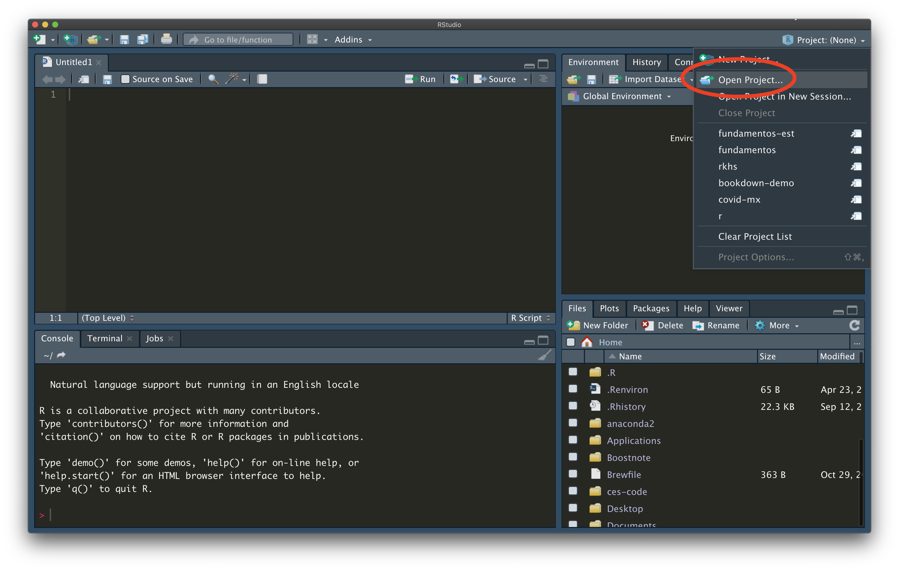

[](https://app.netlify.com/sites/fundamentos/deploys)


Notas del curso *Fundamentos de Estadística con Remuestreo* del programa de
maestría en Ciencia de Datos del ITAM sitio: https://fundamentos-est.netlify.app

---

## Instrucciones para generar las notas de manera local.

1. Asgurate de tener instalados tanto [`R`](https://cloud.r-project.org/) como
[`Rstudio`](https://rstudio.com/products/rstudio/download/) en tu máquina (en
este orden). Y también asegúrate de tener clonado el repositorio del curso en tu máquina.
```{bash}
git clone https://github.com/tereom/fundamentos.git
```

2. Inicia `Rstudio` e instala los siguientes paquetes de `R`.
```{r}
install.packages(renv)
install.packages(rmarkdown)
```

`renv` nos permitirá sincronizar la paquetería necesaria para correr las notas
de manera local. `rmarkdown` es el compilador de las notas.

3. Una vez instalados, reinicia `Rstudio` y abre el repositorio como un projecto.


4. Una vez que estés en el proyecto de las notas, sincroniza tú colección de librerías con las que utilizamos para generar el documento. Esto lo hacemos (la primera vez) con:  
```{r}
renv::init()
```  
dónde se te pedirá confirmación para descargar todos los paquetes en su versión
correcta.  
**Nota:** esto sólo lo tienes que hacer la primera vez. 
