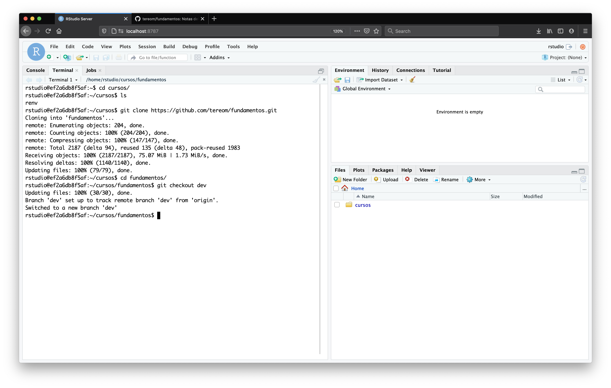
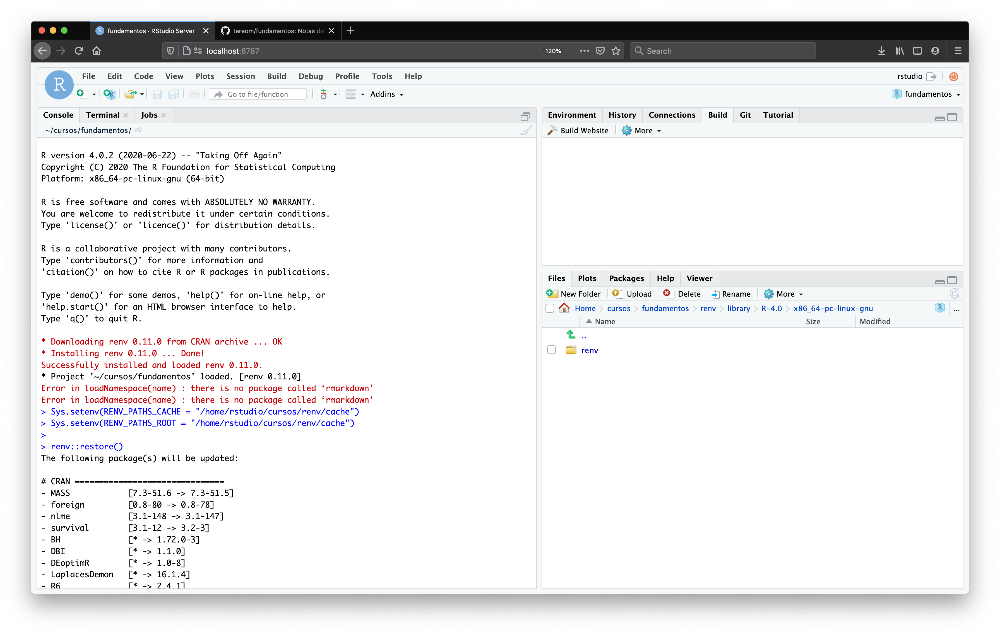

[](https://app.netlify.com/sites/fundamentos/deploys)


Notas del curso *Fundamentos de Estadística con Remuestreo* del programa de
maestría en Ciencia de Datos del ITAM sitio: https://fundamentos-est.netlify.app

---

# Instrucciones para generar las notas por medio de `Docker`.

Puedes generar las notas por medio de un contenedor de `Docker`. Para esto debes
de tener instalado el [`Docker Desktop`](https://docs.docker.com/desktop/) si tu
sistema operativo es `MacOS` o `Windows`; o alternativamente, [`Docker
Engine`](https://docs.docker.com/engine/), si estás corriendo alguna
distribución de `Linux`.

Con `Docker` listo en tu máquina necesitas descargar la imagen del contenedor
de la clase:
```{bash}
docker pull agarbuno/notas-fundamentos
```

Para ejecutar la imagen en tu computadora copia y pega lo siguiente en la
terminal, modificando como se sugiere mas adelante,
```{bash}
docker run -d -p 8787:8787 \
  -e PASSWORD=<escribeunacontraseña> \
  -m 4g \
  agarbuno/notas-fundamentos
```
En general se necesita correr la imagen con 4Gb de memoria (`-m 4g`).  La opción
`-d` es opcional, y sirve para dejar corriendo el contenedor en el *background*
de tu sesión de terminal. Cuidado con esta opción por que si no tienes cuidado
podrías estar levantando múltiples contenedores en tu máquina.

Esta imagen leventará una sesión de `Rstudio Server` a la cual podrás acceder en
tu navegador de internet de preferencia por medio de
```{bash}
localhost:8787/
```
el cual te pedirá un usuario y contraseña. La contraseña es la misma que deberás
de cambiar en las líneas de arriba: *<escribeunacontraseña>*. El usuario es, por
*default*,
`rstudio`.

Una vez en la pantalla de `Rstudio` puedes empezar con cargar las notas como un
proyecto.

**NOTA.** Esta imagen se actualizará constantemente. Pero nada garantizará que
esté en sincronía con la última versión de las notas en el repositorio. Para
garantizar la sincronía proponemos lo siguiente.

# Trabajar en las notas con: `Github` + `Docker` + `Volumes`.

El *problema* de `Docker` es que cualquier cambio que hagas dentro del
contenedor cuando esté corriendo no se guardará para la siguiente sesión. Por
ejemplo, crear un archivo, clonar o hacer un pull de un *repo*, etc. La ventaja
es que se puede ligar un directorio en la máquina *host* con un directorio
dentro del contenedor por medio de un `Volume`.Esto implica que podemos tener un
contenedor que sólo replique el ambiente del sistema operativo.

Siguiendo este tren de pensamiento, descarga el contenedor
```{bash}
docker pull agarbuno/env-fundamentos
```
y crea una carpeta de trabajo. Por ejemplo, crea el directorio (suponiendo que
estás en Ubuntu y tu usuario en tú máquina es `estudiante`) con `mkdir
/home/estudiante/itam/cursos/`. Este directorio lo usaremos para mantener el
repositorio y las librerías de `R` que necesitemos descargar.

Ahora, levanta el contenedor con las siguientes líneas en una terminal
```{bash}
# Directorio en el *contenedor* donde vivirá el cache de renv
RENV_PATHS_CACHE_CONTAINER=/home/rstudio/cursos/renv/cache
# Directorio en el *host* donde vivirá el cache de renv
RENV_PATHS_CACHE_HOST=/home/estudiante/itam/cursos/renv/cache
# Directorio donde guardas las notas de manera local
PATH_NOTAS_FUNDAMENTOS=/home/estudiante/itam/cursos/fundamentos

docker run -p 8787:8787 \
    -e PASSWORD=itam \
    -e "RENV_PATHS_CACHE=${RENV_PATHS_CACHE_CONTAINER}" \
    -e "RENV_PATHS_ROOT=${RENV_PATHS_CACHE_CONTAINER}" \
    -v "${RENV_PATHS_CACHE_HOST}:${RENV_PATHS_CACHE_CONTAINER}" \
    -m 4g \
    -v $PATH_NOTAS_FUNDAMENTOS:/home/rstudio/cursos \
    agarbuno/env-fundamentos
```

Ahora entra al servidor de `Rstudio` en `localhost:8787`. Dentro de la interfaz
gráfica, en particular la terminal de sistema, puedes clonar el repositorio de
la notas, y **cambiarte a la rama de desarrollo `dev`**. Ver imagen: 




Ahora tenemos que preparar el ambiente de `R`. Esto lo haremos de la siguiente forma. 
Abre el repo de las notas como un proyecto de `Rstudio`. Te saldrá un mensaje de alerta 
con respecto a `renv`. Ahora, prepararemos los *paths* para el ambiente del proyecto 
corriendo las líneas en la consola
```{r}
Sys.setenv(RENV_PATHS_CACHE = "/home/rstudio/cursos/renv/cache")
Sys.setenv(RENV_PATHS_ROOT = "/home/rstudio/cursos/renv/cache")
```
y ahora sincronizaremos el contenido del contenedor y volúmenes con la instrucción:
```{r}
renv::restore()
```


ahora te pedirá confirmación para reparar los paquetes que no encuentre. 

**Nota.** Definir las variables `RENV_PATHS_CACHE` y `RENV_PATHS_ROOT` 
sólo será necesario cuando quieras descargar nuevos paquetes que no tengas del 
`renv.lock` por ejemplo con los comandos `renv::restore()` o `renv::init()`.
Copiar y generar todas las librerías se tardara **bastante** ---alrededor de una
hora con una conexión simplona---. Pero la ventaja es que sólo lo tendrás que hacer una 
vez y con esto garantizarás que puedes hacer cambios y actualizaciones pequeñas conforme
se vayan actualizando las notas.

### Archivos de configuración

Los archivos de configuración de los contenedores los puedes encontrar en la
carpeta `dockerfiles` de estas notas o en la carpeta correspondiente
[aquí](https://github.com/agarbuno/dockerfiles).

# Instrucciones para generar las notas de manera local.

**Importante.** Si tienes una computadora `Mac` échale un ojo a la siguiente
sección antes de instalar `R`. Esto garantizará que tienes todas las dependencias
instaladas que necesita `R` en tu máquina.

1. Asegúrate de tener instalados tanto [`R`](https://cloud.r-project.org/) como
[`Rstudio`](https://rstudio.com/products/rstudio/download/) en tu máquina (en
este orden). Y también asegúrate de tener clonado el repositorio del curso en tu máquina.
```{bash}
git clone https://github.com/tereom/fundamentos.git
```

2. Inicia `Rstudio` e instala los siguientes paquetes de `R`.
```{r}
install.packages("renv")
install.packages("rmarkdown")
```

`renv` nos permitirá sincronizar la paquetería necesaria para correr las notas
de manera local. `rmarkdown` es el compilador de las notas.

3. Una vez instalados, reinicia `Rstudio` y abre el repositorio como un projecto.


4. Una vez que estés en el proyecto de las notas, sincroniza tú colección de librerías con las que utilizamos para generar el documento. Esto lo hacemos (la primera vez) con:
```{r}
renv::init()
```
dónde se te pedirá confirmación para descargar todos los paquetes en su versión
correcta.  

**Nota:** esto sólo lo tienes que hacer la primera vez.

# Consideraciones adicionales para `MacOS`.

De preferencia antes de instalar `R` considera las siguientes pasos. Esto es por
que en `MacOS` necesitamos compiladores de `fortran`, `c++`, etc., para algunas librerías.

1. Habilita las herramientas de línea de comandos de `xcode`:
```{bash}
xcode-select --install
```

2. Instala el manejador de paquetes `homebrew`:
```{bash}
/bin/bash -c "$(curl -fsSL https://raw.githubusercontent.com/Homebrew/install/master/install.sh)"
```

3. Con homebrew instalado, ahora instala la última versión disponible de la colección de compiladores GNU (al día 12-Sep-2020, ésta es la versión `10`):
```{bash}
brew install gcc
```

4. Instala [`XQuartz`](https://www.xquartz.org/).

5. Habilita la ruta donde `R` tiene que buscar los compiladores que instalaste en el paso 3. Primero prepara el archivo:
```{bash}
mkdir ~/.R/
touch ~/.R/Makevars
```
luego en algún editor de texto incluye las líneas en el archivo `Makevars`. Por ejemplo, escribe en terminal:
```{bash}
open ~/.R/Makevars
```
y una vez en el editor de texto escribe:
```{bash}
VER=-10
CC=gcc$(VER)
CXX=g++$(VER)
CXX11=g++$(VER)
CXX14=g++$(VER)
CXX17=g++$(VER)
CFLAGS=-mtune=native -g -O2 -Wall -pedantic -Wconversion
CXXFLAGS=-mtune=native -g -O2 -Wall -pedantic -Wconversion
FLIBS=-L/usr/local/Cellar/gcc/10.2.0/lib/gcc/10
```
y guarda el archivo.

Ahora si, regresa a la sección anterior e instala `R` y `Rstudio`.
